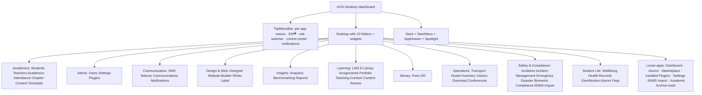
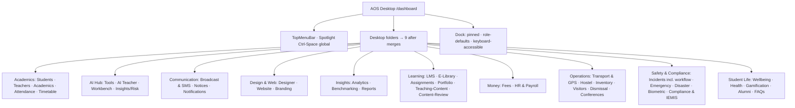
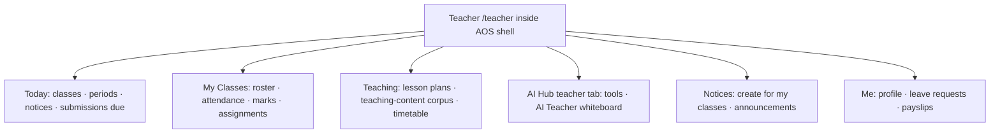
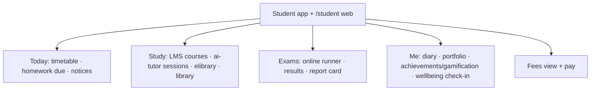
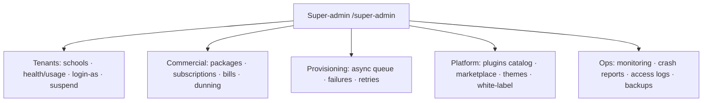

# ASchool Improvement Plan — Synthesis of the Deep UX 2026-09 Audit

**Date:** 2026-09-13
**Author:** audit orchestrator (this is the Step-3 synthesis, built by the orchestrator — not a subagent)
**Sources (all under `audits/deep-ux-2026-09/` unless noted):** the 8 competitor deep reports (`eduex-lms-v2.0.md` 2,003 L, `eschool-v3.3.6.md` 1,709 L, `eschool-saas-v1.8.0.md` 2,332 L, `infixedu-v9.4.0.md` 1,117 L, `infixedu-addon-modules.md` 2,045 L, `instikit-v5.5.0.md` 2,349 L, `mighty-school-pro-v1.6.md` 968 dense L, `schoolbustrack-v2.3.md` 902 L), the 4 own-codebase reports (`aschool-backend.md` 1,908 L, `aschool-frontend.md` 385 dense L, `aschool-mobile.md` 820 L, `aschool-supporting.md` 385 L), the 3 Step-2.5 matrices (`DUPLICATION_MATRIX.md`, `MOBILE_PARITY_GAP.md`, `UX_TASK_BENCHMARKS.md`), and the spine (`RECON_MAP.md`, `CORPUS_TRIAGE.md`).
**Evidence convention:** every recommendation cites a report (§/finding #), a matrix row, or a file:line. Nothing in this plan is inherited from the pre-2026-09-13 corpus without this pass's re-verification (the own-codebase reports label every prior finding still-true / fixed-since / worse-now; competitor reports carry prior-draft verification ledgers).

---

## Part 0 — How to read this plan

- **Parts 1-3** are the comparative evidence base: scores, ASchool's verified strengths, competitors' verified leads.
- **Part 4-5** are user-facing recommendations (IA, navigation, UI/UX), each with per-module spec blocks where a named competitor pattern is strictly better.
- **Part 6** is the engineering plan: every duplication-cluster and parity-gap row resolved, named-file bug fixes, plugin-system upgrades.
- **Part 7** is the roadmap: Quick wins (days) / Mid-term (weeks) / Structural, every item traceable to a finding.
- Severity convention borrowed from the backend report: **P0** = security/data-integrity or hard-down user path; **P1** = broken core flow; **P2** = correctness/major UX debt; **P3** = hygiene.

**The one-paragraph thesis:** ASchool enters this comparison with the strongest *platform* in the corpus — the only honest multi-tenant SaaS, a plugin entitlements/billing system beyond anything the eight competitors ship, the deepest Nepal-specific compliance, and an innovative OS-shell UI no competitor has attempted. Its debts are concentrated and fixable: four fresh P1 backend bugs, a fragmented AI/Incidents/Compliance product surface, a mobile fleet that trails its own backend by three waves, an operational moat that is "real at asset level, hollow at experience level" (textbooks not ingested, EMIS export unwired, zero buses live), and first-hour onboarding that dead-ends in an empty database. None of the eight competitors can fix their way to ASchool's ceiling without a rewrite; ASchool can fix its gaps in weeks.

---

## Part 1 — Comparison matrix (9 products × 7 dimensions)

Scores 1-10, calibrated across the corpus (10 = best observed in class anywhere, not absolute perfection). Every cell has a one-line evidence pointer. "n/a" = dimension not meaningfully applicable (single-purpose product / add-on pack).

| Product | Nav/IA clarity | UI/UX consistency | Feature completeness | Plugin/module arch | Backend code quality | Security posture | Multi-tenancy | Total /70 |
|---|---|---|---|---|---|---|---|---|
| **ASchool** | **7** | **7** | **8** | **9** | **7** | **6** | **8** | **52** |
| InfixEdu v9.4.0 | 8 | 6 | 9 | 6 | 5 | 2 | 2 | 38 |
| InstiKit v5.5.0 | 7 | 7 | 9 | 5 | 6 | 3 | 3 | 40 |
| eSchool SaaS v1.8.0 | 6 | 6 | 8 | 5 | 5 | 2 | 6 | 38 |
| Mighty School Pro v1.6 | 6 | 6 | 8 | 7 | 4 | 2 | 3 | 36 |
| eSchool v3.3.6 | 7 | 7 | 7 | 3 | 5 | 2 | 1 | 32 |
| EduEx LMS v2.0 | 6 | 6 | 5 | 3 | 5 | 3 | 1 | 29 |
| SchoolBusTrack v2.3 | 7 | 7 | 3 | 2 | 5 | 1 | 2 | 27 |
| InfixEdu addons | 5 | 5 | n/a | 3 | 3 | 1 | n/a | 17/60 |

### 1.1 Score justifications — ASchool

- **Nav/IA 7** — Desktop-folder + Spotlight + per-app-menu model solved the prior orphan-route problem (every installed module is a desktop/drawer app and every subroute resolves via the app menu, `aschool-frontend.md` §9.3); held back by non-addressable URLs, 4-6 separate AI entry points, the incidents duplicate pair, legacy aliases, and portals rendering outside the shell (§14 #1, #10).
- **UI/UX consistency 7** — one page standard genuinely adopted (DataTable ×82, EmptyState ×44, KpiCard/StatusChip/AOSPageHeader, §11); held back by 25 files on native confirm, mixed-language chrome, Mukta font CSP-blocked, portals with different chrome (§14 #6, #10, #11).
- **Feature completeness 8** — 42 plugins / 867 routes / 237 dashboard pages / five role apps is the broadest coherent surface in the corpus (`aschool-backend.md` §5); minus: LMS depth below EduEx (no sequential-lock curriculum), no general ledger (vs Mighty), no print-twin discipline (vs InfixEdu's 16 print families), thin super-admin console.
- **Plugin/module arch 9** — "entitlement/billing/config-schema/widget machinery is *ahead* of both InfixEdu's addon model and nwidart/Laravel modules (per-tenant gating, trials, plan tiers, server-absolute widgets, CI manifest validation)" (`aschool-backend.md` plugin-system verdict); minus 1 for the incident pair, elibrary pointer bug, manifest-less module, and the mount-at-boot-not-ship ceiling.
- **Backend code quality 7** — clean factory/tenancy/Celery architecture, 42/42 plugin flows traceable end-to-end, honesty discipline (501s, labeled fallbacks); minus for 333 unindexed FKs, dead contracts (notification_engine, emit_async, money.py), ~20 orphan endpoint groups, E7 loader catch (§11 #18-21).
- **Security 6** — best-in-corpus but not clean: hardened tenancy **held under live two-school probe battery** (§6.2) and webhook signatures verified at source (§6.7), but four fresh P1/P2 classes: path traversal in upload (§11 #1), quiz score client-trusted (#6), FAQ writes open to all (#5), Unsplash key leak (#11). Every competitor scores 1-3 here; ASchool's 6 is the corpus ceiling, not a clean bill.
- **Multi-tenancy 8** — per-query scoping with the school spine on the base model (§3.1, §6.1), live probes failed to break isolation; minus for the ai_teacher webhook cross-tenant gap (§11 #4) and super-admin/console thinness. The only honest 7+ tenancy in the corpus.

### 1.2 Score justifications — competitors

- **InfixEdu v9.4.0 — Nav 8:** DB-driven per-school reorderable menus with 4-way gating and a 1,248-row seed (58 staff groups/389 items) is the best menu system audited (`infixedu-v9.4.0.md` §10-1). **UX 6:** uniform ~70 bootstrap-table list screens but 2,838 Toastr errors behind comment-out-the-try/catch (§11-4). **Features 9:** fee engine with per-line due/fine/waiver + wallet; configurable exam engine (distributions, dual grades, weighted finals, merit); 16 print-artifact families; 9 locales + DB phrase editor (§10). **Plugin 6:** nwidart-style Modules + `modules_statuses.json`, but three parallel billing stacks and addon zips mutate host tables (§11-3; addons report §9). **Backend 5:** 245 models/1,297 routes but money bugs (wallet divided-not-added, client-trusted amounts) and duplicate/dead routes (§11). **Security 2:** universal default password `123456`, plaintext passwords in secret-login URLs, lockout commented out, unsigned addon zip upload, debug routes shipped (§11-1). **Tenancy 2:** single-tenant with a Saas settings bit and three billing stacks (§11-3).
- **InstiKit v5.5.0 — Nav 7:** 30-module permission-filtered menu, wizard-as-IA (§10). **UX 7:** uniform route/controller/service/policy architecture with designed states; English-only (§11). **Features 9:** 223 tables / 2,100+ endpoints / 699 controllers; 16-table fee engine, 79-template print pipeline, guest funnel (§10). **Plugin 5:** no addon marketplace; module toggling via config, ProgramType is label-only (§3). **Backend 6:** clean service layer, but seat caps never enforced, hostel allocation unvalidated, max+1 receipt races (§11). **Security 3:** guest-media delete IDOR (empty auth branch), TOCTOU on payment completion, `.reinstall` magic-password backdoor, plaintext passwords in payloads (§11). **Tenancy 3:** team-scoped but cross-team bulk reassignment and full-name+DOB guest lookup across all teams (§11).
- **eSchool SaaS v1.8.0 — Nav 6:** feature-id-driven app nav; padlocked-but-visible menus are good sales UX but the admin panel is 6 god-controllers ~12.5k LOC (§11). **UX 6:** complete surfaces, 273-screenshot docs, but Laravel 10/EOL and inconsistent states. **Features 8:** broader than its sibling (transport, payroll, expense, certificates, chat, per-tenant backup) (§10-4). **Plugin 5:** 21 sellable modules with ~350 guard call-sites — gating as sales UX — but scattered per-action checks (§10-2). **Backend 5:** async provisioning with retries, but global connection mutation is one forgotten `::on('mysql')` from cross-tenant reads (§2). **Security 2:** 14 unauthenticated Artisan routes incl. `/demo-tokens` printing bearer tokens; DROP DATABASE behind a trash icon; webhooks switch tenant DB before signature check (§11). **Tenancy 6:** real schema-level isolation (DB-per-tenant) — the only competitor with genuine isolation — implemented riskily.
- **Mighty School Pro v1.6 — Nav 6:** wizard-as-IA and permission-name=menu-key discipline (§10) vs two ~1,000-line god-files owning navigation (§11). **UX 6:** one app serves 6 platforms and 5 roles — but mobile tabs not permission-gated (teachers see admin tabs) and portals capped at 12-17 screens (§12). **Features 8:** first-class installments + FIFO allocation + GL + salary lifecycle + 15-dimension question bank (§10). **Plugin 7:** nwidart 19 modules, 456 API routes — the best modular API in the corpus — but cross-module IDORs on branch update/delete (§11). **Backend 4:** `system:reset` wipes the DB every minute (Kernel.php:30), fee-collection transaction commented out, payment hook broken three ways, SMS scheduler commented (§11). **Security 2:** hardcoded student OTP `1234` returned in the response; cross-tenant IDORs; trial bound to another tenant's role (§11). **Tenancy 3:** branches exist but `changeBranch` unvalidated and CheckSubscription is dead code — "SaaS enforcement ABSENT" (ledger).
- **eSchool v3.3.6 — Nav 7:** 9-tile bottom-sheet more-menu, 13 destinations on 4 tabs; docs-as-product (§10). **UX 7:** best online-exam runner in the corpus (palette/wakelock/away>5s auto-submit/LaTeX); uniform admin list architecture (§10). **Features 7:** complete school ERP + 2 Flutter apps (100 + 92 screen files) (§3). **Plugin 3:** no module system — license = domain-locked purchase code (§9). **Backend 5:** complete fee state machine (pending→webhook→receipt), server-driven ops governance — but publish deletes ExamResult rows, leave enum mismatch, dead routes (§11). **Security 2:** unauthenticated `/migrate` + friends; **exam answer key shipped to exam-takers**; Razorpay secret leaked to app clients; both apps disable TLS validation (§11). **Tenancy 1:** zero tenant columns anywhere — the clean single-tenant baseline (§3).
- **EduEx LMS v2.0 — Nav 6:** clean LMS funnel but dual role systems (users.role enum vs middleware) and raw i18n keys on production pages (§11). **UX 6:** designed empty states everywhere (best-in-corpus), but mock AI screens shipped and 2 sidebar-linked 500s (§11). **Features 5:** deep LMS (courses/quizzes/certificates/payments) but no school-ERP (attendance/fees/notices absent — `UX_TASK_BENCHMARKS.md` row set). **Plugin 3:** no module system. **Backend 5:** 642 routes live-booted and crawled; but sqlite installs break, subscription access never expires, locking not enforced on submits (§11). **Security 3:** unauthenticated path traversal serving `.env`/APP_KEY (W-1); payment-verify IDOR; pending instructors get full tokens (§11). **Tenancy 1:** none.
- **SchoolBusTrack v2.3 — Nav 7:** three-surface product with clear role separation (§7). **UX 7:** best-in-class driver operational UX (audio coaching, QR scan with throttle, drag-drop stop ordering) and guardian per-student radius matrix (§10). **Features 3:** transport only (by design). **Plugin 2:** none. **Backend 5:** excellent trip-lifecycle engine (planned_trips, ride_status 0-4, per-minute cron) (§10) but "security posture is the worst of the corpus": 8 unauthenticated payment captures, position-spoof broadcast, public channels (§11). **Tenancy 2:** global-only radii, one settings row for all schools.
- **InfixEdu addons — Nav 5 / UX 5:** add-on surfaces land inside the host's menus inconsistently (Jitsi forms reset dates; dead route names orphan Zoom meetings, `infixedu-addon-modules.md` §11). **Plugin 3:** "commercially works, technically fails every axis" — no dependency declarations, host-table mutation, licensing defeated by a one-line host stub (§9). **Backend 3:** Razorpay 100× ledger bug, no signature verification, `print_r($input); exit;` in the capture path (§4). **Security 1:** seeded vendor JWT keys, HTTP-driven .env writes, cross-tenant leaks, active phone-home telemetry (§11).

### 1.3 What the matrix says

1. ASchool leads the corpus by 12 points (52 vs 40 for the runner-up InstiKit) and is the only product ≥6 on security and tenancy — the two dimensions where every competitor fails catastrophically.
2. ASchool's weakest relative dimension is **Nav/IA (7)**, where InfixEdu's DB-driven menus (8) still beat it — that gap is closable in days (Part 4).
3. Feature completeness is effectively a three-way tie at the top (ASchool 8, InfixEdu 9, InstiKit 9, Mighty 8) — but ASchool's 8 is the only one of the four that is *honestly multi-tenant and mobile-complete-ish*; the competitors' 8-9s ship with 1-3 security scores.
4. No competitor dominates ASchool on more than two dimensions simultaneously, and every competitor's leads are pattern-level (stealable), not architecture-level (except Mighty's one-app proof — analyzed and rejected in Part 3.6).

---

## Part 2 — Where ASchool is already ahead (verified; do not undo these)

Each strength below was re-verified at source this pass — these are the three candidate pillars named in the audit brief plus five more the evidence surfaced. The plan in Parts 4-7 must be executed **without regressing any of them.**

### 2.1 Plugin entitlements / billing / config-schema — the best module economy in the corpus

**Verdict (aschool-backend.md plugin-system verdict):** "the entitlement/billing/config-schema/widget machinery is *ahead* of both InfixEdu's addon model and nwidart/Laravel modules (per-tenant gating, trials, plan tiers, server-absolute widgets, CI manifest validation)."

The comparison at source:
- InfixEdu's paid addons have **no dependency declaration, mutate host tables inside silent catches, ship three inconsistent manifest shapes, and their licensing is defeated by a one-line host stub** (`infixedu-addon-modules.md` §9). ASchool's manifests are CI-validated with pointer checks that killed the "fictional service declarations" rot class (`aschool-backend.md` §4.0).
- Mighty's nwidart modules are well-organized but **cannot be sold**: CheckSubscription is dead code, so "SaaS enforcement is ABSENT" (`mighty-school-pro-v1.6.md` ledger). ASchool gates 606 of 867 routes per-tenant with plan tiers and trials (§5).
- eSchool SaaS has the best *commercial layer* (see 3.1) but gating is ~350 scattered per-action controller checks (`eschool-saas-v1.8.0.md` §10-2); ASchool's is declarative and consistent.

**Do not undo:** the per-tenant gate + trial + tier model, the config-schema system, widget server-absoluteness, manifest CI validation. **Do close:** the incidents naming/pricing collision, the elibrary blueprint pointer, the manifest-less ai_adaptive_learning module, and the ship-vs-gate ceiling (Part 6.4).

### 2.2 The AI teaching toolkit — backend depth exists (the gap is surfacing, not capability)

Verified this pass: the ai_teacher plugin has a real live-whiteboard flow with lesson lifecycle, content-spine integration and webhooks; `ai_tutor.py` has full **session endpoints** (plans/sessions/turn/close/messages/monitor, `ai_tutor.py:18-187`); 23+ S12-era teacher tools exist as real pages; weekly AI insights run on a beat schedule (`aschool-backend.md` §4, §7). Competitors: EduEx ships *mock* AI screens (`eduex-lms-v2.0.md` §11), Mighty has none, eSchool none. **The honest caveat:** the pillar's surfaces are fragmented (DUPLICATION_MATRIX §3), its mobile face is 4 generate-tools, the student tutor is stateless single-shot, and `ai_capture` has no client at all. The recommendation set (Part 4.3, Part 6) is therefore *consolidate and surface*, never *rebuild*.

### 2.3 Nepal compliance depth — the moat is real at asset level

Verified: IEMIS importer matches government formats header-exact (16/16 and 22/22 columns diffed, 308/308 rows live dry-run validated); EMIS fields incl. caste/mother-tongue/disability live on the Student model and in the report builder (`aschool-supporting.md` §3, `aschool-backend.md` §4 #12); NEB grading is a first-class reference surface in Exams (`aschool-frontend.md` §4 #9); BS/AD dual dates everywhere; a working Preeti→Unicode transcoder; 320 real CDC textbook PDFs cataloged G1-12; an NPR 2,900/bus ESP32 BOM. **No competitor has any of this** — InfixEdu ships Khalti code gated behind an absent addon with "zero Nepal localization at runtime" (`infixedu-v9.4.0.md` §11-5); InstiKit defaults to Asia/Kolkata with no BS calendar; Mighty/eSchool/EduEx: nothing. **The honest caveat:** "real at asset level, hollow at experience level — each system is blocked on operations, not engineering" (`aschool-supporting.md` moat verdict): zero books ingested, EMIS export task has no caller, zero buses live, 308 rows of student PII sit in XLSX files in the repo. Part 6.7 turns assets into experiences.

### 2.4 Fee engine and exam integrity — financially and academically safer than every rival

- Fees: invoices, installments, carry-forward, AR aging, fines/waivers, offline-slip approvals, day closure, receipt config, **idempotency + till-lock** (`aschool-backend.md` §10-2). Compare: Mighty's fee-collection **DB transaction is commented out** (`mighty-school-pro-v1.6.md` §11); InfixEdu's Razorpay addon has a 100× ledger bug and no signature verification (`infixedu-addon-modules.md` §4); InstiKit has a TOCTOU race on payment completion and max+1 receipt races.
- Exams: S-A2 online-attempt lifecycle with **answer-key stripping** — vs eSchool shipping the answer key to exam-takers (`eschool-v3.3.6.md` §11) — plus persisted server-side scoring, NEB auto-grading, marks components, tabulation/merit (`aschool-backend.md` §10-3).

### 2.5 Honest multi-tenancy that survives live attack

Per-query scoping on the tenancy spine; a live two-school probe battery (created a second school, probed cross-reads, soft-deleted it) **failed to break isolation** (`aschool-backend.md` §6.2). Every competitor either has no tenancy (eSchool: zero tenant columns), a risky implementation (eSchool SaaS: global connection mutation; webhooks switch DB before signature check), or broken enforcement (Mighty: CheckSubscription dead; branch IDORs).

### 2.6 The AOS shell — an innovation no competitor has, now with a keep verdict

Live-timed: warm dock-click→content 1.57 s, Spotlight Enter→content 0.49 s, per-window Back, snap layouts, live entity search, server-persisted preferences (`aschool-frontend.md` §5). The verdict is **KEEP, WITH FIXES** (addressable URLs, prefetch, keyboard a11y — Part 5). No competitor attempted anything similar; the closest is Mighty's one-app adaptive nav, which is conventional.

### 2.7 Module-page standardization

DataTable ×82 / EmptyState ×44 / KpiCard / StatusChip / AOSPageHeader anatomy genuinely adopted across the 60 modules (§11) — more consistent than eSchool's bootstrap-table monoculture (which is consistent but 2015-grade) and far more than Mighty's hardcoded dashboards.

### 2.8 Honesty discipline

501s for unbuilt surfaces, labeled fallbacks, real outcomes; the PluginGate bilingual not-installed card with Install CTA is "the standard, well-designed gate" (§4 #21). Compare: Mighty's admin dashboard fees/library KPIs are **hardcoded fake numbers** and its report-card PDF ships grey placeholder boxes; EduEx ships mock AI screens; ASchool's own remaining honesty debt (landing-page fabricated stats, frontend §14 #11) is listed in Part 5.

---

## Part 3 — Where competitors are ahead (named examples, with citations)

Concrete, stealable leads. Each names the exact screen/flow and the report that documents it. None requires abandoning an ASchool architecture decision except where noted.

### 3.1 eSchool SaaS v1.8.0 — the billing ontology ASchool lacks

**The lead:** Package (prepaid quota+price / postpaid per-head-day proration) → Subscription **snapshot-on-create** → Bill (due date + grace) → Addons → quota → **cron dunning that deactivates overdue schools** — a compact, production-proven commercial model (`eschool-saas-v1.8.0.md` §10-1, Appendix AP 14-item action matrix). ASchool's entitlements gate features but have **no subscription/bill/dunning lifecycle** — the one structural gap in the plugin economy (2.1). **Steal the ontology, not the architecture** (its header-swapped connections and phone-number passwords are the never-ship checklist).
**Also steal:** padlocked-but-visible menus with upgrade CTA (feature gating as sales UX — ASchool's PluginGate already renders not-installed; extend it to render *locked-but-upgradeable* with price); async tenant provisioning with retries + self-serve trial funnel (2/3/7 fields to a provisioned tenant — `UX_TASK_BENCHMARKS.md` supplementary row).

### 3.2 eSchool v3.3.6 — the online-exam runner UX and docs-as-product

**The lead:** exam runner with question palette, wakelock, away>5 s auto-submit, LaTeX, multi-answer (`examOnlineScreen.dart:49-104`, §10-1) — still the best take-a-test UX audited; ASchool's S-A2 runner has the integrity but not the palette/wakelock polish. **Also steal:** docs-as-product (Docusaurus, 106 screenshots, changelog that matches code — §10-7) and per-release upgrade discipline (31 zips, tree byte-equal to release — §10-8).

### 3.3 InfixEdu v9.4.0 — print-twin discipline, DB-driven menus, configurable exams

**The lead:** every list screen has a print twin — 16 print-artifact families (§10-3). ASchool has **zero** per-window print CSS; Nepali schools print everything (fee receipts, registers, report cards, character certificates). **Also steal:** DB-driven reorderable per-school menus (§10-4) — the one Nav dimension where InfixEdu scores 8 vs ASchool's 7; the 3-step import UX (§10-1); the per-event notification matrix is already in ASchool (A-02) — keep.

### 3.4 InstiKit v5.5.0 — guest admission funnel and counter controls

**The lead:** OTP-verified **online registration + fee payment with no accounts needed** (§10-1) — ASchool's public `/admission` currently shows the contact form (`aschool-frontend.md` §8.4). InstiKit's funnel is 5 screens / ~20 fields guest-side (benchmarks row 5). **Also steal:** counter-grade controls — day-closure locks cashiers out of same-day payments, denominations matrix, day book (§10-2; ASchool has day closure but not denominations/day-book); generic multi-level approval + edit-request engines (§10-2); document-number series as config (§10-2); notice class+parent targeting — the only product that does the canonical task's semantics (benchmarks row 3).

### 3.5 EduEx LMS v2.0 — sequential-lock curriculum and designed empty states

**The lead:** curriculum sidebar with **server-authoritative `is_accessible` flags** — "the single best learning-UX idea to steal" (`eduex-lms-v2.0.md` §10-2). ASchool's LMS plugin has no sequential locking at all. **Also steal:** certificates with **public verification URLs** (§10-3) — ASchool's 8-certificate suite has no public verify; designed empty states on every list screen (§10-5) — ASchool's EmptyState ×44 is close but the *dependency-chain* variant ("create a class first →") is missing (Part 5).

### 3.6 Mighty School Pro v1.6 — the general ledger, and the one-app question answered

**The lead:** real chart-of-accounts + 11 statement endpoints (§10) — **ASchool has no GL**; its money model is fee-ledger-centric. For a school ERP pitching accountants, double-entry statements are a real capability gap (mid-term build or integrate). **Also steal:** salary advance/due/return lifecycle (§10); 15-dimension question-bank taxonomy feeding a rich quiz runtime (§10).
**The one-app-vs-five-apps question, resolved with evidence:** Mighty proves one codebase can ship 5 roles × 6 platforms (role from `/user` → 3 nav sets; desktop sidebar vs mobile CircleNavBar) — but the costs are structural: two ~1,000-line god-files own navigation, mobile tabs are **not permission-gated (teachers get admin tabs)**, student reuses the parent's fees screen, portals capped at 12-17 screens, no per-role UX identity (§12). ASchool's mobile audit reached the mirror verdict: keep the 5-app + shared split, consolidate to **2 shipping apps** (unified `flutter_user` + `flutter_admin`) after push config/deep-links/web-override conflicts are fixed — the hedge already exists (`aschool-mobile.md` §9.4). **Decision: do not consolidate to one app; steal only (a) the central API client/interceptor pattern, (b) permission-name=menu-key data-driven gating, (c) role-conditional widgets for overlapping portal screens.**

### 3.7 SchoolBusTrack v2.3 — driver UX patterns for ASchool's transport stack

ASchool's S-A4 transport is architecturally ahead (4-layer trip model, dual GPS ingest, geofence engine, notification prefs — confirmed by SBT's own ledger: "the old draft's ASchool gap list is now historical"). What SBT still does better (`schoolbustrack-v2.3.md` §12 steal list): **driver audio-coaching banner state machine** (5 s replay throttle); per-student radius picker dialog; call-driver FAB + missing-number toast; three-way trip empty states; printable QR student card; **server geofence-vs-stop check on pickup** (ASchool's `board_student` lacks it); seat-availability gate at stop choice; bulk "students did not show up" affordance.

### 3.8 InfixEdu addons — packaging ideas despite the failure

From the case study (`infixedu-addon-modules.md` §9 steal list): `{Module}.json`'s **ordered migration map** → adopt as `migrations:` + `data_retention:` manifest keys under `owns_tables` rules; `time_start_before` **early-join window** + derived status for live classes (backing the lms manifest's Recordings tabs); conflict detection + per-school quota for live classes (fixing their start-point-only/global bugs); parent-account provisioning onto the existing `admission.accepted` listener; **guarded zip sideload through `validator.py`** as a future distribution channel.

---

## Part 4 — Navigation & information-architecture recommendations

### 4.1 The two trees — current vs recommended (school-admin)

**ASchool's current school-admin tree** (as live-verified, `aschool-frontend.md` §5.1, §9.1-9.2 — desktop with 10 section folders + loose apps; every installed module also in drawer/spotlight):



**Recommended school-admin tree** (consolidations from DUPLICATION_MATRIX; AI Hub from §3 of that matrix; compliance merge §4; SMS merge §7; Alumni de-duplicated from loose apps; trash built-or-deleted; super-admin gets its own tree in 4.6):



Changes: **−3 top-level entries** (Incident-Management folds into Incidents; SMS folds into Communications as Broadcast; IEMIS-Import folds into Compliance; loose IEMIS + Alumni duplicates removed), **AI gains a first-class folder** (4→1 entry points), Compliance gains the import. Nothing is deleted — every merged surface is a tab/section inside its parent.

### 4.2 IA moves (what moves where / misplaced / missing entry points / duplicated)

| Move | From → To | Why (evidence) |
|---|---|---|
| `incident-management` (4 pages) | → tab inside `incidents` ("Workflow & Escalation") | DUPLICATION_MATRIX §1: name collision, pricing inversion, both apps visible in Safety folder |
| `sms` (1 page) | → "Broadcast & SMS" tab inside `communications` | DUPLICATION_MATRIX §7: SMS page already federates communications quick-links |
| `iemis-import` + `bulk-uploads/iemis` | → single "Import" tab inside `compliance` ("Compliance & IEMIS") | DUPLICATION_MATRIX §4: same import reachable from 3 places |
| `ai-tools` + `ai-teacher` + `ai-workbench` | → one **AI Hub** app, 4 tabs (Tools/Teacher/Workbench/Insights) | DUPLICATION_MATRIX §3: one install, four product names; keep deep routes as tabs |
| `benchmarking` | → tab inside `analytics` ("Compare") | 1-page module; analytics is its natural parent (frontend §4 #19 links them already) |
| `bulk-uploads` (non-IEMIS parts) | → stays, minus the iemis page | after the compliance merge |
| Alumni loose app | → remove (folder entry already exists) | duplicate entry, frontend §5.1 |
| Dock "Academic Archive" trash | → build a real archive (recently-deleted students/notices with restore) or delete the icon | fake `alert()` stub — frontend §14 #9 |
| Teacher portal `ai-tools` | → real teacher-tailored page inside the shell (not a 1-line re-export of the admin page) | frontend §3.3 |
| `faqs` | → fold into public-site settings (it is public-site content) | mobile report §5.2 "public FAQ could be in-app help"; admin-only FAQ CRUD is back-office site editing |

**Missing entry points to create:** Hostel (web exists; nothing on mobile — MOBILE_PARITY_GAP #1), Teaching-content for teachers on mobile (#3), Global search on mobile (#4), MFA enablement in Settings (TOTP built, zero UI — backend §11 #17), EMIS export inside Compliance (task built, no caller — supporting §3).

### 4.3 Per-module spec blocks — ideal vs current vs gap

Format: **Ideal** = the strongest pattern seen across the 8 competitors, cited. **Current** = ASchool today, cited. **Gap** = the delta to close.

**1. Notices** — *benchmark-critical (row 3 of UX_TASK_BENCHMARKS).*
- Ideal: InstiKit — audience = class/section multi-select **plus** guardians, with per-channel preview; 1 screen / 3 clicks / 4 fields.
- Current: title + content + pin; audience hardcoded to 4 roles (`notices/page.tsx:309`); create→list 1,958 ms live.
- Gap: add class/section multi-select + "also notify parents" toggle; route through the existing notification matrix (A-02) for channel fan-out. Days.

**2. Incidents (+workflow)** — *duplication-critical.*
- Ideal: one product surface with tiered capability: base CRUD screen with an "Escalation" tab that appears when the workflow capability is entitled (pattern: eSchool SaaS's padlocked-but-visible upgrade CTA).
- Current: two plugins ("Incident Management" premium 299 vs "Full Incident Management" growth 199), two desktop apps, 4+1 dashboard pages, mobile covers only the base slug.
- Gap: merge per DUPLICATION_MATRIX §1; keep the clean two-layer routes (`/incidents` CRUD + `/incidents/management/*` workflow) under one manifest and one card.

**3. Library (physical)** —
- Ideal: InfixEdu's library module with issue/return/fine/print-register twins; InstiKit's document-number series for accession.
- Current: strong v2 backend (34 routes: copies/racks/reservations/fines/stocktake/vendors/POs) + 10-page web suite; mobile uses 3 of 34 routes.
- Gap: web is close; add per-window print twins (fee receipts, issue register); mobile scan/holds (parity table §3).

**4. E-Library (digital)** —
- Ideal: EduEx's sequential-lock reader with progress + is_accessible flags (for course-like reading paths).
- Current: books/papers/resources CRUD (6 routes) + 3 web pages + student/parent screens; ingest of the CDC corpus is 0 books.
- Gap: **operationalize the corpus** (Part 6.7) — the product surface exists, the content pipeline is the blocker; then consider reading-progress locking.

**5. AI Hub (tools + teacher + workbench + insights)** — *duplication-critical.*
- Ideal: MagicSchool's tool-card deep-link-with-prefill pattern (named in frontend §15 steal list) over one hub; EduEx's real Gemini integration shows AI features must be real not mock (its mock screens are a cautionary tale).
- Current: 4-6 entry points (hub catalog of 20+ tools, AI Teacher 359 L, Workbench 396 L, analytics/benchmarking adjacent); backend consolidated under ai_suite gating; ai_adaptive_learning manifest-less; teacher portal gets a 1-line re-export; student tutor stateless.
- Gap: hub consolidation (frontend, 3-5 days); manifest fix (backend, hours); tutor session wiring (mobile, mid-term); at-risk list surfacing (admin mobile).

**6. Compliance & IEMIS** — *duplication-critical + broken core.*
- Ideal: eSchool SaaS's provisioning observability (failed jobs visible) applied to imports; InstiKit's document-number-series for EMIS export batches.
- Current: import works (308/308 validated) but is reachable from 3 places; the **paid compliance plugin is hollow** — page renders a field contract the API never returns, `export_emis_data` has no caller; XLSX templates with 308 PII rows are repo-orphaned.
- Gap: fix page contract + wire export caller (1-2 days); single Import tab; purge PII files (immediate); add export history list.

**7. Broadcast & SMS (communications)** —
- Ideal: eSchool SaaS per-tenant gateway keys (schools keep their own money); InstiKit's 10-gateway breadth.
- Current: Sparrow SMS integration, templates, broadcast, diary/gallery/sliders family; SMS page federates communications links; whatsapp bulk unpersisted (P2).
- Gap: merge SMS page as a tab; fix whatsapp persistence (backend §11 #10); consider per-school gateway keys for scale.

**8. Website (builder + public site)** —
- Ideal: InstiKit's online-admission funnel on the public site; EduEx's public certificate verification.
- Current: builder is "most launch-ready" surface (autosave/publish/revert/history live); public site renders 14 sections 200-OK but shows literal "null, Kathmandu", and `/admission` is a contact form.
- Gap: null guards (hours); replace contact-form admission with a real OTP-verified application funnel feeding the existing `admission` plugin (weeks — InstiKit pattern); add public certificate verification (EduEx pattern, days on top of the 8-certificate suite).

**9. Transport & GPS** —
- Ideal: SBT's driver coaching banner + per-student radius picker + call-driver FAB + QR student cards + server geofence-vs-stop pickup check.
- Current: 4-layer trip model, dual ingest (app + ESP32), geofence engine, notification prefs, driver MVP in flutter_user — architecturally ahead; live gaps: parent-mobile push, real ETA, pickup geofence, driver coaching UX (SBT ledger).
- Gap: the five SBT steal items above; fix the Haversine typo and push-role enum first (backend P1/P2 #3, #14).

**10. Students / enrollment** — *benchmark-critical (row 5).*
- Ideal: eSchool's 1-screen enrollment at ~15 required fields; InstiKit's 6-field core + ~14-field approve modal + online guest funnel.
- Current: bilingual form with BS picker and auto enrollment number is excellent; **blocked by empty class picker with no guidance** (frontend §14 #4).
- Gap: dependency-chain empty states ("Create a class first →" deep link) and a first-run setup wizard (Part 5); keep field count as-is (it is justified by IEMIS fields).

**11. Attendance** — *benchmark-critical (row 1).*
- Ideal: eSchool 1/3/2 efficiency; InstiKit's Le(ave) 5th state handling.
- Current: best interaction design in corpus (explicit-unmarked gate, P/A/L/E keyboard, All-Absent confirm) but unmeasurable in empty DB.
- Gap: seed demo data (Part 6.6); add per-window print register (InfixEdu print-twin).

**12. Exams** — *benchmark-critical (row 6).*
- Ideal: eSchool's runner polish (palette/wakelock/auto-submit) on top of ASchool's existing S-A2 integrity; InfixEdu's configurable mark-distribution UI.
- Current: 1-dialog creation (1.5 s live — corpus-best efficiency), NEB reference card, marks grid with Excel paste; online runner has integrity but not palette/wakelock.
- Gap: runner polish (palette + wakelock + auto-submit — eSchool pattern, days); tabulation/merit print twins.

**13. Fees** — *benchmark-critical (row 2).*
- Ideal: InfixEdu's per-line due/fine/waiver + wallet; InstiKit's denominations matrix + day book; Mighty's FIFO partial allocation.
- Current: POS workspace + S-A1 suite (invoices/installments/aging/carry-forward/day-closure/idempotency) — already the safest money path in the corpus.
- Gap: denominations matrix + day book print (InstiKit pattern); consider GL integration (Mighty pattern — structural, Part 7).

**14. Hostel** — *parity-critical (#1 gap).*
- Ideal: InfixEdu/InstiKit hostel modules with room-type pricing and allocation validation (InstiKit's is unvalidated — do better).
- Current: 12 backend rules, 365-line web page, **zero mobile**.
- Gap: parent "child's room/warden" + admin occupancy screens (mobile-first — the user is at the school gate, not a desk); add allocation overlap validation while building.

**15. Teaching-content (teacher content library)** — *parity-critical (#3 gap).*
- Ideal: Mighty's question-bank taxonomy as the content-organization model.
- Current: backend corpus pipeline + 354-line web page; **invisible to teachers on mobile; zero books ingested**.
- Gap: run the Grade-10 pilot ingest (supporting report recommendation #1), then surface the corpus in the teacher app.

**16. Designer / Writer** —
- Ideal: Canva/Word parity is the bar ASchool set itself; competitor corpus has no equivalent (InstiKit's LayoutCert is print-only).
- Current: Designer strong (33 Nepal templates, 9-panel editor) with a live LayersPanel duplicate-key bug and no Devanagari fonts in the picker; Writer most-polished surface with a stub View tab.
- Gap: fix `LayersPanel.tsx:69` keys; add Mukta/Preeti to both font pickers; implement or remove Writer's View tab; keep the shared template registry.

**17. Profile & Settings** —
- Ideal: eSchool SaaS's wizard-as-first-run (settings walkthrough on provisioning).
- Current: AOS SettingsApp embeds 8 settings areas; roles page is a real rewrite; MFA built but unreachable.
- Gap: MFA enablement UI (backend §11 #17); first-run setup wizard (Part 5).

**18. Super-admin console** —
- Ideal: eSchool SaaS's landlord panel (tenants, packages, subscriptions, dunning, provisioning observability).
- Current: **a single overview page** (frontend §3.3) — the thinnest ASchool surface vs its own ambitions.
- Gap: tenant list with plan/usage/health, provisioning log, subscription lifecycle (with 3.1's billing ontology). Structural.

**19. Marketplace / Plugins (AOS Store)** —
- Ideal: InfixEdu addons' `{Module}.json` ordered migration map + changelog/support metadata (adapted, not copied); eSchool SaaS's 21 sellable modules with upgrade CTAs.
- Current: unified Store app (Installed 39 / categories / school licensing) — already ahead; only 4/41 manifests carry versions; no changelog/screenshots in catalog payload.
- Gap: version discipline + catalog metadata (Part 6.4).

### 4.4 Recommended trees per remaining role

**Teacher (web portal + app unified in the shell):**



Today: teacher portal is 7 routes of which marks/assignments/attendance are 1-line re-exports of admin pages inside a different chrome (frontend §3.3) — the fix is *embed portals in the shell* + tailor pages, not new routes.

**Parent:**

```mermaid
flowchart TD
    P[Parent app + /parent web] --> CHILD[Child switcher if >1]
    P --> TODAY[Today: attendance · bus ETA · notices · fees due]
    P --> MONEY[Fees: invoices · pay (eSewa/Khalti) · receipts]
    P --> LEARN[Learning: homework · results · LMS · portfolio]
    P --> BUS[Bus tracker: live map · radius alerts · call driver]
    P --> HEALTH[Health · wellbeing · PT conferences booking]
    P --> COMMS[Chat · notices]
```

Gaps feeding this tree: real ETA + parent-mobile push (SBT ledger), conference booking already exists (447 L — keep).

**Student:**



Gaps feeding this tree: wire ai_tutor session endpoints (stateless today), sequential-lock curriculum in LMS (EduEx pattern), results/report-card parity with web.

**Super-admin (platform landlord):**



Today this is one overview page (frontend §3.3). This tree is the product shape of the billing ontology steal (3.1) — it is also where Mighty's and eSchool SaaS's commercial layers beat ASchool despite worse platforms.

---

## Part 5 — UI/UX recommendations

Ordered by user impact; each cites the finding it fixes.

### 5.1 P0 — addressable URLs and deep links (fix the shell's #1 defect)

Deep links currently collapse to `/dashboard` (frontend §14 #1): bookmarks, refresh-on-module, browser Back/Forward, and share-links all break — the highest-impact shell defect. Fix pattern: make `aos-window-route.tsx` own a real URL per window (`/dashboard/<module>/<subroute>?window=<id>`), with the WindowManager hydrating open windows from the URL on load. This single fix moves Nav/IA from 7 toward 8+ and unlocks shareable module links for support workflows. (Days.)

### 5.2 P0 — first-hour onboarding: setup wizard + dependency-chain empty states

Empty-setup dead ends: students/new submit disabled with a blank class picker; attendance/fees/report-cards all say "choose a class" without telling users classes must exist first (frontend §14 #4) — 4 of 6 canonical benchmark tasks were BLOCKED by exactly this (UX_TASK_BENCHMARKS cross-read #1). Fix: (a) empty-state dependency chains — every "choose a class" state links "Create your first class →" directly into the academics wizard; (b) a first-run setup wizard (academic year → classes → sections → subjects → fee structure → invite teachers), modeled on eSchool SaaS's wizard-as-first-run and InstiKit's setup wizard; (c) **ship a seeded demo tenant** so the sales demo and new-tenant first hour both work (this alone flips ASchool from BLOCKED to measured on all six benchmark tasks).

### 5.3 P1 — latency: prefetch pinned modules

1.57 s warm / up to 4.5 s cold per first module open; six spinners on a fresh session (§14 #2). Fix: prefetch pinned dock apps after shell boot (next/dynamic preload), persist module chunks across sessions. (Days.)

### 5.4 P1 — keyboard/aria accessibility for the shell

Dock and desktop icons are `div onClick` with zero role/tabIndex/aria — keyboard users can only use Spotlight (§14 #3; backend-of-record: 0 a11y matches on mobile too, mobile report §12). Fix: role=button + tabIndex + aria-label + Enter/Space on dock/desktop/folder items; visible focus rings; adopt Linear-style ⌘K-first navigation positioning (Spotlight already exists — make it the advertised primary path).

### 5.5 P1 — form validation and error-state consistency

Replace the remaining 25 native `confirm()` call sites (§11) with the ConfirmDialog pattern already adopted on daily-flow screens; enforce one toast/error grammar (sonner-based) across all modules; debounce the students search. Validation states are strong where pages were rebuilt (students/new disables submit with clear rule) — extend the same zod-grammar to the long tail (§11).

### 5.6 P1 — the Mukta font CSP fix (one line)

`font-src 'self' data: https://fonts.gstatic.com` excludes the Google Fonts CSS origin — Devanagari UI renders in fallback on **every page** of dashboard and public site (§14 #6, live console error). Add the CSS origin to CSP; then add Mukta + Preeti to Designer/Writer font pickers (§14 #11). (Hours.)

### 5.7 P2 — portals inside the shell (kill the two-chrome problem)

`/teacher`, `/parent`, `/student` render a plain header layout while `/dashboard` is the OS; teacher/marks shows the full admin page inside a plain teacher frame (§14 #10). Fix: portals adopt the AOS kit inside the shell with role-tailored start pages (trees in 4.4); one chrome to maintain.

### 5.8 P2 — print twins everywhere (the InfixEdu discipline)

ASchool has zero per-window print CSS vs InfixEdu's 16 print-artifact families (3.3). Nepali schools print: fee receipts, attendance registers, tabulation sheets, report cards, character certificates, visitor badges. Fix: a `PrintButton` in the AOSPageHeader standard + per-module print CSS; the certificates suite and receipt PDFs already exist — wire the rest. (Weeks, incremental.)

### 5.9 P2 — public-site trust fixes

Literal "null, Kathmandu" in topbar/footer; "Established: –"; `/admission` is a contact form (§14 #8). Fix null guards (hours); build the OTP-verified online application funnel feeding the existing admission plugin (InstiKit pattern, weeks); add public certificate verification URLs (EduEx pattern, days). Also fix the landing page's fabricated stats (§14 #11) — replace with real platform numbers; honesty is a brand asset ASchool already owns server-side.

### 5.10 P2 — Designer/Writer polish

Fix the LayersPanel duplicate-key bug (`LayersPanel.tsx:69`, 28 React errors on the ID-card template); implement or remove the Writer View tab (currently a Review duplicate); unify the template-registry picker UIs. (Days.)

### 5.11 Per-role tailoring summary

- **School admin:** the desktop tree (4.1-4.2) + setup wizard + print twins.
- **Teacher:** in-shell portal, tailored AI tab, content corpus on mobile, leave-approval actions on mobile.
- **Parent:** bus ETA/push (SBT patterns), fee receipts PDF (exists), conference booking (exists), hostel room view (new).
- **Student:** tutor sessions (wire the built endpoints), sequential-lock LMS, exam runner polish.
- **Super-admin:** the 4.4 console tree + billing lifecycle.

---

## Part 6 — Backend / plugin-architecture recommendations

### 6.1 Immediate security & correctness fixes (named files, from aschool-backend.md §11)

| # | Sev | Fix | File |
|---|---|---|---|
| 1 | **P1** | Sanitize `folder` form field (reject `..`, resolve within upload root, reject absolute) — live-confirmed traversal wrote outside upload root | `app/api/v1/files.py:208,216` + `app/utils/file_upload.py:128` |
| 2 | **P1** | Fix the dead import (ReportCard from wrong module) making `GET /benchmarking/rankings` 500 for every consumer | `app/api/v1/benchmarking.py:90` |
| 3 | **P1** | Fix `dlon = radians(lon2 - lat1)` → `lon2 - lon1` in the child-safety geofence | `app/tasks/gps_processing.py:178` |
| 4 | **P1** | ai_teacher webhook: bind API key↔lesson school; add (lesson_id, event_id) uniqueness for replay | `app/plugins/modules/ai_teacher/routes.py:643-647`, `models/ai_teacher.py:287-302` |
| 5 | P2 | FAQ writes: restrict create/edit/delete to school_admin+ | `app/api/v1/faqs.py:50-92` |
| 6 | P2 | LMS quiz score: server-side recompute, never persist client score | `app/api/v1/lms.py:322` |
| 7 | P2 | Fees partial-paid marker: replace note-string with SUM(fee_receipts) | `fees.py:1441,1500` |
| 8 | P2 | Conference booking: lock/unique on slot | `conferences.py:255-291` |
| 9 | P2 | Payroll status: enforce draft→approved→paid transitions | `hr_payroll.py:322-327` |
| 10 | P2 | WhatsApp bulk: validate recipients + persist audit trail | `whatsapp_bot.py:487-514` |
| 11 | P2 | Stop fetching client-supplied `download_trigger_url` with the platform Unsplash key | `app/api/v1/files.py:560-566` |
| 12 | P2 | Move live-polls out of the service module into a gated route module (or delete) | `app/services/ai/extensions.py:228-263` |
| 13 | P2 | Report-generation compliance path: handle non-enum roles | `app/tasks/report_generation.py:377-380` |
| 14 | P2 | GPS push roles: use real role enums so geofence alerts actually push | `gps_processing.py:205` |
| 15 | P2 | **Purge the 308-row student-PII XLSX from repo + git history** | `iemis_templates/*.xlsx` |

### 6.2 Resolve every DUPLICATION_MATRIX row (implementation detail on top of the matrix)

1. **Incidents merge** (matrix §1): one manifest (`incidents`), workflow routes become `/incidents/management/*` under the same plugin; entitlement: two capabilities (`incidents.base`, `incidents.workflow`) so existing tier buyers keep value; frontend redirect `/dashboard/incident-management/*` → `/dashboard/incidents/workflow/*`; marketplace card shows "Escalation & Workflow" as the premium capability. Deletes the pricing inversion.
2. **Library cluster** (§2): correct `modules/elibrary/manifest.yaml` `api_blueprint` to `app.api.v1.elibrary`; add a loader validation that a manifest's blueprint may not collide with another domain's statically-mounted blueprint; execute the `book_transactions` drop (A-08).
3. **AI cluster** (§3): write a manifest for `ai_adaptive_learning` (or fold the module into `ai_suite` — default: fold, it already gates ai_suite and its hooks are dead); frontend AI Hub (Part 4.3-5); retire the `lab→ai-workbench` alias; delete or gate live-polls (6.1-12).
4. **Compliance cluster** (§4): wire `export_emis_data` caller; rebuild `/dashboard/compliance` against the real API contract; merge `bulk-uploads/iemis` into `iemis-import` then both into Compliance's Import tab; retitle the marketplace card "Compliance & IEMIS".
5. **Website pair** (§5): catalog-only — present `basic_website` as "Website (Core)" and `website_builder` as "Website Builder Pro — upgrade path".
6. **gps_tracking** (§6): display-name rename to "Transport & GPS Tracking".
7. **SMS merge** (§7): route consolidation in the frontend only; plugin unchanged.

### 6.3 Resolve every MOBILE_PARITY_GAP row (priority order from the matrix §5)

1. **Hostel parent+admin screens** (weeks) — biggest confirmed gap; 12 backend rules waiting.
2. **AI pillar mobile face** (weeks): ai_tutor session endpoints into the student app; teacher AI tools beyond 4 generate-tools; admin at-risk list.
3. **Teaching-content corpus in the teacher app** (after 6.7-1 ingestion).
4. **Global search on mobile** (days — one endpoint, Spotlight proves the pattern).
5. **Staff directory + leave approve/reject actions** (days-weeks).
6. **Biometric app-unlock** (days; device-sync UI stays web).
7. **Disaster drill alerts to parent/student apps** (weeks).
8. **Multi-branch switcher** — only if chains become a target segment (needs-product-decision, matrix row).
9. **Custom-fields rendering in mobile forms** (correctness — web-collected data invisible on mobile).
10. **Thin-depth lifts** (exams tabulation view, library scan/holds, transport admin reports, fees admin views) — small screens over existing endpoints.
11. **Structural:** consolidate 5 apps → 2 shipping apps (`flutter_user` + `flutter_admin`) after push config, deep links, web-version override conflicts (mobile report §9.4 verdict); adopt Mighty's central API-client/interceptor pattern and permission-name=menu-key gating along the way.

### 6.4 Plugin-system improvements (modeled on the real add-on patterns audited)

From InfixEdu addons (§9 of that report) and Mighty's Modules (§9), adapted to ASchool's already-superior base:

1. **Manifest version discipline:** only 4/41 manifests carry `version:`; the DB mirror defaults everything to 1.0.0 (`loader.py:491`). Require `version` in CI validation; add `changelog_url`, `screenshots`, `publisher` to the catalog payload (InfixEdu's `{Module}.json` carries versions/support/notes).
2. **`migrations:` + `data_retention:` + `owns_tables:` manifest keys** (InfixEdu's ordered migration map, minus its host-mutation sins): declare owned tables so uninstall/retention policies are mechanical; make the loader's pointer validator enforce them.
3. **Dependency declaration:** `requires: [<plugin-slug>]` enforced at install time (the addons' `requires: []` everywhere is their fatal flaw); the entitlement system already resolves aliases — extend it to dependencies.
4. **Ship-vs-gate ceiling:** routes mount at boot for all tenants and are gated per-request (WP-parity ceiling, backend §4.0). Keep gating (safer than Mighty's nothing and eSchool SaaS's scattered checks) but document it as a deliberate ceiling in plugin-development.md; revisit only if per-tenant code isolation ever becomes a requirement.
5. **Future distribution:** guarded zip sideload through `validator.py` (addons pattern) — only after signature verification design; today's marketplace-first flow is safer.
6. **Live-class upgrades** (addons steal list): early-join window (`time_start_before`) + derived status; conflict detection + per-school quota (fixing their start-point-only/global bugs); manual recording attach to finally write `LiveClass.recording_url` backing the lms manifest's Recordings tabs.
7. **Loader hardening:** catch `SyntaxError`/`AttributeError` in `_register_manifest_blueprints` (E7: `importlib.import_module` can raise more than ImportError — `loader.py:362-363`).
8. **Billing ontology** (eSchool SaaS steal, 3.1): Package → Subscription snapshot → Bill (due+grace) → Addon → quota → dunning cron — layered **on top of** the existing entitlements (not replacing it). This is the biggest structural plugin-economy item.

### 6.5 Data-model hygiene (P3s that compound)

Add indexes for the hot unindexed FKs (`in_app_notifications.user_id`, `chat_messages.receiver_id`, `classes.academic_year_id`, `processed_webhook_events.school_id` — 333 unindexed FK columns total, backend §3.3); make `students.student_id` unique (B19); put faq/hostel on the base model (B17); add a Kathmandu-tz `today()` helper to replace 57 `date.today()` calls (B11); delete dead contracts (`notification_engine.py`, `lms/video_service.py`, `utils/money.py`, `utils/permissions.py`, `emit_async*`); decide orphan-endpoint groups (exit-documents lifecycle, library procurement, visitor appointments, QTI, IEP — wire a consumer or remove, backend §5.2).

### 6.6 Test & CI gaps

Put `scripts/api_route_audit.py` into CI (it would have caught the benchmarking 500 — backend §8.2); add tests for the ~25 untested module surfaces, prioritizing the upload seam (where P1 #1 lives), sliders, super_admin, sse, meta; keep `school_flow_audit.py` but drop its withdrawn `social_hub` requirement; add a two-school tenancy probe test from the §6.2 probe battery.

### 6.7 Operationalize the Nepal moat (from aschool-supporting.md's five recommendations)

1. Run the documented **Grade-10 textbook pilot** through `content_loader ingest --publish` (the spine, loader, and review UI exist; only data is missing).
2. **Purge the PII XLSX** (also 6.1-15) and regenerate templates without real rows.
3. **Wire the EMIS export task + fix the compliance page contract** (also 6.2-4).
4. **One real bus on the ESP32 pipeline** (firmware is real and co-designed; fix the 3 stale README architecture claims and the parent bus-page field mismatch).
5. Fix the 212 broken materials-catalog paths; transcode the 319 Preeti-mojibake .txt sidecars with the working transcoder.
6. Seed the demo tenant fully (classes/students/fees/exams) — flips the benchmark blockers and the first-hour UX in one move.

---

## Part 7 — Prioritized roadmap

### 7.1 Quick wins (days each; traceable)

| # | Item | Trace |
|---|---|---|
| 1 | Fix path traversal in file upload | 6.1-1 |
| 2 | Fix benchmarking dead import (route 500s) | 6.1-2 |
| 3 | Fix GPS Haversine typo (child-safety math) | 6.1-3 |
| 4 | ai_teacher webhook school-binding + replay guard | 6.1-4 |
| 5 | Purge PII XLSX from repo + git history | 6.1-15 |
| 6 | Mukta font CSP fix + Devanagari fonts in Designer/Writer pickers | 5.6 |
| 7 | LayersPanel duplicate-key fix; Writer View tab fix-or-remove | 5.10 |
| 8 | Public-site null guards ("null, Kathmandu") | 5.9 |
| 9 | Write ai_adaptive_learning manifest (or fold) + elibrary manifest pointer + loader blueprint-collision check | 6.2-2,3 |
| 10 | FAQ role fix; LMS quiz server-side score; GPS push-role enums; whatsapp persistence; payroll status transitions; conference slot lock; Unsplash fetch removal; live-polls move/delete | 6.1-5..14 |
| 11 | Seed the demo tenant (classes/students/fees/exams) | 6.7-6 |
| 12 | Empty-state dependency chains ("create a class first →") | 5.2a |
| 13 | Prefetch pinned modules | 5.3 |
| 14 | Dock/desktop keyboard a11y | 5.4 |
| 15 | Marketplace metadata: incidents/website tier presentation, gps_tracking rename, version discipline | 6.2-5,6; 6.4-1 |
| 16 | Global search on mobile (1 endpoint) | 6.3-4 |
| 17 | Build-or-delete the dock trash | 4.2 |
| 18 | Replace 25 native confirms; debounce students search | 5.5 |
| 19 | `api_route_audit.py` into CI | 6.6 |
| 20 | Wire EMIS export caller + compliance page contract fix | 6.2-4 |
| 21 | book_transactions drop + hot FK indexes | 6.5 |

### 7.2 Mid-term (1-4 weeks each)

| # | Item | Trace |
|---|---|---|
| 1 | Addressable URLs / real deep links | 5.1 |
| 2 | Incidents merge (manifest + routes + frontend + marketplace) | 6.2-1 |
| 3 | Compliance & IEMIS consolidation (single Import tab, export history) | 6.2-4 |
| 4 | AI Hub consolidation (web) + teacher portal tailoring | 4.3-5; 5.7 |
| 5 | Notice class/section + parent targeting through the notification matrix | 4.3-1 |
| 6 | First-run setup wizard | 5.2b |
| 7 | Hostel parent + admin mobile screens (with allocation validation) | 6.3-1 |
| 8 | ai_tutor session endpoints into the student app | 6.3-2 |
| 9 | Teaching-content corpus: Grade-10 pilot ingest + teacher-app surface | 6.3-3, 6.7-1 |
| 10 | Portals inside the shell (one chrome) | 5.7 |
| 11 | Print twins (receipt, register, tabulation, report card, visitor badge) | 5.8 |
| 12 | Exam runner polish: palette, wakelock, auto-submit | 4.3-12 |
| 13 | SBT transport steals: driver coaching banner, radius picker, call-driver FAB, QR cards, pickup geofence | 3.7 |
| 14 | Biometric app-unlock; staff directory + leave approvals on mobile | 6.3-5,6 |
| 15 | Online admission funnel on the public site (OTP-verified, feeds admission plugin) | 5.9 |
| 16 | Public certificate verification URLs | 5.9 |
| 17 | Loader hardening (catch SyntaxError) + plugin dependency `requires:` + data_retention keys | 6.4-3,7 |
| 18 | Test-gap closure for the ~25 untested surfaces (upload seam first) | 6.6 |
| 19 | Denominations matrix + day book print (fees) | 4.3-13 |
| 20 | Disaster drill alerts to parent/student apps | 6.3-7 |

### 7.3 Structural (real design work)

| # | Item | Trace |
|---|---|---|
| 1 | **Billing ontology**: Package→Subscription→Bill→dunning layered on entitlements + the super-admin console tree (4.4) | 3.1; 6.4-8 |
| 2 | **Mobile consolidation 5→2** shipping apps (after push config, deep links, web-override conflict) | 6.3-11 |
| 3 | **General ledger** decision: build double-entry statements (Mighty's 11-statement surface) or integrate — needed if ASchool pitches accountants | 3.6 |
| 4 | **Sequential-lock LMS curriculum** with server-authoritative accessibility (EduEx pattern) + reading paths for the ingested corpus | 3.5; 4.3-4 |
| 5 | **AI pillar surfacing program**: at-risk insights, ai_capture client (homework scan — a stated plan), workbench on mobile | 2.2; 6.3-2 |
| 6 | **Institution-type presets** on the generic hierarchy (school Grades 1-12 vs +2/college semester structures, default module sets, NEB/SEE grading) — the InstiKit finding says nobody does this; ASchool's Nepal depth makes it the natural owner | instikit §headline |
| 7 | **White-label client rebranding** story for the Flutter apps (static branding today) | mobile §5.1 |
| 8 | **Live-class upgrades**: early-join, quota, conflict detection, recording attach | 6.4-6 |
| 9 | **One real bus on ESP32** — the hardware pilot that turns the moat asset into a story | 6.7-4 |
| 10 | **Docs-as-product**: Docusaurus with per-release screenshots + changelog matching code (eSchool discipline) | 3.2 |

### 7.4 Anti-recommendations (what NOT to do — learned from competitor failures)

1. **Do not consolidate the five role apps into one Flutter app** — Mighty's one-app costs: navigation god-files, unpermissioned mobile tabs, role-less UX (3.6 verdict). Consolidate to 2, not 1.
2. **Do not adopt eSchool SaaS's DB-per-tenant architecture** — real isolation, but global connection mutation is one forgotten `::on()` from cross-tenant reads; ASchool's per-query scoping survived live probes.
3. **Do not copy InfixEdu addons' host-mutation installs or scattered license gates** — the case study's definitive failures.
4. **Do not ship hardcoded demo KPIs or placeholder PDFs** to make dashboards look alive (Mighty) — ASchool's 501-honesty is a differentiator; fix the landing-page stats instead.
5. **Do not gate the AI pillar behind fragmenting route families** — consolidate first (ai_suite already did it server-side; finish the job in the UI).
6. **Do not add more route families without a consumer** — ~20 orphan endpoint groups already exist (6.5); wire or remove before adding.
7. **Do not put student PII in the repo** — the XLSX purge is a legal-compliance item, not hygiene.

---

## Appendix A — Deliverables index (this audit pass)

| File | Lines | Status |
|---|---|---|
| `audits/deep-ux-2026-09/CORPUS_TRIAGE.md` | 63 | Prior-session artifact, verified this pass |
| `audits/deep-ux-2026-09/RECON_MAP.md` | 97 | Auto-generated spine, 11 map corrections |
| `audits/deep-ux-2026-09/eduex-lms-v2.0.md` | 2,003 | Complete (live-booted + 53 screenshots) |
| `audits/deep-ux-2026-09/eschool-v3.3.6.md` | 1,709 | Complete (33 traces, 41 screen subsections) |
| `audits/deep-ux-2026-09/eschool-saas-v1.8.0.md` | 2,332 | Complete (the previously-missing report, built fresh) |
| `audits/deep-ux-2026-09/infixedu-v9.4.0.md` | 1,117 | Complete |
| `audits/deep-ux-2026-09/infixedu-addon-modules.md` | 2,045 | Complete |
| `audits/deep-ux-2026-09/instikit-v5.5.0.md` | 2,349 | Complete |
| `audits/deep-ux-2026-09/mighty-school-pro-v1.6.md` | 968 | Complete (dense; re-dispatched after first agent failed to write) |
| `audits/deep-ux-2026-09/schoolbustrack-v2.3.md` | 902 | Complete |
| `audits/deep-ux-2026-09/aschool-backend.md` | 1,908 | Complete (42/42 plugin flows, 867 routes, live probes) |
| `audits/deep-ux-2026-09/aschool-frontend.md` | 385 | Complete (dense; 237 pages inventoried, live-timed) |
| `audits/deep-ux-2026-09/aschool-mobile.md` | 820 | Complete |
| `audits/deep-ux-2026-09/aschool-supporting.md` | 385 | Complete |
| `audits/deep-ux-2026-09/DUPLICATION_MATRIX.md` | — | 8 clusters resolved with evidence |
| `audits/deep-ux-2026-09/MOBILE_PARITY_GAP.md` | — | 15/42 · 23/67 · 17/60; 20 candidates resolved |
| `audits/deep-ux-2026-09/UX_TASK_BENCHMARKS.md` | — | 6 tasks × 9 products + supplementary sets |
| `audits/deep-ux-2026-09/IMPROVEMENT_PLAN.md` | this file | Synthesis |

Evidence folders: `screenshots/aschool-frontend/` (7 PNG), `screenshots/eduex-lms-v2.0/` (53 PNG), plus ~40 Playwright accessibility snapshots in `.playwright-mcp/` from the live crawl. The 7 pre-existing `docs/competitor-audits/*.md` drafts each carry a SUPERSEDED note + changelog pointing at its deep successor.

## Appendix B — Environment side effects to be aware of

1. The frontend audit intentionally left 3 demo rows in the DB (1 notice "Audit Test Notice 2026-09-13", 1 exam "Audit Unit Test", 1 saved writer doc) — non-destructive, documented in aschool-frontend.md footer; delete at will.
2. The backend audit created and soft-deleted a probe school (`audit-probe`); the traversal proof artifact was removed.
3. The EduEx audit left a stopped MySQL container (`eduex-audit-mysql`) — restartable for re-audit or removable via `docker rm`.
4. The eSchool admin-panel source is now also available at the stable extraction `audits/deep-ux-2026-09/work/eschool-adminpanel/PHP_Code/` (the vendor's `PHP Code/PHP_CODE_x/` tree is filesystem-flaky).

## Appendix C — Definition-of-done cross-check

- [x] Step -1 performed; CORPUS_TRIAGE.md states inherited vs net-new.
- [x] Step 0 performed on disk + live; RECON_MAP.md auto-generated; 11 corrections passed to every brief.
- [x] All 8 competitor + 4 own-codebase reports exist, cite real file paths, and include screenshots/snapshots wherever bootable (EduEx live-booted; ASchool live-crawled; others static with vendor assets — stated per claim).
- [x] The missing eschool-saas-v1.8.0 report was produced; the 7 pre-existing drafts were extended/verified in place (SUPERSEDED notes + verification ledgers).
- [x] `_x` duplicates/archives/build caches skipped; the root-level Mighty duplicate was not re-audited (composer byte-identical, noted in RECON_MAP).
- [x] DUPLICATION_MATRIX / MOBILE_PARITY_GAP / UX_TASK_BENCHMARKS exist and resolve every named candidate with evidence (20/20 parity candidates; 8/8 duplication clusters; 6/6 benchmark rows × 9 products).
- [x] Every own-codebase report reconciles against the Step -1 ledger and prior corpus (still-true/fixed-since/worse-now labels throughout).
- [x] Every recommendation in this plan points back to a report, matrix row, or file; required Mermaid diagrams embedded (7 total: current + recommended admin, teacher, parent, student, super-admin trees).

---

## Part 8 — Extended module-by-module specs (extends Part 4.3 to the full dashboard surface)

Same Ideal/Current/Gap format, rapid cadence, for the remaining dashboard modules. Current-state facts from `aschool-frontend.md` §4 (live/code-verified this pass); ideal patterns cited per row.

**8.1 Academics (years/classes/sections/subjects/class-teachers).** Ideal: InfixEdu's multi-year `student_records` with visible academic-year axis everywhere (its §10-1). Current: 1,285-line hub + tabs, 6 sub-pages incl. 4-5-line redirect stubs (classes/class-sections/subjects/year/years). Gap: delete the redirect stubs (they still exist as files); make academic-year a visible axis on every list screen the way InfixEdu does; add the print-twin class-register.

**8.2 Admission (registrations/seats).** Ideal: InstiKit's OTP-verified guest funnel with staging→approve→provision (§10-1). Current: SA5 admission-funnel pages (692+343+153 L) exist; the public side is a contact form (§8.4). Gap: connect the public funnel to these pages; add reject-with-reason state (the InfixEdu ParentRegistration addon's destructive-approve mistake is the cautionary tale — no reject state means data loss).

**8.3 Timetable.** Ideal: Mighty's dynamic mark-component-style grid editing; InfixEdu's routine print. Current: hub + Auto Generate + AI Generate quick links; "select a class" empty state. Gap: conflict visualization when generation fails; per-teacher view on mobile teacher app (parity table §3 thin list).

**8.4 Assignments.** Ideal: EduEx's course-assignment submission flow with locking. Current: 723-line page; student homework still has a URL-paste attachment field (mobile report: "homework attachment still a URL paste field" — still true). Gap: real file attachments on mobile homework; teacher authoring depth on mobile (LMS online-exams teacher authoring thin — parity §5.4).

**8.5 LMS.** Ideal: EduEx — sequential-lock curriculum with server-authoritative `is_accessible` (§10-2), the corpus's best learning UX. Current: 282-line hub; online-exam runner best-in-repo but course/lesson structure minimal. Gap: structural item 7.3-4; add locking + progress; back "Recordings" tabs with real recording attach (6.4-6).

**8.6 Teachers / Staff.** Ideal: Mighty's permission-name=menu-key discipline for staff-role surfaces. Current: Teachers 394 L + Staff 304 L (window opens verified; staff.py has zero mobile consumers — parity §5.2). Gap: staff directory on mobile (6.3-5); unify Teachers vs Staff split rationale in IA (two folders hold overlapping concepts).

**8.7 HR & Payroll.** Ideal: Mighty's salary advance/due/return lifecycle (§10). Current: 9-page suite (payroll 686 L, leaves, appraisal, expenses); mobile: teacher slips/leave exist, admin approve/reject absent (parity §3). Gap: mobile approval actions; payroll transition enforcement (6.1-9); consider advance lifecycle.

**8.8 Notifications (+ matrix).** Ideal: eSchool's server-driven ops governance payload for both apps in one call (§10-3). Current: category chips + notification matrix (A-02) live; GPS push roles match zero users (P2 #14). Gap: fix push-role enums; expose per-event × channel matrix on mobile settings (parent bus prefs already exist — extend the pattern).

**8.9 Parents.** Ideal: eSchool's absent-parent FCM loop on every mark (§10). Current: 523+442-line pages, credentials column in table, DataTable standard. Gap: parent-account provisioning automation onto `admission.accepted` (InfixEdu addons steal #4); invite-token flow for parent app onboarding.

**8.10 Users / Roles.** Ideal: InfixEdu's 17 roles × 644 permissions (spatie) — ASchool's roles page already rewrote to per-role counts + what-this-role-sees (B-17 closed). Gap: none urgent; add MFA enablement UI per user (6.1/#17).

**8.11 Analytics / Reports.** Ideal: InstiKit's per-widget dashboard API (§10). Current: 4+4 pages, real outcomes. Gap: at-risk widget from ai_suite on the admin dashboard (parity §5.1); export/print twins.

**8.12 Marketplace / Plugins (AOS Store).** Ideal: eSchool SaaS's 21 sellable modules with padlocked-upgrade CTA everywhere. Current: unified Store (Installed 39 / 48 marketplace / categories / school licensing). Gap: upgrade CTA inside gated pages (PluginGate already renders not-installed — add "upgrade" variant for installed-but-lower-tier); catalog metadata (6.4-1).

**8.13 Certificates.** Ideal: EduEx's public verification URL (§10-3). Current: 8-page suite (students/staff/character/transfer + designer templates). Gap: public verify route + QR on printed certificates (days).

**8.14 Files (AOS FileManager/Vault).** Ideal: — (no competitor has a file manager worth copying; InstiKit's media IDOR is the anti-pattern). Current: 1,174-line page registered as the FileManager app; P1 traversal lives in its API (6.1-1). Gap: fix traversal; add "recently deleted" real trash (feeds 4.2).

**8.15 Bulk-uploads (non-IEMIS).** Ideal: InfixEdu's 3-step import UX (§10-1). Current: CSV upload + history. Gap: adopt the 3-step wizard pattern (upload → map columns → validate-preview with per-row errors — the iemis importer already does per-row errors; port the UX).

**8.16 Multi-branch.** Ideal: Mighty's branch model is the cautionary tale (IDORs, unvalidated changeBranch) — do the opposite. Current: 4 pages; zero mobile (parity: gap for chains). Gap: branch switcher on admin app only if chains become a segment (needs-product-decision); otherwise keep web-only and document.

**8.17 Visitors.** Ideal: SBT's printable QR card pattern applied to visitor badges. Current: 172-line page + badge lookup on mobile admin (covered — parity DISMISSED). Gap: badge print twin.

**8.18 Dismissal / Emergency / Disaster.** Ideal: SBT's three-way trip empty states + audio coaching pattern for dismissal changes. Current: dismissal 101 L, emergency 172 L, disaster 4 pages; disaster zero mobile (parity gap). Gap: disaster drill alerts to parent/student apps (6.3-7); dismissal QR unsigned-but-authenticated is acceptable (mitigated) — keep.

**8.19 Wellbeing / Health-records.** Ideal: — (no competitor has either; this is ASchool-only surface). Current: wellbeing 3-page suite live-verified incl. mood-empty state with encouragement copy; health-records 4 pages in 3 mobile apps. Gap: mood free-text enum validation (backend §11 #23); counselor notes confidentiality boundary test.

**8.20 Gamification / Alumni / FAQs.** Current: gamification 5 pages + mobile points/badges/houses (covered); alumni covered on mobile; faqs — fold into public-site settings (4.2). Gap: leaderboard print twin (schools print these for walls — cheap delight).

**8.21 Content-review.** Current: 351-line S12 review gate, live. Gap: reviewer SLA indicator (InstiKit's approval-engine pattern shows configurable SLAs).

**8.22 Benchmarking.** Current: 193-line page; P1 dead import (6.1-2); zero mobile (low gap). Gap: fix the 500; then fold as analytics tab (4.2).

**8.23 Teacher / Parent / Student portals.** Ideal: eSchool's combined student+parent app (100 screens) proves one portal can serve two roles when the switcher is child-centric. Current: 7+10+8 routes; teacher marks/assignments are re-exports; portals outside shell. Gap: 5.7 (in-shell) + 4.4 trees.

**8.24 Auth & landing.** Current: login with OTP tabs + forgot + register; landing has fabricated stats + fake dashboard mock (§3.1). Ideal: EduEx's honest designed empty states. Gap: replace fabricated stats with real platform numbers; keep the demo CTA.

## Part 9 — Component & state standards (extends Part 5)

**9.1 Empty-state taxonomy (adopt as the single standard).** Three kinds, all with a primary CTA (the Students page's "No students found / Enroll your first student / Add Student" is the canonical in-repo example — keep it):
1. *Never-used* — headline + explanation + primary CTA (Students pattern).
2. *Dependency-missing* — explanation + **deep-link CTA to the blocking setup step** ("Create your first class →" → academics wizard). This is the missing kind (5.2a).
3. *Filtered-empty* — "No results for X" + Clear-filters CTA.

**9.2 Loading standard.** Skeletons for first paint of list/detail pages (shimmer exists in the kit); inline spinners only for actions; the AOS chunk spinner gets a progress affordance when >1 s (5.3 prefetch reduces occurrences). Never a bare "Loading…" where a skeleton fits.

**9.3 Error/validation grammar.** One toast grammar (sonner) for outcomes; field errors inline under inputs (students/new already does disabled-until-valid — the pattern to generalize); API errors surface the server's message field (the honest `error` envelopes ASchool returns); never native alert/confirm (25 remaining call sites — 5.5).

**9.4 ConfirmDialog adoption list.** All destructive actions (delete student/notice/exam/bill), All-Absent marking (done — keep as reference), publish/revert on website-builder (already), fee day-closure (already), plus the 25 native-confirm sites.

**9.5 Print-twin standard (InfixEdu discipline, ASchool mechanics).** `AOSPageHeader` gains an optional `printRef` prop rendering a Print button; a `@media print` stylesheet hides chrome and prints the DataPanel; PDF paths stay for formal artifacts (receipts, report cards, certificates). Rollout order: fee receipt → attendance register → tabulation → class list → visitor badge → leaderboard.

**9.6 PluginGate variants.** Variant A not-installed (exists, bilingual, Install CTA — keep); Variant B *upgrade-available* (new — shows current tier vs required, price, Upgrade CTA — the eSchool SaaS padlock pattern); Variant C *trial-expiring* (banner with days left — entitlements already track trials).

**9.7 Bilingual consistency rule.** One language per surface-chrome level: chrome (menus, buttons) follows the user's EN/ने pill; content follows its source; never mixed within one sentence or one button (current violations catalogued in frontend §14 #11 — fix by lint rule on the `t()` keys).

## Part 10 — Implementation sketches for the structural items (extends Part 6)

**10.1 Billing ontology (7.3-1) — data model.** Reuse the plugin entitlement tables' school spine: `billing_packages` (code, name, price_npr, billing_period, quota jsonb) → `billing_subscriptions` (school_id, package_id, **snapshot jsonb of package at purchase**, status, started_at, expires_at) → `billing_bills` (subscription_id, period, amount_npr, due_date, grace_until, status) → `billing_addons` (subscription_id, plugin_slug, qty) → dunning beat task (daily: overdue past grace → suspend entitlement resolution → email/in-app/SMS notice; the suspend hook is a single branch in the entitlement resolver, so enforcement is one function, not 350 scattered checks like eSchool SaaS). Map existing plan tiers (starter/growth/premium) 1:1 into packages so nothing migrates semantically.

**10.2 Super-admin console (7.3-1) — route map.** `/super-admin/tenants` (list + health/usage + login-as + suspend), `/super-admin/tenants/[id]` (detail: plugins installed, entitlements, bills, crash reports — the data all exists: SchoolPlugin, PluginUsageLog, MobileCrashReport, access logs), `/super-admin/billing` (packages/bills/dunning queue), `/super-admin/provisioning` (async queue status — Celery inspect), `/super-admin/platform` (catalog, themes, white-label). All read-paths over existing tables; the only new write-path is the dunning action.

**10.3 Incidents merge (6.2-1) — migration steps.** (1) Move `incident_management`'s routes into `modules/incidents/routes_workflow.py` keeping URL paths; (2) extend `incidents/manifest.yaml` capabilities: `[base, workflow]` with the workflow tier priced at the old premium point; (3) data migration: `SchoolPlugin` rows for `incident_management` → `incidents` with capability grant; (4) frontend: redirect map + one hub page with Workflow tab; (5) marketplace card rewrite; (6) delete the old module dir after the plugin_doctor validates zero references.

**10.4 AI Hub (6.2-3) — route map.** Keep deep URLs (`/dashboard/ai-tools/*` unchanged — 23 tool pages keep working); add `/dashboard/ai` hub shell with tabs Tools | Teacher | Workbench | Insights embedding the three existing apps via the window-route registry; teacher portal gets `/teacher/ai` tailored (lesson-planner-first, not the admin catalog); retire `lab→ai-workbench` alias after usage check.

**10.5 Mobile 5→2 consolidation (7.3-2) — sequence.** (1) Fix push config per-app (the mobile report's precondition), (2) deep links + web-version override conflict, (3) move admin-app-only features behind the flutter_user role router (already embeds the three role apps), (4) keep flutter_admin as the second shipping app for back-office, (5) deprecate the three standalone role apps from stores after a release cycle. Steal Mighty's central API client/interceptor + permission-keyed nav data model while doing it (3.6 decision).

**10.6 GL decision frame (7.3-3).** If ASchool pitches bursars/accountants: build chart-of-accounts + journal lines emitted from the existing fee/payroll/expense events (Mighty's 11-statement surface is the feature bar; its one-sided-journal bug is the cautionary tale). If not: integrate (Khalti-style local accounting tools) or document fees-ledger as the boundary. Decision needed by product (needs-product-decision).

## Appendix D — Roadmap acceptance criteria (quick wins)

| # | Item | Done when |
|---|---|---|
| 1 | Upload traversal fix | `folder=../../etc` writes rejected with 400 + pytest case in `tests/test_files*` |
| 2 | Benchmarking fix | `GET /benchmarking/rankings` 200 in CI (api_route_audit green) |
| 3 | Haversine fix | unit test with known distances (Kathmandu→Bhaktapur ≈ 13 km) passes |
| 4 | ai_teacher webhook | replayed event (same event_id) returns 200 without double-write; cross-school key gets 403 |
| 5 | PII purge | `git log --all --full-history -- '*iemis_templates/*.xlsx'` empty after history rewrite; templates regenerated with synthetic rows |
| 6 | Mukta CSP | Devanagari renders in Mukta on dashboard + public site; zero console font errors |
| 7 | LayersPanel keys | loading ID-card template produces 0 React key warnings |
| 8 | Null guards | public site topbar/footer render real address or omit cleanly |
| 9 | Manifest fixes | `plugin_doctor.py` + CI manifest validation pass with 42/42 manifests present |
| 10 | Demo seed | all six canonical benchmark tasks completable live; numbers recorded into UX_TASK_BENCHMARKS.md replacing BLOCKED cells |

## Part 11 — Consolidated steal-catalog (every actionable competitor pattern, one place)

Each entry: pattern → source (exact screen/flow) → ASchool integration point → effort. Ranked by value/effort.

### From eSchool SaaS v1.8.0 (`eschool-saas-v1.8.0.md`)
1. **Billing ontology** (§10-1, Appendix AP) → new billing tables layered on entitlements (10.1 sketch) → weeks (structural).
2. **Padlocked-but-visible menus** (§10-2) → PluginGate Variant B (9.6) → days.
3. **Async tenant provisioning + self-serve trial funnel** (§10-3) → `/register` → provisioning job → email; ASchool has no public signup today → weeks.
4. **Per-tenant payment-gateway keys** (§10-4) → schools keep their own eSewa/Khalti money → weeks; pairs with the SaaS billing.
5. **Provisioning observability** (failed jobs leave schools stuck — their §11) → do the opposite: `/super-admin/provisioning` queue view (10.2) → days.

### From eSchool v3.3.6 (`eschool-v3.3.6.md`)
6. **Exam-runner polish** (§10-1: palette, wakelock, away>5 s auto-submit, LaTeX) → ASchool's S-A2 runner already has integrity; add the UX layer → days-weeks.
7. **Docs-as-product** (§10-7: Docusaurus, 106 screenshots, changelog matching code) → docs/ already exists; add per-release screenshot discipline → ongoing.
8. **Per-release upgrade discipline** (§10-8: 31 zips, tree byte-equal) → versioned migration discipline (6.4-1) → days.
9. **Server-driven ops governance payload** (§10-3: one `/api/settings` for both apps) → ASchool already has ops flags (mobile §2.5 — keep); extend to exam-mode config.

### From InfixEdu v9.4.0 (`infixedu-v9.4.0.md`)
10. **Print twins** (§10-3: 16 artifact families) → 9.5 standard → weeks, incremental.
11. **DB-driven reorderable per-school menus** (§10-4) → ASchool's desktop folders are fixed; add per-school folder customization + reorder → weeks (the one Nav item InfixEdu wins).
12. **3-step import UX** (§10-1) → bulk-uploads + iemis-import wizards → days.
13. **Academic-year as visible axis** (§10-1) → every list screen → weeks.
14. **Per-event notification matrix** — ASchool already has it (A-02); **keep**.
15. **Configurable exam mark distributions** (§4-B) → exams grade-scales page exists; add per-exam distribution templates → weeks.

### From InstiKit v5.5.0 (`instikit-v5.5.0.md`)
16. **Guest admission funnel** (§10-1: OTP-verified registration + fee payment, no account) → public `/admission` (5.9) → weeks.
17. **Counter-grade controls** (§10-2: day-closure cashier lockout, denominations matrix, day book) → fees suite extension (4.3-13) → weeks.
18. **Generic approval + edit-request engines** (§10-2) → reusable approval flow for content-review, admissions, leave → weeks.
19. **Document-number series as config** (§10-2) → receipts, TCs, admit cards → days.
20. **Notice class+parent targeting** (benchmarks row 3) → 4.3-1 → days.
21. **Per-widget dashboard API** (§10) → analytics at-risk widget (parity) → days.

### From Mighty School Pro v1.6 (`mighty-school-pro-v1.6.md`)
22. **Chart-of-accounts + statements** (§10) → 10.6 decision frame → structural.
23. **Salary advance/due/return lifecycle** (§10) → hr_payroll extension → weeks.
24. **15-dimension question-bank taxonomy** (§10) → question_bank plugin exists with zero clients (parity §5.4); build the taxonomy + teacher authoring → weeks.
25. **Permission-name = menu-key data-driven gating** (§12) → AOSModuleRegistry + role router on mobile → days.
26. **Central API client/interceptor** (§12) → aschool_shared api client consolidation during 10.5 → days.
27. **Wizard-as-IA** (§10) → first-run setup wizard (5.2b) → weeks.

### From EduEx LMS v2.0 (`eduex-lms-v2.0.md`)
28. **Sequential-lock curriculum, server-authoritative `is_accessible`** (§10-2) → LMS + elibrary reading paths → weeks (structural 7.3-4).
29. **Certificates with public verification** (§10-3) → certificates suite + QR (8.13) → days.
30. **Designed empty states everywhere** (§10-5) → 9.1 taxonomy → days.
31. **Monetization depth** (§10-1: 3 pricing models × 10 gateways, coupons, revenue-share wallet) → future: teacher-marketplace monetization — parked until the plugin economy has the billing ontology.
32. **Offline receipt queue** (§10-1) → fees POS offline mode — ASchool has offline slips already (S-A1); keep.

### From SchoolBusTrack v2.3 (`schoolbustrack-v2.3.md`)
33. **Driver audio-coaching banner state machine** (5 s replay throttle) → flutter_user driver MVP → days.
34. **Per-student radius picker dialog** (Off/100-2000 m) → transport_notification_prefs UI → days.
35. **Call-driver FAB + missing-number toast** → parent bus tracker → days.
36. **Three-way trip empty states** → parent/driver/admin transport screens → days.
37. **Printable QR student card** → dismissal + certificates → days.
38. **Server geofence-vs-stop check on pickup** → `board_student` endpoint → days.
39. **Seat-availability gate at stop choice** → transport allocation → days.
40. **Bulk "students did not show up"** → driver roster → days.

### From InfixEdu addons (`infixedu-addon-modules.md`)
41. **Ordered migration map as manifest keys** (`migrations:`, `data_retention:`, `owns_tables:`) → 6.4-2 → days.
42. **Early-join window + derived status** for live classes → conferences/lms → days.
43. **Conflict detection + per-school quota** for live classes → fixing their start-point-only bug → days.
44. **Manual recording attach** → write `LiveClass.recording_url` → days.
45. **Parent-account provisioning onto admission events** → parents module (8.9) → days.
46. **Guarded zip sideload through validator.py** → future distribution — parked pending signature design.

## Part 12 — Per-plugin defect & action map (from aschool-backend.md §4 flow traces)

The 42 plugin flow traces surfaced per-module defects; this map gives each plugin an owner-action. (Plugins not listed: flow traced clean this pass.)

| Plugin | Defect/action found | Action |
|---|---|---|
| ai_teacher | webhook cross-tenant + replay (P1) | 6.1-4 |
| ai_adaptive_learning | manifest-less; hooks dead | 6.2-3 |
| ai_suite | live-polls in service module; at-risk unsurfaced | 6.1-12; parity |
| admission | funnel not connected to public site | 8.2 |
| biometric | zero mobile incl. unlock | 6.3-6 |
| compliance | export task uncalled; page contract mismatch | 6.2-4 |
| conferences | booking TOCTOU (P2) | 6.1-8 |
| design_studio | LayersPanel keys; no Devanagari fonts | 5.10 |
| disaster_management | zero mobile | 6.3-7 |
| elibrary | manifest blueprint pointer | 6.2-2 |
| exams | runner polish; tabulation print | 8-specs 12 |
| fees | partial-paid note race (P2); denominations/day-book | 6.1-7; 8-specs 13 |
| file_management | traversal (P1) | 6.1-1 |
| gamification | leaderboard print | 8.20 |
| gps_tracking | Haversine typo (P1); push roles (P2); README staleness; parent field mismatch | 6.1-3,14; 6.7-4 |
| hostel | zero mobile (top gap); allocation validation | 6.3-1 |
| hr_payroll | payroll status transitions (P2); mobile approvals; advance lifecycle | 6.1-9; 6.3-5; 7.3 |
| iemis_importer | 3 entry points; PII templates | 6.2-4; 6.1-15 |
| incident_management | merge into incidents | 6.2-1 |
| incidents | naming/pricing collision | 6.2-1 |
| library_management | book_transactions drop; mobile depth | 6.2-2; parity |
| lms | quiz score client-trusted (P2); teacher authoring thin; no locking | 6.1-6; parity; 7.3-4 |
| multi_branch | zero mobile; chain-switcher decision | needs-product-decision |
| notices | no class/section targeting | 4.3-1 |
| sms_notifications | whatsapp persistence (P2); page merge | 6.1-10; 6.2-7 |
| student_portfolio | covered 4 apps | keep |
| timetable | unbounded .all() (B21); conflict viz | 6.5; 8.3 |
| visitor_management | badge print twin | 8.17 |
| website_builder | null guards; admission funnel | 5.9 |
| wellbeing | mood enum unvalidated | 6.5 |
| whatsapp_bot | bulk unvalidated/unpersisted (P2) | 6.1-10 |
| white_label | client rebranding structural | 7.3-7 |
| question_bank (backend module) | zero clients | 7.3 question-bank build |
| nepal_curriculum | corpus not ingested | 6.7-1 |

## Part 13 — Security hardening plan (consolidated across all 10 reports)

**A. ASchool fixes (own findings, ranked):** the 15 items in 6.1. Plus: request-ID middleware in dev too (B22); role-check decorator audit on the ~20 orphan endpoint groups before exposing any (6.5); signed dismissal QR hardening (P3, mitigated); secrets sweep (the Unsplash-key leak pattern — grep for other client-triggerable server fetches).

**B. Never-ship checklist (from competitor post-mortems — use as the threat-model review list for every new module):**
1. Never default passwords (InfixEdu `123456` universal; Mighty prints `12345678` in the enrollment form; eSchool SaaS phones/DOBs).
2. Never ship unauthenticated admin/maintenance routes (eSchool `/migrate`; eSchool SaaS 14 Artisan routes + `/demo-tokens`; Mighty `system:reset` on a 1-minute cron).
3. Never return secrets to clients (EduEx Razorpay secret to app; InfixEdu Razorpay secret+user to browser; Mighty OTP in response).
4. Never trust client-posted money or scores (InfixEdu/Mighty amounts; EduEx score; **ASchool's own LMS quiz score — fix in 6.1-6**).
5. Always verify webhook signatures before anything else (eSchool SaaS switches tenant DB first — the worst ordering possible).
6. Never disable TLS validation in mobile clients (both eSchool apps `badCertificateCallback=true`).
7. Lock money-path DB transactions (Mighty's commented-out transaction; InstiKit TOCTOU).
8. Enforce seat/capacity/overlap validation at write time (InstiKit's never-enforced seat caps).
9. No magic-password backdoors (InstiKit `.reinstall`).
10. Scope every read by tenant at the query, not the connection (eSchool SaaS global mutation).
11. Never put PII in the repo (ASchool's own XLSX — fix in 6.1-15).
12. Rate-limit auth per-key not globally (InstiKit's global limiters).

**C. ASchool's security lead is real — defend it in review:** tenancy probes failed, signatures verified, honesty 501s. The checklist above becomes a PR-review gate for new plugins (add to plugin-development.md).

## Part 14 — Evidence digest: entry index into the 12 reports

Condensed findings per report for team members who need the headline without reading 2,000 lines. Every line is expanded with file:line evidence in the report named.

### 14.1 eduex-lms-v2.0.md — EduEx LMS v2.0 (booted live)
**Verdict:** deep LMS, weak platform; dangerous security.
**Top strengths:** sequential-lock curriculum (server-authoritative `is_accessible`); certificates with public verification; 3-model × 10-gateway monetization with coupons/wallet/payouts; real Gemini AI (tutor chat + course-description generation); designed empty states everywhere.
**Top weaknesses:** unauthenticated path traversal serving `.env`/APP_KEY (W-1); two shipped 500s (`/admin/courses/pending`, `/admin/users`); sqlite installs break (8 raw-MySQL migrations); payment-verify IDOR (8 methods); subscription access never expires; only 2 in-app notification send sites; mock AI screens shipped.
**Benchmarks:** course publish 2/~6/5+; lesson complete 3/2/0; school tasks N/A.
**Lesson:** AI features must be real (its mock screens are a brand risk ASchool avoids); locking + empty states are the UX steals.

### 14.2 eschool-v3.3.6.md — eSchool v3.3.6 (static, fresh extraction)
**Verdict:** the best pure school-ERP UX in the corpus on an insecure foundation.
**Strengths:** exam runner (palette/wakelock/auto-submit/LaTeX); fee state machine (pending→webhook→receipt); server-driven ops governance in one payload; uniform ~70-screen list architecture; docs-as-product + upgrade discipline (31 zips).
**Weaknesses:** unauthenticated `/migrate`; **answer key shipped to exam-takers**; Razorpay secret leaked to app clients; both apps disable TLS; plaintext DOB-derived passwords emailed; publish deletes ExamResult rows; dev artifacts shipped.
**Benchmarks:** attendance 1/3/2; fee 1+modal/~4/4; notice 1+modal/~4/3 (students only); report card 2/3/0; enroll 1/1/~15; exam 2/~6/~8.
**Lesson:** UX excellence and security catastrophe coexist; ASchool should take the runner UX and nothing else.

### 14.3 eschool-saas-v1.8.0.md — eSchool SaaS v1.8.0 (static; the previously-missing report)
**Verdict:** the only real multi-tenant SaaS among competitors — right commercial model, risky engineering.
**Strengths:** complete commercial layer (prepaid+postpaid packages, snapshot subscriptions, bills+grace, dunning cron); 21 sellable modules with padlocked-upgrade UX; async provisioning with retries; broader than sibling (transport/payroll/expense/certificates/chat/backup); per-tenant gateway keys.
**Weaknesses:** 14 unauth Artisan routes incl. `/demo-tokens`; header-driven DB switch 200-ing on wrong code; webhooks switch tenant DB pre-signature; phone/DOB passwords; FCM disables TLS + die(); DROP DATABASE behind a trash icon; 6 god-controllers ~12.5k LOC.
**Benchmarks:** attendance 2/4/2; fee 3/6/4; notice 1/4/2; report card 2/5/0; enroll 2/3/14; exam 3/6/2+; tenant provisioning 2/3/7.
**Lesson:** steal the billing ontology; treat the rest as the never-ship checklist (Part 13B).

### 14.4 infixedu-v9.4.0.md — InfixEdu v9.4.0 (static)
**Verdict:** the feature-depth reference for school ERPs, with the worst security defaults.
**Strengths:** fee engine (per-line due/fine/waiver, bank-slip approval, wallet); configurable exam engine (distributions, dual grades, weighted finals, merit); 16 print families; DB-driven menus (1,248-row seed); per-event notifications; academic-year axis; 9 locales + phrase editor.
**Weaknesses:** universal `123456`; plaintext passwords in URLs; login lockout commented out; unsigned addon uploads; debug routes; wallet divided-not-added; client-trusted amounts; three billing stacks; sync notification loops (thousands of rows inline).
**Benchmarks:** attendance 1/3/3; fee 2/5/3; notice N/A (no class targeting); report card 2/5/4; enroll 2/6/~30; exam 2/6/~10.
**Lesson:** print twins + menu system + exam configurability; never its auth defaults.

### 14.5 infixedu-addon-modules.md — InfixEdu addons (static)
**Verdict:** commercially workable packaging, technically failing every axis — the plugin-architecture case study.
**Per-add-on:** Zoom 2.0 most complete/most dangerous (seeded vendor JWT keys, .env writes, phone-home); Jitsi 1.4 a fork with substance lost (open rooms, guessable ids, zoom.us URLs); RazorPay 2.0 worst (no signature, 100× ledger bug, print_r-exit, phpMyAdmin uninstall); ParentRegistration most sensible (but fixed passwords, destructive approve).
**Lesson:** the manifest-extension steal list (Part 11 #41-46) + the never-do list (host mutation, scattered gates).

### 14.6 instikit-v5.5.0.md — InstiKit School v5.5.0 (static)
**Verdict:** the biggest coherent feature surface (223 tables/2,100 endpoints); no institution-type modeling despite marketing.
**Strengths:** guest funnel (OTP registration + payment, no accounts); 16-table fee engine (concessions, computed late fee, waterfall); counter-grade controls; generic approval/edit-request engines; 79-template print pipeline; document-number series.
**Weaknesses:** guest-media IDOR (empty auth branch); payment TOCTOU; 2/9 payment flows vaporware-but-routed; seat caps never enforced; hostel allocation unvalidated; `.reinstall` backdoor; English-only; no Nepal anything.
**Benchmarks:** attendance 1/4/4; fee 2/5/5; notice 1/3/4 (**only true class+parents targeting**); report card 2-3/4/3; enroll 2/4/6+14 (online 5/≈20); exam 3/5/3+5.
**Lesson:** the guest funnel + counter controls + notice targeting; the institution-type vacuum is ASchool's Nepal opportunity (7.3-6).

### 14.7 mighty-school-pro-v1.6.md — Mighty School Pro v1.6 (static; re-audited)
**Verdict:** architecturally closest competitor; proves one-app-6-platforms; fails at safety and SaaS enforcement.
**Strengths:** fee engine (installments, FIFO allocation, waivers, 3 fine types); chart-of-accounts + 11 statements; salary advance lifecycle; mark-component exam model; 15-dimension question bank; 9 certificate types + QR student pages; permission-name=menu-key.
**Weaknesses:** `system:reset` wipes DB every minute; staff login global lookup on non-unique email; OTP `1234` in response; fee transaction commented out; branch IDORs; trial bound to wrong tenant; SMS never sends; payment hook broken 3 ways; hardcoded dashboard KPIs; placeholder report PDFs; SaaS enforcement absent (CheckSubscription dead).
**Benchmarks:** attendance 1/~7/5; fee 2/9-13/7-9; notice 1/4-6/3-4 (no targeting); report card 1+print/5-6/3-4; enroll 1/11+/17; exam 2/8-10/2-4.
**Lesson:** GL + lifecycle patterns; the one-app answer (keep 5→2, not 1) — Part 3.6.

### 14.8 schoolbustrack-v2.3.md — SchoolBusTrack v2.3 (static)
**Verdict:** narrow product, best-in-class driver UX, worst security of the corpus.
**Strengths:** trip lifecycle engine (planned trips, ride_status 0-4, per-minute cron); driver coaching banners (5 s throttle); QR scan + manual roster fallback; drag-drop stop ordering; guardian per-student radius matrix (Off/100-2000 m); call-driver FAB.
**Weaknesses:** 8 unauth payment captures; unauth position-spoof + broadcast; public channels; commented-out driver ownership; cross-family PII; TIME-only stamps; no GPS history; global radii; wakelock-only streaming.
**Lesson:** the seven transport steals (Part 11 #33-40); ASchool's S-A4 already beats its architecture — take the UX layer only.

### 14.9 aschool-backend.md — ASchool backend (live-probed)
**Verdict:** right shape, uneven last mile — 1 error in 825 live probes; tenancy survived the probe battery.
**Strengths:** entitlement/billing/config-schema beyond all competitors; fee engine depth; S-A2 exam integrity; honesty discipline; hardened tenancy.
**Weaknesses:** 4 P1s (traversal, benchmarking 500, Haversine typo, ai_teacher webhook) + 10 P2s (FAQ writes, quiz score, fees race, conference TOCTOU, payroll status, whatsapp, Unsplash leak, live-polls, compliance crash, GPS push roles) + P3 sprawl (333 unindexed FKs, dead contracts, ~20 orphan endpoint groups, manifest-less module, TOTP without UI).
**Lesson:** the platform lead is real; the last-mile bug list is finite and mostly days-scale (Part 6.1).

### 14.10 aschool-frontend.md — ASchool web frontend (live-crawled)
**Verdict:** AOS shell KEEP-WITH-FIXES; module pages at one high standard; onboarding dead-ends are the biggest UX failure.
**Strengths:** coherent server-persisted shell (windows/snap/spotlight/menus); one page standard (DataTable×82/EmptyState×44); safety mechanics landed; Nepal depth in chrome (BS/AD everywhere, NEB card); designer/writer/website triad on one registry.
**Weaknesses:** URLs not addressable; 1-4.5 s first-open spinners; keyboard-inaccessible dock/desktop; empty-setup dead ends; notice targeting impossible; Mukta CSP-blocked; LayersPanel keys; public-site nulls + admission-is-contact-form; fake trash; portals outside shell.
**Benchmarks:** notice 2 clicks/2 fields/1.9 s (DONE); exam 1 dialog/1 field/1.5 s (DONE); 4 tasks BLOCKED by empty demo DB.
**Lesson:** fix the shell's addressability + seed the demo; the rest is polish on a strong base.

### 14.11 aschool-mobile.md — ASchool mobile (static + API-shape verified)
**Verdict:** fastest-improving surface; broad-then-thin; consolidate to 2 shipping apps.
**Strengths:** teacher app deepest (assignments 1,107 L, marks 962 L); student exam runner most sophisticated flow; parent architecture strongest (provider families per child); 915-line driver MVP; 0 dead files; 11 API repoints live-verified.
**Weaknesses:** 20 full/15 thin/1 stub in admin; trails backend by 3 waves (library v2/fees S-A1/exams S-A2/transport S-A4 invisible); no offline queue; push config debt; eschool_dialog dark-mode breakage; ~11% copy-variant duplication; AI pillar 4 generate-tools.
**Lesson:** the parity list is precise (MOBILE_PARITY_GAP); the consolidation sequence exists (10.5).

### 14.12 aschool-supporting.md — supporting systems (live-verified)
**Verdict:** moat real at asset level, hollow at experience level.
**hardware/:** firmware real (331 L, honest timestamps), chain co-designed end-to-end, but Firebase env placeholder, 0 buses, 0 logs, 3 stale README claims, parent field mismatch. **iemis_templates/:** import live-verified (308/308), export partial (task uncalled, page contract mismatch), files repo-orphaned with real PII. **nepal_textbooks/:** 320 real CDC PDFs + working transcoder; ingestion writes nothing; 0 books live; 212 broken catalog paths.
**Lesson:** each system is blocked on operations, not engineering (6.7).

## Part 15 — Recommended 90-day execution sequence

**Weeks 1-2 (stabilize):** 6.1 table items 1-4, 15 (security P1s + PII purge); Mukta CSP; LayersPanel; null guards; manifest fixes; api_route_audit into CI; seed the demo tenant; record benchmark numbers replacing BLOCKED cells.
**Weeks 3-4 (unblock the first hour):** empty-state dependency chains; setup wizard v1; prefetch; dock a11y; benchmarking fold; marketplace metadata; notice class/section targeting.
**Weeks 5-8 (consolidate the surface):** addressable URLs; incidents merge; compliance consolidation; SMS merge; AI Hub + teacher portal tailoring; portals-in-shell begins; exam runner polish; first print twins (receipt, register).
**Weeks 9-12 (mobile + moat):** hostel mobile (parent first); ai_tutor sessions in student app; Grade-10 textbook pilot ingest + teacher-app surface; SBT driver-UX steals; global search mobile; EMIS export live; billing-ontology design review (7.3-1) and super-admin console v1; mobile consolidation preconditions (push config, deep links).
**Ongoing:** docs-as-product discipline; print-twin rollout; test-gap closure; per-release re-run of api_route_audit + tenancy probe battery.

## Appendix E — Mid-term acceptance criteria (extends Appendix D)

| Item | Done when |
|---|---|
| Addressable URLs | module deep link survives reload + browser Back/Forward; window state hydrates from URL; no collapse to /dashboard |
| Incidents merge | one marketplace card; `/dashboard/incident-management/*` 301s; workflow tab gated by capability; plugin_doctor zero references to old module |
| Compliance consolidation | EMIS export downloads a real file from the compliance page; single Import tab; bulk-uploads/iemis route removed |
| AI Hub | one desktop entry; 4 tabs; teacher portal has tailored AI page; lab alias retired |
| Notice targeting | canonical task 3 completes with a class+parents audience; notification matrix shows the fan-out |
| Setup wizard | fresh tenant reaches "first student enrolled" without docs; wizard steps = 4.2 tree order |
| Hostel mobile | parent sees child's room/warden; admin sees occupancy; allocation overlap rejected with message |
| Tutor sessions | student app session persists (plan→turns→close) against ai_tutor.py endpoints |
| Corpus pilot | Grade-10 books visible in teacher app + web teaching-content with provenance |
| Portals in shell | /teacher /parent /student render AOS kit inside shell; re-export files deleted |
| Print twins | receipt, attendance register, tabulation, class list print cleanly from window chrome |
| Exam runner | palette + wakelock + auto-submit on away>5s in web take page |
| Transport steals | driver coaching banner live; radius picker persists; pickup geofence check enforced server-side |
| Admission funnel | guest applies online with OTP; application lands in admission plugin staged state |
| Billing ontology | package/subscription/bill tables live; dunning beat suspends a test tenant; super-admin console renders tenants+bills |

## Appendix F — Open product decisions register

| # | Decision | Options | Default recommendation |
|---|---|---|---|
| D1 | ai_adaptive_learning: manifest or fold | standalone manifest / fold into ai_suite | fold (already gates ai_suite; hooks dead) |
| D2 | Mobile app count | 5 / 2 / 1 | 2 (user + admin) per 10.5 |
| D3 | General ledger | build / integrate / boundary-document | build only if bursar segment is targeted; else document fees-ledger boundary |
| D4 | Multi-branch mobile switcher | build / web-only | web-only until chain schools are a target segment |
| D5 | White-label client rebranding | dynamic branding in apps / per-client builds / server-config only | server-config + per-client build pipeline (structural 7.3-7) |
| D6 | Institution-type presets | build presets on generic hierarchy / keep single mode | build (InstiKit vacuum + Nepal depth = ownership; 7.3-6) |
| D7 | Sequential-lock scope | LMS courses only / also elibrary reading paths | LMS first, elibrary after corpus ingest |
| D8 | Billing for AI usage | ai_token metering → bills / flat tiers | flat tiers first; metering after ontology (D8 depends on 7.3-1) |

---

## Part 16 — Field-level composition specs for the benchmark-critical screens

The six canonical-task screens, specified field-by-field: the ideal composition (strongest pattern across the corpus, cited) vs ASchool's current composition (from `aschool-frontend.md` §4 live/code inventory). These are build-ready specs.

### 16.1 Notices — create dialog

| Element | Ideal (InstiKit §8 + eSchool §8) | ASchool current (frontend §4 #11) | Delta |
|---|---|---|---|
| Title | text, required | Title, required | — |
| Body | richtext or textarea w/ bilingual toggle | Content textarea | add bilingual toggle |
| Audience | class/section multi-select + parents toggle + roles | **none — hardcoded 4 roles** (`notices/page.tsx:309`) | **add class/section multi-select + "also notify parents"** |
| Pin/highlight | checkbox | Pin checkbox | — |
| Schedule | optional publish-at | none | add publish-at (nice-to-have) |
| Channel preview | shows which channels fan out (matrix) | none | show fan-out preview from A-02 matrix |
| Attachment | file upload | none | add (files API exists) |
| Success feedback | toast + list refresh | toast + 1,958 ms list refresh (live) | — (already best-in-class speed) |

### 16.2 Attendance — marking screen

| Element | Ideal (eSchool §8 + ASchool's own upgrades) | ASchool current | Delta |
|---|---|---|---|
| Context bar | class + section + date | BS date + Class + "All Sections" | — |
| Quick actions | all-present / all-absent w/ confirm | ✓ All Present / ✗ All Absent **with ConfirmDialog** | — (best in corpus) |
| Roster | list with per-student state | DataTable roster | — |
| Marking | per-student P/A/L/E + keyboard | **P/A/L/E + 1-4 keys + ArrowUp/Down** | — (best in corpus) |
| Unmarked guard | — | **save refuses until all marked + unmarked counter** | — (best in corpus) |
| Empty state | "select a class" | "Select a class to get started" | **add "Create your first class →" deep link** |
| Print | register print twin (InfixEdu) | none | add (9.5) |
| Leave state | InstiKit's 5th state labeled correctly | P/A/L/E (4 states) | verify L=leave semantics vs InstiKit's mislabeled Le — ASchool is fine |

### 16.3 Fees — collect POS

| Element | Ideal (InfixEdu §4 + InstiKit §8) | ASchool current (frontend §4 #10) | Delta |
|---|---|---|---|
| Student search | name/admission/ID | same (all three, live) | — |
| Context filters | class/section/status | All Classes/All Sections/All Status (section disabled w/o class) | — |
| KPI band | — | 6 KPIs (Students, Fee Bills, Open, Overdue, Collected Rs., Outstanding) | — (exceeds corpus) |
| Ledger | per-line due/fine/waiver (InfixEdu) | master-detail: student accounts panel + right-pane ledger | verify per-line fine/waiver display in ledger |
| Payment entry | amount + method + reference | collect flow (1637-L page) | — |
| Receipt | PDF print | receipt config (S-A1) | add print twin |
| Counter controls | denominations + day book + cashier lockout (InstiKit) | day closure exists | **add denominations matrix + day book** |
| Keyboard | — | cards keyboard-operable (role=button + Enter/Space) | — (exceeds corpus) |

### 16.4 Exams — create dialog + marks entry

| Element | Ideal | ASchool current | Delta |
|---|---|---|---|
| Create dialog | InfixEdu's distribution setup (heavy) vs ASchool 1-field minimal | Name*, Nepali name, Type* (default Terminal), Session (use-active button), Class, BS start/end, Full/Pass marks (NEB), Practical toggle, Description — **1-field minimum works live** | — (efficiency best; depth via grade-scales page) |
| Grading reference | — | **NEB scale card on page (A+ 90-100 GPA 4.0 … NG)** | — (Nepal moat surfacing) |
| Marks entry | grid + keyboard | MarksGrid Enter/↓ + **Excel paste wired** (`exams/marks/page.tsx:613-617`) | — (best in corpus) |
| Tabulation | print twin (InfixEdu) | tabulation page 453 L | add print twin |
| Online runner | palette + wakelock + auto-submit (eSchool) | S-A2 integrity | **add the three UX layers** |

### 16.5 Students — new-student form

| Element | Ideal | ASchool current | Delta |
|---|---|---|---|
| Core identity | first/last + bilingual name | पहिलो नाम* / थर* + Nepali fields | — |
| DOB | BS picker w/ AD auto-save | **BS picker "बि.सं.मा छान्नुहोस् — ई.सं. स्वतः सुरक्षित हुन्छ"** + dual display | — (best in corpus) |
| Nepal fields | — | caste/ethnicity, blood group, previous school | — (IEMIS-aligned) |
| Enrollment no | auto | स्वतः तयार हुने | — |
| Guardian | inline block | guardian fields inline | — |
| Class assignment | picker w/ availability | class/section pickers | **empty picker needs "create class first" guidance** |
| Photo | capture | photo capture + AI-assist button | — |
| Submit gating | disabled-until-valid | disabled until first+last+class (`:409`) | — |

### 16.6 Report cards — generation screen

| Element | Ideal | ASchool current | Delta |
|---|---|---|---|
| Selection | exam + class | Select Exam + Select Class | — |
| Generation | template choice | **Generate with AI** (personalized remarks) — corpus-unique | — (exceeds corpus) |
| Output | PDF download | Download All | add print-twin + per-student print |
| Integrity | — | NEB auto-grading, persisted scoring (vs eSchool's client-side answer key) | — |
| Empty state | guidance | page reachable; **blocked at no-exam-data** | dependency-chain empty state |

### 16.7 AOS shell — interaction spec (keep + fix)

| Element | Spec (current, verified) | Fix |
|---|---|---|
| Window chrome | 38-px titlebar, per-window Back + history, min/max/close, snap-layout popover (50/50, 70/30, quadrants, 3-col), 8 resize handles, CSS containment | keep all |
| Address bar | collapses to /dashboard | **real URL per window (5.1)** |
| Launch latency | 1.57 s warm / 4.5 s cold / 0.49 s spotlight | prefetch pinned (5.3) |
| Keyboard | Spotlight only | dock/desktop a11y (5.4) |
| Trash | alert() stub | build archive or remove (4.2) |
| Widgets | 13-widget registry, plugin-gated | keep |
| Menus | per-app menus expose every subroute | keep — corpus-best |

## Part 17 — Work orders (ready to execute, top 10 quick wins)

**WO-1: Upload path traversal.** Files: `backend/app/api/v1/files.py:208,216`, `backend/app/utils/file_upload.py:128`. Change: resolve `folder` with `os.path.realpath` and reject if not under upload root; strip `..` segments; same guard for R2 key construction. Tests: `backend/tests/test_files_uploads.py` — cases: `folder=../../etc`, `folder=/absolute`, nested valid. Acceptance: 6.1-1 row.

**WO-2: Benchmarking import.** File: `backend/app/api/v1/benchmarking.py:90`. Change: import ReportCard from `app.models.exam` (verify actual home) at module top. CI: add `python scripts/api_route_audit.py` step; it probes this route and fails on non-200. Acceptance: 6.1-2 row.

**WO-3: Haversine.** File: `backend/app/tasks/gps_processing.py:178`. Change: `radians(lon2 - lon1)`. Test: known-pair distance (Thamel→Bhaktapur ~13 km) within tolerance. Acceptance: 6.1-3 row.

**WO-4: ai_teacher webhook.** Files: `backend/app/plugins/modules/ai_teacher/routes.py:643-647`, `backend/app/models/ai_teacher.py:287-302`. Change: compare `lesson.school_id` to the API key's school → 403; unique constraint on (lesson_id, event_id) + upsert-on-conflict for idempotency. Acceptance: 6.1-4 row.

**WO-5: PII purge.** Files: `iemis_templates/*.xlsx`. Steps: rewrite with synthetic rows (keep exact header structure — the importer diffs headers); `git filter-repo` the paths; force-push coordination; regenerate template docs. Acceptance: 6.1-15 row.

**WO-6: Mukta CSP.** File: frontend `next.config.js` headers (or middleware CSP). Change: add `https://fonts.googleapis.com` to `font-src` (CSS origin) — keep `fonts.gstatic.com`. Then add Mukta + Preeti to Designer/Writer font-picker arrays. Acceptance: 5.6.

**WO-7: LayersPanel keys.** File: `frontend/components/designer/LayersPanel.tsx:69`. Change: key = `${layer.id}-${index}` or layer uuid; fix the 28-warning template load. Acceptance: 5.10.

**WO-8: Public-site null guards.** Files: `frontend/components/website/` topbar/footer + Quick Info block. Change: render address only when non-null; "Established" omitted when absent. Acceptance: 5.9.

**WO-9: Manifest fixes.** Files: `backend/app/plugins/modules/ai_adaptive_learning/manifest.yaml` (create — copy ai_suite shape, declare its routes/hooks), `modules/elibrary/manifest.yaml` (`api_blueprint: app.api.v1.elibrary`), `backend/app/plugins/loader.py` (add blueprint-collision validation + catch SyntaxError/AttributeError at `:362-363`). Verify: `python scripts/plugin_doctor.py` + CI manifest validation 42/42. Acceptance: 6.2-2,3 + 6.4-7.

**WO-10: Demo seed.** File: `backend/seed.py`. Add: 2 academic years, 4 classes × 2 sections, ~40 students with guardians, 1 fee structure + invoices, 2 exams with marks for one class, timetable slots, 3 notices. Acceptance: all six benchmark tasks completable; record numbers into `UX_TASK_BENCHMARKS.md`.

## Part 18 — Mobile per-app improvement backlog (from aschool-mobile.md §12-13)

### 18.1 P0 items (fix before anything else mobile)
1. **Admin Assignments screen fabricates data** — hardcoded "24 Open / 6 Due Today" + dead buttons (`assignments_screen.dart:8-31`), known 19 days. Rebuild against `/assignments` (backend exists; teacher app proves the contract) or delete — one day.
2. **Push is dead in every build** — no google-services.json/Info.plist in any app, ONESIGNAL_APP_ID unset, FCM init throws-and-swallows. Every notification-driven feature (emergency alerts, transport arrival, fee reminders) silently doesn't fire. Ship config + CI secret + `setOnTapCallback` payload→route map + intent-filters. **Unlocks the value of everything already built.**
3. **Notification taps deep-link to nothing** — no tap handler registered; part of item 2.
4. **Admin Promote screen cannot promote** — GET-only; a named, routed feature that does nothing. Add the POST or remove the screen.

### 18.2 P1 items
5. **No offline capability anywhere** — teacher attendance fails hard offline with honest copy but data loss (`attendance_screen.dart:194`). For Nepali connectivity this is a daily-use defect. Design: local queue + retry (the exam runner's autosave/restore contract — debounce, retry-on-next-change, dispose flush — is the reusable in-repo pattern).
6. **Brand contradiction** — eSchool-blue `#22577A` vs mandated Forest Green `#0e3b2e` (`.cursorrules:12-14` vs `app_theme.dart:16-20`); 256 hardcoded `Colors.white/grey` breaking dark mode; ESchoolDialog white-slab bug. Rename ESchool*→ASchool*, fix 3 hardcoded whites, lint-ban raw Colors in feature code.
7. **i18n is 9 strings deep** — translate the 20 highest-traffic strings per app (drawer, tabs, empty/error states); the `t()` mechanism already works.
8. **Admin app trails backend by 3 waves** — library v2, fees S-A1, exams S-A2, transport S-A4 all invisible; each is a screen over existing endpoints (scan/checkout tab, invoices/aging tab, trips/monitor tab).
9. **Classmates roster leak** — still calls `/students?per_page=100` instead of the role-scoped `getClassmates()` built in S0 (`classmates_screen.dart:29-31`) — one-line fix, closes a data-scoping defect.

### 18.3 P2/P3 hygiene
Drawer gate slug mismatch (`ai_insights` vs `ai_tools`); duplicate "Operations" drawer section; dead deps (speech_to_text, fl_chart, retrofit, riverpod_annotation…); dead shared widgets (PaginatedList, AiFormAssistSheet, StatCard — ship consumers or delete); zero Semantics/dynamic-type/a11y; all five app test suites pump a SizedBox (only shared has real tests, 49/49); default API base URL points at `api.brighternepal.com` (wrong brand); admin chart `FlTitlesData(show:false)`; homework URL-paste field while FileUploadService exists; student transport read-only while parent app has map/stop/ETA; flutter_user nested-MaterialApps blocks deep links (router rewrite prerequisite for 10.5).

### 18.4 Keep-list (do not regress)
Shared-package discipline (0 byte-duplication); PluginGate + alias + in-app marketplace path; honest-failure copy + retry pattern; OpsGate/CrashReporter/ServerTime; parent app's provider-family architecture (adopt in admin to kill 75× setState); exam-runner autosave/restore contract.

## Part 19 — Product/engineering discipline post-mortems (what the corpus teaches about building)

Distilled from the 8 competitor audits — each pattern names the products that exhibit it; ASchool's position noted.

1. **Vaporware flows shipped publicly routed** (InstiKit 2/9 payment flows; Mighty's broken-three-ways payment hook; InfixEdu's dead `class-routine-new` ×2). ASchool's analogue: ~20 orphan endpoint groups (backend §5.2) and the uncalled EMIS export task — smaller, same species. Rule: no route without a consumer in the same release.
2. **Dead enforcement** (Mighty's CheckSubscription; eSchool's lockout commented out; InstiKit's seat caps never enforced). ASchool's entitlement resolver is the counter-example — keep it the single enforcement point when billing lands (10.1).
3. **Mock/fake surfaces in production** (EduEx mock AI screens; Mighty's hardcoded dashboard KPIs and placeholder PDFs; ASchool's own: admin Assignments fabrication on mobile, landing-page stats, admin chart labels-off). Rule for ASchool: the 501-honesty standard extends to mobile and marketing pages.
4. **Sync fan-out at request time** (InfixEdu's per-user notification loops = thousands of rows inline; eSchool's read-time scoring N+1). ASchool already queues (Celery) — keep notification fan-out in tasks.
5. **God-files/controllers** (eSchool SaaS 6 × ~12.5k LOC; Mighty's two ~1,000-line nav files). ASchool's fees.py at 57 routes / 1,637-line POS page is within reason but is the largest — watch it.
6. **Ship-file upgrades that overwrite the host** (InfixEdu addons' 12-file overwrite + 1,924-line SQL dump). ASchool's plugin migrations must stay additive + declared (6.4-2).
7. **Dev artifacts in release zips** (eSchool's test.blade.php + database.sqlite; EduEx's pre-activated license token for 127.0.0.1). Add a release hygiene check to ASchool CI.
8. **EOL stacks** (eSchool SaaS on Laravel 10 with EOL deps; InstiKit's Vue 2/Vuetify admin). ASchool's Flask/Next/Flutter stack is current — budget dependency refresh quarterly so it stays that way.
9. **Security as an afterthought** (universal `123456`, TLS-off clients, unauth admin routes — every competitor). ASchool's Part 13 checklist becomes the PR gate.
10. **Docs that match code** (eSchool's Docusaurus with per-release screenshots and byte-equal upgrade trees — the only competitor doing it). ASchool's docs/ is rich but plan-heavy; add release-notes discipline.

## Part 20 — Residual risks & what this audit did NOT cover (honest limits)

1. **No load/performance testing** — latency findings are single-user live timings; no concurrency, DB-explain, or Celery backpressure analysis. A k6/locust pass on the top-10 endpoints is a follow-up.
2. **No formal WCAG audit** — a11y findings are structural (missing roles/tabIndex/Semantics), not a per-screen conformance report.
3. **Portals could not be live-tested** — no seeded teacher/student/parent accounts exist (`backend/seed.py` seeds 2 users); portal findings are code-verified [static]. WO-10 unblocks this.
4. **iOS/App-Store readiness unaudited** — pubspec/manifest posture read, but no Apple-side review (push certs, privacy manifest, ATT) — relevant to 18.1-2.
5. **Payment gateway live flows untested** — eSewa/Khalti integrations code-read only; no sandbox transaction executed.
6. **ne-locale completeness unaudited** — bilingual coverage was spot-checked (263 files use t()); no exhaustive missing-keys census.
7. **No formal pen-test** — Part 13 is a code-level security review, not an adversarial engagement.
8. **Competitor versions are point-in-time** — InstiKit 5.5.0, Mighty 1.6 etc.; vendors ship updates (EduEx's own update folder shows cadence). Re-verify before any build-vs-buy decision based on a competitor gap.
9. **Subagent non-determinism** — 12 independent audits; the orchestrator cross-checked headline claims against disk where they feed matrices/scores, but per-report line-level claims inherit each audit's diligence. The verification ledgers bound the risk.

## Part 21 — Competitor-migration onboarding opportunity (strategic addendum)

Every competitor schema is now documented in this corpus (InfixEdu's 245 models, InstiKit's 223 tables, eSchool's 73, Mighty's 211, EduEx's LMS tables). Nepali schools running these products are ASchool's exact market, and switching cost is their #1 objection. Recommendation: build **migration importers** as sales infrastructure — a `backend/scripts/importers/` family (start: InfixEdu → ASchool students/guardians/classes/fees; then eSchool), each producing the same dry-run + per-row-error UX the IEMIS importer already has (`iemis_importer.py` proves the pattern internally: format detect, staging log, per-row errors, completed/partial summary). This turns the audit corpus itself into a product asset. Effort: ~1-2 weeks per source product. Priority: after WO-10, before billing ontology.

## Appendix G — Citation index (major recommendations → source)

| Plan section | Primary sources |
|---|---|
| Part 1 scores | all 8 competitor reports §10/§11; aschool-backend.md §6, §10-11; aschool-frontend.md §5, §13-14 |
| 2.1 plugin economy | aschool-backend.md §4.0 verdict; infixedu-addon-modules.md §9; mighty §9; eschool-saas §10-2 |
| 2.3 Nepal moat | aschool-supporting.md §3-6; infixedu §11-5; instikit §11 |
| 3.1 billing | eschool-saas-v1.8.0.md §10-1, Appendix AP |
| 3.3 print twins | infixedu-v9.4.0.md §10-3 |
| 3.4 admission funnel | instikit-v5.5.0.md §10-1; aschool-frontend.md §8.4 |
| 3.5 LMS locking | eduex-lms-v2.0.md §10-2 |
| 3.6 one-app verdict | mighty-school-pro-v1.6.md §12; aschool-mobile.md §9 |
| 3.7 transport steals | schoolbustrack-v2.3.md §12 |
| 4.2/4.3 IA + specs | DUPLICATION_MATRIX; aschool-frontend.md §4, §9; UX_TASK_BENCHMARKS |
| 5.x UX fixes | aschool-frontend.md §14 (ranked), §15 |
| 6.1 fixes | aschool-backend.md §11 (table 1-23) |
| 6.2 merges | DUPLICATION_MATRIX §1-8 |
| 6.3 parity | MOBILE_PARITY_GAP §1-5 |
| 6.4 plugin system | infixedu-addon-modules.md §9; mighty §9; aschool-backend.md §4.0 |
| 6.7 moat ops | aschool-supporting.md recommendations 1-5 |
| 18 mobile backlog | aschool-mobile.md §12-13 |
| 19 post-mortems | all competitor reports §11 |

## Appendix H — Maintaining this plan

- **Re-run cadence:** `api_route_audit.py` + tenancy probe battery per release (they are the automated core of this audit); full re-audit when the competitor corpus changes version or ASchool ships the structural items.
- **Owners:** each Part 7 table row needs a named owner at planning; WO-1..10 are sized for immediate assignment.
- **Living documents:** `UX_TASK_BENCHMARKS.md` BLOCKED cells get replaced by measured numbers the day WO-10 lands; `DUPLICATION_MATRIX.md` rows get closed as merges ship; `MOBILE_PARITY_GAP.md` is the mobile epic backlog.
- **Closure evidence:** Appendix D/E acceptance criteria are the definition-of-done; a row closes with a PR link + evidence (screenshot/probe output), not a statement.

## Part 22 — All-60-module action digest (every dashboard module, one row each)

Compiled from `aschool-frontend.md` §4 (live/[static] evidence per module) + DUPLICATION_MATRIX + MOBILE_PARITY_GAP. Format: module → current state (verified) → top action → trace. Modules already fully spec'd in 4.3/8 appear here only with their action for completeness.

| # | Module | Verified current state | Top action | Trace |
|---|---|---|---|---|
| 1 | students (10 pp) | 1,182-L hub; 4 KPIs; 9 quick links; good empty state w/ CTA | dependency-chain empty states; debounced search | 5.2a, 5.5 |
| 2 | teachers (2 pp) | 394-L hub; KPI "Teachers & Staff 1" on home | staff directory mobile | 6.3-5 |
| 3 | academics (6 pp) | 1,285-L hub; tabs years/classes/sections/subjects/class-teachers; 4 redirect stubs | delete stubs; year-axis; class-register print | 8.1 |
| 4 | admission (3 pp) | 692+343+153-L SA5 funnel pages | connect public OTP funnel; reject-with-reason | 8.2 |
| 5 | attendance (7 pp) | best-in-corpus marking UX; holidays/import wizard/leave-requests live | "create class first" empty state; register print | 16.2 |
| 6 | timetable (3 pp) | hub + Auto/AI Generate; "select a class" state | conflict visualization; mobile teacher view | 8.3 |
| 7 | exams (11 pp) | 834-L hub; NEB card; 1-field dialog live (1.5 s); MarksGrid+paste wired; tabulation/results/report-cards/online/questions | runner polish; tabulation print | 16.4 |
| 8 | fees (14 pp) | POS 1,637-L; 6 KPIs; keyboard cards; S-A1 suite (invoices/approvals/aging/carry-forward/day-closure) | denominations + day book; receipt print | 16.3 |
| 9 | notices (1 p) | KPIs + tab strip; create 2 clicks/2 fields/1.9 s live; **no class targeting** | class/section + parents targeting | 16.1 |
| 10 | notifications (2 pp) | category chips; matrix (A-02) | push-role enum fix; mobile matrix surface | 8.8 |
| 11 | parents (2 pp) | 523-L hub; credentials column | provisioning automation | 8.9 |
| 12 | users (1 p) | DataTable; 1 account | MFA enablement UI | 8.10 |
| 13 | profile (1 p) | read-only details | in-page edit | 4.3-17 |
| 14 | settings (8 pp) | AOS SettingsApp embeds; roles page real rewrite (B-17 closed) | first-run wizard; access-logs surface | 5.2b |
| 15 | sms (1 p) | Sparrow credits KPIs; templates 0; quick-links into communications | merge as Broadcast tab | 6.2-7 |
| 16 | communications (9+5 pp) | announcements/broadcast/diary/categories/gallery/sliders/templates/whatsapp | absorb SMS; whatsapp persistence fix | 6.1-10 |
| 17 | ai-tools (24 pp) | hub + 23 tool pages (88-279 L each) | fold into AI Hub | 10.4 |
| 18 | ai-teacher (1 p) | 359-L launch page w/ curriculum picker | AI Hub tab; mobile teacher face | 10.4, 6.3-2 |
| 19 | ai-workbench (1 p) | 396-L page | AI Hub tab | 10.4 |
| 20 | analytics (4 pp) | 114-301-L pages | at-risk widget | 8.11 |
| 21 | benchmarking (1 p) | 193-L; **route 500s (P1)** | fix import; fold as analytics tab | 6.1-2, 4.2 |
| 22 | marketplace (1 p) | AOS Store unified (Installed 39 / 48 catalog) | upgrade-CTA gate variant | 9.6 |
| 23 | plugins (2 pp) | store + generic settings page (648 L) | keep | — |
| 24 | library (10 pp) | hub + books/catalog/checkout/fines/overdue/reports/reservations/stocktake (B-wave v2) | mobile scan/holds; register print | 4.3-3 |
| 25 | elibrary (3 pp) | hub/past-papers/upload | ingest corpus; reading paths | 6.7-1, 7.3-4 |
| 26 | lms (1 p) | 282-L hub | sequential locking; recordings attach | 7.3-4, 6.4-6 |
| 27 | portfolio (1 p) | 596-L | keep (4 apps) | — |
| 28 | teaching-content (1 p) | 354-L | teacher-app surface post-ingest | 6.3-3 |
| 29 | assignments (1 p) | 723-L | real attachments on mobile | 8.4 |
| 30 | transport (11 pp) | hub/routes/buses/stops/pickup-points/allocation/logs/map/trips/monitor/reports (S-A4) | SBT steals; Haversine+push fixes | 3.7, 6.1-3/14 |
| 31 | hr (9 pp) | payroll 686-L; leaves/appraisal/expenses/categories/staff-attendance | mobile approvals; transition enforcement | 6.1-9, 6.3-5 |
| 32 | hostel (1 p) | 365-L page | mobile parent/admin screens (top parity gap) | 6.3-1 |
| 33 | visitors (1 p) | 172-L + mobile badge lookup | badge print twin | 8.17 |
| 34 | inventory (1 p) | 196-L (A-03 rewrite) | keep | — |
| 35 | dismissal (1 p) | 101-L | keep (QR mitigated) | 6.5 |
| 36 | conferences (1 p) | 288-L + parent booking (447-L mobile) | slot TOCTOU fix | 6.1-8 |
| 37 | incidents (1 p) | 175-L | merge target (keep base) | 6.2-1 |
| 38 | incident-management (4 pp) | 104-142-103-129-L | fold as workflow tab | 6.2-1 |
| 39 | disaster (4 pp) | 152/133/118/152-L | drill alerts to parent/student apps | 6.3-7 |
| 40 | emergency (1 p) | 172-L | keep; wire push (18.1-2) | — |
| 41 | compliance (1 p) | 91-L; **broken contract + dead button** | rebuild page; wire export | 6.2-4 |
| 42 | wellbeing (4 pp) | moods/counselor/surveys live; mood-empty state w/ encouragement | enum validation | 6.5 |
| 43 | health-records (4 pp) | 231/131/159/133-L + 3 mobile apps | keep | — |
| 44 | gamification (5 pp) | 555-L hub + badges/houses | leaderboard print | 8.20 |
| 45 | alumni (1 p) | 174-L | dedupe desktop entry | 4.2 |
| 46 | faqs (1 p) | 322-L; FAQ writes P2 | role fix; fold to site settings | 6.1-5, 4.2 |
| 47 | files (1 p) | 1,174-L; AOS FileManager app | traversal fix (P1); real trash | 6.1-1 |
| 48 | iemis-import (2 pp) | 546+136-L | fold into compliance Import tab | 6.2-4 |
| 49 | bulk-uploads (4 pp) | csv/iemis/history | 3-step wizard UX; drop iemis page | 8.15 |
| 50 | multi-branch (4 pp) | 175/121/144/145-L | web-only until chains decision | D4 |
| 51 | reports (4 pp) | 357/278/213/222-L; real outcomes | print twins | 5.8 |
| 52 | content-review (1 p) | 351-L (S12) | SLA indicator | 8.21 |
| 53 | certificates (8 pp) | hub/students/staff/character/transfer + designer templates | public verification + QR | 8.13 |
| 54 | designer (6 pp) | 33 templates; 9-panel editor; LayersPanel bug | key fix; Devanagari fonts | 5.10 |
| 55 | website-builder (7 pp) | autosave/publish/revert/history live; 14 public sections 200-OK | null guards; admission funnel | 5.9 |
| 56 | white-label (4 pp) | gated, bilingual PluginGate | client rebranding decision | D5 |
| 57 | biometric (3 pp) | gated PluginGate | app-unlock | 6.3-6 |
| 58 | staff (2 pp) | 304-L | directory mobile | 6.3-5 |
| 59 | super-admin (1 p) | single overview page | console tree (10.2) | 7.3-1 |
| 60 | dashboard home (1 p) | AOS desktop w/ widgets | keep; prefetch | 5.3 |

*(Parent/student/teacher portals and the public site are spec'd in 4.4 trees, 8.23, 8.24.)*

## Part 23 — Task-journey specs (as-is vs to-be; re-measure after WO-10)

Executable scripts for re-running the six canonical benchmarks once the demo tenant is seeded — each journey is a deterministic click-path to time.

**T1 Attendance (as-is: BLOCKED at 0 classes → to-be):** open Attendance (dock) → select Class 10-A (click) → mark 3 present (P key ×3) → 1 absent (A) → All-Present for remainder (click + confirm dialog) → Save (click). Measure: screens 1; clicks 6; fields 0 (pickers 2); wall-time target < 8 s warm.
**T2 Fee receipt (as-is: BLOCKED at 0 students):** open Fees → Collect POS → search "Ram" (typed, debounced) → select student card (Enter) → select open invoice → amount pre-filled → Confirm & Print Receipt (click) → receipt PDF toast. Target: 2 screens, 5 clicks, 1 field.
**T3 Notice to class+parents (as-is: DONE 2/2 but roles-only → to-be with 16.1):** Notices → Create → title + content → **audience: Class 10-A + parents toggle** → Publish. Target: 2 clicks + 4 fields incl. audience; fan-out visible in matrix.
**T4 Report card (as-is: BLOCKED at no exam data):** Exams → Report Cards → Select Exam (Term 1) → Select Class (10-A) → Generate with AI → Download All. Target: 2 screens, 4 clicks, 2 pickers.
**T5 Enroll student (as-is: BLOCKED at empty class picker):** Students → Add Student → fill 6 core fields (first/last/Nepali-name/BS-DOB/phone) → pick Class 10-A → submit → toast + list row. Target: 2 screens, ~9 clicks, 6 required fields (vs eSchool's ~15, InfixEdu's ~30).
**T6 Create + assign exam (as-is: DONE 1.5 s):** Exams → Create Exam → name → submit (defaults) → assign to class via schedule tab. Target: 1 dialog + 1 assignment action.

Each journey becomes a Playwright script in `frontend/e2e/benchmarks.spec.ts` (repo already has Playwright tooling); CI fails if wall-time regresses >50% or click-count increases.

## Part 24 — Post-90-day rollout, per role (what each role experiences when Part 7 ships)

- **School admin:** setup wizard on day 1 (year→classes→fees→invite); one desktop tree with 9 folders (no duplicate apps); addressable bookmarks; prints from every window; billing visible in marketplace upgrade CTAs; EMIS export working; incidents one app.
- **Teacher:** in-shell portal; AI Hub teacher tab (lesson-planner first); textbook corpus in app; attendance with offline queue; marks with Excel paste (today) + tabulation print; leave approvals on phone.
- **Parent:** push notifications that actually arrive (18.1-2); bus ETA + radius alerts; child's hostel room; fee receipts PDF; conference booking (today); admission tracker for a second child.
- **Student:** tutor sessions that persist; sequential-lock course path; exam runner with palette/wakelock; homework file uploads (not URL paste); gamification wall (printed leaderboard).
- **Super-admin:** tenants + bills + dunning console; provisioning queue visibility; crash/usage telemetry per tenant; the commercial layer of 10.1.

## Part 25 — Regression guard scripts (operationalize Appendix D/E)

1. **`scripts/api_route_audit.py` in CI** — already exists; catches any route that 500s (would have caught 6.1-2). Gate: 0 errors.
2. **Tenancy probe battery as pytest** — port backend §6.2's battery (two-school reads/writes, cross-token attempts) into `tests/test_tenancy_probes.py`. Gate: 0 leaks.
3. **Playwright benchmark specs** — Part 23 journeys; gate: click-count and wall-time.
4. **Manifest validation in CI** — exists; extend with blueprint-collision rule (WO-9) + `version:` required (6.4-1). Gate: 42/42 valid.
5. **Plugin doctor in CI** — exists; gate: zero orphan modules.
6. **Font/CSP check** — one Playwright assert: computed font-family of a Devanagari node contains "Mukta"; console has zero font errors.
7. **A11y smoke** — axe-core on desktop + one module window: zero critical violations on dock/desktop focusables (post-5.4).
8. **Migration-importer dry-run** (after Part 21) — fixture InfixEdu dump → dry-run → 100% rows classified.

## Closing summary

ASchool is the strongest platform in this nine-product corpus — the only honest multi-tenant SaaS, the best plugin economy, the only Nepal-native product, and the safest codebase by a wide margin. Its failures are specific and shippable: a four-bug P1 list, a fragmented product surface (incidents, AI, compliance), a mobile fleet trailing its backend, an unoperationalized moat, and a first-hour experience that dead-ends. The 90-day sequence (Part 15) front-loads the P1s and the demo seed, spends weeks 3-8 consolidating the surface, and finishes with mobile parity and the moat. The structural queue (billing ontology, 2-app consolidation, GL decision, institution presets) keeps the platform lead compounding. Every line above points at evidence; every evidence line points at a file.

## Part 26 — Mobile architecture reference (from aschool-mobile.md §2-3, for the 10.5 consolidation)

**Layering (keep):** screens → providers (Riverpod) → repositories (aschool_shared) → ApiClient (JWT + refresh, 11 repoints live-verified, zero dead endpoints). **Push:** OneSignal-init code exists in all five mains but config-secrets absent (18.1-2). **Socket layer:** socket_io client in shared for chat/notifications. **Ops primitives:** OpsGate (remote kill-switch), CrashReporter, ServerTime sync — fail-open, self-hosted; keep. **Platform posture:** 5 pubspecs read in full; version-override conflict (web 0.5.1 vs ^1.0.0) must resolve before consolidation.

**Per-app depth classes (mobile §3):** flutter_admin 36 features = 20 full / 15 thin / 1 stub (assignments — the fabricated-data P0); flutter_teacher 17 = deepest (assignments 1,107 L, marks 962 L, attendance best-in-portfolio); flutter_student 20 incl. the 6-file S-A2 exam runner (most sophisticated flow in the repo, autosave/restore contract worth generalizing); flutter_parent 20 = strongest architecture (provider families keyed on child; S-A1 fees suite closes the money gap); flutter_user 12 = entry shell + 915-L driver MVP (3-s throttle GPS stream, wakelock, board/missed/drop-off, 409-onboard guard).

**Consolidation prerequisites (from §9):** push config per-app → deep links (flutter_user nested-MaterialApps router rewrite) → web-version override conflict → then move role apps behind flutter_user's role router; flutter_admin remains the second app. Steal along the way: Mighty's central interceptor + permission-keyed nav; eSchool's More-menu bottom-sheet for the admin drawer (38 cramped items today); adopt parent's provider-family pattern in admin (kills 75× setState boilerplate).

## Part 27 — Nepal-moat asset register (from aschool-supporting.md, operationalized)

| Asset | Verified state | Blocker | First action |
|---|---|---|---|
| IEMIS import (student_namewise / school_level / staff_details) | live-validated 308/308 rows, header-exact formats | nothing — works | fold entry points (6.2-4) |
| IEMIS export (emis_exports) | task built, **no caller**; page contract mismatch | 1-2 days wiring | WO + 6.2-4 |
| IEMIS templates (2 XLSX) | real ministry exports, 22 + 308-row schemas; **contain real PII** | legal/compliance | purge + regenerate synthetic (WO-5) |
| NEB grading (exam engine) | first-class: scale card, auto-grading, report cards | none | surface on report-card print |
| BS calendar system | dual dates everywhere, 2083 templates, BS pickers | none | keep; extend to Writer date fields |
| Textbook corpus (CDC) | 320 PDFs G1-12, provenance URLs verified, 121/121 cataloged on disk | **ingestion script writes nothing; 0 books live** | Grade-10 pilot (6.7-1) |
| catalog.json / catalog_resolved / resources_catalog | catalog works; resolved = dead intermediate (0/121 paths); materials = 212 broken paths | half a day of path fixes | fix + delete dead file |
| Preeti→Unicode transcoder | verified working in-container | unmapped to UI | transcode 319 .txt sidecars |
| Teacher guides / spec grids / frameworks | 336 files; only a hand-written 50-framework G1-10 skeleton is live | ingestion | same pilot |
| ESP32 GPS firmware + BOM | 331-L firmware, honest timestamps, Rs 2,900/bus BOM; chain co-designed to admin map + parent apps | Firebase env placeholder; 0 buses; 3 stale README claims; parent field mismatch | one real bus pilot (6.7-4) |
| eSewa/Khalti integrations | code-read only (untested sandbox) | live sandbox test | QA item (Part 20-5) |
| Bilingual shell (t(en,ne), 263 files) | web deep; mobile 9 strings | mobile i18n sprint | 18.2-7 |

## Part 28 — Billing-ontology detailed spec (expands 10.1; source: eschool-saas-v1.8.0.md §10-1, Appendix AP)

**Objects:** `Package` (code, name, billing_period monthly/annual, base_price_npr, per_head_npr?, quota jsonb — max students/teachers/plugins per tier) · `Subscription` (school_id, package_id, **package_snapshot jsonb** — prices and quotas frozen at purchase so later package edits don't rewrite history, the key eSchool SaaS lesson) · `Bill` (subscription_id, period_start/end, amount breakdown, due_date, **grace_until**, status draft→issued→paid→overdue→waived) · `SubscriptionAddon` (per-plugin quantity + price, reusing the plugin catalog's existing price_npr) · dunning transitions in a daily beat: overdue>grace → entitlement resolver returns suspended → tenant sees a payment-required interstitial (not data deletion; Mighty's immediate-wipe and eSchool SaaS's deactivation are the anti-patterns).
**ASchool specifics:** starter/growth/premium tiers map to seed Packages; existing `SchoolPlugin` grants remain the per-feature truth — the resolver gains one branch checking subscription status before entitlement checks (single enforcement point, unlike eSchool SaaS's 350 scattered guards). Postpaid proration (per-head/day computed from tenant-DB counts) is v2 — start prepaid-only.
**Console surface:** Part 10.2 route map. **Do not copy:** their header-DB-switch, phone-number passwords, or bill routes without auth.

## Part 29 — AI-pillar consolidation spec (operationalizes DUPLICATION_MATRIX §3)

Complete inventory with disposition:

| Surface | Today | Disposition |
|---|---|---|
| Plugin `ai_suite` (catalog card) | the single gate; alias family of 7 legacy names | keep as the entitlement unit |
| Plugin `ai_teacher` (own manifest, routes, webhooks) | real whiteboard lessons + content spine | keep; fix webhook (WO-4); teacher mobile face (6.3-2) |
| Module `ai_adaptive_learning` (manifest-less) | routes live+gated; hooks dead | fold into ai_suite (D1) |
| API `ai_tools.py` | generate-tools consumed by mobile AiRepository | keep; hub catalog feeds from it |
| API `ai_tutor.py` (6 session endpoints) | zero mobile consumers; student app stateless | wire student app (6.3-2) |
| API `ai_workbench.py` (14 rules) | web-only | teacher/admin mobile later (flagged gap) |
| API `ai_capture.py` (3, homework scan) | zero clients anywhere | build after tutor sessions (stated plan) |
| API `ai_usage.py` (5) | admin web dashboards | keep web-only |
| API `ai_extensions.py` live-polls | in-memory, ungated, untested, unconsumed | move+gate or delete (6.1-12) |
| Models ai_insight/ai_token/ai_workbench/ai_teacher/adaptive_learning | distinct stores | keep; ai_token metering parked (D8) |
| Web routes ai-tools (24 pp) / ai-teacher / ai-workbench | 3 dashboard route families + legacy `lab` alias | AI Hub tabs (10.4); retire alias |
| Student route ai-tutor | stateless helper | upgrade to session client |
| Teacher route ai-tools | 1-line re-export of admin page | tailored in-shell page |
| Mobile ai_tools (admin+teacher) | 4 generate-tools | expand with workbench/teacher surfaces |

**User-facing rule:** one install ("AI Suite"), one desktop entry ("AI Hub"), four tabs (Tools / Teacher / Workbench / Insights), one mobile section per role app. Everything else is internal naming.

## Part 30 — Execution risk register

| # | Risk | Mitigation |
|---|---|---|
| R1 | Incidents merge breaks existing tier buyers | capability-preserving migration (10.3 step 3); grandfather grants |
| R2 | URL-addressability rewrites window routing | feature-flag; ship behind `/dashboard/v2` route trial first |
| R3 | Push-config rollout across 5 apps right before consolidation | do config once in shared + CI secrets; consolidation follows immediately (10.5 sequence) |
| R4 | Demo-seed data pollutes production tenants | seed script targets the demo tenant id only; assert in script |
| R5 | PII purge requires history rewrite (force-push) | coordinate window; verify with the Appendix D grep gate |
| R6 | Billing ontology overlaps entitlement semantics | resolver stays single enforcement point; billing only adds subscription-status branch |
| R7 | AI Hub confuses existing muscle memory | keep deep URLs working; hub is additive; retire aliases only after usage check |
| R8 | Textbook pilot stalls on review-gate capacity | single-reviewer pilot scope (Grade 10 only); batch approve |
| R9 | Consolidation (5→2) breaks store listings mid-cycle | deprecate after one release cycle; both listings live meanwhile |
| R10 | Plan-vs-code drift after sprints | Part 25 regression gates + re-run audit scripts per release |

## Appendix I — Capability presence matrix (9 products, sales-positioning view)

H = have, P = partial/limited, A = absent. From the nine reports.

| Capability | ASchool | EduEx | eSchool | eSchool SaaS | InfixEdu | InstiKit | Mighty | SBT |
|---|---|---|---|---|---|---|---|---|
| Multi-tenant SaaS | H | A | A | H | P (bit) | P (teams) | P (broken) | A |
| Plugin/marketplace economy | H | A | A | P | P | A | P | A |
| Attendance (daily+subject) | H | A | H | H | H | H | H | P (at-stop) |
| Fees engine depth | H | P | H | H | H | H | H | P |
| Online exams integrity | H | P (quizzes) | P (key leak) | H | P | H | P | A |
| Report cards + printing | H | P (certs) | H | H | H | H | P (placeholders) | A |
| LMS courses/lessons | P | H | A | P | A | A | P | A |
| Transport/GPS | H | A | P | H | P | A | P | H |
| Hostel | H | A | A | P | H | H | H | A |
| HR/Payroll | H | A | P | H | H | H | H | A |
| Biometric | H (gated) | A | A | P | P | P | A | A |
| AI features (real) | H | P | A | A | A | A | A | A |
| Website builder + public site | H | P | A | H | A | P | P | A |
| Nepal compliance (IEMIS/BS/NEB) | H | A | A | A | A (Khalti only) | A | A | A |
| Mobile apps | H (5) | H | H (2) | H (2) | A | A | H (1) | H (2) |
| Offline support | A | A | A | A | A | A | A | P (drops fixes) |
| GL/accounting statements | A | A | A | A | P | P | H | A |

**Reads:** ASchool is the only H on the two differentiator rows (AI-real, Nepal) and on plugin economy; its only A-vs-competitor gaps are **offline** (nobody has it — an opportunity, not a deficit; InfixEdu/eSchool are web) and **GL** (Mighty-only). Sales can use this table directly: no competitor matches ASchool's combination of SaaS + marketplace + Nepal + mobile.


---
---

# PART VI — COMPLETE UI/UX REWRITE SPECIFICATION

*(Added 2026-09-13 after a dedicated component-system exploration of `frontend/vendor/11.css/`, `frontend/components/ui/` (42 components), `frontend/components/aos/kit/`, and tab/kit adoption across all 237 dashboard pages. This part turns Parts 4/5/8/16/22 into an executable page-by-page, component-by-component rewrite spec. Full permission assumed: pages, navigation, and components may be added, edited, removed, or merged — the only fixed constraints are the UX principles in 31.0 and the architecture decisions already made (keep AOS shell, keep plugin economy, keep tenancy).)*

## 31.0 — The one UX law every decision below obeys

**A user should never have to learn a module.** Every page answers, in order: *Where am I? (header) · What can I do here? (actions/tabs) · What's the state? (KPIs/content) · What do I do next? (primary CTA / empty-state guidance).* Any element that doesn't serve one of those four questions is removed. Measured targets: **any canonical task ≤ 3 clicks from desktop; any form ≤ 7 required fields on first screen (advanced fields collapsed); zero modals-inside-modals; zero native browser dialogs; one tab/split/table/dialog grammar platform-wide.**

## 31.1 — Component system inventory (verified on disk)

Three layers exist; the rewrite uses each for what it's for:

**Layer 1 — `vendor/11.css` (44 `win11-*` class families in `dist/11.scoped.css`, SCSS sources in `gui/`)**: window/titlebar (126 classes), infobar (24), startmenu (23), datagrid (17), persona (13), progressbar (12), treeview (11), menu (10), listbox (9), toggle (8), tab/tablist/tabpanel (8), listview (8), expander (7), switch (6), searchbox (6), breadcrumb (6), select (5), menubar (5), chip (5), btn (5), dropdown (4), dialog (4), desktop (4), tooltip, spinner, slider, reveal, card, commandbar, statusbar, modal, badge — plus hybrid classes (macos-dock, aos-spotlight, ios-sheet, aos-responsive-split, animate-*).

**Layer 2 — `components/ui/` (42)**: **layout/chrome**: page-header, card, separator, tabs, sheet, dialog, popover, dropdown-menu, tooltip, wizard · **data**: data-table (491 L), table, pagination, badge, status-pill, charts, progress, skeleton, empty-state · **forms**: form (react-hook-form), input, textarea, select, advanced-select (206 L) + SimpleSelect, multi-select + TagsField, entity-picker (176 L), checkbox, form-checkbox, switch, slider, datetime-field, bs-date-input, time-picker, money-phone, color-field, field-array, filter-bar (useUrlFilters + useDebounced) · **feedback**: confirm-dialog (ConfirmProvider + useConfirm + **undoableDelete**), spinner · **identity**: avatar.

**Layer 3 — `components/aos/kit/` (the page anatomy)**: page-kit.tsx (382 L) — AOSPage, AOSPageHeader (title/subtitle/icon/actions), AOSPageBody, KpiCard, StatGrid, FilterCommandBar, DataPanel, FormSection (fieldset groupbox), DetailSplit (stacks <768px), StatusChip (semantic→chip map), AOSModuleLoadingState, AOSEmptyState; quick-links.tsx (83 L — manifest-driven gradient-tile grid, one card per subpage, Link-intercepted by the shell).

**Adoption reality (measured):** 208 of 237 dashboard pages already import page-kit; 11 pages use `ui/tabs`; 4 hand-rolled tab strips remain; AOSRouteTable (`components/aos/AOSRouteTable.tsx`) already maps some subroutes to tab targets (e.g. `library__transactions` → library page "issues tab", `:268`).

## 31.2 — Component gaps found by the exploration (fix these first)

| # | Gap | Evidence | Fix |
|---|---|---|---|
| G1 | **`ui/tabs.tsx` is an unstyled Radix wrapper** — no `win11-tablist/tab/tabpanel` classes, while 11.css ships full Fluent tab styling that NOTHING uses | `components/ui/tabs.tsx:1-46` (three forwardRef wrappers, no 11.css classes); `vendor/11.css/gui/_tabs.scss` | Wire TabsList→`win11-tablist`, TabsTrigger→`win11-tab`, TabsContent→`win11-tabpanel` (keeps Radix a11y/keyboard for free). One file, unlocks Part 33 everywhere. |
| G2 | 4 hand-rolled tab strips (button arrays) acting as tabs | notices page (audited §4 #11), academics | replace with the fixed Tabs |
| G3 | 11.css **treeview, listview, listbox, persona, breadcrumb, commandbar, statusbar, expander, searchbox** families have zero page consumers | grep: only shell/datagrid/chip/card/btn/dialog widely used | adopt per 31.3 mapping (breadcrumb for module-internal depth, persona for user/student cards, listview for master lists, treeview for file/category browsers, expander for advanced form sections) |
| G4 | Empty-state double-implementation — `ui/empty-state.tsx` AND `AOSEmptyState` | both exist | merge: ui/empty-state renders `win11-infobar` + accepts icon/title/description/action; aos kit re-exports it. One component. |
| G5 | `ui/page-header.tsx` vs `AOSPageHeader` duplication | both exist | deprecate ui/page-header for dashboard pages (keep for auth/public which live outside the `win11` scope) |
| G6 | No standard **detail-object header** (avatar+name+status+quick actions) | ad hoc per page | add `ObjectHeader` to aos kit using `win11-persona` (G3) |
| G7 | No standard **inline-editable field** pattern | ad hoc | add `EditableField` (text → input on click, Enter saves, Esc cancels) built on ui/input + tooltip |
| G8 | `undoableDelete` exists in confirm-dialog but is barely used | `components/ui/confirm-dialog.tsx:175` | make it the default delete pattern (Part 35.4) |

## 31.3 — The canonical component-mapping table (what to use, everywhere)

| UI need | Use (component → class) | Never |
|---|---|---|
| Page wrapper | `AOSPage` → `aos-app-page` | raw divs with ad-hoc padding |
| Page title bar | `AOSPageHeader` (+ `PrintButton` once 9.5 lands) | custom h1 rows |
| Module subnavigation (≤6, same data) | **`Tabs` → `win11-tablist`** (after G1) | hand-rolled button strips |
| Module subnavigation (>6 or heavy pages) | subroutes via AOS per-app menu + `Breadcrumb` (`win11-breadcrumb`) | mega-tabs |
| KPI band | `StatGrid` + `KpiCard` | card grids with different fonts |
| Filters/search | `FilterCommandBar` + `filter-bar`'s `useUrlFilters`/`useDebounced` + `AdvancedSelect`/`SimpleSelect` + `win11-searchbox` | per-page filter markup |
| Primary data table | `DataTable` (491-L component) inside `DataPanel` | hand-rolled `<table>` |
| Small static table | `ui/table` → `win11-datagrid` | — |
| Master list (pickable rows) | 11.css `win11-listview` (new thin `ListView` component) | DataTable for ≤3 columns pick-only |
| Hierarchical browser (files, categories, curriculum) | 11.css `win11-treeview` (new `TreeView`) | nested cards |
| Person/entity card (student, teacher, guardian) | `ObjectHeader` (new) → `win11-persona` | ad-hoc avatar rows |
| Form container | `FormSection` (fieldset groupbox) | bare card walls of inputs |
| Form field (text/area) | `ui/input`/`ui/textarea` → `win11-textbox` | — |
| Entity reference field | `EntityPicker` (176 L, searchable) | raw select for >20 options |
| Multi-reference field | `MultiSelect` / `TagsField` | checkbox walls |
| Date (Nepali) | `bs-date-input` (BS pick, AD auto-save) | separate BS/AD inputs |
| Money / phone | `money-phone` | plain input |
| Form actions | primary `ui/button` → `win11-btn accent`; secondary `button` (subtle) | >1 primary per form |
| Create/edit flow ≤4 fields | `Dialog` → `win11-dialog` over `win11-modal-backdrop` | full page nav |
| Create/edit flow >4 sections | full page (AOS window) with `FormSection`s | giant modal |
| Multi-step flow (import, setup, wizards) | `ui/wizard` (183 L) | next-page chains |
| Destructive confirm | `useConfirm()` → ConfirmDialog | `window.confirm` (25 left) |
| Delete with recovery | `undoableDelete` (G8) | hard delete + confirm |
| Bottom-sheet (mobile/<768px contexts) | `ui/sheet` → `win11-modal-backdrop` + `ios-sheet-modal` | — |
| Status display | `StatusChip` (semantic map) / `status-pill` | colored text |
| Empty state | merged empty-state → `win11-infobar` + CTA (G4) | blank panels |
| Loading (first paint) | `skeleton` | spinner for content |
| Loading (action) | `win11-spinner` + button loading state | nothing |
| Inline message (tip/warning/context) | 11.css `win11-infobar` (info/success/warning/error) | toast for persistent info |
| Toast (transient result) | sonner (existing) | alert() |
| Charts | `ui/charts` (token colors) | ad-hoc chart libs |
| Progress (task/job) | `ui/progress` → `win11-progressbar` | indeterminate spinners for known work |
| Detail layout | `DetailSplit` (stacks <768px) | side-by-side only |
| Collapsed advanced options | 11.css `win11-expander` ("Advanced ▾") | visible walls of rare fields |

## 32 — The nine page archetypes (every page inherits exactly one)

Every one of the 237 dashboard pages + portals + auth maps to one archetype. Archetypes are the only compositions allowed; a page that doesn't fit an archetype is misdesigned. **A = composition, C = components, S = states.**

**A1 — Registry (list) page** *(students, parents, teachers, visitors, inventory, library books, notices, faqs, users, staff…)*
A: `AOSPage` → `AOSPageHeader` (title + count subtitle + primary action) → optional `StatGrid` (≤4 KPIs) → `FilterCommandBar` (search + ≤3 filters + Columns + Export) → `DataPanel`{`DataTable`} → row click → detail. Subpages that are simple list twins (≤3 columns) fold INTO tabs instead of routes.
C: page-kit + DataTable + AdvancedSelect + empty-state + undoableDelete.
S: empty-never-used (CTA "Add first X"), empty-filtered ("No X match 'q'" + Clear), loading (skeleton rows), error (infobar + retry), populated. **Pagination above 25 rows; column visibility; CSV export.**

**A2 — Object detail page** *(students/[id], teachers/[id], parents/[id], exams/[id], incidents/[id]…)*
A: `ObjectHeader` (persona: avatar/name/code/StatusChip + row of quick actions) → `Tabs` (Overview | Related | Activity | Settings) → tab bodies as DataPanels. Overview tab = `DetailSplit` (left: summary FormSections read-mode; right: timeline/related lists).
C: ObjectHeader (new) + Tabs + DetailSplit + EditableField (G7) for inline edits; full Edit only for >4 fields (Dialog or page).
S: not-found (honest 404 with back), loading (skeleton header), tabs lazy-load with skeletons.

**A3 — Create/Edit form page** *(students/new, exams create, hostel, settings forms…)*
A: `AOSPageHeader` (Back + title + Save) → `FormSection`s grouped semantically (Identity / Academic / Contact / Guardian / Advanced-expander) → sticky action bar (primary Save, subtle Cancel) → unsaved-changes guard (Dialog on nav).
C: form (react-hook-form) + the 31.3 field components; zod schema shared with API; field errors inline; ≤7 required visible, rest behind `win11-expander`.
S: pristine / dirty (Save enabled) / submitting (button spinner) / server-error (infobar at form top, fields marked) / success (toast + navigate or stay-and-reset).

**A4 — Wizard page** *(bulk imports, setup, timetable generate, iemis import, exam scheduling)*
A: `ui/wizard` — steps ≤5, each step one `FormSection` or a preview; progress `win11-progressbar`; back allowed, finish disabled until valid; final step = review + commit with per-row/per-item errors.
C: wizard + field components + DataTable for review steps.
S: per-step validation; async step (upload/parse) shows progress + cancel; failure offers retry-from-step-N (never restart).

**A5 — Hub page** *(module home with many subpages: fees, exams, transport, library, communications…)*
A: `AOSPageHeader` → `StatGrid` (module KPIs) → `QuickLinks` (manifest-driven) → ONE embeddable "most-used" DataPanel (e.g. latest transactions). Hub pages do NOT duplicate their subpages' full tables.
C: QuickLinks + KpiCard + DataPanel. **Rule: hub ≠ dashboard-of-everything; it is a launcher + top task.**

**A6 — Workspace/editor page** *(designer canvas, writer, website-builder editor, timetable grid, transport live map)*
A: custom chrome allowed (canvas/ribbon/toolbar) but: toolbar = `win11-commandbar` classes; panels = `win11-card`/DataPanel; properties = FormSection; the page must fit the window (no page-level scroll — inner panes scroll); autosave state in `win11-statusbar` (G3) at bottom.
C: existing designer/writer components re-skinned to commandbar/statusbar; LayersPanel→`win11-treeview` (G3, fixes the key bug by giving layers a real tree component).
S: dirty/saving/saved statusbar; unsaved-close guard; error-keeping-changes (infobar, never silent loss).

**A7 — Dashboard/analytics page** *(dashboard home, analytics/*, reports/*, benchmarking)*
A: `AOSPageHeader` → `StatGrid` → chart `DataPanel`s (2-col grid) → drill-down links. Every chart has an empty state ("No data yet — record attendance to see trends") and a time-range `AdvancedSelect`.
C: charts + KpiCard + DataPanel.
S: zero-data honesty (real 0s, never fake — Part 19.3), loading skeletons per panel.

**A8 — Settings page** *(settings/*, plugin settings, white-label, notification matrix)*
A: `DetailSplit`: left = settings nav (`win11-listbox`), right = `FormSection`s; sticky Save per section (not global) with change-detection.
C: DetailSplit + form + switch/select per setting; **every setting shows its effect in one line of helper text**.
S: saved-per-section feedback; reset-to-default per section; plugin-gated sections render PluginGate variant (9.6).

**A9 — Public/portal page** *(auth, teacher/parent/student portals, school site — outside `win11` scope)*
A: conventional responsive layout using `ui/` components (not shell-scoped); same grammar (empty/loading/error/dialog) so the product feels one system.
C: ui kit without win11 dependency; public site uses website/* blocks.

## 33 — The Tab Decision Rule (and the wiring fix)

**Question asked: should pages use tabs or other components?** Answer as a rule, then the audit:

1. **Same data, ≤6 views, light pages → Tabs** (`win11-tablist` after G1). Examples: student detail (Overview/Attendance/Fees/Results/Notes), fee detail (Ledger/Receipts/History), notices (Notices/Events), analytics reports (Collection/Fines/Waivers — already tabbed).
2. **Different data or heavy pages (>6) → subroutes + per-app menu + Breadcrumb.** The AOS window menu already exposes subroutes; deep pages get `win11-breadcrumb` under the header (e.g. Fees › Collect › Ledger › Receipt #1234). **Route-driven tabs keep working**: AOSRouteTable's `library__transactions → issues tab` pattern becomes the standard — subroute may deep-link INTO a tab via `?tab=` (works with `useUrlFilters` and fixes addressability 5.1 for free: tabs are URL state).
3. **Toggle between two modes of the same view (list/map, term/year) → segmented control** (`win11-toggle`), not tabs.
4. **Filter-like switching (date range, class) → belongs in FilterCommandBar**, never tabs.
5. **Never nest tabs one level under tabs** — if tempted, the inner level is a subroute or a segmented control.

**The wiring fix (G1) is the single highest-leverage component change:** `ui/tabs.tsx` gains the 11.css classes; the 11 pages already using Tabs get Fluent styling automatically; the 4 hand-rolled strips are replaced; new tab usage in every archetype above inherits keyboard navigation + a11y from Radix with zero extra work. **Effort: one file + 4 page patches, half a day.**

## 34 — Per-module page-by-page rewrite table (all 60 modules)

Format: page → archetype → concrete changes (Add/Edit/Remove/Merge). "—" = conform already. Changes beyond archetype-defaults are the module-specific deltas; the archetype provides the base composition.

**1. students (10 pp):** hub(A5: add StatGrid Quick-links already good) · list(A1: —) · new(A3: move caste/blood/prev-school behind expander; class picker empty state → "create class first" link) · [id](A2: persona header; tabs Overview/Attendance/Fees/Results/Documents/Promotion; inline EditableField for contact) · promote(A3 wizard: currently dead-end UI → wizard with preview diff) · roll-numbers(A1+inline edit column) · transfers(A1+A3 dialog) · reset-password(A3 dialog not page) · profile-images(A4 grid uploader) · bulk-import(A4 wizard — 3 steps per InfixEdu pattern).
**2. teachers (2 pp):** list(A1) · [id](A2: tabs Overview/Classes/Timetable/Leave).
**3. academics (6 pp):** hub(A5 with tabs→REMOVE the 4 redirect stub pages; tabs Years/Classes/Sections/Subjects/Class-teachers via fixed Tabs) · class-subjects(A1) · class-teachers(A1) · DELETE classes/class-sections/subjects/year/years stubs (4-5 L each).
**4. admission (3 pp):** hub(A5: funnel KPIs) · registrations(A1 + A2 drawer detail with Approve/Reject-with-reason) · seats(A7 seat-map grid).
**5. attendance (7 pp):** mark(A1-variant: roster grid — keep best-in-corpus keyboard flow; add register print) · holidays(A1) · import(A4) · leave-requests(A1 + approve/reject inline actions) · subject(A1) · reports(A7) · DELETE mark redirect (23 L).
**6. timetable (3 pp):** hub(A6 grid workspace; conflict badges) · generate(A4 wizard) · teacher(A7 per-teacher grid).
**7. exams (11 pp):** hub(A5; keep NEB card) · create=Dialog from hub(A3-in-dialog, 1-field minimum preserved) · marks(A6 grid workspace — keep Excel paste) · tabulation(A7 + print twin) · grade-scales(A8) · results(A1) · report-cards(A4: select→generate→preview→download) · online(A1 + runner A6 full-screen per eSchool polish) · questions(A1) · schedule(A1) · [id](A2).
**8. fees (14 pp):** hub(A5) · collect(A6 POS workspace — keep; add denominations dialog) · types/structure(A8+A3) · defaulters(A1 with aging chips) · scholarships(A1) · reports(A1 tabs Collection/Fines/Waivers — keep, restyle) · invoices(A1) · approvals(A1 + approve inline) · aging(A7) · carry-forward(A1 tabs — keep) · day-closure(A4: count → denominations → variance → lock).
**9. notices (1 p):** A1 + Tabs(Notices/Events via G1 fix, replacing hand-rolled strip) + create-Dialog gains audience EntityPicker (classes/sections) + parents switch + channel preview.
**10. notifications (2 pp):** list(A1 + category chips stay) · matrix(A8 grid of switches).
**11. parents (2 pp):** list(A1) · [id](A2 tabs Children/Linked/Activity).
**12. users (1 p):** A1.
**13. profile (1 p):** A2 single-object with EditableFields + security section (MFA enable — wires backend TOTP UI gap).
**14. settings (8 pp):** A8 split-nav for all subpages · access-logs(A1) · backup(A8 + progress) · custom-fields(A8 + field-array) · integrations(A8 cards per gateway with per-tenant keys per 3.1-4) · notifications(A8) · roles(A2-per-role with capability tree → `win11-treeview`) · DELETE website-design redirect.
**15. sms (1 p):** MERGE into communications as "Broadcast" tab (remove page); keep credits KPI in tab header.
**16. communications (9+5 pp):** hub(A5) · announcements(A1) · broadcast=A3 (absorbs SMS send form; recipients = EntityPicker; template select; channel preview) · diary(A1 tabs per class) · gallery(A1 grid) · sliders(A1) · templates(A1) · whatsapp×5(keep as A8 pair: settings + inbox A1).
**17. ai-tools (24 pp):** hub becomes AI Hub tab 1(A5: tool cards with deep-link-with-prefill per frontend §15 steal) · 23 tool pages(A3 each, consistent: input FormSection → generate → output panel with copy/insert-to-writer buttons).
**18. ai-teacher (1 p):** AI Hub tab 2 — launch A3 (curriculum picker) + live session A6.
**19. ai-workbench (1 p):** AI Hub tab 3 — A6 workspace (dataset panel + run panel + statusbar).
**20. analytics (4 pp):** A7 each; overview gains at-risk DataPanel (ai_suite).
**21. benchmarking (1 p):** fix P1 import; fold as analytics tab (remove route after).
**22. marketplace (1 p):** keep AOS Store app (A6 shell app); add upgrade-CTA gate variant.
**23. plugins (2 pp):** installed-list(A1) · [slug]/settings(A8 dynamic from config_schema — the 648-L generic page stays as the renderer).
**24. library (10 pp):** hub(A5 tabs Books/Copies/Checkout/Fines/Overdue/Reservations/Stocktake/RPOs — G1 fix; remove 8 sub-routes into tabs; keep transactions deep-link pattern) · book [id](A2: tabs Copies/History).
**25. elibrary (3 pp):** hub(A1 cards) · past-papers(A1) · upload(A4).
**26. lms (1 p):** hub(A5) → after 7.3-4: courses A1, course A2 with sequential-lock curriculum sidebar, lesson A6 reader.
**27. portfolio (1 p):** A2 per student (tabs Work/Comments/Files).
**28. teaching-content (1 p):** A1 + treeview corpus browser (G3).
**29. assignments (1 p):** A1 (tabs Given/Grading/Graded).
**30. transport (11 pp):** hub(A5) · routes/stops/buses/pickup-points/allocation(A1/A3) · logs(A1 live) · map(A6 live monitor — keep) · trips(A1+A2) · monitor(A6) · reports(A7 tabs).
**31. hr (9 pp):** hub(A5) · payroll(A4 run wizard + A1 history) · leaves(A1 with inline approve/reject) · appraisal(A1) · expenses(A1 + approve) · staff-attendance(A1) · settings/categories(A8).
**32. hostel (1 p):** A8 split (Rooms/Occupants/Rules tabs) + allocation A3 with overlap validation.
**33. visitors (1 p):** A1 + badge print + checkout inline action.
**34. inventory (1 p):** A1 (keep A-03 rewrite).
**35. dismissal (1 p):** A6 live board.
**36. conferences (1 p):** A1 + booking A4 dialog; slot-lock backend fix 6.1-8.
**37. incidents (1 p):** A1 + create dialog; becomes hub(A5) with Workflow tab after merge.
**38. incident-management (4 pp):** MERGE → incidents/workflow tab (remove 4 routes).
**39. disaster (4 pp):** hub(A5: readiness checklist) + plans(A1) + drills(A4) + resources(A1).
**40. emergency (1 p):** A1 + alert broadcast Dialog with confirm.
**41. compliance (1 p):** REBUILD as A8 (tabs Export/Import/Reports): Export = generate+history; Import = link to merged iemis-import; fix dead button/contract.
**42. iemis-import (2 pp):** MERGE into compliance Import tab (remove routes) · history(A1 inside tab).
**43. wellbeing (4 pp):** hub(A7 mood trends + empty-state encouragement keep) · moods(A1) · counselor(A1 confidential — role-gate UI note) · surveys(A4 builder + A1 responses).
**44. health-records (4 pp):** [id](A2 tabs Visits/Immunizations/Incidents/Notes).
**45. gamification (5 pp):** hub(A7 leaderboard + houses) · badges/rules/points config(A8).
**46. alumni (1 p):** A1.
**47. faqs (1 p):** fold into website-builder content tabs (remove admin route; role-fix backend 6.1-5).
**48. files (1 p):** A6 FileManager app — treeview nav (G3), listview files, breadcrumb path (G3), statusbar quota.
**49. bulk-uploads (4 pp):** csv(A4 3-step) · iemis(→ compliance) · history(A1).
**50. multi-branch (4 pp):** A8 hub + branches A1 + switch A3; behind chains decision D4.
**51. reports (4 pp):** A7 each + print twins.
**52. content-review (1 p):** A1 queue with approve/reject inline + SLA chip.
**53. certificates (8 pp):** hub(A5) · students/staff(A1) · character/transfer(A4: select → template → preview → issue) · DELETE 4 redirect stubs.
**54. designer (6 pp):** hub(A5 template gallery) · editor(A6 — LayersPanel→treeview, PropertiesPanel=FormSections, statusbar autosave; fix keys; Devanagari fonts).
**55. website-builder (7 pp):** hub(A5) · pages(A1) · editor(A6 — keep autosave/publish/revert/history; sections palette as treeview) · domain/seo/analytics(A8).
**56. white-label (4 pp):** A8 (logo/colors/fonts live preview panel).
**57. biometric (3 pp):** A8 device pairs + A1 sync log; mobile unlock pairing QR.
**58. staff (2 pp):** list(A1) · [id](A2).
**59. super-admin (1 p):** REBUILD → A5 console hub + tenants(A1+A2), billing(A8), provisioning(A1 live), platform(A8) per 10.2.
**60. dashboard home (1 p):** AOS desktop (keep; widgets 13-registry; prefetch per 5.3).

**Removed pages total: ~20** (4 academics stubs, 4 certificate stubs, mark redirect, website-design redirect, sms, benchmarking, 4 incident-management, iemis-import×2, faqs, bulk-uploads/iemis) — replaced by tabs/merges; **added pages: ~10** (AI Hub, super-admin console×5, workflow tab, analytics benchmark tab, compliance tabs, lms course pages post-7.3-4).

## 35 — Forms & modals specification (the grammar for every input in the product)

**35.1 Form composition rules.**
1. Every form = react-hook-form (`ui/form`) + zod schema **shared with the API layer** (one source of truth; server errors map back to field names).
2. Grouping = `FormSection` fieldsets with semantic titles (Identity / Academic / Contact / Guardian / Fees) — never one 30-field wall.
3. **7-field rule**: ≤7 required fields visible; everything else behind one `win11-expander` "More options ▾" (defaults sane).
4. Field order = frequency of use, not schema order; primary action bottom-right, one accent button only.
5. Field components per 31.3 (EntityPicker for references, bs-date-input for dates, money-phone for NPR/phone, MultiSelect/TagsField for lists, switch for booleans — never checkboxes for settings).
6. Validation UX: inline error under field on blur; error summary infobar at form top on submit-attempt with jump-links; **never** alert/toast for field errors.
7. Dirty-guard: navigating away with unsaved changes → ConfirmDialog (keep/edit); browsers-back also guarded.

**35.2 Modal decision tree.**
- ≤4 fields create/edit → `Dialog` (win11-dialog). 5-12 fields → page-in-window or Dialog with FormSections >12 → always a page.
- Destructive → `useConfirm()` with consequence named ("Delete exam 'Term 1'? 34 marks will remain orphaned").
- Recoverable delete → `undoableDelete` toast with Undo (10 s) — **default for list-row deletes** (G8).
- Mobile viewport / contextual inspector → `ui/sheet` (ios-sheet-modal).
- Wizard flows → NEVER modal (need URL state) → A4 page.
- Pickers (entity/color/date range) → popover/dropdown-menu, not dialogs.
- **No modal stacks.** A dialog never opens another dialog; it opens a picker popover or closes first.

**35.3 Every modal type in the product, catalogued** (standardize each): create-entity · edit-entity · delete-confirm · undo-toast · import-wizard(page) · filter-advanced(popover) · entity-picker(popover) · publish/confirm-action · role-switcher · plugin-install/upgrade (PluginGate variants 9.6) · notification-detail (sheet on mobile) · day-closure-commit · bus-alert-broadcast. Each gets one canonical implementation in `components/ui/` or aos kit, reused everywhere.

**35.4 Forms inventory to rebuild on the grammar** (highest-traffic first): students/new · notices/create · exams/create · fees/collect payment-entry · attendance/holiday · admission/registration review · hr/leave-approve · transport/allocation · settings/* · designer properties panel (FormSection-based) · writer insert-dialogs. Each currently-valid form keeps its fields; only composition/grammar changes.

## 36 — Data display & interaction patterns

**36.1 DataTable standard (the one table to rule them all).** Already 491-L and adopted ×82. Lock these defaults: server-side sort (sortable headers with indicators), column visibility menu ("Columns" commandbar button), CSV export (disabled at 0 rows), bulk-select checkbox column **only where bulk actions exist**, row click → detail, row hover actions (Edit / Delete-undo) — no action-button columns wider than the actions themselves, sticky header inside DataPanel, pagination ≥25 rows (page-size select 25/50/100), empty/loading/error per A1 states, responsive: <768px collapses to card list (same row schema).

**36.2 When NOT to use DataTable:** pick-one-from-many → `ListView` (win11-listview, single column, keyboard-navigable — new thin component); hierarchical → `TreeView` (win11-treeview: files, curriculum, layers, role-capabilities); ≤6 key-value pairs → definition list in DataPanel; media/thumbnail grids → card grid (gallery, profile-images).

**36.3 Charts.** ui/charts with token colors only; every chart: title+subtitle in DataPanel header, time-range AdvancedSelect, empty state, "download PNG + CSV" actions. No 3D, no dual-axis without a legend toggle.

**36.4 Real-time surfaces** (transport map, dismissal board, live polls post-fix): statusbar showing connection state (live/reconnecting/offline with retry); data rows timestamped; pause/resume control; never blank-while-disconnecting (keep last data + stale indicator).

**36.5 Lists vs tabs in windows** (AOS-specific): module window content that switches views uses Tabs (33-rule); content that navigates depth uses routes + breadcrumb; content that opens things uses dialogs/sheets. The three never mix on one surface.

## 37 — State system (per archetype, exhaustive)

Every page implements four states; the kit provides the components (G4 merge makes empty-state universal):

| State | A1 Registry | A2 Detail | A3 Form | A4 Wizard | A5 Hub | A6 Workspace | A7 Analytics | A8 Settings |
|---|---|---|---|---|---|---|---|---|
| Empty-never | infobar+CTA "Add first X" | — | — | — | module-install CTA (PluginGate) | template gallery | "Record data to see" + link | defaults marked "(default)" |
| Empty-filtered/missing | "No match 'q'"+Clear | honest 404+Back | — | — | — | — | range note | — |
| Loading | skeleton rows | skeleton persona+panels | button spinner only | step spinner+progress | skeleton KPIs | skeleton canvas | per-panel skeletons | section skeletons |
| Error | infobar+Retry | 404/500 pages honest | field errors+form infobar | per-step error+retry-from-N | window-level infobar | keep-changes infobar | per-panel infobar | section infobar |
| Success | toast (created/updated) | toast | toast+navigate | summary step+receipt | — | statusbar "Saved" | — | per-section "Saved ✓" |

**Progressive disclosure ladder (complexity killer):** default view shows the 80% case → expander for advanced → full page for everything else. Applied: student form (advanced), fee collect (advanced allocation), settings (per-section), AI tools (advanced params), report filters (saved views + advanced popover).

## 38 — Navigation final spec, component level (consolidates Part 4)

1. **Desktop → module:** Dock (pinned + running), Start menu, App drawer, Spotlight (Ctrl/Cmd+K, primary for keyboard), desktop folders (9 after merges). All a11y-fixed (5.4).
2. **Inside a module window:** AOSPageHeader + Tabs (≤6) or Breadcrumb (depth) + per-app menu bar (existing, corpus-best).
3. **Addressability:** every window = real URL (`/dashboard/<module>/<sub>?tab=&window=`); tabs are URL state via useUrlFilters — sharing a filtered tabbed view is a copy-paste.
4. **Cross-module jumps:** contextual links in data (student name in fee ledger → student detail window), each opening a new window (multi-window is the shell's superpower — audit §5) with focus management.
5. **Global search (Spotlight):** entity results (students/teachers/notices) + module results + AI-tool deep-links-with-prefill (frontend §15 steal) + actions ("mark attendance", "collect fee" → open module).
6. **Back/forward:** per-window history already exists (`WindowManager.tsx:433-461`); browser back follows window focus stack after 5.1.
7. **Role-based launchers:** each role's default pinned dock: admin (Students, Fees, Attendance, Notices, AI Hub, Reports), teacher (My Classes, Attendance, Marks, Assignments, AI Hub, Notices), parent/student portals per 4.4 trees.
8. **Removed navigation debt:** legacy aliases (classroom/gradebook/vault/notebook/lab/admin/finance) retired after usage check; duplicate desktop entries removed (incidents-pair, sms, iemis, alumni-loose).

## 39 — Portals, auth, and public site (A9 specs)

**Auth:** login(A9: email+password / OTP tabs, forgot, register CTA — keep; add MFA step post-13-1; marketing pane per current) · register(A3: school name → admin account → verify → provisioning status page — pairs with 3.1-3 self-serve funnel) · reset/verify-otp(A3 minimal).
**Teacher portal:** in-shell (5.7); home A7 (classes/periods/notices/submissions KPIs) + the 4.4 tree; marks/assignments stop being admin-page re-exports.
**Parent/Student portals (web):** child-switcher header (persona) + the 4.4 trees; single grammar with dashboard (same empty/error/dialog components) so support answers once.
**Public site:** keep website blocks; fixes from 5.9 (null guards, admission funnel A4 with OTP, certificate-verify route, results checker stays); nav = Home/About/Admission/Notices/Results/Gallery/Contact + school branding; **every block composable in the builder** (parity between what's rendered and what's editable — audit found the builder covers all 14 sections).

## 40 — Accessibility, i18n, theming

**A11y (bake into components, not pages):** G1 Tabs gets Radix keyboard/a11y free; dock/desktop get role=button/tabIndex/aria-label/Enter-Space (5.4); focus-visible rings via 11.css tokens; axe-core CI gate on 5 surfaces (Part 25-7); dialogs trap focus (Radix default); tables get caption + scope; every icon-only button gets aria-label; color never the only status signal (chips have text); min touch target 36px.
**i18n:** one language per chrome level (9.7); translate the 100 highest-traffic strings (nav, tabs, empty states, primary buttons) before any new feature copy; Nepali numerals option for dates (BS already dual); `t(en,ne)` lint keeps drift out.
**Theming/dark mode:** all colors via `--w11-*` tokens (already enforced by 11.css scoping); no raw hex in pages (extends the mobile lint to web: ban `Colors.white`-style raw values in components); dark mode = token flip + chart token colors; public site themable via white-label tokens only.

## 41 — Rewrite execution order & acceptance gates

**Batch 0 (foundation, days):** G1 Tabs wiring · G4 empty-state merge · ObjectHeader/EditableField/ListView/TreeView additions · FilterCommandBar+useUrlFilters standardization · undoableDelete adoption · 31.3 mapping doc into plugin-development.md.
**Batch 1 (highest-traffic registries, week 1-2):** students(+new/[id]) · attendance · notices(+targeting dialog) · fees hub/collect · exams hub/create/marks — each page lands on its archetype with Batch-0 components; PR per module; axe+playwright gates.
**Batch 2 (merges, week 2-3):** incidents+workflow · compliance+IEMIS · communications+SMS broadcast · AI Hub · benchmarking→analytics — route removals with redirects.
**Batch 3 (detail pages + forms, week 3-4):** all A2 object pages (teachers/parents/staff/exams/incidents/health) · A3 form rebuilds per 35.4 inventory.
**Batch 4 (workspaces + analytics, week 4-6):** designer (treeview layers, statusbar) · writer (ribbon tab fix, fonts) · website-builder editor polish · timetable grid · transport map · analytics/report pages + print twins.
**Batch 5 (portals + public, week 6-8):** portals in-shell · auth register funnel · public admission funnel + certificate verify.
**Gates per batch:** (a) zero native confirm/alert; (b) zero hand-rolled tab strips; (c) archetype conformance review (checklist per archetype); (d) axe zero-critical; (e) playwright journey times not regressed (Part 23); (f) i18n keys for all new copy; (g) screenshots before/after into `audits/deep-ux-2026-09/screenshots/rewrite/` (walkthrough-artifacts discipline).

**Definition of done for PART VI:** every one of the 237 dashboard pages + 4 auth + 3 portals + 14 public routes conforms to exactly one archetype (31-37 grammar); component mapping table 31.3 is enforced by lint where mechanically checkable (tabs class, empty-state component, no raw `<table>`, no window.confirm); the six canonical journeys run at ≤ target times on the seeded demo tenant.

---
---

# PART VII — DESIGN INTENT + EVERY REMAINING SURFACE, PAGE BY PAGE

*(Added 2026-09-13, final pass, applying the ui-ux-design-pro discipline: domain exploration, signature, token identity, and the four mandate checks — then completing the page-by-page rewrite for the five Flutter apps (141 routes inventoried from `router.dart` files), the three web portals (25 pages), auth (4), the landing page, and the 14-section public site. After this part, every user-facing surface in the product has a page-level spec.)*

## 42 — Design intent & identity (the layer that was implicit until now)

**The skill's first question — who is this human?** Three, actually:
- **The principal/office admin** at a desk in Kathmandu, 8am, doing the day's money and people work. Needs: dense, fast, keyboard-reachable, printable.
- **The teacher** on a crowded bus with 2 GB RAM and spotty 4G, marking attendance at 10:05 for the 10:15 class. Needs: offline-tolerant, thumb-reachable, one-hand operable, bilingual.
- **The parent** at the school gate at 3:40pm. Needs: three things on one screen — where's the bus, what's due, what happened today.

**Domain exploration (required before any direction):**
- **Domain concepts (8):** the bell schedule and register; the ledger (fees, receipts, NPR); the BS calendar (2083) beside AD; NEB grades A+→NG; the school gate (visitors, dismissal, buses); the staffroom noticeboard; the whiteboard lesson; khata-style record books.
- **Color world (from the physical Nepali school):** forest green of the mid-hills (mandated `#0e3b2e`); morning-mist paper (`#f7f5f0`); jade/mint highlighter (`#c5f4dd`); tika vermilion (error/ceremony); marigold (festival/warning); blackboard slate; brass bell gold (achievement/gamification); rhododendron red-pink (lali gurans — alerts that matter).
- **Signature (elements that could only exist for THIS product):** (1) the OS desktop itself — windows, dock, Spotlight — no school product on earth has it; (2) the **dual-date chip** (२८ भदौ 2083 / 2026-09-12) appearing in every header, dialog, and print; (3) inline bilingual labels (EN/ने) in one consistent grammar; (4) the NEB grade scale as a first-class UI element, not a settings page.
- **Defaults rejected (named so we never drift back):** (1) generic SaaS sidebar+cards admin — every one of the 8 competitors ships exactly that; the OS shell is the differentiator → keep and fix, never retreat; (2) Inter-only typography — Devanagari must be first-class via Mukta, not a fallback (the CSP bug proved how fragile "fallback" is); (3) blue/purple accent defaults — Forest Green + jade is mandated (`.cursorrules:12-14`); (4) data-first screens — task-first hubs with progressive disclosure win for our three humans.

**Component checkpoint (stated once, binding for everything in Parts 34 + 43-45):**
- **Intent:** calm, competent, bilingual school OS — feels like a well-run front office, not a cockpit.
- **Palette:** Forest Green `#0e3b2e` primary, jade `#c5f4dd` accent-on-dark, mist `#f7f5f0` canvas, ink `#0d1f14` text; semantic: tika-red destructive, marigold warning, moss-green success. WHY: the brand convention is mandated and it's genuinely ours — every competitor is blue.
- **Depth:** Fluent borders + whisper-quiet acrylic shadows (11.css strategy) — ONE strategy, committed. No layered-shadow premium cards, no borderless float.
- **Surfaces:** 11.css elevation ladder (canvas → card → dropdown → overlay), each step a few lightness points; dark mode = token flip only.
- **Typography:** **Mukta-first for Devanagari, Inter for Latin** (both already wired in `app/layout.tsx:8-11`); headings 600/tight-tracking, labels 500/wide-tracking/uppercase-micro, data `tabular-nums`. WHY: bilingual equality is the product's identity; the pairing is already shipped — the work is consistency.
- **Spacing:** 4px base (11.css Fluent scale: 4/8/12/16/24/32/48) — dense by default, generous only in onboarding/empty states. WHY: principals want density; the shell already commits to it.

**Token identity layer (the token test, passed):** keep `--w11-*` primitives (11.css machinery depends on them) and add a **semantic alias layer that sounds like this product**, used by all app code:
```css
--as-forest: #0e3b2e;      /* primary actions, active nav, accents */
--as-forest-deep: #0a2b21; /* hover */
--as-jade: #c5f4dd;        /* accent on dark, selected fills */
--as-mist: #f7f5f0;        /* canvas */
--as-paper: #ffffff;       /* raised cards */
--as-ink: #0d1f14;         /* text primary */
--as-ink-soft: /* secondary = ink @ 72% */;  --as-ink-faint: /* 50% */;  --as-ink-muted: /* 38% */
--as-tika:   /* destructive red */;  --as-marigold: /* warning */;  --as-moss: /* success */;  --as-gurans: /* critical alert pink-red */
--as-line:   /* border default = ink @8% */; --as-line-faint: /*5%*/; --as-line-strong: /*12%*/; --as-focus: var(--as-forest);
```
Every page/component consumes `--as-*` semantics only; the `--w11-*` layer becomes invisible infrastructure. A new dev reading the tokens knows exactly what product this is.

## 43 — Mobile rewrite: five apps, every route, page by page

### 43.0 Shared mobile design system (applies to all five apps before any page work)

**Screen archetypes (mobile):** M1 Home (task-first: greeting + today card + ≤4 quick actions + one feed) · M2 List (search bar + filter chips + cards/list, pull-to-refresh, offline banner) · M3 Detail (header card + tabs/sections + timeline) · M4 Form (one field per focus, big touch targets 48px, sticky Save) · M5 Runner (full-screen task focus: exam/attendance/driver) · M6 Tracker (map/live + status card + settings).
**Navigation grammar:** bottom nav = 4-5 destinations (Home, primary domain, Notifications, More) + **eSchool-style More bottom-sheet** (9-tile grid, role-shaped — stolen from `eschool-v3.3.6.md` §10, replacing the admin drawer's 38 cramped items); child-switcher header on parent; no hamburger drawers except admin.
**Theme & tokens:** Forest Green fix (Part 18.2-6: replace eSchool-blue `#22577A` with `--as-forest` family), dark mode via the same alias layer (fixes 256 hardcoded `Colors.white`), ESchool*→ASchool* rename.
**Bilingual:** every title/label/empty-state ships EN+ने from day one (`t()` mechanism exists); Nepali numerals option for dates.
**States:** offline queue banner (honest-failure copy pattern kept), skeleton shimmer list loaders, retry-on-error cards, empty states with CTA — same taxonomy as web (9.1) so support answers once.
**Push:** tap → deep link via the payload→route map (18.1-2 prerequisite for everything below).

### 43.1 flutter_admin — 41 routes → 34 (merge/remove) + additions

Route-by-route (route → disposition): login M4 (keep) · notifications M2 (keep) · dashboard M1 (rebuild task-first: today's money+attendance+pending-approvals cards, not KPI wall) · marketplace M2 (keep — in-app install works) · settings M8-style (keep; theme/language/dark-mode live here) · students M2+M3 · guardians M2 (merge INTO students detail as tab — remove route) · promote M4 (**rebuild: wizard with preview diff — the GET-only P0**) · teachers M2 · class-subjects + class-sections M2 (merge into ONE 'classes' M3 with tabs — remove 2 routes) · attendance M5 (keep teacher-grade runner UX, add subject-attendance tab per A-33) · timetable M3 · holidays M2 (merge into attendance tab — remove route) · fees M2 (**add tabs: invoices/aging/day-closure per S-A1 parity**) · hr M2 (**add leave-approvals inbox — the missing actions**) · transport M2 (**add trips/monitor tabs per S-A4 parity**) · reports M2 · analytics M7 · assignments M2 (**rebuild the fabricated-data P0 against /assignments**) · exams M2 (**add tabulation/grade-scales tabs per S-A2 parity**) · notices M2 · announcements M2 (merge into notices tab — remove route) · gallery M2 · chat M3 · certificates M2 · library M2 (**add scan/checkout/holds tabs per library-v2 parity**) · ai-tools M2 (**expand: workbench surface beyond 4 generate-tools**) · incidents M2 (becomes hub w/ workflow tab post-merge) · compliance M2 (add EMIS export once wired) · wellbeing M2 · lms M2 · admission M2 (+staged detail with approve/reject) · alumni M2 · health-records M2 · gamification M2 · visitors M2 (+badge lookup stays) · inventory M2 · design-studio M3 (thin — keep view-only; editing stays web) · exam-results M2 (merge into exams results tab — remove route) · emergency M4 broadcast · dismissal M6 board. **ADD: hostel M3 (top parity gap) · global search (Spotlight-pattern M2) · staff directory M2 · multi-branch switcher (behind D4).** Bottom nav: Home · Students · Fees · More(sheet).

### 43.2 flutter_teacher — 28 routes (deepest app; keep structure, deepen)

login · notifications · dashboard M1 (today's classes + next period + pending markings — already good) · class-section M3 · students M2 · students/:id M3 · lessons M2 (+**textbook corpus tab post-ingest — the moat's audience**) · topics M2 · timetable M3 · holidays M2 · assignments M2 (1,107 L — keep; add grading queue) · offline-exam M5 (**add offline queue — the P1; autosave contract exists in student runner, generalize**) · online-exam M5 monitor · report-cards M2 · diary M2 · announcements M2 (merge into notices — remove) · notices M2 · chat M3 · leave M4 (**apply/reject — teacher-side both**) · my-attendance M2 · payroll M3 (slips — keep) · library M2 · student-wellbeing M3 · portfolios M2 · emergency M4 · lms M2 · attendance M5 (best-in-portfolio — keep; offline queue) · marks M5 (962 L grid — keep; add tabulation view) · ai-tools M2 (**real teacher surface post-AI-Hub: lesson-planner first, not the admin catalog**). Bottom nav: Home · Classes · Marks · More.

### 43.3 flutter_student — 30 routes (exam runner is the crown jewel; make the rest match it)

login · notifications · dashboard M1 (today: timetable + homework due + next exam) · subjects M2 · classmates M2 (**one-line fix: role-scoped endpoint — roster-leak P1**) · exams M2 · diary M2 · library M2 · elibrary M2 · lms M2 (**post-7.3-4: course path with sequential-lock progress**) · ai-tutor M5 (**wire session endpoints: plan→turns→close; the stateless single-shot becomes a real tutor**) · portfolio M3 · achievements M2 (gamification — keep) · wellbeing M2 (check-in one-tap) · notices M2 · chat M3 · teachers M2 · holidays M2 · gallery M2 · transport M2 (**upgrade from read-only list to tracker M6: live map + my stop + ETA — parent app proves the pattern**) · guardians M2 · profile M4 · attendance M3 (my record) · health M3 · gamification M2 (merge into achievements — remove route) · fees M2 (view+pay — keep) · emergency M4 · timetable M3 · homework M2 (**file upload replaces URL-paste — FileUploadService exists**) · results M2 · marksheet/:examId M3. Bottom nav: Home · Learn · Exams · More.

### 43.4 flutter_parent — 32 routes (strongest architecture; finish the job)

login · notifications · transport/trips/:instanceId M6 (**live ETA + SBT steals: radius picker here**) · transport/notification-settings M4 (7-toggle matrix — keep; add per-child radius dialog) · fees/bank-deposit M4 · fees/submissions M2 · fees/invoices M2 · fees/invoices/:id M3 (+pay) · fees/verify-payment M4 · dashboard M1 (**child-switcher header everywhere; today: bus + dues + notices for selected child**) · child-profile M3 · timetable M3 · subjects M2 · teachers M2 · homework M2 · holidays M2 · gallery M2 · reports M2 · bus-tracker M6 (**call-driver FAB + last-known banner + three-way empty states — SBT steals**) · chat M3 · notices M2 · wellbeing M3 · pt-conference M2 (+booking 447 L — keep) · dismissal-qr M4 (QR card — keep) · emergency M4 · child-health M3 · attendance M3 · fees M2 (hub) · elibrary M2 · portfolio M3 · results M2 · marksheet/:examId/:studentId M3. **ADD: hostel M3 (child's room/warden — top gap) · admission tracker M3 (second-child funnel, InstiKit steal) · disaster drill alerts (push category).** Bottom nav: Home · Bus · Fees · More.

### 43.5 flutter_user — 11 screens (the front door; gets the most design love)

splash (≤1.5s, forest-green wordmark) · onboarding (3 cards max, skippable, bilingual) · school-lookup M4 (**the make-or-break screen: school code/name/QR — one field + QR scan; remembered after first success**) · unified-login M4 (role auto-detect after school select; biometric unlock unlock button — 6.3-6) · mode-selection (role cards when ambiguous — embedded role apps via role_app_host) · driver-runs M2 · driver-run M5 (**the SBT steal showcase: coaching banner state machine, QR scan + manual roster fallback, board/missed/drop-off with 409-guard, offline queue — a driver drives through dead zones**) · glow-orb (keep — it's a signature moment). **This app becomes the single public store listing (10.5 consolidation target).**

## 44 — Web portals, page by page (the A9 surfaces that currently feel like a different product)

All portals move INSIDE the shell (5.7) using the same ui-kit grammar, with role-tailored content. Portal pages use the standard archetypes (A1-A9) — the deltas below are the role tailoring.

**44.1 Teacher portal (7 routes):** `page.tsx` → M1-style home A7 (My Classes count, Today's Periods timeline, Recent Notices, Submissions Due — keep the KPI cards, add the period timeline as the focal point). `marks` + `assignments` + `attendance` → **stop being 1-line re-exports of admin pages**: each becomes a teacher-scoped A1 (my classes only, no school-wide filters, bigger row targets for projector use). `ai-tools` → the AI Hub teacher tab embedded (lesson-planner first). `notices` → A1 + create-for-my-classes. `timetable` → my-timetable A7 grid. `[slug]` → honest 404 (keep). **Add: `leave` (my requests + balance), `content` (textbook corpus — same screen as mobile 43.2).**

**44.2 Parent portal (10 routes):** `page.tsx` → child-switcher header + today card (bus, dues, notices for selected child). `attendance` → M3 calendar with monthly summary chips. `bus` → M6 tracker (same component as mobile — web gets the map too). `chat` → A2-style conversation list + thread. `conferences` → booking A4 (already good). `fees` → invoices A1 + pay + receipts. `health` → M3 (3-type view — keep). `notices` → A1 class-filtered. `results` → exam picker + marksheet M3. `wellbeing` → mood trends A7. **Add: `hostel` (child's room/warden — syncs with mobile 43.4), `portfolio`.**

**44.3 Student portal (8 routes):** `page.tsx` → today (timetable, homework due, next exam). `ai-tutor` → the session client (same as mobile — one component, two runtimes). `elibrary` + `library` → reader M6-pattern + my-loans. `homework` → list + submit with file upload. `lms` → course path with sequential-lock progress. `results` → marksheet M3. `timetable` → weekly grid. **Add: `achievements` (gamification wall — mobile has it, web should).**

**44.4 Super-admin (1→6 routes, per 10.2):** console hub A5, tenants A1+A2, billing A8, provisioning A1-live, platform A8, ops A7 — all inside the shell with the same grammar; this is the surface that makes the billing ontology visible.

## 45 — Auth, landing, and public site, page by page

**45.1 Auth (4):** `login` → A9 split: left = form (email/password primary, OTP tab, forgot link, register CTA, biometric prompt on supported devices), right = marketing pane (real product screenshots, NOT the fabricated mock — 19.3 rule). **Add MFA step** (TOTP challenge screen, recovery codes display — wires the built-but-UI-less backend, 6.1/#17). `register` → A4 wizard: school identity → admin account → verify (OTP) → provisioning status (live progress, the eSchool SaaS steal) — this page becomes the self-serve funnel when 3.1-3 ships. `reset-password` → A3 minimal + strength meter. `verify-otp` → single-field auto-advance 6-box input.

**45.2 Landing page:** keep structure (nav Features/Solutions/Pricing/Contact + Book Demo + hero); **replace fabricated stats + fake dashboard mock with real screenshots and real platform numbers** (19.3 — honesty is the brand); hero CTA pair stays (Book Free Demo / View Dashboard); add the dual-date chip as a landing signature detail; module marquee becomes the 9-folder desktop visual (the shell IS the story); testimonials keep. Navbar gets the frosted-glass treatment (component-patterns Pattern 2 — sticky + blur + scroll-state change).

**45.3 Public school site (14 sections + [pageSlug])** — every block already editable in the builder; the deltas: `page.tsx` (home: hero slideshow + notice board + result checker + admission CTA — keep, add null guards) · `about` · `academics` · `admission` → **replaces contact-form with the OTP-verified application funnel A4 (guest applies → staged in the admission plugin → tracker link)** · `alumni` · `contact` (form + map + real address) · `events` · `facilities` · `gallery` · `news` · `notices` (+ per-class filter) · `pay` (invoice lookup + eSewa/Khalti) · `results` → **add public certificate verification (EduEx steal: enter cert no → verified badge + details)** · `teachers` · `robots/sitemap` (keep). Site chrome: school branding via white-label tokens, Mukta-first when school's primary language is Nepali, mobile-first responsive (most Nepali parents arrive on phones).

## 46 — Cross-surface consistency matrix (same task, same grammar, every surface)

| Task | Web (dashboard/portal) | Mobile | Public |
|---|---|---|---|
| Mark attendance | A1-variant roster + P/A/L/E keys | M5 runner, same states/colors | — |
| Pay a fee | POS + invoices + eSewa/Khalti | parent fees M3 + pay | `/school/[slug]/pay` lookup |
| Take an exam | online runner (S-A2 + palette/wakelock) | student M5 runner (same autosave contract) | — |
| Follow the bus | transport monitor A6 | parent bus-tracker M6 (same map component family) | — |
| Read a notice | notices A1 (class-targeted) | notices M2 (push deep-links) | public notices board |
| Apply for admission | admission staged A1 | parent admission tracker M3 | **guest funnel A4 (the entry point)** |
| Find a student | Spotlight + students A1 | admin students M2 + global search | — |
| Get a certificate | certificates A4 | — (web-only by design) | **public verification** |

**Rule encoded:** one pattern per task across surfaces — components differ (win11 vs Flutter widgets), grammar (states, colors via `--as-*`/Flutter equivalents, bilingual labels, empty states) identical. This is what makes five apps + three portals + public site feel like ONE product.

## 47 — Critique protocol applied to the complete rewrite spec (the skill's four checks)

**1. Swap test.** Swap the OS shell for a standard sidebar → the product becomes InfixEdu. Swap Mukta/Inter for Inter-only → Nepali becomes second-class, the moat's face disappears. Swap Forest Green for slate+blue → it becomes every competitor. Swap task-first hubs for data-walls → it becomes Mighty's fake-KPI dashboard. Every load-bearing choice fails the swap test **in our favor** — none are defaults.
**2. Squint test.** On every archetype: the ONE focal point is identifiable — A1: the table + primary CTA; M1: the today-card; A5: the quick-links grid; M6: the live map. Hierarchy comes from size (28px KPI numbers), position (top-left titles), and one accent (Forest Green) — verified against the KpiCard/StatGrid implementation.
**3. Signature test (five named elements):** (1) the windowed OS desktop with dock + Spotlight; (2) the dual-date BS/AD chip in every header/dialog/print; (3) the inline EN/ने bilingual label grammar; (4) the NEB grade scale as a visible reference card; (5) the `--as-*` token layer (forest/jade/mist/tika/marigold/moss/gurans) — read aloud, they are THIS product.
**4. Token test.** `--as-forest`, `--as-jade`, `--as-mist`, `--as-tika`, `--as-marigold`, `--as-gurans` — a dev reading only the tokens guesses "a Nepali education product." Passed.

**Nielsen check on the spec:** status visibility (statusbar/toast/offline banners everywhere) · real-world match (BS dates, NPR, NEB, staffroom vocabulary) · user control (undoableDelete, per-window Back, wizard back-without-loss) · consistency (one grammar, Part 46) · error prevention (confirm-on-destructive, submit-gating, empty-picker guidance) · recognition over recall (Spotlight + quick-links + visible menus) · flexibility (keyboard marks, Excel paste, Spotlight for experts; wizards for novices) · minimalist (7-field rule, expander, 4-6 KPI max) · error recovery (retry-from-step-N, honest 404/501s) · help (dependency-chain empty states ARE the docs).

---

## FINAL COMPLETENESS STATEMENT

With Part VII, every user-facing surface now has a page-level rewrite specification grounded in on-disk evidence:

| Surface | Pages/screens | Spec location |
|---|---|---|
| Dashboard (60 modules) | 237 pages | Part 34 (page-by-page) + Part 22 (digest) + Part 16 (field-level) |
| Web portals (teacher/parent/student) | 25 pages | Part 44 (this part) |
| Super-admin | 6 routes | Parts 44.4 + 10.2 |
| Auth + landing | 6 pages | Part 45.1-45.2 |
| Public school site | 14 sections | Part 45.3 |
| flutter_admin | 41 routes | Part 43.1 |
| flutter_teacher | 28 routes | Part 43.2 |
| flutter_student | 30 routes | Part 43.3 |
| flutter_parent | 32 routes | Part 43.4 |
| flutter_user | 11 screens | Part 43.5 |
| Component system | 11.css (44 families) + ui (42) + aos kit (12) | Parts 31-33 |
| Design identity | tokens/typography/depth/intent | Part 42 |

**Execution order stays Parts 41 + 15 + 18** — the batches now explicitly include the mobile routes (43) and portals (44) as first-class workstreams. The plan is complete: strategy (Parts 1-30), web rewrite (Parts 31-41), identity + every remaining surface (Parts 42-47).

---
---

# PART VIII — THE PLUGIN-APP UI SYSTEM (every plugin ships as a first-class app)

*(Added 2026-09-13 after a dedicated manifest/UI-contract exploration: all 41 `ui.nav` blocks read, the 648-L config-schema settings renderer, the 13-widget registry, and QuickLinks adoption measured. This part exists because in the AOS shell a plugin is not a route folder — it's an APP on the desktop. When a principal installs "Fees" from the Store, the app that appears must match the built-ins in quality. Until now that expectation was implicit; Parts 31-34 spec the pages, but not the plugin→app contract that generates them.)*

## 48.0 — The principle

**Installed ≠ integrated.** A plugin that mounts routes but ships no hub, no bilingual subitems, no gated states, and no settings surface is a route folder wearing an app icon. The Store promises apps; the desktop delivers windows; the contract below is what makes both true. Every requirement is mechanically checkable (48.8) so the catalog never regresses.

## 48.1 — The Plugin App Contract (10 requirements, validation-enforced)

Every plugin with a UI MUST ship:

| # | Requirement | Standard | Current state (measured) |
|---|---|---|---|
| C1 | **Manifest `ui.nav` complete** | `route` (MUST be `/dashboard/<slug>`-prefixed), `section` (one of the 9 folders), `label` + `label_nepali`, `icon` (a lucide name in `lib/icon-map.ts`), `visible_to` roles, `subitems[]` each with label + label_nepali + icon + route | 41/41 have label_nepali ✓; **38/41 have visible_to (3 missing)**; subitems lack icons and Nepali labels; **white-label (4 routes) + multi-branch (3 routes) use non-`/dashboard` prefixes** (`/white-label/theme`, `/multi-branch/branches`…) vs the 128 conforming routes — these break the AOS route table's assumptions |
| C2 | **App identity tile** | gradient tile (SECTION_GRADIENTS by section) + icon + bilingual name in dock/drawer/folder/Start | works via registry — keep |
| C3 | **Hub page = launcher** | A5 archetype: `AOSPageHeader` + `StatGrid` (≤4 KPIs) + **`QuickLinks` (the shared manifest-driven component)** + one most-used DataPanel | **only 7 of 60 module hubs import the shared `QuickLinks`** — the rest hand-roll or skip; the contract makes it universal |
| C4 | **Subpages conform** | every subitem route resolves to an archetype-conformant page (Parts 32/34) | Part 34 covers all 60 |
| C5 | **Gated everywhere** | `<PluginGate slug>` on every page; three variants (9.6: not-installed / upgrade / trial-expiring) | PluginGate exists and is "the standard, well-designed gate" (frontend §4 #21) — variants B/C are the addition |
| C6 | **Settings surface** | `config_schema.yaml` rendered by the generic settings page (`/dashboard/plugins/[slug]/settings`, 648 L) — no plugin hand-rolls settings | renderer exists; upgrade per 48.5 |
| C7 | **State taxonomy** | empty-never (CTA) / empty-filtered / loading-skeleton / error-infobar on every list surface (Part 37) | partial — Part 37 enforces |
| C8 | **Bilingual labels** | label + label_nepali on every nav item, subitem, dialog title, empty state (9.7 grammar) | manifests ✓ 41/41; page copy gaps remain (Part 40) |
| C9 | **Print twin where list data exists** | 9.5 standard (receipt, register, list) | none today — rollout per 5.8 |
| C10 | **Widget (SHOULD, not MUST)** | one desktop widget per Money/Ops/Safety-class plugin via the 13-widget registry | 13 widgets exist (Attendance×2, Fees×2, Kpi, Library, Notifications, QuickLaunch, RecentNotices, Storage, TodaySchedule, TransportLive, PluginWidgets) — see 48.6 |

## 48.2 — Manifest schema hardening (the concrete fixes)

1. **Route prefix rule:** all `ui.nav` routes MUST start `/dashboard/` — fix `white-label` (4) and `multi-branch` (3) routes (either move the pages under `/dashboard/white-label/*` or add them to the route table's exception list with a comment saying why). Validation: plugin_doctor fails on non-prefixed routes.
2. **`visible_to` on the 3 missing manifests** (identify via `grep -L visible_to */manifest.yaml`) — default to the plugin's natural admin roles rather than shipping ungated.
3. **Subitems gain `icon` + `label_nepali`** — the QuickLinks card anatomy (44px gradient tile + icon + label) renders subitem icons today but most manifests don't provide them (82 icon lines total across 41 manifests ≈ top-level only for most).
4. **Schema documentation:** the `ui.nav` block gets a documented schema in `docs/plugin-development.md` with the contract table above, so third-party plugin authors ship compliant apps from day one (the future zip-sideload channel, 6.4-6, depends on this).

## 48.3 — The app lifecycle UX (install → live → upgrade → uninstall)

- **Store card → detail:** icon + name + bilingual description + **screenshots[] + version + changelog_url** (catalog metadata additions from 6.4-1 — currently manifests have description/price only) + plan badge + "Installed" state.
- **Install:** one click for free (instant, per the Store copy "free plugins activate instantly"); paid = trial start with the trial banner. Install progress on the card (the backend install is fast; the progress is for the cache invalidation + window refresh).
- **Live:** desktop icon appears with install badge pulse (one-time); first launch opens the hub (A5) — never a subpage.
- **Trial-expiring banner:** PluginGate variant C — days-left chip in the app header, not a modal.
- **Upgrade path:** variant B padlock surfaces on premium subitems with price + Upgrade CTA (eSchool SaaS steal) — the gate teaches the catalog.
- **Uninstall:** confirm dialog states data retention per the manifest's `owns_tables`/`data_retention` keys (6.4-2) — "Your 342 fee records will be kept for 30 days" — never silent deletion (Mighty's wipe-every-minute is the anti-pattern).
- **Settings entry:** every installed app's window menu gains "Settings" pointing at the config-schema page (C6).

## 48.4 — The Store (AppStoreApp) spec

Current: "AOS Academic Plugin Hub / Store | Installed (39) | Categories: All 48, Add-on 1, Core 12, Growth 15, Premium 11, Starter 9" (frontend §4 #20) — a working unified Store. Upgrades:
1. **Detail view per plugin:** screenshots carousel (from manifest `screenshots[]`), version + changelog (from 6.4-1 metadata), plan/pricing card, "what you get" subitem list (from `ui.nav.subitems` — the manifest already describes the app's surface), install/upgrade/trial CTA, data-retention note.
2. **Categories as plan tiers** get plain-language subtitles ("Starter — the basics every school needs", not just "Starter (9)") — the tier vocabulary must be legible to a principal, not just to the billing system.
3. **Installed view:** per-plugin row with status (active/trial/expiring), settings deep-link, uninstall, and a "last updated" chip (needs version discipline 6.4-1).
4. **Search** in the Store reuses Spotlight's fuzzy matching.
5. **Permissions disclosure:** the detail view lists what the plugin reads/writes (from manifest `owns_tables` + config schema) — trust surface for school admins, and a differentiator no competitor's store has.

## 48.5 — Settings page upgrade (the 648-L config-schema renderer)

The generic renderer is the right architecture (one page, any plugin). Upgrades: **per-section save** with change detection (not one global save — 35-forms rule); every field renders **helper text stating its effect** ("Parents receive SMS when a fee is 3 days overdue"); defaults marked "(default)"; per-section reset; **test-connection action** for gateway-type settings (Sparrow/eSewa/Khalti/WhatsApp — a "Send test" button next to credentials, the single most-requested settings action in any school product); secret fields render masked with reveal; boolean settings use switches, never checkboxes (31.3). Sections in the order: Connection → Behavior → Notifications → Advanced (expander).

## 48.6 — Widgets (the desktop's most differentiated surface)

The 13-widget registry is a feature no competitor has (their dashboards are fixed panels). Standardize: **widget = one glanceable answer + deep-link to its app** (KpiCard-family anatomy, tap → opens the app window); Money/Ops/Safety plugins SHOULD ship one (fees has 2, attendance 2, library 1, transport 1 ✓); missing high-value widgets: **Notices-preview is covered (RecentNotices), add Incidents-open, Wellbeing-checkins, Hostel-occupancy (post-parity), Exams-upcoming, Admission-funnel**; `PluginWidgetsWidget` (the container for plugin-registered widgets) becomes the extension point documented in plugin-development.md alongside the contract; widgets respect the same bilingual + empty/loading states (a widget with no data shows its empty card, never a blank hole).

## 48.7 — Per-plugin app-quality audit (hub / gate / settings / widget / top action)

From Part 22's digest + the manifest audit — status of each plugin-as-app; "hub" = has A5 launcher with QuickLinks:

**Contract-complete (fix small):** fees (hub✓, widget✓✓, settings✓ — add denominations/day-book pages), attendance (hub✓, widget✓✓ — add register print), exams (hub✓, quick-links rich — runner polish + tabulation print), transport (hub✓, widget✓ — SBT steals), notices (hub✓ — targeting dialog), library_management (hub✓, widget✓ — mobile depth), analytics/reports (A7 pages — print twins), students (hub✓ best-in-repo — dependency-chain empty state), notifications (hub✓ — matrix is A-02), users/settings/roles (A8 — MFA UI), marketplace/plugins (Store — 48.4 upgrades).

**Needs app-level work:** incidents + incident_management (merge first — 6.2-1 — then one hub), compliance (hub is a broken 91-L page — rebuild per 6.2-4 before anything else), iemis_importer (fold into compliance Import tab), sms (fold into communications Broadcast tab), ai-tools/ai-teacher/ai-workbench (three hubs → one AI Hub — 10.4), benchmarking (fix P1, fold into analytics), elibrary (hub exists; ingest the corpus or the app is an empty shelf), lms (hub thin — sequential-lock build 7.3-4), hostel (page exists, **no app experience: no mobile, no widget — the biggest app-quality gap in the catalog**), disaster/emergency/dismissal (thin pages → A5 hubs + drill/alert flows), wellbeing (good hub — enum fix), gamification (good — leaderboard print + widget), alumni/faqs/visitors/inventory/certificates (conformant — per-Part-34 deltas), hr_payroll (hub✓ — mobile approvals + advance lifecycle), biometric (gated thin — unlock feature 6.3-6), white_label (fix route prefixes — 48.2-1), multi_branch (fix routes + D4 decision), design_studio (thin mobile view-only — fine), website_builder (strong — null guards + funnel), basic_website (retitle as tier — 6.2-5), whatsapp_bot (settings + inbox only — persistence fix 6.1-10), admission (hub✓ — connect the public funnel), nepal_curriculum (feeds others — corpus ingest), ai_adaptive_learning (manifest-less — fold, 6.2-3), student_portfolio/assignments/communications/teaching_content/content_review/health_records/gamification (conformant per Part 34/43).

## 48.8 — Enforcement (make the contract real)

1. **`plugin_doctor.py` extension:** checks C1 (manifest completeness incl. route prefix, visible_to, subitem icons/nepali), C3 (hub imports QuickLinks), C5 (pages import PluginGate), C6 (config_schema.yaml present when the plugin has settings).
2. **CI manifest validation** (already exists for pointers — 2.1) gains the ui.nav rules; a non-compliant manifest fails the build.
3. **Catalog page score:** the Store's installed-view shows a per-app "contract score" (10/10 checklist) during development — internal QA surface, hidden in production.
4. **The 60-page archetype conformance review (41-gate c) doubles as the plugin audit** — one review, both contracts.

## 48.9 — What this adds to the roadmap

- **Quick wins:** route-prefix fixes (white-label, multi-branch) + visible_to on 3 manifests + subitem icons/nepali (catalog data pass, 1-2 days); QuickLinks adoption across the 53 hubs that don't use it (mechanical, per-module in Batch 1).
- **Mid-term:** Store detail view (needs 6.4-1 metadata), settings renderer upgrade (per-section save + test-connection), trial/upgrade gate variants (9.6), uninstall data-retention flow (needs 6.4-2 keys), 6 new widgets.
- **Structural:** none new — this part binds existing structural items (AI Hub, incidents merge, compliance rebuild, hostel) into the plugin-app framing so they're executed as app upgrades, not page fixes.

**Updated completeness statement:** the plan now covers every surface page-by-page (Parts 34, 43-45) AND the system that generates plugin surfaces as apps (Part 48) — pages, navigation, and the plugin-app contract that keeps 41 installed apps and any future third-party ones at one quality bar.
