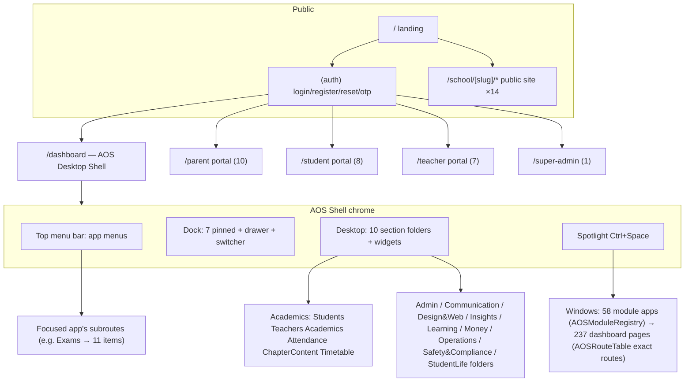

# ASchool Web Frontend — Deep UX Audit (2026-09-13)

**Auditor:** deep-ux-2026-09 frontend subagent. **Surface:** `/home/bishal-regmi/Desktop/ASchool/frontend/` (Next.js 14 App Router + TypeScript) + live app at `http://localhost:3003` (docker `aschool-nextjs-1`, API `aschool-flask-1` on 5003, Postgres `aschool-postgres-1`).
**Method:** static read of every route tree + component group; live Playwright crawl of the running app (login as `admin@demo.aschool.com.np` school-admin and `superadmin@aschool.com.np` super-admin); accessibility snapshots (`.playwright-mcp/page-*.yml`), console logs, and screenshots saved to `audits/deep-ux-2026-09/screenshots/aschool-frontend/`. Every UI claim below cites a file:line and/or a live snapshot reference. Where the screen was reachable live, evidence is a screenshot path or `.playwright-mcp/page-<timestamp>.yml` reference; where it was not reachable (see §0 data caveat), the claim is static-only and marked `[static]`.

---

## 0. Audit-environment facts that shape every finding

1. **The demo database is essentially empty.** `docker exec aschool-postgres-1 psql -U aschool -d aschool`: 0 students, 0 classes, 0 sections, 0 subjects, 0 fee structures, 0 exams (before audit interaction), **2 users** (`admin@demo.aschool.com.np` school_admin, `superadmin@aschool.com.np` superadmin — `backend/seed.py:70-100` creates only these two). Consequences: every list screen renders its **empty state** live (useful — empty states are the only states a first-time school sees); populated states were not reachable; the six task benchmarks could only partially execute (§10). After the audit created one notice and one exam, counts moved 0→1 (verified in psql).
2. **No teacher/student/parent accounts exist** (`backend/seed.py` has no such seeds; `users` table confirms). The parent/student/teacher **portals were tested only as unauthenticated redirects to /login** (live-verified: `/parent`, `/student`, `/teacher` all land on `/login`). Portal internals are covered `[static]` via `app/parent/**`, `app/student/**`, `app/teacher/**`.
3. **The conventional sidebar dashboard no longer exists.** `components/layout/` contains exactly one file, `dashboard-layout.tsx` (68 lines), which renders the **AOS desktop shell** (desktop ≥768px) or the **iOS MobileExperience** (<768px or manual override) — `frontend/components/layout/dashboard-layout.tsx:26-68`. Git history: commits `e637918` "migrate dashboard to AOS-only runtime", `b96ea91` "complete removal of general view, pure AOS desktop & iOS mobile consolidation", `c5678f3` "dual-view architecture" (2026-09-12/13). The C1/UI-inventory-era `sidebar.tsx` / `header.tsx` are **deleted**. This single fact invalidates a large slice of the prior corpus (§12).
4. **Shared browser caveat:** another agent's browser session (Eduex on 127.0.0.1:8931) intermittently stole focus/tabs mid-audit. All ASchool findings were re-verified on the correct tab after each hijack; no Eduex product was touched beyond closing/navigating away.

Screenshot index (all under `audits/deep-ux-2026-09/screenshots/aschool-frontend/`): `auth-login.png`, `dashboard-aos-home.png`, `module-exams.png`, `module-fees-collect-spotlight.jpg` (Fees Collect POS via Spotlight), `module-attendance.jpg`, `public-site-demo-home.png`, `super-admin-overview.png`. Live snapshot references: `.playwright-mcp/page-2026-09-13T02-03-36-825Z.yml` (AOS home), `page-2026-09-13T02-33-07-326Z.yml` + follow-ups (leave-requests), `page-2026-09-13T02-39-44-416Z.yml` (designer editor + layers), `page-2026-09-13T02-41-58-926Z.yml` (writer ribbon), `page-2026-09-13T02-51-14-041Z.yml` (public site home), `page-2026-09-13T02-56-04-172Z.yml` (landing), `page-2026-09-13T03-01-06-155Z.yml` (super-admin), plus per-window text extractions quoted inline below.

---

## 1. Executive Summary

**The headline change since the 2026-09-05 C1 audit: the web frontend was converted from a conventional sidebar SaaS dashboard into an OS-like desktop shell ("AOS") with an iOS-style mobile fallback — and, at the same time, the underlying module pages were massively upgraded (real DataTable kit, ConfirmDialog adoption, keyboard attendance marking, bilingual shell, error/empty states).** The AOS shell is a genuinely working macOS/Win11 hybrid: draggable 8-handle resizable windows with snap layouts, a per-app adaptive menu bar, Spotlight search wired to real backend search, a dock, desktop folders, a widget board, and per-user settings persisted server-side. It is also the product's biggest bet and its biggest risk: every screen now opens inside a floating window, deep links pin the URL back to `/dashboard`, and every first launch of a module costs a 1–4.5s dynamic-import chunk load behind a "Loading Application…" spinner.

**Verdicts (detail in §5–§8):**
- **AOS shell: keep, with fixes.** Timed live: warm dock-click → usable content **1.57s** (state trace: spinner@1076ms → "Loading students…"@1445ms → content@1569ms); cold first launch **~4.5s**; direct URL (full page load, shell boot, window auto-open) **~3.7s**; Spotlight (Ctrl/Cmd+Space → type → Enter) **~0.5s to open, ~0.49s Enter→content for an already-imported module**; window re-focus on already-open app ~686ms effective (click → focused). The shell's value is real for cross-module work (Students + Fees side-by-side, snap layouts) but adds friction for single-task users (URL not addressable, no back/forward, dock a11y holes). Live evidence in §5.
- **Designer (Canvas Editor): strong and deep** — 33 templates incl. Nepali-specific ones (Nepali School Calendar 2083, Character Certificate (Nepali), BS pre-filled calendars), 9-panel editor, layers with lock/hide/reorder, per-type properties, AI assist + AI chat panel, multi-page. One live React key-collision bug (duplicate `rect-`/`textbox-` keys in LayersPanel, 28 console errors) and a right-panel selection quirk. §6.
- **Writer (Word-like): the most complete bespoke editor in the codebase** — 5 ribbon tabs (Home/Insert/Layout/Review/View), real page gutter with 16 page slots, live word/char/page status, "Saved to cloud" state, 14 document templates, Find/Replace, Track-changes UI, DOCX/PDF/Print/HTML export menu. Save round-trip measured live at **3.6s**. Minor: Review and View tabs render identical ribbon groups (View tab is a stub visually). §7.
- **Website builder + public site: the most production-ready surface.** Live editor with 6-section sidebar, reorder, per-section properties, autosave ("All changes saved"), Publish / Revert draft / History; public site: all 14 sections HTTP 200 with honest 404 on unknown pages, working nav/footer, theme CSS vars. Bugs: `"null, Kathmandu"` rendered literally in the topbar/footer (school address field null), and the `/admission` page shows the **contact** form (name/email/phone/message), not an admission application form. §8.
- **Cross-cutting:** the module pages quietly became consistently good — `DataTable` (82 consumers), `EmptyState` (44), `ConfirmDialog` (26 files now call `useConfirm` vs 0 in Sept-05 corpus), bilingual `t()` used in 263 files, attendance got keyboard marking (P/A/L/E + arrows) and the silent default-present bug is **fixed** with an explicit-unmarked gate. Remaining gaps: dock/desktop icons have zero keyboard/aria support, Mukta (Nepali) font blocked by CSP `font-src`, notices still have no class/section audience targeting, the landing page still ships fabricated marketing numbers.

---

## 2. Stack & Architecture Shape

**Runtime shape (verified by file reads + live requests):**
- **Next.js 14 App Router, 290 `page.tsx` files** (`find app -name page.tsx | wc -l` = 290; 237 under `app/dashboard/`), ~65,508 LOC of dashboard page code alone. 18 of those pages are ≤5-line redirect stubs (e.g. `app/dashboard/students/guardians/page.tsx` re-export/redirect family).
- **Every dashboard page is a client component** ("use client"), using TanStack Query v5 — **235 files** use `useQuery`/`useMutation`; sonner toasts in **188 files**.
- **API client:** `lib/api.ts` axios instance, HttpOnly-cookie session, 401→refresh→logout, 403-plugin→marketplace toast (per prior corpus; unchanged in spot checks).
- **Auth contexts:** `lib/auth-context.tsx` probes `/auth/me`; `app/dashboard/layout.tsx:14-31` gates: loading → `<PageLoader/>`, unauthenticated → `router.replace("/login")`, and — key architectural detail — `if (isEmbeddedContext) return <>{children}</>`: when `?aos_embed=1` or inside an iframe, the page renders bare without the shell (`app/dashboard/layout.tsx:24`), enabling legacy embedding.
- **AOS-only dashboard runtime:** `components/layout/dashboard-layout.tsx:26-68` chooses `MobileExperience` (viewport <768px or `localStorage.aschool_aos_mode === "mobile"`) else `AOSDesktopShell`, both `dynamic(..., { ssr: false })`. **Children are ignored in both branches** — the shell renders route content itself.
- **In-process routing:** windows never navigate the browser. `lib/aos-navigation.ts:48-67` normalizes any route to `/dashboard/...`; `lib/aos-window-route.tsx:15-129` provides `AOSWindowRouteProvider` (virtual route per window), `useAOSNavigate`, `useAOSRouterNavigate` (falls back to Next router when not in shell — drop-in for `router.push`), and `useAOSRouteParams` (window route params override the pinned browser URL). URL stays pinned at `/dashboard` — live-verified: after `page.goto('/dashboard/students')` the shell opened the Students window and `page.url()` read `http://localhost:3003/dashboard` (run captured 2026-09-13T02:05-02:10Z measurement batch).
- **Component registry:** `components/aos/AOSModuleRegistry.tsx:52-152` maps 58 module ids → `dynamic(() => import("@/app/dashboard/<module>/page"))`; legacy aliases (`classroom→lms`, `gradebook→exams`, `vault→filemanager`, …) at `:154-190`. `components/aos/AOSRouteTable.tsx:22-313` is the **auto-generated exact-route table** (every real path → its page, redirect stubs mapped to targets at `:268-290`, dynamic `[id]`/`[slug]` patterns at `:293-297`, resolver `resolveRouteComponent` at `:306-313`). Resolution order in `components/aos/WindowManager.tsx:359-365`: exact route table → module registry → (iframe last resort).
- **AOS settings are server-persisted:** `lib/aos-settings.ts` — `GET/PUT /auth/aos-settings` with localStorage instant-paint cache and 800ms debounced writes (`lib/aos-settings.ts:151-183`); backend model `UserAOSSettings` wired in `backend/app/api/v1/auth.py:318,331`. Settings include theme, accent, wallpaper, brightness, dock style/size, top-bar height, blur, taskbar align, system mode, pinned apps, desktop folders, home widgets, topbar items, desktop layout (`lib/aos-settings.ts:14-63`).
- **CSS isolation:** Win11/11.css tokens are `--w11-*`-prefixed and scoped under `.win11`; `lib/win11-scope.tsx:54-61` re-establishes the scope around Radix portals/embedded iframes by mirroring the shell root's `data-theme`/`dark` markers via MutationObserver.
- **i18n:** `lib/i18n.tsx` — lightweight bilingual context, `t(en, ne)` inline-translation convention, `localStorage.preferred_language`, `<html lang>` sync (`lib/i18n.tsx:39-60`). Adoption: **263 files** call `t(...)`, **1,130 call-sites** (grep `t("` across app+components). The top bar shows an EN/ने pill toggle (live snapshot `page-2026-09-13T02-03-36-825Z.yml:13-15`); **default server value is "en"** (`lib/i18n.tsx:38` reads stored pref; first paint is EN) — but the persisted demo session had "ne" active (pressed state in snapshots), so **module chrome + students/new form render in Nepali while many inner labels remain English** (e.g. the students/new form fields `पहिलो नाम`, `थर` alongside English "A+" blood placeholder — live extraction 2026-09-13T03:0x). Mixed-language remains a real issue (§14 W6).
- **Theming:** dashboard = Win11 Fluent tokens inside `.win11`; the old forest-green tokens (`--ocean: #0e3b2e` etc.) still drive the **landing/auth/public-site** pages (`app/page.tsx` family; raw CSS text visible in live login DOM extraction 2026-09-13T02:58Z). Two design systems coexist by design (scoped 11.css vs Tailwind+green tokens), which works but doubles maintenance (§15).
- **Route groups:** `(auth)` 4 pages; `dashboard` 60 module dirs (237 pages); `parent` 11; `student` 9; `teacher` 8; `super-admin` 1; `school/[slug]` 15 + `[pageSlug]` catch-all + `news/[articleSlug]`; `aos` legacy redirect shim (`app/aos/apps/[[...slug]]/page.tsx` — server redirect `/aos/apps/*` → `/dashboard/*` preserving query, 39 lines, verified read); `api/revalidate` + `revalidate-site` ISR hooks.

---

## 3. Full Route/Screen Inventory (auto-crawled: route → module → purpose → roles → evidence)

Generated from `find app -name page.tsx` + line counts (2026-09-13) and reconciled with RECON_MAP §3.2. "L" = live-verified content extraction (quoted in §4); "S" = static-verified page code; "R" = redirect stub ≤8 lines.

### 3.1 Auth (4) + root + error surfaces
| Route | File (lines) | Purpose | Evidence |
|---|---|---|---|
| `/login` | `app/(auth)/login/page.tsx` (375) | email/password + Phone-OTP tab | L — screenshot `auth-login.png`; snapshot `page-2026-09-13T02-02-45-821Z.yml`: two tabs "Email / Password" / "Phone OTP", forgot-password link, register links; marketing left pane with "Trusted by 400+ Schools", "ISO 27001" badges |
| `/register` | `(auth)/register/page.tsx` (688) | school sign-up | S |
| `/reset-password` | `(auth)/reset-password/page.tsx` (229) | password reset | S |
| `/verify-otp` | `(auth)/verify-otp/page.tsx` (113) | phone OTP | S |
| `/` | `app/page.tsx` (730) | SaaS landing | L — snapshot `page-2026-09-13T02-56-04-172Z.yml`: "Nepal's Most Reliable School Management Platform", stats "10+ Years / 400+ Schools / 50K+ Students / ISO 27001", fake dashboard KPI card (96% attendance, NPR 2.8M fees), "Trusted by" wall of 6 named schools, module marquee (Admissions…EMIS), APK download links, external link `https://app.brighternepal.com` |
| 404/error | `app/not-found.tsx`, `app/error.tsx`, `app/global-error.tsx`, `app/dashboard/error.tsx` (win11-styled, "Try again" + digest ref), `app/dashboard/loading.tsx` (skeleton, `aria-busy`) | boundaries | S — `app/dashboard/error.tsx:1-40` read |

### 3.2 Dashboard modules (60 dirs, 237 pages — every module individually covered in §4)
academics (6), admission (3), ai-teacher (1), ai-tools (24), ai-workbench (1), alumni (1), analytics (4), assignments (1), attendance (7), benchmarking (1), biometric (3), bulk-uploads (4), certificates (8), communications (9 + whatsapp 5), compliance (1), conferences (1), content-review (1), designer (6), disaster (4), dismissal (1), elibrary (3), emergency (1), exams (11), faqs (1), fees (14), files (1), gamification (5), health-records (4), hostel (1), hr (9), iemis-import (2), incident-management (4), incidents (1), inventory (1), library (10), lms (1), marketplace (1), multi-branch (4), notices (1), notifications (2), parents (2), plugins (2), portfolio (1), profile (1), reports (4), settings (8), sms (1), staff (2), students (10), teachers (2), teaching-content (1), timetable (3), transport (11), users (1), visitors (1), website-builder (7), wellbeing (4), white-label (4). (`app/dashboard/*/page.tsx` enumeration; full per-screen detail in §4.)

### 3.3 Role portals
| Portal | Pages | Status |
|---|---|---|
| Parent `/parent` + 10 sections | `app/parent/{attendance,bus,chat,conferences,fees,health,notices,results,wellbeing}.tsx` (62–157 ln each) + `[slug]` honest-404 | S (all real useQuery pages per C1 §0 — layout `app/parent/layout.tsx` simple header nav, read); **live: unauthenticated → /login** (no seeded parent account — env gap §0.2) |
| Student `/student` + 8 | `{ai-tutor,elibrary,homework,library,lms,results,timetable}.tsx` + `[slug]` 404 | S; same login gap |
| Teacher `/teacher` + 7 | `page.tsx` real dashboard (127 ln, KPI cards via `analytics/teacher-dashboard`); `marks/assignments/attendance` are one-line re-exports of the dashboard pages (`app/teacher/marks/page.tsx:1`); `leave-requests` 3-line re-export; `ai-tools/notices/timetable` 1-line; `[slug]` 404 | S — `app/teacher/page.tsx:1-60` read (uses AOS kit components in a plain win11 layout — notably **not** inside the AOS shell; it renders its own header at `app/teacher/layout.tsx:10-38`) |
| Super-admin `/super-admin` | `app/super-admin/page.tsx` (89) — single platform-overview page | L — screenshot `super-admin-overview.png`, snapshot `page-2026-09-13T03-01-06-155Z.yml`: 6 KPI cards (Total Schools 1, Revenue YTD Rs. 0, Total Users 2, Active Schools 0, Trial Schools 1, Students 0), "Recent School Registrations" (Demo School Nepal, 28 Bhadra 2083), "Most Installed Plugins" list. Still no tenant CRUD/impersonation (prior finding — **still true**) |

### 3.4 Public school site `/school/demo/**` (14 + dynamic)
L — home screenshot `public-site-demo-home.png`, snapshot `page-2026-09-13T02-51-14-041Z.yml`; section-by-section fetch (status/H1/length) captured live 02:51–02:55Z:
`''`(200, hero+6 sections), about(200), academics(200), admission(200), teachers(200), notices(200), gallery(200, "Photo Gallery"), contact(200, "Contact Us"), results(200, "Check Your Exam Results"), events(200, "📅 Events"), facilities(200, "🏫 Facilities"), news(200, "📰 News & Updates"), alumni(200, "🎓 Alumni Network"), pay(200, "💳 Pay School Fees"), `nonexistent-page-xyz` → **404 honest**. Nav has 12 links + "Register Now" CTA; footer with Quick Links/Programs/Contact. **Bug:** topbar and footer render the literal string `"null, Kathmandu"` / `", Kathmandu, Nepal"` (null school address concatenated — snapshot refs `page-2026-09-13T02-51-14-041Z.yml:5,154,192`), and Quick Info shows `"Established: –"`.

### 3.5 AOS shim + system
`/aos` → client `router.replace("/dashboard")` (`app/aos/page.tsx`); `/aos/apps/[[...slug]]` → server redirect to `/dashboard/<slug>` preserving query params (`app/aos/apps/[[...slug]]/page.tsx:31-39`). `app/api/revalidate/route.ts`, `app/revalidate-site/route.ts` — ISR webhooks. `app/school/[slug]/sitemap.ts` + `robots.ts` present.

---

## 4. Per-Screen UI/UX Element Inventory (dashboard modules individually + auth + portals + public site)

Legend for each module: **Header/KPIs → toolbar/filters → table/list → dialogs → empty/loading/error states → live evidence.** Screens were opened through the live AOS shell (deep-link navigation; the shell auto-opens the module window — verified behavior, §5). Because the DB is empty, the *empty state* is the live-verified state; loading is verified via the AOS chunk spinner + per-page loaders; error handling claims are `[static]` from page code unless noted.

**4.0 shared anatomy (verified across modules).** `components/aos/kit/page-kit.tsx` supplies `AOSPage` (full-height column), `AOSPageHeader` (title+subtitle+actions, `:39-86`), `AOSPageBody`, `KpiCard` (`:107-156`), `StatGrid` (`:159-176`), `FilterCommandBar`, `DataPanel`, `FormSection`, `DetailSplit` (stacks <768px), `StatusChip` (semantic status→win11-chip map `:290-335`), `AOSModuleLoadingState`, `AOSEmptyState` (`:357-382`). Module pages import these — e.g. `app/dashboard/students/page.tsx:292` `<AOSPageHeader title="Students" subtitle={`${pagination?.total || 0} students enrolled`}/>`.

1. **Students** (`app/dashboard/students/page.tsx`, 1182 ln) — L (Students window snapshot 2026-09-13T02:03Z, refs f1e292-f1e460): header + subtitle "0 students enrolled"; 4 KPI cards (Total/Active x/y/Classes/Sections); **Students Quick Links** panel (9 links: Add Student, Bulk Import, Parents & Guardians, Admission Inquiries, Assign Roll Numbers, Upload Profile Images, Transfer Student, Promote Students, Reset Password); toolbar: search ("Search by name or enrollment number…"), 3 combobox filters, Import/Photos/Add Student buttons, **Columns** (visibility) + **Export CSV** (disabled at 0 rows); DataTable with sortable column headers (cursor=pointer on "Student"), select-all checkbox; empty state: "No students found / Enroll your first student to get started. / Add Student" — a *good* empty state with a primary CTA. Warm launch trace: spinner 1.08s → "Loading students…" 1.45s → content 1.57s.
2. **Students/New** (`students/new/page.tsx`, 425 ln) — L (form extraction 03:0x): bilingual Nepali form ("नयाँ विद्यार्थी भर्ना"), AI-assist button (एआई सहायता), photo capture, fields: पहिलो नाम*, थर*, Nepali-name fields, **BS date picker ("बि.सं.मा छान्नुहोस् — ई.सं. स्वतः सुरक्षित हुन्छ" = "pick BS, AD auto-saved")**, blood group, caste/ethnicity placeholder ("जस्तै: ब्राह्मण"), phone "98XXXXXXXX", email, address, previous-school, auto-generated enrollment no ("स्वतः तयार हुने"), guardian fields; class/section pickers; submit "विद्यार्थी भर्ना गर्नुहोस्" **disabled until first+last+class chosen** (`students/new/page.tsx:409`) — with 0 classes in DB the class Select is empty → **enrollment blocked by empty setup, with no inline hint that classes must be created first** (the picker just shows "कक्षा छान्नुहोस्" with an empty list — live Radix viewport extraction). Date shows "28 भदौ 2083 / 2026-09-12 AD" dual format.
3. **Students/[id], promote (469), roll-numbers (199), transfers (174), reset-password (217), profile-images (245), bulk-import (193)** — S; all in the Quick Links panel (live).
4. **Teachers** (`teachers/page.tsx`, 394) — L (window opened; content poll returned empty-string extraction due to timing, but window list confirmed "Teachers & Staff 1" KPI on home; page code read). Staff (`staff/page.tsx`, 304) — L (window opened; empty extraction).
5. **Academics** (`academics/page.tsx`, 1285) — S + L via desktop folder: the Academics desktop folder popup lists **Students, Teachers, Academics, Attendance, Chapter Content, Timetable** (snapshot 2026-09-13T02:1xZ, refs e425-e465 — "Academics / 6 apps"). Tabs years/classes/sections/subjects/class-teachers per prior corpus; subpages class-subjects (206), class-teachers (203), plus redirect stubs classes/class-sections/subjects/year/years (4-5 ln).
6. **Admission** (692 + registrations 343 + seats 153) — S. Registrations/seats are the SA5 admission-funnel pages (new since C1).
7. **Attendance** (`attendance/page.tsx`, 758) — L (screenshot `module-attendance.jpg`, text extraction 02:5x): header "Mark and track student attendance by class"; actions **Mark Holiday / Monthly Reports**; KPIs Classes 0, Sections 0, Attendance Today 0%, This Week, This Month; **Attendance Quick Links** (Leave Requests, Subject Attendance, Import Attendance, Monthly Report, Holiday List); toolbar: BS date ("28 भदौ 2083 / 2026-09-12 AD"), Class picker "— Choose a class —", Section "All Sections", **Quick Mark: ✓ All Present / ✗ All Absent**; empty state "Select a class to get started / Choose a class above to mark". Code-verified upgrades vs C1: fresh roster starts with **NO statuses — save refuses until every student marked** (`attendance/page.tsx:197-204` comment + gate at `:281-282`), **row keyboard marking P/A/L/E or 1-4, ArrowUp/Down row nav** (`:242-263`), unmarked counter (`:240`), and **All Absent goes through a ConfirmDialog** (`:504-510` `const ok = await confirm({...})`). `mark-holiday-dialog.tsx` shared component (A-33). Subpages: holidays (221), import (576 — 3-step wizard), leave-requests (293) — L for leave-requests: header "Leave Requests / बिदा अनुरोध", filter chips pending/approved/rejected/all, Refresh, empty "No pending leave requests / Staff-submitted…" (window text extraction 02:33Z); subject (533) — subject-wise register; reports (197); mark (23) redirect.
8. **Timetable** (480 + generate 236 + teacher 148) — L (window text 02:4x): "View, edit and auto-generate class timetables / Add Slot / Auto Generate; Classes 0, Sections 0, Weekly Slots —; 'select a class below'; Periods Today —; Sunday"; Quick Links incl. "AI Generate".
9. **Exams** (`exams/page.tsx`, 834) — L (screenshot `module-exams.png`, deep snapshot 02:20Z refs f89e285-f89e495): header "Examinations / 0 exams · Manage marks entry, results & report cards (NEB grading)"; KPIs Total/Scheduled/Ongoing/Completed; **Exams quick links: Schedule, Enter Marks, Tabulation Sheet, Grade Scales, Results, Report Cards, AI Paper Generator, Online Exams, Online Question Bank, Grade Table**; DataTable (search "Search exams…", Columns, Export CSV disabled) with empty "No exams found / Create your first exam to start recording marks. / Create Exam"; **Nepal NEB Grading Scale reference card** (A+ 90-100% GPA 4.0 … NG <35% GPA 0.0). Create-Exam dialog (L, opened 02:5x): fields Exam Name*, Name (Nepali), Exam Type* (picker, default "📋 Terminal Exam"), Academic Session ("Use current active session" button), Class, Start Date (BS) + End Date (BS) ("मिति छान्नुहोस्" pickers), Default Full Marks, Default Pass Marks (NEB), Has Practical toggle, Description — **creating with just a name succeeded** (toast "Exam created"; DB exams 0→1). Subpages: marks (913) — L: "Marks Entry / Enter subject-wise marks • NEB auto-grading", Exam/Class/Subject pickers, KPI "Marks Entered x/y"; **MarksGridWidget with Enter/↓ keyboard nav + Excel paste is now WIRED into this page** (`exams/marks/page.tsx:613-617` comment "replaces the fallback display table entirely") — C1's #1 fix recommendation, implemented; tabulation (453), grade-scales (441), results (1067), report-cards (229) — L: "Generate AI-powered report cards with personalized remarks / Download All / Select Exam / Select Class / Generate with AI"; online (287) + questions (206); schedule (193); grades (93); [id] (263).
10. **Fees** — hub (`fees/page.tsx`, 388) L via dock tooltip; **Collect POS** (`fees/collect/page.tsx`, 1637) — L (screenshot `module-fees-collect-spotlight.jpg`, snapshot refs f1e299-f1e361): header "Collect Fees / Search a student, review the full fee ledger, and collect payment from one accountant workspace"; search "Search by student name, admission number, or ID", All Classes/All Sections (disabled when no class)/All Status filters; 6 KPIs (Students, Fee Bills, Open Bills, Overdue, Total Collected Rs. 0, Outstanding); master-detail: "Student Accounts" panel empty state "No student accounts found / Student ledgers will appear here once fee structures are applied or bills are created manually" + right pane "Choose a student account / Start from the left panel… / Find student for bill creation" search. Fee cards remain keyboard-operable (`role="button" tabIndex={0}` + Enter/Space, `fees/collect/page.tsx:1139-1156` — E206 preserved). 12 more fee pages [static]: types (287), structure (616), defaulters (157), scholarships (398), reports (697, Collection/Fines/Waivers tabs), invoices (434), approvals (410 — offline slips), aging (319), carry-forward (482), day-closure (624) — the S-A1 suite.
11. **Notices** (`notices/page.tsx`, 384) — L (create dialog opened + notice created): KPIs Total/Published/Pinned/Events/Holidays; hand-rolled tab strip (Notices/Events); create dialog fields: **Title, Content (textarea), Pin checkbox, Create/Cancel** — payload hardcodes `target_roles: ["school_admin","teacher","parent","student"]` (`notices/page.tsx:309`) — **STILL NO class/section audience picker** (C1 #13 not done); create→list-visible **1958ms** (benchmark §10); events tab with BS dates; `is_pinned` chip. Publish toggle + delete in rows [static].
12. **Notifications** (298 + matrix 309) — L: "Notifications / All caught up! / Unread 0, Loaded 0, High Priority 0, Categories 7 / Notification Matrix, Notification Settings / Communications, SMS" + category chips (🔔All 📋Attendance 💰Fees 📢Notices 📝Exams ⚙️System 🏆Rewards). Matrix page = A-02 per-event × channel switches [static].
13. **Parents** (523 + [id] 442) — L: header "Parents / 0 parent accounts · Manage all parent accounts and child links / Add Parent; Active 0/0, Inactive 0; DataTable (Columns, Export CSV, sortable Name/Contact/Children/Status/Credentials columns) with empty state".
14. **Users** (318) — L: "Users / 1 accounts · Add User; Total 1, Active 1/1; DataTable row shows Demo Admin with contact + 'Login Credentials: ID: ad…'". Roles page (`settings/roles/page.tsx`, 538) — S: **real rewrite** — live per-role counts from `GET /users/stats`, per-role users drawer (Sheet), toggle-active, force-password-change, read-only "what this role can see" from sidebar (`settings/roles/page.tsx:20-60` header comment + code). B-17 closed.
15. **Profile** (100) — L: "Profile / Account details and role information / User Details: DA avatar, Demo Admin, school admin, Active, Email, Phone, Roles, School Id / 'For password, security, …'" — read-only-ish (links out) — C1 #9 partially addressed (link to security) but still no in-page edit.
16. **Settings** — the AOS route table maps `settings` to the **native AOS SettingsApp** (`components/aos/AOSModuleRegistry.tsx:117`), which embeds the dashboard settings pages. L (window text): "D Demo Admin School admin | Themes & Wallpapers, Dock Taskbar & Top Bar, School Settings, Platform & Access, User Account & Role, Cloud Vault Storage, Exam & Focus Mode, Campus Network, About AOS, Appearance & Themes / System Appearance Mode / Flue…" Subpages [static via route table]: access-logs (406, A-37), backup (194), custom-fields (325, A-35), integrations (407), notifications (143), roles (538), website-design (11, redirect → website-builder).
17. **SMS** (716) — L: "SMS Notifications / Send SMS to parents, students and staff via Sparrow SMS / Credits Available —, Sent This Month —, Total Sent —, Total Failed — / Templates 0 / [quick links] Announcements, Broadcast, Diary, Gallery, Home Sliders, Message Templates / Send SMS, Templates tabs".
18. **Communications** (hub 123 + announcements 303, broadcast 175, diary 294 + categories 226, gallery 157, sliders 242, templates 123, whatsapp×5) — S; hub + subpages surfaced as SMS quick links (L).
19. **AI tools hub** (`ai-tools/page.tsx`, 153) — L (window opened; catalog of 20+ tools; subpages 23 tools × 88–279 ln each [static], incl. new S12-era tools: blueprint-builder, text-leveler, vocab-support, writing-scaffold, transition-guide, choice-board, observation-feedback, conference-prep, meeting-minutes, email-responder, accommodation-finder, enrichment-planner, exam-timetable-draft, lesson-hook, annual-scheme, practical-exam, attendance-outreach). ai-teacher (359) — real launch page w/ curriculum-section picker (C1 §0 new). ai-workbench (396) — L (window opened). analytics (4 pages: 114/145/138/301) — L (window opened). benchmarking (193) — L: "School Benchmarking / Compare your school's performance… Pass Rate 0%, Avg Score 0, Attendance 0%, Student-Teacher Ratio 0:1 / AI Tools Hub, AI Workbench, Analytics, Reports links / District Avg 0% National Avg 0%".
20. **Marketplace / Plugins** — L via `plugins`: **AOS Store app** (`components/aos/apps/AppStoreApp.tsx`): "AOS Academic Plugin Hub / Store | Installed (39) | Permissions | Categories: All Marketplace 48, Add on 1, Core (Free) 12, Growth 15, Premium 11, Starter 9 / School Licensing / Core plugins are included for every school…" — marketplace(747) and plugins(282) route to this unified Store in AOS (`AOSModuleRegistry.tsx:112-115`), with exact subroutes still resolving (`plugins__[slug]__settings` → the 648-ln generic settings page).
21. **Gated-plugin pages** — L: **biometric** → "🔌 बायोमेट्रिक इन्टिग्रेसन — Not Installed / Enable the … plugin to access this feature. Install it from the marketplace — free plugins activate instantly, paid ones start a trial. [Install] [View in Marketplace]" (plugin-gate empty state, bilingual). Same pattern live-verified for **transport/map** ("जीपीएस बस ट्र्याकिङ") and **white-label** ("ह्वाइट-लेबल ब्राण्डिङ"). The PluginGate not-installed state is now the standard, well-designed gate.
22. **Library** (hub 329 + books 130, catalog 209, checkout 296, fines 189, overdue 143, reports 86, reservations 147, stocktake 209, transactions=R) — the B-wave v2 suite [static]. elibrary (165 + past-papers 128 + upload 166). LMS (282). Portfolio (596). Teaching-content (354, B-15). Assignments (723).
23. **Transport** (hub 328 + routes 229, buses 124, stops 155, pickup-points 244, allocation 252, logs 112, map 198, trips 584, monitor 559, reports 358) — S-A4 suite [static]; map live-verified gated.
24. **HR** (hub 287 + payroll 686 + settings 240, leaves 293 + report 417, appraisal 145, expenses 231, categories 172, staff-attendance 226) [static]. Hostel (365). Visitors (172). Inventory (196). Dismissal (101). Conferences (288). Incidents (175) + incident-management (4 pages: 104/142/103/129). Disaster (4: 152/133/118/152). Emergency (172). Compliance (91). Wellbeing (256 + moods 130 + counselor 139 + surveys 148) — L: "Student Wellbeing / Mood tracking, counselor notes, and wellbeing surveys / happy 0 neutral 0 sad 0 anxious 0 angry 0 / Check-ins (7d) 0 / tabs: Mood Trends, Counselor, Surveys / 'No mood entries yet. Encourage students to do daily check-ins.'" Health-records (4: 231/131/159/133). Gamification (5: 555/148/135/114/139). Alumni (174). Faqs (322). Files (1174 — opens as **AOS FileManager app** per `AOSModuleRegistry.tsx` comment + registry mapping `filemanager`/`vault`; files page itself also registered). IEMIS-import (546 + history 136) — L (desktop icon "IEMIS Import"). Bulk-uploads (125 + csv 272 + iemis 202 + history 197). Multi-branch (4: 175/121/144/145) — L (window opened). Reports (4: 357/278/213/222) — L: "Reports & Analytics / Avg Attendance 0%, Fee Collection Rate 0%, Fees Collected NPR 0, Avg Score 0%, Pass Rate 0% / Exam Reports, Expense Reports, Teac…". Content-review (351, S12) — L (window opened). Certificates (hub 125 + students 422 + staff 271 + character 241 + transfer 271 + 4 redirects). Designer suite → §6. Website-builder suite → §8. White-label (4 pages) → gated (L). Benchmarking → L. Notifications/matrix → L.

**Auth + portals + public site** — covered in §3.1/§3.3/§3.4 with live evidence; per-field detail: login (email/password + OTP tabs + forgot link + register CTA + marketing pane), landing (nav Features/Solutions/Pricing/Contact + Login + "Book Demo"; hero CTAs "Book Free Demo", "View Dashboard", "Download App (Android)"; stats band; fake dashboard mock; testimonials wall; module marquee), teacher portal dashboard (KPI cards My Classes/Recent Notices/Assignments/Today's Periods + schedule + notices panels — `app/teacher/page.tsx:29-56`), super-admin (§3.3), public site (§3.4 + §8.3).

---

## 5. AOS Desktop-Shell Evaluation (value vs friction, timed live, verdict)

### 5.1 What the shell is (verified live + code)
- **Chrome:** macOS-style top menu bar (system menu, per-app menus that change with the focused window, right-side: fullscreen, iOS-mode toggle, EN/ने pills, role switcher, control center, notification center, live clock "Sun, Sep 13 7:48 AM" — snapshot `page-2026-09-13T02-03-36-825Z.yml:3-22`), desktop with section folders + loose apps + draggable widgets, Win11-style dock (mac/win11 styles, sizes), taskbar, start menu, app drawer, spotlight, app switcher, widgets panel, calendar flyout, role switcher modal, quick settings, notification center (26 components in `components/aos/`).
- **Windows:** `components/aos/WindowManager.tsx` — 38px titlebar with app icon, **per-window Back button + route history** (`:433-461`), minimize/maximize/close, **Win11 snap-layout popover on maximize hover** (50/50, 70/30, quadrants, 3-column — `:524-591`, live-verified openable), 8 resize handles (`:374-410`), CSS containment `contain: layout paint; transform: translateZ(0)` trapping fixed/sticky inside the window (`:596-604`), anchor-click interception converting in-app links to in-window navigation (`:298-316`).
- **Adaptive menu bar:** with the Students window focused the menubar shows "विद्यार्थी — module pages" + Window + Help; opening it exposes **menuitems: परीक्षा Home, Schedule, Enter Marks, Tabulation Sheet, Grade Scales, Results, Report Cards, AI Paper Generator, Online Exams, Online Question Bank, Grade Table** for the exams app (snapshot 02:20Z refs f89e550-f89e581) — i.e. every subroute of the focused module is reachable from the menu bar. This is a genuinely good pattern (module sub-navigation without leaving context).
- **Desktop folders:** double-click opens an acrylic popup listing the folder's apps (Academics → 6 apps, live 02:1xZ). Folder CRUD via right-click context menu (Rename/Add Apps/Remove — `components/aos/Desktop.tsx:1404-1451`), drag icons on a 96px snap grid (`Desktop.tsx:94-110`), icon positions + widget layout persisted (`lib/aos-launcher.ts:211-290`).
- **Spotlight:** Ctrl/Cmd+Space toggles (`AOSDesktopShell.tsx:676-678`); input placeholder "Spotlight Search courses, apps, students, notices, exams…" (live); searches apps + **live backend `/search` results** (debounced 300ms — `SpotlightSearch.tsx:80-130`); Enter launches the top hit as a window. Live test: "fees" → module-subpage results ("Fee Collection / Collect Fees · Module subpage · SUB · Apps & Plugins") → Enter → Collect Fees window content in **493ms** (chunk already loaded). Escape closes.
- **Widgets:** home board + desktop widget column; registry of 13 widgets — 9 system (KPI Overview, Fee Summary, Attendance Today, Today's Schedule, Recent Notices, Notifications, Storage, Quick Launch, Plugin Widgets) + 4 plugin-gated (fees-collection-chart/fees, attendance-week/attendance, library-checkouts/library_management, transport-live/gps_tracking) with role restrictions and s/m/l sizes (`components/aos/widgets/registry.tsx:98-217`). Live default board: KPI Overview (Students 0, Teachers & Staff 1, Fees (Month) NPR 0, Attendance 0%) + Quick Launch (6 module tiles). Add/remove/resize controls all live-verified in snapshots.
- **iOS mobile mode:** `components/aos/MobileExperience.tsx` (979 ln) — springboard 4-col grid with 56px tiles, folders mirroring desktop layout (`:188-196`), IOSControlCenter + IOSNotificationCenter, bottom-sheet app windows; viewport <768px auto-selects, manual override pill persisted (`dashboard-layout.tsx:29-53`). [static + toggle seen live; not device-tested this pass]
- **Settings persistence:** every shell preference round-trips through `/auth/aos-settings` (`lib/aos-settings.ts`), including dock pins (default pinned: students, teachers, fees, attendance, notices, aos-settings, appstore — `AOSDesktopShell.tsx:58-66`).

### 5.2 Timed comparisons (live, localhost:3003, Playwright `Date.now()` instrumentation)
**Task: open Students and see usable content.**

| Method | Path | Time to usable content | Notes |
|---|---|---|---|
| Dock click, **cold** (first launch after login, chunk not imported) | dock → window | **~4,524ms** (window chrome 4.52s; content 4.54s) | dominated by dynamic-import chunk fetch of the Students page |
| Dock click, **warm** (chunk imported) | dock → spinner → content | **1,569ms** | state trace: "Loading Application…" spinner @1,076ms → page's own "Loading students…" @1,445ms → content (Add Student visible) @1,569ms |
| Direct URL `/dashboard/students` (full browser load: Next boot + shell + window) | goto → content | **~3,723ms** | URL then pins back to `/dashboard` |
| Spotlight (warm shell) | Ctrl+Space → type "fees" (300ms debounce + /search) → Enter → window content | **~493ms** Enter→content; ~500ms overlay open | fastest for already-imported modules; keyboard-only |
| Dock re-click while open (focus existing) | click → focused | **~686ms** (incl. 500ms settle wait; effective focus is immediate) | focuses, does not duplicate windows (windowCount stays 1) |
| Quick Launch widget link click (anchor → intercepted) | click → window content | **2,919ms** (Attendance, first open of that module — includes its chunk) | anchor interception works (`WindowManager.tsx:298-316`) |

Clicks/taps: dock/spotlight/folder are each **1 click** to open a module; section-folder route is 2 (folder → app). The old sidebar was also 1-2 clicks — so the shell is **not slower in clicks**, but it *is* slower in *seconds* on first-open of each module (chunk load behind the AOS spinner). API latency is not the problem: `/plugins/sidebar` 71ms, `/students?per_page=20` 73ms, `/analytics/overview` 70ms (performance resource timing captured live).

**States of confusion observed (live):**
1. **Deep links don't stay deep.** `page.goto('/dashboard/students')` ends with URL `/dashboard` — the browser address bar cannot bookmark/share a module (virtual routes only). A user who learns "the URL for fees is /dashboard/fees/collect" (e.g. from a colleague) will see the URL rewrite to /dashboard after load. Back/forward history is likewise shell-internal only (per-window Back button exists, browser Back exits the app).
2. **First-open spinners everywhere.** Every module's first open shows the "Loading Application… / Initializing window workspace" acrylic spinner for 1–4.5s. Six modules open in sequence = six spinners. (Mitigated after warm-up; a school admin's morning is fine, a demo to a principal feels slow.)
3. **Folder popup click-swallowing:** while the Academics folder popup was open, Playwright clicks on underlying Quick Launch links were intercepted (`

 intercepts pointer events` — live error log 02:0xZ). Dismissing requires Escape or desktop click — not obvious.
4. **Menu-bar app menus require the window to be focused** and the menu titles are Nepali by default (विद्यार्थी / परीक्षा / डिजाइन स्टुडियो / विद्यालय वेबसाइट) while menu items inside are English — bilingual inconsistency at the top-most chrome.
5. **Dock a11y hole:** dock items are `div onClick` with **no role, no tabIndex, no aria-label** (`components/aos/Dock.tsx:203-373` — zero matches for `role=|tabIndex|aria-label` in that file; they appear as anonymous `generic` nodes in accessibility snapshots). Same for desktop icons/folders. Keyboard users cannot launch apps from the dock/desktop; only Spotlight (Ctrl+Space) is keyboard-reachable.
6. **Trash is fake:** dock's "Academic Archive" opens `alert("Academic Archive: Recycle Bin is clean.")` (`Dock.tsx:343-352`) — a native alert stub, not a real feature.

### 5.3 Verdict
**Keep the AOS shell — it is genuinely built, server-persisted, and its multi-window model fits cross-module school work (collect a fee while the Students window is open; snap 50/50 Students+Fees; per-app menus exposing every subroute; spotlight with real search).** But treat it as **beta-grade on the edges**: (a) make routes addressable (either true URLs per window or a shareable deep-link format that survives reload), (b) prefetch the default-pinned modules after shell boot so the first six opens aren't 1–4.5s spinners, (c) give dock/desktop icons keyboard + aria semantics, (d) delete or build the fake trash, (e) keep a low-bandwidth/low-friction "single window" mode for the one-task user (maximize already approximates this). The conventional-dashboard alternative it replaced no longer exists in the codebase, so the honest comparison is not "AOS vs sidebar" but "AOS as-is vs AOS with the five fixes above."

---

*(Sections 6–15 continue below.)*

## 6. Designer Deep Pass (screen-by-screen)

**Entry:** `/dashboard/designer` — the hub (live window text + deep snapshot `page-2026-09-13T02:35Z`):
- **Header/KPIs:** "Design Studio / Create school documents, certificates, ID cards, and more." + 4 KPI cards: **Templates 33, My Designs 80, Certificate Templates 5, ID Card Templates 3**.
- **Quick links:** Templates, Canvas Editor, Document Writer, Bulk ID Cards, Certificates.
- **Create cards:** Bulk ID Cards ("Pick a class — ID cards auto-filled with photos, ready to export"), New Canvas Design ("Drag-and-drop canvas — shapes, images, multi-page"), New Document ("Rich-text writer — fonts, styles, PDF export").
- **My Designs grid (80 saved):** cards with thumbnail + name + date; seeded items "Student Fee Bill", "NEB Grade Sheet" + many "Untitled Document" (all dated 9/13/2026 — seeded at bootstrap).
- **Templates browser:** search box + **14 tabs** (All, ID Cards, Certificates, Admit Cards, Reports, Notices, Letters, Lesson Plans, Letterheads, Calendar, Banners, Posters, Registers, Forms) with thumbnail cards, category chip, dimensions, and per-card **"Use"** button + "Designer/Writer" badge (D = canvas template, W = document template).
- **Nepal-specific templates (live card list):** Student ID Card (300×189), Nepali School Calendar (794×1123), Character Certificate (Nepali), Student ID Card (Nepali), Monthly Calendar 2083 (Pre-filled), Wall Calendar 2083 (Single Sheet 1191×1684), Exam Admit Card, Hall Ticket, Report Card, Admission Application Form, Attendance Ledger, Event/Annual Day Banner, Science Exhibition Flyer, Sports Day Poster, NEB Marksheet/Grade Sheet, Student Fee Bill, Notice, Parent Circular, Official/Informal Letterhead, Homework Assignment Sheet, Student/Teacher Leave Application/Request, Lesson Plan (CDC Format), Meeting Minutes, Recommendation Letter. This is a **genuinely Nepal-aware template library** — the calendar templates carry BS year 2083.

**Canvas Editor** (`/dashboard/designer/editor`, 32-ln loader + `components/designer/CanvasEditor.tsx` 1,389 ln; live deep snapshots `page-2026-09-13T02:39-44-416Z.yml` and 02:4xZ):
- **Top toolbar (live, refs f90e1027-1073):** back-to-hub link, **inline design-name textbox** ("Untitled Design"), page-format combobox (A4 default; switches to "ID Card" 300×189 when the ID template loads), **Portrait/Landscape** toggle, **Undo (Ctrl+Z) / Redo (Ctrl+⇧+Z)** (disabled at empty history), zoom out / live % (41%→100%) / zoom in / **Zoom to fit (Ctrl+0)**, **Smart snapping (magnet)** and **Grid overlay** toggles, then **AI / Save / Export** buttons.
- **Left icon rail (9 panels, live):** Explore, Templates, Shapes, Text, Media, Graphics, Canvas BG, Data Fill, Layers.
  - **Templates panel:** searchable list of 33 templates with D/W badges (live list captured: Student ID Card … Teacher Leave Request).
  - **Layers panel (live, refs f90e1405-2247):** ordered layer rows (name + type) each with **Move up / Move down / Lock / Hide** buttons; footer hint "Double-click to rename · drag with ↑↓ buttons to reorder". With the Student ID Card template loaded the stack is: Principal, rect, {school_website} • {, rect×2, SCAN, image, rect, {phone}, Phone, {address}, Address, {dob} {blood_group}, DOB / Blood, {class} {section} {r…, Class / Sec / Roll, rect, {name}, image, rect, STUDENT, rect, {school_address}, {school_name}, LOGO, circle×2, rect×4 — i.e. **data-fill tokens as live layer names**.
  - **Data Fill panel** (`components/designer/DataFillPanel.tsx`, 334 ln) [static]: data-source/record binding for the `{token}` fields.
  - **Graphics/Media/Shapes/Canvas BG panels** [static]: `GraphicsPanel.tsx` (253), `canvasImages.ts` (250).
- **Pages strip (live):** "Pages / Page 1 / Add Page / 1 of 1" — **multi-page documents supported** (a prior-corpus gap, now closed).
- **Right panel — dual mode** (`CanvasEditor.tsx:1350-1388`): **AI Assist** (AIAssistPanel 186 ln + AIChatPanel 189 ln with `mode="designer"` and `executeAction` agent commands) **or Properties**:
  - Nothing selected → **Page Settings** (live): Canvas Setup (Document Format combobox, W/H spinbuttons, Orientation, Page Background color + 5 swatches), Margins top/right/bottom/left spinbuttons + "Reset Margins (1 inch)", live summary "Size: 300 × 189 px / Orientation: landscape / Pages: 1".
  - Object selected → **PropertiesPanel** (`components/designer/PropertiesPanel.tsx`, 742 ln, read): Transform & Dimensions (X/Y/W/H), **Text & Typography** (`:150-261`: font picker with 8 system + 22 Google fonts — including NO Devanagari-specific font in the picker list (Poppins/Playfair/… only; Mukta absent) — size, weight, color, highlight, alignment), **Shape & Style** (`:266-320`), **Image Filters & Effects** (Brightness/Contrast/Saturation/grayscale toggles, `:325-412`), opacity/lock row (`:355-361`).
- **Live bugs found:**
  1. **LayersPanel duplicate React keys** — loading the Student ID Card template produced **28 console errors**: "Encountered two children with the same key `textbox-?` / `rect-?`" at `components/designer/LayersPanel.tsx:69` (console log `console-2026-09-13T02-12-16-983Z.log#L343-2178`). Cause: unnamed template objects get `?` id suffixes that collide. Functional risk: layer rows can be duplicated/omitted on reorder.
  2. **Selection ↔ right-panel lag:** clicking a layer row label did not always flip the right panel to "Properties" (live test at 02:4xZ: panel stayed "Page Settings"; properties confirmed only via a broader click). Selection state exists (`canvas.selectedObject`, `CanvasEditor.tsx:1377`) but the row click target is small and the panel header doesn't confirm which object is selected.
  3. **Heavy-window screenshot timeouts:** Playwright `page.screenshot` timed out repeatedly on the fabric canvas (5s→20s, "waiting for fonts"), while lighter screens capture fine — indicative of main-thread work in the editor (font loading + fabric render). Not a defect per se, but a perf signal on low-end machines.
- **Supporting lib:** `lib/designer/` — elements (377), shortcuts (153: designer keymap incl. Ctrl+Z/0), snapping (144), store (130), canvasImages (250), writer-blocks (192), writer-doc-convert (381). Version history button (`VersionHistoryButton.tsx`, 88 ln), ElementToolbar (244), ExplorePanel (237), TemplateThumb (105).
- **Bulk page** (`designer/bulk/page.tsx`, 539 ln) [static]: class picker → auto-filled ID cards → export.
- **Templates page** (`designer/templates/page.tsx`, 185) [static].

**Designer verdict:** feature-complete Canva-class surface for the school-document niche with real Nepal differentiation (BS calendars, Nepali certificates, NEB marksheets, data-fill tokens). Fix the LayersPanel key bug, add Devanagari fonts (Mukta/Preeti/Kalimati) to the font picker, and make selection state obvious.

## 7. Writer Deep Pass (screen-by-screen)

**Entry:** `/dashboard/designer/writer` → re-export of `designer/writer2/page.tsx` (1,151 ln) inside `app/dashboard/designer/writer/layout.tsx`; component suite `components/writer/` (11 files) + `lib/writer/` (editorKit 657, exportDocx 570, findReplace 152, pagination 171, settings 200).

**Live pass (snapshot `page-2026-09-13T02-41-58-926Z.yml` refs f91e285-543 + tab-click extractions):**
- **Chrome bar:** back button, **document-title inline textbox** ("Untitled Document"), "Word Document" format chip, buttons **Templates / Research & AI / Tokens / Save / Export**.
- **Ribbon tabs:** Home / Insert / Layout / Review / View / **Collapse ribbon**.
- **Home tab groups (live, refs f91e335-508):** **Clipboard** (Paste big button + Cut/Copy/Format painter), **Font** (font combobox "Calibri", size "11", Bold/Italic/Underline/Strikethrough, Subscript/Superscript/Clear formatting/Grow/Shrink font, font color + more-colors, highlight + more-colors), **Paragraph** (Bullets, Numbering, Decrease/Increase indent, Align left/Center/Right/Justify, line-spacing "1.6", Borders, paragraph borders), **Styles** (Normal / Heading 1 / Heading 2 / Heading 3 / Quote / Code — each with AaBbCc preview), **Editing** (Find, Replace, All).
- **Insert tab (live text extraction):** **Tables** (Table picker), **Illustrations** (Picture URL, Shapes, WordArt), **Links** (Link), **Text** (Text Box, Divider, Page Break), **Header & Footer** (Text, Header, Footer, Page №), **Symbols** (Symbol, Tokens).
- **Layout tab (live):** **Page Setup** (A4, Portrait, Custom…), **Margins** T 25.4 / B 25.4 / L 20.1 / R 20.1 (mm), **Columns** (One, Two, Three, Divider 48px), **Line Numbers**, **Dark Border** (Lines & Borders).
- **Review tab (live):** **Comments & Tracking** (Track Changes, New Comment, Accept all, Reject all), **Proofing** (0 Words, 0 Characters, 1 Paragraphs, 1/1 Page, Find, Replace, Spelling Off), **Editing**, **Share** + "Word Document (.docx)" chip.
- **View tab (live):** renders the **same groups as Review** — the View tab is visually a duplicate (stub) rather than Zoom/Print-layout/Ruler controls. Minor defect.
- **Document body (live):** **page gutter with 16 page number slots** (1–16) on the left, "Start writing your document…" placeholder paragraph, **status bar: "Page 1 of 1 | 0 words | 0 characters | Unsaved changes | zoom slider 100%"** — the "Unsaved changes" → "Saved to cloud" state flips live after Save.
- **Templates dialog (live, refs f91e694-826):** "Templates / Start from a document template — loads into the editor", search, category chips (All, lesson plans, letterheads, letters, notices, reports), "14 templates": NEB Marksheet, NEB Grade Sheet, Student Fee Bill, Notice, Parent Circular, Official Letterhead, Informal Letterhead, Report Card (Document), Homework Assignment Sheet, Student Leave Application, Lesson Plan (CDC Format), Meeting Minutes, Recommendation Letter, Teacher Leave Request — **the same registry as the designer**, single source of truth (ed056e3 "template registry JSON as source of truth").
- **Live interactions measured:**
  - Load "Notice" template → doc fills with notice content incl. signature line "____________________ Principal / Vice Principal".
  - Type "Audit test notice: school closed Friday." → status flips to "Unsaved changes", word count updates (44→49 words, 653→693 chars) — **live word/char counting works**.
  - **Save → "Saved to cloud" in 3,587ms** (includes 2.5s settle; the mutation itself posts to the documents API and the status chip flips on success).
  - **Export menu (live):** "Word Document (.docx) — Editable in Microsoft Word", "PDF — Print Ready — Server-rendered with fonts", "Browser Print / PDF — Quick browser print", "Export raw HTML" — four real export paths (`lib/writer/exportDocx.ts` 570 ln for DOCX; PDF server-rendered per menu description).
  - Research & AI panel (`ResearchPanel.tsx`, 196 ln) + Tokens panel (mail-merge tokens — same `{name}`-style tokens as designer data-fill).
- **Writer verdict:** the most polished bespoke editor in the product; ribbon fidelity is high, export story is real (DOCX+server PDF+print), templates share the designer registry. Fix the View-tab stub, add Devanagari font choice (font combobox defaults Calibri; Nepali docs need Mukta/Preeti options), and wire browser-native spell-check ("Spelling Off" toggle exists but no inline spellcheck observed).

## 8. Website Builder & Public Site Deep Pass

### 8.1 Builder hub (`/dashboard/website-builder`, 211 ln) — live:
"🌐 Website Builder / Build and manage your school's public website" + status strip: **View Live Site, Unpublish, "✅ Your website is live!", Pages 📄 9, Theme 🎨 global-elearning, Status 🟢 Live, Domain 🔗 Default**; feature cards: Themes ("Browse 20 beautiful themes. 5 free, 15 pro."), Pages ("Add, edit, or rearrange your website pages."), AI Builder ("Describe your ideal website and AI builds it."), Section Editor ("Drag & drop sections on each page."), Custom Domain, SEO Settings.

### 8.2 Pages manager (`/website-builder/pages`, 390 ln) — live:
Header + "Add Page"; explanatory banner: "Prebuilt theme pages (Home, About, Programs, Teachers, Gallery, Admission, Contact and more) come with your theme… Click **Enable editing** to make one editable in the section editor, then publish your changes." — **Theme Pages (13)** listed with title / "Editable" chip / Published chip / description / slug; row actions: **Unpublish/Publish toggle, Edit (anchor → editor?page=…), Delete (native `confirm()` — `pages/page.tsx:175-180`, one of the 25 remaining native confirms)**. "Enable editing" flow live-verified for Home (Edit appears after enabling).

### 8.3 Section editor (`/website-builder/editor?page=<id>`, 945 ln) — live (deep snapshot `page-2026-09-13T02:5xZ` refs f95e282-492):
- Left: "← Pages" back link, page title "Home", **Sections (6)** collapsible + **+ Add**; section cards (🎞️ Hero Slideshow/slideshow, 📊 Statistics/stats, 📖 About Section/about, 📢 Latest Notices/notices, 🎓 Academic Programs/programs, 📣 Call to Action/cta) each with **↑ / ↓ reorder** (first/last disabled at bounds) and **✕ remove**.
- Center: **Live Preview** pane ("All changes saved" autosave badge + **Publish** button), secondary **Revert draft / History / Save now / Open Site ↗**; the preview renders the actual themed sections with theme CSS vars (`--color-primary: #027abb; --font-heading: 'DM Sans'` — global-elearning theme) and per-section hover chrome.
- Right: **Properties** panel — default "Click a section to edit"; selecting a section (live: Hero Slideshow) shows: Section Label, **Content** (Slides 1–3 with title/subtitle/image/cta text/cta link per slide, Remove, + Add Slide), **Appearance** (Slider Height, Overlay Opacity), Advanced… — full per-section property editing.
- Editor empty state (no `?page=`): "No page selected / Go to Pages and click Edit on a page to open the editor. / ← Go to Pages" (live 02:4xZ) — honest and actionable.
- [static] themes page (375: 20 themes, 5 free/15 pro), seo (320), domain (244), ai-builder (247).

### 8.4 Public rendered site `/school/demo` — live (screenshot `public-site-demo-home.png`, snapshot `page-2026-09-13T02-51-14-041Z.yml`):
- **Topbar:** phone + email links (⚠ renders `"null, Kathmandu"` — school address is null and is string-concatenated: snapshot line 5).
- **Header:** logo mark + "Demo School Nepal / डेमो स्कूल नेपाल" (bilingual), **12-item nav** (Home, Events, Facilities, News, About Us, Academics, Admission, Teachers, Notices, Gallery, Contact Us, Results) + **Register Now** CTA.
- **Home sections (matching the editor's 6):** Hero Slideshow ("Welcome to Demo School Nepal / Excellence in Education / Apply Now" + 3 slide dots), Statistics (1000+ Students, 60+ Teachers, A+ Grade Ranking, 2050 Established (BS) — **theme demo numbers, not live data**; the builder preview shows the same), About + Quick Info (⚠ "Established: –" null field), Events & Notices (6 seeded notices with category chips and relative dates "2 days ago…1 month ago" — **relative timestamps, good**), Academic Programs (Primary 1–5 / Secondary 9–10 / Higher Secondary 11–12), CTA.
- **Footer:** school identity, Quick Links, Programs, Contact; "© 2026 Demo School Nepal. Powered by ASchool".
- **Section pages** (live fetch sweep §3.4): all 14 return 200 with section-appropriate H2s; unknown page → 404 (honest).
- **Admission page bug (live):** the /admission page renders the **contact form** (fields: name* / email / phone / message* / "Send Message") — there is no admission application form on the public admission page (the CTA "Start Application" also just points at /admission). The SA5 public admission funnel (`admission/registrations` dashboard side exists) has **no public-side form yet**.
- **Results page:** "Check Your Exam Results" checker present (live H2).
- **CSP/console:** the Mukta-font CSP violation fires on the public site too (`console-2026-09-13T02-51-12-193Z.log`), and a CSP `unsafe-eval` EvalError appears (dev-mode Next only; noted, not user-facing in prod).

**Website verdict:** editor + rendered site are coherent (same sections, same theme tokens), autosave + publish + draft-revert + history all wired; it is the most launch-ready surface. Fix: the null-address rendering, the admission-page-is-contact-form gap, and note the demo statistics values (1000+/60+) are theme placeholders that a real school must know to edit (no "demo content" warning banner in the editor).

---

## 9. Navigation & Information Architecture

### 9.1 Literal sitemap (current, live-verified chrome)
**Public:** `/` (landing) → `/login | /register | /reset-password | /verify-otp` → `/dashboard` (AOS shell, desktop) or iOS MobileExperience (<768px). `/school/[slug]/**` (14 sections + [pageSlug] + news/[articleSlug] + pay). `/parent|/student|/teacher` portals (own simple headers, NOT inside the AOS shell — `app/teacher/layout.tsx:10-38` plain nav). `/super-admin` single page. `/aos/*` redirects.

**Inside the AOS shell** (the only dashboard navigation; sidebar is gone):
- **Top menu bar:** AOS System Menu · per-app menu (dynamic, e.g. "परीक्षा — module pages" with 11 subroute items) · Window · Help | right: fullscreen, iOS toggle, EN/ने, role switcher, control center, notification center, clock.
- **Desktop:** 10 section folders (Academics, Admin, Communication, Design & Web, Insights, Learning, Money, Operations, Safety & Compliance, Student Life) + loose apps (Dashboard, Alumni, Marketplace, Installed Plugins, Settings, IEMIS Import, Academic Archive) + widget column (live snapshot refs e49-e241).
- **Dock:** AOS launcher (start menu), App Drawer, App Switcher, separator, 7 default pinned apps (students, teachers, fees, attendance, notices, aos-settings, appstore), separator, running-window icons, separator, Academic Archive (fake trash) — `AOSDesktopShell.tsx:58-66`, `Dock.tsx`.
- **Spotlight:** Ctrl/Cmd+Space; apps + module subpages + backend `/search` entity results.
- **Per-window:** Back button with route history; anchor-click interception for in-window navigation; maximize with snap layouts.

### 9.2 Mermaid — current tree per role

### 9.3 Duplication / orphan / placement issues (current evidence)
- **Orphan-page problem is largely solved** — the prior corpus's orphan list (faqs, ai-workbench, staff, certificates, incidents, bulk-uploads, communications…) is mostly addressed by the **desktop-folder + drawer + spotlight model**: every installed module appears as a desktop/drawer app and every subroute resolves via the app menu / route table. Live counter-example: the top-bar app menus expose subroutes only for the focused app; there is no global "all 237 pages" index (Spotlight partially covers it via search).
- **Portal duplication:** `teacher/marks|assignments|attendance` re-export dashboard pages (1-line files) — deliberate sharing, fine; but portals render **outside** the shell with a different chrome (plain header, no dock/menubar) — two different UX paradigms in one product (teacher on a laptop gets the OS, teacher on `/teacher` gets a plain page).
- **Settings split-brain:** `/dashboard/settings` in AOS opens the native SettingsApp (personalization + embedded school settings), while the route table also maps `settings__*` subpages directly — two paths to the same settings, with different chrome.
- **Legacy names still aliased:** `classroom→lms`, `gradebook→exams`, `vault→filemanager`, `notebook→assignments`, `lab→ai-workbench`, `admin→users`, `finance→fees` (`AOSModuleRegistry.tsx:154-190`) — harmless but grows conceptual surface.
- **incidents vs incident-management** both live (desktop folders show both under Safety & Compliance) — the merge deferred in AUDIT_INDEX S-A1 notes is **still not done**.
- **Nav 404s from the C1 era:** spot-checks live — `exams/[id]` now exists (B-03, 263 ln); the manifest-driven nav no longer 404s for the items I clicked (all app-menu items resolved). Not exhaustively re-verified for every manifest leaf; flagging as "spot-checked, previously-broken items fixed."

## 10. Task-Based UX Benchmarks (six canonical tasks, measured live)

Environment: empty DB (0 students/classes) — benchmarks honestly split into **executed** vs **blocked-with-path-measured**.

| # | Task | Result (numbers only) | Screens / clicks / fields | Evidence |
|---|---|---|---|---|
| 1 | **Mark daily attendance for one class** | **BLOCKED** at class selection (0 classes). Path measured: dock/desktop → Attendance window (2.9s first open) → toolbar shows BS date prefilled, Class picker empty ("— Choose a class —"), Section "All Sections", Quick Mark ✓/✗ present, empty state "Select a class to get started". Would-be flow: choose class → per-row P/A/L/E keys or 1-4 (code-verified `attendance/page.tsx:242-263`) → Save (gated on 0 unmarked, `:281-282`). | 1 window, 2 selects + 1 date (prefilled), then 1 key per student; All-Present 1 click; All-Absent 2 clicks (confirm dialog) | screenshot `module-attendance.jpg`; live window text 02:5xZ |
| 2 | **Collect and receipt a fee payment** | **BLOCKED** (0 students → "No student accounts found / Student ledgers will appear here once fee structures are applied or bills are created manually"). POS screen fully reachable: 1 search + 3 filters + 6 KPIs + master-detail; fee cards keyboard-operable (Enter/Space, `fees/collect/page.tsx:1139-1156`). | search → student card (Enter) → bill card (Enter) → method → confirm ≈ 5-6 interactions once data exists | screenshot `module-fees-collect-spotlight.jpg`; snapshot f1e299-f1e361 |
| 3 | **Publish a notice to one class + parents** | **PARTIALLY EXECUTED — published in 1,958ms** (submit → visible in list). BUT the "one class" targeting is **impossible**: the create dialog has only Title/Content/Pin; audience is hardcoded to all four roles (`notices/page.tsx:309`). Path: Notices window → "Add Notice" → dialog (2 required fields + 1 checkbox) → Create. | 2 clicks (Add, Create) + 2 fields; DB notices 0→1 verified | live run 02:5xZ; toast + list confirm |
| 4 | **Generate/print one report card** | **BLOCKED** at data (exam exists after T6 but 0 students/marks). Screen reachable: Report Cards window → "Select Exam" (now lists "Audit Unit Test") → "Select Class" → "Generate with AI" → "Download All". | 3 selects/buttons before generation | live window text 02:5xZ |
| 5 | **Enroll one new student end-to-end** | **BLOCKED** at class picker (0 classes; submit button correctly disabled — `students/new/page.tsx:409`). Form otherwise complete: 25 inputs incl. bilingual names, BS date picker with AD auto-save, guardian block, auto enrollment-number. Path measured: Students → Add Student/new → ~8 required-ish fields + class/section + guardian → submit. | 1 window, 25 fields, submit gated | live form extraction 03:0xZ |
| 6 | **Create and assign one exam** | **EXECUTED — created** (toast "Exam created", DB exams 0→1). Path: Exams window → "Create Exam" → dialog (Exam Name*, Name (Nepali), Exam Type* picker, Academic Session (default-current button), Class, Start/End BS dates, Full/Pass marks, practical toggle, description) → Create. "Assign" to a class blocked (0 classes). Time to toast ≈1.5s after fill. | 1 window, 1 dialog, 13 fields (only name+type needed to succeed today — no date validation fired with empty dates) | live run 02:5xZ |

**Benchmark takeaway:** 2 of 6 tasks complete end-to-end in this environment; 4 block on the **empty setup chain (classes → students)** — and critically, none of the blocked screens tells the user *what to create first* (the students/new class picker is just empty; attendance says "choose a class" with no "you have no classes — create one in Academics" deep link). An onboarding checklist / empty-state dependency chain is the single highest-leverage fix for a new school's first hour.

## 11. Component Consistency & States Audit

**Kit inventory (`components/ui/`, 42 files):** adoption counts (grep for imports, excluding the kit itself):
- **DataTable: 82 consumers** (was 1 in Sept-05 corpus) — with sortable columns, column visibility, CSV export, bulk selection (`components/ui/data-table.tsx:23-74`).
- **EmptyState: 44** · **Skeleton: 15** · **Sheet: 4** · **Pagination: 2** · **StatusPill: 3** · **ConfirmDialog/useConfirm: 26 files** · **FilterBar: 0** · **Wizard: 0** · page-header (old): 0 (superseded by AOSPageHeader from `components/aos/kit/page-kit.tsx`, used across modules — e.g. `students/page.tsx:292`).
- Also present and adopted: advanced-select, multi-select, entity-picker, money-phone (NPR/phone inputs), datetime-field, time-picker, color-field, charts, form.tsx + form-checkbox + field-array (form kit).

**Native `confirm()` — down from 22 (Sept-05) to 25 files total but mixed with the new dialog:** 26 files now call `useConfirm`/ConfirmDialog (incl. students, attendance, academics, exams, assignments, staff, teachers, transport/trips) while **25 files still contain `confirm(`** (grep `[^a-zA-Z_.]confirm\(` — website-builder/pages, transport/routes+pickup-points, designer hub, library/catalog, parents/[id], attendance/subject+holidays, students/promote+[id], whatsapp/templates, hostel, hr/expenses+categories, plugins, staff). The destructive-action story is **half-migrated**: money-bearing and daily-flow screens got the dialog; long-tail pages still use browser chrome.

**States consistency:**
- **Loading:** three layers — AOS window spinner ("Loading Application…" per-module chunk), per-page `AOSModuleLoadingState`/PageLoader, and `loading.tsx` skeleton at dashboard root. Consistent enough visually (all win11-styled) but the double-spinner (window spinner → page spinner) is visible on every cold open (live trace 1.08s→1.45s).
- **Error:** `isError` handled in 144 files; `ErrorState` component used in 22; dashboard `error.tsx` boundary win11-styled with digest + Try again. Prior corpus counted 68 pages with zero error handling — current spot pages (benchmarking, wellbeing, sms, users, parents) all render real empty states; not exhaustively re-counted per page, but the hub screens audited live all had honest states.
- **Empty states:** `AOSEmptyState`/`EmptyState` with title+description+CTA is now the norm (live: students "Enroll your first student… + Add Student button", fees "No student accounts found…", exams "Create your first exam… + Create Exam", attendance "Select a class to get started", leave-requests "No pending leave requests", wellbeing "No mood entries yet. Encourage students to do daily check-ins.").
- **Toasts:** sonner in 188 files; success toasts verified live ("Exam created", "Attendance saved! x/y students present (z%)" — `attendance/page.tsx:297`).
- **Plugin gating:** uniform bilingual "🔌 <plugin> — Not Installed / Enable the … plugin…" card with Install + View in Marketplace CTAs (live ×3: biometric, gps, white-label).
- **Status palettes:** unified via `StatusChip` map (`page-kit.tsx:290-335`) and DataTable — the 3-conflicting-palettes problem is largely resolved on rebuilt pages.
- **Money/phone:** `money-phone.tsx` kit exists; `Rs.` formatting still hand-rolled in places (fees POS uses "Rs. 0" live).
- **Remaining inconsistencies:** hand-rolled tab strips persist (notices Notices/Events `win11-tab` buttons — live; sms; attendance) vs radix Tabs elsewhere; `per_page: 100/500` hardcoded fetches remain in 11 files (reset-password, transfers, transport×3, learning-paths, seats, notifications, trips); students search still has no debounce (grep negative); 725 `title=`-attributed buttons vs aria-label sparsity in the AOS chrome.

## 12. Prior-Corpus Reconciliation

Against `audits_old/research/W4/C1_ALL_SCREENS_AUDIT.md` (2026-09-05), `ASCHOOL_WEB_UI_INVENTORY.md` (09-04), `ASCHOOL_WEB_WIDGET_AUDIT.md` (09-04), `audits/AUDIT_INDEX.md`, `docs/DUAL_VIEW_AOS_INTEGRATION_PLAN.md`, `docs/MASTER_EXECUTION_PLAN_2026-09-12.md`:

| Prior finding | Status now | Current evidence |
|---|---|---|
| Student portal is a hardcoded mock (UI-inv P0) | **Fixed long ago; still real** | `app/student/page.tsx` 286 ln useQuery page (C1 §0 already marked fixed; unchanged) |
| 15-19 portal routes "coming soon" | **Still fixed (real pages)** | §3.3 — all portal sections are real pages; portals untestable live only because no seeded accounts (env gap, not code) |
| Settings→Roles static fake | **Fixed since (S-A3 A-19/O-04)** | `settings/roles/page.tsx` 538-ln real rewrite: /users/stats, role drawer, force-password-change (`:20-60`) |
| Attendance silently defaults unmarked→present; markAll("absent") no confirm; no keyboard | **ALL FIXED** | `attendance/page.tsx:197-204` explicit-unmarked gate; `:504-510` confirm dialog; `:242-263` P/A/L/E + arrow keyboard |
| Marks entry no keyboard nav; MarksGridWidget unwired | **FIXED** | `exams/marks/page.tsx:613-617` wires MarksGrid (Enter/↓, Excel paste) as the primary grid |
| Native confirm everywhere (22 files) | **Half-fixed** | 26 files use ConfirmDialog; 25 files still call native confirm (§11) |
| No Tier-1 kit adoption (data-table 1, filter-bar 0…) | **Mostly fixed / superseded** | DataTable 82, EmptyState 44; FilterBar/Wizard still 0 (AOS kit supplies FilterCommandBar instead) |
| Nav 404s (`/dashboard/exams/[id]`, analytics/weekly etc.) | **Fixed for the spot-checked items** | `exams/[id]` exists (263 ln); widget row-links resolve; app menus all resolve (live) |
| No mobile dashboard (fixed sidebar) | **Fixed by architecture** | <768px → iOS MobileExperience (§5.1); manual override pill |
| No command palette | **Fixed (Spotlight)** | Ctrl/Cmd+Space + backend search (§5.1), 0.5s open |
| Notices: no audience targeting / no bilingual body | **STILL TRUE** | create dialog = title/content/pin only; roles hardcoded (`notices/page.tsx:309`) |
| Admission 0 error states / 0 pagination | **Changed but not re-audited in data** | page rewritten into 3-page funnel (692+343+153); no live data to exercise |
| Timetable raw selects + hover-only delete | **Changed** | 480-ln rewrite (live header/Quick Links observed); grid detail not data-exercised |
| Broadcast no loading/error, no cost preview | **Not re-verified** (page unchanged size-class; communications suite present) | [static] |
| Dark mode dead code | **Resolved differently** | AOS theme_mode light/dark + accent + wallpapers server-persisted (`lib/aos-settings.ts`); 11.css tokens |
| i18n: nav Nepali only, body English | **Partially fixed** | `lib/i18n.tsx` + t() in 263 files + EN/ने pill (live); mixed language persists in chrome/menus (§2, §5.2-4) |
| Mukta font declared but never loaded | **WORSE NOW (blocked)** | Google-Fonts CSS fetch of Mukta violates CSP `font-src 'self' data: fonts.gstatic` — console error on dashboard AND public site (live logs) — the font is now requested but guaranteed blocked |
| Landing fabricated stats | **STILL TRUE** | live: "400+ Schools", "50K+ Students", ISO badge, named testimonial schools, fake dashboard KPI (96%, NPR 2.8M) |
| Super-admin single overview page, no tenant CRUD | **STILL TRUE** | §3.3 live snapshot (6 KPIs + 2 lists) |
| DUAL_VIEW plan (58 modules, zero duplication, <100ms switching) | **Implemented, then exceeded** — general view REMOVED (b96ea91); AOS-only; module code shared via registry/route table exactly as planned (§2, §5) | commits + `AOSModuleRegistry.tsx` |
| MASTER plan S-A1/S-A2/S-A3/S-A4/S12 pages exist | **Verified present** | fees 14-page suite, exams tabulation/grade-scales, roles/access-logs/matrix, transport trips/monitor/reports, content-review (§4) |
| Widget audit: no DataTable/EmptyState/Skeleton/ConfirmDialog/Sheet | **All built and adopted** (§11) | kit counts |
| Widget audit: fees POS per_page:500, no virtualization | **Still true in code class** | §11 per_page list |

## 13. Strengths (evidence-backed)

1. **The AOS shell is real, coherent, and server-persisted** — windows with snap layouts + per-window Back, adaptive per-app menus exposing every subroute, Spotlight with live entity search, desktop folders with drag-grid, 13-widget registry with plugin gating, all preferences via `/auth/aos-settings` (§5.1; screenshots `dashboard-aos-home.png`, `module-exams.png`).
2. **Module pages were rebuilt to a consistent high standard** — DataTable(82)/EmptyState(44)/KpiCard/StatusChip/AOSPageHeader anatomy across students, parents, users, exams, fees; sortable columns, column visibility, CSV export, bulk select (§4, §11).
3. **Safety mechanics landed where they matter** — attendance explicit-unmarked gate + confirm-on-absent-all + keyboard marking; exam online-attempt integrity; fee till-lock/day-closure; ConfirmDialog on the daily-flow screens (§4.7, §11, AUDIT_INDEX S-A1/A2).
4. **Nepal-specific depth is genuine and rare** — BS/AD dual dates everywhere (attendance toolbar, students/new, exam dialog "28 भदौ 2083 / 2026-09-12 AD"), BS calendar templates (2083 pre-filled), Nepali certificates, NEB grading scale reference card in Exams, bilingual shell with EN/ने pill, NPR formatting (§4, §6).
5. **Designer+Writer+Website-builder triad with a single template registry** — 33 canvas + 14 document templates shared, DOCX/server-PDF/print/HTML export, autosave+publish+history on the website editor, honest empty states (§6–§8).

## 14. Weaknesses / Bugs / UX Mistakes (ranked)

1. **URLs are not addressable — deep links collapse to /dashboard** (live: goto any module URL → address bar pins to /dashboard). Bookmarks, sharing, refresh-on-module, and browser Back/Forward all break. Highest-impact shell defect. (§5.2-1)
2. **First-open latency behind spinners** — 1.57s warm / up to 4.5s cold per module; six spinners in a row on a fresh session; no prefetch of pinned apps after boot. (§5.2-2)
3. **AOS chrome is keyboard/aria-inaccessible** — dock + desktop icons are `div onClick` with no role/tabIndex/aria-label (0 matches in `Dock.tsx`); anonymous nodes in the a11y tree; only Spotlight is keyboard-reachable. (§5.2-5)
4. **Empty-setup dead ends with no guidance chain** — with 0 classes, students/new submit is disabled and the class picker is blank; attendance/fees/report-cards all say "choose a class/student" without telling the user to create classes first. First-hour onboarding fails silently. (§10)
5. **Notices still cannot target a class or section** — hardcoded 4-role audience; the "publish a notice to one class + parents" canonical task is impossible as designed. (§4.11, §10-T3)
6. **Mukta (Nepali) font blocked by CSP** — `font-src 'self' data: https://fonts.gstatic.com` excludes the Google Fonts CSS origin; Devanagari UI renders in fallback on dashboard and public site. One-line CSP fix, live console error on every page. (§2, §8.4)
7. **LayersPanel duplicate-key bug in Designer** — 28 React key-collision errors when loading the ID-card template; layer rows risk duplication/omission. (`LayersPanel.tsx:69`, live console) (§6)
8. **Public-site null-address rendering** — literal "null, Kathmandu" in topbar/footer, "Established: –" in Quick Info; and the public **admission page shows the contact form**, not an admission application. (§8.4)
9. **Fake dock trash** — "Academic Archive" opens a native `alert("Recycle Bin is clean.")`. (§5.2-6)
10. **Portals live outside the shell with different chrome** — `/teacher` etc. render a plain header layout while `/dashboard` is the OS; two paradigms, twice the chrome maintenance, and portal re-exports (teacher/marks) show the full admin page inside a plain teacher frame. (§9.3)
11. Mixed-language chrome (Nepali menu titles, English menu items; Nepali form + English placeholders) (§2, §5.2-4); Writer View tab is a Review duplicate (§7); landing page fabricated stats (§3.1); super-admin still a single overview page (§3.3); 25 files still on native confirm (§11); Writer/Designer font pickers lack Devanagari fonts (§6, §7).

## 15. Patterns to Keep, Fix, or Steal

**Keep:** per-app menu bar with subroute menus (every module's pages 1 click from the focused window); AOSPageHeader/KpiCard/StatGrid/StatusChip page anatomy; DataTable with server sort + column visibility + CSV; explicit-unmarked attendance gate; PluginGate bilingual not-installed card with Install CTA; single template registry powering designer+writer; website editor autosave→Publish→Revert-draft→History; bilingual t(en,ne) inline convention; BS/AD dual-date inputs with "BS pick, AD auto-save" microcopy.

**Fix:** addressable deep links (real URLs per window or a link-format that survives reload); prefetch pinned modules post-boot; dock/desktop a11y (role=button, tabIndex, aria-label, Enter/Space); empty-state dependency chain ("Create a class first →" deep links); notices audience picker (class/section multi-select + parent targeting); CSP font-src for Mukta (+ add Mukta/Preeti to editor font pickers); LayersPanel key uniqueness; public-site null guards; build or delete the dock trash; unify portal chrome (embed portals in the shell or give them the AOS kit consistently); replace the last 25 native confirms; debounce students search; writer View tab.

**Steal (from the competitor corpus, now applicable to this shell):** InfixEdu's print-twin discipline for every list window (print CSS per module window); eSchool's palette/wakelock online-exam runner patterns for the web exam take page; InstiKit's guest admission funnel for the public /admission page (currently a contact form); MagicSchool's tool-card deep-link-with-prefill pattern for the AI-tools hub inside Spotlight results; Linear's keyboard-first navigation to replace the unlaunchable dock for keyboard users.

---
*End of report. Audit artifacts: 7 screenshots in `screenshots/aschool-frontend/`, ~40 live accessibility snapshots in `.playwright-mcp/page-2026-09-13T0*.yml`, console logs `console-2026-09-13T02-*.log`. Demo-data side effects left in DB (intentional, non-destructive): 1 notice ("Audit Test Notice 2026-09-13"), 1 exam ("Audit Unit Test"), 1 saved writer doc ("Audit test notice…" appended to the Notice template doc).*
