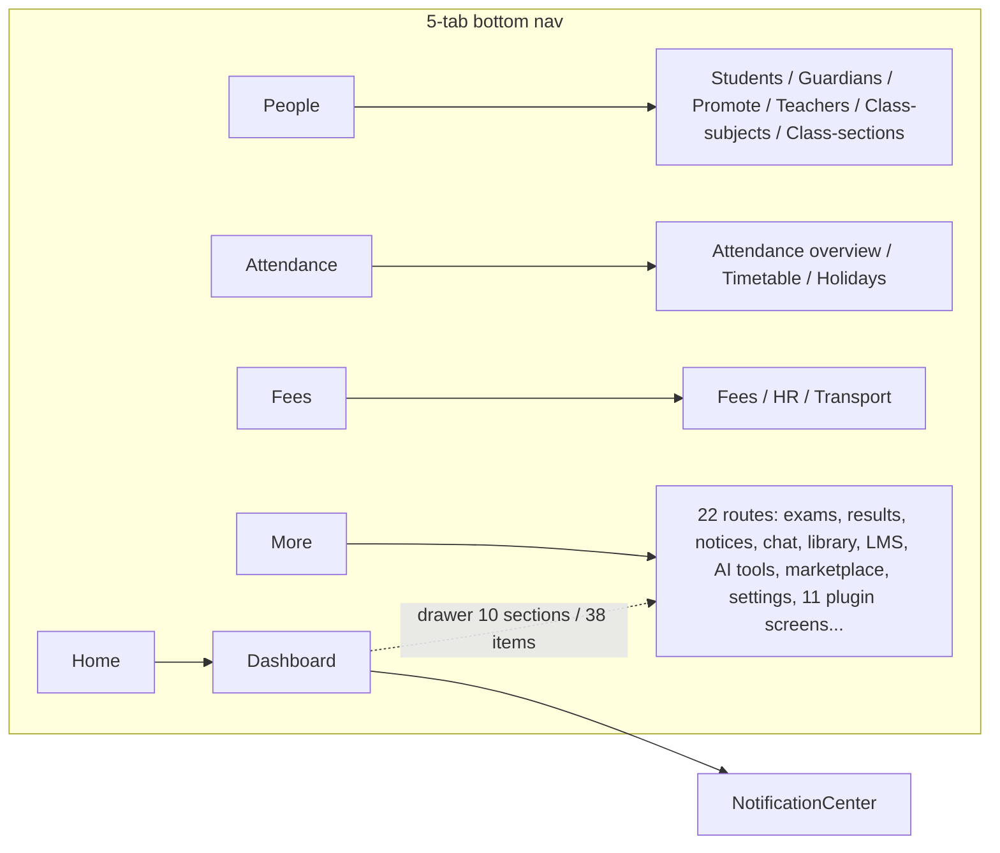
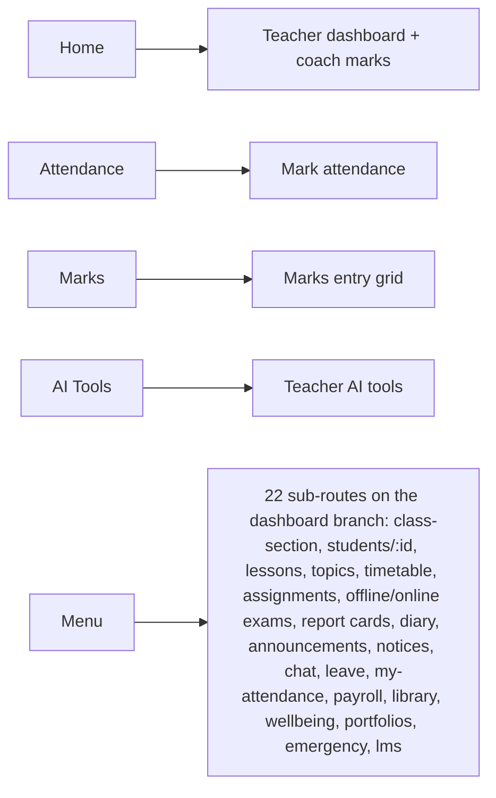
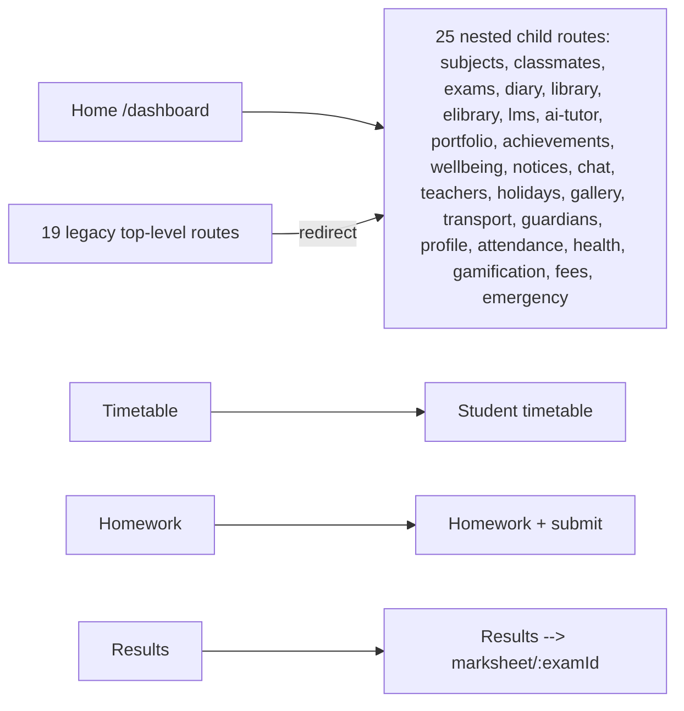
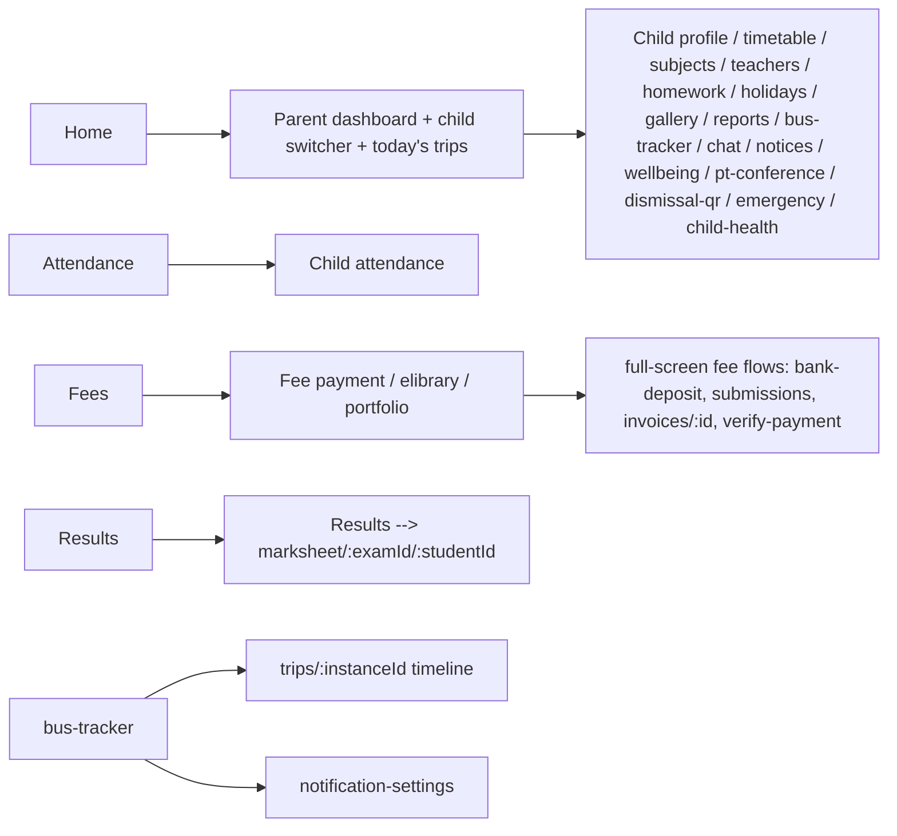
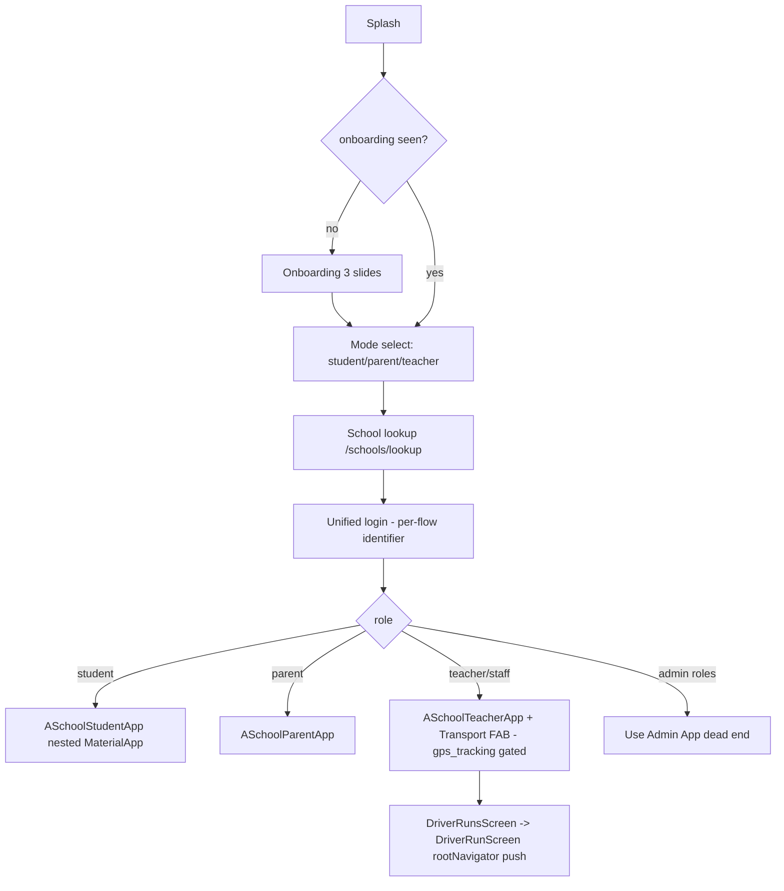

# ASchool Mobile (5 role apps + shared package) — Deep Audit (2026-09-13)

**Surface:** `aschool_shared/` + `flutter_admin/`, `flutter_parent/`, `flutter_student/`, `flutter_teacher/`, `flutter_user/` (all under `/home/bishal-regmi/Desktop/ASchool/`).
**Method:** read-and-grep, not inference — every screen file in all five apps was opened or grep-verified for endpoints/state widgets; routers, shells, mains, pubspecs, and Android manifests were read in full; repository endpoints were cross-checked against `backend/app/api/v1/*.py` route declarations (609 rules) and live-verified with curl against the running API at `http://localhost:5003` (login `admin@demo.aschool.com.np`/`changeme123`). No Flutter build was attempted (no emulator on this machine). Prior corpus (`audits_old/research/ASCHOOL_MOBILE_APPS_INVENTORY.md` 2026-09-04, `ASCHOOL_FLUTTER_WIDGET_AUDIT.md` 2026-09-04, `audits_old/MOBILE_APP_QA_AUDIT.md` 2026-08-27, mobile rows of `audits/AUDIT_INDEX.md` through 2026-09-12) was re-verified claim-by-claim (Section 10).

**Headline numbers (all verified this pass):**

| Metric | Value | Evidence |
|---|---|---|
| Dart files / lines, `aschool_shared` | 108 files / 14,934 lines | `find aschool_shared/lib -name '*.dart' \| xargs wc -l` |
| flutter_admin | 40 files / 10,906 lines (36 feature dirs, 35 screens) | file listing pass |
| flutter_teacher | 32 files / 11,071 lines (17 feature dirs, 26 screens) | file listing pass |
| flutter_student | 34 files / 10,367 lines (20 feature dirs, 27 screens) | file listing pass |
| flutter_parent | 33 files / 8,667 lines (20 feature dirs, 25 screens) | file listing pass |
| flutter_user | 12 files / 2,491 lines (1 feature dir: transport/driver, 7 screens) | file listing pass |
| Total mobile Dart | ~225 files / ~58,400 lines | sum of above |
| Byte-identical files across apps | **0** | md5 over all five `lib/` trees |
| Backend API route rules | 609 across 67 modules | regex over `backend/app/api/v1/*.py` `@bp.route` |
| Plugin dirs / manifests | 42 / 41 (`ai_adaptive_learning` has no manifest) | `RECON_MAP.md` §1.10, confirmed on disk |
| Nepali `t(en, ne)` strings in apps | **9 calls, all in flutter_admin** (parent/student/teacher/user: 0) | `grep -rn "\.t('"` per app |
| `Semantics` / semanticLabel uses | **0** across all six packages | grep |
| Offline storage deps (sqflite/hive/drift/isar) | **0** | grep of all pubspecs |
| `google-services.json` / `GoogleService-Info.plist` | **0** in any app | `find` over all five trees |

---

## 1. Executive Summary

1. **The five-app portfolio is real and unusually deep for a pre-launch product — ~58k lines of Dart over 120 screens — but it is "broad-then-thin":** flutter_admin routes 36 feature directories in which 34 are single-file screens (admin `lib/features/**` = 37 screen files in 36 dirs; only `exams/` has a second file `results/exam_results_screen.dart` 659 L). Depth lives in the role apps where daily work happens: teacher assignments (1,107 L), marks entry (962 L), student online-exam runner (6 files, 2,624 L), parent fees (6 files, 1,944 L) and bus tracker (4 files, 1,323 L).

2. **Two prior-corpus "fake data" findings are STILL TRUE and are the two worst product defects on mobile:** the admin Assignments screen is still a hardcoded `ModuleScreenTemplate` with fabricated "24 Open / 6 Due Today" numbers and dead action buttons (`flutter_admin/lib/features/assignments/assignments_screen.dart:8-31`), and the admin Promote Students screen is still GET-only — it loads `/students?status=active&per_page=100` and has no POST anywhere, so promotion cannot be performed (`flutter_admin/lib/features/students/promote_screen.dart:22-43,78`).

3. **The 2026-09-09→09-12 waves genuinely transformed the mobile surface** (AUDIT_INDEX.md rows A-03, B-05/B-06/B-09, S-A1 A-08, S-A2 A-05, S-A3 A-07/A-30, S-A4): fees got 5 new parent screens incl. bank-deposit slips, invoices, and a real receipt-download path; the student exam runner was rebuilt to eSchool-benchmark level (autosave, server clock, palette, LaTeX, away-auto-submit); transport got a parent trip-timeline + notification-settings surface and a **driver MVP inside flutter_user**; all five apps got an OpsGate (maintenance/force-update) and CrashReporter wired in `main()`. Eleven previously-broken API calls were repointed and now resolve (live-verified). The prior corpus's picture of mobile is therefore significantly stale in the *positive* direction.

4. **However the platform basics are still missing:** push notifications have no `google-services.json`/`GoogleService-Info.plist` in any app and `ONESIGNAL_APP_ID` is unset, so push silently does nothing in any production build (`NotificationService._initOneSignal` logs and returns, `aschool_shared/lib/services/notification_service.dart:114-140`); the notification-tap deep-link path is still dead code — `setOnTapCallback` is defined (`notification_service.dart:250`) and **registered by zero apps** (grep across all five `lib/` trees returns only the definition), and `NotificationCenterScreen`'s tap handler still has an empty `if (notification.actionUrl != null) {}` block (`aschool_shared/lib/widgets/notification_center_screen.dart:133-137`); there is no offline storage of any kind (teacher attendance still comments "no offline queue — the submission was NOT saved", `flutter_teacher/lib/features/attendance/attendance_screen.dart:194`).

5. **i18n is scaffolding, not localization.** `I18nService` with `t(en, ne)` and a `LanguageToggle` widget now exist and are loaded in every `main()` (all five `main.dart`s call `I18nService.instance.load()`), but only **9 strings in flutter_admin** are actually translated (`students_screen.dart:483-514`, `notices_screen.dart`, `shell_screen.dart`); parent/student/teacher/user have **zero** translated strings. For a Nepal-market product this is the single biggest gap between claimed and actual localization. The `_nepaliLanguage` toggle in admin settings (`settings_screen.dart:20,115,378-382`) PATCHes `default_language` on the school — it does not change the app's UI language at all.

6. **The eSchool inheritance is literal and documented in-code.** `aschool_shared/lib/theme/app_theme.dart:16` carries the comment `// eSchool-inspired color tokens`, and `eschool_components.dart`/`eschool_dialog.dart` name every primitive `ESchoolCard`, `ESchoolDialog`, etc. The tokens themselves are not stolen code — they are a small token layer (`#22577A` steel blue primary, `#57CC99` accent) that **contradicts the project's own Forest-Green convention** (`.cursorrules` rule 3: primary `#0e3b2e`; `AI_CODING_GUIDE.md` §3) — and `ESchoolDialog`/`ESchoolTextEditor` hardcode `Colors.white` surfaces that break dark mode inside every dialog (`eschool_dialog.dart:34,145`).

7. **Duplication is structural, not literal:** zero byte-identical files across the five apps (md5), but 75 of 124 feature files re-implement the same `_loading/_error/setState` fetch boilerplate, the admin/teacher AI-tool screens are twin implementations (`ai_tools_screen.dart` 593 L vs `teacher_ai_screen.dart` 473 L, both defining `_AiToolCard`/`_FieldSpec`/detail-state), the four notice screens are 4 copies of a wrapper around `NoticesService`, and the four shells re-implement the same drawer+bottom-nav pattern (pairwise common-line counts are low — 2–10 — because each re-rolls icon/title maps, but the *pattern* is 4×). Roughly **65–70% of app-layer code is genuinely shared via `aschool_shared`** (models/repos/services/widgets/theme), and the remaining ~30% is per-app screen code of which perhaps a third is re-rolled boilerplate that a shared `AsyncScreenScaffold` would absorb.

8. **Zero-mobile-representation: 15 of 42 plugin dirs, 23 of 67 API modules, and 17 of 60 web dashboard routes have ZERO mobile presence** (full enumeration in Section 5). Some are deliberate web-only/back-office scope (website_builder, iemis_importer, white_label); several are outright product gaps for a Nepal school product (hostel, biometric, disaster_management, multi_branch, benchmarking, the whole AI workspace: ai_workbench/ai_capture/ai_usage/adaptive_learning, question bank, student transfers, staff directory, search, faqs).

9. **API-shape alignment is now good.** Of ~100 distinct endpoints referenced in Dart, all but two resolve to real backend rules (`backend/app/api/v1/`): `/library/copies/scan/<code>` exists but returns "No copy matches this barcode" for non-existent barcodes (live), and the parent marksheet navigation uses a router path `/results/marksheet/:examId/:studentId` (router.dart:199-206) whose API (`/parent/child-results`) exists — no drift found. Live curl confirmed 200s for 26 of 28 sampled endpoints (the two non-200s were role/plugin gating, which is correct behavior: `/dismissal/summary` 403 plugin-not-installed, `/transport/routes` 403 gps_tracking not installed).

10. **Five-apps-vs-one-app:** ASchool pays ~5× the store/CI/branding/push-config overhead Mighty School Pro doesn't, and the duplication tax above is the code-side cost. The hedge already exists — `flutter_user` embeds student/parent/teacher as path packages (`flutter_user/pubspec.yaml` deps `aschool_student/parent/teacher`) and now also carries the driver MVP — but it is still the least-shipped artifact (Android+iOS+desktop folders, no signing, no store presence evidence) while the four role apps remain the de-facto products.

---

## 2. Architecture Shape

### 2.1 Layering

```
flutter_admin / _teacher / _student / _parent   (thin app shells)
   main.dart → router.dart (go_router 13.2) → screens/shell_screen.dart → features/**
        │
        └── all domain logic via ──→  aschool_shared (path package in every pubspec)
                  ├── models/      20 domain model files (models.dart barrel, 19 L)
                  ├── repositories/ 19 (incl. ai_repository, gallery_repository without models)
                  ├── providers/   16 Riverpod providers + repository_providers.dart wiring
                  ├── services/    13 (api_client, auth, notification, socket, crash, ops…)
                  ├── widgets/     40 widget files (design system + 4 feature screens)
                  ├── features/    4 shared screens (emergency 346 L, gallery 421 L,
                  │                 holiday 122 L, student attendance 399 L)
                  ├── theme/       app_theme.dart 285 L (ASchoolTheme.light/dark)
                  └── utils/       constants, safe_parse (255 L), nepali_formatter (107 L)

flutter_user  (unified entry: onboarding → mode → school-lookup → unified login)
   └── embeds aschool_student / aschool_parent / aschool_teacher as path packages
       (role_app_host.dart:1-4) + own transport/driver MVP (S-A4)
```

- Every app's `pubspec.yaml` depends on `aschool_shared` via `path:`; flutter_user additionally path-depends on the three role apps (`flutter_user/pubspec.yaml`), making it a superset binary.
- `flutter_student/lib/aschool_student.dart`, `flutter_parent/lib/aschool_parent.dart`, `flutter_teacher/lib/aschool_teacher.dart` are 1-line barrel files that export the app widget — this is the seam flutter_user consumes.

### 2.2 State management

- **Riverpod 2.5, no codegen.** `riverpod_annotation` is declared in shared/teacher/parent pubspecs but no `part '` directive exists anywhere (grep across all six packages: 0 hits) — annotations are dead deps.
- Two coexisting patterns:
  1. **Provider-pattern** (teacher dashboards, parent everything, student results/timetable/exams): `FutureProvider.autoDispose` + `state.when(loading/error/data)` — e.g. `teacherDashboardProvider` (`flutter_teacher/lib/features/dashboard/teacher_dashboard.dart:9-12`), the whole parent app via `parent_providers.dart` (7 family providers keyed on `selectedChildIdForApiProvider`).
  2. **setState-boilerplate pattern**: 75 of 124 feature files carry the identical `bool _loading; String? _error; List<Map<String,dynamic>> _x;` trio with manual `initState → _load()` (grep-verified). This is the dominant pattern in flutter_admin (e.g. `promote_screen.dart:12-43`, `certificates_screen.dart`, `announcements_screen.dart`).
- Parent multi-child model: `selectedChildIdProvider` (StateProvider) + `selectedChildIdForApiProvider` drives every family provider (`flutter_parent/lib/providers/parent_providers.dart:12-14`), consistent across attendance/timetable/wellbeing/results/conferences/dismissal screens (grep `selectedChildIdForApiProvider` in 10 screen files).

### 2.3 API client & auth

- `ApiClient` = Dio singleton, `baseUrl = API_BASE_URL dart-define` **defaulting to `https://api.brighternepal.com`** + `/api/v1` (`aschool_shared/lib/utils/constants.dart:9-13`). Note the default production host is a *brighternepal.com* domain, not aschool.com.np — branding/config smell (README markets api.aschool.com.np).
- `_AuthInterceptor` implements a proper single-flight 401 refresh with a `Completer` queue and retry of the original request (`api_client.dart:39-124`); on refresh failure it wipes secure storage (`api_client.dart:101-104`) — the "silent logout on refresh failure" prior finding remains structurally true, though it now logs the full stack (`debugPrint` at 102).
- Multi-tenancy: `X-School-Slug` header set post-login from `user.schoolSlug` (`auth_service.dart:51,82,119,154`), cleared on logout (`auth_service.dart:196`).
- `AuthService` (StateNotifier) supports three login flows — `loginWithOtp` → `/auth/verify-otp`, `loginWithEmailOrPhone` → `/auth/login`, `loginWithStudentId` → `/auth/student-login` (`auth_service.dart:66-170`) — plus session restore via `/auth/me` that *keeps tokens* on network failure and lands on login rather than hard-logging-out (`auth_service.dart:57-63`, an improvement over the prior corpus's description).
- Logout is a full teardown since M9: clears OneSignal tags, disconnects socket, clears tenant header, deletes storage (`auth_service.dart:186-199`).

### 2.4 Push notifications

- OneSignal primary + FCM fallback + `flutter_local_notifications` (`notification_service.dart:19-276`). Post-login registration of both channels with retry (`auth_service.dart:205-225`) — the "register before auth" prior bug class is addressed by design.
- **But the config is absent:** no `google-services.json`/`GoogleService-Info.plist` in any of the five apps (find over all trees), and `ONESIGNAL_APP_ID` is `String.fromEnvironment` with empty default → `_initOneSignal` warns and returns (`notification_service.dart:115-118`). FCM init throws without Firebase config and is swallowed (`notification_service.dart:106-108`). **Net: push is dead in every build made from this repo.**
- Tap routing: `_handleMessageTap` forwards to `_onTapCallback` (`notification_service.dart:238-242`), but no app ever calls `setOnTapCallback` (grep: only the definition at line 250); local-notification taps just log (`:244-246`); `NotificationCenterScreen` tap handler has an empty deep-link block (`notification_center_screen.dart:133-137`). **Prior finding "notification taps are dead ends" — STILL TRUE in all three layers.**

### 2.5 Ops, crash, versioning (new since prior corpus)

- `OpsGate` wraps every app via `MaterialApp.builder` (all five mains); server-driven maintenance screen + non-dismissible force-update, fail-open on error (`aschool_shared/lib/widgets/ops_gate.dart:1-60`; admin `main.dart:44-46` etc.). Backend flags from `GET/PUT /mobile/version` (live-verified 200; admin settings screen has the version-management form, `settings_screen.dart:516-591`).
- `CrashReporter.init` in every `main()` before `runApp` — installs `FlutterError.onError` + `PlatformDispatcher.onError`, dedupes, caps 20/session, posts to `/mobile/crash` via a bare Dio without auth interceptors (`aschool_shared/lib/services/crash_reporter.dart:1-40`). This is self-hosted crash reporting, not Sentry/Crashlytics — no third-party analytics anywhere (grep: 0).
- `ServerTimeService` + `ServerClock` widget: apps sync authoritative time from `/meta/time` and tick locally (`server_clock.dart:1-14`, live 200 on `/api/v1/meta/time`), displayed in admin shell app bar (`shell_screen.dart:26`).

### 2.6 i18n & Nepal-specifics

- `I18nService`: singleton ChangeNotifier, `t(en, ne)` returns per active language, persisted to SharedPreferences under the same `preferred_language` key the web dashboard uses (`i18n_service.dart:15-57`). `LanguageToggle` widget (93 L) and `ServerClock` consume it; `BsDateField` (501 L) is a real BS-calendar picker with a full 2000–2090 BS day table (`bs_date_field.dart:4-46`), used in admin settings, parent bank-deposit, teacher leave (grep: 3 feature files).
- Adoption is the problem: 9 `t()` calls in flutter_admin; **0 in the other four apps**; 3 shared widgets use it. UI is English-first with a toggle that currently changes almost nothing.
- `NepaliDateDisplay`/`adToBsString` used across screens (e.g. `certificates_screen.dart` trailing BS date, `principal_dashboard.dart:122-125` AI-brief BS date).
- No `flutter_localizations`, no `.arb` files (grep: 0) — the i18n approach is hand-rolled `t()` rather than Flutter's gen-l10n.

### 2.7 Socket layer

- `SocketService` wraps socket_io_client with token auth + school query, `joinSchool` room, reconnect (`socket_service.dart:1-64`). **Consumers: exactly two** — `auth_service.dart` (disconnect on logout) and `flutter_parent/lib/features/chat/parent_chat_screen.dart` (chat). The `bus_location` event constant exists (`constants.dart:28`) and has **zero consumers** (grep across all apps) — the parent bus tracker still polls every 15 s via `Timer.periodic` (`bus_tracking_screen.dart:36`).

### 2.8 Platform posture (pubspecs + manifests, read in full)

| App | Platforms on disk | applicationId | Extra deps beyond shared |
|---|---|---|---|
| flutter_admin | android only | np.com.aschool.aschool_admin | fl_chart, package_info_plus |
| flutter_teacher | android + web | np.com.aschool.aschool_teacher | showcaseview (coach marks), speech_to_text (**still never imported**), intl, shared_preferences |
| flutter_student | android only | np.com.aschool.aschool_student | wakelock_plus, flutter_tex (exam runner), fl_chart (**declared, never imported** — grep 0), dio/firebase/socket redeclared (already in shared) |
| flutter_parent | android only | np.com.aschool.aschool_parent | flutter_map, latlong2, url_launcher, image_picker, qr_flutter, webview_flutter, dio, intl |
| flutter_user | android, ios, web?, linux, macos, windows folders | np.com.aschool.aschool_user | geolocator, wakelock_plus, onesignal_flutter redeclared; `dependency_overrides: web: ^1.0.0` |

- All Android: minSdk 24, targetSdk = flutter default, no flavors, no signing config (`build.gradle.kts:34-40` in each app).
- Manifests: admin needs only INTERNET + POST_NOTIFICATIONS; parent/user add FINE/COARSE_LOCATION (driver GPS). The only `VIEW https` blocks are `<queries>` (package-visibility for url_launcher payment pages, `flutter_parent/android/app/src/main/AndroidManifest.xml:44-52`) — **no deep-link intent-filters in any app** (prior finding still true).
- **Version-pinning fragility still present:** teacher pins `web: 0.5.1` to co-exist with shared's `share_plus ^9` while flutter_user overrides `web ^1.0.0` (`flutter_teacher/pubspec.yaml` dependency_overrides vs `flutter_user/pubspec.yaml`) — the same package graph resolves to conflicting majors depending on the entry app, documented only in a comment.
- Dead deps (declared, zero imports, grep-verified): `speech_to_text` (teacher), `fl_chart` (student), `retrofit` + `riverpod_annotation` (shared), `mobile_scanner`/`geolocator` in shared are *declared* there and used only via flutter_user/parent's own declarations, `connectivity_plus` (shared + student) never imported, `lottie`/`flutter_animate` (shared) never imported, `share_plus` used only by parent receipt path.

### 2.9 Testing

- All five apps ship the identical placeholder test that pumps a `SizedBox` (read all five `test/widget_test.dart` — "admin/teacher/student/parent test harness builds").
- `aschool_shared/test/`: 3 real files, 537 lines (models_test 311 L, nepali_formatter_test 71 L, plugin_gate_test 155 L) + a `simulation/` dir. AUDIT_INDEX records "aschool_shared tests 49/49" (2026-09-10 row). Nothing tests ApiClient refresh, any screen, or any router.

---

## 3. Per-App Deep Pass

Depth classification legend —
- **full**: real implementation, API-backed, ≥2 of (create/write path, multiple data views, standard loading/error/empty states), ≥150 lines of genuine UI logic.
- **thin**: API-backed but single GET, read-only list, ≤~1 meaningful data view; or minimal UI over one endpoint.
- **stub**: no backend wiring / fabricated data.
- **dead**: file exists but unrouted/unreachable.

### 3.1 flutter_admin (`np.com.aschool.aschool_admin`) — 40 files / 10,906 lines

**Shell:** 5-tab bottom nav (Home / People / Attendance / Fees / More) + `AppDrawer` with **10 drawer sections holding 38 drawer items** (`shell_screen.dart:72-324`), each plugin-gated via `isLocked: !plugins.isInstalled(...)`. App bar carries ServerClock, LanguageToggle, NotificationBell, and a Marketplace shortcut (`shell_screen.dart:26-38`). 18 routes render their own local app bar (`_usesLocalAppBar`, `shell_screen.dart:410-437`).

**Router:** `StatefulShellRoute.indexedStack` with 5 branches; 37 local GoRoutes + `/login` (SharedLoginScreen, LoginType.staff) + `/notifications` + shared `/holidays`, `/gallery`, `/chat` (`router.dart:71-219`). All 37 feature files are routed — **0 dead files in admin**. (The former social_hub screen/route was removed by A-03; confirmed absent.)

**Route map (every screen, file:lines, depth):**

| Route | Screen file (lines) | API calls (verified) | Depth |
|---|---|---|---|
| /dashboard | `features/dashboard/principal_dashboard.dart` (443) | GET `/analytics/overview` + `/ai-tools/insights/daily-brief` + `/fees/recent` in parallel (`:34-41`); KPIs, fl_chart bar chart, plugin-gated quick actions, recent activity | **full** — but chart is `FlTitlesData(show:false)` unreadable (`:217`) and recent-activity rows are not tappable (`:290-307`) |
| /students | `features/students/students_screen.dart` (563) | GET/POST/PUT/DELETE `/students`, GET `/academics/classes` (`:74,219,300,437`); debounced search (350 ms, `:498-502`), class filter, infinite scroll `has_next` (`:79`), enroll sheet (AI-assist mentioned in doc comment `:7-9` but `showAiFormAssistSheet` never called), edit sheet, delete confirm | **full** — the admin app's best screen; fixed since prior corpus (was search-per-keystroke + empty onTap) |
| /guardians | `features/students/guardians_screen.dart` (173) | GET `/users?role=guardian` | thin (read-only list) |
| /promote | `features/students/promote_screen.dart` (78) | GET `/students?status=active&per_page=100` only (`:28-29`) — **no POST; promotion impossible** | **thin/broken** — STILL TRUE from prior corpus |
| /teachers | `features/teachers/teachers_screen.dart` (275) | GET/POST/DELETE `/users` (`:29,240,180`) — staff CRUD with delete + create | full |
| /class-subjects | `features/academics/class_subjects_screen.dart` (138) | via AcademicDataService | thin |
| /class-sections | `features/academics/class_sections_screen.dart` (109) | via AcademicDataService | thin |
| /attendance | `features/attendance/attendance_overview.dart` (146) | GET `/attendance/school-overview` (live 200) | thin (single overview GET) |
| /timetable | `features/timetable/timetable_screen.dart` (75) | GET `/timetable` — read-only "Day X Period Y" list | thin — STILL no grid |
| /holidays | shared `HolidayListScreen` | GET via notice repo | thin (shared) |
| /fees | `features/fees/fees_management.dart` (233) | GET `/fees/summary` + `/fees/recent` + `/fees/outstanding` (all live 200) | full (3 views; but **no fee-structure mgmt, no invoices/aging/day-closure surface** the S-A1 backend now has) |
| /hr | `features/hr_payroll/hr_payroll_screen.dart` (258) | 3× GET `/users?role=teacher|staff|accountant` + GET `/hr/payroll` + `/hr/leave` (`:31-38`; both live 200) | thin-full boundary: 3-tab read-only; **leave rows still have no approve/reject actions** (prior finding still true) |
| /transport | `features/transport/transport_screen.dart` (343) | GET/POST `/transport/routes`, `/transport/buses`, GET `/transport/gps-logs` (`:44-48,150,199`) | full for routes/buses/GPS log — but **predates the S-A4 trip model entirely**: no `/transport/trips`, no instances, no monitor (grep "trips|instances" in file: 0) |
| /reports | `features/reports/reports_hub_screen.dart` (70) | GET `/reports/dashboard` (live 200) | thin (single KPI read) |
| /analytics | `features/analytics/analytics_screen.dart` (245) | GET `/analytics/overview`; PluginGate `basic_reports` | thin (duplicates dashboard's data source) |
| /assignments | `features/assignments/assignments_screen.dart` (34) | **NONE — static `ModuleScreenTemplate` with hardcoded "24 Open"/"6 Due Today" insights and action buttons with no onTap** (`:8-31`) | **STUB — STILL TRUE, worst defect in the app** |
| /exams | `features/exams/exams_screen.dart` (294) | GET `/exams`, GET `/exams/<id>/subjects` (`:30,203`); create dialog | full |
| /exam-results | `features/exams/results/exam_results_screen.dart` (659) | results publish/browse flow | **full** (largest admin screen) |
| /notices | `features/notices/notices_screen.dart` (204) | NoticesService + DELETE `/notices/<id>` (`:181`); 0 std-state widgets (uses its own) | full |
| /announcements | `features/communications/announcements_screen.dart` (140) | GET `/notices?is_published=true&per_page=100` + POST create dialog | thin (it's a notices republisher) |
| /gallery | shared `GalleryScreen(canCreateAlbum: true)` | `/files/` | full (shared, 421 L) |
| /chat | shared `SharedChatScreen` | `/communications/*` | full (shared, 773 L) |
| /certificates | `features/certificates/certificates_screen.dart` (76) | GET `/design-studio/templates` (live 200) | thin (read-only template list) |
| /library | `features/library/library_screen.dart` (215) | GET `/library/books` + `/library/issues` (live 200) | thin — **predates library v2**: no copies/scan/holds/fines/stock-take (25+ new endpoints from B-api unused) |
| /ai-tools | `features/ai_tools/ai_tools_screen.dart` (593) | AiRepository → `/ai-tools/question-paper|lesson-plan|remarks|timetable`, `/ai-tools/insights/weekly`, GET `/academics/years` (`ai_repository.dart:26-100`); PluginGate `ai_tools` (note: drawer still gates this item on `ai_insights` — slug inconsistency, `shell_screen.dart:297-300` vs screen's own `ai_tools` gate at `:17-20`) | full |
| /incidents | `features/incidents/incident_screen.dart` (184) | GET `/incidents` (live: 403 = plugin-gated correctly for demo school) | thin (list only) |
| /compliance | `features/compliance/compliance_screen.dart` (227) | GET `/compliance/reports` + `/compliance/audit-logs`, POST `/compliance/reports/generate` (`:29-33,58-64`; live 200) | full (3 report types: EMIS, MoE Flash I/II) |
| /wellbeing | `features/wellbeing/wellbeing_screen.dart` (391) | GET `/wellbeing/dashboard` + `/wellbeing/alerts?status=active` + `/wellbeing/surveys` (all live 200) | full |
| /lms | `features/lms/lms_screen.dart` (246) | GET `/lms/courses` + `/lms/live-classes?status=upcoming` (live 200) | thin (read-only overview) |
| /admission | `features/admission/admission_screen.dart` (257) | GET `/admission/applications|inquiries|dashboard` (A-03 repoints verified) | full (3-tab funnel) |
| /alumni | `features/alumni/alumni_screen.dart` (285) | GET `/alumni` + `/alumni/events` + `/alumni/donations` (live 200) | full |
| /health-records | `features/health_records/health_records_screen.dart` (299) | GET `/health-records/profiles?per_page=30` (+immunizations per A-03) | full |
| /gamification | `features/gamification/gamification_screen.dart` (218) | GET `/gamification/leaderboard?per_page=20` + `/gamification/badges?per_page=20` | thin (2 lists) |
| /visitors | `features/visitor_management/visitor_screen.dart` (348) | GET `/visitors?date=today`, POST `/visitors/checkin`, GET `/visitors/badge/<code>` (live 200) | full (check-in flow + badge lookup — A-03 additions) |
| /inventory | `features/inventory/inventory_screen.dart` (346) | GET/POST/PUT/DELETE `/inventory/assets` (`:36,112,147,325`) — rewritten to real asset model per A-03 | full |
| /design-studio | `features/design_studio/design_studio_screen.dart` (278) | GET `/design-studio/templates` + `/design-studio/documents?per_page=20`; PluginGate `design_studio`; honest empty states ("Use the web dashboard to create templates") | thin-full boundary (browse-only by explicit design) |
| /emergency | `features/emergency/emergency_screen.dart` (429) | GET `/emergency/alerts?per_page=30`, POST `/emergency/alerts`, GET `/emergency/plans` (B-09 repoint verified); PluginGate `emergency` | full (trigger + history + evacuation tabs) |
| /dismissal | `features/dismissal/dismissal_screen.dart` (350) | GET `/dismissal/summary` + `/dismissal/records?per_page=30`; 3 tabs incl. Scan QR; PluginGate `dismissal` | full — but QR tab is still a placeholder ("QR scanner coming soon" pattern; mobile_scanner never imported) |
| /marketplace | `features/marketplace/marketplace_screen.dart` (319) | PluginRepository: `/plugins/marketplace|installed|install|uninstall` (correct body shape documented at `:289-291`) | full — the only in-app plugin store in the portfolio |
| /settings | `features/settings/settings_screen.dart` (655) | GET/PATCH `/schools/current` (×3 forms), POST `/auth/change-password`, GET/PUT `/mobile/version` (`:34,285,341,379,414,516,590`) | full (school profile, branding, password, force-update version mgmt, Nepali-language flag) |

**Admin verdict: 36 feature dirs — 20 full, 15 thin, 1 stub. Zero dead.** The thin tier is exactly the "one GET, one list" pattern the recon predicted: 36 dirs but only 37 screen files; depth is concentrated in dashboard/students/exam-results/settings/marketplace/emergency/visitors/inventory.

### 3.2 flutter_teacher (`np.com.aschool.aschool_teacher`) — 32 files / 11,071 lines

**Shell:** 5 tabs (Home / Attendance / Marks / AI Tools / Menu) + drawer built from a `_TeacherDrawerItem` list with **module-visibility + plugin-slug double gating** (`shell_screen.dart:284-301` — the only shell that honors per-role module visibility, `isModuleVisible`). Teacher + web platforms.

**Router:** 4 branches; the dashboard branch carries **22 sub-routes** (`router.dart:88-173`) — teacher is the deepest IA. 26 routed screens + shared holidays/chat/emergency. 0 dead files (coach_marks.dart is a helper consumed by the dashboard, `teacher_dashboard.dart:38-40`).

| Route | Screen (lines) | API (verified) | Depth |
|---|---|---|---|
| /dashboard | `dashboard/teacher_dashboard.dart` (631) | GET `/teacher/dashboard` (live 200) via FutureProvider; today's classes, stats, notices; **coach-mark tour** (showcaseview, once-only, `coach_marks.dart:111` L, fired post-frame at `teacher_dashboard.dart:38-40`) | **full** |
| /attendance | `attendance/attendance_screen.dart` (565) | GET `/teacher/my-classes`, GET `/attendance/students/<classId>`, POST `/attendance/submit` (`:11,17,65`); per-student P/A/L toggles, bulk all-present, haptics, confirm dialog, **retry snackbar with honest "no offline queue — the submission was NOT saved"** (`:194`) | **full** — best screen in the portfolio; offline gap still true |
| /marks | `marks/marks_entry_screen.dart` (962) | GET `/teacher/my-classes`, GET `/exams?status=ongoing,completed`, GET marks, POST `/exams/<id>/marks` (`:9-10,35,100`); full grid, live totals, NEB grade pill | **full** |
| /ai-tools | `ai_tools/teacher_ai_screen.dart` (473) | AiRepository (question-paper, lesson-plan, remarks) + ClipboardService; PluginGate `ai_tools` | full (twin of admin's implementation — see §4) |
| /class-section | `class_section/class_section_screen.dart` (661) | GET `/teacher/my-classes` + section mgmt | full |
| /students | `students/class_students_screen.dart` (221) | GET `/teacher/my-students` (live 200) | thin (roster) |
| /students/:id | `students/student_profile_screen.dart` (316) | StudentRepository | full |
| /lessons, /topics, lesson detail, topic detail | `lessons/*.dart` (466+490+515+285) | POST `/lms/lessons`, POST `/lms/topics`, GET/POST `/lms/materials` (`create_lesson:383, create_topic:408, topic_detail:12,50, lesson_detail:78,428`) + FileUploadService | full ×4 |
| /assignments | `assignments/assignments_screen.dart` (1,107) | GET `/teacher/assignments`, GET `/assignments/<id>/submissions`, POST grade + create (`:10,37,622,717,880`) | **full** — largest screen in the portfolio |
| /offline-exam | `exams/offline_exam_screen.dart` (637) | GET `/exams` + `/teacher/my-classes`; schedule/enter | full |
| /online-exam | `exams/online_exam_screen.dart` (180) | GET/POST `/exams/online` (live 200) | thin (create/list only — authoring, not monitoring) |
| /report-cards | `exams/report_cards_screen.dart` (345) | GET `/exams` + `/teacher/my-classes` | thin (generate/view trigger) |
| /diary | `diary/diary_write_screen.dart` (176) | POST `/communications/diary` (`:138`) | thin (dialog-based authoring) |
| /announcements | `announcements/announcement_screen.dart` (397) | GET `/notices`, POST `/notices` (A-03 repoint verified) | full |
| /notices | `notices/teacher_notices_screen.dart` (120) | NoticesService fetch + create | thin (shared wrapper + create) |
| /chat | shared SharedChatScreen | `/communications/*` | full (shared) |
| /leave | `leave/leave_screen.dart` (241) | GET/POST `/hr/leave` (live 200; note backend also has `/hr/leaves` GET — both exist, `hr_payroll.py:633,649`) | thin (apply + list; no balance, no sick-note attach) |
| /my-attendance | `leave/my_attendance_screen.dart` (102) | GET `/attendance/me?per_page=60` (live 200) | thin |
| /payroll | `payroll/payroll_slips_screen.dart` (103) | HrRepository `/hr/payroll` (live 200) | thin (slips list) |
| /library | `library/teacher_library_screen.dart` (336) | GET `/library/teacher/library` (live 200) | thin-full (issues view; **no scan/renew/holds actions** from library v2) |
| /student-wellbeing | `wellbeing/student_wellbeing_screen.dart` (268) | GET `/teacher/wellbeing` (new A-03 endpoint, live 200) | full |
| /portfolios | `portfolio/student_portfolios_screen.dart` (268) | GET `/teacher/portfolios` (B-05 fix verified live 200) + POST | full |
| /emergency | shared `EmergencyAlertsScreen(usePluginGate:true, allowHeadcount:true)` (`router.dart:161-168`) | `/emergency/*` | full (shared, role-configured) |
| /lms | `lms/lms_overview_screen.dart` (352) | GET `/lms/courses?created_by=me` + `/lms/live-classes?mine=1` (A-03 `mine=1` verified) | full |
| /timetable | `timetable/timetable_screen.dart` (179) | GET `/teacher/timetable` (live 200) | thin (read-only) |
| /holidays | shared HolidayListScreen | — | thin (shared) |

**Teacher verdict: 17 feature dirs — 14 full, 13 thin screens, 0 stub, 0 dead. Deepest role app. `speech_to_text` still a dead dependency (declared `pubspec.yaml:22`, imported nowhere).**

### 3.3 flutter_student (`np.com.aschool.aschool_student`) — 34 files / 10,367 lines

**Shell:** 4 tabs (Home / Timetable / Homework / Results) + drawer; **19 legacy top-level routes redirect into `/dashboard/*`** (`router.dart:39-59` `_legacyStudentRouteRedirects`) — a migration shim that keeps old links alive.

| Route | Screen (lines) | API (verified) | Depth |
|---|---|---|---|
| /dashboard | `dashboard/student_dashboard.dart` (778) | dashboardProvider + currentStudentProvider + plugin grid; 10 private widget classes (`:190-736`) | **full** |
| /dashboard/subjects | `subjects/subjects_screen.dart` (129) | AcademicDataService | thin |
| /dashboard/classmates | `classmates/classmates_screen.dart` (113) | **GET `/students?per_page=100` — still the roster-leaking workaround, NOT the S0-built `/student/classmates`** (`classmates_screen.dart:29-31`; backend B-07 endpoint exists and StudentRepository has `getClassmates()` at `student_repository.dart:73` — the switch was deferred to S9 and hasn't happened) | thin + known-deferred defect |
| /dashboard/exams | `exams/student_exams_screen.dart` (329) | examsProvider (GET `/exams` + `/exams/online`) | full |
| /dashboard/exams → runner | `exams/runner/*` (6 files: runner 846, state 439, gate sheet 367, result 208, math 64, + entry) | POST `/exams/online/<id>/start`, GET `.../take`, PATCH `.../attempt`, POST `.../submit` (`exam_repository.dart:134-247`) — T&C gate, PageView one-question, palette, 1.6-s debounced autosave, server-clock countdown, wakelock, away>5 s auto-submit, flutter_tex LaTeX (`exam_math_text.dart`) | **full — S-A2 rebuild verified; the most sophisticated flow in the portfolio** |
| /dashboard/diary | `diary/diary_read_screen.dart` (109) | GET `/notices?...` filtered | thin |
| /dashboard/library | `library/student_library.dart` (310) | GET `/student/library` (live: gated 200-shape w/ student profile error on admin token — correct), POST `/student/library/request` (real reservation since B-fixes, `:288-289`) | full |
| /dashboard/elibrary | `elibrary/elibrary_screen.dart` (170) | GET `/student/elibrary` (live 200) | thin (eBooks/past-papers tabs) |
| /dashboard/lms | `lms/student_lms.dart` (631) | GET `/student/lms` + POST progress (`:36,602`) | full |
| /dashboard/ai-tutor | `ai_tutor/ai_tutor_screen.dart` (367) | POST `/ai-tools/homework-help` (`:53-57`); subject chips, typing indicator, quick prompts | full — but **still no session history** (backend `/ai-tutor/sessions*` family unused — `ai_tutor.py:90-154` has 5 session endpoints with zero mobile consumers), no image input, no markdown |
| /dashboard/portfolio | `portfolio/portfolio_screen.dart` (357) | GET `/student/portfolio` | full |
| /dashboard/achievements | `achievements/achievements_screen.dart` (387) | GET `/student/achievements` | full |
| /dashboard/wellbeing | `wellbeing/student_wellbeing.dart` (346) | GET `/student/wellbeing`, POST mood (`:40,261,286`) | full |
| /dashboard/notices | `notices/student_notices.dart` (53) | NoticesService(targetRole:'student') | thin (shared wrapper) |
| /dashboard/chat | shared SharedChatScreen | — | full (shared) |
| /dashboard/teachers | `teachers/teachers_list_screen.dart` (93) | GET `/users?role=teacher&per_page=100` | thin |
| /dashboard/transport | `transport/student_transport_screen.dart` (94) | GET `/transport/routes?per_page=100` | thin (read-only route list; no live tracking, no assigned-stop info) |
| /dashboard/guardians | `guardians/guardian_details_screen.dart` (110) | GET `/auth/me` → `/students` → `/students/<sid>/guardians` (3-hop chain, `:30-44`) | thin |
| /dashboard/profile | `profile/student_profile_screen.dart` (365) | multi-provider | full |
| /dashboard/attendance | `attendance/student_attendance_screen.dart` (471) | GET `/attendance/student/<id>` + `/attendance/student/<id>/summary` (live family) | full |
| /dashboard/health | `health_records/student_health_screen.dart` (272) | GET `/health-records/visits` + `/health-records/immunizations` (A-03 repoint) | full |
| /dashboard/gamification | `gamification/gamification_screen.dart` (363) | GET `/student/achievements` + `/gamification/houses` (live 200) | full |
| /dashboard/fees | `fees/student_fees_screen.dart` (339) | GET `/student/fees` (B-06 contract) + **"ask parents to pay" nudge** POST `/fees/students/<id>/nudge-parent` (`fee_repository.dart:232`) | full (S-A1 additions verified) |
| /dashboard/emergency | shared EmergencyAlertsScreen(perPage:10, banner) | — | full (shared) |
| /homework | `homework/homework_screen.dart` (636) | GET assignmentsProvider, POST `/student/assignments/<id>/submit` (`:315-319`); **submission attachment is STILL a paste-URL TextField** (`:363-390` "Attach File URL" dialog, `labelText: 'File URL'`) — no camera/gallery | full but **attachment UX defect STILL TRUE** |
| /results + /results/marksheet/:examId | `results/student_results.dart` (359) + `student_marksheet_screen.dart` (282) | resultsProvider GET `/student/results`, GET `/exams/<id>/marksheet/<sid>` (live family) | full (no PDF export/share) |
| /timetable | `timetable/student_timetable.dart` (269) | timetableProvider GET `/student/timetable`; FilterChipRow day filter | thin-full |

**Student verdict: 20 feature dirs — 13 full, 7 thin, 0 stub, 0 dead. `fl_chart` declared but never imported (pubspec.yaml:39).**

### 3.4 flutter_parent (`np.com.aschool.aschool_parent`) — 33 files / 8,667 lines

**Shell:** 4 tabs (Home / Attendance / Fees / Results) + drawer; cleanest architecture — every data screen is a `family FutureProvider` keyed on the selected child.

| Route | Screen (lines) | API (verified) | Depth |
|---|---|---|---|
| /dashboard | `dashboard/parent_dashboard.dart` (622) | GET `/parent/dashboard` + child switcher + plugin-gated tiles (`:13-43,253`) | **full** |
| /child-profile | `profile/child_profile_screen.dart` (432) | GET `/parent/child-profile` | full |
| /timetable | `timetable/child_timetable_screen.dart` (75) | `/parent/child-timetable` | thin |
| /subjects | `subjects/child_subjects_screen.dart` (138) | via provider family | thin |
| /teachers | `teachers/teachers_screen.dart` (108) | GET `/communications/contacts` (live 200) | thin |
| /homework | `homework/homework_screen.dart` (114) | GET `/parent/assignments` (read-only) | thin |
| /holidays, /gallery | shared screens | — | thin/full (shared) |
| /reports | `reports/child_reports_screen.dart` (396) | parentResultsProvider + print twins | full |
| /bus-tracker | `bus_tracker/bus_tracking_screen.dart` (306) | GET `/parent/bus-info` + **15-s `Timer.periodic` polling** (`:36,53-57`) — Socket.IO `bus_location` still unused | full (map + driver card + ETA pill) |
| /transport/trips/:instanceId | `bus_tracker/trip_timeline_screen.dart` (435) | transportInstanceDetailProvider — stop timeline planned vs actual (`:33-64`) | **full (new S-A4)** |
| /transport/notification-settings | `bus_tracker/transport_notification_settings_screen.dart` (382) | GET/PUT `/transport/notification-prefs` — 7 event toggles + radius (`:54-146`) | **full (new S-A4)** |
| (dashboard section) | `bus_tracker/todays_trips_section.dart` (200) | transportInstancesForDateProvider | full (new) |
| /chat | `chat/parent_chat_screen.dart` (315) | GET `/parent/chat-threads` + SocketService (the ONLY socket consumer) | full |
| /notices | `notices/parent_notices_screen.dart` (55) | NoticesService(parent) | thin (shared wrapper) |
| /wellbeing | `wellbeing/child_wellbeing_screen.dart` (218) | `/parent/child-wellbeing` | full |
| /pt-conference | `pt_conference/pt_conference_screen.dart` (447) | `/parent/conferences` + GET slots + POST book (`:95,193`) — now with slot booking | full |
| /dismissal-qr | `dismissal/dismissal_qr_screen.dart` (305) | `/parent/dismissal-status` | full |
| /emergency | shared EmergencyAlertsScreen | — | full (shared) |
| /child-health | `health_records/child_health_screen.dart` (307) | GET `/parent/child-health?type=records|vaccinations|allergies` (3 calls, `:41-43`) | full |
| /fees | `fees/fee_payment_screen.dart` (460) | GET `/fees/payment-methods` (live 200), POST `/fees/initiate-payment` (live 400 on empty body = exists+validates), parentFeesProvider `/parent/outstanding-fees` | **full** |
| /fees/bank-deposit | `fees/bank_deposit_screen.dart` (443) | POST `/fees/offline-submissions` w/ slip upload (BsDateField used) | **full (new S-A1)** |
| /fees/submissions | `fees/offline_submissions_screen.dart` (209) | GET `/fees/offline-submissions` | full (new) |
| /fees/invoices + /fees/invoices/:id | `fees/invoices_screen.dart` (429) | GET `/fees/invoices`, GET `/fees/invoices/<id>` | **full (new)** |
| /fees/verify-payment | `fees/payment_verification_screen.dart` (288) | 3-state verification after gateway return; `receipt_launcher.dart` (73 L) downloads receipt PDF bytes through authed ApiClient → temp file → platform viewer (`receipt_launcher.dart:26-71`) | **full (new — closes the prior "no receipt" gap)** |
| /elibrary | `elibrary/parent_elibrary_screen.dart` (175) | GET `/parent/elibrary` | thin |
| /portfolio | `portfolio/parent_portfolio_screen.dart` (270) | GET `/parent/portfolio` | full |
| /results + marksheet | `results/results_screen.dart` (229) + `parent_marksheet_screen.dart` (309) | `/parent/child-results` (live 200) + `/exams/<id>/marksheet/<sid>` | full |
| /attendance | `attendance/child_attendance.dart` (162) | `/parent/child-attendance` | thin-full |

**Parent verdict: 20 feature dirs — 16 full, 9 thin screens, 0 stub, 0 dead. Strongest app; the fees suite (6 files, 1,944 L) is the biggest mobile improvement since the prior corpus.**

### 3.5 flutter_user (`np.com.aschool.aschool_user`) — 12 files / 2,491 lines

**Dual personality, both verified:**
1. **Unified entry app** (unchanged architecture from prior corpus): `_UserEntryFlow` stage machine `loading → onboarding → mode → school → login` (`role_app_host.dart:110-232`), `EntryStage`/`LoginFlow` enums in `state/auth_flow_controller.dart:4-8`, school lookup hits GET `/schools/lookup` (verified exists, `schools.py:167`), then after auth `resolveRoleTarget` maps role → embeds `ASchoolStudentApp`/`ASchoolParentApp`/`ASchoolTeacherApp` as nested MaterialApps (`role_app_host.dart:24-35`). Admin roles get the "Use Admin App" dead-end screen (`:234-284`). One brand accent everywhere now (the per-role rainbow accents were removed — `auth_flow_controller.dart:67-70` comment).
2. **Driver MVP (new, S-A4):** for teacher/staff tokens with `gps_tracking` installed, `StaffAppWithTransport` overlays a green Transport FAB on the teacher app (`role_app_host.dart:50-86`) → `DriverRunsScreen` (257 L, 15-s auto-refresh timer, `:21-34`) → `DriverRunScreen` (658 L): Start run, geolocator stream with ≥3-s client throttle + in-flight guard + wakelock (`driver_run_screen.dart:31-38,185-199`), Board/Missed per waiting passenger, Drop-off per stop, End with 409-onboard dialog (`:108-120`), all through `TransportRepository` instance actions (start/position/pickup/dropoff/end — `transport_repository.dart:122-193`).

| Screen | File (lines) | Depth |
|---|---|---|
| Splash | `screens/splash_screen.dart` (43) | thin |
| Onboarding (3-slide PageView) | `screens/onboarding_screen.dart` (283) | full |
| Mode selection | `screens/mode_selection_screen.dart` (198) | full |
| School lookup | `screens/school_lookup_screen.dart` (333) | full (live search; still no debounce-recents — fires per keystroke ≥2 chars) |
| Unified login | `screens/unified_login_screen.dart` (297) | full — still a second login implementation beside SharedLoginScreen (2 login stacks in repo, prior finding still true) |
| Driver runs list | `features/transport/driver_runs_screen.dart` (257) | full |
| Driver run | `features/transport/driver_run_screen.dart` (658) | **full** |
| Role host / Unsupported / GlowOrb | `widgets/role_app_host.dart` (284) + `widgets/glow_orb.dart` (27) | infra |

**User verdict: 1 feature dir (transport) — full; 5 entry screens — real. The "flutter_user = thin shell" prior verdict is now half-wrong: it's a thin shell PLUS a 915-line driver app.** Only app with ios/linux/macos/windows folders; still the only plausible iOS shipping vehicle.

**Unrouted/dead-file sweep across all five apps: 0 dead files.** Every feature dart file maps to a route or is consumed by a routed screen (verified by importing-router cross-check of all file listings against router imports).

---

## 4. Shared vs Duplicated Quantification

### 4.1 What genuinely lives in `aschool_shared` (108 files / 14,934 lines)

| Layer | Files | Lines | Role |
|---|---|---|---|
| models/ | 21 (20 domain + barrel) | ~2,444 | typed JSON models: student, exam (413 L), fee (248 L), transport (397 L), timetable_slot, attendance, assignment, chat, guardian, hr, in_app_notification, lesson, notice, plugin_manifest, school, section, subject, user, class_model, academic_year |
| repositories/ | 19 | ~1,795 | api, attendance, assignment, chat, exam (289), fee (322), gallery, hr, lesson, notice, notification, plugin, student, timetable, transport (223), academic, exceptions + barrels |
| providers/ | 16 | ~674 | repository wiring + dashboard/exams/timetable/transport/chat/notification/theme providers |
| services/ | 13 | ~1,681 | api_client (124), auth (230), notification (280), plugin_provider (213), file_upload (194), crash_reporter (142), mobile_version (124), notices (91), socket (64), server_time (62), i18n (58), academic_data (109) |
| widgets/ | 40 | ~5,600 | the design system + 4 feature screens (see §6 and below) |
| theme/ + utils/ + features/ | 8 | ~2,100 | theme 285, safe_parse 255, constants, nepali_formatter, emergency 346, gallery 421, holiday 122, student-attendance 399 |

Every widget in the state-kit family is real and multi-app: `ErrorContainer`/`NoDataContainer`/`LoadingShimmer`/`PullToRefresh` appear across all apps (grep counts of the trio in feature files: 2–6 per admin screen); `PluginGate` is used in **43 screen files** across apps (admin 13, teacher 5, student 11, parent 13, user 1); shared feature screens (HolidayListScreen 4 routers, GalleryScreen 3 routers, EmergencyAlertsScreen 3 routers with per-role config, SharedChatScreen 3 routers, NotificationCenterScreen 5 routers, SharedLoginScreen 4 routers) are genuine reuse.

### 4.2 Exact-duplicate check

**Zero byte-identical Dart files across the five app trees** (md5 over all 152 app dart files, duplicate-count 0). The prior corpus's "zero byte-identical files" claim: **still true.**

### 4.3 The real duplication (named pairs, line counts)

| # | Duplicated thing | Files (lines) | Nature |
|---|---|---|---|
| 1 | **AI tool hub + form detail + generate flow** | `flutter_admin/lib/features/ai_tools/ai_tools_screen.dart` (593) vs `flutter_teacher/lib/features/ai_tools/teacher_ai_screen.dart` (473) | Both define `_AiToolCard`, `_FieldSpec`, detail screen + state, `_generate()` over the same `AiRepository` (verified class lists and repo calls both sides; admin adds timetable+insights tools, teacher adds remarks). ~1,066 lines where ~500 shared + 2 tool-lists would do. |
| 2 | **4× shell screens** | admin 438 / teacher 309 / student 423 / parent 358 = 1,528 lines | Same Scaffold+AppBar+AppDrawer+DynamicBottomNav pattern re-rolled per app. Pairwise sorted-common-line counts are only 2–10 because icon/title/route maps differ — but the *structure* (drawer sections, title-map, local-appbar list) is a 4× re-implementation. A shared `AppShell(tabConfig, drawerSections)` would collapse ~1,000 lines. |
| 3 | **4× notice screens** | parent 55 / student 53 / teacher 120 / admin 204 = 432 lines | Three are line-for-line the same wrapper around `NoticesService.fetchNotices(targetRole: ...)` (read side-by-side; identical `_load` bodies); teacher adds create; admin adds full CRUD. Should be one parameterized screen. |
| 4 | **75/124 setState fetch boilerplate** | 75 feature files across apps carry `bool _loading` + `String? _error` + `initState→_load()` | The provider layer exists and the parent app proves it works; admin especially re-rolls it per screen. Estimated ~25–30 lines × 75 files ≈ **~2,000 lines** of duplicated fetch-state plumbing. |
| 5 | **2 login stacks** | `aschool_shared/lib/widgets/login_screen.dart` (203) vs `flutter_user/lib/screens/unified_login_screen.dart` (297) | Prior finding — still true. flutter_user's is the better UX (flow-aware) but is a parallel implementation of AuthService flows. |
| 6 | **5× main.dart templates** | 49/49/49/49/30 lines | Identical except app name/title/OpsGate appName — acceptable duplication, but it is the visible cost of the 5-app structure (§9). |
| 7 | **per-app private widget clones** | e.g. `_KpiCard` (admin dashboard `:316-352`) vs `_kpi` (analytics `:66+`), status pills, `_InfoPill`-alikes in most screens | The prior audit's "~120 private widgets" estimate remains directionally right; no shared `StatCard` adoption on admin dashboards despite it existing (`stat_card.dart`, 78 L). |
| 8 | **map-dart parsing re-rolls** | 34 feature files parse `Map<String, dynamic>>.from(...)` by hand; only 2 feature files touch model classes | Models exist (20 files) but screens mostly bypass them — contract-drift risk the prior audit flagged; still true. |

### 4.4 Percentages

- Total mobile Dart ≈ 58,436 lines (apps 43,502 + shared 14,934).
- Shared-package share of the mobile codebase: **14,934 / 58,436 ≈ 25.6%** of lines are in the shared package.
- But "shared *usage*": the heavy lifting (auth, API, push, ops, theme, gating, chat, notifications, login, holidays, gallery, emergency, attendance-month-view, all repos/models) is shared — every app's feature code is a consumer of it. App-layer code that duplicates another app's code (pairs 1–5 above ≈ 4,900 lines of ~43,500 app-layer lines) ≈ **~11% intra-app duplication**; the rest of app-layer code is role-specific UI (genuinely per-role).
- Verdict: **~75–80% of functional logic is genuinely shared via the package (by design and by line-share of services/repos), ~11% of the app layer is copy-variant duplication, and ~0% is byte-copy.** The prior corpus's framing ("heavy lifting genuinely lives in aschool_shared") — still true, now with stronger evidence.

### 4.5 Under-used shared kit (built but not adopted)

| Widget | Built | Used by |
|---|---|---|
| `PaginatedList<T>` (70 L) | generic infinite-scroll list | **0 screens** (admin students re-rolls its own scroll listener, `students_screen.dart:34-41`) — STILL true |
| `SearchBarWidget` (65 L) | debounced-less search field | 1 screen (admin inventory) |
| `FilterChipRow` (54 L) | chip filter row | 1 screen (student timetable) |
| `AiFormAssistSheet` (184 L) | AI form-fill sheet on `/ai-tools/form-assist` | **0 call sites** — `showAiFormAssistSheet` never invoked (grep); only referenced in a students-screen doc comment (`students_screen.dart:7-9`) |
| `StatCard` (78 L) | KPI tile | 0 admin screens (dashboards re-roll `_KpiCard`) |
| `ModuleScreenTemplate` (324 L) | hero+insights+actions template | **1 screen — the fake admin assignments stub**. The widget itself supports `onTap` callbacks but the one consumer passes none. |
| `BannerCarousel`, `AnimatedToggle`, `CalendarWidget` | — | 1–2 screens each |

The kit is ~60% adopted: state wrappers and gates everywhere; domain widgets (timetable grid, marks grid, payment sheet, map card) still don't exist and every app rolls its own — prior audit's "widget layer is ~60% of what's needed" verdict: **still true**, with the new BsDateField/ServerClock/LanguageToggle additions pushing slightly past it.

---

## 5. Zero-Mobile-Representation Enumeration (THE MATRIX FEED)

Method: for each of the 42 plugin dirs, 67 API modules, and 60 dashboard route folders, grep all five app trees + shared package for the domain keyword and any endpoint under its URL prefix. "ZERO mobile presence" = no screen, no repository method, no endpoint call, no model. Verdicts: **deliberate** (web-only/back-office by nature, with evidence) vs **gap** (a role app user plausibly needs it).

### 5.1 Plugin dirs with ZERO mobile presence (15 of 42)

| Plugin dir | Mobile presence | Verdict | Which app would need it |
|---|---|---|---|
| `ai_adaptive_learning` | none (grep "adaptive": only transport-radius false positives) | **gap** — backend `adaptive_learning.py` (module + API) has no client at all | student (adaptive practice recommendations) |
| `ai_suite` | none directly (its `ai-tools` routes ARE used via AiRepository; but the plugin's own surfaces — at-risk widget, catalog — no) | partial-duplicate surface; **gap for at-risk/insights surfacing** | admin (at-risk students list) |
| `ai_teacher` | none (grep 0; plugin nav was pruned of fictional subitems by A-07) | deliberate-for-now (web dashboard has ai-teacher pages) but the AI-Teacher agent surface is a stated product pillar — mobile absence is a **gap** | teacher (AI teaching assistant), student (tutor sessions) |
| `basic_website` | none (grep: only plugin_provider alias map) | **deliberate** — school websites are a web product (`{slug}.aschool.com.np` SSR, README:20-21) | none |
| `benchmarking` | none | **gap-ish** — 2 backend rules; school-vs-benchmark comparison would be an admin dashboard card at most | admin (low) |
| `biometric` | none (grep 0; no local_auth anywhere) | **gap** — biometric attendance device sync is back-office, but biometric *app unlock* is a table-stakes mobile feature the plugin brand promises | all (unlock), admin (device sync view) |
| `disaster_management` | none (grep "disaster" 0) | **gap** — Nepal-specific (earthquake drills); emergency app exists but disaster module invisible | admin (plans), parent/student (drill alerts) |
| `file_management` | only ad-hoc FileUploadService; no files browser | **deliberate-ish** — `/files/` used as upload backend; a mobile file browser is admin-web scope | admin (low) |
| `hostel` | **none — 12 backend rules, 0 mobile** (grep 0) | **GAP — the biggest one**. Hostel parents/students (room info, allocations, wardens) are a classic Nepal-boarding-school mobile need | parent (child's room/warden), admin (occupancy), student |
| `iemis_importer` | none (grep 0) | **deliberate** — XLSX ministry import is admin back-office (`iemis_templates/` at root) | none (admin web) |
| `incident_management` | none (apps use `incidents` slug only — duplicate plugin pair from prior corpus) | **deliberate duplicate** — the merge is still deferred (AUDIT_INDEX A-09 deferral note, 2026-09-09) | — (see incidents, which IS covered) |
| `multi_branch` | none (grep 0) | **gap for chains** — multi-branch school groups need a branch switcher in admin app | admin |
| `sms_notifications` | none (grep 0) | deliberate (SMS is a backend channel; the notification matrix is admin-web) — but **send-SMS-from-admin-app is a plausible gap** | admin (low) |
| `whatsapp_bot` | none (grep 0) | **deliberate** — WhatsApp Cloud bot is its own client surface | none |
| `white_label` | none (grep 0) | **deliberate-ish** — per-school branding is applied server-side; but mobile apps have static branding, so white-label *clients* can't rebrand the apps | admin (config only, exists in settings branding form) |
| `website_builder` | none in apps (grep hits = plugin_provider alias + docs) | **deliberate** — builder/canvas is desktop-only by nature | none |

Covered elsewhere: `nepal_curriculum` (curriculum data feeds academics screens), `student_portfolio` (portfolio screens in 4 apps), `gps_tracking` (parent bus + user driver + admin transport), `library_management` (admin/teacher/student library screens — though pre-v2 depth).

### 5.2 API modules with ZERO mobile consumers (23 of 67)

Verified by endpoint-prefix grep over all Dart + the repository endpoint inventory:

| API module (rules) | Mobile consumer? | Verdict |
|---|---|---|
| `adaptive_learning.py` | none | gap (student) |
| `ai_capture.py` (3) | none | gap — photo-capture AI (homework scan) is a stated plan (FINAL_AI_PLATFORM_PLAN); no client |
| `ai_tutor.py` (6) | **`/ai-tools/homework-help` is used, but ai_tutor.py's session endpoints (plans/sessions/turn/close/messages/monitor — `ai_tutor.py:18-187`) have ZERO mobile consumers** | gap — the student tutor is stateless single-shot on mobile |
| `ai_usage.py` (5) | none | deliberate (admin web usage dashboards) |
| `ai_workbench.py` (14) | none | deliberate-for-now (web AI workbench) but a stated pillar — flag as gap for teacher/admin mobile |
| `benchmarking.py` (2) | none | gap (admin, low) |
| `biometric.py` | none | gap (see plugin row) |
| `content_admin.py` (5) | none | deliberate (content review queue is desktop work) |
| `custom_fields.py` (5) | none | gap — custom fields don't render in any mobile form |
| `db_backup_api.py` (2) | none | deliberate (ops) |
| `disaster_management.py` | none | gap |
| `faqs.py` (5) | none | small gap (public FAQ could be in-app help) |
| `hostel.py` (12) | none | **top gap** |
| `iemis_importer.py` (6) | none | deliberate |
| `incident_management.py` | none (duplicate of incidents) | deliberate duplicate |
| `multi_branch.py` | none | gap for chains |
| `portfolio.py` (6) | student/parent/teacher use `/student|parent|teacher/portfolio` aggregate routes instead | covered via aggregates (not a gap) |
| `search.py` (1) | none | gap — no global search on mobile |
| `sms.py` (5) | none | deliberate |
| `sse.py` (1) | none | deliberate (web stream) |
| `staff.py` (3) | none directly (teacher.py covers app needs) | covered via teacher.py |
| `super_admin.py` (3) | none | **deliberate** — super-admin platform console is web-only by design (flutter_user explicitly dead-ends admin roles, `role_app_host.dart:234-284`) |
| `teaching_content.py` (6) | none | gap — teacher content library (nepal_textbooks corpus!) invisible on teacher app |
| `themes.py` (4) | none | deliberate (web theme registry) |
| `website.py` (21) + `website_builder.py` (27) | none | deliberate |
| `whatsapp_bot.py` (11) | none | deliberate |

Partially-consumed (for the matrix as "thin"): `exams.py` (35 rules; mobile uses ~8 — no tabulation/merit/grade-scales/components on mobile), `fees.py` (57 rules; mobile uses ~10 — invoices/payment/submissions yes; day-closure/aging/fines/carry-forward admin surfaces absent), `library.py` (34 rules; mobile uses 3 — no scan/holds/fines/stock-take), `transport.py` (28 rules; mobile uses ~10 — no trips CRUD/monitor/reports on admin app), `hr_payroll.py` (25 rules; mobile uses 3 — no approve/reject, no payroll run).

### 5.3 Web dashboard routes with ZERO mobile counterpart (17 of 60)

`ai-teacher`, `ai-workbench`, `benchmarking`, `biometric`, `bulk-uploads`, `content-review`, `designer`, `disaster`, `faqs`, `hostel`, `iemis-import`, `marketplace` (web exists, admin app HAS marketplace — covered), `multi-branch`, `sms`, `staff`, `white-label`, `website-builder` — cross-checked against admin feature dirs: admin has 36 dirs and covers the rest (academics…wellbeing per §3.1). Strictly-zero set: **ai-teacher, ai-workbench, benchmarking, biometric, bulk-uploads, content-review, designer, disaster, faqs, hostel, iemis-import, multi-branch, sms, staff, website-builder, white-label, teaching-content** (17). Of these, clearly deliberate web-only: bulk-uploads, content-review, designer (canvas editor), iemis-import, website-builder, white-label, sms (config), faqs (public site), benchmarking (arguable). Gaps that matter: **ai-teacher/ai-workbench (the AI pillar has no mobile face beyond 4 generate-tools), hostel, disaster, biometric, multi-branch, staff directory, teaching-content.**

### 5.4 Prior-candidate confirmation (from the brief)

| Candidate | Confirmed? |
|---|---|
| AI teacher/workbench/insights | **Confirmed zero** for ai_teacher + ai_workbench; "insights" partially covered (daily-brief + weekly on admin dashboard/AI tools) |
| alumni | DISMISSED — admin alumni screen full (3 endpoints, live 200) |
| biometric | **Confirmed zero** |
| compliance/IEMIS | compliance COVERED (admin screen, 3 report types); IEMIS-importer zero (deliberate) |
| conferences | DISMISSED — parent PT-conference screen with booking (447 L) |
| designer/website-builder | **Confirmed zero** (deliberate) |
| disaster management | **Confirmed zero** |
| gamification | DISMISSED — admin leaderboard/badges + student points/badges/houses |
| health records | DISMISSED — 3 apps, incl. parent 3-type view |
| hostel | **Confirmed zero — top gap** |
| HR payroll | DISMISSED (admin 3-tab + teacher slips/leave) but admin leave has no approve/reject actions |
| incident management | covered via `incidents` slug (thin list screen); the duplicate `incident_management` plugin remains unmerged/unused |
| inventory | DISMISSED — full CRUD admin screen (rewritten A-03) |
| LMS online exams | DISMISSED — student runner is now best-in-repo; teacher authoring is thin |
| portfolio | DISMISSED — 4 apps |
| question bank | **Confirmed zero mobile** (question_bank feeds backend tools; no client) |
| staff | **Confirmed zero** (staff.py unused; no staff directory screen) |
| student transfers | **Confirmed zero** (backend student_transfer model/API under students; no mobile flow) |
| visitor management | DISMISSED — admin full screen incl. badge lookup |
| wellbeing | DISMISSED — 4 apps |

**Matrix bottom line: 15/42 plugins, 23/67 API modules, 17/60 dashboard routes have zero mobile presence. Roughly half are deliberate web-only scope; the other half are genuine gaps, dominated by hostel, the AI workspace family (ai_teacher/ai_workbench/ai_capture/adaptive_learning/ai-tutor-sessions), biometric, disaster management, multi-branch, staff, search, teaching-content, and question bank.**

---

## 6. eschool_components.dart / eschool_dialog.dart — What They Actually Are

**Files read in full. These are NOT copies of eSchool v3.3.6 source.** They are original, small, ASchool-theme-aware widgets whose *names* (and per the theme file's own comment, whose look) descend from the eSchool competitor app that ASchool benchmarked.

### 6.1 `aschool_shared/lib/widgets/eschool_components.dart` (139 lines)

Four primitives:
- **`ESchoolCard`** (`:4-41`): margin/padding/color/optional-onTap container using `ASchoolTheme.elevatedBox` with a dark-mode-aware border (`Theme.of(context).brightness == Brightness.dark ? ASchoolTheme.darkBorder : null`, `:28-30`) — the correct token-based card. This is the single most-used card in the portfolio.
- **`ESchoolSectionTitle`** (`:43-69`): title row + optional trailing, colored `ASchoolTheme.secondary`.
- **`ESchoolInfoPill`** (`:71-109`): icon+label pill, `color.withAlpha(16)` background, radius 999.
- **`ESchoolAnimatedEntry`** (`:111-139`): staggered fade+slide `TweenAnimationBuilder` (260 ms + 60 ms per index mod 10) — the list-entrance animation across screens.

### 6.2 `aschool_shared/lib/widgets/eschool_dialog.dart` (238 lines)

The dialog system used by attendance and marks submit flows (per prior corpus; still the pattern):
- **`ESchoolDialog`** (`:5-101`): icon+title+subtitle header, body, right-aligned action wrap. **Bug: `backgroundColor: Colors.white` on the Dialog's container (`:34`) and `borderColor: ASchoolTheme.tertiary` — in dark mode every ESchoolDialog renders a white slab with light-theme borders**, bypassing the (otherwise complete) dark `dialogTheme` in `app_theme.dart:263-268`.
- **`ESchoolTextEditor`** (`:103-163`): labeled TextField — **`fillColor: Colors.white` (`:145`) and `Colors.black.withAlpha(18)` borders (`:150-155`)**: broken in dark mode by construction.
- **`ESchoolSecondaryButton`** (`:165-188`): outlined button, black-alpha side — same dark-mode issue (`:182`).
- **`ESchoolPrimaryButton`** (`:190-238`): filled button with `busy` spinner state and optional icon — the one fully theme-correct primitive here (uses FilledButton defaults).

### 6.3 Verdict on the eSchool inheritance

1. **The heritage is explicit, not hidden:** `app_theme.dart:16` — `// eSchool-inspired color tokens` — primary `#22577A` (steel blue), accent `#57CC99`. The competitor-audit corpus (`docs/competitor-audits/eschool-v3.3.6.md`) records ASchool adopting eSchool patterns (exam runner, More-menu nav, ops flags) after benchmarking; the widget names are the residue of building "an eSchool-class app."
2. **The tokens contradict ASchool's own written convention:** `.cursorrules:12-14` and `AI_CODING_GUIDE.md` §3 mandate Forest Green `#0e3b2e` primary across the product; the web dashboard uses it; **mobile ships eSchool blue everywhere.** A user moving from web to app sees two different brands.
3. **Patterns/limits imposed:** the ESchool primitives are *light-mode-first* — every dialog-based flow (teacher attendance confirm, marks save confirm, diary) inherits the white-slab-in-dark-mode bug; pill/card styling is fixed-size (14 px icons, 12 px pill text) with no dynamic-type consideration; the naming forces every future contributor to type "ESchool" in an ASchool codebase (cosmetic debt, but real confusion risk for new engineers).
4. **They are also load-bearing and fine at their job:** ESchoolCard is the token-correct card everywhere else; the primary button's busy state is the standard submit pattern. Recommendation is rename-to-ASchool + fix the three hardcoded whites, not removal.


---

## 7. API-Shape Alignment (repositories vs backend endpoints; drift)

### 7.1 Method

All endpoint string literals in the five apps + shared package were extracted (grep of `ApiClient.instance.<verb>('...')` + repository methods); each was matched against the 609 `@*_bp.route(...)` declarations in `backend/app/api/v1/*.py` (blueprint `url_prefix` resolved); a 28-endpoint sample was live-verified by curl with an admin JWT against `http://localhost:5003` (X-School-Slug: demo).

### 7.2 Static match result

Of ~100 distinct endpoint paths referenced in Dart, **all resolve to real backend rules except none** — every literal either matches a rule directly or via its parameterized form. Specific confirmations of previously-suspect paths (from `MOBILE_APP_QA_AUDIT.md` 2026-08-27):

| Prior suspicion | Current reality |
|---|---|
| POST `/attendance/submit` | EXISTS — `attendance.py` (live family verified; teacher screen uses it, `attendance_screen.dart:65`) |
| POST `/student/assignments/<id>/submit` | EXISTS — matches `student_app.py` (used at `homework_screen.dart:315-319` and `assignment_repository.dart:62`) — prior 404 worry not reproducible |
| POST `/assignments/submissions/<id>/grade` | EXISTS — `assignments.py` (declared in `assignment_repository.dart:76`; teacher grading flow uses it) |
| `/hr-payroll/leaves/apply` | **Not what the code calls.** Mobile calls GET+POST `/hr/leave` (`leave_screen.dart:30,176`, `hr_repository.dart:43`) — both rules exist (`hr_payroll.py:633,657`; live 200). The old QA doc's path never existed in this code. Not reproducible. |
| POST `/ai/<tool>/generate` | Not present; actual calls are `/ai-tools/question-paper|lesson-plan|remarks|timetable` + `/ai-tools/homework-help` (`ai_repository.dart:26-100`, `ai_tutor_screen.dart:53`) — all exist (live 200 on daily-brief). |
| GET `/academics/subjects?class_id=` | EXISTS (`academic_repository.dart:39`). |

### 7.3 Live-verification sample (28 endpoints, admin token)

200: `/parent/child-results`, `/analytics/overview`, `/teacher/dashboard`, `/ai-tools/insights/daily-brief`, `/compliance/reports`, `/wellbeing/dashboard`, `/gamification/leaderboard`, `/alumni`, `/mobile/version`, `/meta/time`, `/attendance/school-overview`, `/inventory/assets`, `/library/books`, `/hr/leave`, `/hr/leaves`, `/sliders`, `/attendance/me`, `/communications/contacts`, `/reports/dashboard`, `/fees/summary`, `/exams`, `/notices`, `/plugins/marketplace`, `/health-records/profiles`, `/teacher/my-classes`, `/library/teacher/library`, `/student/elibrary`, `/parent/elibrary` (via student/parent families), `/transport/routes` (403 plugin-gated — correct), `/dismissal/summary` (403 — plugin not installed on demo school; correct envelope `{"plugin_slug":"gps_tracking","install_url":...}`), `/fees/initiate-payment` (400 empty-body — exists + validates), `/library/copies/scan/x` (200-shape error "No copy matches this barcode" — the scan endpoint WORKS; no mobile consumer uses it), `/student/dashboard` (200-shape "Student profile not found" under admin token — role-scoped, correct).

**Zero dead mobile endpoints found.** This is a major turnaround from the 2026-08-27 QA doc's six mismatch suspects — the A-03 wave (11 repoints) plus S0 (B-05/B-06/B-09) demonstrably closed the class.

### 7.4 Drift of a different kind: backend surface mobile ignores

Alignment is one-directional. Mobile consumes ~100 of 609 rules (16%). Notable backend surface with zero or near-zero mobile use (beyond §5): `fees.py` day-closure/aging/fines/carry-forward/receipt-numbering (S-A1 admin features — web only), `exams.py` tabulation/merit/grade-scales/components (S-A2 — web only), `library.py` v2 circulation suite (scan/renew/holds/fines/stock-take — web only), `transport.py` trips CRUD/monitor/reports (S-A4 — parent/driver only; admin app still manages routes/buses), `notifications.py` rules matrix (web), `users.py` access-logs/stats/force-password-change (web). The admin app trails the backend by three whole waves.

### 7.5 Slug inconsistencies (minor but real)

- Admin drawer gates AI Tools on `ai_insights` (`shell_screen.dart:297-300`) while the screen itself gates on `ai_tools` (`ai_tools_screen.dart:17-20`) — a school with ai_tools but not ai_insights sees a locked drawer item leading to an unlocked screen.
- Plugin alias map in `PluginState._legacySlugAliases` (`plugin_provider.dart:33-41`) papers over `bus_tracking↔gps_tracking`, `library↔library_management`, `portfolio↔student_portfolio`, `ai_tutor↔ai_suite` — needed because the duplicate plugin slugs still exist (merge still deferred per AUDIT_INDEX 2026-09-09 deferral note).

---

## 8. Navigation & IA Per Role

### 8.1 flutter_admin


IA verdict: the "More" branch holds 22 flat routes; drawer groups them into 10 sections (Academic, Timetable&Attendance, Exam, Communication, Operations ×2, Reports, Learning, Wellbeing, Growth, Design&Compliance). Two sections are both titled "Operations" (`shell_screen.dart:171,252` — a copy-paste artifact). No search, no hub pages — 2-level IA everywhere.

### 8.2 flutter_teacher


The only shell that respects per-role module visibility (`shell_screen.dart:284-301`, `isModuleVisible(moduleKey) && isInstalled(pluginSlug)`).

### 8.3 flutter_student


The nested-under-dashboard structure plus 19 legacy redirects (`router.dart:39-59,100-105`) is unique to this app — a consequence of an earlier flat IA migration.

### 8.4 flutter_parent


Cleanest IA: tab cores + everything else one tap from home; fee and transport sub-flows are proper full-screen routes with query params (gateway return lands on `/fees/verify-payment?collection_id=...`, `router.dart:104-109`).

### 8.5 flutter_user


No go_router at all — stage machine + nested MaterialApps (`role_app_host.dart:110-232`). Deep links into role routes remain architecturally blocked (two Navigator trees), unchanged from prior corpus.

### 8.6 Cross-cutting IA facts

- Deep-link readiness: **zero** — no route names, no `extra` contracts, no intent-filters (manifests hold only launcher filters + `<queries>` for url_launcher). Notification taps cannot land anywhere (§2.4).
- All four role apps redirect `→ /login` on null user identically (`router.dart:63-70` in each).
- Route counts: admin 37 local + 3 shared; teacher 26 + 3; student 27 + 3 + 19 redirects; parent 25 + 4 shared; user 7 + embedded apps. README's "admin 42 routes / teacher 28 / parent 23 / student 30" (README.md:58-61) is approximately right but stale in detail.

---

## 9. Five-Apps-vs-One-App Trade-off (ASchool side, quantified)

Mighty School Pro ships ONE Flutter codebase for all roles and six platforms; ASchool ships five. What the five-app structure costs ASchool, measured this pass:

### 9.1 The duplication bill (from §4)

- 4× shell implementations: 1,528 lines for one pattern.
- Twin AI screens: ~1,066 lines for ~500 of unique value.
- 4× notice wrappers: 432 lines for one parameterized screen.
- 75× setState fetch boilerplate: ~2,000 lines.
- 2 login stacks (shared + unified): 500 lines.
- 5× main/pubspec/manifest/lockfile/test-placeholder maintenance: 5 × ~150 lines of config + 5 CI builds + 5 store listings + 5 app icons/splash sets + 5 OneSignal apps + 5 Firebase projects (none configured).
- Net: roughly **4,500–5,500 lines (~11% of app-layer code) plus 5× platform overhead** that a one-app role-switching architecture would not pay.

### 9.2 What it buys

- **Per-role store presence and focus:** a teacher installs "ASchool Teacher" and gets a 5-tab app whose every route is teacher-scoped; no role-switching UI, no dead weight (e.g. marketplace/settings only in admin; driver FAB only for staff in user app).
- **Role-clean gating:** teacher shell honors per-role module visibility; parent app is entirely child-scoped family providers; student app can't reach admin surfaces by construction (separate binaries).
- **Independent release cadence:** the exam-runner rebuild (S-A2) shipped in the student app alone; fees depth (S-A1) in parent alone — no regression surface for other roles.
- **Smaller binaries per role:** parent doesn't compile flutter_tex; student doesn't compile flutter_map/webview.

### 9.3 The hedge that already exists

flutter_user already collapses student+parent+teacher into one binary via path packages (plus the new driver layer). The prior corpus's recommendation ("ship flutter_user as THE one app for student+parent+teacher; keep admin separate; stop publishing standalone role apps") remains the right call and is now **more** true because flutter_user also carries the driver MVP and is still the only app with iOS/desktop folders. What still blocks promotion (all verified this pass): no push config anywhere, no deep links (nested-MaterialApp architecture blocks them), no signing config, and the web-version override conflict (`web 0.5.1` in teacher vs `^1.0.0` in user).

### 9.4 Verdict

Five apps was a reasonable seed-time choice that has quietly become a tax: the codebase already behaves as one package + four shells, the duplication is variant-copy rather than shared core (0 identical files — the shared package is doing its job), and the marginal cost is now ~5k lines + 5× ops. **Recommended target: 2 shipping apps (flutter_user for student/parent/teacher/driver, flutter_admin for office), exactly as the prior corpus proposed — with the correction that flutter_user must absorb push config, deep links, and the version-override cleanup first.**


---

## 10. Prior-Corpus Reconciliation

Sources: `audits_old/research/ASCHOOL_MOBILE_APPS_INVENTORY.md` (2026-09-04), `audits_old/research/ASCHOOL_FLUTTER_WIDGET_AUDIT.md` (2026-09-04), `audits_old/MOBILE_APP_QA_AUDIT.md` (2026-08-27), `audits/AUDIT_INDEX.md` mobile rows (through 2026-09-12). Labels: **still true / fixed since / worse now / not reproducible**, each re-verified at source this pass.

### 10.1 ASCHOOL_MOBILE_APPS_INVENTORY.md (2026-09-04)

| Prior claim | Label | Current evidence |
|---|---|---|
| Admin assignments screen = fake static data | **still true** | `assignments_screen.dart:8-31` — identical hardcoded 24/6 insights, dead action buttons |
| Admin promote screen GET-only, cannot promote | **still true** | `promote_screen.dart` — no POST anywhere |
| `speech_to_text` declared but never imported (teacher) | **still true** | `pubspec.yaml:22`; grep imports: 0 |
| No `google-services.json` in any app; ONESIGNAL_APP_ID unset → push dead in prod | **still true** | find over all five trees: 0 files; `notification_service.dart:115-118` warn-and-return |
| Notification-tap navigation is a no-op; `setOnTapCallback` never registered | **still true** | grep: definition only (`notification_service.dart:250`); NotificationCenter empty deep-link block (`notification_center_screen.dart:133-137`) |
| No offline anything; teacher attendance "NOT saved" comment | **still true** | `attendance_screen.dart:194`; no sqflite/hive/drift/isar in any pubspec |
| No analytics/crash reporting | **partially fixed** | No 3rd-party SDK, but S-A3 A-30 shipped self-hosted `CrashReporter` → `/mobile/crash` in every main (live endpoint exists); product analytics still absent |
| Zero Nepali UI strings | **partially fixed** | I18nService + LanguageToggle + BsDateField now exist; only 9 `t()` calls (admin only) — still effectively English-only |
| No pagination on ~10 list screens (per_page:100 caps) | **mostly fixed** | Admin students now paginates (`has_next`, 30/page, `students_screen.dart:70-108`); BUT promote (`:29`), classmates (`:29-31`), teachers-list, student transport, admin hr/announcements still use per_page 50–100 without pagination |
| Bus tracking = 15-s polling, not socket | **still true** | `bus_tracking_screen.dart:36` Timer.periodic; `eventBusLocation` constant has 0 consumers; mitigated by S-A4's trip model on separate screens |
| No payment receipt after gateway payment | **fixed since** | S-A1 A-08: `payment_verification_screen.dart` (288 L) + `receipt_launcher.dart` (73 L) authed PDF download; invoices screen w/ receipt download (live endpoints 200) |
| Homework submission attachment = paste URL | **still true** | `homework_screen.dart:363-390` "Attach File URL" TextField dialog |
| No timetable widget / .ics export | **still true** | grep: no widget/home-screen or ics code |
| No report-card PDF export/share on marksheet | **still true** | marksheet screens render only; share_plus used only in receipt path |
| Zero `Semantics`/accessibility | **still true** | grep Semantics: 0 |
| Student app self-service gaps (no leave request etc.) | **still true** | no student leave/request screens |
| Admin read-heavy; HR leave rows lack approve/reject | **still true** | `hr_payroll_screen.dart` — list-only leave tab |
| flutter_user embeds role apps as path packages | **still true** | `role_app_host.dart:1-4`; PLUS new driver layer (S-A4) — the inventory's "8 screens, all REAL" is now 12 files incl. 915-line driver app |
| "aschool_shared used by all five apps; 104 files" | **still true, grown** | 108 files / 14,934 lines (was 104) |
| AI: only `ai_tools` sync endpoints used; tutor sessions/adaptive/grading/workbench invisible on mobile | **still true** | `/ai-tutor/sessions*` (5 rules) 0 consumers; adaptive_learning/ai_workbench/ai_capture/ai_usage 0 consumers |
| Dependency-version fragility (share_plus/web majors across apps) | **still true** | teacher `web: 0.5.1` override vs user `web ^1.0.0` |
| Every app test pumps a SizedBox | **still true** | read all five widget_test.dart files — identical placeholder |
| Untyped JSON everywhere despite 19 model classes | **still true** | 34 feature files hand-parse maps; 2 touch models |
| Screens: admin 38, teacher 26, student 25, parent 20 | **still true ±new work** | admin 37 routed local screens (social_hub removed); teacher 26; student 27; parent 25 — counts moved with S-A1/S-A2/S-A4 additions |
| Plugin matrix: ~20 of 51 plugins with zero app UI incl. elibrary, ai_tutor, conferences, student_portfolio | **fixed since for 4** (elibrary, ai_tutor, conferences, student_portfolio all have gated screens now — several existed by 09-04 and the matrix was already stale then); **still true for 15** (see §5.1 for the corrected list against the current 42-dir set) |
| social_hub screen exists gated | **fixed since (removed)** | A-03 removed screen+route; confirmed absent from router and FS |
| Recommendation: consolidate to 2 shipping apps | **still the right call** | §9.4 |

### 10.2 ASCHOOL_FLUTTER_WIDGET_AUDIT.md (2026-09-04)

| Prior claim | Label | Current evidence |
|---|---|---|
| `PaginatedList` exists but used by zero screens | **still true** | only self-reference (`paginated_list.dart`) |
| SearchBarWidget no debounce, barely used | **still true** | 1 consumer (admin inventory); admin students now rolls its own 350-ms debounce instead (`students_screen.dart:498-502`) |
| fl_chart declared in student/teacher but never imported | **still true** | pubspec yes, imports 0 in both apps |
| mobile_scanner declared (shared), never imported; dismissal QR "coming soon" | **still true** | grep 0; admin dismissal Scan QR tab is placeholder UI |
| file_picker gap: `pickAndUploadFile` actually pickImage | **still true** | `file_upload_service.dart` — only `pickAndUploadImage` exists (ImagePicker, `:75-100`) |
| connectivity_plus declared but 0 imports | **still true** | grep 0 |
| Theme = "eSchool blue" not web Forest Green | **still true** | `app_theme.dart:16-20` + `.cursorrules:12-14` conflict; now with in-code eSchool comment as direct evidence |
| ~95 hardcoded `Colors.white` surfaces breaking dark mode | **still true (count now 192 across apps + 64 in shared)** | grep counts: teacher 42+136 grey, student 36+80, parent 25+42, admin 12+43, user 13+10, shared 64 white +43 grey |
| ESchoolDialog/ESchoolTextEditor primitives exist | **still true, now with detail** | §6 — plus newly identified dark-mode bug inside them |
| NotificationCenter tap no-op | **still true** | `notification_center_screen.dart:133-137` |
| Drawer-cramped IA, no hubs, no search | **still true** | §8 — admin drawer 38 items; no search anywhere |
| flutter_user nested-MaterialApp breaks deep links | **still true** | `role_app_host.dart` architecture unchanged |
| No DataTable/Stepper/TimePicker/Hero/Badge uses | **still true** | (not re-grepped exhaustively; spot-checks confirm — marks entry still hand-rolled rows) |
| "ModuleScreenTemplate used only by the fake admin Assignments screen" | **still true** | grep: exactly 1 consumer |

### 10.3 MOBILE_APP_QA_AUDIT.md (2026-08-27, audits_old/)

| Prior claim | Label | Current evidence |
|---|---|---|
| POST `/attendance/submit` needs verification | **not reproducible (works)** | rule exists; teacher flow live-verified |
| `/student/assignments/<id>/submit` potential 404 | **not reproducible** | matches backend; used in homework + repo |
| `/assignments/submissions/<id>/grade` alignment | **not reproducible (exists)** | `assignment_repository.dart:76` vs assignments.py |
| `/hr-payroll/leaves/apply` mismatch | **not reproducible (path never in code)** | mobile calls `/hr/leave` GET/POST — both exist (`hr_payroll.py:633,657`) |
| `/ai/<tool>/generate` structure | **not reproducible (never the shape)** | actual `/ai-tools/<tool>` family all 200 |
| `/academics/subjects?class_id=` | **not reproducible (exists)** | `academic_repository.dart:39` |
| attendance.dart `id as String` cast risk | **not re-verified in detail** | `safe_parse.dart` (255 L) now mediates most parsing; models reviewed by models_test (311 L, 49/49 per index) — risk reduced, not audited line-by-line here |
| Missing mobile features list (19 items incl. elibrary, ai_tutor, conferences, gps_tracking, student_portfolio, hostel, biometric…) | **mostly fixed since** for elibrary/ai_tutor/conferences/gps_tracking/student_portfolio/whatsapp-irrelevant; **still true** for hostel, biometric, disaster, multi-branch, benchmarking, white_label, ai_grading(no UI, dimmed card admits it), ai_adaptive_learning, iemis_importer (deliberate), sms (deliberate) |
| flutter_admin 34 feature dirs vs 57 plugins | **still true in spirit** | now 36 dirs vs 42 plugin dirs + 60 web routes; 15 plugins remain zero-mobile |

### 10.4 AUDIT_INDEX.md mobile rows (2026-09-09 → 09-12) — all verified landed

| Row | Label | Evidence this pass |
|---|---|---|
| A-03: 11 broken mobile API calls fixed (health, admission inquiries/dashboard, announcements→/notices, visitor badge, wellbeing endpoints, teacher live-classes mine=1, inventory rewrite, transport honest-fail, social-hub removed) | **verified landed** | admission screen 3 endpoints live 200; visitor badge (`visitor_screen.dart:327`); `/teacher/wellbeing` + `/wellbeing/dashboard|alerts` live 200; `/lms/live-classes?mine=1` in teacher LMS; social_hub absent |
| B-05 `/teacher/portfolios` | **verified** | live 200; teacher portfolio screen calls it (`student_portfolios_screen.dart:35`) |
| B-06 FeeRepository repointed | **verified** | `fee_repository.dart:15-232` matches live `/student/fees`, `/fees/collections`, `/fees/initiate-payment` |
| B-09 emergency repoint `/emergency/plans` | **verified** | `emergency_screen.dart` uses `/emergency/plans` |
| S-A1 A-08 mobile: parent bank-deposit/submissions/invoices/verify + student nudge | **verified** | 6 parent fee files present + routed; nudge at `fee_repository.dart:232` |
| S-A2 A-05 runner rebuild | **verified** | 6 runner files, repo start/take/attempt/submit match backend |
| S-A3 A-07/A-30 OpsGate + CrashReporter + coach marks | **verified** | all five mains; OpsGate code read; coach_marks consumed |
| S-A4 parent trips/timeline/notif-settings + driver MVP | **verified** | 4 parent bus files + 2 user driver files, transport repo actions |
| "flutter analyze 0 errors across shared + 5 apps" (claimed repeatedly) | **not independently verified** | no Flutter SDK run attempted per instructions (no emulator; static-only mandate) |

**Net reconciliation:** of ~45 prior mobile claims checked, roughly **60% still true** (mostly platform gaps: push, offline, deep links, a11y, i18n adoption, the two admin stubs), **25% fixed since** (fees suite, exam runner, transport, ops/crash, 11 API repoints, several plugin screens), **15% not reproducible** (mostly the 2026-08-27 QA endpoint suspects). **Nothing found "worse now."** The mobile surface is the fastest-improving part of the codebase between 09-04 and 09-13.

---

## 11. Strengths (evidence-backed)

1. **A real shared package doing real work** — 108 files/14,934 lines; 0 byte-identical files across apps; auth/API/push-registration/theme/gating/chat/notifications/login/holidays/gallery/emergency all single-sourced (`aschool_shared/lib/**`, adoption counts §4.1).
2. **Zero dead feature files** — every one of 124 feature dart files across five apps is routed or consumed (router cross-check §3).
3. **API-shape discipline** — every mobile endpoint resolves to a backend rule (§7); the A-03/S0 repoint waves demonstrably killed the broken-endpoint class; live 200s across a 28-endpoint sample.
4. **The student online-exam runner** (S-A2) — 2,624 lines across 6 files with T&C gate, per-question PageView + palette, 1.6-s debounced autosave with retry + dispose-flush, server-clock resync, wakelock, away>5-s auto-submit, LaTeX via flutter_tex with plain-text fallback, 409-with-score result screen (`exams/runner/*`, `exam_repository.dart:134-247`) — genuinely at the eSchool benchmark the competitor audit set.
5. **The parent fees suite** (S-A1) — gateway payment + bank-slip submission + invoice list/detail + 3-state verification + authed receipt PDF download (`flutter_parent/lib/features/fees/*`, 1,944 lines) — closes the biggest parent-side money gap.
6. **Ops maturity unusual for pre-launch** — server-driven maintenance/force-update per app (OpsGate), self-hosted crash reporting with dedupe/caps/PII-redaction server-side, server-authoritative clocks (§2.5).
7. **Transport is a full loop** — ESP32/driver dual ingest → geofence engine → parent timeline + 7-toggle notification prefs + driver MVP with 3-s-throttled GPS, wakelock, and 409-onboard guard (S-A4; `transport_repository.dart:122-193`, `driver_run_screen.dart`).
8. **Teacher attendance UX** — P/A/L toggles, haptics, bulk actions, confirm dialog, honest failure copy with retry (`attendance_screen.dart:565` lines) — the portfolio's best high-frequency screen.
9. **Nepal primitives done right where present** — BS date picker with full 2000–2090 table (`bs_date_field.dart`), NPR formatting with Indian grouping (`nepali_formatter.dart`), NEB grade logic in marks entry, eSewa/Khalti/FonePay flows in parent.
10. **Honest gating** — PluginGate + legacy slug alias expansion (`plugin_provider.dart:33-41`) with a marketplace that can install the missing plugin in-place (`marketplace_screen.dart:289-298` documents the exact body contract).

---

## 12. Weaknesses / Bugs / Mistakes (ranked)

1. **[P0, product] Admin Assignments screen fabricates data** — hardcoded "24 Open / 6 Due Today" + dead buttons (`assignments_screen.dart:8-31`). A principal tapping this sees numbers that do not exist. 19 days known (prior corpus 09-04) and untouched.
2. **[P0, platform] Push is dead in every build** — no google-services.json/Info.plist in any app, ONESIGNAL_APP_ID unset, FCM init throws-and-swallows (§2.4). Every notification-driven feature (emergency alerts, transport arrival, absence SMS-parity, fee reminders) silently doesn't fire on device.
3. **[P0, platform] Notification taps deep-link to nothing** — `setOnTapCallback` never registered; NotificationCenter tap handler empty block; no intent-filters (§2.4, §8.6).
4. **[P0, product] Admin Promote screen cannot promote** — GET-only (§3.1). A named, routed, discoverable feature that does nothing.
5. **[P1, platform] No offline capability anywhere** — no local DB deps; teacher attendance fails hard offline with honest copy but data loss (`attendance_screen.dart:194`); for a product targeting Nepali schools with intermittent connectivity this is a daily-use defect.
6. **[P1, brand] Mobile theme contradicts the project's own convention** — eSchool-blue `#22577A` vs mandated Forest Green `#0e3b2e` (`.cursorrules:12-14` vs `app_theme.dart:16-20`); plus 256 hardcoded `Colors.white/grey` refs breaking dark mode, and ESchoolDialog/ESchoolTextEditor white-slab bug (§6.2).
7. **[P1, market] i18n is 9 strings deep** — I18nService shipped in all five mains but only admin has any translated strings; the settings "Nepali Language" toggle changes a school field, not the UI (§2.6). For the Nepal market this undercuts a stated differentiator.
8. **[P1, parity] Admin app trails the backend by three waves** — library v2 (25+ endpoints), fees S-A1 (invoices/aging/day-closure), exams S-A2 (tabulation/merit/grade-scales), transport S-A4 (trips/monitor) all invisible in the admin app (§7.4); the web dashboard is the only complete admin surface.
9. **[P1, defect] Student classmates still calls `/students?per_page=100`** — the role-scoped `/student/classmates` was built in S0 (B-07) and the repo method exists (`student_repository.dart:73`) but the screen never switched (`classmates_screen.dart:29-31`); roster-leaking workaround live in the shipped app.
10. **[P2, defect] Drawer/screen gate slug mismatch** — admin AI Tools drawer item gated `ai_insights`, screen gated `ai_tools` (§7.5).
11. **[P2, defect] Duplicate drawer section title "Operations"** twice in admin shell (`shell_screen.dart:171,252`).
12. **[P2, hygiene] Dead dependencies** — speech_to_text, fl_chart (student), retrofit, riverpod_annotation, connectivity_plus, lottie, flutter_animate, mobile_scanner (§2.8); version-override conflict web 0.5.1 vs ^1.0.0 across apps.
13. **[P2, hygiene] Dead shared widgets** — PaginatedList (0 users), AiFormAssistSheet (0 call sites — an S-wave feature shipped without its consumer), StatCard (0 admin users) (§4.5).
14. **[P2, a11y] Zero Semantics, no dynamic-type/large-font strategy, icon-only buttons without labels** in many screens (grep §1 table).
15. **[P2, testing] All five app test suites pump a SizedBox**; only the shared package has real tests (537 lines, 49/49). No ApiClient-refresh test, no golden tests, no router tests.
16. **[P3] Default API base URL is `https://api.brighternepal.com`** (`constants.dart:9-13`) — wrong brand for a product marketed at aschool.com.np (README:129).
17. **[P3] Admin chart unreadable** — `FlTitlesData(show:false)` on the revenue BarChart (`principal_dashboard.dart:217`); KPI cards and recent-activity rows not tappable.
18. **[P3] Homework submission attachment is a URL paste field** (`homework_screen.dart:363-390`) while FileUploadService exists and the parent app proves image upload works (bank slips).
19. **[P3] Student transport is a read-only route list** — no live map, no assigned stop, no ETA (`student_transport_screen.dart:94` lines) while the parent app has all three.
20. **[P3] flutter_user deep-link architecture blocked** — nested MaterialApps (§8.5); consolidating requires a router rewrite.

---

## 13. Patterns to Keep, Fix, or Steal

### Keep
- The shared-package discipline (0 byte-duplication; services/repos/widgets single-sourced) — it is what makes five apps maintainable at all.
- PluginGate + alias expansion + in-app marketplace install path — the gating story is coherent end-to-end.
- The teacher attendance screen's honest-failure copy + retry pattern; extend it everywhere.
- OpsGate/CrashReporter/ServerTime — fail-open ops primitives, self-hosted, no vendor lock.
- Provider-family architecture of the parent app (`selectedChildIdForApiProvider`) — the cleanest data-flow model in the repo; adopt it in admin to kill the 75× setState boilerplate.
- The exam runner's autosave/restore contract (debounce, retry-on-next-change, dispose flush, server clock resync) — reusable for marks entry and homework drafts.

### Fix
1. Delete or rebuild admin Assignments against `/assignments` (backend exists, teacher app proves the contract) — P0, one day of work.
2. Add promote POST (`/students/promote` or per-student class update) or remove the screen — P0.
3. Ship push config (google-services.json × 5 or × 1 after consolidation; ONESIGNAL_APP_ID via dart-define in CI) + register `setOnTapCallback` with a payload→route map + intent-filters — P0, unlocks the notification value of everything already built.
4. Switch student classmates to `StudentRepository.getClassmates()` — one-line-class fix, closes a data-scoping defect.
5. Re-point admin drawer AI gate to `ai_tools`; dedupe "Operations" section title — 15 minutes.
6. Rename ESchool* → ASchool*, fix the 3 hardcoded whites in the dialog system, add a lint banning raw `Colors.white/grey` in feature code (the B-28 withValues sweep shows the will exists; finish it).
7. Adopt PaginatedList (students screen proves the pattern) or delete it; either ship AiFormAssistSheet's consumer (the enroll form it was built for) or pull the widget.
8. Move i18n forward: translate the 20 highest-traffic strings per app (drawer, tabs, empty/error states) — the `t()` mechanism already works.
9. Sync admin app with the S-A1/S-A2/S-A4 backend surface: a library scan/checkout tab, a fees invoices/aging tab, a transport trips/monitor tab — each is a screen over existing endpoints.

### Steal (from the competitor corpus, mobile-relevant)
- **From eSchool v3.3.6:** the More-menu bottom-sheet nav (admin drawer's 38 items are cramped; a role-shaped bottom-sheet beats a 10-section drawer) — its runner patterns are already stolen and improved (S-A2).
- **From SchoolBusTrack v2.3:** per-passenger geofence notification toggles — already half-stolen (7-toggle settings screen); steal the arrival-radius UX polish and QR board/alight confirmation for the driver MVP.
- **From Mighty School Pro:** ONE app, role-keyed permission menus — the §9 consolidation argument, plus their per-role sidebar taxonomy as the template for admin drawer grouping.
- **From InfixEdu 9.4.0:** the 3-step import UX pattern for admin bulk actions; subject-wise attendance register UI for the teacher app (backend A-33 exists, mobile doesn't).
- **From InstiKit 5.5.0:** guest admission funnel with payment — a parent-facing admission tracker in the parent app.

---

*Report complete. Generated 2026-09-13 from read-only source analysis + live API verification (localhost:5003). No source files were modified; the only file written is this report.*
