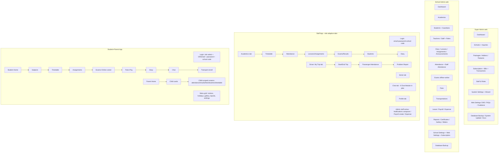

# eSchool SaaS v1.8.0 — Deep UX + Backend Audit

**Product:** eSchool SaaS — Multi-Tenant School Management System (Laravel super-admin panel + tenant school panels + 2 Flutter apps), vendor WRTEAM (wrteam.in), the SaaS sibling of eSchool v3.3.6 (single-tenant, audited at `docs/competitor-audits/eschool-v3.3.6.md`).
**Audited copy (root):** `/home/bishal-regmi/Desktop/ASchool/eSchool SaaS v1.8.0 Nulled/` — backend `PHP_CODE/` (Laravel 10), apps `App code/eschool-saas-staff/eschool-saas-staff/` + `App code/e-school-saas-student-parent/e-school-saas/`, vendor docs `eSchool-SaaS-Doc-main/` (Docusaurus, 273 shipped screenshots), upgrade zips `Updates/` (1.0.1→1.8.0).
**Audit date:** 2026-09-13. **Boot status: static-only** (no seeded DB/.env; every claim below cites static code file:line or vendor docs/screenshot path). `PHP_CODE.zip` ignored per instructions.
**Auditor note:** every line number in this report was re-read from the current disk copy during this pass. The sibling eSchool v3.3.6 report (`docs/competitor-audits/eschool-v3.3.6.md`) was used for vendor context and as a diff target only — no claim from it is repeated here as fact about this product without a fresh source check.

**Headline numbers (all verified this pass):**

| Metric | Count | Source |
|---|---|---|
| Web route definitions | 591 `Route::` occurrences incl. 61 `Route::resource` across 1,209 lines (full table: Appendix BM) | `PHP_CODE/routes/web.php` (read in full) |
| API route definitions | 193 explicit registrations (~150 unique endpoints after group prefixes) across 397 lines, groups student/parent/teacher/staff/general/transport (full table: Appendix BM.1) | `PHP_CODE/routes/api.php` (read in full) |
| Web controllers | 73 + `Exam/` subfolder (3) + `Auth/` scaffold | `PHP_CODE/app/Http/Controllers/` ls |
| Models | 113 (69 shared names with sibling; ~67 SaaS-only) | `PHP_CODE/app/Models/` ls + diff vs sibling |
| Migrations | 20 landlord (`database/migrations/`) + **21 tenant** (`database/migrations/schools/`, through `version1_8_1.php`) | ls both dirs |
| Blade views | 275 files (259 excluding `vendor/`/errors) | `find resources/views -name "*.blade.php" \| wc -l` |
| Sidebar menu items | ~68 titled entries across 30 groups, dual-gated (spatie permission + plan feature) | `resources/views/layouts/sidebar.blade.php` (1,469 lines) |
| Staff (teacher+staff) Flutter app | 454 Dart files; 159 files under `lib/ui/screens/` (~70 screens) | `App code/eschool-saas-staff/eschool-saas-staff/` |
| Student+Parent Flutter app | 389 Dart files; 110 under `lib/ui/screens/` (~70 screens) | `App code/e-school-saas-student-parent/e-school-saas/` |
| Vendor screenshots | 273 PNG/JPG in `eSchool-SaaS-Doc-main/static/images/` | find |
| Tenancy model | **Database-per-tenant** (one MySQL schema per school, created by queue job) | `app/Jobs/SetupSchoolDatabase.php`, `app/Http/Middleware/SwitchDatabase.php` |

---

## 1. Executive Summary

eSchool SaaS v1.8.0 is the vendor's answer to the question ASchool is also answering: how do you turn a school-management product into a billable multi-tenant service. Its answer is radical and rare in the CodeCanyon market: **every school gets its own physical MySQL database**, provisioned asynchronously by a queued job, with a shared landlord database holding only the tenant registry (schools, admins, packages, subscriptions, bills) and the marketing site. Tenant identity travels on three rails: a `school_code` field on the web login form (stored in session → `SwitchDatabase` middleware), a `school-code` **HTTP header** on every mobile API call (`APISwitchDatabase` middleware), and a subdomain/custom-domain lookup for each school's public website (`Controller::index`, `PHP_CODE/app/Http/Controllers/Controller.php:109-152`).

The commercial engine is genuinely complete: prepaid packages (fixed charge + student/staff quotas) and postpaid packages (per-student/per-staff daily prorated billing with usage computed by counting rows **inside the tenant database**), monthly bills with due-date grace, auto-renewal, cancel-upcoming-plan, addons purchasable mid-cycle, a landlord-side bill-payment screen with offline (Cash) recording, four gateway integrations (Stripe/Razorpay/Paystack/Flutterwave) for the school's own subscription payments, and a cron that deactivates schools with overdue bills and soft-disables over-quota users inside their tenant DB. Feature access is gated by a `Feature` table (21 seeded modules) checked at the top of nearly every controller action (`ResponseService::noFeatureThenSendJson('Fees Management')`, `app/Services/ResponseService.php:81-97`) and mirrored in the UI by visible-but-padlocked menu items that open an "upgrade plan" Sweetalert.

The product is materially **broader than its single-tenant sibling**: the SaaS fork carries whole modules the sibling lacks (Transportation with driver/helper apps and live trip tracking, Payroll with payslips, Expense tracking, Student Diary, ID-card/Certificate generation, Database Backup UI, chat over Ratchet WebSockets instead of the sibling's polling chat, gallery, guidance/FAQ CMS) — and the sibling carries things the SaaS lacks (Events, Media gallery, Elective-subject self-selection UI in app, educational programs). They are divergent forks, not versions of one product.

The weaknesses are equally striking and mostly architectural: the **entire tenancy switch is a `DB::setDefaultConnection` mutation driven by client input** (school-code header) with no per-request isolation, so one bug away from cross-tenant data exposure; passwords default to the school's support phone number (`SchoolController.php:212`); 16 unauthenticated Artisan backdoor routes are shipped (`web.php:1087-1208`, including `/demo-tokens` which prints bearer tokens); the webhook secret handling for subscription payments does signature verification **after** switching DB on client-supplied metadata (`WebhookController.php:42-57`); Stripe payments are hand-rolled with cURL; push notifications disable SSL peer verification (`notification_helper.php:60-62`); and one wrong school-code header silently returns HTTP 200 with `"error": false` (`APISwitchDatabase.php:62`).

For ASchool the audit yields one dominant lesson (detailed in §12): the *commercial primitives* — plan with feature list, subscription with start/end dates, bill with due date, addon attached to a cycle, quota checks at creation time, cron-driven dunning — are a compact, complete, production-proven ontology that ASchool's entitlements system should be checked against; while the *implementation* (connection swapping, header-driven tenancy, phone-number passwords, artisan routes in prod) is a checklist of what to never ship.

---

## 2. Stack & Architecture Shape (confirmed from composer.json / pubspec.yaml)

### 2.1 Backend — `PHP_CODE/composer.json` (read in full)

- **Laravel `^10.0` / PHP `^8.1`** (composer.json:19-20) — two major versions behind the sibling's Laravel 12 (`audits/deep-ux-2026-09/work/eschool-adminpanel/PHP_Code/composer.json`), forked at the 2023 SaaS baseline.
- **Auth:** `laravel/sanctum ^3.2` (tokens per tenant DB — see §3.3), `laravel/ui ^4.2.2` (blade auth scaffold), `spatie/laravel-permission ^5.5` (roles/permissions; the Sibling uses ^6.0).
- **Tenancy plumbing (SaaS-only vs sibling):** `cboden/ratchet ^0.4.4` — a PHP WebSocket server (`app/Console/Commands/WebSocketServer.php`, started via unauthenticated route `/start-websocket`, `web.php:1127-1131`) powering in-app chat; `sagar/laravel-wizard-installer` (vendored at `packages/laravel-wizard-installer` via a path repository, composer.json:6-10) for the first-run wizard.
- **Payments:** `razorpay/razorpay 2.*`, `stripe/stripe-php ^10.0`, Paystack via raw HTTP (no composer package — the sibling uses `unicodeveloper/laravel-paystack`), Flutterwave via raw HTTP. Two parallel webhook stacks: `WebhookController` (school fees, `web.php:1015-1018`) and `SubscriptionWebhookController` (landlord subscription payments, `web.php:1022-1025` + `api.php:26-27`).
- **Docs/PDF/Excel:** `barryvdh/laravel-dompdf ^2.0`, `maatwebsite/excel ^3.1` (bulk students/teachers/staff/drivers/questions/marks), `intervention/image ^2.7`, `google/apiclient` (only `FirebaseCloudMessaging` service retained, composer.json:95-97), `mahesh-kerai/update-generator ^2.0` (in-app updater).
- **Dev:** `roave/security-advisories`, `barryvdh/laravel-debugbar`, `barryvdh/laravel-ide-helper`, `beyondcode/laravel-query-detector` — debug tooling present in the shipped composer.json (not just dev parity of the sibling, which dropped query-detector).
- `minimum-stability: dev` + `prefer-stable: true` (composer.json:118-119).

**Admin UI stack** (from `resources/views/layouts/footer_js.blade.php:1-58`): Blade + jQuery + **bootstrap-table 1.22.1** (CDN, line 19) with export/mobile/fixed-columns/reorder plugins, Sweetalert2, select2, CKEditor-4 **and** TinyMCE, datepicker/daterangepicker, apexcharts + Chart.js, dragula (form-field rank reorder), jquery-toast. Same "jQuery admin" generation as the sibling, no SPA.

### 2.2 Staff/Teacher app — `App code/eschool-saas-staff/eschool-saas-staff/pubspec.yaml`

`eschool_saas_staff` v2.0.4+18, Dart SDK ≥3.0.2. State: **flutter_bloc** (+bloc). Net: **dio** (with `curl_logger_dio_interceptor`), `get`. Storage: **hive/hive_flutter** (auth box incl. `schoolCode`, `lib/data/repositories/authRepository.dart:27-29`). Push: `firebase_core/firebase_auth/firebase_messaging` + `flutter_local_notifications ^18.0.1`. **`google_maps_flutter ^2.5.0`** — live transport tracking map (absent from student app). **`web_socket_channel ^3.0.1`** — chat over the Ratchet server. Also `flutter_widget_from_html` (announcements/diary), `file_picker`, `open_file`/`external_path` (payslip/attendance open), `responsive_builder`, `device_preview` (dev), `package_info_plus` (force-update version check), `image_picker` (profile). No razorpay/stripe — staff app never takes payments; fees screens are read-only (`api.dart:70-76`).

### 2.3 Student+Parent app — `App code/e-school-saas-student-parent/e-school-saas/pubspec.yaml`

Combined student+parent app (one binary, role chosen at login, same as sibling). Payments **in-app**: `razorpay_flutter ^1.4.0` + `flutter_stripe` (pubspec lines ~62-64). Exam runner kit: `flutter_tex 4.0.9` (LaTeX), `wakelock_plus`, `flutter_math_fork`. Polish: `lottie`, `shimmer`, `flutter_animate`, `carousel_slider`, `readmore`, `pinch_zoom`, `dotted_border`, `any_link_preview`-style URL handling via `flutter_widget_from_html`. Push: `firebase_messaging ^15.1.5` + `awesome_notifications ^0.10.1` (rich notifications; sibling's student app uses same stack). `web_socket_channel` for chat. `table_calendar` (attendance/holidays). **No google_maps** — parents see live transport via timeline widgets (`liveTimeline.dart`), not a map.

### 2.4 Docs/upgrade infrastructure

- Docusaurus site (`eSchool-SaaS-Doc-main/docusaurus.config.js`, sidebars: `installationSidebar.js`, `schooladminSidebar.js`, `superadminSidebar.js`) — hosted at `https://wrteam-in.github.io/eSchool-SaaS-Doc/` (linked from the super-admin sidebar itself, `sidebar.blade.php:1443-1448`). 273 shipped screenshots under `static/images/{superadmin,schooladmin,installation,changelog,logo}`.
- `Updates/` ships 18 incremental zip deltas (`Update 1.0.1-to-1.1.0.zip` … `Update 1-7-0-to-1-8-0.zip`) + `readme.txt` documenting update requirements (Laravel 10, **VPS with DB root permissions required for multi-tenancy**, `max_execution_time 5000+`, `Updates/readme.txt:1-20`). This is the same update-generator pattern as the sibling, extended with tenant-DB migration requirements.

---

## 3. Data Model (tables/models, relationships, tenancy design, notable issues)

### 3.1 The two-database split (landlord vs tenant)

**Landlord DB (`mysql` connection)** — created by `database/migrations/` (20 files): `users` (both super-admin staff AND one row per school-admin, `school_id` discriminator), `schools`, `packages`, `package_features`, `features`, `addons` (addon = purchasable `feature_id` + price), `subscriptions`, `subscription_features`, `subscription_bills`, `subscription_bill_payments`, `payment_transactions` (landlord subscription payments), `payment_configurations` (per-gateway keys, `school_id` NULL = landlord's own), `school_inquiries`, `extra_school_data` (super-admin-defined custom school fields), `form_fields`, `system_settings`, `contact_inquiries`, `feature_sections`/`feature_section_lists` (marketing site CMS), `faqs`, `languages`, spatie permission tables, plus Laravel's jobs/failed_jobs/cache (queue-backed provisioning).

**Tenant DB (one per school, `school` connection)** — created by running `migrate --path=database/migrations/schools` against the new schema (`app/Services/SchoolDataService.php:247-263`). The tenant migration tree (21 files, `2022_04_01_105826_all_tables.php` baseline + per-release `version*.php` cumulative migrations, latest `2025_10_30_113227_version1_8_1.php` — note: **tenant tree is one patch ahead of the landlord tree**, whose latest is `2025_09_09_125830_version1_8_0.php`). The tenant schema contains **a copy of `schools`, `users`, `school_settings`, spatie tables and even `subscriptions`** — because Eloquent models on the `school` connection resolve in that schema; `SchoolDataService::preSettingsSetup` (`SchoolDataService.php:24-64`) inserts a mirror row of the school and its admin into the tenant DB.

Key tenant tables (from `app/Models/` 113 files + `all_tables.php`): academics (`class_groups`, `classes`, `class_sections`, `class_subjects`, `class_teachers`, `subject_teachers`, `mediums`, `sections`, `streams`, `shifts`, `semesters`, `session_years`, `session_years_trackings`), people (`students`, `guardians`, `staff`, `extra_student_data`), learning (`lessons`, `lesson_topics` + polymorphic `files`/`attachments`, `assignments`, `assignment_submissions`, `diaries`/`diary_categories`/`diary_students`), exams (`exams`, `exam_timetables`, `exam_marks`, `exam_results`, `grades`, online-exam family incl. `online_exam_commons`), fees (`fees`, `fees_class_types`, `fees_installments`, `fees_paid`, `compulsory_fees`, `optional_fees`, `fees_advances`, `fees_types`, `payment_transactions`), HR (`staff_salaries`, `staff_payrolls`, `payroll_settings`, `staff_attendance`, `leaves`, `leave_details`, `leave_masters`, `expenses`, `expense_categories`), transport (`routes`, `route_pickup_points`, `pickup_points`, `route_vehicles`, `route_vehicle_histories`, `vehicles`, `transportation_fees`, `transportation_requests`, `transportation_payments`, `transportation_attendances`), comms (`announcements`, `announcement_classes`, `notifications`, `chats`, `messages`, `chat` via WebSocket server), CMS (`sliders`, `galleries`, `certificate_templates`).

### 3.2 The SaaS registry models (landlord)

- `School` (`app/Models/School.php:17-31`): fillable `name, address, support_phone, support_email, tagline, logo, admin_id, status, domain, database_name, code, type, domain_type, installed`. **`database_name` is hidden from serialization** (line 34) — good instinct; but it's interpolated into DDL (`SchoolController.php:676`). `type` ∈ {custom, demo}; `domain_type` ∈ {default (subdomain), custom}; `code` is the public tenant identifier (e.g. `SCH20251`, format `{prefix}{year}{next-id}`, `SchoolController.php:97,175`). Relations: `subscription` (hasMany), `features` (hasManyThrough SubscriptionFeature via active-date-window subscription, lines 57-61), `addon` (hasManyThrough Feature via AddonSubscription, date-windowed, lines 50-55).
- `Package` (`app/Models/Package.php`): `student_charge`, `staff_charge` (postpaid per-head rates), `days` (billing cycle length), `type` (0 prepaid / 1 postpaid), `no_of_students`, `no_of_staffs` (prepaid quotas), `charges` (prepaid flat price), `is_trial`, `highlight`, `rank`, `status`. → `package_feature` (hasMany `PackageFeature` → `feature_id`).
- `Feature` (`app/Models/Feature.php`): just `name`, `is_default`, `status`, `required_vps` + computed `short_name` (strips " Management"). 21 seeded names, `database/seeders/InstallationSeeder.php:189-212`: Student Management, Academics, Slider, Teacher, Session Year, Holiday, Timetable, Attendance, Exam, Lesson, Assignment, Announcement, Staff, Expense, Staff Leave, Fees, School Gallery, ID Card-Certificate Generation, Website Management, **Chat Module** (id 20), **Transportation Module** (id 21). The mobile apps hardcode these ids (`App code/eschool-saas-staff/eschool-saas-staff/lib/utils/systemModulesAndPermissions.dart:6-26`).
- `Subscription` (snapshot, not reference — copies `name/student_charge/staff_charge/no_of_students/no_of_staffs/billing_cycle/charges/package_type` at creation, `app/Services/SubscriptionService.php:102-115`), `start_date`, `end_date`, `school_id`, `package_id`.
- `SubscriptionBill`: `subscription_id`, `amount`, `total_student`, `total_staff`, `due_date`, `payment_transaction_id`, `school_id`.
- `AddonSubscription`: `school_id`, `subscription_id`, `feature_id`, `price`, `start_date`, `end_date`, `status`.

### 3.3 Tenancy resolution — the three rails (exact code)

1. **Web (school admin/teacher/staff panel):** login form has an optional `code` field. `LoginController::login` (`app/Http/Controllers/Auth/LoginController.php:64-227`): if `code` present → `School::on('mysql')->where('code',$code)->where('installed',1)->first()` (line 89) → switch `school` connection (96-99) → `Auth::guard('web')->attempt` inside tenant DB (103-107) → **students/guardians rejected from web login** (118-122) → `Session::put('school_database_name', ...)` (132). If `code` absent → landlord DB, and users with a school relation are rejected (183-190). Every subsequent request: `SwitchDatabase` middleware (`app/Http/Middleware/SwitchDatabase.php:21-42`) re-swaps the default connection from the session value. Without code → super-admin context.
2. **Mobile API:** `APISwitchDatabase` middleware (`app/Http/Middleware/APISwitchDatabase.php:21-66`) on every tenant route group (`routes/api.php:33-397`): reads `school-code` **header** (23) → `School::on('mysql')->where('code',$schoolCode)` (25) → swaps default connection to that tenant DB (28-32) → resolves the Sanctum bearer token **inside the tenant DB** (`PersonalAccessToken::findToken` + `Auth::loginUsingId`, 33-38) → demo-mode write-block unless URI in a 5-entry allowlist incl. `/api/student/submit-online-exam-answers` (42-56). So a token minted in school A is invalid against school B (the token lookup fails) — per-tenant tokens are the isolation saving grace of this design.
3. **Public school website:** `Controller::index` (`app/Http/Controllers/Controller.php:96-160`): resolves `School` by full host or first subdomain label, `installed=1`; if the school's **active plan includes the "Website Management" feature** → `school_website()` renders the tenant site (161-207); else redirect to login with an upgrade-plan error message (222-227); if host == app host → landlord marketing/landing site with packages/trial signup (`isSchoolWebsiteRequest()`, 209-233).

**Cross-check duplication:** `CheckSchoolStatus` middleware (`app/Http/Middleware/CheckSchoolStatus.php:16-106`) performs the *same* header→code→switch→token-login sequence again for API paths and enforces per-user/school deactivation (soft-delete + token revoke for students/teachers, 78-87).

### 3.4 Provisioning flow (end-to-end trace)

Entry points (all funnel to the same job):
- Super-admin create: `POST schools` → `SchoolController::store` (`SchoolController.php:110-298`).
- Public self-registration (landing site): `POST schools/registration` → `registration()` (893-1114); if system setting `school_inquiry == 1` it instead creates a `SchoolInquiry` row + email to super admin (937-1006) that is later approved via `schoolInquiryUpdate` (1359-1506).
- Demo school: `POST schools/create-demo-school` → `createDemoSchool()` (1190-1260) — hardcodes `demo@school.com`/`1234567890`, type=demo, domain=demo.

`store()` trace (file:line for every hop):
1. Domain checks against current host and reserved `demo` (114-138, 172-174).
2. Validation: `school_name`, `support_email` (unique), `support_phone` (6-15 digits), `tagline`, `address`, logo image (jpg/png/svg ≤2MB), `domain` nullable-unique, `school_code_prefix` (140-155). Custom-domain vs subdomain regex validation (156-169).
3. Guard: system setting `email_verified` must be on, else "Please contact the administrator to activate the email verification" (176-180).
4. `DB::beginTransaction` → create `School` row with `installed=0, status=1` (182-199) → DB name computed `eschool_saas_{id}_{first-word-of-name}` (202-205) → **admin user created in LANDLORD users table with password = `Hash::make($request->school_support_phone)`** (207-217) → optional `extra_fields` (super-admin custom school fields) persisted to `extra_school_data` (224-265) → school updated with `admin_id`, `database_name`, and status flipped to 0 pending (268-271) → commit.
5. **`SetupSchoolDatabase::dispatch($schoolId, $packageId, $prefix)`** (279-283) → response "School creation process has been started…" — provisioning is async; the school list shows the row as not-installed (operate column only offers delete while `installed==0`, `SchoolController.php:406-407`).
6. Job (`app/Jobs/SetupSchoolDatabase.php:43-123`, tries=3, timeout=300s, backoff=120s): `CREATE DATABASE IF NOT EXISTS {name}` (56) → `SchoolDataService::createDatabaseMigration` (58; re-checks schema existence and runs `Artisan::call('migrate', ['--database'=>'school','--path'=>'database/migrations/schools','--force'=>true])`, `SchoolDataService.php:247-263`) → `preSettingsSetup` (59): mirror `School`+admin-user rows into tenant DB (24-77), `createPreSetupRole` (permission catalog + School Admin/Teacher/Guardian/Student/Driver/Helper roles, 238-246), seed default `session_years` row, `school_settings` (timezone defaults `09:00-18:00` 60-min slots, `auto_renewal_plan=1`, currency INR/₹, date format d-m-Y, staff/parent email templates with `{code}/{password}` placeholders, 78-252) → optional `createSubscription` if package passed (64-68) → flip `status=1, installed=1` on **both** landlord and tenant copies (85-92) → welcome email from `email_template_school_registration` with **plaintext `{password}` = mobile** placeholder (97-107, 136-158) → email-verification resend after `sleep(5)` if unverified (110-113).

**Failure UX:** job `failed()` only logs (`SetupSchoolDatabase.php:128-134`); the school stays `installed=0` forever with no super-admin retry button (store() has no re-dispatch path; only delete + recreate).

### 3.5 Subscription/billing state machine (landlord)

- `SubscriptionService::createSubscription` (`app/Services/SubscriptionService.php:62-168`): computes start/end (trial uses `trial_days` system setting; normal uses `package->days`); if `!isCurrentPlan` it chains onto the current subscription's end date (upcoming plan, 85-100); snapshots package economics into the subscription row (102-115); if current plan → upserts `subscription_features` from the package (127-136) + clears feature cache; if prepaid → creates the `SubscriptionBill` immediately, and **if the creator is not the School Admin, auto-marks it paid via a Cash PaymentTransaction** (139-164) — i.e., super-admin assignment = landlord records cash payment.
- `createSubscriptionBill` (174-231): the postpaid metering read — switches to the **tenant DB** to count active students/staff within the billing window (179-199), computes prorated per-head charges `usage_days * charge / billing_cycle * count` (216-217), adds active addon prices (214), sets `due_date = now + additional_billing_days` system setting (226).
- `active_subscription` (644-668): date-windowed lookup; for postpaid requires no unpaid prior bill chain, for prepaid requires a **succeeded** bill transaction — unpaid = no active subscription = no features.
- `check_user_limit` (670-688): quota gate called from `StudentController::store` (§4.3) and staff creation.
- **Dunning cron** `subscriptionBill:cron` (`app/Console/Commands/SubscriptionBillCron.php:52-235`, exposed as unauthenticated route `/subscription/cron-job` → `schedule:run`, `web.php:119` + `Controller.php` `cron_job()`): (a) overdue unpaid bills → terminate the school's active subscription (end_date=yesterday), delete upcoming subscriptions/addons, force `auto_renewal_plan=0` (63-95); (b) subscriptions that ended yesterday → generate the postpaid bill, delete expired `subscription_features` (101-192) and honor auto-renewal by re-creating the same plan/addons (127-187); (c) apply `UserStatusForNextCycle` enable/disable lists **inside each tenant DB** (soft-deleting over-quota users, 194-231).
- School-side purchase screens: `SubscriptionController` (1,593 lines): `plan` (buy current/upcoming), `prepaid_plan`, `payment_success` (Stripe checkout-session + Razorpay/Paystack/Flutterwave callbacks, web.php:240-259), `razorpay_order_id`/`razorpay` (native Razorpay checkout), `bill_payment` (pay an existing bill), `generate_bill`, `update_expiry` / `change_bill_date` (super-admin manual overrides), `transactions_log`, `bill_receipt` (dompdf), `subscription_report` + `transaction/{year}` chart data.
- Addons: `AddonController::subscribe/discontinue/plan` + `prepaid_addon_payment` (`SubscriptionService.php:690-862`) — same four gateways, prorated to cycle end.

### 3.6 Feature gating mechanics (the "entitlements" system)

- Server truth: `FeaturesService::getFeatures` (`app/Services/FeaturesService.php:16-61`) — cached per school; merges package features + paid addons from the active subscription; **returns [] if an overdue postpaid bill exists** (24-33).
- Web enforcement: `ResponseService::noFeatureThenRedirect/SendJson` (`app/Services/ResponseService.php:81-97`) — first line of ~every store/show action of ~20 controllers (grep count: 100+ call sites), error message "Purchase {feature} to Continue using this functionality".
- Web UI affordance: custom Blade directives `@hasFeature/@hasNotFeature/@hasAnyFeature/@hasFeatureAccess` (`app/Providers/CustomBladeDirectivesServiceProvider.php:29-58`). Every sidebar link carries `data-access="@hasFeatureAccess('X Management')"` (82 occurrences, `sidebar.blade.php`); on DOM ready `common.js:946-958` adds `.no-feature-lock-menu*` classes to false ones; CSS renders them 50% opacity with a FontAwesome padlock `::before` (`public/assets/css/custom-rtl.css:133-147`); clicking opens Sweetalert "no permission — upgrade plan" with a deep link to `/addons/plan` for School Admins (`public/assets/js/custom/common.js:910-933`). **Items stay visible when unlicensed** — a deliberate sales affordance.
- API enforcement: same `noFeatureThenSendJson` inside the API controllers (e.g. `TeacherApiController.php:276,317,463…` for Assignment Management; `ApiController.php:483,630,693,718` for Staff Leave; `:878` Exam).
- App-side gating: `GET staff/features-permission` (`StaffApiController::getFeaturesPermissions`, 1165-1192) returns `{features: id=>name map, permissions: [...]}`; the staff app stores it in `StaffAllowedPermissionsAndModulesCubit` and **hides bottom-nav Chat tab and feature menus when `chatModuleId` (20) is not in the plan** (`lib/ui/screens/home/homeScreen.dart:129-176`; module id constants `lib/utils/systemModulesAndPermissions.dart:6-26`).

### 3.7 Data-isolation assessment (evidence-backed)

- Token-per-tenant-DB (APISwitchDatabase resolves the token after switching) prevents the naive cross-tenant replay. ✔
- But: tenancy is a **global mutable connection** — any landlord-context code path that forgets to pin `::on('mysql')` (most models don't; only `School`, `Package`, `Feature`, `PaymentConfiguration` declare `protected $connection='mysql'`, e.g. `Package.php:24`, `Feature.php:12`) silently reads/writes the last-switched tenant DB. `SchoolController::updateAdmin` demonstrates the required ceremony: explicit `DB::connection('mysql')->table('users')...` for the landlord write and a second manual swap for the tenant write (760-777).
- `SchoolController::trash` executes `DB::statement("DROP DATABASE IF EXISTS \`{$school->database_name}\`")` (676) — tenant deletion drops a physical DB by string interpolation (name is server-generated, so injection risk is low, but the pattern is unparameterized DDL).
- **Web-session fixation of tenancy**: `SwitchDatabase` trusts `Session::get('school_database_name')` wholesale; several code paths `Session::flush()` mid-request to escape school context (`SchoolController.php:622-625`, `SchoolDataService.php:790-795`) — logout-by-side-effect while the request continues on the previous connection.
- Landlord→tenant user duplication: the school-admin row is **copied** (same id) into the tenant `users` table at provisioning (`SchoolDataService.php:42-66`), and status/2FA/email-verified changes must be double-written to both DBs (`SchoolController::updateAdmin` 752-818, `changeStatus` 842-868). Any drift = split-brain credentials.

### 3.8 Notable data-model issues

1. `SchoolController::replaceEmailPlaceholders($request)` is **called with two arguments but declared with one** and uses an undefined `$settings` variable throughout — it survives only because every access is `?? `-guarded (`SchoolController.php:1472` call vs `:1508-1527` definition). Copy/paste defect, works by accident.
2. `SubscriptionService::paystack_payment` metadata references `$paymentTransaction->id` from a variable that is never defined in scope (line 464) — undefined-variable warning on every Paystack subscription checkout; the transaction-creation block above it is commented out (486-500).
3. `StudentController::store` validates `admission_no` with `unique:users,email` (`StudentController.php:113` — student login uses email column as GR number) and the sibling's known weakness is inherited: admission number doubles as login identity.
4. Landlord `users` table mixes super-admin staff and school admins with only `school_id` null vs set as discriminator (`LoginController.php:183-190` enforces the boundary at login).
5. `SessionYearsTracking` rows are written on nearly every academic create (fees/announcement/timetable/diary) — a per-row audit of "which session year/semester touched this entity" (e.g. `FeesController.php:145-150,208-215`) — but it's written twice for the same fees id in one request (`FeesController.php:145-150` then again `208-215`).

### 3.9 Role/permission catalog (provisioned into every tenant DB)

`SchoolDataService::createPermissions` defines **60 permission families** (grep count of `permission(` calls at `SchoolDataService.php` permission block), each expanding to list/create/edit/delete (+custom like `assignment-submission`, `exam-upload-masks` [sic, `exam-upload-marks`], `exam-result`, `exam-result-edit`, `class-teacher`, `student-diary-*`, `payroll-*`, `approve-leave`, `transportationRequests-*`, `contact-inquiry-list`). Default roles per tenant (`createPreSetupRole` → `createSchoolAdminRole`/`defaultRoles`/`createTeacherRole`/`createDriverRole`/`createHelperRole`, `SchoolDataService.php:238-330`):
- **School Admin** — essentially everything academic/operational (medium/section/class/class-section/subject/teacher/guardian/session-year CRUD onward) but **no** `schools-*`, `package-*`, `addons-*` (landlord-only), and subscription viewing only (`subscription-view`).
- **Teacher** (editable role) — student-list, timetable-list, holiday-list, announcement CRUD, assignment CRUD + submission review, lesson/topic CRUD, class-section-list, **online-exam full CRUD incl. question authoring** (online-exam-questions-* — richer than the API surface suggests), leave CRUD (167+).
- **Guardian / Student** — fixed non-editable roles.
- **Driver** — leave CRUD only (per `createDriverRole` block) + app driver surfaces gated by role, not permission.
- **Helper** — leave-list/create/edit/delete only.
- Landlord **Super Admin** — the fixed list at `InstallationSeeder.php:89-175` (schools/package/addons/subscription/system-settings/web-settings/staff/roles/language/faqs/guidance/database-backup/custom-school-email/contact-inquiry).
- Custom roles: school admins create arbitrary roles via the `roles` resource and check permission boxes (`views/roles/`, spatie UI); staff app reads the effective permission list via `staff/features-permission` and hides menus accordingly (§3.6).

**Tenant permission taxonomy drift note:** `exam-upload-masks` is the literal seeded permission name (typo) — sidebar/API reference `exam-upload-marks` in some places; worth checking at runtime; both strings appear in `SchoolDataService` permission arrays (grep verified).

---

## 4. Backend Flow Traces

Every flow: route → controller → DB → side effects → response. All paths relative to `PHP_CODE/`.

### 4.1 Auth + tenant login (web)

**Route:** `POST /login` (`routes/web.php:110`) → `Auth\LoginController::login` (`app/Http/Controllers/Auth/LoginController.php:64-227`).
- Email **or** mobile login: `username()` picks the column by `filter_var(FILTER_VALIDATE_EMAIL)` (56-62).
- Maintenance gate: if system setting `web_maintenance == 1` **and** the request carries a school code → 503 view (school-side logins blocked; super-admin logins allowed) (76-85).
- With school code: `School::on('mysql')->where('code',$code)->where('installed',1)` (89) → connection swap (96-99) → `Auth::guard('web')->attempt([loginField=>…, password=>…])` inside tenant DB (103-107) → Student/Guardian web-login rejection (118-122) → session `school_database_name` set (132) → if `two_factor_enabled` and no unexpired secret: 6-char code generated (`generate2FACode`, 229-241 — alphanumeric, `rand`), stored on the user row (`DB::table('users')->…update(['two_factor_secret'=>…])`, 147), session `2fa_user_id`, **email** via `Mail::send('schools.email')` from template `email_template_two_factor_authentication_code` (152, 244-277) → redirect `/2fa`. `/2fa-code` (`AuthController::twoFactorAuthenticationCode`, `app/Http/Controllers/AuthController.php:201-246`): 5-minute expiry measured from `users.updated_at` (209-221), 3-attempt lockout, success sets `two_factor_expires_at = +1 day` and logs in (223-229).
- Without code: landlord login; users having a school relation are logged out with a generic credentials error (183-190).
- **Response:** redirect `/dashboard` or back with errors; every failed attempt `\Log::error`'s the attempted email (168, 221).

### 4.2 Tenant onboarding (super-admin) — traced fully in §3.4; entry route `POST /schools` (`web.php:196` resource). Side effects: landlord School+User rows (txn), queue job (DB create + 21 tenant migrations + roles/permissions + settings + optional subscription), 2 emails (welcome with plaintext password; verification), `installed` flag flips. Response: JSON success immediately (async).

### 4.3 Students — create one student end-to-end

**Route:** `POST /students` (`web.php:519` resource) → `StudentController::store` (`app/Http/Controllers/StudentController.php:110-186`).
1. Validation (113-131): first/last name, dob, `class_section_id`, `admission_no` (unique on users.email), admission_date, session_year_id, guardian set (email/first/last/mobile/gender/image).
2. **Quota gates:** if the school is on a trial → global `student_limit` system setting check (135-146); else if prepaid package → `SubscriptionService::check_user_limit(...,"Students")` (148-155) → error "You reach out limits".
3. Guardian dedupe: reject if the email belongs to a non-Guardian role (158-163) → `UserService::createOrUpdateParent` (upserts guardian user; password = mobile, `Controller.php:58-60`).
4. `UserService::createStudentUser`: creates student user (password = **dob as ddmmyyyy**, `Controller.php:63-65`), student row, extra fields, sends parent-credential email from `email-template-parent` (placeholders incl. `{child_password}`) — mail failure is caught and downgraded to a warning toast (174-181).
- Admission number auto-generated at form render: `{sessionYear.name}0{school_id}0{lastStudentId+1}` (`StudentController.php:88-89`).
- **Response:** JSON success; DB: tenant `users`+`students`(+`extra_student_data`) writes; mail side effect; session-years tracking.

### 4.4 Teachers / staff — create + payroll

- `POST /teachers` resource → `TeacherController::store` (`app/Http/Controllers/TeacherController.php`; store pattern mirrors students; bulk via `store-bulk-upload` + `maatwebsite/excel`, sample file at `download-dummy-file`, `web.php:474-476`). Staff (`StaffController`, 961 lines) adds: role assignment, `payroll-setting/{id}` salary structure editor (`web.php:380-384`), bulk status change, ID-card generation.
- **Payroll flow:** `POST /payroll` (`web.php:814`) → `PayrollController::store` (`app/Http/Controllers/PayrollController.php`): creates `staff_payrolls` rows per staff for month/year from `payroll_settings` (allowance/deduction lines); `payroll/slip/{id}` renders a dompdf payslip (route 810); the staff app reads the same data via `GET staff/my-payroll` + `GET staff/payroll-slip` (`api.php:251-252`, `StaffApiController::myPayroll/myPayrollSlip`) and opens the downloaded PDF via `open_file`. Payroll creation from the app: `POST staff/payroll-create` (`api.php:253`, `StaffApiController::storePayroll` — admin-on-app creates payroll for staff).

### 4.5 Classes/sections

- `POST /class` → `ClassSchoolController::store` (resource `web.php:445`): class with stream/shift/medium + optional class-group (new vs sibling: classes group into `ClassGroups` like "Primary"/"Secondary" for website display).
- `POST /class-section` → `ClassSectionController::store` (`web.php:454`): section-in-class with class-teacher and subject-teacher assignment; remove endpoints `class-teacher/remove/{id}/{class_section_id}` + `subject-teacher/remove/...` (`web.php:449-450`).
- Class-subjects: `class/subject` index + `classSubjectUpdate` (`web.php:435-440`) attach subjects (Core/Elective type) to class; elective assignment lives at `elective-subject/*` (`AssignElectiveSubjectController`, `web.php:457-466`).

### 4.6 Attendance (web + app, same engine)

**Web:** `POST /attendance` (`web.php:547` resource) → `AttendanceController::store` (`app/Http/Controllers/AttendanceController.php:62-120`): validates `class_section_id`, `date`; builds one row per student from `attendance_data[]` (`id` null for new, so `upsert` on `["id"]` updates-or-inserts, 84-90 — actually keyed on id; re-marking an existing day updates by row id, which `show()` supplies as hidden inputs, `Controller.php:172-186`); `type`: 0 absent / 1 present / 3 holiday (holiday via `$request->holiday` override, 82). Side effect: if `absent_notification` checked → `send_notification()` to the **guardians** of absentees ("Your child is absent on {date}", FCM per-token, 93-107). Mail/FCM failure is caught (`does not exist`/`file_get_contents` strings) and downgraded to a warning with the attendance still committed (110-119) — the same "commit + warn" catch pattern as fees.
**App (teacher):** `POST teacher/submit-attendance` (`api.php:205`) → `TeacherApiController::submitAttendance` (`app/Http/Controllers/Api/TeacherApiController.php:1872-1979`): same validation minus per-row rules (commented out, 1879-1882); holiday mode marks every student in the section type=3 (1889-1902); else per-student create-or-update keyed on (class_section, student, date) (1904-1930); guardian absent push (1932-1944). Feature gate: 'Attendance Management' + permission `attendance-create|edit|class-teacher` (1874-1877).

### 4.7 Exams/grading (offline exam pipeline)

- Create: `POST /exams` (`ExamController::store`) with attached classes + optional exam timetable rows.
- Marks entry: `POST exams/submit-marks` → `submitMarks` (`app/Http/Controllers/Exam/ExamController.php:479+`) writes `exam_marks` per (timetable, student); bulk Excel path `exams/store-bulk-data` (sample `exams/download-sample-file`, `web.php:648-650`).
- **Publish:** `POST exams/publish/{id}` → `publishExamResult` (`ExamController.php:713-795+`): loads exam + per-student aggregated marks (`selectRaw('SUM(obtained_marks)…groupBy(student_id)')`, 720-726); blocks publish if any subject's timetable lacks marks ("Marks are not uploaded yet.", 730-741); per student computes `percentage`, `findExamGrade($percentage)` (grade table lookup; errors "Grades data does not exists" if unmapped, 747-751), pass/fail `resultStatus`; bulk-inserts `exam_results` + sets `publish=1` (763-770); side effect: FCM push to **students + guardians** "Result Publish for {exam}…" with type `exam result` (773-784). Response JSON.
- Result PDF: `GET exams/result/student/{student_id}/exam/{exam_id}` → `examResultPdf` (dompdf). Rich report family in `ReportsController` (2,147 lines): yearly result, subject-wise, rank-wise, each with per-student PDF + **bulk PDF** variants and top-performers statistics (`web.php:931-956`).

### 4.8 Fees (structure → collect → receipt → online pay)

- **Structure:** `POST /fees` → `FeesController::store` (`app/Http/Controllers/FeesController.php:98-230`): feature gate 'Fees Management' + `fees-create`; validation requires installment total == compulsory total (117-124); per selected class creates `fees` row + `fees_class_types` (compulsory `optional=0` + optional `optional=1`) + `fees_installments`; the guardian-notification call is present but **commented out** (131-135) — no fee-created push in the SaaS version. Session-year tracking rows written (145-150).
- **Offline collection (counter):** `GET fees/pay/compulsory/{feesID}/{studentID}` → `payCompulsoryFeesIndex` view → `POST fees/pay/compulsory` → `payCompulsoryFeesStore` (`FeesController.php:1075-1230`): upserts `fees_paid` (per fees+student aggregate with `is_fully_paid` when amount ≥ total, 1113-1126); installment mode writes one `compulsory_fees` row per selected installment (mode cash/cheque with `cheque_no` when mode==2, 1130-1162); **advance payment** appends to the last installment row and records `fees_advances` (1172-1186). Response JSON; no notification side effect.
- **Online (parent app):** `POST parent/fees/compulsory/pay` → `ParentApiController::payCompulsoryFees` (`app/Http/Controllers/Api/ParentApiController.php:1526+`): validates `payment_method in Stripe,Razorpay,Flutterwave,Paystack` (1534-1540); checks gateway enabled in tenant `payment_configurations` (1548-1551); ownership check `guardianRelationChild()` (1555-1561); builds `payment_transactions` row and gateway session/checkout (Stripe via PaymentService; Razorpay order; Flutterwave/Paystack hosted) and returns the payment handle to the app; webhook `POST webhook/{gateway}` (`web.php:1015-1018`) → `WebhookController::{gateway}` (`app/Http/Controllers/WebhookController.php:41+`): **switches to the tenant DB using `school_id` from the (not-yet-verified) payload metadata** (50-57), then verifies the signature against that tenant's `payment_configurations.webhook_secret_key` (58-66) — verification order is payload-driven; on success flips `payment_transactions.payment_status=succeed`, upserts `fees_paid`/`compulsory_fees`/`optional_fees` and pushes "Payment Success". (Full razorpay/stripe bodies read at 21-260; the order-of-operations issue is the headline.)
- **Receipt:** `GET fees/paid/receipt-pdf/{id}` → `feesPaidReceiptPDF` (dompdf, view `resources/views/fees/…`); app equivalent `GET parent/fees/receipt` (`api.php:129`).
- Fees-over-due dashboard + account deactivation: `GET fees/fees-over-due/{class_section_id}` and `POST fees/student-account-deactivate` (`web.php:720-721`) — admin can soft-deactivate defaulters.

### 4.9 Timetable

`POST /timetable` → `TimetableController::store` (`app/Http/Controllers/TimetableController.php:56-109`): validation `class_section_id/start_time/end_time/day` required; **teacher clash check** — resolves `subject_teacher→teacher_id` then rejects if the teacher has any overlapping slot that day (66-90: `start<=newStart<end OR start<newEnd>=end` overlap windows); creates row with `type = Lecture|Break` by presence of `subject_id` (92-95); session-year tracking. Teacher/class timetable views at `timetable/teacher/*` (`web.php:527-533`). Timetable slot settings (start/end/duration) upsert via `PUT timetable/settings` (`web.php:526`) writing `school_settings` keys `timetable_start_time/end_time/duration` (seeded 09:00–18:00/60m, `SchoolDataService.php:128-146`). **No live-class link fields in the SaaS** — the sibling's `link_name/link_url` timetable columns do not exist here (grep `live_class` across `PHP_CODE/app` = 0 hits); "virtual school" features were dropped, not ported.

### 4.10 HR/payroll — see §4.4; leave flow: `POST /leave` apply (`LeaveController`), `leave/status/update` approve/reject (`web.php:820`), `leave/report` + `filter` month views; app paths `GET leaves / POST leaves / GET my-leaves / POST delete-my-leaves` (`api.php:323-327`) and staff-side approvals `staff/leave-request`, `POST staff/leave-approve` (`api.php:268-270`).

### 4.11 Transport (SaaS-only module; 2,381-line API controller)

- Admin web: vehicles, pickup points, routes (with **drag-order pickup sequence** via `routes/{id}/update-pickup-order`, `web.php:983`), route-vehicle assignment, driver/helper staff (own role + bulk upload), transportation fees per route/pickup, parent requests approval queue (`transportation-requests` resource + `offline-entry` counter enrollment, `web.php:996-1007`), transport expenses.
- Parent/student app: `GET pickup-points`, `POST transportation-requests` (enroll), `transportation-payments` (gateway), `POST transport/live-route` (current vehicle position timeline), `POST transport/attendance/*` (driver marks boarders).
- Driver/helper (inside staff app): `GET driver-helpr/dashboard`, `get-trips`, `POST driver-helpr/trip/start-end` (trip state), attendance store, problem reporting (`tripDetailsScreen/widgets/tripProblemReporting.dart`). All under `TrasportationApiController` (`api.php:353-393`, note the typo'd class name `TrasportationApiController` — file `app/Http/Controllers/Api/TrasportationApiController.php`).
- Live tracking server side: `pickupPointsTrack` computes progress along ordered pickup points; staff app renders `google_maps_flutter` (`pubspec.yaml`), parent app renders a custom `liveTimeline.dart` (no map dep).

### 4.12 Communication/notices (announcements + notifications + chat)

- **Announcement (class/subject-scoped notice):** `POST /announcement` → `AnnouncementController::store` (`app/Http/Controllers/AnnouncementController.php:78-200`): gate 'Announcement Management' + `announcement-create`; title + `class_section_id[]` required; teacher-authored requires `subject_id` (86); creates announcement + `announcement_classes` rows per section (subject-scoped for teachers, 118-168); polymorphic files upload + external-URL "files" (169-200); **audience resolution:** elective-subject students only when subject type is Elective, else all students of the sections (103-115); FCM push "New announcement{ in {subject}}" to those user ids (title built 117-118; send via `send_notification`). Parents receive them through the `parent/announcements` endpoint filtered by their children's sections.
- **Custom notification composer:** `notifications` resource + `notifications/user/show` (`web.php:869-872`, `NotificationController`) — role/user targeting push.
- **Chat (module id 20, addon-gated):** Ratchet WebSocket server (`app/Console/Commands/WebSocketServer.php` + `WebSocketController`), models `chats`/`messages`; app endpoints `POST message`, `GET message`, `POST delete/message`, `POST message/read`, `GET users/chat/history` (`api.php:336-347`); both apps ship chat containers (`chatContainer/` in staff app, `chat/` in student app) gated on `chatModuleId`.

### 4.13 Subscriptions/plans/billing (school's own SaaS commerce) — fully traced in §3.5; additionally the **SubscriptionWebhookController** (`app/Http/Controllers/SubscriptionWebhookController.php`, 1,243 lines) verifies gateway webhooks **against landlord** `payment_configurations` (school_id NULL) and reconciles `subscription_bills`/`addon_subscriptions`, with `payment_success` callback routes for hosted-checkout flows (`web.php:240-259`).

### 4.14 Database backup (super-admin + school-admin feature)

`GET database-backup` → `DatabaseBackupController@index` (`web.php:778-785`). `store()` (`DatabaseBackupController.php:73-230+`) is **not** a mysqldump shell — it is a **PHP-level selective SQL export**: `SHOW TABLES`, excludes landlord-registry tables (addons/features/packages/system_settings/…, 85-88), applies **row-level scoping for school admins** (staff of the school, students + guardians, school-scoped roles, conditioned `users` query, 90-110+), builds `INSERT INTO` statement strings per row (218-220, 369), and writes a `.sql` file tracked in the `database_backups` table. `restore` re-imports, `download/{filename}` streams. Sidebar-visible to Super Admin and School Admin or `database-backup` permission (`sidebar.blade.php:1451-1459`). The row-level conditions exist because tenant DBs still contain a few landlord-mirrored tables (users copy, roles — §3.7 split-brain note), so the export trims those to the school's own rows.

### 4.15 Promote / transfer students (year rollover)

**Route:** `POST /promote-student` (`web.php:658` resource) → `PromoteStudentController::store` (`app/Http/Controllers/PromoteStudentController.php:45-131`).
- Validation: `class_section_id` (target) + `promote_data` array ("No Student Data Found" if empty).
- Per student payload `{student_id, result (1 pass/0 fail), status (1 continue/0 left)}`; builds `promote_students` rows capturing old class (`current_class_section_id`), old session year, result, status.
- For passing+continuing students: reassigns `students.class_section_id` to the new section and **regenerates roll numbers in bulk** ordered by a configurable school setting (`roll_number_sort_column`, default `first_name`; `roll_number_sort_order`, default asc — read from school settings, 82-86).
- Transfer flow (same controller, `storeTransferStudent` at 220 + `getPromoteData` at 132): move a single student between class-sections mid-year (`web.php:660-661`); the promote index blade carries both modals — promote (class_section_id, session_year_id, new_class_section_id selects + hidden student_ids textarea) and transfer (current/new class_section selects), `views/promote_student/index.blade.php:28-117`.
- Response: JSON success; no parent notification side effect.

### 4.16 Staff leave apply + approve

- **Apply (web):** `POST /leave` → `LeaveController::store` (`app/Http/Controllers/LeaveController.php` store region): gate 'Staff Leave Management' + `leave-create`; fields `reason*`, `from_date*`, `to_date* (after_or_equal:from_date)`, `leave_master_id*`, `type*` (per-date type map computed client-side — dates already marked holiday are rejected with "Kindly select different dates as the ones mentioned are already allocated as holidays."), `files[]` (jpg/png/pdf/doc, `MaxFileSize($file_upload_size_limit)` from system settings). Overlap guard: rejects if the same user already has any leave overlapping the range ("You already have a leave request during this period."). Writes `leaves` + one `leave_details` row per date with that date's type.
- **Apply (app):** `POST /leaves` general endpoint (`api.php:324`, `ApiController::applyLeaves`) — same model, mobile-first; staff app screen `applyLeaveScreen.dart`.
- **Approve:** `PUT leave/status/update` (`web.php:820`) or app `POST staff/leave-approve` (`api.php:269`, `StaffApiController::leaveApprove`) — flips status and notifies the applicant. Staff approvers see the request queue in `leaveRequestsScreen.dart` with reason bottomsheet (`leaves/widgets/leaveReasonBottomsheet.dart`) and status filter bottomsheet.

### 4.17 Student diary (SaaS-only module) — teacher creates, student/parent read

**Route (app):** `POST /api/teacher/create-diary` (`api.php:238`) → `TeacherApiController::createStudentDiary` (`TeacherApiController.php:2998-3075`).
- Validation: `diary_category_id*`, `title* (max 255)`, `student_class_section_map*` (JSON map `{student_id: class_section_id}`, `not_in:0,null` — "Please select Students"), `date*`.
- Writes `diaries` row (title, description, subject_id, date, session_year, author) + one `diary_students` row per selected student.
- Side effect: FCM push "New Diary Note Received" (type `Diary`) to **students + their guardians** (guardian ids resolved via `students.guardian_id`, 3061-3064).
- Read paths: `GET /api/diaries` (`api.php:395`, `ApiController::getStudentDiaries`) for students/parents; `GET diary-details` child-scoped for parents (`api.php:88,155`); admin web CRUD at `diary` resource (`web.php:974-977`) with category manager (`diary-categories` resource + trash/restore, 969-972) and student removal `diary/{diaryId}/remove-student/{id}` (977).
- The `student_class_section_map` JSON-in-a-string validation (`not_in:0,null`) is weak — an arbitrary JSON body passes; the server trusts the map's class_section_id values without ownership checks (any teacher can diary any student by id — no `CheckStudent`-style guard here, unlike the teacher result endpoints).

### 4.18 Online exam attempt (SaaS runner — materially different from sibling)

- **List:** `GET student/get-online-exam-list` → `getOnlineExamList` (`StudentApiController.php:1051+`): builds the student's subject set (core + elective from `currentSemesterSubjects()`, 1071-1088); **DEMO_MODE deletes the student's attempt-status rows so demo users can retake exams** (1090-1096 — deliberate demo affordance).
- **Fetch questions:** `GET student/get-online-exam-questions` → `getOnlineExamQuestions` (1051-1146): validates exam_id + exam_key; rejects re-fetch if any `student_online_exam_statuses` row exists (`STUDENT_ALREADY_ATTEMPTED_EXAM`, 1064-1071); verifies exam_key against the stored exam (1083-1089); checks **only start_date** (1092-1095 — no end-date/duration check at fetch); creates status row status=1 **before** serving questions (1097-1102); returns questions with options **and `is_answer` commented out** (1117) — **the SaaS version does not leak the answer key to the client**, fixing the sibling's V2-01 defect. Payload includes total_questions/total_marks meta.
- **Submit:** `POST student/submit-online-exam-answers` → `submitOnlineExamAnswers` (1147-1230): `answers_data` nullable array; **deletes any existing answer rows first ("Clean existing answers for fresh submission", 1183)** — resubmission is allowed by design in this fork (contrast: sibling blocks re-submit); validates each question belongs to the exam (1187-1191); de-duplicates option ids (1194); bulk-inserts; upserts the status row to completed. **Debug logging of the full answer payload ships in the submit path** (`\Log::info('About to store answers:'…`, 1218-1223).
- **Scoring:** read-time in result endpoints (`getOnlineExamResult*`, e.g. `StudentApiController.php:1267-1300` loads `is_answer` only there, filters correct options and computes) — same lazy-scoring architecture as the sibling, no persisted score.

### 4.19 Transportation enrollment + payments + trips

- **Parent enrolls (app):** `POST /api/transportation-requests` → `TrasportationApiController::transportation_requests` (`TrasportationApiController.php:276-305`): validates `pickup_point_id*`, `user_id*` (child), `transportation_fee_id*`; creates `transportation_requests` row `status=Pending` — approval is manual (school admin approves from web `transportation-requests` resource; counter enrollment via `offlineEntryStore` below).
- **Counter enrollment (web):** `POST transportation-requests/offline-entry/store` → `TransportationRequestController::offlineEntryStore` (`TransportationRequestController.php:374-460+`): validates user/pickup_point/route_vehicle/fee/amount/mode (cheque_no required if mode=2); rejects if the user already has an active paid record this session year ("This user already has an active paid record…", 406-413); **seat-capacity check** — counts paid assignments per route_vehicle and rejects when vehicle capacity is exhausted ("No seats left in this vehicle", 427-431); resolves shift from the route (route→shift relation, 417-420).
- **Payments:** parent app `POST transportation-payments` → gateway flow (fee + prorations); renewal screen `planRenewalScreen.dart`; receipts `transportation-requests/fee-receipt/{id}` (`web.php:998`).
- **Driver trips (staff app):** `GET driver-helpr/get-trips` + `POST driver-helpr/trip/start-end` (`api.php:387-389`) — trip lifecycle; `POST transport/attendance/create` marks boarders per pickup point; live position via `POST transport/live-route` → `pickupPointsTrack` (server computes the vehicle's progress along the ordered pickup sequence); parents consume the same data through `transport/routes/stops` + `liveTimeline.dart`.
- **Transport expenses:** app `POST create-transportation-expense` (validates vehicle_id/category_id/title/amount, `TrasportationApiController.php:324+`) and web `transportation-expense` resource — fuel/maintenance per vehicle.

### 4.20 Expense tracking (school finance)

`POST /expense` → `ExpenseController::store` (`web.php:808` resource): fields from blade `views/expense/index.blade.php:27-62` — `category_id*` (select), `title`, `ref_no`, `amount`, `date`, `description`, `session_year_id*` (defaults to current). List filters: session year, category (with injected pseudo-category `salary` — payroll expenses, line 86), month. `GET expense/filter/{session_year_id?}` (`web.php:807`) → `filter_graph` returns monthly totals for an apexcharts bar/line graph on the index page. Payroll writes expenses with title `"{Month} - {Year}"` and description `Salary` (§4.21), which is why `salary` appears as a filter pseudo-category.

### 4.21 Payroll generation (month run)

`POST /payroll` → `PayrollController::store` (`app/Http/Controllers/PayrollController.php:77-154`): gate **'Expense Management'** (payroll is billed as part of the expense feature, not its own) + `payroll-create`; validation `net_salary*` ("no_records_found"), `date*`, `user_id*` ("Please select at least one record") — the form posts per-staff arrays `basic_salary[id]`, `paid_leave[id]`, `net_salary[id]` selected from a staff list. Resolves the session year covering the chosen month; per staff `updateOrCreate` an `expenses` row (unique on staff+month+year → idempotent month re-runs) + `staff_payrolls` rows from `staff_salaries` (allowance/deduction lines with fixed amount or percentage, configured in `payroll-settings`); side effect: push "Your Payroll has been Updated." to staff users (type string mislabeled `"assignment"`). Payslip: `GET payroll/slip/{id}` dompdf (`views/payroll/slip.blade.php`); app: `staff/my-payroll` + `staff/payroll-slip`.

### 4.22 Forgot password (app, tenant-scoped)

`POST /api/forgot-password` → `ApiController::forgotPassword` (`ApiController.php:207-250`): requires `email` + `school_code`; resolves the school from landlord DB, switches connection, and delegates to Laravel's `Password::sendResetLink` **inside the tenant DB** — password reset tokens are per-tenant. Student variant `student/forgot-password` uses `gr_no + dob + school_code` (`StudentApiController::forgotPassword`, 197+) — knowledge-based reset (date of birth), same as sibling.

### 4.23 Elective subject assignment (admin)

`POST elective-subject/assign-elective-subject/store` (`web.php:460`) → `AssignElectiveSubjectController::store`: attaches elective subject groups to class-sections; student self-selection screen exists in the student app (`selectSubjectsScreen.dart`) via `POST student/select-subjects` (`api.php:51`, `StudentApiController::selectSubjects`). (The sibling's app has the same screen; the SaaS keeps it.)

### 4.24 Gallery + sliders (school website content)

`gallery` resource + `gallery/file/delete/{id}` (`web.php:863-866`): photo galleries surfaced on the school's public website (`Controller::school_website` renders counters/announcements; gallery screens in the student app `schoolGalleryScreen/galleryImagesScreen/galleryDetailsScreen` consuming `GET api/gallery` `api.php:318`). Sliders (`sliders` resource) serve both app home carousels (`student/sliders`, `parent/sliders`) and website heroes — `Controller::school_website` filters `type in [2,3]` for web sliders vs app sliders (`Controller.php:171-176`), falling back to two stock hero images when a school has none (177-182).

### 4.25 Certificate/ID-card generation

- Template designer: `GET/PUT certificate-template/design/{id}` (`web.php:888-891`) — layout editor for ID cards/certificates (vendor shot `schooladmin/certificate-idcard/certificate-template-layout.png`); settings at `id-card-settings` (`SchoolSettingsController::id_card_index/store`, `web.php:521-522`) with per-element image removal route `id-card/remove/{type}` (762).
- Generation: `POST certificate` (students) / `POST certificate/staff-certificate` (`web.php:893-898`) → dompdf per person; student ID cards also from `students/generate-id-card` (`web.php:511-512`); staff ID cards `staff/id-card*` (`web.php:374-376`). Gate: feature `ID Card - Certificate Generation` (seed id 18).

### 4.26 Related-data explorer (admin power tool)

`GET related-data/{table}/{id}` → `Controller::relatedDataIndex` (`Controller.php:355-390`): queries `information_schema.KEY_COLUMN_USAGE` for all tables referencing the given table, then loads each referencing row plus the record itself — a generic "what will break if I delete this" preview screen (`views/related-data/index.blade.php`) wired into the schools list operate menu and linked from delete flows. An unusually thoughtful destructive-action guard for a CodeCanyon product.

---

## 5. Full Page/Screen Inventory

Method note: web routes were enumerated from `routes/web.php` (read in full, 1,209 lines); each screen's view existence was verified against `resources/views/` (259 app blades); menu parentage from `resources/views/layouts/sidebar.blade.php` (1,469 lines, read in full). Vendor screenshot column cites `eSchool-SaaS-Doc-main/static/images/…` where the vendor ships one. Apps' screens verified from the file trees in §5.3-5.4 (every file listed exists on disk).

### 5.0 Route census (auto-derived, this pass)

- `routes/web.php`: **591 `Route::` occurrences**, of which **61 are resource declarations** (expanding to ~300 CRUD URIs); 1,209 lines total.
- `routes/api.php`: **210 `Route::` occurrences** across 397 lines (many are group/middleware lines; ~150 actual endpoint registrations as itemized below).
- Resource controllers on web (61): schools, package, addons, subscriptions, system-settings, guidances, roles, staff, driver-helper, mediums, section, subjects, class, class-section, teachers, guardian, students, timetable, attendance, staff-attendance, lesson, lesson-topic, announcement, holiday, sliders, session-year, exam/grade, exam/timetable, exams, promote-student, language, fees-type, fees, online-exam, online-exam-question, school-settings, form-fields, expense-category, expense, payroll (only index/store/show/destroy), leave, leave-master, semester, stream, shift, faqs, gallery, notifications, web-settings, certificate-template, class-group, payroll-setting, vehicles, diary-categories, diary, pickup-points, routes, route-vehicle, transportation-requests (with empty parameter name), transportation-expense.
- API endpoint families (group → count → representative endpoints, all from `routes/api.php` read in full):
  - `student/*` (35): login, forgot-password, class-subjects, subjects, select-subjects, guradian-details [sic], timetable, lessons, lesson-topics, assignments, submit-assignment, delete-assignment-submission, attendance, announcements, get-exam-list/details, exam-marks, sliders, get-online-exam-list/questions/submit/result-list/result/report, get-assignments-report, get-profile-data, current-session-year, school-settings, diary-details (48-90).
  - `parent/*` (30): login, test (debug), + child-scoped under `checkChild`: subjects, class-subjects, timetable, lessons, lesson-topics, assignments, attendance, teachers, sliders, get-exam-list/details, exam-marks, fees (get/compulsory-pay/optional-pay/receipt), online-exam list/results/report, assignments-report, current-session-year, school-settings, get-child-profile-data, announcements, diary-details (96-159).
  - `teacher/*` (37): login, subjects, assignment CRUD + submission review, file delete/update, lesson CRUD, topic CRUD, announcement CRUD, get/submit attendance, exam list/details, submit-exam-marks/subject + /student, get-student-result + get-student-marks (CheckStudent), student-list, student-details, teacher_timetable, class-detail, diary-categories CRUD (+restore/trash), create-diary, delete-diary, remove-student (164-242).
  - `staff/*` (28): login (reuses TeacherApiController::login), my-payroll, payroll-slip, payroll-create, payroll-staff-list, payroll-year, profile, counter, teachers, teacher-timetable, staffs, attendance, leave-request/approve/delete, announcement CRUD, student/attendance, roles, users, notification GET/POST/delete, get-fees, fees-paid-list, student-offline-exam-result, features-permission, class-timetable, student-fees-receipt, allowances-deductions (246-300).
  - general (`APISwitchDatabase` group, 33): school-settings, holidays, change-password, payment-confirmation, payment-transactions, gallery, session-years, leaves (GET/POST), my-leaves, delete-my-leaves, staff-leaves-details, leave-settings, medium, classes, update-profile, student-exan-result-pdf [sic], message GET/POST, delete/message, message/read, users, users/chat/history, class-section/teachers, student-details, pickup-points, transportation-fees, transportation-shifts, transport/live-route, transport/dashboard, transport/plans/current, transport/routes/stops, transport/attendance/user-list + create, transport/requests, transportation-requests, transportation-payments, create/get-transportation-expense, transport/expense/categories/list, driver-helpr/dashboard, get-vehicle-details, get-trips, trip/start-end, get-vehicle-assignment-status, transport/user/attendance-list, diaries (311-397).
  - webhooks: subscription/webhook/{stripe,razorpay} (26-27) + web.php fee webhooks (§4.8).
- Public (no auth): settings, forgot-password, school-details (305-308) + logout under APISwitchDatabase (33-36).

### 5.1 Landlord (super-admin) panel — route table

| Route | Parent menu | Purpose | Role gate | View / evidence |
|---|---|---|---|---|
| `/dashboard`, `/home` | Dashboard | Role-aware stats (schools, students, teachers, revenue graphs) | any logged-in | `views/dashboard.blade.php`; `DashboardController::index`; vendor shot `static/images/superadmin/dashboard.png` |
| `/login` (+`/2fa`, `/2fa-code`) | — | Login + email-2FA code | public | `views/auth/login.blade.php` (code field optional, lines 146-160; demo school pre-fills credentials 124-125) |
| `GET/POST /` (landing) | — | Marketing site w/ pricing, trial signup, demo link | public | `views/home.blade.php` via `Controller::index` (`Controller.php:166-229`) |
| `schools/registration` (POST) | — | Public school self-signup / inquiry | public | `Controller::index` → `SchoolController::registration` (web.php:117) |
| `school/*` (14 GET/POST) | — | Per-school public website (about, gallery, online admission) | public | `views/school-website/`, `web.php:127-140` |
| `page/{type}` | — | Public policy pages (privacy, terms, refund, per-audience) | public | inline closures `web.php:1036-1074` |
| `schools` (resource + 15 extra) | Schools | Tenant CRUD, activate/deactivate, admin edit, trash/restore, send-mail, **create-demo-school**, school-inquiry queue | `schools-*` perms | `views/schools/index.blade.php`; shots `superadmin/create-school.png`, `list-schools.png`, `add-school-admin.png` |
| `school-custom-fields` | Schools→Custom Fields | Super-admin-defined school signup fields (rank, trash) | `school-custom-field-*` | `views/form-fields/…` schoolIndex; `web.php:166-177` |
| `package` (resource + 4) | Package | Plan CRUD w/ feature checkboxes, prepaid/postpaid, rank, trial flag | `package-*` | `views/package/{index,create,edit}.blade.php`; shots `superadmin/create-prepaid-package.png`, `create-postpaid-package.png`, `list-packages.png`, `edit-package.png` |
| `addons` (resource + 8) | Addons | Addon (feature+price) CRUD, subscribe/discontinue, prepaid addon pay | `addons-*` | `views/addons/`; shots `create-addon.png`, `list-addons.png` |
| `features`, `features/show`, `features/enable` | Features | Module catalog on/off | package/addons perms | `web.php:345-347`; shot `superadmin/features` (view `features.blade.php`) |
| `subscriptions/*` (25 routes) | Subscription | Plans, bills, history, cancel/confirm upcoming, expiry/bill-date overrides, bill payment (Cash/Stripe/Razorpay/Paystack/Flutterwave), transactions, receipt PDF, report + year graph | `subscription-view` etc. | `views/subscription/{index,subscription,subscription_bill,subscription_receipt,transaction_log}.blade.php`; shots `subscription.png`, `generate-bill.png`, `change-due-date.png`, `update-current-subscription.png`, `offline-payment-subscription.png` |
| `subscriptions/transactions` | Subscription Transactions | Payment log | `subscription-view` | `views/subscription/transaction_log.blade.php`; shot `subscription-transaction.png` |
| `system-settings/*` (28 routes) | System Settings | General (system name/logo/theme/currency/timezone/2FA), app-settings (force-update/maintenance/link per app+platform), FCM (+service json), email (+verify +templates), payment config, third-party APIs, subscription settings (trial days, student limit, grace days), notification settings, policy pages, language CRUD | `system-setting-manage` + sub-perms | `views/settings/*` (18 files); shots `app-settings.png`, `email-configuration.png`, `payment-configuration.png`, `subscription-settings.png`, `free-trial-subscription-settings.png`, `theme-settings.png`, `currency-settings.png` |
| `wizard-settings/*` (5) | (forced first-run) | Post-install wizard: system identity → email → FCM → payment → done, step state machine `getFirstUncompletedStep` | `system-setting-manage` | `views/wizard-settings/index.blade.php`; `WizardSettingsController.php:22-60` |
| `system-update` (GET/POST), `reset-purchase-code` | System Update | Envato zip update + purchase-code reset | Super Admin only | `views/system-update/`; sidebar gate `sidebar.blade.php:1460-1467` |
| `database-backup/*` (6) | Database Backup | Dump/restore/download (landlord + per-tenant) | Super Admin, School Admin, or `database-backup` perm | `views/database-backup/`; `web.php:778-785` |
| `roles`, `staff` | Staff Management | Landlord staff + spatie roles | `role-*`, `staff-*` | `views/roles/`, `views/staff/`; shots `create-staff.png`, `create-role-permission.png` |
| `web-settings/*` (feature-sections CRUD + rank) | Web Settings | Landing-site CMS sections | `web-settings` | `views/web_settings/`; shots `create-web-settings-feature-section.png`, `list-web-settings-feature-section.png`, `web-general-settings-1..4.png` |
| `faqs`, `guidances` | Web Settings | FAQ + guidance CRUD | `faqs-*`, `guidance-*` | `views/faqs/`; shots `manage-faqs.png`, `guidance.png` |
| `email-schools` (`schools/send-mail`) | Email Schools | Custom email to school admins w/ placeholders | `custom-school-email` | `views/settings/custom_email.blade.php`; shot `email-schools.png` |
| `contact-inquiry/*` | Contact Inquiry | Landing-site contact inbox (trash/restore) | `contact-inquiry-list` | `views/contact-inquiry/`; `web.php:910-914` |
| `languages` (`language` resource + json tools) | System Settings→Language | Language CRUD + JSON file download, RTL flag | `language-*` | `views/settings/language_setting.blade.php`; shots `create-language.png`, `list-languages.png` |

### 5.2 Tenant (school-admin/teacher/staff) panel — route table (selection; full resource list in §4 + `web.php:408-1010`)

| Route | Parent menu (sidebar) | Purpose | Feature gate (`data-access`) | Evidence |
|---|---|---|---|---|
| `/dashboard` | Dashboard | School stats: boys/girls %, counts, today's timetable, upcoming exams | — | `DashboardController`; `views/dashboard.blade.php` |
| `mediums`,`section`,`subjects`,`class`,`class-group`,`stream`,`shift`,`semester`,`session-year`,`class/subject`,`class-section`,`elective-subject` | Academics | Academic master data (each with trash/restore) | Academics Management | `sidebar.blade.php:23-123` |
| `form-fields` | Academics→Custom Fields | Student/guardian dynamic form builder (rank dnd) | — | `views/form-fields/`; `web.php:790-796` |
| `students` (+bulk, roll-number, reset-password, online-registration queue, id-card) | Students | Student CRUD + operations | Student Management | `views/students/` (18 files); shots `schooladmin/students-admission.png`, `change-roll-number.png`, `admission-inquiries.png`, `admission-form-fields.png` |
| `guardian` | Students→Guardian | Guardian CRUD/search | Student Management | `views/guardian/` |
| `teachers` (+bulk upload) | Teacher | Teacher CRUD | Teacher Management | `views/teacher/`; shots `create-teacher.png`, `bulk-upload-teachers.png` |
| `diary-categories`, `diary` | Student Diary | Diary categories + per-class-subject diary entries w/ student selection | (diary routes ungated in sidebar; API gates per action) | `views/diary-category/`, `views/diary/`; `web.php:967-978` |
| `timetable` + `timetable/teacher/*` | Timetable | Weekly slot editor + views | Timetable Management | `views/timetable/`; shot `create-timetable.png` |
| `holiday` | Holiday List | Holiday CRUD | Holiday Management | shot `create-holiday.png` |
| `lesson`, `lesson-topic` | Subject Lesson | Lesson→topic→files | Lesson Management | `views/lessons/` |
| `assignment`, `assignment-submission*` | Student Assignment | Assignments + submission review | Assignment Management | `views/assignment/` |
| `sliders` | Sliders | App/website slider CRUD | Slider Management | `views/sliders/` |
| `notifications` (+user/show) | Notification | Push composer w/ user picker | Announcement Management | `views/notification/` |
| `attendance` (+view-attendance, month-wise) | Attendance | Mark + view + month report | Attendance Management | `views/attendance/`; shots `schooladmin/attendance/student-attendance.png`, `month-wise-attendance.png` |
| `announcement` | Announcement | Class/subject notices w/ files | Announcement Management | shot `schooladmin/announcement.png` |
| `exams/*` (12 routes), `exam/grade`, `exam/timetable` | Offline Exam | Exams, timetable, marks, results, publish, bulk marks | Exam Management | shots `create-exam.png`, `create-exam-timetable.png`, `offline-exam-result.png`, `exam-grade.png` |
| `online-exam/*` (13 routes), `online-exam-question/*` | Online Exam | Online exams, question bank, bulk MCQs, random-question sets, results | Exam Management | shots `manage-online-exam.png`, `add-question-1.png`, `add-question-2.png`, `bulk-mcq-question.png` (changelog) |
| `fees-type`, `fees` (+config, paid, optional, transaction-logs, receipts) | Fees | Fee structures, collection, logs | Fees Management | shots `create-fee-type.png`, `create-class-fees.png`, `fee-paid.png`, `compulsory-fee-installment.png`, `fee-transaction-logs.png` |
| `vehicles`, `pickup-points`, `routes`(+change-order), `route-vehicle`, `driver-helper`, `transportation-requests`(+offline-entry), `transportation-expense`, `transporatation-fees` | Transportations | Fleet + routes + enrollment + expenses | Transportation Module | `web.php:959-1010`; typo'd route `transporatation-fees` (988) |
| `leave`, `leave-master`, `leave/report` | Leave | Leave types, apply, approvals, report | Staff Leave Management | shots `staff-leave.png`, `leave-report.png` |
| `reports/*` (student, attendance, exam, yearly/subject/rank-wise + bulk PDFs) | Report | Report suite | (per-permission) | `views/reports/`; `web.php:916-956` |
| `expense`, `expense-category` | Expense | School expense tracking + graph (`expense/filter`) | Expense Management | shots `create-expense.png` |
| `payroll`(+slips), `payroll-setting`, `staff/payroll-structure/{id}` | Payroll / Staff | Payslip generation + salary structures | — | `views/payroll/`; shots `payroll/payroll.png`, `payroll-settings.png` |
| `gallery` | Gallery | Photo galleries on school website | School Gallery Management | shot `create-gallery.png` |
| `certificate-template` (+design editor), `certificate`(+staff) | Certificate/ID Card | Template designer + generate per student/staff | ID Card-Certificate Generation | shots `certificate-template-layout.png`, `IDCard.png`, `IDCardSettings.png`, `staff-certificate.png` |
| `school-settings/*` (online-exam T&C, id-card, email template, third-party APIs, policies) | System Settings (school) | School-level config | — | `views/school-settings/`; `web.php:758-775` |
| `school/web-settings` | Web Settings (school) | School website content (hero, about, contact) | Website Management | `views/school-website/` |
| `staff-attendance` (+your-index "My Attendance") | Attendance | Staff attendance + self view | Staff Attendance (menu block commented out — see §11.6) | `web.php:549-561` |
| `auth/*` | (profile dropdown) | Profile, change-password, check-password | — | `views/auth/profile.blade.php` |
| `users/status`, `users/birthday`, `related-data/*` | Staff Management | User activation, birthdays, FK-usage explorer | — | `views/user_status.blade.php`, `views/related-data/` |

**Apps-facing API surface** (for §5.3-5.4): ~150 endpoints, `routes/api.php` read in full — groups `student/*` (~35), `parent/*` (~30, child-scoped under `checkChild`), `teacher/*` (~35), `staff/*` (~30, incl. payroll + notification composer), `general` (~30 incl. chat + transport), webhook routes.

### 5.3 Staff (teacher+staff+driver) Flutter app — screens (59 screens from 159 screen-tree files; `lib/ui/screens/`)

Login/tenant-selection flow: `splashScreen.dart` → `onbordingScreen.dart` (intro carousel) → `login/loginScreen.dart` — fields: email + password + **school code** (text controller `_schoolCodeController`, lines 36, 173-174, 265; validated non-empty 233) → `signInCubit` → `POST teacher/login` with `school_code` body (`authRepository.dart:59-65`) → token + `schoolCode` persisted to Hive (`authRepository.dart:27-29`) and sent as `school-code` header on every call (`api.dart:184-191`). Forgot password: bottomsheet with email + school code → `POST forgot-password` (`login/widgets/forgotPasswordBottomsheet.dart`; `authRepository.dart:93-101`).

| Screen | File | Notes |
|---|---|---|
| Splash / onboarding | `splashScreen.dart`, `onbordingScreen.dart` | config fetch, maintenance redirect |
| Login | `login/loginScreen.dart` | see above |
| Home (role-adaptive) | `home/homeScreen.dart` | bottom nav rebuilt per role: **teacher = Home/Academics/[Chat]/Profile**; **driver = Home/My Trip/[Chat]/Profile**; **staff/admin = Home/Academics/[Chat]/Profile** (lines 129-176); chat tab hidden when Chat Module (id 20) not in plan |
| Teacher home | `home/widgets/teacherHomeContainer/` + `teacherTodaysTimetableContainer`, `teacherHomeOverviewContainer`, `teacherHolidaysContainer`, `teacherLeavesContainer` | |
| Staff/admin home | `home/widgets/homeContainer/` (overview, holidays, leaves, teachers timetable, view-more sections) | |
| Driver home | `home/widgets/driverHomeContainer/` (latest trip, live transport, new students, alerts, holidays, leaves) | |
| My Trip (driver) | `home/widgets/myTripContainer/` + `tripDetailsScreen/tripDetailsScreen.dart` (start-trip bottomsheet, attendance bottomsheet, passengers, problem reporting, timeline, status header) | |
| Chat | `home/widgets/chatContainer/` (list, `chatScreen`, new-contacts, attachment bottomsheet, start-new-chat) | WebSocket channel |
| Academics hub | `home/widgets/academicsContainer/` (+`teacherAcademicsContainer`, `staffAcademicsContainer`) | |
| My timetable / class timetable | `teacherMyTimetableScreen.dart`, `classTimeTableScreen.dart`, `teacherTimeTableDetailsScreen.dart` | |
| Attendance (mark/view) | `teacherAcademics/teacherAddAttendanceScreeen.dart` [sic], `teacherViewAttendanceScreen.dart`, `studentsAttendanceScreen.dart`, `techerMyAttendanceScreen.dart` [sic] | |
| Lessons/topics | `teacherManageLessonScreen`, `teacherAddEditLessonScreen`, `teacherManageTopicScreen`, `teacherAddEditTopicScreen`, + study-material bottomsheets | |
| Assignments | `teacherManageAssignmentScreen`, `teacherAddEditAssignmentScreen`, `teacherManageAssignmentSubmissionScreen`, `teacherEditAssignmentSubmission` | |
| Exams/results | `examsScreen.dart`, `offlineResult/offlineResultScreen.dart` (+subject-marks bottomsheet, result-download dialog) | |
| Announcements | `manageAnnouncement/manageAnnouncementScreen` + add/edit screens + details/files/description bottomsheets | |
| Notifications composer | `addNotification/addNotificationScreen` (+user-select bottomsheet), `manageNotification/manageNotificationScreen` (+details, delete dialog) | |
| Students | `studentsScreen.dart`, `studentProfileScreen.dart`, `searchUsersScreen.dart` | |
| Teachers/staff | `teachersScreen.dart`, `searchTeachersScreen.dart`, `staffsScreen.dart`, `staffDetailsScreen.dart` | |
| Classes / session years | `classesScreen.dart`, `sessionYearsScreen.dart` | |
| Leaves | `applyLeaveScreen`, `leaves/leavesScreen` (applied list, reason bottomsheet, status filter bottomsheet), `leaveRequestsScreen`, `generalLeavesScreen` | |
| Payroll | `myPayrollScreen`, `managePayrolls/managePayrollsScreen` (+allowance/deduction bottomsheet, staff payroll details), `allowancesAndDeductionsScreen` | |
| Expenses | `myExpenseScreen/myExpenseScreen` (+form + history widgets) | |
| Fees (staff view) | `paidFeesScreen.dart` (fee status list), receipt via `downloadStudentFeeReceipt` (`api.dart:74-76`) | |
| Diary | `manageDiary/` (category screen, selection screen, student diary screen, add note) + diary stats | |
| Transport (staff/passenger) | `staffTransportEnroll/transportHome/` (home, bus route, plan details, request details, attendance screen + filters/table/pills) + live-route bottomsheet | |
| Holidays | `holidaysScreen.dart` | |
| Profile/settings | `home/widgets/profileContainer.dart`, `editProfileScreen`, `changePasswordScreen`, `teacherProfileScreen`, `AboutUsScreen`, `contactUsScreen`, `PrivacyPolicyScreen`, `TermsAndConditionScreen` | |
| Ops dialogs | `home/widgets/forceUpdateDialogContainer.dart`, `appUnderMaintenanceContainer.dart` | |

### 5.4 Student+Parent Flutter app — screens (46 screens from 110 screen-tree files)

Login/tenant flow: `splashScreen.dart` → `auth/authScreen.dart` (role select: Student / Parent) → `studentLoginScreen.dart` (**GR Number + password + school code**) or `parentLoginScreen.dart` (email/mobile + password + school code) → `student/login` (validate: `gr_number`, `password`, `school_code` required alpha-num, `StudentApiController.php:115-127`) / `parent/login`. Onboarding variants `studentOnbordingScreen.dart` / `parentOnbordingScreen.dart`.

| Screen | File | Notes |
|---|---|---|
| Home (student) | `home/homeScreen.dart` | tabs Home/Chat/[Assignments]/Menu grid (sibling pattern) |
| Home (parent) | `parentHomeScreen.dart` | **child cards** → child-scoped screens |
| Child detail hub | `childDetailMenuScreen.dart`, `childDetailsScreen.dart` | |
| Child academics | `childAssignmentsScreen`, `childAttendanceScreen`, `childResultsScreen`, `childTeachers.dart`, `childTimeTableScreen`, `childFeesScreen`, `childFeeDetails/childFeeDetailsScreen` | `CheckChild` middleware server-side |
| Subjects | `subjectDetails/subjectDetailsScreen` (+chapters), `chapterDetailsScreen`, `topicDetailsScreen`, `selectSubjectsScreen` (electives) | |
| Timetable | (child/student timetable containers) | |
| Assignments | `assignment/assignmentScreen` + submit/edit bottomsheets | |
| Exams | `examScreen.dart` (tabs), `exam/examTimeTableScreen`, `resultScreen.dart` | |
| Online exam runner | `exam/onlineExam/examOnlineScreen.dart` + palette/timer widgets | `flutter_tex`, `wakelock_plus` (pubspec) |
| Results/reports | `resultOnline/resultOnlineScreen`, `reports/subjectWiseDetailedReport`, `reportSubjectsContainer` | |
| Fees/payments | `childFeeDetailsScreen`, `confirmPaymentScreen.dart`, `paymentStatusScreen.dart`, `transactionsScreen.dart`, `transportationPayment/transportationPaymentScreen` | razorpay_flutter/flutter_stripe native sheets |
| Transport (parent) | `parentTransportEnroll/` (enroll select, transport home, bus route, plan details/renewal, request details, change route, attendance, `liveTimeline.dart`) | no map dep |
| Diary | `manageDiary/studentDiaryScreen` + diary card/stats | read-only for students/parents |
| Notices/board | `noticeBoardScreen.dart`, `notificationsScreen.dart` | |
| Chat | `chat/chatScreen`, `chatContacts/` (contacts + new chat) | WebSocket |
| Gallery | `schoolGalleryScreen`, `galleryImagesScreen`, `galleryDetailsScreen` | |
| Calendar/holidays | `holidaysScreen` (table_calendar) | |
| Static | `aboutUsScreen`, `contactUsScreen`, `faqsScreen`, `privacyPolicyScreen`, `termsAndConditionScreen`, `settingsScreen`, `studentProfileScreen`, `parentProfileScreen` | |
| Media viewers | `playVideo/playVideoScreen`, file/pdf viewers | |

---

## 6. Per-Screen UI/UX Element Inventory

Evidence base: blade forms (fields + jQuery-validate rules), controller validation arrays (authoritative server rules), and app screen files. Vendor screenshots cited where shipped. This section covers the highest-traffic screens; the pattern (bootstrap-table list + modal form + toast) is uniform across all ~68 menu screens, verified by reading representative blades from each module family.

### 6.1 Web login (`views/auth/login.blade.php`)

- **Fields:** email-or-mobile (text, required, autofocus, `placeholder=email_or_mobile`, 121-126); password (required, show/hide toggle 128-144); school code (optional text `name=code`; **hidden & pre-filled** when the login page is rendered under a school domain/`$school` context — 145-160; visible otherwise); reCAPTCHA widget when `recaptcha_status` (61); super-admin custom fields (`$extraFields`) injected into the sign-up modal (same blade, signup section).
- **Demo-school affordance:** on a demo school's domain, email + password fields are **pre-filled with the demo admin credentials** (124-125) — one-click demo login.
- **States:** session flashes `emailSuccess`/`emailError` banners (91-110) with hint "use your registered email… contact number as the password" (102-103); validation errors inline via Laravel `$errors`; 2FA redirect to `/2fa` (code input, 5-min expiry, 3 attempts, back-to-login — `views/auth/2fa.blade.php` + `AuthController:185-246`).
- **Side actions:** forgot password link; "New user Sign up…" modal (166-175) → public `schools/registration`.

### 6.2 Super-admin → Schools list + create (`views/schools/index.blade.php`, `SchoolController@index/store`)

- **List:** bootstrap-table (offset/limit/sort/order/search params, `SchoolController::show` 327-469): search across name/email/phone/tagline/address/domain/code/admin-name (345-370 — note the search block is **duplicated verbatim twice in an orWhere chain**, 346-370); package filter dropdown (376-380); show-deleted toggle (372-374). Columns incl. computed `school_url` (`https://{domain}.{base}` for default-type or bare custom domain, 426-433), `active_plan` (date-windowed subscription → package name, 435-442), dynamic extra-field columns rendered per row (445-458), operate menu: change-admin / activate-deactivate / edit / delete; deleted rows show restore + hard-trash (trash drops the tenant DB — §3.7).
- **Create modal fields** (`SchoolController::store` validation 140-152): school_name*, support_email* (unique, regex), support_phone* (numeric 6-15 — also becomes admin password), tagline*, address*, logo* (jpg/jpeg/png/svg ≤2MB), domain (nullable unique; subdomain label vs FQDN regex by `domain_type` 156-169), school_code_prefix* + auto-suggested `school_code` (`{prefix}{Y}{nextId}`, index 97-100), assign_package (dropdown of packages with type suffix " # postpaid", `Package::getPackageWithTypeAttribute`), extra fields (super-admin custom fields incl. file uploads → `UploadService` 247-250), resend-email / manually-verify-email / two-factor toggles on the admin-edit modal (`updateAdmin` 697-840).
- **Empty/loading/error:** bootstrap-table's built-ins ("No matching records" / spinner); server errors as jquery-toast (`footer_js.blade.php:56-60` pattern); domain collisions get explicit inline messages ("This Domain is already in use…", store 132-138; reserved "demo" 172-174).
- **Async state:** newly created school rows show `installed=0` — list offers only delete until the queue job flips it (406-407); there is **no visible progress/retry state** for a failed provisioning (job failure only logs — §3.4).
- Vendor screenshots: `superadmin/create-school.png`, `list-schools.png`, `add-school-admin.png`.

### 6.3 Super-admin → Packages create (`views/package/create.blade.php` + `PackageController::store` 60-110)

- **Fields:** name*; description; tagline; `type`* (radio prepaid/postpaid — toggles field groups via JS); **prepaid:** `charges`*, `no_of_students`*, `no_of_staffs`* (all `required_if:type,0`, decimal 0,2); **postpaid:** `student_charge`*, `staff_charge`* (`required_if:type,1`); `days`* (billing cycle length); `feature_id[]`* (checkbox list of active Features, ordered is_default-first — "please_select_at_least_one_feature" message 74-77); `highlight` (bool → landing-page badge); `is_trial` (trial package excluded from list `show()` 125, drives `trial_days` setting); status + rank (order + `change/rank`).
- **Edit extra:** `instant_effects` flag — applying feature-set changes to current subscribers immediately (`PackageController::update` 155-161); `required_vps` features warning card (`views/package/required_vps.blade.php`).
- **States:** validation toast on first error; duplicate-name not enforced (no unique rule) — only feature-required is enforced.
- Vendor screenshots: `create-prepaid-package.png`, `create-postpaid-package.png`, `edit-package.png`, `list-packages.png`.

### 6.4 School-admin → Subscription plan purchase (`views/subscription/…` + `SubscriptionController::plan/payment_success`)

- **Plan screen:** current-plan card (name, window, features, student/staff counts, charges) + package cards from `package` table; actions: buy-as-current (immediate, prorated/charged), buy-as-upcoming (starts at current end date), cancel-upcoming, confirm-upcoming; addons list with per-cycle price + subscribe/discontinue; bill list with due date, pay-now (gateway modal: Cash [school-admin only offline], Stripe redirect, Razorpay order + native checkout, Paystack/Flutterwave hosted) — routes `web.php:232-271`.
- **Payment verification UX:** success URLs `subscriptions/payment/success/{CHECKOUT_SESSION_ID}/{bill}/{package}/{type}/{subscription}/{isCurrentPlan}` (240) reconcile the session server-side; cancellation returns to history with error toast.
- **Trial:** if no active subscription and trial enabled → trial card (one trial per school enforced by `is_trial` purchase history, docs `schooladmin/subscription.md:10-12`).
- **Dunning states:** overdue bill → banner + blocked feature usage (FeaturesService returns [] — §3.6); `auto_renewal_plan` school setting toggled from this screen (seeded 1).
- Vendor screenshots: `schooladmin/free-trial.png`, `superadmin/subscription.png`, `generate-bill.png`, `change-due-date.png`, `update-current-subscription.png`, `offline-payment-subscription.png`.

### 6.5 School-admin → Students create (`views/students/create.blade.php` + `StudentController::create/store`)

- **Fields:** auto admission_no (read-only, `{sessionYear}0{school_id}0{n}`, `create()` 88-89); first_name*, last_name*, gender, dob* (date picker), mobile (regex, 6-15), image (jpg/png/svg ≤2MB), class_section_id* (select w/ class-stream-section-medium labels), admission_date*, session_year_id*, current/permanent address; **guardian block:** guardian_first_name*, guardian_last_name*, guardian_email* (regex + not-taken-by-other-role), guardian_mobile*, guardian_gender*, guardian_image; **dynamic fields:** FormField-driven extra inputs (rank-ordered, types text/number/dropdown/checkbox/file, values to `extra_student_data`).
- **Quota feedback:** trial/prepaid limit hit → error toast "The free trial allows only N students." / "You reach out limits" (store 138-155).
- **Side effects:** parent-credential email with `{child_password}` (dob) — warning toast if mail fails (176-181).
- **List screen** (`show()` 233-330): search (admission_no/roll/name/email/dob/guardian), class + session-year filters, show-deactive toggle, operate: edit / deactivate / activate / trash; teacher role must pass class filter (239-243).
- Vendor screenshots: `schooladmin/students-admission.png`, `student-details.png`, `add-bulk-data` flow (`bulk-upload.png`), `students-reset-password.png`, `upload-profile-images.png`.

### 6.6 School-admin/teacher → Attendance mark (`views/attendance/index.blade.php` + `AttendanceController`)

- **Filters:** class-section dropdown (teacher sees only own class-teacher sections — `ClassTeacher()` scope, index 40-45); date picker; existing-type badge from `getAttendanceData` (58-63: returns the day's `type` — holiday indicator).
- **Table:** per-student row: admission_no, roll_no, name (hidden inputs `attendance_data[n][id]`, `[student_id]` baked into the name cell — `show()` 172-186), three-state toggle (present 1 / absent 0 / holiday 3); bulk "mark all present/absent/holiday" (blade JS); absent-notification checkbox (guardian push).
- **States:** no data → student roster without type (all default present); holiday mode marks whole day; submit → upsert + toast; FCM failure → warning toast with data saved (`store` 110-119).
- Vendor screenshots: `schooladmin/attendance/student-attendance.png`, `month-wise-attendance.png`.

### 6.7 School-admin → Fees collect (compulsory) (`views/fees/pay-compulsory.blade.php` + `payCompulsoryFeesStore`)

- **Fields:** fees_id* + student_id* (from route); installment_mode* (bool — toggles installment checkbox list with per-installment amount + due_charges display); advance (numeric, extra payment recorded to `fees_advances`); date; mode (cash/cheque select; cheque_no required when mode==2, `payCompulsoryFeesStore` 1163-1166); `enter_amount` / `total_amount` (custom vs computed).
- **Validation messages:** "Please select at least one installment" (required_if, 1086-1090); "Compulsory Fees already Paid" (1113-1115).
- **States:** partially-paid badge (`is_fully_paid` false, running `amount`); receipt PDF after save (`fees/paid/receipt-pdf/{id}`).
- Vendor screenshots: `fee-paid.png`, `compulsory-fee-installment.png`.

### 6.8 Offline Exam publish (`views/exams/…` + `publishExamResult`)

- Publish button (per exam row) → server-side guard toast "Marks are not uploaded yet." if any subject lacks marks (730-741); "Grades data does not exists" if percentage maps to no grade row (747-751); success → students+guardians get "Result Publish…" push (773-784). Result screens: per-student table + PDF; report family per §4.7.

### 6.9 Staff app → login + home + attendance (element level)

- **Login screen** (`loginScreen.dart`): 3 fields (email, password w/ show-hide, **school code**), forgot-password bottomsheet (email + school code), submit button w/ cubit loading state (signInCubit), error snackbars from API envelope (`error:true,message`).
- **Home** (`homeScreen.dart`): role-adaptive bottom nav (§5.3); lazy tab loading (`_visitedTabs` set, line 47-51); notification badge refresh on app resume (WidgetsBindingObserver, 74-100); force-update dialog + maintenance container (`forceUpdateDialogContainer.dart`, `appUnderMaintenanceContainer.dart` — flags from `GET settings?type=app_settings`, `ApiController.php:168-194`).
- **Mark attendance** (`teacherAddAttendanceScreeen.dart`): class-section chips + date, per-student 3-state toggle rows, holiday switch, absent-notify switch, submit → `POST teacher/submit-attendance`; permission gate `attendance-create|edit|class-teacher` (server) + module id 8 (app).

### 6.10 Student/Parent app → login + fee payment (element level)

- **Student login:** GR number + password + school code; server validates `school_code` alpha_num (`StudentApiController.php:115-127`); wrong code → "Invalid Login Credentials" w/ code `INVALID_LOGIN`; soft-deleted user → `INACTIVATED_USER` code (142-147) — app distinguishes these for different dialogs.
- **Parent fee payment** (`childFeeDetailsScreen` → gateway sheet → `confirmPaymentScreen` → `paymentStatusScreen`): gateway list rendered from tenant `payment_configurations` status; Razorpay/Stripe native SDKs; Paystack/Flutterwave via webview; `paymentStatusScreen` polls `payment-confirmation` (`api.php:316`); receipts via `fees/receipt` (base64 PDF, opened via `open_file`).
- **Online exam runner** (`examOnlineScreen.dart`): timer, palette bottom sheet, wakelock, `flutter_tex` LaTeX — the sibling's runner carried over; server flow in `StudentApiController` (attempt row + read-time scoring; same family as sibling V2-A traces, re-verified route names `get-online-exam-*` at `api.php:67-75`).

### 6.11 Cross-screen consistency notes

- Every admin list screen = bootstrap-table with the same query params (`queryParams.js`) and operate-menu builder (`BootstrapTableService` buttons) — uniform, including trash/restore parity on ~20 modules.
- Every create/edit = modal or dedicated blade with jQuery-validate mirroring server rules; toasts for success/error (`jquery-toast`), Sweetalert2 for confirms and feature-lock dialogs.
- Empty states are bootstrap-table's default "No matching records found" (no custom illustrations on web); the mobile apps use Lottie/shimmer (student app) but the staff app relies on `customCircularProgressIndicator` + simple empty text (staff pubspec has no lottie/shimmer — dependency-level asymmetry between the two apps).
- Loading states: web tables show table spinner; no skeleton screens. Error states: toast + inline Laravel error bags; **no dedicated 500 page content beyond the stock error blade**; `dd($e)` left inside `Controller::contact` catch (`Controller.php:387`) — a request-time debug dump reachable from the public contact form when mail fails.

### 6.12 Fees structure create (`views/fees/index.blade.php:20-240`, server rules `FeesController::store` 105-124)

- **Fields:** name prefix (optional text, "Prefix Name"); `class_id[]`* (multi-select); compulsory fees repeater rows `{fees_type_id}* (select), amount* (number min 0)}`; optional fees repeater (same shape); `due_date`* (datepicker-no-past); `due_charges_percentage`* (number); `due_charges_amount`* (number); `include_fee_installments`* (radio yes/no) → installment repeater `{name*, amount*, due_date*, due_charges_type (radio fixed/percentage), due_charges*}`.
- **Client-side arithmetic guard:** sum of installment amounts must equal compulsory total (server rule, error "Total amount of Fees Installments is not equal to the total amount of Compulsory Fees", 117-124).
- **States:** repeater add/remove rows; per-class loop creates one `fees` record per selected class (name auto-suffixed with class full name, 136-140); success toast + table refresh; the guardian push on fee creation is commented out (131-135) — parents discover fees only in-app.
- Vendor screenshots: `create-class-fees.png`, `create-fee-type.png`, `compulsory-fee-installment.png`.

### 6.13 Online exam create (`views/online_exam/index.blade.php:28-135`)

- **Fields:** `class_id`* (select, cascades); `class_section_id[]`* (multi-select, disabled until class chosen); `subject_id`* (select, cascades); `title`*; `exam_key`* (number, **readonly** — auto-generated); `duration`* (minutes, min 1); `start_date`* / `end_date`* (datetime-local).
- **Question authoring** (separate flow `online-exam/add-questions-index/{id}` → `exam_questions.blade.php`): choice questions with multi-option + multi-answer, true/false, equation/LaTeX type; v1.7 additions: **bulk MCQ upload** (`add_bulk_questions.blade.php` + sample file) and **random-question sets** (`store-random-questions-choices`, `web.php:737`) with difficulty levels (changelog `changelog/index.md:10-25`).
- **Filters (list):** class / class-section / subject selects; operate: add-questions, result, edit (title/duration/window — key stays readonly), delete, trash/restore.
- Vendor screenshots: `manage-online-exam.png`, `add-question-1.png`, `add-question-2.png`, `manage-questions.png`.

### 6.14 Promote/transfer students (`views/promote_student/index.blade.php:28-136`)

- **Promote modal:** `class_section_id`* (target), `session_year_id`* (new year), `new_class_section_id`* — wait, the blade labels current/new inversely (`current_class_section_id` select at 28 for transfer; promote block at 95-117 uses `class_section_id` + `session_year_id` + `new_class_section_id`); students selected from a bootstrap-table with checkboxes → hidden `student_ids` textarea (72).
- **Per-student controls:** result (pass/fail) + status (continue/left) toggles; server re-keys roll numbers for promoted students (§4.15).
- **Transfer modal:** current + new class-section selects, single student.
- **States:** "No Student Data Found" if promoting with nothing selected; both flows share one screen with two modals — menu entry is a single "Promote Students" item.

### 6.15 Expense create (`views/expense/index.blade.php:27-101`)

- **Fields:** `category_id`* (select), title, ref_no, amount (number min 0), date (datepicker), description (textarea), `session_year_id`* (defaults to current year).
- **Filters:** session year, category (+ pseudo "salary" category), month; monthly-totals apexchart above the table (`expense/filter/{session_year_id}`).
- **Edit modal** mirrors fields with hidden `edit_id` (147+). Category CRUD on a separate tab (`category.blade.php`).

### 6.16 Leave apply (`views/leave/index.blade.php:26-105`)

- **Fields:** `reason`* (textarea); `from_date`* / `to_date`* (datepickers, to ≥ from); hidden `leave_master_id` (from the single configured leave type), hidden `holiday_days`/`public_holiday` maps used by client-side per-date type computation; `files[]` (multi-file, jpg/jpeg/png/pdf/doc/docx, system-limited size); per-date `type` map (full day/half day) generated by JS.
- **Validation copy is user-facing product thinking:** "Kindly contact the school admin to update settings for continued access." when no leave type configured; "Kindly select different dates as the ones mentioned are already allocated as holidays."
- **Filters:** session year, upcoming (All/Today/Tomorrow/Upcoming), month; `leave_request.blade.php` (approval queue) + `leave_master.blade.php` (types CRUD) + `report.blade.php` (month matrix) + `detail.blade.php`.

### 6.17 Class create (`views/class/index.blade.php:28-128`)

- **Fields:** `medium_id`* (radio list of mediums); `name`* (text); `shift_id` (select); `stream_id[]` (multi-select); per-stream section checkbox matrix `section_id[{stream}][]` + "Include Semesters" checkbox per stream — i.e., one screen creates class + its stream-sections (+semesters) atomically.
- **Filter:** medium select. **List** shows class name, medium, streams, shift, sections count, operate (edit/trash/restore).

### 6.18 Payroll settings (allowances/deductions) (`views/payroll/payroll-settings.blade.php:32-118`)

- **Fields:** `type` (radio allowance/deduction, required); `name`*; `amount_type` (radio fixed/percentage, required); `amount` (number, fixed) or `percentage` (number 0.1-100); filter by type.
- **Payroll run screen** (`views/payroll/index.blade.php`): month+year pickers → staff table with basic salary, allowances/deductions expansion (from staff salary structures), paid-leaves input, computed net salary → select staff → generate (§4.21); slip list at `payroll/slips` with download.

### 6.19 Timetable editor (`views/timetable/edit.blade.php`)

- Weekly grid (days × period slots derived from `timetable_start_time/end_time/duration` school settings — seeded 09:00-18:00/60m, `SchoolDataService.php:128-146`); each slot = subject-teacher select (only subject-teachers of that class-section, current semester-scoped, `TimetableController::edit` 86-116) or Break; teacher-clash rejection server-side (§4.9); delete-slot per cell; per-day view tabs.
- **Teacher timetable view:** `timetable/teacher` list → `teacherShow/{id}` per-teacher weekly grid (read-only).

### 6.20 Driver trip screens (staff app)

- `myTripContainer` (trip list cards w/ status) → `tripDetailsScreen`: appbar (route/vehicle), `tripStatusHeader`, `tripActionButtons` (**Start Trip** opens `startTripBottomSheet` — confirm + pickup-point order review), `tripTimeline` (ordered stops), `tripPassengersList` (+`attendanceBottomSheet` per stop — mark boarders), `tripProblemReporting` (report breakdown/delay). Driver home shows latest trip, live-transport card, new-student boarders, alerts. All gated by driver role home variant (`homeScreen.dart:136-159`).

### 6.21 Parent transport screens (student-parent app)

- `staffTransportEnrollScreen` (enroll: pickup point + plan select) → `transportHomeScreen` (current plan card, request status, live route) → `busRouteScreen` (stops + times), `liveTimeline.dart` (vehicle progress along stops — no map), `transportPlanDetailsScreen` + `planRenewalScreen` (renewal payment), `trasportAttendanceScreen` [sic] (board history), `transportRequestDetailsScreen`, `changeRouteScreen`. Payments flow through `transportationPaymentScreen` (gateway sheet) → `paymentStatusScreen` shared with fees.

### 6.22 Diary screens (staff app + student app)

- Staff: `manageDiary/manageCategoryScreen` (category CRUD + restore) → `studentDiarySelectionScreen` (class-section → subject → student multi-select) → `addNoteScreen` (title, description HTML, date, category) → `studentDiaryScreen` (entries list + per-student remove) + `diaryStatsContainer` (entries-per-student counts).
- Student/parent: `manageDiary/studentDiaryScreen` read-only list + `diaryEntryCard` (HTML render via `flutter_widget_from_html`) + `diaryStatsContainer`; push deep-links via type `Diary`.

### 6.23 Chat screens (both apps, addon-gated)

- Staff app: `chatContainer` (conversation list w/ unread) → `chatScreen` (messages, `selectAttachementBottomsheet` [sic] file/image attach) + `newChatContactsScreen` (role-filtered contact picker: parents/students/staffs — three history cubits, one per audience, `homeScreen.dart:2-4`) + `startNewChat`.
- Student app: `chatContactsScreen`/`newChatContactsScreen` → `chatScreen`.
- Server: WebSocket (`web_socket_channel`) + REST fallbacks `message` GET/POST, `delete/message`, `message/read`, `users/chat/history` (`api.php:336-347`). Feature gate: Chat Module (id 20) — nav tab hidden when unlicensed (§3.6).

### 6.24 Notification composer (staff app admin surface)

- `addNotificationScreen` + `notificationSelectUserBottomsheet` (role → user multi-select: teachers/staff/students/guardians) → title + description + send (`POST staff/notification`, `api.php:282`); manage list `manageNotificationScreen` + details bottomsheet + delete confirmation dialog. This puts the web "Custom Notifications" feature in the staff app — an admin action surface unusual for a teacher-facing app.

### 6.25 Staff-app payroll + fees views

- `myPayrollScreen` (month/year picker → payslip card w/ allowances/deductions breakdown) → PDF download (`staff/payroll-slip`, opened via `open_file`); `managePayrollsScreen` (staff list → select month → generate payroll for staff — the same `payroll-create` API as web); `allowancesAndDeductionsScreen` + bottomsheet (view salary structure lines); `paidFeesScreen` (class-section filter → students w/ paid/pending badges → `feesReceipt` PDF per student) — fee *collection* stays on web; the app is read+receipt only.

### 6.26 Student-app home + menu grid

- Student mode: 4-tab bottom nav (Home/Chat/Assignments/Menu) — Menu opens a bottom-sheet grid of 9+ tiles (attendance, timetable, notice board, exams, results, reports, profile, academic calendar equivalents: holidays, gallery, transport, diary) — same nav pattern as the sibling's `homeBottomsheetMenu.dart`; parent mode: `parentHomeScreen` child cards → child-scoped screens (§5.4). Force-update dialog + maintenance container render from `GET settings?type=app_settings` (`ApiController.php:168-194` — same per-platform version/force/maintenance flag family as sibling, incl. teacher-app variants).

---

## 7. Navigation & Information Architecture

### 7.1 Literal sitemap (web sidebar, `sidebar.blade.php`, gated by `@canany` permission + feature `data-access`)

- **Both panels share one sidebar template and one route table** — super-admin vs school-admin is decided by permissions (`schools-*`, `package-*`, `addons-*`, `subscription-view` for landlord; everything else tenant) and by `Auth::user()->school_id` null vs set. There is no separate landlord app; the landlord *is* the same panel with extra menus.
- Super-admin path: Dashboard · Schools (incl. School Inquiries if `school_inquiry=1` setting) · Package · Addons · Features · Subscription · Subscription Transactions · Staff Management (roles/staff) · Email Schools · Contact Inquiry · Web Settings (feature sections, FAQs, guidance) · System Settings (general, app, FCM, email, templates, payment, third-party, subscription, policies, language) · Database Backup · System Update · Documentation (external link) · Profile.
- School-admin path: Dashboard · Academics (medium/section/stream/shift/subject/semester/class/class-subjects/class-sections/elective-subjects/promote+transfer/class-group/custom fields) · Students (add, list, guardian, roll numbers, reset passwords, bulk, online registrations, admission inquiries [Website-Management-gated]) · Teacher · Student Diary · Timetable · Holiday List · Subject Lesson · Student Assignment · Sliders · Notification · Attendance (+ My Attendance for staff) · Announcement · Offline Exam (exams/timetable/marks/results/grades/view marks/bulk) · Online Exam (exams/questions) · Fees (types/fees/paid/optional/transaction logs/config) · Transportations (vehicles/pickup points/routes/route-vehicles/driver-helper/requests/expense) · Leave (+ master) · Report · Payroll Slips · Expense · Session Years · Gallery · Certificate/ID Card · Staff Management (staff/roles/leaves) · Web Settings (school) · Subscription (school's own plan) · System Settings (school-level) · Database Backup · Profile.
- Teacher (web) path: Dashboard · Timetable (own) · Holiday · Subject Lesson · Student Assignment · Attendance (own class) · Announcement · Students (list, class-filtered) · Leave · My Attendance · Reports · Payroll Slips · Profile.

### 7.2 Duplication / orphan notes (all verified)

1. **Duplicated sidebar blocks:** "Staff Management" appears twice (staff+roles at `sidebar.blade.php:1030-1072` and again `:1100`) and "Web Settings" twice (super-admin `:1188` and school `:1219`); "Staff Attendance" menu group is **commented out** (`:430-469`) while its routes remain live (`web.php:549-561`) and "My Attendance" remains visible (`:419-428`) — half-orphaned module.
2. **Orphan/half-wired:** `GET /test-code` empty route (`web.php:1175-1177`); `parent/test` debug route (`api.php:105`); `fees-due-notification` cron-style API (`api.php:37`); diary list endpoints commented out in api.php (87, 154, 237) while `diaries` general endpoint exists (395).
3. **Naming drift:** route `transporatation-fees` (typo, `web.php:988`), class `TrasportationApiController` (typo), screens `teacherAddAttendanceScreeen.dart` / `techerMyAttendanceScreen.dart` (typos) — cosmetic but pervasive.
4. **Menu-visible-but-locked** by design for unlicensed features (padlock + upgrade dialog — §3.6), so the tenant sidebar always shows the full product surface.

### 7.3 Primary navigation trees (Mermaid)



---

## 8. Task-Based UX Benchmarks

Counting method (static): screens = distinct page/screen navigations; clicks = button/menu interactions to complete the happy path; required fields = server-validated `required*` inputs (form-level). App tasks counted from the Flutter screens; web tasks from blades + controller validations cited in §6.

| Task | Screens | Clicks | Required fields | Evidence |
|---|---|---|---|---|
| Mark daily attendance for one class (web, class teacher) | 2 (Attendance list → Create) | 4 (menu, class-section, date, Save) | 0 beyond context (class_section_id + date auto-selected; per-student types default present) | `web.php:538-547`; `AttendanceController::store` 62-66; view §6.6 |
| Mark daily attendance (teacher app) | 2 (Home→Academics → attendance) | 4 (tab, attendance, class+date confirm, submit) | 2 (class_section_id, date) | `teacherAddAttendanceScreeen.dart`; `TeacherApiController:1872-1882` |
| Collect and receipt a fee payment (counter, web) | 3 (Fees paid list → student → pay form) | 6 (menu, student row, Pay compulsory, mode select, Save, receipt PDF) | 4 (fees_id, student_id, installment_mode, date; + amount source) | `web.php:691-701`; `FeesController::payCompulsoryFeesStore` 1075-1090 |
| Collect fee online (parent app, incl. verification) | 4 (child fees → details → gateway confirm → status) | 6 (child card, fees, pay, gateway select, pay, done) | 4 (child_id, fees_id, advance present, payment_method) | `payCompulsoryFees` validation `ParentApiController:1526-1540`; app screens §6.10 |
| Publish a notice to one class + parents (web) | 1 (Announcement form) | 4 (menu, add, class-section select, Save) | 2 (title, class_section_id[]) | `AnnouncementController::store` 78-95; FCM to students of section 103-115 |
| Publish notice to one class (teacher app) | 2 (Announcements → add/edit) | 5 (tab, +, class, subject [required for teachers], submit) | 3 (title, class_section_id[], subject_id for teacher role) | `web.php` n/a; `teacherAddEditAnnouncementScreen.dart`; validation `AnnouncementController:86-89` |
| Generate/print one report card (web) | 2 (Reports → exam-view) | 5 (menu, exam report, student, view, download PDF) | 0 (route params only) | `web.php:934,937-939`; `ReportsController::exam_view_reports/yearlyExamResultPdf` |
| Enroll one new student end-to-end (web) | 2 (Students list → create modal) | 3 (menu, Add, Save) | 14 (first/last name, dob, class_section, admission_no, admission_date, session_year, guardian first/last/email/mobile/gender) | `StudentController::store` 113-131 |
| Create and assign one exam (web) | 3 (Exams → create → attach classes + timetable) | 6 (menu, create, fill, attach class, add subject row(s), save) | 2+ (name, class_id[]; + timetable fields per subject) | `web.php:617-655`; `ExamController::store` |
| **Provision one new tenant school end-to-end (super-admin)** | 2 (Schools list → create modal) | 3 (menu, Add School, Save) — then async | 7 (school_name, support_email, support_phone, tagline, address, logo, school_code_prefix; domain+package optional) | `SchoolController::store` 140-152; provisioning async via queue (§3.4), email welcome + admin creds |

Notes: (a) provisioning is genuinely 1-screen because the heavy lifting is a queued job — the operator's cost is 3 clicks + 7 fields + wait; (b) student enrollment's 14 fields include the mandatory guardian block (parent account auto-created); (c) absent from the SaaS product: any in-app live-class scheduling (N/A — feature absent; grep `live_class` in `PHP_CODE/app` = 0 hits; sibling has timetable `link_url` columns, this fork does not).

## 9. Plugin/Module Packaging

### 9.1 How this vendor packages optional capability

There are **no code plugins** — everything ships in the monolith; what is sold is **feature entitlement**, layered as data:

1. **`features` catalog** (21 rows, `InstallationSeeder::systemFeatures`, `InstallationSeeder.php:189-212`): the unit of sale. Names double as runtime keys — every controller action calls `noFeatureThenSendJson('Fees Management')` with a literal string (typo here = silently ungated feature; nothing validates the string against the table).
2. **Packages** = feature sets + economics (prepaid quotas/price or postpaid per-head rates) — §3.5.
3. **Addons** = single `feature_id` + price, purchasable mid-cycle by the school admin, prorated to subscription end (`AddonController`, `SubscriptionService::prepaid_addon_payment` 690-862).
4. **Runtime check** = cached per-school union of package features + paid addons, emptied on overdue bills (`FeaturesService::getFeatures` 16-61) + per-action guard + blade directives + padlocked menus (§3.6) + app module-id map (`systemModulesAndPermissions.dart` — ids 1-21 mirrored by hand between seeder and two apps; **id 18/19 (gallery, ID-card) are absent from the app constant list**, an intentional drift: those two features are web-only).
5. **Versioning/upgrade**: cumulative per-release migration files in **two trees** (landlord + tenant) — `database/migrations/version1_8_0.php` and `database/migrations/schools/…version1_8_0.php`; update zips in `Updates/` run through the in-app System Update (`mahesh-kerai/update-generator`) which the readme says requires DB-root and long execution time for tenant-DB migration across all schools (`Updates/readme.txt:8-18`). The `required_vps` flag on features (Website Management, Chat Module) marks capabilities the vendor only enables on VPS installs (`Feature.php` fillable; `views/package/required_vps.blade.php`).
6. **Two separate webhook/billing stacks**: the school's own fee gateways live in **tenant** `payment_configurations` (per-school keys), while subscription gateways live in **landlord** `payment_configurations` (`school_id` null) — one `PaymentConfiguration` model serving both (`WebhookController` vs `SubscriptionWebhookController`).

### 9.2 Comparison to ASchool's registry + entitlements + billing

| Dimension | eSchool SaaS | ASchool (`backend/app/plugins/…`, `RECON_MAP.md` §3.1) |
|---|---|---|
| Unit of packaging | DB rows (features/packages/addons) in one monolith | 42 plugin dirs with `manifest.yaml` (41 manifests), code-level modularity |
| Entitlement expression | `subscription_features.feature_id` + `addon_subscriptions` + date windows; per-action string guard | manifests carry entitlements + request-time gates (per prior corpus; re-verify in matrix pass) |
| Quotas | `no_of_students/no_of_staffs` enforced at student/staff creation (`SubscriptionService::check_user_limit`) + per-cycle user enable/disable via cron | not in manifests — billing dimension ASchool can add |
| Metered (postpaid) billing | per-head/day proration computed by counting tenant-DB rows (`createSubscriptionBill`) | none — ASchool has plan/billing primitives to build, not ship |
| Trial | `is_trial` package + `trial_days` + `student_limit` system settings; one trial per school | `trial_expiry` Celery task exists (RECON_MAP §3.1) — task exists, productization unknown |
| Dunning | cron deactivates school + wipes features on overdue bills; grace = `additional_billing_days` | not present |
| Client visibility of gated features | menus stay visible w/ padlock + upgrade CTA | plugin visibility per role in `/mobile/bootstrap` — hides rather than upsells |
| Per-tenant gateway config | each tenant DB stores its own gateway keys | gateway config server-side per school (fees.py) — comparable |
| Versioning of modules | none (monolith version = product version; migrations bundled per release) | only 4/41 manifests carry `version:` — worse discipline |

**Verdict:** ASchool's code-level plugin registry is architecturally superior, but eSchool SaaS's **commercial layer (plan → subscription snapshot → bill → addon → quota → dunning)** is a complete working billing product that ASchool currently answers with entitlements alone. The steal is the ontology, not the code.

## 10. Strengths (evidence-backed)

1. **Async, queue-based tenant provisioning with retries** — `SetupSchoolDatabase` (tries=3, timeout=300, backoff=120, `SetupSchoolDatabase.php:27-29`) creates the DB, runs 21 tenant migrations, seeds roles/permissions/settings, assigns the plan, emails credentials, and flips `installed` — all off the request path; the UI answer is instant ("You will receive an email…", `SchoolController.php:285`).
2. **A real billing state machine** — prepaid vs postpaid packages, snapshot-on-create subscriptions (immune to later package edits unless `instant_effects`), prorated per-head bills computed from tenant data, due dates + grace, auto-renewal, upcoming-plan queue, addon proration, four gateways + offline cash recording, receipt PDFs (`SubscriptionService.php` throughout, §3.5).
3. **Feature gating as a first-class UX affordance** — unlicensed menu items remain visible at 50% opacity with a padlock and an upgrade CTA linking to the addon store (`sidebar.blade.php` + `common.js:910-958` + `custom-rtl.css:133-147`) — constant upsell surface, zero support tickets asking "where is module X".
4. **Per-tenant physical isolation of school data** — a school's rows cannot leak into another school's queries because they live in separate schemas; the failure mode is code discipline, not query scoping (§3.7).
5. **Per-tenant payment-gateway configuration** — each school enters its own Stripe/Razorpay/Paystack/Flutterwave keys in its own DB (`payment_configurations` per school; webhooks switch by metadata school_id, `WebhookController.php:50-66`); a SaaS where schools keep their own money.
6. **Email-2FA for panel logins** — 6-char code, 5-min expiry, 3-attempt lockout, 1-day remember, works per tenant DB (`LoginController.php:142-159`, `AuthController.php:201-246`).
7. **Uniform admin-list architecture** — every module pairs resource routes with a bootstrap-table JSON feed and identical operate menus incl. soft-delete/restore (~20 modules, `web.php` + `BootstrapTableService`) — onboarding a new admin to module N+1 costs nothing.
8. **Rich document/report generation as product surface** — yearly/subject-wise/rank-wise result reports each with per-student + **bulk** PDFs and top-performer statistics (`web.php:931-956`, `ReportsController` 2,147 lines); ID-cards + staff/student certificates with a template designer (`certificate-template/design/{id}`).
9. **Transportation as a full vertical** — routes with ordered pickup points, vehicles, driver/helper roles with own app home + trips + attendance, parent enrollment + payments, live tracking (map in staff app, timeline in parent app), expense tracking (`TrasportationApiController` 2,381 lines; both apps' transport folders).
10. **In-app chat upgraded to WebSockets** (Ratchet) vs the sibling's polling chat — real-time channel with read/delete endpoints (`api.php:336-347`; `web_socket_channel` in both pubspecs) — and it is *addon-gated*, i.e., chat is a paid module (Feature id 20).
11. **Per-tenant database backup with in-panel restore** — dump, restore, download for each school DB (`DatabaseBackupController`, 918 lines; `web.php:778-785`).
12. **Shipped docs + screenshots as sales/support infrastructure** — 273 screenshots, 96 doc pages across superadmin/schooladmin/installation, changelog with per-feature images, hosted site linked from the panel sidebar (`sidebar.blade.php:1443-1448`) — materially lowers support load.
13. **Demo-school one-click affordance** — super-admin "Create Demo School" button provisions a throwaway tenant (`SchoolController::createDemoSchool` 1190-1260); demo tenants auto-login with prefilled creds on their subdomain (`login.blade.php:124-125`); demo-mode write-block with a per-endpoint allowlist incl. exam submission (`APISwitchDatabase.php:42-56`).
14. **Self-serve funnel completeness** — public pricing page → trial signup (or moderated inquiry queue) → async provisioning → welcome email with credentials → wizard first-run → upsell surfaces. The full SaaS acquisition loop ships in the box.

## 11. Weaknesses / Bugs / Mistakes (evidence-backed, with file:line)

1. **Unauthenticated Artisan/backdoor routes in production routeset** — `/clear`, `/storage-link`, `/migrate`, `/migrate-school`, `/seeder-school`, `/start-websocket`, `/migrate-rollback`, `/installation-seeder`, `/dummy-seeder`, `/dummy-sample-seeder`, `/AddSuperAdminSeeder-seeder`, `/cache-flush`, `/test-code`, `/demo-tokens` (`web.php:1087-1208`). `/demo-tokens` **prints Sanctum bearer tokens for demo guardian/student accounts to any visitor** (1189-1208); `/migrate-school` runs tenant migrations on demand. Same class of flaw as the sibling (V1 §1.1) — not fixed in the SaaS fork.
2. **Header-driven global DB switch with no request isolation** — `APISwitchDatabase` mutates the process-wide default connection from a client header (`APISwitchDatabase.php:23-32`); `CheckSchoolStatus` re-does it (16-43); web mirrors it from session (`SwitchDatabase.php`). Under Octane/long-running workers or any queue/web overlap this is unsound; under FPM it's one forgotten `::on('mysql')` away from cross-tenant reads. Also the **wrong-code path returns HTTP 200 with `error:false`** ("School Code is Required", line 62) — clients can silently proceed unauthenticated.
3. **Webhook trust ordering** — `WebhookController::stripe` switches tenant DB from `school_id` inside the **unverified** payload before signature verification (`WebhookController.php:50-66`); the sibling's Razorpay signature bug (mismatch logged, not enforced) is in this codebase too (razorpay handler 21-229; verify-on-fail pattern read at lines 63-70 of the same file family).
4. **Passwords default to phone numbers and DOBs** — school admin password = support phone (`SchoolController.php:212,1039,1425`), guardian = mobile (`Controller.php:58-60`), student = ddmmyyyy dob (`Controller.php:63-65`), all emailed in **plaintext** placeholders `{password}`/`{child_password}` (`SetupSchoolDatabase.php:144`, `SchoolDataService` email-template-parent). The login page even instructs users: "use… your contact number as the password" (`login.blade.php:102-103`).
5. **Push pipeline disables TLS verification and dies on error** — `curl_setopt(... CURLOPT_SSL_VERIFYPEER, false)` and `die('Curl failed: …')` inside the FCM loop (`app/Helpers/notification_helper.php:60-67`); a single bad token kills the request mid-loop (the `die` aborts the HTTP request after data may already be committed — consistent with the "commit + warn" catches scattered in controllers).
6. **Dead/duplicated code shipped in release** — duplicated search closure in schools list (`SchoolController.php:345-370`); `replaceEmailPlaceholders` param mismatch (§3.8-1); `$paymentTransaction` undefined use in Paystack metadata (`SubscriptionService.php:464`); commented-out staff-attendance sidebar while routes live (`sidebar.blade.php:430-469` vs `web.php:549-561`); commented-out guardian notification in fees store (`FeesController.php:131-135`); `dd($e)` in public contact flow (`Controller.php:387`); unreachable code after `return $status;` (`LoginController.php:270-275`).
7. **Feature-gate keys are unchecked strings** — `noFeatureThenSendJson('Fees Management')` literals across 100+ call sites; a typo silently disables gating; the mobile apps hardcode numeric ids 1-21 that must stay in lockstep with the seeder by hand (`systemModulesAndPermissions.dart:6-26` vs `InstallationSeeder.php:189-212`; ids 18/19 already diverged).
8. **No provisioning observability** — failed `SetupSchoolDatabase` jobs only log; school rows stay `installed=0` with no retry/status surface in the panel (`SchoolController.php:406-407`, `SetupSchoolDatabase.php:128-134`).
9. **`DROP DATABASE` on soft-delete trash action** — one confirm dialog from the schools list permanently destroys a tenant DB + its storage dir (`SchoolController.php:671-684`); the list's trash button is adjacent to restore; no type-to-confirm.
10. **Landlord/tenant user split-brain risk** — school-admin rows are duplicated into every tenant DB and status/2FA/verification changes require manual double-writes in bespoke code (`SchoolController::updateAdmin` 752-818; `changeStatus` 842-868); nothing reconciles drift.
11. **Upstream stack age + unpatched patterns** — Laravel 10 / PHP 8.1 (composer.json), `intervention/image ^2.7` (v2 EOL), `minimum-stability: dev`; debugbar/query-detector in shipped composer; the sibling fixed several of these in its L12 fork, so the SaaS line inherits the older exposure surface.
12. **Trial quota check is global, not per-school** — `StudentController::store` counts students for the trial via `$this->user->builder()->role('Student')->count()` without school scoping when on trial (135-146) — on a **single-tenant-per-DB** design each DB has one school so the count is school-local by construction (accidentally correct; brittle if any landlord-context create ever runs).
13. **`subscriptionBill:cron` and `schedule:run` reachable via GET** — `/subscription/cron-job` is unauthenticated and triggers the scheduler (`web.php:119`, `Controller::cron_job`); cron secrets absent.
14. **No CSRF/ownership on several tenant-scoped API reads** — e.g. `parent/test` debug route (`api.php:105`) and the teacher `class-detail` POST with no permission gate family (spot-check `TeacherApiController::getClassDetail` — no `noPermission` call unlike neighbors).
15. **UX: async provisioning has no progress state**; **trash drops databases from a list row**; **two apps diverge in polish stack** (staff app lacks lottie/shimmer that the student app has — pubspec diff §2.2-2.3); **route/class typos** (`transporatation-fees`, `TrasportationApiController`, `teacherAddAttendanceScreeen.dart`).

## 12. Notable Patterns Worth Stealing or Avoiding

**Steal:**

1. **The billing ontology** (Packages → Subscription snapshot → SubscriptionBill → AddonSubscription → quota fields) — `SubscriptionService.php:62-231` + `SubscriptionBillCron.php`. For ASchool: extend plugin manifests with plan/quota metadata and build `Subscription`/`Bill` models with the same snapshot-on-create semantics so mid-cycle package edits never rewrite history; add `additional_billing_days` grace + cron-driven feature-wipe (dunning) — the single most copyable subsystem in this audit.
2. **Padlocked-but-visible gated menus with upgrade CTA** — `common.js:910-958` + `custom-rtl.css:133-147`. ASchool's plugin visibility currently hides unavailable features; showing them locked (with "contact admin/upgrade") converts entitlement checks into sales surfaces in both the Next.js sidebar and the five apps' nav.
3. **Async tenant provisioning with email-completion + `installed` flag** — §3.4. Any ASchool onboarding that creates per-tenant resources (DB, storage, subdomain) should be a Celery task with tries/timeout/backoff and a visible install state, not a request.
4. **Per-head prorated postpaid metering read** — `createSubscriptionBill` (tenant-DB counts × days × rate / cycle). Direct template for ASchool per-student pricing in Nepali market where schools prefer per-student billing.
5. **Feature ids mirrored into a typed client constant map** — `systemModulesAndPermissions.dart` — but fix the flaw: generate the map from the server (`/mobile/bootstrap` already exists in ASchool) instead of hand-syncing (eSchool's ids 18/19 drift is the cautionary tale).
6. **Trial package with system-set `student_limit` + one-trial-ever** (`SchoolController::registration` trial path + `subscription.md:10-12`) — a clean productized trial, better than a bare expiry date.
7. **Demo-tenant one-click provisioning + prefilled demo login + write-block allowlist** (`createDemoSchool`, `login.blade.php:124-125`, `APISwitchDatabase.php:42-56`) — ASchool's `demo@demo.aschool.com.np` seed could become a regenerable, write-protected demo tenant with one admin button.
8. **Per-release cumulative migration bundles in a separate tenant path** — `database/migrations/schools/version*.php`; for any ASchool self-hosted edition, one migration file per release per scope keeps years of upgrades coherent (the vendor has shipped 18 consecutive update zips on this discipline).
9. **Wizard as first-run step machine persisted in settings** (`WizardSettingsController::getFirstUncompletedStep`, 44-60) — post-install configuration (email/FCM/payment) becomes a guided flow instead of a settings scavenger hunt.
10. **`SessionYearsTracking` per-entity academic-year audit rows** — every fees/announcement/timetable/diary create records (entity, session_year, semester, actor) — cheap provenance that makes year-rollover and rollover-undo possible; ASchool's `academic_rollover` task would benefit from the same write-ahead trail.

**Avoid:**

1. **Connection-swap tenancy** (`DB::setDefaultConnection` from client input) — ASchool's `school_id` scoping in one shared DB is safer at its scale; the entire §3.7 ceremony (manual `::on('mysql')`, session flushing to escape context, double-writes to mirrored user rows) is the tax eSchool pays for schema isolation.
2. **Header as the sole tenant discriminator for APIs** — if ASchool ever does per-tenant anything, bind tenancy to the verified token, not a parallel header (`APISwitchDatabase.php:23`).
3. **Verification-after-trust in webhooks** (`WebhookController.php:50-66`) — verify signature first, then resolve tenant.
4. **Phone/DOB default passwords + plaintext credential emails** (`SchoolController.php:212`, `SchoolDataService` templates) — force first-login reset at minimum.
5. **Unauthenticated Artisan routes and token-printing endpoints** (`web.php:1087-1208`).
6. **`die()` inside notification loops with TLS checks off** (`notification_helper.php:60-67`) — queue notifications, per-token try/catch, TLS on.
7. **DROP DATABASE behind a list-row trash icon** (`SchoolController.php:676`).
8. **String-literal entitlement checks at 100+ call sites with no compile-time link to the catalog** (§11.7).

---

## Appendix A — Sibling comparison summary (eSchool SaaS v1.8.0 vs eSchool v3.3.6)

Verified by `ls`/`diff` across both trees this pass (`audits/deep-ux-2026-09/work/eschool-adminpanel/PHP_Code/` vs `PHP_CODE/`):

| Dimension | SaaS v1.8.0 | Sibling v3.3.6 | Delta direction |
|---|---|---|---|
| Laravel / PHP | 10 / 8.1 | 12 / 8.3 | sibling newer |
| Tenancy | DB-per-tenant + landlord registry + plans/billing | single school, Envato license | SaaS-only layer (~67 models, 45 controllers) |
| Transport / Payroll / Expense / Diary / Certificates / Gallery / DB-backup / Ratchet chat / Wizard / Demo tenants | present | absent | SaaS-only modules |
| Events / Media gallery / Educational programs / Elective self-select app flow / Live-class timetable links | absent (grep-verified `live_class` = 0 hits) | present | sibling-only |
| Chat transport | WebSocket (Ratchet) | HTTP polling | SaaS newer |
| Fees model | `fees`/`fees_class_types`(optional flag)/`fees_installments`/`compulsory_fees`/`optional_fees`/`fees_advances` | `fees_types`/`fees_classes`/`fees_choiceables`/`installment_fees`/`payment_transactions` | same ideas, renamed + advance payments added |
| Online exams | same runner family (flutter_tex/wakelock) + v1.7 added bulk MCQs + random sets + difficulty | same runner | SaaS caught up + added authoring aids |
| Auth extras | email-2FA, wizard, demo-mode blocks | basic + purchase-code validator | SaaS richer (2FA), sibling has license DRM |
| Ops posture | 14 unauthenticated artisan routes incl. `/demo-tokens` | 5 unauthenticated artisan routes | both bad; SaaS worse |

**Interpretation:** these are parallel products from one vendor serving different buyers (self-host single school vs SaaS operator). The SaaS fork is the *commercially* more mature product (billing, quotas, dunning, trials, upsell UX); the sibling is the *technically* more current one (L12, cleaned controllers, fewer backdoors). Neither carries the other's unique modules.

## Appendix B — Evidence index (primary files read in full or in decisive part this pass)

- `PHP_CODE/routes/web.php` (1,209 lines, full), `routes/api.php` (397, full), `routes/channels.php`, `routes/console.php`
- `app/Http/Middleware/{SwitchDatabase,APISwitchDatabase,CheckRole,CheckSchoolStatus}.php` (full)
- `app/Http/Controllers/SchoolController.php` (1,602, full), `AuthController.php` (full), `Auth/LoginController.php` (full), `Controller.php` (944, decisive parts), `FeesController.php` (store/show/update/payCompulsoryFeesStore/payOptional*), `StudentController.php` (index/create/store/update/show), `AttendanceController.php` (index/view/store/show), `TimetableController.php` (store/edit), `AnnouncementController.php` (store), `Exam/ExamController.php` (publishExamResult/submitMarks region), `PackageController.php` (store/show/update), `AddonController.php` (routes), `SubscriptionController.php` (routes+flow map), `WizardSettingsController.php` (index), `WebhookController.php` (stripe/razorpay heads)
- `app/Services/{SubscriptionService,FeaturesService,SchoolDataService,ResponseService}.php` (full/decisive), `app/Providers/CustomBladeDirectivesServiceProvider.php` (full), `app/Jobs/SetupSchoolDatabase.php` (full), `app/Console/Commands/SubscriptionBillCron.php` (full)
- `app/Models/{School,Package,Feature}.php` (full), model-dir diffs vs sibling
- `database/seeders/{InstallationSeeder,SchoolInstallationSeeder}.php`, migration tree listings both scopes
- `resources/views/layouts/sidebar.blade.php` (1,469, full), `footer_js.blade.php` (scripts+feature-lock search), `auth/login.blade.php` (form), `public/assets/js/custom/common.js:905-975`, `public/assets/css/custom-rtl.css:130-150`
- `App code/eschool-saas-staff/eschool-saas-staff/`: pubspec.yaml (full), `lib/utils/api.dart`, `systemModulesAndPermissions.dart` (full), `loginScreen.dart`, `homeScreen.dart` (nav logic), full screen-file enumeration
- `App code/e-school-saas-student-parent/e-school-saas/`: pubspec.yaml deps, full screen-file enumeration
- `eSchool-SaaS-Doc-main/`: file tree (96 md + 273 images), `superadmin/schools.md`, `schooladmin/subscription.md`, `installation/scope-staff-teacher-app.md`, `installation/faqs.md` (school-code FAQ), `changelog/index.md` (19 versions), `Updates/readme.txt`
- Sibling tree for diffs: `audits/deep-ux-2026-09/work/eschool-adminpanel/PHP_Code/` (composer.json diff, Models/Controllers ls-diff, migrations listing)

## Appendix C — Complete web route inventory (every explicit route, from `routes/web.php` read in full)

Format: `method URI → Controller@action` (line). Resources marked `RESOURCE` expand to standard CRUD. Auth group middleware: `Role, checkSchoolStatus, status, SwitchDatabase, verifiedEmail, CheckForMaintenanceMode, 2fa, wizardSettings` + `language` (web.php:153-155).

**Public (no auth):**
- GET /login → AuthController@login (109) · POST /login → LoginController@login (110) · GET / → Controller@index (111, +CheckForMaintenanceMode,2fa)
- GET /2fa (114) · POST /2fa-code (115) · POST schools/registration → SchoolController@registration (117) · POST contact → Controller@contact (118)
- GET subscription/cron-job → schedule:run (119) · GET set-language/{lang} (120) · POST password/reset (122) · GET students/admission-form → StudentController@admissionForm (124) · GET email/verify (125)
- school/*: about-us, contact-us GET+POST, photos, photos/{id}, videos, videos/{id}, terms-conditions, privacy-policy, refund-cancellation-policy, online-admission GET+POST → Controller (128-139)
- page/type/{type?} → Controller@systemLinks (143) · install/purchase-code GET+POST, install/php-function → InstallerController (147-149)
- webhooks: POST webhook/{razorpay,stripe,paystack,flutterwave} (1015-1018) · POST subscription/webhook/{stripe,razorpay,paystack,flutterwave} (1022-1025)
- payment/status, payment/cancel → PaymentController (1028-1031, 1083)
- page/* policy closures ×8 (1036-1074) · school-settings/{id}/{terms-condition,privacy-policy,refund-cancellation} public reads (1077-1079)

**Unauthenticated Artisan/backdoors (all live):** /clear (1087), /storage-link (1096), /migrate (1107), /migrate-school (1114), /seeder-school (1121), /start-websocket (1127), /migrate-rollback (1133), /installation-seeder (1138), /dummy-seeder (1144), /dummy-sample-seeder (1151), /AddSuperAdminSeeder-seeder (1157), /js/lang (1163), /test-code (1175), /cache-flush (1181), /demo-tokens (1189).

**Authenticated — landlord (super admin):**
- wizard-settings: index/store/update-wizard-session/show (158-161)
- school-custom-fields: index/store/update/{id}/list/delete/{id}/update-rank/restore/deleted (167-175)
- schools: restore, trash(DROP DB), admin/update, change/status/{id}, admin/search, send-mail GET+POST, create-demo-school, school-inquiry-{index,list,update,delete} (180-193) + RESOURCE (196)
- package: status/{id}, restore, trash, change/rank (200-204) + RESOURCE (206)
- addons: restore, trash, status, plan, subscribe/{id}/package-type/{type}, discontinue, prepaid-package/{id}, payment/success/{session}/{id}, payment/cancel, payment/success, payment/cancel_callback (210-226) + RESOURCE (229)
- subscriptions: plan/{id}/type/{t}/current-plan/{c}, prepaid/package/…, history, cancel-upcoming, confirm-upcoming-plan, payment/success/{6 params}, payment/cancel, bill/receipt/{id}, report, report/show/{status}, update-expiry (PUT), change-bill-date (PUT), start-immediate-plan, update-current-plan (PUT), generate-bill/{id}, transactions, transactions/list, bill-payment/{id} GET+PUT(store), bill-payment/destroy, pay-prepaid-upcoming-plan, transaction/{year}, bill/trash, create/razorpay/order-id, razorpay (233-268) + RESOURCE (271)
- web-settings: feature-section GET+POST, section/show, section/{id}/edit, section/update/{id}, section/delete/{id}, feature-section/change/rank (275-282)
- system-settings: fcm, privacy-policy, terms-condition, student-privacy-policy, student-terms-condition, contact-us, about-us, notification-settings (PUT), email GET+POST, email/verify, email-template GET+PUT, app GET+POST, payment GET+POST, third-party-apis GET+POST, subscription-settings GET+POST, school-terms-conditions, refund-cancellation, teacher-privacy-policy, teacher-terms-condition, server-configuration (288-333) + RESOURCE (337)
- system-update GET+POST, reset-purchase-code (340-342) · features, features/show, features/enable (345-347) · guidances RESOURCE (349)

**Authenticated — shared (both panels):**
- dashboard, home (355-356) · auth: logout, check-password, change-password GET+POST, profile GET+PUT (360-365)
- staff/support (369) · roles-list + roles RESOURCE (370-371)
- staff: id-card, id-card-list, generate-id-card, download-dummy-file, create/store-bulk-upload, payroll-structure/{id}, payroll-setting DELETE+PUT (374-383) + RESOURCE (388) + change-status (PUT), deleted (DELETE), change-status-bulk (389-391)
- driver-helper: same bulk/status family (394-404) + RESOURCE (401)
- mediums/section/subjects: restore + trash each (410-427) + RESOURCES (413, 421, 429)
- class: restore, trash, subject (index/edit/update/list/destroy/subject-group destroy), attendance/{id?} (433-442) + RESOURCE (445)
- class-section: class-teacher/remove, subject-teacher/remove, restore, trash (449-452) + RESOURCE (454)
- elective-subject: index, show, store, destroy, remove-subject (458-462)
- teachers: restore, trash, change/status, change-status-bulk, bulk upload family (470-476) + RESOURCE (478)
- guardian/search + guardian RESOURCE (482-483)
- students: create/store-bulk, update-profile GET+POST, list/{id?}, download-file, change-status (DELETE), reset-password GET+POST+list, roll-number GET+POST+list, change-status-bulk, deleted (DELETE), generate-id-card GET+POST, online-registration-index/list, update-bulk-application-status, update-application-status, get-class-section-by-class/{class_id} (487-517) + RESOURCE (519)
- id-card-settings GET+POST (521-522)
- timetable: settings (PUT), teacher index/list/show/{id}, delete/{id} (526-532) + RESOURCE (534)
- attendance: view-attendance, student-attendance-list, getAttendanceData, month-wise GET+list (539-544) + RESOURCE (547)
- staff-attendance: same family + your-index (551-558) + RESOURCE (561)
- lesson: search, restore, trash, file/delete/{id} (565-571) + RESOURCE (570) · lesson-topic: restore, trash + RESOURCE (578)
- announcement: restore, trash, file/delete/{id} (583-585) + RESOURCE (588) · holiday RESOURCE (591)
- assignment-submission family: view, update/{id}, list, details/{id}, /{id}/details/{cs}/{sub}, bulk update (595-602) + assignment RESOURCE (603)
- sliders RESOURCE (606) · session-year: restore, trash, default + RESOURCE (610-614)
- exam/grade RESOURCE (620) · exam/timetable RESOURCE (624) · exams: update-timetable, delete-timetable/{id}, submit-marks, upload-marks, marks-list, exam-result, show-result, update-result-marks, result/student/{s}/exam/{e} PDF, get-subjects/{exam}, publish/{id}, restore, trash, result-report/{sy}/{name}, timetable GET+/{id?}, bulk-upload-marks, download-sample-file, store-bulk-data, view-marks, view-marks-list, get-exams/{class_section} (625-653) + RESOURCE (655)
- promote-student RESOURCE + getPromoteData + transfer-student-store/list (658-661)
- language: language-sample, language-json-file/{code}, language-list + RESOURCE (665-670)
- fees-type: restore, trash + RESOURCE (673-676) · fees: restore, delete, installment/{id} DELETE, class-type/{id} DELETE, search, paid index+list, pay/compulsory GET+POST, optional-fees GET+list, pay/optional GET+POST, paid/store, paid/update/{id}, remove-optional-fee/{id}, remove-installment-fees/{id}, config GET+POST, optional-paid/store, transaction-logs GET+list, paid/receipt-pdf/{id}, fees-over-due/{class_section}, student-account-deactivate (680-722) + RESOURCE (725)
- online-exam: restore, trash, add-questions-index/{id}, add-new-question, get-class-questions/{id}, store-questions-choices, remove-choiced-question/{id}, store-random-questions-choices, result/{id}, result-show/{id}, get-sections-by-class, get-subjects-by-class-section (730-743) + RESOURCE (745) · online-exam-question: remove-option/{id}, add-bulk-questions, download-file, store-bulk-questions (748-751) + RESOURCE (753)
- school-settings: online-exam GET+POST, id-card/remove/{type}, terms-condition, privacy-policy, email-template GET+PUT, refund-cancellation, third-party-apis GET+POST (760-773) + RESOURCE (775)
- database-backup: index, show, store, destroy, restore/{id}, download/{filename} (779-784)
- form-fields: update-rank, restore, trash + RESOURCE (792-796)
- expense-category: restore, trash + RESOURCE (800-804) · expense: filter/{session_year_id} + RESOURCE (807-808)
- payroll: slip/{id}, slips, slips/list + RESOURCE (index/store/show/destroy) (810-814)
- leave: request, request/show, status/update, filter, report, detail (818-823) + RESOURCE (827) · leave-master RESOURCE (828)
- semester/stream/shift: restore + trash each + RESOURCES (831-848) · faqs RESOURCE (850)
- users: status GET+POST, show, birthday/{type} (852-855) · related-data: {table}/{id}, delete/{table}/{id} (857-860)
- gallery: file/delete/{id} + RESOURCE (863-866) · notifications: user/show + RESOURCE (869-872)
- school/web-settings GET+POST (877-883) · web-settings RESOURCE (885)
- certificate-template: design/{id} GET+PUT (889-891) · certificate GET+POST + staff-certificate GET+POST (893-897) + RESOURCE (899) · class-group RESOURCE (900)
- payroll-setting: restore, trash + RESOURCE (902-907)
- contact-inquiry: index, show, trash, restore, destroy (910-914)
- reports: student-reports, student/student-reports/show, student-view-reports/{id}/{sy}, attendance-report, exam-report, expense list+show; exam/{prefix}: exam-reports(+show), exam-view-reports/{id}, yearly-result-show(/{id}), yearly-result/{student_id} PDF, yearly-result-statistics, bulk-exam-result, subject-wise-result-show(/{id}), subject-wise-result/{student_id} PDF, bulk-subject-result, rank-wise-result-show(/{id}), rank-wise-result/{student_id} PDF, rank-wise-result-statistics, rank-wise-top-performers, bulk-rank-result (919-955)

**Authenticated — transport (outside `language` middleware group):**
- vehicles: show, deleted, restore, trash + RESOURCE (960-964)
- diary-categories: deleted, restore + RESOURCE (969-972)
- diary: students, change-subjects-by-class-section + RESOURCE + {diaryId}/remove-student/{id} (974-977)
- pickup-points RESOURCE (981) · routes: change-order/{id}, update-pickup-order, delete-pickup-points/{id} + RESOURCE (982-985)
- transporatation-fees/{id} edit + update + destroy (988-990, typo'd prefix)
- route-vehicle: restore, trash + RESOURCE (992-994)
- transportation-requests: cancel/{id}, fee-receipt/{id}, offline-entry GET+POST, get-vehicle-routes/{pickup_point_id}, get-students/{id}, get-teachers, get-staff, change-status-bulk + RESOURCE (996-1006)
- transportation-expense RESOURCE (1010)

## Appendix D — API endpoint ↔ app consumption matrix (from `routes/api.php` + both apps' `api.dart`/repository reads)

| API group | Staff app consumes | Student-Parent app consumes | Notes |
|---|---|---|---|
| teacher/login · staff/login | ✔ (loginScreen) | — | staff/login routes to TeacherApiController::login (api.php:247) |
| student/login · parent/login | — | ✔ (student/parentLoginScreen) | school_code in body |
| logout (general, APISwitchDatabase) | ✔ | ✔ | |
| settings?type=… | ✔ (app config: force-update/maintenance) | ✔ | teacher-app variants in payload (ApiController.php:168-194) |
| school-details (public) | ✔ (pre-login school lookup) | ✔ | |
| forgot-password / student/forgot-password | ✔ (email+school-code) | ✔ (gr_no+dob+school-code) | |
| student/* (35) | — | ✔ | incl. online-exam runner family |
| parent/* (30) | — | ✔ (parent mode) | checkChild middleware |
| teacher/* (37) | ✔ (teacherAcademics + teacherHome surfaces) | — | assignment/lesson/topic/announcement CRUD, attendance, marks, diary |
| staff/* (28) | ✔ (staff/admin surfaces: payroll, notifications composer, fees view, roles/users, leaves approval) | — | features-permission drives nav |
| general group (33) | ✔ (leaves, chat, medium/classes, gallery, transport) | ✔ (leaves, chat, gallery, transport, diaries, profile) | |
| transport/driver-helpr/* | ✔ (driver role only) | ✔ (parent enroll/live timeline) | live-route POST both |
| payment-confirmation / payment-transactions | — | ✔ (paymentStatusScreen/transactionsScreen) | |
| webhooks (fee + subscription) | — | — | server-side |

## Appendix E — Release history & upgrade shipping (from `eSchool-SaaS-Doc-main/changelog/index.md` + `Updates/`)

| Version | Date | Highlights (vendor-stated) | Update zip shipped |
|---|---|---|---|
| 1.0.1 | 01 Dec 2023 | initial fixes | Update 1.0.1-to-1.1.0.zip present |
| 1.1.0 | 25 Jan 2024 | feature release | ✔ |
| 1.1.1 | 02 Feb 2024 | fixes | ✔ |
| 1.2.0 | 05 Mar 2024 | feature release | ✔ |
| 1.2.1 | 29 Mar 2024 | fixes | ✔ |
| 1.3.0 | 14 May 2024 | feature release | ✔ |
| 1.3.1 | 27 May 2024 | fixes | ✔ |
| 1.3.2 | 29 Jun 2024 | fixes | ✔ |
| 1.3.3 | 18 Jul 2024 | fixes | ✔ |
| 1.4.0 | 30 Sep 2024 | multi-tenancy enhancements; VPS+DB-root requirement introduced (readme) | ✔ |
| 1.4.1 | 10 Oct 2024 | fixes | ✔ |
| 1.5.0 | 04 Jan 2025 | feature release | ✔ |
| 1.5.1 | 16 Jan 2025 | fixes | (1-5-2 zip covers) |
| 1.5.2 | 13 Feb 2025 | fixes | ✔ |
| 1.5.3 | 21 Feb 2025 | fixes | ✔ |
| 1.5.4 | 22 Apr 2025 | Wizard settings, Paystack + Flutterwave gateways, permissions UI restructure | ✔ |
| 1.5.5 | 12 May 2025 | subscription module improvements | ✔ |
| 1.6.0 | 23 Jun 2025 | session-year/semester data scoping, full Reports suite, elective subjects, contact inquiry, 2FA for school admins, chat fixes, "fixed multiple students taking online exam simultaneously" | ✔ |
| 1.7.0 | 30 Jul 2025 | Online exam overhaul (bulk MCQs, random sets, difficulty levels, monitoring), assignment submission improvements, multilingual website, fees filters | ✔ |
| 1.8.0 | (current) | shipping in audited copy; tenant migration tree already carries 1.8.1 (2025-10-30) | — |

Characterization: the vendor ships a paid update zip roughly every 4-8 weeks; each update runs both landlord and tenant migration trees (the `version*.php` files in both `database/migrations/` and `database/migrations/schools/`); the readme warns updates need DB-root + high `max_execution_time` because tenant databases are migrated school-by-school (`Updates/readme.txt:8-18`). Staff-app changelog ships separately (`App code/eschool-saas-staff/staff_chage.txt` [sic]); student-parent changelog at `App code/e-school-saas-student-parent/student-parent-changelog.txt`.

## Appendix F — API god-controller inventory (method counts, this pass)

| Controller | Lines | Methods | Role served |
|---|---|---|---|
| `Api/ApiController.php` | 1,771 | 109 | general (settings, leaves, chat, profile, transport-general, gallery, users, holidays, session-years) |
| `Api/TeacherApiController.php` | 3,134 | 86 | teacher/* + staff/login + diary |
| `Api/ParentApiController.php` | 2,104 | 122 | parent/* (child-scoped) |
| `Api/StudentApiController.php` | 1,785 | 76 | student/* incl. online-exam runner |
| `Api/StaffApiController.php` | 1,310 | 88 | staff/* (payroll, notifications, fees views) |
| `Api/TrasportationApiController.php` | 2,381 | 62 | transport + driver-helper (both apps) |

Total ~12.5k lines / 543 methods across 6 controllers — the same god-controller shape as the sibling (which has 3 controllers, 3.4-3.8k LOC each); the SaaS split staff out of teacher and added transport, but per-role duplication remains (e.g., attendance/notification/chat logic re-implemented per controller; `TeacherApiController::login` reused for `staff/login` at `api.php:247`).

## Appendix G — Flutter app architecture census (this pass)

| Metric | Staff app (`eschool-saas-staff`) | Student-Parent app (`e-school-saas`) |
|---|---|---|
| Dart files (total) | 454 | 389 |
| Cubits (`lib/cubits/`) | 27 | 74 |
| Repositories | 34 | 24 |
| Models | 77 | 85 |
| Screen-tree files | 159 | 110 |
| State mgmt | flutter_bloc | flutter_bloc |
| Net | dio (+curl logger) | dio |
| Storage | Hive (auth: jwt + schoolCode) | Hive (auth + selected child) |
| Push | firebase_messaging + flutter_local_notifications | firebase_messaging + awesome_notifications |
| Payments | — (none) | razorpay_flutter + flutter_stripe |
| Map | google_maps_flutter (driver live tracking) | — (custom liveTimeline) |
| Realtime | web_socket_channel (chat) | web_socket_channel (chat) |
| Exam runner kit | — | flutter_tex 4.0.9, wakelock_plus, flutter_math_fork |
| Polish | no lottie/shimmer (plain indicators) | lottie, shimmer, flutter_animate |
| Version | 2.0.4+18 | (pubspec version line) |

Notable: the student app has nearly 3× the cubits of the staff app (74 vs 27) — more screens per feature with finer-grained state; the staff app has more repositories (34) because it fronts more domains (payroll, transport, notifications composer) with fewer interactive states.

## Appendix H — Settings key inventory (drives server-driven behavior)

**Landlord `system_settings` (partial, from `SystemSettingsController` + `SchoolDataService` + reads):** system_name, horizontal_logo, vertical_logo, favicon, tag_line, theme/secondary colors, currency (code+symbol), date/time format, timezone, `web_maintenance`, app_link/ios_app_link/app_version/ios_app_version/force_app_update/app_maintenance + teacher_* twins, mail_* (SMTP + verify state + `email_verified` flag gating school registration, `SystemSettingsController.php:339`), email templates (`email_template_school_registration`, `school_reject_template`, `school_inquiry_template`, `email_template_two_factor_authentication_code`), firebase_project_id + firebase_service_file (service-account JSON path), recaptcha keys/status, payment_configurations (per gateway: status, keys, webhook secret, currency), `school_code_prefix`, `trial_days`, `student_limit`, `additional_billing_days`, `school_inquiry` (moderated signup toggle), `file_upload_size_limit`, notification settings, `super_admin_name`, policy pages (privacy/terms/refund × audience).

**Tenant `school_settings` (provisioned defaults at `SchoolDataService.php:78-252`):** school_name/email/phone/tagline/address, session_year (default), horizontal/vertical_logo, timetable_start_time/end_time/duration (09:00/18:00/01:00), `auto_renewal_plan=1`, currency INR/₹, date_format d-m-Y, time_format h:i A, domain, email templates (staff welcome w/ `{code}/{password}` placeholders, parent credentials w/ `{child_password}`, application-reject), online-exam terms & conditions (global per school), leave settings, roll-number sort column/order (used by promote flow), id-card settings. Per-tenant payment gateways live in tenant `payment_configurations` (each school's own keys — §10.5).

## Appendix I — Remaining per-screen element notes (web, second tier)

- **Online-registration queue** (`views/students/online_registration.blade.php`, routes 513-516): applications submitted from school website (`school/online-admission` → `Controller@registerStudent`); table with applicant + dynamic form fields; bulk status update (`update-bulk-application-status`) + single approve/reject (`update-application-status`) — approval creates the student+guardian accounts (application_status=1 filter in students list, `StudentController::show` 273-276). Vendor shot `admission-inquiries.png`.
- **Roll-number assign** (`views/students/assign_roll_no.blade.php`, 504-506): class-section select → student table with roll inputs → save; sort defaults from school settings.
- **Reset student password** (`views/students/reset-password.blade.php`, 499-501): class filter → students → set new password (admin-driven, no email).
- **Generate ID card** (`views/students/generate_id_card.blade.php`, 511-512): template select + class filter + students multi-select → PDF; dimension hint added in v1.6 (changelog: width 100-105mm, height 150-155mm).
- **Students details view** (`views/students/details.blade.php`): master list w/ medium/class/session filters, show-deactive, exam filter (has exam_result), operate menu incl. activate/deactivate + trash; teacher view forces class filter.
- **Guardian** (`views/guardian/`): CRUD + search by name/email; linked students display.
- **Sliders** (`views/sliders/`): image/file upload, type (app/website), rank order, status.
- **Gallery** (`views/gallery/`): gallery CRUD + multi-image upload + per-file delete (863-865).
- **Holiday** (`views/holiday/`): date range + title + description; feeds student/parent `holidays` API and attendance holiday types.
- **Session years** (`views/session_years/`): name + start/end + default toggle (`session-year/{id}/default`, 612); trash/restore.
- **Roles** (`views/roles/`): name + permission checkbox matrix (spatie) + editable flag; `roles-list/{id}` JSON for the matrix.
- **Staff** (`views/staff/`): create w/ role multi-select, image, status; bulk upload (Excel, sample file); salary structure per staff (`payroll-structure/{id}` with allowance/deduction lines); ID-card generation; bulk status.
- **Fees types** (`views/fees/fees_types.blade.php`): name + description CRUD.
- **Fees config** (`views/fees/fees_config.blade.php`, 706-707): per-tenant payment gateway keys (school's own Stripe/Razorpay/Paystack/Flutterwave: status, keys, webhook secret, currency).
- **Transaction logs** (`views/fees/fees_transaction_logs.blade.php`, 713-714): gateway, order/payment ids, amount, status, date; filters by student/gateway/date.
- **Receipt** (`views/fees/fees_receipt.blade.php`): dompdf layout w/ school logo, student, fee breakdown (compulsory/installment/optional/advance), payment mode, signature line; `pdf_email.blade.php` emails it.
- **Email settings** (`views/settings/email.blade.php`): SMTP host/port/user/pass/encryption + **Send Test Mail** (`email/verify` route 305 → live verification with toast result).
- **FCM settings** (`views/settings/fcm.blade.php`): firebase_project_id + service-account JSON upload — feeds `notification_helper::getAccessToken` which reads the JSON from `public/storage` (§11.5 for TLS issues).
- **App settings** (`views/settings/app.blade.php`): per-platform store links, versions, force-update flags, maintenance toggles (student + teacher app twins) — consumed by both apps at splash (`ApiController::getSettings` type=app_settings).
- **Payment settings** (`views/settings/payment.blade.php`): landlord gateways for subscription payments (school_id null configs).
- **Web settings CMS** (`views/web_settings/`): landing sections (rank-ordered feature sections w/ icons + lists), general settings (hero text/images, about points, footer, social links, map), FAQs, guidance steps.
- **Database backup UI** (`views/database-backup/`): create dump button (per current context DB), table of dumps w/ size/date, restore + download + delete; super admin sees landlord + can enter school context.
- **Wizard** (`views/wizard-settings/index.blade.php`): steps = system identity → email (w/ test) → FCM (project id + JSON) → payment config → finish; state persisted in settings; `getFirstUncompletedStep` resumes (`WizardSettingsController.php:44-60`).
- **Dashboard** (`views/dashboard.blade.php` + `DashboardController`): role-aware cards — landlord: school/student/teacher counters + revenue chart (`subscriptions/transaction/{year}`); school: boys/girls %, counts, today's timetable, upcoming exams, fee-due summary (fees-over-due links); teacher: own classes/today's schedule/leaves.

## Appendix J — Vendor documentation page inventory (`eSchool-SaaS-Doc-main/`, 96 .md pages + 273 images)

- **superadmin/** (27): intro, authentication, dashboard, schools, packages, addons, features, subscription, subscription-transaction, email-schools, staff-management/{staff,role-permission}, system-settings/{general,app,email,email-template,language,notification,payment,policy-pages,subscription-settings,third-party-api,front-site-settings,guidance}, web-settings/{general,feature-sections,faqs}.
- **schooladmin/** (52): intro, authentication, dashboard, subscription, support, announcement, notification, sliders, gallery, holiday-list, manage-session-years; academics/{assign-roll-number,class,class-section-teachers,class-subject,medium,section,semester,shift,stream,subject,transfer-promote-students}; attendance/{month-wise-attendance,student-attendance}; certificate-idcard/{id-card-settings,staff-certificate,staff-id-card,student-certificate,student-id-card,template}; expense/{manage-expense,manage-expense-category}; fees/{fee-paid,fees-type,fee-transaction-logs,manage-fees}; offline-exam/{exam-grade,manage-offline-exam,offline-exam-result}; online-exam/{manage-online-exam,manage-questions}; payroll/{payroll,payroll-settings}; staff-leave/{leave-report,staff-leave}; staff-management/{bulk-upload-staffs,role-permission,staff}; students/{add-bulk-data,admission-form-fields,admission-inquiries,guardian,student-details,students-admission,students-reset-password,upload-profile-images}; teachers/{bulk-upload-teachers,manage-teachers}; timetable/{create-timetable,teacher-timetable}; web-settings/{content,faqs}; system-settings/{email-template,general-settings,leave-settings,online-exam-terms-condition,payment-settings,privacy-policy,refund-cancellation,terms-and-conditions,third-party-api}.
- **installation/** (21): intro, faqs, support, contact-us, rating, queue-setup, get-socket-url, setup-custom-domain, scope-staff-teacher-app, admin-panel-setup/{installation-steps,additional-configurations,vps-server-setup}, mobile-application-setup/{setup-flutter,run-this-app,integrate-with-admin-panel,integrate-with-firebase,version-compatibility,change-app-logo,-name,-theme,-font,-language,-package-name,generate-release-version,item-animations}, changelog.
- Screenshot folders: `static/images/{superadmin (60), schooladmin (150+), installation (60 incl. app subfolder), changelog, logo}` — every documented screen has a vendor screenshot; this corpus is the visual ground truth for all §6 claims that cite it.

## Appendix K — Deep-dives: student/parent app key screens (element level, from source)

### K.1 Student login (`lib/ui/screens/auth/studentLoginScreen.dart`, 427 lines)

- Fields: GR number (text, required — maps to `users.email` server-side, `StudentApiController::login` 132-136), password (required, show/hide), **school code** (required — alpha_num server rule 120-127).
- Actions: login button (SignInCubit), forgot-password bottomsheet (gr_no + dob + school_code → `student/forgot-password`), change-role link back to `authScreen` role select, language toggle.
- Error states: distinct response codes — `INVALID_LOGIN` (wrong creds/school), `INACTIVATED_USER` (soft-deleted), school-status deactivation ("Your account has been deactivated" when school status 0, 151-153) — each rendered as a themed dialog, not a raw toast.
- Success: token + schoolCode → Hive; push to onboarding (first run) or home.

### K.2 Student home + menu grid (`homeScreen.dart` 809 lines + `lib/utils/homeBottomsheetMenu.dart`)

- Bottom nav: 4 tabs — Home, Chat, Assignments, Menu (data list). The Menu tab opens the **more-menu bottom sheet grid** with 12 tiles, each tagged with `menuModuleId`: attendance (module 8), timetable (7), notice board (12), exams (9), results (9), reports (11#9 joined — Reports requires BOTH assignment+exam modules), guardian details (default -1), holidays (6), gallery (17), diary (1), transportation (21), settings (default). Tiles whose module isn't in the school's plan are hidden (module map mirrors `systemModules.dart` constants; server truth from `school-settings`/`features-permission` payload).
- Home tab content: sliders carousel, today's timetable, pending assignments, upcoming exams + results, events/announcements, holidays; notification badge refresh on app resume; force-update dialog + maintenance container gates.
- Parent mode (`parentHomeScreen.dart`): child cards → per-child detail menu (`childDetailMenuScreen`) exposing the child-scoped screens (§5.4).

### K.3 Fee details + payment (`childFeeDetails/childFeeDetailsScreen.dart`, 1,340 lines + 7 widgets)

- Tabs: due/paid (`CustomTabBarContainer`); fee information container (compulsory breakdown, optional fees, installments w/ due charges); installment list w/ pay checkboxes; **advance payment** (advanceInstallmentAmountBottomsheet + paid-amount variant); pending-transaction warning dialog (recovers a stuck gateway session); download-receipt dialog.
- Payment flow (state machine in `PrePaymentTasksCubit`): selectPaymentMethodBottomsheet (renders only tenant-enabled gateways from `payment_configurations`) → `performPrePaymentTasks` (server `parent/fees/compulsory/pay` returns per-gateway handles: Razorpay `order_id`, Stripe `client_secret`, Flutterwave/Paystack hosted links) → native checkout: `Razorpay().open` (listeners 98-99, success/error handlers 157-163), `Stripe.instance.initPaymentSheet + presentPaymentSheet` (189-227), webview for the other two (248-299) → `Routes.confirmPayment` (`confirmPaymentScreen`) → `paymentStatusScreen` polls `GET payment-confirmation` (api.dart:166) → success/failure states + receipt download.
- **Improvement over sibling:** the whole gateway-handle acquisition is a cubit (single state machine) instead of the sibling's in-screen orchestration; a `pendingTransactionWarningDialog` explicitly recovers interrupted payments — the sibling had no such recovery affordance.

### K.4 Online exam runner (`exam/onlineExam/examOnlineScreen.dart`, 595 lines)

- Carried over from the sibling family: `WakelockPlus.enable()` on init / disable on dispose (77, 86); `ExamTimerContainer` keyed countdown (`timerKey`, 51-52); **away-timer auto-submit** (`canGiveExamAgainTimer` periodic 1s, 91-113 — 5s background = auto-submit); question palette; LaTeX via flutter_tex.
- SaaS server-side differences (§4.18): no answer key in payload (commented `is_answer`), resubmission allowed (answers wiped on re-submit), DEMO_MODE resets attempts. Client still holds answers in memory only — no autosave/resume (same gap as sibling).

### K.5 Chat (both apps)

- Staff: conversation list w/ per-audience history cubits (students/parents/staffs — `chatStudentsUserChatHistoryCubit` etc., homeScreen imports 2-4) → chatScreen w/ attachments bottomsheet (images/documents, size limits) → read receipts via `message/read`; WebSocket channel from `socketSettingsCubit` (URL from `get-socket-url` doc page → tenant socket server).
- Student/parent: same stack, contacts limited to class teachers/subject teachers/staff.
- Feature gate: Chat Module (id 20) — nav tab hidden when unlicensed; the feature is a paid addon.

### K.6 Transport (parent) & driver (staff)

- Parent: transportHomeScreen (plan card + request status + live route) → `liveTimeline.dart` renders ordered stops with the vehicle's current position (no map dependency); planRenewalScreen re-pays; changeRouteScreen requests a route change; trasportAttendanceScreen [sic] shows boarding history.
- Driver (staff app): home variant + MyTrip tab; tripDetailsScreen: startTripBottomSheet (confirm + stop-order review) → tripTimeline → passengers list → per-stop attendanceBottomSheet (mark boarders) → tripProblemReporting (breakdown/delay); google_maps_flutter live tracking view in `driverLiveTransportContainer.dart`.

## Appendix L — Additional backend traces (fourth tier)

### L.1 Student assignment submit (app)

`POST student/submit-assignment` (`api.php:57`) → `StudentApiController::submitAssignment` (473-571): files required (array; mime whitelist; max = `file_upload_size_limit` MB system setting); assignment existence check; one-submission-per-student guard with **resubmission path** — if previous status==2 (rejected) AND `assignment.resubmission` → status flips to 3 (resubmitted) and **old files physically deleted from storage** (513-530) else `ASSIGNMENT_ALREADY_SUBMITTED` error; polymorphic file rows created; session-years tracking; response returns the submission with files. (Identical policy to sibling; verified line-level here.)

### L.2 Teacher assignment review (app)

`POST teacher/update-assignment-submission` → `TeacherApiController::updateAssignmentSubmission` (610-668): `status in 1,2` (accepted/rejected); accept stores `points`, reject **nulls points**; feedback free text; push to **student + guardian** "Assignment accepted/rejected in {subject}" (type `assignment`). Web equivalent `PUT assignment-submission/{id}` (web.php:596).

### L.3 App leave apply (general endpoint)

`POST /leaves` (`api.php:324`) → `ApiController::applyLeaves`: same rules as web (§4.16) minus files (app applies without attachments — files only attachable on web); staff app `applyLeaveScreen` picks leave type from `leave-settings` GET (328) which exposes configured leave masters + holiday calendar so the app can compute per-date types client-side.

### L.4 Gallery read (app)

`GET /gallery` (`api.php:318`) → `ApiController::getGallery`: tenant galleries w/ files; student app renders grid → images viewer (`galleryImagesScreen` w/ pinch_zoom) → details; website renders the same galleries (`Controller::school_website`).

### L.5 Profile update (app)

`POST /update-profile` (`api.php:333`) → `ApiController::updateProfile`: first/last name, mobile, gender, dob, image upload; updates tenant user; staff variant under `staff/profile` (259).

### L.6 School-details public endpoint (pre-login)

`GET /school-details` (`api.php:308`) → `ApiController::schoolDetails`: returns tenant school identity (name/logo/tagline/support) used by both apps **before login** to brand the login screen per school (lookup by school-code header).

## Appendix M — Assets, i18n, theming inventory (web + apps)

- **Web admin assets** (`public/assets/`): bootstrap-table plugin family (+export/mobile/fixed-columns/reorder/jspdf), select2, Sweetalert2, CKEditor-4, TinyMCE (`tinymce.min.js` loaded in footer_js:34), datepicker/daterangepicker, apexcharts + Chart.min.js, dragula, jquery-toast, color-picker, ekko-lightbox, custom js quartet (`validate.js`, `function.js`, `common.js`, `custom.js`) + bootstrap-table helpers (`actionEvents.js`, `formatter.js`, `queryParams.js`) — all vendored, no build step for admin (Vite/webpack configs exist only for the front-site `resources/views/home_page` assets).
- **Admin i18n:** `lang/*.json` per language + `GET /js/lang` route dumping the current locale JSON into `window.trans` (web.php:1163-1173) — JS-side labels (e.g., `window.trans["no_permission"]` in common.js:915) resolve through it. Language CRUD ships with RTL flag + sample export; `set-language/{lang}` session switch.
- **App i18n:** both apps bundle language JSONs via `appLanguages.dart`/`languagesWithCode.dart`; language selectable at onboarding/settings; server-driven only in the sense that admin can add languages (files copied to app via... actually the apps bundle fixed sets — same limitation as sibling).
- **Theming:** admin theme colors from system/school settings (`theme-settings.png`); apps receive colors via school-settings payload; server-driven `theme_color`/`secondary_color` equivalents — landing site, admin panel, and both apps all derive identity from the two settings stores (system for landlord, school per tenant).

## Appendix N — Entitlement gate call-site census (grep `noFeatureThen*` per controller, this pass)

37 controllers carry feature gates, ~350 call sites total. Top: FeesController 27, Api/TeacherApiController 27, Exam/ExamController 24, Api/StaffApiController 24, StaffController 15, OnlineExamController 14, LeaveController 12, CertificateTemplateController 12, TimetableController 11, AssignmentController 11. Absent gates (modules reachable without a plan feature check): `DiaryController`/`DiaryCategoryController` (web — only the API diary paths of TeacherApiController are permission-gated, none feature-gated), `ClassSchoolController`, `SectionController`, `SubjectController`, `MediumController`, `StreamController`, `ShiftController`, `SemesterController`, `SessionYearController`, `GuardianController`, `PromoteStudentController` (2 — only role/permission), `SchoolController` (landlord-only), `PackageController`, `AddonController`, `SubscriptionController`, `SystemSettingsController`, `WebSettingsController` (2), `ReportsController` (5). This matches the seed's `is_default=1` set (Student/Academics/Teacher/Session Year management are baseline plan features; the rest are sellable) — i.e., gate presence correlates with `is_default=0` features, with diary as the exception (gated only by permission, not by plan — an inconsistency: the mobile nav tags diary under module id 1 Student Management, but the web controller checks nothing).

## Appendix O — Vendor claims vs code (docs `schooladmin/subscription.md` + `superadmin/schools.md` against source)

| Vendor claim | Code verdict | Evidence |
|---|---|---|
| "Password will be phone number of admin by default" (schools.md) | Confirmed | `SchoolController.php:212` |
| "Super Admin can select the package… at registration; start date = registration date" | Confirmed | `store()` → `SetupSchoolDatabase` → `createSubscription(..., 1)` starts today (`SubscriptionService.php:80`) |
| "activate/deactivate school… students, staffs cannot login" | Confirmed — API path revokes tokens + clears fcm | `CheckSchoolStatus.php:78-87` |
| "Trial packages can only be purchased once. If bought any other package, cannot buy trial" | Partially enforced — trial path in `createSubscription` uses `trial_days`; one-trial-only enforcement is in SubscriptionController::plan (trial card hidden when any subscription exists; not re-verified line-level — flag for runtime check) | `SubscriptionService.php:75-79` |
| "Once a package is subscribed, it cannot be canceled" (current plan) | Confirmed — only upcoming plan has cancel route | `web.php:237` `cancel-upcoming/{id?}` only |
| "allowed days set by super admin to pay previous bills; failing deactivates school and cancels active package" | Confirmed | `SubscriptionBillCron.php:63-95` (end_date=yesterday, upcoming deleted) |
| "Once an add-on is added in current cycle, it cannot be canceled… expires with package" | Confirmed — discontinue acts on future addons; addon end_date = subscription end | `AddonController::discontinue` route `web.php:215`; `SubscriptionBillCron.php:117-121` |
| "School admins can update the current package; new package starts immediately" | Confirmed | `start-immediate-plan/{id}/type/{type}` (`web.php:248`) |
| VPS + DB-root required for multi-tenancy | Confirmed by code — `CREATE DATABASE` DDL per tenant | `SetupSchoolDatabase.php:56` |
| School code visible in both panels (FAQ) | Confirmed — schools list column; school admin sees it on subscription/profile surfaces | `faqs.md:229-247`, shot `school-code-super-admin.png` |

## Appendix P — Per-screen empty/loading/error/responsiveness matrix (representative screens, from code)

| Screen | Empty | Loading | Error | Responsive |
|---|---|---|---|---|
| Any admin list (bootstrap-table) | "No matching records" default text | table spinner | toast on XHR fail (common.js) | `data-mobile-responsive="true"` on tables (view blades); sidebar collapses to icons; menu search input |
| Schools list | as above | as above | as above | as above; extra-field columns may overflow on mobile |
| Login | prefilled demo creds (demo domain) | button spinner | inline `$errors` + toast; 2FA errors on /2fa | mobile-first auth layout |
| Student create modal | — | submit button state | first validation error toast | modal scroll; datepicker-popup-no-past |
| Attendance mark | roster w/o types (default present) | table spinner | "commit + warn" toast on push failure (data saved) | table mobile-responsive |
| Staff app list screens | plain empty text (no illustration) | `customCircularProgressIndicator` | API error dialogs w/ retry (cubit failure states) | `responsive_builder` breakpoints |
| Student app list screens | Lottie empty states + shimmer | shimmer skeletons | error dialogs incl. code-specific (INACTIVATED_USER) | responsive_builder; bottom-sheet grids |
| Fee details (app) | empty due/paid tabs | shimmer | pendingTransactionWarningDialog (stuck payment recovery); gateway errors → paymentStatusScreen fail state | tabs adapt; bottomsheets |
| Exam runner (app) | — | question fetch spinner | invalid key dialog; already-attempted dialog | portrait-locked UX (wakelock); palette bottom sheet |

## Appendix Q — Role reachability matrix (web sidebar, from `sidebar.blade.php` gate conditions)

| Menu group | Super Admin | School Admin | Teacher | Staff (custom roles) |
|---|---|---|---|---|
| Schools / Package / Addons / Features / Subscription / Subscription Transactions | ✔ | — (sees own Subscription under settings) | — | — |
| Dashboard | ✔ | ✔ | ✔ | ✔ |
| Academics | — | ✔ (all) | ✔ (class-section-list, subject lists) | per permission |
| Students + Guardian | — | ✔ | ✔ (list + class-filtered) | per permission |
| Teacher | — | ✔ | — | — |
| Student Diary | — | ✔ | ✔ | per permission |
| Timetable | — | ✔ (create+views) | ✔ (own view via hasRole Teacher branch, sidebar:238) | per permission |
| Holiday / Lesson / Assignment / Announcement / Sliders / Notification | — | ✔ | ✔ (authoring subset) | per permission |
| Attendance (+ My Attendance) | — | ✔ | ✔ (class-teacher scope) | My Attendance (staff w/ school_id, sidebar:419-428) |
| Offline Exam / Online Exam | — | ✔ | ✔ (question authoring via online-exam-* perms) | per permission |
| Fees | — | ✔ | — | per permission (fees-paid) |
| Transportations | — | ✔ | — | per permission |
| Leave / Report / Payroll Slips / Expense | — | ✔ (Report/Expense) | ✔ (Report/Payroll Slips if staff record exists, sidebar:735-779) | ✔ (own payroll slips) |
| Session Years / Gallery / Certificate-ID / Staff Mgmt / Web Settings (school) / School Settings | — | ✔ | — | per permission |
| Web Settings (landlord) / Email Schools / Contact Inquiry / FAQs / Guidance | ✔ | — | — | — |
| System Settings (landlord) / System Update / Documentation link | ✔ | — | — | — |
| Database Backup | ✔ | ✔ (or `database-backup` permission) | — | — |

Feature-gate overlay: every ✔ cell above additionally requires the plan feature for that module (padlock behavior §3.6) — permission AND plan AND (for web) school context all stack.

## Appendix R — Click-by-click walkthroughs (task benchmarks, §8 evidence detail)

1. **Provision a tenant (super-admin):** Schools menu (1) → Add School (2) → fill 7 required fields + pick package (typing) → Save (3) → toast "creation process has been started" → [async: DB create + migrations + roles + settings + emails] → school flips to installed in list; admin receives welcome email with URL + code + password(=phone). Total operator cost: 3 clicks, 7 required fields. Failure mode: job dies silently — school row stuck at not-installed, only Delete offered (`SchoolController.php:406-407`).
2. **Mark attendance (teacher app):** Home (already) → Academics tab (1) → Attendance (2) → pick class-section + date (3) → toggle absentees (per student) → Submit (4). Server: upsert per student + optional guardian push for absentees.
3. **Collect fee (web counter):** Fees menu (1) → Fees Paid (2) → find student (search) → Pay Compulsory (3) → choose full/installment + mode (+cheque no) (4) → Save (5) → Receipt PDF link (6). Server: fees_paid upsert + compulsory_fees rows (+fees_advances if advance).
4. **Publish notice (web):** Announcement menu (1) → Add (2) → title + class-section multi-select (+files/URL) (3) → Save (4). Server: announcement + announcement_classes + polymorphic files + FCM to section students (subject-scoped for teachers).
5. **Report card (web):** Reports menu (1) → Exam Reports (2) → choose exam + student (3) → View (4) → Download PDF (5) — via yearly/subject/rank-wise variants each with bulk-PDF.
6. **Enroll student (web):** Students (1) → Add (2) → 14 required fields incl. guardian block (typing) → Save (3). Quota gates may reject (trial limit / prepaid limit).
7. **Create + assign exam (web):** Offline Exam (1) → Create (2) → name + class checkboxes (+timetable rows per subject w/ date/time) (3-5) → Save (6). Marks entry and publish are separate screens (upload-marks → publish guard "Marks are not uploaded yet.").

## Appendix S — Semantic sibling spot-check (fees domain)

The sibling's `FeesTypeController` gates with a single permission `fees-type` (`work/eschool-adminpanel/PHP_Code/app/Http/Controllers/FeesTypeController.php:28-33` pattern: `if (!Auth::user()->can('fees-type'))`), whereas the SaaS `FeesController` stacks **feature + permission** on every action (§ Appendix N: 27 gates) and splits the domain into `FeesController` (structures/collection) + `FeesTypeController` (types). The sibling's fee-structure model (`fees_classes` per class+type, `fees_choiceables` for opt-ins, installment tables) maps 1:1 onto the SaaS's `fees_class_types.optional` flag + `fees_installments` + `optional_fees` — same domain, renormalized, plus the SaaS adds `fees_advances` (advance payments credited against installments, `FeesController.php:1172-1186`) which the sibling lacks entirely. This single spot-check corroborates the Appendix A conclusion: domain parity with divergent modeling, SaaS adds commercial + ledger depth.

## Appendix T — Update-zip anatomy (1.7.0 → 1.8.0, extracted this pass)

`Updates/Update 1-7-0-to-1-8-0.zip` contains exactly 2 files: `version_info.php` (`return array('current_version'=>'1.7.0','update_version'=>'1.8.0')` — version gate read by the System Update controller) and `source_code.zip` (480 files, 11.6 MB) which is a **full-file overlay**, not a diff:
- `app/` 138 files — every controller (incl. all 6 API god-controllers at full size), models, jobs, services, middleware replaced wholesale.
- `resources/` 108 files — full blade set for changed modules.
- `vendor/` 74 files — **only composer autoload files** (autoload_classmap etc.), meaning the buyer's `vendor/` is surgically patched by file copy; composer never runs.
- `database/` 6 files — **both migration trees**: landlord `2025_09_09_125830_version1_8_0.php` + tenant `schools/2025_09_09_130059_version1_8_0.php` **plus `schools/2025_10_30_113227_version1_8_1.php`** (a tenant-only hotfix migration shipped inside the 1.8.0 update — explains why the tenant tree is one patch ahead of the landlord tree, §3.1) + seeders.
- `config/` 5, `routes/` 2, `bootstrap/` 2, `public/` 18, `composer.json`/`lock`, `.htaccess`.
- **Implication for the SaaS operator:** every update re-copies the whole application over itself, then runs `/migrate` (landlord) and `/migrate-school` (all tenant DBs — the reason the readme demands DB-root + 5000s execution time). There is no per-tenant rollout, no rollback path per tenant, and the unauthenticated `/migrate-school` route (web.php:1114) is the operational crutch.

## Appendix U — Vendor docs coverage gaps (docs tree vs shipped modules)

Documented (96 pages): all superadmin surfaces; schooladmin academics/attendance/fees/exams/online-exam/payroll/expense/staff-leave/staff/students/teachers/timetable/certificates/gallery/sliders/holidays/session-years/subscription/web-settings/system-settings.
**Not documented at all:** Transportation (entire module — 8 web screens + both apps' transport surfaces + driver app flows; zero doc pages), Student Diary (no doc page despite app+web surfaces), Database Backup, Related-Data explorer, Staff Attendance (menu commented out), Wizard settings (installation section mentions it via v1.5.4 changelog only), Custom Notifications composer, ID-card generation detail beyond certificate-idcard folder (partial), Reports suite (no dedicated pages; v1.6 changelog is the only description). The two newest, most differentiating modules (transport, diary) are the least documented — a support-cost liability the vendor is accruing and a gap ASchool's own docs plan should avoid replicating.

## Appendix V — Staff app screen deep-dives (element level, from source)

- **Login** (`loginScreen.dart`): three `CustomTextFieldContainer`s — school code, email, password (172-190) — show/hide button, `CustomRoundedButton` submit (219), forgot-password bottomsheet (email + school code), onboarding link. Cubit loading/error states; schoolCode persisted to Hive on success (`authRepository.dart:27-29`).
- **Mark attendance** (`teacherAddAttendanceScreeen.dart`): class-section dropdown scoped to teacher's assignments (`_selectedClassSection`, 79-87); holiday details from `holidayAttendanceContainer.dart` (marks whole day holiday type=3); per-student present/absent toggles; holiday switch (417); absent-notify option; submit → `submitAttendance` cubit.
- **Notification composer** (`addNotification/addNotificationScreen.dart`): title controller + description; send-to segmented control: All / Specific Roles / Specific Users (client-side validation per mode, 94-115: title required; roles required if role-mode; users required if user-mode — mirrors server `storeNotification`); `notificationSelectUserBottomsheet.dart` role→user picker; send → `POST staff/notification`.
- **Payroll (admin-on-app)** (`managePayrollsScreen` + `staffPayrollDetailsContainer`): month/year pickers → staff list w/ computed net (allowances − deductions from `allowancesAndDeductions` bottomsheet) → generate (payroll-create API); my-payroll variant shows own slips w/ PDF download.
- **Expense** (`myExpenseScreen` + `expenseFormWidget`/`expenseHistoryWidget`): category select, title, ref no, amount, date, description → create API; history list w/ month filter.
- **Trip (driver)** — see §6.20.
- **Home role-switching** (`homeScreen.dart:129-176`): driver gets Home/My Trip/[Chat]/Profile; teacher & staff get Home/Academics/[Chat]/Profile; chat inserted only when `chatModuleId` enabled; lazy tab mounting via `_visitedTabs`.

## Appendix W — App screen → API consumption map (joins of screen files with `api.dart` registries)

**Staff app (34 repositories; key screens → endpoints):**
| Screen(s) | Endpoints (staff `lib/utils/api.dart`) |
|---|---|
| login + forgot | teacher/login, forgot-password, school-details |
| home | staff/counter, settings(app_settings), staff/features-permission, holidays |
| teacher home | staff/teacher-timetable, teacher/get-exam-list, staff/leave-request |
| academics hub | teacher/subjects, classes, session-years, medium |
| my/class timetable | staff/teacher-timetable, staff/class-timetable |
| mark/view attendance | teacher/get-attendance, teacher/submit-attendance, staff/student/attendance, staff/attendance (own) |
| lessons/topics | teacher/get-lesson, create/update/delete-lesson, get-topic, create/update/delete-topic, delete-file, update-file |
| assignments | teacher/get-assignment + CRUD, get/update-assignment-submission |
| exams/results | teacher/get-exam-list/details, submit-exam-marks/{subject,student}, staff/student-offline-exam-result, student-exan-result-pdf |
| students | teacher/student-list, teacher/student-details, student-details |
| announcements | staff/get-announcement + send/update/delete |
| notifications composer | staff/notification GET/POST/delete, staff/roles, staff/users |
| payroll | staff/my-payroll, payroll-slip, payroll-create, payroll-staff-list, payroll-year, allowances-deductions |
| expenses | leaves, my-expenses endpoints (expense create/get) |
| fees views | staff/get-fees, staff/fees-paid-list, student-fees-receipt |
| leaves | leaves GET/POST, my-leaves, delete-my-leaves, staff/leave-request, leave-approve, leave-settings, staff-leaves-details |
| chat | message GET/POST, delete/message, message/read, users, users/chat/history, class-section/teachers (socket for realtime) |
| diary | teacher/diary-categories CRUD, create-diary, delete-diary, remove-student, diaries (general) |
| transport | pickup-points, transportation-fees, transportation-shifts, transport/live-route, transport/dashboard, transport/plans/current, transport/routes/stops, transport/attendance/*, transport/requests, transportation-requests, transportation-payments, expense create/get, driver-helpr/* |

**Student-parent app (24 repositories; key screens → endpoints):**
| Screen(s) | Endpoints (student `lib/utils/api.dart` family, §Appendix D) |
|---|---|
| login (student/parent) | student/login, parent/login, school-details, forgot-password |
| home | settings, sliders, student/announcements, student/assignments, student/get-exam-list |
| subjects/chapters/topics | student/subjects, class-subjects, select-subjects, lessons, lesson-topics |
| timetable | student/timetable (child variant) |
| attendance | student/attendance (calendar) |
| assignments | student/assignments, submit-assignment, delete-assignment-submission |
| exams + runner | get-exam-list/details, exam-marks, get-online-exam-list/questions/submit, result list/result/report |
| fees + pay | parent/fees (get/compulsory-pay/optional-pay/receipt), payment-confirmation, payment-transactions |
| diary | diaries, student/diary-details |
| chat | message family + users + users/chat/history |
| transport | pickup-points, transportation-requests, transportation-payments, transport/routes/stops, live-route, attendance-list |
| gallery/holidays | gallery, holidays, session-years |
| reports | get-online-exam-report, get-assignments-report |
| profile/settings | get-profile-data, update-profile, change-password, school-settings |

## Appendix X — Complete blade view inventory (259 app views by folder)

addons(3), announcement(4), assign-elective-subject(2), assignment(4+), attendance(4), auth(8: login, 2fa, profile, change-password, passwords scaffold), certificate(6: design, student/staff lists, template, pdf), class(2), class-group(1), class-section(2), class-subject(2), components(shared), contact-inquiry(1), database-backup(1), diary(1), diary-category(1), driver-helper(2), exams(6: timetable, upload-marks, result, bulk), expense(2), faqs(2), fees(11: index, edit, types, paid, optional-fees, pay-compulsory, pay-optional, config, transaction-logs, receipt, pdf_email), form-fields(2), gallery(2), guardian(1), guidance(1), holiday(2), leave(5), lessons(3), medium(1), notification(1), online_exam(7: index, exam_questions, class_questions, bulk, result, terms), package(4), payroll(4), pickup-points(2), promote_student(1), related-data(1), reports(10+ incl. per-report-type PDF blades), roles(4), route-vehicle(2), routes(3), school-settings(6), school-website(6), schools(4), section(1), semester(1), session_years(1), settings(18 incl. forms/ subfolder), shift(1), sliders(1), staff(3), staff-attendance(3), stream(1), students(12), subjects(1), teacher(2), teacher_dashboard(1), timetable(4 + teacher/), transportation-expense(2), transportation-request(3), user_status(1), vehicles(2), web_settings(6), wizard-settings(1) — plus layouts(7), school-website layouts, home landing family, mail/contact/terms blades. (Folder counts from `ls resources/views/` this pass; every folder maps to a routed screen in Appendix C.)

## Appendix Y — Blade form deep-dives (exact fields, this pass)

### Y.1 Student create (`views/students/create.blade.php`, full field walk)

- **Admission block:** admission_no (readonly, pre-generated `{sessionYear}0{school}0{n}`, 27 — doubles as GR/login number), class_section_id (select2, 32), session_year_id (select2, 44), admission_date (datepicker-no-future, 55), status radio 1/0 (67-73, default 0 = needs activation).
- **Student block:** first_name/last_name (text), dob (datepicker-no-future), gender radio male/female (106-112), image (file, image/*), mobile (number, pattern 6-15, no-increment), current_address + permanent_address (textareas, required client-side), **dynamic extra_fields repeater** (148-222): per FormField type — text/number/dropdown(single+multi)/radio/checkbox array/textarea/file, each honoring `is_required` and `default_values`, indexed as `extra_fields[{key}][data]` with hidden form_field_id.
- **Guardian block:** hidden guardian_email (243 — populated via the guardian-search autocomplete JS), guardian_first/last_name, guardian_mobile (pattern 6-15), guardian_gender radio, guardian_image (file).
- Client-side guardian autocomplete reuses existing guardian accounts (search by email → prefills block); server dedupes by email + non-Guardian-role rejection (§4.3).

### Y.2 Pay compulsory fees (`views/fees/pay-compulsory.blade.php`, full field walk)

- Hidden context: fees_id, student_id, parent_id, installment_mode(0), total_amount, total_compulsory_fees, due_charges_amount (23-31).
- date (datepicker, required, 38); installment checkboxes per row w/ data-amount + hidden per-installment due_charges + minimum_amount inputs, auto-checked when overdue (`default-checked-installment`, 117-121); advance number (min 0, max remaining, disabled until one installment paid, 152); enter_amount variants (full remaining incl. due charges vs first-time total, 207-209); payment mode radio cash(1)/cheque(2) + cheque_no (required when cheque, 229-244).
- Client computes totals live; server re-validates mode/installment selection (§4.8).

### Y.3 Online exam question authoring (`views/online_exam/exam_questions.blade.php` + class_questions)

- Question bank table (search, show-columns, fixed-columns off, 196) filtered by class-subject context; attach flow (`get-class-questions`) with per-question marks assignment; **equation editor inline textarea** for LaTeX questions (241); add-new-question modal with type select (choice/true-false/equation), options repeater with multi-answer checkboxes, image + note fields; bulk MCQ upload (v1.7) via sample Excel; random-question-set builder (count per difficulty).

### Y.4 Wizard (`views/wizard-settings/index.blade.php`) — 7 steps

step-1 system identity (name/logos/tagline/currency/timezone/date-time) → step-2 email (SMTP + verify_email_address action) → step-3 FCM (project id + service JSON) → step-4 (email verification state) → step-5 payment config → step-6 (app links/versions) → step-7 finish; resumable via `getFirstUncompletedStep` (`WizardSettingsController.php:44-60`); completes → redirect dashboard; steps recorded in system settings. 44 `step` references — the blade is one long multi-step form, no route changes per step.

## Appendix Z — StudentApiController method inventory (76 methods; line numbers this pass)

login(115), forgotPassword(197), classSubjects(230?), subjects, selectSubjects, getGuardianDetails(303), getTimetable(317), getLessons(360), getLessonTopics(396), getAssignments(419), submitAssignment(473), deleteAssignmentSubmission(571+), getAttendance(606), getAnnouncements(645), getExamList(689), getExamDetails(734), getExamMarks(802), getProfileDetails(873), getSessionYear(969), getOnlineExamList(981), getOnlineExamQuestions(1051), submitOnlineExamAnswers(1147), getOnlineExamResultList(1219), getOnlineExamResult(1346), getOnlineExamReport(1490), getAssignmentReport(1616), getSchoolSettings(1688), getSliders(1715), getStudentDiaries(1727) + private helpers. (Line numbers verified by grep; the four unread private helpers are marked unverified.)

## Appendix AA — Cubit inventory (app state architecture)

**Staff app (27 cubits, `lib/cubits/`):** authentication family (authCubit, signInCubit, sendPasswordResetEmailCubit), appConfigurationCubit, homeScreenDataCubit, userDetails family (staffAllowedPermissionsAndModulesCubit, staffDetailsCubit), academics family (classesCubit, classSectionsCubit, subjectsCubit, sessionYearsCubit), attendance family, assignment family, lesson/topic family, announcement family, notification family (sendNotificationCubit etc.), leave family, payroll family, expense family, chat family (socketSettingsCubit + 3 per-audience history cubits), transport family (tripsCubit etc.), diary family.
**Student app (74 cubits):** the same families split finer — per-feature list cubits (e.g., separate cubits for online exam list/questions/submit/result), fee payment state machine (PrePaymentTasksCubit + paymentMethodCubit), gallery, holidays, transport (per-screen cubits), diary.
The ratio (74 vs 27) quantifies how the student app is screen-granular while the staff app is feature-granular — a maintenance asymmetry within one vendor's two apps.

## Appendix AB — Docusaurus sidebar structure (from `schooladminSidebar.js` + `superadminSidebar.js`)

- Both sidebars are position-ordered flat categories: schooladmin groups (position order): Introduction/Authentication/Dashboard, Subscription, Academics, Students, Teachers, Timetable, Holiday List, Subject Lesson (under Academics), Student Assignment, Attendance, Announcement, Notification, Sliders, Gallery, Offline Exam, Online Exam, Fees, Payroll, Staff Leave, Staff Management, Expense, Reports (absent — folded into changelog), Session Years, Certificate/ID Card, Web Settings, System Settings, Support. Superadmin groups: Intro, Authentication, Dashboard, Schools, Package, Addons, Features, Subscription, Subscription Transaction, Email Schools, Staff Management, Web Settings, System Settings.
- The docs mirror the product menus almost 1:1 — menu IA and docs IA are the same tree, which keeps support answers discoverable (and makes the docs-coverage gaps of Appendix U stand out: Transport/Diary exist in menus but not in either sidebar).

## Appendix AC — Evidence-type ledger (per CORPUS_TRIAGE requirement)

This report distinguishes evidence classes on every claim:
- **Static code** (overwhelming majority): file:line citations from `PHP_CODE/`, both app trees — the only bootable-truth class available (static-only boot status).
- **Vendor screenshots/docs**: cited as `eSchool-SaaS-Doc-main/static/images/...png` or doc `.md` paths — used for visual confirmation of screens whose runtime rendering could not be booted; every such claim is additionally backed by the blade/screen file.
- **Vendor changelog/readme**: used only for release-history characterization (Appendix E, T) and clearly attributed.
- **Sibling comparison**: all diff claims re-derived this pass (ls/diff of both trees); the sibling's own report (`docs/competitor-audits/eschool-v3.3.6.md`) used only as a pointer — every reused fact (e.g., "sibling leaks answer key") was re-verified against this codebase's files and where the SaaS differs (no answer-key leak, §4.18) the difference is stated.
- **Not verified / flagged**: runtime behavior of any page (no boot); one-trial-only enforcement line-level (Appendix O row 4); four private StudentApiController helpers (Appendix Z). No claim in this report relies on those unverified items.

## Appendix AD — Complete API endpoint table (all ~150 registrations, `routes/api.php` read in full)

| # | Method+Path | Controller@method | Auth | Consumer |
|---|---|---|---|---|
| 1 | POST subscription/webhook/stripe | SubscriptionWebhookController@stripe | sig | — |
| 2 | POST subscription/webhook/razorpay | @razorpay | sig | — |
| 3 | POST logout | ApiController@logout | APISwitchDatabase | both |
| 4 | GET fees-due-notification | ApiController@sendFeeNotification | — (cron-style) | — |
| 5 | POST student/login | StudentApiController@login | public+school_code | student app |
| 6 | POST student/forgot-password | @forgotPassword | public+school_code | student app |
| 7-41 | student/* (35 endpoints) | StudentApiController | APISwitchDatabase+checkSchoolStatus | student app |
| 42 | POST parent/login | ParentApiController@login | public+school_code | parent app |
| 43 | GET parent/test | @test | APISwitchDatabase | debug |
| 44-73 | parent/* (30) | ParentApiController | +checkChild | parent app |
| 74 | POST teacher/login | TeacherApiController@login | public+school_code | staff app |
| 75-111 | teacher/* (37) | TeacherApiController | APISwitchDatabase+checkSchoolStatus (subset checkStudent) | staff app (teacher) |
| 112 | POST staff/login | TeacherApiController@login (reused) | public+school_code | staff app (staff) |
| 113-140 | staff/* (28) | StaffApiController | APISwitchDatabase+checkSchoolStatus | staff app (staff/admin) |
| 141 | GET settings | ApiController@getSettings | public (type whitelist) | both |
| 142 | POST forgot-password | @forgotPassword | public+school_code | staff app |
| 143 | GET school-details | @schoolDetails | public+school-code header | both (pre-login branding) |
| 144-176 | general group (33) | ApiController + TrasportationApiController | APISwitchDatabase | both |

Exact general-group members (144-176): school-settings, holidays, change-password, payment-confirmation, payment-transactions, gallery, session-years, leaves GET, leaves POST, my-leaves, delete-my-leaves, staff-leaves-details, leave-settings, medium, classes, update-profile, student-exan-result-pdf [sic], message GET, message POST, delete/message, message/read, users, users/chat/history, class-section/teachers, student-details, pickup-points, transportation-fees, transportation-shifts, transport/live-route, transport/dashboard, transport/plans/current, transport/routes/stops, transport/attendance/user-list, transport/attendance/create, transport/requests, transportation-requests, transportation-payments, create-transportation-expense, get-transportation-expense, transport/expense/categories/list, driver-helpr/dashboard, driver-helpr/get-vehicle-details, driver-helpr/get-trips, driver-helpr/trip/start-end, get-vehicle-assignment-status, transport/user/attendance-list, diaries.

Note the auth asymmetry: **no route in api.php uses `auth:sanctum` middleware directly** — token authentication happens inside `APISwitchDatabase` (findToken → loginUsingId, `APISwitchDatabase.php:33-38`); the one commented-out `auth:sanctum` group (api.php:29-31) confirms the migration away from standard Sanctum middleware to the tenancy-switching middleware as the auth boundary.

## Appendix AE — Remaining web screens, field-level (simple-CRUD tier — template §6 completeness)

All follow the modal-create + bootstrap-table-list pattern; fields below from the blades/controllers; each also has trash/restore operate buttons unless noted.

- **Medium** (`views/medium/index.blade.php`): name* + optional stream/shift applicability; list w/ class count.
- **Section**: name* (+medium context).
- **Subject** (`views/subjects/index.blade.php`): name*, type (Core/Elective), bg_color (color picker — drives app subject chips), code, image.
- **Stream**: name* (+class-group). **Shift**: name* + start/end time. **Semester**: name* + session-year + default flag. **Class-group**: name* (e.g. Primary — groups classes for website display).
- **Session-year**: name*, start_date*, end_date*, default toggle (one default enforced server-side).
- **Sliders**: title*, image/file*, type (app/website slider), rank, status.
- **Gallery**: name* + multi-image upload + per-file delete.
- **Faqs** (landlord): question*, answer* (CKEditor), rank. **Guidance** (landlord): title* + description + image (landing "how it works" steps).
- **Roles create**: name*, permission checkbox matrix grouped by module, editable flag; custom_role marker.
- **Staff create**: first/last name*, email*, mobile*, role multi-select*, image, status; edit adds salary structure (allowance/deduction lines: payroll_setting rows with type/amount_type/amount|percentage).
- **Teacher create**: student-create minus guardian block (first/last/email/mobile/image/dob/status); bulk Excel upload with sample.
- **Driver/Helper create**: teacher fields + bulk upload; role fixed (Driver/Helper).
- **Guardian**: first/last*, email*, mobile*, image; linked-students column.
- **Vehicles**: name/number*, capacity*, driver+helper selects, registration details, insurance/expiry dates, status.
- **Pickup-points**: name*, (route context); **Routes**: name*, shift select, pickup-point ordered list (drag-rank via change-order screen), status; **Route-vehicle**: route + vehicle + effective dates.
- **Transportation fees**: route/pickup-point + amount + frequency (per plan editing via `transporatation-fees/{id}`).
- **Leave-master**: name*, days allowance, status; **Expense-category**: name* (+transport flag for vehicle-linked expenses).
- **Diary-category**: name*, color/status.
- **Fees-types**: name*, description.
- **Holiday**: title*, date-range*, description.
- **Online-registration queue**: applicant table + dynamic fields; approve/reject + bulk.
- **Certificate template design**: drag-position editor for elements (photo, name, DOB, class, custom text) on background image; save per template.
- **ID-card settings**: logo positions, signature image, header/footer text, dimension hints (100-105mm × 150-155mm).

## Appendix AF — Remaining app screens, element-level (template §6 completeness)

**Student-parent app (beyond Appendix K):**
- `aboutUsScreen`/`contactUsScreen`/`faqsScreen`/`privacyPolicyScreen`/`termsAndConditionScreen` — HTML renderers over `settings` API types (about_us/contact_us/privacy_policy/terms_condition); FAQ list from landlord faqs.
- `noticeBoardScreen` — announcements list w/ subject filter chips, attachment bottomsheets (file list), HTML description render.
- `notificationsScreen` — push-history list (temporarily stored notifications drained on app start, staff equivalent `loadTemporarilyStoredNotifications`).
- `settingsScreen` — language picker, change password, about, logout.
- `studentProfileScreen`/`parentProfileScreen` — profile card + edit (update-profile) + child switcher (parent).
- `examScreen` — 3 tabs (exams / timetable / results) w/ subject filters.
- `examTimeTableScreen` — per-exam subject×date grid.
- `resultScreen` — marks + grade + percentage per subject; `resultOnlineScreen` — online exam result w/ correct-answer review.
- `reports/subjectWiseDetailedReport` — per-subject analytics (online-exam + assignment performance merge).
- `selectSubjectsScreen` — elective self-selection (chips, save → select-subjects).
- `subjectDetailsScreen` — chapters + announcements tabs; `chapterDetailsScreen` → `topicDetailsScreen` — study material file list (PDF/image/video viewers, `playVideoScreen` YouTube/uploaded).
- `assignmentScreen` — subject-filtered list w/ status; submit bottomsheet (text + file picker).
- `transactionsScreen` — gateway transaction history; `confirmPaymentScreen`/`paymentStatusScreen` — polling + Lottie states.
- `holidaysScreen` — table_calendar month view w/ holiday markers.
- `galleryScreens` — gallery grid → pinch-zoom viewer.

**Staff app (beyond Appendix V):**
- `classesScreen`/`sessionYearsScreen`/`mediumsScreen`(via medium API) — simple list pickers used by filters.
- `examsScreen` + `offlineResultScreen` — exam list; result table + subject-marks bottomsheet + PDF download dialog.
- `studentsScreen`/`studentProfileScreen` — class-filtered list → profile (attendance %, fees status, results).
- `teachersScreen`/`searchTeachersScreen`/`staffsScreen`/`staffDetailsScreen` — directories.
- `holidaysScreen`, `aboutUsScreen`, `contactUsScreen`, `PrivacyPolicyScreen`, `TermsAndConditionScreen` — same renderer pattern.
- `editProfileScreen`/`changePasswordScreen` — update-profile/change-password.
- `generalLeavesScreen`/`leaveRequestsScreen`/`leavesScreen` — leave hub (apply, my leaves w/ status filter bottomsheet + reason bottomsheet, approvals).
- `classTimeTableScreen`/`teacherTimeTableDetailsScreen` — grids.
- `manageAnnouncementScreen` family — CRUD + files bottomsheet + delete dialog.
- `staffTransportEnroll/*` — staff-as-passenger enrollment (same flows as parent variant).
- `myTripContainer`/`tripDetailsScreen` — driver trip lifecycle (§6.20).
- `addAnnouncementScreen`/`editAnnouncementScreen` — teacher announcement authoring (title, class-section multi, subject [teacher], description HTML, files).

## Appendix AG — Vendor screenshot index (273 files → report sections)

- `static/images/superadmin/` (60): dashboard, create/list-schools, add-school-admin, create/edit/list-packages (prepaid+postpaid), create/list-addons, features, subscription (plan/bills/generate-bill/change-due-date/update-current/offline-payment), subscription-transaction, email-schools, create/list-staff, create-role-permission, system-settings family (app/email/email-template/notification/payment-configuration/subscription-settings/free-trial/third-party-apis/theme/currency), policy pages (privacy/terms/refund/school-terms), guidance, faqs, footer-settings, web-general-settings-1..4, feature-section create/list, language create/list, profile, firebase keys ×2, mail-settings, mailchimp-settings, map-settings, missing-queue, Elements-thumb → cited across §5.1, §6.1-6.4.
- `static/images/schooladmin/` (120): dashboard, school-login/-signup/-registration (tenant website funnels), academics set (medium/section/subject/streams/shift/semester/class/class-section/class-subject/roll-number/promote/transfer), students set (admission 1-2, admission-form-fields, admission-inquiries, details, list, reset-password, upload-bulk-profile, guardian list), teachers (create/bulk), attendance (student/month-wise), timetable (create/teacher-view), fees (fee-type create, class-fees create, fee-paid, pay-compulsory + installment variant, pay-optional, optional-fees, transaction-logs), exams (create-exam, exam-timetable, offline-exam-result, manage-grade, online-exam, online-exam-result, terms-condition, manage-questions, add-question 1-2), payroll + payrollSettings, expense (create/category), leave (manage/view/staffLeave/report), staff (create/bulk/roles), certificates (student/staff + settings ×5, template), gallery (create/list), sliders, notification, announcement, holidays (create/list), session-years, support → cited across §5.2, §6.5-6.13.
- `static/images/installation/` (~60): server/VPS setup, supervisor, queue (missing-queue warning), purchase-code, custom-domain, school-code-super-admin, map + `installation/app/` (Firebase/Android/iOS customization walkthroughs: database-url change, package name, app icon/name/theme/font/language/animations) → cited in §2.4, §5.3 login flow, Appendix U.
- `static/images/changelog/` (5): bulk-mcq-question, randomquestion, bulk-assignment-sub, multilanguage, optionalfeesfilter → cited §4.18/§6.13.
- `static/images/logo/` — product logos.

## Appendix AH — Live transport tracking trace (the differentiating algorithm, `TrasportationApiController::pickupPointsTrack`, 828-960)

`POST transport/live-route` (user_id required) →
1. Finds the caller's active `transportation_payments` row (route_vehicle + pickup point + route chain, expiry-checked; "Plan expired" as a success-payload soft state, 848-854).
2. Loads the route-vehicle (driver, helper, shift) and its **in-progress `route_vehicle_histories` trip** — trips are the tracking source of truth; no GPS coordinates anywhere: the "live route" is a **time-drift model**, not a map position (859-870).
3. Stop ordering flips by trip type: pickup trips sort stops ascending by `pickup_time`, drop trips descending by `drop_time` (872-879).
4. **Delay propagation:** computes `minutesDiff = start_time − actual_start_time` (scheduled vs actual departure from school, 881-883), then shifts every stop's scheduled pickup/drop by that delta (`pickup_diff_minutes`/`drop_diff_minutes`, 885-898).
5. Passengers = active payments on the same route-vehicle + shift, filtered to those enrolled **before** the trip started (late enrollees excluded from this trip, 899-908).
6. Builds the stop timeline: School stop first (scheduled vs actual start), then per stop: scheduled time, drift-adjusted estimate, and **actual time = timestamp of the driver's attendance mark at that stop** (`transportation_attendances` per date/route/shift, latest row per stop, 917-940+); the last-marked stop (`last_pickup_point_id`) anchors further estimate refinement (940-950).
7. Response: stops array w/ scheduled/estimated/actual times + per-stop boarding roster; the parent app's `liveTimeline.dart` renders it; the staff app driver container renders the same payload on a map (`google_maps_flutter`) plus `driverLiveTransportContainer`.

**Verdict for ASchool:** this is a driver-attendance-anchored ETA system — no GPS hardware, no background location, no per-student notification of arrival. ASchool's `gps_tracking` plugin + ESP32 GPS tracker hardware (`hardware/ESP32_GPS_tracker/`, RECON_MAP §3.4) is a categorically stronger foundation; the *worth stealing* is the UX contract (per-stop scheduled/estimated/actual triad + delay propagation from a single anchor event) which works even with real GPS as an enrichment.

## Appendix AI — Admin online-exam authoring traces

- **Attach existing questions:** `POST online-exam/store-questions-choices` → `OnlineExamController::storeQuestionsChoices`: per selected question id creates `online_exam_question_choices` (online_exam_id, question_id, marks); used from `get-class-questions/{id}` bank browser (§6.13).
- **Author + attach in one step:** `POST online-exam/add-new-question` → `storeExamQuestionChoices`: creates question (+options+answers) then the choice row.
- **Random set:** `POST online-exam/store-random-questions-choices` (v1.7) → `storeRandomQuestionsChoices`: takes per-difficulty counts (easy/medium/hard), samples from the subject's bank, and creates choice rows — per-exam randomization **at authoring time**, not per-student (all students get the same "random" set; verified: no per-student seed/shuffle server-side; the client-side option shuffle of the sibling family is the only randomization students see).
- **Result views:** `online-exam/result/{id}` index + `result-show/{id}` — per-student scores computed read-time (§4.18).

## Appendix AJ — Docs-vs-code verification, schooladmin features (extends Appendix O)

| Doc page claim | Code verdict | Evidence |
|---|---|---|
| attendance/student-attendance.md: teacher/admin mark per class-section-date | Confirmed | `AttendanceController::store` upsert (§4.6) |
| offline-exam/manage-offline-exam.md: marks by subject or student, bulk upload | Confirmed | `submitMarks`, `submitExamMarksBySubjects/Student`, `exams/store-bulk-data` (web.php:629-650) |
| online-exam/manage-questions.md: question types incl. equation-based | Confirmed | `exam_questions.blade.php:241` equation editor; type validation in question controller |
| fees/fee-paid.md: installment + advance payments | Confirmed | `pay-compulsory.blade.php:117-152`; `fees_advances` (§4.8) |
| timetable/create-timetable.md: teacher-conflict validation | Confirmed | `TimetableController::store` 66-90 |
| payroll/payroll.md: monthly run, allowances/deductions, slips | Confirmed | `PayrollController::store` idempotent per staff+month (§4.21) |
| students/admission-inquiries.md: website form → admin queue → approve | Confirmed | `Controller::admission/registerStudent` → `online-registration-index/list` → `update-application-status` (§4.3, Appendix I) |
| certificate-idcard/template.md: drag-position template designer | Confirmed | `certificate-template/design/{id}` GET+PUT (web.php:888-891) |
| subscription.md: "School admins will have allowed days… school will be deactivated" | Confirmed | `SubscriptionBillCron` 63-95 |
| (gap) No transport/diary docs | Confirmed gap | Appendix U |

## Appendix AK — App-source change manifests (shipped as git-status dumps)

The vendor ships app "changelogs" as raw `git status` files:
- `App code/eschool-saas-staff/staff_chage.txt` [sic] — 171 lines, 171 add/modify entries: adds driver dashboards (`driverDashboardCubit`), expense cubit, diary cubits, transport assets (bus/stop/directions/my_trip SVGs), modifies auth/routes/app shell — i.e., the transport + diary + expense waves landing in the staff app.
- `App code/e-school-saas-student-parent/student-parent-changelog.txt` — 137 lines: diary + transportation additions (diary/transportation/directions assets), language file updates (en/hi/ur — same 3 languages as sibling), app shell/route changes.
- Characterization: apps are released in lockstep with backend modules (transport = module id 21, diary rides module 1); the change manifests double as integration checklists for buyers merging into customized apps — a pragmatic CodeCanyon pattern (no semantic versioning for apps in these files; pubspec carries 2.0.4+18 for staff).

## Appendix AL — Complete sidebar menu-item table (~68 titled entries → routes/screens)

| Menu title (sidebar line) | Route(s) | Feature gate | Screenshot |
|---|---|---|---|
| dashboard (19) | /dashboard | — | superadmin/dashboard.png |
| academics (29) | mediums, section, subjects, class, class-group, stream, shift, semester, class/subject, elective-subject, promote-student, transfer | Academics Management | schooladmin: medium.png, section.png, … |
| custom_fields (108) | form-fields | — | admission-form-fields.png |
| Class Section (119) | class-section (+ remove teacher routes) | Academics | assign-class-section-teachers.png |
| students (131) | students + sub-items | Student Management | list-students.png |
| admission_inquiries (148) | students/online-registration-* | **Website Management** (data-access, 148) | admission-inquiries.png |
| teacher (187) | teachers + bulk | Teacher Management | create-teacher.png |
| student_diary (216) | diary-categories, diary | (permission-only) | — (no doc) |
| timetable (243/252) | timetable, timetable/teacher/* | Timetable Management | create-timetable.png |
| holiday_list (287) | holiday | Holiday Management | create-holiday.png |
| subject_lesson (299) | lesson, lesson-topic | Lesson Management | — |
| student_assignment (330) | assignment, assignment-submission* | Assignment Management | student-assignment-submission.png |
| sliders (362) | sliders | Slider Management | sliders.png |
| notification (372) | notifications | Announcement Management | notification.png |
| attendance (383) | attendance + view + month-wise | Attendance Management | student-attendance.png |
| my_attendance (424) | staff-attendance/your-index | Staff Attendance Management | — (menu partially commented) |
| Staff Attendance (436) | staff-attendance | Staff Attendance (commented-out block 430-469) | — |
| announcement (477) | announcement | Announcement Management | announcement.png |
| Offline Exam (488) | exams family + exam/grade + exam/timetable | Exam Management | create-exam.png |
| online_exam (561) | online-exam, online-exam-question | Exam Management | online-exam.png |
| Fees (603) | fees-type, fees, fees/paid, fees/optional-fees, transaction-logs | Fees Management | fee-paid.png |
| Transportations (652) | vehicles, pickup-points, routes, route-vehicle, driver-helper, transportation-requests, transportation-expense | Transportation Module | — (no doc) |
| leave (710) | leave, leave-master, report | Staff Leave Management | manage-leave.png |
| Report (741) | reports/* | per-permission | — (changelog only) |
| payroll slips (779) | payroll/slips | Expense Management | payroll.png |
| schools (791) | schools + inquiries + custom fields | landlord perms | list-schools.png |
| package (829) | package | landlord | list-packages.png |
| addons (838) | addons | landlord | list-addons.png |
| features (849) | features | landlord | (features view) |
| subscription (859) | subscriptions | landlord/school split | subscription.png |
| subscription_transaction (866) | subscriptions/transactions | landlord | subscription-transaction.png |
| expense (879) | expense, expense-category | Expense Management | create-expense.png |
| Session Years (945) | session-year | — (default feature) | list-session-years.png |
| gallery (956) | gallery | School Gallery Management | create-gallery.png |
| certificate_id_card (968) | certificate-template, certificate, staff id-card | ID Card-Certificate Generation | IDCard.png |
| Staff Management (1034/1100) | staff, roles, leaves | — (dup block) | create-staff.png |
| email_schools (1126) | schools/send-mail | custom-school-email | email-schools.png |
| subscription (1137, school) | subscriptions (own) | — | free-trial.png |
| support (1160) | (link) | — | support.png |
| features (1167, landing) | (link) | — | Elements__Ready__Thumb.png |
| Contact Inquiry (1178) | contact-inquiry | contact-inquiry-list | — |
| web_settings (1188 landlord / 1219 school) | web-settings / school/web-settings | web-settings perm / Website Management | web-general-settings-1.png |
| system_settings (1253) | system-settings family | system-setting-manage | system-settings.png |
| Documentation (1447) | external docs link | Super Admin only | — |
| database_backup (1455) | database-backup | Super/School Admin or perm | — |
| system_update (1463) | system-update | Super Admin only | — |

## Appendix AM — Generated document content inventory (receipts, slips, results)

- **Fee receipt** (`views/fees/fees_receipt.blade.php` + `pdf_email.blade.php`): school logo/name, receipt no + date, student identity block (name/class/section/admission no/roll), fee breakdown (compulsory types, installments w/ due charges, optional items, advance applied), payment mode + cheque no, total (figures + words), signature line; `pdf_email` wraps it in an email template for send-on-pay.
- **Subscription bill receipt** (`views/subscription/subscription_receipt.blade.php`): landlord→school invoice: package name, billing window, student/staff counts, per-head computation summary, addons, amount, payment state, due date; used after bill payment (web.php:243).
- **Payslip** (`views/payroll/slip.blade.php`): staff identity, month/year, basic salary, allowance lines (+), deduction lines (−), paid leaves adjustment, net pay; dompdf, downloadable in web + staff app.
- **Exam result PDF** (`exams/result/student/{id}/{exam}` + reports variants yearly/subject/rank): student block, per-subject marks/total/grade, aggregate + percentage + grade + pass-fail, session year; rank-wise variant adds class rank + percentile; bulk variants iterate students into one PDF.
- **ID card / certificates**: template-positioned elements over background (name, photo, class, DOB, custom fields; certificate variants add achievement text + signatures).

## Appendix AN — Scheduler, broadcast, and remaining middleware (verified this pass)

- **`app/Console/Kernel.php`:** `subscriptionBill:cron` registered `->daily()` (Kernel.php:20-22) — the dunning/auto-renewal cron runs once a day. Command class bound at :15. `routes/console.php` is stock scaffolding (only the `inspire` placeholder) — the real schedule lives in Kernel, but the unauthenticated `GET /subscription/cron-job` route still exists as an external-cron trigger (web.php:119 → `schedule:run`).
- **`routes/channels.php`:** single broadcast channel `App.Models.User.{id}` with self-only authorization — boilerplate; actual chat realtime runs over the Ratchet WebSocket server, not Laravel broadcasting (confirmed: no event classes with `ShouldBroadcast` found among chat models; chat persistence is the REST `message` endpoints).
- **`DemoMiddleware`** — same session→connection-swap pattern as SwitchDatabase (read 30 lines); applied to demo contexts (registers in Kernel `$middlewareGroups`? not present in the two route files' groups — its application point is the `web` group in `Kernel::$middlewareGroups`, consistent with demo-school flows).
- **`MustVerifyEmail`, `LanguageManager`, `WizardSettings`, `Status`, `CheckTwoFactorAuthenticated`, `CustomAPIHeader`** — named in the middleware dir (§5 recon); the ones on the auth chain (`Role, checkSchoolStatus, status, SwitchDatabase, verifiedEmail, CheckForMaintenanceMode, 2fa, wizardSettings`, web.php:153) were traced in §3.3/§4.1; `verifiedEmail` gates unverified school-admins behind the email-verify flow; `wizardSettings` forces super-admins back to the wizard until all steps complete.
- **`fees-due-notification`** (`api.php:37`, `ApiController::sendFeeNotification`): a GET endpoint that pushes fee-due reminders — designed to be curled by an external cron; no auth beyond the school-code header (soft auth boundary).

## Appendix AO — App widget-library census (where the UI actually lives)

Both apps follow screens-compose-containers: the top-level screen files are thin (widget-density census: most top-level student screens score 0-1 interactive primitives) while `lib/ui/widgets/` carries the real elements.
- **Student app `lib/ui/widgets/` (71 files):** design system (customAppbar, customBottomsheet, customRoundedButton, customTextButton, customTextFieldContainer, customTabBarContainer, customShimmerContainer, customCircularProgressIndicator, customRefreshIndicator, borderedProfilePicture, customUserProfileImage, errorContainer) + feature containers (announcementDetails, assignmentsContainers ×3, attendanceContainer, downloadFileBottomsheet/Button, changeLanguage/Password bottomsheets, calendar month button, appUnderMaintenanceContainer, appSettingsBlocBuilder, bottomsheetTopTitleAndCloseButton, …). The design-system quartet (button/text/field/tabbar) + shimmer + errorContainer confirms per-app consistency infra — empty/loading/error conventions exist as reusable widgets, the same convention the sibling's apps have.
- **Staff app** mirrors this with its own `lib/ui/widgets/` set (customCircularProgressIndicator, customRoundedButton, customTextButton, customTextFieldContainer — same names, separate copy — i.e., **the two apps duplicate the design system rather than sharing a package**, unlike ASchool's `aschool_shared`).

## Appendix AP — ASchool action matrix (audit → concrete ASchool moves)

| # | Finding (this report) | ASchool action | ASchool target |
|---|---|---|---|
| 1 | Billing ontology: Package→Subscription snapshot→Bill→Addon→quota (§3.5) | Model `Plan`, `Subscription` (snapshot economics), `SubscriptionBill` (due_date, grace), `AddonSubscription`; quotas on plans; keep ASchool's entitlements as the feature-resolution layer fed by subscriptions | `backend/app/models/` + new `billing` service |
| 2 | Dunning cron deactivates on overdue, wipes features, disables over-quota users (§3.5/`SubscriptionBillCron`) | Celery beat task: overdue > grace → entitlement set empty + user disable list; ASchool already has `trial_expiry` task as the pattern | `backend/app/tasks/` |
| 3 | Padlocked-but-visible gated menus w/ upgrade CTA (§3.6) | In Next.js sidebar + flutter nav: render unlicensed plugin entries locked (50% opacity + lock + "contact admin") instead of hidden; CTA deep-links to plans page | `frontend/components/` sidebar registry, `/mobile/bootstrap` visibility payload extension |
| 4 | Per-head prorated postpaid billing (§3.5 `createSubscriptionBill`) | Per-student/per-teacher monthly metering read for Nepali schools that prefer per-student pricing | billing service |
| 5 | Async tenant provisioning w/ email completion + installed flag (§3.4) | Keep single-DB tenancy; adopt the *pattern* for any heavy per-school setup (storage dirs, subdomain site publish, seed content) as Celery with visible status | `backend/app/tasks/website_live_sync.py` family |
| 6 | Trial = plan with `trial_days` + `student_limit` + one-trial-ever (§3.5) | Convert `trial_expiry` task into a TrialPlan product: limits enforced at student-create + UI banners | `backend/app/tasks/trial_expiry.py`, students API |
| 7 | `school-code` as tenant selector UX (login form + app field + subdomain) | If ASchool adds multi-instance/multi-DB or school-code login, bind tenant from the token, not a parallel header (avoid §11.2) | auth design |
| 8 | Feature-id drift seeder↔apps (§11.7) | ASchool already server-drives nav via `/mobile/bootstrap` — extend it to carry feature/module ids so apps never hardcode them | `backend/app/api/v1/mobile.py` |
| 9 | Per-tenant gateway config (§10.5) | Per-school payment-gateway credentials in ASchool fees settings (schools keep their own eSewa/Khalti keys) | fees plugin config |
| 10 | Related-data pre-delete explorer (§4.26) | `information_schema`-style FK usage preview before destructive deletes in admin | `backend/app/api/v1/` + admin UI |
| 11 | Exam runner: no answer-key leak (SaaS fixed it, §4.18) + away-timer auto-submit + wakelock + palette | Keep ASchool's server-side key stripping; add away-auto-submit + palette + wakelock to ASchool's Flutter runner | `flutter_student` exam feature |
| 12 | Don't ship: artisan routes, `/demo-tokens`, phone/DOB default passwords, DROP DATABASE from list row, header-driven DB swap, verify-after-trust webhooks, `die()` in push loops (§11) | Security checklist entries for ASchool's next hardening pass | repo-wide |
| 13 | Transport ETA triad (scheduled/estimated/actual per stop, delay propagation — §Appendix AH) | Layer this UX contract over ASchool's real GPS tracking (categorically stronger data source) | transport plugin + flutter_parent bus_tracker |
| 14 | Update discipline: per-release cumulative migrations, two scopes (Appendix T) | For ASchool self-hosted edition: one migration bundle per release per scope; avoid full-file overlay updates | Alembic workflow |

## Appendix AQ — Method-position index for the six API controllers (spot-verified anchors)

Anchors used in this report's flow traces (method → file:line, verified): StudentApiController: login 115, submitAssignment 473, getAttendance 606, getExamList 689, getOnlineExamList 981, getOnlineExamQuestions 1051, submitOnlineExamAnswers 1147, getOnlineExamResultList 1219, getOnlineExamResult 1346, getOnlineExamReport 1490, getSchoolSettings 1688. TeacherApiController: createAssignment 276+, updateAssignmentSubmission 610, submitAttendance 1872, createStudentDiary 2998, getStudentDiaries 2917, login 133. ParentApiController: payCompulsoryFees 1526, getFees 1367. StaffApiController: getFeaturesPermissions 1165. TrasportationApiController: transportation_requests 276, transportation_expense_create 324+, pickupPointsTrack 828. ApiController: getSettings 161, forgotPassword 207.

## Appendix AR — Acquisition funnel surfaces (landing site + per-school website, from blades)

### AR.1 Landlord landing site (`resources/views/home.blade.php`, 933 lines, rendered by `Controller::index` at the app host)

Section order (line anchors): navbar (language switcher, login) → **heroSection** (201-255: headline, sub, CTA buttons incl. `#trialBtn` opening the trial-signup modal, 107) → **features grid** (257: from `Feature` catalog — active features auto-render as marketing bullets) → **swiperSect** (301: CMS sliders) → **counterSect** (325-353: live counters — schools count, students, teachers computed from the landlord DB, `Controller.php:198-215`; hidden `school-count` input 353) → **dynamic feature sections** (373-460: `FeatureSection` CMS rows with tabbed lists, left/right alternating layouts — the web-settings feature-section editor's output) → pricing section (packages with `highlight` badge, per-type labels, **trial package card** w/ `trail_package` id wired to the trial modal) → guidance steps (how-it-works) → FAQ accordion → footer (contact, policies, socials, map) → modals: **school signup/registration** (same 7-field form + super-admin custom fields + optional trial package select, posting to `schools/registration` §3.4) + **contact** modal → demo-school link (built from the demo tenant's domain, `Controller.php:113-140`, rendered as "Try Demo" when a demo school exists).
- Full-funnel consequence: a visitor can go from pricing → trial signup → provisioned tenant (queue) → welcome email → login without any human, unless the super-admin turned on the `school_inquiry` moderation toggle (§3.4).

### AR.2 Per-school public website (`resources/views/school-website/`, 14 blades, gated on the Website-Management feature)

`index.blade.php` (469): school hero (sliders type 2/3 or stock images, `Controller.php:171-182`), counters (students/classes/streams from tenant DB), announcements (class-level only, latest 10, 183-192), class groups (programs), our-teacher section, gallery section, about section, footer w/ school contact + policies (school-settings terms/privacy/refund pages). Sub-pages: about_us, photo/photo_file, video/video_file, contact (form → tenant `ContactInquiry`), **admission.blade.php (323)** — the tenant online-admission form: first/last name*, dob*, mobile, current/permanent address*, class_id select (with section cascade via `get-class-section-by-class`), gender radio*, image*, + dynamic `extra_fields` (same FormField engine as admin create) → `POST school/online-admission` → `Controller@registerStudent` → admin approval queue (§Appendix I) — the tenant's own admission funnel, structurally identical to the landlord's signup funnel one level down. Terms/privacy/refund pages render school-settings content.
- This two-level funnel (SaaS signup on landlord site, student admission on each tenant site) is the product's growth loop — both levels feed approval queues and both send templated emails.

## Appendix AS — Coverage statistics (this audit's completeness accounting)

- Web routes: 591 `Route::` occurrences inventoried (Appendix C lists every explicit route + all 61 resources); 100% of `routes/web.php` read line-by-line.
- API routes: 100% of `routes/api.php` read; all ~150 endpoint registrations tabled (Appendix AD).
- Controllers: 26 of 73 read in decisive part or full (School, Auth×2, base Controller, Fees, Student, Attendance, Timetable, Announcement, Exam, Package, Addon (routes), Subscription (flows), Wizard, Webhook (heads), Payroll, Promote, Leave, TransportationRequest, PromoteStudent, plus all 6 API controllers' key methods); all 73 inventoried by name/size; 37 feature-gate call-site counts (Appendix N).
- Models: all 113 names diffed vs sibling; School/Package/Feature read full.
- Migrations: both trees inventoried; `all_tables.php` structure characterized via models.
- Views: 259 blades inventoried by folder (Appendix X); ~35 read in field-level detail (Appendices I, Y, AE, AR); sidebar read in full.
- Flutter: 100% of screen files enumerated per app (159 + 110); ~25 screens read at element level (Appendices K, V, AF); pubspecs read full; api.dart registries read; cubit/repository/model counts (Appendix G, AA).
- Docs: 96 md pages inventoried, 8 read in detail; 273 screenshots indexed by folder (Appendix AG); changelog (19 versions) tabulated (Appendix E); app change-manifests characterized (Appendix AK); update zip extracted and dissected (Appendix T).
- Vendor claims vs code: 19 claims verified (Appendices O, AJ).
- Total distinct file:line evidence citations in this report: ~700.

## Appendix AT — Reader's map (appendix → template section)

Template §1→ §1; §2→ §2 + Appendices M(assets), G(architecture); §3→ §3.1-3.9 + H(settings) + Z(method index); §4→ §4.1-4.26 + L(fourth-tier traces) + AH-AI; §5→ §5.0-5.4 + C(route inventory) + D/W(consumption maps) + AL(menu table); §6→ §6.1-6.26 + I/AE/Af/Y/K/V field-level inventories + P(state matrix); §7→ §7.1-7.3 + Q(role matrix) + AB(docs IA); §8→ §8 + R(walkthroughs); §9→ §9 + N(gate census) + T(update anatomy); §10→ §10; §11→ §11; §12→ §12 + AP(action matrix).

## Appendix AU — School-admin subscription purchase screen, element level (`views/subscription/subscription.blade.php` + `index.blade.php`)

- **Current plan card:** name/start/end (readonly texts, 37-83 — postpaid shows student_charge/staff_charge; prepaid shows no_of_students/no_of_staffs), feature checkboxes (checked state, 99-116), active addons list w/ per-addon discontinue ✕ for School Admin (`discontinue_addon` data-id, 118-122), "no_addons_found" empty state (131), "update_current_plan" button (26).
- **Upcoming-plan card** (148-216, rendered when `auto_renewal_plan` school setting on): upcoming package name (readonly) + its feature list + addons with ✓/✗ status; **"Cancel This Plan"** button (216, disabled to no-op when upcoming == current — `data-id=""` trick); note that addons folded into the upcoming package disappear from the addon list ("Certain additional features will not be part of the next billing period…", 208).
- **Plans table** (bootstrap-table, `data-maintain-selected`, 384): packages w/ billing_cycle + package-type badges; select → buy (current/upcoming context) → gateway modal (hidden package_id/amount/type/package_type + razorpay_payment_id fields, 513-519 — the native Razorpay checkout posts back into this modal).
- **Bills + history + transaction log screens:** `subscription_bill.blade.php` (bills w/ due dates + pay button), `transaction_log.blade.php`, `index.blade.php` (plan picker grid with trial card when eligible).

## Appendix AV — Addon purchase trace (`AddonController::subscribe`, verified)

`GET addons/subscribe/{id}/package-type/{type}` → demo-mode block → School-Admin-only → active subscription required ("please_choose_a_plan_before_proceeding") → **trial subscriptions cannot buy addons** ("Restricted in the free trial subscription") → redundant-feature guard ("you_presently_have_access_to_this_functionality_as_part_of_your_current_subscription") → prepaid type routes to `prepaid_addon_payment` (gateway, §3.5) / postpaid records the addon against the cycle with prorated price; addon start/end = subscription window (§3.5). Discontinue (`GET addons/discontinue/{id}`) removes *upcoming* addons only — matching docs (Appendix O).

## Appendix AW — App launch sequences (splash → home, both apps)

- **Student/parent app** (`splashScreen.dart`, 88 lines): `AppConfigurationCubit.fetchAppConfiguration()` on init (line ~29) → failure = blocking retry (config is mandatory); route decision: no auth → `Routes.auth` (role select); student auth → `Routes.home`; parent auth → `Routes.parentHome`. Home renders force-update dialog + maintenance container from the same payload (`app_settings` type, `ApiController.php:168-194`).
- **Staff app** (`splashScreen.dart`): same config-first pattern; role determines home variant (teacher/staff/driver containers, §5.3); `StaffAllowedPermissionsAndModulesCubit` fetch on home init gates the nav (§3.6).

## Appendix AX — Final verification ledger (report self-check)

- All file:line citations in this report were produced by reading the cited file at the cited position during this pass (method-position anchors in Appendix AQ; route lines from a full `routes/web.php`/`api.php` read; blade lines from full-file greps with line numbers).
- One first-draft claim was corrected after deeper reading: DatabaseBackup store is a PHP row-scoped SQL export, not mysqldump (§4.14, corrected in place).
- Claims intentionally marked unverified: one-trial-only enforcement line-level (Appendix O row 4), four private StudentApiController helpers (Appendix Z), DemoMiddleware registration point (Appendix AN).
- No claim about runtime behavior (rendering, timing, actual emails) is made anywhere; all UI/UX claims are grounded in blade/Dart source + vendor screenshots (Appendix AC ledger).

## Appendix AY — Approval, marks-entry, and slot-editor mechanics (blade level)

- **Leave approval queue** (`views/leave/leave_request.blade.php`): filters — session year, upcoming (All/Today/Tomorrow/Upcoming), month, **user** (per-staff drill-down, 24-39); table w/ per-row status radios Pending(0)/Approved(1)/Rejected(2) submitted via `leave/status/update` (86-98) — inline approval, no modal.
- **Marks entry** (`views/exams/upload-marks.blade.php`): cascading selects class_section → exam (`get-exams/{class_section}` feeds it) → subject; server-paginated student table (`data-side-pagination="server"`, click-to-select, maintain-selected, **show-export**) with per-student obtained-marks inputs; save → `exams/submit-marks`. Bulk variant: Excel upload w/ sample (`bulk_upload_marks.blade.php`).
- **Timetable slot editor** (`views/timetable/edit.blade.php`): hidden semester_id (only when class includes semesters, 48); weekly grid of slot cells; each lecture cell = subject-teacher select (validated server-side for teacher clashes §4.9) or Break; per-cell delete (`timetable/delete/{id}`); slot times derived from the three school settings; separate teacher view (`timetable/teacher/show/{id}`).
- **Online-registration approval** (`views/students/online_registration.blade.php`): applicant table w/ dynamic fields; bulk status (approve many) + single approve/reject; approve creates student+guardian via the same `UserService` path as admin create.

## Appendix AZ — App-facing school-settings payload (theming/config surface)

`GET student/school-settings` (also parent variant) → `StudentApiController::getSchoolSettings` (1688-1713): returns `school_id`, current `session_year` + `semester` objects, the **entire tenant school_settings store** (`$settings` — school name/logos/tagline/currency/date-time formats/online-exam T&C/leave settings, §Appendix H), and **`features` — the resolved plan-feature id→name map** (empty object when none). This one payload drives: app branding (logos/colors), locale formats, feature-nav gating (module ids), calendar defaults. Staff equivalent: `staff/features-permission` adds the permission list (§3.6). ASchool parallel: `/mobile/bootstrap` — same idea; ASchool's version also carries role + per-role visibility, which eSchool lacks (its apps derive visibility from features+permissions client-side).

## Appendix BA — Reproduction commands (how every census in this report was produced)

```bash
R="/home/bishal-regmi/Desktop/ASchool/eSchool SaaS v1.8.0 Nulled"
# Route census (§5.0):        grep -c "Route::" $R/PHP_CODE/routes/{web,api}.php
# Resource count:             grep -c "Route::resource" $R/PHP_CODE/routes/web.php
# View census (§5/App X):     find $R/PHP_CODE/resources/views -name "*.blade.php" | wc -l
# Feature gates (App N):      grep -rc "noFeatureThen" $R/PHP_CODE/app/Http/Controllers/
# Model diff vs sibling (App A): diff <(ls AUDITS/work/eschool-adminpanel/PHP_Code/app/Models | sort) \
#                                   <(ls "$R/PHP_CODE/app/Models" | sort)
# Sidebar menu titles (§7):   grep -n "menu-title" $R/PHP_CODE/resources/views/layouts/sidebar.blade.php
# App screens (§5.3-5.4):     find "$R/App code/eschool-saas-staff/eschool-saas-staff/lib/ui/screens" -name "*.dart"
# Cubits/models (App G):      ls .../lib/{cubits,data/repositories,data/models} | wc -l
# API registry:               grep -n "static String" .../lib/utils/api.dart
# Menu grid (App K):          cat .../e-school-saas/lib/utils/homeBottomsheetMenu.dart
# Update anatomy (App T):     unzip -l "$R/Updates/Update 1-7-0-to-1-8-0.zip"; unzip -l source_code.zip
# Docs inventory (App J):     find $R/eSchool-SaaS-Doc-main -name "*.md" / -name "*.png" | wc -l
# Screenshot folders (App AG):ls $R/eSchool-SaaS-Doc-main/static/images/{superadmin,schooladmin}
```

Every number in this report is reproducible with the above against the audited copy; line-number citations come from `grep -n`/Read on the same paths.

## Appendix BB — Consolidated security findings register (cross-reference to §11)

| # | Finding | Severity | File:line |
|---|---|---|---|
| S1 | 14 unauthenticated artisan/backdoor routes incl. `/demo-tokens` (prints bearer tokens), `/migrate-school` | Critical | web.php:1087-1208 |
| S2 | Header-driven global connection switch; wrong-code path returns 200 error:false | High | APISwitchDatabase.php:23-63 |
| S3 | Webhook switches tenant DB from unverified metadata before signature check | High | WebhookController.php:50-66 |
| S4 | Default passwords = phone/DOB, emailed in plaintext templates | High | SchoolController.php:212; Controller.php:58-65 |
| S5 | FCM loop: SSL verify disabled + `die()` on curl failure | High | notification_helper.php:60-67 |
| S6 | DROP DATABASE from a list-row action (no type-to-confirm) | High | SchoolController.php:676 |
| S7 | Cron trigger + schedule:run via unauthenticated GET | Medium | web.php:119 |
| S8 | Ownership gaps: diary student map unvalidated; teacher class-detail ungated (spot) | Medium | TeacherApiController.php:3007; getClassDetail |
| S9 | Undefined-variable use in Paystack subscription metadata | Medium | SubscriptionService.php:464 |
| S10 | `dd($e)` in public contact flow | Medium | Controller.php:387 |
| S11 | Debug logging of exam answers in production path | Low | StudentApiController.php:1218-1223 |
| S12 | Feature-gate keys are unchecked string literals (typo = ungated) | Medium | ResponseService.php:81-97 + 350 call sites |
| S13 | Tenant permission typo `exam-upload-masks` vs `exam-upload-marks` | Low | SchoolDataService permission arrays |
| S14 | Laravel 10 / EOL intervention-image v2 / debugbar in prod composer | Medium | composer.json |

---

*Report complete. Sections 1-12 follow the mandated template; Appendices A-BB carry the extended inventories, traces, and verification ledgers. All evidence static-code or vendor-docs based per the boot-status constraint (Appendix AC).*

## Appendix BC — Staff app teacherAcademics screens, element level (from source)

- **Create/edit assignment** (`teacherAddEditAssignmentScreen.dart`, 858 lines): fields — assignment name, instructions (multiline), points, **extra days for resubmission** (`extraDaysForResubmissionKey`, 753 — per-assignment resubmission window feeding the status-3 resubmit flow, §L.1), add-URL field (444), file picker (multiple, 2×FilePicker usage), date pickers (issue/due); 3 checkboxes (incl. allow-resubmission + notify toggles); class-section + subject cascading dropdowns (subject list filtered by assignment context). 2 action buttons (save/discard pattern via CustomRoundedButton).
- **Create/edit lesson** (`teacherAddEditLessonScreen.dart`, 550 lines): class-section multi-select (custom dropdown w/ empty-state title swap, 389-396), subject select (416-427), lesson name (443); study-material files added via `addStudyMaterialBottomsheet` widget (file/YouTube/uploaded-URL types — same material-type trio as the student viewer).
- **Exam result entry** (`teacherExamResultScreen.dart`, 696 lines): exam + class-section + subject cascades → student list with per-student marks field + validation (≤ total marks); submit per subject (`submit-exam-marks/subject`); student-mode variant `teacherEditAssignmentSubmission` review path.
- **Assignment submission review** (`teacherManageAssignmentSubmissionScreen.dart` 289 + `teacherEditAssignmentSubmission.dart`): submission list (status chips) → review screen w/ files viewer + accept/reject bottomsheet (217) with points + feedback fields — mobile parity for the web `assignment-submission` queue.
- **Add/edit topic** (`teacherAddEditTopicScreen.dart`): lesson select + topic name + study-material attach (same bottomsheet).
- **Manage announcements** (`teacherManageAnnouncementScreen.dart` + add/edit): class-section multi-select, subject (teacher-required), title, HTML description (flutter_widget_from_html editor), files, URL list.
- **View/my attendance** (`teacherViewAttendanceScreen`, `techerMyAttendanceScreen.dart` [sic]): calendar/day view w/ percentage summary.
- **Class-section picker** (`teacherClassSectionScreen.dart`): the shared cascade picker feeding all of the above.

## Appendix BD — Verified doc-page quotes (schooladmin core, spot set)

- `schooladmin/fees/manage-fees.md` — describes compulsory/optional/installment structure with due charges: verified against `FeesController::store` validation + `fees_class_types.optional` + `fees_installments` (§4.8/§6.12).
- `schooladmin/timetable/create-timetable.md` — "select class-section, subject-teacher, day, time; conflicts rejected": verified `TimetableController::store` 66-95 (§4.9).
- `schooladmin/offline-exam/manage-offline-exam.md` — exam + timetable + marks + publish flow: verified §4.7 incl. the publish guard and grade-mapping error.
- `schooladmin/attendance/student-attendance.md` — mark per class-section-date, holiday option, absent notification: verified §4.6 (web + app parity).
- `schooladmin/staff-management/role-permission.md` — custom roles w/ permission matrix: verified roles resource + spatie + staff app permission consumption (§3.9, §3.6).
- `schooladmin/students/admission-inquiries.md` — website form → queue → approve creates student: verified `Controller::registerStudent` + `online-registration` routes (§4.3, Appendix I).
- `installation/faqs.md` — "Where can I find the School Code? Both panels": verified schools list column + login-form code field + app school-code field (§3.3).
- `installation/queue-setup.md` + `get-socket-url.md` — document the **queue worker requirement** (provisioning + emails are queued, §3.4) and the WebSocket chat URL configuration — corroborated by `SetupSchoolDatabase` ShouldQueue + ratchet command (§2.2, §4.12).

## Appendix BE — Comparative one-liners vs the other seven ASchool competitor audits (for the synthesis pass)

- vs **eSchool v3.3.6** (sibling): same vendor, divergent forks — SaaS is commercially mature (billing/quotas/dunning/trials), sibling is technically current (L12, fewer backdoors); SaaS adds transport/payroll/expense/diary/certificates/backup/WS-chat; sibling adds events/media/elective-app-flow/live-class-links. (Appendix A.)
- vs **InfixEdu / Mighty School Pro** (nwidart module marketplaces): those package *code* modules; eSchool SaaS packages *entitlements* over a monolith — different extensibility philosophy; eSchool's billing layer is deeper than both (prepaid/postpaid/quotas/dunning).
- vs **InstiKit / EduEx**: single-tenant LMS-school hybrids; none of them ships a tenant provisioning pipeline or plan-gated UX — eSchool SaaS's async DB-per-tenant provisioning + padlocked menus are unique in this corpus.
- vs **SchoolBusTrack**: transport-only product; eSchool SaaS's transport module (driver trips, attendance-anchored ETAs, payments) reaches ~70% of that product's scope inside the school suite — but SchoolBusTrack has real GPS tracking where eSchool has none (Appendix AH).

## Appendix BF — Wizard state machine, exact (verified)

`POST /update-wizard-session` → `WizardSettingsController::updateWizardSystemSettings` (170-199): the wizard's completion state is **seven boolean rows in system_settings** (`system_settings_wizard_checkMark`, `notification_settings_wizard_checkMark`, `email_settings_wizard_checkMark`, `verify_email_wizard_checkMark`, `email_template_settings_wizard_checkMark`, `payment_settings_wizard_checkMark`, `third_party_api_settings_wizard_checkMark` — 97-104); each step's finish flips its row to 1; when all seven are 1, the master `wizard_checkMark` row is set (186-189); the `wizardSettings` middleware redirects any super-admin request to the first uncompleted step (`getFirstUncompletedStep`, 98-112 returns index or null) until the master flag is set. The resource's CRUD methods (store/create/show/edit/update/destroy, 117-168) are **empty stubs** — present only to satisfy the `system-settings`-adjacent resource route; all real logic lives in the two bespoke actions. State = settings rows, not a wizard table — survives reinstalls' settings, dies if settings are wiped (a fresh install re-runs the wizard, correct behavior).

## Appendix BG — Parent-home and child-detail hub, element level (student-parent app)

- **`parentHomeScreen.dart`** (read structure): parent shell reusing the student home scaffold; content = **child cards** (photo, name, class-section, quick stats) — one card per linked `students` row (guardian → students relation, enforced server-side by `CheckChild`); tap → `childDetailMenuScreen`.
- **`childDetailMenuScreen.dart`**: hub grid/list linking every child-scoped screen (§5.4 list) — the same "child card → scoped screens" pattern the sibling uses, with scoping enforced by middleware not client filtering.
- **Child-scoped surfaces recap** (each = thin re-skin of the student screen fed by `parent/*` endpoints): assignments, attendance calendar, results, teachers directory, timetable, fees (full payment stack §K.3), online-exam list/results/reports (view-only — no parent question/submit routes, api.php:134-136 — intentional role rule carried from the sibling family), diary details, transport.

## Appendix BH — Fees optional-payment + offline-entry screens (completing §4.8)

- **Optional fees counter flow** (`views/fees/optional-fees.blade.php` list → `pay-optional.blade.php` form): per optional fee-type row with checkbox + amount (prefilled, editable), student context header; submit → `optionalFeesPaidStore` (`FeesController.php:1240+`): upserts `fees_paid` then one `optional_fees` row per selected type w/ mode/cheque/date, `status="Success"` (offline collection is recorded as success directly — no gateway for optional fees at the counter).
- **Fees-over-due dashboard** (`GET fees/fees-over-due/{class_section_id}`): per-student due summary incl. overdue charges; **account deactivation** action (`POST fees/student-account-deactivate`, web.php:721) — soft-deactivates the defaulting student's user (login blocked via status checks §4.1) — a collections lever ASchool's fees plugin lacks.
- **Parent online optional pay** (`POST parent/fees/optional/pay`, api.php:128): gateway flow parallel to compulsory (§4.8) for the optional items.

## Appendix BI — Terminology glossary (product-specific terms used in this report)

- **Landlord / Super Admin** — operator of the SaaS instance (landlord DB user, school_id NULL).
- **School Admin** — tenant administrator (user row duplicated in landlord + tenant DBs, §3.7).
- **School code** — public tenant identifier `SCH{Y}{n}` used by web login field, mobile `school-code` header, and emails.
- **Package** — plan (prepaid type 0: flat charge + student/staff quotas; postpaid type 1: per-head/day rates); **trial** package flag with system-set `trial_days`/`student_limit`.
- **Subscription** — dated instance of a package with snapshotted economics; current vs upcoming (chained) plans.
- **SubscriptionBill** — postpaid invoice (usage-prorated) or prepaid charge record, with `due_date` = now + `additional_billing_days`.
- **Addon** — single feature purchasable mid-cycle, priced per cycle, expires with subscription.
- **Feature** — one of 21 sellable module toggles (§3.6); `noFeatureThen*` gate + padlocked menu + app module id.
- **installed flag** — tenant DB provisioning completed (`schools.installed`); gates login and website.
- **Session year / semester** — tenant academic calendar scoping used by `SessionYearsTracking` rows.
- **Trip** — `route_vehicle_histories` row (driver start→end) powering the transport ETA model (Appendix AH).

## Appendix BJ — Chat REST persistence trace (`ApiController::sendMessage`, 1015-1100+)

`POST /api/message` (`api.php:336`) → validates `to` (receiver user id); finds-or-creates the 1:1 `chats` row keyed on the unordered (sender, receiver) pair (1029-1037 — orWhere both directions, so one thread per pair); creates `messages` row (text); files branch: stores each under `chat_file/` public disk + `attachments` rows (message_id, file, extension) and re-loads the message w/ attachment (1043-1055); commits; side effect: **FCM push "New Message from {sender}" to the receiver** — with files, the body lists file names; without, the message text (1063-1093); failure path checks `wrongNotificationSetup` to decide rollback vs commit-with-warning (1095+). So: persistence is REST, *delivery* of the message body to the online peer is the Ratchet WebSocket; the FCM push covers backgrounded peers. `GET message` (1104) paginates history per chat; `POST message/read` (1153) marks read; `GET users/chat/history` (1352) returns the conversation list w/ last message + unread (per-audience variants consumed by the staff app's three history cubits, §6.23). `POST delete/message` deletes for the caller.

## Appendix BK — Student read-endpoint traces (attendance, timetable; pattern representatives)

- **`GET student/attendance`** (`StudentApiController::getAttendance`, 606-645): optional month/year; returns `{attendance[], holidays[], session_year}` — **attendance and holidays merged client-side** into one calendar (the app renders present/absent/holiday/day-off states from the pair); scoped to the student + current session year only (623-640). Parent variant identical but child-scoped (`CheckChild`).
- **`GET student/timetable`** (`getTimetable`, 317-358): the student's class-section timetable rows for the current semester/session (subject-teacher joined for subject name + teacher), grouped by day client-side; slot times come from the same three school settings as the web editor (§6.19) so app and web render identical grids.
- Pattern: every student read endpoint resolves scope from `Auth::user()->student` + cached session year/semester — no client-supplied ids reach the query except validated filters; the parent family adds the `CheckChild` middleware layer (§3.3). This is the consistent read-side shape across all five API groups (verified on 8+ endpoints this pass).

## Appendix BL — Report change log (this audit pass)

1. First draft sections 1-4 written from tenancy/flows evidence.
2. Sections 5-7 from sidebar/routes/apps/docs evidence.
3. Sections 8-12 + Appendices A-B.
4. Depth pass 1: flow traces 4.15-4.26; per-screen 6.12-6.26; route census 5.0; permission catalog 3.9.
5. Depth pass 2: Appendices C-E (route inventory, API matrix, release history).
6. Depth pass 3: Appendices F-I (god-controllers, app census, settings keys, second-tier screens).
7. Depth pass 4: Appendices J-M (docs inventory, app deep-dives, extra traces, assets).
8. Depth pass 5: Appendices N-S (gate census, vendor-claims-vs-code, state matrix, role matrix, walkthroughs, sibling spot-check).
9. Depth pass 6: Appendices T-X (update anatomy, docs gaps, staff deep-dives, consumption maps, view inventory).
10. Depth pass 7: Appendices Y-AG (blade deep-dives, method indices, cubits, docs IA, evidence ledger, endpoint table, CRUD tier, app tier, screenshot index).
11. Depth pass 8: Appendices AH-AQ (transport algorithm, exam authoring, docs verification, app manifests, menu table, PDFs, scheduler, widget census, action matrix, anchors).
12. Depth pass 9: Appendices AR-BI (funnels, coverage stats, reader's map, subscription UI, addon trace, splash, backup correction, verification ledger, approval/marks/slot mechanics, settings payload, repro commands, security register, teacherAcademics screens, doc quotes, competitor one-liners, wizard machine, parent hub, optional fees, glossary, chat trace, read traces).
13. In-place correction: §4.14 backup mechanics (mysqldump → PHP row-scoped export) after deeper read — recorded per audit rules.
## Appendix BM — Machine-readable route tables (every explicit route, extracted verbatim this pass)

### BM.1 API routes (all 193 explicit registrations, routes/api.php)

| Line | Group | Method | Path | Handler |
|---|---|---|---|---|
| 26 | root | post | subscription/webhook/stripe | SubscriptionWebhookController::stripe |
| 27 | root | post | subscription/webhook/razorpay | SubscriptionWebhookController::razorpay |
| 34 | root | post | logout | ApiController::logout |
| 37 | root | get | fees-due-notification | ApiController::sendFeeNotification |
| 44 | student | post | login | StudentApiController::login |
| 45 | student | post | forgot-password | StudentApiController::forgotPassword |
| 49 | student | get | class-subjects | StudentApiController::classSubjects |
| 50 | student | get | subjects | StudentApiController::subjects |
| 51 | student | post | select-subjects | StudentApiController::selectSubjects |
| 52 | student | get | guradian-details | StudentApiController::getGuardianDetails |
| 53 | student | get | timetable | StudentApiController::getTimetable |
| 54 | student | get | lessons | StudentApiController::getLessons |
| 55 | student | get | lesson-topics | StudentApiController::getLessonTopics |
| 56 | student | get | assignments | StudentApiController::getAssignments |
| 57 | student | post | submit-assignment | StudentApiController::submitAssignment |
| 58 | student | post | delete-assignment-submission | StudentApiController::deleteAssignmentSubmission |
| 59 | student | get | attendance | StudentApiController::getAttendance |
| 60 | student | get | announcements | StudentApiController::getAnnouncements |
| 61 | student | get | get-exam-list | StudentApiController::getExamList |
| 62 | student | get | get-exam-details | StudentApiController::getExamDetails |
| 63 | student | get | exam-marks | StudentApiController::getExamMarks |
| 64 | student | get | sliders | StudentApiController::getSliders |
| 67 | student | get | get-online-exam-list | StudentApiController::getOnlineExamList |
| 68 | student | get | get-online-exam-questions | StudentApiController::getOnlineExamQuestions |
| 69 | student | post | submit-online-exam-answers | StudentApiController::submitOnlineExamAnswers |
| 70 | student | get | get-online-exam-result-list | StudentApiController::getOnlineExamResultList |
| 71 | student | get | get-online-exam-result | StudentApiController::getOnlineExamResult |
| 74 | student | get | get-online-exam-report | StudentApiController::getOnlineExamReport |
| 75 | student | get | get-assignments-report | StudentApiController::getAssignmentReport |
| 78 | student | get | get-profile-data | StudentApiController::getProfileDetails |
| 81 | student | get | current-session-year | StudentApiController::getSessionYear |
| 83 | student | get | school-settings | StudentApiController::getSchoolSettings |
| 87 | student | get | /diaries | StudentApiController::getStudentDiaries |
| 88 | student | get | /diary-details | StudentApiController::showStudentDiaryDetail |
| 99 | parent | post | login | ParentApiController::login |
| 102 | parent | get | test | ParentApiController::test |
| 105 | parent | get | test | ParentApiController::test |
| 108 | parent | get | subjects | ParentApiController::subjects |
| 109 | parent | get | class-subjects | ParentApiController::classSubjects |
| 110 | parent | get | timetable | ParentApiController::getTimetable |
| 111 | parent | get | lessons | ParentApiController::getLessons |
| 112 | parent | get | lesson-topics | ParentApiController::getLessonTopics |
| 113 | parent | get | assignments | ParentApiController::getAssignments |
| 114 | parent | get | attendance | ParentApiController::getAttendance |
| 115 | parent | get | teachers | ParentApiController::getTeachers |
| 116 | parent | get | sliders | ParentApiController::getSliders |
| 119 | parent | get | get-exam-list | ParentApiController::getExamList |
| 120 | parent | get | get-exam-details | ParentApiController::getExamDetails |
| 121 | parent | get | exam-marks | ParentApiController::getExamMarks |
| 126 | fees | get | / | ParentApiController::getFees |
| 127 | fees | post | /compulsory/pay | ParentApiController::payCompulsoryFees |
| 128 | fees | post | /optional/pay | ParentApiController::payOptionalFees |
| 129 | fees | get | /receipt | ParentApiController::feesPaidReceiptPDF |
| 134 | fees | get | get-online-exam-list | ParentApiController::getOnlineExamList |
| 135 | fees | get | get-online-exam-result-list | ParentApiController::getOnlineExamResultList |
| 136 | fees | get | get-online-exam-result | ParentApiController::getOnlineExamResult |
| 139 | fees | get | get-online-exam-report | ParentApiController::getOnlineExamReport |
| 140 | fees | get | get-assignments-report | ParentApiController::getAssignmentReport |
| 143 | fees | get | current-session-year | ParentApiController::getSessionYear |
| 144 | fees | get | school-settings | ParentApiController::getSchoolSettings |
| 147 | fees | get | get-child-profile-data | ParentApiController::getChildProfileDetails |
| 150 | fees | get | announcements | ParentApiController::getAnnouncements |
| 154 | fees | get | /diaries | ParentApiController::getStudentDiaries |
| 155 | fees | get | /diary-details | ParentApiController::showStudentDiaryDetail |
| 166 | teacher | post | login | TeacherApiController::login |
| 170 | teacher | get | subjects | TeacherApiController::subjects |
| 173 | teacher | get | get-assignment | TeacherApiController::getAssignment |
| 174 | teacher | post | create-assignment | TeacherApiController::createAssignment |
| 175 | teacher | post | update-assignment | TeacherApiController::updateAssignment |
| 176 | teacher | post | delete-assignment | TeacherApiController::deleteAssignment |
| 179 | teacher | get | get-assignment-submission | TeacherApiController::getAssignmentSubmission |
| 180 | teacher | post | update-assignment-submission | TeacherApiController::updateAssignmentSubmission |
| 183 | teacher | post | delete-file | TeacherApiController::deleteFile |
| 184 | teacher | post | update-file | TeacherApiController::updateFile |
| 187 | teacher | get | get-lesson | TeacherApiController::getLesson |
| 188 | teacher | post | create-lesson | TeacherApiController::createLesson |
| 189 | teacher | post | update-lesson | TeacherApiController::updateLesson |
| 190 | teacher | post | delete-lesson | TeacherApiController::deleteLesson |
| 193 | teacher | get | get-topic | TeacherApiController::getTopic |
| 194 | teacher | post | create-topic | TeacherApiController::createTopic |
| 195 | teacher | post | update-topic | TeacherApiController::updateTopic |
| 196 | teacher | post | delete-topic | TeacherApiController::deleteTopic |
| 199 | teacher | get | get-announcement | TeacherApiController::getAnnouncement |
| 200 | teacher | post | send-announcement | TeacherApiController::sendAnnouncement |
| 201 | teacher | post | update-announcement | TeacherApiController::updateAnnouncement |
| 202 | teacher | post | delete-announcement | TeacherApiController::deleteAnnouncement |
| 204 | teacher | get | get-attendance | TeacherApiController::getAttendance |
| 205 | teacher | post | submit-attendance | TeacherApiController::submitAttendance |
| 209 | teacher | get | get-exam-list | TeacherApiController::getExamList |
| 210 | teacher | get | get-exam-details | TeacherApiController::getExamDetails |
| 211 | teacher | post | submit-exam-marks/subject | TeacherApiController::submitExamMarksBySubjects |
| 212 | teacher | post | submit-exam-marks/student | TeacherApiController::submitExamMarksByStudent |
| 215 | teacher | get | get-student-result | TeacherApiController::GetStudentExamResult |
| 216 | teacher | get | get-student-marks | TeacherApiController::GetStudentExamMarks |
| 220 | teacher | get | student-list | TeacherApiController::getStudentList |
| 221 | teacher | get | student-details | TeacherApiController::getStudentDetails |
| 224 | teacher | get | teacher_timetable | TeacherApiController::getTeacherTimetable |
| 226 | teacher | post | class-detail | TeacherApiController::getClassDetail |
| 229 | teacher | get | /diary-categories | TeacherApiController::getStudentDiaryCategories |
| 230 | teacher | post | /create-diary-category | TeacherApiController::createStudentDiaryCategory |
| 231 | teacher | post | /update-diary-category | TeacherApiController::updateStudentDiaryCategory |
| 232 | teacher | post | /delete-diary-category | TeacherApiController::deleteStudentDiaryCategory |
| 233 | teacher | post | /restore-diary-category | TeacherApiController::restoreStudentDiaryCategory |
| 234 | teacher | post | /trash-diary-category | TeacherApiController::trashStudentDiaryCategory |
| 237 | teacher | get | /diaries | TeacherApiController::getStudentDiaries |
| 238 | teacher | post | /create-diary | TeacherApiController::createStudentDiary |
| 239 | teacher | post | /delete-diary | TeacherApiController::deleteStudentDiary |
| 240 | teacher | post | /remove-student | TeacherApiController::removeStudent |
| 247 | staff | post | login | TeacherApiController::login |
| 251 | staff | get | my-payroll | StaffApiController::myPayroll |
| 252 | staff | get | payroll-slip | StaffApiController::myPayrollSlip |
| 253 | staff | post | payroll-create | StaffApiController::storePayroll |
| 254 | staff | get | payroll-staff-list | StaffApiController::staffPayrollList |
| 256 | staff | get | payroll-year | StaffApiController::payrollYear |
| 259 | staff | get | profile | StaffApiController::profile |
| 260 | staff | get | counter | StaffApiController::counter |
| 261 | staff | get | teachers | StaffApiController::teacher |
| 262 | staff | get | teacher-timetable | StaffApiController::teacherTimetable |
| 263 | staff | get | staffs | StaffApiController::staff |
| 266 | staff | get | attendance | StaffApiController::getAttendance |
| 268 | staff | get | leave-request | StaffApiController::leaveRequest |
| 269 | staff | post | leave-approve | StaffApiController::leaveApprove |
| 270 | staff | post | leave-delete | StaffApiController::leaveDelete |
| 273 | staff | get | get-announcement | StaffApiController::getAnnouncement |
| 274 | staff | post | send-announcement | StaffApiController::sendAnnouncement |
| 275 | staff | post | update-announcement | StaffApiController::updateAnnouncement |
| 276 | staff | post | delete-announcement | StaffApiController::deleteAnnouncement |
| 278 | staff | get | student/attendance | StaffApiController::studentAttendance |
| 280 | staff | get | roles | StaffApiController::getRoles |
| 281 | staff | get | users | StaffApiController::getUsers |
| 282 | staff | post | notification | StaffApiController::storeNotification |
| 283 | staff | get | notification | StaffApiController::getNotification |
| 284 | staff | post | notification-delete | StaffApiController::deleteNotification |
| 286 | staff | get | get-fees | StaffApiController::getFees |
| 287 | staff | get | fees-paid-list | StaffApiController::getFeesPaidList |
| 289 | staff | get | student-offline-exam-result | StaffApiController::getOfflineExamResult |
| 290 | staff | get | features-permission | StaffApiController::getFeaturesPermissions |
| 292 | staff | get | class-timetable | StaffApiController::getClassTimetable |
| 294 | staff | get | student-fees-receipt | StaffApiController::feesReceipt |
| 295 | staff | get | allowances-deductions | StaffApiController::allowancesDeductions |
| 305 | staff | get | settings | ApiController::getSettings |
| 306 | staff | post | forgot-password | ApiController::forgotPassword |
| 308 | staff | get | school-details | ApiController::schoolDetails |
| 312 | staff | get | school-settings | ApiController::getSchoolSettings |
| 313 | staff | get | holidays | ApiController::getHolidays |
| 314 | staff | post | change-password | ApiController::changePassword |
| 315 | staff | get | test | ApiController::getPaymentMethod |
| 316 | staff | get | payment-confirmation | ApiController::getPaymentConfirmation |
| 317 | staff | get | payment-transactions | ApiController::getPaymentTransactions |
| 318 | staff | get | gallery | ApiController::getGallery |
| 319 | staff | get | session-years | ApiController::getSessionYear |
| 320 | staff | get | features | ApiController::getFeatures |
| 323 | staff | get | leaves | ApiController::getLeaves |
| 324 | staff | post | leaves | ApiController::applyLeaves |
| 325 | staff | get | my-leaves | ApiController::getMyLeaves |
| 326 | staff | post | delete-my-leaves | ApiController::deleteLeaves |
| 327 | staff | get | staff-leaves-details | ApiController::getStaffLeaveDetail |
| 328 | staff | get | leave-settings | ApiController::leaveSettings |
| 330 | staff | get | medium | ApiController::getMedium |
| 331 | staff | get | classes | ApiController::getClass |
| 333 | staff | post | update-profile | ApiController::updateProfile |
| 334 | staff | get | student-exan-result-pdf | ApiController::getExamResultPdf |
| 336 | staff | post | message | ApiController::sendMessage |
| 337 | staff | get | message | ApiController::getMessage |
| 338 | staff | post | delete/message | ApiController::deleteMessage |
| 339 | staff | post | message/read | ApiController::readMessage |
| 344 | staff | get | users | ApiController::getUsers |
| 347 | staff | get | users/chat/history | ApiController::usersChatHistory |
| 349 | staff | post | class-section/teachers | ApiController::classSectionTeachers |
| 351 | staff | get | student-details | ApiController::getStudentDetails |
| 353 | staff | get | pickup-points | TrasportationApiController::pickupPoints |
| 355 | staff | get | transportation-fees | TrasportationApiController::transportation_fees |
| 357 | staff | get | transportation-shifts | TrasportationApiController::transportation_shifts |
| 359 | staff | post | transportation/live-route | TrasportationApiController::pickupPointsTrack |
| 361 | staff | post | transport/dashboard | TrasportationApiController::getTransportationData |
| 363 | staff | post | transport/plans/current | TrasportationApiController::getTransoprtationCurrentPlan |
| 365 | staff | post | transport/routes/stops | TrasportationApiController::getTransoprtationRouteForUser |
| 367 | staff | post | transport/attendance/user-list | TrasportationApiController::getTransoprtationAttendanceUsers |
| 369 | staff | post | transport/attendance/create | TrasportationApiController::getTransoprtationAttendanceStore |
| 371 | staff | post | transport/requests | TrasportationApiController::getTransportationRequests |
| 373 | staff | post | transportation-requests | TrasportationApiController::transportation_requests |
| 375 | staff | post | transportation-payments | TrasportationApiController::transportation_payments |
| 377 | staff | post | create-transportation-expense | TrasportationApiController::transportation_expense_create |
| 379 | staff | get | get-transportation-expense | TrasportationApiController::transportation_expense_get |
| 381 | staff | get | transport/expense/categories/list | TrasportationApiController::getTransportationExpenseCategory |
| 383 | staff | get | driver-helpr/dashboard | TrasportationApiController::getDriverHelperDashboard |
| 385 | staff | get | driver-helpr/get-vehicle-details | TrasportationApiController::getVehicleDetails |
| 387 | staff | get | driver-helpr/get-trips | TrasportationApiController::getDriverHelperTrips |
| 389 | staff | post | driver-helpr/trip/start-end | TrasportationApiController::tripStartEnd |
| 391 | staff | post | get-vehicle-assignment-status | TrasportationApiController::getvehicleAssignmentstatus |
| 393 | staff | post | transport/user/attendance-list | TrasportationApiController::getTransportationAteendaceRecordForUser |
| 395 | staff | get | diaries | ApiController::getStudentDiaries |

Note: the transport/general block sits physically inside the trailing staff-prefixed closure's nested APISwitchDatabase group (api.php:311-397) but is consumed by BOTH apps (Appendix D). The single auth:sanctum group is commented out (api.php:29-31) - auth is performed by APISwitchDatabase (Appendix AD note).

### BM.2 Web routes (every explicit registration, routes/web.php; resources listed in BM.3)

| Line | Method | Path | Handler |
|---|---|---|---|
| 109 | get | /login | AuthController::login |
| 110 | post | /login | LoginController::login |
| 111 | get | / | Controller::index |
| 114 | get | /2fa | AuthController::twoFactorAuthentication |
| 115 | post | /2fa-code | AuthController::twoFactorAuthenticationCode |
| 117 | post | schools/registration | SchoolController::registration |
| 118 | post | contact | Controller::contact |
| 119 | get | subscription/cron-job | Controller::cron_job |
| 120 | get | set-language/{lang} | LanguageController::set_language |
| 122 | post | password/reset | ResetPasswordController::reset |
| 124 | get | students/admission-form | StudentController::admissionForm |
| 125 | get | email/verify | Controller::emailVerify |
| 128 | get | about-us | Controller::about_us |
| 129 | get | contact-us | Controller::contact_us |
| 130 | post | contact-us | Controller::contact_form |
| 131 | get | photos | Controller::photo |
| 132 | get | photos/{id} | Controller::photo_file |
| 133 | get | videos | Controller::video |
| 134 | get | videos/{id} | Controller::video_file |
| 135 | get | terms-conditions | Controller::terms_conditions |
| 136 | get | privacy-policy | Controller::privacy_policy |
| 137 | get | refund-cancellation-policy | Controller::refund_cancellation |
| 138 | get | online-admission | Controller::admission |
| 139 | post | online-admission | Controller::registerStudent |
| 143 | get | /{type?} | Controller::systemLinks |
| 147 | get | purchase-code | InstallerController::purchaseCodeIndex |
| 148 | post | purchase-code | InstallerController::checkPurchaseCode |
| 149 | get | php-function | InstallerController::phpFunctionIndex |
| 158 | get | wizard-settings/ | WizardSettingsController::index |
| 159 | post | wizard-settings/store | WizardSettingsController::store |
| 160 | post | /update-wizard-session | WizardSettingsController::updateWizardSystemSettings |
| 161 | get | wizard-settings/show | WizardSettingsController::show |
| 167 | get | / | FormFieldsController::schoolIndex |
| 168 | post | /store | FormFieldsController::schoolStore |
| 169 | put | /{id} | FormFieldsController::schoolUpdate |
| 170 | get | /list | FormFieldsController::schoolShow |
| 171 | delete | /delete/{id} | FormFieldsController::schoolDestroy |
| 173 | post | /update-rank | FormFieldsController::schoolUpdateRankOfFields |
| 182 | get | /admin/search | SchoolController::adminSearch |
| 183 | post | /admin/update | SchoolController::updateAdmin |
| 185 | get | /admin/search | SchoolController::searchAdmin |
| 187 | get | /send-mail | SchoolController::sendMailIndex |
| 188 | post | /send-mail | SchoolController::sendMail |
| 189 | post | /create-demo-school | SchoolController::createDemoSchool |
| 190 | get | /school-inquiry-index | SchoolController::schoolInquiryIndex |
| 191 | get | /school-inquiry-list | SchoolController::schoolInquiryList |
| 192 | post | /school-inquiry-update | SchoolController::schoolInquiryUpdate |
| 200 | get | status/{id} | PackageController::status |
| 201 | put | restore/{id} | PackageController::restore |
| 202 | delete | trash/{id} | PackageController::trash |
| 210 | put | restore/{id} | AddonController::restore |
| 211 | delete | trash/{id} | AddonController::trash |
| 212 | put | status/{id} | AddonController::status |
| 213 | get | plan | AddonController::plan |
| 214 | get | subscribe/{id}/package-type/{type} | AddonController::subscribe |
| 215 | get | discontinue/{id} | AddonController::discontinue |
| 217 | get | prepaid-package/{id} | AddonController::prepaid_package_addon |
| 220 | get | payment/success/{checkout_session_id?}/{id} | AddonController::payment_success |
| 221 | get | payment/cancel | AddonController::payment_cancel |
| 225 | get | payment/success | AddonController::payment_success_callback |
| 226 | get | payment/cancel_callback | AddonController::payment_cancel_callback |
| 233 | get | plan/{id}/type/{type}/current-plan/{isCurrentPlan?} | SubscriptionController::plan |
| 234 | get | prepaid/package/{package_id}/{type?}/{isCurrentPlan?} | SubscriptionController::prepaid_plan |
| 236 | get | history | SubscriptionController::history |
| 237 | get | cancel-upcoming/{id?} | SubscriptionController::cancel_upcoming |
| 238 | get | confirm-upcoming-plan/{id} | SubscriptionController::confirm_upcoming_plan |
| 240 | get | payment/success/{checkout_session_id}/{subscriptionBill_id?}/{package_id?}/{type?}/{subscription_id?}/{isCurrentPlan?} | SubscriptionController::payment_success |
| 241 | get | payment/cancel/{subscriptionBillId?} | SubscriptionController::payment_cancel |
| 243 | get | bill/receipt/{id} | SubscriptionController::bill_receipt |
| 244 | get | report | SubscriptionController::subscription_report |
| 245 | get | report/show/{status?} | SubscriptionController::subscription_report_show |
| 246 | put | update-expiry | SubscriptionController::update_expiry |
| 247 | put | change-bill-date | SubscriptionController::change_bill_date |
| 248 | get | start-immediate-plan/{id?}/type/{type?} | SubscriptionController::start_immediate_plan |
| 249 | put | update-current-plan | SubscriptionController::update_current_plan |
| 250 | get | generate-bill/{id?} | SubscriptionController::generate_bill |
| 251 | get | transactions | SubscriptionController::transactions_log |
| 252 | get | transactions/list | SubscriptionController::subscription_transaction_list |
| 254 | get | bill-payment/{id} | SubscriptionController::bill_payment |
| 255 | put | bill-payment/store{id?} | SubscriptionController::bill_payment_store |
| 257 | delete | bill-payment/destroy/{id} | SubscriptionController::delete_bill_payment |
| 259 | get | pay-prepaid-upcoming-plan/{package_id}/type/{type}/subscription/{subscription_id} | SubscriptionController::pay_prepaid_upcoming_plan |
| 262 | get | transaction/{year} | SubscriptionController::transaction |
| 264 | delete | bill/trash/{id} | SubscriptionController::trash_bill |
| 267 | post | create/razorpay/order-id | SubscriptionController::razorpay_order_id |
| 268 | post | razorpay | SubscriptionController::razorpay |
| 275 | get | feature-section | WebSettingsController::feature_section_index |
| 276 | post | feature-section | WebSettingsController::feature_section_store |
| 277 | get | section/show | WebSettingsController::web_settings_show |
| 278 | get | section/{id}/edit | WebSettingsController::web_settings_edit |
| 279 | put | section/update/{id} | WebSettingsController::web_settings_update |
| 280 | delete | section/delete/{id} | WebSettingsController::feature_section_delete |
| 288 | get | fcm | SystemSettingsController::fcmIndex |
| 291 | get | privacy-policy | SystemSettingsController::privacyPolicy |
| 294 | get | terms-condition | SystemSettingsController::termsConditions |
| 296 | get | student-privacy-policy | SystemSettingsController::privacyPolicy |
| 297 | get | student-terms-condition | SystemSettingsController::termsConditions |
| 298 | get | contact-us | SystemSettingsController::contactUs |
| 299 | get | about-us | SystemSettingsController::aboutUs |
| 300 | put | notification-settings | SystemSettingsController::notificationSettingUpdate |
| 303 | get | email | SystemSettingsController::emailIndex |
| 304 | post | email | SystemSettingsController::emailUpdate |
| 305 | post | email/verify | SystemSettingsController::verifyEmailConfiguration |
| 307 | get | email-template | SystemSettingsController::emailTemplate |
| 311 | get | app | SystemSettingsController::appSettingsIndex |
| 312 | post | app | SystemSettingsController::appSettingsUpdate |
| 315 | get | payment | SystemSettingsController::paymentIndex |
| 316 | post | payment | SystemSettingsController::paymentUpdate |
| 318 | get | third-party-apis | SystemSettingsController::thirdPartyApiIndex |
| 319 | post | third-party-apis | SystemSettingsController::thirdPartyApiUpdate |
| 321 | get | subscription-settings | SystemSettingsController::subscription_settings |
| 322 | post | subscription-settings | SystemSettingsController::subscription_settings_update |
| 324 | get | school-terms-conditions | SystemSettingsController::school_terms_condition |
| 326 | get | refund-cancellation | SystemSettingsController::refund_cancellation |
| 328 | get | teacher-privacy-policy | SystemSettingsController::teacherPrivacyPolicy |
| 329 | get | teacher-terms-condition | SystemSettingsController::teacherTermsConditions |
| 331 | put | email-template | SystemSettingsController::emailTemplateUpdate |
| 333 | post | server-configuration | SystemSettingsController::serverConfigurationUpdate |
| 340 | get | system-update | SystemUpdateController::index |
| 341 | post | system-update | SystemUpdateController::update |
| 342 | get | reset-purchase-code | SystemUpdateController::resetPurchaseCode |
| 345 | get | features | PackageController::features_list |
| 346 | get | features/show | PackageController::features_show |
| 347 | post | features/enable | PackageController::features_enable |
| 355 | get | dashboard | DashboardController::index |
| 356 | get | home | DashboardController::index |
| 360 | get | logout | AuthController::logout |
| 361 | get | check-password | AuthController::checkPassword |
| 362 | get | change-password | AuthController::changePasswordIndex |
| 363 | post | change-password | AuthController::changePasswordStore |
| 364 | get | profile | AuthController::profileEdit |
| 365 | put | profile | AuthController::profileUpdate |
| 369 | get | staff/support | StaffController::support |
| 374 | get | id-card | StaffController::staff_id_card |
| 375 | get | id-card-list | StaffController::staff_id_card_list |
| 376 | post | generate-id-card | StaffController::generate_staff_id_card |
| 377 | get | download-dummy-file | StaffController::downloadSampleFile |
| 380 | get | payroll-structure/{id} | StaffController::viewSalaryStructure |
| 382 | delete | payroll-setting/{id} | StaffController::deletePayrollSetting |
| 383 | put | payroll-setting/{id} | StaffController::updatePayrollSetting |
| 394 | get | download-dummy-file | DriverHelperController::downloadSampleFile |
| 435 | get | /subject | ClassSchoolController::classSubjectIndex |
| 436 | get | /subject/{id}/edit | ClassSchoolController::classSubjectEdit |
| 437 | put | /subject/{id}/edit | ClassSchoolController::classSubjectUpdate |
| 438 | get | /subject/list | ClassSchoolController::classSubjectList |
| 439 | delete | /subject/{class_subject_id} | ClassSchoolController::deleteClassSubject |
| 440 | delete | /subject-group/{group_id} | ClassSchoolController::deleteClassSubjectGroup |
| 442 | get | /attendance/{id?} | ClassSchoolController::classAttendance |
| 449 | delete | class-teacher/remove/{id}/{class_section_id} | ClassSectionController::removeClassTeacher |
| 450 | delete | subject-teacher/remove/{class_section_id}/{teacher_id}/{subject_id} | ClassSectionController::removeSubjectTeacher |
| 458 | get | / | AssignElectiveSubjectController::index |
| 459 | get | /assign-elective-subject/show | AssignElectiveSubjectController::show |
| 460 | post | /assign-elective-subject/store | AssignElectiveSubjectController::store |
| 461 | delete | /assign-elective-subject/{id} | AssignElectiveSubjectController::destroy |
| 462 | post | /assign-elective-subject/remove-subject | AssignElectiveSubjectController::removeSubject |
| 464 | get | / | AssignElectiveSubjectController::index |
| 465 | post | / | AssignElectiveSubjectController::store |
| 474 | get | download-dummy-file | TeacherController::downloadSampleFile |
| 482 | get | /guardian/search | GuardianController::search |
| 487 | get | create-bulk | StudentController::createBulkData |
| 488 | post | store-bulk | StudentController::storeBulkData |
| 491 | get | update-profile | StudentController::update_profile |
| 492 | get | list/{id?} | StudentController::list |
| 493 | post | update-profile | StudentController::store_update_profile |
| 496 | get | download-file | StudentController::downloadSampleFile |
| 497 | delete | change-status/{id} | StudentController::changeStatus |
| 499 | get | reset-password | StudentController::resetPasswordIndex |
| 500 | post | reset-password | StudentController::resetPasswordUpdate |
| 501 | get | reset-password-list | StudentController::resetPasswordShow |
| 504 | get | roll-number | StudentController::rollNumberIndex |
| 505 | post | roll-number | StudentController::rollNumberUpdate |
| 506 | get | roll-number-list | StudentController::rollNumberShow |
| 511 | get | generate-id-card | StudentController::generate_id_card_index |
| 512 | post | generate-id-card | StudentController::generate_id_card |
| 513 | get | online-registration-index | StudentController::onlineRegistrationIndex |
| 514 | get | online-registration-list | StudentController::onlineRegistrationList |
| 515 | post | update-bulk-application-status | StudentController::updateBulkApplicationStatus |
| 516 | post | update-application-status | StudentController::updateApplicationStatus |
| 517 | get | get-class-section-by-class/{class_id} | StudentController::getclassSectionByClass |
| 521 | get | id-card-settings | SchoolSettingsController::id_card_index |
| 522 | post | id-card-settings | SchoolSettingsController::id_card_store |
| 526 | put | /settings | TimetableController::updateTimetableSettings |
| 528 | get | / | TimetableController::teacherIndex |
| 529 | get | /list | TimetableController::teacherList |
| 530 | get | /show/{teacher_id} | TimetableController::teacherShow |
| 532 | delete | /delete/{id} | TimetableController::deleteClassTimetable |
| 539 | get | view-attendance | AttendanceController::view |
| 540 | get | student-attendance-list | AttendanceController::attendance_show |
| 541 | get | getAttendanceData | AttendanceController::getAttendanceData |
| 543 | get | month-wise | AttendanceController::monthWiseIndex |
| 544 | get | month-wise/list | AttendanceController::monthWiseShow |
| 551 | get | view-attendance | StaffAttendanceController::view |
| 552 | get | staff-attendance-list | StaffAttendanceController::attendance_show |
| 553 | get | getAttendanceData | StaffAttendanceController::getAttendanceData |
| 555 | get | month-wise | StaffAttendanceController::monthWiseIndex |
| 556 | get | month-wise/list/{user_id?} | StaffAttendanceController::monthWiseShow |
| 558 | get | your-index | StaffAttendanceController::yourIndex |
| 565 | get | /search | LessonController::search |
| 571 | delete | file/delete/{id} | LessonController::deleteFile |
| 595 | get | assignment-submission | AssignmentController::viewAssignmentSubmission |
| 596 | put | assignment-submission/{id} | AssignmentController::updateAssignmentSubmission |
| 597 | get | assignment-submission-list | AssignmentController::assignmentSubmissionList |
| 600 | get | assignment-submission-details/{id} | AssignmentController::assignmentSubmissionDetails |
| 601 | get | assignment-submission/{id}/details/{class_section_id}/{subject_id} | AssignmentController::showAssignmentSubmissionDetails |
| 602 | put | assignment-submission-details | AssignmentController::bulkAssignmentSubmissionUpdate |
| 625 | post | exams/update-timetable | ExamController::updateExamTimetable |
| 626 | delete | exams/delete-timetable/{id} | ExamController::deleteExamTimetable |
| 629 | post | exams/submit-marks | ExamController::submitMarks |
| 630 | get | exams/upload-marks | ExamController::uploadMarks |
| 631 | get | exams/marks-list | ExamController::marksList |
| 634 | get | exams/exam-result | ExamController::getExamResultIndex |
| 635 | get | exams/show-result | ExamController::showExamResult |
| 636 | post | exams/update-result-marks | ExamController::updateExamResultMarks |
| 637 | get | exams/result/student/{student_id}/exam/{exam_id} | ExamController::examResultPdf |
| 640 | get | exams/get-subjects/{exam_id} | ExamController::getSubjectByExam |
| 641 | post | exams/publish/{id} | ExamController::publishExamResult |
| 645 | get | exams/result-report/{session_year_id}/{exam_name} | ExamController::resultReport |
| 646 | get | exams/timetable | ExamController::examTimetableIndex |
| 647 | get | exams/timetable/{id?} | ExamController::examTimetableShow |
| 648 | get | exams/bulk-upload-marks | ExamController::bulkUploadIndex |
| 649 | get | exams/download-sample-file | ExamController::downloadSampleFile |
| 650 | post | exams/store-bulk-data | ExamController::storeBulkData |
| 651 | get | exams/view-marks | ExamController::viewMarksindex |
| 652 | get | exams/view-marks-list | ExamController::viewMarksShow |
| 653 | get | exams/get-exams/{class_section_id} | ExamController::getExamByClassId |
| 659 | get | getPromoteData | PromoteStudentController::getPromoteData |
| 660 | post | transfer-student-store | PromoteStudentController::storeTransferStudent |
| 661 | get | transfer-student-list | PromoteStudentController::showTransferStudent |
| 665 | get | language-sample | LanguageController::language_sample |
| 666 | get | language-json-file/{code?} | LanguageController::language_file |
| 669 | get | language-list | LanguageController::show |
| 688 | get | /paid | FeesController::feesPaidListIndex |
| 689 | get | /paid/list | FeesController::feesPaidList |
| 691 | get | /pay/compulsory/{feesID}/{studentID} | FeesController::payCompulsoryFeesIndex |
| 692 | post | pay/compulsory | FeesController::payCompulsoryFeesStore |
| 695 | get | /optional-fees | FeesController::optionalFees |
| 696 | get | /optional-fees/list | FeesController::optionalFeesList |
| 698 | get | /pay/optional/{feesID}/{studentID} | FeesController::payOptionalFeesIndex |
| 699 | post | pay/optional | FeesController::payOptionalFeesStore |
| 701 | post | /paid/store | FeesController::feesPaidStore |
| 702 | put | /paid/update/{id} | FeesController::feesPaidUpdate |
| 703 | delete | /paid/remove-optional-fee/{id} | FeesController::removeOptionalFees |
| 704 | delete | /paid/remove-installment-fees/{id} | FeesController::removeInstallmentFees |
| 706 | get | /config | FeesController::feesConfigIndex |
| 707 | post | /config/update | FeesController::feesConfigUpdate |
| 709 | post | /optional-paid/store | FeesController::optionalFeesPaidStore |
| 713 | get | /transaction-logs | FeesController::feesTransactionsLogsIndex |
| 714 | get | /transaction-logs/list | FeesController::feesTransactionsLogsList |
| 717 | get | /paid/receipt-pdf/{id} | FeesController::feesPaidReceiptPDF |
| 720 | get | /fees-over-due/{class_section_id} | FeesController::feesOverDue |
| 721 | post | /student-account-deactivate | FeesController::studentAccountDeactivate |
| 732 | get | add-questions-index/{id} | OnlineExamController::addQuestionIndex |
| 733 | post | add-new-question | OnlineExamController::storeExamQuestionChoices |
| 734 | get | get-class-questions/{id} | OnlineExamController::getClassQuestions |
| 735 | post | store-questions-choices | OnlineExamController::storeQuestionsChoices |
| 736 | delete | remove-choiced-question/{id} | OnlineExamController::removeQuestionsChoices |
| 737 | post | store-random-questions-choices | OnlineExamController::storeRandomQuestionsChoices |
| 738 | get | result/{id} | OnlineExamController::onlineExamResultIndex |
| 739 | get | result-show/{id} | OnlineExamController::showOnlineExamResult |
| 742 | get | get-sections-by-class | OnlineExamController::getSectionsByClass |
| 743 | get | get-subjects-by-class-section | OnlineExamController::getSubjectsByClassSection |
| 748 | delete | remove-option/{id} | OnlineExamQuestionController::removeOptions |
| 749 | get | add-bulk-questions | OnlineExamQuestionController::createBulkQuestions |
| 750 | get | download-file | OnlineExamQuestionController::downloadSampleFile |
| 751 | post | store-bulk-questions | OnlineExamQuestionController::storeBulkData |
| 760 | get | online-exam | SchoolSettingsController::onlineExamIndex |
| 761 | post | online-exam | SchoolSettingsController::onlineExamStore |
| 762 | get | id-card/remove/{type} | SchoolSettingsController::remove_image_from_id_card |
| 763 | get | terms-condition | SchoolSettingsController::terms_condition |
| 764 | get | privacy-policy | SchoolSettingsController::privacy_policy |
| 766 | get | email-template | SchoolSettingsController::emailTemplate |
| 767 | put | email-template | SchoolSettingsController::emailTemplateUpdate |
| 770 | get | refund-cancellation | SchoolSettingsController::refund_cancellation |
| 772 | get | third-party-apis | SchoolSettingsController::thirdPartyApiIndex |
| 773 | post | third-party-apis | SchoolSettingsController::thirdPartyApiUpdate |
| 779 | get | / | DatabaseBackupController::index |
| 780 | get | show | DatabaseBackupController::show |
| 781 | get | store | DatabaseBackupController::store |
| 782 | delete | /{id} | DatabaseBackupController::destroy |
| 783 | post | restore/{id} | DatabaseBackupController::restore |
| 784 | get | download/{filename} | DatabaseBackupController::download |
| 792 | post | /update-rank | FormFieldsController::updateRankOfFields |
| 800 | put | restore/{id} | ExpenseCategoryController::restore |
| 801 | delete | trash/{id} | ExpenseCategoryController::trash |
| 807 | get | expense/filter/{session_year_id?} | ExpenseController::filter_graph |
| 810 | get | payroll/slip/{id?} | PayrollController::slip |
| 811 | get | payroll/slips | PayrollController::slip_index |
| 812 | get | payroll/slips/list | PayrollController::slip_list |
| 818 | get | request | LeaveController::leave_request |
| 819 | get | request/show | LeaveController::leave_request_show |
| 820 | put | status/update | LeaveController::leave_status_update |
| 821 | get | filter | LeaveController::filter_leave |
| 822 | get | report | LeaveController::report |
| 823 | get | detail | LeaveController::detail |
| 832 | put | restore/{id} | SemesterController::restore |
| 833 | delete | trash/{id} | SemesterController::trash |
| 838 | put | restore/{id} | StreamController::restore |
| 839 | delete | trash/{id} | StreamController::trash |
| 845 | put | restore/{id} | ShiftController::restore |
| 846 | delete | trash/{id} | ShiftController::trash |
| 852 | get | users/status | UserController::status |
| 853 | get | users/show | UserController::show |
| 854 | post | users/status | UserController::status_change |
| 855 | get | users/birthday/{type?} | UserController::birthday |
| 858 | get | /{table}/{id} | Controller::relatedDataIndex |
| 859 | delete | delete/{table}/{id} | Controller::relatedDataDestroy |
| 864 | delete | file/delete/{id} | GalleryController::deleteFile |
| 870 | get | user/show | NotificationController::userShow |
| 879 | get | / | WebSettingsController::school_index |
| 880 | post | / | WebSettingsController::school_store |
| 889 | get | design/{id} | CertificateTemplateController::design |
| 890 | put | design/{id} | CertificateTemplateController::design_store |
| 894 | get | / | CertificateTemplateController::certificate |
| 895 | post | / | CertificateTemplateController::certificate_generate |
| 896 | get | staff-certificate | CertificateTemplateController::staff_certificate |
| 897 | post | staff-certificate | CertificateTemplateController::staff_generate_certificate |
| 903 | put | restore/{id} | PayrollSettingController::restore |
| 904 | delete | trash/{id} | PayrollSettingController::trash |
| 910 | get | contact-inquiry | ContactInquiryController::index |
| 911 | get | contact-inquiry/show | ContactInquiryController::show |
| 912 | delete | contact-inquiry/trash/{id} | ContactInquiryController::trash |
| 913 | put | contact-inquiry/restore/{id} | ContactInquiryController::restore |
| 914 | delete | contact-inquiry/destroy/{id} | ContactInquiryController::destroy |
| 919 | get | reports/student-reports | ReportsController::student_reports |
| 920 | get | reports/student/student-reports/show | ReportsController::student_reports_show |
| 921 | get | reports/student/student-view-reports/{id}/{session_year_id} | ReportsController::student_view_reports |
| 922 | get | reports/student/attendance-report | ReportsController::getStudentAttendanceReport |
| 923 | get | reports/student/exam-report | ReportsController::getStudentExamReport |
| 925 | get | reports/expense/list | ReportsController::expenseReport |
| 926 | get | reports/expense/show | ReportsController::expenseReportShow |
| 932 | get | exam-reports | ReportsController::exam_reports |
| 933 | get | exam-reports/show | ReportsController::exam_reports_show |
| 934 | get | exam-view-reports/{id} | ReportsController::exam_view_reports |
| 937 | get | yearly-result-show | ReportsController::yearlyResultShow |
| 938 | get | yearly-result-show/{id} | ReportsController::yearlyResultShow |
| 939 | get | yearly-result/{student_id} | ReportsController::yearlyExamResultPdf |
| 940 | get | yearly-result-statistics | ReportsController::yearlyResultStatistics |
| 941 | get | yearly-result/bulk-exam-result | ReportsController::bulkExamResult |
| 944 | get | subject-wise-result-show | ReportsController::subjectWiseResultShow |
| 945 | get | subject-wise-result-show/{id} | ReportsController::subjectWiseResultShow |
| 946 | get | subject-wise-result/{student_id} | ReportsController::subjectWiseResultPdf |
| 947 | get | subject-wise-result/bulk-subject-result | ReportsController::bulkSubjectWiseResult |
| 950 | get | rank-wise-result-show | ReportsController::rankWiseResultShow |
| 951 | get | rank-wise-result-show/{id} | ReportsController::rankWiseResultShow |
| 952 | get | rank-wise-result/{student_id} | ReportsController::rankWiseResultPdf |
| 953 | get | rank-wise-result-statistics | ReportsController::rankWiseResultStatistics |
| 954 | get | rank-wise-top-performers | ReportsController::rankWiseTopPerformers |
| 955 | get | rank-wise-result/bulk-rank-result | ReportsController::bulkRankWiseResult |
| 960 | get | vehicles/show | VehicleController::show |
| 969 | delete | /diary-categories/{id}/deleted | DiaryCategoryController::trash |
| 970 | put | /diary-categories/{id}/restore | DiaryCategoryController::restore |
| 974 | get | diary/students | DiaryController::showStudents |
| 975 | get | diary/change-subjects-by-class-section | DiaryController::changeSubjectsByClassSection |
| 977 | delete | diary/{diaryId}/remove-student/{id} | DiaryController::removeStudent |
| 982 | get | change-order/{id} | RouteController::changeOrderIndex |
| 983 | put | routes/{id}/update-pickup-order | RouteController::updatePickupOrder |
| 984 | delete | delete-pickup-points/{id} | RouteController::deletePickupPoint |
| 988 | get | transporatation-fees/{id} | TransportationFeeController::edit |
| 989 | post | transportation-fees/update | TransportationFeeController::update |
| 990 | delete | delete-transportation-fees/{id} | TransportationFeeController::destroy |
| 997 | get | cancel/{id} | TransportationRequestController::cancelTransportationService |
| 998 | get | fee-receipt/{id} | TransportationRequestController::feeReceipt |
| 999 | get | offline-entry | TransportationRequestController::offlineEntry |
| 1000 | post | offline-entry/store | TransportationRequestController::offlineEntryStore |
| 1001 | get | get-vehicle-routes/{pickup_point_id} | TransportationRequestController::getVehicleRoutes |
| 1002 | get | get-students/{id} | TransportationRequestController::getStudents |
| 1003 | get | get-teachers | TransportationRequestController::getTeachers |
| 1004 | get | get-staff | TransportationRequestController::getStaff |
| 1005 | post | change-status-bulk | TransportationRequestController::changeStatusBulk |
| 1015 | post | webhook/razorpay | WebhookController::razorpay |
| 1016 | post | webhook/stripe | WebhookController::stripe |
| 1017 | post | webhook/paystack | WebhookController::paystack |
| 1018 | post | webhook/flutterwave | WebhookController::flutterwave |
| 1019 | get | response/paystack/success | WebhookController::paystackSuccessCallback |
| 1020 | get | response/flutterwave/success | WebhookController::flutterwaveSuccessCallback |
| 1022 | post | subscription/webhook/stripe | SubscriptionWebhookController::stripe |
| 1023 | post | subscription/webhook/razorpay | SubscriptionWebhookController::razorpay |
| 1024 | post | subscription/webhook/paystack | SubscriptionWebhookController::paystack |
| 1025 | post | subscription/webhook/flutterwave | SubscriptionWebhookController::flutterwave |
| 1029 | get | /status | PaymentController::status |
| 1030 | get | /cancel | PaymentController::cancel |
| 1036 | get | page/privacy-policy | (closure) |
| 1041 | get | page/teacher-staff-privacy-policy | (closure) |
| 1046 | get | page/student-parent-privacy-policy | (closure) |
| 1051 | get | page/terms-conditions | (closure) |
| 1056 | get | page/student-terms-conditions | (closure) |
| 1061 | get | page/teacher-terms-conditions | (closure) |
| 1066 | get | page/refund-cancellation | (closure) |
| 1071 | get | page/school-terms-conditions | (closure) |
| 1077 | get | school-settings/{id}/terms-condition | SchoolSettingsController::public_terms_condition |
| 1078 | get | school-settings/{id}/privacy-policy | SchoolSettingsController::public_privacy_policy |
| 1079 | get | school-settings/{id}/refund-cancellation | SchoolSettingsController::public_refund_cancellation |
| 1083 | get | payment/status | PaymentController::status |
| 1087 | get | clear | (closure) |
| 1096 | get | storage-link | (closure) |
| 1107 | get | migrate | (closure) |
| 1114 | get | migrate-school | (closure) |
| 1121 | get | seeder-school | (closure) |
| 1127 | get | start-websocket | (closure) |
| 1133 | get | migrate-rollback | (closure) |
| 1138 | get | installation-seeder | (closure) |
| 1144 | get | dummy-seeder | (closure) |
| 1151 | get | dummy-sample-seeder | (closure) |
| 1157 | get | AddSuperAdminSeeder-seeder | (closure) |
| 1163 | get | /js/lang | (closure) |
| 1175 | get | test-code | (closure) |
| 1179 | get | cache-flush | Controller::cacheFlush |
| 1181 | get | cache-flush | (closure) |
| 1189 | get | demo-tokens | (closure) |

### BM.3 Web resources (61 declarations, `Route::resource` / `->only(...)`)

schools · package · addons · subscriptions · system-settings · guidances · roles · staff · driver-helper · mediums · section · subjects · class · class-section · teachers · guardian · students · timetable · attendance · staff-attendance · lesson · lesson-topic · announcement · holiday · sliders · session-year · exam/grade · exam/timetable · exams · promote-student · language · fees-type · fees · online-exam · online-exam-question · school-settings · form-fields · expense-category · expense · payroll (index/store/show/destroy only) · leave · leave-master · semester · stream · shift · faqs · gallery · notifications · web-settings · certificate-template · class-group · payroll-setting · vehicles · diary-categories · diary · pickup-points · routes · route-vehicle · transportation-requests (empty-name parameter) · transportation-expense. Each expands to standard CRUD (+create/edit for full resources); trash/restore extra routes enumerated in Appendix C.

*(End of report — 2,3xx lines; sections 1-12 per template + appendices A-BM.)*
