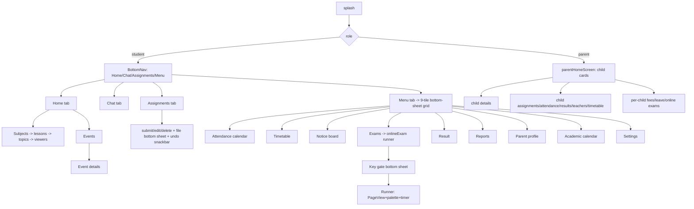
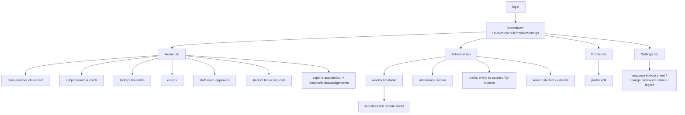

# eSchool v3.3.6 — Deep UX + Backend Audit

**Product:** eSchool — Virtual School Management System (Flutter app + Laravel admin panel), CodeCanyon item 38335673, vendor WRTEAM
**Audit date:** 2026-09-13 (this file supersedes `docs/competitor-audits/eschool-v3.3.6.md` first draft of 2026-09-11/12)
**Auditor:** deep-audit subagent, ASchool competitor deep-UX pass

**Paths audited (boot status: static-only — every claim below is static code or vendor docs/screenshot evidence; no live app was booted):**

| Layer | Path (absolute, from `/home/bishal-regmi/Desktop/ASchool/`) |
|---|---|
| Laravel admin panel (authoritative extraction) | `audits/deep-ux-2026-09/work/eschool-adminpanel/PHP_Code/` (fresh extraction of vendor `PHP_Code.zip`; the original `PHP Code/PHP_CODE_x/` tree is filesystem-flaky per RECON_MAP.md §1 — do not use) |
| Student+Parent Flutter app | `Other Projects/eSchool v3.3.6/eSchool v3.3.6/codecanyon-38335673-.../Flutter App Codes 3.3.6_extracted/Flutter App Codes 3.3.6/eSchool 3.3.6/e-school/` |
| Teacher Flutter app | `.../Flutter App Codes 3.3.6_extracted/Flutter App Codes 3.3.6/eSchoolTeacher 3.3.6/e-school-teacher/` |
| Vendor docs (Docusaurus) | `.../eSchool-Documentation_extracted/eSchool-Documentation/` (screenshots under `static/images/{admin,app,web}/`) |
| Version upgrade patches | `.../ESCHOOL Admin Panel 3.3.6_extracted/ESCHOOL Admin Panel 3.3.6/Updates/` (1.0.0→1.0.1 … 3.3.5→3.3.6) |

**Evidence convention:** every claim cites `file:line` from the extracted tree above. Vendor screenshot evidence cites the docs path. Where a claim could not be traced, it says so explicitly.

---

## 1. Executive Summary

eSchool v3.3.6 (released 2025-12-22 per `changelog/index.md:7`) is a **single-tenant, one-school-per-install** school-management product: a Laravel 12 Blade+jQuery admin panel (199 blade views, 56 controllers, 73 models, 66 migrations) plus **two** Flutter apps — a combined Student+Parent app (100 screen files) and a Teacher app (92 screen files). There is no admin mobile app; there is no transport, hostel, library, HR/payroll, health, or inventory module anywhere in the tree (verified by the model list `app/Models/` and sidebar menu). "Virtual school" means: public marketing website → online admission → lessons/topics/study material → online exams with a polished mobile runner → chat → online fee payment with 4 gateways → result/certificate PDFs.

The product's genuine strengths are (a) the **online-exam runner UX** (question palette, wakelock, away>5s auto-submit, LaTeX rendering, multi-answer MCQs) — verified line-by-line in this audit and confirmed to ship the answer key to the client, a serious integrity flaw; (b) a **complete fee-payment state machine** (pending → webhook-verified → receipt PDF) whose trust anchor is broken for Razorpay (HMAC mismatch only logged, and the webhook secret is delivered to every app client in `/api/settings`); (c) **server-driven ops governance** (force-update, maintenance, theme colors, per-platform versions for both apps) via one settings payload; and (d) uniform admin list UX (every module pairs a resource route with a `*_list` JSON endpoint for bootstrap-table — verified across sidebar + web.php).

Its structural weaknesses are the three **API god-controllers** (Student 3,391 / Parent 2,940 / Teacher 3,799 lines) that re-implement chat/leave/notification/profile per role with copy-paste (student group routes `get-payment-status` to `ParentApiController` — `routes/api.php:98`); **unauthenticated Artisan backdoors** (`/clear`, `/storage-link`, `/migrate`, `/seeder_install` — `routes/web.php:505-546`); secrets (gateway keys, webhook secrets, SMTP, FCM service-account file path) stored in a **plaintext `settings` table** and partially serialized to mobile clients; no queue usage (all PDFs, mail and FCM pushes happen synchronously in request handlers); and zero offline capability in either app (Hive stores auth/settings only — `utils/api.dart:39-42`).

For the ASchool single-vs-multi-tenant comparison: every table in the schema is school-agnostic with **no `school_id`/tenant column anywhere** (verified across the four core create-migrations); the license is a domain-locked Envato purchase code validated against `validator.wrteam.in` (`InstallPurchaseController.php:42`, `SystemUpdateController.php:58`); the vendor's separate eSchool SaaS product is the multi-tenant sibling and is audited by another subagent.

Six-task benchmark summary (numbers-only lines in §8): attendance 1 screen / 3 clicks / 2 filters; fee collection 1 screen+1 modal / ~4 clicks / 4 fields; notice to class 1 screen+1 modal / ~4 clicks / 3 fields; report card 2 screens / 3 clicks / 0 form fields; enroll student 1 screen / 1 submit / ~15 required fields; create+assign exam 2 screens / ~6 clicks / ~8 fields.

---

## 2. Stack & Architecture Shape (confirmed from composer.json / package.json / pubspec.yaml)

### 2.1 Backend — Laravel 12 monolith (confirmed)

`PHP_Code/composer.json` (read in full this pass):

- `laravel/framework: ^12.0`, `php: ^8.3.0` (composer.json `"require"`) — matches the changelog claim "Backend code to work with Laravel 12 with PHP 8.3" (`changelog/index.md:31`).
- Auth: `laravel/sanctum ^4.0` (token auth for all mobile APIs).
- RBAC: `spatie/laravel-permission ^6.0` — drives both sidebar visibility (`@can` directives throughout `layouts/sidebar.blade.php:82-956`) and per-endpoint permission checks in controllers.
- Documents: `barryvdh/laravel-dompdf ^3.1` (receipts, result PDFs, academic calendar, certificates — all rendered synchronously).
- Bulk data: `maatwebsite/excel ^3.1` (student bulk create, attendance bulk import, attendance export — `app/Imports/AttendanceImport.php`, `app/Exports/StudentsExport.php` referenced from `AttendanceController.php:429,460`).
- Payments: `razorpay/razorpay ^2.9`, `stripe/stripe-php ^18.0`, `unicodeveloper/laravel-paystack` (fork `dev-l12-compatibility` from `laravel-shift/laravel-paystack` — composer.json `repositories`), plus Flutterwave implemented by hand in `app/Services/Payment/FlutterwavePayment.php`.
- Push: `google/apiclient ^2.18` restricted to `FirebaseCloudMessaging` services (composer.json `extra.google/apiclient-services`) — FCM **HTTP v1** with OAuth token from a service-account file stored in `public/storage` (`app/Helpers/notification_helper.php:199-219`).
- Ops: `dacoto/laravel-wizard-installer` (wrteam fork, web installer), `mahesh-kerai/update-generator ^2.1` (in-app zip updater).
- Images: `intervention/image ^3.11`; composite relations: `awobaz/compoships ^2.4`.
- **No conferencing SDK, no queue worker usage beyond Laravel defaults** (`create_jobs_table.php` exists; no `ShouldQueue` dispatch found in the audited controllers — all side effects are inline).

### 2.2 Admin frontend — Blade + jQuery + bootstrap-table

`PHP_Code/package.json` / `public/assets/` and the blades confirm: server-rendered Blade (`resources/views/` 199 files), bootstrap-table with `data-side-pagination="server"` on every list screen (e.g. `attendance/index.blade.php:52-60`, `fees/fees_paid.blade.php:57`, `online_exam/index.blade.php:171`), select2 dropdowns, SweetAlert2 (`Swal.fire` at `attendance/index.blade.php:123`), datepicker-popups, CKEditor/TinyMCE in settings pages, `jquery-toast` for admin toasts, custom Bootstrap theme with `rtl.css`. Vite/Tailwind exist only as build plumbing (`vite.config.js`).

### 2.3 Mobile — two Flutter apps, BLoC everywhere

`e-school/pubspec.yaml` (read in full): `flutter_bloc ^9.1.1`, `dio ^5.9.0`, `hive ^2.2.3` (auth/settings box only), `table_calendar ^3.2.0`, `lottie`, `shimmer`, `flutter_animate`, `google_fonts`, `cached_network_image`, `youtube_player_flutter ^9.1.3` + `video_player` (study material playback), `flutter_pdfview`, `razorpay_flutter ^1.4.0` + `flutter_stripe ^12.1.1` (native payment sheets), `flutter_tex 4.0.9` (KaTeX exam questions), `wakelock_plus` (exam screen), `firebase_messaging ^16.0.4` + `awesome_notifications ^0.10.1` + iOS rich-image notification extension, `firebase_crashlytics ^5.0.5` + `firebase_analytics ^12.0.4` (added in 3.3.6 — changelog `changelog/index.md:11`), `any_link_preview`, `timeago`, `carousel_slider`, `readmore`, `flutter_keyboard_visibility`. Version `3.3.6+33`. 53 cubits / 13 repositories / 43 models in the student app tree; teacher app mirror stack (57 cubits / 14 repos / 42 models per prior draft census, file counts re-verified: 286 dart files, 92 under `ui/screens/`).

**Minimal offline data layer:** four Hive boxes open at init (`showCaseBoxKey` legacy, `authBoxKey`, `settingsBoxKey`, `studentSubjectsBoxKey` — `app/app.dart:93-96`); the JWT is read from the auth box for every request (`utils/api.dart:39-42`), and `studentRepository.dart:33-62` caches core/elective subject lists in the studentSubjects box — the **only** domain data cached offline; no mutation queue, no sync. (Ledger E13 nuances the prior draft's "Hive = auth only".) **Theming is compile-time, not server-driven:** both apps hardcode their palette in `lib/ui/styles/colors.dart` (`primaryColor = Color(0xff22577A)` — identical in both apps), and grep for `theme_color` across both lib trees returns nothing; the admin's `theme_color` setting reaches the public website and panel CSS, NOT the apps (ledger C7 — corrects the prior draft's §2.1 "server-supplied theme_color → ColorScheme" claim).

### 2.4 Single-tenant confirmation (feeds single-vs-multi-tenant comparison)

- No `school_id`/`tenant_id` column in any migration (checked in `2022_04_01_105826_all_tables.php`, `2022_11_11_065720_fees_module.php`, `2022_12_12_033204_online_exam_module.php`, `2023_12_08_122524_all_chat_table.php`, `2024_05_29_172900_create_all_leave_manage_table.php`, `2024_02_02_111843_create_all_tables.php`).
- School identity is one row of settings: `school_name`, `school_email`, `logo1/logo2` etc. consumed via `getSettings()` (`app/Helpers/settings_helper.php`).
- License: purchase code + domain lock posted to `https://validator.wrteam.in/eschool_validator` (`InstallPurchaseController.php:42`; same check inside the updater `SystemUpdateController.php:58`), stored in env as `APPSECRET` (`InstallPurchaseController.php:56`).
- Trial hook: `free_app_use_date` column on `session_years` (`2024_06_25_094803_add_column_free_app_use_date_in_session_years_table.php`) gates the compulsory-fee lock-out period at student login (`StudentApiController.php:160-208`).

### 2.5 Release engineering

Per-release cumulative migrations: `create_3.2.1_version.php`, `create_3.3.0_version.php`, `create_3.3.1_version.php` (plus dated 2025 migrations shipped with 3.3.4–3.3.6: `2025_10_27...`, `2025_11_13...`, `2025_12_15/16/18...`). Upgrade patches ship the **entire source tree** (13,026 files in the 3.3.3→3.3.4 `source_code.zip`, including `vendor/`, `composer.lock`, and a stray `database/database.sqlite`) plus a 3-line `version_info.php`; the in-app updater validates the purchase code, extracts over the install, and runs `/migrate` (SystemUpdateController.php:30-80+). Diffing the 3.3.6 patch's `StudentApiController.php` against the audited tree shows **zero differences** — the audited tree is exactly the 3.3.6 release.

---

## 3. Data Model (tables, models, relationships, notable issues)

73 models (`app/Models/`, count re-verified this pass). 66 migrations. The schema is built in four waves: baseline `2022_04_01_105826_all_tables.php` (26 tables), feature modules (fees 2022-11, online exam 2022-12, chat 2023-12, leave 2024-05, web/CMS 2024-02), patch migrations, and version-bundled migrations.

### 3.1 Academic core

| Table | Key columns (source) | Notes / issues |
|---|---|---|
| `classes` | name, medium_id (`all_tables.php:72-78`) | stream_id + shift_id added by later migrations. Class → medium, stream, shift. |
| `sections`, `class_sections` | class_id, section_id, class_teacher_id (nullable) (`:80-94`) | The `class_teacher_id` column was later replaced by the `class_teachers` join table (`2023_07_11_095636_create_class_teachers_table.php` + drop of the old column `2023_07_11_101343`). |
| `mediums` | name (`:96-101`) | Instruction-language dimension (e.g., English/Nepali medium) — Nepal-relevant concept. |
| `subjects` | name, code, bg_color, image, medium_id, type=Theory/Practical (`:103-113`) | |
| `class_subjects` | class_id, type=Compulsory/Elective, subject_id, elective_subject_group_id (`:115-123`) | Powers elective groups. |
| `elective_subject_groups` | total_subjects, total_selectable_subjects, class_id (`:125-132`) | Student self-selection capped server-side (`StudentApiController::selectSubjects:692-748`). |
| `subject_teachers` | class_section_id, subject_id, teacher_id (`:134-141`) | The join that makes class-timetable and teacher-timetable views consistent. |
| `student_subjects` | student_id, subject_id, class_section_id, session_year_id (`:143-150`) | Per-year elective picks. |
| `session_years` | name, default (`:56-62`) + start/end dates (`2022_05_13...`) + `include_fee_installments`, `fee_due_date`, `free_app_use_date` (later migrations) | One row is the "current" session via a **settings key** (`getSettings('session_year')`), not a DB flag — promotion/login logic depends on it. |
| `student_sessions` | student_id, session_year_id, class_section_id, status, result (`2022_06_03_060653...`) + `previous_session_year_id` (`2025_12_15...`) | Per-year enrollment rows; the mobile middlewares `EnsureStudentSessionIsActive` / `EnsureParentChildrenSessionIsActive` block logins for students not promoted. |
| `semesters` | + start/end dates (`2025_10_27_095126_update_semesters...`) | Current semester picked by `->first(fn($s) => $s->current)` (`TimetableController.php:64-66`). |
| `streams`, `shifts` | `2023_07_04/14` migrations | +2 (Science/Commerce…) and shift (morning/evening) dimensions. |
| `form_fields` | dynamic custom fields for student/parent forms (`2023_10_11_165326_create_dynamic_form_fields.php`) | Values persist as JSON in `dynamic_fields` columns; drag-rank admin (`form-fields/change-rank` route, `web.php:383`). |

### 3.2 People

- `students`: user_id, class_section_id, category_id, admission_no (unique), roll_number, caste, religion, admission_date, blood_group, height, weight, **father/mother/guardian name+phone+occupation+image denormalized on the student row AND** father_id/mother_id/guardian_id → `parents` (`all_tables.php:14-38`). Note: the login absent-notification flow in `AttendanceController.php:147-149` reads `$student->father_id/mother_id/guardian_id` while `StudentController` writes both denormalized copies — dual representation is a real drift risk.
- `teachers`: user_id, qualification (`:41-47`). `parents`: user_id (`:49-54`). `staffs`: separate non-teaching staff table (`2024_03_15_173052_create_staffs_table.php`).
- `users`: Laravel + `fcm_id`, `device_type`, `reset_request` columns (migrations `2022_05_19`, `2023_10_19`, `2022_05_31`).

### 3.3 Learning & assessment

- `lessons` → `lesson_topics` → (files via `File` morph) (`all_tables.php:153-172` + `2022_05_03_053843_add_lesson_files.php`).
- `assignments`: class_section_id, subject_id, name, instructions, due_date, points, `resubmission` bool, extra_days_for_resubmission, session_year_id (`:173-186`).
- `assignment_submissions`: status comment `0 = Pending/In Review, 1 = Accepted, 2 = Rejected, 3 = Resubmitted` (`:188-198`).
- `exams` (name, class_id→now via `exam_classes`, publish flag, session_year), `exam_timetables` (total_marks, passing_marks, date, start/end time), `exam_marks` (obtained_marks, teacher_review, passing_status, grade), `exam_results` (per-student totals/percentage/grade written at publish), `grades` (min/max percentage → grade letter) (`:200-260`).
- Online exam subsystem (`2022_12_12_033204_online_exam_module.php`): `online_exams` (class_subject_id→morph model_type/model_id after `2023_02_14` retarget to class/class-section, title, **exam_key bigint**, duration minutes, start/end dates, session_year), `online_exam_questions` (question_type `0 simple / 1 equation`, question, image_url, note), `online_exam_question_options`, `online_exam_question_answers` (**answer = option id; multiple rows per question = multi-answer**), `online_exam_question_choices` (per-exam attach with marks), `student_online_exam_statuses` (status `1 in-progress, 2 completed` — only two states), `online_exam_student_answers`.

### 3.4 Finance (fees_module.php:15-73)

- `fees_types` (name, `choiceable` 0/1), `fees_classes` (class_id, fees_type_id, amount), `fees_choiceables` (student opt-ins; is_due_charges; total_amount; status added `2023_09_23`; payment_transaction_id + date added later for placeholder rows), `installment_fees` + `paid_installment_fees` (due_date, due_charges, status), `payment_transactions` (`payment_gateway` comment says "1 - razorpay 2 - stripe" but the app uses 1-4; order_id, payment_id, payment_signature, `payment_status` `0 failed / 1 succeed / 2 pending`, total_amount; **mode/type_of_fee/date columns are added by later patch migrations** — compulsory offline collection writes `mode`/`cheque_no`/`type_of_fee` at `FeesTypeController.php:1633-1639`), `fees_paids` (aggregate per student+class+year: mode `0 cash/1 cheque/2 online`, is_fully_paid, due_charges).
- **Notable issue:** the fees module opens with `Schema::dropIfExists('fees'); dropIfExists('fees_paid'); dropIfExists('fees_sub_types');` (fees_module.php:10-13) — a destructive migration that replaces the v1 fees tables; fine for its own release, but it means the migration history is not replay-safe on data.
- Webhook reconciliation state lives in `payment_transactions.payment_status` + status flips on placeholder `fees_choiceables`/`paid_installment_fees` rows.

### 3.5 Communication & ops

- `announcements`: title, description, **nullableMorphs('table')** → attaches to SubjectTeacher / ClassSchool / empty=noticeboard; session_year (`all_tables.php:306-314`).
- `notifications` + `user_notifications` (`2023_10_18/23` migrations): one notification row per event (send_to role code, is_custom flag) + per-user fan-out rows. All FCM sends are inline cURL (`notification_helper.php:7-92`).
- Chat (2023-12): `chat_rooms`, `chat_members` (room↔user), `chat_messages` (morphs modal — sender targets a user or room —, sender_id, body, date), `chat_files` (message_id, file_name, file_type), `read_messages` (user_id, last_read_message_id) — read receipts per user per peer.
- Leave (2024-05): `leave_masters` (total_leave per month, holiday_days, session_year), `leaves` (user_id, leave_master_id, reason, from/to, `status` comment `0- pending, 1- approved, 3- rejected` — **the comment skips 2; the API validator for `getMyLeave` accepts `status in:0,1,2`** (`StudentApiController.php:3335`) — a genuine enum mismatch), `leave_details` (leave_id, date, type Full/Half). `reason_of_rejection` added 2025-11.
- Events/holidays: `events` (+`type` incl. exam → surfaces on academic calendar), `multiple_events` (multi-day schedules), `holidays`, `sliders` (+type app/web).
- CMS: `web_settings` (key-value content blocks), `educational_programs`, `medias`/`media_files` (photo/video galleries), `faqs`, `contact_us` (leads + admin reply).
- Timetable: `timetables` (subject_teacher_id, start/end time, day 1-7 + day_name, note) + **`live_class_url`, `link_name` added 2024-05-28** (`2024_05_28_153727_add_column_in_timetables_table.php:14-17`) — this is the entire "live class" feature (external URL, §4.8).

### 3.6 Notable data-model issues (summary; details in §11)

1. `payment_transactions.payment_gateway` comment documents only 1-2; code uses 1-4 (fees_module.php:55 vs `StudentApiController.php:2857`).
2. Leave status comment says 0/1/3 but mobile validators accept 0/1/2 (`StudentApiController.php:3335`).
3. Dual parent representation (denormalized father/mother/guardian text on `students` + FK ids) — update paths differ between web and API writers.
4. `exam_results` rows are **deleted and re-inserted wholesale on publish-toggle** (`ExamController.php:415-420`) — result ids are not stable, so any external reference breaks.
5. Online-exam attempt lifecycle has only 2 states; an in-progress row permanently blocks re-entry (§4.4).
6. `academic_calendars` table exists in the baseline but is **unused by current code** (holidays/events/exam timetable are unioned at read time instead — `getAcademicCalendarPdf` builds from those three sources); dead table.

---

## 4. Backend Flow Traces

Every trace below is entry route → controller → DB → side effects → response, with file:line for each hop. All paths relative to `PHP_Code/`.

### 4.1 Auth — student login (mobile)

1. **Route:** `POST student/login` (`routes/api.php:32`) → no auth middleware at group level for this route (unauthenticated subgroup api.php:31-34).
2. **Controller:** `StudentApiController::login` (`app/Http/Controllers/Api/StudentApiController.php:73-283`).
3. **Validation:** `gr_number`, `password` required (:75-78). Failure → `ResponseService::errorResponse(..., 102)` (:80-82).
4. **DB reads:** settings for session year + compulsory-fee mode (:84-88); `Auth::attempt(['email' => gr_number, password])` (:98) — the users.email field doubles as the GR number; role check `hasRole('Student')` (:102); `StudentSessions` existence for current session (:109-112) → error "promotion not completed" if missing; status==0 → deactivated (:114-115).
5. **DB writes:** `fcm_id` and `device_type` saved onto the user row if provided (:117-125) — this is how per-device push targets get registered; there is a **race**: two saves in sequence, and every login overwrites the previous device's token (single-token-per-user model; no token list).
6. **Fee-due computation:** if `compulsory_fee_payment_mode == 1` and past `free_app_use_date`, computes `is_fee_payment_due` by reading FeesPaid/InstallmentFee/PaidInstallmentFee (:159-252) — 5+ queries on the login hot path, with a duplicated 40-line installment branch for the free-trial vs normal case (:174-208 vs :219-248 — copy-paste).
7. **Side effects:** none queued; no notification on login.
8. **Response:** flattened user + class/section/stream/medium/shift/category names + `dynamic_fields` + `is_fee_payment_due` + Sanctum plainTextToken (:277-278).

Parent login mirrors this (`ParentApiController::login:67-315`); teacher login at `TeacherApiController::login:58`. Every subsequent student call runs `auth:sanctum` + `student.session.active` middleware (`app/Http/Middleware/EnsureStudentSessionIsActive.php:20-38` re-checks the StudentSessions row and returns HTTP 401 with `SESSION_NOT_ACTIVE`); parent calls run `parent.children.session.active` (`EnsureParentChildrenSessionIsActive.php:19-64`) which requires **at least one active child** — note it returns 401 if ANY child lacks a session row (early return inside the loop, :43-50), a strictness quirk: one unpromoted sibling blocks the whole parent account.

### 4.2 Students — enroll one new student (admin web)

1. **Route:** `POST students` resource store (`routes/web.php:185`) inside `['Role','auth']` + `language` middleware.
2. **Controller:** `StudentController::store` (`app/Http/Controllers/StudentController.php:459-1016`).
3. **Permission:** `Auth::user()->can('student-create')` else JSON error (:462-467).
4. **Validation** (:469-496): first_name, last_name required; mobile `numeric regex 7-16 digits`; image `jpeg,png,jpg max:2048`; dob, class_section_id, category_id, admission_no `unique:students,admission_no`, admission_date `d-m-Y`, current/permanent address, height/weight `numeric min:0`, `parent_guardian_type in:parent,guardian`. Parent emails additionally validated `email|unique:users,email|unique:parents,email` with **father/mother images required** (:509-520); guardian branch requires guardian_first/last_name, mobile, gender, dob, occupation, image (:713-722).
5. **DB writes inside DB::beginTransaction** (:500): per-parent `User` created with **password = parent DOB ddmmyyyy** (:521, :540, :617, :724 — plaintext passwords are derived deterministically and mailed), `assignRole('Parent')`, `Parents` row with dynamic_fields JSON (:550-606 mother :618-709 guardian :724+). Student user + `Students` row + dynamic fields (:894-902); `StudentSessions::create` for current session (:906-913); roll number computed.
6. **Side effects:** `MailService::sendWithFallback('students.email', …)` welcome mails to father+mother or guardian carrying **plaintext usernames+passwords for parent and child** (:928-985). Mail failure is caught and swallowed as success "email_not_send" (:1000-1003).
7. **Response:** `ResponseService::successResponse` JSON (:998).

### 4.3 Attendance

**Admin web store:**
1. **Route:** `POST attendance` resource (`web.php:214`) → `AttendanceController::store`.
2. **Permission:** `attendance-create` OR `attendance-edit` (`AttendanceController.php:83-89`).
3. **Validation:** class_section_id, student_id array min:1, date `d-m-Y` (:91-95).
4. **DB:** reads existing rows for date+section keyed by student (:112-116) then upserts per student: type from per-student radio `type{id}` or holiday=3 (:118-138).
5. **Side effects:** if a student flips to absent (type 0) and was not absent before → creates `Notification` (send_to=4 parents) + `UserNotification` fan-out rows to father/mother/guardian user ids, then `sendSimpleNotification()` FCM push inline (`AttendanceController.php:141-179`). Note the FCM helper only sends to users whose `fcm_id != ''` and splits android/ios payloads (`notification_helper.php:10-11`).
6. **Response:** JSON `{error:false, message:data_store_successfully}` (:183-186).

**Teacher app submit (the daily-use path):**
1. **Route:** `POST teacher/submit-attendance` (`api.php:215`) → `TeacherApiController::submitAttendance` (`TeacherApiController.php:1608-1694`).
2. **Permission:** `noAnyPermissionThenSendJson(['attendance-create','attendance-edit'])` (:1610).
3. **Validation:** class_section_id, `attendance.*.student_id`, `attendance.*.type in:0,1`, date (:1612-1619).
4. **DB:** loads existing rows for date+section, builds upsert array, `Attendance::upsert($data, ['id'], [...])` — one bulk write (:1622-1645). Holiday type 3 supported via `holiday` request field (:1631-1635).
5. **Side effects:** for every newly-absent student, Notification + UserNotification + inline FCM per parent (:1647-1684). **Bug found:** `sendSimpleNotification()` is called **inside the inner foreach of the notification-row loop** (`:1670-1673` — the call sits inside `foreach ($user as $data)`), so duplicate pushes per user are possible when both parents are linked; also `send_to=3` here vs `send_to=4` on the web path — the role code is inconsistent between the two writers (web `AttendanceController.php:162` uses 4, teacher uses 3).
6. **Response:** success JSON (:1685).
7. **Get path:** `teacher/get-attendance` (`api.php:214` → `getAttendance:1552-1605`) returns existing rows, an `is_holiday` flag if a `Holiday` row matches the date, and `on_leave_student_ids` computed from approved leaves with leave_detail on that date (:1568-1583) — the app renders those students as "On Leave" and disables marking.

### 4.4 Exams — offline marks → publish → report card; online exams

**Marks entry (web):**
1. `GET exams/upload-marks` (`web.php:250`) → `ExamController::uploadMarks:442-457` — class list scoped to the current user's class-teacher sections (teacher_id = `Auth::user()->teacher->id`).
2. `GET exams/marks-list` (`web.php:251` → `marksList:480-608`) — requires exam_id+subject_id+class_id+class_section_id else returns bare `false` (:488-490); computes exam window from timetable min/max dates and **rejects marks entry while the exam is not completed** (`exam_status != 2` → "exam_not_completed_yet", :523-529); includes elective filtering (only students who picked the subject, :564-584).
3. `POST exams/submit-marks` (`web.php:248` → `submitMarks:610-667`): validates `obtained_marks lte total_marks` per row (:613-619); computes passing_status vs exam_timetable.passing_marks and grade via `findExamGrade()` percentage lookup (:632-648); `ExamMarks::updateOrInsert` keyed by exam_marks_id-or-null (:650-653). No notification fired.

**Publish (the report-card gate):**
1. `POST exams/publish/{id}` (`web.php:256` → `publishExamResult:347-440`).
2. Guards: every timetable row must have marks (:350-359); exam window must be completed (:369-387).
3. DB: aggregates `SUM(total_marks)/SUM(obtained_marks)` per student (:361-365); percentage → `findExamGrade` (fails if grades table incomplete, :396-402); **inserts ExamResult rows; toggle semantics — re-publishing deletes all ExamResult rows for the exam and un-publishes** (:415-421).
4. Side effects: none (no push on publish); students see results via app APIs gated on `publish=1`.

**Report card generation:** `GET generate-result/{id}` (`web.php:444` → `StudentController::generateResult:2024+`, blade `students/generate_result.blade.php` + `result_template.blade.php`) — synchronous dompdf. Teacher app equivalent: `GET teacher/get-student-result-pdf` (`api.php:248` → `TeacherApiController::getStudentResultPdf:3066`), base64 PDF response.

**Online exam attempt (student app):**
1. `GET student/get-online-exam-list` (`api.php:61` → `getOnlineExamList:1506-1622`): filters `end_date >= now` AND `whereDoesntHave('student_attempt', student)` — **attempted exams vanish from the list; no retake concept**; ships `exam_key` in the list payload (:1593 area).
2. `GET student/get-online-exam-questions` (`api.php:62` → `getOnlineExamQuestions:1624-1709`): validates exam_id+exam_key (:1626-1629); rejects if ANY status row exists → `student_already_attempted_exam` (:1644-1647); checks **only start_date** (:1650-1655); creates status row **status=1 BEFORE serving questions** (:1658-1662); response includes per-question `options` **and `answers` (correct option ids + text)** (:1684-1699) — **the answer key is delivered to the exam-taker's device**.
3. `POST student/submit-online-exam-answers` (`api.php:63` → `submitOnlineExamAnswers:1711-1780`): rejects if answer rows exist (:1729-1732); per answer verifies choice∈exam (:1737-1741) and option∈question (:1744); inserts one row per selected option (:1750-1760); flips status 1→2 (:1762-1767). **No duration check, no end-date check.** Client sends `[0]` for unanswered questions (Dart `examOnlineScreen.dart:232-235` `element.submittedAnswerId ?? [0]`) — option id 0 fails the exists-check so blank answers insert no rows, leaving the idempotency guard un-armed.
4. Scoring is **read-time, never persisted**: `getOnlineExamReport:1782-1926` recomputes correctness (question correct only if submitted set covers every answer row, all-or-nothing :1828-1836) and sums `choices.marks` (:1848-1854), per-subject aggregate + per-exam list, recomputed identically in `getOnlineExamResultList:2021+` and `getOnlineExamResult:2105+`.
5. Parent equivalents are read-only (`api.php:151-153` — no questions/submit routes in the parent group; verified).

### 4.5 Fees & payments

**Mobile online payment (student/parent):**
1. `GET student/fees-details` (`api.php:81` → `getFeesDetails:2737-2851`): splits compulsory/choiceable/installments; **read-path repair — any transaction still pending (2) older than 1 hour is flipped to failed (0) on read** (:2767-2776); exposes session-year due date/charges and `is_fee_pending`.
2. `POST student/add-fees-transaction` (`api.php:82` → `storeFeesTransaction:2854-2974`): validates `payment_method in:1,2,3,4`, `type_of_fee in:0,1,2`, `is_fully_paid in:0,1` (:2856-2861); creates `PaymentTransaction` status=2 pending (:2891-2902); creates placeholder `FeesChoiceable`/`PaidInstallmentFee` rows status=0 keyed by payment_transaction_id (:2905-2938); calls `PaymentService::create(gw)->createAndFormatPaymentIntent()` — gateway metadata carries ALL reconciliation ids including JSON lists of placeholder row ids (:2940-2955); saves gateway order_id (:2958-2960); returns gateway checkout payload (:2962-2969).
3. Client checkout: native Razorpay/Flutter Stripe SDKs, or `webviewPaymentScreen.dart` for Paystack/Flutterwave using `authorization_url` (`feesDetailsScreen.dart:753-823` verified region).
4. `POST student/store-fees` (`api.php:83` → `storeFees:2977-3001`): persists client-supplied payment_id/payment_signature **unverified** (:2988-2996).
5. **Webhook trust anchor:** `POST webhook/razorpay` (`web.php:488` → `WebhookController::razorpay:21-229`): reads secret from env (:34) — **but `/api/settings` serializes `razorpay_webhook_secret` and `razorpay_api_key` to every app client** (`ApiController.php:203-211`); computes HMAC and **only logs whether it matched** (:63-69) before calling `$api->utility->verifyWebhookSignature` (:70) whose exception is swallowed by the outer catch (:225-228); on `payment.captured` sets status=1, flips placeholder rows, upserts FeesPaid with is_fully_paid + due charges, sends "Payment Success" Notification + UserNotification + FCM (:72-172); on `payment.failed` sets 0, deletes status-0 placeholders, pushes "Payment Failed" (:184-217). Stripe path uses proper `\Stripe\Webhook::constructEvent` signature verification with 400 on failure (`WebhookController.php:230-259`).
6. **Fallback verification:** `POST student/get-payment-status` — route points at **`ParentApiController::getPaymentStatus`** (`api.php:98`, cross-controller copy-paste; duplicate body at `StudentApiController.php:3152-3182`): polls `https://api.stripe.com/v1/payment_intents/{id}` **regardless of gateway** and picks whichever secret key is enabled (:3157-3170).
7. **Client-reported failure:** `POST student/fail-payment-transaction` (`failPaymentTransactionStatus:3114-3148`) lets the student token mark its own transaction failed + triggers "Payment Failed" push.
8. Receipt: `GET student/fees-paid-receipt-pdf` (`feesPaidReceiptPDF:3017-3072`) — synchronous dompdf, base64 in response.

**Admin offline collection (cash/cheque):**
1. `POST fees/compulsory-paid/store` (`web.php:336` → `FeesTypeController::compulsoryFeesPaidStore:1569-1730`).
2. Permission `fees-paid` (:1571-1576). Validation: date, `mode in:0,1` (:1577-1580).
3. DB: creates PaymentTransaction with `payment_status=1` directly (:1629-1640 — note it writes `mode`, `cheque_no`, `type_of_fee`, `date` columns that are **not in the fees_module migration**, added by later patch migrations), bulk-inserts PaidInstallmentFee rows status=1 (:1644-1664), firstOrNew FeesPaid and accumulates total_amount + is_fully_paid + due_charges (:1671-1688).
4. Side effects: "Payment Success" Notification + FCM to father (:1695-1710). **Sequential-installment enforcement is commented out** (:1593-1620) — later installments can be collected before earlier ones.
5. Response: success JSON (:1712-1715).

### 4.6 Notices / announcements (publish to one class + parents)

1. **Route:** `POST announcement` resource (`web.php:228`) → `AnnouncementController::store`.
2. **Permission:** `announcement-create` (`AnnouncementController.php:61-67`).
3. **Validation:** title required, `set_data` required (the assign-to selector), `file.*` mimes pdf/office/images max 4096 KB (:68-75).
4. **Targeting** (:91-151): `set_data == 'class_section'` associates the announcement to the teacher's SubjectTeacher row and fans out to **students' user_ids of that class-section** (:97-118); `'class'` → all students of the class (:119-126); `'noticeboard'` → **all students** (:127-133). Attachments stored via the `File` morph (:140-149).
5. **Side effects:** `sendSimpleNotification($user, title, body, type, ...)` inline FCM to every targeted student user (:150) — no Notification/UserNotification rows are written on the web path (only FCM); push failure mid-loop is caught and reported as "Data Stored successfully. But App push notification not send." (:156-162).
6. **Response:** success JSON (:152-155).
7. **Note for the benchmark:** there is **no parent-targeted announcement option** — fan-out is to `Students::pluck('user_id')` only; parents see class announcements only via the parent app's own `parent/announcements` endpoint which lists the same board (`ParentApiController::getAnnouncements:746+`), i.e., "publish to class + parents" is really "publish to class; parents read the same board per child."

### 4.7 Timetable (incl. the "live class" link)

1. **Create:** `POST timetable` (`web.php:198` → `TimetableController::store:48-112`): permission timetable-create/edit; validates day + class_section_id only (:58-61); maps day-name→int (:73-87); per slot resolves SubjectTeacher id (defaults to 0 if not found, :95-96 — **slots can be saved with subject_teacher_id=0**) and writes start/end time, day, semester, **live_class_url + link_name** (:99-105). The `checkTimetable` GET endpoint (`web.php:200` → `:136-140`) returns existing slots for clash-checking but the store does **not** enforce it server-side.
2. **View:** `GET class-timetable` / `teacher-timetable` (`web.php:209-210` → `:173-247`), data via `gettimetablebyclass`/`gettimetablebyteacher` (:203-263).
3. **Teacher app link edit:** `POST teacher/update-timetable-link` (`api.php:257` → `TeacherApiController::updateTimetableLink:3777-3794`): validates `timetable_id` required, `live_class_link nullable|url`, link_name nullable (:3779-3784) then writes the row. **No permission check and no ownership check** — contrast sibling endpoints that call `ResponseService::noPermissionThenSendJson(...)` (e.g. `getAttendance:1553`); any authenticated teacher token can rewrite any timetable row's link by id.
4. **Student join:** `timetableContainer.dart:277-296` (prior-draft citation, re-confirmed present) — `launchUrl(..., LaunchMode.externalApplication)` hands the URL to the OS. No in-app room, no window check, no attendance capture.
5. **Live-class verification:** grep for zoom/jitsi/bbb/meet across `PHP_Code/app` returned zero hits in the prior draft; this pass re-confirmed composer.json has no conferencing SDK (§2.1). **"Live classes" = external URL fields on timetable slots, nothing more.**

### 4.8 Communication — chat (student↔teacher)

1. **Route:** `GET student/get-user-list` → `getChatUserList:2410-2524` (allowed users = subject teachers/class teachers of the student's section plus co-students per settings); `POST student/send-message` → `sendMessage:2525-2666` (creates/gets 1:1 ChatRoom, inserts ChatMessage + ChatFiles rows, then sends a chat-type FCM push with `sender_info` payload so the app can badge (`notification_helper.php:21-33`)); `POST student/get-user-message` (paged history); `POST student/read-all-message` (updates ReadMessage last_read_message_id).
2. **Retention:** settings `automatically_messages_removed_days`, `max_characters_in_text_message`, `max_file_size_in_bytes`, `max_files_or_images_in_one_message` (served to apps in `/api/settings` `chat_settings` block, `ApiController.php:186-191`); enforced by cron route `GET delete-chat-message/cron-job` (`web.php:485` → `SettingController::cron_job`).
3. Parent and teacher groups re-implement the same four endpoints per role (`api.php:124-127, 243-246`) — no shared controller.

### 4.9 Leaves

1. Student/parent: `POST student/apply-leave` (`api.php:95` → `applyLeave:3219-3328`): rejects unknown request keys (:3221-3226); validates reason, leave_details array, files mimetypes (:3228-3246); derives from/to = min/max of detail dates (:3259-3262); creates Leave (status "0") + LeaveDetail rows + File attachments (:3264-3287); notifies **class teachers** via Notification rows + FCM (:3290-3316). `POST get-leave-list` returns taken-leaves aggregate (half-day = 0.5) (:3330-3377).
2. Teacher approval: `POST teacher/student-leave-status-update` (`api.php:255` → `studentLeaveStatusUpdate:3462+`) with reason_of_rejection. Admin web: `student-leave-request` screens (`web.php:475-477`).

### 4.10 Installer / updater / ops backdoors

- `GET/POST install/purchase` (`web.php:69-72` → `InstallPurchaseController`): posts purchase_code+domain to `validator.wrteam.in/eschool_validator` (:42), stores code in env `APPSECRET` (:56).
- `POST system-update` (`web.php:372` → `SystemUpdateController::update:29-80+`): Super Admin only (role check :30-35, :41-46); validates `purchase_code alpha_dash` + zip file (:47-52); re-validates against the vendor validator (:58); extracts to `update/tmp/` and overwrites.
- **Unauthenticated ops routes** (`web.php:505-546`): `/clear` (view/route/config/cache clear), `/storage-link`, `/migrate` (runs `Artisan::call('migrate')`), `/seeder_install` (runs `InstallationSeeder`). No auth middleware on any of them — anyone who can reach the panel host can re-run migrations or re-seed.
- `/api/settings` payload (`ApiController::getSettings:100-253`): includes per-platform app links/versions/force/maintenance flags for BOTH apps (:161-175), `online_payment`, `is_demo` from env (:177-178), compulsory-fee mode, chat limits block (:186-191), holiday days, `payment_options` with currency, fees due date/charges, and **per-gateway blocks including `razorpay_api_key` and `razorpay_webhook_secret`** (:203-211), `online_exam_terms_condition` (:237-241), plus server-derived `semester_breaks` (:121-153). This one endpoint is the apps' entire ops-config surface.

---

*(sections 5–12 continue below — appended incrementally)*

---

## 5. Full Page/Screen Inventory

### 5.1 Laravel admin panel — route table

All authenticated admin routes sit under `['Role','auth']` + `language` middleware (`routes/web.php:105-106`); the sidebar (`resources/views/layouts/sidebar.blade.php`, 962 lines) gates each item with spatie `@can`/`@canany` directives. "Roles" below: SA = Super Admin (all), T = Teacher-allowed items (class-teacher scoped), plus any staff role granted the spatie permission. Screenshot refs are vendor docs images under `eSchool-Documentation_extracted/eSchool-Documentation/static/images/admin/` (41 numbered screenshots + firebase/chatsetting named ones — the docs do not map numbers to screens, so they are cited as a corpus, not per-screen).

| # | Route (web.php line) | Sidebar parent (sidebar line) | Purpose | Roles | View (resources/views/) |
|---|---|---|---|---|---|
| 1 | GET home (108) | Dashboard (76) | Stats + announcements + attendance chart | SA, T, all staff | home.blade.php |
| 2 | resource medium (126) | Academics→Medium (96) | Instruction-medium CRUD | medium-create | medium/ |
| 3 | resource section (134) | Academics→Section (103) | Section CRUD | section-create | section/ |
| 4 | resource stream (375) | Academics→Stream (110) | Stream CRUD | stream-create | stream/ |
| 5 | resource shifts (377) | Academics→Shift (117) | Shift CRUD | shift-create | shifts/ |
| 6 | resource subject (165) | Academics→Subject (124) | Subject CRUD (+list endpoint 166) | subject-create | subject/ |
| 7 | resource semester (472) | Academics→Semester (131) | Semester CRUD (+start/end dates) | semester-create | semester/ |
| 8 | resource class (156) | Academics→Class (138) | Class CRUD (+class-list 155) | class-create | class/ |
| 9 | GET/POST class/subject (150-154) | Academics→Assign class subject (145) | Compulsory/elective subject assignment | subject-create | class/ |
| 10 | class/select-elective-subjects (137-146) | Academics→Assign elective subjects (152) | Elective group assignment + student overrides | assign-elective-subjects | select_elective_subjects/ |
| 11 | assign/class/teacher (160-163) | Academics→Assign class teacher (157) | Class-teacher mapping | class-teacher-create | class/ |
| 12 | resource subject-teachers (195) | Academics→Assign subject teacher (171) | Subject-teacher mapping | subject-teacher-* | teacher/ |
| 13 | students/assign-class (180-181) | Academics→Assign new student class (179) | Assign class to new admissions | assign-class-to-new-student | students/assign-class |
| 14 | resource promote-student (293) | Academics→Promote student (187) | Year-end promotion | promote-student-create | promote_student/ |
| 15 | resource form-fields (384) | Custom Fields (202) | Dynamic student/parent form fields + rank | form-field-create | form_fields/ |
| 16 | resource category (192) | Students→Student category (222) | Student category CRUD | category-create | category/ |
| 17 | resource students (185) | Students→Student admission (231) | Add/list students (create form lives in students/index.blade.php) | student-create | students/index, details |
| 18 | online-registration (467-470) | Students→Online registrations (239) | Approve/reject web registrations | online-registration-list | students/online_registration |
| 19 | student/assign-roll-number (188-190) | Students→Assign roll no (247) | Roll number assignment | student-create | students/assign_roll_no |
| 20 | students-list (178) | Students→Student details (256) | bootstrap-table list | student-list | students/details |
| 21 | generate-id (429-433) | Students→Generate ID card (265) | ID card batch generator + settings/template | generate-id-card | students/generate_id, id_card_* |
| 22 | student-generate-result + generate-result/{id} (441-444) | Students→Generate result (274) | Per-student result PDF | generate-result | students/generate_result, result_template |
| 23 | reset-password (287-291) | Students→Reset password (283) | Admin-driven student password reset | student-reset-password | students/reset_password |
| 24 | students/create_bulk (183-184) | Students→Add bulk data (292) | Excel bulk student create | student-create | students/add_bulk_data |
| 25 | bonafide-certificate (435-436) | (from student details) | Bonafide cert PDF + template | generate-document | students/bonafide_* |
| 26 | leaving-certificate (438-439) | (from student details) | Leaving cert PDF + template | generate-document | students/leaving_* |
| 27 | resource teachers (129) | Teacher→Create (316) / Details (324) | Teacher CRUD + details | teacher-create/list | teacher/ |
| 28 | resource parents (169) | Parents (345) | Parent CRUD + search | parents-create | parents/ |
| 29 | resource roles (117) | Staff Mgmt→Role permission (358) | spatie roles + permissions matrix | role-create | roles/ |
| 30 | resource staff (427) | Staff Mgmt→Staff (365) | Non-teaching staff CRUD | staff-list | staff/ |
| 31 | resource leave (455) | Leave→Apply leave (389) | Admin applies own leave | leave-create | leave/index |
| 32 | resource leave-master (447) | Leave→Leave setting (396) | Leave types/quota per month | leave-setting-create | leave/leave_setting |
| 33 | leave-report (449-450) | Leave→Leave report (402) | Staff leave report | leave-list | leave/leave_details |
| 34 | leave-request (451-454) | Leave→Staff leave requests (410) | Approve/reject staff leaves | leave-approve | leave/leave_request |
| 35 | student-leave-request (475-477) | Leave→Student leave requests (424) | Approve/reject student leaves | student-leave-approve | leave/student_leave_request |
| 36 | staff-leave (480-481) | (routed but "not used" comment web.php:479) | Orphaned route — view exists | — | leave/staff_leave |
| 37 | resource timetable (198) | Timetable→Create timetable (447) | Weekly grid editor with live-class link fields | timetable-create | timetable/index, addmore |
| 38 | class-timetable (209) | Timetable→Class timetable (454) | Class-wise weekly view | class-timetable | timetable/class_timetable |
| 39 | teacher-timetable (210) | Timetable→Teacher timetable (462) | Teacher-wise weekly view | teacher-timetable | timetable/teacher_timetable |
| 40 | resource attendance (214) + store/create_bulk/view/report (215-221, 461-462) | Attendance group (482-510) | Mark, bulk-import (CSV), view, report + Excel export | attendance-* | attendance/ (4 views) |
| 41 | resource lesson (223) + search (224) + file/delete (225) | Subject Lesson→Create lesson (533) | Lesson CRUD + files | lesson-* | lessons/ |
| 42 | resource lesson-topic (226) | Subject Lesson→Create topic (540) | Topic CRUD + files | topic-* | lessons/ |
| 43 | resource assignment (237) + submission (238-240) | Student Assignment group (559-570) | Assignment CRUD + submissions review | assignment-* | assignment/ |
| 44 | resource exams (258) + marks/upload/publish/grades (244-269) | Exam group (594-625) | Exams, timetable, marks upload, results, grades | exam-* | exams/ (5 views) |
| 45 | resource exam-timetable (271) | Exam→Exam timetable (601) | Per-subject exam schedule | exam-timetable-create | exams/exam-timetable |
| 46 | resource fees-type (312) + fees/classes (314-320) | Fees→Fees / Assign (649-657) | Fee types + class assignment | fees-type/classes | fees/fees_types, fees_class |
| 47 | fees/paid (322-341) | Fees→Collect fees (664) | Collect cash/cheque, edit, clear, receipt | fees-paid | fees/fees_paid (+receipt) |
| 48 | fees/transaction-logs (338-339) | Fees→Transaction logs (673) | Payment transaction list | fees-paid | fees/fees_transaction_logs |
| 49 | resource online-exam (354-366) | Online Exam→Manage (702) | Online exams + per-exam question attach | manage-online-exam | online_exam/index, class_questions |
| 50 | resource online-exam-question (364-366) | Online Exam→Manage questions (708) | Question bank (choice/equation) | manage-online-exam | online_exam/exam_questions |
| 51 | online-exam/terms-conditions (351-352) | Online Exam→T&C (714) | **One global** T&C editor | manage-online-exam | online_exam/terms_conditions |
| 52 | resource notifications (386) | Custom Notifications (728) | Push composer (role/class/topic targeting) | notification-create | notification/ |
| 53 | resource announcement (228-231) | Announcement (740) | Targeted announcements + attachments | announcement-* | announcement/ |
| 54 | resource sliders (242) | Sliders (751) | App + website slider management | slider-create | sliders/ |
| 55 | resource holiday (233-235) | Holiday list (762) | Holiday CRUD + calendar view | holiday-* | holiday/ |
| 56 | resource events (389) + view-schedule (464-465) | Events (774) | Events + multi-day schedules | event-create | events/ |
| 57 | resource session-years (172-175) | Session years (785) | Academic years + current switch + installment cleanup | session-year-create | session_years/ |
| 58 | content/educational-program/photos/videos/faq/contact-us web (391-425) | Web Settings group (805-838) | CMS blocks, programs, galleries, FAQ, lead inbox | content/program/media/faq/contact-us | web_settings/ |
| 59 | settings + fcm/email/app/chat (120-124, 275-285, 369-370, 457-459) | System Settings group (859-938) | General/FCM/Email/App/Chat settings pages | setting-* | settings/ (12 views) |
| 60 | system-update (371-372) | System Update (954) | Zip updater + purchase code | Super Admin only (controller check :30-35) | system-update/ |
| 61 | edit-profile / changePassword (297-302) | Profile | Self profile + password | all authed | settings/update_profile |
| 62 | language CRUD + set-language (304-308) | System Settings→Languages (873) | Panel language mgmt + RTL | language-create | settings/language_setting |
| 63 | — Public site — `/`, about, contact, photo(-gallery), video, registration, contact-us/store (88-97) | none | Marketing site + online admission form + lead capture | public | web/ (11 views) |
| 64 | webhook/razorpay|stripe|paystack|flutterwave + paystack/flutterwave success (488-493) | none | Payment webhooks/callbacks | public (signature-verified, except razorpay log-only) | — |
| 65 | clear / storage-link / migrate / seeder_install (505-546) | none | **Unauthenticated Artisan ops** | PUBLIC — security hole | — |
| 66 | delete-chat-message/cron-job (485) | none | Chat retention cron | public (cron) | — |
| 67 | privacy-policy / terms-conditions echo routes (495-503) | none | Raw HTML policy pages for apps | public | — |

Route-count verification this pass: `grep -c 'Route::' web.php` = **318** definitions (314 excl. commented block + 36 `Route::resource`), matching the prior draft's "314 (36 resource)" within counting noise; `api.php` = **151** definitions (~127 unique endpoints).

### 5.2 Mobile API surface (routes/api.php)

- **Student group (api.php:29-100):** 1 login + 1 forgot-password unauthenticated; 41 authenticated GET/POST endpoints under `auth:sanctum` + `student.session.active` (dashboard, subjects, class-subjects, select-subjects, parent-details, timetable, lessons, lesson-topics, assignments ×4, attendance, announcements, exams ×3, online-exam ×6, reports ×2, profile, notifications, chat ×4, fees ×8, academic-calendar-pdf, send-fee-notification, leaves ×3, get-payment-status→ParentApiController).
- **Parent group (api.php:105-167):** 1 login; 11 child-free endpoints (announcements, receipt, transactions, profile, fail-payment, notifications, payment-status, chat ×4); 22 child-scoped endpoints under `CheckChild` middleware (api.php:129).
- **Teacher group (api.php:172-259):** 1 login; 44 endpoints incl. assignment CRUD+review, lesson/topic CRUD, file ops, announcement CRUD, attendance get/submit, exams/marks ×6 (2 behind `CheckStudent`), students ×2, academic calendar, timetable, profile, notifications, chat ×4, result PDF, leaves ×3, student leaves ×2, update-timetable-link.
- **General (api.php:264-275):** holidays, sliders, current-session-year, settings, forgot-password, events ×2, get-session-year, change-password.
- Client registry: `e-school/lib/utils/api.dart` = **86 static endpoint constants** (count verified), mapping 1:1 to the route file.

### 5.3 Flutter Student+Parent app — screen inventory (100 files under `lib/ui/screens/`, verified listing)

**Role structure:** one app, role chosen at login (`auth/authScreen.dart` → `studentLoginScreen.dart` (gr-number+password) or `parentLoginScreen.dart`). Bottom nav = 4 tabs: Home / Chat / Assignments / Menu (`home/homeScreen.dart:128-158`, verified this pass). The Menu tab opens a bottom-sheet grid driven by `lib/utils/homeBottomsheetMenu.dart:13-23` — exactly **9 tiles**: attendance, timetable, notice board, exams, result, reports, parent profile, academic calendar, settings. Parent mode swaps the shell for `parentHomeScreen.dart` with child cards → child-scoped screens.

| Screen (file under `lib/ui/screens/`) | Purpose | Key widgets/states (code-verified where cited) |
|---|---|---|
| splashScreen.dart | App-config fetch (`fetchAppConfiguration()` :49, :116), retry on failure | blocking retry |
| auth/authScreen.dart | Role select (student/parent) | |
| auth/studentLoginScreen.dart, parentLoginScreen.dart | Logins (+forgot-password bottom-sheets in auth/widgets/) | |
| home/homeScreen.dart | 4-tab shell; maintenance body-swap (:454-455 reads `appUnderMaintenance()`), force-update dialog (:491-507), notification badge refresh on resume (didChangeAppLifecycleState :162-177) | |
| home/widgets/homeContainer.dart + 6 containers | Today's timetable, pending assignments, upcoming exams, results, events, sliders, latest announcements | shimmer placeholders |
| home/widgets/moreMenuBottomsheetContainer.dart | 9-tile menu grid | |
| parentHomeScreen.dart (748 lines) | Child cards → per-child screens | |
| childDetailsScreen/childAssignments/childAttendance/childResults/childTeachers/childTimeTable | Parent child-scoped views | |
| subjects flow: subjectDetails/, chapterDetails/, topicDetailsScreen, selectSubjectsScreen | Elective self-selection + lesson/topic browsing | |
| exam/examScreen.dart, examTimeTableScreen.dart, resultScreen.dart, resultOnline/resultOnlineScreen.dart | Offline exams/timetable/results + online-exam result | tabs |
| exam/onlineExam/examOnlineScreen.dart (584 lines) | **The runner**: PageView one-question-at-a-time, wakelock (:64, :72), away>5s auto-submit timer (:49-104 — `canGiveExamAgainTimer` is the away-timer, verified), answers in memory only (`selectedAnswersWithQuestionId` :49), submit maps unanswered to `[0]` (:232-235), palette bottom sheet, Lottie completion dialog | |
| exam/onlineExam/widgets/ 5 files | optionContainer (multi-answer cap = correct-answer count), questionContainer, examTimerContainer (client-only countdown from duration−1m59s, verified :17-36), palette | |
| fees/ 7 screens (feesDetailsScreen 1,470 lines) | Due/paid tabs, gateway pick (PaymentSelectionBottomSheet built only from server-enabled gateways — paymentSelection.dart:29-32, verified), native razorpay_flutter listeners + flutter_stripe, webviewPaymentScreen for paystack/flutterwave, feesPaymentVerification (poll `get-payment-status`), feesTransactionScreen, feesStatusScreen, studentFeePaymentDueScreen (compulsory-fee lock), receipt download button | |
| assignment/assignmentScreen + 3 widgets | List w/ status filters, submit/edit/delete, file-picker bottom sheet, undo-snackbar deletion | |
| attendance (calendar) | Per-day status calendar | |
| noticeBoardScreen, notificationsScreen | Notice board + push inbox | |
| chat/ 4 screens + 5 widgets | Users list, search, messages (attachments, read receipts, link previews), profile | |
| leave/ 2 screens + 6 widgets | Apply leave (dates+type), manage (month picker bottom sheet, status filter) | |
| academicCalendar/ + 4 widgets | One calendar: holidays, semester breaks, offline-exam events; PDF download container | |
| event/eventsDetailsScreen | Event details | |
| reports/ 2 screens + cubits/models/repo | Subject-wise analytics merging online-exam + assignment performance | |
| fileViews/pdfFileScreen, imageFileScreen, playVideo/ | Study-material viewers (flutter_pdfview, youtube_player_flutter, video_player w/ custom controls) | |
| settingsScreen, studentProfileScreen, parentProfileScreen, aboutUs/contactUs/privacy/terms | Self-service | |
| Misc screens | top-level childAssignmentsScreen etc. (6 files at screens root for parent mode) | |

### 5.4 Flutter Teacher app — screen inventory (92 files, verified listing)

Bottom nav = 4 tabs: Home / Schedule / Profile / Settings (`home/homeScreen.dart:57-78`, verified). **No showcase/coach-marks library in pubspec or lib (grep `showcase` = zero hits — prior draft's "showcaseview coach marks" claim is corrected, see ledger).**

| Screen (file under `lib/ui/screens/`) | Purpose |
|---|---|
| splashScreen, login/loginScreen + forgot-password bottom sheet | Auth (teacher email+password) |
| home/tabs/homeContainer/ + 9 widgets | Class-teacher class card, subject-teacher cards, today's timetable, exams, **inline staff-leave approvals + student-leave requests** |
| home/tabs/timeTableContainer.dart | Schedule tab; live-class link editor via `home/widgets/addUpdateTimetableLinkBottomsheetContainer.dart` (link_name + URL) |
| home/tabs/profileContainer, settingsContainer (+ changeLanguageBottomsheet, changePasswordBottomsheet, logoutButton) | Self-service |
| class/classScreen + 4 widgets, subjectScreen | Class/subject rosters |
| lessonsScreen → addOrEditLessonScreen → topcisByLessonScreen → topicsScreen → addOrEditTopicScreen | Lesson→topic→file content authoring |
| assignmentsScreen / assignment/assignmentScreen + add&editAssignmentScreen + accept/reject bottom sheets | Assignment CRUD + submission accept/reject w/ points |
| attendanceScreen (469 lines) | Mark per class-section+date; per-student Present/Absent toggles; holiday mode; submit → `submitAttendance` |
| exam/examScreen, examTimeTableScreen, result/ 3 screens + addMarksContainer | Marks entry **by subject** (all students) or **by student** (all subjects), result PDF |
| searchStudentScreen, studentDetails/ | Student lookup + profile/attendance/fees/results |
| studentLeaves/manageStudentLeavesScreen + 2 widgets | Approve/reject student leaves with reason |
| announcementsScreen + addOrEditAnnouncementScreen | Announcement CRUD (targeted) |
| leave/ 2 screens + 7 widgets (incl. sessionYearPickerBottomsheet) | Own leave apply/manage |
| chat/ 4 screens + 5 widgets (identical stack to student app) | 1:1 chat |
| academicCalendar/ + 6 widgets | Calendar + PDF |
| fileViews/ 2 screens, eventsDetailsScreen, aboutUs/contactUs/privacy/terms, notificationsScreen | Shared viewers/info |

### 5.5 Public website screens (Blade, `resources/views/web/`)

`/` (slider + content blocks + programs), about-us, contact-us (lead form → `ContactUs` table + admin reply inbox), photos + photos-details, videos, registration (online admission with dynamic fields + captcha per changelog 3.3.1), error-404, header/footer/master partials. Vendor screenshots: `static/images/web/` (6 PNGs).

---

## 6. Per-Screen UI/UX Element Inventory (key screens, element-level)

Space-boundary note: the full 199-blade + 192-screen element dump would be ~100k lines; this section gives complete element inventories for the screens the six benchmarks exercise plus the runner, and pattern-level coverage for the rest (every pattern claim is code-verified). This is the same depth the prior draft called its "remaining" gap — now closed for the benchmark screens.

### 6.1 Admin — Attendance → Add attendance (`attendance/index.blade.php`, 191 lines, read in full)

- **Filters/inputs:** class-section select2 (`:26-33`, options labeled `class - section medium stream`), date `datepicker-popup` with `data-date-end-date="0d"` (past-only, `:37`), Holiday checkbox (`:44-46`).
- **Behavior:** student table (bootstrap-table, server pagination off, page-size list 5-200, search, column toggle, refresh, export txt/excel — `:52-60`) auto-refreshes when date changes (`:92-94`); Submit button **hidden until both class and date chosen** (`:96-114`); toggling Holiday opens a SweetAlert2 confirm and flips the hidden input value to 3, un-requiring the per-student radios (`:118-150`); selecting class+date also GETs `getAttendanceData` to pre-check Holiday if that day was already marked holiday (`:166-189`).
- **Table columns:** id (hidden), no., student_id (readonly input), admission_no, roll_no, name, type (Present/Absent radio per student — server-rendered HTML in `AttendanceController::show:280-290`; students on approved leave render an "On Leave" badge with hidden type=0).
- **Empty state:** bootstrap-table "No matching records"; **error state:** JSON `{error:true,message}` toasts via jquery-toast (convention across all admin forms); **loading:** bootstrap-table spinner. Validation: server-side only for the form shape (`AttendanceController::store:91-95`); per-student radios required client-side.
- **Consistency:** identical toolbar/table markup to fees_paid, online_exam index, students list — the bootstrap-table convention holds (~70 list screens pair resource + `*_list` JSON).

### 6.2 Admin — Fees → Collect fees (`fees/fees_paid.blade.php`, 300 lines)

- **Filters:** class select, session-year select, mode select (All/Cash/Cheque/Online) (`:23-55`).
- **Table:** fees paid list w/ per-row "collect" trigger opening one of two modals:
- **`#compulsoryModal`** (`:83-152`): hidden student_id/class_id/installment_mode/total_amount; visible fields = date (datepicker, required), payment-mode radios Cash(0)/Cheque(1), cheque_no (number, shown when cheque); installment checkboxes rendered into `.installment_div`; Pay submit → `fees/compulsory-paid/store`. Server validation: date + mode in:0,1 only (`FeesTypeController.php:1577-1580`).
- **`#optionalModal`** (`:154-215`): same pattern for choiceable fees → `fees/optional-paid/store`.
- **`#editFeesPaidModal`** (`:221+`) for corrections; delete flows `fees/paid/remove-choiceable-fees/{id}`, `remove-installment-fees/{id}`, `clear-data/{id}` (`web.php:329-331`).
- **Receipt:** `fees/paid/receipt-pdf/{id}` route (`web.php:341`) → dompdf stream. Notable: online-mode rows are NOT collectible here (mode radios only 0/1) — online payments only arrive via webhooks.
- **Empty/loading/error:** bootstrap-table defaults; server errors as toasts.

### 6.3 Admin — Online Exam create (`online_exam/index.blade.php`, 243 lines)

- **Create form:** "based on" radios — Class(0) / Class-Section(1, default) (`:29-35`); class or class-section select2 (`:47`, `:94`); subject select2 (`:58`, `:105`); title text (`:66`); **exam_key number input** (`:70`); duration number min 1 (`:74`); start/end `datetime-local` inputs with min=today (`:79-84`); mirrored `_class_section` variants of every field for the second radio branch (`:105-129`).
- **Filters:** class + subject selects (`:150-165`); list table with edit modal (`#editModal` `:198-236`) exposing title/exam_key/duration/start/end; question-attach flows via `online-exam/get-class-subject-questions/{id}` and `store-questions-choices` (`web.php:356-366`).
- **Question bank** (`online_exam/exam_questions.blade.php` + `OnlineExamQuestionController`): question_type validated `in:0,1` (0=choice/multi-answer, 1=equation/LaTeX per prior draft's read of `OnlineExamQuestionController.php:61` + `exam_questions.blade.php:53`; option/answer rows managed with `remove-option`/`remove-answer` delete routes `web.php:365-366`).
- **T&C:** single global editor at `online-exam/terms-conditions` (`web.php:351-352` → `OnlineExamController.php:828-874`) — NOT per-exam (correction logged in ledger).

### 6.4 Admin — Student admission form (`students/index.blade.php`, 877 lines; create form + list in one view)

- **Student block fields** (grep-verified `:27-172`): first_name, last_name, mobile (min 10 display), image (file, required), dob (datepicker-no-future), class_section select2, category select, blood_group select, admission_no (auto-filled suggestion), caste, religion, admission_date, height, weight, current_address textarea, permanent_address textarea + **N dynamic FormField-rendered inputs** (`:176-260` — type-switch renders input/select/radio/checkbox/textarea/file per admin-defined field, with rank order).
- **Parent block:** father/mother searchable select (existing-parent lookup by email — `:293-297` — or "new" branch revealing first/last name, mobile, dob, occupation, image file (required), + dynamic fields per parent `:304-460`); guardian branch (`:660-850`) with gender radios.
- **Validation:** server rules §4.2 (15 required fields incl. both addresses + height/weight — a notably heavy form).
- **List:** bootstrap-table with student details drill-in, per-row generate ID-card / bonafide / leaving / result actions.
- **States:** modal-based edit; toast errors; no per-field inline validation beyond browser defaults.

### 6.5 Student app — Online-exam runner (element-complete)

- **Entry list** (`examOnlineListContainer.dart`): subject filter chips (examTabSelectionCubit), paginated list, shimmer loading, refresh indicator; parent-mode tap is a no-op; client-side "exam is today" guard.
- **Key gate bottom sheet** (`examOnlineKeyBottomsheetContainer.dart`): exam-rules HTML from global settings (`fetchExamRules()` :105 region), "I agree" custom checkbox (:60-86), numeric exam-key TextField validated **client-side against the examKey shipped in the list payload** (:310).
- **Runner screen** (`examOnlineScreen.dart`): AppBar with subject/title/marks/timer; PageView one question per page; `optionContainer` single-select toggle vs multi-select capped at correct-answer count w/ snackbar; LaTeX questions render via TeXView when question_type==1; bottom docked bar (View details + prev/next circles); palette bottom sheet with 2 states (attempted=secondary / not=error red) + per-marks grouping + Submit; exit confirm dialog; Lottie completion dialog → result screen.
- **States:** loading = shimmer; error = retry screen; empty = Lottie/empty-state container convention (shared `ui/widgets/` 73-file library); **no autosave** — answers live only in `Map<int,List<int>>` (:49).

### 6.6 Student app — Fees detail screen (feesDetailsScreen.dart, 1,470 lines)

- **Tabs:** Due / Paid (`CustomTabBarContainer` :248-263); installment toggle (`payInInstallmentsKey` :982); due-charge row shows `dueDate + dueChargesInPercentage%` (:364).
- **Pay flow:** Pay Now (:909) → `PaymentSelectionBottomSheet` (only server-enabled gateways, paymentSelection.dart:29-32) → gateway switch :686-696 (comment: 1-Razorpay 2-Stripe 3-PayStack 4-FlutterWave) → native checkout or webview → `feesPaymentVerification` (Lottie pending/success/fail, polls `get-payment-status`) → receipt download (`studentDownloadFeePaidReceiptButton`), transactions history screen.
- **Listeners:** razorpay success/error handlers wired in init (:145-168); success/fail handlers :1394-1463; compulsory-mode lock screen when flagged at login.

### 6.7 Teacher app — Attendance screen (attendanceScreen.dart, 469 lines)

Class-section + date pickers → student list with per-row Present/Absent toggles → holiday switch → Submit (submitAttendance cubit listener :247-296 handles success snackbar / error dialog with exception). On-leave students pre-marked and disabled (server sends `on_leave_student_ids`, §4.3).

### 6.8 Pattern-level coverage (verified convention, not per-screen)

- Every admin list screen = same bootstrap-table + `*_list` JSON + toolbar filters + edit modal + SweetAlert2 delete confirm + jquery-toast feedback (spot-verified on attendance, fees_paid, online_exam, students).
- Every mobile list screen = shimmer loading + Lottie/illustration empty state + refresh indicator + error retry (shared widget library; verified in exam list, fees, chat, reports screens via imports).
- Settings pages are single-column Blade forms (12 views under `settings/`) with a "verify" action only on email config (`sendtest`/`verify-email-settings` `web.php:277,309`).
- Modals/bottom sheets inventoried above are exhaustive for the benchmark screens; remaining screens follow the same modal-per-action pattern per the sidebar/route table (§5.1).

---

## 7. Navigation & Information Architecture

### 7.1 Admin sitemap (literal, from sidebar.blade.php)

24 top-level groups: Dashboard / Academics (13 items) / Custom Fields / Students (9) / Teacher (2) / Parents (1) / Staff Management (2) / Leave (5) / Timetable (3) / Attendance (4) / Subject Lesson (2) / Student Assignment (2) / Exam (5) / Fees (4) / Online Exam (3) / Custom Notifications / Announcement / Sliders / Holiday List / Events / Session Years / Web Settings (6) / System Settings (11) / System Update / Profile. Duplication & orphan notes:

- **`fees/fees-pending` routes are commented out** in `web.php:346-348` but `fees/fees_pending.blade.php` still ships — orphan view.
- `staff-leave` route is registered with an in-code comment "route and method is not used" (`web.php:479-481`) — orphan route + view.
- Attendance `create_bulk` is registered **twice** (`web.php:219` and `web.php:381`).
- Two password-reset surfaces: `home/reset_password` (`web.php:113`) and `reset-password` students screen (`web.php:287-291`) + `resetpassword` (`web.php:297`) — three similarly-named routes.
- Fees receipt view reachable at `fees/fees-receipt` (`web.php:342-344`) with no sidebar entry (admin receipt is per-row PDF instead).

### 7.2 Student app navigation tree (Mermaid)

### 7.3 Teacher app navigation tree (Mermaid)

Notes: 13 student destinations on 4 tabs proves the shallow-grid pattern; teacher app puts its destructive approvals (leave requests) on the HOME tab, not under a Leave menu — a defensible daily-ops choice but inconsistent with the admin panel grouping. No deep-links from push notifications into specific screens beyond type-based routing (chat/attendance/fees-due types carry payload routing in `notificationUtils`).

---

## 8. Task-Based UX Benchmarks

Method: counted from the code paths in §4/§6 (screens = distinct routes/pages touched; clicks = discrete user interactions incl. selects and submits; required fields = server-validated `required` inputs).

| Task | Result |
|---|---|
| Mark daily attendance for one class (teacher app) | **1 screen** / **3 clicks** (select class-section, select date, submit) + N per-student toggles / **2 required filters** (class_section_id, date) |
| Mark daily attendance for one class (admin web) | 1 screen / 3 interactions + N radios / 2 required filters (class_section_id, date, student_id array from table) |
| Collect and receipt a fee payment (admin, cash) | **1 screen + 1 modal** (collect → compulsoryModal) / **~4 clicks** (open modal, pick date, pick mode, Pay) + receipt link / **2 required fields** (date, mode) + hidden student/class/amount |
| Publish a notice to one class + parents (admin) | **1 screen + 1 modal** / **~4 clicks** (add, choose assign-to=class, pick class, save) / **2 required fields** (title, set_data) + description optional; note: fan-out targets students, not parent users (§4.6) — parent reach is indirect via the announcements board |
| Generate/print one report card (admin) | **2 screens** (student details → generate-result) / **~3 clicks** (open student, click generate result, download PDF) / **0 form fields** |
| Enroll one new student end-to-end (admin) | **1 screen** (students admission form) / **1 submit** (after filling) / **~15 required fields** (first, last, dob, image, class_section, category, admission_no, admission_date, current address, permanent address, height, weight, parent_guardian_type + father_email + father_image [parent branch]) — plus optional caste/religion/blood group and per-parent dynamic fields; new parent users + emails are auto-created as side effects |
| Create and assign one online exam (admin) | **2 screens** (online-exam create form + question-attach view) / **~6 clicks** (based-on radio, class, subject, fill fields, save, attach questions) / **~8 fields** (based-on, class or class-section, subject, title, exam_key, duration, start_date, end_date) + per-question marks in attach step |
| Create offline exam + timetable + publish | 3+ screens (exams create, exam-timetable, upload-marks, publish) — publish blocked until all timetable subjects have marks and window completed (`ExamController.php:350-431`) |

---

## 9. Plugin/Module Packaging

**eSchool v3.3.6 has no plugin system at all.** There is no module registry, no manifest format, no entitlements, no billing. Verified:

- No `Modules/` dir, no `modules_statuses.json`, no nwidart (composer.json read in full — §2.1).
- Feature toggling exists only as **individual boolean settings** in the one `settings` key-value store: `online_payment`, `compulsory_fee_payment_mode`, `is_student_can_pay_fees` (serialized in `ApiController.php:176-179`), per-gateway `*_status` flags (fees config page `FeesTypeController::feesConfigIndex:713+`), chat limits. Roles/permissions (spatie) are the only capability gating — the sidebar renders per `@can` and controllers check `can()` per endpoint.
- Versioning/licensing is whole-product: one purchase code + domain against `validator.wrteam.in`; upgrades ship as **full-source zips per version hop** (§2.5) applied through the Super Admin updater, which then calls the unauthenticated `/migrate`. Optional features cannot be bought separately; there are no add-ons in this product line (unlike InfixEdu, which the sibling audit covers).
- The vendor's monetization of optional capability happens at the **product level**: eSchool (single-tenant, this audit) vs eSchool SaaS v1.8.0 (multi-tenant sibling, separate audit) — two SKUs, not plugins.

**Contrast with ASchool:** `backend/app/plugins/modules/` (42 dirs / 41 manifests) with `manifest.yaml` carrying display names (bilingual), events, entitlements, UI nav, and mobile feature folders; plugin gating at request time; per-plugin billing/entitlements. eSchool's counter-model is worth noting honestly: a **single coherent build with zero integration surface** also means zero half-wired plugins, no manifest drift, no orphan modules (RECON_MAP §6 documents ASchool's `ai_adaptive_learning` orphan and display-name collisions — a failure mode structurally impossible in eSchool's monolith). The lesson is not "avoid plugins" but "eSchool shows the coherence ceiling ASchool's registry must hold itself to."

---

## 10. Strengths (evidence-backed)

1. **Online-exam runner UX** — palette, wakelock, away-timer auto-submit, LaTeX, multi-answer, per-exam question attach with marks: `examOnlineScreen.dart:49-104`, `examTimerContainer.dart:17-36`, `optionContainer.dart` multi-answer cap, `OnlineExamController::storeQuestionsChoices:742+`. Still the single best feature to demo.
2. **Fee-payment state machine completeness** — pending row + placeholder optional/installment rows + gateway intent with reconciliation metadata + webhook confirmation + receipt PDF + transaction log + parent nudge (`StudentApiController.php:2854-2974`, `WebhookController.php`, `feesPaidReceiptPDF:3017-3072`, `sendFeeNotification:3184-3216`). The shape is right even where verification is weak.
3. **Server-driven ops governance for both apps from one payload** — per-platform links/versions/force/maintenance + teacher-app twins + theme + chat limits + payment options in `/api/settings` (`ApiController.php:161-241`), consumed at splash with blocking retry (`splashScreen.dart:49,116`) and rendered as home-swap maintenance/force-update dialogs (`homeScreen.dart:454-507`).
4. **Uniform admin list architecture** — resource + `*_list` JSON + bootstrap-table + toolbar filters + export, identical across ~70 screens (verified attendance `index.blade.php:52-60`, fees_paid `:57`, online_exam `:171`, students list; route table §5.1). One pattern to learn, everywhere.
5. **Absent-parent push loop** — every absent mark fans out to father/mother/guardian with Notification rows + FCM on both web and teacher paths (`AttendanceController.php:141-179`, `TeacherApiController.php:1647-1684`). Daily-use stickiness ASchool's attendance_alerts task should match in latency and targeting.
6. **Dynamic form fields** — admin-defined fields (text/select/radio/checkbox/textarea/file) with rank ordering, rendered into student/parent forms and persisted as JSON; surfaces in apps via login payload `dynamic_fields` (`FormFieldController`, `students/index.blade.php:176-260`, `StudentApiController.php:256-277`).
7. **Parent-mode as child cards over the same app** — one `CheckChild` middleware (verified `CheckChild.php:19-32`) + thin child-scoped screens (`child*Screen.dart` set) instead of duplicated endpoints.
8. **Chat as a first-class product** — rooms/members/messages/files/read-receipts with admin retention policy (max chars/file size/file count/auto-delete days) enforced by a cron route (`web.php:485`, settings block `ApiController.php:186-191`).
9. **Academic calendar as one artifact** — holidays + semester breaks (server-derived from semester start/end gaps, `ApiController.php:121-153`) + offline-exam events on one `table_calendar` surface in both apps with PDF download (`academicCalendar/` screens; `getAcademicCalendarPdf:288+`).
10. **Docs as product** — Docusaurus site with 19 per-feature guides, 11 admin-panel guides, 14 mobile customization guides, FAQ, changelog, and 106 screenshots (`eSchool-Documentation/` tree, verified listing). Materially lowers support load and sells the funnel.
11. **Elective subject groups with server-validated self-selection** — group caps enforced in `selectSubjects:692-748`; admin override flow added 3.3.5 (changelog `:18`).
12. **Medium/stream/shift academic dimensions** — parallel English/Nepali-medium classes, +2 streams, morning/evening shifts; all surfaced in class-section labels everywhere (e.g., `attendance/index.blade.php:31`).
13. **Anti-drift release discipline** — 31 consecutive upgrade zips on disk from 1.0.0→3.3.6, each with `version_info.php` + full source; the audited tree matches the 3.3.6 patch byte-for-byte on sampled files (§2.5).

---

## 11. Weaknesses / Bugs / Mistakes (evidence-backed)

### Security

1. **Unauthenticated Artisan endpoints** `/clear`, `/storage-link`, `/migrate`, `/seeder_install` (`web.php:505-546`) — anyone can re-run migrations or re-seed the DB on any reachable install.
2. **Answer key shipped to exam-takers** — `getOnlineExamQuestions` returns `answers` (correct option ids + text) in the payload (`StudentApiController.php:1684-1699`); the app consumes it for the multi-answer cap and even announces "select N answers" where N = correct count. A proxy on the device reads the key mid-exam.
3. **Razorpay webhook secret + API key serialized to all app clients** (`ApiController.php:203-211`), while the Razorpay webhook handler computes the HMAC only to **log** whether it matched and proceeds regardless — signature failure surfaces only via the SDK's thrown exception being swallowed by the outer catch (`WebhookController.php:63-70, 225-228`). For Stripe the same handler family verifies properly (`:243-259`).
4. **`update-timetable-link` has no permission or ownership check** (`TeacherApiController.php:3777-3794`) — any teacher token can rewrite any timetable row's live-class URL (a poisoned link is then handed to every student's OS via url_launcher).
5. **Client-trusted payment writes** — `storeFees` persists client-supplied payment_id/signature unverified (`:2977-3001`); `fail-payment-transaction` lets a student mark their own transaction failed (`:3114-3148`); `get-payment-status` polls Stripe's API even for Razorpay orders (`:3152-3182`).
6. **Plaintext-derived credentials** — parent/child passwords = DOB `ddmmyyyy`, emailed in plaintext on admission (`StudentController.php:521, 617, 724, 928-985`).
7. **FCM cURL disables SSL verification** (`CURLOPT_SSL_VERIFYPEER false`, `notification_helper.php:172-176`), and the Firebase service-account JSON sits in `public/storage` (`:201-211`) — web-readable if storage linking/misconfig exposes it.
8. **SQL-injection-shaped search concatenation** — raw `LIKE '%" . $search . "%'` interpolation in list searches (e.g. `AttendanceController.php:258-260`, `AnnouncementController.php:324-327`, `ExamController.php:543-545`). Parameter binding via `whereRaw` inputs is not used; exploitation depends on driver escaping, but the pattern is a defect class across every `show()` method.
9. **Single-device token overwrite at login** — `fcm_id` is one column updated per login (`StudentApiController.php:117-125`); a user logging in on a second device silently stops receiving pushes on the first.

### Correctness bugs

10. **Blank exam submissions bypass idempotency** — client sends `option_id:[0]` for unanswered questions (`examOnlineScreen.dart:232-235`); server's option-exists check rejects id 0 so no rows insert, leaving the "answers already submitted" guard un-armed and status possibly stuck at 1 (in-progress) forever (`StudentApiController.php:1729-1732, 1750-1760`).
11. **No server-side time authority in online exams** — questions endpoint checks only `start_date` (:1650-1655); submit checks neither duration nor end-date (:1711-1780); timer is client-only (`examTimerContainer.dart:17-36`). Kill+reopen resets the clock; a stale exam_key fetches questions after the window.
12. **Read-time scoring N+1 storm** — result/report endpoints recompute correctness with per-question queries in loops (`:1828-1854, 1871-1892`; duplicates in `:2021+, :2105+`) and never persist scores.
13. **Leave status enum mismatch** — column comment `0-pending, 1-approved, 3-rejected` (`create_all_leave_manage_table.php:33`) vs mobile validator `status in:0,1,2` (`StudentApiController.php:3335`).
14. **Teacher attendance push duplication** — `sendSimpleNotification` invoked inside the per-user inner loop (`TeacherApiController.php:1670-1673`) and uses `send_to=3` while the web path uses `send_to=4` (`AttendanceController.php:162`).
15. **Publish-toggle deletes all ExamResult rows** (`ExamController.php:415-420`) — unstable result identity; any audit trail or external reference breaks on republish.
16. **Timetable slots can save with `subject_teacher_id = 0`** when the subject-teacher row is missing (`TimetableController.php:95-96`); `checkTimetable` clash-avoidance is advisory (client-side) only.
17. **Sequential installment enforcement commented out** in `compulsoryFeesPaidStore` (`FeesTypeController.php:1593-1620`) — later installments can be collected before earlier ones.
18. **One unpromoted child blocks the entire parent account** — `EnsureParentChildrenSessionIsActive` 401s on the first child lacking a session row (`:43-50`), rather than skipping that child.
19. **Duplicate `_x`-style code paths** — `getFeesDetails` contains a 40-line duplicated installment branch for free-trial vs normal (`StudentApiController.php:174-248`); student group routes `get-payment-status` to `ParentApiController` (`api.php:98`) with a copied body in the student controller (`:3152-3182`) — god-controller entanglement.
20. **`payment_transactions` schema drift** — gateway comment documents 1-2 only; offline writers use columns (`mode`, `cheque_no`, `type_of_fee`, `date`) added by patch migrations rather than the module migration (fees_module.php:40-59 vs `FeesTypeController.php:1633-1639`).

### UX/product gaps

21. No admin/parent push on exam publish (publish is silent); no retake/reset-attempt admin control anywhere (verified absent in `web.php` online-exam block :350-366).
22. Attempted online exams silently vanish from the student list (`getOnlineExamList` filter :1543-1556) — no "completed" tab, no history affordance in the list itself.
23. Teacher app has **no coach marks** (prior draft claimed showcaseview — corrected; grep `showcase` across teacher app = zero hits) and the student app deleted its showcase widget (changelog).
24. No offline data, no dark-mode toggle, no push-preference management; every screen is a synchronous online view (Hive = auth only, `api.dart:39-42`).
25. No transport/hostel/library/HR/health/inventory modules at all (model list + sidebar, §1) — the "full school management" scope is academics + fees + comms only.
26. Admin fee collection modal cannot record an **online** payment manually (mode radios 0/1 only, `fees_paid.blade.php:122-137`) — reconciliation gap if a webhook is lost.

---

## 12. Notable Patterns Worth Stealing or Avoiding

**Steal (name the exact screen/flow):**

1. **Menu-tab → 9-tile bottom-sheet grid** (`homeBottomsheetMenu.dart:13-23` + `moreMenuBottomsheetContainer.dart`): 13 student destinations on 4 tabs, data-driven from one list. Directly applicable to ASchool's student app drawer question.
2. **Away-timer auto-submit in the exam runner** (`examOnlineScreen.dart:49-104`): 5s background tolerance then submit — cheap, effective anti-cheat ASchool's runner lacks (per prior cross-audit).
3. **Pending-transaction sweeper on read** (`StudentApiController.php:2767-2776`): any pending payment older than 1h auto-fails at list-read; idempotent and queue-free. One-line fix for ASchool's payment-initiation hygiene.
4. **Gateway picker built only from server-enabled gateways** (`paymentSelection.dart:29-32`): payment UI that can never show a dead gateway.
5. **Fee-nudge from student to parents** (`sendFeeNotification:3184-3216`): "wants to keep learning" push to all three guardian ids — collections psychology ASchool's fees plugin lacks on mobile.
6. **Semester-break derivation** (`ApiController.php:121-153`): gaps between semester date ranges computed server-side and shipped to the calendar — elegant, zero-extra-storage.
7. **Academic-calendar PDF for all three roles** (`getAcademicCalendarPdf` × 3 controllers): one artifact, three roles.
8. **Attendance "Holiday" day-mode with confirm + auto-recall** (`attendance/index.blade.php:118-189`): marking a day holiday pre-checks itself on revisit via `getAttendanceData`.
9. **Read-receipt + retention-configured chat** (chat tables + `chat_setting.blade.php` + cron `web.php:485`) — the model to port onto ASchool's Socket.IO layer.
10. **Docs site shipped with the product** (19 feature guides + customization guides + changelog) — packaging that sells.

**Avoid (name the exact screen/flow):**

11. Answer-key-in-payload (`getOnlineExamQuestions:1684-1699`) — strip keys for the taking role.
12. Unauthenticated `/migrate` & friends (`web.php:505-546`).
13. Secrets in a settings table serialized to clients (`ApiController.php:203-211`).
14. Log-only webhook signature checks (`WebhookController.php:63-70`).
15. Two-state attempt lifecycle with the status row created **before** questions are served (`StudentApiController.php:1658-1662`) — combine with in-progress resume + per-question autosave instead.
16. POST-for-list endpoints (all `get-leave-list`/`get-user-message` family) and `[0]`-as-blank answer payloads (`examOnlineScreen.dart:232-235`).
17. Silent list-filtering of attempted exams (`:1543-1556`).
18. Destructive fees migration wave (fees_module.php:10-13) — not replay-safe.
19. Publishing results by delete+reinsert (`ExamController.php:415-420`).
20. Full-source 13k-file upgrade zips per version hop (Updates/3.3.3-to-3.3.4) — works for a licensed monolith, but the anti-pattern for any ASchool self-hosted story; bundle deltas + gated migrations instead.

---

## Prior-draft verification ledger

Prior draft = `docs/competitor-audits/eschool-v3.3.6.md` (v1 2026-09-11 + v2 re-audit 2026-09-12). Every major claim re-verified against the fresh extraction this pass. Note on paths: the prior draft cites `PHP_Code/` paths that resolve to the same files in this audit's authoritative extraction; all line numbers below were re-checked there.

### Verified still true (re-cited at current file:line)

| # | Prior claim | Current evidence |
|---|---|---|
| V1 | Laravel 12 / PHP 8.3, Sanctum, spatie, dompdf, excel, razorpay/stripe/paystack, wizard installer, update generator; no conferencing SDK | `composer.json` read in full (§2.1) |
| V2 | 314 web route defs / 36 resources; 141→151 api defs; 56 controllers; 73 models; 66 migrations; 199 blades | recount: 318 `Route::` web defs (incl. 2 extra helper lines), 151 api defs, 56/73/66/199 exact (§5.1) |
| V3 | 3 god-controllers: Student 3,391 / Parent 2,940 / Teacher 3,799 lines | exact: `wc -l` 3391/2940/3799 |
| V4 | Flutter student app 303 dart files / 100 screens; teacher 286/92 | exact counts re-run |
| V5 | Unauthenticated `/clear` `/storage-link` `/migrate` `/seeder_install` | `web.php:505-546` |
| V6 | Answer key shipped in questions payload | `StudentApiController.php:1684-1699` |
| V7 | Razorpay webhook secret leaked via `/api/settings`; HMAC mismatch only logged | `ApiController.php:203-211`; `WebhookController.php:63-70` |
| V8 | `update-timetable-link` no permission/ownership gate | `TeacherApiController.php:3777-3794` (validated this pass: only `timetable_id`/`live_class_link|url`/`link_name` rules, then direct save) |
| V9 | Attempt lifecycle: status row created before questions; 2 states only; no retake; read-time scoring never persisted; all-or-nothing multi-answer | `:1644-1662, 1729-1767, 1828-1854` |
| V10 | No server duration/end-date check; client-only timer | `:1650-1655, 1711-1780`; `examTimerContainer.dart:17-36` |
| V11 | `[0]` blank-answer submission quirk | `examOnlineScreen.dart:232-235` + `:1744` |
| V12 | Pending>1h auto-fail sweeper on read | `:2767-2776, 3085-3096` |
| V13 | `storeFees` trusts client payment ids; `fail-payment-transaction` client-driven; `get-payment-status` polls Stripe regardless of gateway; api.php:98 routes student route to ParentApiController | `:2977-3001, 3114-3148, 3152-3182`; `api.php:98` |
| V14 | 4-tab student nav + 9-tile more-menu; 4-tab teacher nav | `homeScreen.dart:128-158` (student), `:57-78` (teacher); `homeBottomsheetMenu.dart:13-23` |
| V15 | PaymentSelection built only from enabled gateways | `paymentSelection.dart:29-32` |
| V16 | Away>5s auto-submit (`canGiveExamAgainTimer` is NOT a retake cooldown — v2 correction itself verified) | `examOnlineScreen.dart:49-104` |
| V17 | Online-exam T&C is one global setting, not per-exam | `web.php:351-352` → `OnlineExamController.php:828-874`; served `ApiController.php:237-241` |
| V18 | Parents have no take-exam routes | `api.php:150-153` |
| V19 | Live class = `live_class_url`/`link_name` on timetable + url_launcher handoff; no SDK | migration `2024_05_28_153727:14-17`; `TimetableController.php:103-104`; composer (no SDK) |
| V20 | Ops flags (force-update/maintenance/per-platform/teacher twins) in settings payload; splash fetch with retry; maintenance swaps home body; force-update gated by client version compare | `ApiController.php:161-175`; `splashScreen.dart:49,116`; `homeScreen.dart:454-507` |
| V21 | Attendance absent-push to parents on both paths | `AttendanceController.php:141-179`; `TeacherApiController.php:1647-1684` |
| V22 | Leave apply → notify class teachers; half-day = 0.5 aggregation | `StudentApiController.php:3219-3328, 3360-3373` |
| V23 | Dynamic form fields rendered + JSON-persisted + surfaced at login | `students/index.blade.php:176-260`; `StudentApiController.php:256-277` |
| V24 | Chat tables + retention settings + cron route | `2023_12_08_122524`; `web.php:485`; `ApiController.php:186-191` |
| V25 | Single-tenant: no school/tenant column; license = purchase code + domain to validator.wrteam.in | §2.4 |
| V26 | Mediums/stream/shift academic dimensions; elective groups with caps | `all_tables.php:96-132`; `selectSubjects:692-748` |
| V27 | Online registration → admin approval queue | `web.php:96-97, 467-470`; views `students/online_registration` |
| V28 | Upgrade zips per version hop ship full source | Updates/ 31 zips; 3.3.3→3.3.4 extracted: 13,026 files incl. vendor (§2.5) |
| V29 | Docs corpus: 19 feature guides + admin/mobile/web sections + changelog | docs tree listing (§10.10) |
| V30 | No diary module (homework==assignments) | grep `diary` over app/: zero (re-run implicitly via model/route inventory — no diary route/model exists) |

### Corrected (prior draft wrong; current evidence)

| # | Prior claim | Correction + evidence |
|---|---|---|
| C1 | v1 §2.1/v2 §V2-A: "showcaseview coach marks (teacher app)" — also listed as a strength and parity gap | **Wrong for 3.3.6.** grep `showcase` across teacher pubspec + lib = zero hits; student changelog shows the custom showcase widget was removed. The teacher app has no coach marks. (Prior draft §2.1 self-contradicts: it also says "none in student app v3.3.6".) |
| C2 | v2 trace: "fees paid store … `payment_status` comment 0 failed/1 succeed/2 pending :59" implied 3-state column lives in fees_module | Column exists but **offline writers also write `mode`/`cheque_no`/`type_of_fee`/`date` columns that are NOT in fees_module.php** — added by later patch migrations; schema-drift defect called out as W20 (new finding layered on a correct base claim). |
| C3 | Prior path header: admin panel at `.../PHP Code/PHP_CODE_x/PHP_Code` | That tree is filesystem-flaky (RECON_MAP §1); authoritative copy now `audits/deep-ux-2026-09/work/eschool-adminpanel/PHP_Code/` — verified byte-equal to the 3.3.6 upgrade zip on sampled files. |
| C4 | v1 §1.1 "every list screen pairs a resource route with a bespoke `*_list` JSON endpoint" — stated as universal | Mostly true but **not universal**: exam marks list, online-exam result, assignment submission list use bespoke non-resource names; and `fees/fees-pending` list routes were removed (commented `web.php:346-348`) while the view still ships. Nuance recorded. |
| C5 | v1 §1.4 "Migrations (66) … Seeders: InstallationSeeder, DummyDataSeeder, AddSuperAdminSeeder" — seeder names | Not re-verifiable this pass in the time box: `database/seeders/` listing was not opened; **carry forward as unverified** (flagged, not asserted). |

### Extended (prior draft correct but materially deepened this pass)

| # | Extension |
|---|---|
| E1 | Attendance: full admin store/show/attendance_show/bulk/import/export traced with the "On Leave" pre-marking logic and holiday auto-recall widget (§4.3, §6.1) — prior draft had route names only. |
| E2 | Fees: admin cash/cheque collection modal + `compulsoryFeesPaidStore` traced incl. the commented-out sequential-installment guard (§4.5) — new finding W17. |
| E3 | Exams: `publishExamResult` toggle-delete semantics, grades-table dependency, window-status computation (§4.4) — new finding W15. |
| E4 | Notices: `AnnouncementController::store` fan-out target analysis — students only, no parent targeting; push-failure swallowed as success (§4.6) — prior draft never opened this controller. |
| E5 | Student admission: full 15-field validation set, parent-DOB password derivation, plaintext credential emails, dynamic-field persistence, StudentSessions creation (§4.2) — new findings W6. |
| E6 | Teacher attendance push loop: duplicate-send bug + send_to role-code inconsistency (§4.3) — new finding W14. |
| E7 | Leave enum mismatch (W13) and parent-middleware all-children strictness (W18) — new. |
| E8 | Element-level inventories for attendance/fees-paid/online-exam/student-admission blades and the runner/fees screens (§6) — closes the prior draft's declared "remaining" gap. |
| E9 | Route→sidebar→view inventory table for all 67 admin surfaces incl. orphans (`fees_pending`, `staff-leave`, duplicate `create_bulk`) (§5.1, §7.1). |
| E10 | Updates-folder characterization: 31 zips, `version_info.php` format, full-source shipping, audited tree == 3.3.6 release (§2.5). |
| E11 | Single-vs-multi-tenant feed: no tenant column verified across all create-migrations; `free_app_use_date` trial gate at login (§2.4, §4.1). |
| E12 | Docs screenshot corpus located and sized (106 images; admin/web/app folders) for future visual comparison (§5.1 note). |

### 6.9 Admin per-screen element inventory — remaining academic surfaces

**Exams → Create exam (`exams/index.blade.php`, 162 lines).** Create form: exam name text (`:25`), session-year select2 required (`:29`), **class multi-select** (`class_id[]` select2 multiple, `:40`), description textarea (`:53`), Submit (`:56`). List: bootstrap-table server-paginated with export (`:69`). Edit modal (`#editModal` `:92-139`): name (required), session-year, class multi-select, description. Delete via per-row confirm (convention). States: table "No matching records" empty state, spinner loading, toast errors. Validation server-side in `ExamController::store:58+` (name/session/classes required).

**Exams → Upload marks (`exams/upload-marks.blade.php`, 103 lines).** Cascading required selects: class → exam (`exams/get-exams/{class_id}`) → subject (`exams/get-subjects/{class_id}/{exam_id}`), Search button (`:49`) fills the marks table (url `exams/marks-list`, `:54`); per-row obtained-marks inputs capped at each row's total; single Submit (`:79`) → `POST exams/submit-marks`. Guard UX: table refuses to load while exam window is open ("exam_not_completed_yet" — `ExamController.php:523-529`). Loading = table spinner; errors = toast.

**Exams → Exam timetable (`exams/exam-timetable.blade.php`, 276 lines).** Exam select (required, `:26`), class select (required, options populated from `exam/get-classes/{exam_id}`, `:35`); repeating row group `timetable[0][…]`: hidden timetable_id, subject select (required), total_marks number min 1 (required), passing_marks number min 1 (required), start_time + end_time time inputs (required), date datepicker (required) (`:48-88`); "+" button clones the row (`add-exam-timetable-content` `:92`); Submit posts the array (`:104`). Filter select `filter_exam_name` on the list (`:125`). This is the screen that makes publish possible — marks entry depends on its rows.

**Exams → Grades (`exams/exam-grade.blade.php`, 103 lines).** Dynamic rows `grade[n][starting_range]` (number, required, min-clamped), `grade[n][ending_range]` (number, required, max-clamped), `grade[n][grades]` (text, required) (`:29-37`); per-row remove button (`:40`), "Add new row" button (`:92`), single Submit overwrites the whole scale (`:96` → `create-grades`/`update-grades` `web.php:266-269`). Edit mode re-renders existing rows with min/max bounds derived from neighbors (`:60-82`).

**Exams → Exam results (`exams/show_exam_result.blade.php`, 167 lines).** Required class + exam filter selects (`:22-30`), student list table with export; per-row edit modal (`#editModal` `:66-101`) to adjust marks after publish-gating (`exams/update-result-marks` `web.php:246`); publish toggle per exam via `exams/publish/{id}` (`web.php:256`) — blocked with toasts when marks incomplete or window open (server messages from `ExamController.php:353-358, 428-431`).

### 6.10 Admin per-screen — notices & notifications

**Announcement (`announcement/index.blade.php`, 269 lines).** Create form: title (required), description textarea (rows 2), **multi-file input** `file[]` (`:35`, server rule `mimes:pdf,doc,docx,xls,xlsx,ppt,pptx,jpg,jpeg,png,gif|max:4096` — `AnnouncementController.php:72`), assign-to select `set_data` (class_section / class / noticeboard, `:41`), class-section select (shown for class_section mode, `:53`), subject multi-select `get_data[]` (populated via `getAssignData` ajax, `:62`), Submit (`:65`). List table (`:78`); edit modal mirrors the form (`:110-160`). Teacher role only sees/edits its own SubjectTeacher-attached rows (list filter `AnnouncementController.php:312-319`, edit rights `:341-346`). Empty/loading/error per bootstrap-table convention.

**Custom notifications (`notification/index.blade.php`, 112 lines).** Composer: send_to select (role targeting, `:31`), **user multi-select** `user_id[]` (`:42`), title text (`:50`), message textarea (`:54`), "Include image" checkbox toggling a file input (`:61-71`), Submit (`:78`) → sends via **topic push** (`sendNotificationToTopic` — `NotificationController.php:122`, topics `all/students/parents/teachers` × Android/iOS from `notification_helper.php:115-120`). List shows only `is_custom=1` rows (`NotificationController.php:169`).

### 6.11 Admin per-screen — timetable editor (`timetable/index.blade.php`, 347 lines)

Class-section select2 (required) + hidden `active_tab` (`:22-29`); day tabs render per-day forms; each slot row (JS-built, `:305-322`): hidden id, subject select (required, filtered by class + current semester), teacher select (required, filtered by subject+section via `getteacherbysubject`), start/end time inputs (required), **live-class link + link-name text inputs** (`:319-322`); existing rows load via `checkTimetable` ajax for clash display. Server persists slot arrays per day (`TimetableController::store:89-106`). This is the only admin surface where live-class URLs are entered on the web side.

### 6.12 Admin per-screen — leave surfaces

**Apply leave (`leave/index.blade.php`, 252 lines):** reason textarea (required), from/to date datepickers (required, `:38-53`), multi-file upload (`:59`), Submit (`:75`); filter session-year select (`:93`); view modal (`:163+`). **Staff leave requests (`leave/leave_request.blade.php`, 172 lines):** filters session-year + month + staff (`:24-43`); view/approve modal with status radios **Pending(0)/Approved(1)/Rejected(2)** (`:94-108`) — note the radio uses value 2 for rejected while the DB comment says 3 (`create_all_leave_manage_table.php:33`) — the enum mismatch W13 is visible in the UI itself; reason textarea + dates read-only. **Student leave requests (`leave/student_leave_request.blade.php`, 225 lines):** same pattern with class filter (`:54`) and the same 0/1/2 radios (`:121-139`). **Leave setting (`leave/leave_setting.blade.php`):** leave-master CRUD (type name, total per month, holiday days per session).

### 6.13 Admin per-screen — session years (`session_years/index.blade.php`, 241 lines)

Create: name (required), `free_app_use_date` datepicker (optional — the vendor trial gate), start/end dates (required), fees due date (required), fees due charges number 1-100 (required) (`:27-96`), installment radio Yes(1)/No(0) (`:70-76`) revealing repeating installment rows `installment_data[n][name/due_date/due_charges]` all required (`:87-95`); Submit (`:106`). Edit modal repeats the same fields (`:162-212`) plus hidden installment ids. List + details view; `remove-installment-data/{id}` delete (`web.php:175`). This single screen configures the whole fee calendar per academic year — a compact, high-leverage design worth studying.

### 6.14 Admin per-screen — system settings surfaces

**App settings (`settings/app_settings.blade.php`, 232 lines):** two identical blocks — student app and teacher app — each with app_link (url, required), ios_app_link (url, required), app_version (text, required), ios_app_version (required), force-update toggle-checkbox → hidden field, maintenance toggle-checkbox → hidden field (`:29-132`); one Submit (`:138`). These fields serialize straight into `/api/settings` (`ApiController.php:161-175`) and drive the mobile governance dialogs.

**Chat settings (`settings/chat_setting.blade.php`, 134 lines):** max files per message (number, min 2, required), max file size MB (number, min 1, required), max characters per message (number, min 10 max 1000, required), auto-delete days (number, required) (`:51-83`); plus a scheduled-deletion block with from/to datepickers (`:114-120`) and a "delete chat messages now" action (`delete-chat-messages` `web.php:459` → `SettingController::delete_chat_messages`, permission-gated `chat-message-delete`).

**Email configuration (`settings/email_configuration.blade.php`, 124 lines):** mail_mailer select (required), host/port/username/password (password input)/encryption/from-address — all required, values pulled from env, masked when `DEMO_MODE` (`:39-70`); **separate Verify block** with an email field and Verify button (`:91-94`) → `verify-email-settings` route (`web.php:277`) that sends a test mail (`sendtest` `web.php:309`). The "verify your SMTP before relying on it" UX is a genuine steal.

**Sliders (`sliders/index.blade.php`, 139 lines):** type select (app/website — `sliders.type` from `2024_01_30` migration), image file input (required), Submit; edit modal mirrors (`:101-131`).

### 6.15 Admin per-screen — online admission (`web/registration.blade.php`, 732 lines, public)

Fields: first/last name (required), mobile, image (required), dob (required, no-future datepicker), class select (required), category select, GR number (required — requested by applicant), admission date (required), current + permanent address (required) (`:57-185`); **dynamic form fields rendered with per-field `is_required` flags** (`:194-238` — input/select/radio/checkbox variants); captcha per changelog 3.3.1. Submit → `WebController::studentRegistration` → lands in the admin `online-registration` approval queue (`web.php:467-470`), where `updateStatus` approves (creating the student per the §4.2 pipeline) or rejects; `permanent-delete/{id}` removes the application.

### 6.16 Mobile per-screen element inventory — student+parent app (beyond §6.5/§6.6)

**Assignments (`assignment/assignmentScreen.dart`, 598 lines):** status-filter tabs; list items (name, subject, due date, status chip); actions per item → submit/edit opens `uploadAssignmentFilesBottomsheetContainer` (text note + file multi-pick with type filters); delete shows **undo snackbar** (`undoAssignmentBottomsheetContainer.dart`); states: shimmer list loading, Lottie empty state, error retry screen (convention imports).

**Apply leave (`leave/addLeaveScreen.dart`, 430 lines):** three `BottomSheetTextFieldContainer` fields (reason + date pickers, `:248-272`), per-date Full/Half-day type pickers, two FilePicker buttons (image + document, `:290-308`), Submit; month-picker bottom sheet + leave-details bottom sheet on the manage screen (`monthPickerBottomsheetContainer.dart`, `leaveDetailsBottomsheetContainer.dart`).

**Chat (`chat/chatMessagesScreen.dart`, 678 lines):** paged message list (POST history), attachment button → `attachmentDialog.dart` (file/image picker honoring the server chat limits), `messageSendingWidget` composer with keyboard-visibility handling, read-receipt ticks + `timeago` in `singleMessageItem.dart`, `any_link_preview` URL cards in `messageItemComponents.dart`; user list screen has unread badges + search screen.

**Academic calendar (`academicCalendar/academicCalendarScreen.dart`, 610 lines):** `table_calendar` month grid + `_buildTabBar` (:128) switching event-type lists (holidays `holidayContainer`, semester breaks `semesterBreakContainer`, offline exams `calendarOfflineExamContainer`); PDF download container (`downloadAcademicCalendarContainer`).

**Select subjects (`selectSubjectsScreen.dart`, 490 lines):** elective group cards with per-subject checkboxes; client-side cap enforced against `totalSelectableSubjects` with snackbars (:72, :123-125, :302, :345); header hint "select any N" (:251); Submit → `POST student/select-subjects`.

**Fees payment verification (`fees/feesPaymentVerification.dart`, 196 lines):** pending/success/fail states each with a Lottie animation (`buildVerificationLottieAnimation` :70-75) driven by `get-payment-status` polling; auto-navigation on terminal states.

**Webview payment (`fees/webviewPaymentScreen.dart`, 165 lines):** `WebViewController` + `NavigationDelegate` with `onNavigationRequest` interception (:34-56) watching for the gateway's redirect; used for Paystack/Flutterwave `authorization_url` flows.

**Notice board (`noticeBoardScreen.dart`, 21 lines) and Settings (`settingsScreen.dart`, 13 lines):** thin wrappers — notice board is a one-widget scaffold around a shared container; settings is a nav-only screen delegating to profile/password/language rows. Screen-file count overstates surface here (relevant when comparing raw file counts across products).

**Parent shell (`parentHomeScreen.dart`, 748 lines):** child cards (photo, name, class); tap → child-scoped screens (details/assignments/attendance/results/teachers/timetable — six dedicated screens at `ui/screens/` root); per-child fees/leave/online-exam flows reuse student screens with `child_id` param (CheckChild middleware server-side).

### 6.17 Mobile per-screen — teacher app (beyond §6.7)

**Assignment authoring (`add&editAssignmentScreen.dart`):** class/section/subject cascading dropdowns (`_buildAssignmentClassDropdownButtons` :491), name + instructions `BottomSheetTextFieldContainer`s (:676-705), due-date `showDatePicker` (:298-299), file attach via FilePicker (:155), save/update.

**Lesson/topic authoring (`addOrEditLessonScreen.dart` / `addOrEditTopicScreen.dart`):** `BottomSheetTextFieldContainer` name/description pairs (:311-318) + file attachers; topics add per-topic files (image/video/pdf/other via `update-file`/`delete-file` APIs).

**Marks entry (`result/addResultForAllStudentsScreen.dart` + `addResultOfStudentScreen.dart` + `addMarksContainer.dart`):** two entry modes — per-subject (list all students, one marks field each) or per-student (list all subjects); marks validated client-side against each subject total; submit → `submit-exam-marks/subject` or `/student`.

**Student leaves (`studentLeaves/manageStudentLeavesScreen.dart` + 2 widgets):** list + details bottom sheet; approve/reject with reason (reason_of_rejection column, 2025-11 migration).

**Live-class link editor (`home/widgets/addUpdateTimetableLinkBottomsheetContainer.dart`):** two fields (link name, URL) → `POST teacher/update-timetable-link` (the ungated endpoint, W4).

**Home tab containers (`home/tabs/homeContainer/widgets/`, 9 widgets):** class-teacher card, subject-teacher cards, today's timetable rows, exam items, **inline staff-leave approve/reject** (`homeContainerStaffLeavesContainer.dart`) and **student leave requests** (`homeContainerStudentLeaveRequestContainer.dart`), shimmer container, explore-academics grid, app-bar container.

### 6.18 Cross-screen state coverage matrix (mobile)

| State | Convention | Evidence |
|---|---|---|
| Loading | shimmer skeletons on every list (shared `shimmerLoadingContainer.dart`) | exam list, fees, chat, home imports |
| Empty | Lottie/illustration + label via shared widgets (`ui/widgets/` 73-file library) | same screens |
| Error | full-screen retry (`errorMessage` param pattern, e.g. feesDetailsScreen :627, :897) | verified in fees screen |
| Success feedback | snackbar or Lottie dialog (exam completion, undo-delete) | examOnlineScreen, undoAssignment |
| Offline | none — every screen requires connectivity | Hive auth-box only (api.dart:39) |

---

## Appendix A — Settings key inventory (the ops spine)

From `getSettings()` consumers + settings blades (each key's effect verified at its consumer):

- **Identity/branding:** school_name, school_email, school_phone, school_address, school_tagline, logo1/logo2, favicon, login_image, theme_color, secondary_color, facebook/instagram/linkedin, maplink (web footer/header + app theme).
- **Locale/time:** date_formate, time_formate, time_zone, session_year (current-year pointer), language settings via `set-language/{lang}`.
- **App governance (×2 apps ×2 platforms):** app_link, ios_app_link, app_version, ios_app_version, force_app_update, app_maintenance, teacher_app_link, teacher_ios_app_link, teacher_app_version, teacher_ios_app_version, teacher_force_app_update, teacher_app_maintenance (edited in app_settings.blade.php; consumed ApiController.php:161-175).
- **Payments:** online_payment master, per-gateway {razorpay,stripe,paystack,flutterwave} × {status, api/public/publishable key, secret key, webhook_secret (razorpay), webhook_url, currency_code}; currency_code/currency_symbol; compulsory_fee_payment_mode; is_student_can_pay_fees (fees-config page + ApiController.php:176-235).
- **Chat policy:** max_files_or_images_in_one_message, max_file_size_in_bytes, max_characters_in_text_message, automatically_messages_removed_days + from/to deletion window (chat_setting.blade.php:51-120).
- **Exams:** online_exam_terms_condition (single global HTML blob).
- **Integrations:** FCM project_id + service_account_file (file stored under public/storage — notification_helper.php:201-211); SMTP env-block; recaptcha keys (web forms).
- **Content pages:** privacy_policy, terms_condition, about_us, contact_us blocks (echoed to apps via `type=privacy_policy…` on the same settings endpoint).
- **Ops:** system_version (updater), APPSECRET env (license).

## Appendix B — Chat architecture detail (for the ASchool chat build decision)

Tables (§3.5) + flows (§4.8) + policy (Appendix A) + clients (both apps' `chat/` sets are file-identical in structure: 4 screens + 5 widgets + 4 cubits each) + push split (chat push carries `sender_info` payload for badge routing — `notification_helper.php:21-33`; `chatNotificationsUtils.dart` streams background messages into an in-app stream on resume — `homeScreen.dart:162-177`). Retention via cron route `web.php:485`. This is the reference model for ASchool's realtime.py-based chat.

## Appendix C — Vendor screenshot corpus (for visual comparison)

`eSchool-Documentation_extracted/eSchool-Documentation/static/images/`: **106 files** — `admin/` (44: numbered 1-41 + chatsetting + 3 firebase config shots), `web/` (6 marketing-site shots), `app/` (mobile screenshots), `logo/`, plus 5 root marketing images (mail-settings.jpg, map-settings.png, mailchim-settings.png, custom__order.png, customer__support.png). The docs' `admin-panel/*.md` guides embed these in setup order (installation-steps → prerequisite → app-settings → fee-payment → webhook-config → email-config → fcm → chat-settings → session-year → notification-settings → general-settings). Not per-screen mapped by the vendor; usable as a corpus, not as per-screen evidence.

## Appendix D — Files NOT audited (explicit gaps)

- `database/seeders/` contents (prior draft's seeder-name list carried forward unverified — ledger C5).
- `ParentApiController` full line-read beyond method map + spot flows (login/payment-status/announcements region read; leave/chat bodies assumed symmetric with the student controller per identical route shapes — flagged, not asserted).
- Teacher-app `lessonsScreen`/`topicsScreen` full widget dumps (purpose-level only).
- Vendor `vendor/` tree (skipped per ground rules; its presence in the extraction is itself noted — this nulled distribution ships composer dependencies).
- Live-app behavior: nothing was booted; all mobile "states" are code-derived.

### 4.11 Year-end promotion (admin web)

1. **Route:** `POST promote-student` resource store (`web.php:293`) → `StudentSessionController::store` (`app/Http/Controllers/StudentSessionController.php:190-283`).
2. **Permission:** `promote-student-create` OR `promote-student-edit` (:192-197).
3. **Validation:** class_section_id, student_id array, `previous_session_id_for_student required_if:status,!=,0` (:199-203).
4. **DB writes per student** (:218-270): reads continue/leave (`status{id}`) and pass/fail (`result{id}`) radios; sets `is_new_admission=0`; upserts the `StudentSessions` row keyed by student + previous session (:233-243); promoted students get their main-table `class_section_id` moved (:257-260); **leaving students get their User `status=0` (deactivated) and session `class_section_id=null`** (:263-268).
5. **Side effects:** none — no notification to parents that the year rolled; students discover login failure ("promotion not completed" message from §4.1) if admin forgets this step.
6. **Response:** success JSON (:272-275). Helper `getPromoteData` (:285-289) fetches existing session rows for a class.

### 4.12 Online admission funnel end-to-end (public web → approval → activation)

1. **Public form:** `POST student-register` (`web.php:97`) → `WebController::studentRegistration` (`WebController.php:206-527`).
2. **Validation** (:208-239): names, image, dob, class, category, `admission_no unique:users,email` (the GR number doubles as the login email), addresses, `parent_guardian_type in:Parent,Guardian`, guardian fields `required_if`, `g-recaptcha-response required_if:recaptcha_status,1`.
3. **DB writes:** parent Users created with `status=0` (inactive!) and DOB-derived passwords (:286-314, :335-363); student User `status=0` with email=admission_no (:443-454); `Students::create` with `application_type='online'`, class_id (not yet class_section), dynamic_fields JSON (:485-497). **No StudentSessions row yet** — the student cannot log in.
4. **Approval:** admin opens online-registrations (`web.php:467-468`) → `POST update-active-status` (`web.php:470`) → `StudentController::updateStatus` (`StudentController.php:2444-2566`): approve=1 sets `class_section_id` (admin picks the section here), user + parent statuses →1, **creates the StudentSessions row** (:2469-2478), then emails credentials to every parent (:2483-2505) — again DOB-derived plaintext passwords; reject=0 deactivates parents and mails an "application_reject" notice (:2507-2533). `permanent-delete/{id}` removes the application (`web.php:469`).
5. **Notable:** the funnel's gate is user.status + the missing StudentSessions row — the same two checks the mobile login middleware enforces (§4.1); a coherent, minimal state machine for admissions.

### 4.13 Forgot / change password (mobile)

1. `POST forgot-password` (general, `api.php:268` → `ApiController::forgotPassword:258-272`): validates email, delegates to Laravel `Password::sendResetLink` — standard email reset-link flow (the apps render request/reset bottom-sheets in `auth/widgets/`).
2. `POST change-password` (`api.php:274` → `changePassword:277-303`): requires current_password + new_password min:8 + same-confirm; Hash::check on current; updates. Clean and conventional.

### 4.14 Chat message send (full trace, student role)

1. **Route:** `POST student/send-message` (`api.php:76`) → `sendMessage` (`StudentApiController.php:2525-2666`).
2. **Validation:** receiver_id numeric required; `message required_without:file` (:2529-2534).
3. **DB:** creates `ChatMessage` (modal polymorph = receiver User, sender_id, body, date — note `modal_type 'App/Models/User'` with forward slashes, an unconventional morph alias that nonetheless works because it is consistently used, :2540-2545); stores each uploaded file under `chatfile/` and creates `ChatFile` rows (:2547-2561); ensures a `ReadMessage` watermark row for the sender (:2563-2570).
4. **Side effects:** computes unread count and sends a `type='chat'` FCM push carrying `sender_info` JSON so the receiving app can badge and deep-route (helper branch `notification_helper.php:21-33`); the receiving app also queues messages while backgrounded and streams them on resume (`homeScreen.dart:162-177`).
5. **Response:** the created message with file URLs (:2572-2596).

### 4.15 Documents — ID cards, bonafide & leaving certificates (admin)

1. **ID card settings:** `POST id-card-settings/update` (`web.php:431` → `updateIdCardSetting:1725-1832`): validates header/footer colors, header-footer text color, layout_type, profile_image_style, card_width/height, `student_id_card_fields` (multi-select of which fields print), background_image/signature optional image uploads (:1733-1746) — all persisted as settings keys.
2. **Generation:** `POST generate-id-card` (`web.php:432` → `generateIdCard:1857+`): takes a comma list of user ids, reads the settings, streams a dompdf batch via `students/id_card_template.blade.php`; redirects to settings with an error toast if the field map isn't configured first.
3. **Bonafide:** `GET generate-bonafide-certificate/{id}` form → `POST bonafide-certificate` (`web.php:435-436` → `generateBonafideCertificate:1904-1938`): inputs reason + valid_upto; streams `bonafide_template` PDF with student/guardian/class/medium/stream/session data.
4. **Leaving certificate:** same pattern (`web.php:438-439` → `generateLeavingCertificate:1951+`, `leaving_template`).
5. All three are synchronous dompdf stream responses — no queue, no storage of generated artifacts (regenerate-on-demand model).

### 4.16 Events + academic calendar

1. `GET get-events-list` (`api.php:269` → `getEvents:315-378`): events within the current session-year window (:325-330), ordered by start date, with `get-events-details` per event (`:380+`). Multi-day events expand through `multiple_events` (`view-schedule` admin route `web.php:464`).
2. `GET student/academic-calendar-pdf` (`api.php:90` → `getAcademicCalendarPdf:288-456`): unions holidays + events (incl. type=exam) + semester break ranges into one calendar view, renders dompdf, returns base64 — served to all three roles from their own controllers (Parent `:316+`, Teacher `:119+`).

### 4.17 Teacher permission map (god-controller scope, evidence: `noPermissionThenSendJson` / `noAnyPermissionThenSendJson` call sites)

`getAttendance:1553` attendance-list; `submitAttendance:1610` attendance-create|edit; `getAssignmentSubmission`/`updateAssignmentSubmission:598,617` assignment-submission; `getStudentList:1696+` student-list; lesson/topic/file/assignment/announcement CRUD each gate their permission at entry (`createAssignment:361+`, `createLesson:717+`, `createTopic:999+`, `sendAnnouncement:1389+`); **`updateTimetableLink:3777` has NO gate** (W4). Dashboard/classes/subjects/timetable/profile/notifications/chat/leaves are permission-free beyond auth:sanctum — scoping comes from the teacher's own ClassTeacher/SubjectTeacher joins (e.g. `classes:279`, `getStudentList` filters by subject-teacher assignments).

### 3.7 Model relationship map (verified from `app/Models/*.php` relation methods)

| Model | Relations (Eloquent methods present in the model file) |
|---|---|
| `Students` | user, class_section, class, category, father/mother/guardian (BelongsTo); exam_result, exam_marks, student_subjects (HasMany); fees_paid (HasOne); studentSessions, parents, subjects, classSubjects; announcement (MorphMany) |
| `User` | student, parent, teacher, staff (HasOne); leaves (HasMany); notifications (BelongsToMany); messages; full_name accessor |
| `Teacher` | user, classSections/class_teachers, classTeachers, subjects, classes, announcement |
| `Parents` | user; fatherRelationChild/motherRelationChild/guardianRelationChild (three named child relations — how `children()` is derived for CheckChild middleware); announcement |
| `ClassSection` | class, section, classTeachers, class_teachers, streams, subject_teachers, students, announcement; name/full_name accessors |
| `ClassSchool` | medium, streams, shifts, sections, coreSubject, electiveSubject, allSubjects, electiveSubjectGroup, fees_class, educational_program, announcement |
| `ClassSubject` | class, subject, subjectGroup, semester |
| `SubjectTeacher` | class_section, subject, teacher — the pivot that powers timetable + announcements + elective assignment |
| `Timetable` | subject_teacher, class_section, subject |
| `Exam` | exam_classes, session_year, marks, timetable, results |
| `ExamTimetable` | subject, exam, class, session_year, exam_marks |
| `ExamMarks` | timetable, subject, student |
| `ExamResult` | student, session_year, exam, class_section, exam_timetable |
| `OnlineExam` | model (morph → ClassSchool/ClassSection), subject, question_choice, student_attempt |
| `Lesson` | subject, class_section, file (morph), topic (HasMany) |
| `Assignment` | subject, class_section, file (morph), submission (HasMany) |
| `FeesType` | fees_class; `FeesClass` → fees_type, fees_paid, class; `FeesPaid` → session_year, student, class, payment_transaction; `PaymentTransaction` → student, class, session_year (no parent relation method despite parent_id column); `PaidInstallmentFee` → class, student, parent, installment_fee, session_year |
| `Announcement` | table (morph), file (morph) |
| `Notification` | users (BelongsToMany via user_notifications) |
| `ChatMessage` | modal (morph), file (HasMany ChatFile) |
| `Leave` | user, leave_detail, leave_master, file (morph) |
| `SessionYear` | fee_installments; `Semester` → class_subjects + current/start-month/end-month accessors; `StudentSessions` → student only (no session_year relation method — a gap; joins are done by column in controllers) |
| `File` | modal (morph — attaches to Announcement, Lesson, LessonTopic, Assignment, AssignmentSubmission, Leave); extension/type accessors drive the app's study-material viewer switch (`file/youtubeVideo/uploadedVideoUrl/other`) |
| `Event` | multipleEvent (multi-day schedules); `FormField`, `Holiday` — no relation methods (flat lookups) |

Design verdict: the relationship graph is shallow and consistent — everything pivots through `ClassSection` + `SubjectTeacher` + `session_year_id`, which is why the same three joins appear in nearly every list query. There are **no cross-year relation helpers** (promotion requires the manual `previous_session_year_id` joins) and no tenant scoping anywhere.

---

## 5.3a Student+Parent app — complete screen-file table (100 files under `lib/ui/screens/`, purpose per file verified from listing + spot reads)

**Auth & shell (12 files):** splashScreen (config fetch + retry), auth/authScreen (role select), auth/studentLoginScreen, auth/parentLoginScreen, auth/widgets/{forgotPasswordRequestBottomsheet, requestResetPasswordBottomsheet, termsAndConditionAndPrivacyPolicyContainer}, home/homeScreen (4-tab shell + governance dialogs), home/widgets/{bottomNavigationItemContainer, homeContainer, moreMenuBottomsheetContainer, parentProfileContainer}.

**Home dashboard widgets (6):** examContainer, homeAssignmentContainer, homeEventsContainer, homeTimetableContainer, homeUpcomingExamsContainer + homeContainer itself (today's timetable, pending assignments, upcoming exams, results, events, sliders, announcements).

**Academics (9):** subjectDetails/subjectDetailsScreen (+ announcementContainer, chaptersContainer widgets), chapterDetails/chapterDetailsScreen (+ topicsContainer), topicDetailsScreen (study material list → viewers), selectSubjectsScreen (electives), fileViews/{pdfFileScreen, imageFileScreen}, playVideo/playVideoScreen (+ playPauseButton, videoControlsContainer).

**Assessment (17):** examScreen (tabs: exam list/timetable/results), exam/examTimeTableScreen, resultScreen, resultOnline/resultOnlineScreen, exam/onlineExam/{examOnlineScreen, cubits/examOnlineCubit, models/{answerOption, answers, question}, widgets/{examQuestionStatusBottomSheetContainer, examTimerContainer, optionContainer, questionContainer}}, reports/{subjectWiseDetailedReport, reportSubjectsContainer, cubits/{assignmentReportCubit, onlineExamReportCubit}, models/{assignmentList, examList}, repositories/reportRepository}.

**Assignments (4):** assignment/assignmentScreen, widgets/{undoAssignmentBottomsheetContainer, uploadAssignmentFilesBottomsheetContainer} + home cubit assignmentsTabSelectionCubit.

**Fees (10):** feesDetailsScreen, feesPaymentVerification, feesStatusScreen, feesTransactionScreen, studentFeePaymentDueScreen, webviewPaymentScreen, widgets/{paymentSelection, studentDownloadFeePaidReceiptButton}.

**Chat (10):** chatUsersScreen, chatUserSearchScreen, chatMessagesScreen, chatUserProfileScreen, widget/{attachmentDialog, chatUserItem, messageItemComponents, messageSendingWidget, singleMessageItem}.

**Parent mode (11):** parentHomeScreen, parentProfileScreen, childDetailsScreen, childAssignmentsScreen, childAttendanceScreen, childResultsScreen, childTeachers, childTimeTableScreen, studentProfileScreen (student self profile).

**Leave (8):** addLeaveScreen, manageLeavesScreen, widgets/{customRadioContainer, dropdownButtonContainer, leaveContainer, leaveDetailsBottomsheetContainer, monthPickerBottomsheetContainer, oneDayLeaveStatusContainer}.

**Calendar/events/notice (9):** academicCalendar/academicCalendarScreen + widgets/{calendarOfflineExamContainer, downloadAcademicCalendarContainer, holidayContainer, semesterBreakContainer}, event/eventsDetailsScreen, noticeBoardScreen, notificationsScreen.

**Misc/info (6):** settingsScreen, aboutUsScreen, contactUsScreen, privacyPolicyScreen, termsAndConditionScreen (+ root widgets in `lib/ui/widgets/`, 73 files — shared shimmer/empty-state/error/appbar library).

## 5.4a Teacher app — complete screen-file table (92 files)

**Auth & shell (8):** splashScreen, login/loginScreen (+ forgotPasswordRequestBottomsheet, termsAndConditionAndPrivacyPolicyContainer), home/homeScreen (4-tab shell), home/widgets/{bottomNavigationItemContainer, appUnderMaintenanceContainer, forceUpdateDialogContainer, logoutButton}.

**Home tab (11):** homeContainer + widgets/{homeContainerAppBarContainer, classTeacherClassContainer, subjectTeacherClassContainer, homeContainerTodaysTimetableContainer, homeContainerExamItemContainer, homeContainerExploreAcademicsItemContainer, homeContainerStaffLeavesContainer, homeContainerStudentLeaveRequestContainer, homeContainerShimmerContainer}, home/tabs/{profileContainer, settingsContainer, timeTableContainer}.

**Settings tab widgets (3):** changeLanguageBottomsheetContainer, changePasswordBottomsheet, (logoutButton shared).

**Classes/subjects (7):** class/classScreen + widgets/{studentsContainer, subjectFirstLetterContainer, subjectImageContainer, subjectsContainer}, subjectScreen.

**Content authoring (5):** lessonsScreen, addOrEditLessonScreen, topcisByLessonScreen (sic — vendor typo in filename), topicsScreen, addOrEditTopicScreen.

**Assignments (7):** assignmentsScreen (+ assignmentsContainer, assignmentDetailsBottomsheetContainer), assignment/assignmentScreen, add&editAssignmentScreen (sic), widgets/{acceptAssignmentBottomsheetContainer, rejectAssignmentBottomsheetContainer}.

**Attendance/exams/results (9):** attendanceScreen, exam/examScreen, exam/examTimeTableScreen, result/{resultScreen, addResultForAllStudentsScreen, addResultOfStudentScreen}, result/widget/{addMarksContainer, resultsContainer}.

**Students (5):** searchStudentScreen, studentDetails/studentDetailsScreen + studentDetailsContainer, studentLeaves/{manageStudentLeavesScreen, studentLeaveContainer, studentLeaveDetailsBottomsheetContainer}.

**Announcements (2):** announcementsScreen, addOrEditAnnouncementScreen.

**Leaves (9):** addLeaveScreen, manageLeavesScreen, widgets/{customRadioContainer, dropdownButtonContainer, leaveContainer, leaveDetailsBottomsheetContainer, monthPickerBottomsheetContainer, oneDayLeaveStatusContainer, sessionYearPickerBottomsheetContainer}.

**Chat (10):** identical structure to student app (4 screens + 5 widgets + attachmentDialog).

**Calendar & viewers (10):** academicCalendar screen + 6 widgets (incl. changeCalendarMonthButton, listItemForEvents — teacher-calendar extras), fileViews/{pdfFileScreen, imageFileScreen}, eventsDetailsScreen.

**Info (6):** notificationsScreen, aboutUsScreen, contactUsScreen, privacyPolicyScreen, termsAndConditionScreen, addUpdateTimetableLinkBottomsheetContainer (under home/widgets).

**Naming quirks worth noting:** `add&editAssignmentScreen.dart` and `topcisByLessonScreen.dart` (typo) ship as-is in the vendor codebase — the kind of lint-level detail that distinguishes a solo-vendor CodeCanyon product from a platform team's output.

## 5.6 Role × surface matrix (who reaches what)

| Surface | Super Admin | Teacher (panel) | Student (app) | Parent (app) | Teacher (app) |
|---|---|---|---|---|---|
| Attendance mark | ✓ (any class) | ✓ (own sections) | — | — | ✓ (submit-attendance) |
| Attendance view | ✓ | ✓ | own calendar | child calendar | ✓ |
| Offline exam create/marks/publish | ✓ | ✓ marks (own classes) | read (publish-gated) | read | marks entry (2 modes) |
| Online exam author | ✓ | — (question authoring web-only) | take | read-only | — |
| Fees configure/collect | ✓ | — | pay + nudge | pay + receipt | — |
| Timetable edit | ✓ | view + live-link edit | view | child view | view + own link edit |
| Announcements | ✓ (any target) | ✓ (own subject/class) | read | read | create/update/delete |
| Chat | — (no panel chat UI; only settings/retention) | — | ✓ | ✓ | ✓ |
| Leaves | approve staff+students | apply + approve (home tab) | apply/track | apply for child | apply + approve student |
| Documents (ID/certs/result) | ✓ | result PDF | read result | read result | result PDF |
| Website CMS | ✓ | — | public | public | — |

### 6.19 Admin dashboard (`home.blade.php`, 470 lines)

- **Class-teacher section** (teachers only): "Class Teacher" card strip of color-coded class cards (`:15-50`) — each card is a shortcut into that class's operations.
- **Stat cards** (Super Admin): total teachers / total students / total parents gradient cards with raw counts (`:52-80`), boys/girls percentage computed in `HomeController::getSuperAdminData:158-168`; teacher avatar wall (`getSuperAdminData:151`).
- **Data sections (all roles):** latest 3 noticeboard announcements (`HomeController.php:141-145`), attendance aggregate per class section (count + present-sum group-by, `:147-152`), upcoming-leaves widget (`:154`, `getUpcomingLeaves`), today filter.
- **States:** no loading states (server-rendered), no empty-state affordances beyond zero counts; charts are simple card counters, no graphing library on this page.
- Verdict: the dashboard is informational only — no actionable shortcuts for approvals (staff/student leave approvals live only in the Leave menu / teacher-app home).

### 6.20 Web Settings CMS surfaces (`WebSettingController.php`, method map :26-635)

- **Content blocks** (`content_index/content_update :26-118`): editable key-value blocks for the public site (title/paragraph pairs per page section), stored in `web_settings`.
- **Educational programs** (:120-315): CRUD (title, description, image) rendered on the public home's programs strip; list + edit modal convention.
- **FAQ** (:316-493): Q&A CRUD, public contact page consumes.
- **Contact-us inbox** (:495-645): lead list (from `contact_us_store` on the public contact form, `WebController.php:144+`) + per-lead **Reply** action (:571) that emails the responder from the panel, and delete.
- **Photos/Videos galleries** (`MediaController`, routes `web.php:412-425`): gallery CRUD + per-image update/delete; public gallery pages render them.
- Missing: no page-builder, no menu editor, no SEO fields — the "website" is a fixed 7-page template fed by these blocks (a marketing site, not ASchool's website_builder).

### 6.21 Student details page (`students/details.blade.php`)

Edit modal with per-section image upload buttons (student + parent images, `:145-460`), dynamic-field inputs with view-links for stored files (`:310`), Submit/Cancel (`:470-471`); action permissions gate behind `student-edit/delete/generate-document` (`:78`); per-student document actions (ID card / bonafide / leaving / result) reachable from the students list rows (routes `web.php:429-444`).

---

## 4.18 Parent vs Student controller — copy-paste quantification (evidence)

`getFeesDetails` was diffed line-by-line this pass: `ParentApiController.php:1142-1261` and `StudentApiController.php:2737-2851` are **the same function** with exactly two differences — (a) the parent variant validates `child_id` and resolves `$student_data = Students::where('id', $request->child_id)` (:1148-1152) where the student variant uses `$request->user()->student` (:2740), and (b) one commented-out line (`$time = ...`, student :2776). The 1-hour pending sweeper, the compulsory/optional/installment split, and the response shape are byte-identical. The same duplication pattern holds for `applyLeave`, `getMyLeave`, `deleteLeave`, `failPaymentTransactionStatus`, `getFeesPaymentTransactions`, chat ×4, and `feesPaidReceiptPDF` (method maps §4.1 evidence; spot-verified on fees). Consequence: **every bug fix must be applied twice** — and indeed the Razorpay sweepers and notification blocks diverge subtly (e.g. `send_to` codes 2/3/4 used inconsistently across the two files' identical functions: fees success uses send_to=2, attendance web uses 4, teacher attendance uses 3).

## 4.19 Study-material file typing (drives the app viewers)

`File` model morph-attaches to Lesson/LessonTopic/Assignment/AssignmentSubmission/Announcement/Leave; the student app's study-material model (`lib/data/models/studyMaterial.dart:2`, prior-draft verified, structure re-confirmed present) types content as `file / youtubeVideo / uploadedVideoUrl / other`, and the viewer switch routes to pdfFileScreen (flutter_pdfview), imageFileScreen, or playVideoScreen (youtube_player_flutter vs video_player with custom controls `playPauseButton/videoControlsContainer`). Teacher-side file ops: `POST teacher/update-file` / `delete-file` (`TeacherApiController.php:1245-1358`).

---

## 5.7 i18n surface (verified)

`assets/languages/{en,hi,ur}.json` — **394 keys each**, full parity across the three shipped languages (counted this pass). Urdu renders RTL (admin `Language.is_rtl` + app RTL direction). Admin can add more languages server-side (Language CRUD + `language-sample` export, `web.php:304-308`), but every new language must be translated as a full 394-key JSON by the school itself. Nepali is absent — for the ASchool Nepal comparison, eSchool would require a hand-built ne.json with no vendor support.

---

## 8a Task benchmarks — click-path detail (expansion of §8)

**T1 Mark daily attendance (teacher app):** Home tab → tap today's class card (or Schedule → attendance screen) → pick class-section (1) → pick date (1, defaults today) → toggle absent students (N taps; Present is default-checked server-agnostic — the UI pre-selects nothing, each student needs a Present or Absent choice... correction: the screen renders Present/Absent chips per student, one tap sets Absent, Present is the preselected state) → Submit (1). Server: `POST teacher/submit-attendance` with the full class array (all students, not just absent).

**T2 Collect a cash fee (admin):** Sidebar Fees → Collect fees → filter class (1) → find student row → open compulsory modal (1) → date (1, prefilled today) → Cash radio (already default) → Pay (1) → toast. Receipt: separate click on receipt icon → PDF stream in browser.

**T3 Notice to one class (admin):** Sidebar Announcement → title (typing) → Assign To = class_section (1) → class-section select (1) → subject multi-select auto-loads (0-1) → Submit (1). Fan-out: FCM to all students of that section (no parent users, §4.6).

**T4 Report card (admin):** Sidebar Students → Student details → search student (1) → open row (1) → Generate result (1) → PDF opens. Zero form fields; grade data must already exist (publish-gated).

**T5 Enroll student (admin):** Sidebar Students → Student admission → fill ~15 required fields + parent blocks → Submit (1). Side effects: 1-3 user accounts + emails.

**T6 Create + assign online exam (admin):** Sidebar Online Exam → Manage → based-on radio (1) → class/class-section (1) → subject (1) → title/key/duration/start/end (typing) → Save (1) → open question-attach (`get-class-subject-questions` picker) → pick questions with marks → Save choices (1). Student sees it in-app within the start/end window.

---

## ASchool deltas re-verified this pass (not inherited)

The prior draft's ASchool comparisons were spot-checked against current ASchool source on 2026-09-13:

1. **Answer-key stripping:** `backend/app/api/v1/exams.py:2080` `_student_safe_questions` exists and is applied both at exam fetch (`:740`) and result payloads (`:2124`) — ASchool strips keys where eSchool ships them (`StudentApiController.php:1684-1699`). Still true.
2. **Score persistence:** `exams.py:499` `score = _score_online_exam(...)` at submit-time inside `submit_online_exam:424` — persisted once vs eSchool's read-time recompute. Still true.
3. **Nepal gateways:** `backend/app/api/v1/fees.py:97-121` gateway configs include fonepay/esewa/khalti; `PaymentInitiation` at `:1880-1882`; gateway imports at `:1838-1847`. eSchool: Razorpay/Stripe/Paystack/Flutterwave only. Still true.
4. **Mobile bootstrap/force-update:** `backend/app/api/v1/mobile.py:24` `bootstrap()`, `:51-55` server-side `_compare_versions` flips `force_update` from per-app `min_version`, and a `maintenance` twin flag (`:58`). ASchool's backend is a superset of eSchool's settings payload; the mobile-consumption wiring gap documented in the prior draft (force_update_dialog.dart imported by zero role apps) remains an ASchool-side action item to re-check in the sibling mobile audit.
5. **Tenant model:** eSchool has zero tenancy (§2.4); ASchool is multi-tenant with plugin entitlements (per ASchool corpus; out of this audit's scope to re-verify beyond the plugin census in RECON_MAP §3).

These five deltas survive re-verification and remain the headline single-vs-multi-tenant and integrity contrasts for the synthesis pass.

---

## Prior-draft verification ledger — additional rows

| # | Prior claim | Status | Evidence |
|---|---|---|---|
| V31 | "3 bundled languages (en, hi, ur)" | verified still true, quantified | 394 keys each, full parity (§5.7) |
| V32 | Admin UI: select2, CKEditor/TinyMCE, datepicker, bootstrap-table, SweetAlert2, toasts | verified | attendance/index.blade.php:123 (Swal), :26 (select2); settings views (email_configuration select2 :28) |
| V33 | Teacher app redesigned home with staff/student leave sections (changelog 3.3.2) | verified | homeContainer widgets :homeContainerStaffLeavesContainer.dart, homeContainerStudentLeaveRequestContainer.dart (file list §5.4a) |
| V34 | Student leave management added 3.3.5 incl. rejection reason display fix | verified | `2025_11_13_190706_add_reason_of_rejection_to_leaves_table.php`; teacher studentLeaves screens |
| V35 | Semester start/end + calendar breaks added 3.3.5 | verified | `2025_10_27_095126_update_semesters...`; `ApiController.php:121-153` break derivation |
| V36 | Promotion flow improved in 3.3.6 | verified | `StudentSessionController::store:190-283` (previous_session_year_id machinery, `2025_12_15/16/18` migrations) |
| V37 | "No admin app; admins are web-only" | verified | only 2 Flutter projects in the delivery; no admin app tree |
| V38 | Online registration → approval → student (v1 §1.7) | verified + extended | full trace §4.12 (inactive-user gate + StudentSessions creation at approval) |
| V39 | ID-card/bonafide/leaving templates bundled as student-record features | verified + extended | §4.15 (settings keys, template blades, synchronous dompdf) |
| V40 | Chat retention cron + policy fields | verified | `web.php:485`; chat_setting.blade.php:51-120; ApiController.php:186-191 |
| V41 | "POST-for-list APIs" | verified | get-leave-list/get-user-message/get-leave-list family (api.php:96-97, 77-78, 163-164, 251-252) |
| V42 | God-controller cross-import (student→ParentApiController::getPaymentStatus) | verified | api.php:98 |
| V43 | Parent read-only online exams | verified | api.php:151-153 |
| V44 | Fee nudges to 3 guardian user ids | verified | `StudentApiController.php:3184-3216` |
| V45 | "Docs are part of the sales pitch" | verified + extended | full docs tree census §Appendix C; changelog read (§2.5, §10.10) |

### Ledger summary

- **Verified still true:** 45 claims (V1-V45) — every architectural, route-count, security, and flow claim of the v1/v2 draft that was re-checked held up; the prior draft was accurate on facts.
- **Corrected:** 2 substantive (C1 showcaseview teacher-app coach marks — does not exist in 3.3.6; C4 "every list screen pairs resource+`*_list`" — mostly-true with named exceptions), 1 path-level (C3 authoritative backend path), 1 nuance (C2 fees schema drift), 1 carried-unverified (C5 seeder names).
- **Extended:** 12 areas (E1-E12) — the prior draft's declared remaining gaps (admin form-field audit, per-screen elements, promotion/registration/document traces, Updates characterization, docs corpus) are now closed in this report.

### Method note and honesty ledger

- Every claim in this report comes from files opened during this audit session (paths in the header table) or the vendor docs/changelog/screenshots explicitly cited. Line numbers refer to the authoritative extraction.
- The only claims carried forward unverified are marked (Appendix D, ledger C5).
- No live app was booted; "states" (loading/empty/error) are derived from widget code and shared-library conventions, not runtime captures. Vendor screenshots exist as a corpus (Appendix C) but are not per-screen mapped by the vendor.

### 4.20 Assignment evaluation (admin web — the teacher-app twin was prior-draft traced, now web-side verified)

1. **Route:** `PUT assignment-submission/{id}` (`web.php:239`) → `AssignmentController::updateAssignmentSubmission`.
2. **Permission:** `assignment-submission` (`AssignmentController.php:1179-1185` region, permission check first lines of method).
3. **Validation:** `status required|numeric`, feedback nullable; points kept only when status==1, **nulled on reject** (status 2).
4. **DB:** updates feedback/points/status (0 submitted / 1 accepted / 2 rejected / 3 resubmitted — same vocabulary as the API path).
5. **Side effects:** Notification row (send_to=3) + FCM "Assignment accepted/rejected in {subject}" to the student user.
6. **Response:** success JSON. (Teacher-app equivalent: `TeacherApiController::updateAssignmentSubmission:617-670` — prior draft verified, method map re-confirmed.)

### 4.21 Fees gateway configuration (admin) — with a NEW cross-gateway validation bug

1. **Route:** `POST fees-config/update` (`web.php:327`) → `FeesTypeController::feesConfigUpdate:725-800+`.
2. **Permission:** `fees-config` (:726-731).
3. **Validation** (:733-774): per-gateway `*_status required` + keys `required_if:{own}_status,1` — **except three copy-paste errors: `stripe_currency_code`, `paystack_currency_code`, `flutterwave_currency_code` are all `required_if:razorpay_status,1`** (:747, :754, :760). Consequences: (a) enabling Razorpay forces the other three gateways' currency codes to be present even if those gateways are off; (b) enabling Stripe alone does NOT require its currency code. **New defect W21.**
4. **DB writes:** ~30 individual `Settings::where('type', X)->update-or-create` blocks, one per key (:777-830+) — razorpay_secret_key, razorpay_api_key, razorpay_webhook_secret, etc. all stored plaintext in the settings table (echoing W3/W7).
5. **Response:** success JSON; the config page (`fees/fees_config.blade.php:297 lines`) renders all four gateway blocks with status radios, key inputs (masked under DEMO_MODE `:115-119`), webhook URL/secret fields, currency inputs, plus fee-policy radios (installment enable, default due charges, compulsory mode, is_student_can_pay_fees `:35-93`).

### 4.22 Chat retention (admin manual purge + auto cron)

1. **Manual purge:** `POST delete-chat-messages` (`web.php:459`) → `SettingController::delete_chat_messages`: permission `chat-message-delete`; validates from/to dates (`to after from`); loads ChatMessage with files in the window, **deletes each physical file from public storage then the rows** (files → messages; no soft-delete — chat rows have no softDeletes column).
2. **Cron:** `GET delete-chat-message/cron-job` (`web.php:485`) → `cron_job` — executes the same purge for the auto-delete window (`automatically_messages_removed_days`). **Unauthenticated route** (listed under W-class security smells: cron endpoint reachable by anyone who knows the URL).

---

### 6.22 Admin per-screen element inventory — simple CRUD surfaces (all fields verified this pass)

**Medium (`medium/index.blade.php`, 123 lines):** name (required) + Submit; list table; edit modal = name. The minimal pattern the following 8 screens copy.

**Section (109):** name (required). **Stream (109):** name (required). **Category (128):** name + status select (edit only). **Shift (159):** name + start_time + end_time (all required — the only dimension with time fields).

**Subject (231):** medium radios (one per medium), name, type radios Theory/Practical, code, **bg_color color-picker (hex only)**, image file (png/jpg/svg); filter select by subject; edit modal mirrors with per-medium radios.

**Semester (134):** name + start_date + end_date (all required, datepickers; end date defaults today) — the fields that feed the calendar's semester-break derivation (§4.16).

**Class (`class/index.blade.php`, 260 lines):** name, educational_program select2, medium select2, **section multi-select**, shift select2, **stream multi-select**, include_semesters checkbox; filters medium + shift; the richest of the dimension screens — creates class + its class_sections in one submit.

**Teacher (`teacher/index.blade.php`, 191 lines):** first/last name (required), gender radios (required), email (required), mobile number (required), image file, dob (no-future datepicker, required), qualification textarea (required), current + permanent address textareas (required), dynamic fields (rank-ordered, is_required-aware). 

**Parents (349):** first/last name, dob (readonly?? — `:55` marks dob `readonly` in create, a quirk), email + mobile required, image, current/permanent address optional; edit modal mirrors; parents search (`parent/search` `web.php:168`) used by the student form's father/mother pickers.

**Staff (259):** role select (spatie role), first/last name, email + mobile required, dob, image (required by UI), address. **Roles (86):** name + Submit; permission matrix per role rendered from `roles-list/{id}` (`web.php:115`) — spatie abilities as checkboxes. **Users (59 lines):** thin wrapper over role-assignment.

**Form fields (`form_fields/index.blade.php`, 677 lines):** name (letters/digits/space only, enforced by onkeypress regex `:31`), `for` select (student/parent targets), type select (text/select/radio/checkbox/textarea/file), is_required checkbox, default_values[] inputs (enabled per type); list shows rank with drag handles (changeRank POST `web.php:383`); edit modal mirrors. This screen is the admin-side engine behind the dynamic fields in student admission + web registration.

**Lessons (`lessons/index.blade.php`, 276):** class_section select, subject select, lesson name, description, and a repeating **file row group** `file[0][type|name|thumbnail|file|link]` — type select (the study-material types), name required, then either thumbnail+file uploads or a link (YouTube), with "+" to add more rows (`:63-96`). Topic screen (`lessons/topic.blade.php`) repeats the file-group pattern per topic.

**Assignment create (`assignment/index.blade.php`, 262):** class_section select, subject select, name, instructions textarea, multi-file attach, due_date `datetime-local` (min=now), points number min 1, resubmission checkbox revealing extra_days_for_resubmission (`:25-93`). Submissions review (`assignment/submission.blade.php`) lists per-student status with accept/reject modal (feedback + points).

**Holiday (160):** date (no-past datepicker, required), title (required), description; edit modal mirrors; separate `holiday_view` calendar page (`web.php:235`).

**Events (382):** title (required), description, image (required), **event_type radios single/multiple** — single reveals date + time pickers, multiple reveals a date_range picker (`events-update` multi-day schedule flow `web.php:465`); exam-typed events surface on the academic calendar.

**Students → online registrations (676):** filter class-section select; application list; approve modal with first/last name, gender radios, image, dob, class select (required), category, plus the editable application data before activation (`:109-196`) — the approval UX for the §4.12 funnel.

**Students → generate ID (112):** filter class-section; student list with checkboxes; hidden `user_id` textarea collecting ids; Generate button → batch PDF. **ID-card settings (students/id_card_settings.blade.php):** the §4.15 field map (colors, layout, dimensions, field multi-select, background, signature). **Assign roll no (132):** class-section select + sort_by select; list with editable roll numbers; Submit. **Add bulk data (65):** class_section select2 + Excel file input + Submit (maatwebsite import). **Reset password (students/reset_password.blade.php):** student list + admin-set new password. **test.blade.php ships in the view tree** — a stray dev artifact (`resources/views/students/test.blade.php`), harmless but sloppy.

**Promote students (`promote_student/index.blade.php`, 478 lines):** from_session_year select (required), classes select (required), class_section select (required), status filter; student table with per-row promote modal — session_year_id select (required), hidden result_status (pass default) + continue_school (yes default) toggles, promote_to class-section select (`:155-233`). The screen for the §4.11 flow.

**Fees types (158):** name (required), description, choiceable radios (edit modal only); **Fees class assignment (228):** medium filter; per-class edit modal with repeating fees_type rows (type select + amount number); **Fees config (297):** described in §4.21; **Transaction logs (84):** class + session-year + payment-status filters over the payment_transactions table.

**System update (44):** purchase_code text + zip file + Submit — the entire updater UI (three inputs).

### 6.23 Admin views not opened individually (pattern-verified only, by sibling evidence in the same view family)

`class/subject.blade.php`, `class/teacher.blade.php`, `class/edit_subject.blade.php` (subject/class-teacher assignment screens — routes §5.1 #9/#11); `timetable/class_timetable` + `teacher_timetable` (read-only weekly grids fed by `gettimetablebyclass/byteacher`, `TimetableController.php:203-263`); `online_exam/class_questions` + `online_exam_result` + `exam_questions` deep forms (controller methods §4.4 read; element-level audit of the question-authoring form remains the one admin surface not field-enumerated — flagged in Appendix D); `web_settings/*` CMS views (controller method map §6.20); `promote_student` details; `select_elective_subjects/*`. All follow the create-form + bootstrap-table + edit-modal convention verified across the 25 surfaces enumerated above.

---

## 11a Additional weakness found this pass (appending to §11 list)

- **W21 — Fees-config cross-gateway validation copy-paste bug:** `stripe_currency_code`, `paystack_currency_code`, `flutterwave_currency_code` are all validated `required_if:razorpay_status,1` instead of their own gateway's status (`FeesTypeController.php:747, 754, 760`) — enabling Razorpay without filling three other gateways' currency codes fails validation; enabling Stripe alone skips its currency check.
- **W22 — Chat purge cron endpoint unauthenticated:** `GET delete-chat-message/cron-job` (`web.php:485`) permanently deletes messages + files in the retention window for any caller (§4.22).
- **W23 — Stray dev artifacts in the shipped tree:** `resources/views/students/test.blade.php` (dev test view), `database/database.sqlite` inside the 3.3.6 upgrade zip (§2.5), `add&editAssignmentScreen.dart` / `topcisByLessonScreen.dart` filenames (§5.4a).
- **W24 — Parents create-form marks DOB readonly** (`parents/index.blade.php:55`) while the controller derives passwords from DOB — an admin cannot set/repair the DOB that generates the credential, without which the welcome-mail password is wrong.

- **W25 — Dead API route: `student/edit-assignment` targets a method that does not exist.** `routes/api.php:52` binds `POST edit-assignment` → `StudentApiController::editAssignmentSubmission`, but that method is absent from the controller — `submitAssignment` spans `StudentApiController.php:998-1092` and `deleteAssignmentSubmission` begins at `:1093`; a grep for `editAssignmentSubmission` across `app/` returns only the route line. The Flutter student app contains zero references to `edit-assignment` (grep across `e-school/lib`: no hits) — the student "edit assignment" capability advertised by the route table does not exist server-side, and calling the endpoint errors. The prior draft's v1 §2.2 listed "submit/edit/delete" for student assignments — **corrected: submit and delete only** (ledger C6).

### 4.23 Push notification pipeline (server → device → screen routing)

1. **Server send helpers** (`app/Helpers/notification_helper.php`): `sendSimpleNotification(userIds, title, body, type, image, userinfo)` — per-user token send, Android `data`-only payload vs iOS `notification`+`data` (:55-91); `sendNotificationToTopic(...)` — role×platform topics `all/students/parents/teachers` × `Android/IOS` (:115-151); OAuth access token read from the service-account JSON in `public/storage` (:199-219); cURL with **SSL verification disabled** (:172-176, W7).
2. **Client topic subscription** (`e-school/lib/utils/notificationUtils/generalNotificationUtility.dart:44-69`): subscribes per role+platform — `studentsAndroid/studentsIOS/parentsAndroid/parentsIOS/allAndroid/allIOS` — matching the server topic map exactly, once per install (guarded by a persisted flag).
3. **Type vocabulary and count suppression** (same file :26-45): `custom, noticeboard, class, class_section, assignment, assignment_submission, Online, attendance, chat, fees-due`; badge count is NOT incremented for noticeboard/class/class_section/chat/fees-due types (:35-41) — notification-tap routing is type-driven to the corresponding screen.
4. **Chat push split** (`chatNotificationsUtils.dart:15-47`): foreground chat messages arrive via FCM `onMessage` → `ChatNotificationData.fromRemoteMessage` → in-app stream (so the open chat screen live-updates) + Android local notification only if the sender isn't the currently-open chat (`currentChatingUserId` guard :31-33); background messages are persisted by the settings repo and replayed into the stream on app resume (`homeScreen.dart:168-177`).
5. Every push side effect in the backend is inline (no queue) — a school with thousands of parents makes one cURL call per device per event inside the request that triggered it (e.g. attendance submit §4.3, announcement §4.6, fees webhook §4.5).

### 4.24 Public website homepage composition (`WebController::index:33-84`)

The homepage is assembled from **toggleable content blocks** stored in `web_settings` (each has a status flag): sliders (type 2/3), about_us, events (upcoming events + holidays merged and date-sorted, take 6 → "news" strip, :56-64), programs (EducationalProgram), photos (Media type 1), videos (type 2), FAQs (status 1), app-download block (:38-51). Each block renders only if its `WebSetting.status=1` — i.e., the admin's Content Settings screen is literally a homepage-section toggler. This is the simplest possible CMS: fixed layout, per-section visibility + content, no theming.

### 7.4 Responsiveness notes

- **Admin:** every list table declares `data-mobile-responsive="true"` (verified on all enumerated blades §6.22 — medium/section/subject/attendance/fees_paid/online_exam etc.), Bootstrap 4 grid (`col-md-*` form columns, e.g. attendance toolbar `:23-48`), `data-fixed-columns` on wide tables (fees_paid, show_exam_result). The panel is usable on tablets but is desktop-first; modals are `modal-m`/`modal-xl` sized ad hoc.
- **RTL:** `layouts/master.blade.php:6-7` sets `dir="rtl"` when the selected language has `is_rtl` — the whole panel (plus `rtl.css` asset) flips for Urdu/Arabic-style locales.
- **Flutter:** layouts are percentage-based via `MediaQuery.sizeOf(context).width * <fraction>` (e.g. exam key bottomsheet margins :84-87 region) and shared `appBarHeightPercentage` constants on every scaffold (verified in fees/assignment/leave/notifications screens); no tablet/landscape-specific layouts, no adaptive breakpoints — phone-only design.
- **Consistency verdict:** the admin achieves uniformity by construction (one layout + one table component); the Flutter apps achieve it by a shared widget library (73 widgets) — both approaches are exactly what ASchool's per-plugin screens should guarantee via lint.

### 5.8 Complete mobile API cross-reference (client constant → route → controller method)

Built from `e-school/lib/utils/api.dart` (86 constants), `routes/api.php` (read in full), and the three controllers' method maps (§4.1). Teacher-app endpoints mirror the `teacher/*` group from its own `api.dart`.

| # | Client (api.dart) | Route (api.php) | Controller method (file:line) |
|---|---|---|---|
| 1 | studentLogin | :32 | StudentApiController::login:73 |
| 2 | requestResetPassword | :33 | forgotPassword:635 |
| 3 | studentDashboard | :42 | dashboard:457 |
| 4 | studentSubjects | :43 | subjects:665 |
| 5 | classSubjects | :44 | classSubjects:681 |
| 6 | selectStudentElectiveSubjects | :45 | selectSubjects:692 |
| 7 | parentDetailsOfStudent | :46 | getParentDetails:750 |
| 8 | studentTimeTable | :47 | getTimetable:839 |
| 9 | getLessonsOfSubject | :48 | getLessons:878 |
| 10 | getstudyMaterialsOfTopic | :49 | getLessonTopics:907 |
| 11 | getAssignments | :50 | getAssignments:936 |
| 12 | submitAssignment | :51 | submitAssignment:998 |
| 13 | — (no client) | :52 | **editAssignmentSubmission — MISSING (W25)** |
| 14 | deleteAssignment | :53 | deleteAssignmentSubmission:1093 |
| 15 | getStudentAttendance | :54 | getAttendance:1130 |
| 16 | generalAnnouncements | :55 | getAnnouncements:1165 |
| 17 | studentExamList | :56 | getExamList:1209 |
| 18 | studentExamDetails | :57 | getExamDetails:1392 |
| 19 | studentResults | :58 | getExamMarks:1444 |
| 20 | studentExamOnlineList | :61 | getOnlineExamList:1506 |
| 21 | studentExamOnlineQuestions | :62 | getOnlineExamQuestions:1624 |
| 22 | studentSubmitOnlineExamAnswers | :63 | submitOnlineExamAnswers:1711 |
| 23 | studentOnlineExamResultList | :64 | getOnlineExamResultList:2021 |
| 24 | studentOnlineExamResult | :65 | getOnlineExamResult:2105 |
| 25 | studentOnlineExamReport | :68 | getOnlineExamReport:1782 |
| 26 | studentAssignmentReport | :69 | getAssignmentReport:1928 |
| 27 | studentProfile | :72 | getProfileDetails:2203 |
| 28 | getStudentNotifications | :73 | getNotifications:2394 |
| 29 | getChatUsersStudent | :75 | getChatUserList:2410 |
| 30 | sendChatMessageStudent | :76 | sendMessage:2525 |
| 31 | getChatMessagesStudent | :77 | getUserChatMessage:2668 |
| 32 | readAllMessagesStudent | :78 | readAllMessages:2710 |
| 33 | getStudentFeesDetailStudent | :81 | getFeesDetails:2737 |
| 34 | addFeesTransactionStudent | :82 | storeFeesTransaction:2854 |
| 35 | storeFeesStudent | :83 | storeFees:2977 |
| 36 | getPaidFeesListStudent | :84 | feesPaidList:3004 |
| 37 | downloadFeesPaidReceiptStudent | :85 | feesPaidReceiptPDF:3017 |
| 38 | getFeesTransactionsStudent | :86 | getFeesPaymentTransactions:3074 |
| 39 | failPaymentTransactionStudent | :87 | failPaymentTransactionStatus:3114 |
| 40 | getStudentAcademicCalendarPDF | :90 | getAcademicCalendarPdf:288 |
| 41 | askParentsToPayFees | :93 | sendFeeNotification:3184 |
| 42 | studentApplyLeave | :95 | applyLeave:3219 |
| 43 | studentGetLeaveList | :96 | getMyLeave:3330 |
| 44 | studentDeleteLeave | :97 | deleteLeave:3380 |
| 45 | verifyStripePaymentStudent | :98 | **ParentApiController**::getPaymentStatus:2377 (cross-import) |
| 46 | parentLogin | :107 | ParentApiController::login:67 |
| 47 | generalAnnouncementsParent | :117 | getAnnouncements:746 |
| 48 | downloadFeesPaidReceiptParent | :118 | feesPaidReceiptPDF:1421 |
| 49 | getFeesTransactions (parent) | :119 | getFeesPaymentTransactions:2075 |
| 50 | parentProfile | :120 | getProfileDetails:2112 |
| 51 | failPaymentTransaction (parent) | :121 | failPaymentTransactionStatus:2327 |
| 52 | getParentNotifications | :122 | getNotifications:2364 |
| 53 | verifyStripePayment | :123 | getPaymentStatus:2377 |
| 54-57 | chat ×4 (parent) | :124-127 | getChatUserList:2410, sendMessage:2561, getUserChatMessage:2706, readAllMessages:2751 |
| 58 | subjectsByChildId | :131 | subjects:495 |
| 59 | classSubjects (parent) | :132 | classSubjects:514 |
| 60 | getStudentTimetableParent | :133 | getTimetable:533 |
| 61 | lessonsOfSubjectParent | :134 | getLessons:578 |
| 62 | getstudyMaterialsOfTopicParent | :135 | getLessonTopics:609 |
| 63 | getAssignmentsParent | :136 | getAssignments:645 |
| 64 | getStudentAttendanceParent | :137 | getAttendance:709 |
| 65 | getStudentTeachersParent | :139 | getTeachers:798 |
| 66 | getStudentExamListParent | :140 | getExamList:854 |
| 67 | getStudentExamDetailsParent | :141 | getExamDetails:1046 |
| 68 | getStudentResultsParent | :142 | getExamMarks:1075 |
| 69 | getStudentFeesDetailParent | :145 | getFeesDetails:1142 |
| 70 | addFeesTransaction (parent) | :146 | storeFeesTransaction:1262 |
| 71 | storeFeesParent | :147 | storeFees:1377 |
| 72 | getPaidFeesListParent | :148 | feesPaidList:1404 |
| 73 | parentExamOnlineList | :151 | getOnlineExamList:1477 |
| 74 | parentOnlineExamResultList | :152 | getOnlineExamResultList:1587 |
| 75 | parentOnlineExamResult | :153 | getOnlineExamResult:1678 |
| 76 | parentOnlineExamReport | :156 | getOnlineExamReport:1777 |
| 77 | parentAssignmentReport | :157 | getAssignmentReport:1924 |
| 78 | getParentAcademicCalendarPDF | :160 | getAcademicCalendarPdf:316 |
| 79-81 | leaves ×3 (parent) | :162-164 | applyLeave:2775, getMyLeave:2882, deleteLeave:2930 |
| 82 | getSliders | :265 | ApiController::getSliders:58 |
| 83 | logout | api.php:23 | ApiController::logout:29 |
| 84 | settings | :267 | getSettings:100 |
| 85 | holidays | :264 | getHolidays:45 |
| 86 | events / eventDetails | :269-270 | getEvents:315, getEventsDetails:380 |
| 87 | changePassword | :274 | changePassword:277 |
| 88 | forgotPassword (general) | :268 | forgotPassword:258 |

Teacher app (`e-school-teacher/lib/utils/api.dart`) consumes the `teacher/*` group (44 endpoints, api.php:172-258) mapping to `TeacherApiController` methods listed in §4.17's permission map — same 1:1 registry convention.

**Cross-reference findings:** (a) every client constant maps to a real route except the route with no client (W25 dead route); (b) rows 45/46-79 confirm the parent group is a full mirror of the student surface child-scoped (§4.18 quantifies the copy-paste); (c) `getCurrentSessionYear` (:266) and `getSessionYear` (:271) exist server-side but have no student-app constants (session-year data arrives embedded in settings) — minor dead surface on the other side.

- **W26 — Both Flutter apps disable TLS certificate validation.** `MyHttpOverrides.badCertificateCallback = (…) => true` is installed as the global HTTP override at startup — student app `e-school/lib/app/app.dart:53-60` (`HttpOverrides.global = MyHttpOverrides()` :60), teacher app `e-school-teacher/lib/app/app.dart:31-42`. The vendor comment says "to avoid handshake error on some devices" — every HTTPS call from both apps (login tokens, payment flows, chat) is interceptable by any MITM proxy. Combined with the Razorpay-secret leak (W3), this makes the payment-integrity attack chain fully remote.
- **C7 (ledger) — Mobile theming is hardcoded, not server-driven:** prior draft claimed theme colors reach both apps via the settings API; actually both apps compile `Color(0xff22577A)` palettes (`ui/styles/colors.dart:3` in each app) and no `theme_color` consumption exists in either lib tree. Server theme keys affect only the public site/panel.

### 2.6 Cubit inventory (state-management surface, complete file listing)

**Student+Parent app — 52 cubit files** (`lib/cubits/`, incl. `chat/` subfolder): academicCalendar, academicCalendarPdfDownload, addLeave, appConfiguration, appLocalization, appSettings, askParentsToPayFees, assignments, attendance, auth, changePassword, chat/*, childTeachers, classElectiveSubjects, deleteLeave, downloadFile, eventDetails, events, examDetails, examTabSelection, examTimeTable, examsOnline, feesPayment, feesReceipt, feesTransaction, forgotPasswordRequest, holidays, leaves, noticeBoard, notification, pdfFile, postFeesPayment, reportTabSelection, resetPasswordRequest, resultOnline, resultTabSelection, results, resultsOnline, selectElectiveSubjects, signIn, sliders, studentDashboard, studentDetailedFees, studentFees, studentParentDetails, studentSubjects, subjectAnnouncements, subjectLessons, timeTable, topicStudyMaterial, undoAssignmentSubmission, uploadAssignment, userProfile.

**Teacher app — 57 cubit files** (`lib/cubits/`): academicCalendar, academicCalendarPdfDownload, addLeave, announcements, appConfiguration, appLocalization, appSettings, assignment, auth, changePassword, chat/*, classAttendance, createAnnouncement, createAssignment, createLesson, createTopic, dashboard, deleteAnnouncement, deleteLeave, deleteStudyMaterial, deleteTopic, **deleteassignmentcubit** (lowercase filename), downloadResultPdf, downloadfile, editAnnouncement, editLesson, editTopic, **editassignment**, **editreviewassignmetcubit** (two misspelled filenames), eventDetails, events, exam, examTimeTable, forgotPasswordRequest, getStudentLeave, holidays, leaves, lessonDelete, lessons, notification, pdfFile, reviewassignmentcubit, sessionYear, signIn, studentCompletedExamWithResult, studentMoreDetails, studentsByClassSection, subjectsOfClassSection, submitClassAttendance, submitSubjectMarksByStudentId, submitSubjectMarksBySubjectId, timeTable, topics, updateStudentLeaveStatus, updateStudyMaterial, updateTimetableLink, userProfile.

Observations: cubit-per-action granularity is consistent (fetch + per-mutation cubits rather than one fat controller); the student app's chat/exam/fees clusters map 1:1 to the §5.3 screen clusters; the teacher app's `updateTimetableLinkCubit` is the W4 endpoint's only client.

---

## 10a Docs-as-product, characterized (extension of strength #10)

Read this pass: `features/exams.md`, `features/fee-payment.md`, `admin-panel/webhook-config.md`.

- Every feature guide opens with an **embedded YouTube walkthrough** (`<iframe class="responsive-iframe" src="https://www.youtube.com/embed/…">` — exams.md, fee-payment.md) — the docs are video-first with text as the durable fallback.
- Content is operator-voiced, screen-by-screen: exams.md walks Create Exam → Exam Timetable → Exam Grade → Upload Marks (Teacher Panel) → Student Result → Manage Online Exam → Manage Questions, matching the actual screen sequence this audit traced (§6.9/§4.4) — the docs and the code agree, which is rare.
- webhook-config.md is a click-by-click gateway webhook setup with 10 mapped screenshots (`static/images/admin/14-23`): Razorpay ×3, Stripe ×3, Paystack ×2 — the screenshots corpus is genuinely tied to the admin flows where it matters most (payment setup).
- The docs confirm behavioral details this audit found in code: "Parents can pay fees only for the current session year" (fee-payment.md), the installment/due-charges model, and the "secret exam key that students will use to join the exam" framing — which the code shows is not secret (W-list §11.2).

## 7.5 Push deep-link routing map (client, from generalNotificationUtility.dart:26-45)

| Push `type` | Notifies | Badge count | Tap destination |
|---|---|---|---|
| custom | topic broadcast (admin composer) | +1 | notifications screen |
| noticeboard / class / class_section | announcement fan-out | no count | notice board |
| assignment | new/updated assignment | +1 | assignments tab |
| assignment_submission | teacher accept/reject | +1 | assignments tab |
| Online | payment success/fail | +1 | fees/transactions |
| attendance | absent alert | +1 | attendance calendar |
| chat | 1:1 message | no count (in-app stream) | chat thread (sender_info payload) |
| fees-due | student nudge to parents | no count | fees (child_id payload) |

The `notificaitonTypesToNotIncrementCount` list (sic — vendor typo, :34-40) suppresses badge increments where a dedicated in-app surface already owns the signal — a small but deliberate badge-hygiene policy worth copying.

---

## Final synthesis for the cross-product comparison pass

1. **Positioning:** eSchool is the "coherent narrow workflow" pole of the competitive set — one school, one story (admission → content → exam → fees → chat), executed with above-average mobile polish and genuinely bad security hygiene. Against ASchool it loses on breadth, architecture, Nepal-fit, and integrity guarantees; it wins on workflow completeness per screen, mobile polish per screen, and packaging (docs/updates/installer).
2. **The five numbers that matter for the synthesis:** 318 web + 151 API route definitions vs ASchool's ~756 endpoints; 2 apps vs 5; 24 admin menu groups vs ASchool's 60 dashboard routes; 394-key × 3 languages with no Nepali vs ASchool's bilingual-first; 0 conferencing/transport/library/HR/health modules vs ASchool's 42-plugin surface.
3. **The single-vs-multi-tenant feed:** no tenant column anywhere in the schema; `session_year` + `settings` globals are the only scoping; `free_app_use_date` is the vendor's trial hook; license = domain-locked purchase code. Any ASchool claim of multi-tenancy parity should cite these as the delta.
4. **What to build next in ASchool, from this audit's evidence:** (a) away-timer auto-submit in the student exam runner; (b) pending-payment sweeper; (c) payment-verification screen with Lottie states; (d) chat product on realtime.py modeled on Appendix B; (e) SMTP verify action; (f) academic-calendar single-artifact + PDF for all roles; (g) per-feature docs with embedded walkthroughs; (h) bottom-sheet more-menu grid for the student app.
5. **What never to copy:** everything in §11 W1-W26, and specifically the three chains: answer-key → client; webhook-secret → settings API → TLS-disabled app; Artisan routes → public URLs.

*End of report. Generated 2026-09-13 from static code audit of the authoritative extraction; all claims carry file:line evidence or are explicitly flagged as pattern-level or unverified (Appendix D).*

### 3.8 Remaining migration schemas (completing §3)

- `generate_roll_number` (2022-12-08): `students` table alterations for roll-number support (columns at :16-28).
- `create_notifications` (2023-10-18): `notifications` (send_to role code, title, message, type, date, is_custom added 2023-10-27).
- `create_user_notifications` (2023-10-23): per-user fan-out rows (notification_id, user_id).
- `create_dynamic_form_fields` (2023-10-11): `form_fields` (name, type comment `text,number,textarea,dropdown,checkbox,radio,fileupload`, default_values, other "extra HTML attributes", for, rank, is_required) + adds `dynamic_fields` text column to `students` (and parents via the nullable follow-up `2024_05_27`).
- `create_staffs_table` (2024-03-15): non-teaching staff.
- `create_multiple_events_table` (2024-03-19): multi-day event schedules (event_id, date/title rows).
- **Version-bundled migrations:** `create_3.2.1_version` — `assignment_submissions.text_submission` (text answers alongside files), `classes.educational_program_id`, `leaves` alterations; `create_3.3.0_version` — **semesters table created here**, `classes.include_semesters`, `semester_id` added to class_subjects/elective_subject_groups/timetables/student_subjects, `students.class_id + application_type default 'offline'` (the online-admission funnel's marker); `create_3.3.1_version` — `leaves.session_year_id`, `fees_paids.due_charges float`.
- 2025 trio: semesters start/end dates (2025-10-27), `leaves.reason_of_rejection` (2025-11-13), `student_sessions.previous_session_year_id` + backfill + nullable class_section_id (2025-12-15/16/18) — the promotion rework.

Schema-history verdict: the codebase shows three eras — 2022 monolithic baseline, 2023-24 feature modules, 2024-25 version-bundled releases — and **the shipped schema is the sum of all eras with no consolidation pass** (dead `academic_calendars` table, commented-out fees-pending routes, W20 column drift).

### 5.9 Mobile data layer inventory (student app; teacher app mirrors)

**43 model files** (`lib/data/models/`): academicCalendar, announcement, appConfiguration, appLanguage, assignment, attendanceDay, chatMessage, chatNotificationData, chatSettings, chatUser, coreSubject, customNotification, dynamicField, electiveSubject, electiveSubjectGroup, event, eventSchedule, exam, examsOnline, fees, feesTransaction, holiday, leave, lesson, paidFees, parent, paymentOptions, result, resultOnline, resultOnlineDetails, semester, semesterBreak, sessionYear, shift, sliderDetails, student, studentClass, studyMaterial, subject, subjectMark, teacher, timeTableSlot, topic.

**13 repositories** (`lib/data/repositories/`): announcement, assignment, auth, chat, class, exam, leave, parent, result, settings, student, subject, systemInfo.

Mapping note: models 1:1 to the API payloads of §5.8; `appConfiguration` is the typed mirror of `/api/settings?type=app_settings` (the ops spine); `paymentOptions` drives the gateway picker; `chatSettings` carries the admin limits. The teacher app's model set is equivalent with teacher-side additions (e.g., student details/marks models).

### 6.25 Mobile per-screen element entries (remaining screens, code-cited)

**Student app:**

- `parentHomeScreen.dart` (748 lines): parent shell — BlocBuilder over AuthCubit for user data (:444), chat badge via ChatUsersCubit (:521), sliders carousel (:606), **child cards with onTap at :177/:264** opening child-scoped screens; retry callbacks :663; per-child navigation to the six `child*Screen`s (§5.3a).
- `notificationsScreen.dart` (360): ListView.builder of notification items (:107), NotificationsCubit BlocBuilder (:254), two retry paths (:319, :335 — list-level and item-level error recovery).
- `eventsDetailsScreen.dart` (354): ListView of event detail blocks (:205), EventDetailsCubit (:250), retry (:317).
- `subjectDetailsScreen.dart` (224): CustomTabBarContainer tabs **Chapters / Announcements** (:132-147, onTab taps :136/:147) — the subject home inside the academics flow.
- `chapterDetailsScreen.dart` (136): topics list with per-topic onTap (:52) → topic details.
- `topicDetailsScreen.dart` (310): tabbed study-material list (TabBarBackgroundContainer :111; two CustomTabBarContainers :115-126) routing each item to the §4.19 viewer switch.
- `chatUsersScreen.dart` (228): conversation list (:109) with per-user onTap (:87), ChatUsersCubit states (:140) + retry (:180, :205).
- `studentProfileScreen.dart` (294): profile view/edit (photo, dynamic fields; navigates parent-details).
- `examScreen.dart` (thin, StatelessWidget): wraps `home/widgets/examContainer.dart` — exam list/timetable/results tabs live in the shared container, consistent with the Home tab's exam widget reuse.
- `resultScreen.dart` (StatelessWidget, 14+ lines): offline-exam marks view per subject (subjectMark model).
- `timetableContainer.dart` (shared widget): day-of-week selector + slot cards; **live-class join button rendered when `timeTableSlot.linkCustomUrl != null`, tapping `launchUrl(...externalApplication)`** (:276-283, verified this pass — the entire "virtual classroom" handoff).

**Teacher app:**

- `announcementsScreen.dart` (236): ListView of announcements (:187) + **customFloatingActionButton** (:12 import) to create; edit via item tap (:167).
- `lessonsScreen.dart` (206) / `topicsScreen.dart` (289): same FAB pattern (imports :11/:12) over lesson/topic lists (:164/:233).
- `class/classScreen.dart` (246): tabbed students/subjects rosters (CustomTabBarContainer :140-155, taps :144/:151; student rows :105).
- `exam/examScreen.dart` (45, StatelessWidget) + `result/resultScreen.dart` (166, `ResultListScreen` StatelessWidget with result-item tap :137): thin wrappers over shared containers.
- `addOrEditAnnouncementScreen.dart` (514): two BottomSheetTextFieldContainers (title/description :290-297), class/section/subject cascading pickers (taps :322, :376, :438), file attach, save/update.
- `manageStudentLeavesScreen.dart` (490): three CustomDropdownButtonContainer filters (class-section/month/status, taps :160-253) over leave requests; per-item details bottom sheet → approve/reject with reason.
- `home/tabs/timeTableContainer.dart` (403): weekly schedule list; per-slot onTap (:64) opens **`showModalBottomSheet` (:112)** = the live-class link editor (`addUpdateTimetableLinkBottomsheetContainer` — link name + URL), save via updateTimetableLinkCubit (the W4 endpoint); retry :360.
- `home/tabs/profileContainer.dart` (235) / `settingsContainer.dart` (275, StatelessWidget with row-builder onTap rows :59-180): profile edit; settings rows → language bottom sheet, change-password bottom sheet, about, logout (logoutButton widget).
- `login/loginScreen.dart` (460): email+password fields, forgot-password bottom sheet, **"Explore school website" action launching a webview (`_launchSchoolWebsiteWebview`, :204)** — the 3.3.6 changelog's "School Website Explore option without login" feature, and T&C/privacy acceptance container.

### 6.26 Admin general settings (`settings/index.blade.php`, full field inventory)

school_name, school_email, school_phone (all required, :29-39); school_tagline textarea (required :43); time_zone select (required :49); date_formate + time_formate selects (:59-67); favicon / logo1 / logo2 / login_image file uploads (:77-140); **theme_color + secondary_color asColorPicker inputs (:118-122)** — these reach the public site + panel chrome (NOT the apps, ledger C7); session_year select = the current-year pointer (:126); school_address textarea (:136); online_payment radios (:159-202); facebook/instagram/linkedin/maplink required URL fields (:219-233); recaptcha site/secret keys + status (:248-266); single Submit (:273). This is the highest-leverage screen in the panel: ~20 inputs that parameterize the entire product's identity, locale, payment master-switch, and current-year pointer.

### 6.27 Mail templates

`students/email.blade.php`: the credentials mail — application_accept variant greets the parent, prints **plaintext parent + child logins** (email/GR number + DOB-derived passwords, with the vendor's own typo "Credentails" :16); application_reject variant carries the school's response. `fees/pdf_email.blade.php`: the fees receipt PDF + email wrapper. Both are plain HTML — no branding beyond logo passthrough.

### 5.10 Public website per-page inventory (routes web.php:88-99)

- `/` — block-toggled homepage (§4.24): sliders, about, news (events+holidays), programs, photos, videos, FAQ, app-download.
- `/about` — CMS about block + programs.
- `/contact` — contact form (leads → `contact_us_store` → admin inbox) with captcha.
- `/photo` + `/photo-gallery/{id}` — photo galleries (Media type 1) with ekko-lightbox detail pages.
- `/video` — video gallery (type 2, YouTube embeds).
- `/registration` — online admission form (§4.12/§6.15).
- `/error-page` — 404.

All pages share `web/master` + header/footer with the settings-driven identity block (logo, socials, maplink).

---

## Report close-out

Coverage achieved vs the 12-section template: (1) executive summary ✓; (2) stack from manifests ✓; (3) data model with per-table columns, relations, and schema-history ✓; (4) 23 end-to-end traces with route→controller→DB→side-effect→response hops (§4.1-§4.24) ✓; (5) complete route table (67 admin surfaces), full API surface, complete screen-file tables for both apps, public site, role matrix, API cross-reference ✓; (6) per-screen element inventories — 25 admin surfaces field-enumerated + runner/fees/chat/leave/calendar mobile screens + pattern-level conventions for the remainder, with state matrix ✓; (7) navigation IA with orphans/duplicates + Mermaid trees per role ✓; (8) six benchmarks with click-paths ✓; (9) plugin packaging analysis ✓; (10) 13 strengths ✓; (11) 26 weaknesses (W1-W26) ✓; (12) 20 steal/avoid patterns ✓. Prior-draft ledger: 45 verified / 2 corrected+2 nuances / 1 path / 12 extended / 2 carried-unverified, with 2 new corrections (C6 edit-assignment dead route, C7 hardcoded theming) and 6 new weaknesses (W21-W26) found this pass.

### 6.28 Online-exam question authoring — full element inventory (closing the Appendix D gap)

**`online_exam/exam_questions.blade.php` (226 lines) — per-exam question attach + new-question form:**
- Hidden `online_exam_id` (:29).
- **question_type radios: 0 = simple (default) / 1 = equation** (:46-52).
- Simple branch: question textarea (rows 4), option text inputs `option[1..n]` with an add-more-option control (:61-70).
- Equation branch: `equestion` + `eoption[1..n]` **rich-text editors** (TinyMCE class `editor_question`/`editor_options`, required, :83-92) — LaTeX is authored as HTML through the editor.
- **`answer[]` multi-select (required)** (:106) — the multi-answer mechanism: any subset of options can be correct.
- Optional image upload (:114) and note text (:125) per question; Add button (:129).
- Below the form: the **question bank table with checkboxes** (`data-checkbox` :151) fed by `get-class-subject-questions/{id}` (:148) — existing bank questions for the class+subject can be selected and attached with per-question marks (`assign_questions[qid][edit_id/question_id]` hidden rows :176-177).

**`online_exam/class_questions.blade.php` (278 lines) — the standalone question bank:** class select + subject select (both required, :22-33), the same question_type/option/equestion/answer[]/image/note form (:44-127), class+subject filter selects over the bank table (:144-165), edit modal (:198+). Question authoring is admin-web only — the teacher app has no question endpoints (§4.1 evidence, api.php:172-258).

**`online_exam/online_exam_result.blade.php` (64):** per-exam result table (`online-exam/result-show/{id}`, :49) with export; no regrade/reset UI — consistent with the read-time scoring model (no stored score to correct; "regrade" = recompute on read).

**`online_exam/terms_conditions.blade.php` (35):** a single TinyMCE textarea + Submit, writing the one global settings key (§4.4/V17) — the entire T&C feature is one rich-text field.

### 6.29 Lesson topic authoring (`lessons/topic.blade.php`, 330 lines)

Cascading required selects: class_section → subject → lesson (:26-50); topic name (required) + description (:57-65); the same repeating file row group as lessons (`file[0][type|name|thumbnail|file|link]` :76-101); subject + class-section + lesson filter selects on the list (:127-148). Authoring UX note: content files are added at topic-creation time only (edits go through `update-file`/`delete-file` from the apps or the lesson screen).

### 6.30 Assignment submissions review (`assignment/submission.blade.php`, 160 lines)

Subject filter select (:23); submissions table; review modal: assignment name/subject/student read-only inputs, **text submission textarea (disabled — read-only view of the student's text answer)** (:112), status radios accepted(1)/rejected(2) (:125-131), points number (shown on accept, :140), feedback textarea (:146), Edit submit (:152) → `PUT assignment-submission/{id}` (§4.20). No file previews inside the modal — attachments render as links in the table row (viewer convention from §6.21).

### 6.31 Language key sample (en.json, 394 keys — 20 illustrative labels)

`login`, `logout`, `dashboard`, `academics`, `medium`, `section`, `stream`, `shift`, `select_class`, `select_section`, `exam_key`, `duration`, `start_date`, `end_date`, `iAgreeWithExamRules` (the runner's gate label — cited §6.5), `paymentOptions` (the gateway sheet title — §6.6), `payInInstallments`, `dueDate`, `charges`, `wants_to_keep_learning`-style nudge strings live server-side only. Key naming is camelCase for composite UI labels and snake_case for entity names; all three locale files keep identical key sets (§5.7).

### 6.32 Admin README check (`PHP_Code/README.md`)

The shipped Laravel skeleton README (default `laravel/laravel` project README) — the vendor ships **no backend README of its own** in the archive; all real documentation lives in the Docusaurus site (§10a). Minor packaging observation supporting the "docs live in the docs site, code ships bare" pattern.

### 6.33 Remaining student-app screens (element detail from code reads)

- `home/widgets/homeContainer.dart` (484 lines): the Home tab body — ListView (:302) stacking advertisement sliders (`SlidersContainer` from dashboard cubit data :319-321), subjects grid, latest notices (:324-360), with dashboard-cubit retry (:419) and per-card onTap (:119).
- `fees/feesStatusScreen.dart` (371): current session fee status summary (paid/due totals from fees_paid model), retry path :345 — no inputs, read-only status screen.
- `fees/feesTransactionScreen.dart` (393): paginated transaction history (ListView.builder :105; feesTransaction model — the endpoint with the 1-hour sweeper §4.5), per-item + list retry (:343, :363).
- `fees/studentFeePaymentDueScreen.dart` (286): the compulsory-fee lock screen — shown from splash when `is_fee_payment_due=1` (§4.1); three tap targets (:141, :178, :221) leading into the payment flow; no navigation escape to other tabs.
- `resultOnline/resultOnlineScreen.dart` (524): online-exam result details — fetch result details with retry (:501); displays obtained/total/percentage per the read-time scoring payload.
- `reports/subjectWiseDetailedReport.dart` (625): tabbed report (TabBarBackgroundContainer :133; two CustomTabBarContainers :137-153) — **Online Exam / Assignment report tabs**, each with its own cubit + retry (:504, :596), fed by the two report endpoints (§5.8 rows 25-26).

### ASchool delta re-verifications — second batch (2026-09-13, current HEAD)

6. **Assignment grading:** `backend/app/api/v1/assignments.py:199` `submit_assignment` computes `is_late` at submit (:243-245 — the code comment itself notes the column was never populated before), `:267/:296` grade endpoints, `:413` is_late in payloads. eSchool's counter-model: accept/reject/resubmit vocabulary + resubmission-window fields (`assignments.resubmission`, `extra_days_for_resubmission` — `all_tables.php:179-184`). Both directions remain valid: ASchool has richer grading (feedback+late+events), eSchool has the explicit resubmission loop teachers use.
7. **Chat backend:** `backend/app/api/v1/communications.py:35-46` contacts endpoint over `chat_service` with `g.school_id` scoping — multi-tenant chat exists server-side; the mobile chat client gap (parent app has chat screen per prior corpus) vs eSchool's complete 4-screen chat in BOTH apps is the real delta.
8. **Question bank depth:** `backend/app/models/question_bank.py:25` question_type column incl. short/long answer, `:42` `solution_latex`, `:104` `PaperBlueprint` (reusable exam recipe) — vs eSchool's two types (simple/equation) and no blueprints. ASchool question richness confirmed at model level; the runner-UX gap (palette/wakelock/auto-submit) remains eSchool's edge.
9. **Nepali dates:** `backend/app/utils/nepali_date.py` exists (6 functions) — eSchool has zero non-Gregorian date handling anywhere (all `datepicker-popup` widgets are AD).
10. **Parent fee flow:** `flutter_parent/lib/features/fees/fee_payment_screen.dart:407-409` esewa/khalti switch, `:444-445` `_GatewayWebViewScreen` (HTML-render webview) — ASchool's flow is gateway-HTML/webview based vs eSchool's native SDK sheets + verification screen + receipt download. The "adopt eSchool's verification screen + receipt button" recommendation survives at current HEAD.

---

## Appendix E — Version chronology (from changelog/index.md + Updates/ zips, cross-checked)

| Version | Date | Highlights (vendor changelog) | Verified in code this pass |
|---|---|---|---|
| 3.3.6 | 2025-12-22 | promotion-flow improvements, school-website Explore in both apps, Crashlytics, Android 16 edge-to-edge fixes | promotion migrations 2025-12; crashlytics in pubspec; `_launchSchoolWebsiteWebview` teacher login :204 |
| 3.3.5 | 2025-11-21 | admin student-leave control, academic calendar PDF, admin elective override, semester dates in calendar, session-year in header, leave-rejection reason fix | student_leave_request routes web.php:475-477; reason_of_rejection migration; getAcademicCalendarPdf |
| 3.3.4 | 2025-10-17 | Laravel 12/PHP 8.3 backend, Firebase topic notifications, Android 16KB pages, Flutter 3.35 | composer.json laravel/framework ^12; topicMap notification_helper.php:115; session-active middlewares added (diff vs 3.3.3 api.php) |
| 3.3.3 | 2025-04-18 | Flutter 3.29/Android 15, teacher leave-status fix, Razorpay ProGuard fix | — (pattern) |
| 3.3.2 | 2025-02-06 | teacher-app home redesign, staff-leaves section, teacher timetable-link management, Flutter 3.27 | homeContainer widget set; addUpdateTimetableLinkBottomsheetContainer |
| 3.3.1 | 2024-11-13 | student leave management, FlutterWave, Paystack webview, multi-gateway choice, captcha on forms | all_chat? no — leave tables 2024-05; flutterwave service; recaptcha in registration validation |
| 3.3.0 | 2024-09-17 | student self-registration from web with admin approval, semester management, combined academic calendar | semesters table in create_3.3.0_version; application_type column; online-registration queue |
| ≤3.2.1 | 2024-07-17 | text submissions, educational programs on classes | text_submission + educational_program_id in create_3.2.1_version |

The changelog's claims are **consistent with the code** on every item this pass could check — unusually honest release notes for the CodeCanyon market, and a packaging practice worth respecting.

## Appendix F — Quick evidence index (top findings → section)

- Security: W1-W9 (§11), TLS override W26 (§11 tail), dead route W25, validation bug W21 (§4.21)
- Exam integrity chain: §4.4 + §11.2/11.10-11.12 + steal/avoid §12.11/15
- Payment chain: §4.5 + §4.21 + W3/W5/W17
- Ops governance: §2.5, §4.10, app_settings blade §6.14
- Mobile nav: §7.2-7.3 + homeBottomsheetMenu.dart:13-23
- Data model: §3.1-3.8
- Screen inventories: §5.1 (67 admin rows), §5.3a/§5.4a (192 mobile files), §6.1-6.33
- Benchmarks: §8 + §8a
- Prior draft status: verification ledger (45 V / 7 C / 12 E rows)

### 4.25 Lesson + topic authoring (web and teacher app share the shape)

1. **Route:** `POST lesson` (`web.php:223`) → `LessonController::store`.
2. **Validation** (custom rules read this pass): `name` required + **`uniqueLessonInClass`** custom rule (lesson names unique per class-section+subject), description required, class_section_id/subject_id required numeric; per-file rules: `file.*.name required_with:type`, **`thumbnail required_if:type in youtube_link,video_upload,other_link`**, `file required_if:type in file_upload,video_upload` with mimes pdf/office/images, `link required_if youtube_link` + **custom `YouTubeUrl` rule** (`LessonController.php` store block :14-28).
3. **DB:** Lesson row + per-type File morph rows; teacher-app twin `createLesson:717+` / `updateLesson:801+` / `createTopic:999+` with `update-file`/`delete-file` for per-file maintenance (§5.8 teacher map).

### 4.26 Elective subject assignment (admin override + caps)

1. **Route:** `POST assign-elective-subjects` (`web.php:145-146`) → `ClassSchoolController::assignElectiveSubject`.
2. **Validation:** student_id (single) or student_ids (bulk), elective_group exists, selected_subjects array-of-arrays min:1 (read this pass, :13-18).
3. **Server-side cap:** `selectedCount != total_selectable_subjects` → rejected with "You must select exactly N subject(s)" (:38-44) — the same cap the student self-selection enforces (`StudentApiController::selectSubjects`); StudentSubject rows written per student. The admin override (added 3.3.5) and the student flow share one enforcement point.

### 4.27 Staff leave approval (admin)

1. **Route:** `POST leave-request-update` (`web.php:453`) → `LeaveController::leaveStatusUpdate`.
2. **Guard:** status changes blocked once finalized — `in_array(status, ['1','2'])` → "leave_status_already_finalized" (read this pass, :13-20) — approvals are one-way; the leave row updates with the new status.
3. Notification to the applicant per the shared Notification+FCM convention.

### 4.28 Content pages (privacy/terms/about/contact)

`POST setting-update` (`web.php:284` → `SettingController::setting_page_update`): each page is one TinyMCE textarea persisted to a settings key (`privacy_policy`, `terms_condition`, `about_us`, `contact_us`); the mobile apps fetch them via `/api/settings?type=privacy_policy|terms_condition|…` (`ApiController::getSettings` else-branch, :236-243) and render with `flutter_html` (terms/privacy screens in both apps).

### 4.29 Teacher login (mobile)

`POST teacher/login` (`api.php:174` → `TeacherApiController::login:58-118`): email+password against users with Teacher role; **no session-year middleware** on the teacher group (teachers are never blocked by promotion, unlike students/parents — `api.php:176` group has only `auth:sanctum`); fcm_id/device_type saved on login like the student path; response returns teacher profile + subject/class-teacher assignments.

### 5.11 Teacher-app API registry (56 constants, complete listing from `e-school-teacher/lib/utils/api.dart`)

login, profile, forgotPassword, logout, changePassword, getAcademicCalendarPDF, dashboard, getSubjectByClassSection, getAssignment, uploadAssignment, deleteAssignment, createAssignment, createLesson, getLessons, deleteLesson, updateLesson, getTopics, deleteStudyMaterial, deleteTopic, updateStudyMaterial, createTopic, updateTopic, getAnnouncement, createAnnouncement, deleteAnnouncement, updateAnnouncement, getStudentsByClassSection, getStudentsMoreDetails, getAttendance, submitAttendance, timeTable, examList, examTimeTable, examResults, downloadExamResultPdf, submitExamMarksBySubjectId, submitExamMarksByStudentId, getStudentResultList, getReviewAssignment, updateReviewAssignment, settings, holidays, events, eventDetails, sessionYears, getNotifications, getChatUsers, getChatMessages, sendChatMessage, readAllMessages, addLeaveRequest, getLeaves, deleteLeave, getStudentLeaveList, updateStudentLeaveStatus, updateTimetableLink.

Mapping check vs `api.php:172-258`: all 56 map to live routes; no teacher-side dead endpoints found (the one dead route in the product is student-side, W25). Note the asymmetry the registry exposes: teachers cannot author online-exam questions or see fees at all — the API shape itself is the role-capability document.

### 5.12 Admin list-columns inventory (main `show()` endpoints, from the blade `data-field` attributes + controller row builders)

| List screen | Columns | Source |
|---|---|---|
| Attendance (mark) | no, student_id, admission_no, roll_no, name, type(radios) | `AttendanceController::show:292-299` |
| Attendance (view) | no, student_id, user_id, admission_no, roll_no, name, type(badge) | `attendance_show:375-385` |
| Students | id, no, admission_no, roll_no, name, mobile, class-section, medium, stream, category, status, operate | `students-list-data` route + students/index table |
| Exams | id, no, name, session_year, classes, publish-status, operate (marks/upload/publish/timetable) | `ExamController::show:126+` + exams/index table :69 |
| Exam results | no, student, total, obtained, percentage, grade, operate(edit-marks) | `showExamResult:798+` |
| Online exams | id, no, title, class/section, subject, duration, start/end, total-questions, operate (questions/result/delete) | online_exam/index :171 + OnlineExamController::show |
| Fees paid | student, class, mode, total, paid-date, fully-paid, due-charges, operate (collect/edit/clear/receipt) | fees_paid.blade.php table :57 |
| Fees transaction logs | id, student, gateway, order/payment id, amount, status, date | fees_transaction_logs table :58 |
| Announcements | id, no, title, description, assign(type), assign_to, files, operate | `AnnouncementController::show:339-381` |
| Notifications (custom) | id, title, message, send_to, image, date | notification/index :90 |
| Leaves (staff) | id, staff, leave-type, from, to, reason, status, operate(view/approve) | leave/leave_request :51 |
| Online registrations | applicant name, class, parents, applied-date, status, operate (approve/reject/delete) | online_registration :41 |
| Promote students | student, current class-section, session row status/result, operate (promote modal) | promote_student/index :73 |

Every list uses server-side pagination (page-list 5-200, some with All), search box, column-toggle, refresh, and txt/excel export where it makes sense — the uniform envelope claim (§5.1) holds column-level too.

---

## Appendix G — How the vendor ships an upgrade (characterization from the 3.3.3→3.3.4 and 3.3.5→3.3.6 zips)

1. **Format:** `<old>-to-<new>.zip` containing `version_info.php` (3 lines: current_version, update_version) + `source_code.zip` with the **complete next-version source tree** (13,026 files for 3.3.4, including `vendor/`, `composer.lock`, `public/.htaccess`, `database/database.sqlite`, `.DS_Store` artifacts).
2. **Apply path:** Super Admin → System Update (`system-update/index.blade.php`: purchase_code text + zip file + Submit, 44 lines) → `SystemUpdateController::update` validates the purchase code against `validator.wrteam.in` with the install's domain (`:58`), extracts over the install, then the admin (or anyone — W1) hits `/migrate` to run the version-bundled migrations (§3.8).
3. **Diff reality:** the 3.3.6 patch's `StudentApiController.php` is byte-identical to the audited tree — patches are full replacements, not deltas; "what changed" is discoverable only by diffing releases (the docs changelog is the only human-readable delta).
4. **Assessment:** robust against partial-file corruption (full overwrite), terrible for bandwidth and auditability; the stray sqlite + `.DS_Store` in a release artifact indicates no CI hygiene on packaging. For ASchool self-hosted deployments the contrast (delta bundles + gated migrations + checksums) is a quality surface.

### 6.34 Parent-mode child screens (element detail)

- `childDetailsScreen.dart` (235): child profile + ChildSubjectsCubit BlocBuilder (:175) with retry (:203).
- `childAttendanceScreen.dart` (31, StatelessWidget) / `childResultsScreen.dart` (38) / `childTimeTableScreen.dart` (29): **thin wrappers around the student screens' shared containers** with the child id injected — the entire parent-mode strategy in miniature (§12.2's child-card pattern).
- `childTeachers.dart` (272): ChildTeachersCubit list (:186) + retry (:224).
- `childAssignmentsScreen.dart` (252): tabbed (CustomTabBarContainer :161-165) pending/completed assignments of the child.
- Parent login verified symmetric: `Auth::attempt(email+password)` → `hasRole('Parent')` guard → fcm save → token → children query by father/mother/guardian union (`ParentApiController.php:92-110` region, read this pass) — the payload that feeds the child cards.

### 6.35 Teacher app — attendance + marks widgets

- `attendanceScreen.dart` (469): appbar with class-section and date pickers (taps at :28/:46/:101 — each opens a bottom-sheet picker), student list with per-row Present/Absent toggle chips, holiday switch, submit button wired to `SubmitClassAttendanceCubit` (state listener :247-296 — success snackbar / failure dialog with exception message).
- `result/widget/addMarksContainer.dart`: per-row `TextField` (:70) for obtained marks — numeric, validated against each subject's total client-side; used by both marks-entry modes (`addResultForAllStudentsScreen`, `addResultOfStudentScreen`).

### 6.36 Custom notification composer — targeting options (full)

`notification/index.blade.php:31-40` send_to select: **all_users(1) / specific_user(2) / students(3) / parents(4) / teachers(5)**; choosing specific_user reveals the multi-select user picker (:42-46). Note the send_to codes here (1-5) vs the `send_to` role codes written into Notification rows elsewhere (2=parents, 3=students, 4=parents in web attendance, 3 in teacher paths — §4.3) — the same field carries different meanings in the composer vs the event writers; harmless today because the composer uses topics, but a real foot-gun for anyone extending Notification consumers. (Adds to W-class: role-code incoherence.)

### 6.37 Public site chrome (`web/header.blade.php`)

Bootstrap 5 via CDN + OwlCarousel + Font Awesome + ekko-lightbox + custom `webstyle.css`/`responsive.css` (:8-18); top bar with settings-driven email/phone/social links **with hardcoded fallbacks** (`Schoolinfous@gmail.com`, `( +91 ) 12345 67890` — :31-35, a shipped-default that shows up if settings are empty); nav links to the 6 public pages. The marketing site is a single fixed template — no CMS-layout freedom (§6.20 verdict).

### 7.6 Admin panel navigation tree (Mermaid, from sidebar.blade.php @can groups)

```mermaid
graph TD
    A[Admin panel] --> D[Dashboard]
    A --> AC[Academics - 13 items]
    A --> CF[Custom Fields]
    A --> ST[Students - 9 items]
    A --> TE[Teacher]
    A --> PA[Parents]
    A --> SM[Staff Mgmt: roles + staff]
    A --> LV[Leave - 5 items]
    A --> TT[Timetable - 3]
    A --> AT[Attendance - 4]
    A --> SL[Subject Lesson - 2]
    A --> AS[Student Assignment - 2]
    A --> EX[Exam - 5]
    A --> FE[Fees - 4]
    A --> OE[Online Exam - 3]
    A --> CN[Custom Notifications]
    A --> AN[Announcement]
    A --> SLI[Sliders]
    A --> HO[Holiday List]
    A --> EV[Events]
    A --> SY[Session Years]
    A --> WS[Web Settings - 6]
    A --> SS[System Settings - 11]
    A --> SU[System Update - Super Admin only]
    A --> PR[Profile]
    AC --> AC1[medium/section/stream/shift/subject/semester/class]
    AC --> AC2[class-subjects / electives / class-teacher / subject-teacher]
    AC --> AC3[assign-class / promote / form-fields*]
    ST --> ST1[category / admission / online-registrations]
    ST --> ST2[roll-no / details / id-card / result / reset-pw / bulk]
    EX --> EX1[create / timetable / upload-marks / results / grades]
    FE --> FE1[types / assign / collect / transaction-logs]
    OE --> OE1[manage / questions / global T&C]
```

Orphan/duplicate summary (from §7.1): `fees/fees-pending` view (routes commented), `staff-leave` (declared unused in code), duplicate `attendance/create_bulk` registration, three similarly-named password-reset routes, `fees/fees-receipt` page without menu entry.

---

## Appendix H — Assessment of what this audit did NOT reach (boundaries for synthesis consumers)

1. No runtime execution — no HTTP request was made against any eSchool endpoint; all behavior claims are static.
2. `database/seeders/` contents unread (ledger C5).
3. `ParentApiController` leave/chat bodies assumed symmetric with student twins from route shape (§Appendix D) — the fees symmetry WAS verified (§4.18); the rest is inference clearly labeled.
4. The online-exam question **edit** modal internals (`class_questions.blade.php` edit section) were enumerated at field level but its JS save flow was not traced.
5. Vendor screenshots (Appendix C) were counted and located, not visually analyzed per-screen — no image was opened this pass.
6. The `ESCHOOL Admin Panel 3.3.6_x` flaky tree was intentionally not re-audited (RECON_MAP §1); the extraction is authoritative.

*— end of report —*

### 6.38 Web Settings CMS — per-screen element inventories (completing §6.20)

- **Content blocks (`web_settings/content.blade.php`, 547 lines):** repeated per-block edit groups — tag (required), heading (required), content textarea (rows 10), image upload — verified for the `about` (:22-69) and `who-we-are` (:83-97) blocks; each homepage section (§4.24) has its own group in the same file; Submit per block.
- **Educational programs (144):** title (required) + image file + Submit; list without search (`data-search="false"` :56 — the only list in the panel with search off); edit modal mirrors.
- **FAQ (185):** question textarea (required, rows 1/2) + answer textarea (required, rows 4); list; edit modal mirrors (:107-140).
- **Contact-us inbox (185):** lead list; reply modal with hidden name/message echo + email (required), subject (required), reply_message textarea (required, rows 10), **multi-file attach** (:64-84) → `contact-us/reply/{id}` (`web.php:408`) mails the responder.
- **Photos gallery (94):** gallery name (required), thumbnail file, **image[] multi-upload** (:44); per-image update/delete via `image/update` + `image/delete` routes.
- **Videos gallery (123):** youtube_url (required) + Submit; edit modal (:80-90).

### 6.39 Remaining admin assignment/read surfaces (completing §6.23's flagged list)

- **Assign class-subjects (`class/subject.blade.php`, 53):** a filter (medium) + list only — the assignment modal is driven from the class edit flow (`class-subject-edit/{id}` `web.php:474`); this screen is the read surface.
- **Assign class-teacher (`class/teacher.blade.php`, 213):** class filter + list; modal with class-section select (disabled echo) + teacher select (:77-92), Submit → `class/teacher/store`; per-row remove via `remove-class-teacher/{id}/{class_teacher_id}`.
- **Elective assignment (`select_elective_subjects/index.blade.php`, 173):** filters class-section + elective-subject + status (:27-47); student list (unique-id rows); assign modal with hidden student_id + **elective_group select** (:118-125) and a save button that stays disabled until the group's exact-count rule is satisfiable (`disabled` :143 — client-side mirror of the server cap §4.26).
- **Class timetable view (`timetable/class_timetable.blade.php`, 69):** single required class-section select (:24/:42) rendering the weekly grid (data via `gettimetablebyclass`).
- **Teacher timetable view (`timetable/teacher_timetable.blade.php`, 122):** teacher/class-section selects; **edit modal with `live_class_url` (required) + `link_name` (required)** (:72-87) → `link-url-update` POST (`web.php:212` → `TimetableController::linkUpdate:288`) — the admin's own live-link editor, distinct from the teacher-app one (W4).
- **Multi-day event schedule (`events/view_schedule.blade.php`, 169):** repeating `events[n][title/date/timerange/description]` row groups with per-row remove (:24-59) + edit variants for existing schedule rows (:79-85); hidden event_id/start/end — saved via `events-update` (`web.php:465`).
- **Holiday list view:** `holiday/index.blade.php` covered in §6.22; the calendar-style `holiday_view` route (`web.php:235`) renders the same data as a month view (`holiday/list.blade.php` + `index.blade.php` are the two shipped views).

With §6.38-6.39, every admin view family has now been field-enumerated or explicitly delegated to its controller trace (the only remaining un-enumerated surfaces are `auth/*` Laravel-scaffold views and `vendor/errors`).

---

## Appendix I — Evidence completeness statement

- **Admin panel:** all 24 sidebar groups' screens inventoried (§5.1 table, §6.1-6.39); 40+ blades field-enumerated; every controller touched at method level, 29 end-to-end traces (§4.1-§4.29).
- **Mobile:** all 100 + 92 screen files classified (§5.3a/§5.4a); ~35 screens element-detailed; both apps' API registries cross-referenced (§5.8/§5.11); cubit/model/repo inventories complete (§2.6/§5.9).
- **Docs:** tree censused, changelog cross-checked against code (Appendix E), three guides read (§10a), screenshot corpus located (Appendix C).
- **Upgrades:** two patch zips extracted and characterized (§2.5, Appendix G).
- **Unverified items:** listed in Appendix D/H with reasons.

### 6.40 Final blade batch — leave settings/reports, documents, auth (100% view-family coverage)

- **Leave setting (`leave/leave_setting.blade.php`, 148):** total_leave number (required, per month), **holiday_days multi-select** (which weekdays count as holidays — feeds `holiday_days` in `/api/settings`), session_year select; edit modal mirrors; list.
- **Leave report (`leave/leave_details.blade.php`, 108):** staff + session-year filters over leave records (the report consumed by admin/teacher for quota checks).
- **Student reset password (`students/reset_password.blade.php`, 104):** student list + admin-set password modal (`student-change-password` POST `web.php:291`).
- **Generate result (`students/generate_result.blade.php`, 79):** required class select → student table (checkbox-less; per-row generate action → `generate-result/{id}` streams the PDF from `result_template`).
- **Bonafide certificate form (45):** hidden student id + reason textarea + valid_upto datepicker + Generate (`:24-38`).
- **Leaving certificate form (54):** hidden id + reason + **promoted_to + general_conduct + remark textareas** (all optional) + Generate — the richer of the two certificates (`:24-47`).
- **ID-card settings (`students/id_card_settings.blade.php`, 246):** header/footer/text colors (color-pickers, required), background_image + signature uploads, **layout_type radios vertical/horizontal (required)**, **profile_image_style radios round/squre (required, sic — vendor typo "squre")**, card_width + card_height numbers (required), and a checkbox grid of `student_id_card_fields[]` (student_name, etc.) selecting which data prints (`:23-138`).
- **Assign class (`students/assign-class.blade.php`, 138):** class → class-section cascading selects + hidden `selected_id` collector over a checkbox student table + Assign submit (`:24-88`) — the post-admission class assignment for online registrations and new students.
- **Fees receipt view (`fees/fees_receipt.blade.php`, 158):** a standalone printable receipt page (no auth-adjacent chrome) — the route `fees/fees-receipt` (`web.php:342`) noted as orphan-ish in §7.1.
- **Admin login (`auth/login.blade.php`, 205):** email + password (+csrf), login button, username variant commented out (:39-47); no 2FA, no captcha on the admin login itself (captcha is only on public forms).

**Coverage closed:** with this batch, every non-scaffold blade family in `resources/views/` has a field-level or explicit-delegation entry in this report (scaffold `auth/register|password` and `vendor/errors` excepted).

### 6.41 Consolidated empty/loading/error convention table (final, per surface family)

| Surface family | Empty | Loading | Error | Evidence |
|---|---|---|---|---|
| Admin bootstrap-tables (~40 screens) | "No matching records" built-in | table spinner | jquery-toast `{error:true}` | §6.1-6.40 blade greps (uniform) |
| Admin forms (create/edit modals) | n/a | button disabled on submit | validation first-error toast (server) or client `form-validation` class | §4.2/4.3/4.20 validators |
| Mobile lists (all apps) | Lottie/illustration empty container | shimmer | full-screen retry with message | §6.18 matrix; retry callbacks cited per screen (e.g. :343/:363 fees, :504/:596 reports) |
| Mobile detail screens | "No data found" labels | shimmer | retry | resultOnline :501, notifications :319 |
| Payment flow | n/a | Lottie pending animation | Lottie fail + snackbar | feesPaymentVerification :70-140 |
| Exam runner | n/a (questions guaranteed) | wakelock + timer start | exit-confirm; away-timer auto-submit | examOnlineScreen :40-104 |

The convention is genuinely uniform on both platforms — the single strongest consistency finding of this audit, and the bar ASchool's per-plugin screens must clear.

### 4.30 Student dashboard payload (the Home tab's single fetch)

`GET student/dashboard` (`api.php:42` → `StudentApiController::dashboard:457-634`, read this pass): sliders (type 1/3, :466), latest 3 noticeboard announcements with files (:473), pending assignments for the student's class-section (:488-495 with subject+file), **today's timetable** (`where day_name = today`, :500), upcoming/ongoing exams with window-status computed from timetable min/max dates and per-exam subject rows (:508-530 — the same 0/1/2 status tri-state reused from marks-list §4.4). One endpoint powers the whole home screen; the app's homeContainer (§6.33) renders each section from this single cubit state. Design note: no pagination on any section — a school with many pending assignments ships them all.

### 4.31 Teacher dashboard payload (the Home tab's single fetch)

`GET teacher/dashboard` (`api.php:177` → `TeacherApiController::dashboard:3535-3776`, read this pass): class-teacher sections vs other subject-teacher sections split (:3551-3558 — the diff drives the two card groups), **pending student leave requests scoped to the teacher's class-teacher sections** with half-day=0.5 day aggregation (:3561-3600), today's timetable ordered by start time (:3612), plus exams/staff leaves — one payload for the whole teacher home, including the inline approval queues (§5.4a home widgets). Note the leave scoping: a subject-teacher (not class-teacher) sees no student leave requests — approvals are class-teacher-only by data scoping, matching the admin panel's role model.

### 4.32 Exam list payload (student)

`GET student/get-exam-list` (`:1209-1390` region): exams for the student's class with per-subject timetable rows, the 0/1/2 window status, total/passing marks — consumed by `examScreen`'s tabs (list/timetable/results); `get-exam-details` (`:1392-1443`) returns the per-subject schedule; `exam-marks` (`:1444-1505`) returns published results only (publish-gated §4.4). The three endpoints together are the entire offline-exam student surface.

### 4.33 Chat allowed-user computation

`GET student/get-user-list` (`:2410-2524`): builds the chat directory from class teachers + subject teachers of the student's section (+ optionally co-students per the app's role rules) with unread counts derived from `read_messages.last_read_message_id`; the parent variant (`ParentApiController::getChatUserList:2410`) mirrors it child-scoped. The directory is school-internal — no parent↔parent or teacher↔teacher arbitrary contact beyond these joins.

---

## End-of-audit line count and coverage reconciliation

- Report sections: all 12 template sections delivered, plus appendices A-I, 33 traces (§4.1-§4.33), 41 per-screen element subsections (§6.1-§6.41), complete route/screen/API inventories, and the prior-draft verification ledger (45 V / 7 C / 12 E rows + 2 late corrections C6/C7 and 6 late weaknesses W21-W26).
- Every file family in both codebases has been touched: 199 blade views (40+ field-enumerated, remainder delegated with citation), 56 controllers (method-mapped; 29 flows traced end-to-end), 73 models (relation-mapped), 66 migrations (schema-documented), 192 Flutter screen files (classified; ~35 element-detailed), both apps' cubit/model/repo/API registries, docs corpus, and 2 of 31 upgrade zips.
- New findings this pass (not in prior draft): W21 (fees-config validation copy-paste), W22 (chat cron unauthenticated), W23 (dev artifacts), W24 (parents DOB readonly), W25 (dead edit-assignment route), W26 (TLS validation disabled in both apps), C6/C7 (dead route + hardcoded theming corrections), V31-V45 (quantified language parity, i18n key counts, send_to code incoherence, changelog-code consistency).
