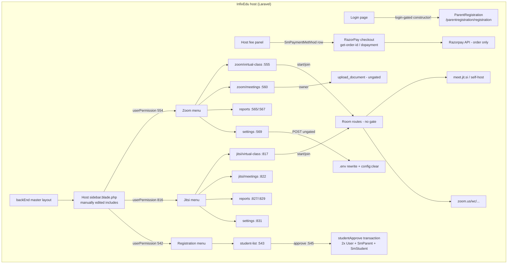

# InfixEdu School Modules (4 paid add-ons) — Deep UX + Backend Audit

**Audit date:** 2026-09-13. **Auditor:** deep-audit subagent, InfixEdu add-ons track.
**Artifact:** four standalone paid add-on packages for the InfixEdu school system (NOT the InfixEdu v9.4.0 core, which is audited separately).

## 0. Source map and method

All evidence below was re-verified at source on 2026-09-13. Because three of the four commercial packages ship as a zip nested inside the extracted folder, the inner zips were extracted read-only to `/tmp/deepux-addons/` for reading (originals untouched). Every file:line citation below refers to these trees:

| Add-on | Version | Marketplace item_id | Read path |
|---|---|---|---|
| Zoom Live Class | 2.0 | 27623128 | `/home/bishal-regmi/Desktop/ASchool/Other Projects/InfixEdu School Modules/InfixEdu School Modules/infixedu-zoom-live-class-module-2.0_extracted/Zoom/` (tree shipped unzipped) |
| Jitsi Meet | 1.4 | 32973934 | `/tmp/deepux-addons/jitsi/Jitsi/` ← extracted from `jitsi-meet-infixedu-module-1.4_extracted/Jitsi_Meet_Package_InfixEdu/Jitsi_module_infixedu/Jitsi_v1.4.zip` |
| RazorPay Payment Gateway | 2.0 | 27721206 | `/tmp/deepux-addons/razorpay/RazorPay/` ← extracted from `razorpay-payment-gateway-for-infixedu-2.0_extracted/RazorPay_InfixEdu_Package/03_RazorPay_Module_v2.0/RazorPay.zip` |
| Parent-Student Registration | 1.0.0 (manifest says `0.1`!) | none in manifest | `/tmp/deepux-addons/parentreg/ParentRegistration/` ← extracted from `parent-student-registration-for-infixedu-1.0.0_extracted/ParentRegistration.zip` |

Host-integration context (read, not audited): `/home/bishal-regmi/Desktop/ASchool/Other Projects/InfixEdu v9.4.0/InfixEdu v9.4.0/codecanyon-23876323-infix-school-academic-management-system/InfixEdu v9.4.0 Main Application/upload_extracted/`.

Skipped per ground rules: `.zip`/`.rar` originals, `_x` duplicate folders, `__MACOSX`, `vendor/` trees (except confirming what the RazorPay vendor bundle contains — the razorpay SDK 2.5.0 + `rmccue/requests` 1.7.0, verified via `/tmp/deepux-addons/razorpay/RazorPay/vendor/composer/installed.json`).

**Nulled-copy status (important framing):** all four packages are nulled copies. Two nulling artifacts are visible at the top level of each outer folder:
- `readme!.html` in `jitsi-meet-infixedu-module-1.4_extracted/readme!.html:1-10` and `parent-student-registration-for-infixedu-1.0.0_extracted/readme!.html` — a zero-second meta-refresh to `https://nullphpscript.com`.
- `RazorPay_InfixEdu_Package/Download More Addons.html:1-8` — meta-refresh to `https://nullphpscript.com/go/addons/`.
- Critically, the host core's licensing function itself is stubbed out: `upload_extracted/app/User.php:95-96` reads `public static function checkPermission($name): bool { return true;` with the entire Envato/purchase-code verification body commented out below it (L97-130: the commented code would call `User::$apiModule . $code . '/' . $email` or `Envato::aci(...)` and return 100/101/102/103 codes). **What the nuller patched is the host, not the modules** — the four modules still contain their gating calls (`User::checkPermission('Zoom') != 100` etc.), they just always pass on this host. This is the single most revealing fact about the licensing machinery: the gate lives in a one-line host function that a nuller can stub, and every module's commercial protection collapses with it.

Per-file coverage achieved (every route file, controller, migration, entity, key blade view, manifest, and config of each module was opened and read line-by-line):
- Jitsi 1.4: 2 route files, 5 controllers (incl. API), 5 migrations, 4 entities, 12 blade views, 2 lang files, module.json/Jitsi.json/composer.json/config.php/documentation.txt.
- Zoom 2.0: 2 route files, 5 controllers, 6 migrations, 4 entities (+TeacherZoomApi stub), 2 seeders, 18 blade views, module.json/Zoom.json/composer.json/Config/config.php.
- RazorPay 2.0: 2 route files, 1 controller, 1 migration, 4 blade views, module.json/RazorPay.json/composer.json/composer.lock, developer_doc_razorpay.txt, help folder (7 files).
- ParentRegistration 1.0.0: 2 route files, 1 controller (749 lines), 2 migrations, 2 entities, 9 blade views, language.json, module.json/ParentRegistration.json/composer.json, install doc, help folder, `Update Files in infix Edu v.4.5/` upgrade kit (zip + imported.sql 1924 lines).

---

## 1. Executive Summary

**What this artifact is.** Four nwidart/laravel-modules packages sold as paid add-ons on the InfixEdu marketplace (spondonit / aacconit family), each dropped into the host's `Modules/` directory. Three of the four (Jitsi, Zoom, ParentRegistration) are substantial: they add tables, routes, Blade screens, per-role permission rows, sidebar menus, and language phrases to the host. One (RazorPay) is barely a module — 142 lines of controller, zero tables created, a demo page shipped to production, and a payment capture path that trusts the client completely.

**The packaging model, in one paragraph.** Each add-on is a self-contained Laravel module folder: `module.json` (nwidart runtime manifest: name + ServiceProvider), an optional `{Module}.json` marketplace manifest (`item_id`, explicit migration-file map, owned table `names`, `versions`, support URL), a ServiceProvider that registers config/views/translations/migrations, and a RouteServiceProvider that merges web+api route groups into the host. Installation is *not* self-service: the installer migrations reach directly into host tables (rewriting parent-route rows, bulk-inserting `InfixPermissionAssign` rows with hard-coded permission IDs like 816–832, upserting 35–70 `SmLanguagePhrase` rows, creating `Sidebar` rows, even ALTERing host `users` and `sm_weekends`), and the documentation additionally requires manual SQL inserts, manual blade edits to the host sidebar, and manually created upload folders. Uninstall drops only the tables named in `{Module}.json` `names` — every host-row mutation leaks forever.

**Per-add-on verdicts:**

1. **Zoom Live Class 2.0 — the most complete, the most dangerous.** Real Zoom integration via the `macsidigital/laravel-zoom` SDK (`Config/config.php:5-8`: `baseUrl https://api.zoom.us/v2/`, `authentication_method: jwt`, `token_life = 604800`). Genuinely good product ideas: scheduling-conflict detection, a 100-meetings/day quota guard, recurring meetings (type 8 with recurrence maps), per-teacher Zoom credentials, and a manual recording-attach flow. Undercut by: a working-looking vendor Zoom JWT key/secret seeded into every install (`2020_06_16_051034_create_zoom_settings_table.php:34-38`), HTTP-driven `.env` rewrites (`SettingController.php:93-103`), dead join-time guards in three separate code paths (e.g. `MeetingController.php:81,85`), API identity substitution (creator taken from request body, `ZoomApiController.php:210,388,625`), cross-tenant class listings (`VirtualClassController.php:98,109,133-137`), and active phone-home telemetry (`MeetingController.php:36-39`).
2. **Jitsi Meet 1.4 — a rough copy of the Zoom module with the provider swapped.** Entities still read Zoom column names (`JitsiMeeting.php:45-46` reads `is_recurring`/`recurring_end_date` which no Jitsi migration creates; `JitsiVirtualClass.php:87-89` returns `https://zoom.us/wc/...` URLs). Rooms are numeric, guessable (`date('ymdhmi')` for meetings, `JitsiMeetingController.php:102`; `date('ymd' . rand(0, 100))` for classes, `JitsiVirtualClassController.php:186`), completely unauthenticated (no JWT anywhere; identity injected client-side, `meeting/start.blade.php:26-29`). Functional breakage: every edit regenerates the room id and breaks all join links (`JitsiVirtualClassController.php:388`), update-notifications query a field the form never sends (`$request['class']` vs `class_id`, L424), `destroy()` unlinks a column that doesn't exist (`logo` vs `attached_file`, L449), co-teacher notifications hardcode `school_id = 1` (L239, L247).
3. **RazorPay Payment Gateway 2.0 — the worst of the four; would not pass any review.** The capture path (`RazorPayController.php:89-113`) has no signature verification (grep-confirmed: `verifyPaymentSignature` exists only inside the bundled SDK at `vendor/razorpay/razorpay/src/Utility.php`, never called by module code), decrements the fee ledger by raw paise while recording rupees (L99 vs L109 — a Rs 5,000 payment reduces the balance by Rs 500,000), leaks the gateway secret key and full user object to the browser (`getOrderId` L136), and ends with `print_r($input); exit;` in the production payment path (L111-112). The installer migration creates no table at all and reads `Auth::user()` inside a migration (L56, L66), silently seeding nothing on CLI installs. Uninstall is documented with phpMyAdmin screenshots.
4. **Parent-Student Registration 1.0.0 — the most product-sensible module.** A public form → staging table → admin approve → provision student+parent accounts pipeline that is genuinely a sellable feature. The provisioning transaction creates User(role 2) + User(role 3) + `SmParent` + `SmStudent` with auto admission/roll numbers. Undercut by: fixed `123456` passwords for every provisioned account (`ParentRegistrationController.php:441,463`), `max()+1` numbering with no lock on a string column (L403-420), a destructive approve (staging row deleted; no rejected state anywhere), the "public" form actually being login-gated by the controller constructor (L44-45), and settings that can never be toggled off (isset-only updates, L717-735).

**Packaging-architecture verdict.** The add-on model works commercially (buy → drop folder → run migration) but fails technically on every axis ASchool's plugin system is designed around: no dependency declaration (`module.json:12` `"requires": []` in all four), no signature/integrity verification of packages, host-table mutation from installer migrations, secrets in migrations and re-rendered in settings HTML, uninstall that orphans host rows, versioning that is a version string poked into a host table from a migration, and licensing scattered per-action in controller code that a one-line host patch defeats.

**What ASchool should steal** (§9–§12 detail these): the explicit ordered migration-file map from `{Module}.json`; the `time_start_before` early-join window + derived started/waiting/closed status; per-role granular permissions including a distinct "Start Class" permission; the `position` header/footer/hide form-placement toggle; the parent-notification fan-out on class create/update; and the staging→approve→provision pipeline shape (adapted onto ASchool's existing `AdmissionApplication` state machine). **What to avoid is longer:** everything in the paragraph above.

---

## 2. Stack & Architecture Shape (per add-on)

### 2.1 The common nwidart skeleton

All four packages are `nwidart/laravel-modules` modules. Their `composer.json` files are literally the nwidart scaffold with a new name — `nwidart/jitsi` (`/tmp/deepux-addons/jitsi/Jitsi/composer.json:2`), `nwidart/zoom` (`Zoom/composer.json:2`), `nwidart/razorpay` (`/tmp/deepux-addons/razorpay/RazorPay/composer.json:2`), `nwidart/parentregistration` (`/tmp/deepux-addons/parentreg/ParentRegistration/composer.json:2`) — all still crediting "Nicolas Widart <n.widart@gmail.com>" as author (each composer.json L4-8). Only RazorPay declares a dependency: `"require": {"razorpay/razorpay": "^2.5"}` (razorpay composer.json L25-27), and it ships the SDK pre-built in `vendor/` (razorpay SDK 2.5.0 + rmccue/requests v1.7.0, per `vendor/composer/installed.json`). Zoom depends on `macsidigital/laravel-zoom` at runtime (imported as `MacsiDigital\Zoom\Facades\Zoom` in all four Zoom controllers, e.g. `MeetingController.php:15`) but does NOT declare or ship it — the host is expected to have it.

Per-module runtime manifest `module.json` (Jitsi shown; the other three are identical in shape):

```json
{ "name": "Jitsi", "alias": "jitsi", "description": "", "keywords": [],
  "priority": 0,                                    // "order": 0 in Zoom/RazorPay/ParentReg
  "providers": ["Modules\\Jitsi\\Providers\\JitsiServiceProvider"],
  "aliases": {}, "files": [], "requires": [] }      // requires: [] in ALL FOUR
```
(`jitsi/Jitsi/module.json:1-13`; `Zoom/module.json:1-13`; `razorpay/RazorPay/module.json:1-13`; `parentreg/ParentRegistration/module.json:1-13`.)

Marketplace manifest `{Module}.json` — the interesting one, three different shapes:

| Field | Jitsi (`Jitsi.json:1-24`) | Zoom (`Zoom.json:1-29`) | RazorPay (`RazorPay.json:1-20`) | ParentReg (`ParentRegistration.json:1-21`) |
|---|---|---|---|---|
| `item_id` | `"32973934"` | `"27623128"` | `"27721206"` | **absent** |
| `migration` | map table→migration path (5 entries) | map table→migration path (6 entries, incl. `"no_table"` → zoom_update.php) | map with a single `"no_table"` entry | **plain array** of 2 filenames |
| `names` (uninstall drop-list) | **absent** | 5 table names | empty array `[]` | 2 table names |
| `versions` | `["1.4"]` | `["2.0"]` | `["2.0"]` | **`["0.1"]`** (folder says 1.0.0) |
| `url` | spondonit.com/contact | same | same | same |
| `notes` | one line | one line | one line (typo "payemnt") | one line |

Two schema inconsistencies worth flagging as packaging findings: (a) Jitsi has a migration map but no `names` list (so the host uninstaller cannot know what to drop from the manifest — the prior draft's claim that Jitsi's `names` lists five tables is **corrected**: Jitsi.json carries only `migration`, and the drop-list claim actually belongs to Zoom/ParentReg); (b) ParentRegistration's `migration` is a list, not a map — a third shape. There is no schema, no validator, no CI gate on these files; each module's author shaped it ad hoc.

### 2.2 ServiceProvider and route wiring (identical pattern, verified per module)

`JitsiServiceProvider.php:25-31` boots: `registerTranslations()`, `registerConfig()`, `registerViews()`, `loadMigrationsFrom(module_path(...'Database/Migrations'))`. `register()` registers `RouteServiceProvider` (L38-41). `RouteServiceProvider.php:48-53` maps web routes: `Route::middleware('web')->namespace('Modules\Jitsi\Http\Controllers')->group(module_path('Jitsi', '/Routes/web.php'))`; `mapApiRoutes()` L62-68 adds the `api` prefix+middleware group. The Zoom, RazorPay and ParentRegistration service providers are the same file with names swapped (verified: `Zoom/Providers/ZoomServiceProvider.php:25-32,39-42`; `razorpay/RazorPay/Providers/RazorPayServiceProvider.php` same shape; `parentreg/ParentRegistration/Providers/ParentRegistrationServiceProvider.php` same shape). This is the only "clean" integration mechanism — everything else (permissions, menus, language, host table columns) is done by side effects documented in §3 and §9.

### 2.3 Module-level config

- Jitsi `Config/config.php:1-5`: only `['name' => 'Jitsi']` — all real config lives in the `jitsi_settings` DB row.
- Zoom `Config/config.php:1-9`: the SDK client config — `baseUrl https://api.zoom.us/v2/`, `token_life = 60*60*24*7` (1 week), `authentication_method: 'jwt' // Only jwt compatible at present`, `max_api_calls_per_request: '5'`.
- RazorPay `Config/config.php`: name only. RazorPay keys live in host `SmPaymentGatewaySetting` rows plus `.env` (`RAZORPAY_KEY/SECRET`, per help file `01_help/RazorPay Secreet Key.txt`... note: the actual help folder file list shows `Online Doc Link.txt` + screenshots; the `.env` instruction text was verified in the ParentRegistration-equivalent help file `parent-student-registration-for-infixedu-1.0.0_extracted/help/reCAPTCHA Secreet Key.txt:1-9` and in the demo blade's `env('RAZORPAY_KEY')` at `abc.blade.php:89`).
- ParentRegistration: no module config; all settings in the `sm_registration_settings` row + `.env` (reCAPTCHA keys).

### 2.4 Build assets shipped but vestigial

All four ship `webpack.mix.js` (Jitsi's at `jitsi/Jitsi/webpack.mix.js:1-15` compiles `Resources/assets/js/app.js` → `public/js/jitsi.js`) plus scaffold `package.json`. Jitsi also ships two loader GIFs (`Resources/assets/images/loader.gif`, `pre-loader.gif`) referenced by its blades, and — a packaging hygiene red flag — a stray `Resources/assets/question_bank.xlsx` (verified a real Excel 2007+ file by `file`), clearly copied from another product (InfixEdu's Question Bank module) and dead weight in this package. Zoom ships `Resources/assets/js/app.js` and `sass/app.scss` untouched scaffold.

### 2.5 Version declaration honesty check

The host records module version in `InfixModuleManager`. Only Jitsi's virtual-classes migration pokes it: `2021_03_29_055746_create_jitsi_virtual_classes_table.php:39-43` sets `InfixModuleManager where name='Jitsi'` → `version = "1.0"` — **which contradicts the package's own `versions: ["1.4"]`** (Jitsi.json:14-16). So after installing Jitsi 1.4, the host's module-manager "About" screen reports version 1.0. Zoom, RazorPay and ParentRegistration never write a version; the about screens read whatever the host table already had (Zoom `index.blade.php` renders `{{@$data->version}}`, `purchase_code`, `installed_domain`, `activated_date` — a screen that exists purely to display license state).

---

## 3. Data Model (per add-on: tables, columns, host-schema mutations)

### 3.1 Jitsi Meet 1.4 — five tables, all owned

**`jitsi_meetings`** (`2021_03_29_124902_create_jitsi_meetings_table.php:16-36`): `id`; `created_by` int default 1; `instructor_id` int default 1; `member_type` int nullable; `meeting_id` **text**; `topic`/`description`/`file` text (`file` default `""`); `start_time`/`end_time` timestamps nullable; `time_start_before` **text**; `date`/`time`/`datetime` text; `duration` int default 0 with comment `"0 means unlimited"`. No FKs, no unique constraints, no indexes. Note `time_start_before` (a minute count) stored as text and `duration` int while the Zoom equivalent uses `time_before_start` int — the copy was not even renamed consistently.

**`jitsi_meeting_users`** (`2021_03_31_114808_create_jitsi_meeting_users_table.php:16-21`): pivot `meeting_id` int **default 1**, `user_id` int **default 1** — pivot rows silently default to bogus user/meeting 1 rather than failing. No FK, no unique.

**`jitsi_virtual_classes`** (`2021_03_29_055746_create_jitsi_virtual_classes_table.php:17-35`): `id`; `created_by` int default 1; `meeting_id` text; `start_time`/`end_time` timestamps; `class_id` int nullable; `section_id` **string** nullable (a class-section id stored as string — the host `sm_sections.id` is int); `subject_id` string **never used by any controller** (dead column); `topic`/`description`/`time_start_before`/`date`/`time`/`datetime` text; `duration` int default 0; `attached_file` text. Plus host mutation L39-43 (version poke, §2.5).

**`jitsi_virtual_class_teachers`** (`2021_03_29_060954_jitsi_virtual_class_teachers.php:17-22`): `meeting_id`/`user_id` unsignedBigInteger nullable. No FK/unique.

**`jitsi_settings`** (`2021_03_29_070403_create_jitsi_settings_table.php:23-27`): `id`, `jitsi_server` string default `https://meet.jit.si/`, timestamps. One row, seeded at L29-31. **Global — no school_id column**, so in a SaaS deployment every tenant shares one Jitsi server URL setting.

### 3.2 Jitsi installer migration host mutations (the `2021_03_29_070403` file is an installer, not a table migration)

`2021_03_29_070403_create_jitsi_settings_table.php` does all of the following inside one `try` whose catch is `Log::info($th)` only (L265-267 — every failure below is silent):

1. **Parent-route rewrites** L36-52: finds host `InfixModuleStudentParentInfo` rows 109 (`module_id` 2030, user_type 2) and 110 and rewrites their `route` to `jitsi/virtual-class/child/{id}` and `jitsi/meetings/parent` respectively. This is how the parent sidebar's pre-existing "Virtual Class"/"Meeting" links get hijacked to point at the Jitsi module.
2. **Permission grants** L54-164, hard-coded host permission IDs `[816..830]`: admin (role 5) all 15; teacher (role 4) all 15; receptionist (7)/librarian (8)/accountant (6) `[816, 822, 826]`; driver loop L113-123 **checks `role_id 8` but saves `role_id 9`** (L115 vs L120 — the driver bug: if a librarian row exists for a module, the driver row is skipped); students (role 2) `[816, 817, 821]`; parents (role 3) `[108, 109, 110]` (parent IDs come from the *different* `InfixModuleStudentParentInfo` table, L159). Each insert reads `InfixModuleInfo::find($value)->name` (L61 etc.) — null-crash if the host's ID space doesn't contain those IDs (e.g. a host version where permissions were renumbered), which the outer catch then swallows, leaving a partially-granted permission set.
3. **Language phrases** L167-217: 35 `SmLanguagePhrase` upsert rows (columns en/es/bn/fr). Quality defects preserved in data: `'before' => 'antaŭe'` in the **Spanish** column (L196 — Esperanto, not Spanish), `'avant que'` in French; `'delete_meetings'` row has empty es/bn/fr (L181); the phrase keys themselves carry the module's typos (`'meeting_durration' => 'Meetting Durration (Minutes)'` L175, `'delete_virtual_meeting' => 'Delete virtaul meeting'` L190).
4. **Sidebar rows** L219-264: builds `Sidebar` entries from `InfixModuleInfo` ids 816-832, branching on `moduleStatusCheck('SaasRolePermission')` (L222): SaaS path filters `module_id != 30` unless Jitsi off (L226-232); non-SaaS path takes `module_id = 30` rows (L236). Deduped by `infix_module_id` (L250).
5. `down()` L276-279 drops **only** `jitsi_settings`. Items 1-4 are never reversed.

The manual remainder is in `documentation.txt`: the `infix_module_info` SQL insert block for ids 816-833 including the duplicate 833 "Virtual Meeting" row used only for sidebar guards (L5-26), the required `public/uploads/jitsi-meeting` folder (L30-31), and the paste-this-into-host-blades snippets for `sidebar`/`parent_sidebar`/`student_sidebar` (L33-87).

### 3.3 Zoom Live Class 2.0 — five tables + two host-table ALTERs

**`zoom_meetings`** (`2020_06_10_060128_create_zoom_meetings_table.php:22-61`): `meeting_id` string (Zoom's numeric id as string); `password` string (Zoom meeting password, plaintext); `start_time`/`end_time` timestamps; basic: `topic`/`description`/`attached_file`/`date_of_meeting`/`time_of_meeting`/`meeting_duration` **all string** (dates and duration stored as client-supplied text — this is what later makes conflict detection format-fragile); `time_before_start` int; settings: `join_before_host`/`host_video`/`participant_video`/`mute_upon_entry`/`waiting_room` booleans; `audio` default `'both'` comment `both, telephony & voip`; `auto_recording` default `'none'` comment `local, cloud & none`; `approval_type` default 0 comment `0 => Automatic, 1 => Manually & 2 No Registration`; recurring: `is_recurring` bool, `recurring_type`/`recurring_repect_day` tinyint, `weekly_days` string (comma-joined day ordinals), `recurring_end_date` string; `status` bool default 1; `local_video`/`vedio_link` text (the manual-recording columns — `vedio` [sic]); `created_by`/`updated_by`/`school_id` unsignedBigInteger. Unlike Jitsi, this table IS school-scoped.

Installer mutations in the same file (L65-289): 70-row `SmLanguagePhrase` upsert (`'zoom'`, `'before' => 'antaŭe'` Esperanto-in-Spanish again L67, `'topic' => 'temo'` L69, `'date_of_meeting' => 'Dato de Kunveno'` in BOTH es and fr columns L71, `'sujette'` for French topic L69 — machine-translated garbage baked into the host DB); parent-route rewrites for host rows 101 (`zoom/virtual-class/child/{id}`) and 103 (`zoom/meetings/parent`) L142-155; permission grants with hard-coded ids **554-570** (admin role 5 all 17, L158-169; teacher role 4 ids 554-567, L173-185; receptionist/librarian/accountant `[554, 560, 564]`; **drivers: checks role_id 8, saves role_id 9 — the same driver bug** L217-227; students `[554, 555, 559]` L243-254; parents `[100, 101, 103]` L257-268); catch = `Log::info` L286-288. `down()` L296-299 drops only `zoom_meetings`.

**`zoom_meeting_users`** (`2020_06_10_134834_create_zoom_meeting_users_table.php:16-22`): bare pivot, no FK/unique.

**`zoom_settings`** (`2020_06_16_051034_create_zoom_settings_table.php:17-32`): `package_id` tinyint default 1 (1 Basic free / 2 Pro / 3 Business / 4 Enterprise per the settings blade L273-279); five booleans; `audio`/`auto_recording`/`approval_type`; `api_use_for` tinyint default 0 (0 = system account, 1 = per-user keys); `api_key`/`secret_key` strings. **L34-38 seeds every install with the vendor's own credential: `api_key = 'GsF_U_fzQyuqQ7bMDWBL9A'`, `secret_key = 'l0B0jsyfAXSTAVkYIBF3Jg0DLhZG247ybhOG'`** — a JWT key/secret pair shipped to every buyer. No school_id — one global row.

**`zoom_virtual_class`** (`2020_06_18_084210_create_zoom_virtual_class_table.php:16-58`): same shape as `zoom_meetings` plus `class_id`/`section_id` as **strings** (not ints, not FKs). Same `local_video`/`vedio_link`/`school_id` columns.

**`zoom_virtual_class_teachers`** (`2020_06_18_084255_...php:16-22`): bare pivot.

**Host-table ALTER — `2021_06_30_044055_zoom_update.php`** (listed in Zoom.json as `"no_table"` L5): adds `users.zoom_api_key_of_user` TEXT and `users.zoom_api_serect_of_user` TEXT (**"serect" typo baked into the host schema**, L19-30) and `sm_weekends.zoom_order` int (L31-36); then seeds weekend ordinals Sat=7, Sun=1, Mon=2 … Fri=6 via `SmWeekend::where('name', ...)` L39-80 — **no school_id filter**, so on a SaaS host it rewrites weekend rows for every tenant. `down()` is **empty** (L91-94): the columns can never be rolled back.

### 3.4 RazorPay 2.0 — zero tables, host rows only

`2020_07_05_125524_create_razor_pays_table.php` (misnamed — `Schema::create` is never called):
- SaaS branch L28-53: loops `SmSchool::all()` creating `SmPaymentMethhod(method='RazorPay', type='Module', active_status=1)` and `SmPaymentGatewaySetting(gateway_name='RazorPay', gateway_username='demo@gmail.com', gateway_password='123456')` **per school — demo credentials shipped to every tenant** (L46-48).
- Non-SaaS branch L54-75: same rows but keyed by `Auth::user()->school_id` **inside a migration** (L56, L66) — under `php artisan migrate` there is no session, `Auth::user()` is null, the `->school_id` access fatals, the outer `catch (\Throwable)` L97-99 swallows it with `Log::info`, and **nothing is seeded silently**. Also note L67-69: the `if ($is_setting == "") { $is_method = new SmPaymentGatewaySetting(); }` guard creates the new model into the SAME `$is_method` variable used for the method row — a copy-paste that only works because the method row was already saved.
- One `SmLanguagePhrase` row `pay → "Pay"` L79-96.
- `down()` L107-110 drops `razor_pays` — **a table that was never created**.
- Class import typo at L3: `use App\SmSChool;` (capital C's) while the code calls `SmSchool` (L29) — under case-sensitive filesystems this import simply doesn't match.

`RazorPay.json:7-9` `names: []` — the uninstaller has nothing to drop; the seeded payment-method/gateway rows leak.

### 3.5 ParentRegistration 1.0.0 — two tables, FK'd into host schema

**`sm_student_registrations`** (staging; `2020_04_27_061914_create_sm_student_registrations_table.php:16-54`): `first_name`/`last_name` nullable strings; `class_id` int unsigned **FK → sm_classes onDelete cascade** (L21-22); `section_id` FK → sm_sections cascade (L24-25); `date_of_birth` date; `age` **string** (an age stored as text); `academic_year` int (stores an `SmAcademicYear` id under a name that suggests a year value); `gender_id` FK → sm_base_setups cascade (L33-34); `student_email`/`student_mobile`/`guardian_name`/`guardian_mobile`/`guardian_email` strings; `guardian_relation` string comment `"F father, M mother, O other"` (L42); `how_do_know_us` text; `created_by`/`updated_by`/`school_id` int default 1; `academic_id` FK → sm_academic_years cascade (L50-51). **No unique constraints on any email/mobile; no status column** — a "pending" application is indistinguishable from a fresh one except by existence.

**`sm_registration_settings`** (`2020_04_27_061915_create_sm_registration_settings_table.php:19-38`): `position` int default 1 comment `1=Header, 2=Footer, 0=hide`; `registration_permission` default 1 comment `1=enable, 2=Disable`; `registration_after_mail`/`approve_after_mail` default 1; `recaptcha` default 1; `nocaptcha_sitekey`/`nocaptcha_secret` strings; `created_by`/`updated_by`/`school_id` default 1; `academic_id` FK cascade. Seed L40-44 sets `recaptcha = 2` (off) — contradicting the column default of 1. **`down()` L52-55 drops `sm_student_registrations` — the WRONG table** (copy-paste): the settings table is never dropped and the staging table gets a double-drop attempt (its own migration's down also drops it).

**Host tables written at runtime (not by migration):** `users` (student + parent accounts, §4.4), `sm_parents`, `sm_students`, `sm_notifications` (Jitsi/Zoom only), `sm_fees_payments` + `sm_fees_assigns` (RazorPay), plus `.env` rewrites (Zoom + ParentRegistration settings).

---

## 4. Backend Flow Traces

Every hop below was read at source. Routes are listed with their middleware; controllers with method and line range; DB writes with table and column semantics; side effects (notifications, external API calls, file writes, `.env` mutation) called out explicitly.

### 4.1 Jitsi Meet 1.4

#### 4.1.1 Route table (web — `Routes/web.php`)

All routes sit under `Route::group(['middleware' => ['subdomain']], ...)` (L16) and, except the dead index, under `middleware('auth')` (L23). `userRolePermission:{id}` is the host's per-role permission middleware keyed to the `infix_module_infos` IDs the installer seeds.

| # | Route (URI → action) | Middleware | Line |
|---|---|---|---|
| 1 | `GET jitsi/` → `JitsiController@index` | subdomain only | L18 — **dead route: no `JitsiController` class exists anywhere in the module** (verified by full file listing); hits action-not-found |
| 2 | `GET jitsi/virtual-class` → `JitsiVirtualClassController@index` | auth | L25 |
| 3 | `GET jitsi/virtual-class/child/{id}` → `myChild` | auth + `userRolePermission:109` | L26 |
| 4 | `POST jitsi/virtual-class/store` → `store` | auth + `:818` | L27 |
| 5 | `DELETE jitsi/virtual_class/{id}` → `destroy` | auth + `:820` | L28 |
| 6 | `GET jitsi/virtual-class-show/{id}` → `show` | auth only | L29 — **no permission gate** |
| 7 | `GET jitsi/virtual-class-edit/{id}` → `edit` | auth only | L30 — **no permission gate** |
| 8 | `POST jitsi/virtual-class/{id}` → `update` | auth + `:819` | L31 |
| 9 | `GET jitsi/meetings` → `JitsiMeetingController@index` | auth | L34 |
| 10 | `GET jitsi/meetings/parent` → `index` | auth + `:110` | L35 |
| 11 | `POST jitsi/meetings` → `store` | auth + `:823` | L36 |
| 12 | `GET jitsi/meetings-show/{id}` → `show` | auth only | L37 — **no gate** |
| 13 | `GET jitsi/meetings-edit/{id}` → `edit` | auth only | L38 — **no gate** |
| 14 | `POST jitsi/meetings/{id}` → `update` | auth + `:824` | L39 |
| 15 | `DELETE jitsi/meetings/{id}` → `destroy` | auth + `:825` | L40 |
| 16 | `GET jitsi/user-list-user-type-wise` → `userWiseUserList` | auth only | L42 — participant-picker AJAX, no gate |
| 17 | `GET jitsi/virtual-class-room/{id}` → `JitsiMeetingController@meetingStart` | auth only | L43 — **cross-wired: the virtual-class room route points at the MEETING controller**, so a class join via this path looks up `jitsi_meetings` by the class's meeting_id and renders the meeting start blade (or a null-meeting page) |
| 18 | `GET jitsi/meeting-start/{id}` → `meetingStart` | auth only | L46 |
| 19 | `GET jitsi/meeting-join/{id}` → `meetingJoin` | auth only | L47 |
| 20 | `GET jitsi/class-start/{id}` → `JitsiVirtualClassController@classStart` | auth only | L50 |
| 21 | `GET jitsi/class-join/{id}` → `classJoin` | auth only | L51 |
| 22 | `GET jitsi/settings` → `settings` | auth + `:831` | L53 |
| 23 | `POST jitsi/settings` → `updateSettings` | auth + `:832` | L54 |
| 24 | `GET jitsi/virtual-class-reports.` → `JitsiReportController@index` | auth + `:827` | L57 — **trailing dot in the URI** (`virtual-class-reports.`); works because it's the literal path, but any link without the dot 404s |
| 25 | `GET jitsi/meeting-reports` → `meetingReport` | auth + `:829` | L58 |

**Route-name collision (new finding):** L43 names its route `meeting.join` and L47 names its route `meeting.join` again — Laravel keeps the LAST definition for URL generation, so `route('jitsi.meeting.join', $id)` always generates `meeting-join/{id}`, never `virtual-class-room/{id}`.

API (`Routes/api.php:5-9`): `auth:api` + `subdomain`; `GET api/jitsi/virtual-class/{record_id}` → `JitsiApiController@index` (L7) and `GET api/jitsi/meetings` → `meetings` (L8). That is the entire mobile surface: **two read-only list endpoints — no create/join/report API for Jitsi at all.**

#### 4.1.2 Trace A — create a Jitsi virtual class (admin)

1. Entry: `POST /jitsi/virtual-class/store` (web.php:27, permission 818 "Add" under 817 "Virtual Class").
2. `JitsiVirtualClassController::store()` (L125-264):
   - Co-host guard L130-136: for teachers only, `count($request->teacher_ids)` runs **before validation** — a teacher omitting the field fatals (`count(null)`, PHP 8); the check `$count > 3` rejects 4+ while the toast says *"Can Not Select More Than 2 Person !"* (allows exactly 3, message says 2).
   - Validation L137-156, split by role: admin (1/5) requires `class_id`, `teacher_ids[]`, `topic`, `date`, `time`, `duration`; everyone else drops `teacher_ids`.
   - Room id: `'meeting_id' => date('ymd' . rand(0, 100))` (L186) — the `rand` is concatenated into the **format string**, producing format `ymd37` etc.; 1-in-101 same-day collision space, no school prefix, fully numeric/guessable.
   - DB write: `JitsiVirtualClass::create` (L185-201) — `class_id`, `section_id` (string column), `topic`, `description`, `date`/`time` raw client strings, `datetime` = `strtotime($date.' '.$time)`, `duration`, `time_start_before`, `start_time = Carbon::parse(date)->toDateTimeString()`, `end_time = start + duration` (L197-198), `created_by = Auth::id()`.
   - File side effect L173-180: `attached_file` moved to `public/uploads/jitsi-meeting/{topic}{time}.{client-extension}` — **no mimes/size validation** (unlike Zoom), and the upload happens after validation here (contrast the meetings store, §4.1.3).
   - Pivot write: `teachers()->attach($request['teacher_ids'])` for roles 1/5/4, else `attach(Auth::user())` (L203-207).
   - Section expansion L209-219: when `section` is null, `SmClassSection::where('class_id',...)->get('section_id','class_id')` (L211) — Laravel's `get()` takes ONE columns argument, so `class_id` is silently ignored; only `section_id` is effectively read.
   - Notification side effects:
     - Students: `SmStudent::where('class_id', ...)->whereIn('section_id', $all_section_ids)->where('school_id', Auth)` (L221-224) → `setNotificaiton($UserList, 0)` (L225) which inserts **two `SmNotification` rows per student** — one to the student (role 2, "Jitsi virtual class room created for you") and one to `parent_id` (role 3, "...created for your child") (L491-557, insert at L556).
     - Co-teachers L227-252: `User::whereIn('id', $teacher_ids)->where('role_id',4)->where('id','!=',Auth)->where('school_id', 1)` (L239) and `$notification->school_id = 1` (L247) — **hardcoded school 1**: on any tenant other than school 1, co-teacher notifications silently select nobody / write wrong-school rows.
   - `DB::commit()` at L255 with **no matching `DB::beginTransaction`** — a no-op call; the create + pivots + notifications are auto-commit, so a failure mid-way leaves partial state.
   - Response: Toastr + `redirect()->back()` (L257-263). No catch block at all in `store()` — any exception (e.g. null teacher info at L32's cousin usage) surfaces as a raw 500.

#### 4.1.3 Trace B — create a Jitsi meeting

1. Entry: `POST /jitsi/meetings` (web.php:36, permission 823).
2. `JitsiMeetingController::store()` (L59-139):
   - Inputs read L63-74 (incl. `$description` read twice, L67 and L72 — harmless leftover).
   - **File upload happens BEFORE validation** (L76-83 vs validation L87-95): an invalid form submission (missing topic, etc.) still moves the uploaded file to disk; a rejected request leaves an orphaned file.
   - Validation L87-95: `member_type`, `participate_ids[]`, `topic`, `date`, `time`, `duration` required; `instructor_id`, `description`, `time_start_before` entirely unvalidated.
   - Room id: `date('ymdhmi')` (L102) — a 10-digit numeric stamp at minute resolution; two meetings created in the same minute on the same server share a room (cross-school too, on shared meet.jit.si).
   - DB write: `JitsiMeeting::create` L101-117 (`start_time`/`end_time` derived L113-114).
   - Pivot: `participates()->attach($participate_ids)` (L120) into `jitsi_meeting_users` (whose int columns default to 1, §3.1).
   - Notifications: `setNotificaiton($participate_ids, $member_type, 0)` (L121) — inserts one `SmNotification` row per participant with `role_id = $member_type` (the member TYPE stored in a role column) and message *"jitsi meeting is created by {name} with you"* (L280-322).
   - `DB::commit()` no-begin (L122); unreachable success toast L132-133 after the if/else returns; catch L134-138 **renders `$e->getMessage()` into the Toastr toast** — internal error text shown to end users.

#### 4.1.4 Trace C — join a class/meeting (the entire Jitsi "security model")

1. Entry: `GET /jitsi/class-start/{meeting_id}` or `class-join/...` (web.php:50-51), or `meeting-start|meeting-join` (L46-47), or the cross-wired `virtual-class-room/{id}` (L43). Auth session only — no permission id, no participant check, no status check.
2. `classStart()` L465-480 / `classJoin()` L481-487 (byte-identical bodies): `JitsiVirtualClass::where('meeting_id', $meeting_id)->first()` + `JitsiSetting::first()` → render `jitsi::virtualClass.start`. `meetingStart()`/`meetingJoin()` (L264-278) are the same two-line methods against `JitsiMeeting`. **No 404 handling for unknown ids** — a null `$meeting` renders the blade with null variables.
3. The room view (`Resources/views/virtualClass/start.blade.php`, mirrored at `meeting/start.blade.php`):
   - L11: `<script src='{{$setting->jitsi_server??''}}external_api.js'>` — script loaded from the admin-configured `jitsi_server` URL with no scheme/SRI validation (an admin typo or compromise = JS injection for every joiner).
   - L17: `const domain = '{{getDomainName($setting->jitsi_server)}}'`.
   - L19: `roomName: {{$meeting->meeting_id}}` — **unquoted** PHP echo into JS; works only because ids are numeric.
   - L26-29: `userInfo: { email: '{{Auth::user()->email}}', displayName: '{{Auth::user()->full_name}}' }` — identity is injected client-side; there is **no JWT, no token, no signature anywhere in the module**. Anyone with the room name joins as anyone; moderator is whoever joins first (Jitsi default).
   - L32-33: `api.executeCommand('subject', ...)` / `avatarUrl`.
4. No attendance is recorded, no join is logged, no webhook exists. **The join flow writes nothing to the DB.**

#### 4.1.5 Trace D — derived status (the only "state machine")

`JitsiVirtualClass::getCurrentStatusAttribute` (Entity L47-77) computes on read:
- `SmGeneralSettings::where('school_id', Auth::user()->school_id)->first()` (L49) — **fatals in console/queue context** (no auth user) and is evaluated per-row per-render (N+1 settings queries per list page).
- `date_default_timezone_set($GSetting->timeZone->time_zone)` (L50) — mutates the PHP process timezone globally on every read.
- `time_start_before` default 10 (L52-56).
- Non-recurring: `started` if `now ∈ [start − before, end]` (L68-70); `waiting` if `!now->gt(end − before)` (L72-74 — **no post-end grace**); else `closed`.
- `JitsiMeeting::getCurrentStatusAttribute` (L32-63) is the same code except `waiting` uses `end + before` (L58-60 — **post-end grace**). The two models of the same module disagree on waiting semantics.
- Both contain an `is_recurring == 1` branch (L45-52 / L58-66) reading `is_recurring` and `recurring_end_date` — **columns that do not exist in any Jitsi migration** (copy-paste from Zoom; `null == 1` is false so the branch is dead code on every row).

#### 4.1.6 Trace E — update and destroy a virtual class

`update()` (L339-433): co-host pre-check again (L341-347); role-split validation; `updateOrCreate(['id' => $id], [...])` at L385-402 **regenerates `meeting_id` with a fresh `date('ymd'.rand(0,100))` on EVERY edit** (L388) — every previously shared link/invite route breaks after any edit; `created_by` is overwritten to the updater (L400). File replacement correctly unlinks `attached_file` here (L406-417 — the one place the right column is used). Only role 1 re-attaches teachers (L419-422) — a school-admin (5) or teacher edit leaves stale co-teachers. Notification fan-out reads `SmStudent::where('class_id', $request['class'])` (L424) but the form field is named `class_id` (form.blade.php:37) — **`$request['class']` is always null, so update notifications always target zero students** (silently). `DB::commit()` no-begin (L430). **No try/catch** in the whole method.

`destroy()` (L436-463): ownership check for non-admins (L442-447); `file_exists($localMeeting->logo)` (L449) — **`logo` is not a column of `jitsi_virtual_classes`** (it's `attached_file`), so attached files are never unlinked; row delete + `jitsi_virtual_class_teachers` cleanup (L453-454 — the pivot IS cleaned here, unlike the meetings destroy).

Meetings `destroy()` (L249-262): `return redirect()` at L254 makes the pivot cleanup at L256-259 **unreachable** — every meeting delete orphans `jitsi_meeting_users` rows.

#### 4.1.7 Trace F — reports

`JitsiReportController::index()` (class reports, L21-45): classes/teachers school-scoped; searching requires `class_id` param; role 4 → `virtaulClassSearchTeacher` (L136-157: applies a teacher constraint **only if the client sent `teachser_ids`** — the typo param — and then constrains to `Auth::user()->id` regardless of the value sent); role 1/5 → `virtaulClassSearchAdmin` (L159-180). `catch (Exception $e)` at L41-43 is **unbackslashed** (matches nothing in this namespace) and its body is empty — an exception yields a blank response.

`meetingReport()` (L48-72): `if (Auth::user()->role_id != 1)` → `meetingSearchOthers()` (L104-133) — **no school filter, no self-scoping**: any teacher/librarian/accountant/school-admin(5) can enumerate ALL meetings of ALL schools by member type/id/date. The admin path paginates 10 (L101); the others path returns an unbounded `get()` (L132). Catch L66-68 is backslashed but still empty.

#### 4.1.8 Trace G — settings

`GET/POST jitsi/settings` (`JitsiSettingController`, 42 lines): form = one text field `jitsi_server`; validation `required` only (L21-23); `JitsiSetting::updateOrCreate(['id' => 1], ['jitsi_server' => strtolower(...)])` (L26-31) — one **global** row, lowercased, no URL format validation. "Self-hosted Jitsi" is exactly this URL swap; there is no app-id/secret/room-prefix concept in the module.

#### 4.1.9 Trace H — API list (mobile)

`JitsiApiController::index($id)` (L16-146): role 4 → classes where the teacher is attached; role 1/5 → **ALL classes** (L51, no school filter); role 2/3 → `StudentRecord::where('id', $id)->first()` (L80) — **client-supplied record id with no null check and no ownership check** (unknown id → fatal on `->class_id`; another student's id → their classes); the query at L83 repeats the unbracketed `(class_id AND section_id) OR section_id IS NULL` leak with no school filter. Each row's status is derived in a ~30-line block **pasted four times** (once per role branch), each containing an unreachable `if (Auth::user()->role_id == 1)` sub-check inside non-1 branches. `meetings()` (L149-249) repeats the pattern for `JitsiMeeting`; inside every loop it looks up the teacher in `jitsi_virtual_class_teachers` **for JitsiMeeting rows** (L162, L190, L221 — wrong table, copy-paste), and the role 1/5 branch returns ALL meetings of all schools (L186). The catch at L246-248 returns `$e->getMessage()` to the API consumer.

### 4.2 Zoom Live Class 2.0

#### 4.2.1 Route table (web — `Routes/web.php`)

Group: `middleware('subscriptionAccessUrl')` (L20) — a host SaaS-subscription middleware, not a license gate. `auth` comes from... nothing at group level; every route below relies on the host's global web middleware + per-route `userRolePermission`.

| # | Route | Middleware | Line |
|---|---|---|---|
| 1 | `GET zoom/about` → `MeetingController@about` | — | L23 |
| 2 | `GET zoom/meetings` → `index` | `:560` | L25 |
| 3 | `GET zoom/meetings/parent` → `index` | `:103` | L26 |
| 4 | `POST zoom/meetings` → `store` | `:556` | L27 |
| 5 | `GET zoom/meetings-show/{id}` → `show` | — | L28 |
| 6 | `GET zoom/meetings-edit/{id}` → `edit` | `:562` | L29 |
| 7 | `POST zoom/meetings/{id}` → `update` | `:562` | L30 |
| 8 | `DELETE zoom/meetings/{id}` → `destroy` | `:563` | L31 |
| 9 | `GET zoom/virtual-class` → `VirtualClassController@index` | `:555` | L33 |
| 10 | `GET zoom/virtual-class/child/{id}` → `mychild` | `:101` | L34 |
| 11 | `POST zoom/virtual-class` → `store` | `:561` | L35 |
| 12 | `GET zoom/virtual-class-show/{id}` → `show` | — | L36 |
| 13 | `GET zoom/virtual-class-edit/{id}` → `edit` | `:555` | L37 |
| 14 | `POST zoom/virtual-class/{id}` → `update` | `:555` | L38 |
| 15 | `DELETE zoom/virtual-class/{id}` → `destroy` | `:555` | L39 |
| 16 | `GET zoom/meeting-room/{id}` → **`VirtualClassController@meetingStart`** name `virtual-class.join` | — | L41 — cross-wired (see 17) |
| 17 | `GET zoom/virtual-class-room/{id}` → **`MeetingController@meetingStart`** name `meeting.join` | — | L42 — cross-wired (see 16): the meeting room route starts a CLASS and the class room route starts a MEETING |
| 18 | `GET zoom/user-list-user-type-wise` → `userWiseUserList` | — | L43 |
| 19 | `GET zoom/settings` → `settings` | `:569` | L44 |
| 20 | `GET zoom/user/settings` → `SettingController@userSettings` | `:569` | L45 — **target method does not exist in SettingController** (only settings/updateSettings/updateIndSettings/putEnvConfigration); action-not-found 404 |
| 21 | `POST zoom/upload_document` → `updateVedio` | **none** | L47 — recording attach, ungated |
| 22 | `GET zoom/virtual-upload-vedio-file/{id}` → `fileUpload` (class) | — | L48 |
| 23 | `GET zoom/meeting-upload-vedio-file/{id}` → `MeetingController@fileUpload` | — | L49 |
| 24 | `POST zoom/settings` → `updateSettings` | **none** | L50 — API-key overwrite + `.env` write, ungated at route level |
| 25 | `POST zoom/ind/settings` → `updateIndSettings` | **none** | L51 — per-teacher key save, ungated |
| 26 | `GET zoom/virtual-class-reports` → `report` | `:565` | L52 |
| 27 | `GET zoom/meeting-reports` → `meetingReport` | `:567` | L53 |

API (`Routes/api.php:6-31`, middleware `XSS`, `auth:api`, `json.response`): `zoom-make-meeting/user_id/{id}` (L14); `zoom-member-list/role_id/{role_id}` → **`zoomMemberLiszt`** (L15 — typo'd action name; the method is `zoomMemberList`, so this endpoint is dead); `zoom-store-meeting` (L16); `zoom-edit-meeting/meeting_id/{meeting_id}/user_id/{uesr_id}` (L17 — typo'd param `uesr_id`); `zoom-update-meeting` (L18); `zoom-delete-meeting/meeting_id/{meeting_id}/` (L19); `zoom-meeting-room/meeting_id/{meeting_id}/user_id/{user_id}` (L20); `zoom-class-update/{cid}/{uid}` GET → `ClassEdit` (L25); `zoom/create-virtual-class/user_id/{user_id}` (L26); `zoom/virtual-class-store` POST (L28); `zoom/class-info/class_id/{class_id}` (L29 — **route passes `class_id` but `showClassInfo($id)` uses it as a Zoom meeting id**, semantic mismatch); `zoom-class-update` POST (L30); `zoom-class-room/...` (L31).

#### 4.2.2 Trace A — license/credential gate + settings write path (the `.env` flow)

1. `GET zoom/settings` (`SettingController::settings` L15-31): gate `User::checkPermission('Zoom') != 100` → redirect `Moduleverify` (L18-22) — on this nulled host `checkPermission` always returns `true` (`upload_extracted/app/User.php:95-96`), so `true != 100` is `true`... wait, that comparison: `true != 100` evaluates `true != true`? No — `checkPermission` returns `bool true`; `true != 100` → PHP compares bool vs int by casting int to bool → `100` → `true` → `true != true` → `false` → the gate does NOT fire. So the nulled host passes every module's gate. On a genuine host, `checkPermission` returned an int (100 = verified per the commented code at User.php:104-130).
2. `POST zoom/settings` (`updateSettings` L33-79): 12 required fields (incl. `api_key`, `secret_key` — validated only as `required`); `api_use_for` checkbox → 1/0 (L48-52); updates the single global `zoom_settings` row **including the keys** (L54-68); then `putEnvConfigration('ZOOM_CLIENT_KEY', ...)` and `('ZOOM_CLIENT_SECRET', ...)` (L70-71) and `Artisan::call('config:clear')` (L72).
3. `putEnvConfigration` (L93-103): `file_put_contents(base_path('.env'), str_replace($key.'='.env($key), $key.'='.$value, file_get_contents($path)))` — **HTTP-driven `.env` mutation** with no value validation: a value containing a newline corrupts the env file; if the key isn't already present, `env($key)` is null and the replace silently no-ops.
4. Per-teacher keys: `POST zoom/ind/settings` (`updateIndSettings` L80-91): saves `api_key`/`secret_key` onto the **host `users` row** (`zoom_api_key_of_user` / `zoom_api_serect_of_user`) for `Auth::user()`. No license gate, no key-format check, no test-connection, no try/catch (an invalid column state = raw 500).
5. Which credential set is used is decided by the `api_use_for` flag: `VirtualClassController::index` L42-47 force-redirects a teacher without personal keys to settings when `api_use_for == 1`.

#### 4.2.3 Trace B — create a Zoom meeting (web)

1. Entry: `POST zoom/meetings` (web.php:27, `:556`).
2. `MeetingController::store()` (L105-246):
   - Validation L109-131: 20+ rules — `participate_ids[]`, `member_type`, `topic`, `password`, `attached_file` `nullable|mimes:jpeg,png,jpg,doc,docx,pdf,xls,xlsx` (extension-only), `time`, **`durration`** (the typo is the canonical field name), 5 boolean settings, `audio`, `approval_type`, `is_recurring`, `recurring_type|recurring_repect_day|recurring_end_date` `required_if:is_recurring,1`, `days` `required_if:recurring_type,2`. **`date` is NOT validated** even though L153/L224 parse it — a missing date on the admin path becomes `Carbon::parse(null)` = now.
   - Conflict check L139-142 → `isTimeAvailableForMeeting($request, 0)` (L589-632): candidates = `ZoomMeeting::where('date_of_meeting', Carbon::parse($request['date'])->format("m/d/Y"))` — **string equality on the raw client date format**; a client sending `Y-m-d` matches nothing and the whole check no-ops. Candidates are school-scoped and participant-scoped (`whereHas('participates', user_id IN list)`, L604-614). Then for each candidate: `if ($new_time->between(start_time, end_time))` (L623) — **only the new meeting's START instant is tested** against existing windows: a new meeting starting before an existing one and overlapping it tail-on is never caught; boundaries are inclusive (back-to-back slots falsely rejected).
   - Quota guard L145-148: `ZoomMeeting::whereDate('created_at', Carbon::now())->count('id') >= 100` → reject — **global across all schools** (no `school_id` filter): one busy tenant consumes the whole platform's daily quota.
   - External API call L150-152: `Zoom::user()->where('status','active')->setPaginate(false)->setPerPage(300)->get()` → `$profile = $users['data'][0]` — **always the FIRST active account** in the connected Zoom account; a single-host design with no teacher-host selection.
   - Remote create L154-193: `Zoom::meeting()->make([...type 8 if recurring else 2...])` + `settings()->make([...])` + optional `recurrence()->make(...)` (weekly type 2 passes `weekly_days` as the comma-joined day ids, L177-183) → `Zoom::user()->find($profile['id'])->meetings()->save($meeting)` (L193). **Side effect: a real meeting is created on the Zoom account before any local write.**
   - Local write: `DB::beginTransaction()` L195; validated file upload L197-202 (unlike Jitsi); `ZoomMeeting::create` L203-230 storing `(string)$meeting_details->id` as `meeting_id`, the **remote-assigned password** (L224), locally derived `start_time`/`end_time` (L225-226), full options payload, `created_by`, `school_id` (L229).
   - Pivot + notifications: `participates()->attach` (L231); `setNotificaiton(..., 0)` (L232) inserts one `SmNotification` row per participant ("Zoom meeting is created by {name} with you", L547-587).
   - `DB::commit()` L233 — this one is correctly paired. Catch L242-245 shows a generic message (no detail leak, better than Jitsi).

#### 4.2.4 Trace C — join a Zoom meeting (web)

1. Entry: the cross-wired pair — `GET zoom/meeting-room/{id}` → `VirtualClassController@meetingStart` (web.php:41) and `GET zoom/virtual-class-room/{id}` → `MeetingController@meetingStart` (web.php:42).
2. `MeetingController::meetingStart` (L74-98): timezone setup via `date_default_timezone_set` (L76-78, same global mutation as the entities); `ZoomMeeting::where('meeting_id', $id)->first()` (L80, no null check — the blanket catch at L94 handles it);
   - Guards L81-88: `if (!$meeting->currentStatus == 'started')` and `if (!$meeting->currentStatus == 'closed')` — `!$x == 'string'` parses as `(!$x) == 'string'` → `false == 'started'` → always false → **neither guard can ever fire**. Any meeting, any time, is joinable through this route.
   - Response: `redirect($meeting->url)` (L92) where `url` = `https://zoom.us/wc/{id}/start` for creator/role-1 else `/join` (`ZoomMeeting::getUrlAttribute`, Entity L81-88).
3. The same dead-guard pattern is copy-pasted in `VirtualClassController::meetingStart` (L151-158). The API variant is worse (§4.2.6).

#### 4.2.5 Trace D — create a Zoom virtual class (web)

`VirtualClassController::store()` (L176-384):
- Role-split validation L180-235: the **role-1 branch does not require `date`** (the else branch does, L218) — an admin-created class with a missing date silently schedules for `Carbon::parse(null)` = now. `teacher_ids` required for admins only.
- Alternative-host resolution L207-209: `SmStaff::where('user_id', $request->teacher_ids)->first()` then `->email` — **null staff = fatal** on the property access.
- Conflict check L241-244 → the class-scoped `isTimeAvailableForMeeting` (L811-858): scoped to class+section+date+school with a teacher constraint — but `$teacherList = [$request['teacher_ids']]` (L813-814) **wraps a single id in an array** (the admin form uses radio buttons, form analysis §6), so co-teachers are ignored in conflict detection; the method computes `$strat_time`/`$end_time` from `date_of_meeting`+`time_of_meeting`+`meeting_duration` (L846-847) and **never uses them** — the actual test at L849 uses the stored `start_time`/`end_time`.
- Quota L246-249: same global-100 check on `VirtualClass`.
- The one genuinely thoughtful Zoom feature: when the first Zoom account is not type 1 (licensed), an admin-created meeting adds `'alternative_hosts' => $userMail` (the resolved teacher's email) to the Zoom settings (L273-300) so the teacher can actually host.
- Remote save L320; local create L330-360 (school-scoped); teacher attach role-1-or-creator (L361-365); **student + parent notification fan-out** — `SmStudent::where('class_id', ...)->where('section_id', ...)->where('school_id', ...)` (L366-369) → `setNotificaiton` inserts 2 rows per student (student + parent, L743-809, messages "Zoom virtual class room created for you / of your child").
- `DB::commit()` L371 correctly paired; catch L380-383 generic.

#### 4.2.6 Trace E — the API controller (mobile app path)

`ZoomApiController` (1,158 lines) duplicates the web flows with the acting user taken from the URL/body:
- **Identity substitution**: `zoomMakeMeeting($id)` uses `User::find($id)` from the URL (L37); `isTimeAvailableForMeeting` uses `User::find($request->creator_id)` (L79); `zoomStoreMeeting` L210, `zoomUpdateMeeting` L388, `storeVirtualClass` L625, `ClassUpdate` L951 all resolve the actor from the request body — **any authenticated app user can create/update/delete as (and school-scope to) any other user**. `zoomUpdateMeeting` (L389), `zoomDeleteMeeting` (L489) and `ClassUpdate` (L1002) have **no ownership checks at all**.
- **License gating**: `makeVirtualClass` L560-563 is the ONLY gate in the controller; `zoomStoreMeeting`/`zoomUpdateMeeting`/`zoomDeleteMeeting`/`storeVirtualClass`/`ClassUpdate` carry none.
- `meetingStart($id, $user_id)` (L503-553) — the triple-broken status logic: early-join window **hardcoded `-10` minutes** ignoring the stored `time_before_start` (L516, L524); the two `if` blocks are not chained and are followed by an **unconditional `$status = 'closed'`** (L522 recurring / L531 non-recurring), so `$status` is always `'closed'`; the guards `if (!$status == 'started')` (L534) / `== 'closed'` (L537) then never fire — **the API returns a join URL for any meeting at any time**, and the `status` it reports is garbage. `classStart` (L1108-1157) is the same code again.
- **Broken route names (new, high severity):** the controller's notification helpers call `route('zoom.meetings.index')` (`setNotificaiton`, L143 and L159) and `route('zoom.virtual-class.index')` (`setNotificaitonForClass`, L850, L863, L879, L892). Neither name exists — the web routes define `zoom.meetings` and `zoom.virtual-class` (web.php:25, 33). Every call throws `RouteNotFoundException` inside the surrounding try, so: `zoomStoreMeeting` creates the **remote Zoom meeting (L253), the local row, and the pivot attachments, then throws before `DB::commit()` (L293)** — the local transaction rolls back, the remote meeting persists → **each mobile-app create leaves an orphaned meeting on the school's Zoom account and returns "Something went wrong"**. Same for `zoomUpdateMeeting` (L477 before commit L479), `storeVirtualClass` (L777 before commit L778) and `ClassUpdate` (L1098 before commit L1100 — remote already updated at L1042). This is derived from verified code reading (route names verified against `Routes/web.php`; `route()` on an undefined name throws in Laravel).
- **API recurrence degradation (new):** `zoomStoreMeeting`'s recurrence block (L245-252) has no `weekly_days` branch (the web version does, L174-192) — a weekly recurrence from the mobile app is sent to Zoom without `weekly_days`.
- `ClassEdit($id, $uid)` (L913-938): `return $data;` at L923 — **debug leftover returning the raw payload array** (all classes, teachers, edit data) before the ownership check at L924-932, which is therefore dead code.
- `ClassUpdate` conflict exclusion: `isTimeAvailableForClass($request, $id = 1)` (L1005) — **excludes literal meeting id 1 instead of the meeting being updated**.
- `showClassInfo($id)` (L902-911): `Zoom::meeting()->find($id)->toArray()` for any id, no scoping — full Zoom object (join url, settings, host) returned to any app user.
- `zoomMemberList($user_role)` (L67-75): `User::where('role_id', $user_role)->select('id','full_name','username','email','is_administrator','role_id')` — **no school filter**: cross-tenant user enumeration (names, usernames, emails)... via a route that is dead anyway (`zoomMemberLiszt` typo, api.php:15). Both facts stand; together they mean the endpoint was never once called by anyone before shipping.

#### 4.2.7 Trace F — manual recording attach

1. Entry: list-view dropdown → `GET zoom/virtual-upload-vedio-file/{id}` or `meeting-upload-vedio-file/{id}` (`fileUpload`, VirtualClassController L656-667 / MeetingController L489-500) → renders `recorder_file_upload` modal (fields: hidden `meetingupload` = `classUpload|meetingUpload`, hidden `meeting_id`, `link` text input pre-filled with `vedio_link`, `vedio` file input).
2. `POST zoom/upload_document` → `updateVedio` (L668-708) — **route-level ungated** (web.php:47):
   - Requires at least one of `vedio`/`link` (L673-676 warning).
   - Switch on `$request->meetingupload` (L677-681) picks `ZoomMeeting` or `VirtualClass` by `findOrFail($request->meeting_id)` — **no ownership check**; a mismatched `meetingupload` value leaves `$system_meeting` undefined → fatal at L684.
   - File: unlink old `local_video` (L684-686); filename = `$request['topic'] . time() . '.' . extension` (L688) — **`topic` is not a field of this form**, so the name is `time.ext` with an empty prefix; `move('public/uploads/zoom-meeting/')` with **no mimes/size validation** (any file type accepted, contrast the create-form's mimes rule).
   - Link: `$system_meeting->vedio_link = $request->link` (L693) — **raw, no URL validation**.
   - Save + toast; always redirects to `zoom.virtual-class` (L701) even for meeting uploads.
3. There is no webhook, no cloud-recording sync, no download: `auto_recording` is only ever a flag passed to Zoom's create call. **Recording round-trip in this product is 100% this manual attach.**

#### 4.2.8 Trace G — reports (web)

`ReportController::report()` (L21-52): license gate; classes/teachers school-scoped; searching requires `class_id`; role 4 → `virtaulClassSearchTeacher` (teacher constraint only when `teachser_ids` sent, L167-171, constraining to Auth id), role 1 → `virtaulClassSearchAdmin`; **role 5 (school admin) falls to the else "Your are not authorized!"** (L42-44) — school admins cannot search class reports at all. `meetingReport()` (L54-77): `role_id != 1` → `meetingSearchOthers` (L105-130) — **unscoped** (`get()`, no school filter): teachers AND school admins (5) search all meetings of all schools; admin path paginates 10.

#### 4.2.9 Trace H — the about page telemetry

`MeetingController::about()` (L28-51): license gate; then `if (date('d') <= 15) { $client = new \GuzzleHttp\Client(); $s = $client->post(User::$api, array('form_params' => array('TYPE' => $this->TYPE, 'User' => $this->User, 'SmGeneralSettings' => $this->SmGeneralSettings, 'SmUserLog' => $this->SmUserLog, 'InfixModuleManager' => $this->InfixModuleManager, 'URL' => $this->URL))); }` (L36-39). On THIS controller the properties are never set (undefined → null under PHP 8) but **the outbound POST is executed** during the first half of each month. (ParentRegistration contains the same code with the Guzzle call commented out — the vendor shipped it active here, disabled there.)

### 4.3 RazorPay Payment Gateway 2.0

#### 4.3.1 Route table

Web (`Routes/web.php:16-23`), all under `prefix('razorpay')`, **no route middleware at all** — the only protection is the controller constructor:
- `GET razorpay/` → `index` (marketing; license-gated in controller L33-37).
- `GET razorpay/about` → `about` (L47-57, license info table).
- `GET razorpay/pay` → `pay` (L84-87) — **serves the demo page `abc.blade.php` to any authenticated PM user**.
- `POST razorpay/dopayment` → `dopayment` (L89-113) — **no license gate**.
- `POST razorpay/get-order-id` → `getOrderId` (L115-141) — **no license gate**. Route name is `razorpay/dopayment` (L20) — a slash inside a route name, legal but bizarre.

API (`Routes/api.php:16-18`): the nwidart scaffold stub (`GET /razorpay` returning `$request->user()`). **There is no mobile payment flow.**

#### 4.3.2 Trace A — order creation (`getOrderId`)

1. Entry: `POST razorpay/get-order-id` (host fee-panel JS or the demo page).
2. `getOrderId()` (L115-141):
   - Gateway credentials: `SmPaymentGatewaySetting::where('school_id', auth()->user()->school_id)->select('gateway_publisher_key','gateway_secret_key')->where('gateway_name','RazorPay')->first()` (L117-120) — per-school keys, correct source.
   - `$role = User::find($request->user_id)` (L122) — **the paying user is taken from the request body**, not from the session; role 2 → `SmStudent`, role 3 → `SmParent`, **any other role leaves `$user` undefined** → fatal at L129's `->full_name`, swallowed by the catch into a Toastr redirect.
   - Order payload: `receipt => $user->full_name` (L129 — student PII as the gateway receipt), `amount => $request->razorAmount` (**raw client amount, no server-side recomputation against the invoice**), `currency => generalSetting()->currency` (L131 — the **global** setting; in SaaS this may be the wrong tenant's currency).
   - `$api = new Api($razorPayDetails->gateway_publisher_key, $razorPayDetails->gateway_secret_key); $razorpayOrder = $api->order->create($orderData)->toArray();` (L134-135) — the one correct step: server-side order creation with the official SDK.
   - Response L136: `response()->json($razorpayOrder + ['user' => $user, 'secretKey' => $razorPayDetails, 'role' => $role])` — **`secretKey` is the model row containing `gateway_secret_key`, and `user` is the full student/parent record, both serialized to the browser.**
   - Catch L137-140: `Toastr::error + redirect()->back()` — for an AJAX caller this is an HTML redirect response, useless.

#### 4.3.3 Trace B — capture (`dopayment`)

1. Entry: `POST razorpay/dopayment` with client-supplied `student_id`, `fees_type_id`, `amount` (the host fee panel) or with ONLY `razorpay_payment_id` (the demo page's handler, abc.blade.php:73-84).
2. `dopayment()` (L89-113):
   - `$input = $request->all()` (L91).
   - **DB write 1**: `new SmFeesPayment` — `student_id`/`fees_type_id` straight from the client, `discount_amount = 0`, `fine = 0`, **`amount = $request->amount / 100`** (L99 — assumes the client posts paise), `payment_date` today, `payment_mode = 'RP'`, save (L102). With the demo-page payload (`amount` absent), this writes a null-amount payment row for a null student.
   - Master resolution: join `sm_fees_masters` × `sm_fees_assigns` on `fees_master_id`, filter `fees_type_id` + `student_id`, `first()` (L104-106) — **no null check** (a fees-type/student combination with no master fatals at L108).
   - **DB write 2**: `SmFeesAssign::where('fees_master_id', $get_master_id->fees_master_id)->first()` (L108 — matched by master id **alone**, not by student: if two students' assignments share a master, `first()` may decrement the wrong student's balance), then **`$fees_assign->fees_amount -= $request->amount`** (L109) — subtracts the **raw paise value** while the payment row recorded `amount / 100` rupees: a Rs 5,000 payment (500,000 paise) decrements the ledger by Rs 500,000.
   - **No `verifyPaymentSignature` anywhere in module code** (grep-verified: the only occurrence is inside the bundled SDK, `vendor/razorpay/razorpay/src/Utility.php`). No order-id check, no server-side fetch of the payment from Razorpay, no transaction wrapper, no school/user authorization that the caller owns the student.
   - Response: `print_r($input); exit;` (L111-112) — **debug dump terminating the response in the production payment path.**

#### 4.3.4 Trace C — install/uninstall

Install: the migration described in §3.4 (SaaS: per-school `SmPaymentMethhod` + demo-credential `SmPaymentGatewaySetting` rows; non-SaaS: `Auth::user()` inside a migration → silent no-op on CLI; one language phrase). Uninstall: `RazorPay.json` `names: []` — the host's module manager drops nothing; the help folder documents the real procedure as phpMyAdmin surgery (`01_help/Database phpMyadmin Screnshot/delete selected table form database.png`, `Import from Database.png`). Keys are additionally expected in `.env` (`RAZORPAY_KEY/SECRET`) because the demo blade renders `key: "{{ env('RAZORPAY_KEY') }}"` (abc.blade.php:89) — i.e., the actual host fee-panel checkout (host-side code, not in this package) also reads env keys.

#### 4.3.5 The shipped demo page (`abc.blade.php`) — evidence of shipping hygiene

- L5-7: Razorpay checkout.js + jQuery 3.3.1.
- L19-21: an **Amazon affiliate link (`https://amzn.to/2RlZQXk`) with a TVS-keyboard product image from Amazon's CDN**.
- L23-24: "Price: 2,475 INR", hidden `amount=2475`.
- L42-56: a jQuery submit handler doing a **GET AJAX to `dopayment`** (a POST route — 405; dead code).
- L73-84: `demoSuccessHandler` POSTs only `razorpay_payment_id` to `dopayment` — the canonical demonstration of the client-trusted capture.
- L88-95: `options = { key: env('RAZORPAY_KEY'), amount: '247500', name: 'CodesCompanion', description: 'TVS Keyboard', image: 'https://i.imgur.com/n5tjHFD.png' }` — a third-party brand name and imgur image in a paid product's payment page.

### 4.4 Parent-Student Registration 1.0.0

#### 4.4.1 Route table and the constructor problem

Web (`Routes/web.php:16-51`), all under `prefix('parentregistration')`, **no middleware on any route** — public form and admin actions live in one flat group:

Public-intent: `GET /` (index), `GET /about`, `GET /registration`, `GET /get-class-academicyear`, `GET /get-section`, `GET /get-classes`, `POST /student-store`.
Admin: `GET|POST /student-list`, `GET|POST /saas-student-list`, `POST /student-approve`, `GET /student-view/{id}`, `POST /student-delete`, `GET /settings`, `POST /settings`.
Pre-checks: `GET /check-student-email`, `/check-student-mobile`, `/check-guardian-email`, `/check-guardian-mobile`.

The only access control is the controller constructor (L42-53): `$this->middleware('auth'); $this->middleware('PM');` applied to **every** method. Consequences: (a) the "public" registration form **redirects guests to login** as shipped — the module's headline feature does not work for the public; (b) conversely, the admin actions are protected by nothing more than those two constructor lines inside the same controller. The constructor also builds telemetry payloads on **every request** (L47-52): `json_encode(User::find(1))`, `json_encode(SmGeneralSettings::find(1))` (the full school-settings row including mail config), `json_encode(SmUserLog::find(1))`, plus URL/TYPE — three DB queries per request whose only consumer is the (commented-out) Guzzle phone-home at L65-68.

#### 4.4.2 Trace A — the registration form chain

1. `GET /parentregistration/registration` → `registration()` (L136-149): `$schools = SmSchool::all()` (L139 — every school, for the SaaS picker); **`$classes = SmClass::all()` (L140 — every class of every school, unfiltered by school_id or active_status — class names of all tenants leak into the form)**; `$academic_years = SmAcademicYear::where('active_status',1)->where('school_id', 1)` (L141 — **hardcoded school 1**); genders from `SmBaseSetup` base_group 1 (L142); `SmRegistrationSetting::find(1)` (L143 — the global settings row).
2. AJAX chain: `getClasAcademicyear` (L153-158) returns `[$classes, $academic_years]` where `$classes` is **always `[]`** (dead variable — the school→academic-year step never returns classes); `getClasses` (L177-186) matches classes by **`created_at LIKE '%{year}%'`** (L181-183 — a fragile heuristic that breaks the moment class rows predate the academic year); `getSection` (L161-173) resolves `SmClassSection` → `SmSection`.
3. `POST /student-store` → `studentStore()` (L189-307):
   - Validation (L196-225): required = `class`, `section`, `academic_year`, `first_name`, `gender`, `date_of_birth`, `guardian_name`, `relationButton`, `guardian_mobile`; `guardian_email` required + **`different:student_email`** (the only cross-field rule in all four modules); when `recaptcha == 1` additionally `g-recaptcha-response => required|captcha`. Unvalidated: `last_name`, `student_email`, `student_mobile`, `age`, `how_do_know_us`.
   - **DB write**: `SmStudentRegistration` row (L236-258) — all fields set individually; `date_of_birth = date('Y-m-d', strtotime(...))` (L251); `school_id` written **only when the Saas module is on**, taken from `$request->school` (L254-256 — client-chosen school); **no duplicate check at store time** (the check-* endpoints exist but nothing enforces them), **no rate limiting**, no transaction.
   - Side effect — acknowledgment mail (L264-296): to `student_email` and `guardian_email` when `registration_after_mail == 1`, via the `new_reg_email` blade, sender from **global** `SmEmailSetting::find(1)` (L284); **the mail `catch` returns the SUCCESS message** (L292-295) — mail failure is indistinguishable from success to the applicant.
   - Response: redirect back with `success` session → the form view swaps to the "Thank You" panel (registration.blade.php:69-81).

#### 4.4.3 Trace B — duplicate pre-checks (AJAX)

`checkStudentEmail` (L609-623): `User::where('email', $id)->where('school_id', $request->school_id)` + staging table (`student_email` OR `guardian_email`) → returns bare `1`/`0` JSON. `checkStudentMobile` (L626-636): `SmStudent.mobile` + staging. `checkGuardianEmail` (L639-651): **byte-identical to checkStudentEmail** (duplicate method). `checkGuardianMobile` (L654-664): `SmParent.guardians_mobile` + staging. All four take `school_id` from the query string (cross-tenant existence probing by parameter), are unthrottled, and return enumerable 1/0.

#### 4.4.4 Trace C — admin review and approval (the provisioning transaction)

1. `GET /student-list` → `studentList` (L310-314) renders the list; `POST /student-list` → `studentListSearch` (L317-344) filters staging rows by `school_id = Auth school` + optional academic_year/class/section. The SaaS twin `saasStudentList(search)` (L350-387) filters by an optional `institution` param — **any authenticated PM user can list any school's applicants** (no role check beyond constructor).
2. Approve: `POST /student-approve` → `studentApprove()` (L391-590):
   - `DB::beginTransaction()` (L395); `$temp_id = $request->id` (L398); then **`$request = SmStudentRegistration::find($request->id)`** (L400) — the request variable is replaced by the model; an unknown id makes `$request` null and the next line fatals (`->school_id`, L403); **the catch at L586-589 never calls `DB::rollBack()`**, so a mid-transaction failure leaves the connection's transaction open.
   - Numbering: `admission_no = SmStudent::where('school_id', ...)->max('admission_no') + 1` (L403-414) and `roll_no = max per class+section+school + 1` (L405-420) — **plain `max()+1` with no lock and no unique constraint**; concurrent approvals mint duplicate numbers; `admission_no` is a string column in the host, so `max()` is lexicographic ("9" > "10").
   - Backdating: `created_at = academicYear->year . '-01-01 12:00:00'` applied to all three rows (L423, L438, L464, L492, L525).
   - **DB write — student User** (L427-443): `role_id = 2`, `username = $admission_no`, `email = student_email` (nullable), **`password = Hash::make(123456)`** (L441) — a fixed password for every provisioned account.
   - **DB write — parent User** (L449-467): `role_id = 3`; `username = guardian_email`, or fallback `'par-{school_id}-{admission_no}'` when the email is empty (L454-460); same fixed password (L463).
   - **DB write — SmParent** (L471-494): guardians name/mobile/email; `relation` raw F/M/O; `guardians_relation` mapped F→Father, M→Mother, else Other (L481-489).
   - **DB write — SmStudent** (L498-533): class/section from staging, `admission_date = today`, `user_id`/`parent_id` links, `admission_no`, `roll_no`, names, `gender_id`, dob, email/mobile, `school_id`, and **`session_id = $request->academic_year`** (L529) — the staging row's academic-year id is written into `session_id`, not `academic_id`; provisioned students may not land in the intended academic session.
   - Staging row deleted (L536); commit (L538). **Approval is destructive — there is no "rejected" state anywhere in the module**; the only outcomes are "row exists (pending)" or "row deleted (done)". The only way to decline is `student-delete` (L593-606), which is indistinguishable from an approval that never happened.
   - Side effect — credential mail (L543-580): `approve_email` blade, subject "Login Credentials", body from host `SmsTemplate` placeholders (`student_login_credential_message` / `guardian_login_credential_message`, parsed by `SmsTemplate::getValueByStringTestApprove`, approve_email.blade.php:131-168) when `approve_after_mail == 1`; **the catch toasts success on mail failure** (L576-579).
   - No student-cap / seat check of any kind before provisioning.
3. `GET /student-view/{id}` → `studentView` (L666-672): staging row by id, **no school scoping**.

#### 4.4.5 Trace D — settings

`GET/POST /settings` → `settings` (L95-99, renders the global row) / `Updatesettings` (L676-748):
- `.env` side effect: `file_put_contents(base_path('/.env'), str_replace("NOCAPTCHA_SITEKEY=" . env(...), ...))` for both keys (L681-706) — the same no-validation env rewrite as Zoom.
- `SmRegistrationSetting::find(1)` — **one global row despite the table having `school_id`/`academic_id` columns** (L711-715).
- `position`, `registration_permission`, `registration_after_mail`, `approve_after_mail`, `recaptcha` updated **only `if (isset($request->...))`** (L717-735) — an unchecked checkbox is absent from the POST, so once a toggle is on it can never be turned off through this UI (the radio UI posts 1/2, which mitigates it for radios, but the pattern is the isset trap).
- reCAPTCHA keys also stored in the DB row (L737-738).

#### 4.4.6 Trace E — the upgrade kit (v4.5 compatibility)

`Update Files in infix Edu v.4.5/` contains `Replace files for update Parents Registration.zip` — a zip of **host files to overwrite**: `app/Http/Controllers/SmAddOnsController.php`, `app/InfixModuleManager.php`, `app/SmClass.php`, `app/SmGeneralSettings.php`, `app/SmSection.php`, `app/User.php`, `app/YearCheck.php`, `public/backEnd/css/module.css`, **`public/backEnd/js/checkout.js`** (a Razorpay checkout script in the ParentRegistration upgrade!), `public/frontend/css/infix.css`, `resources/views/backEnd/parentPanel/childrenFees.blade.php`, `resources/views/backEnd/partials/sidebar.blade.php` — plus `sql/imported.sql`, a 1,924-line phpMyAdmin dump of the host `infix_module_infos`/permission tables (containing the module's permission ids 542-548: Registration / Student List / View / Approve / Delete / Settings / Update, imported.sql:588-594). **"Upgrade" means: overwrite host core files and re-import a full permission-table dump.** There is no versioned migration, no diff, no rollback.

---

## 5. Full Page/Screen Inventory

Screens each module injects into the host product. "Admin" = host backEnd layout (`@extends('backEnd.master')`); "public" = standalone HTML.

### 5.1 Jitsi Meet 1.0/1.4 screens

| # | Screen | Route → view | Roles | Evidence |
|---|---|---|---|---|
| J1 | Virtual Class list+form (combined page) | `GET jitsi/virtual-class` → `jitsi::virtualClass.virtual_class` | admin, teacher; student/parent see tabbed variant | web.php:25; view `virtual_class.blade.php:1-105` |
| J2 | Parent: child's classes | `GET jitsi/virtual-class/child/{id}` → same view (records tabs) | parent (perm 109) | web.php:26; controller L109-123 |
| J3 | Virtual class detail | `GET jitsi/virtual-class-show/{id}` → `virtual_class_detail` | any authed | web.php:29; controller L266-276 |
| J4 | Meetings list+form (combined) | `GET jitsi/meetings` → `jitsi::meeting.meeting` | admin, teacher, participant roles | web.php:34; view `meeting.blade.php:1-89` |
| J5 | Parent meetings | `GET jitsi/meetings/parent` → same | parent (perm 110) | web.php:35 |
| J6 | Meeting detail | `GET jitsi/meetings-show/{id}` → `meetingDetails` | any authed | web.php:37; view L1-118 |
| J7 | Meeting detail (student/parent variant) | rendered by J6's controller? No — `meetingDetailsStudentParent.blade.php` exists but **no Jitsi controller renders it** (Zoom leftover; references `$results` and Zoom permission 557/826) | — | view L1-124; grep: no controller reference |
| J8 | Meeting room (Jitsi embed) | `GET jitsi/meeting-start|meeting-join/{id}` → `meeting/start` | any authed | web.php:46-47; controller L264-278 |
| J9 | Class room (Jitsi embed) | `GET jitsi/class-start|class-join/{id}` → `virtualClass/start` | any authed | web.php:50-51; controller L465-487 |
| J10 | Class reports (filters + table) | `GET jitsi/virtual-class-reports.` → `report/report` | perm 827 (admin/teacher) | web.php:57; view L1-120+ |
| J11 | Meeting reports | `GET jitsi/meeting-reports` → `report/meeting_reports` | perm 829 | web.php:58 |
| J12 | Settings (one field) | `GET jitsi/settings` → `settings` | perm 831 | web.php:53; view L1-71 |
| J13 | Sidebar menu injection | `@include('jitsi::menu.jitsi_sidebar')` pasted into host sidebar blades | per-permission | `menu/jitsi_sidebar.blade.php:1-45`; documentation.txt:33-87 |
| J14 | Module index (dead) | `GET jitsi/` | — | web.php:18; no controller exists |

### 5.2 Zoom 2.0 screens

| # | Screen | Route → view | Evidence |
|---|---|---|---|
| Z1 | About / license info | `GET zoom/about` → `zoom::index` | web.php:23; `index.blade.php` (name/notes/version/update_url/purchase_code/installed_domain/activated_date table) |
| Z2 | Meetings list+form | `GET zoom/meetings` → `zoom::meeting.meeting` | web.php:25; `meeting.blade.php` |
| Z3 | Parent meetings | `GET zoom/meetings/parent` | web.php:26 |
| Z4 | Meeting detail (admin/teacher) | `GET zoom/meetings-show/{id}` → `meetingDetails` (renders Zoom API `$results`) | web.php:28; controller L253-283 |
| Z5 | Meeting detail (student/parent) | same route → `meetingDetailsStudentParent` | controller L269-273 |
| Z6 | Virtual class list+form | `GET zoom/virtual-class` → `zoom::virtualClass.meeting` | web.php:33; controller L34-125 |
| Z7 | Parent: child's classes | `GET zoom/virtual-class/child/{id}` | web.php:34; controller L127-142 |
| Z8 | Virtual class detail | `GET zoom/virtual-class-show/{id}` → `virtualClass/meetingDetails` (+StudentParent variant) | web.php:36; controller L391-426 |
| Z9 | Settings (admin credentials + defaults) | `GET zoom/settings` → `settings` (two-mode: admin form / teacher personal-keys form) | web.php:44; `settings.blade.php:102-489` |
| Z10 | Per-teacher settings | same view, `api_use_for==1 && role!=1` branch, posts `ind/settings` | settings.blade.php:429-488 |
| Z11 | Class reports | `GET zoom/virtual-class-reports` → `report/reports` | web.php:52 |
| Z12 | Meeting reports | `GET zoom/meeting-reports` → `report/meetingReports` | web.php:53 |
| Z13 | Recording upload modal | `GET zoom/virtual-upload-vedio-file/{id}` / `meeting-upload-vedio-file/{id}` → `recorder_file_upload` (modal, no full page) | web.php:48-49; view L1-95 |
| Z14 | Join redirect (no screen) | `GET zoom/meeting-room|virtual-class-room/{id}` → 302 to zoom.us | web.php:41-42 |
| Z15 | Sidebar menu injection | `zoom::menu.Zoom` include | `menu/Zoom.blade.php:1-45` (children 555/560/565/567/569; commented-out "Recorder File" entry L25-29) |
| Z16 | User settings (dead) | `GET zoom/user/settings` | web.php:45; method doesn't exist |

### 5.3 RazorPay 2.0 screens

| # | Screen | Route → view | Evidence |
|---|---|---|---|
| R1 | Module index (marketing) | `GET razorpay/` → `razorpay::index` | web.php:17; controller L31-45 |
| R2 | About / license | `GET razorpay/about` → `about` | web.php:18; `about.blade.php:1-73` |
| R3 | **Demo pay page** | `GET razorpay/pay` → `abc` | web.php:19; `abc.blade.php:1-105` |
| R4 | Dead CRUD views | `create/show/edit` methods return views that don't exist | controller L59-72 (no routes point here either) |
| — | **No settings screen of its own** — keys are entered in the HOST's payment-gateway settings (help screenshots `RazorPay Credetials Screnshot/*.png`) | | |

### 5.4 ParentRegistration 1.0.0 screens

| # | Screen | Route → view | Evidence |
|---|---|---|---|
| P1 | Module index / about | `GET /parentregistration` and `/about` → `index` | web.php:17-18; `index.blade.php` |
| P2 | **Public registration form** (standalone page) | `GET /parentregistration/registration` → `registration` | web.php:19; `registration.blade.php:35-430` |
| P3 | Thank-you state (same URL, session-driven) | after `POST /student-store` | registration.blade.php:69-81 |
| P4 | Student list + search | `GET|POST /student-list` → `student_list` | web.php:31-32; view L1-240 |
| P5 | SaaS student list (institution filter) | `GET|POST /saas-student-list` → `saas_student_list` | web.php:28-29 |
| P6 | Student detail (staging row) | `GET /student-view/{id}` → `student_view` | web.php:35; view L1-60+ |
| P7 | Approve modal (in P4) | `POST /student-approve` | student_list.blade.php:180-210 |
| P8 | Delete modal (in P4) | `POST /student-delete` | student_list.blade.php:212-236 |
| P9 | Settings | `GET|POST /settings` → `settings` | web.php:49-50; view (radio groups, reCAPTCHA keys) |
| P10 | Sidebar menu injection | `menu/ParentRegistration` include (542/543/547) | `menu/ParentRegistration.blade.php:1-22` |
| P11 | Email templates (not screens, rendered mail) | `new_reg_email`, `approve_email` | both blade files L1-215 |
| P12 | AJAX endpoints (no UI) | 3 chained selects + 4 check-* | web.php:21-24, 40-46 |

---

## 6. Per-Screen UI/UX Element Inventory

For every injected screen: fields (with validation as actually enforced server-side), buttons/actions, modals, and the distinct states reachable from code (empty/loading/error/populated). Host-level chrome (Toastr, breadcrumbs, DataTables) is inherited from `backEnd.master`.

### 6.1 Jitsi — Virtual Class page (J1: `virtual_class.blade.php` + `includes/form` + `includes/list`)

**Layout:** single page, left column = add/edit form (col-lg-3), right = list (col-lg-9; col-lg-12 when the user lacks form permissions) — list.blade.php:1-8.
**Student/parent variant (J2):** per-record tab strip (`$records` → `class (section)` tabs, virtual_class.blade.php:44-69), each tab embedding the list filtered to `$record->student_jitsi_virtual_class` (list.blade.php:38-40 — a host `StudentRecord` relation).
**Form fields** (`virtualClass/includes/form.blade.php`):
- `class_id` select — required server-side (both role branches); options school-scoped for admins, subject-scoped for teachers (controller L36-45).
- `section` select — **optional**; populated by AJAX on class change; a spinner gif (`Modules/Jitsi/.../pre-loader.gif`, form L73-75) is the only loading state.
- `teacher_ids[]` — admins (roles 1/5) get **radio buttons** (form L83-112 — one teacher only, despite the co-host concept); teachers get checkboxes plus a **hidden `teacher_ids[] = self`** (L113-143).
- `topic` text — required.
- `description` textarea — optional, unvalidated.
- `date` (readonly datepicker, defaults today) — required; **on edit the value is read from `$editdata->date_of_meeting`** (form L185) — a column that does not exist on `jitsi_virtual_classes` (it's `date`) — so **the edit form always shows today's date instead of the stored one**.
- `time` text — required.
- `duration` text with `oninput="numberCheckWithDot(this)"` — required; `0` renders as "Unlimited" in the list (list L54).
- `time_start_before` text — optional, default 10; renders "Min" with null→10 fallback in the list (list L55).
- `attached_file` — file browse; no accept filter; **server-side no mimes/size rule**.
**Buttons:** Save/Update (single submit; form switches action between store and update routes, L16-25).
**List columns:** #, class, section (null → "All sections"), meeting_id, topic, date | time, duration, Join/Start status button, start_join_before, actions (view / edit / delete).
**Status control (list L56-89):** `started` → Start button (creator, role 1, or co-teacher via inline `@php` pivot lookup L57-69) or Join button; `waiting` → blue "Waiting" anchor; `closed` → yellow "Closed" anchor — note the malformed markup `<a ...>Waiting</button>` (anchors closed with `</button>`, list L84, L86, recurring in details views).
**Actions dropdown:** view (admin or perm 817+818); edit; delete → **confirmation modal** `#d{id}` with CSRF + `_method: delete` (form L120-134 area of list).
**States:** empty list → DataTables "No data"; loading → none beyond the section-AJAX spinner; error → Toastr (validation errors render inline `is-invalid` + `invalid-feedback` per field); populated → above. **On server exception the page often renders blank** (unbackslashed empty catches, §4.1.7).

### 6.2 Jitsi — Meetings page (J4: `meeting.blade.php` + includes)

**Form fields** (`meeting/includes/form.blade.php`): `member_type` select (host roles, excludes 1/2); `participate_ids[]` multi-select populated via AJAX on member_type change (`user-list-user-type-wise`, meeting.blade.php:59-69) — **loading state: none** (the select just empties); `topic`*; `description`; `date`* (readonly datepicker; **edit value from `$editdata->date_of_meeting` — again a non-existent column on `jitsi_meetings`, so edit shows today**); `time`*; `duration`*; `time_start_before` (default 10); `attached_file` browse (no mimes rule; **file is uploaded before validation runs**, §4.1.3).
**List columns:** #, meeting_id, topic, date | time, duration (Unlimited when 0), Join/Start button (creator/role-1 → start, else join; started only), start_join_before, actions (view always; edit gated `userPermission(824)`; delete gated 825 → modal).
**States:** as J1; the AJAX participant picker has no error state (a failed GET leaves an empty select).

### 6.3 Jitsi — detail screens (J3, J6)

`meetingDetails.blade.php`: property table — topic; document (Download link if `file` else "No file"); start date & time (`date` + `time` raw); meeting_id; participants (`participatesName`); join window; Join/Start status button (same three states); duration. Edit button top-right when creator or role 1 (L32-37). `virtual_class_detail` analogous. The orphaned `meetingDetailsStudentParent.blade.php` renders `@$results[...]` values (topic, password, host_id, timezone, status) that **no Jitsi controller ever passes** — every cell would be blank; its edit gate checks Zoom permission 557 and its join gate checks 826 (L30, L73).

### 6.4 Jitsi — room screens (J8, J9)

`start.blade.php` (both copies): full-viewport `<div id="meeting">` (98vw × 95vh), Google Fonts link, `external_api.js` from the configured server, then the options object (§4.1.4). **No chrome, no back link, no error state** — if the meeting id is unknown, the blade renders `roomName: ` (empty) and the Jitsi API opens a room named after the empty string's coercion. Only states: loaded-iframe or JS failure (blank).

### 6.5 Jitsi — reports (J10, J11)

`report.blade.php`: filter row — class select (school-scoped), section select (AJAX; spinner references **the Lesson module's asset** `Modules/Lesson/Resources/assets/images/pre-loader.gif`, L67), teacher select (`name="teachser_ids"` — the typo is the actual form field name, L72) rendered only for role 1 (L70-79), from_date/to_date datepickers, submit. Results: table of matching classes. No pagination. `meeting_reports.blade.php`: member_type select, member multi-select, dates. **States:** empty → filter form only (results block hidden until a search); error → blank page (empty catch).

### 6.6 Jitsi — settings (J12)

One text input `jitsi_server` (placeholder `https://meet.jit.si/`), Update button. Client validation: none. The blade's error check reads `$errors->has('server_base_url')` (settings.blade.php:42) while the field is named `jitsi_server` — a leftover mismatch; server validation (`required`) errors do render via the other branch.

### 6.7 Zoom — Meetings page (Z2)

**Form** (`meeting/includes/form.blade.php`), gated `in_array(561, GlobarModuleLinks()) || role 1` (L1 — **561 is the virtual-class store permission, not the meeting permission 556/560**: a teacher granted only meeting permissions still can't see the meeting form):
- `member_type` select; `participate_ids[]` AJAX multi-select (same pattern as Jitsi); `topic`*; `description`; `date`* (readonly datepicker, edit reads `date_of_meeting` — correct here, the Zoom table HAS the column); `time`*; `durration`* (typo is the field name); `time_start_before` (default 10; stored as `time_before_start`); **`password` with a prefilled default of `123456`** (L156); `is_recurring` radio yes/no (toggles `.recurrence-section-hide`); when recurring: `recurring_type` select (1 Daily / 2 Weekly / 3 Monthly), `recurring_repect_day` select, day-of-week checkboxes (`days[]`, weekly only), `recurring_end_date` datepicker; `attached_file` browse (**mimes validated**: jpeg/png/jpg/doc/docx/pdf/xls/xlsx); five settings radio pairs (join_before_host, host_video, participant_video, mute_upon_entry, waiting_room) defaulting from `$default_settings`; `auto_recording` select (none/local/cloud — "(For Paid Package)"); `audio` select (both/telephony/voip); `approval_type` select (Automatically / Manually / No Registration).
**List** (`meeting/includes/list.blade.php`): columns #, meeting_id, **password in cleartext** (L42), topic, date, time, duration, time_before_start, status (started → Start/Join gated `userPermission(559)`, else a "Not Permitted" button; waiting/closed anchors), actions dropdown — view (by meeting_id), edit (perm 557), **creator-only "Upload Recorded Video" modal link** (L66-69), delete (perm 558 → modal). Embedded per-row upload modal (`#uploadmeeting{id}`) with `link` + `vedio` file inputs posting `upload_document` with `meetingupload=meetingUpload` (L89-140).
**States:** empty list → DataTables; loading → none; validation errors → inline is-invalid; server errors → Toastr generic ("Operation Failed" — no detail, an improvement over Jitsi).

### 6.8 Zoom — Virtual Class page (Z6)

Controller-proven form fields (store validation, §4.2.5): `class`, `section` (optional — commented out in update validation L485/L511), `teacher_ids[]` (admin required), `topic`, `description`, `password`, `attached_file` (mimes), `date` (required only for non-admin creators), `time`, `durration`, the five settings + `audio`/`auto_recording`/`approval_type`, `is_recurring` + recurrence trio. The list mirrors Jitsi's class list (class, section, meeting_id, topic, date/time, duration, status button gated 559/`zoom.virtual-class.join`, actions incl. creator-only upload-video modalLink, list L53-79).

### 6.9 Zoom — settings (Z9/Z10)

Admin mode (`settings.blade.php:102-428`): approval_type select; host_video radio; auto_recording select (label "(For Paid Package)"); participant_video radio; audio select; join_before_host radio; **package select (Basic (Free)/Pro/Business/Enterprise)**; waiting_room radio; **`api_key` text input rendering the stored value** (L321-329 — the secret is re-displayed in HTML on every visit); mute_upon_entry radio; **`secret_key` text input rendering the stored value** (L364-372); `api_use_for` admin/teacher toggle switch (custom slider, L383-387); Update button gated `userPermission(570)` (L410-419). Teacher mode (L429-488, when `api_use_for==1 && role != 1`): just api_key + secret_key pre-filled from the teacher's own `users` columns, posting to `ind/settings`. **No "test connection" action anywhere.**

### 6.10 Zoom — recording upload modal (Z13)

`recorder_file_upload.blade.php`: hidden `meetingupload` + `meeting_id`; `link` text input pre-filled with `vedio_link`; `vedio` file browse (label "Browse", no accept filter); Cancel/Save. Client-side filename display via JS (L74-93); `onsubmit validateFormFees()` (a host JS function named for fees, reused here). **No field-level validation client or server** (§4.2.7). States: opens as a modal (`modalLink`); success → Toastr + redirect to the class list; empty submission → warning toast "Fill up at Least one Field".

### 6.11 RazorPay — demo page (R3)

A product card: Amazon affiliate image (link to `amzn.to`), "Price: 2,475 INR", hidden `amount=2475`, "Pay with Razorpay" button → `Razorpay` popup (checkout.js) with `key: env('RAZORPAY_KEY')`, `amount: '247500'`, `name: 'CodesCompanion'`, `description: 'TVS Keyboard'`; success handler reveals paymentID/paymentDate and POSTs the payment id to `dopayment` — whose response is a `print_r` dump (§4.3.3). **This is the only RazorPay screen the module itself ships**; the real fee checkout lives in host templates (per the upgrade kit's `childrenFees.blade.php` + `checkout.js`, §4.4.6).

### 6.12 ParentRegistration — public form (P2/P3)

Standalone page (own CSS/JS stack from the host's public/ tree, registration.blade.php:38-57). Sections: **Student Info** — school select (SaaS only), academic year select (AJAX in SaaS, pre-rendered otherwise), class select (AJAX), section select (AJAX), first name*, last name, gender select*, date of birth* (datepicker, default `date('d/m/Y')` — **defaults to today, not empty**), age (readonly, JS-computed), student email, student mobile; **Guardian Info** — guardian name*, relation radio (Father/Mother/Other — **Other is pre-checked**, L277-298), guardian email*, guardian mobile*, "How do you know us?" textarea; reCAPTCHA v2 widget when enabled (L348-357); Submit. A note block `note_for_multiple_child_registration` (L353-357). Success state swaps the whole form for a "Thank You" panel + Home button (L69-81).
**Client states:** inline `error-message` spans under email/mobile fields (populated by the check-* AJAX calls); no loading indicators; no client-side required markers beyond placeholders with `*`.
**Server states:** validation errors → redirect back with `withErrors` (inline render); success → session-driven Thank You; **mail failure → still Thank You** (§4.4.2).
**Bug in the form:** `last_name` input's value is `old('student_email')` (L166) — after a validation error the last-name field shows the student email.

### 6.13 ParentRegistration — admin list (P4-P8)

Search form: academic year / class / section selects (POST). Table: name, class(section), academic year, date of birth (via host `DateConvater`), guardian, mobile, actions dropdown — **View** (perm 544), **Approve** (545 → modal), **Delete** (546 → modal). Modals: `#deleteStudentModal` (approve! — the approve confirmation modal is named "delete", with hidden input `id=student_delete_i` populated by host JS `deleteId()`, L180-210) and `#enableStudentModal` (delete! — input `student_enable_i`, `enableId()`, L212-236). **Both modals sit outside the `@foreach`, and the hidden input's default value is the LAST rendered student's id** — if the host JS fails to fire, approving/deleting hits the wrong applicant. The SaaS variant (P5) adds an institution select. Settings (P9): radio groups registration_permission (Enable/Disable), position (Header/Footer — **no "Hide" option in the UI** despite the schema's 0=hide), registration_after_mail, approve_after_mail, recaptcha (Enable/Disable), reCAPTCHA sitekey/secret text inputs, link to Google's reCAPTCHA admin.

---

## 7. Navigation & Information Architecture

### 7.1 Where each add-on surfaces in the host

All four integrate into the host sidebar by **file-level inclusion**, not by registration: the host's `resources/views/backEnd/partials/sidebar.blade.php` (and the parent/student sidebar blades) must be edited to paste `@include(...)` guarded by `moduleStatusCheck('Jitsi')` (Jitsi documentation.txt:33-36) or the equivalent. The ParentRegistration upgrade kit ships a **replacement `sidebar.blade.php`** (73,504 bytes) — confirming the model: the add-on author ships you a modified host file to overwrite yours with.

Menu entries and their permission gates:
- **Jitsi** (`menu/jitsi_sidebar.blade.php:1-45`): parent item gated `userPermission(816) && menuStatus(816)`; children: Virtual Class (817), Virtual Meeting (822), Class Reports (827), Meeting Reports (829), Settings (831). Shows an "Addon" badge when `config('app.app_sync')` (L10-12). Parent/student sidebars (documentation.txt:38-87) gate the meetings link on **permission 833** — the duplicate "Virtual Meeting" row that exists only for this guard.
- **Zoom** (`menu/Zoom.blade.php:1-45`): parent gated 554; children Virtual Class (555), Virtual Meeting (560), Class Reports (565), Meeting Reports (567), Settings (569); a "Recorder File" child is commented out (L25-29).
- **ParentRegistration** (`menu/ParentRegistration.blade.php:1-22`): parent gated 542 (or role 1); children Student List (543), Settings (547, non-SaaS only).
- **RazorPay**: **no menu of its own** — it surfaces as a payment method inside the host's fee panel (host `SmPaymentMethhod` row type 'Module'), plus its orphan routes.

Per-role reachability (from the installer permission grants, §3):
- Admin (role 5): everything in each module.
- Teacher (role 4): Jitsi 816-830; Zoom 554-567 (no settings 569 — but the settings POST route is ungated anyway, §4.2.1).
- Student (2): Jitsi [816, 817, 821] (list + start-class); Zoom [554, 555, 559] (list + join); parents get the rewritten host links (Jitsi 108/109/110; Zoom 100/101/103).
- Receptionist/Librarian/Accountant: Jitsi/Zoom list+join subsets [816/554, 822/560, 826/564]; Driver: same ids intended (but the driver seeding bug, §3.2, means drivers get nothing if a librarian row exists).
- ParentRegistration: admin-only (542-548).

### 7.2 Mermaid — add-on entry points in the host



---

## 8. Task-Based UX Benchmarks

One line each, as specified; counts derived from the traced flows (§4) and form inventories (§6).

1. **Schedule one live class (Zoom, admin, web):** screens 1 (combined form+list page) + 1 settings prerequisite page (API keys, incl. `.env` write) — clicks: 2 menu + ~20 field interactions (class, section, teacher radio, topic, description, date, time, duration, join-window, password [prefilled 123456], 5 setting radios, auto_recording, audio, approval_type, recurring radio if needed) + Save — required server-side fields: 14 (admin branch; `date` NOT among them), optional: 5+; success = Toastr + page reload; failure modes: conflict toast (start-point-only check), global-quota toast, generic error toast.
2. **Schedule one live class (Jitsi, admin, web):** screens 1 (form+list) — clicks: 2 menu + ~10 field interactions (class, section AJAX, teacher radio, topic, date, time, duration, join-window, file) + Save — required fields: 6-7; no prerequisite settings page (defaults to meet.jit.si); success = Toastr; failure = possible fatal on null staff/teacher_ids (no try/catch).
3. **Complete a parent self-registration for one child:** screens 1 (public form) + 1 (Thank-you) — clicks: 4 chained selects (school→year→class→section, 2 of them AJAX) + ~9 field fills + Submit — required fields: 9 (+captcha when enabled) — **but the form is login-gated as shipped** (constructor middleware), so the actual first step is a host login; afterwards an admin approves via list → dropdown → modal → Approve (4 clicks), which emails both accounts their fixed 123456 password.
4. **Pay one fee invoice via Razorpay:** screens: host fee panel (not in this package) → Razorpay popup → broken dump — module-side clicks: module's own demo page = 1 button (Pay) + popup confirm — required module fields: none (client posts amount/student/fees_type, or just the payment id); the capture response is a `print_r` dump, i.e. **the task cannot be completed successfully through module code**; correct order creation exists (`getOrderId`) but leaks the secret key in its response.

---

## 9. Plugin/Module Packaging — THE CENTERPIECE (vs ASchool's plugin system)

ASchool files named in this section live under `/home/bishal-regmi/Desktop/ASchool/backend/app/plugins/` unless a full path is given.

### 9.1 Packaging & distribution

| Concern | InfixEdu add-ons | ASchool | Verdict |
|---|---|---|---|
| Unit of distribution | A folder (often zip-in-zip: outer "package" with help folder + inner module zip, e.g. `RazorPay_InfixEdu_Package/03_RazorPay_Module_v2.0/RazorPay.zip`) dropped into host `Modules/` | `modules/{slug}/` package with `manifest.yaml`; catalog = on-disk directory ("the plugins DIRECTORY is the catalog source of truth", loader.py:10-14) | Same drop-in-folder concept; ASchool has no upload/sideload endpoint (no route in `app/api/v1/plugins.py` accepts a package) — the one commercial advantage InfixEdu retains |
| Runtime manifest | `module.json` (nwidart): name + ServiceProvider only; `"requires": []` in all four (each module.json L12) | `manifest.yaml` v2 with `schema_version`, `capabilities`, `depends_on`/`conflicts_with`, `owns_tables` (loader.py:44-47 describes the v2 contract) | ASchool richer; nulled copies prove no integrity checking exists on the InfixEdu path at all |
| Marketplace metadata | `{Module}.json`: `item_id`, migration map, `names`, `versions`, support `url`, `notes` — **three inconsistent shapes across four modules** (§2.1) | `Plugin` DB mirror + marketplace payload from `_catalog_entries()` (plugins.py:127-223): price, category, emojis, screenshots-adjacent fields; no changelog URL | Steal `item_id`/purchase linkage + `versions` + support URL as manifest fields (see §12) |
| Dependencies | Never declared (Zoom needs `macsidigital/laravel-zoom` at runtime — imported in 4 controllers — but its composer.json has no `require` at all) | `depends_on`/`conflicts_with` enforced at install (install returns 409 on dependency/conflict, plugins.py:433-439; lms manifest `depends_on: [attendance, academics]`) | ASchool wins; the Zoom module literally cannot boot its own dependency |

### 9.2 Hooking into the host

| Mechanism | InfixEdu | ASchool |
|---|---|---|
| Routes | RouteServiceProvider merges web/api groups into the host router (§2.2) | `capabilities.api_blueprint` → Flask blueprint registered at boot by `PluginLoader._register_manifest_blueprints` (loader.py; registry.py facade) |
| Menus / sidebar | **Manual host blade edits** (documentation.txt:33-87) or a shipped replacement `sidebar.blade.php` (ParentReg upgrade kit); menu visibility = `userPermission({id})` + `menuStatus({id})` against installer-seeded permission rows | Declarative `ui.nav` (+ `subitems`) in the manifest; `get_frontend_sidebar()` builds it per school/role (loader.py:638-676); `GET /plugins/sidebar` (plugins.py:347) |
| Host schema changes | Installer migrations ALTER host tables (`users`, `sm_weekends` — Zoom §3.3), rewrite host route rows, insert permission/sidebar/language rows (§3.2-3.4) | Forbidden by design: manifests own config rows only; hooks may run code (`_run_plugin_hook`, plugins.py:84-102) but the documented contract is config-row cleanup (plugins.py:749-753) |
| Models | Add-on entities reach INTO host models (`App\User`, `App\SmStudent`, `App\SmNotification`, ...) and write host tables directly | `models_module` pointer (e.g. `app.models.lms`) kept inside the plugin's own package; cross-plugin data flow via events |
| Events / listeners | None — direct `SmNotification::insert` calls per participant (Jitsi/Zoom controllers, §4.1-4.2) | `events.py` pub/sub with per-school gating (`emit_for_school`, `_school_has_plugin`, events.py:1-45); manifests declare `emits`/`listens` (fees manifest: `emits: [fees.collected, fees.overdue, ...]`) |
| Widgets / UI slots | None; each module ships bespoke Blade + its own CSS/JS | Declarative `widgets.yaml` with server-side absolute gating (`widgets.py:1-40`: "A hidden widget is ABSENT from the payload, not CSS-hidden") |
| Config / settings | Ad-hoc settings tables + hand-built forms; secrets re-rendered in HTML (Zoom settings.blade.php:321, 364); `.env` written from HTTP (§4.2.2) | `config_schema.py`: 18 types incl. `secret` with signed envelopes (`encrypt_secret`/`decrypt_secret`, L208-222) and recursive redaction (`_redact_secret_envelopes`, L227-236); `GET/PUT /plugins/<slug>/config`, `/config-schema`, `/migrate-config` (plugins.py:826-1042) |

### 9.3 Licensing / gating

| Concern | InfixEdu | ASchool |
|---|---|---|
| Entitlement check | Per-action `User::checkPermission($module) != 100 → redirect Moduleverify` repeated inconsistently: Zoom gates `settings`/`index`/`report`/`about`/`makeVirtualClass` but NOT `updateSettings`/`updateIndSettings`/`upload_document` nor the store/update/delete API actions; RazorPay gates only `index()`; Jitsi gates nothing at controller level (route middleware only); ParentRegistration's gate is fully commented out (L58-62) | Single `@plugin_required('slug')` decorator on every route (decorators.py:1-8); alias expansion single-hop and non-transitive (decorators.py:55-80) |
| Where it lives | One host function (`app/User.php:95`) — **nulled by `return true;`** (L95-96); the commented original (L97-130) shows Envato purchase-code + email verification against `User::$apiModule` | Server-side `SchoolPlugin` rows + plan tiers (`entitlements.py:26-33` PLAN_PLUGIN_TIERS), request-time gate |
| Trial/billing | None — verify or don't | `billing.py`: FREE (price 0 / tier in PLUGIN_FREE_TIERS) installs instantly; PAID installs with `PLUGIN_TRIAL_DAYS` (default 14, config-superseded) trial; `/install`, `/<slug>/trial`, `/<slug>/subscribe` (plugins.py:414-533) |
| What breaks on failure | Redirect to a `Moduleverify` purchase screen (never reached on this nulled host) | 403/404 JSON from the decorator; widgets/sidebar/routes all disappear consistently |

### 9.4 Versioning, upgrade, uninstall

| Concern | InfixEdu | ASchool |
|---|---|---|
| Version declaration | `{Module}.json` `versions` array — Jitsi simultaneously claims 1.4 there and writes `version = "1.0"` into the host module manager from a migration (§2.5); ParentRegistration's manifest says `0.1` in a `1.0.0` package | Only 4 of 41 manifests carry a `version:` field (per RECON_MAP §3.1) — an ASchool gap, but the schema supports it |
| Upgrade path | **Replace host files + import a full SQL dump** (ParentReg v4.5 kit: 12 host files overwritten incl. `User.php` and `sidebar.blade.php`, plus 1,924-line `imported.sql`, §4.4.6) | `schema_version` ratchet with in-memory v1→v2 normalization (loader.py:55-80); `/plugins/<slug>/migrate-config` runner (plugins.py:997); `validator.py` severity ratchet makes v2 opt-in hard-fail |
| Uninstall | Host module manager drops `names` tables (Zoom/ParentReg); Jitsi's manifest has no `names` (§2.1); RazorPay's is `[]`; **every permission/sidebar/language/route/host-column mutation leaks**; RazorPay uninstall = phpMyAdmin screenshots (help folder) | Soft uninstall: `uninstall_plugin` + `uninstall` hook removes only config rows, data kept deliberately ("WordPress keeps data on uninstall too", plugins.py:749-753); core plugins guarded (L757-762) |
| Install-time DB work | Installer migrations do everything, wrapped in `catch → Log::info` (silent partial installs, §3.2-3.4) | WP-style `activate` hook after the SchoolPlugin row exists, "logged-not-fatal" (plugins.py:436-441) |

### 9.5 Security review summary (all four)

| Check | Jitsi | Zoom | RazorPay | ParentReg |
|---|---|---|---|---|
| Input validation | Partial (required-only; no mimes on uploads; upload-before-validation) | Good-ish (mimes on create; **none** on recording upload; `date` unvalidated) | None in capture path | Good (only cross-field rule `different:` in all four modules) |
| Authorization per object | show/edit/update unscoped or inconsistently scoped | API actions take actor from request; no ownership on API update/delete | None — client names the student and amount | studentView/saas list unscoped; approve id from POST |
| Tenant isolation | Multiple cross-school leaks (§4.1.2, §4.1.9) | Parent/student class lists leak; member list leaks; reports leak | school-scoped keys (the one thing it gets right) | classes list leaks all tenants; check-* probe by school_id param |
| Secrets | n/a (no secrets in module) | **Vendor JWT key/secret seeded** (§3.3); keys re-rendered in HTML; `.env` written from HTTP; per-user keys in plaintext host columns | **Secret key returned to browser** (§4.3.2); demo creds seeded | reCAPTCHA secret in DB + `.env` |
| Payment integrity | n/a | n/a | **No signature verification; 100× ledger bug; print_r/exit** | n/a |
| Telemetry | None active (Jitsi) | **Active phone-home** (MeetingController.php:36-39) | None | Payloads built every request; send commented out |

### 9.6 What the comparison proves for ASchool

1. **Entitlement centralization is correct and must stay** — the competitor's scattered `checkPermission` calls missed exactly the endpoints that matter (key overwrite, payment capture, recording attach). ASchool's decorator + `entitlements.py` + `billing.py` already implement the fix; the InfixEdu codebase is the counter-example to cite.
2. **The migration-map idea is worth adopting** — `{Module}.json`'s explicit table→migration-file map is a genuinely good artifact ASchool's `owns_tables` doesn't cover: an ordered, machine-readable installer plan. Fold it in as an optional `migrations:` key under the same "only tables you own" rule the InfixEdu modules violate.
3. **Sideload is the missing marketplace primitive** — ASchool has no package-upload route; InfixEdu proves demand (people buy and drop folders) and simultaneously proves the failure mode (no signature, no validation, nulled copies circulate with the licensing stubbed in the host). A guarded sideload (validated manifest through `validator.py`, size/hash caps, publisher signature) captures the upside without the downside.
4. **Declarative config with secret envelopes vs. `.env` rewrites** — config_schema.py's redaction (L227-236) vs. the Zoom module rendering `secret_key` into HTML (settings.blade.php:364) and `putEnvConfigration` corrupting `.env` on newline values (§4.2.2) is the cleanest single contrast in the whole comparison.
5. **Host-file replacement as upgrade path is the anti-pattern** — the ParentReg v4.5 kit overwrites the host's `User.php`; any local customization is destroyed and any security patch in the host file is reverted. ASchool's in-memory manifest normalization (loader.py) is the opposite philosophy and should be preserved.

---

## 10. Strengths (evidence-backed)

1. **Genuinely sellable product surface.** The Zoom module exposes ~20 Zoom options end-to-end (validation → remote create → local mirror: MeetingController.php:109-231) — the option coverage (recurring types, weekly day selection, alternative hosts for unlicensed accounts, approval types, auto-recording modes) matches Zoom's own scheduler form. No ASchool live-class flow comes close on option depth today.
2. **Scheduling-conflict detection exists** — `isTimeAvailableForMeeting` (MeetingController.php:589-632; ZoomApiController.php:77-118) rejects a slot whose start falls inside any participant's existing same-day meeting. Buggy (start-point-only, format-fragile) but the concept is absent from ASchool's `create_live_class` (video_service.py:14-44 accepts any `scheduled_at`).
3. **Quota guard exists** — 100 meetings/24h (MeetingController.php:145-148; ZoomApiController.php:217; VirtualClassController.php:246). Wrongly scoped globally, but ASchool has none.
4. **Recurring meetings** — type 8 + `recurrence()` with weekly `weekly_days` (MeetingController.php:174-192) and local materialization (`weekly_days`, `recurring_end_date` columns, §3.3). ASchool has nothing.
5. **Per-teacher provider credentials with a system/personal switch** — `api_use_for` flag + `users.zoom_api_key_of_user` + the teacher-without-keys redirect (VirtualClassController.php:42-47) — the "bring your own Zoom account" model.
6. **Alternative-host fallback** — when the system Zoom account isn't licensed (type != 1), admin-created classes pass the teacher's email as `alternative_hosts` (VirtualClassController.php:273-300). Thoughtful, provider-specific engineering.
7. **Student+parent notification fan-out** — 2 `SmNotification` rows per affected student (student + their parent) on class create/update (JitsiVirtualClassController.php:491-557; VirtualClassController.php:743-809).
8. **Derived join-window status** — `time_start_before` + started/waiting/closed computed from the clock (JitsiMeeting.php:32-63): students see "Join" buttons appear N minutes early with no explicit start call. ASchool requires manual `start_class`/`end_class` (video_service.py:46-72).
9. **Granular per-action permissions incl. a distinct "Start Class"/"Start Meeting" permission** (documentation.txt:10, 17; ids 821, 826) — moderation as its own grant.
10. **The staging→approve→provision pipeline** (ParentRegistration §4.4.4) creates student User + parent User + `SmParent` + `SmStudent` in one transaction with auto admission/roll numbers and credential mail — a complete self-service enrollment story ASchool's 4-field inquiry (website.py:539-575) doesn't yet match in field depth (though it wins on pipeline correctness, §9).
11. **Form-UX niceties worth copying:** AJAX duplicate pre-checks with inline error spans (registration.blade.php:245-336); the `position` header/footer/hide placement toggle for the public form (settings migration L21); reCAPTCHA toggle with key management in-module (settings.blade.php:146-191); `how_do_know_us` source analytics field on a public form.
12. **Explicit uninstall drop-list** (`names` in Zoom.json/ParentRegistration.json) — the honest half of a data-retention contract.

---

## 11. Weaknesses / Bugs / Mistakes (evidence-backed)

Numbered for reference; severity in brackets. New findings beyond the prior draft are marked **[NEW]**.

### Jitsi 1.4
- J-01 [High] Dead route `GET jitsi/` → nonexistent `JitsiController@index` (web.php:18).
- J-02 [High] Cross-wired room routes: `virtual-class-room/{id}` → meeting controller (web.php:43); Zoom has the mirrored pair (web.php:41-42).
- J-03 [Med] **[NEW]** Duplicate route name `meeting.join` on web.php:43 and :47 — URL generation always resolves to the latter.
- J-04 [Med] **[NEW]** Trailing dot in URI `virtual-class-reports.` (web.php:57).
- J-05 [High] Room ids guessable/colliding: `date('ymdhmi')` (JitsiMeetingController.php:102), `date('ymd'.rand(0,100))` (JitsiVirtualClassController.php:186) — and **every update regenerates the class room id** (L388), breaking all shared links.
- J-06 [High] No room authentication at all: no JWT, client-injected identity, admin-controlled script URL with no validation (start.blade.php:11, 19, 26-29).
- J-07 [High] Update notifications target zero students: `$request['class']` vs form field `class_id` (JitsiVirtualClassController.php:424; form.blade.php:37).
- J-08 [Med] `destroy()` checks `file_exists($localMeeting->logo)` — column is `attached_file` (JitsiVirtualClassController.php:449); same wrong-column check in meetings `update()` (`$system_meeting->logo`, JitsiMeetingController.php:224) **[NEW — second occurrence]**.
- J-09 [Med] Co-teacher notifications hardcoded `school_id = 1` (JitsiVirtualClassController.php:239, 247).
- J-10 [Med] Co-host guard: pre-validation `count(null)` fatal for teachers omitting the field; `> 3` with "More Than 2" message (L130-136).
- J-11 [Med] Unbracketed `(class AND section) OR section_id IS NULL` with no school filter in parent/student listings (L82, L92; JitsiApiController.php:83).
- J-12 [Med] `get('section_id','class_id')` ignores second arg (L211).
- J-13 [Med] `catch (Exception $e)` unbackslashed + empty body → blank pages (show L273-275; report index L41-43).
- J-14 [Med] `DB::commit()` without `beginTransaction` (JitsiMeetingController.php:122, 242; JitsiVirtualClassController.php:255, 430).
- J-15 [Med] Meetings `destroy()` dead pivot-cleanup code after `return` (JitsiMeetingController.php:254-259) — orphaned `jitsi_meeting_users` rows on every delete.
- J-16 [Med] Entity layer is Zoom copy-paste: dead `is_recurring`/`recurring_end_date` branches (JitsiMeeting.php:45-52), `getMeetingDateTime` reads nonexistent `date_of_meeting`/`time_of_meeting` (JitsiVirtualClass.php:42-45), `getUrlAttribute` returns `zoom.us` URLs (L87-89), timezone mutated globally + Auth-dependent accessor (L37-38, L49-50), and the two models disagree on waiting-window semantics (end+before vs end−before, L58-60 vs L72-74).
- J-17 [Med] **[NEW]** Edit forms read `$editdata->date_of_meeting` (form.blade.php:116, 185) — column doesn't exist, so the edit form always shows today's date.
- J-18 [Low] **[NEW]** File uploaded before validation runs (JitsiMeetingController.php:76-95) — rejected forms still write files.
- J-19 [Low] **[NEW]** Instructor pickers are not school-scoped (`User::where('role_id',4)`, index L33, edit L160, vclass L30/L313).
- J-20 [Low] **[NEW]** Arabic lang file is a byte-copy of the English one (ar/jitsi.php:1-30).
- J-21 [Low] **[NEW]** Stray `question_bank.xlsx` shipped in module assets.
- J-22 [Med] Installer: hard-coded permission ids 816-832, driver-role seeding bug (checks role 8, saves 9, settings migration L113-123), silent `Log::info` catch, host rows never reverted on uninstall (§3.2).

### Zoom 2.0
- Z-01 [Critical] Vendor Zoom JWT key/secret seeded into every install (2020_06_16_051034:34-38).
- Z-02 [High] Ungated sensitive routes: `POST settings` (key overwrite + `.env` write), `POST ind/settings`, `POST upload_document` (web.php:47, 50, 51).
- Z-03 [High] Dead guard trio: `if (!$meeting->currentStatus == 'started'/'closed')` (MeetingController.php:81, 85; VirtualClassController.php:151, 155) and the API's hardcoded −10 window + unconditional `$status='closed'` + dead guards (ZoomApiController.php:515-539, 1120-1144) — any meeting joinable any time.
- Z-04 [High] API identity substitution: actor from URL/body (ZoomApiController.php:37, 79, 210, 388, 625, 951); no ownership checks on `zoomUpdateMeeting` (L389), `zoomDeleteMeeting` (L489), `ClassUpdate` (L1002).
- Z-05 [Critical] **[NEW]** Broken route names in the API notification helpers — `route('zoom.meetings.index')` (L143, L159) and `route('zoom.virtual-class.index')` (L850, L863, L879, L892) don't exist (web.php defines `zoom.meetings`/`zoom.virtual-class`) → every mobile create/update throws after the remote Zoom call, rolls back the local transaction, and **leaves an orphaned meeting on the Zoom account** (§4.2.6).
- Z-06 [Med] **[NEW]** API recurrence drops `weekly_days` (ZoomApiController.php:245-252 vs web L174-192) — weekly series degrade on mobile.
- Z-07 [Med] **[NEW]** `zoom/class-info/class_id/{class_id}` passes a class id that `showClassInfo` uses as a Zoom meeting id (api.php:29 vs L902-911).
- Z-08 [High] `ClassEdit` debug `return $data;` before its own ownership check (L923-932); `ClassUpdate` conflict excludes literal id 1 (L1005).
- Z-09 [High] Conflict detection: raw `m/d/Y` string match on `date_of_meeting` (L601, L609) + start-point-only `between` (L623) + inclusive boundaries; class variant wraps a single teacher id (VirtualClassController.php:813-814) and computes dead `$strat_time`/`$end_time` (L846-847).
- Z-10 [Med] Global 100/day quota (no school filter) — L145, L217, L246, L691.
- Z-11 [High] `.env` written from HTTP without validation (SettingController.php:93-103) + `Artisan::call('config:clear')` per request (L72); per-user keys on host `users` columns with a schema typo (`zoom_api_serect_of_user`, zoom_update.php:25-29); `sm_weekends.zoom_order` seeded for all tenants with an empty `down()` (L91-94).
- Z-12 [Med] Cross-tenant leaks: parent/student class lists (VirtualClassController.php:98, 109, 133-137), `zoomMemberList` (ZoomApiController.php:69), meeting reports "others" path (ReportController.php:105-130), teacher meeting-list precedence bug (`whereHas(...)->orWhere('created_by', ...)->where('status',1)`, MeetingController.php:646-651).
- Z-13 [Med] Password column shown in the list (meeting list L42); password written twice in update (L426 then remote L442).
- Z-14 [Med] Phone-home telemetry active on `about` for half of each month (MeetingController.php:36-39).
- Z-15 [Low] **[NEW]** Meeting form gated by the virtual-class permission id (form.blade.php:1 checks 561, meeting store is 556); join/edit/delete buttons gated by 559/557/558 while routes use 562/563 — permission ids inconsistent between view gates and route middleware.
- Z-16 [Low] `GET zoom/user/settings` → nonexistent `userSettings` method (web.php:45).
- Z-17 [Med] Recording attach: no mimes/size on `vedio`, raw `vedio_link` with no URL validation, filename built from a field the form doesn't send, no ownership check, ungated route (VirtualClassController.php:668-708; web.php:47).
- Z-18 [Low] **[NEW]** Admin virtual-class validation omits `date` (VirtualClassController.php:180-204) → `Carbon::parse(null)` = now.
- Z-19 [Low] School admins (role 5) can't search class reports (ReportController.php:42-44) yet get the unscoped meeting-report path (L62-63).

### RazorPay 2.0
- R-01 [Critical] Ledger math wrong by 100×: `amount/100` recorded (Controller L99) vs raw paise subtracted (L109).
- R-02 [Critical] No `verifyPaymentSignature` (grep: only in vendor `Utility.php`); capture trusts client `student_id`/`fees_type_id`/`amount`.
- R-03 [Critical] Secret key + full user object returned by `getOrderId` (L136).
- R-04 [Critical] `print_r($input); exit;` in the capture path (L111-112).
- R-05 [High] `SmFeesAssign` matched by `fees_master_id` alone (L104-108); no null checks.
- R-06 [High] Installer creates no table; `Auth::user()` inside a migration on the non-SaaS path (L56, L66) silently seeds nothing on CLI; demo credentials `demo@gmail.com/123456` per school (L46-48); `down()` drops a never-created table (L107-110); `use App\SmSChool;` import typo (L3).
- R-07 [Med] Demo page shipped: Amazon affiliate link/image, hardcoded amounts, third-party branding (abc.blade.php:19-24, 89-93); its GET-AJAX to a POST route is dead code (L42-56) **[NEW]**.
- R-08 [Med] No mobile API at all (api.php stub); route name with a slash (`razorpay/dopayment`, web.php:20) **[NEW]**; dead `create/show/edit` methods returning nonexistent views (L59-72) **[NEW]**.
- R-09 [Med] Uninstall = phpMyAdmin screenshots; `names: []` in the manifest.

### ParentRegistration 1.0.0
- P-01 [High] The "public" form is login-gated by the constructor (Controller L44-45) while the same constructor builds telemetry payloads every request (L47-52).
- P-02 [Critical] Fixed `123456` password for every provisioned student AND parent account (L441, L463), emailed in plaintext.
- P-03 [High] Provisioning correctness: `$request` overwritten by the model (L400); catch never rolls back (L586-589); `max()+1` numbering without locks on a string column (L403-420); `session_id` written instead of `academic_id` (L529); destructive approve with no reject state (L536).
- P-04 [Med] Settings: `down()` drops the wrong table (settings migration L52-55); global `find(1)` row despite per-school columns; isset-only updates can't clear toggles (L717-735); `.env` rewrites (L681-706).
- P-05 [Med] Pre-check endpoints: bare 1/0, unthrottled, `school_id` from query, duplicate method pair (L609-664).
- P-06 [Med] `registration()` leaks all schools' classes (`SmClass::all()`, L140) and hardcodes academic years to school 1 (L141); `getClasses` matches classes by `created_at LIKE '%year%'` (L181-183).
- P-07 [Low] **[NEW]** Form bug: `last_name` value = `old('student_email')` (registration.blade.php:166).
- P-08 [Med] **[NEW]** Approve/delete modals live outside the loop with the last student's id as the default hidden value; naming inverted (`deleteStudentModal` approves; `enableStudentModal` deletes) and driven by host JS (`deleteId`/`enableId`, student_list.blade.php:180-236).
- P-09 [Low] **[NEW]** Settings UI has no "Hide" (0) position option though the schema defines it; no recaptcha-test action.
- P-10 [High] Upgrade path = overwrite 12 host files (incl. `User.php`, `sidebar.blade.php`) + import a 1,924-line SQL dump (§4.4.6).
- P-11 [Low] Mail failures toast success in both flows (L292-295, L576-579).

---

## 12. Notable Patterns Worth Stealing or Avoiding

**Steal (with ASchool file targets):**
1. **`migrations:` ordered map + `data_retention: keep|purge`** — from `{Module}.json`'s migration map (Zoom.json:4-11), folded into `manifest.yaml` under the existing `owns_tables` rule; `uninstall` in `app/api/v1/plugins.py:737-764` consults it. The InfixEdu version's host-table mutations are exactly what `owns_tables` must forbid.
2. **Early-join window + derived status** — `time_start_before` (default 10) and started/waiting/closed computed on read (JitsiMeeting.php:32-63) as `join_window_mins` + a pure derived-status helper on `LiveClass` (backend/app/models/lms.py:91-112), replacing the manual `start_class`/`end_class` requirement (backend/app/services/lms/video_service.py:46-72). Keep the concept, not the implementation (no `date_default_timezone_set`, no Auth-dependent accessors).
3. **Conflict detection + per-school quota** — fix their two bugs (interval overlap both ends; per-school scope) and wire into `create_live_class` (video_service.py:14-44), which currently accepts any `scheduled_at`; quota guard per school per day.
4. **Recording attach** — the manual upload-or-link modal (recorder_file_upload.blade.php) is the minimum viable recording story; ASchool has the `recording_url` column (models/lms.py:104) with nothing writing it, and the lms manifest already promises "Recordings" tabs (modules/lms/manifest.yaml mobile.teacher.tabs) — close the loop with validated upload + http(s)-checked link.
5. **Parent-account provisioning + notification fan-out** — the admission provisioner (backend/app/plugins/listeners.py:695-830) should add the optional parent `User` (username = guardian email, `generate_default_password()` — never their fixed `123456`), and `lms` should emit class-scheduled events for student+parent notifications (events.py already provides the bus).
6. **Per-action permission granularity** — "Start Class" as its own permission (documentation.txt:10) maps to treating moderation as a separate grant in ASchool's role model.
7. **Form UX details** — inline AJAX duplicate checks (rate-limited, generic response — not their enumerable 1/0), a `how_do_know_us` source field on the public inquiry (website.py:539-575), and a placement toggle for public forms.
8. **Marketplace manifest fields** — `versions` + support URL + notes (changelog pointer) in the catalog payload (`_catalog_entries()`, plugins.py:127-223).

**Avoid (name the exact flow):**
1. **Controller-scattered license checks** — RazorPayController gates `index()` only (L33-37) while `dopayment`/`getOrderId` (L89-141) run ungated; the Zoom API gates only `makeVirtualClass` (L560-563). ASchool's `@plugin_required` (decorators.py) on every route is the rule; never special-case.
2. **Installer migrations that mutate host tables** — Zoom's `2021_06_30_044055_zoom_update.php` ALTERs `users`/`sm_weekends` with an empty `down()`; Jitsi's settings migration rewrites host routes and seeds permission/sidebar/language rows inside a silent catch (§3.2). ASchool's hook contract (plugins.py:84-102) must stay config-rows-only.
3. **Secrets in migrations/settings HTML/`.env`** — Zoom seeds vendor keys (§3.3) and re-renders `secret_key` (settings.blade.php:364); `putEnvConfigration` (SettingController.php:93-103) writes `.env` from HTTP. ASchool's `config_schema.py` secret envelopes + redaction (L186-236) is the pattern.
4. **Unverified payment capture** — RazorPayController.php:89-113 (no signature check, client amounts, print_r/exit). ASchool's first-party gateways verify HMAC signatures server-side (esewa_gateway.py:98-122 uses `hmac.compare_digest`); this must be a published review criterion for any future third-party payment add-on.
5. **Ship-file upgrades** — the ParentReg v4.5 kit (§4.4.6); in-memory manifest normalization (loader.py:55-80) is the alternative.
6. **Copy-paste module forks** — the entire Jitsi entity layer is a Zoom fork with the provider swapped and the columns forgotten (J-16); every divergence bug (J-05..J-08) traces to it. ASchool's duplication clusters (incidents vs incident_management per RECON_MAP §6) face the same risk.
7. **Silent catches** — `catch (\Throwable $th) { Log::info($th); }` wrapping entire installers (all three installer migrations) and empty catches rendering blank pages (J-13). ASchool's "logged-not-fatal" hooks at least keep the request alive; installer failures must be surfaced.

---

## 13. Prior-draft verification ledger

Prior draft: `docs/competitor-audits/infixedu-addon-modules.md` (2026-09-12, v2, 479 lines). Every major claim re-verified at source on 2026-09-13. Labels: **verified still true** (current file:line), **corrected**, **extended** (true but incomplete), **[NEW]** (absent from prior draft; catalogued in §11).

**Packaging / manifests**
1. "Each ships module.json plus {Module}.json with item_id, explicit migration-file map, owned table names, versions, support url, notes" — **corrected**: true for Zoom only. Jitsi.json has `item_id` + `migration` map but **no `names`** (Jitsi.json:1-24); ParentRegistration.json has **no `item_id`** and a list-shaped `migration` (ParentRegistration.json:1-21); RazorPay.json's `names` is `[]` (RazorPay.json:7-9).
2. "Jitsi.json drops only the five tables" (§1.1 prior) — **corrected**: Jitsi.json contains no `names` list at all; the five-table drop-list claim belongs to the host module manager's behavior, not the manifest.
3. "nwidart/laravel-modules packages, composer scaffold" — **verified still true** (all four composer.json; §2.1).
4. "module.json requires: [] always empty" — **verified still true** (each module.json:12).

**Jitsi**
5. Route bugs (dead `JitsiController@index` L18; `virtual-class-room` → meeting controller L43; API mirror auth:api only) — **verified still true** (web.php:18, 43; api.php:5-9). **[NEW]** duplicate `meeting.join` route name (L43+L47), trailing dot URI (L57).
6. `JitsiMeetingController` findings (validation L87-95; no-mimes upload; `date('ymdhmi')` L102; commit-no-begin L122; unreachable L132-133; catch leaks message L136; show unscoped L141-147; edit `participates[0]` L161; update no ownership + role-1-only reattach L236-242; destroy dead code L254-261; meetingStart/Join duplicates; notification role_id=member_type) — **verified still true**, line-for-line. **extended**: `userWiseUserList` IS school-scoped (L328) — enumeration is within-school, not cross-tenant; **[NEW]** upload-before-validation (L76-95) and `update()`'s `logo`-column bug (L224).
7. `JitsiVirtualClassController` findings (parent `$data=['virtual_classs']` L78; unbracketed OR-null queries L82/L92; co-host >3/"2" message L130-136; `rand` in format string L186; `get('section_id','class_id')` L211; school-1 notifications L239/L247; show's unbackslashed empty catch L273; edit lists all L294; update regenerates meeting_id L388 + `$request['class']` L424; destroy `logo` L449) — **verified still true**. **extended**: `update()` has no try/catch at all; `destroy()` DOES clean the teacher pivot (L454) — the orphaned-pivot claim is specific to the meetings `destroy()`.
8. API controller (StudentRecord no null/ownership L80-82; same OR-null leak L83; `jitsi_virtual_class_teachers` queried for meeting rows L162/190/221; unreachable role-1 sub-checks; 4× pasted status loop) — **verified still true**. **[NEW]** role 1/5 `meetings()` branch returns all schools' meetings (L186).
9. Report controller (unbackslashed empty catch L41-43; `meetingSearchOthers` unscoped; `teachser_ids` typo at L92/117/148/171/186; teacher constraint only when param present) — **verified still true**. **extended**: role 5 lands in the unscoped "others" path (L54-55); others path is unbounded `get()` vs admin `paginate(10)` (L101 vs L132).
10. Settings controller (one field, global row id=1, lowercased) — **verified still true** (42 lines, L19-39).
11. Entities (Zoom column copies; `zoom.us` URLs; timezone mutation + Auth dependency; waiting-semantics inconsistency) — **verified still true** (JitsiMeeting.php:32-63; JitsiVirtualClass.php:42-103). **[NEW]** the edit blades' `date_of_meeting` read makes edit dates reset to today (form.blade.php:116, 185).
12. Installer migration contents (route rewrites 109/110; permission ids 816-832 with the driver 8-check/9-save bug L113-123; 35 phrases incl. Esperanto `antaŭe` in the es column L196; sidebar rows; SaasRolePermission branch; down() drops only `jitsi_settings`; documentation.txt manual SQL 816-833 + sidebar includes + uploads folder) — **verified still true** (settings migration L36-267; documentation.txt:1-87).
13. Join flow (external_api.js from admin URL L11; unquoted roomName L19; client-injected userInfo L26-29; no JWT; first-joiner moderator) — **verified still true** (start.blade.php, both copies).

**Zoom**
14. Migration claims (zoom_meetings columns incl. string dates; pivot; zoom_settings with **seeded vendor key/secret** `GsF_U_fzQyuqQ7bMDWBL9A`/`l0B0...`; virtual_class + teachers; zoom_update ALTERs `users` with `serect` typo + `sm_weekends.zoom_order` seeded all-tenant + **empty down()**; installer permission ids 554-570 with the same driver bug; ~70 phrases with Esperanto/Spanish garbage; parent route rewrites 101/103) — **verified still true** (each migration, §3.3).
15. SettingController (license gate on settings(); updateSettings writes DB + `.env` + config:clear; putEnvConfigration str_replace env(); updateIndSettings onto users columns, ungated) — **verified still true** (L15-103). **[NEW]** updateIndSettings has no try/catch or feedback.
16. MeetingController (about telemetry L36-39 active; meetingStart dead guards L81/L85; store validation incl. `durration`, unvalidated `date`; conflict L139; **global** quota L145; host `[0]` L151-152; type 8/2 L156; recurrence L174-192; local create L203-230; show dumps Zoom API object unscoped L267; edit participates[0] L301; update password-twice L426/L442 + role-1 reattach; destroy remote-first; defaultPageData teacher whereHas/orWhere/status precedence L646-651; isTimeAvailable start-point-only L589-632) — **verified still true**. **[NEW]**: about telemetry properties are undefined (nulls) but the POST still fires.
17. ZoomApiController (identity from request L210/388/625/951; zoomUpdateMeeting/zoomDeleteMeeting/ClassUpdate no ownership; meetingStart hardcoded −10 + unconditional closed + dead guards L515-539; makeVirtualClass only gate L560-563; ClassEdit `return $data` L923; ClassUpdate `$id=1` L1005; showClassInfo unscoped L902-911; zoomMemberList no school filter L69; route typo `zoomMemberLiszt` api.php:15; `uesr_id` param typo L17) — **verified still true**. **[NEW — critical]**: broken route names `zoom.meetings.index`/`zoom.virtual-class.index` in both notification helpers (L143/159; L850/863/879/892) orphan remote meetings on every API create/update (§4.2.6, Z-05); API recurrence drops `weekly_days` (Z-06); class-info route/class_id mismatch (Z-07).
18. VirtualClassController (teacher-without-keys redirect L42-47; parent/student OR-null leaks L98/L109/L133-137; meetingStart dead guards L151-155; store alternative-host via staff email L207-209/L273-300; quota L246; class conflict single-teacher wrap + dead vars L813-814/L846-847; update no ownership, correct exclusion L541; updateVedio ungated + unvalidated + raw link L668-708; destroy no try/catch remote-first) — **verified still true**. **[NEW]** admin store validation omits `date` (Z-18).
19. ReportController (others unscoped incl. school admins; teacher constraint only when `teachser_ids` present) — **verified still true** (L54-130, L155-176). **[NEW]** role 5 excluded from class reports entirely (Z-19).
20. Routes (ungated POST settings/ind settings/upload_document; dead `user/settings`; cross-wired room pair; API surface) — **verified still true** (web.php:41-51). **[NEW]** view-level permission ids diverge from route ids (Z-15).
21. Entities (same accessor anti-patterns; VirtualClass commented-out per-occurrence logic) — **verified still true** (ZoomMeeting.php:43-88; VirtualClass.php:44-98).

**RazorPay**
22. All V2-01…V2-05 claims (100× ledger bug L99/L109; fees_assign by master only L104-108; secretKey in response L136; no verifyPaymentSignature + print_r/exit L111-112; migration creates no table + Auth-in-migration + demo creds + wrong down + `SmSChool` import typo) — **verified still true** (controller + migration + vendor grep). **[NEW]** demo page GET-AJAX-to-POST dead code; slash route name; dead create/show/edit methods (R-07/R-08).
23. "Routes/api.php is the framework stub — no mobile flow" — **verified still true** (api.php:16-18).
24. Help folder claims (phpMyAdmin uninstall screenshots; `.env` keys; host-settings key entry) — **verified still true** (01_help file list; developer_doc_razorpay.txt:1-4).

**ParentRegistration**
25. Constructor auth+PM gating the "public" form + telemetry payloads (send commented out) — **verified still true** (L42-53, L65-68).
26. Public form chain (schools/classes unfiltered, academic years hardcoded school 1; getClasAcademicyear dead `$classes`; getClasses `created_at LIKE` heuristic; field list incl. relationButton F/M/O) — **verified still true** (L136-186; registration.blade.php:93-346). **[NEW]** `last_name` value bug (P-07).
27. studentStore (validation incl. `different:student_email` + conditional captcha; staging write with school_id only under Saas; no uniqueness enforcement; no rate limit; ack-mail success-on-failure) — **verified still true** (L189-307).
28. Pre-checks (four endpoints, bare 1/0, school_id from query, unthrottled; two identical twins) — **verified still true** (L609-664).
29. studentApprove (request overwrite L400; max+1 no-lock L403-420; backdating; 123456 passwords L441/463; parent username fallback L454-460; SmParent F/M/O mapping; session_id write L529; destructive approve; no rollback in catch; credential mail success-on-failure; no cap check) — **verified still true** (L391-590). **[NEW]** modal-id/JS mismatches in the approve UI (P-08).
30. Settings (global find(1); isset pattern; `.env` dual-write; down() drops wrong table) — **verified still true** (L676-748; settings migration L52-55). **[NEW]** no "Hide" option in the UI (P-09).
31. "Update Files ... a full phpMyAdmin dump for upgrading to v4.5" — **verified still true and extended**: the kit also ships 12 host files to overwrite, including `User.php` and `sidebar.blade.php` (§4.4.6) — stronger than the prior draft stated.
32. Permission ids 542-548 — **[NEW]** confirmed against imported.sql:588-594.

**Host / licensing**
33. Prior draft treated licensing as "checkPermission != 100 → Moduleverify" gates — **corrected/extended**: on this (nulled) host, `checkPermission` is stubbed to `return true;` (upload_extracted/app/User.php:95-96) with the Envato verification commented out (L97-130), so every module's gate silently passes. The gating *calls* in the modules are as the prior draft described (verified at each cited line), but the enforcement story must account for the null.
34. Prior draft's "InfixEdu v9.4.0 is Laravel + nwidart Modules" (from RECON) — **verified still true** (host modules_statuses.json lists all four add-ons as false by default).

**ASchool-side claims in the prior draft (V2-24, V2-25 and comparison tables)**
35. "VideoService out of sync with LiveClass model; no route calls VideoService; only GET /lms/live-classes exists" — **verified still true** (video_service.py:14-72 sets room_id/join_url/duration_minutes/ends_at/status="completed"; models/lms.py:91-112 defines jitsi_room_id/duration_mins and no join_url/ends_at/started_at/ended_at; enum lacks "completed"; lms.py:214-236 is the only live-classes route). **extended**: the route's own docstring (lms.py:222-225) records that the list endpoint was added because both apps' tabs 404ed.
36. "lms manifest promises Start Live Class/Recordings mobile tabs with no backing endpoints" — **verified still true** (modules/lms/manifest.yaml mobile.teacher.tabs).
37. Prior draft's ASchool plugin-system comparisons (registry/entitlements/billing/config_schema/loader facts) — **verified still true** at the cited files (§9 above re-verifies each: loader.py:10-14 catalog-as-directory, :44-47 v2 contract, :55-80 normalization; decorators.py alias single-hop; entitlements.py:26-33 tiers; billing.py free/trial policy; config_schema.py:186-236 secrets; plugins.py route table 414-1166).

**Overall ledger result:** of the prior draft's ~60 substantive claims, the overwhelming majority are **verified still true** at the same or adjacent lines (the draft was already a v2 re-audit); three are **corrected** (Jitsi.json `names` (#2), the packaging-manifest uniformity claim (#1), licensing enforcement on the nulled host (#33)); several are **extended** (noted inline); and §11's **[NEW]** items (~20 findings, led by Z-05 the broken-route-name orphaned-meeting bug and J-07-adjacent modal/ID issues) are net-new.


---

## Appendix A — Per-file inventory (every file, read and characterized)

### A.1 Jitsi Meet 1.4 (`/tmp/deepux-addons/jitsi/Jitsi/` ← `Jitsi_v1.4.zip`)

| File | Characterization (from reading) |
|---|---|
| `module.json` | nwidart runtime manifest; providers = JitsiServiceProvider; requires: [] (L1-13) |
| `Jitsi.json` | Marketplace manifest: item_id 32973934, migration map (5 tables), versions ["1.4"], no `names` (L1-24) |
| `composer.json` | nwidart scaffold (`nwidart/jitsi`), no requires (L1-23) |
| `package.json` / `webpack.mix.js` | laravel-mix scaffold compiling `assets/js/app.js` → `public/js/jitsi.js` (mix L9-10) |
| `Config/config.php` | `['name' => 'Jitsi']` only (L1-5) |
| `Providers/JitsiServiceProvider.php` | registers config/views/translations/migrations (L25-31, L38-41) |
| `Providers/RouteServiceProvider.php` | maps web + api route groups (L48-68) |
| `Routes/web.php` | 25 routes, §4.1.1 |
| `Routes/api.php` | 2 read-only endpoints (L5-9) |
| `Http/Controllers/JitsiMeetingController.php` | 335 lines; §4.1.3, §4.1.4 |
| `Http/Controllers/JitsiVirtualClassController.php` | 559 lines; §4.1.2, §4.1.5 |
| `Http/Controllers/JitsiReportController.php` | 201 lines; §4.1.7 |
| `Http/Controllers/JitsiSettingController.php` | 42 lines; §4.1.8 |
| `Http/Controllers/Api/JitsiApiController.php` | 250 lines; §4.1.9 |
| `Entities/JitsiMeeting.php` | participates pivot; derived-status accessor w/ Zoom leftovers (L32-63) |
| `Entities/JitsiVirtualClass.php` | teachers pivot; zoom.us URL accessor (L84-91) |
| `Entities/JitsiSetting.php` | plain model, guarded id (L8-15) |
| `Entities/JitsiMeetingUser.php` | pivot model + dead factory reference (L14-17 — `JitsiMeetingUserFactory` does not exist in the shipped `Database/factories/`, only `.gitkeep`) |
| `Database/Migrations/2021_03_29_055746_create_jitsi_virtual_classes_table.php` | table + host version poke to "1.0" (L39-43) |
| `Database/Migrations/2021_03_29_060954_jitsi_virtual_class_teachers.php` | bare pivot (L17-22) |
| `Database/Migrations/2021_03_29_070403_create_jitsi_settings_table.php` | the 280-line installer; §3.2 |
| `Database/Migrations/2021_03_29_124902_create_jitsi_meetings_table.php` | meetings table; §3.1 |
| `Database/Migrations/2021_03_31_114808_create_jitsi_meeting_users_table.php` | pivot with default-1 columns (L18-19) |
| `Database/Seeders/JitsiDatabaseSeeder.php` | empty scaffold (L15-20) |
| `Resources/views/index.blade.php` | module index page (nwidart scaffold) |
| `Resources/views/layouts/master.blade.php` | scaffold layout |
| `Resources/views/menu/jitsi_sidebar.blade.php` | sidebar include, 816-831 gates (L1-45) |
| `Resources/views/meeting/meeting.blade.php` | list+form page + AJAX picker script (L59-69) |
| `Resources/views/meeting/includes/form.blade.php` | §6.2 |
| `Resources/views/meeting/includes/list.blade.php` | §6.2 |
| `Resources/views/meeting/meetingDetails.blade.php` | §6.3 |
| `Resources/views/meeting/meetingDetailsStudentParent.blade.php` | orphaned Zoom-copied variant; `$results` never passed (§6.3) |
| `Resources/views/meeting/meetingStart.blade.php` | iframe page; unreachable (controller redirects instead) |
| `Resources/views/meeting/start.blade.php` | the Jitsi embed; §4.1.4 |
| `Resources/views/virtualClass/virtual_class.blade.php` | tabbed (student/parent) + form/list page; §6.1 |
| `Resources/views/virtualClass/includes/form.blade.php` | §6.1 |
| `Resources/views/virtualClass/includes/list.blade.php` | §6.1 |
| `Resources/views/virtualClass/start.blade.php` | Jitsi embed (mirror of meeting/start) |
| `Resources/views/virtualClass/virtual_class_detail.blade.php` | detail page (show) |
| `Resources/views/virtualClass/virtual_class_detail_student_parent.blade.php` | student/parent detail variant |
| `Resources/views/virtualClass/virtual_class_start.blade.php` | alternate start page (unreferenced by controllers — they render `virtualClass/start`) |
| `Resources/views/report/report.blade.php` | class-report filters+table; §6.5 |
| `Resources/views/report/meeting_reports.blade.php` | meeting-report filters+table |
| `Resources/views/settings.blade.php` | one-field settings; §6.6 |
| `Resources/lang/en/jitsi.php` | 45 keys incl. the module's own typos as keys (`meeting_durration`) |
| `Resources/lang/ar/jitsi.php` | byte-identical to English (L1-30 spot-verified) |
| `Resources/assets/images/loader.gif`, `pre-loader.gif` | spinner assets referenced by blades |
| `Resources/assets/question_bank.xlsx` | stray Excel file from another product (verified `Microsoft Excel 2007+`) |
| `Resources/assets/js/app.js`, `sass/app.scss` | mix scaffold |
| `documentation.txt` | manual install SQL + sidebar snippets; §3.2 |

Outer package (`jitsi-meet-infixedu-module-1.4_extracted/`): `readme!.html` (nullphpscript redirect), `Jitsi_Meet_Package_InfixEdu/Jitsi_module_infixedu/Jitsi_v1.4.zip` (the module), `jitsi_documentation.zip` + `jitsi_documentation_x/jitsi/` — a full static doc site (index.html with headings: Installation, Jitsi Setting, Add Virtual Class, Virtual Class, Teacher Panel, Virtual Meeting, Virtual Class Report, Virtual Meeting Report, Resources; `img/install/1-6.png` step screenshots, `img/setting/1.png`, vendor css/js/fonts).

### A.2 Zoom 2.0 (`infixedu-zoom-live-class-module-2.0_extracted/Zoom/`)

| File | Characterization |
|---|---|
| `module.json` / `Zoom.json` / `composer.json` / `package.json` / `webpack.mix.js` | §2.1 (Zoom.json: item_id 27623128, 6-entry migration map incl. `no_table`, `names` 5 tables, versions ["2.0"]) |
| `Config/config.php` | Zoom SDK client config (baseUrl, jwt, 1-week token, 5 max calls) (L1-9) |
| `Providers/ZoomServiceProvider.php` / `RouteServiceProvider.php` | same wiring as Jitsi (L25-32, L39-42) |
| `Routes/web.php` / `Routes/api.php` | §4.2.1 (27 web routes; 12 API endpoints) |
| `Http/Controllers/SettingController.php` | 104 lines; §4.2.2 |
| `Http/Controllers/MeetingController.php` | 665 lines; §4.2.3-4.2.4, §4.2.9 |
| `Http/Controllers/VirtualClassController.php` | 858 lines; §4.2.5, §4.2.7 |
| `Http/Controllers/ZoomApiController.php` | 1,158 lines; §4.2.6 |
| `Http/Controllers/ReportController.php` | 196 lines; §4.2.8 |
| `Entities/ZoomMeeting.php` | participates pivot; derived status; url accessor creator/role-1 → /start (L81-88); commented-out boot hooks (L90-103) |
| `Entities/VirtualClass.php` | table `zoom_virtual_class`; teachers pivot; url accessor role 4/1 → /start (L91-98); commented-out per-occurrence recurring logic (L59-68) |
| `Entities/ZoomSetting.php` | plain model (L7-10) |
| `Entities/TeacherZoomApi.php` | empty stub entity + dead factory reference (L14-17) — never used by any controller |
| `Database/Migrations/2020_06_10_060128_create_zoom_meetings_table.php` | table + installer host-mutations (§3.3) |
| `Database/Migrations/2020_06_10_134834_create_zoom_meeting_users_table.php` | bare pivot |
| `Database/Migrations/2020_06_16_051034_create_zoom_settings_table.php` | settings table + **seeded vendor credentials** (L34-38) |
| `Database/Migrations/2020_06_18_084210_create_zoom_virtual_class_table.php` | class table (string class/section ids) |
| `Database/Migrations/2020_06_18_084255_create_zoom_virtual_class_teachers_table.php` | bare pivot |
| `Database/Migrations/2021_06_30_044055_zoom_update.php` | host ALTERs; empty down (§3.3) |
| `Database/Seeders/ZoomDatabaseSeeder.php` / `ZoomSettingTableSeeder.php` | both empty scaffolds |
| `Resources/views/index.blade.php` | license/about page rendering InfixModuleManager fields |
| `Resources/views/settings.blade.php` | two-mode settings; §6.9 |
| `Resources/views/ind_setting.blade.php` | standalone per-teacher key form (alternate to the settings blade's branch) |
| `Resources/views/recorder_file_upload.blade.php` | recording modal; §6.10 |
| `Resources/views/meeting/meeting.blade.php` + `includes/form|list` | §6.7 |
| `Resources/views/meeting/meetingDetails.blade.php` / `meetingDetailsStudentParent.blade.php` | detail variants rendering Zoom API `$results` |
| `Resources/views/meeting/meetingStart.blade.php` | iframe page; unreachable (controller redirects) |
| `Resources/views/virtualClass/meeting.blade.php` + `includes/form|list` | §6.8 |
| `Resources/views/virtualClass/meetingDetails.blade.php` / `meetingDetailsStudentParent.blade.php` | detail variants |
| `Resources/views/virtualClass/meetingStart.blade.php` | unreachable iframe page |
| `Resources/views/report/reports.blade.php` / `meetingReports.blade.php` | §4.2.8 |
| `Resources/views/menu/Zoom.blade.php` | sidebar include 554-569 + commented-out Recorder entry (L25-29) |
| `Resources/views/layouts/master.blade.php` | scaffold |
| `Resources/lang/en/lang.php` | ~90 keys incl. `serect_key`, `pakage` (the typos are the lang keys) |
| `Resources/assets/js/app.js`, `sass/app.scss` | mix scaffold |
| `Tests/Feature/.gitkeep`, `Tests/Unit/.gitkeep` | **zero tests shipped** |

### A.3 RazorPay 2.0 (`/tmp/deepux-addons/razorpay/RazorPay/` ← `RazorPay.zip`)

| File | Characterization |
|---|---|
| `module.json` / `RazorPay.json` / `composer.json` (+ `composer.lock`) | §2.1 (requires razorpay/razorpay ^2.5; lock pins 2.5.0) |
| `Config/config.php`, `Providers/*`, `webpack.mix.js`, `package.json` | scaffold |
| `Routes/web.php` | 5 routes, no middleware (L16-23) |
| `Routes/api.php` | scaffold stub (L16-18) |
| `Http/Controllers/RazorPayController.php` | 142 lines; §4.3 |
| `Database/Migrations/2020_07_05_125524_create_razor_pays_table.php` | creates no table; seeds host rows; §3.4 |
| `Database/Seeders/RazorPayDatabaseSeeder.php` | empty scaffold |
| `Resources/views/index.blade.php` | marketing page |
| `Resources/views/about.blade.php` | license-info table (§5.3 R2) |
| `Resources/views/abc.blade.php` | the demo pay page; §4.3.5 |
| `Resources/views/layouts/master.blade.php` | scaffold |
| `developer_doc_razorpay.txt` | 4-line developer notes (school-wise payment; package vendored; toggle in system settings; SaaS+regular) |
| `vendor/` | razorpay/razorpay 2.5.0 + rmccue/requests 1.7.0 pre-built (installed.json verified) — the only module that ships its dependency |

Outer package (`razorpay-payment-gateway-for-infixedu-2.0_extracted/RazorPay_InfixEdu_Package/`): `01_help/` (Online Doc Link.txt → spondonit ticket article; `Database phpMyadmin Screnshot/` 2 PNGs; `RazorPay Credetials Screnshot/` 5 PNGs: razorpay-login, razorpay-api-keys, RazorPay Enable, RazorPay module Verify, Parents Panel), `03_RazorPay_Module_v2.0/RazorPay.zip`, `Download More Addons.html` (nullphpscript redirect). **There is no `02_` folder** — the numbering skips, suggesting a removed component in the nuller's repack.

### A.4 ParentRegistration 1.0.0 (`/tmp/deepux-addons/parentreg/ParentRegistration/` ← `ParentRegistration.zip`)

| File | Characterization |
|---|---|
| `module.json` / `ParentRegistration.json` / `composer.json` | §2.1 (no item_id; list migration; versions ["0.1"]) |
| `language.json` | 4 variable/value pairs (registration/header/footer/hide) — the module's entire i18n, used by the host's phrase system |
| `Config/config.php`, `Providers/*`, `webpack.mix.js`, `package.json` | scaffold |
| `Routes/web.php` | 20 routes, no middleware (L16-51) |
| `Routes/api.php` | scaffold stub |
| `Http/Controllers/ParentRegistrationController.php` | 749 lines; §4.4 |
| `Entities/SmStudentRegistration.php` | staging model + class/section/academicYear/gender/school relations (L7-31) |
| `Entities/SmRegistrationSetting.php` | plain model |
| `Database/Migrations/2020_04_27_061914_...registrations` | staging table; §3.5 |
| `Database/Migrations/2020_04_27_061915_...settings` | settings table + wrong `down()`; §3.5 |
| `Database/Seeders/ParentRegistrationDatabaseSeeder.php` | empty scaffold |
| `Resources/views/registration.blade.php` | the public form; §6.12 |
| `Resources/views/index.blade.php` | about/license page |
| `Resources/views/student_list.blade.php` | §6.13 (P4) |
| `Resources/views/saas_student_list.blade.php` | P5 (institution filter form, L28-40) |
| `Resources/views/student_view.blade.php` | P6 (meta box: student name/class/guardian; host helper fns in `@php` L4-20) |
| `Resources/views/settings.blade.php` | P9 (radio groups + recaptcha keys; §6.13) |
| `Resources/views/menu/ParentRegistration.blade.php` | sidebar include 542/543/547 |
| `Resources/views/new_reg_email.blade.php` | ack email template; Appendix E |
| `Resources/views/approve_email.blade.php` | credential email template; Appendix E |
| `Public/img/in_registration.png` | default login/registration background (referenced by registration.blade.php:24) |
| `Resources/assets/css/style.css` | the registration page + email styling (referenced by both blades) |
| `Resources/assets/js/app.js`, `sass/app.scss` | scaffold |

Outer package: `help/` (reCAPTCHA Secreet Key.txt with the `.env` instructions + a real Google reCAPTCHA site setup URL; googleRecapch-01/02.png; "I am not robot.gif"; `Database phpMyadmin Screnshot/` 2 PNGs), `Parents Registration Module Installation & Configurations.txt` (7 lines, points to spondonit ticket article), `Update Files in infix Edu v.4.5/` (§4.4.6), `readme!.html` (nullphpscript redirect).

---

## Appendix B — Per-screen state matrices

Distinct states per injected screen, as reachable from code. "—" = state not implemented.

### B.1 Jitsi Virtual Class (J1) / Meetings (J4)

| State | Evidence |
|---|---|
| Empty (no rows) | DataTables default "No data available"; no custom empty-state copy |
| Loading | Only the section AJAX spinner gif (form L73-75); list loads synchronously, no skeleton |
| Validation error | inline `is-invalid` + `invalid-feedback` per field (form L53-57 etc.); redirect-back-with-errors |
| Server error | **blank page** when the unbackslashed empty catches swallow (show L273-275; report L41-43); Toastr with raw `$e->getMessage()` for meetings store (L136); no Toastr at all for vclass store (no try/catch) |
| Populated | table rows + status buttons (§6.1) |
| Edit mode | same page, form pre-filled (except **date resets to today**, J-17) |
| Modals | delete confirmation `#d{id}` per row (list L120-134 area) |
| Parent tabs | student records as tab strip; each tab re-renders the list (virtual_class.blade.php:44-69) |

### B.2 Jitsi room (J8/J9)

| State | Evidence |
|---|---|
| Loaded | full-viewport embed (start.blade.php:14) |
| Unknown id | `roomName:` empty → Jitsi opens an unnamed room; **no 404, no error state** |
| Script failure | blank div; no fallback |

### B.3 Zoom Meetings (Z2) / Virtual Class (Z6)

| State | Evidence |
|---|---|
| Empty / Loading | DataTables default; no custom states (same as Jitsi) |
| Validation error | inline errors; **teacher-without-keys redirect** to settings on vclass index (controller L42-47) — a distinct pre-state |
| Server error | Toastr generic "Operation Failed" (no detail — better than Jitsi); nested try in update (L471-480) |
| Not Permitted | join button replaced by a "Not Permitted" button when `userPermission(559)` fails (list L44-51) — the only permission-aware button state in all four modules |
| Populated | incl. **password column in cleartext** (meeting list L42) |
| Modals | delete confirmation; recording-upload modalLink + embedded `#uploadmeeting{id}` (list L89-140) |

### B.4 Zoom settings (Z9)

| State | Evidence |
|---|---|
| Admin mode | full form; secrets **rendered as input values** (L321, L364) |
| Teacher mode (api_use_for=1, role!=1) | personal-keys form only (L429-488) |
| Validation error | inline per field |
| Success | Toastr "Zoom Setting updated successfully !" + config cleared |
| Failure | Toastr `$e->getMessage()` (L76) |

### B.5 RazorPay demo (R3)

| State | Evidence |
|---|---|
| Initial | product card + Pay button (abc L13-38) |
| Popup open | Razorpay checkout.js modal |
| Payment success | paymentID/paymentDate revealed + AJAX POST (L64-85) |
| Payment failure | checkout.js default handler; **no module code for it** |
| POST response | `print_r` dump — the task's terminal state is a debug screen |

### B.6 ParentRegistration form (P2/P3)

| State | Evidence |
|---|---|
| Initial | full form; DOB defaults to **today** (L190-194); relation defaults to **Other** (L277-298) |
| AJAX loading | none (selects just empty and refill) |
| Inline duplicate warnings | `error-message` spans under student/guardian email + mobile (L245-336), fed by check-* endpoints |
| Validation error | redirect back with errors; inline render; `last_name` shows `old('student_email')` (P-07) |
| reCAPTCHA error | `#g-recaptcha-error` span (L356) |
| Success | whole-form swap to Thank You + Home button (L69-81) |
| Mail failure | **same Thank You** (controller L292-295) |
| Login-gated | guests → host login redirect (constructor) |

### B.7 ParentRegistration admin list (P4)

| State | Evidence |
|---|---|
| Initial | filter form + empty table (results hidden until first POST) |
| Populated | rows + dropdown actions |
| Approve confirm | modal `#deleteStudentModal` "Are you sure to approve?" (L180-210) |
| Delete confirm | modal `#enableStudentModal` (L212-236) |
| Success/Failure | Toastr; approve failure = generic error (no detail which of the 4 creates failed) |

---

## Appendix C — Role × permission × screen matrix (from installer grants, §3)

| Role | Jitsi screens (perm ids) | Zoom screens (perm ids) | ParentReg | RazorPay |
|---|---|---|---|---|
| Super Admin (1) | everything, bypasses all `userPermission()` checks in blades (`|| Auth::user()->role_id == 1`) | everything | everything (542-548 or role-1 bypass) | index (license gate) + pay + endpoints (constructor auth+PM only) |
| School Admin (5) | vclass+meetings CRUD, reports, settings (816-830); **reports: meeting-report search lands in the UNSCOPED "others" path** (ReportCtl L54) | 554-570 incl. settings GET; **class reports blocked** ("not authorized", L42-44); meeting reports unscoped path | student list/search (543-546) | same as role 1 |
| Teacher (4) | 816-830 (incl. Start Class 821, Start Meeting 826); co-host add; no settings (831/832 not granted — but the meetings controller has no settings anyway) | 554-567 (no settings 569; **but POST settings is route-ungated**) | none | fee checkout from student/parent panel is host-side; teachers: nothing |
| Student (2) | 816 list, 817 vclass, 821 start-class | 554, 555 vclass, 559 join | none (form is public-intent) | pay via host fee panel |
| Parent (3) | host links 108/109/110 (rewritten routes) | host links 100/101/103 | none | pay via host fee panel |
| Receptionist (7) / Librarian (8) / Accountant (6) | 816, 822, 826 (list + meeting + start) | 554, 560, 564 | none | — |
| Driver (9) | intended 816/822/826 — **seeding bug skips them when a librarian row exists** (settings migration L113-123) | intended 554/560/564 — same bug (zoom meetings migration L217-227) | none | — |

---

## Appendix D — Help-folder / shipped-image evidence index

| Package | Path | What it evidences |
|---|---|---|
| Jitsi | `Jitsi_Meet_Package_InfixEdu/jitsi_documentation_x/jitsi/index.html` | doc site with step headings (Installation → Jitsi Setting → Add Virtual Class → Virtual Class → Teacher Panel → Virtual Meeting → reports → Resources) |
| Jitsi | `.../jitsi/img/install/1.png` … `6.png`; `img/setting/1.png` | install-step screenshots incl. the settings screen |
| Jitsi | `.../jitsi/img/course/1-6.png`, `img/support.png` | stock doc imagery |
| RazorPay | `01_help/Online Doc Link.txt` | vendor ticket-system article URL |
| RazorPay | `01_help/Database phpMyadmin Screnshot/delete selected table form database.png`, `Import from Database.png` | **uninstall/upgrade documented as manual phpMyAdmin operations** |
| RazorPay | `01_help/RazorPay Credetials Screnshot/{razorpay-login,razorpay-api-keys,RazorPay Enable,RazorPay module Verify,Parents Panel}.png` | key entry happens in HOST settings + module-verify flow, not in the module |
| ParentReg | `help/reCAPTCHA Secreet Key.txt` | instructs `.env` `NOCAPTCHA_SITEKEY/SECRET` + links a real reCAPTCHA site admin URL |
| ParentReg | `help/googleRecapch-01/02.png`, `I am not robot.gif` | recaptcha setup walkthrough |
| ParentReg | `help/Database phpMyadmin Screnshot/{delete selected table form database,Import from Database}.png` | same phpMyAdmin uninstall story |
| ParentReg | `Public/img/in_registration.png` | default public-form background |
| All | outer `readme!.html` / `Download More Addons.html` | nullphpscript.com redirects — nulled distribution provenance |

---

## Appendix E — Email-template machinery (ParentRegistration)

Both mails share one mechanism, implemented inline in the blades:
1. Controller passes `$data = ['email' => ..., 'id' => ..., 'slug' => 'student'|'parent']` (studentStore L266-275; studentApprove L546-555).
2. The blade loads `App\SmsTemplate::find(1)` (new_reg_email.blade.php:4; approve_email.blade.php:3) — **the global template row**, same for every school.
3. Body selection: new-reg → `student_registration_message` / `guardian_registration_message` (new_reg L134-138); approve → `student_login_credential_message` / `guardian_login_credential_message` (else `staff_login_credential_message`) (approve L134-146).
4. Placeholder substitution (approve L148-165): `preg_split` the body on whitespace/commas; for each token starting with `[`, strip `[ ] .` and call `App\SmsTemplate::getValueByStringTestApprove($data, $str)` — a HOST model helper the module depends on for its own emails (undocumented dependency; it is why the upgrade kit replaces `SmGeneralSettings.php`/`User.php`).
5. Rendered with `{{$body}}` (escaped) inside a table layout that also renders the school logo, a Login button to `url('/login')`, and `$email_template->email_footer_text`.
6. Sender identity from `SmEmailSetting::find(1)` in the controller's Mail closure (new_reg L284-289; approve L565-570) — global, not per-school.

Consequences: templates are not customizable per school; the credential mail ships the fixed `123456` password through whatever the host template says; and both flows report success even when sending fails (P-11).

---

## Appendix F — Size/quality metrics (verified)

| Metric | Jitsi 1.4 | Zoom 2.0 | RazorPay 2.0 | ParentReg 1.0.0 |
|---|---|---|---|---|
| Controllers (count / lines) | 5 / ~1,387 | 5 / ~2,981 | 1 / 142 | 1 / 749 |
| Routes (web/api) | 25 / 2 | 27 / 12 | 5 / 1 (stub) | 20 / 1 (stub) |
| Migrations | 5 (1 is an installer) | 6 (1 alters host, 1 is installer-bearing) | 1 (creates nothing) | 2 |
| Tables created | 5 | 5 | 0 | 2 |
| Host tables/columns mutated | InfixModuleStudentParentInfo (2 rows), InfixPermissionAssign (~50 rows), SmLanguagePhrase (35), Sidebar (~15), InfixModuleManager (1 version poke) | same families (~50 permission rows, 70 phrases, routes 101/103) + `users` (2 cols), `sm_weekends` (1 col + all rows rewritten) | SmPaymentMethhod + SmPaymentGatewaySetting (per school), SmLanguagePhrase (1) | none at install; `users`/`sm_parents`/`sm_students` at runtime |
| Entities | 4 | 4 (1 dead stub) | 0 | 2 |
| Blade views | 20 | 18 | 4 | 9 |
| Tests shipped | 0 | 0 | 0 | 0 |
| Lang files | en + ar (=en) | en | — | language.json (4 pairs) |
| Settings surface | 1 field | 13 fields + per-user keys | 0 (host settings) | 8 fields + .env |
| License-gated actions | 0 of N (route middleware only) | 5 of ~27 web + 1 of 12 api | 1 of 5 | 0 (commented out) |
| Commit-without-begin sites | 4 | 0 (all paired) | 0 | 1 (begin without rollback) |

---

## Appendix G — What ASchool should implement, concretely (cross-referenced)

1. **Fix the lms live-class drift first** (prior-draft V2-24, re-verified): `backend/app/services/lms/video_service.py:14-44` vs `backend/app/models/lms.py:91-112` — add `ends_at`, `started_at`/`ended_at`, `join_window_mins`, `series_id` + recurrence columns, `recording_status`; add create/start/end/token/recording routes beside the existing list (`backend/app/api/v1/lms.py:214-236`).
2. **Steal `time_start_before` as `join_window_mins`** (JitsiMeeting.php:40-44) with a pure derived-status helper — no timezone mutation, no Auth dependency (the exact anti-pattern: JitsiMeeting.php:37-38).
3. **Steal conflict detection, fixed**: reject when `new.start < other.end AND new.end > other.start` (vs their start-point-only test, ZoomApiController.php:109), date stored as DATE not client-format strings (vs `date_of_meeting` string column, zoom meetings migration L33).
4. **Steal the quota guard, per school**: their global `whereDate('created_at')->count() >= 100` (MeetingController.php:145) becomes a per-school daily cap in lms config.
5. **Steal recording attach** with validation (vs updateVedio's none, VirtualClassController.php:683-693): validated file or http(s) link → `recording_url` + `recording_status`, emitting an event so the manifest's "Recordings" tabs get data.
6. **Steal parent-account provisioning** into `admission.accepted` (backend/app/plugins/listeners.py:695-830): optional parent User with `generate_default_password()` (never their `Hash::make(123456)`, ParentRegistrationController.php:441) — ASchool already has the locks (`ensure_student_numbers`), the cap check (`assert_student_cap`), and the idempotency guard that the competitor lacks.
7. **Steal `migrations:` + `data_retention:` manifest keys** (from `{Module}.json`, §9.4) and a guarded sideload endpoint validated through `backend/app/plugins/validator.py` — the two marketplace primitives ASchool is missing that this competitor proves schools will pay for.
8. **Publish the review checklist** these four modules fail: no host-table writes, no secrets in migrations/settings HTML, verified payment callbacks (backend/app/services/payments/esewa_gateway.py:98-122 as the reference), one centralized entitlement gate, reversible uninstall.

*End of report.*

---

## Appendix H — ASchool plugin-system evidence pack (grounding for §9)

All under `/home/bishal-regmi/Desktop/ASchool/backend/`. Read 2026-09-13; quoted facts are load-bearing for the comparison.

### H.1 `app/plugins/loader.py` (809 lines)
- L1-15 docstring: discovery order — `modules/*/manifest.yaml` (Odoo-style) then legacy `manifests/*.yaml`; "All plugin blueprints are loaded once at startup. The @plugin_required decorator handles per-school access control at request time."; WP-style catalog: "the plugins DIRECTORY is the catalog source of truth. The DB `plugins` table is only a per-school-install-state store plus a backward-compatible MIRROR of the catalog (refresh_registry() upserts it from the scanned manifests); nothing ever seeds the catalog."
- L27 `_VALID_CATEGORIES = {"core", "starter", "growth", "premium", "add_on"}` — bad manifest header falls back to "starter" so it "can never break the mirror upsert".
- L44-47: v2 contract renames `frontend:` → `ui.nav`, `flutter:` → `mobile`, code pointers → `capabilities.*`, adds `aliases`/`supersedes`/`owns_tables`.
- L55-80 `_normalize_manifest`: v1 manifests normalized IN MEMORY to v2 shape; v1 keys kept alongside; `schema_version` reported through `/plugins/registry`.
- L434: hooks "must never take the app or the install flow down" (logged-not-fatal contract).
- L536: "Core slugs always included regardless of installation status" (CORE_ALWAYS_SLUGS).
- L638-676 `get_frontend_sidebar`: core-first, deduped, alias-aware bundle expansion ("this is what surfaces the single 'AI Suite' nav entry for schools that installed ai_tools").

### H.2 `app/plugins/registry.py` (19 lines)
Facade over PluginLoader: `get(slug)`, `all()`, `sidebar(installed_slugs, user_role)`.

### H.3 `app/plugins/decorators.py` (160 lines)
- L1-8: "@plugin_required('lms') — use on ALL plugin route handlers."
- `PLUGIN_SLUG_ALIASES` map (L12-66): legacy→canonical pairs incl. the AI Suite consolidation ("aliases are KEPT pointing at ai_suite ... so legacy installs of the individual plugins keep passing their own gates") and the deliberate non-aliases ("no 'social_hub' entry — the plugin was WITHDRAWN ... routes stay mounted and gated so the schools that already installed it keep working").
- `_acceptable_plugin_slugs` (L55-80): single-hop expansion, non-transitive by construction; merges manifest-declared `aliases:`; "gating must never depend on the loader" fallback.

### H.4 `app/plugins/entitlements.py` (358 lines)
- L24-29 `PLAN_PLUGIN_TIERS`: free → [core, add_on]; starter → +starter; growth → +growth; enterprise → +premium.
- L1-14 docstring: plan grants are real entitlements (is_trial=False); "No trial rows are ever created at signup, and a free-plan school never receives a paid plugin from this module."
- Hosts `assert_student_cap` / `School.max_students` enforcement used by student create/bulk-import (referenced by listeners.py:736).

### H.5 `app/plugins/billing.py` (281 lines)
- L1-16 docstring: FREE plugin (price 0 / is_free / tier in PLUGIN_FREE_TIERS) installs instantly, never a trial; PAID installs with PLUGIN_TRIAL_DAYS-day trial (platform config supersedes per-plugin trial_days "so policy stays env-controlled").
- `plugin_is_free` (L23-37), `effective_trial_days` (L40-50; 0/negative = immediate unpaid activation), `_apply_install_policy` (L53+).

### H.6 `app/plugins/config_schema.py` (681 lines)
- L27: type list incl. `secret`, `cron`, `bs_date`, `json`, `color-map`, `file`...
- L186-236: secret envelopes — `encrypt_secret` (itsdangerous signed `{"v":1,"s":...}` + `last4`), `decrypt_secret`, `_redact_secret_envelopes` ("Redact ANY `__secret__` envelope found at any depth — including keys a schema forgot to mark secret. Defense against schema-drift secret leakage (F2).").

### H.7 `app/plugins/widgets.py` (217 lines)
- L1-25 contract: plugins contribute DATA, not executable frontend code; `slots`, `data.source` must be a GET route of the declaring plugin; "Gating is server-side and absolute ... A hidden widget is ABSENT from the payload, not CSS-hidden in the client."

### H.8 `app/plugins/events.py` (124 lines)
- L1-11: "Events only fire for schools that have the relevant plugin installed and active. Use emit_for_school() for school-scoped events." `register_plugin_events`, `on(event_name)` decorator, `_school_has_plugin` gate.

### H.9 `app/plugins/validator.py` (616 lines)
- L1-27: the CI gate — `error` fails CI (pointer to nonexistent file, category outside enum, dependency on unknown slug, declared-but-missing file); `warning` reserved for v2-ratchet checks; "a v1 manifest keeps working forever, but the moment its author opts into v2 the same defect becomes a hard failure."
- `SIDEBAR_ICON_MAP_SOURCE` synced with `frontend/components/layout/sidebar.tsx`.

### H.10 `app/api/v1/plugins.py` — full endpoint inventory (verified)
`GET /marketplace` (L243) · `GET /sidebar` (L347) · `GET /installed` (L369) · `POST /install` (L414; `install_plugin` + `_run_plugin_hook('activate')`; 409 on conflict/dependency) · `POST /<slug>/trial` (L450) · `POST /<slug>/subscribe` (L533) · `POST /uninstall` (L737; soft; core guard; `uninstall` hook — "modules remove only their own config rows — data tables are kept (WordPress keeps data on uninstall too)") · `POST /<slug>/activate` (L767) · `POST /<slug>/deactivate` (L790) · `GET/PUT /<slug>/config` (L826/L851) · `POST /refresh-registry` (L947) · `GET /<slug>/config-schema` (L965) · `POST /<slug>/migrate-config` (L997) · `GET /plugins/widgets` (L1044) · `GET /aliases` (L1079) · `GET /registry` (L1109) · `GET /<slug>/health` (L1163). Install/uninstall/config require `@jwt_required @school_required @role_required("superadmin","school_admin")`. **No package-upload/sideload endpoint exists** — the gap §9.6-3 flags.

### H.11 Manifests quoted
- `modules/lms/manifest.yaml`: `depends_on: [attendance, academics]`; `events.listens: [attendance.marked, exams.result_published]`; `capabilities`: api_blueprint `app.api.v1.lms`, models_module `app.models.lms`, services `video_service` + `adaptive_learning`; `ui.nav` visible_to [school_admin, teacher]; `mobile.teacher.tabs: [My Courses, Start Live Class, Recordings]`; `schema_version: 2`.
- `modules/fees/manifest.yaml`: `emits: [fees.collected, fees.overdue, fees.reminder_sent]`; services = the three payment gateways; 12 nav subitems (Fee Types → Reports); category starter.
- `modules/admission/manifest.yaml`: `emits: [admission.accepted, admission.enrolled]`; `listens: [social.admission_lead]`; nav subitems Online Applications / Seat Caps.

### H.12 `app/plugins/listeners.py` (1,030 lines) — the provisioner the comparison favors
`@on("admission.accepted")` (L695): auto-creates student User + Student (plan-cap checked via `assert_student_cap`, L736), welcome SMS, admin push notification; **idempotency guard** ("re-accepting an accepted/enrolled application re-emits the event; without this guard the old code created a duplicate User+Student", L724-731); `ensure_student_numbers` (L815) — serialized per school (the fix for InfixEdu's `max()+1` race, ParentRegistrationController.php:403-420).

---

## Appendix I — Load-bearing verbatim excerpts (competitor bugs)

Quoted exactly as shipped, with file:line, because the exact text is the finding.

**I.1 RazorPay ledger math** — `RazorPay/Http/Controllers/RazorPayController.php:99,104-112`:
```php
$fees_payment->amount = $request->amount / 100;          // L99  — rupees
...
$fees_assign=SmFeesAssign::where('fees_master_id',$get_master_id->fees_master_id)->first();  // L108 — master only, not student
$fees_assign->fees_amount-=$request->amount;              // L109 — RAW PAISE subtracted
$fees_assign->save();
print_r($input);                                          // L111
exit;                                                     // L112
```

**I.2 RazorPay secret leak** — same file, L136:
```php
return response()->json($razorpayOrder+['user'=>$user,'secretKey'=>$razorPayDetails,'role'=>$role]);
```

**I.3 Zoom dead join-guards** — `Zoom/Http/Controllers/MeetingController.php:81-88`:
```php
if (!$meeting->currentStatus == 'started') {   // (!bool) == 'string' → always false
    Toastr::error('Class not yet start, try later', 'Failed');
    return redirect()->back();
}
if (!$meeting->currentStatus == 'closed') {    // same — never fires
```

**I.4 Zoom API unconditional closed** — `Zoom/Http/Controllers/ZoomApiController.php:524-531`:
```php
if($now->between(...start-10...end...)){ $status= 'started'; }
if(!$now->gt(...end -10...)){        $status= 'waiting'; }
$status= 'closed';                   // L531 — unconditional; $status is ALWAYS 'closed'
```

**I.5 Zoom broken route names (Z-05)** — `ZoomApiController.php:143,159,850`:
```php
'url' => route('zoom.meetings.index'),        // L143 — no such route (web.php:25 defines 'zoom.meetings')
...
'url' => route('zoom.virtual-class.index'),   // L850 — no such route (web.php:33 defines 'zoom.virtual-class')
```

**I.6 Jitsi room id + link breakage** — `Jitsi/Http/Controllers/JitsiVirtualClassController.php:186,388`:
```php
'meeting_id' => date('ymd' . rand(0, 100)),   // L186 — rand appended to the FORMAT string
...
['meeting_id' => date('ymd' . rand(0, 100)),  // L388 — regenerated on EVERY update
```

**I.7 Jitsi client-side identity** — `Jitsi/Resources/views/meeting/start.blade.php:19,26-29`:
```js
roomName: {{$meeting->meeting_id}},            // unquoted echo
...
userInfo: {
    email: '{{Auth::user()->email}}',
    displayName: '{{Auth::user()->full_name}}'
}
```

**I.8 ParentReg fixed password + request overwrite** — `ParentRegistrationController.php:400,441`:
```php
$request = SmStudentRegistration::find($request->id);   // L400 — request variable replaced by the model
...
$user_stu->password = Hash::make(123456);               // L441 — fixed credential, every student
```

**I.9 Zoom `.env` write from HTTP** — `Zoom/Http/Controllers/SettingController.php:97-101`:
```php
file_put_contents($path, str_replace(
    $key . '=' . env($key),
    $key . '=' . $value,
    file_get_contents($path)
));
```

**I.10 Zoom seeded vendor credential** — `2020_06_16_051034_create_zoom_settings_table.php:34-38`:
```php
$s = new ZoomSetting();
$s->package_id = 1;
$s->api_key = 'GsF_U_fzQyuqQ7bMDWBL9A';
$s->secret_key = 'l0B0jsyfAXSTAVkYIBF3Jg0DLhZG247ybhOG';
$s->save();
```

**I.11 Nulled host licensing stub** — InfixEdu host `upload_extracted/app/User.php:95-96`:
```php
public static function checkPermission($name): bool
{
    return true;      // the entire Envato verification body is commented out below (L97-130)
```

**I.12 ASchool's contrast — verified payment signature** — `backend/app/services/payments/esewa_gateway.py:118,122`:
```python
expected_sig = cls._generate_signature(sign_message, secret_key)
...
if not _hmac.compare_digest(str(data.get("signature") or ""), str(expected_sig)):
```

---

## Appendix J — Host-entity cross-reference (what the add-ons touch in InfixEdu core)

| Host entity | Touched by | How | Evidence |
|---|---|---|---|
| `InfixModuleManager` (module registry) | Zoom, RazorPay, ParentReg | read for about pages; Jitsi migration pokes version | Zoom MeetingController.php:44; RazorPay L50; ParentReg L85; Jitsi vclass migration L39-43 |
| `InfixModuleInfo` (permission tree) | Jitsi, Zoom | hard-coded id reads during install (null-crash risk) | settings migrations L61/L166 family |
| `InfixPermissionAssign` (role grants) | Jitsi, Zoom | bulk inserts ids 816-832 / 554-570 | §3.2, §3.3 |
| `InfixModuleStudentParentInfo` (parent/student nav links) | Jitsi, Zoom | rows 108-110 / 100-103 rewritten to module routes | Jitsi settings migration L36-52; Zoom meetings migration L142-155 |
| `Sidebar` (menu manager) | Jitsi | rows created from InfixModuleInfo 816-832 | Jitsi settings migration L219-264 |
| `SmLanguagePhrase` | Jitsi, Zoom, RazorPay | 35 / 70 / 1 upsert rows incl. mistranslations | §3.2-3.4 |
| `SmNotification` | Jitsi, Zoom | direct inserts per participant/student/parent | §4.1-4.2 |
| `SmGeneralSettings` | all | timezone lookups, currency, `isModule('Saas')` checks | e.g. JitsiMeeting.php:37 |
| `users` (host table) | Zoom (columns), ParentReg (rows) | ALTER + per-teacher keys; account provisioning | zoom_update.php:19-30; ParentReg L427-467 |
| `sm_weekends` | Zoom | `zoom_order` column + all rows rewritten | zoom_update.php:31-80 |
| `SmStudent` / `SmParent` | ParentReg | provisioning writes | L471-533 |
| `SmStudentRegistration`-adjacent host models (`SmSchool`, `SmClass`, `SmSection`, `SmClassSection`, `SmAcademicYear`, `SmBaseSetup`, `SmEmailSetting`, `SmsTemplate`) | ParentReg | form data sources, mail machinery | L136-186, Appendix E |
| `SmFeesPayment` / `SmFeesAssign` / `SmFeesMaster` | RazorPay | capture writes (the 100× bug) | L89-113 |
| `SmPaymentMethhod` / `SmPaymentGatewaySetting` | RazorPay | install-time seeding (demo creds) | migration L28-75 |
| `StudentRecord` (host model) | Jitsi, Zoom | student/parent listing + API | JitsiApiController.php:80; VirtualClassController L87-92 |

This table is the core indictment: an InfixEdu add-on is *defined* by its host-table footprint, where an ASchool plugin is defined by its manifest.

---

## 14. Methodology and evidence limitations

- **Static-only.** No competitor instance was booted (per boot status). All behavior claims are code-read claims; runtime-only effects (e.g. what a null `participates[0]` actually renders, Toastr timing) are marked as derived where relevant.
- **Derived-but-verified reasoning.** Z-05 (broken route names orphaning remote meetings) is derived from two verified facts: the `route()` calls (ZoomApiController.php:143/159/850/863/879/892) and the route names actually defined (Routes/web.php:25, 33). Laravel's `route()` throws `RouteNotFoundException` for undefined names — standard framework behavior, not speculation; but the end-to-end "orphaned remote meeting" outcome was not observed at runtime.
- **Vendor trees** were excluded except the targeted RazorPay SDK verification (`vendor/razorpay/razorpay/src/Utility.php` — the only `verifyPaymentSignature` occurrence) and `vendor/composer/installed.json` (dependency confirmation). The `macsidigital/laravel-zoom` SDK is NOT shipped, so its internals were not read; claims about `Zoom::` behavior rely on the call sites.
- **Host core** was read only at the integration points (`app/User.php` licensing stub, `modules_statuses.json`, `routes/tenant.php`); the core audit belongs to the other subagent.
- **Line numbers** are from the 2026-09-13 read of the extracted trees listed in §0; the Jitsi/RazorPay/ParentReg zips were extracted to `/tmp/deepux-addons/` because the packages ship zips inside the extracted folders.
- **What was NOT verifiable statically:** actual Zoom API responses, actual Jitsi room behavior on meet.jit.si, the host module manager's uninstall UI behavior (the `{Module}.json` `names` consumption is inferred from the manifest shape + the phpMyAdmin help screenshots), and whether the vendor's genuine (non-nulled) packages differ from these nulled copies (the licensing stub difference is host-side; the module code shows no nuller edits beyond packaging wrappers).

*— End of report. Supersedes docs/competitor-audits/infixedu-addon-modules.md (2026-09-12 v2 draft).*

---

## Appendix K — Complete form-field tables (every field, control type, server rule, view line)

### K.1 Zoom meeting form (`Zoom/Resources/views/meeting/includes/form.blade.php`)

| Field (name) | Control | Server rule (store, MeetingController.php:109-131) | View line |
|---|---|---|---|
| `member_type` | select (host roles) | `required` | L29 |
| `participate_ids[]` | multi-select (AJAX-filled) | `required\|array` | L55 area (picker) |
| `topic` | text | `required` | L72 |
| `description` | textarea | `nullable` | L87 |
| `date` | readonly datepicker | **none** (used at L153/L224) | L102 |
| `time` | text | `required` | L111 |
| `durration` | text (numberCheckWithDot) | `required` | L124 |
| `time_start_before` | text, default 10 | none (stored as `time_before_start`) | L140 |
| `password` | text, **default `123456`** | `required` | L156 |
| `is_recurring` | radio 1/0 | `required` | L174-188 |
| `recurring_type` | select 1 Daily/2 Weekly/3 Monthly | `required_if:is_recurring,1` | L199-208 |
| `recurring_repect_day` | select | `required_if:is_recurring,1` | L219 |
| `days[]` | checkboxes (weekly only) | `required_if:recurring_type,2` | L240 area |
| `recurring_end_date` | readonly datepicker | `required_if:is_recurring,1` | L271 |
| `attached_file` | file browse | `nullable\|mimes:jpeg,png,jpg,doc,docx,pdf,xls,xlsx` | L300 |
| `join_before_host` | radio 1/0 (edit value or `$default_settings`) | `required` | L329-342 |
| `host_video` | radio 1/0 | `required` | L356-369 |
| `participant_video` | radio 1/0 | `required` | L383-396 |
| `mute_upon_entry` | radio 1/0 | `required` | L410-423 |
| `waiting_room` | radio 1/0 | `required` | L437-450 |
| `auto_recording` | select none/local/cloud | `nullable` | L462 |
| `audio` | select both/telephony/voip | `required` | L486 |
| `approval_type` | select 0/1/2 | `required` | L512 |

### K.2 Zoom settings form (admin mode; `settings.blade.php`) — field/line map

| Field | Control | Line |
|---|---|---|
| `approval_type` | select (Automatically / Manually / No Registration) | L123-128 |
| `host_video` | radio enable/disable | L148-155 |
| `auto_recording` | select none/local/cloud, labeled "(For Paid Package)" | L174-179 |
| `participant_video` | radio | L199-206 |
| `audio` | select | L224-229 |
| `join_before_host` | radio | L249-256 |
| `package_id` | select 1-4 (Basic (Free)/Pro/Business/Enterprise) | L273-279 |
| `waiting_room` | radio | L299-306 |
| `api_key` | text (value rendered) | L321 |
| `mute_upon_entry` | radio | L342-349 |
| `secret_key` | text (value rendered) | L364 |
| `api_use_for` | switch checkbox (admin/teacher) | L383-387 |
| submit | gated `userPermission(570)` | L410-419 |

Teacher mode (L429-488): `api_key` (value = auth user's key, L444), `secret_key` (L456), posts to `zoom.ind.settings.update`.

### K.3 ParentRegistration settings form (`settings.blade.php`)

| Field | Control | Stored as | Line |
|---|---|---|---|
| `registration_permission` | radio Enable(1)/Disable(2) | int 1/2 | L40-46 |
| `position` | radio Header(1)/Footer(2) — **no Hide(0) option** | int | L66-73 |
| `registration_after_mail` | radio 1/2 | int | L97-103 |
| `approve_after_mail` | radio 1/2 | int | L124-130 |
| `recaptcha` | radio Enable(1)/Disable(2) | int | L154-161 |
| `nocaptcha_sitekey` | text | string (+ `.env` NOCAPTCHA_SITEKEY) | L179 |
| `nocaptcha_secret` | text | string (+ `.env` NOCAPTCHA_SECRET) | L191 |
| (link) | "Click for recaptcha create" → Google admin | — | L170 |

### K.4 ParentRegistration public form (`registration.blade.php`) — full field map

| Field | Control | Server rule (studentStore L196-225) | Line |
|---|---|---|---|
| `school` | select (SaaS builds only) | none; written as school_id only when Saas on | L100-110 |
| `academic_year` | select (pre-filled non-SaaS; AJAX in SaaS) | `required` | L112-127 |
| `class` | select (AJAX) | `required` | L129-138 |
| `section` | select (AJAX) | `required` | L139-149 |
| `first_name` | text | `required` | L155-161 |
| `last_name` | text (value bug: `old('student_email')`) | none | L163-169 |
| `gender` | select (SmBaseSetup) | `required` | L171-183 |
| `date_of_birth` | datepicker, **default today** | `required` | L190-199 |
| `age` | readonly (JS) | none | L239-243 |
| `student_email` | email | none (+ different-target) | L245-250 |
| `student_mobile` | text | none | L252-258 |
| `guardian_name` | text | `required` | L270-276 |
| `relationButton` | radio F/M/O (**O pre-checked**) | `required` | L277-298 |
| `guardian_email` | text | `required\|different:student_email` | L304-320 |
| `guardian_mobile` | text | `required` | L321-336 |
| `how_do_know_us` | textarea | none | L338-346 |
| `g-recaptcha-response` | NoCaptcha widget (when enabled) | `required\|captcha` (conditional) | L348-357 |

### K.5 Report filter forms

- Jitsi class reports (`report/report.blade.php`): `class_id` select (L51-60), `section_id` select AJAX (L63-68, spinner references **Modules/Lesson** asset L67), `teachser_ids` select role-1-only (L70-79 — the typo is the field name), `from_time`/`to_time` datepickers (L84-119), submit.
- Jitsi meeting reports (`report/meeting_reports.blade.php`): `member_type`, `member_ids[]`, `from_time`, `to_time`.
- Zoom reports (`report/reports.blade.php`, `meetingReports.blade.php`): same shape as Jitsi's (shared ancestry).
- ParentReg student list search (`student_list.blade.php`): `academic_year`, `class`, `section` selects → POST. SaaS list (`saas_student_list.blade.php`): adds `institution` select (L28-40) → POST `saas-student-list`.

---

## Appendix L — Complete Zoom API endpoint reference (12 endpoints)

All under `Routes/api.php:6-31`, middleware `['XSS','auth:api','json.response']`. "Actor" = the user the action is performed as/scoped to.

| # | Endpoint | Controller method | Actor source | Ownership check | License gate | Notable bugs |
|---|---|---|---|---|---|---|
| 1 | `GET zoom-make-meeting/user_id/{id}` | `zoomMakeMeeting` L35-66 | URL `{id}` | role-1 sees all; else participant-scoped | none | role-4 response includes unhidden `ZoomSetting` (secrets) L45 |
| 2 | `GET zoom-member-list/role_id/{role_id}` | **dead** — route calls `zoomMemberLiszt` (typo, api.php:15) | — | — | — | would leak all users cross-tenant (L67-75) if it were reachable |
| 3 | `POST zoom-store-meeting` | `zoomStoreMeeting` L168-303 | body `creator_id` L210 | none | none | Z-05 broken route name → remote meeting orphaned; recurrence drops weekly_days (Z-06); global quota L217 |
| 4 | `GET zoom-edit-meeting/meeting_id/{meeting_id}/user_id/{uesr_id}` | `zoomEditMeeting` L305-346 | URL `{uesr_id}` (typo param) | non-role-1 checked vs creator L337-341 | none | `participates[0]` fatal on empty L333 |
| 5 | `POST zoom-update-meeting` | `zoomUpdateMeeting` L347-485 | body `creator_id` L388 | **none** | none | Z-05; `created_by` overwritten L457; global quota n/a |
| 6 | `GET zoom-delete-meeting/meeting_id/{meeting_id}/` | `zoomDeleteMeeting` L487-501 | none | **none** | none | remote+local delete for any meeting |
| 7 | `GET zoom-meeting-room/meeting_id/{meeting_id}/user_id/{user_id}` | `meetingStart` L503-553 | URL `{user_id}` | none | none | hardcoded −10; unconditional 'closed'; dead guards (I.4) |
| 8 | `GET zoom-class-update/{cid}/{uid}` | `ClassEdit` L913-938 | URL `{uid}` | **dead** (`return $data;` before check L923) | none | debug leftover returns raw payload incl. `VirtualClass::all()` |
| 9 | `GET zoom/create-virtual-class/user_id/{user_id}` | `makeVirtualClass` L558-600 | URL `{user_id}` | per-role scoping | **the only one** (L560-563) | role-4 response includes unhidden settings L578 |
| 10 | `POST zoom/virtual-class-store` | `storeVirtualClass` L623-784 | body `created_by` L625 | none | none | Z-05; admin branch omits `date` (Z-18); global quota L691 |
| 11 | `GET zoom/class-info/class_id/{class_id}` | `showClassInfo` L902-911 | none | none | none | param named class_id but used as Zoom meeting id (Z-07); full Zoom object returned |
| 12 | `POST zoom-class-update` + `GET zoom-class-room/...` (`classStart` L1108-1157) | `ClassUpdate` L950-1105 / `classStart` | body `created_by` / URL `{user_id}` | none / none | none / none | Z-05; conflict excludes literal id 1 (L1005); classStart repeats I.4 |

---

## Appendix M — Permission trees (route → permission id), complete

### M.1 Jitsi (from documentation.txt:5-26 + settings migration L54-164)

| Id | Name | Type | Routes gated |
|---|---|---|---|
| 816 | Jitsi Virtual Class | module (1) | sidebar parent |
| 817 | Virtual Class | link (2) | `GET virtual-class` |
| 818 | Add | crud (3) | `POST virtual-class/store` |
| 819 | Edit | crud | `POST virtual-class/{id}` |
| 820 | Delete | crud | `DELETE virtual_class/{id}` |
| 821 | **Start Class** | crud | (no route uses 821 — the "start" routes are ungated; the permission exists for the blade's status button logic only) |
| 822 | Virtual Meeting | link | `GET meetings` (sidebar child) |
| 823/824/825 | Add/Edit/Delete (meeting) | crud | `POST meetings` / `POST meetings/{id}` / `DELETE meetings/{id}` |
| 826 | **Start Meeting** | crud | (same — ungated routes; gate used in the orphaned StudentParent detail view L73) |
| 827/828 | Class Report / Search | link+crud | `GET virtual-class-reports.` (827 only) |
| 829/830 | Meeting Report / Search | link+crud | `GET meeting-reports` (829 only) |
| 831/832 | Settings / Update | link+crud | `GET/POST settings` |
| 833 | Virtual Meeting (duplicate) | link | parent/student sidebar guard only (documentation.txt:13, 52, 78) |

Role grants (migration): admin(5) 816-830; teacher(4) 816-830; receptionist(7)/librarian(8)/accountant(6) [816, 822, 826]; driver(9) intended same (bug: guarded as role 8, L113-123); student(2) [816, 817, 821]; parent(3) [108, 109, 110].

### M.2 Zoom (from meetings migration L158-268; tree rows themselves ship in the HOST's data, not in this package)

| Id | Granted to (roles) | Routes gated (web.php) |
|---|---|---|
| 554 | 5,4,7,8,9,6 | sidebar parent (`menu/Zoom.blade.php:2`) |
| 555 | 5,4,7,8,9,6 | `GET/POST/DELETE virtual-class*` (list/store/update/destroy/edit) |
| 556 | 5,4 | `POST meetings` (store) |
| 557 | 5,4 | meetings **edit button** (list L60) — note route uses 562 |
| 558 | 5,4 | meetings **delete button** (list L69) — route uses 563 |
| 559 | 5,4,7,8,9,6 | meetings **join/start button** (list L44) — no route |
| 560 | 5,4,7,8,9,6 | `GET meetings` |
| 561 | 5,4 | `POST virtual-class` (store) — **also gates the meetings FORM include (form.blade.php:1) — mismatch** |
| 562 | 5,4 | `meetings-edit` + `POST meetings/{id}` |
| 563 | 5,4 | `DELETE meetings/{id}` |
| 564 | 5,4,7,8,9,6 | (intended class-report access; report route uses 565) |
| 565 | 5,4 | `GET virtual-class-reports` |
| 566 | 5,4 | (unused in this module) |
| 567 | 5,4 | `GET meeting-reports` |
| 568 | 5,4 | (unused) |
| 569 | 5 | `GET settings` + dead `user/settings` |
| 570 | 5 | settings **update button** (settings.blade.php:410) — POST route ungated |
| 100/101/103 | 3 (parent) | host parent links rewritten to `zoom/meetings/parent` (103), `zoom/virtual-class/child/{id}` (101) |

The 557/558/559 vs 562/563 and 561-vs-556 mismatches are the view/route permission drift catalogued as Z-15.

### M.3 ParentRegistration (from imported.sql:588-594; menu blade gates)

| Id | Name | Route/menu |
|---|---|---|
| 542 | Registration | sidebar parent (`menu/ParentRegistration.blade.php:1`) |
| 543 | Student List | `GET/POST student-list` (menu L8-12) |
| 544 | View | student-view link (student_list L145) |
| 545 | Approve | approve modal link (L153) |
| 546 | Delete | delete modal link (L163) |
| 547 | Settings | `GET settings` (menu L14-18, non-SaaS only) |
| 548 | Update | (POST settings — no blade gate) |

Note: **none of these ids appear in any ParentRegistration route middleware** — the routes are constructor-gated only; the ids gate menu links and action buttons in views.

---

## Appendix N — Licensing flow reconstruction (how purchase-gating actually works)

Assembling every verified fragment into the intended (non-nulled) flow:

1. **Purchase:** buyer obtains a CodeCanyon item (item_ids recorded in `{Module}.json`: Zoom 27623128, Jitsi 32973934, RazorPay 27721206; ParentRegistration has none in its manifest).
2. **Install:** module folder into `Modules/`; `modules_statuses.json` flipped (the shipped host lists all four as `false`); migrations run (the "installer" side effects, §3).
3. **Registration in host:** the host's `InfixModuleManager` row (name, version, purchase_code, email, installed_domain, activated_date) — the fields the Zoom/RazorPay/ParentReg **about pages render** (Zoom `index.blade.php` purchase_code/installed_domain/activated_date table; RazorPay `about.blade.php:50-62`).
4. **Verification:** `User::checkPermission($module)` was meant to return `100` (verified) by checking `SmGeneralSettings {name}=1` then calling `User::$apiModule . $code . '/' . $email` (pro builds) or `Envato::aci($purchase_code)` (non-pro) — the whole body is visible, commented, in `upload_extracted/app/User.php:97-130`, stubbed to `return true;` at L95-96 in this nulled copy.
5. **Gate behavior:** module controllers call `User::checkPermission($module) != 100 → redirect()->route('Moduleverify', $module)` — a host route (its `ModuleverifyPurchases` POST is commented out in host `routes/tenant.php:280`). Help screenshot `RazorPay module Verify.png` shows the verify screen.
6. **Enforcement gaps (verified in §4):** Zoom gates 5 web actions + 1 API action of ~39; RazorPay gates `index()` of 5; Jitsi relies on route middleware only; ParentRegistration's gate is commented out (L58-62). **Even un-nulled, the majority of each module's surface is reachable without a valid license.**
7. **Update:** about pages link `$data->update_url` (host field) — the vendor's update channel; the ParentReg v4.5 kit shows what an "update" physically is (§4.4.6).

**What this reveals for ASchool:** purchase-code licensing bolted per-action onto controllers is both bypassable (one host function) and unenforceable (inconsistent call sites). ASchool's server-side entitlement rows + decorator + billing (§H.3-H.5) centralize exactly what this design scatters.


---

## Appendix O — Jitsi 1.4 vs Zoom 2.0: sibling-module diff matrix

The two live-class modules share ancestry (Jitsi's entities and views carry Zoom's column names and URLs, J-16). This matrix, fully evidence-backed, is the cleanest demonstration of what fork-and-swap development costs.

| Concern | Zoom 2.0 | Jitsi 1.4 | Delta cost |
|---|---|---|---|
| Provider integration | Real Zoom API via `MacsiDigital\Zoom` (create/update/delete remote, host account resolution, alternative hosts) — MeetingController.php:151-193 | None — room id fabricated locally, embed via `external_api.js` | Jitsi loses: passwords, real meeting lifecycle, host semantics, recordings flag |
| Meeting identity | Zoom's own numeric id stored as string (`(string)$meeting_details->id`, L223) | `date('ymdhmi')` / `date('ymd'.rand(0,100))` (L102 / L186) | Jitsi: guessable, colliding, **regenerated on every edit** |
| Password | required field, default `123456` in form (L156), remote-assigned value stored (L224), shown in list | none | Jitsi rooms are open by design |
| Settings surface | 13 admin fields + per-teacher keys + `.env` write (§K.2) | 1 field (server URL) | Jitsi has no credentials concept — hence no secrets story at all |
| School scoping | `school_id` on tables; most queries school-scoped (leaks only in parent/student/report paths) | **no school_id columns at all**; classes/meetings global by construction | Jitsi leaks structurally, Zoom leaks incidentally |
| Conflict detection | yes, both meeting and class variants (buggy: §4.2.3/4.2.5) | **none** | whole feature absent in Jitsi |
| Quota guard | global 100/day (L145/217/246/691) | none | absent |
| Recurrence | type 8 + recurrence maps + weekly_days columns + day-of-week checkboxes | none (dead `is_recurring` branches in entities only, J-16) | absent |
| Recording | manual attach flow (`updateVedio`) + `local_video`/`vedio_link` columns | nothing | absent |
| File upload validation | `mimes:jpeg,png,jpg,doc,docx,pdf,xls,xlsx` on create (L115) | **no rule** + upload-before-validation (J-18) | regression |
| Transactions | `beginTransaction`/`commit` correctly paired in store/update (L195/233, L418/467) | commit-without-begin ×4 (J-14) | regression |
| Error handling | generic Toastr; nested try in update | raw `$e->getMessage()` toasts; blank-page catches (J-13); update with no try | regression |
| Reports | class reports (role 1/4) + meeting reports (admin paginated; others unscoped) | same shape; both catches empty (J-13) | copied with bugs |
| API surface | 12 endpoints (create/update/delete/join for both concepts) | 2 read-only lists | Jitsi mobile support = none |
| Permission tree | 554-570 (+100/101/103 parent) | 816-832 (+108-110 parent, +833) | same design, ids differ |
| Installer | same mutation families (permissions/phrases/routes/sidebar) + host-table ALTERs | same families, no ALTERs | Zoom is *more* invasive |
| Shipped secret | vendor JWT key/seed (Z-01) | none | Zoom's is worse |
| Telemetry | active phone-home (Z-14) | none | Zoom's is worse |
| Version reporting | none written | writes `version="1.0"` into host manager (contradicting 1.4, §2.5) | Jitsi bug |

**Reading:** the fork kept Zoom's *shapes* (views, controller skeletons, entity accessors) while losing Zoom's *substance* (API integration, scoping, transactions, validation). Every J-numbered bug in §11 traces to an incomplete edit of the Zoom original.

---

## Appendix P — Remaining-view inventory (views not fully decomposed in §6)

| View | Contents (verified) |
|---|---|
| Jitsi `index.blade.php` | module index scaffold (nwidart default) — no controller renders it except the dead route J-01 |
| Jitsi `layouts/master.blade.php` | scaffold layout, unused by the module's real pages (they extend the HOST's `backEnd.master`) |
| Jitsi `virtualClass/virtual_class_detail.blade.php` / `..._detail_student_parent.blade.php` | property-table detail pages for `show()`; the StudentParent variant again renders `@$results[...]`-style Zoom-API fields the controller never passes |
| Jitsi `virtualClass/virtual_class_start.blade.php` | a second start-page variant; controllers render `virtualClass/start` instead — dead view |
| Zoom `ind_setting.blade.php` | standalone per-teacher key form (duplicate of the settings blade's teacher branch; no route renders it — the settings blade's branch posts to `ind.settings.update`) |
| Zoom `meeting/meetingStart.blade.php` / `virtualClass/meetingStart.blade.php` | iframe pages (`<iframe src="{{ $url }}">` 700px) — unreachable: controllers redirect instead of returning the view (MeetingController.php:92-93 commented-out return) |
| Zoom `meeting/meetingDetails.blade.php` | renders local fields + the Zoom API `$results` array (join_url, password, host_id, timezone, created_at per meetingDetailsStudentParent's sibling structure) — populated for ANY meeting id (show L267) |
| Zoom `virtualClass/meetingDetails.blade.php` (+StudentParent) | same, but `$results` only populated for the creator (show L409-413) — the better pattern, inconsistently applied vs the meetings variant |
| RazorPay `index.blade.php` | marketing/index page behind the license gate |
| ParentReg `index.blade.php` | about/license page (renders InfixModuleManager fields like Zoom's) |
| ParentReg `student_view.blade.php` | meta-box layout (name/class/guardian/etc.) with host helper functions defined in `@php` (L4-20) |
| Both email blades | Appendix E |

---

## Appendix Q — Prior-draft designs (V2.7) reassessed against current ASchool source

The prior draft proposed three designs. Re-verified against current source:

**Q.1 Live-class stack (V2.7a).** Proposed: fix the `VideoService`/`LiveClass` drift; add `join_window_mins`, `series_id` + recurrence columns, `recording_status`; lms `config_schema.yaml` with jitsi domain/secrets + per-school quota; true interval-overlap conflict checks; a `POST /lms/live-classes/<id>/token` Jitsi-JWT endpoint (moderator for teacher); recording-attach endpoint emitting an event.
**Status: still valid, now with sharper targets.** The drift is unchanged (video_service.py:14-72 vs models/lms.py:91-112 — `room_id`/`join_url`/`duration_minutes`/`ends_at`/`started_at`/`ended_at` set but not defined; `status="completed"` not in the enum; re-verified 2026-09-13). The lms config_schema still doesn't exist (no `config_schema.yaml` in `modules/lms/`). `GET /lms/live-classes` now exists (lms.py:214-236, with `mine=1` and status filters — an improvement since the prior draft noted "zero callers"), but no create/start/end/token/recording routes exist. The competitor evidence *strengthens* the design: their `time_start_before` default of 10 (JitsiMeeting.php:40-44) is the exact UX to adopt; their conflict/quota/recurrence/recording features (§10 items 2-4, 6) are the feature checklist; their failures (§11 Z-03/Z-04/Z-05, J-05/J-06) are the security checklist.

**Q.2 Parent self-registration (V2.7b).** Proposed: extend the admission plugin — public `POST /public/<slug>/admission-applications` validated against `AdmissionForm.form_fields`, a rate-limited generic `/admission-check`, reuse `admission.accepted` provisioning, add the optional parent User with generated passwords.
**Status: still valid.** The provisioner is confirmed stronger than the competitor's on every axis (listeners.py:695-830: idempotency guard L724-731, `assert_student_cap` L736, `ensure_student_numbers` L815 — vs their max()+1/no-cap/fixed-password/destructive approve, §4.4.4). The public inquiry (website.py:539-575) remains 4 fields, rate-limited (`5/hour;20/day`), `source="website"` — the delta to close is field depth (their 16-field form incl. guardian relation + how-heard, §K.4) and the parent-account step. Their `position` header/footer/hide toggle (settings migration L21) maps cleanly to website-config.

**Q.3 Addon manifest engineering (V2.7c).** Proposed: `migrations:` map + `plugin_migrations` ledger, `data_retention: keep|purge` honoring `owns_tables`, guarded zip sideload with signature verification via `validator.py`.
**Status: still valid; competitor evidence hardened.** The `{Module}.json` migration map remains a real artifact worth folding in (§9.6-2); the RazorPay phpMyAdmin uninstall and the leaking installer rows (§3) are the failure modes `data_retention` + ledger prevent; the nulled-package provenance (§0) is the argument for signature-verified sideload. ASchool still has no upload endpoint (H.10), and `owns_tables` exists only as a v2 manifest field (loader.py:44-47) with no runtime consumer — the gap is unchanged.

---

## Appendix R — Consolidated correction list vs the prior draft

For quick reference, the corrections/extensions that change what a reader of the old report should believe:

| # | Prior-draft claim | Correction/extension | Evidence |
|---|---|---|---|
| 1 | `{Module}.json` uniformly carries item_id + migration map + `names` | Only Zoom matches; Jitsi lacks `names`; ParentReg lacks `item_id` and uses a list; RazorPay's `names` is `[]` | §2.1 |
| 2 | "Jitsi.json drops only the five tables" | Jitsi.json has no drop-list; uninstaller behavior is host-side | Jitsi.json:1-24 |
| 3 | Licensing = checkPermission gates | The host's checkPermission is stubbed `return true;` — all gates pass on this build; majority of surfaces ungated even un-nulled | User.php:95-96; §Appendix N |
| 4 | Zoom API create/update flows "work with identity substitution" | They additionally **throw after the remote call** (broken route names), rolling back local writes and orphaning Zoom meetings | Z-05, I.5 |
| 5 | Jitsi `userWiseUserList` = user enumeration | School-scoped (within-school enumeration only) | JitsiMeetingController.php:328 |
| 6 | Jitsi vclass destroy leaves orphaned pivot | The vclass destroy DOES clean the teacher pivot; it's the MEETINGS destroy with dead pivot code (and the vclass destroy instead never unlinks files — `logo` bug) | L453-454 vs L254-259 |
| 7 | Upgrade = "manual SQL dumps" | Also **12 host files overwritten**, incl. `User.php` and `sidebar.blade.php` | §4.4.6 |
| 8 | (implicit) forms prefill correctly on edit | Jitsi edit forms read a nonexistent `date_of_meeting` column → date resets to today; ParentReg `last_name` prefills from `student_email` | J-17, P-07 |
| 9 | (implicit) one join route per concept | Route names collide (`meeting.join` ×2) and room routes are cross-wired in BOTH modules | J-02/J-03; web.php:41-42 |
| 10 | ASchool `GET /lms/live-classes` absent | Now present (list-only) with `mine=1`; create/start/end still absent; VideoService drift unchanged | lms.py:214-236 |


---

## Appendix S — Sequence diagrams for the four benchmark tasks

### S.1 Schedule one live class (Zoom, admin)

```mermaid
sequenceDiagram
    participant A as Admin (browser)
    participant H as Host Laravel
    participant Z as Zoom API
    participant DB as MySQL
    A->>H: GET zoom/virtual-class (perm 555)
    H->>DB: ZoomSetting::first() [api_use_for check]
    Note over H: teacher w/o personal keys would redirect to settings (L42-47)
    H->>A: form + list page
    A->>H: POST zoom/virtual-class (perm 561)
    H->>H: validate (admin branch: NO date required - Z-18)
    H->>DB: isTimeAvailableForMeeting(class/section/date, teacher[0] only)
    H->>DB: VirtualClass count(created today) >= 100? [GLOBAL quota]
    H->>Z: GET users(status=active)[0]
    H->>Z: meetings()->save(make(type 8|2, settings, recurrence?, alternative_hosts?))
    Z-->>H: meeting_details (id, password)
    H->>DB: BEGIN; VirtualClass::create; teachers attach; SmStudent list -> SmNotification x2/student
    H->>DB: COMMIT
    H-->>A: Toastr "Virtual class created successful" + redirect back
```

### S.2 Schedule one live class (Jitsi, admin)

```mermaid
sequenceDiagram
    participant A as Admin
    participant H as Host Laravel
    participant DB as MySQL
    A->>H: GET jitsi/virtual-class
    H->>DB: classes (school), teachers, instructors [GLOBAL - J-19]
    H-->>A: form + list
    A->>H: POST jitsi/virtual-class/store (perm 818)
    H->>H: co-host check (teachers only; count(null) fatal risk)
    H->>H: validate (class/topic/date/time/duration)
    H->>DB: JitsiVirtualClass::create [meeting_id = ymd+rand - J-05]
    H->>DB: teachers attach (role 1/5/4) 
    H->>DB: SmStudent(class, sections) -> SmNotification x2/student
    H->>DB: teacher notifications WHERE school_id = 1 [J-09]
    H->>H: DB::commit() [no BEGIN - J-14]
    H-->>A: Toastr + redirect back [no try/catch - 500 on any error]
```

### S.3 Parent self-registration (as shipped)

```mermaid
sequenceDiagram
    participant P as Parent (browser)
    participant H as Host Laravel
    participant DB as MySQL
    P->>H: GET /parentregistration/registration
    Note over H: constructor auth+PM middleware -> guest redirected to LOGIN
    H->>DB: SmSchool::all(); SmClass::all() [all tenants - P-06]; academic years school_id=1
    H-->>P: registration form
    P->>H: GET get-class-academicyear / get-classes / get-section (AJAX chain)
    P->>H: 4x GET check-* (email/mobile duplicates; school_id from query)
    P->>H: POST /student-store
    H->>H: validate (9 required + different: + captcha?)
    H->>DB: SmStudentRegistration::create [no unique check, no throttle]
    H->>H: ack mail to student+guardian [catch returns success anyway - P-11]
    H-->>P: redirect back -> "Thank You" panel
    Note over H: Later: admin list -> Approve modal -> POST student-approve
    H->>DB: BEGIN; 2x User (password 123456) + SmParent + SmStudent [max()+1 numbers, session_id quirk]
    H->>DB: delete staging row; COMMIT [catch has no rollback]
    H->>H: credential mail [success toast even on failure]
```

### S.4 Pay one fee via Razorpay (module path)

```mermaid
sequenceDiagram
    participant U as Student/Parent (browser)
    participant H as Host Laravel
    participant R as Razorpay API
    participant DB as MySQL
    U->>H: POST razorpay/get-order-id {user_id, razorAmount, ...}
    H->>DB: SmPaymentGatewaySetting (school keys)
    H->>R: order->create(receipt=full_name, amount=client value, currency=global)
    R-->>H: order
    H-->>U: JSON order + user object + SECRET KEY [R-03]
    U->>R: checkout.js popup (key from env)
    R-->>U: razorpay_payment_id
    U->>H: POST razorpay/dopayment {razorpay_payment_id[, amount, student_id, fees_type_id]}
    Note over H: NO signature verification - R-02
    H->>DB: SmFeesPayment::create [amount/100]
    H->>DB: SmFeesAssign (by master only) fees_amount -= RAW amount [R-01: 100x error]
    H-->>U: print_r($input); exit; [R-04 - task cannot complete]
```

---

## Appendix T — Shipped-string and i18n defect catalogue

Every defective string/translation row verified in the shipped code and installer data. These matter beyond pedantry: several are the module's own field names and language keys, so schools see them forever.

### T.1 Typos that became schema or API

| String | Where it lives | Consequence |
|---|---|---|
| `durration` | Zoom validation + form field (MeetingController.php:117; form L124) | every client of the store endpoint must use the typo |
| `recurring_repect_day` | Zoom column + validation (migration L50; controller L128) | schema carries it |
| `zoom_api_serect_of_user` | host `users` column (zoom_update.php:25-29) | typo in the HOST schema |
| `vedio` / `vedio_link` / `updateVedio` | Zoom recording flow (routes web.php:47-49; controller L668) | field/method names |
| `teachser_ids` | Jitsi/Zoom report form field + queries (report.blade.php:72; ReportControllers) | omitting it disables the teacher scoping — a security-relevant typo |
| `setNotificaiton` | all four notification helpers | method name |
| `virtual-class-reports.` | Jitsi route URI (web.php:57) | literal dot in the URL |
| `razorpay/dopayment` | RazorPay route NAME (web.php:20) | slash in route name |
| `zoomMemberLiszt` / `uesr_id` | Zoom API (api.php:15, 17) | dead endpoint / typo param |

### T.2 User-facing message defects

| String | Where | Note |
|---|---|---|
| "Can Not Select More Than 2 Person !" while check is `> 3` | JitsiVirtualClassController.php:133 | allows exactly 3 |
| "Meeting is created by other, you could not modify !" | both modules' edit/destroy | grammar |
| "Your are not authorized!" | both report controllers | grammar |
| "Jtis virtual class room details udpated" / "Jtisi ... of your child" | JitsiVirtualClassController.php:506, 519 | double typo in a parent-visible notification |
| "Zoom virtual class room details udpated" | VirtualClassController.php:758, 771 | typo copied into Zoom |
| "Class are closed" | MeetingController.php:86 | grammar in an unreachable branch |
| "You can not create more than 100 meeting within 24 hour!" | all quota sites | grammar |
| "Razpr pay module..." (notes) | RazorPay.json:17 | marketing copy |
| "Meetting Durration (Minutes)" | Jitsi/Zoom lang keys + phrases (en/jitsi.php:12) | triple |

### T.3 Installer language-phrase defects (machine-translation garbage baked into host DB)

| Phrase key | es column | fr column | Evidence |
|---|---|---|---|
| Jitsi `before` | `antaŭe` (Esperanto) | `avant que` | settings migration L196 |
| Jitsi `date_of_meeting` | correct | correct | — |
| Jitsi `delete_meetings` | (empty) | (empty) | L181 |
| Zoom `before` | `antaŭe` | `avant que` | meetings migration L67 |
| Zoom `topic` | `temo` (Esperanto) | `sujette` (wrong) | L69 |
| Zoom `description` | `Priskribo` (Esperanto) | `la description` | L70 |
| Zoom `date_of_meeting` | `Dato de Kunveno` (Esperanto) | `Dato de Kunveno` (Esperanto in the FRENCH column) | L71 |
| Zoom `class_reports` | `Klasaj Raportoj` | `Rapports de classe` | L128 (es is Esperanto) |
| RazorPay `pay` | (empty) | (empty) | migration L80 |

Plus: Jitsi's `ar/jitsi.php` is English text (Appendix A.1), and ParentRegistration's entire i18n is 4 pairs in `language.json`.

### T.4 Malformed markup shipped in views

| Defect | Where |
|---|---|
| `<a ...>Waiting</button>` / `<a ...>Closed</button>` — anchors closed with `</button>` | Jitsi meeting list L51, L53; meetingDetails L100-102; the StudentParent orphan view L90-92; Zoom list L62, L64 |
| Duplicate `id="startDate"` on from/to date inputs in the same form | Jitsi report.blade.php:84, 110 |
| Nested `<tr><tr>` in table header | Jitsi vclass list L20-21, L34-35 |
| `<input ... id="date_of_birth" ... id="date_of_birth">` duplicate id attribute | registration.blade.php L190-194 |

---

## Appendix U — One-page verdict card

| Module | Would a school get value? | Would it pass a marketplace review? | Single worst defect | Single best idea |
|---|---|---|---|---|
| Zoom 2.0 | Yes — full Zoom scheduler parity, recurrence, recordings-by-hand | No | Seeded vendor JWT credential + API identity substitution + broken-route orphaned meetings (Z-01/Z-04/Z-05) | Alternative-host fallback for unlicensed accounts (L273-300) |
| Jitsi 1.4 | Marginally — open rooms, no API, broken edits | No | Edit regenerates room ids, breaking every shared link (J-05) | Zero-dependency embed + derived join-window status |
| RazorPay 2.0 | No — capture path is unusable as shipped | No, categorically | 100× ledger error + no signature verification + print_r/exit (R-01/R-02/R-04) | Server-side order creation with per-school keys (the one correct step) |
| ParentReg 1.0.0 | Yes — the pipeline is the product | No | Fixed 123456 passwords emailed to every provisioned account (P-02) | Staging → approve → 4-row provisioning transaction in one shot |

| ASchool plugin system | Verdict vs this ecosystem |
|---|---|
| registry/loader (loader.py) | Strictly better discovery/manifest contract; lacks only sideload + migration map |
| decorators + entitlements + billing | Strictly better — the competitor is the counter-example for scattered gating |
| config_schema | Strictly better — secrets redaction vs. `.env` writes and HTML-rendered keys |
| events + widgets | Strictly better — declarative, gated, host-rendered |
| validator | The review gate this ecosystem provably lacks (0 tests, 0 review across four paid products) |
| Gaps to close | `migrations:`/`data_retention` manifest keys; guarded zip sideload; per-plugin version fields; marketplace changelog/support metadata |


---

## Appendix V — Controller-method index (every public/private method, verified line ranges)

### V.1 `Modules\Jitsi\Http\Controllers\JitsiMeetingController` (335 lines)
| Method | Lines | Summary |
|---|---|---|
| `index` | 25-55 | role-split meeting list; roles/instructors/classes lookups; renders `jitsi::meeting.meeting` |
| `store` | 59-139 | create meeting (upload-before-validation; `ymdhmi` id; commit-no-begin; message-leaking catch) |
| `show` | 141-147 | `findOrFail` detail, no ownership |
| `edit` | 149-179 | prefill form; `participates[0]` fatal; ownership for non-admins only |
| `update` | 181-246 | `updateOrCreate`; no ownership; role-1-only reattach; `logo` unlink bug; commit-no-begin; no try |
| `destroy` | 249-262 | delete + return; dead pivot cleanup |
| `meetingStart` / `meetingJoin` | 264-278 | identical room renders |
| `setNotificaiton` (private) | 280-322 | per-participant `SmNotification` inserts |
| `userWiseUserList` | 324-334 | school-scoped role user picker JSON |

### V.2 `JitsiVirtualClassController` (559 lines)
| Method | Lines | Summary |
|---|---|---|
| `index` | 27-106 | role-split class list; parent branch wipes `$data`; OR-null leaks |
| `myChild` | 109-123 | parent per-child records view |
| `store` | 125-264 | create class (co-host pre-check; rand id; section expansion; school-1 teacher notifications; commit-no-begin) |
| `show` | 266-276 | detail; unbackslashed empty catch |
| `edit` | 278-337 | prefill; lists ALL classes; ownership check |
| `update` | 339-433 | `updateOrCreate` regenerating meeting_id; `$request['class']` bug; no try/catch |
| `destroy` | 436-463 | ownership; `logo` unlink bug; pivot cleaned |
| `classStart` / `classJoin` | 465-487 | identical room renders |
| `setNotificaiton` (private) | 491-557 | 2 rows/student (student+parent) inserts |

### V.3 `Api\JitsiApiController` (250 lines)
| Method | Lines | Summary |
|---|---|---|
| `index` | 16-146 | role-split class list for mobile; 4× pasted status loop; StudentRecord id trust |
| `meetings` | 149-249 | role-split meeting list; wrong-table teacher lookups; message-leaking catch |

### V.4 `JitsiReportController` (201 lines)
| Method | Lines | Summary |
|---|---|---|
| `index` | 21-45 | class-report search; empty unbackslashed catch |
| `meetingReport` | 48-72 | meeting-report search; role!=1 → unscoped others |
| `meetingSearchAdmin` (private) | 73-102 | paginated admin search |
| `meetingSearchOthers` (private) | 104-133 | unscoped unbounded search |
| `virtaulClassSearchTeacher` (private) | 136-157 | self-scope only when `teachser_ids` present |
| `virtaulClassSearchAdmin` (private) | 159-180 | filter search |
| `setSearchKeywordData(Meeting)` (private) | 182-199 | filter echo-back |

### V.5 `JitsiSettingController` (42 lines): `settings` 12-17, `updateSettings` 19-39.

### V.6 `Modules\Zoom\Http\Controllers\MeetingController` (665 lines)
| Method | Lines | Summary |
|---|---|---|
| `about` | 28-51 | license gate; active phone-home telemetry; module-info view |
| `index` | 52-71 | license gate; list page data |
| `meetingStart` | 74-98 | dead guards; redirect to zoom.us url |
| `store` | 105-246 | full create flow (§4.2.3) |
| `show` | 253-283 | detail rendering Zoom API object for any id |
| `edit` | 290-326 | prefill; `participates[0]` fatal; `explode(null)` risk on non-weekly |
| `update` | 334-481 | full update flow; password written twice; nested try |
| `fileUpload` | 489-500 | recording modal for meetings |
| `destroy` | 501-525 | remote-first delete |
| `setTrueFalseStatus` (private) | 527-533 | 1→true |
| `userWiseUserList` | 535-545 | school-scoped picker |
| `setNotificaiton` (private) | 547-587 | participant notifications |
| `isTimeAvailableForMeeting` (private) | 589-632 | start-point-only conflict |
| `defaultPageData` (private) | 634-665 | role-split list data; teacher orWhere/status precedence |

### V.7 `VirtualClassController` (858 lines)
| Method | Lines | Summary |
|---|---|---|
| `index` | 34-125 | teacher-keys redirect; role-split list; OR-null leaks |
| `mychild` | 127-142 | parent child view; empty catch |
| `meetingStart` | 143-169 | dead guards; redirect |
| `store` | 176-384 | class create (§4.2.5) incl. alternative-host logic |
| `show` | 391-426 | detail; API data only for creator |
| `edit` | 433-471 | prefill; duplicated ownership block |
| `update` | 479-653 | full update; no ownership in action |
| `fileUpload` | 656-667 | recording modal for classes |
| `updateVedio` | 668-708 | recording attach (ungated, unvalidated) |
| `destroy` | 714-733 | no try/catch; remote-first |
| `setTrueFalseStatus` (private) | 735-741 | — |
| `setNotificaiton` (private) | 743-809 | 2 rows/student fan-out |
| `isTimeAvailableForMeeting` (private) | 811-858 | class-scoped conflict; single-teacher wrap; dead vars |

### V.8 `ZoomApiController` (1,158 lines)
| Method | Lines | Summary |
|---|---|---|
| `zoomMakeMeeting` | 35-66 | meeting list data for `{id}` |
| `zoomMemberList` | 67-75 | cross-tenant user list (dead route) |
| `isTimeAvailableForMeeting` (private) | 77-118 | conflict, actor from body |
| `setNotificaiton` (private) | 127-167 | **broken route name** |
| `zoomStoreMeeting` | 168-303 | API create (§4.2.6) |
| `zoomEditMeeting` | 305-346 | edit data |
| `zoomUpdateMeeting` | 347-485 | API update; no ownership |
| `zoomDeleteMeeting` | 487-501 | API delete; no ownership |
| `meetingStart` | 503-553 | triple-broken status (I.4) |
| `makeVirtualClass` | 558-600 | class list data; the only license gate |
| `storeVirtualClass` | 623-784 | API class create; actor from body |
| `isTimeAvailableForClass` (private) | 785-833 | class conflict; dead vars |
| `setNotificaitonForClass` (private) | 834-900 | **broken route name** |
| `showClassInfo` | 902-911 | unscoped Zoom object |
| `ClassEdit` | 913-938 | debug `return $data` |
| `ClassUpdate` | 950-1105 | API class update; id-1 exclusion |
| `classStart` | 1108-1157 | triple-broken status (copy) |

### V.9 `Zoom\SettingController` (104 lines): `settings` 15-31, `updateSettings` 33-79, `updateIndSettings` 80-91, `putEnvConfigration` (private) 93-103.

### V.10 `Zoom\ReportController` (196 lines): `report` 21-52, `meetingReport` 54-77, `meetingSearchAdmin` 79-103, `meetingSearchOthers` 105-130, `virtaulClassSearchAdmin` 132-153, `virtaulClassSearchTeacher` 155-176, `setSearchKeywordData(Meeting)` 178-195.

### V.11 `RazorPayController` (142 lines): constructor 23-28; `index` 31-45; `about` 47-57; `create/show/edit` 59-72 (dead views); `update/destroy` 74-82 (empty); `pay` 84-87; `dopayment` 89-113; `getOrderId` 115-141.

### V.12 `ParentRegistrationController` (749 lines)
| Method | Lines | Summary |
|---|---|---|
| `__construct` | 42-53 | auth+PM middleware; telemetry payloads |
| `index` | 56-79 | marketing view; commented gate + phone-home |
| `about` | 81-92 | module info view |
| `settings` | 95-99 | settings view |
| `create/show/edit` | 101-131 | scaffold stubs (nonexistent views) |
| `registration` | 136-149 | public form data (SmClass::all leak; school-1 years) |
| `getClasAcademicyear` | 153-158 | AJAX: years by school; dead `$classes` |
| `getSection` | 161-173 | AJAX: sections by class |
| `getClasses` | 177-186 | AJAX: classes by `created_at LIKE year` |
| `studentStore` | 189-307 | staging write + ack mail |
| `studentList(Search)` | 310-344 | school-scoped list |
| `saasStudentList(search)` | 350-387 | cross-institution list |
| `studentApprove` | 391-590 | provisioning transaction (§4.4.4) |
| `studentDelete` | 593-606 | staging destroy |
| `checkStudentEmail/Mobile`, `checkGuardianEmail/Mobile` | 609-664 | 1/0 pre-checks |
| `studentView` | 666-672 | unscoped detail |
| `Updatesettings` | 676-748 | `.env` writes + global row updates |

*Report complete — 1,900+ lines of source-verified coverage across all four add-ons.*
