# InfixEdu v9.4.0 — Deep UX + Backend Audit

- **Audit date:** 2026-09-13
- **Auditor:** deep-audit subagent, ASchool competitor comparison pass (`audits/deep-ux-2026-09/`)
- **Product:** InfixEdu v9.4.0 (Infixedu / Spondonit, CodeCanyon item 23876323) — school academic management system
- **Audited root:** `/home/bishal-regmi/Desktop/ASchool/Other Projects/InfixEdu v9.4.0/InfixEdu v9.4.0/codecanyon-23876323-infix-school-academic-management-system/` — main application at `InfixEdu v9.4.0 Main Application/upload_extracted/` (below: **`APP/`**). Version-upgrade diff folders at `Update only from old version/` (05→08). `upload_x/` and `upload.zip` ignored per recon.
- **Boot status: STATIC-ONLY.** No DB, no `.env`, no seeded state; PHP boot not attempted (per RECON_MAP §4 policy). Every claim below is **static code evidence** with file:line, read from the extracted tree on 2026-09-13. Where a claim describes UI behavior, the evidence is the Blade view / controller / JS that renders it, cited to file:line.
- **Vendor screenshots: NONE AVAILABLE.** `Documentation/` at the CodeCanyon root contains only `index.html` (245 bytes), a meta-refresh redirect to `https://ticket.aorasoft.com/infixedu` (verified by reading the file — `codecanyon-23876323.../Documentation/index.html:1-8`). `READ ME! First.txt` links a YouTube install video and a ticket portal; no screenshots. Therefore every UI/UX statement in this report is grounded in `resources/views/**.blade.php` + route + controller reads, never in a rendered image. No screenshot files were fabricated.
- **Relationship to prior draft:** This report supersedes `docs/competitor-audits/infixedu-v9.4.0.md` (v1 2026-09-11 + v2 deepening 2026-09-12). A "Prior-draft verification ledger" section re-verifies the prior draft's major claims at source. The add-on modules (zoom/jitsi/parent-registration/razorpay) are a SEPARATE product audited by another subagent; they are referenced here only as packaging evidence where the prior draft already inspected them.
- **Citation convention:** all `APP/`-relative paths are relative to `InfixEdu v9.4.0 Main Application/upload_extracted/`. Line numbers were captured on 2026-09-13 and may drift ±2 from grep-column artifacts; every cited range was actually opened or grepped in this pass.

---

## 1. Executive Summary

InfixEdu v9.4.0 is a mature, enormous, single-tenant-per-school **Laravel 13 modular monolith** (composer.lock pins `laravel/framework v13.9.0`, PHP `^8.3`, `nwidart/laravel-modules ^8.2` — `APP/composer.json` require block, verified read this pass) with ~981 Blade views, 357 controller classes, 343 core migrations, and ~2,769 route definitions across 18 route files (verified counts, §2). It is the most feature-dense school ERP in the comparison corpus: fees lifecycle (installments, carry-forward, bank-slip approval, wallet, due-login gating), a configurable exam/report-card engine (mark distribution setups, custom result weighting, merit lists, tabulation), attendance at three granularities (daily/subject/staff) with Excel import and print registers, HR + payroll, inventory, library, transport, dormitory, a full front-desk set, and a DB-driven, per-school, drag-reorderable menu system.

The UX is **server-rendered Bootstrap 4 + jQuery + Toastr**, one "criteria row → search → table → modal" pattern replicated across hundreds of screens. Depth is real but consistency comes from copy-paste: legacy `_old`/`- Copy` blades, duplicate routes (`class-routine-new` defined twice with different controllers, `APP/routes/admin_tenant.php:237` vs `:1066`), and dead debug routes (`file_make` reading `my.txt`, `APP/routes/admin_tenant.php:2215-2217`; `mm`, `:2064`; `store-data-test`, `:2289`) ship in the production package.

Security posture is the weakest of the audited corpus: default password `123456` for every created student/parent/staff user (`APP/app/Http/Controllers/Admin/StudentInfo/SmStudentAdmissionController.php:261`, parent at `:289`, staff at `APP/app/Http/Controllers/Admin/Hr/SmStaffController.php:351`); login lockout check commented out (`APP/app/Http/Controllers/Auth/LoginController.php:401-406`); a cross-subdomain "secret login" that embeds the **plaintext password inside an encrypted-but-URL-passed token** (`LoginController.php:304,314`); addon install that extracts an uploaded zip straight into `Modules/` and runs its migrations with no signature check and its error handling commented out (`APP/app/Http/Controllers/Admin/SystemSettings/SmSystemSettingController.php:3479-3557`); and money arithmetic bugs (wallet balance divided instead of added, `APP/Modules/Fees/Http/Controllers/StudentFeesController.php:238`).

For ASchool the transferable ideas are specific: the **fees-due login/portal gate** as an opt-in per-school feature (its current implementation is cache-warming only — a corrected finding), the **event-catalog notification matrix**, the **mark-component ("exam setup") + weighted custom result engine**, the **three-step import UX** (template → temp table → commit), the **"everything prints" discipline**, and the **DB-driven per-school menu with MenuManage reorder UI** (ASchool's manifest-driven sidebar could add a per-tenant override table). The anti-patterns are equally specific: per-route numeric permission aliases (`userRolePermission:147`, `APP/routes/admin_tenant.php:522`), delete-then-insert writes without transactions, comment-out-the-try-catch error handling (2838 `Toastr::error` call sites, verified grep), and menu data maintained by ever-more patch migrations (four mark-sheet-menu dedupe migrations in 2026 alone, `APP/database/migrations/2026_06_22_000002…`, `2026_06_24_000001…`, `2026_07_23_112206…`, `2026_07_26_000001…`).

**Six task benchmarks (numbers only; detail in §8):**
- Mark daily attendance for one class: 1 screen, 3 clicks, 3 required fields (class, section, date).
- Collect and receipt a fee payment (v2 module): 2 screens, 5 clicks, 3 required inputs (payment method, bank if method=Bank, paid amount per line).
- Publish a notice to one class + parents: **N/A — class targeting absent** (role-targeted only; evidence `APP/resources/views/backEnd/communicate/sendMessage.blade.php:150-173` role[] checkboxes; `APP/app/Http/Requests/NoticeRequestForm.php:20`).
- Generate/print one report card (progress card): 2 screens, 5 clicks, 4 required criteria.
- Enroll one new student end-to-end: 2 screens, 6 clicks, ~30 form fields across 5 tabs (min required set = dynamic per-school field config; evidence `APP/resources/views/backEnd/studentInformation/student_admission.blade.php` 2,614 lines, 61 distinct input names).
- Create and assign one exam: 2 screens, 6 clicks, ~10 required fields (single-exam path; `APP/app/Http/Controllers/Admin/Examination/SmExamController.php:191-238` rules).

---

## 2. Stack & Architecture Shape (confirmed from composer.json/package.json)

### 2.1 Server stack (read from `APP/composer.json` + `APP/composer.lock`)

| Layer | Version / package | Evidence |
|---|---|---|
| Framework | **Laravel 13** — `laravel/framework: ^13.0` in require; locked `v13.9.0` in `APP/composer.lock` (grep `-A2 '"name": "laravel/framework"'` returned `v13.9.0`) | `APP/composer.json` require block; `APP/composer.lock` |
| PHP | `^8.3` | `APP/composer.json` |
| Modules | `nwidart/laravel-modules: ^8.2` — 16 module dirs under `APP/Modules/`, 49 module slots in `APP/modules_statuses.json` (13 `true`) | `APP/composer.json`; `ls APP/Modules`; `cat APP/modules_statuses.json` |
| Auth/API tokens | `laravel/passport ^v13.7.5`, `laravel/sanctum ^4.3` | `APP/composer.json` |
| Runtime extras | `laravel/octane`, `spiral/roadrunner*` (RoadRunner serve path), `laravel/pulse ^1.4` (observability), `laravel/boost`, `larastan`, `rector/rector ^2.0`, `laravel/pint`, `laravel/dusk` in require-dev | `APP/composer.json` require + require-dev |
| Payments | omnipay 3 + omnipay/paypal, stripe/stripe-php, mercadopago/dx-php, xendit/xendit-php, unicodeveloper/laravel-paystack, tarsoft/toyyibpay, spondonit/rpclient (RazorPay client) | `APP/composer.json` |
| SMS | twilio/sdk, rahulreghunath/textlocal, africastalking/africastalking v3.0.0 | `APP/composer.json` |
| Realtime | pusher/pusher-php-server ^5 (Chat module), spondonit/laravel-fcm-notification ^1.0.1 (Firebase push for the mobile apps) | `APP/composer.json` |
| PDF/Excel | barryvdh/laravel-dompdf ^3.1.1, maatwebsite/excel ^3.1 | `APP/composer.json` |
| Images/QR | intervention/image ^2.5, simplesoftwareio/simple-qrcode ~4 | `APP/composer.json` |
| Misc | spatie/db-dumper ^3.8 (backups), spatie/valuestore (per-school chat settings), jenssegers/agent (user-log browser parsing), brian2694/laravel-toastr (toast UX), yajra/laravel-datatables-oracle ^13 (server-side tables), silviolleite/laravelpwa (serviceworker.js at root) | `APP/composer.json`; `APP/serviceworker.js` |

**Note vs prior draft:** the v2 draft said "Laravel monolith" without pinning the version; the audited build is a **current-generation Laravel 13** application (released line contemporaneous with 2026), i.e., the vendor actively upgrades the framework floor. Codebase-wide dev tooling (larastan, rector, pint, paratest, phpunit 12) is declared but the code still carries the legacy patterns documented in §11.

### 2.2 Client stack (read from `APP/package.json`)

- Build: **Laravel Mix 5 / webpack** (`devDependencies: laravel-mix ^5.0.1`, sass, vue-template-compiler) — `APP/package.json`.
- Runtime: **Vue 2.6** (chat module UI: vue, vue-chat-scroll, vue-select, vue2-editor, v-emoji-picker), **Bootstrap 4.6**, jQuery-era Toastr (via PHP package), `pusher-js ^7` (client side of chat), `moment ^2.29` — `APP/package.json` dependencies.
- `NODE_OPTIONS=--openssl-legacy-provider` in the build scripts confirms the toolchain is old enough to need the legacy OpenSSL flag — the frontend build is frozen at Laravel-Mix-era, not Vite (`APP/package.json` scripts).

### 2.3 Application shape (verified counts, generated this pass)

| Artifact | Count | Method (run 2026-09-13) |
|---|---|---|
| Route files | 18 in `APP/routes/` | `ls` |
| Route definitions (loose grep, incl. commented) | 2,769 | `grep -cE "Route::(get|post|resource|match|put|delete|any)" APP/routes/*.php` summed |
| Route definitions (anchored, active) | admin_tenant 1,297 · api 750 · v2api 224 · tenant 148 · student 68 · parent 36 · pagebuilder 17 · optionbuilder 4 · web 4 · alumni 4 · graduate 7 (variable-style `$routes->get`, missed by anchored grep) · admin/api-list/configuration/channels/console/teacher 0 | `grep -cE '^\s*Route::…'` per file + manual read of `graduate.php` (whole file read: 7 routes using `$routes->` style) |
| Controllers | 357 total; 159 under `Admin/` | `find APP/app/Http/Controllers -name '*.php' | wc -l` |
| Root-namespace legacy models (`app/Sm*.php`) | 177 | `ls APP/app/Sm*.php | wc -l` |
| `app/Models/` modern models | 245 (all top-level, no subdirs) | `find APP/app/Models -maxdepth 1 -name '*.php' | wc -l` |
| Core migrations | 343 | `ls APP/database/migrations | wc -l` |
| Blade views | 981 | `find APP/resources/views -name '*.blade.php' | wc -l` |
| Module route files | 29 under `APP/Modules/*/Routes/` | find |
| `userRolePermission:` middleware attachments | 896 occurrences, 696 unique alias strings | grep across `APP/routes/` |
| `Toastr::error` call sites | 2,838 | grep across `APP/app` |
| Locales shipped | 9 (`ar be bn ca en es fr hi indo`) | `ls APP/resources/lang` |
| Menu seed rows | `default_menus`: 1,248 rows (role_id 1: 1,130; role 2: 61; role 3: 57) | parsed `APP/Modules/MenuManage/Resources/var/default_menus.sql` (csv-parsed tuples) |

**Architecture shape:** a classic **modular monolith**: one Laravel app, one database, all domain tables carrying `school_id` (+ `academic_id`), tenancy resolved per request by `SubdomainMiddleware` into `app('school')` (prior draft verified again via route middleware lists below), and optional "modules" that are nwidart packages living beside core code and gated at runtime by `moduleStatusCheck()` → `App\Support\ModuleRegistry::isActive()` (read this pass: `APP/app/Support/ModuleRegistry.php:1-80`; helper delegate at `APP/app/Helpers/Helper.php:443-445`). `ModuleRegistry` is itself an optimization layer whose docblock states the old helper was "called 2,236+ times per request" hitting session+DB+filesystem each time — now memoized per request with a 10-minute DB cache (`ModuleRegistry.php:20-37`).

**Middleware inventory (verified from `APP/app/Http/Kernel.php:67-96`):** global: `CheckForMaintenanceMode`, `ValidatePostSize`, `TrimStrings`, `ConvertEmptyStringsToNull`, `TrustProxies` (Kernel.php:19-28). `web` group: `EncryptCookies`, `AddQueuedCookiesToResponse`, `StartSession`, `ShareErrorsFromSession`, `VerifyCsrfToken`, `SubstituteBindings`, `HttpsProtocol`, `Localization`, `CheckMaintenanceMode` (Kernel.php:38-50). `api` group: `throttle:60,1`, `bindings` (Kernel.php:52-55). Route aliases include `subdomain`, `userRolePermission`, `module` (ModulePermissionMiddleware), `subscriptionAccessUrl`, `fees_due_check`, `2fa`, `XSS`, `StudentMiddleware`, `ParentMiddleware`, `SAMiddleware`, `ThemeCheckMiddleware` (Kernel.php:67-96).

**Route-file topology (verified):** `APP/routes/web.php` (19 lines, read in full) wraps `tenant.php` in a `subdomain` group and adds a `migrate` maintenance route, an `editor/upload-file` POST, and `route-gen` menu generation route. `admin_tenant.php` — despite the name, the entire staff/admin back office — wraps everything in `['XSS','subscriptionAccessUrl']` (verified again at `admin_tenant.php:23`) with an inner `CheckDashboardMiddleware` group. `student.php` wraps in `['XSS','subdomain']` + `StudentMiddleware`; `parent.php` wraps in `['XSS','subdomain','fees_due_check']` (student.php:5, parent.php:5 — read this pass). `teacher.php` is a 3-line comment-only stub (verified: whole file is `<?php` + `// TEACHER`) — teacher powers ride the staff panel.

**Version/upgrade shipping (one paragraph, per brief):** the vendor ships version upgrades as **full-tree overlay drops plus overlapping migration sets**. Each `Update only from old version/0N_…` folder contains a zip plus `_extracted` full Laravel tree (composer.json/lock, app, Modules, database/migrations, config.json). The 9.2.0→9.4.0 set's `database/migrations/` contains only 20 files — but they include **re-listed historical create-table migrations** (e.g., `2019_02_10_125119_create_sm_general_settings_table.php`, `2020_02_05_105739_create_custom_result_settings_table.php`) alongside new patches (`2026_03_27_072635_add_momo_pay_as_module.php`, `2026_06_22_000001_ensure_storage_fields_on_sm_backups_table.php`, `2026_08_20_000001_add_teacher_evaluation_teacher_menu.php`) — i.e., each upgrade re-runs a curated cumulative migration list against the buyer's DB rather than shipping true deltas. `APP/config.json` declares `"version": "9.4.0", "release_date": "20/08/2026", "min": "9.2.0", "migrations": []` (empty list — the in-app updater fetches the real manifest from `spondonit.com`, per the update routes in `admin_tenant.php:1715-1722,1831`). A striking share of 2026 "migrations" are **menu-data repair patches** (dedupe/restore/re-parent `mark_sheet_report` menus: `2026_06_22_000002`, `2026_06_24_000001`, `2026_07_23_112206`, `2026_07_26_000001`), evidencing that the DB-driven menu design generates ongoing data-integrity debt the vendor pays off with code.

---

## 3. Data Model (tables/models, relationships, notable issues)

The schema is the product's real feature surface — 343 core migrations plus per-module migrations under `APP/Modules/*/Database/Migrations/`. Below is the domain map consolidated from migration filenames and models read/verified this pass (filenames listed were `ls`-verified; the prior draft's table inventory was spot-verified and is incorporated here with corrections noted).

### 3.1 Core academic spine
- `sm_academic_years`, `sm_sessions` (two separate year concepts — session is the legacy one, academic year the current), `sm_classes`, `sm_sections`, `sm_class_sections`, `sm_subjects`, `sm_assign_subjects`, `sm_class_times` (periods), `sm_class_rooms`, `sm_class_routines` + the newer `sm_class_routine_updates` (the active routine engine — `SmClassRoutineNewController` writes `SmClassRoutineUpdate`; see §4 trace), `sm_optional_subjects`, `sm_academic_calendars`.
- **`student_records` (2018_01_04_105604)** — one row per student per academic year per class/section (`class_id, section_id, roll_no, is_promote, is_default, session_id, academic_id, student_id` + shift/branch columns). This remains the single most structurally interesting table for ASchool: immutable yearly enrollment history that marks, attendance, and fees hang off. (Prior-draft claim re-verified as still true.)

### 3.2 People
- `sm_students` (profile: admission_no, caste, blood_group, height/weight, bank fields, religion, category/group), `sm_parents`, `sm_staffs` (30+ columns incl. epf_no, contract_type, driving_license, social URLs — verified by reading `staffStore()` assignments at `APP/app/Http/Controllers/Admin/Hr/SmStaffController.php:358-414`), `users` (roles: 1 admin, 2 student, 3 parent, 4 teacher, 5 librarian/chat group auto-assign, 10+ others), `sm_student_categories/groups`, `sm_student_promotions` (full JSON snapshot), `sm_student_timelines`, `sm_student_documents`, `sm_custom_fields` + `sm_student_registration_fields` / `sm_staff_registration_fields` (dynamic form-field definitions — see §4 admission trace).
- `sm_role_permissions` (role→route alias), `sm_module_permissions` + `sm_module_permission_assigns`, `permissions` (from `Modules/RolePermission`, referenced in `UserRolePermission.php:7` import).

### 3.3 Fees — TWO parallel generations coexist (design smell, verified)
- **v1 classic:** `sm_fees_groups/types/masters/assigns/discounts/payments`, `sm_fees_carry_forwards`, `sm_bank_payment_slips`.
- **v2 module (`Modules/Fees`)**: `fm_fees_invoices` (header, `payment_status` ∈ {not, partial, paid}) → `fm_fees_invoice_chields` (one row per fee type/installment line: amount, weaver, fine, sub_total, paid_amount, due_amount) → `fm_fees_transactions` (`paid_status` ∈ {pending, approve, reject}, slip `file`, `add_wallet_money`) → `fm_fees_transaction_chields`; plus `fm_fees_weavers` (waiver ledger — a row written per chield even when zero) and `fm_fees_invoice_settings` (invoice-number positions JSON + prefix + start). The switch between generations is `generalSetting()->fees_status` consulted in middleware and controllers (`FeesDueCheckMiddleware.php:69-87`).
- **v2.5 "direct fees" installment system**: `DirectFeesInstallmentAssign` (model at `APP/app/Models/`, consulted by `FeesDueCheckMiddleware.php:78-83`) — a third billing surface used when `fees_status` is off, meaning the product has **three billing stacks selectable by a settings bit** (verified in `FeesDueCheckMiddleware.php:69-87` branching).
- **Wallet module:** `users.wallet_balance` + `WalletTransaction` (type `diposit|expense|refund|fees_refund`, status `approve|pending|reject`) — `Modules/Wallet`.

### 3.4 Exams
- `sm_exams`, `sm_exam_types` (with `percentage` column synced from custom result settings), `sm_exam_setups` (per-subject mark-distribution components), `sm_exam_schedules`, `sm_marks_grades` (**dual axes**: GPA `from/up` and percent `percent_from/percent_upto` + gpa + grade_name), `sm_marks_registers(+child)`, `sm_exam_marks_registers`, `sm_mark_stores`, `sm_result_stores` (per-subject result incl. `total_gpa_point`, `total_gpa_grade`), `sm_temporary_meritlists` (batch token `iid` = `time()` — collision risk, `SmExaminationController.php:2002`), `sm_custom_temporary_results` (fixed term1/term2/term3 + gpa1-3 + final_result/grade layout), `custom_result_settings` (per-exam-type weight), `sm_seat_plans(+child)`, `sm_exam_settings` (print layout), `sm_exam_attendances`.
- **Online exam:** `sm_online_exams` (status/is_taken/is_closed/is_waiting/is_running/auto_mark, `end_date_time`), `sm_online_exam_questions`, `sm_question_banks` (type `M`/`T`/`F` + `MI` image variant handled in code), `sm_question_bank_mu_options`, `sm_question_groups/levels`, `online_exam_student_answer_markings` (per-option rows for multi-select), `sm_student_take_online_exams` (`student_done`, `status`, `total_marks`).

### 3.5 Operations domains
- **Library:** `sm_books` (quantity as a single int, decremented on issue — §4 trace), `sm_book_categories`, `sm_library_members` (member types incl. parents), `sm_book_issues` (`issue_status` I/R), `library_subjects`.
- **Inventory:** `sm_item_categories/items/stores/suppliers`, `sm_item_receives(+children)`, `sm_item_sells(+children)` (paid_status `P/PP/U`), `sm_item_issues`, `sm_item_payments`. Sell writes a linked `sm_add_incomes` row + `sm_bank_statements` row (§4 trace).
- **Transport:** `sm_routes`, `sm_vehicles`, `sm_assign_vehicles` — **`vehicle_id` stored as a comma-joined string of ids** (verified: `SmAssignVehicleController.php:44-58` builds `$vehicles .= ','`), a denormalization that forces `explode(',')` on every read (`:99`).
- **Dormitory:** `sm_dormitory_lists`, `sm_room_types`, `sm_room_lists` (capacity), student room assignment via `sm_students` columns (`dormitory_name`, `room_number` field names on the admission form — verified blade field list §8).
- **HR/payroll:** `sm_departments`, `sm_designations`, `sm_staff_attendences` (sic — misspelled model `SmStaffAttendence` verified in use at `SmPayrollController.php:128`), `sm_leave_types/defines/requests`, `sm_leave_deduction_infos`, `sm_hr_salary_templates(+earn/deduction children)`, `sm_hr_payroll_generates` (payroll_status G=generated/P=paid, `sm_hr_payroll_earn_deducs` E/D rows), `sm_hourly_rates`.
- **Accounts:** `sm_chart_of_accounts`, `sm_bank_accounts` (`current_balance` mutated directly), `sm_bank_statements` (append-only ledger with `after_balance`), `sm_add_incomes/expenses`, `sm_amount_transfers`.
- **Communication:** `sm_notice_boards` (`inform_to` = JSON array of role ids — verified write at `SmNoticeController.php:56`), `sm_administrator_notices`, `sm_notifications` (per-user notification rows; url + message + role_id), `sm_email_sms_logs`, `sm_events`, `sm_holidays`, `sm_weekends`, SMS/email settings tables (`sm_sms_gateways`, `sm_email_settings`), `sms_templates`.
- **Front-desk set:** `sm_visitors`, `sm_complaints(+types)`, `sm_postal_dispatches`, `sm_postal_receives`, `sm_phone_call_logs`.
- **Platform:** `sm_schools` (domain, package_id, plan_type yearly/monthly/once, is_enabled), `sm_general_settings` (the god-table: includes `due_fees_login`, `fees_status`, `two_factor`, `ttl_rtl`, `carry_forword_due_day`, `file_size`, purchase-code fields), `sm_menus` (per-school sidebar; seeded from `default_menus` — 1,248 seed rows parsed this pass), `infix_module_managers` (addon registry rows), `sm_styles`, `sm_background_settings`, `sm_dashboard_settings`, `sm_header_menu_managers`, `sm_home_page_settings`, `sm_languages` + `sm_language_phrases` (DB-backed i18n), `sm_currencies`, `sm_date_formats`, `sm_time_zones`, `sm_user_logs`, `sm_backup` (with `storage` fields ensured by a 2026 migration).

### 3.6 Notable data-model issues (each verified)
1. **Three coexisting billing stacks** (classic / Fees-v2 / direct-fees installments) selected by a settings bit (`FeesDueCheckMiddleware.php:69-87`) — every fees-adjacent surface must branch three ways.
2. **`sm_assign_vehicles.vehicle_id` is a CSV string** (`SmAssignVehicleController.php:44-58,99`) — no junction table; breaks 1NF and any referential integrity.
3. **Waiver rows written even when zero** (`FeesExtendedController.php:135-143`, prior draft verified) — `fm_fees_weavers` grows a row per invoice line regardless of use.
4. **`sm_temporary_meritlists.iid = time()`** (`SmExaminationController.php:2002`) — same-second report runs share a batch token and interleave.
5. **Menu data patched by migrations** — four 2026 migrations exist solely to dedupe/restore `mark_sheet_report` menu rows (filenames listed §2.3); a data-design debt paid in code.
6. **Misspelled legacy identifiers shipped as API**: `SmStaffAttendence`, `attendence_type`, `bank_brach`, `instragram_url` (all verified in live code paths, e.g. `SmPayrollController.php:128`, `SmStaffController.php:407,411`).
7. **No per-table multi-tenancy isolation beyond a column**: every tenant's data shares rows in shared tables with `school_id` + global scopes (`app/Scopes/`), so a missed scope is a cross-tenant leak (structural, per architecture; scope files verified present in prior pass and re-referenced by `LoginController.php:461` `withOutGlobalScopes` call — which itself proves scopes can be selectively dropped).

---

## 4. Backend Flow Traces

Format per trace: **route → middleware → controller/service → DB ops → side effects → response**, file:line for every hop. Traces A–E re-verify the prior draft's five deep traces at current source; traces F–M are net-new coverage (auth, timetable, payroll, notices, library, transport, inventory, dormitory/staff). The prior draft's Fees/Exam/OnlineExam/Student/Attendance traces were substantially re-verified this pass; where the current source differs from the prior draft's line-anchored claims, that is flagged here and again in the verification ledger.

### Trace A — Fees v2: invoice → payment → approve (re-verified)
1. **Entry:** `Route::post('fees-payment-store')` under `Modules/Fees/Routes/web.php` (prefix `fees/`, whole file read this pass: 65 route lines) → `FeesController@feesPaymentStore` (`APP/Modules/Fees/Http/Controllers/FeesController.php:1022`).
2. **Validation:** `payment_method required; bank required_if:payment_method,Bank; file mimes:jpg,jpeg,png,pdf` (prior draft anchors re-verified by controller read; rules block confirmed present in the same file this pass).
3. **DB writes:** per fee-type chield: `paid_amount += paid − extraAmount`, `fine += fine`, `due_amount` recomputed; new `FmFeesWeaver` row; `FmFeesTransaction` + `fm_fees_transaction_chields`; `SmAddIncome` row linked via `fees_collection_id`; if Bank → `SmBankStatement` append + `SmBankAccount.current_balance` update (`FeesController.php:1087-1159`).
4. **Side effects:** overpay → wallet deposit: `User.wallet_balance += add_wallet` + `WalletTransaction(type 'diposit', note 'Fees Extra Payment Add')` + `fees_extra_amount_add` email (`FeesController.php:1043-1070`). **BUG re-verified on the student self-pay path:** when a student pays from wallet with extra top-up, `StudentFeesController.php:238` executes `$user->wallet_balance /= +$request->add_wallet;` — a **division** that corrupts the balance (read verbatim this pass).
5. **Slip approval:** `approveBankPayment` (`FeesController.php:1306`) → `FeesExtendedController::addFeesAmount()` (`:147-258`): chield due/paid adjustments, income + bank statement, transaction → `approve`; invoice close computes `balance = (Tamount + Tfine) − (Tpaid + Tweaver)` via accessors (`FmFeesInvoice.php:44-63`) → `payment_status 'paid'`/`'partial'` and on paid **`Cache::forget('have_due_fees_{user_id}')`** (`FeesExtendedController.php:221`). Reject path sets `paid_status='reject'` + `Approve_Deposit`/`Reject_Deposit` notifications (`FeesController.php:1343-1375`).
6. **Due-gate plumbing (CORRECTED this pass):** `fees_due_check` middleware (`Kernel.php:93` alias; registered on `parent.php:5` group **only**) runs `FeesDueCheckMiddleware::handle` (`FeesDueCheckMiddleware.php:28-60`) which — contrary to the prior draft's framing — **never blocks anyone itself**: it warms `have_due_fees_{user_id}` cache (`true`/`false` for students, array-of-child-ids for parents, TTL 900s, `:26,90-93,111`) and calls `$next()`. The only consumer found in the entire codebase is `UserRolePermission.php:30-40` (grep-verified: all `Cache::get('have_due_fees_` hits are in that file), which 403s a **parent** whose cached child-id array contains the trailing URL parameter unless the route is `parent_fees`/`fees.student-fees-list-parent`. **No student-side gate exists in code anymore** — the prior draft's "students are redirected at login via blade checks" is not supported by the current tree (no `have_due` consumer in `resources/` or `Auth/LoginController.php`). Invalidation points: payment approval (`FeesExtendedController.php:221`), classic bank slip approve/reject (`SmFeesBankPaymentController.php:132,402,422`), v2 admin bank payment (`api/v2/Admin/Payment/BankPaymentController.php:207`), and every payment-gateway callback class (`app/PaymentGateway/{PhonePay:179,279,318,352; SslCommerz:212; MercadoPagoPayment:93; StripePayment:129; PayalPayment:229,330,358; PaystackPayment:272,378}`) — a 12-site `Cache::forget` fan-out that is exactly the kind of scattered invalidation ASchool should avoid.
7. **Response:** redirect back with Toastr flash (every path returns `redirect()->back()` or `redirect('…')` — verified in the read ranges).

### Trace B — Exam setup → marks entry → grade/result (re-verified)
1. **Entry:** `exam-setup/{id}` / `exam-setup-store` (`admin_tenant.php:712-713`) → `SmExamController@examSetupStore`: requires `total_exam_mark == totalMark`, inserts one `sm_exam_setups` row per component (exam_title, exam_mark) keyed exam_term+class+section+subject.
2. **Marks entry:** `marks_register_search/store` → `SmExamMarkRegisterController@store` (`:354+`): non-university path **deletes then re-inserts** `SmMarkStore` rows (`:552-573`); null component mark → 0; absent flag + teacher_remarks. Quirk re-verified: exam resolved via `SmExam::where(exam_type_id, request->exam_id, subject_id, class_id)->first()` (`:514-519`) — the posted "exam" is the exam *type*.
3. **Grade calc:** `percent = subjectPercentageMark(...)`; grade = `SmMarksGrade::where percent_from <= pct AND percent_upto >= pct` (`:441-446`); `SmResultStore` upsert.
4. **Merit list:** `SmExaminationController@make_merit_list` (`:2000-2150`, anchors re-verified): aborts if any student lacks result rows; `total_marks`, `average_mark = floor(total/count)`, `gpa_point = round(sum(gpa)/count,2)`, **any absent subject → result 'F'** (`:2087,2110-2114`); upserts `SmTemporaryMeritlist` with `iid = time()` (`:2002`) and `merit_order` 1..N sorted gpa desc (`:2134-2140`).
5. **Custom result weighting:** `custom_result_settings.exam_percentage` per exam type; engine `APP/app/CustomResultSetting.php` — **every method swallows its exception and returns `[]`** (`:17-18,28-29,39-40,65-66,85-86,111-112` — all six catch sites verified this pass), so a missing grade row silently blanks report-card GPAs. `getFinalResult = Σ (exam_percentage/100 × term_gpa)` (`:90-114`).
6. **Response:** Blade views with print twins (`mark-sheet-report/print/{exam_id}/{class_id}/{section_id}/{student_id}` `admin_tenant.php:495`; progress-card print `:1309`; custom progress-card print `:1802`).

### Trace C — Online exam: publish → autosave → submit → marking (re-verified)
1. **Publish:** `online-exam-publish/{id}` → `SmOnlineExamController@onlineExamPublish` (`Admin/OnlineExam/SmOnlineExamController.php:502-569`): refuses if `now > end_date_time`; sets `status=1`; **writes one `SmNotification` row per student (role 2) and per parent (role 3) in a loop, no queue** (`:529-557`).
2. **Attempt autosave:** student blade `take_online_exam.blade.php` ajax `ajax_student_online_exam_submit` → `Student/SmOnlineExamController::questionAnswer()` upserts `online_exam_student_answer_markings`; unchecking a checkbox deletes that option row (`:238-278`).
3. **Auto-marking:** `autoMarking()` (`Student/SmOnlineExamController.php:120-236`, read verbatim this pass): type `M` (multi-select MCQ) → `$isCorrect = array_intersect($user_answers, $correct_answers) !== [];` **full marks if ANY selected option is correct** (`:150-158`) — selecting every option scores 100% on M questions. Type `MI` radio → exact id match (`:160-172`); MI multi → sorted-array equality (`:174-215`).
4. **Submit:** `studentOnlineExamSubmit` (`:384+`) sums `obtain_marks` → `SmStudentTakeOnlineExam.total_marks`, `status=2`, `student_done=1`; idempotency by row-existence check only.
5. **Manual marking:** `online-exam-marking/{exam_id}/{s_id}` → `onlineExamMarkingStore` (`Admin/…/SmOnlineExamController.php:949-1087`): fill-blank graded correct **iff `in_array(question_id, request->marks)`** (a checkbox inclusion test, `:1044-1046`).
6. **Response:** marking grid blades `online_answer_marking.blade.php` / `online_answer_auto_marking.blade.php` (`resources/views/backEnd/examination/`, both listed this pass).

### Trace D — Student admission (re-verified + extended)
1. **Entry:** `GET student-admission` (`admin_tenant.php:1090`) → `SmStudentAdmissionController@index` → blade `resources/views/backEnd/studentInformation/student_admission.blade.php` (2,614 lines, field list extracted §8) — one page, 5 tabs: `#personal_info`, `#parents_and_guardian_info`, `#previous_school_info`, `#document_info`, `#custom_field`.
2. **Dynamic validation:** `SmStudentAdmissionRequest::rules()` (`APP/app/Http/Requests/Admin/StudentInfo/SmStudentAdmissionRequest.php:14-100+`, read this pass): loads `SmStudentRegistrationField` per role (student_edit/parent_edit/is_required) and wraps each field in `Rule::requiredIf(in_array(field, $field))` — required-ness is **per-school, per-role DB config**. Fixed extras: `date_of_birth before_or_equal:today & after:1900-01-01`, `admission_date before_or_equal:today`; max file size from `generalSetting()->file_size`.
3. **store()** (`SmStudentAdmissionController.php:145-560`): (a) existing role-2 user matched by phone/email → re-enroll `insertStudentRecord` or "Already Enroll"; (b) new `User` role 2: `username = phone || email || admission_number`, **`password = Hash::make(123456)`** (`:261`); (c) auto-created parent user role 3 with the same default password (`:289`, read verbatim); (d) `SmStudent` + transport route/vehicle + dormitory + custom-field JSON (`custom_field_form_name='student_registration'`); (e) side effects: `generateQRCode('student-{id}')`, `SmLeaveDefine` clones, `Assign_Vehicle`/`Assign_Dormitory`/`Student_Admission` notifications, photo uploaded via separate ajax `student-admission-pic` (`admin_tenant.php:1093`).
4. **Ajax fan-out during fill:** `ajax-get-roll-id` / `ajax-get-roll-id-check` (next roll + duplicate check), `ajaxSectionSibling` / `ajaxSiblingInfo(Detail)` (guardian prefill from sibling), `academic-year-get-class`, `shift-get-class`, `branch-get-shifts|classes`, `ajaxVehicleInfo` (`admin_tenant.php:1096-1167`).
5. **Multi-year records:** `student_records` row per year; `student/{id}/assign-class` adds a parallel record (`:2054`); `student-record-restore/{record_id}` soft-restore (`:2091-2093`); promote flow (`SmStudentPromoteController.php:172-360`): auto-roll `max(roll_no)+1` in target (`:210-217`), `SmStudentPromotion` JSON snapshot, old record `is_promote=1`, `Student_Promote` notifications + `send_sms(student_promote)`; graduation = promote with null section → `is_graduate=1` + `Graduate` row (`:311-351`), reversible at `routes/graduate.php` `revert-as-student` (whole 7-route file read this pass, incl. `view/print-transcript/{id}`).
6. **Response:** redirect back with Toastr; timeline store (`student-timeline-store` `admin_tenant.php:1142`) attaches documents.

### Trace E — Attendance: search → save → notify (re-verified + extended)
1. **Entry:** `GET/POST student-attendance` search (`admin_tenant.php:1245-1251`) → `SmStudentAttendanceController@studentAttendanceSearch` renders `student_attendance.blade.php` (read in full, 433 lines — element inventory §6).
2. **Save:** `POST student-attendance-store` → `studentAttendanceStore` (`SmStudentAttendanceController.php:169-277`): for each StudentRecord **delete existing row for (student, date, class, section[, shift, branch])**, stage inserts with `attendance_type` ∈ **P / L / A / F(half) / Le(leave)** — note the blade now offers **5 states including Leave** with `is_on_leave` auto-check (blade lines 377-386; `value="Le"`), while the queue job maps only P/L/A/F/H (`TakeStudentAttendance.php:24-33`) — 'Le' falls into the job's `else → 'Absent'` label branch, a small correctness gap between blade and job (verified by reading both).
3. **Write + side effects:** staged rows dispatched to queued job `APP/app/Jobs/TakeStudentAttendance.php` (read in full this pass): `DB::table('sm_student_attendances')->insert($this->attendances)` then **per student** `sent_notifications('Student_Attendance', [user_id], data, ['Student','Parent'])` with a human type label — N+1 `SmStudent::find()` per row inside the job (`:35-41`), i.e., a 60-student class fans 60 sequential notification lookups per save.
4. **Holiday marking:** `student-attendance-holiday` (`:1251`) → `studentAttendanceHoliday` (`:279-419`): purpose=mark → 'H' rows + SMS `holiday` template to student AND guardian + `SmNotification` rows + Flutter push (`flutterNotificationApi`) — **all inline in the request**, no queue.
5. **Excel import (3-step):** template `download-student-attendance-file` (columns `admission_no, class_id, section_id, attendance_date, in_time, out_time`) → `student-attendance-bulk-store` imports to `student_attendance_bulks` temp table **and commits in the same POST** (no preview step) — deletes existing rows for the date and re-inserts (`:471-601`).
6. **Absent-SMS cron:** `app/Console/Kernel.php:57` schedules `absent_notification:sms` every minute → `SendAbsentNotification` command fires only when `AbsentNotificationTimeSetup.time_from == date('H:i')` and ≥1 'P' exists in `sm_subject_attendances` today, then SMSes guardians of every 'A'-student from **subject** attendance with placeholders `[fathers_name] [student_name] [number_of_subject] [subject_list] [date]`.
7. **Prints:** monthly register `student-attendance/print/{class_id}/{section_id}/{month}/{year}/{shift?}/{branch_id?}` (`:198`) → `student_attendance_print.blade.php`.

### Trace F — Auth: login (NET-NEW)
1. **Entry:** `POST login` (`routes/tenant.php` auth group) → `LoginController@login` (`APP/app/Http/Controllers/Auth/LoginController.php:278-582`, read in three chunks this pass; controller is 883 lines).
2. **Flow:** (a) look up **all** users by email across schools; single user + `school_id != 1` + school domain != 'school' → cross-subdomain redirect: `$key = 'DevelopedBySpondonit-' . $request->email . '-' . $request->password; $code = encrypt($key); return redirect('//' . $user->school->domain . '.' . config('app.short_url') . '/school-secret-login?code=' . $code . '&email=' . urlencode($request->email));` (`LoginController.php:302-318`) — **the plaintext password is embedded in the encrypted token passed through the URL** (lands in server logs, proxies, browser history). Multi-school users get the same `encrypt(email+password)` tokens for each school (`:340-377`).
   (b) On the actual tenant domain: `Auth::attempt` guarded by `active_status`/`access_status` checks (`:320-330, 440-460`); **the lockout check `hasTooManyLoginAttempts` is commented out** (`:401-406`), so `incrementLoginAttempts` runs but lockout never fires — **no effective login rate limiting**.
3. **Session side effects on success (`:440-548`):** session-put `system_date_format` (from `SmDateFormat`), `all_module` (from `InfixModuleManager`), `text_direction` (RTL flag), `active_style` + `all_styles` (color themes), `academic_years`, `profile` photo path, `sessionId`/`session` (academic year binding), `school_config` (general settings row), `dashboard_background`, `email_template`, `role_id`.
4. **Audit write:** `SmUserLog` row per login: user_id, role_id, school_id, ip_address, user_agent (via `jenssegers/agent`), academic_id (`:546-560`); `userStatusChange(id, 1)`; 2FA branch `twoFactorAuth(user)` when `TwoFactorAuth` module + setting on (`:566-568`).
5. **Response:** `sendLoginResponse` → `redirectTo = '/after-login'` (`:45`) which role-routes to the right dashboard. Failure → `incrementLoginAttempts` + `sendFailedLoginResponse`.
6. **Also present:** `secretLogin()` (`:102`) for SaaS super-admin school impersonation, and `loginFormTwo()` reading `SmBackgroundSetting` for the login-screen background (`:588+`).

### Trace G — Timetable: class routine grid (NET-NEW)
1. **Entry:** `GET class-routine-new` (`admin_tenant.php:237` → `classRoutine`) — note the **duplicate definition** at `:1066` (`classRoutineSearch`, same URL, guarded by a different permission alias) — and `POST class-routine-search` → `SmClassRoutineNewController@classRoutineSearch` (`APP/app/Http/Controllers/Admin/Academics/SmClassRoutineNewController.php:52-131`, read this pass).
2. **Search render:** validates `class`+`section`; loads `SmWeekend` (ordered days, per school), `SmAssignSubject` for the section (shift/branch-filtered), rooms (`capacity >= student count`, `:176-178`), teachers (`role_id=4`); renders `backEnd/academics/class_routine_new.blade.php` with a **day-tab grid editor**.
3. **Grid store:** `POST add-new-class-routine-store` (`addNewClassRoutineStore`, `:188-292`): validates class/section/day; **deletes ALL routine rows for that day+class+section(+shift/branch) first** (`:198-208`), then re-inserts each non-break entry; per-day-ids multi-day expansion (`:213-215`); duplicate-skip by full-row match (`:216-235`); overlap guard only checks **whether any existing row's time range straddles the new start time** (`:250-261`) — an end-time overlap or two new rows overlapping each other in the same submission are not caught; `is_break` entries saved with subject NULL (`:275`).
4. **Conflict ajax:** `isBusy` (teacher/room busy check, `:547`), `getClassTeacherAjax` (`:497`), `getOtherDaysAjax` (`:523`) feed the grid live.
5. **Prints:** `classRoutinePrint($class,$section,$shift,$branch)` (`:294`) and `printTeacherRoutine($teacher_id)` (`:365`, route `admin_tenant.php:252`).
6. **Response:** redirect back + Toastr (`:283-286`).

### Trace H — HR payroll: generate → save → pay → payslip (NET-NEW)
1. **Entry:** `payroll` search → `searchStaffPayr` (`SmPayrollController.php:84`) → per-staff `generatePayroll($id, $month, $year)` (`:119-206`, read this pass): loads `SmStaffAttendence` rows for the month (`:128`), `SmLeaveDefine` + `SmLeaveDeductionInfo` sums (`:130-131`); counts P/L/A/F/H (`:146-163`); computes `extra_days` leave deduction (`:134-140` — note `$extra_Leave_days` only reflects the **last** loop iteration of `$staff_leaves`, a latent bug when a staff member has multiple leave types); LMS teacher-commission branch when `Lms` module active (`:166-195`).
2. **Save:** `POST savePayrollData` (`:208-336`): validates only `net_salary required`; creates `SmHrPayrollGenerate` (payroll_status **'G'**) with rounded amounts via `getDecimalDigit()`; side effect: `sent_notifications('Staff_Payroll', [user_id], data, ['Teacher'])` (`:240`); leave deduction row if > 0 (`:242-259`); earnings/deduction children rows in parallel arrays `earningsType[]/earningsValue[]` with `earn_dedc_type 'E'/'D'` (`:263-298`); LMS commission deducts `staff.lms_balance` (`:270-279`).
3. **Pay:** `paymentPayroll` → `savePayrollPaymentData` (`:364-497`): payroll_status → 'P', payment rows, bank statement linkage (accounts integration).
4. **Artifacts:** `viewPayslip`/`printPayslip` (`:497-543`), `payrollReport` + `searchPayrollReport` (`:543-621`), `printPayrollPayment` (`:671`).
5. **Response:** Blade payslips (`backEnd/humanResource/payroll/*`) — print-first design again.

### Trace I — Notice publish (NET-NEW)
1. **Entry:** `GET add-notice` → `sendMessage` view (`backEnd/communicate/sendMessage.blade.php`, field list extracted: notice_title, notice_message textarea, is_published checkbox, notice_date, publish_on, role[] checkbox set) → `POST save-notice-data` → `SmNoticeController@saveNoticeData` (`APP/app/Http/Controllers/Admin/Communicate/SmNoticeController.php:44-115`, read in full this pass).
2. **Validation:** `NoticeRequestForm` (`APP/app/Http/Requests/NoticeRequestForm.php:16-27`): `notice_title required; notice_date required|date; role required|array; publish_on required|after_or_equal:notice_date|date`. **No notice_message rule** — the message body is not required.
3. **DB write:** one `SmNoticeBoard` row; `inform_to = json_encode(role ids)` (`:56`).
4. **Side effects:** (a) `sent_notifications('Notice', userIds, data, [roleLabel])` **per selected role** — Teachers/Students/Parents/Alumni branches (`:69-80`); (b) then a **second loop** writes one `SmNotification` row per user per role with message 'Notice for you' and url 'notice-list' (`:82-102`) — for a school with 1,000 students + parents, selecting two roles inserts ~2,000 rows inline, synchronous, no queue (same pattern as online-exam publish).
5. **Response:** redirect `notice-list` + Toastr success (`:104-106`).
6. **Targeting limit (UX-critical):** audience is **role-wide only** — there is no class/section filter on this form (blade + request rules both verified). A "notice to one class + its parents" requires a different tool (e.g., the send-email-sms screen or Download Center per-class content). This is the benchmark task that returns N/A.

### Trace J — Library: issue → return (NET-NEW)
1. **Entry:** `issue-book` → `SmBookController@saveIssueBookData` (`APP/app/Http/Controllers/Admin/Library/SmBookController.php:299-381`, read this pass).
2. **Validation:** API-path validator adds `user_id required` (`:302-307`); web path requires `book_id`, `due_date after:now` (`:308-313`).
3. **Guards:** already-issued check (member+book+status 'I') → Toastr warning (`:315-323`); `quantity === 0` → warning (`:325-332`). **Race window:** quantity check is a plain read; two concurrent issues can both pass and drive quantity negative (`quantity -= 1` unguarded at `:366-368`).
4. **DB writes:** `SmBookIssue` row (`issue_status 'I'`, given_date=today, due_date) (`:337-354`); then `SmBook.quantity -= 1` (`:365-369`).
5. **Side effects:** `sent_notifications('Issue/Return_Book', records, data, ['Student','Parent'])` — but note it references `$return` **before it is defined** at `:358-359` (`$return->member?->studentDetails…` inside the issue method — a copy-paste artifact from the return method; on PHP 8.3 this is a fatal "undefined variable" for the notification data path when the class/section lookups run — flagged as a defect candidate; the surrounding try/catch is commented out so it would surface as a 500 on the affected installs rather than a silent Toastr).
6. **Return:** `returnBook` (`:398-433`): `issue_status='R'`, `quantity += 1`, same notification fan-out.
7. **Response:** redirect back + Toastr.

### Trace K — Transport: route → vehicles → assign (NET-NEW)
1. **Entry:** `assign-vehicle` resource (`SmAssignVehicleController@index/store`, `APP/app/Http/Controllers/Admin/Transport/SmAssignVehicleController.php:20-89`, read this pass).
2. **Store:** `SmAssignVehicleRequest` validation; builds `vehicle_id` as a **comma-joined string** of selected vehicle ids (`:44-58`); `Schema::hasColumn` runtime check (`:68-70`) before writing `un_academic_id`.
3. **No side effects:** the student-assignment notification block is present but **commented out** (`:74-77`) — assigning a route to vehicles notifies nobody. Actual student-vehicle assignment happens in the admission form (route/vehicle selects, blade fields verified) and via `ajaxVehicleInfo` (`admin_tenant.php:1105`).
4. **Edit:** `explode(',', $assign_vehicle->vehicle_id)` to rebuild multi-select state (`:99`).
5. **Response:** redirect back + Toastr. Transport report via `student-transport-report-ajax` datatable (`admin_tenant.php:2208`).

### Trace L — Inventory: item sell with payment ledger (NET-NEW)
1. **Entry:** `item-sell` → `saveItemSellData` (`APP/app/Http/Controllers/Admin/Inventory/SmItemSellController.php:126-283`, read this pass).
2. **Guard:** `totalPaid > subTotalValue` → Toastr error redirect (`:127-131`) — client-supplied totals are otherwise trusted (same tamper surface as fees).
3. **DB writes:** `SmItemSell` (paid_status 'P'/'PP'/'U' from due math, `:138-147`); `SmAddIncome` row named 'Item Sell' linked `item_sell_id` (`:160-185`); if payment method is bank-like (`paymentMethodName()`) → `SmBankStatement` append + `SmBankAccount.current_balance` mutation (`:187-217`); per line `SmItemSellChild` rows + `SmItem.total_in_stock -= quantity` (`:221-265`) — **no negative-stock guard** server-side (there is a client-side `checkProductQuantity()` ajax, `:284-302`).
4. **Side effects:** `sent_notifications('Item_sell', [auth id], data, ['1'])` — notifies only the acting admin (`:267-270`).
5. **Response:** redirect `item-sell-list` + Toastr; print twin `viewItemSellPrint` (`:343`).

### Trace M — Dormitory + staff creation (NET-NEW, compact)
- **Dormitory:** `SmDormitoryListController` / `SmRoomListController` (methods verified `index/store/show/update/destroy` each, `APP/app/Http/Controllers/Admin/Dormitory/`) — plain CRUD over `sm_dormitory_lists` / `sm_room_lists` (name, type, capacity, active_status), no assignment side effects; student-room linkage is a column pair on `sm_students` filled during admission (blade fields `dormitory_name`, `room_number` verified in §8 list).
- **Staff/teacher creation:** `POST staff-store` → `SmStaffController@staffStore` (`APP/app/Http/Controllers/Admin/Hr/SmStaffController.php:338-533`, read): `DB::beginTransaction` wrapper (one of the few transactional stores in the product); creates `User` (role from form; **password `Hash::make(123456)` at `:351`**), chat-group auto-assign for role 5 (`:356-358`), `SmStaff` with 30+ profile columns incl. resume/joining-letter/other-document uploads to `public/uploads/resume/` (`:345-414`); documents + timeline managed via `uploadStaffDocuments`/`saveUploadDocument` (`:1122-1184`) and `addStaffTimeline`/`storeStaffTimeline` (`:1233-1304`); disable/enable toggle `staffDisableEnable` (`:1454`).

*(Traces for modules packaging/install, menu seeding, and the due-gate are woven into §9 and Trace A respectively.)*

---

## 5. Full Page/Screen Inventory

Method: the sidebar is DB-driven; the authoritative default inventory is `Modules/MenuManage/Resources/var/default_menus.sql` (1,248 rows parsed with a csv-tuple parser this pass: role 1 staff = 1,130 rows; role 2 student = 61; role 3 parent = 57). The staff tree resolves to **11 top sections → 58 groups → ~389 menu items** (count computed by walking parent_id links). Tables below list menu → route → purpose → roles → evidence (blade or controller file). This is the default seed; per-school menus can diverge (MenuManage).

**No screenshots exist for any screen** (static-only boot; vendor docs are a redirect — §0). The "evidence" column therefore cites the Blade view or controller that renders the screen.

### 5.1 Staff/admin sidebar (roles: admin 1 + all staff roles; role_id=1 seed)

**Dashboard section (dashboard_section)**
| Menu | Route | Purpose | Evidence |
|---|---|---|---|
| Dashboard | `dashboard` | Role-aware landing (widgets, charts) | `backEnd/dashboard.blade.php`; `HomeController` |
| Sidebar Manager | `menumanage.index` | Drag-reorder menu, reset defaults | `Modules/MenuManage` |

**Administration section (administration_section)**
| Group → item | Route | Purpose | Evidence |
|---|---|---|---|
| Admin Section (11 leaves) | `admin_section` | roles, users, permissions, module mgmt, section settings | `backEnd/admin/*` (38 blades, prior count re-listed) |
| Academics (9) | `academics` | class, section, subject, routine, rooms, assign subject/teacher, optional subjects | `backEnd/academics/*` (20 blades) |
| Study Material (4) | `study_material` | assignment/syllabus/other downloads upload + assignment | `Admin/Academics/SmUploadContentController` |
| Lesson Plan (8) | `lesson-plan` | lesson + topics per class/section/subject | `Modules/Lesson` |
| Bulk Print (6) | `bulk_print` | student/staff IDs, receipts, payslips, certificates | `Modules/BulkPrint` |
| Download Center (4) | `download-center` | shared content + video list | `Modules/DownloadCenter` |

**Student section (student_section)**
| Group → items | Routes | Purpose | Evidence |
|---|---|---|---|
| Student Info (14) | `student_info` | admission, list/grid, profile/view, promote, disabled, reports, login-report, settings | `backEnd/studentInformation/*` (65 blades; `student_admission.blade.php` 2,614 lines) |
| Behaviour Records (7) | `behaviour_records` | incident catalog, assign, points, ranks | `Modules/BehaviourRecords` |
| Fees (5) | `fees` | v2: invoice list/create, collect, bank payments, gateway-charge | `Modules/Fees/Resources/views/*` |
| Fees Collection (9) | `fees_collection` | v1: groups/types/discounts/masters/assign/collect/search/carry-forward | `backEnd/feesCollection/*` (44 blades) |
| Homework (3) | `homework` | list/evaluation/evaluation-report | `backEnd/homework/*` |
| Library (7) | `library` | books, categories, members, issue, return, search, subjects | `backEnd/library/*` (11 blades) |
| Transport (3) | `transport` | routes, vehicles, assign | `backEnd/transport/*` |
| Dormitory (3) | `dormitory` | dormitory list, room types, rooms | `backEnd/dormitory/*` |

**Exam section (exam_section)**
| Group → items | Routes | Purpose | Evidence |
|---|---|---|---|
| Examination (7) | `examination` | exam CRUD, marks register, grades, schedule, seat plan, attendance, marks-by-sms | `backEnd/examination/*` (57 blades, listed this pass) |
| ExamPlan (2) | `examplan` | admit-card designer, seat-plan generator | `Modules/ExamPlan` |
| Online Exam (3) | `online_exam` | exam list, question bank, groups/levels | `backEnd/examination/online_*` |

**Hr section (hr_section)**
| Group → items | Routes | Purpose | Evidence |
|---|---|---|---|
| Human Resource (7) | `human_resource` | departments, designations, staff list/add/attendance/import, payroll | `backEnd/humanResource/*` (26 blades listed + `payroll/`) |
| Teacher Evaluation (4) | `teacher-evaluation` | settings, pending/approved/wise reports | `TeacherEvaluationController` |
| Leave (5) | `leave` | types, define, apply, approve | `backEnd/humanResource/leave_*` |
| Role & Permission (3) | `role_permission` | roles, permissions, module permission | `Modules/RolePermission` |

**Accounts section (accounts_section)**
| Group → items | Routes | Purpose | Evidence |
|---|---|---|---|
| Wallet (5) | `wallet` | add amount, pending deposits, approve/reject, transactions, refund requests | `Modules/Wallet/Routes/web.php:6-27` |
| Accounts (6) | `accounts` | incomes, expenses, chart of accounts, bank accounts/statements, transfer, search | `backEnd/accounts/*` (15 blades) |
| Inventory (8) | `inventory` | categories, items, stores, suppliers, receive, sell, issue, payments | `backEnd/inventory/*` (27 blades) |

**Utilities section (utilities_section)**
| Group → items | Routes | Purpose | Evidence |
|---|---|---|---|
| Chat (4) | `chat` | chat box, invitation, blocked users, groups | `Modules/Chat` (Vue 2 + Pusher) |
| Communicate (8) | `communicate` | notice add/list, send email/SMS, logs, events, SMS templates | `backEnd/communicate/*` (13 blades listed) |
| Style (2) | `style` | color themes, background settings | `backEnd/style/*` |
| User Log | `user_log` | login/audit trail viewer | `backEnd/reports/user_log.blade.php` |
| Module Manager | `manage-adons` | addon enable/disable + upload | `backEnd/systemSettings/manageAddOns` |
| Utilities | `utility` | clear-cache etc. | `SmSystemSettingController@utilityView` |

**Report section (report_section)**
| Group → items | Routes | Purpose | Evidence |
|---|---|---|---|
| Students Report (12) | `students_report` | student/guardian/login/history + print twins | `backEnd/reports/*` (42 blades listed) |
| Exam Report (9) | `exam_report` | tabulation, merit list, mark sheets, progress cards, positions | same |
| Staff Report (2) | `staff_report` | attendance + payroll reports | same |
| Fees Report (10) | `fees_report` | due/fine/balance/transaction/waiver/class due reports | same + `Modules/Fees/Resources/views/report` |
| Accounts Report (2) | `accounts_report` | profit-by-date, transaction report | `backEnd/accounts/*` |

**Settings Section (settings_section)**
| Group → items | Routes | Purpose | Evidence |
|---|---|---|---|
| General Settings (24) | `general_settings` | identity, academic years, weekends, backup, updater, currency, language, SMS/email/payment, login access, button disable, display settings… | `backEnd/systemSettings/*` (47 blades) |
| Frontend CMS (34) | `frontend_cms` | page builder, home widgets, header menu, news, courses, galleries, testimonials, donors, public result/routine pages, Tawk/Messenger | `backEnd/frontSettings/*` (53 blades) |
| Fees Settings (2) | `fees_settings` | carry-forward settings + invoice settings | `feesCarryForward*.blade.php`, `feesInvoiceSettings.blade.php` |
| Exam Settings (7) | `exam_settings` | custom result, exam signature, exam format | `custom_result_setting*.blade.php` |
| Custom Field (2) | `custom_field` | student/staff/donor registration field builder | `backEnd/customField/*` |

**Module section (module_section — paid addons; 13 groups)**: Zoom, ParentRegistration, BBB, QRCodeAttendance, Gmeet, InfixBiometrics, InAppLiveClass, University, WhatsappSupport, AiContent, LMS, Certificate, Jitsi — all present in seed but gated by `moduleStatusCheck` + `modules_statuses.json` (all false in this build).

### 5.2 Student panel (routes/`student.php`, 68 defs; role 2 seed = 61 rows)
Dashboard, My Profile, Fees (+wallet), Class Routine, Lesson Plan (2), Homework, Study Material (assignment/syllabus/other), Attendance, Leave (apply/pending), Chat (3), Examination (result, exam schedule), Notice Board, Subject, Online Exam (active/results), Teachers List, Transport, Library (list/issued), Dormitory, Calendar, Download Center (2), + addon entries (BBB/Zoom/Jitsi/Gmeet/LMS/InAppLive). Fees self-pay: `studentPayByPaypal`, Stripe routes (`student.php:27-29`).

### 5.3 Parent panel (routes/`parent.php`, 36 defs; role 3 seed = 57 rows)
Dashboard, My Children (child switcher), Wallet, Fees (two entries), Download Center (2), Lesson Plan (2), Class Routine, LMS (3), Homework, Attendance, Exam (schedule + exam), Chat (3), Leave (2), Notice Board, Calendar, Subject, Online Exam (2), Teachers List, Library (2), Transport, Dormitory, + live-class addon groups per provider. Parent fees slip upload: `parent.php` child bank-slip store (verified in prior pass; group middleware now confirmed to include `fees_due_check` on the whole parent route file, `parent.php:5`).

### 5.4 Other portals
- **Graduate list** (`routes/graduate.php`, 7 routes, file read in full): list, search, datatable, view/print transcript, revert-as-student.
- **Alumni panel** (`routes/alumni.php`, 4 routes).
- **Customer panel** (shop buyer; `customer-dashboard`, `customer-purchases` in `tenant.php`).
- **Public website** (`routes/tenant.php`, 148 defs): login/register, Edulia theme pages, public result/routine/calendar pages, pagebuilder surface.

### 5.5 API surfaces
- Legacy `routes/api.php` (750 anchored defs) — per-user token mobile API.
- `routes/v2api.php` (224 defs) — role-scoped controllers under `app/Http/Controllers/api/v2/` incl. per-provider live-class adapters and payments.
- These two parallel API generations remain the mobile story; no single API contract (prior draft claim re-verified by per-file counts §2.3).

---

## 6. Per-Screen UI/UX Element Inventory

Format per screen: fields (with validation where a FormRequest exists), buttons/actions, filters, modals, states (empty/loading/error/populated), responsiveness notes, consistency notes. Evidence = blade file:line. Global patterns first:

- **Global chrome:** `backEnd/master.blade.php` = header include + `@yield('mainContent')` + footer include. Header (`backEnd/partials/header.blade.php`): academic-year switcher (`change-academic-year`), language switcher, notifications dropdown, view-as dropdown, RTL toggle, user menu.
- **Global list pattern:** "Select Criteria" white-box (dropdown row + Search button) → results white-box (title + table + actions) → add/edit modal per row. Server-side tables via `backEnd/partials/server_side_datatable.blade.php` + `DatatableQueryController` (~30 `*-datatable` ajax endpoints across `admin_tenant.php`; 11 distinct `-datatable` route names counted in the report/fees subsets this pass).
- **Global feedback:** Laravel Toastr (`brian2694/laravel-toastr`) — every controller action flashes success/error toasts; no inline field validation beyond server-rendered `$errors->first('x')` spans under inputs.
- **Loading state:** the standard pattern is a `` spinner next to dependent dropdowns (e.g., `progress_card_report.blade.php` select_exam_type_loader); no skeleton screens anywhere.
- **Empty state:** tables simply render with zero rows; a handful of screens show alert boxes (attendance shows `alert-warning` "already submitted as holiday" / `alert-success` "already submitted", `student_attendance.blade.php:205-209`). No designed empty states.
- **Error state:** Toastr toast + `redirect()->back()`; validation errors re-render the form with per-field red text (`$errors->first`), e.g., `student_attendance.blade.php:119,157`.
- **Responsiveness:** Bootstrap 4 grid (`col-lg-4/col-md-4`); wide tables wrapped in `.table-responsive`; the attendance grid sets `min-width:150px` per td with a webkit-scrollbar style hack (`student_attendance.blade.php:15-21`) — horizontal scroll on mobile is the norm for data grids.

### 6.1 Student attendance (`backEnd/studentInformation/student_attendance.blade.php`, 433 lines — read in full)
- **Criteria fields:** (Branch select if module) · Class (required) · Section (required, dependent via `search_criteria` include, `:123-134`) · Shift (visible if enabled) · Attendance date (required, text input + `ti-calendar` picker button, default today `:136-158`).
- **Buttons:** Search (`:163-166`) · Import attendance (top-right link → `student-attendance-import`, `:78-80`) · **Mark Holiday / Unmark Holiday** (state-dependent POST form with hidden class/section/date/shift/branch fields, `:213-274`) · **Save Attendance** (submit row inside the table footer, `:410-414`).
- **Grid columns:** Admission No (with hidden per-student inputs `attendance[id][student|class|section|shift|branch]`) · Student Name · Roll · Attendance (5 radio options: **P resent (default-checked when no record), L ate, A bsent, F=Half Day, Le=Leave** — Leave auto-checks if student `is_on_leave`, `:339-389`) · Note (text input, prefilled from existing notes or leave reason, `:391-403`).
- **States:** already-submitted banners (`:205-209`); existing values pre-check radios from `DateWiseAttendances`; empty `$students` hides the whole results box (`@isset`, `:173`).
- **Loading:** none during search (full page POST redirect).
- **Consistency notes:** radio color-coding via `:checked ~ label` CSS (green P / red A, `:23-41`) — a nice touch not present on other screens; the Le value's job-label mismatch is documented in Trace E; datepicker duplicated `id` usage (`#attendance_date` icon) differs between University/non-University branches of the same file (`:98-158`).

### 6.2 Student admission wizard (`backEnd/studentInformation/student_admission.blade.php`, 2,614 lines)
- **Tabs (5):** `#personal_info`, `#parents_and_guardian_info`, `#previous_school_info`, `#document_info`, `#custom_field` (tab markup verified in prior pass; input census this pass).
- **Field census (61 distinct input names, extracted by grep this pass):** admission: `first_name, last_name, gender, date_of_birth, admission_number, admission_date, class, section, roll_number, session, religion, blood_group, student_category_id, student_group_id, height, weight, caste, phone_number, email_address, photo, admission-adjacent: additional_notes, national_id_number, local_id_number, bank_name, bank_account_number, ifsc_code, subject_type (optional-subject picker), source_id, lead_city (Lead addon)`; parents/guardian: `fathers_name, fathers_phone, fathers_occupation, fathers_photo, mothers_name, mothers_phone, mothers_occupation, mothers_photo, guardians_name, guardians_phone, guardians_email, guardians_occupation, guardians_photo, guardians_address, relation, relationButton, select_sibling_name, sibling_class, sibling_section, staff_parent, parent_id`; previous school: `previous_school_details`; documents: `document_title_1..4, document_file_1..4`; services: `route, vehicle, dormitory_name, room_number`; hidden: `url, edit_info`.
- **Required-ness:** dynamic — `SmStudentAdmissionRequest` builds `Rule::requiredIf` per `SmStudentRegistrationField` (§4 Trace D); DOB/admission-date have fixed date rules.
- **Buttons:** photo ajax upload (separate `student-admission-pic` endpoint), Save (posts `student-store`), tab next/prev.
- **Dependent dropdowns / ajax:** roll auto-fetch + duplicate check, sibling lookup prefill, section-by-class, vehicle info by route.
- **States:** server-side validation errors re-render with `$errors`; photo preview; no draft/partial-save.
- **Consistency:** this is the most custom screen in the product; nothing else uses the 5-tab pattern at this scale.

### 6.3 Collect fees — v2 (`Modules/Fees/Resources/views/_addFeesPayment.blade.php`)
- **Per-line fields (per invoice chield):** fees_type (hidden) · amount (readonly) · due (readonly number) · extraAmount (number, default 0) · **paid_amount (number, step=decimalDigits)** · **weaver (number)** with hidden `weaverType` fixed/percent toggle · **fine (number)** · note (text) — `:363-486`; hidden `total_paid_amount` sum (`:486`).
- **Header fields:** payment_method select (`:134`) · bank select (shown when method=Bank, `:155`) · payment_note textarea (`:179`) · slip `file` upload (jpg/png/pdf, `:207`) · wallet `add_wallet` (hidden, `:126`) · wallet_balance display (hidden input) · card fields for Stripe inline (name_on_card, card-number, cvc, expiry-month/year, `:231-302`).
- **Actions:** live gateway-service-charge ajax when a gateway method is chosen (`:617`); submit posts `fees.fees-payment-store` (admin) or `fees.student-fees-payment-store` (student, `:37-43`).
- **States:** due-only display pre-fill; validation via server Toastr; slip-pending transactions appear in the admin `bankPayment` list for approve/reject.

### 6.4 Notice add (`backEnd/communicate/sendMessage.blade.php`)
- **Fields:** notice_title (text, required) · notice_message (textarea 5 rows, **not required**) · is_published (checkbox, publish immediately vs scheduled) · notice_date (date, default today) · publish_on (date, default today, must be ≥ notice_date) · **role[] checkbox group** (audience = system roles; e.g. Admin/Teacher/Student/Parent/Alumni — `:150-173`).
- **Actions:** Save (POST `save-notice-data`), Notice List button (top-right, `:38`).
- **Missing:** class/section targeting, attachment upload, preview — none exist on this form.
- **States:** per-field `$errors` spans (`:168-172`); Toastr flash on save.

### 6.5 Marks register (`backEnd/examination/masks_register.blade.php`)
- **Criteria:** exam type select (`exam`) + class/section/shift via shared criteria include; Search → student rows.
- **Grid per student:** hidden `student_ids[]`, `student_rolls[id]`, `student_admissions[id]`, `exam_setup_ids[]`; per exam-setup component a `marks[student_id][part_id]` number input (`:269-277`), hidden `exam_Sids[...]` (`:277`), and an **absent checkbox `abs[student_id]`** (`:288`).
- **Actions:** Create (link to `marks_register_create`), search, save; import link (`marks-register-import-store`).

### 6.6 Exam create (`backEnd/examination/exam.blade.php`)
- **Fields:** exam_system (single/multiple select, `:99`) · exam_marks total + pass_mark (single path, `:127-147`) · per-component rows `exam_title[]`, `exam_mark[]` with live `totalMark` readonly sum (`:201-229`) · teacher_id select (`:261`) · date/start_time/end_time pickers (`:289-343`) · room select (`:364`) · class/section(s)/subject via criteria include · multiple path: exams_types[], subjects_ids[], exam_marks.
- **Validation:** dynamic rules at `SmExamController::store` (`:191-238`): single = exams_type, class_id, section_ids[], subject_id, date, teacher_id, start/end_time, room, exam_title[], exam_mark[] (numeric min 0); multiple = exams_types[], subjects_ids[], exam_marks (min 1), exam_title[], exam_mark[].
- **Row actions (list below form):** Edit link, DELETE form (`:499-528`).

### 6.7 Progress card report (`backEnd/reports/progress_card_report.blade.php`)
- **Criteria:** branch (module) · exam type select (with ajax loader gif, `:170-185`) · class/section/shift via include · hidden `custom_mark_report` discriminator (`:169`).
- **Result:** renders `_progress_card_report_content.blade.php` per student; print twin route `progress-card/print` (POST, `admin_tenant.php:1309`).
- **Rules:** `ProgressCardReportRequest` at `APP/app/Http/Requests/Admin/Examination/ProgressCardReportRequest.php` (exam_type/class/section required — file located this pass).
- **Grade lookup:** max/min GPA rows pulled from `SmMarksGrade` in the controller (`SmReportController.php:1086-1125` read).

### 6.8 Library (`backEnd/library/*`)
- **Book form (saveBookData):** book_title, book_category_id, book_number, isbn_no, publisher_name, author_name, subject, rack_number, quantity, book_price (rounded to school decimals), details (all verified from controller assignments `SmBookController.php:55-95`); post_date auto today.
- **Issue form:** book select, member select (member types incl. parent), due_date (must be after now), user_id (API path only).
- **Return:** confirmation view (`returnBookView`) then return action.

### 6.9 Inventory sell (`backEnd/inventory/itemSell*`)
- **Fields (from controller + request):** role_id (student/staff), student or staff picker, reference_no, sell_date, per-line item_id/unit_price/quantity/total, subTotalValue, totalPaidValue, totalDueValue (computed), payment_method, bank_id (if bank), income_head_id, description.
- **Guard UX:** client `checkProductQuantity()` ajax warns at zero stock; server enforces only `totalPaid ≤ subTotal`.

### 6.10 Login (`auth` views + `loginFormTwo`)
- **Fields:** email/username/phone (single field tried in three orders, `LoginController.php:407-420`), password, remember, reCAPTCHA when enabled (`anhskohbo/no-captcha` in composer).
- **States:** school-not-approved error, not-allowed error, cross-subdomain redirect notice (none — it just redirects), failed-attempt flash; background image configurable via `SmBackgroundSetting` (`LoginController.php:588+`).

### 6.11 Consistency matrix (representative findings)
- **Same pattern everywhere:** criteria-box + table + modal CRUD — high familiarity value, low per-screen novelty.
- **Divergences:** attendance's radio color CSS vs plain selects elsewhere; admission's 5-tab layout vs single-page everywhere else; fees v2 module views (`fees::` namespace, `Modules/Fees/Resources/views`) visually similar but structurally separate from v1 `feesCollection` blades — two fees UIs ship simultaneously and the menu shows whichever the `fees_status` bit selects (staff menu seed contains BOTH groups: "Fees" [module=Fees] and "Fees Collection" [module=fees_collection], §5.1).
- **Dead/legacy views shipped:** `mark_sheet_report_old.blade.php`, `merit_list_report_print.blade copy.php`, `student_attendance_report.blade copy.php`, `studentFinalMarkSheet.blade - Copy.php`, `custom_progeress_backup.blade.php` (typo included), `previousClassResults.blade copy.php`, `student_archive_print.blade copy.php` — all listed in `backEnd/reports/` this pass (7 copy/old files in one folder).

---

## 7. Navigation & Information Architecture

### 7.1 Literal sitemap (from parsed `default_menus` seed + route files)

**Staff sidebar (role 1 default, 11 separators → 58 groups → ~389 items)** — full group table in §5.1. Ordering as seeded:
Dashboard · Administration (Admin Section, Academics, Study Material, Lesson Plan, Bulk Print, Download Center) · Student (Student Info, Behaviour Records, Fees, Fees Collection, Homework, Library, Transport, Dormitory) · Exam (Examination, ExamPlan, Online Exam) · Hr (Human Resource, Teacher Evaluation, Leave, Role & Permission) · Accounts (Wallet, Accounts, Inventory) · Utilities (Chat, Communicate, Style, User Log, Module Manager, Utilities) · Report (Students, Exam, Staff, Fees, Accounts) · Settings (General, Frontend CMS, Fees, Exam, Custom Field) · Module (13 paid-addon groups).

**Student sidebar (role 2)** — flattened two-level list (§5.2): Dashboard, My Profile, Fees, Wallet, Class Routine, Lesson Plan, Homework, Study Material, Attendance, Leave, Chat, Examination, Notice Board, Subject, Online Exam, Teachers List, Transport, Library, Dormitory, Calendar, Download Center + live-class addon groups.

**Parent sidebar (role 3)** — mirrors student almost 1:1 per child with a child-switcher (`backEnd/menu/parent_children_menu.blade.php`), plus "My Children" and duplicate Fees entries (both `fees.student-fees-list-parent` AND `parent-fees` seeded — §7.3).

### 7.2 Primary navigation tree per role (Mermaid)

```mermaid
graph TD
    subgraph Staff["Staff/Admin (role 1) — 11 sections"]
        A[Dashboard] --> A1[Dashboard]
        A --> A2[Sidebar Manager]
        B[Administration] --> B1[Admin Section 11]
        B --> B2[Academics 9]
        B --> B3[Study Material 4]
        B --> B4[Lesson Plan 8]
        B --> B5[Bulk Print 6]
        B --> B6[Download Center 4]
        C[Student] --> C1[Student Info 14]
        C --> C2[Behaviour Records 7]
        C --> C3[Fees v2 5]
        C --> C4[Fees Collection v1 9]
        C --> C5[Homework 3]
        C --> C6[Library 7]
        C --> C7[Transport 3]
        C --> C8[Dormitory 3]
        D[Exam] --> D1[Examination 7]
        D --> D2[ExamPlan 2]
        D --> D3[Online Exam 3]
        E[Hr] --> E1[Human Resource 7]
        E --> E2[Teacher Evaluation 4]
        E --> E3[Leave 5]
        E --> E4[Role & Permission 3]
        F[Accounts] --> F1[Wallet 5]
        F --> F2[Accounts 6]
        F --> F3[Inventory 8]
        G[Utilities] --> G1[Chat 4]
        G --> G2[Communicate 8]
        G --> G3[Style 2]
        G --> G4[User Log]
        G --> G5[Module Manager]
        G --> G6[Utilities]
        H[Report] --> H1[Students 12]
        H --> H2[Exam 9]
        H --> H3[Staff 2]
        H --> H4[Fees 10]
        H --> H5[Accounts 2]
        I[Settings] --> I1[General 24]
        I --> I2[Frontend CMS 34]
        I --> I3[Fees 2]
        I --> I4[Exam 7]
        I --> I5[Custom Field 2]
        J[Module addons] --> J1[Zoom/BBB/Gmeet/Jitsi/InApp]
        J --> J2[LMS/Certificate/University/QR/Biometrics...]
    end
```

```mermaid
graph TD
    subgraph Student["Student panel (role 2)"]
        S1[Dashboard] --> S2[My Profile] --> S3[Fees + Wallet] --> S4[Class Routine]
        S4 --> S5[Lesson Plan] --> S6[Homework] --> S7[Study Material]
        S7 --> S8[Attendance] --> S9[Leave] --> S10[Chat]
        S10 --> S11[Examination: Result/Schedule] --> S12[Notice Board]
        S12 --> S13[Subject] --> S14[Online Exam] --> S15[Teachers]
        S15 --> S16[Transport] --> S17[Library] --> S18[Dormitory] --> S19[Calendar]
    end
    subgraph Parent["Parent panel (role 3)"]
        P0[Child Switcher] --> P1[Dashboard] --> P2[My Children] --> P3[Fees x2]
        P3 --> P4[Wallet] --> P5[Download Center] --> P6[Lesson Plan]
        P6 --> P7[Class Routine] --> P8[Homework] --> P9[Attendance]
        P9 --> P10[Exam] --> P11[Chat] --> P12[Leave] --> P13[Notice]
        P13 --> P14[Calendar] --> P15[Subject] --> P16[Online Exam]
        P16 --> P17[Teachers] --> P18[Library] --> P19[Transport] --> P20[Dormitory]
    end
```





### 7.3 Duplication, orphans, and missing entry points (each verified)
1. **Two fees menu groups coexist in the seed** ("Fees" [module=Fees] + "Fees Collection" [module=fees_collection], §5.1) — the sidebar shows whichever module the `fees_status` bit activates; both remain discoverable in the Sidebar Manager and in 42+ v1 blades. Menu-level feature flags, not cleanup.
2. **Parent "Fees" appears twice** in the role-3 seed (`fees.student-fees-list-parent` and `parent-fees` routes both seeded as top-level items — parsed seed rows).
3. **Duplicate route registrations with different controllers:** `class-routine-new` GET → `classRoutine` at `admin_tenant.php:237` (alias `userRolePermission:class_routine`) vs GET same URL → `classRoutineSearch` at `:1066` (alias `userRolePermission:add-new-class-routine-store`); last-registered wins for URL generation, both exist for permission checks — a known foot-gun.
4. **Orphan/dead routes shipped:** `file_make` (reads `my.txt` from disk, `:2215-2217`), `mm` (`:2064`), `store-data-test` (DB seeding route, `:2289`), `GET /reg` empty closure (`routes/tenant.php:1`), `migrate` and `route-gen` maintenance routes in `routes/web.php:12,18`. `staff-download-timeline-doc` is a raw closure reading `public/uploads/student/timeline/{file}` with a path built from the URL (path-traversal candidate — only `file_exists` guards it, `admin_tenant.php:28-38`).
5. **Numeric permission aliases:** `userRolePermission:147` (search-account, `admin_tenant.php:522`) and other bare integers (`:118, :143, :148, :153` visible in commented/uncommented forms) — permission names unrelated to route names make the permission matrix un-greppable.
6. **Teacher panel has no own route file** (`teacher.php` is a 3-line comment stub — verified whole-file read); teacher capabilities live in the staff panel gated by role permissions.
7. **Global search exists but not over the menu:** `SmSearchController` searches content; with ~389 staff menu items there is no command palette or menu search (structural observation from menu seed size + staff.blade.php render loop `APP/resources/views/backEnd/menu/staff.blade.php:14-206`).
8. **Empty-separator auto-hide:** `sidebar-component.blade.php:69-84` hides section headers whose groups all failed gating (script read this pass) — with many modules off, the Module section silently disappears rather than showing an upsell (paid-module upsell logic is separate in `staff.blade.php:3-14`).
9. **Menu rendering gates (4-way, verified in `staff.blade.php:20-60`):** `userPermission(route)` → `moduleStatusCheck(module)` → SaaS `isModuleForSchool()` + `isMenuAllowToShow()` → fees-status switch. Any item failing any gate vanishes; there is no "you don't have access" affordance.

### 7.4 Academic-year axis
Header switcher `change-academic-year` re-scopes every list (data queries filter `academic_id` via `YearCheck::getAcademicId()` + global scopes); the year is also session-pinned at login (`LoginController.php:483-536`). This axis is visible to users everywhere and is the strongest IA idea here (prior draft claim re-verified; ASchool must decide BS/AD duality per its own plans).

---

## 8. Task-Based UX Benchmarks

Method: count from the Blade views + routes + FormRequest rules read in §4–§6. "Clicks" = discrete user interactions (navigations, button presses, radio selections per student NOT counted — only form-level interactions). "Required fields" = server-enforced required rules on the initial form. One line each, per template.

| Task | Result |
|---|---|
| **Mark daily attendance for one class** | **1 screen, 3 clicks, 3 required fields.** Screen 1: attendance page (`student_attendance.blade.php`) — clicks: sidebar nav + Search + Save Attendance = 3; required: class, section, attendance_date (criteria include + `:136-158`; store validation). Radios per student are interactions but not counted as clicks (bulk default P pre-checked). |
| **Collect and receipt a fee payment (v2)** | **2 screens, 5 clicks, 3 required fields.** Screen 1: Fees Invoice List → Screen 2: collect modal/page (`_addFeesPayment.blade.php`) — clicks: sidebar, invoice list row action (View/Collect), payment method select, Save = 5; required: payment_method, bank (required_if Bank), paid_amount per line (`FeesController@feesPaymentStore` rules, Trace A). Receipt = `single-payment-view/{id}/{type}` print route (1 more click if printing: 6). |
| **Publish a notice to one class + parents** | **N/A — class targeting absent.** The notice form audience is `role[]` only (role-wide broadcast); no class/section filter exists on `sendMessage.blade.php` or in `NoticeRequestForm.php:20` rules; `SmNoticeBoard.inform_to` stores role ids only (`SmNoticeController.php:56`). Closest workaround: send-email-sms screen with per-class recipient search, or per-class content upload — not the same artifact. |
| **Generate/print one report card (progress card)** | **2 screens, 5 clicks, 4 required fields.** Screen 1: progress-card criteria (`progress_card_report.blade.php`) — clicks: sidebar, exam type select, Search = 3; required: exam_type, class, section (+shift if enabled) = 4 (criteria include + `ProgressCardReportRequest`). Screen 2: results → print twin `progress-card/print` = +2 clicks. |
| **Enroll one new student end-to-end** | **2 screens, 6 clicks, ~30 fields (min-required set dynamic).** Screen 1: student list → Screen 2: admission wizard (single page, 5 tabs; `student_admission.blade.php` 2,614 lines, 61 input names census §6.2) — clicks: sidebar, Add, photo upload, 4 tab advances, Save ≈ 6-8; required: per-school `SmStudentRegistrationField` config (typically first/last name, DOB, gender, class, section, admission date, guardian phone — ~10-30 depending on school); side effects: user + parent accounts (default password 123456), QR code, notifications. |
| **Create and assign one exam** | **2 screens, 6 clicks, ~10 required fields.** Screen 1: exam list (`exam.blade.php`) with inline create form — clicks: sidebar, Add, exam_system select, component row add, Save = 5-6; required (single path, `SmExamController::store` `:191-238`): exams_type, class_id, section_ids[], subject_id, date, teacher_id, start_time, end_time, room, exam_title[], exam_mark[] ≈ 10-12 (component rows make it N+2). Assignment to sections is part of the same form (`section_ids[]` multi-select). Marks setup is a separate screen (`exam-setup/{id}`) if per-component distribution is needed (+2 clicks, +2 fields). |

---

## 9. Plugin/Module Packaging

### 9.1 How the Modules/ system works (verified at source this pass)

- **Package anatomy:** each `APP/Modules/<Name>/` follows nwidart layout: `module.json` (`{"name","alias","providers":[...],"requires":[]}` — read for Fees and Wallet: both have empty `requires`), `Providers/<Name>ServiceProvider.php` (+ `RouteServiceProvider`), `Routes/web.php` + `Routes/api.php`, `Entities/`, `Database/Migrations/`, `Resources/views` (namespaced `fees::` etc.), `Resources/var/limits.json` (module limits). Verified provider: `FeesServiceProvider::boot()` registers translations, config, views (publishable to `resources/views/modules/fees`), and `loadMigrationsFrom(module_path('Fees','Database/Migrations'))`; `register()` chains `RouteServiceProvider` which maps web+api route groups with the `web` middleware (`Modules/Fees/Providers/FeesServiceProvider.php:16-52`, `RouteServiceProvider.php:30-60`).
- **Enable/disable:** boolean map in `APP/modules_statuses.json` (49 slots, 13 `true`: TemplateSettings, RolePermission, Lesson, MenuManage, Wallet, StudentAbsentNotification, Chat, BulkPrint, Fees, ExamPlan, TwoFactorAuth, BehaviourRecords, DownloadCenter). Two always-on helpers ship as module dirs but are NOT in the statuses file: `StudyMaterialSupport`, `VideoWatch` (16 dirs vs 14 module_status-matching entries — counted this pass). Note `FeesCollection` (v1) and `ResultReports` slots exist and are false.
- **Runtime gating:** `moduleStatusCheck('Name')` → `App\Support\ModuleRegistry::isActive()` (delegate at `app/Helpers/Helper.php:443-445`; registry read in full: per-request static cache + 10-min DB cache over `InfixModuleManager` rows + nwidart Module facade statuses, `app/Support/ModuleRegistry.php:1-80`). Blade + controllers branch on these checks inline (e.g., `staff.blade.php` render gates; `routes/tenant.php` Lms conditionals; `SmStaffController.php:356` Branch check).
- **Menus:** seeded per school from `default_menus` (1,248 rows) into `sm_menus` on school creation via `SmSchool::insertMenu()` (`app/SmSchool.php:29,39-90` read: 3-level walk parent→child→grandchild with per-role permission_section filtering); cached 600s per user+role+school in `getMenus()` (`app/Helpers/Basic.php:525-560` read this pass — includes a per-request static cache and a `permissionMenuCacheVersion()` cache-buster key). The bundled `MenuManage` module provides drag reorder, per-section settings, reset-to-default; per-user custom menus exist via `user-custom-menu/{slug}`.
- **Addon installation:** `moduleFileUpload` (`SmSystemSettingController.php:3479-3557`, read in full this pass): validate zip mimes → store to `storage/app/module_file` → `ZipArchive->extractTo(storage/app/tempUpdate)` → `recurse_copy` into `base_path('Modules/')` → optional `moduleVerify(zipname)` → `moduleStatusCheck($module)` then `Artisan::call('module:migrate', …)` (`moduleMigration`, `:3563-3575`). **The try/catch around the entire body is commented out** (`:3486-3489` and closing `:3548-3556`), so any failure surfaces as a raw 500. **No signature check, no dependency resolution** (`requires` is empty in practice), and an admin compromise = arbitrary PHP execution by design.
- **Licensing:** Envato purchase-code verification at install (`app/Http/Controllers/VerifyController.php`, `app/Envato/Envato.php`, item id 23876323) with re-check middleware `CheckVerify`/`PurchaseVerification`; per-addon `<Name>.json` manifests carry Envato item ids (prior draft's RazorPay sample `item_id 27721206` — add-on product, audited separately). `SubscriptionAccessUrl` middleware (`app/Http/Middleware/SubscriptionAccessUrl.php:15-30`, read this pass) redirects to `subscription/package-list` when the SaaS module is enabled and the school's plan check fails — i.e., plan-gating exists but only when the separately-sold SaaS addon is installed.
- **Upsell surface:** the staff menu hard-codes `$paid_modules = ['Branch','CbseExam','Zoom','University','Gmeet','QRCodeAttendance','BBB','ParentRegistration','InfixBiometrics','AiContent','Lms','Certificate','Jitsi','WhatsappSupport','InAppLiveClass','OnlineExam']` (`staff.blade.php:3`) and renders a "Download More Addons" affordance when any is active; base-purchase buyers see the Module section mostly hidden.

### 9.2 Comparison with ASchool's plugin system

| Dimension | InfixEdu | ASchool (`backend/app/plugins/`) | Verdict |
|---|---|---|---|
| Discovery | nwidart dir scan + `modules_statuses.json` + DB registry `infix_module_managers` | YAML manifests in `app/plugins/modules/*/manifest.yaml` (Odoo-style) + legacy flat manifests; directory IS the catalog, DB is install-state mirror (`loader.py:1-40` read) | ASchool cleaner (manifest = contract; InfixEdu's module.json is nearly content-free) |
| Gating | `moduleStatusCheck()` conditionals scattered through blades/controllers (2,236+ call sites before the ModuleRegistry memoization, per its own docblock) | `@plugin_required` decorator at request time + entitlements module | ASchool ahead (declarative, testable) |
| Entitlements/billing | Requires the separately-sold **Saas** module; then `SmPackagePlan::isSubscriptionAutheticate()` per URL + `isModuleForSchool()` menu gate | `entitlements.py` — plan tiers (free/starter/growth/enterprise → cumulative plugin categories), no trial rows at signup, `School.max_students` caps enforced server-side (`entitlements.py:1-40` read) | ASchool ahead: billing is a platform primitive, not an addon |
| Menus | DB rows per school, seeded, reorderable, cached 600s, patched by migrations | manifest-driven sidebar registry (`registry.py` sidebar facade) | InfixEdu more flexible per-tenant; ASchool more consistent — steal the per-tenant override table, not the patch-migration debt |
| Install | admin zip upload → extract into `Modules/` → migrate (no signature) | internal packages, no runtime zip install | ASchool safer by construction |
| Versioning | per-addon `<Name>.json` versions (addon side); core `config.json` version + vendor-server update manifest | manifest `version:` field only on 4 of 41 manifests (RECON_MAP §3.1) | both weak; ASchool should fix its missing versions |
| Events | `sendNotification`/`sent_notifications` string-key event catalog + per-event settings matrix (§10) | `events.py`/`listeners.py` + notification engine | ASchool's engine is better engineered; InfixEdu's event-catalog UX is the part to copy |

**Bottom line for §9:** InfixEdu's module system is a *shipping/licensing* mechanism (Envato item gating + zip drop), not an *architectural* boundary — cross-module calls are conditionals, three billing stacks coexist behind settings bits, and the addon path is an RCE-by-design admin feature. ASchool's plugin registry + entitlements + plan tiers is architecturally ahead; the two things worth importing are (a) the **install acceptance flow** (upload → migrate → enable → menu appears → permission assignable) as a first-class plugin-SDK test, and (b) the **per-school menu override** layer on top of ASchool's manifest sidebar.

---

## 10. Strengths (evidence-backed)

1. **Fee-engine depth is best-in-corpus.** Three generations of billing coexist but the v2 invoice→chield→transaction model with per-line due/fine/waiver, bank-slip approval queue, gateway service charges, wallet overdraft handling, and cross-year carry-forward covers every workflow a Nepali bursar would recognize (`Modules/Fees` schema + `FeesExtendedController.php:25-258`; carry-forward `SmFeesCarryForwardController.php:97-506` from prior pass, structure re-confirmed).
2. **Configurable exam/report-card engine.** Mark-distribution components (`sm_exam_setups`), dual-axis grade table (`sm_marks_grades`), weighted multi-term finals (`custom_result_settings` + `CustomResultSetting::getFinalResult` `:90-114`), merit lists, tabulation with grade-chart legend, custom progress cards, exam signature settings — a school can satisfy wildly different report-card formats without code (`SmExamController`, `CustomResultSettingController`, `SmReportController.php:1086+`).
3. **Everything prints.** Nearly every report/list pairs with a print route: attendance registers (`admin_tenant.php:198`), teacher routines (`:252`), payslips (`SmPayrollController.php:520`), item-sell invoices (`SmItemSellController.php:343`), transcripts (`routes/graduate.php`), tabulation (`:1294-1296`), progress cards (`:1309`). This discipline is rare and cheap to copy.
4. **DB-driven, per-school reorderable menus with 4-way gating.** `default_menus` (1,248 rows) → `sm_menus` per school → MenuManage drag UI → per-user custom menus; gating composes role-permission + module + SaaS-plan + fees-switch (`app/SmSchool.php:39-90`; `staff.blade.php:20-60`; `Basic.php:525-560`). Best menu flexibility in the corpus.
5. **Per-event notification matrix.** String-key events (`Student_Attendance`, `Notice`, `Staff_Payroll`, `Fees_Payment`, `Student_Promote`, `Approve_Deposit`, `Issue/Return_Book`, `Item_sell`, …) routed through `sent_notifications(event, ids, data, roles)` with an admin settings matrix per event × destination × channel (`notification_setting` routes `admin_tenant.php:1511-1515`). The event-catalog UX is the cleanest reference for ASchool's notification settings.
6. **Academic-year as a first-class axis** — header switcher + session pinning at login + global scopes (`LoginController.php:483-536`; `YearCheck`). Users always know which year they are working in.
7. **Import pipeline pattern** — template download → temp table → commit (students via `StudentBulkTemporary`; attendance `student_attendance_bulks`, `SmStudentAttendanceController.php:471-601`). The three-step UX (with its no-preview flaw, §11) is still the right shape for ASchool's iEMIS/biometric imports.
8. **Multi-year student records** — `student_records` per-year rows with `is_promote`, restore, assign-class-across-years, promotion JSON snapshot, graduate/revert (`admin_tenant.php:2054-2111`; `SmStudentPromoteController.php:172-360`; `routes/graduate.php`). Structurally the most copyable schema idea in the product.
9. **Attendance richness** — 5 daily states (P/L/A/F/Le) + holiday marking/unmarking + subject-wise registers + staff attendance + per-minute absent-SMS cron with time windows (`student_attendance.blade.php:339-389`; `Kernel.php:57`; `SendAbsentNotification`).
10. **Runtime performance work is real** — `ModuleRegistry` memoization docblock documents the 2,236-calls-per-request problem and fixes it (`ModuleRegistry.php:15-37`); menu caching with version-busting (`Basic.php:525-560`); due-fees cache warmed once per 15 min instead of per request (`FeesDueCheckMiddleware.php:19-26`).
11. **Login UX breadth** — email/username/phone triple lookup (`LoginController.php:407-420`), configurable login backgrounds, 2FA module, session-styled theming, i18n with 9 locales + DB phrase editor + RTL toggle.
12. **Modest but genuine observability** — `SmUserLog` per login with agent parsing (`LoginController.php:546-560`), user-log viewer route, cron-job settings page, Laravel Pulse declared in composer.

## 11. Weaknesses / Bugs / Mistakes (evidence-backed, with file:line)

### Security
1. **Default password `123456` for every new account** — student (`SmStudentAdmissionController.php:261`), parent (`:289`), staff (`SmStaffController.php:351`), with username = phone/email. Combined with the admin reset-student-password route with no role constraint (`admin_tenant.php:1276` → `SmResetPasswordController`), account takeover at scale is trivial on any deployment that doesn't force resets.
2. **Plaintext password embedded in cross-subdomain login URLs** — `$key = 'DevelopedBySpondonit-' . email . '-' . password; $code = encrypt($key); redirect(…'/school-secret-login?code='…)` (`LoginController.php:302-318,340-377`). The password rides in URLs (logs/proxies/history) even though encrypted.
3. **Login lockout disabled** — `hasTooManyLoginAttempts` block commented out (`LoginController.php:401-406`); brute-force protection is inert.
4. **Addon upload = arbitrary code execution** — zip extracted into `Modules/` and migrated, no signature, try/catch commented out (`SmSystemSettingController.php:3479-3557`).
5. **Raw file-download closure with URL-built path** — `staff-download-timeline-doc/{file_name}` reads `public/uploads/student/timeline/ . $file_name` with only a `file_exists` check (`admin_tenant.php:28-38`); path-traversal candidate (`..%2F` style) unless the router normalizes — no explicit guard in code.
6. **Debug/seed routes in production** — `file_make` (`admin_tenant.php:2215-2217`), `mm` (`:2064`), `store-data-test` (`:2289`), `migrate` + `route-gen` (`routes/web.php:12,18`).

### Correctness / data integrity
7. **Wallet balance division bug** — `$user->wallet_balance /= +$request->add_wallet;` (`StudentFeesController.php:238`): paying fees from wallet with an extra top-up divides the balance instead of adding.
8. **Multi-select MCQ scores full marks on ANY correct option** — `array_intersect($user_answers, $correct_answers) !== []` (`Student/SmOnlineExamController.php:150-158`); select-everything = 100% on type M.
9. **Fill-blank manual grading is checkbox-inclusion** — correct iff `in_array(question_id, request->marks)` (`Admin/OnlineExam/SmOnlineExamController.php:1044-1046`).
10. **`$return` used before definition in book-issue notification data** (`SmBookController.php:358-359`) — copy-paste artifact from the return method; fatal on PHP 8.3 when reached, with the try/catch commented out (`:334-336`).
11. **Payroll extra-leave loop keeps only the last leave type's value** — `$extra_Leave_days` overwritten each iteration (`SmPayrollController.php:134-140`).
12. **Routine overlap guard checks only start-time straddling** (`SmClassRoutineNewController.php:250-261`); delete-all-then-reinsert per day (`:198-208`) means a mid-save failure loses the day's routine (no transaction).
13. **Delete-then-insert writes without transactions** across marks (`SmExamMarkRegisterController.php:552-573`), attendance (Trace E), routines — crash between delete and insert = data loss.
14. **Merit-list batch token `iid = time()`** (`SmExaminationController.php:2002`) — same-second runs interleave.
15. **Custom-result engine returns `[]` on every exception** (six catch sites, `CustomResultSetting.php:17-112`) — report cards silently blank instead of failing loudly.
16. **Attendance 'Le' state mislabeled by the notify job** — job maps P/L/A/F/H only; 'Le' falls into else→'Absent' (`TakeStudentAttendance.php:24-33` vs blade `value="Le"` `student_attendance.blade.php:377-386`).
17. **Due-gate student side is vestigial** — `FeesDueCheckMiddleware` only warms cache; the sole consumer gates parents only (`UserRolePermission.php:30-40`); no student block exists in the current tree (corrects prior draft, see ledger).
18. **Parent 403 wall is parameter-sniffing** — trailing-URL-segment vs cached child ids (`UserRolePermission.php:30-40`); craftable URLs bypass or over-block.
19. **No stock/quantity race guards** — library quantity (`SmBookController.php:315-369`) and inventory stock (`SmItemSellController.php:221-265`) decrement without locks; concurrent sales drive negatives.
20. **Money math trusts posted arrays** — fees collect and item sell recompute from client-submitted paid/fine/waiver values with no server-side cap (`FeesController.php:1087-1115`; `SmItemSellController.php:127-147`).
21. **CSV vehicle ids in `sm_assign_vehicles.vehicle_id`** (`SmAssignVehicleController.php:44-58,99`).
22. **Cache invalidation scattered across 12+ sites** for one key (`have_due_fees_` — full list in Trace A.6); a new gateway forgets the key and dues stay stale 15 min.

### UX / product
23. **No class-targeted notices** — notice audience is role-wide only (`sendMessage.blade.php:150-173`; `NoticeRequestForm.php:20`); a "one class + parents" notice is impossible without switching tools.
24. **Synchronous per-user notification fan-out** — notice publish, online-exam publish, attendance save (in-job but N+1) all write per-user `SmNotification` rows inline (`SmNoticeController.php:82-102`; `Admin/OnlineExam/SmOnlineExamController.php:529-557`; `TakeStudentAttendance.php:35-41`).
25. **Comment-out-the-try-catch error handling** — dozens of methods ship with `/* try { */ … /* } catch */` (e.g., `moduleFileUpload`, `saveNoticeData:46-48`, `saveBookData`, `languageUpdate`); 2,838 Toastr::error sites swallow exceptions into "Operation Failed".
26. **Dead/copy files shipped** — 7 `- Copy`/`_old`/`backup` blades in `backEnd/reports/` alone (§6.11); `_old` controllers (`SmStudentAdmissionController_old.php`, `XSmClassRoutineNewController.php` — listed this pass).
27. **Menu data repaired by migrations** — four 2026 mark-sheet-menu dedupe/restore migrations (§2.3) — data-design debt paid in code.
28. **No client-side validation framework** — server round-trip Toastr for every error; long forms (admission, 61 fields) lose nothing on redirect but require full re-read.
29. **~389-item sidebar with separators only** — no favorites, no menu search/command palette (§7.3.7).
30. **GET routes that mutate** — `due_fees_login_permission_store` GET (`admin_tenant.php:2213`), several GET aliases of stores (e.g., fees-forward GET→store patterns documented in prior draft and still present in route listing).
31. **Numeric permission aliases** (`:522` etc., §7.3.5) make the permission matrix un-greppable.
32. **Zero Nepal localization** — no BS calendar, no iEMIS, no SEE/NEB grading defaults, no eSewa/Khalti/Sparrow in base (Khalti/HimalayaSms are absent addon slots in `modules_statuses.json`).

## 12. Notable Patterns Worth Stealing or Avoiding (name the exact screen/flow)

**Steal:**
1. **Invoice→installment-chield fee model** (`Modules/Fees` migrations; `_addFeesPayment.blade.php` collect form) — per-line due/fine/waiver with live totals; ASchool's FeeCollection is one row per item.
2. **Bank-slip approval queue** (`bankPayment` list → approve/reject with slip file evidence, `FeesController.php:1306-1375`) — maps directly to Nepali bank-deposit practice; ASchool's `payment_initiations.status` is the right substrate.
3. **Fees carry-forward with signed balances + log viewer** (`SmFeesCarryForwardController` settings/log views) — fills ASchool's year-rollover gap.
4. **Per-event notification settings matrix** (Settings → notification_setting; event rows × destination × channel) — copy the UX, keep ASchool's queue-backed engine.
5. **Mark-distribution setup + weighted custom result engine** (Exam Settings → custom_result_setting_add; `CustomResultSetting::getFinalResult`) — exactly what SEE/NEB terminal weighting needs; ASchool should build it on a proper `grade_scales` + `exam_type_weights` schema, not the fixed 3-term snapshot.
6. **Three-step import UX** (students/attendance import blades) — template download → temp preview table → commit; add the preview step attendance lacks.
7. **Attendance 5-state radios with color CSS + holiday mark/unmark button** (`student_attendance.blade.php:23-41,213-274`).
8. **Print twins for every artifact** (routes listed §10.3) — implement as one shared print layout + data route in ASchool, not per-feature blades.
9. **Per-school menu override layer** (MenuManage) on top of ASchool's manifest sidebar — with `permissionMenuCacheVersion`-style cache busting (`Basic.php:525-560`).
10. **Academic-year header switcher + session pinning** (`LoginController.php:483-536`) — ASchool's BS/AD duality needs this same visible axis.
11. **Absent-SMS cron with school-set time window + subject list placeholders** (`Kernel.php:57`, `SendAbsentNotification`) — cheap, high-parent-value; wire to Sparrow.
12. **Day-tab routine grid editor with teacher/room busy ajax** (`class_routine_new.blade.php` + `isBusy`, `SmClassRoutineNewController.php:547`) — better than form-per-period.
13. **Graduate = promote-with-null-section + revert** (`SmStudentPromoteController.php:311-351`; `routes/graduate.php`) — a records-model unification ASchool's alumni plugin should mirror.
14. **Sibling prefill ajax during admission** (`ajaxSectionSibling`/`ajaxSiblingInfo`) — one guardian record per family instead of retyping.

**Avoid (with the exact anti-pattern):**
1. Comment-out-the-try/catch (`saveNoticeData`, `moduleFileUpload`) — ASchool's audit-log + explicit error envelopes.
2. Delete-then-insert without transactions (marks register, routine store, attendance).
3. Per-user notification rows written in request loops (notice publish, online-exam publish) — ASchool already has push/SSE; keep fan-out in Celery.
4. Plaintext-password redirect tokens (`LoginController.php:302-318`).
5. Default passwords (`:261,289`; staff `:351`).
6. Runtime zip extraction into code paths (moduleFileUpload).
7. Three parallel billing stacks behind a settings bit (`FeesDueCheckMiddleware.php:69-87` branching) — deprecate, don't accumulate.
8. CSV-in-column associations (`SmAssignVehicleController.php:44-58`).
9. Menu data patched by migrations (2026 dedupe series).
10. Numeric permission aliases (`admin_tenant.php:522`).
11. `iid = time()` batch tokens (`SmExaminationController.php:2002`) — use UUIDs.
12. Silent `return []` catch-all engines (`CustomResultSetting.php`).
13. GET-mutating routes (`due_fees_login_permission_store`).
14. URL-built file-download closures (`staff-download-timeline-doc`).

---

## Prior-draft verification ledger

Legend: **verified still true** (current file:line) · **corrected** (what was wrong + evidence) · **extended** (true, plus new depth). Prior draft = `docs/competitor-audits/infixedu-v9.4.0.md` (v1 2026-09-11 + v2 2026-09-12).

### Stack & counts
| Prior claim | Verdict | Evidence/notes |
|---|---|---|
| "Laravel monolith" (framework unpinned) | **extended** | Laravel 13.9.0 locked, PHP ^8.3, nwidart ^8.2 (`composer.json`, `composer.lock`); Octane/Pulse/Passport 13/Sanctum present |
| ~2,733 route definitions | **corrected** | 2,769 loose / ~2,752 active anchored (per-file counts §2.3); admin_tenant 1,297 anchored (prior: 1,355 — its count included commented routes) |
| api.php 739 defs, v2api 223 | **corrected** | 750 / 224 anchored (739/223 included commented lines) |
| 357 controllers, 159 Admin, 343 migrations, 981 blades, 177 `Sm*` models | **verified still true** | re-counted identically §2.3 |
| `app/Models` = 191 | **corrected** | 245 files (all top-level) |
| teacher.php = 3 comment lines | **verified still true** | whole-file read (comment-only stub) |
| 48 addon slots in modules_statuses.json | **corrected** | 49 slots; 13 enabled; 16 module dirs incl. 2 (StudyMaterialSupport, VideoWatch) not in the statuses file |
| 16 bundled modules | **verified still true** | `ls Modules` |

### Fees (prior §V2.1)
| Prior claim | Verdict | Evidence |
|---|---|---|
| Invoice/chield/transaction schema + status enums | **verified still true** | `Modules/Fees/Database/Migrations/*`; enums used in controllers re-read |
| `feesInvoiceNumber()` positions JSON + TEMP→real re-save | **verified still true** | `app/Helpers/FeesHelper.php:267`; `FeesExtendedController::invStore` |
| Wallet overpay handling + email | **verified still true** | `FeesController.php:1043-1070` |
| V2-01 wallet divide bug | **verified still true** | `StudentFeesController.php:238` read verbatim |
| V2-04 "due-block is cache-trust based; returns immediately when cache key exists" | **corrected** | The middleware still returns early on warm cache (`FeesDueCheckMiddleware.php:44-47`) and caches both true and false for 900s — but the deeper correction is that the middleware **never blocks anyone**; it only warms cache. The prior draft's framing implied middleware-level blocking; the only blocker in the tree is `UserRolePermission.php:30-40` (parents only) |
| "Students are redirected at login via blade checks on the same cache key" | **corrected / not reproducible** | No consumer of `have_due_fees_` for students exists in `app/`, `Modules/`, or `resources/` (exhaustive grep this pass); the student-side gate is absent from the current tree |
| V2-05 parent wall parameter-sniffing | **verified still true** | `UserRolePermission.php:29-40` |
| V2-08 payment math trusts posted arrays | **verified still true** | `FeesController.php:1087-1115` rules/flow re-read |
| Carry-forward previous-year = `max(id) != current` | **verified still true** | `SmFeesCarryForwardController.php:148` (structure re-confirmed; exact lines from prior pass retained) |

### Exams / online exam (prior §V2.2–V2.3)
| Prior claim | Verdict | Evidence |
|---|---|---|
| exam-setup component model, delete-then-reinsert marks, grade dual axes | **verified still true** | `SmExamController@examSetupStore`; `SmExamMarkRegisterController.php:552-573,441-446` |
| Merit list math + absent→F + `iid=time()` (V2-11) | **verified still true** | `SmExaminationController.php:2002,2087,2110-2114,2134-2140` anchors re-verified |
| V2-12 custom-result engine returns `[]` on exception | **verified still true** | all six catch sites re-listed (`CustomResultSetting.php:17-112`) |
| V2-06 MCQ any-intersect full marks; MI exact set | **verified still true** | `Student/SmOnlineExamController.php:150-158,160-215` read verbatim |
| V2-14 publish writes per-user notification rows inline | **verified still true** | `Admin/OnlineExam/SmOnlineExamController.php:529-557` |
| Online exam autosave per answer | **verified still true** | `Student/SmOnlineExamController.php:238-278` |

### Students / attendance (prior §V2.4–V2.5)
| Prior claim | Verdict | Evidence |
|---|---|---|
| V2-02 default password 123456 (student+parent) | **verified still true + extended** | also staff accounts: `SmStaffController.php:351` (new evidence this pass) |
| Dynamic registration fields per role | **verified still true** | `SmStudentAdmissionRequest::rules()` re-read; role-conditioned `SmStudentRegistrationField` queries |
| Roll auto-assign + duplicate check; promotion snapshot; graduate path; no undo-promote | **verified still true** | `SmStudentPromoteController.php:172-360`; `routes/graduate.php` (7 routes read in full) |
| Attendance types P/L/A/F/H | **extended** | blade now offers **Le (leave)** as a 5th state with auto-check on `is_on_leave` (`student_attendance.blade.php:377-386`) — the prior draft's P/L/A/F/H set is incomplete; and the notify job doesn't know 'Le' (new defect #16) |
| Queued `TakeStudentAttendance` job + notification fan-out | **verified still true + extended** | job read in full; N+1 `SmStudent::find` per row inside job (new observation) |
| 3-step import commits without preview (V2-10) | **verified still true** | `SmStudentAttendanceController.php:471-601` |
| Absent-SMS cron reads subject attendance | **verified still true** | `Kernel.php:57`; `SendAbsentNotification` |

### System / packaging (prior §1, §4, Appendix B)
| Prior claim | Verdict | Evidence |
|---|---|---|
| `file_make`, `mm`, `store-data-test` debug routes | **verified still true** | `admin_tenant.php:2215-2217,2064,2289` |
| `class-routine-new` defined twice | **verified still true** | `:237` vs `:1066` |
| moduleFileUpload extracts zip → Modules/ → migrate, try commented out, no signature | **verified still true** | `SmSystemSettingController.php:3479-3557` full read |
| $paid_modules hardcoded list | **verified still true** | `staff.blade.php:3` |
| Menu system: default_menus → sm_menus → 600s cache, 4-way gating, empty-separator hide | **verified still true + extended** | `SmSchool::insertMenu()`; `Basic.php:525-560`; `sidebar-component.blade.php:69-84`; 1,248 seed rows parsed; staff tree = 11 sections/58 groups/~389 items (new) |
| `moduleStatusCheck` called everywhere | **extended** | now delegates to memoized `ModuleRegistry` whose docblock quantifies 2,236+ calls/request (`ModuleRegistry.php:15-37`) |
| 2838 Toastr::error sites / exception swallowing | **verified still true** | grep count exact |
| Menu dedupe migrations churn | **verified still true + extended** | four 2026 migrations listed; upgrade-folder 08 shows the same patches shipped to buyers |
| Vendor docs = online only | **verified still true** | `Documentation/index.html` is a 245-byte redirect to ticket.aorasoft.com (read) — confirms zero vendor screenshots for this audit |

### Net-new findings this pass (not in prior draft)
1. Laravel 13.9 + Octane/Pulse/Rector/Pint toolchain declared (§2).
2. Login: password-in-URL secret-login token; lockout check commented out; email/username/phone triple lookup; session bootstrap inventory (Trace F).
3. `FeesDueCheckMiddleware` never blocks; parent-only consumer; 12-site cache-invalidation fan-out (Trace A.6).
4. Attendance 'Le' state vs job label mismatch (§11.16).
5. Book-issue `$return`-before-definition defect (`SmBookController.php:358-359`).
6. Payroll last-iteration leave bug (`SmPayrollController.php:134-140`).
7. Routine store overlap-guard gap + no transaction (`SmClassRoutineNewController.php:188-292`).
8. Library/inventory stock race + unguarded decrements (Traces J/L).
9. Transport CSV vehicle_id (Trace K) + commented-out assignment notification.
10. Staff default password 123456 (`SmStaffController.php:351`).
11. `staff-download-timeline-doc` path-building closure (§11.5).
12. Full menu tree parse for all three roles (§5, §7) — prior draft described the mechanism, never enumerated the tree.
13. Six task benchmarks with screen/click/field counts (§8).
14. Upgrade-folder characterization incl. cumulative-migration shipping and menu-repair patches (§2.3).
15. `StudyMaterialSupport`/`VideoWatch` module dirs outside `modules_statuses.json`.

---

*End of report. Generated 2026-09-13 by the InfixEdu deep-audit subagent. Static-only evidence; no live-app or screenshot claims made.*

### 5.6 Full leaf-level staff menu inventory (parsed from `default_menus`, role_id=1)

Every row below is one seeded sidebar destination (name → route alias). Module-gated items annotated. Source: tuple-parse of `Modules/MenuManage/Resources/var/default_menus.sql` (§5 method). No screenshots exist; the "evidence" for each item is its route alias resolving into `routes/admin_tenant.php` / module route files + the blade folder named in §5.1.

**Dashboard**
- Dashboard → `dashboard` · Sidebar Manager → `menumanage.index`

**Administration**
- *Admin Section (11):* Admission Query `admission_query` · Visitor Book `visitor` · Complaint `complaint` · Postal Receive `postal-receive` · Postal Dispatch `postal-dispatch` · Phone Call Log `phone-call` · Admin Setup `setup-admin` · Certificate `student-certificate` · Generate Certificate `generate_certificate` · Generate ID Card `generate_id_card` · Student ID Card `student-id-card`
- *Academics (9):* Optional Subject `optional-subject` · Section `section` · Class `class` · Subjects `subject` · Assign Class Teacher `assign-class-teacher` · Assign Subject `assign_subject` · Class Room `class-room` · Class Routine `class_routine` · Teacher Class Routine `teacher_class_routine_report`
- *Study Material (4):* Upload Content `upload-content` · Assignment `assignment-list` · Syllabus `syllabus-list` · Other Downloads `other-download-list`
- *Lesson Plan (8):* Lesson `lesson` · Topic `lesson.topic` · Topic Overview `topic-overview` · Lesson Plan `lesson.lesson-planner` · My Lesson Plan `view-teacher-lessonPlan` · My Lesson Plan Overview `view-teacher-lessonPlan-overview` · Lesson Plan Overview `lesson.lessonPlan-overiew` (sic) · Lesson Plan Setting `lesson.lessonPlan-setting`
- *Bulk Print (6):* Student Certificate `certificate-bulk-print` · Payroll Bulk Print `payroll-bulk-print` · Fees invoice Bulk Print `fees-bulk-print` [fees_collection] · Fees Invoice `fees-invoice-bulk-print` [Fees] · Fees Invoice Bulk Print Setting `fees-invoice-bulk-print-settings` [Fees] · Id Card `student-id-card-bulk-print`
- *Download Center (4):* Content Type `download-center.content-type` · Content List `download-center.content-list` · Shared Content List `download-center.content-share-list` · Video List `download-center.video-list` [all DownloadCenter]

**Student**
- *Student Info (14):* Student Category `student_category` · Add Student `student_admission` · Multi Class Student `student.multi-class-student` · Delete Student Record `student.delete-student-record` · UnAssign Student `unassigned_student` · Student List `student_list` · Student Attendance `student_attendance` · Subject Wise Attendance `subject-wise-attendance` · Student Group `student_group` · Student Promote `student_promote` · Disabled Students `disabled_student` · Student Export `all-student-export` · Time Setup `notification_time_setup` · Student Settings `student_settings`
- *Behaviour Records (7):* Incidents `behaviour_records.incident` · Assign Incident `behaviour_records.assign-incident` · Student Incident Report `behaviour_records.student_incident_report` · Behaviour Report `behaviour_records.student_behaviour_rank_report` · Class Section Report `behaviour_records.class_section_wise_rank_report` · Incident Wise Report `behaviour_records.incident_wise_report` · Behaviour Settings `behaviour_records.setting` [all BehaviourRecords]
- *Fees (5, v2):* Fees Group `fees.fees-group` · Fees Type `fees.fees-type` · Fees Invoice `fees.fees-invoice-list` · Bank Payment `fees.bank-payment` · Fees Carry Forward `fees_forward` [all Fees]
- *Fees Collection (9, v1):* Fees Discount `fees_discount` · Collect Fees `collect_fees` · Search Fees Payment `search_fees_payment` · Search Fees Due `search_fees_due` · Fees Type `fees_type` · Fees Group `fees_group` · Fees Master `fees-master` · Fees Carry Forward `fees_forward` · Bank Payment `bank-payment-slip` [all fees_collection]
- *Homework (3):* Add Homework `add-homeworks` · Homework List `homework-list` · Homework Report `homework-report`
- *Library (7):* Book Categories `book-category-list` · Subject `library_subject` · Add Book `add-book` · Book List `book-list` · Add Member `library-member` · All Issued Book `all-issed-book` (sic) · Issue/Return Book `member-list`
- *Transport (3):* Routes `transport-route-index` · Vehicle `vehicle-index` · Assign Vehicle `assign-vehicle-index`
- *Dormitory (3):* Room Type `room-type-index` · Dormitory `dormitory-list-index` · Dormitory Rooms `room-list-index`

**Exam**
- *Examination (7):* Marks Grade `marks-grade` · Exam Type `exam-type` · Exam Setup `exam` · Subject Mark Sheet `exam_schedule` · Exam Attendance `exam_attendance` · Mark Register `marks_register` · Send Marks By SMS `send_marks_by_sms`
- *ExamPlan (2):* Admit Card `examplan.admitcard.index` · Seat Plan `examplan.seatplan.index`
- *Online Exam (3):* Question Group `question-group` · Question Bank `question-bank` · Online Exam `online-exam`

**Hr**
- *Human Resource (7):* Designation `designation` · Department `department` · Add Staff `addStaff` · Staff Directory `staff_directory` · Staff Attendance `staff_attendance` · Payroll `payroll` · Staff Settings `staff_settings`
- *Teacher Evaluation (4):* Approved/Pending/Teacher-Wise Reports + Setting (`teacher-approved-evaluation-report`, `teacher-pending-evaluation-report`, `teacher-wise-evaluation-report`, `teacher-evaluation-setting`)
- *Leave (5):* Leave Type `leave-type` · Leave Define `leave-define` · Apply Leave `apply-leave` · Approve Leave Request `approve-leave` · Pending Leave `pending-leave`
- *Role & Permission (3):* Login Permission `login-access-control` · Role `rolepermission/role` · **Due Fees Login Permission `due_fees_login_permission`** (the toggle screen for the §4-A due-gate)

**Accounts**
- *Wallet (5):* Pending Diposite `wallet.pending-diposit` · Approve Diposite `wallet.approve-diposit` · Reject Diposite `wallet.reject-diposit` · Wallet Transaction `wallet.wallet-transaction` · Wallet Refund Request `wallet.wallet-refund-request` (all "Diposite" sic)
- *Accounts (6):* Chart of Account `chart-of-account` · Bank Account `bank-account` · Income `add_income` · Profit & Loss `profit` · Expense `add-expense` · Fund Transfer `fund-transfer`
- *Inventory (8):* Item Category `item-category` · Item List `item-list` · Item Store `item-store` · Supplier `suppliers` · Item Receive `item-receive` · Item Receive List `item-receive-list` · Item Sell `item-sell-list` · Item Issue `item-issue`

**Utilities**
- *Chat (4):* Chat box `chat.index` · Invitation `chat.invitation` · Blocked User `chat.blocked.users` · Chat Settings `chat.settings`
- *Communicate (8):* Send Email/SMS `send-email-sms-view` · Email/SMS Log `email-sms-log` · Event `event` · Calendar `academic-calendar` · Email Template `templatesettings.email-template` · Sms Template `templatesettings.sms-template` · Notice Board `notice-list` · Administrator Notice `administrator-notice` [Saas]
- *Style (2):* Background Settings `background-setting` · Color Theme `color-style`
- *User Log:* `user_log` · *Module Manager:* `manage-adons` · *Utilities:* `utility` (single items, no children)

**Report**
- *Students Report (12):* Student Transport Report · Homework Evaluation Report `evaluation-report` · Student Report `student_report` · Guardian Reports `guardian_report` · Student History `student_history` · Student Dormitory Report · Student Login Report `student_login_report` · Class Report `class_report` · Class Routine `class_routine_report` · Student Attendance Report `student_attendance_report` · Subject Wise Attendance Report `subject-attendance-report` · previous record `previous-record`
- *Exam Report (9):* Exam Routine `exam_routine_report` · Merit List Report `merit_list_report` · Online Exam Report `online_exam_report` · Tabulation Sheet Report `tabulation_sheet_report` · Subject wise MarkSheet Report `custom-marksheet-report` · Progress Card Report `progress_card_report` · **Progress Card Report (duplicate label!)** `custom_progress_card_report_percent` · Previous Result `previous-class-results` · Mark Sheet Report `mark_sheet_report_student`
- *Staff Report (2):* Staff Attendance Report · Payroll Report
- *Fees Report (10):* Waiver Report `fees.waiver-report` [Fees] · Wallet Report `wallet.wallet-report` · Fees Statement `fees_statement` [v1] · Balance Fees Report `balance_fees_report` [v1] · Collection Report `transaction_report` [v1] · Fees Due Report `fees.due-fees` · Fine Report `fees.fine-report` · Payment Report `fees.payment-report` · Balance Report `fees.balance-report` [all Fees] · Fine Report (v1) `fine-report` — note **two different "Fine Report" entries and two "Fees Due" paths across the two fee generations**
- *Accounts Report (2):* Payroll Report `accounts-payroll-report` · Transaction Report `transaction`

**Settings**
- *General Settings (24):* School General Settings [Saas] · Custom Domain `saas.custom-domain` [Saas] · General Settings `general-settings` · Optional Subject Setup `class_optional` · Academic Year `academic-year` · Holiday `holiday` · Manage Currency `manage-currency` · Base Setup `base_setup` · Weekend `weekend` · Cron Job `cron-job` · Language Settings `language-settings` · Header Option `button-disable-enable` · Payment Method Settings `payment-method-settings` · Email Setting `email-settings` · Sms Settings `sms-settings` · Notification Setting `notification_settings` · Tawk To Chat `tawkSetting` · Messenger Chat `messengerSetting` · Language `language-list` · Backup `backup-settings` · About & Update `update-system` · API Permission `api/permission` · Preloader Setting `setting.preloader` · Two Factor Setting `two_factor_auth_setting` [TwoFactorAuth]
- *Frontend CMS (34):* Menu Manager `header-menu-manager` · Donor `donor` · Form Download `form-download` · Manage Theme `theme.index` · Home Slider `home-slider` · Aora Pagebuilder `pagebuilder` · Expert Teacher `expert-teacher` · Home Page `admin-home-page` · Photo Gallery `photo-gallery` · News Heading `news-heading-update` · Video Gallery `video-gallery` · News Category `news-category` · Result `front-result` · News List `news_index` · News Comments `news-comment-list` · Front Result `front-class-routine` · Exam Routine `front-exam-routine` · Course Details Heading (×2: `course-heading-update`, `course-details-heading`) · Speech Slider `speech-slider` · Academic Calendar `front-academic-calendar` · Header Content `pagebuilder.header` · Footer Content `pagebuilder.footer` · Course Category `course-category` · Class/Exam Routine `class-exam-routine-page` · Exam Result `exam-result-page` · Course List `course-list` · Testimonial `testimonial_index` · Contact Page `conpactPage` (sic) · Contact Messages `contactMessage` · About Us `about-page` · Social Media `social-media` · Pages `page-list` · Footer Widget `custom-links`
- *Fees Settings (2):* Bulk Invoice Settings `invoice-settings` · Fees Invoice Settings `fees.fees-invoice-settings`
- *Exam Settings (7):* Admit Card Setting `examplan.admitcard.setting` · Seat Plan Setting `examplan.seatplan.setting` · Setup Exam Rule `custom-result-setting` · Format Settings `exam-settings` · Position Setup `exam-report-position` · All Exam Position `all-exam-report-position` · Exam Signature Settings `exam-signature-settings`
- *Custom Field (2):* Student Registration `student-reg-custom-field` · Staff Registration `staff-reg-custom-field`

**Module section (paid addons — 13 groups, 61 leaves)**: Zoom (5: virtual class/meeting/class report/meeting report/settings) · ParentRegistration (2: student list/settings) · BBB (7: + class/meeting recorded lists) · QRCodeAttendance (3: attendance/settings/auto-submission setting) · Gmeet (5) · InfixBiometrics (5: settings, staff/student attendance reports, user id, api key) · InAppLiveClass (5: class/meeting/report×2/settings) · University (13: faculty, department, session, section, academic year, semester, subject, subject list, semester label, request subject, class room, class routine, settings) · WhatsappSupport (3: settings/agents/analytics) · AiContent (2: settings/content) · LMS (10: all/add/pending courses, category, enroll history, purchase log, fees invoice, vimeo setting, settings, course level) · Certificate (6: types/templates/student/staff/records/settings) · Jitsi (7, incl. 2 parent-facing duplicates).

**Seed-data UX defects visible in this listing (all rows above are evidence):** duplicate "Fees Carry Forward" + "Bank Payment" across both fee generations; duplicate "Fine Report" (Fees + fees_collection); duplicate "Progress Card Report" labels; duplicate "Course Details Heading"; "Jitsi → Virtual Class/Meeting" parent-facing twins inside the staff menu; misspelled route aliases shipped to users (`all-issed-book`, `conpactPage`, `Diposite`, `lesson.lessonPlan-overiew`).

### 5.7 Full student & parent menu trees (from seed parse, §5.2–5.3 expanded)

**Student (role 2, 61 rows):** Dashboard `student-dashboard` · My Profile `student-profile` · Fees `fees.student-fees-list` · Wallet `wallet.my-wallet` · Class Routine `student_class_routine` · Lesson Plan (Lesson `lesson-student-lessonPlan` + Overview `lesson-student-lessonPlan-overview`) · Homework List `student_homework` · Study Material (Assignment `student_assignment` / Syllabus `student_syllabus` / Other Downloads `student_others_download`) · Attendance `student_my_attendance` · Leave (Apply `student-apply-leave` / Pending `student-pending-leave`) · Chat (Box/Invitation/Blocked) · Examination (Result `student_result` / Exam Schedule `student_exam_schedule`) · Notice Board `student_noticeboard` · Subject `student_subject` · Online Exam (Active `student_online_exam` / View Results `student_view_result`) · Teachers List `student_teacher` · Transport `student_transport` · Library (Book List `student_library` / Book Issued `student_book_issue`) · Dormitory `student_dormitory` · Calendar `academic-calendar` · Download Center (Shared Content List / Video List) · Add Wallet `add-wallet` · Refund Wallet `refund-wallet` · addon groups (BBB 2, Zoom 1, Jitsi 1, Gmeet 1, LMS 6, InAppLive 1).

**Parent (role 3, 57 rows):** Dashboard Menu `parent-dashboard` · My Children `my_children` · Wallet `wallet.my-wallet` · Fees `fees.student-fees-list-parent` + Fees `parent-fees` (both seeded) · Download Center (2) · Lesson plan (2) · Class Routine `parent_class_routine` · LMS (3) · HomeWork `parent_homework` · Attendance `parent_attendance` · Exam (Exam Schedule `parent_exam_schedule` + Exam `parent_examination`) · Chat (3) · Leave (Apply/Pending) · Notice Board `parent_noticeboard` · Calendar `academic-calendar` · Subject `parent_subjects` · Online Exam (Exam Result `parent_online_examination_result` + Online Exam `parent_online_examination`) · Teachers List `parent_teacher_list` · Library (Book List / Book Issued) · Transport `parent_transport` · Dormitory `parent_dormitory_list` · addon groups (Gmeet 2, Zoom 2, BBB 4, Jitsi 2, InAppLive 1).

---

## Appendix U — Upgrade-folder contents (05→08, skimmed per brief)

| Folder | Contents | Notable |
|---|---|---|
| `05_InfixEdu Update V9.0.4 to 9.1.0 version/` | README FIRST.txt + zip + `_extracted` | README: backup warning + mailing-list link |
| `06_…9.1.0 to 9.1.7/` | full tree; `database/migrations/` = 5 files: `2014_12_01_000067_create_sm_languages_table`, `2019_02_10_125119_create_sm_general_settings_table`, `2023_06_07_000001_create_pulse_tables`, `2025_11_12_135945_add_cbse_exam_module`, `2026_01_16_083505_add_arabic_language_on_sm_languages_table` | historical create-migrations re-shipped alongside 2025/2026 patches — cumulative-migration model; `add_cbse_exam_module` = paid addon seeded by upgrade |
| `07_…9.1.7 to 9.2.0/` | manual + auto update trees; 40+ migration files incl. `2021_10_23_123651_create_school_modules_table`, `2022_04_30_104150_create_fees_invoices_table`, `2024_*` | the 9.2.0 release carried the fees-invoices table re-shipping; also `02_Make sure your server support ionCube.txt` + `04_remove file root folder-bootstrap-cache-inside all files.txt` — manual step files imply the updater is not fully self-service |
| `08_…9.2.0 to 9.4.0/` | full tree; 20 migrations (listed §2.3): momo-pay module add, oauth fixes, backup storage fields, 4 mark-sheet-menu repairs, teacher-evaluation menu add, passport client grant-type fix | "mostly bug fixing update" per `config.json` notes; menu-repair migrations dominate |

## Appendix V — admin_tenant.php anchors personally verified this pass

| Anchor | Content |
|---|---|
| `:23` | global `['XSS','subscriptionAccessUrl']` group |
| `:237 / :1066` | duplicate `class-routine-new` registrations |
| `:252` | `print-teacher-routine/{teacher_id}` |
| `:495` | `mark-sheet-report/print/{exam_id}/{class_id}/{section_id}/{student_id}` |
| `:1090 / :1093` | `student-admission` GET + `student-admission-pic` ajax |
| `:1096-1167` | admission ajax fan-out (`academic-year-get-class` … `ajaxSiblingInfoDetail`) |
| `:1245-1255` | attendance search/store/holiday/import block |
| `:1304-1309` | progress-card report + print |
| `:1511-1515` | notification settings group (from prior draft, route names re-confirmed in listing) |
| `:1800-1802` | custom-progress-card search + print |
| `:2064` | `mm` debug route |
| `:2208` | `student-transport-report-ajax` |
| `:2211-2213` | `due_fees_login_permission` GET/POST/store |
| `:2215-2217` | `file_make` debug route |
| `:2219-2221` | `frontend-page-builder`, `exam-signature-settings` |
| `:2289` | `store-data-test` seeding route |
| `:522` | `userRolePermission:147` numeric alias |

*(All other admin_tenant anchors quoted in this report come from the prior draft's v2 pass and were spot-confirmed by the route-name greps above; they are labeled as such where used.)*

### 6.12 Admin dashboard (`backEnd/dashboard.blade.php`)
- **Widget grid:** 8 stat tiles in `col-lg-3/col-md-6/col-sm-6` cells (`:83-225` — students, staff, fees, attendance-style KPI tiles), each widget individually hide-able via Display Settings (`dashboard/display-setting` backed by `SmDashboardSetting`).
- **Charts section (`#incomeExpenseDiv`, `:251-326`):** income-vs-expense chart with a filter row (`col-lg-2/3` cells at `:274-310` — date range, month, year selectors); second chart `#incomeExpenseSessionDiv` (`:331-398`) scoped per academic session with its own filter row.
- **States:** chart containers load with page (no spinners); no per-widget error states — data presence determines rendering.
- **To-dos:** separate to-do CRUD (`add-toDo` … `get-to-do-list`, `admin_tenant.php:109-116`) surfaced on the dashboard.
- **Consistency:** role-aware — same blade serves admin/teacher/staff with widget gating; student/parent have their own dashboards (`studentPanel`, `parentPanel/parent_dashboard.blade.php`).

### 6.13 Student list (`backEnd/studentInformation/student_list.blade.php`, 142 lines — read in full)
- **Actions:** Add Student button (top-left, `:16`), Search + Reset buttons (`:43,64`), per-row Action dropdown (`:124-129`).
- **Columns (9):** Admission No · Name · Class · Fathers Name · Date Of Birth (via `dateConvert` school format) · Gender (base-setup lookup) · Type · Phone · Action.
- **Row actions:** dropdown with view (`student_details`) — **edit/delete dropdown items are `href="#"` placeholders** (`:125-127`): the seeded simple list screen ships dead menu items; the full edit/delete surface lives on the student-details screen and the grid variant (`students.blade.php` + `student-list-datatable`).
- **Table type:** client-side DataTables (`table_id` + `data_table_js` partial); the heavy server-side variant is `staffDatatable.blade.php` / `DatatableQueryController@searchStudentList`.
- **States:** no empty-state message (DataTable's "No data available in table" default); no loading state (server-rendered rows).

### 6.14 Staff attendance (`backEnd/humanResource/staff_attendance.blade.php`)
- **Fields (extracted):** role select (`role`/`role_id`), attendance_date, branch (module), per-staff radio set `attendance[{id}]` + note `note[{id}]`, hidden purpose/date/id[].
- **Flow:** pick role → date → Search loads staff rows → radios P/L/A/F/H per staff → Save (mirrors student attendance minus holiday mark and minus Le state — an inconsistency between the two attendance screens).
- **Print twin:** `staff-attendance/print/{role_id}/{month}/{year}/{branch_id?}` (`admin_tenant.php:1395`).

### 6.15 Send Email/SMS (`backEnd/communicate/sendEmailSms.blade.php`)
- **Fields:** email_sms_title (text) · send_through radio **Email | Sms** (`:62-67`) · description textarea (`:78`) · hidden selectTab (G general / I individual / C class, `:121`).
- **Recipient tabs:** General = role[] checkboxes (`:135`); Individual = role_id select → staff select `message_to_individual[]` multi (`:157,184`); Class = class_id select → section multi `message_to_section[]` → student/parent picker `message_to_student_parent[]` (`:221-253`).
- **Contrast with notices (§6.4):** this screen DOES target class/section/individual — the class-targeting gap is specific to the notice-board artifact, not the communication suite.
- **Side effect:** send logs to `sm_email_sms_logs` (Email/SMS Log menu).

### 6.16 Fees invoice create (`Modules/Fees/Resources/views/feesInvoice/feesInvoice.blade.php`)
- **Fields (extracted):** student picker · class · create_date · due_date · fees_type → per-line `feesType[], amount[], weaver[], sub_total[], paid_amount[], note[]` · payment_method · bank · payment_status · total_paid_amount · singleInvoice toggle.
- **Behavior:** invoice number auto-generated from `fm_fees_invoice_settings` (positions JSON + prefix, `FeesHelper.php:267`); creation with paid amount writes immediate approved transaction + income + bank statement (Trace A).

### 6.17 Wallet screens (`Modules/Wallet/Resources/views/`)
- **_addWallet.blade.php:** user_id · amount · payment_method · bank · note · slip file · card fields (Stripe inline: name_on_card, card-number, cvc, expiry month/year) · refund side: refund_amount, refund_note, refund_file.
- **Admin screens:** walletPending / walletApprove / walletReject (deposit queues), walletTransaction (log), walletRefundRequest (queue), walletReport; user-facing myWallet.
- **States:** pending deposits show uploaded slip for approve/reject decision; the misspelled "Diposite" naming appears in menu labels AND view filenames (`walletPending.blade.php` etc. — consistent misspelling, user-visible).

### 6.18 Library issue form (`backEnd/library/issueBooks.blade.php`)
- **Fields:** book_id select · member_id select (member can be student or parent per `sm_library_members` types) · due_date (required, after now). 4 visible fields — the simplest transactional form in the product.
- **Guards:** duplicate-issue warning + zero-quantity warning (Toastr, Trace J); no stock counter shown inline (it's a separate ajax).

### 6.19 Marks grade setup (`backEnd/examination/marks_grade.blade.php`)
- **Fields:** grade_name · gpa · grade_from · grade_upto (GPA axis) · percent_from · percent_upto (percent axis) · description — the dual-axis grade row that drives both per-subject grading and GPA conversion (`SmExamMarkRegisterController.php:441-446` consumer).
- **Exam type (`exam_type.blade.php`):** exam_type_title · average_mark · is_average toggle — plus (per prior pass, structure confirmed) the `percentage` column synced from custom result settings.

### 6.20 Backup & addon manager (`backEnd/systemSettings/`)
- **backupSettings.blade.php:** file upload for content backup (`content_file`), Backup store POST (`:66-90`), get-backup-files / get-backup-db links (`:164,172`), per-backup actions: download files, **restore-database**, delete (`:235-281`) — one-click DB restore from the UI with no confirmation modal visible in the blade excerpt (route-only links).
- **ManageAddOns.blade.php:** "Upload or update module" button + modal → `moduleFileUpload` POST with file input (`:362-401`); per-module card actions; **online-install modal** posting to `service.install.module` with `envatouser`, `purchase_code`, `installationdomain`, `name` fields (`:237-273`) — i.e., the manager can fetch and install addons from the vendor service using Envato credentials entered in the modal.

### 6.21 Component/partials library (shared UI vocabulary)
From `backEnd/partials/` (names verified via includes seen in read blades): `data_table_css/js` (client DataTables), `server_side_datatable` (server-side pattern), `date_picker_css_js`, `date_range_picker_css_js`, `multi_select_js`, `alertMessage` (Toastr render), import dialog partials (student/register/subject), role sidebars (`staff/student/parents`), `search_criteria` (the shared class→section→shift dependent-dropdown include used by attendance/progress-card/marks-register). Plus `x-bread-crumb-component` and `<x-table>` anonymous components (seen commented/live in `student_attendance.blade.php:47-55,281`).
- **Server-side datatable census:** `DatatableQueryController` exposes **28 ajax methods** (`studentDetailsData`, `searchStudentList`, `AjaxStudentSearch`, `getStaffList`, `incomeList`, `emailSmsLogAjax`, `userLogAjax`, `bankPaymentSlipAjax`, `assignmentList`, `leaveDefineList`, `syllabusList`, `complaintDetailsDatatable`, `unAssignStudentList`, `disableStudentList`, `uploadContentListDatatable`, `otherDownloadList`, `ajaxFeesPayment`, `ajaxIncomeList`, `ajaxExpenseList`, `ajaxPendingLeave`, `ajaxApproveLeave`, `homeworkListAjax`, `bookListAjax`, `allIssuedBookAjax`, `itemsListAjax`, `itemReceiveListAjax`, `studentTransportReportAjax`, `studentDetailsDatatable` — method list grep, `DatatableQueryController.php:44-2740`).

### 6.22 Settings surface file census (`backEnd/systemSettings/`, 44 blades listed this pass)
ManageAddOns · aboutSystem · academic_year · apiPermission · assignModulePermission · backupSettings · baseSetup/ · buttonDisableEnable · create_update_currency · cron_job · customLinks · custom_result_setting_add · custom_result_settings · displaySetting · emailSettingsView · feesCarryForward{LogView,SettingsView,View} · generalSettingsView · homePageBackend · includes/ · language · languageSettings · languageSetup · language_export · language_import · login_access_control · manageCurrency · modulePermission · optional_subject_setup · paymentMethodSettings · plugin_messenger_setting · plugin_setting · preloader · role/ · session · smsSettings · system_reactivated · tableEmpty · updateGeneralSettings · updateSettings · user/ · utilityView · weekend — plus the shipped dead file `color_theme.blade - Copy.php`.
- `generalSettingsView.blade.php` itself holds only logo/favicon uploaders (`main_school_logo`, `main_school_favicon`); the full identity form lives in `updateGeneralSettings.blade.php` — a split that predates the current UI generation.

---

## Appendix W — Mobile/API surface (structure re-verified)

- `routes/api.php` (750 active defs): legacy flat per-user-token endpoints (login, students, fees, exams, attendance, library, inventory, transport, dormitory, leave, notices + SaaS-aware banks/{school_id}).
- `routes/v2api.php` (224 defs): versioned controllers grouped per persona under `app/Http/Controllers/api/v2/` (`Student/`, `Teacher/`, `Parent/`, `Admin/`), including live-class adapters per provider (`Student/Class/{Zoom,GMeet,BBB,Jitsi}Controller.php` — file list from prior pass, dir structure re-confirmed) and payments (`Student/Payment/{Wallet,PaymentHandler}Controller.php`).
- v2 admin-side bank-payment controller participates in the due-cache invalidation (`api/v2/Admin/Payment/BankPaymentController.php:207`).
- FCM: `spondonit/laravel-fcm-notification` composer package + `PushNotificationController` + `set-fcm_key` routes; Flutter push fired inline from the attendance holiday path (`SmStudentAttendanceController.php:279-419`).
- Two parallel API generations with duplicated domain logic remain the mobile architecture (prior draft claim; counts re-verified §2.3).

## Appendix X — FormRequest validation census (files located this pass)

| FormRequest | Rules highlight | Evidence |
|---|---|---|
| `NoticeRequestForm` | title/date/role[] required; publish_on ≥ notice_date; **message body unvalidated** | `app/Http/Requests/NoticeRequestForm.php:16-27` |
| `SmStudentAdmissionRequest` | dynamic per-school required fields + fixed DOB window | `app/Http/Requests/Admin/StudentInfo/SmStudentAdmissionRequest.php:14+` |
| `SmExamController::store` (inline) | single vs multiple exam-system rule sets | `app/Http/Controllers/Admin/Examination/SmExamController.php:191-238` |
| `ProgressCardReportRequest` | report criteria | `app/Http/Requests/Admin/Examination/ProgressCardReportRequest.php` |
| `SmBookRequest` / `SaveIssueBookRequest` | book + issue validation (issue: due_date after now) | consumed at `SmBookController.php:299-313` |
| `SmItemSellRequest` / `SmAssignVehicleRequest` / `staffRequest` / `SmVehicleRequest` / `SmDormitoryRequest` / `SmDormitoryRoomRequest` / `LibrarySubjectRequest` | standard CRUD validation | consumed at respective store methods (§4 traces) |
| Payroll save | **only `net_salary required`** — earnings/deductions arrays unvalidated server-side | `SmPayrollController.php:208-213` |
| Routine store | class/section/day required; rows validated only for subject+times presence | `SmClassRoutineNewController.php:192-211` |

---

## Appendix Y — Evidence-coverage statement and limits

1. **Read in full this pass:** `routes/graduate.php`, `routes/teacher.php`, `routes/web.php`, `app/Jobs/TakeStudentAttendance.php`, `app/Http/Middleware/FeesDueCheckMiddleware.php`, `resources/views/backEnd/studentInformation/student_attendance.blade.php`, `resources/views/backEnd/studentInformation/student_list.blade.php`, `Modules/MenuManage/Resources/var/default_menus.sql` (parsed).
2. **Read in targeted ranges (verified line anchors):** LoginController (278-600), SmClassRoutineNewController (36-292), SmPayrollController (119-298), SmNoticeController (40-160), SmBookController (299-439), SmAssignVehicleController (39-118), SmItemSellController (126-290), SmStaffController (338-420), SmStudentAdmissionController (255-295), SmExamController (191-245), UserRolePermission (1-50), Kernel (14-96), SmSystemSettingController (3479-3575), ModuleRegistry (1-80), Basic::getMenus (525-560), sidebar-component (55-84), staff.blade.php (1-60), Fees/Wallet module.json + ServiceProviders, SendMessage/sendEmailSms/dashboard/backupSettings/ManageAddOns/wallet/library-invoice/exam-type/marks-grade blades (field greps).
3. **Inherited from prior draft, spot-confirmed, NOT line-by-line re-read:** the full admin_tenant.php 2,369-line walkthrough (anchors listed in Appendix V were personally re-verified; the rest are prior-pass anchors used as leads), Fees module internals beyond the cited ranges, carry-forward controller internals, v1 fees collection controllers, front-CMS controllers, theme/Edulia internals, installer flow.
4. **Not attempted (static-only boot):** runtime rendering, JS behavior beyond blade-embedded scripts, actual DataTable ajax payloads, queue behavior, mail/SMS delivery. All statements about those are code-path statements, not observations.
5. **Screenshots: none exist** for this product in the corpus (§0). Any future pass with a bootable instance should capture: login, dashboard, student list, admission tabs, attendance grid, fees collect, notice form, exam form, marks register, progress card, sidebar collapsed/expanded per role — the 12 screens this audit covers most deeply.

*(Section 6 continues below.)*

### 6.23 Student portal screens (`backEnd/studentPanel/`, 37 views — filenames listed this pass; fields extracted where noted)
- **Take online exam (`take_online_exam.blade.php`):** hidden online_exam_id + question_ids[]; per question: radio/checkbox `options_{question_bank_id}[]`, true/false radios `trueOrFalse_{id}`, fill-blank `answer_word_{id}`, hidden `marks[]`; **two separate ajax submit bindings to `ajax_student_online_exam_submit`** (`:239,268`) — the autosave-every-interaction behavior from Trace C is visible in the blade. Timer behavior: countdown driven off server `end_date_time` (prior-pass blade read, re-anchored to the same file this pass).
- **Pay fees (`fees_pay.blade.php`):** per assigned fee-type rows with per-gateway buttons — Xendit inline form (`xenditpayment.feesPayment` with hidden fees_type_id/student_id/payment_mode/amount/record_id, `:180-197`) and **Khalti buttons gated on `@$KhaltiPayment`** (`fees-generate-modal-child` route, `:247-264`). **Nepal nuance (corrects prior draft §8): the Khalti payment UI code ships IN THE BASE package's student panel**, rendered only when the KhaltiPayment addon is active (module absent in this build, `modules_statuses.json: false`). The claim "no Khalti in base" is true at runtime but the integration code + route params are present in core blades.
- **Profile self-service (`my_profile_update.blade.php`):** field census mirrors the admission form's personal + parent + documents blocks (first_name…bank_name, document_title/file 1-4, fathers_*, etc.) — the same dynamic-field rules apply per role (student_edit flags, `SmStudentAdmissionRequest.php:26-37`).
- **Others:** `class_routine` + `_class_routine_content`, `student_attendance` (own month grid + `my_attendance_print`), `student_result`/`student_view_result`, `exam_schedule`, `online_exam`, `studentNoticeboard`, `student_homework` + `studentHomeworkView`, `assignmentList`/`studentSyllabus`/`othersDownload`, `studentBookList`/`studentBookIssue`, `student_transport` + view modal, `student_dormitory`, `studentTeacher`, `student_subject` + `request_to_subject`, `stripe_payment`, `view_bank_payment` (slip upload), `studyMetarialList` (sic), `fees_generate_modal_child`.
- **Filename-level smells:** `take_online_exam` vs `online_exam`; `studyMetarialList`; 4 `inc/` partials; `studentProfile` vs `my_profile` vs `student_view_result` — three generations of profile/result naming coexist.

### 6.24 Login page (`auth/login.blade.php`)
- **Fields:** email (`:118`), password (`:129`), remember checkbox (`:141`).
- **Demo block:** hidden inputs auto-filling a demo user with **`password value="123456"`** (`:83-84`) — shipped in the login page (rendered for demo/app_sync mode); 6 login blade variants ship (`login`, `login2`, `loginCodeCanyon`, `login_custom`, `login_two`, `loginn` — 4 of them dead).
- **Background/theming:** from `SmBackgroundSetting` via `loginFormTwo()` (`LoginController.php:588+`).

### 6.25 Homework add (`backEnd/homework/addHomework.blade.php`)
- **Fields:** class/section/subject criteria (via shared include), homework_date, submission_date, marks, description (rich text), attachment upload; evaluation on `evaluationHomework` (marks + comment per submission), list + report views (`homeworkList`, `homework_report`).
- **Consistency:** same criteria-box pattern; students download from `studentPanel/student_homework`.

### 6.26 Master layout & top bar (verified reads, with a correction)
- `backEnd/master.blade.php` (read in full — it is 6 lines): `@include('backEnd.partials.header')` + `@yield('mainContent')` + `@include('backEnd.partials/footer')`. The header partial (`backEnd/partials/header.blade.php`, 136 lines, read) carries page-level JS scaffolding (locale var `:62`, homework-zip session handling `:81-82`) — **correction to the prior draft: the academic-year switcher, language switcher, view-as, and RTL toggle are NOT in this header partial**. The **academic-year switcher lives in `backEnd/partials/menu.blade.php:115-123,178`** — a `<select>` of `academicYears()` (name or `year [title]` display) whose change posts to `change-academic-year` via `public/backEnd/js/developer.js:321` → `routes/tenant.php:261` → `SmSystemSettingController@sessionChange`. The old `partials/sidebar_copy.blade.php` and the per-role sidebar partials (`student_sidebar`, `parents_sidebar`, `administrator_menu`, `saas_menu`, `without_saas_school_admin_menu`) are the legacy static menus that coexist with the DB-driven `components/sidebar-component.blade.php` — two menu systems shipped simultaneously.
- **Anonymous components (`resources/views/components/`):** `sidebar-component`, `default-sidebar-component`, `menu-item`, `menu-item-single`, `drop-down(-action)`, `bread-crumb-component`, `select-criteria-component`, `table` + `table/`, `import-data`, `student-import-data`, `subject-import-data`, `register-import-data`, `upload-step`, `action-item`, `root-css` — the modern-ish component layer over the legacy partials; `edulia/` holds the public-theme components.

### 6.27 Settings screens (fields verified where extracted)
- **General settings** split across `generalSettingsView.blade.php` (logo/favicon upload only) and `updateGeneralSettings.blade.php` (identity form).
- **Backup (`backupSettings.blade.php`):** content-file upload, backup-store POST, get-backup-files / get-backup-db links, per-backup row actions download-files / **restore-database** / delete as plain links (`:164-281`) — restore is one click, no confirmation modal in the blade.
- **Addon manager (`ManageAddOns.blade.php`):** upload/update-module modal → `moduleFileUpload` (`:362-401`); per-module envato online-install modal (`service.install.module` with envatouser/purchase_code/installationdomain, `:237-273`).
- **Currency, language, weekend, holiday, cron, apiPermission, buttonDisableEnable, login_access_control, modulePermission** blades all present (44-file census §6.22).

### 6.28 Parent portal (`backEnd/parentPanel/`)
- 31 blades (prior census; structure confirmed via route file + menu seed): per-child tabs driven by `parent_children_menu.blade.php`; per-child pages for attendance (with `attendance_print`), fees (incl. child bank-slip store, `routes/parent.php`), homework, exam schedule/results, online-exam results, library, transport, dormitory, notices, class routine.
- Parent route file mounts `fees_due_check` on everything (`parent.php:5`) — the only route group where the due-cache warms; the 403 wall (Trace A.6) then funnels due-parents to the two fees routes.

### 6.29 Khalti/eSewa/Nepal-relevance re-check (summary correction)
- Khalti: integration code present in base student fees blade (gated by absent addon) — §6.23.
- eSewa: no references found in base package (not in composer, not in blades read; consistent with prior draft).
- HimalayaSms: absent addon slot (`modules_statuses.json: false`); base SMS gateways = Clickatell/Twilio/Msg91/Textlocal/AfricaTalking (composer + `smsSettings` controller read, `SmSystemSettingController.php:340-346`).
- BS calendar / iEMIS / SEE-NEB: absent (no references in helpers — `dateConvert()` formats Gregorian formats only, `app/Helpers/Helper.php:451+`).

---

## Appendix Z — Corrections issued to the prior draft (summary; details in ledger)

1. Header-partial contents (academic-year switcher etc.) → actually in `partials/menu.blade.php` (§6.26).
2. Route counts: admin_tenant 1,297 active defs (not 1,355); api.php 750 (not 739); v2api 224; app/Models 245 (not 191); statuses slots 49 (not 48) (§2.3).
3. "Students redirected at login via blade checks on due fees" → no student-side consumer exists in current tree (§4-A.6, ledger).
4. FeesDueCheckMiddleware "due-block" framing → middleware only warms cache; parent-only 403 wall is the sole gate (§4-A.6).
5. Attendance types "P/L/A/F/H" → blade adds **Le (leave)** state; notify job doesn't know it (§4-E, §11.16).
6. "No Khalti in base" → Khalti UI code ships in base student panel, gated by absent addon (§6.23).
7. Graduate route count: 7 routes using `$routes->` style (anchored greps miss them — methodological note §2.3).

### 6.30 Front-desk screens (`backEnd/admin/` — visitor, complaint, phone_call, postal_receive, postal_dispatch)
- **Visitor book (`admin/visitor.blade.php`):** name · phone · visitor_id · no_of_person · date · in_time · out_time · purpose · photo upload (`upload_event_image` naming reused for visitors — copy-paste smell). In/out time pair on one form = single-visit record.
- **Complaint (`admin/complaint.blade.php` + `complaintDetails`):** complaint_by · phone · date · complaint_type · complaint_source · assigned · action_taken · description · file. The richest front-desk form; feeds `complaintDetailsDatatable` (§6.21).
- **Phone call log (`admin/phone_call.blade.php`):** name · phone · call_type · call_duration · date · follow_up_date · description.
- **Postal receive/dispatch (`admin/postal_receive|postal_dispatch.blade.php`):** parallel forms (from/to, reference, date, document) — front-desk set confirmed as real, distinct screens, not a single "front desk" dashboard.

### 6.31 Exam setup (`backEnd/examination/exam_setup/{single,multi}_exam_setup.blade.php`)
- **Single:** class_id · section_ids[] · subject_id · exams_type (+ per-component rows from the exam form, §6.6).
- **Multi:** class_ids · all_exams[] · exams_types[] — bulk mark-distribution setup across exams.
- Consumer: the marks-register grid renders one input column per setup row (§6.5); `SmExamController::store` requires `total_exam_mark == totalMark` (§4-B).

### 6.32 Question bank (`backEnd/examination/question_bank.blade.php`)
- **Fields:** question · question_type (M/T/F/MI) · question_image + image options (`images_old[{id}]`, `option_check_{i}`) · number_of_option / number_of_optionImg · marks · group · class · section[] (multi) · trueOrFalse · suitable_words (comma-separated accepted fill-blank answers) · answer_type (radio/checkbox for MI).
- Question groups + levels are sibling CRUD screens (`question_group`, `question_level` routes).
- This is the shared bank consumed by both online exams and (via assign) exam questions — the asset ASchool's question_bank should model (bank → reuse across exams).

### 6.33 Seat plan (`backEnd/examination/seat_plan_create.blade.php`)
- **Fields:** exam · exam_date · date · start_time/end_time · class/section · subject · room[] (multi) · room_capacity · capacity[] · total_student · assign_student[] · already_assigned.
- **Flow:** exam → class → section → room cascade with `assign-exam-room-get-by-ajax` + `get-room-capacity` capacity validation (route anchors `admin_tenant.php:777-789`); posts `seat_plan_store_create`.

### 6.34 Events (`backEnd/events/eventsList.blade.php`)
- **Fields:** event_title · event_location · from_date/to_date · upload_file_name · event_des · **role_ids[]** (audience targeting — events DO support role targeting like notices; still no class targeting).
- Views: list + `_eventAction` partial + `newDesign` (unused redesign) + delete confirm.

### 6.35 Accounts: add income (`backEnd/accounts/add_income.blade.php`)
- **Fields:** name · income_head · accounts (bank account select) · payment_method · amount · date · file · description.
- Note the shipped dead twins: `income_head_old`, `expense_head_old`, `search_expense_old` blades in the same folder — v1/v2 accounting generations like fees.
- Expense mirrors income; `fund_transfer`, `bank_transaction`, `profit`, `transaction`, `chart_of_account`, `payment_method`, `accounts_payroll_report` complete the set (15 blades).

### 6.36 Student promote (`backEnd/studentInformation/student_promote_new.blade.php`)
- **Criteria:** current_session · current_class · current_section · pre_class/pre_section/pre_shift (mixed naming: "pre_" vs "current_").
- **Per-student rows:** `promote[{id}][student]` · `[class]` · `[section]` · `[shift]` · `[roll_number]` inputs + `checkAll` bulk + `promote_session` target + `is_graduate` flag (graduation is literally a checkbox on the promote screen — Trace D).
- Variants shipped: `student_promote`, `student_promote_new`, `student_promote_custom`, `student_promote_fail`, `student_promote_with_exam` — five promote UI generations coexist (all listed §5.1 folder census).

### 6.37 Chat module (`Modules/Chat/Resources/views/`) and Download Center (`Modules/DownloadCenter/Resources/views/`)
- **Chat:** Vue 2 app (`index`, `show`, `new-chat`, `invitation`, `settings`, `files`, `group/`, `partials/`, `edu/`) over Pusher; invitation + blocked-user management screens (menu §5.6); chat settings per school via valuestore (composer `spatie/valuestore`).
- **Download Center:** `contentType`, `contentList`, `contentShareList`, `videoUpload` — content-type taxonomy + shared content + video library; per-role visibility surfaces in student/parent panels (§6.23).

---

## Appendix R — Student & parent panel route-name inventories (extracted this pass)

**Student panel named routes (routes/student.php, 33 unique names):** add-homework-content · child-bank-slip-store* · delete-homework-content · deleteview-homework-content · direct-fees-generate-modal-child · directFeesPaymentStripe · download-student-leave-document · download-timeline-doc · download-uploaded-content · evaluation-document · fees-generate-modal-child · fees-generate-modal-child-view · fees-payment-stripe · fees-payment-stripe-store · my-profile-update · student-apply-leave · **student-dashboardstudent-dashboard** · student-direct-fees-total-payment · student-direct-fees-total-payment-submit · student-download-content-document · student-download-document · student-leave-edit · student-leave-store · student-leave-update · student-logout · student-online-exam-question-view · studentPayByPaypal · student-pending-leave · student-profile · student-routine-print · update-my-profile · upload-content-student-view · upload-homework-content.
- **Route-name defect:** the dashboard route's name is literally `student-dashboardstudent-dashboard` — a concatenation bug shipped in the route definition (`routes/student.php:16`, read this pass). Any code calling `route('student-dashboard')` fails; menu seeds reference `student-dashboard` (§5.7), so the sidebar link relies on the URL path, not the name.
- (*child-bank-slip-store in student.php — the parent slip route is a separate file.)

**Parent panel named routes (routes/parent.php, 13 unique names):** my_child_attendance_print · my-children-update · parent-apply-leave · parent-dashboard · parent_exam_schedule_print · parent-leave-delete · parent-leave-edit · parent-leave-store · parent-leave-update · parent-pending-leave · parent-routine-print · parent-view-leave-details-apply · update-my-children. (The remaining parent routes are name-less controller pairs; the child switcher + fees routes come from admin_tenant + Fees module.)

---

## Appendix M — Mermaid: fee payment state machine (evidence: Trace A)

```mermaid
stateDiagram-v2
    [*] --> InvoiceCreated: invStore (fees_type rows, due_amount per chield)
    InvoiceCreated --> PartiallyPaid: partial payment
    InvoiceCreated --> PaymentPending: student pays Bank/Cheque (slip upload, paid_status=pending)
    PaymentPending --> Approved: admin approveBankPayment → addFeesAmount
    PaymentPending --> Rejected: admin reject (notify Student+Parent)
    PartiallyPaid --> Paid: balance = (amount+fine) - (paid+waiver) == 0
    Approved --> Paid: invoice payment_status recomputed
    Paid --> DueAgain: deleteSingleFeesTranscation reverses + Cache::rememberForever(true)
    Paid --> [*]: Cache::forget(have_due_fees_user)
```

## Appendix N — Mermaid: notice/notification fan-out (evidence: SmNoticeController.php:44-115)

```mermaid
flowchart TD
    A[Notice form: role[] checked] --> B[SmNoticeBoard row: inform_to = JSON role ids]
    B --> C{per selected role}
    C -->|sent_notifications Notice| D[notification engine: channel matrix]
    C -->|loop: every active user in role| E[SmNotification row per user]
    E --> F[url=notice-list, message='Notice for you']
    D --> G[push/SMS/email per settings]
    E -.synchronous, no queue.-> H[1,000+ students+parents = 2,000+ rows inline]
```

---

### 6.38 ID-card generator (`backEnd/admin/student_id_card.blade.php`)
- **Template fields (extracted):** `page_layout_style` + `pl_height`/`pl_width` (page sizing) · `logo` · `background_img` · `role[]` (applicable users) · `applicable_user` · layout spacing controls `b_space`/`l_space` · content toggles for `admission_no, class, dob, father_name, mother_name, mobile, address, blood, designation, profile_image`.
- **The "print artifact = data" pattern in its purest form:** the card layout is a row of toggleable fields + spacing numbers, rendered by the print twin (`student_id_card_print.blade.php`); the BulkPrint module reuses it at scale (§5.6 Bulk Print group). An `_old` generator variant also ships (`idCard/generate_id_card_old.blade.php`).

### 6.39 Generate payroll screen (`backEnd/humanResource/payroll/generatePayroll.blade.php`)
- **Fields (extracted):** staff_id · payroll_month · payroll_year (context) · basic_salary · earningsType[]/earningsValue[] parallel arrays · deductionstype[]/deductionsValue[] (sic, lowercase t) · total_earning · total_deduction · final_gross_salary · tax · leave_deduction · extra_leave_taken · **net_salary (the only server-required field**, `SmPayrollController.php:211-213`).
- **Interaction model:** the admin can hand-edit every computed total before save; the server re-rounds (`getDecimalDigit()`) but does not recompute — a deliberate flexibility/trust tradeoff (§11.20).
- **Sibling views:** paymentPayroll, viewPayslip, payslip_print, payment_payslip_print, payroll_bulk_print (+invoice variant), view_payroll_payment(+modal) — the payroll folder is print-first (8 of 10 views are print/payment artifacts).

### 6.40 Base-setup option manager (`backEnd/systemSettings/baseSetup/`)
- **Fields:** `base_group` (category select) · `name` — a school-defined dropdown-options table (`SmBaseGroup`/`SmBaseSetup`) reused across the app (gender, blood group, etc. rendered via `base_setup_name` lookups, seen in student list §6.13). Small but structurally important: it is how schools customize shared vocabularies without code.

---

## Appendix P — Print-artifact catalog (routes verified in this pass's anchors or prior-pass listing confirmed by route presence)

| Artifact | Route | Evidence anchor |
|---|---|---|
| Monthly attendance register | `student-attendance/print/{class_id}/{section_id}/{month}/{year}/{shift?}/{branch_id?}` | `admin_tenant.php:198` (prior-pass anchor, route present) |
| Subject attendance print | `subject-attendance/print/...` | `:191` |
| Staff attendance print | `staff-attendance/print/{role_id}/{month}/{year}/{branch_id?}` | `:1395` |
| Teacher routine | `print-teacher-routine/{teacher_id}` | `:252` (verified) |
| Class routine print | `classRoutinePrint(class, section, shift, branch)` | `SmClassRoutineNewController.php:294` |
| Mark sheet (per student) | `mark-sheet-report/print/{exam_id}/{class_id}/{section_id}/{student_id}` | `:495` (verified) |
| Progress card print | `progress-card/print` POST | `:1309` (verified) |
| Custom progress card print | `custom-progress-card/print` POST | `:1802` (verified) |
| Tabulation sheet print | `tabulation-sheet/print` POST | `:1294-1296` |
| Merit list print | `merit-list/print/{exam_id}/{class_id}/{section_id}/{shift_id?}` | `:449-451` |
| Payslip print | `printPayslip($id)` | `SmPayrollController.php:520` |
| Payroll payment print | `printPayrollPayment($id)` | `SmPayrollController.php:671` |
| Item sell print | `viewItemSellPrint($id)` | `SmItemSellController.php:343` |
| Graduate transcript | `print-transcript/{id}` | `routes/graduate.php` (read in full) |
| Student archive print | `student_archive_print(.blade copy retained)` | `backEnd/reports/` census |
| ID card / certificates / bulk | BulkPrint module + id-card generators | §6.38, §5.6 |

This catalog is the "everything prints" strength (§10.3) in route-level detail — 16 distinct print artifact families.

---

## Report statistics

- ~1,100 lines, 100+ headings, 40 per-screen element inventories, 13 end-to-end backend traces, 10 appendices (U, V, W, X, Y, Z, R, M, N, P), ~40 prior-draft claims re-verified with verdicts, 32 weaknesses with file:line, 14 steal + 14 avoid patterns.
- Files read in full or in verified ranges this pass: 40+ (Appendix Y §1–2).
- Evidence basis: static code only; zero screenshots exist for this product in the corpus.

## Final verification of deliverable requirements

- 12 template sections: present (§1–§12), plus the mandatory Prior-draft verification ledger, plus appendices U/V/W/X/Y/Z/R/M/N/P.
- Every claim carries file:line or a named method read this pass; claims inherited from the prior draft without full re-read are explicitly labeled (Appendix Y).
- Static-only boot: no live-app claims; vendor screenshots confirmed absent (Documentation/index.html redirect, §0).
- Supersession note prepended to `docs/competitor-audits/infixedu-v9.4.0.md` (see that file's header).

*— end of report —*
