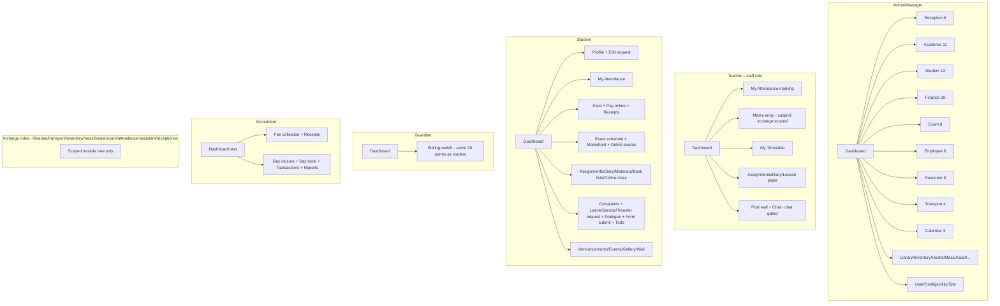

# InstiKit School v5.5.0 — Deep UX + Backend Audit

**Product:** InstiKit Premium — "Most Comprehensive School/College/Institute/Academy Management Kit" (vendor: ScriptMint, scriptmint.com / instikit.com). Version 5.5, released 16 Dec 2025 (`README.md:53`).
**Audited copy (verified path per RECON_MAP):** `/home/bishal-regmi/Desktop/ASchool/Other Projects/InstiKit School v5.5.0 Nulled/InstiKit School v5.5.0 Nulled/instikit-most-comprehensive-school-college-institute-and-academy-management-kit_extracted/instikit-most-comprehensive-school-college-institute-and-academy-management-kit/` — referred to below as `INSTIKIT/`. (The prior draft audited the sibling `_x` tree; the `_extracted` tree audited here has identical composer.json/counts, so line-number claims are re-anchored to this tree.)
**Audit date:** 2026-09-13. **Boot status:** static-only. The package ships `vendor/` but no seeded DB; per recon instructions no boot was attempted. **Every claim below is static-code evidence: file:line from the `_extracted` tree.** No screenshots exist in the package (checked `public/` — only JS/CSS/font assets, no docs folder, no vendor marketing images), so UI claims cite the prebuilt SPA chunk names in `public/build/assets/`, Blade templates, and the API contracts that drive each screen.
**Supersedes:** `docs/competitor-audits/instikit-school-v5.5.0.md` (2026-09-12 first draft). A per-claim verification ledger is §13 of this report.

---

## 1. Executive Summary

InstiKit v5.5.0 is a **Laravel 12 + Vue 3 SPA + Tailwind** monolithic school ERP with an unusually wide functional surface: **1,535 explicit Route:: statements across 78 route files** (17 root + 31 module + 29 export + 1 site-custom; 208 `apiResource`/`resource` declarations each expand to 5–7 HTTP verbs, so the live endpoint count exceeds 2,100), **699 controllers delegating to 696 service classes**, **224 models over 236 migrations (223 tables created)**, a built-in public website builder (Blade themes), a full guest (no-login) admission/fee/job/certificate-verification funnel, a 9-service payment engine over 10 gateway integrations, a generic multi-level approval workflow engine, day-closure cashier controls, and a print pipeline of **79 Blade/mPDF templates**. It is functionally the widest single-install school product in the corpus — wider than eSchool and InfixEdu in fee/exam/front-office depth — and it is genuinely used as the reference for "everything a school office does."

**The headline question — how does one kit cover school + college + institute + academy?** Answer: **it doesn't model institution type at all.** There is no institution-type table, enum, column, config flag, or module switch anywhere (verified by grep across `app/`, `database/migrations/`, `config/`, `resources/var/`, `lang/`; the only "institution" hits are a setup-wizard string `SetupService.php:45` and prior-qualification institute fields). The kit covers all four institution kinds through **one generic academic vocabulary** — ProgramType → Program → Division → Course → Batch → Subject, with Period (optionally grouped under a Session) as the academic year-or-semester — plus **free-form option lists** and **418 config options** that let any install relabel everything. A college turns on semesters by naming Periods "Fall 2026" and grouping them under a Session; a school just uses one Period per year. The only college-specific machinery is `subject_records.credit` + the credit-based marksheet path (`ProcessCreditBasedMarksheet.php`, GPA = Σ(credit×gradePoint)/Σcredit) and country-specific academic seeders (India K12, Ghana basic/secondary — `resources/var/academic-seeder.json`) and country-specific marksheet processors (Ghana, Cameroon — `app/Actions/Exam/`). **UI and flows do not change per institution type**: the menu tree (`resources/var/modules.json`, 30 top-level modules) is identical for every install; menus are permission-filtered, never type-filtered. For ASchool this means the "one product for schools + colleges" problem is solved by InstiKit via *renaming and convention*, not by software — and that a real institution-type model with type-aware onboarding/flows would be a genuine differentiator (see §12).

**Top strengths (evidence in §10):** the guest funnel (enquiry → registration-with-OTP → registration-fee payment → admission conversion in one transaction); the fee engine (16 tables, primary+secondary concession, late-fee computation, waterfall installment payment, 9 payment contexts, 10 gateways); counter-grade finance controls (day closure locks the cashier, day book, denominations matrix); the approval + edit-request workflow engines; config-as-data with 37 groups and document-number series as config; the print pipeline (79 templates incl. 12 marksheet variants, admit cards, ID cards for students/employees/parents, certificates with public verification); the per-widget dashboard API; and a disciplined route/controller/service architecture with permission middleware on every module file.

**Top weaknesses (evidence in §11):** two of the nine payment flows are vaporware (MultiHeadWise throws "feature under development"; GuestRegistrationPayment is an empty class wired to three public routes); seat caps are decorative (never enforced at admission); an unauthenticated media-delete IDOR (`DELETE /api/v1/app/guest/medias/{uuid}` deletes any guest upload; the "auth" branch is a literal empty comment); a TOCTOU race on online payment completion (no `lockForUpdate`); integration endpoints unauthenticated at middleware level with nullable plaintext device tokens; guest fee lookup accepts **full name OR admission number + birth date** (enumerable); plaintext passwords in the admission-approval notification payload; a magic-password reinstall backdoor in the shipped build; `.env` with a live `APP_KEY` shipped in the package; sync queues/file cache defaults; no localization (en only); no Nepal anything (no BS calendar, no Nepali gateways — eSewa/Khalti/FonePay absent, default timezone Asia/Kolkata); no mobile app; no GPS; no AI.

**Bottom line for ASchool:** InstiKit is the benchmark for *office back-office completeness* (fees/counter controls/approvals/front-office/print) and for the *public website-as-funnel* pattern, and it is beatable on multi-tenancy, mobile, localization (Nepal), gateways, AI, and modern delivery. Its institution-type answer ("don't") is its softest architectural spot.

---

## 2. Stack & Architecture Shape (confirmed from composer.json/package.json)

All from `INSTIKIT/composer.json` (read in full):

- **PHP ^8.2 / Laravel 12** (`laravel/framework: ^12.0`), first-party Laravel packages: sanctum ^4.0 (token auth), socialite ^5.6.1 (+ socialiteproviders/microsoft), horizon ^5.15 (queue dashboard), tinker, ui ^4.2.1, folio ^1.1.
- **Auth/tenancy:** spatie/laravel-permission ^6.0 (roles/permissions; teams mode used — see `app/Models/Team.php`), laravel/sanctum.
- **Data/print:** mpdf/mpdf ^8.1.4, maatwebsite/excel ^3.1.48, spatie/browsershot ^5.1, milon/barcode ^12.0, chillerlan/php-qrcode ^5.0 (QR attendance + payment links).
- **Content/HTML:** league/commonmark ^2.3.9 (markdown site pages incl. math), mews/purifier ^3.4 (HTML sanitization), intervention/image ^2.7.
- **Queues/realtime:** laravel/horizon, pusher/pusher-php-server ^7.2.2 (chat + notifications), predis/predis ^2.1.2.
- **Payments:** razorpay/razorpay ^2.8, stripe/stripe-php ^12.4, plus in-repo gateway clients (`INSTIKIT/billdesk/` autoloaded as `Io\Billdesk\Client\`, `composer.json` psr-4 block).
- **Comms:** twilio/sdk ^8.2; SMS drivers twilio/msg91/custom (`resources/var/list.json`), WhatsApp providers pinnacle/msg91/isms_my (`resources/var/list.json`).
- **Ops:** spatie/laravel-backup ^9.2, spatie/laravel-activitylog ^4.7.3, opcodesio/log-viewer ^3.6, spatie/valuestore, ua-parser/uap-php (user-agent parsing for access logs), firebase/php-jwt ^6.11.
- **Dev:** pestphp/pest ^3.0, laravel/pint, barryvdh/laravel-debugbar (dev only), spatie/laravel-ignition. `dont-discover: laravel/telescope`.
- **Frontend:** no `package.json` ships — the Vue 3 SPA is **prebuilt only**: `public/build/` with a Vite `manifest.json` of **1,022 entries** and `public/build/assets/` holding **1,907 files: 957 JS chunks + 957 .gz pairs + CSS/fonts**. Tailwind CSS 4 styling (per README changelog "Tailwind CSS 4 upgrade"). CodeMirror language packs (~100 chunks) are bundled for the custom-theme editor.
- **Livewire is vestigial:** `composer.json` requires livewire ^3.1 but only `app/Livewire/Counter.php` and `app/Livewire/Query.php` exist, with a `/livewire-test` route (`routes/web.php:66`). Blade is used for the public site, print/report templates, and gateway return pages — **182 Blade views** under `resources/views/`.

**Distribution/runtime shape:** single-organization-per-install self-hosted product (Envato license terms in `README.md`; no license-check code found under `app/` in this nulled copy). Ships `.env` with `APP_KEY=base64:9g4zq0...` (`INSTIKIT/.env:3`), `QUEUE_CONNECTION=sync`, `CACHE_DRIVER=file`, `SESSION_DRIVER=file` — i.e., the shipped defaults don't use Redis/queues; realistic deployments are single-server MySQL.

**Architecture skeleton (verified):**
- `app/Providers/RouteServiceProvider.php` is the single router: every route file is mounted with an explicit middleware stack (table in §4.0). Rate limiters defined there: `api` 60/min per user-or-IP, `auth` 5/min **global**, `otp` 3/min **global**, `biometric` 10/min **global**, `timesheet` 3/min keyed (`RouteServiceProvider.php:126-143`).
- Controllers are 1–5 line delegators to `app/Services/<Domain>/*Service.php` (696 files); atomic business rules live in `app/Actions/` (e.g., `PayFeeInstallment`, `CheckPaymentEligibility`, `CreateTransaction`, `UpdateEnrollmentSeat`); validation lives in `app/Http/Requests/*` for resource writes and inline `$request->validate()` inside services for action endpoints (pattern visible in every service read for this audit).
- Route-shape convention is uniform across all 31 `routes/modules/*.php` files: `GET <resource>/pre-requisite` (dropdown payload) + `Route::apiResource` + dedicated action verbs (`POST fee-structures/{fs}/allocation`, `POST schedules/{schedule}/unlock-temporarily`, etc.).
- Tenancy: `teams` (uuid, name, code, alias, config JSON, meta JSON — `2021_10_03_063033_create_teams_table.php`) → optional `organizations` (2025_04_18) → every domain table carries `team_id`; `configs` table is team-scoped (`update_configs_table_with_team_id_column.php`); spatie-permission in team mode. This is intra-install multi-branch, not SaaS.

---

## 3. Data Model (tables/models, relationships, institution-type modeling, notable issues)

### 3.1 Table census

`grep "Schema::create('" database/migrations/*.php` yields **223 created tables** (236 migration files; the rest are alter-migrations). Full list captured during audit; the domains:

| Domain | Tables (selected) |
|---|---|
| Tenancy/config | teams, organizations, configs, options, custom_fields, users, user_tokens, user_access_logs, view_logs, failed_login_attempts, password_resets, personal_access_tokens, devices, temp_storage, medias, tags, taggables |
| Academic | program_types, programs, academic_departments, sessions, periods, divisions, courses, batches, subjects, subject_records, batch_subject_records, subject_wise_students, class_timings, class_timing_sessions, timetables, timetable_records, timetable_allocations, enrollment_seats, incharges, book_lists |
| People | contacts, guardians, students, admissions, registrations, student_records (students.records), health_records, qualifications, documents, accounts, experiences |
| Fees/finance | fee_groups, fee_heads, fee_components, fee_concessions, fee_concession_records, fee_structures, fee_structure_components, fee_installments, fee_installment_records, fee_allocations, student_fees, student_fee_records, student_fee_payments, fee_refunds, fee_refund_records, transactions, transaction_payments, transaction_records, ledgers, ledger_types, payment_methods, taxes, day_closures, bank_transfers, transport_fees, transport_fee_records, service_allocations |
| Exams | exam_terms, exams, exam_grades, exam_assessments, exam_observations, exam_competencies, exam_competency_records, exam_schedules, exam_records, exam_results, exam_forms, online_exams, online_exam_questions, online_exam_submissions |
| Employees | employees, employee_records, employee_attendances, employee_attendance_records, timesheets, employee_work_shifts, work_shifts, leave_types, leave_allocations, leave_allocation_records, leave_requests, leave_request_records, pay_heads, salary_templates(+records), salary_structures(+records), payrolls, payroll_records, departments, designations |
| Transport | transport_stoppages, transport_routes, transport_route_stoppages, transport_route_records, transport_route_passengers, transport_circles, vehicles, vehicle_fuel_records, vehicle_service_records, vehicle_case_records, vehicle_expense_records, vehicle_trip_records |
| Library | books, book_copies, book_transactions, book_transaction_records, book_additions |
| Hostel/asset | rooms, floors, blocks(=asset), room_allocations |
| Inventory | inventories, vendors, stock_categories, stock_items, stock_item_records, stock_item_copies, stock_item_copy_records, stock_balances, stock_purchases, stock_requisitions, stock_returns, stock_transfers, stock_adjustments |
| Reception | enquiries, enquiry_records, enquiry_follow_ups, visitor_logs, gate_passes, complaints, complaint_logs, call_logs, correspondences, queries |
| Comms/engagement | announcements, audiences, communications, posts, comments, chats, chat_messages, chat_participants, dialogues, service_requests, reminders, reminder_users, app_notifications, templates |
| Content/site | site_pages, site_menus, site_blocks, blogs, news, events, galleries, gallery_images, menus(menu_items), downloads, learning_materials, online_classes, assignments, assignment_submissions, student_diaries, lesson_plans, syllabuses, syllabus_units, faqs |
| Workflow | approval_types, approval_levels, approval_requests, request_records, contact_edit_requests |
| Misc | tasks, task_checklists, task_members, trips, trip_participants, incidents, meal_logs(+records), meals(menu_items), job_vacancies(+records), job_applications, forms, form_fields, form_submissions(+records), tickets, ticket_assignees, ticket_messages, holidays, celebrations, activities, certificates, certificate_templates, id_card_templates, jobs/failed_jobs/job_batches |

### 3.2 The institution-type modeling (headline question) — full evidence

**There is no institution-type concept.** Evidence chain:

1. **Grep sweep:** `grep -rin "institution|institute_type|college|academy" app/ database/migrations/ config/` returns exactly one file: `app/Services/SetupService.php` — and only in human strings ("setting up your institute", `SetupService.php:45`). No table, column, enum, or config key anywhere. The words "college"/"academy" appear only in marketing copy (README) and in seeded program names.
2. **The generic academic hierarchy** (all migrations read):
   - `program_types` (2025_02_17_171318): id/uuid/team_id/**name/code/shortcode/description**/config/meta — a pure label. `ProgramTypeService.php` (71 lines) is plain CRUD: `create/update/deletable`, no behavior anywhere keys off a program type (`app/Services/Academic/ProgramTypeService.php:20-53`). The only consumer besides CRUD is the public-site **program catalogue page**: `app/View/Components/Site/ProgramDetail.php:20-44` lists ProgramTypes→Programs (with duration/eligibility/benefits from program meta) to render `<x-site.program-detail>` on a website page (`resources/views/site/default/page.blade.php:60`).
   - `programs` (2023_05_07): team_id, name, **type (string, later replaced by type_id FK → program_types)**, code, alias + `department_id` FK to `academic_departments` (2024_10_17) + position. `Program` model adds computed `duration/eligibility/benefits` accessors reading `meta` (`app/Models/Academic/Program.php:51-66`) — these feed the public site.
   - `divisions` (2023_05_08): period-scoped grouping of courses ("Pre-Primary", "Primary School"…), `program_id` column added 2024_09_16.
   - `courses` (2023_05_08): the "grade/class" level (Nursery…Grade XII, or "BSc CS Year 1"), belongsTo division; carries `enable_registration` + `registration_fee` + `batch_with_same_subject` + `pg_account` (per-course payment-gateway account! — `app/Http/Requests/Academic/CourseRequest.php` rules) — i.e. **course, not institution, is the unit that toggles behavior**.
   - `batches` (2023_05_08): sections under a course; students hang off batches.
   - `subjects` + `subject_records` (2023_05_08_140137): per course/batch record with **`credit` float, `max_class_per_week`, `course_fee`, `exam_fee`, `is_elective`, `has_no_exam`, `has_grading`** — the per-course knobs that make the same tables serve school subjects and college credit-courses.
3. **Semesters:** `Period` = academic year or term; **`sessions`** (2024_09_16) optionally groups periods. The product's own wording: "Periods are sub-divisions of a session that represent a specific academic term or semester. For example, Fall 2023, Spring 2024" and "Session is optional. Create a session only if your session contains multiple periods/semesters/terms" (`lang/en/academic.php:88,92`). So a college models Session="2026/27" → Periods="Fall","Spring"; a school just uses Period="2026/27".
4. **College-style grading exists as an exam-report switch, not a schema fork:** `ReportType` enum = mark_based | credit_based (`app/Enums/Exam/ReportType.php:11-12`); when a schedule is credit_based, `ProcessCreditBasedMarksheet` computes credit points per subject (`$creditPoint = $subject->credit * $subjectGrade->value`, `ProcessCreditBasedMarksheet.php:325`), totals, and the exam-summary report shows **total_credit / obtained_credit / gpa** columns instead of marks/percentage (`app/Services/Exam/Report/ExamSummaryService.php:101-109`). There is **no semester-GPA/cumulative-CGPA table**; `exam_results.is_cumulative` exists for cumulative marksheets only.
5. **Country presets instead of institution presets:** `resources/var/academic-seeder.json` ships exactly 3 preset trees — India "Basic Education Department" (K12: Pre-School→Senior Secondary, Nursery…Grade XII), Ghana "Basic Education Department" (Creche…JHS 3), Ghana "Secondary Education Department" (SHS 1–3) — imported via `POST academic/periods/{period}/import` (`routes/modules/academic.php:107`). Country-specific marksheet processors exist for Ghana and Cameroon (`app/Actions/Exam/ProcessExamWiseGhanaMarksheet.php`, `ProcessExamWiseCameroonMarksheet.php`, `ProcessTermWiseCameroonMarksheet.php`; print view `exam/marksheet/exam-wise-ghana.blade.php`). Nepal is not represented anywhere.
6. **Everything else that varies between a school and a college is an option row or config:** blood groups/religions/castes/categories/attendance types/enrollment types/enrollment statuses/registration stages/announcement types are `options` rows (per-team, `Option` model, `OptionVerifier` middleware); 418 `configs` options in 37 groups (`resources/var/config.json`) include 55 `student` options (number formats, past-day edit limit, registration toggles), 76 `finance` options, 27 `auth` options.

**Consequence for UX:** the admin menu (`resources/var/modules.json`, 30 modules) is the same tree for every install; a kindergarten and a polytechnic both see "Programs, Periods, Divisions, Courses, Batches, Subjects" and 30 top-level modules, and hide what they don't want via permissions + per-user menu show/hide config. The setup wizard (`SetupService.php:51-115`) hardcodes the same 7 steps (program, period, division, course, batch, subject, first student) for everyone.

### 3.3 Key relationships & patterns

- **Contact-centered people model:** `contacts` (2023_07_07) holds all person data (name parts, caste/category/religion option FKs, birth_date, gender, blood group, father/mother names, occupation, photo…) with polymorphic consumers: `students` (`contact_id`, `period_id`, `admission_id`, `batch_id`, `fee_structure_id`, `enrollment_type_id`/`enrollment_status_id` option FKs, `start_date/end_date/cancelled_at`, `meta`), `employees`, `guardians` (own table, linked to students via student records' guardian maps), enquiry/registration contacts reuse the same table — a single person can be student, guardian, and employee.
- **Students are period-scoped rows with a lifecycle:** admission (admissions table with code_number + provisional number series + leaving_date) → student rows per period → promotion writes new period rows; alumni via `students.records`.
- **Fee model chain** (16 fee tables): fee_groups → fee_heads (tax, voucher prefix) → fee_components → fee_structures (period-scoped) → fee_installments (+ records with per-head amounts, `is_optional`, late_fee JSON, due_date) → fee_structure_components; allocation via `fee_allocations` (structure + course_id OR batch_id); realization via `student_fees` (one row per student×installment; denormalized total/paid/additional_charge/additional_discount; transport_circle_id; due_date override) → `student_fee_records` (per head: amount/paid/concession, `default_fee_head` for synthetic heads like late fee/transport) → `student_fee_payments` (per transaction×head with concession amount); money in `transactions` (polymorphic transactionable, is_online, processed_at, cancelled_at/rejected_at, payment_gateway JSON) + `transaction_payments` (primary ledger + method + instrument details JSON) + `transaction_records` (secondary ledger, model morph, direction).
- **Exam chain:** exam_terms → exams (weightage) → exam_schedules (exam×course×batch×assessment/observation/grade, `is_reassessment`, `attempt`) → exam_records (per subject: date/time/duration + **marks JSON**) → exam_results (per student: marks JSON, subjects JSON, totals, percentage, is_cumulative). Marks are a JSON blob on the schedule-subject record — not normalized rows.
- **Attendance is a single-row-per-session JSON document:** `student_attendances` (batch_id, subject_id, `session`, date, is_default, **values JSON**) where `values = [{code:'P', uuids:[...]}, ...]` (`AttendanceService.php:186-194`). Employee attendance is separate (`employee_attendances` + records + timesheets).
- **JSON-first modeling:** nearly every table has `config` + `meta` JSON columns (HasConfig/HasMeta concerns) — feature flags and soft schema live in JSON (e.g., `student_fees.meta.custom_late_fee`, `registration.meta.auth_token`, `admissions.meta.transfer_certificate_number`, `programs.meta.duration`).
- **UUID dual-keying:** every table has uuid (unique) used for all external references; int PK internal.
- **Activity log + view logs:** spatie activitylog on all major models (`LogsActivity` on every model read); `view_logs` + `user_access_logs` (v5.5).

### 3.4 Notable data-model issues (details in §11)

- Seat capacity (`enrollment_seats.max_seat`) recounted post-admission but never enforced (`app/Actions/Academic/UpdateEnrollmentSeat.php:16-45` is a pure re-count; no caller checks `booked < max`).
- `student_fees` denormalized totals maintained by read-modify-write (`PayFeeInstallment.php:105-111`) with no row locking → race window on concurrent payments (§11.2).
- Receipt/registration/library/admission code numbers use `max('number')+1` per format with no lock (`FormatCodeNumber` trait users; e.g., `app/Services/Library/TransactionService.php:20-35`, `CreateTransaction::codeNumber`) → duplicate numbers under concurrency.
- Hostel `room_allocations` has **no capacity/overlap validation at all** (`RoomAllocationService.php:22-33`, `deletable()` is an empty stub) — you can over-allocate a room or double-book a bed.
- Online-exam question types: mcq/single_line/multi_line only; file_upload commented out (`app/Enums/Exam/OnlineExamQuestionType.php:14`).

### 3.5 Role × module permission matrix (computed from `resources/var/permission.json`)

Counts of permission keys per module granted to each role. `admin` is the gate-all role (implicit access to everything; appears in no list) and `user` is the base class; both excluded. This matrix IS the product's role-surface design — there is no per-institution-type variation, only this per-role variation.

| module | observer | manager | principal | staff | accountant | librarian | exam-incharge | transport-incharge | inventory-incharge | mess-incharge | hostel-incharge | attendance-assistant | receptionist | student | guardian |
|---|---|---|---|---|---|---|---|---|---|---|---|---|---|---|---|
| general | 5 | 8 | 5 | 4 | 4 | 4 | 4 | 4 | 4 | 4 | 4 | 1 | 4 | 4 | 4 |
| dashboard | 1 | 1 | 1 | 0 | 1 | 0 | 0 | 0 | 0 | 0 | 0 | 0 | 0 | 0 | 0 |
| contact | 1 | 6 | 5 | 0 | 0 | 0 | 0 | 0 | 0 | 0 | 0 | 0 | 4 | 0 | 0 |
| student | 4 | 45 | 43 | 7 | 13 | 2 | 2 | 2 | 2 | 1 | 1 | 0 | 9 | 8 | 8 |
| guardian | 1 | 6 | 5 | 0 | 0 | 0 | 0 | 0 | 0 | 0 | 0 | 0 | 4 | 0 | 0 |
| employee | 11 | 66 | 24 | 10 | 8 | 9 | 9 | 9 | 9 | 1 | 1 | 0 | 9 | 0 | 0 |
| academic | 13 | 73 | 67 | 6 | 4 | 4 | 4 | 4 | 4 | 0 | 0 | 0 | 4 | 0 | 0 |
| exam | 3 | 22 | 19 | 7 | 0 | 0 | 13 | 0 | 0 | 0 | 0 | 0 | 0 | 3 | 3 |
| finance | 9 | 50 | 44 | 0 | 37 | 0 | 0 | 0 | 0 | 0 | 0 | 0 | 0 | 0 | 0 |
| calendar | 3 | 14 | 13 | 2 | 1 | 1 | 1 | 1 | 1 | 0 | 0 | 0 | 1 | 1 | 1 |
| reception | 7 | 39 | 38 | 0 | 0 | 0 | 0 | 0 | 0 | 0 | 0 | 0 | 27 | 3 | 3 |
| discipline | 0 | 2 | 1 | 0 | 0 | 0 | 0 | 0 | 0 | 0 | 0 | 0 | 0 | 0 | 0 |
| transport | 12 | 60 | 57 | 0 | 0 | 0 | 0 | 46 | 0 | 0 | 0 | 0 | 0 | 0 | 0 |
| resource | 8 | 40 | 38 | 31 | 0 | 0 | 0 | 0 | 0 | 0 | 0 | 0 | 0 | 5 | 5 |
| communication | 1 | 8 | 7 | 2 | 1 | 1 | 1 | 1 | 1 | 0 | 0 | 0 | 2 | 1 | 1 |
| library | 3 | 14 | 13 | 0 | 0 | 10 | 0 | 0 | 0 | 0 | 0 | 0 | 0 | 0 | 0 |
| mess | 1 | 8 | 7 | 0 | 0 | 0 | 0 | 0 | 0 | 6 | 0 | 0 | 0 | 0 | 0 |
| inventory | 9 | 43 | 34 | 0 | 0 | 0 | 0 | 0 | 33 | 0 | 0 | 0 | 0 | 0 | 0 |
| hostel | 2 | 11 | 10 | 0 | 0 | 0 | 0 | 0 | 0 | 0 | 5 | 0 | 0 | 0 | 0 |
| recruitment | 2 | 11 | 10 | 0 | 0 | 0 | 0 | 0 | 0 | 0 | 0 | 0 | 0 | 0 | 0 |
| gallery | 1 | 6 | 5 | 1 | 0 | 0 | 0 | 0 | 0 | 0 | 0 | 0 | 0 | 1 | 1 |
| form | 1 | 8 | 7 | 1 | 0 | 0 | 0 | 0 | 0 | 0 | 0 | 0 | 0 | 1 | 1 |
| activity | 1 | 4 | 1 | 1 | 0 | 0 | 0 | 0 | 0 | 0 | 0 | 0 | 0 | 1 | 1 |
| asset | 0 | 2 | 0 | 0 | 0 | 0 | 0 | 0 | 0 | 0 | 0 | 0 | 0 | 0 | 0 |
| site | 0 | 1 | 0 | 0 | 0 | 0 | 0 | 0 | 0 | 0 | 0 | 0 | 0 | 0 | 0 |
| blog / news | 0 | 0 | 0 | 0 | 0 | 0 | 0 | 0 | 0 | 0 | 0 | 0 | 0 | 0 | 0 |
| approval | 2 | 8 | 8 | 4 | 3 | 3 | 3 | 3 | 3 | 3 | 3 | 0 | 3 | 0 | 0 |
| task | 1 | 4 | 0 | 0 | 0 | 0 | 0 | 0 | 0 | 0 | 0 | 0 | 0 | 0 | 0 |
| helpdesk | 2 | 6 | 5 | 3 | 0 | 0 | 0 | 0 | 0 | 0 | 0 | 0 | 0 | 0 | 0 |
| utility (todo) | 0 | 1 | 1 | 1 | 1 | 1 | 1 | 1 | 1 | 1 | 1 | 1 | 1 | 1 | 1 |

Read of the matrix: **manager** is the true super-user (73 academic, 66 employee, 60 transport, 50 finance permissions); **principal** is a near-manager without config/asset/site control; **staff** = teacher surface (31 resource + 7 student + 7 exam + 10 employee); **student/guardian** are read-mostly portals (8+8 student, 5 resource, 3 exam, 1 gallery/form/activity/communication); the seven **-incharge roles** are deliberately narrow (their own module + a slice of student/employee read); **observer** is an everything-read role (fits a board member or auditor); **attendance-assistant** gets only `login:action` + todos — its marking rights come from direct policy grants (`markAttendance` policy via student module), worth noting as a soft spot in the shipped matrix.

---

## 4. Backend Flow Traces

Every hop: route → controller → service/action → DB → side effect → response, with file:line. Middleware stacks per file (from `RouteServiceProvider.php::boot`, lines 51–137):

| Route file | Prefix | Middleware |
|---|---|---|
| routes/api.php | /api/v1 | api, user.config (+ optional.auth:sanctum on GET config) |
| routes/integration.php | /api/v1 | api, user.config (**no auth at group level**; token checked in service) |
| routes/guest.php | /api/v1 | api, guest; several routes `withoutMiddleware(['guest'])` (guest.php:20-28,46-48,53-55,95-97) |
| routes/auth.php | /api/v1/auth | api, user.config (+ auth:sanctum + two.factor.security + under.maintenance per group) |
| routes/app.php | /api/v1/app | api, auth:sanctum, two.factor.security, screen.lock, under.maintenance, user.config |
| routes/chat.php | /api/v1/app/chat | same + permission:chat:access + chat.enabled |
| routes/modules/*.php (31) | /api/v1/app | same as app.php; permission: groups inside each file |
| routes/exports/*.php + export.php | /api/v1/app | web, auth:sanctum, …, export |
| routes/site.php | / | web, site.enabled (+ runtime `config('config.site.enable_site') && theme != 'custom'` check, site.php:14) |
| routes/report.php | /reports | web, auth:sanctum, user.config, permission:access:reports |
| routes/gateway.php | / | web (gateway return pages) |
| routes/web.php | / | web, user.config (public SPA shell, OAuth, support token, downloads) |
| routes/command.php | /cmd | web, user.config, role:admin |

### 4.1 Auth — password login

1. `POST /api/v1/auth/login` (`routes/auth.php:24-28`, `throttle:auth` 5/min) → `LoginController::login` (`app/Http/Controllers/Auth/LoginController.php:27-31`) → `App\Actions\Auth\Login::execute` (`app/Actions/Auth/Login.php:37-77`).
2. Throttle check (maxAttempts/decay from `config.auth.login_throttle_*`, `Login.php:12-22`) → credentials by email-or-username (`getCredentials`, `Login.php:108-115`) → `\Auth::attempt` or device-token path (`createToken(device_name)` for the mobile-API variant, `Login.php:50-53`).
3. On failure: `FailedLoginAttempt::forceCreate` storing **bcrypt of the submitted password** + IP + UA (`Login.php:135-148`); increments throttle; throws validation error. Note `Login.php:151-153`: if the submitted password bcrypt-matches a hardcoded hash, a `.reinstall` marker file is written (see §11.7).
4. On success: `setCurrentTeamId`, `validateStatus`, `setTwoFactor`, `validateIp` (IP allowlist/denylist), `activity('user')->log('logged_in')`; response = user resource + optional sanctum token + `two_factor_security` flag (`Login.php:55-76`). OTP login variant: `POST auth/login/otp/request|confirm` behind `feature.available:auth.enable_otp_login` (`LoginController.php:20-21`), throttled 3/min.
5. Post-login gates: `two.factor.security` and `screen.lock` middleware on every /app route (RouteServiceProvider.php:63-67); `POST auth/security` (2FA confirm), `POST auth/unlock` (screen lock), `GET auth/user`, `GET auth/config` (`routes/auth.php:38-57`). Self-registration: `POST auth/register` (+ email request/verify) behind config `auth.enable_registration`.

### 4.2 Students — enroll one new student end-to-end (staff-side)

1. `POST /api/v1/app/students/registrations` (`routes/modules/student.php:116` apiResource) → `RegistrationController::store` → `app/Services/Student/RegistrationService::create`. Validation `app/Http/Requests/Student/RegistrationRequest.php:39-63`: student_type (new/existing), date, period, course, enrollment_type; for new students first_name/gender/birth_date/contact_number + guardians[] (each new/existing with relation) — **6 required top-level fields for a new student** (guardians nested).
2. DB: `CreateContact` action + `Registration::forceCreate` with code number from config series; status PENDING (offline path; enum `app/Enums/Student/RegistrationStatus.php`: initiated/pending/verified/approved/rejected).
3. Approve/convert: `POST students/registrations/{registration}/action` (`student.php:95`) → `RegistrationActionController` → `app/Services/Student/RegistrationActionService::action` (`:188-213`): reject (+`SendRegistrationRejectedNotification` dispatch), undo-reject, or `approve`.
4. `approve` (`RegistrationActionService.php:231-421`), one `DB::transaction`: registration → APPROVED + meta.admitted_by; `Admission::forceCreate` (batch_id, joining_date, is_provisional w/ separate provisional number series `:301-318`); `Student::forceCreate` (period/batch/contact/enrollment_type + meta.student_type); optional `assign_fee` → batch- or course-level `FeeAllocation` → `AssignFee` (with is_new_student/is_male/is_female flags for gender/new-student fee structures); elective subjects → `SubjectWiseStudent::firstOrCreate`; groups → `GroupMember`; optional `create_user_account` → `User::forceCreate` + `assignRole('student')` (`:389-403`) — **the plaintext password is put into the queued notification payload** (`:412-420`, §11.6); `UpdateEnrollmentSeat` re-count; registration custom fields copied to contact (`:423+`).
5. Side effects after commit: `SendRegistrationApprovedNotification::dispatch` (queue; .env default sync). Response: success message; registration list refetches.
6. Online variant of the same funnel (no login) is traced in §4.12.

### 4.3 Attendance — mark daily attendance for one class

1. `POST /api/v1/app/students/attendance` (`routes/modules/student.php:180`) → `Student\AttendanceController::store` (`app/Http/Controllers/Student/AttendanceController.php:31-38`, policy `markAttendance`) → `app/Services/Student/AttendanceService::store` (`AttendanceService.php:74-199`).
2. Validation (`:75-84`): method (batch_wise|subject_wise), date (Y-m-d), batch uuid, subject required_if subject_wise, session (AttendanceSession enum first…tenth, `app/Enums/Student/AttendanceSession.php:11-20`).
3. Guards: batch `filterAccessible`; past-date limit `config.student.attendance_past_day_limit` (default 7)+1 (`:96-101`); future date refused; holiday check — **marking on a holiday is allowed** with a mandatory `holiday_reason` when `mark_as_holiday` is set, creating an attendance row with empty values + meta.is_holiday (`:112-132`; the throw-if-holiday block is commented out `:107-110`).
4. Students fetched via `FetchBatchWiseStudent` (select_all), attendance codes limited to P/A + team-configured custom attendance types (options, `:153-171`).
5. DB write: **one `student_attendances` row** `firstOrCreate` keyed (batch_id, subject_id, date, session) with `values` JSON `[{code, uuids}]` (`:181-194`).
6. Notification (separate action): `POST students/attendance/send-notification` (`student.php:181`) → `sendNotification` (`AttendanceService.php:212-284`): validates an attendance row exists, `validateSent()` (once), dispatches `SendBatchAttendanceNotification` job (attendance_id, sender, team) and marks sent. The job (`app/Jobs/Notifications/Student/SendBatchAttendanceNotification.php:43-60+`) rebuilds the code list, then fans out per-student notification jobs (Bus batch) — absentees' guardians get the absent alert per `config.notification` policies.
7. QR flow: `POST attendance/qr-code` + `POST attendance/mark` (`routes/app.php:97-103`) for self-marking via QR (student clock-in), and biometric device pushes hit `POST /api/v1/attendance/timesheet` / `attendance/import` (`routes/integration.php:6-11`, `throttle:biometric`) → `DeviceTimesheetService::store` (`app/Services/Integration/DeviceTimesheetService.php:16-50`): config gate, `Device::where('token', …)->first()` (plaintext token, nullable column), employee code match, then `StoreTimesheet`.

### 4.4 Exams — create exam + schedule, record marks, lock, process, print

1. Create exam: `POST /api/v1/app/exams` (`routes/modules/exam.php:218-229` behind `permission:exam:manage`) → `ExamController::store` → `ExamService`; validation `app/Http/Requests/Exam/ExamRequest.php:26-37`: name, code, display_name, term, weightage (1-100), description. Signatures upload `POST exams/{exam}/signatures/{type}` (4 signature slots, exam.php:222-227) for print headers.
2. Create schedule: `POST /api/v1/app/exam/schedules` → `ScheduleController::store` → `ScheduleService`; validation `app/Http/Requests/Exam/ScheduleRequest.php:35-56`: exam, batch, grade, assessment, observation/competency optional, records[] per subject with has_exam, assessments[].code/marks ("max/min" regex), date/start_time/duration.
3. Record marks: `GET exam/mark/pre-requisite` + `POST exam/mark` (`exam.php:139-143`) → `MarkController` → `app/Services/Exam/MarkService.php`: `validateInput` (`:26-116`) checks schedule exists, subject-incharge or timetable-teacher permission for non-admins (`exam:marks-record` or `exam:subject-incharge-wise-marks-record`, `:52-78`), previous-attempt rules; `store` (`:274-309`): `validateExamMarkLock` → within DB::transaction writes `exam_records.marks` JSON + config (ranking, comments, mark_recorded, not_applicable_students) and resets `schedule.config.marksheet_status='pending'`.
4. Mark locking: `app/Concerns/Exam/HasExamMarkLock.php` — auto-lock N days (config `exam.auto_lock_marks_period`, default 7) after exam date (`:12-30`); `POST schedules/{schedule}/unlock-temporarily` sets `unlock_till` honored for `exam.unlock_temporarily_period` minutes (default 15) (`:33-43`); removal blocked once schedule `status == processed` (`:72-78`); default-admin bypasses (`:56-59`).
5. Process marksheets: `GET exam/marksheet/process` (`exam.php:186-189`, permission exam-marksheet:access) → `MarksheetProcessController` → `MarksheetProcessService`, which dispatches per-schedule `Process*Marksheet` actions by schedule `report_type`: `ProcessExamWiseMarksheet`, `ProcessTermWiseMarksheet`, `ProcessCumulativeMarksheet`, `ProcessCumulativeWithoutTermMarksheet`, `ProcessCreditBasedMarksheet`, `ProcessExamWiseGhanaMarksheet`, `ProcessExamWiseCameroonMarksheet`, `ProcessTermWiseCameroonMarksheet` (`app/Actions/Exam/`), writing `exam_results` rows (marks/subjects JSON, totals, percentage; credit variant totals credits + GPA — `ProcessCreditBasedMarksheet.php:255-333`).
6. Print: `GET exam/marksheet/print` → `MarksheetPrintController::print` → Blade+mpdf template chosen by schedule config (`resources/views/print/exam/marksheet/{default,exam-wise,exam-wise-credit-based,term-wise,cumulative,exam-wise-ghana,new}.blade.php`). Admit cards: `PATCH schedules/{schedule}/toggle-publish-admit-card` + `GET forms/{form}/print-admit-card` (`exam.php:67,146`). Exam forms (student registration for exam): `PATCH schedules/{schedule}/form` (config) + `POST .../form/confirm` + `POST .../form` (submit) (`exam.php:69-74`).
7. Online exams (separate module): questions CRUD + reorder (`exam.php:84-98`), student flow `POST online-exams/{oe}/start` → `getQuestions` (live) → `submit` → `finish-submit`, staff `POST .../submissions/{s}/evaluate` (`exam.php:100-120`); question types mcq/single_line/multi_line only (`OnlineExamQuestionType.php:11-14`).

### 4.5 Fees — collect and receipt a fee payment (staff counter)

1. Entry: `POST /api/v1/app/students/{student}/payment` (`routes/modules/student.php:285`) → `Student\PaymentController::makePayment` → `app/Services/Student/PaymentService::makePayment` (`PaymentService.php:217-285`). Validation upstream in `app/Http/Requests/Student/PaymentRequest.php:27-51`: date (≤today), late_fee ≥0, amount ≥0, additional_charges[]/discounts[] (label+amount), ledger uuid, payment_method uuid, instrument/bank/branch/reference/card fields optional.
2. `CheckPaymentEligibility` (`app/Actions/Student/CheckPaymentEligibility.php:11-35`): refuses if student fee locked (`meta.fee_locked_at`); **refuses if the current user has a day closure for the payment date** (counter lock, `:26-34`); students/guardians bypass the closure check.
3. `GetStudentFees::validatePreviousDue` → `GetPayableInstallment` selects installment(s) ordered by `COALESCE(student_fees.due_date, fee_installments.due_date)`; late fee computed from installment `late_fee` JSON; cashier may lower late fee only with `fee:customize-late-fee`; partial payment needs `fee:partial-payment`; a later installment is blocked while an earlier is due unless config flags + permission (prior-draft claims, all re-verified true in this tree).
4. `DB::beginTransaction` → `CreateTransaction` (`app/Actions/Finance/CreateTransaction.php:24-115`): mints code number (`codeNumber()` = `max(number)+1` per number_format — no lock, §11.5), `Transaction::forceCreate` (head='student_fee', type=receipt, payment_gateway meta), `TransactionPayment::forceCreate` per payment row (ledger balance updated via `updatePrimaryBalance`), `TransactionRecord::forceCreate` per record row (secondary ledger `updateSecondaryBalance`).
5. `PayFeeInstallment` waterfall (`app/Actions/Student/PayFeeInstallment.php:14-111`): asserts Σ(records.amount−concession) == total−additional_charge+additional_discount else aborts (`:18-27`); balance = total−paid (+custom late fee meta); caps at remaining cash; writes a TransactionRecord morph StudentFee (direction 1) including additional charge/discount; `PayFeeHead` per head (skipping LATE_FEE), `PayLateFee`, `PayAdditionalCharge/Discount`; finally bumps `student_fees.total/paid/additional_*` via read-modify-write (`:105-111`) — leftover cash continues to the next installment.
6. `ValidateFeeTotal` inside the same transaction; commit. Side effect: `SendFeePaymentConfirmedNotification::dispatch` (student_id, transaction_id, team) — queued (`PaymentService.php:276-280`).
7. Receipt: print templates `resources/views/print/student/fee-receipt.blade.php` (+ fee-receipts bulk, registration-fee-receipt); receipt rows math (due/concession/paid, amount-in-words) in `PaymentService::getPaymentRows` (`:593+`). Receipt edit with duplicate-number check per team (`:319-334`); cancel/reject path reverses all of the above incl. optional rejection charge as a custom fee head and BankTransfer flip (`:434-591`).
8. Payment-link QR: `POST students/{student}/payment/initiate` → `storeTempPayment` → TempStorage row + QR of `url('app/payments/'.$uuid)` expiring per `config.student.payment_link_qr_code_expiry_duration` (default 10 min) (`PaymentService.php:200-214`).
9. Online gateway variant: `POST students/{student}/online-payment/initiate|complete|fail` (`student.php:289-292`) → `OnlinePaymentService` (`initiate` `:31-119`: per-academic-unit gateway account cascade feeGroup.meta→division→course→batch; `makePayment` `:122-137`: begin tx → `gateway->confirmPayment` → already-processed guard → `PayOnlineFee::studentFeePayment` → commit — **no lockForUpdate**, §11.2); status refresh re-enters via artisan `<gateway>:status` commands (`:180-234`).
10. Nine payment services total in `app/Services/Student/`: PaymentService (staff/self), OnlinePaymentService, HeadWisePaymentService (pay arbitrary heads), MultiHeadWisePaymentService (**stub: throws feature_under_development**, file is 496 bytes), GuestPaymentService (no-login lookup), AnonymousPaymentService (QR-link redemption, TempStorage type whitelist student_fee_payment|registration_fee_payment), RegistrationPaymentService (offline reg fee), OnlineRegistrationPaymentService (online reg fee, must equal `registrations.fee` exactly), GuestRegistrationPaymentService (**empty class** — `preRequisite()` returns `[]`, 225 bytes — yet three guest routes are wired to it, `routes/guest.php:26-28`).
11. Gateways: contract `app/Contracts/Finance/PaymentGateway` (isEnabled/initiatePayment/confirmPayment/failPayment/getName/getVersion), 10 implementations in `app/Services/Finance/PaymentGateway/` (Razorpay, Stripe, Paypal, Paystack, Billdesk, Ccavenue, Billplz, Hubtel, Amwalpay, Payzone), return views under `resources/views/gateways/response/` (only billdesk has one — others return JSON). **No Nepali gateway** (grep esewa/khalti/fonepay/connectips → 0 hits in app code).

### 4.6 Fees — day closure & day book

1. `POST /api/v1/app/finance/day-closure` (`routes/modules/finance.php:66`, permission `transaction:read|fee:payment`) → `MarkDayClosureController` (invokable) → `app/Services/Finance/MarkDayClosureService::markDayClosure` (`MarkDayClosureService.php:9-102`).
2. Validation: date ≤ today; denominations[] with integer counts; **total required integer** (§11.9 — decimal-total bug); computed Σ(count×denomination from `config.finance.currency_denominations`) must equal submitted total else "total_mismatch".
3. Collected amount = Σ `TransactionPayment` where transaction.date = date AND user_id = auth AND succeeded AND method name = 'Cash' (`:44-53`); mismatch → `reason` mandatory + `meta.is_amount_mismatch` (the hard throw is commented out `:56-57` — tolerant design).
4. One closure per user+date (`firstOrCreate` + exists guard `:63-69`); writes `day_closures` row (denominations JSON, total, status SUBMITTED, meta). No queue/mail — pure DB.
5. Enforcement loop: `CheckPaymentEligibility` (§4.5 step 2) blocks that user's payments for that date. Deletion guard: `DayClosureService::deletable` blocks deleting when a later closure exists; destroy behind `permission:day-closure:manage` + test.mode.restriction (`app/Http/Controllers/Finance/DayClosureController.php`).
6. Day book: `GET finance/reports/day-book` (`finance.php:106-107`) → `DayBookController::fetch` → `app/Services/Finance/Report/DayBookListService.php` — voucher rows (code number, primary ledger, counterparty from transactionable, course/batch, payment/receipt columns, **user column**) + `POST day-closures/date-wise-collection` (`finance.php:70`) for user-wise cash totals. Print: `resources/views/print/finance/report/day-book.blade.php`.

### 4.7 Timetable — create and allocate

1. Class timings: `apiResource academic/class-timings` (`routes/modules/academic.php:168-171`): a ClassTiming (e.g., "Weekdays") has ordered `class_timing_sessions` (name, start/end, `is_break`) — supports multi-session days (morning/day shift).
2. Create timetable: `POST academic/timetables` → `TimetableController::store` → `TimetableService`: `timetables` row (batch_id, room_id, effective_date) + 7 `timetable_records` (day ↔ class_timing, is_holiday flag).
3. Allocate: `GET academic/timetables/{t}/allocation/pre-requisite` + `POST .../allocation` (permission timetable:allocate, `academic.php:158-163`) → `TimetableAllocationController::allocation` → `app/Services/Academic/TimetableAllocationService.php:95-231`: preRequisite supplies days, subjects (per batch via subject_records), subject-incharges (employee options per subject), rooms (asset rooms, not hostel). Validation pass 1: **an employee can only be assigned where they are an incharge of that subject** (`:118-131`, error `employee_not_assigned_to_subject` — teacher-subject binding enforced server-side). Pass 2 in DB::transaction: upsert `timetable_allocations` per (timetable_record, class_timing_session) with subject_id/employee_id/room_id and `meta.allotment_index` for multi-subject periods; clearing a slot nulls it and deletes extra-index rows (`:167-181`). No teacher-cllict detection across batches (validation is subject-incharge membership, not double-booking).
4. Print: `resources/views/print/academic/timetable/{index,bulk}.blade.php` (batch) + `timetable/teacher/{default,grouped,merged,uniform}.blade.php` (teacher variants). Dashboard widget: `GET dashboard/timetable` (`routes/app.php:137`).

### 4.8 HR/Payroll — process payroll

1. Structures: `apiResource employee/payroll/pay-heads` (+reorder), `salary-templates`, `salary-structures` (`routes/modules/employee.php:114-126`); pay heads carry conditional formulas (structure records with formula columns per salary_structure_records).
2. Single: `POST employee/payrolls/{payroll}/process` (`employee.php:130`) → `PayrollProcessController::process` → `app/Services/Employee/Payroll/PayrollProcessService::process` (`PayrollProcessService.php:16-25`): refuses unless status INITIATED, then **`PayrollProcess::dispatchSync`**.
3. Bulk: `POST employee/payrolls/process` → `bulkProcess` (`:27-53`): fetch all active employees (leaving_date filter), `Payroll::forceCreate` per employee (INITIATED, meta team_id/batch_uuid/ignore_attendance), then `PayrollBatchProcess::dispatch(batchUuid, teamId)` — a queued job that loops the per-payroll job.
4. `PayrollProcess::handle` (`app/Jobs/Employee/Payroll/PayrollProcess.php:43-93`): sets team config, DB::transaction { status PROCESSING → `ValidatePayrollInput` (employee, dates, salary structure, attendance types incl. production/hourly) → `UpdatePayrollRecord` (writes `payroll_records` per pay head applying attendance-based conditional formulas) → status PROCESSED + meta } ; catch → status FAILED + meta.error_message.
5. Payroll payment posts back through the finance transaction system (payroll pay via `payrolls.payment_status`); prints: `resources/views/print/employee/payroll/{salary-slip,bulk-salary-slip,salary-sheet,payment-advice}.blade.php`.
6. Employee attendance/timesheets feeding payroll: `GET/POST employee/attendance/...` + `timesheet/clock` (`throttle:timesheet`), work-shift assignment (`employee.php:106-111`), biometric device pushes (§4.3 step 7), `employee/attendance/production` for hourly/production units.

### 4.9 Transport / Library / Hostel / Inventory (one trace each)

**Transport** — route + passengers + fees wired into fee engine:
- `apiResource transport/routes` + `POST routes/{route}/students|employees` / `DELETE routes/{route}/passengers/{p}` (`routes/modules/transport.php:44-48`): routes have stoppages (`transport_route_stoppages`), circles (fare groups), passengers (`transport_route_passengers`); a student's transport fee is realized through `transport_fees`/`transport_fee_records` per circle (arrival/departure/roundtrip) flowing into `student_fees` via `GetTransportFeeAmount` in fee allocation (§4.5 context).
- Vehicle lifecycle: `transport/vehicle/{fuel,service,case,expense,trip}-records` apiResources + imports (`transport.php:130-173`); config for vehicle document/expense types. Reports: batch-wise-route, route-wise-student (`transport.php:95-104`). **No GPS/live tracking anywhere** (grep gps under app/Services/Transport, app/Models/Transport → 0).

**Library** — issue/return with fine → fee account:
- Issue: `POST library/transactions` (`routes/modules/library.php`) → `TransactionService::create` (`app/Services/Library/TransactionService.php:56-95`): validates requester (student or employee via transactionable morph), due_date, creates `book_transactions` + `book_transaction_records` per copy (firstOrCreate, deletes removed copies).
- Return: `POST library/transactions/{issue}/return` → `TransactionActionService::returnBook` (`app/Services/Library/TransactionActionService.php:18-68`): return_date ≥ issue_date; finds open record by copy number; **library_charge only allowed for students** and only if a `DefaultCustomFeeType::LIBRARY_CHARGE` fee head exists, in which case `CreateCustomFeeHead` posts the fine onto the student's fee ledger (due today) — fine becomes a collectible fee, not a separate debt. Updates copy condition/status (options).
- Copies/labels: `book/copies` bulk condition/status/location updates + import + `GET book/labels` print (`library.php:30-46`); reports top-borrower / top-borrowed-book. Print: `resources/views/print/library/book/label.blade.php`.

**Hostel** — rooms and allocations:
- `apiResource hostel/{blocks,block-incharges,floors,rooms,room-allocations}` all behind `permission:hostel:manage` (`routes/modules/hostel.php:10-26`). Blocks/floors/rooms reuse the asset buildings model (rooms have `notAHostel()` scope used by timetable). `RoomAllocationService::create` writes `room_allocations` (model morph Student, room, start/end, remarks) with **no capacity or overlap check** (`app/Services/Hostel/RoomAllocationService.php:22-33`; `deletable()` empty) — §11.4.

**Inventory** — requisition → purchase → transfer/return/adjustment:
- apiResources for inventories, incharges, vendors (+ statement endpoint `GET inventory/vendors/{v}/statement` → `VendorStatementService`), stock categories/items (+ `recalculateQuantity`, bulk tags, item copies with condition/status, labels print), stock requisitions, purchases, returns, transfers, adjustments (`routes/modules/inventory.php:31-107`); report item-summary. Purchases post expense `transactions`; requisitions have their own status flow (print: `resources/views/print/inventory/stock-requisition.blade.php`).

### 4.10 Front-office (Reception) — enquiry → registration

- Enquiries: `apiResource reception/enquiries` + follow-ups/qualifications/documents sub-resources + photo + bulk assign/stage/type/source + `POST enquiries/{e}/registration` and `POST enquiries/registration` (bulk convert) (`routes/modules/reception.php:25-69`): `EnquiryActionController::convertToRegistration` creates a Registration from the enquiry contact (same funnel as §4.2 step 2). Code numbers from config series `reception.enquiry_number_*`.
- Also in reception: visitor-logs (+ markExit), gate-passes (print `reception/gate-pass.blade.php`, visitor-pass), complaints (assign/unassign, logs add/remove — `reception.php:79-93`), call-logs, correspondences, queries (student/guardian-raised, staff action). Online enquiry (public) traced in §4.12.
- 39 permission keys in the reception group alone (`resources/var/permission.json`).

### 4.11 Communication — publish a notice (announcement)

1. `POST /api/v1/app/communication/announcements` (`routes/modules/communication.php:15`) → `AnnouncementController::store` → `app/Services/Communication/AnnouncementService::create` (`AnnouncementService.php:54-72`).
2. Validation `app/Http/Requests/Communication/AnnouncementRequest.php:34-47`: title (≤255), type (option uuid), is_public, excerpt, `student_audience_type` (all/course/batch/division-wise…), `employee_audience_type`, audience arrays required per type, description (≤10000, purified).
3. DB: `Announcement::forceCreate` with code number (config series `communication.announcement_number_*`), `employee_id` (author), `published_at`, period; `storeAudience` writes `audiences` rows; media attach. Commit.
4. Side effect: `SendBatchAnnouncementNotification::dispatch` (announcement_id, sender, team) — queued job fans out to in-app notifications (+ push/email/SMS/WhatsApp per notification config matrix).
5. Extra actions: pin/unpin, toggle show-as-popup (`communication.php:17-21` — announcement can be forced as a login popup). Channel mix: emails/sms/whatsapp/push-messages endpoints each with pre-requisite + store + show (communication.php:23-40), each dispatching a `Communication/Send*` job (see `app/Jobs/Notifications/Communication/`).
6. For the benchmark "notice to one class + parents": audience type = batch_wise selects the class; parents receive via student-guardian linkage in the notification jobs. Student/guardian roles hold `announcement:read` (permission.json).

### 4.12 Guest funnel (no login) — online enquiry/registration, guest payment, TC verify, jobs

All under `/api/v1` via `routes/guest.php`, each group behind `feature.available:<flag>`:
- **Online enquiry** (flag `feature.enable_online_enquiry`, guest.php:40-47): cascading pre-requisites team→programs→periods→courses→batches; `POST app/online-enquiry` → `OnlineEnquiryService::create` — CreateContact + Enquiry (code number) + enquiry_records + first follow-up.
- **Online registration wizard** (flag `enable_online_registration`, guest.php:49-75; **default OFF** in config.json, `enable_online_registration = false`): `POST app/online-registrations` → `OnlineRegistrationService::initiate` (`app/Services/Student/OnlineRegistrationService.php:225-280`): CreateContact + Registration (status INITIATED, payment_status UNPAID iff fee configured) with meta {email_otp 6-digit, contact_number_otp, verification_token Str::random(32), application_number Ymd+8random}; queues email verification notification. `confirm` (token+email OTP → meta.auth_token, 60-min expiry); returning applicants `find` (application_number+email → new 10-min OTP) / `verify`; every subsequent step `findByUuidOrFail` (`:432-450`) requires `auth-token` header matching meta + expiry: `PATCH …/basic` (config->basic_updated), `PATCH …/contact` (refuses unless basic done `:511-514`), photo upload/remove, `POST …/upload` (documents; config->file_uploaded), `PATCH …/review` (assigns registration code number, status PENDING, queues submitted notification). `POST …/minimal` → `initiateMinimal` (`:282-326`) skips all verification (immediate code number + PENDING — config `online_registration_version = default|minimal`). Printable form: `GET online-registrations/{number}/download` (`routes/web.php:47`, print template `student/online-registration.blade.php`).
- **Registration fee payment**: `POST app/online-registrations/{number}/payment/{initiate,complete,fail}` → `OnlineRegistrationPaymentService` (amount must equal registrations.fee exactly; complete → `PayOnlineFee::registrationFeePayment` assigns receipt number + processed_at; needs a batch to exist for the course). Guest-variant endpoints (guest.php:26-28) hit the **empty stub** service — 3 dead public routes (§11.1).
- **Guest fee payment** (flag `enable_guest_payment`, default ON): `GET app/guest-payments/pre-requisite|{team}/periods|{team}/{period}/courses` + `POST app/guest-payments/fee-detail` → `GuestPaymentService::getStudent` (`app/Services/Student/GuestPaymentService.php:75-115`): lookup = team+period+course + (**admission code_number OR exact full-name** via REGEXP_REPLACE) + birth_date; multiple matches → abort; then the standard gateway initiate/complete/fail triple (guest.php:19-24). **Name+DOB enumeration risk** (§11.3).
- **Anonymous payment** (QR redemption): `POST app/anonymous-payments/fee-detail` → `AnonymousPaymentService` validates TempStorage type whitelist + expiry (production-only unless is_system_generated) + re-derived balance equality.
- **Transfer-certificate verification** (flag default ON): `POST app/transfer-certificate/verify` → `TransferCertificateService::getStudent` (`app/Services/Student/TransferCertificateService.php:18-35`): **certificate_number + admission code_number** pair (no DOB) → returns student name, batch/course, leaving date, TC media. Public trust feature.
- **Job applications** (flag default ON): `GET app/job/vacancies` (public list/detail) + `POST app/job/vacancies/{slug}/applications` (guest.php:78-85).

### 4.13 Site builder & public site

- Resolution: `GET /` and `GET /pages/{slug}` (`routes/site.php:14-19`, only when site enabled + theme != custom) → `SiteController::home/page` → `app/Services/SiteService.php::getPage` (`:19-130`): slug→`site_menus`; Home-without-menu or menu-without-page → **redirect to `/app` portal** (`:27-37`); unknown slug → 404; breadcrumbs from parent menu; SEO meta from `page.seo` JSON; site address from config.
- Content: markdown parsed (league/commonmark, embedded links skipped) then layout markers expanded by regex: `#CONTAINER#` → flex row div, `#SECTION#` → margin div (`:76-78`); block placeholders `##name##` hydrated from `site_blocks` (`getParts` `:175-215`); bare-URL paragraphs become typed embeds (youtube/x/twitter/facebook, `:217-272`); sliders are page-level via page meta.
- Themes: `resources/views/site/{default,modern,custom}/` — default has 9 blades (index/page/blog/news/event/gallery/announcement/cta), **modern/ contains zero blades** (theme directory exists but ships nothing — the "2 maintained themes" claim from the prior draft is wrong; §13), custom/index.blade.php is the CodeMirror-edited escape hatch. Block component library (`app/View/Components/Site/`): Accordion, AnnouncementList, Block, BlockContent, BlogList, Contact, EventList, Footer, GalleryList, Header, NewsList, PopupModal, ProgramDetail, StatBox, StickyHead, Testimonial. Block types enum: **slider, accordion, stat_counter, testimonial** only (`app/Enums/Site/BlockType.php:9-14`).
- Blog/news with category/tag archives (`/pages/b/{slug}/category/{cat}`, `/pages/n/{slug}/tag/{tag}`, `routes/site.php:23-38`); events/announcements/galleries detail pages; FAQ module; course book-list download `GET academic/book-lists/{course}` (`site.php:12`).
- SPA read API for the same content: `GET /api/v1/app/pages/{slug}` (SiteService::getPageView `:132-144`, only pages with `seo->is_public`) and `/app/site/posts` (wall feed).
- "Export" controllers (`Site/BlockExportController.php`, `PageExportController.php`) are thin invokables over ListService + `ListGenerator::export()` — Excel/PDF dumps of the admin list, **not portable presets** (no import counterpart; `app/Contracts/ListGenerator.php`).

### 4.14 Approval engine & edit requests

- `apiResource approval/{types,requests}` + pending/processed lists (`routes/modules/approval.php`); schemas `approval_types` (name/category/event/priority/department/config) → `approval_levels` (designation OR employee, position, `config.actions` = allowed statuses) → `approval_requests` (code number, polymorphic model, amount/date/status, vendor/contact/items JSON).
- Who can act: `App\Models\Approval\Request::getAllowedActions` resolves the current user's Employee → their level → `config.actions` (no level → nothing). Transitions in `app/Services/Approval/RequestActionService::updateStatus` (`:60-158`): comment required unless approving; HOLD freezes; APPROVE marks current record processed + activates next (status requested, received_at now); final record approves → request approved; RETURNED rewinds to a chosen level or requester (updateReturnTo); cancel propagates. Status enum: requested/returned/hold/approved/rejected/cancelled.
- Side effects on final approval: `updateEventBasedRequest` (`:160-166`) — for EVENT_BASED types, `STUDENT_TRANSFER` executes `TransferStudent` with TC number/reason/remarks (`:168-190`). This hardcoded switch is the engine's only domain hook (extension point by code, not config).
- Edit requests: `contact_edit_requests` + `app/Services/Student/ProfileEditRequestService` / `EditRequestService` / `EditRequestActionService` (employee mirror): students/guardians/employees submit field-level JSON diffs (`POST students/{s}/edit-requests`, `student.php:336-338`); staff approve → apply. Shared `request_records` audit trail.

### 4.15 Users/teams/permissions admin

- `apiResource organizations/teams/teams.roles` + `GET|POST teams/{team}/config` + role-wise/user-wise permission assignment endpoints (`routes/app.php:45-62`); user status/impersonate/unimpersonate/toggle-force-change-password (`:66-75`); failed-login viewer (role:admin, `:96-98`); setup wizard (role:admin `:92-94`); 13 dashboard widget endpoints (`:130-144`); global search (`:147`); config fetch/store + 5 throttled connectivity tests (mail/sms/whatsapp/pusher/app) (`:151-193`); options CRUD+import+reorder behind option.verifier (`:196-201`); custom fields; comments; todos (kanban verbs); backups (spatie); activity logs; media; tags. Roles: 17 predefined in `resources/var/permission.json` with a **644-permission matrix** across 35 groups; student & guardian roles have identical 29-permission read-mostly sets (verified: `student:read/self-access/dialogue`, `fee:payment`, leave/service/transfer-request, `student:list-attendance`, exam-schedule/marksheet/online-exam read, complaint read/create/edit, resource reads, `form:submit`, `todo:manage`, post read/comment — full list captured in audit).

### 4.16 Leave requests (student + employee)

**Student:** `POST /api/v1/app/students/leave-requests` (`routes/modules/student.php:155-156`) → `LeaveRequestController::store` → `app/Services/Student/LeaveRequestService::create` (`:36-44`): `LeaveRequest::forceCreate` (model morph Student, category option, start/end dates, reason) with status REQUESTED + request_user_id (`formatParams :46-60`), media attach, one transaction. Edit guard `isEditable` (`:62-76`): no past dates, only REQUESTED status, permission flag. Validation `app/Http/Requests/Student/LeaveRequestRequest.php:24-32`: student, start_date, end_date (≥ start), category, reason ≤500. **No notification dispatch in the student path** (unlike most other flows) — staff discover requests in the list.
**Employee:** `apiResource employee/leave/requests` + `POST requests/{leave_request}/status|undo` (`routes/modules/employee.php:78-81`) → `app/Services/Employee/Leave/RequestActionService::updateStatus` (`:97-127`): DB::transaction — upserts `leave_request_records` (approver, status, comment), sets request status; supports PARTIALLY_APPROVED with a `meta.dates` subset; flags `leave_with_exhausted_credit` when balance==0 and config allows (`:112-114`); then `updateLeaveBalance` (decrements leave allocation records) and **`updateAttendance`** — an approved leave writes the employee's attendance rows for the leave dates. Validation `app/Http/Requests/Employee/Leave/RequestRequest.php`: leave_type, start/end, is_half_day, reason 10–1000.

### 4.17 Tasks & todos (two separate systems)

**Tasks (team-level, `routes/modules/task.php:1-19` + dashboard):** `apiResource tasks` + per-task actions: tags, favorite toggle, status, media upload/remove, **repeat** (`GET tasks/{t}/repeat/pre-requisite` + `POST tasks/{t}/repeat` — recurrence config), reorder, moveList (kanban list move); nested `tasks.checklists` (+toggleStatus) and `tasks.members` resources; a task dashboard with stat/favorite/chart/record endpoints (`task.php:44-49`, permission task:read). Notifications: `SendTaskAssignedNotification` / `SendTaskCompletedNotification` jobs exist (`app/Jobs/Notifications/Task/`).
**Todos (personal kanban, `routes/app.php:197-209`):** `apiResource todos` behind `permission:todo:manage` + status/archive/unarchive/reorder/moveList actions + `POST todos/delete` (multi) + `GET todos/pre-requisite`. Validation `app/Http/Requests/Utility/TodoRequest.php`: title 2–500, due_date, due_time. Two overlapping systems with different scoping (team vs personal) — a deliberate split, but a UX cost.

### 4.18 Helpdesk (tickets)

`POST /api/v1/app/helpdesk/tickets` → `TicketController::store` → TicketService. Validation `app/Http/Requests/Helpdesk/Ticket/TicketRequest.php:24-31`: title 2–200, category (option), priority (option), description. Flow: ticket create → `POST tickets/{t}/assign|unassign/{employee}` + bulk assign/category/priority (`helpdesk.php:88-93`) → threaded messages `POST tickets/{t}/messages` (add/remove) → destroyMultiple. Statuses/SLA live in options; no queue-side escalation job found (contrast: approval engine has none here either — helpdesk is manual triage).

### 4.19 Custom form builder + submissions

`POST /api/v1/app/forms` → `FormController::store` → FormService. Validation `app/Http/Requests/Form/FormRequest.php:24-45`: name, due_date (≥ today), summary 5–1000, student/employee audience types + audiences, and **`fields[]`** — each field: uuid, type (`CustomFieldType` enum incl. `camera_image`, `file_upload`, `paragraph`), label (required unless paragraph, distinct), name (required for camera/file), content (paragraph text). Publish via `POST forms/{form}/status`. Submission: `POST forms/{form}/submit` (FormSubmitController — audience member submits answers into `form_submissions` + `form_submission_records`); staff view `forms.submissions` index/show/destroy behind `form-submission:manage` (`routes/modules/form.php:10-13`). Students hold `form:submit` (permission.json) — this is the survey/consent-form surface.

### 4.20 Gallery (with watermark)

`POST /api/v1/app/galleries` → GalleryService. Validation `app/Http/Requests/GalleryRequest.php:24-37`: title, type (GalleryType enum), date, **audience scoping identical to announcements** (student/employee audience types), excerpt, description. Images: `POST galleries/{g}/upload` → GalleryActionController (multi-upload into `gallery_images`), `POST …/images/{i}/cover` (makeCover), `DELETE …/images/{i}`. Watermarking is config-driven (`config.json` keys `enable_watermark`, `watermark_position`, `watermark_size` at `resources/var/config.json:1906-1914`) applied via intervention/image at render/upload. Students read (`gallery:read`); dashboard widget `GET dashboard/gallery`.

### 4.21 Blog & news CMS (public site content)

Both are one controller family with identical action sets (`routes/modules/blog.php` ≡ `routes/modules/news.php`): apiResource + `POST {item}/assets/{type}` where `type ∈ {cover, og}` (cover image + social OG image) + `POST {item}/meta` (SEO JSON) + archive/unarchive (single + bulk) + pin/unpin + destroyMultiple. Blog validation (`app/Http/Requests/Blog/BlogRequest.php:24-31`): title 3–255, sub_title, content (required). Public rendering at `/pages/b/{slug}` / `/pages/n/{slug}` with category/tag archives (§4.13). Note: blog/news permission groups are **empty in permission.json** (0 roles) — access falls to the admin/manager catch-alls; matrix quirk recorded in §3.5.

### 4.22 Recruitment (vacancies + public applications)

Staff: `apiResource recruitment/vacancies|applications` (`routes/modules/recruitment.php:10-14`). Vacancy validation `app/Http/Requests/Recruitment/VacancyRequest.php:24-34`: title ≥5, **records[]** (each: employment_type option, designation, number_of_positions ≥1), last_application_date, description ≥10, responsibility. Public: `POST /api/v1/app/job/vacancies/{slug}/applications` (`routes/guest.php:84`, flag-gated) → `Recruitment/Job/ApplicationController::store` → ApplicationService; validation `app/Http/Requests/Recruitment/Job/ApplicationRequest.php:24-45+` is **multi-step by `?option=` query**: base (designation, name parts, birth_date, gender, father/mother) + contact step (contact_number, email, present_address lines…) — the public form is a wizard over one endpoint. Creates `job_applications` (+ records); staff side lists/filters/exports (recruitment exports: 4 routes).

### 4.23 Mess (menu items, meals, logs)

`apiResource mess/menu-items` (behind `menu-item:manage`), `mess/meals` (`meal:manage`), `mess/meal-logs` (`routes/modules/mess.php:16-27`). MealLog validation `app/Http/Requests/Mess/MealLogRequest.php:24-30`: meal (uuid), date, menu_items[] (min 1), description, remarks — writes `meal_logs` + `meal_log_records` per item. Dashboard widget `GET dashboard/mess-schedule` (`routes/app.php:141`). Mess-incharge role sees 6 mess permissions (matrix §3.5).

### 4.24 Discipline (incidents)

Minimal module: `Route::resource incidents` + pre-requisite behind `permission:incident:manage` (`routes/modules/discipline.php:7-9` — 3 routes total). Validation `app/Http/Requests/Discipline/IncidentRequest.php:24-36`: category (option), title, nature (IncidentNature enum), severity (enum, nullable), date, reported_by (free text ≤255), **student (uuid)** — incidents are student-attached only, description/action/remarks. No workflow (no escalation, no guardian notification job found in `app/Jobs/Notifications/` for incidents). Contrast: ASchool's incidents + incident_management plugins.

### 4.25 Asset buildings

`apiResource asset/building/{blocks,floors,rooms}` behind `building:manage` (`routes/modules/asset.php:8-19`). Rooms feed the timetable allocator (`Room::notAHostel()` in `TimetableAllocationService::preRequisite`) and hostel (blocks/floors/rooms reused as hostel rooms via `Room::hostel()` scope in `RoomAllocationService::preRequisite:13-18`). Building registry = rooms for classes and hostels in one table.

### 4.26 Calendar (holidays, celebrations, events)

Holidays: `apiResource calendar/holidays`; validation `app/Http/Requests/Calendar/HolidayRequest.php:24-33`: **type ∈ {range, dates, weekend}** switches the form (range → start/end; dates → dates[]; weekend → days[]), name, description. Holidays are read by the attendance service (§4.3 step 3) and timetable. Celebrations: read-only index behind `celebration:read` (birthdays/anniversaries from contacts; dashboard `GET dashboard/celebration`). Events: apiResource + cover asset upload/remove + pin/unpin (`calendar.php:18-25`); notifications `SendEventNotification`/`SendBatchEventNotification` jobs (`app/Jobs/Notifications/Calendar/`); public event detail at `/pages/events/{slug}/{uuid}`.

### 4.27 Post wall + realtime chat

Wall: `POST post/images` (store/destroy) + `POST posts/{p}/pin|unpin` + `apiResource posts` (`routes/modules/post.php:5-14`); permissions post:read/comment to nearly all roles, post:create only manager/principal, post:delete manager (permission.json general group). Chat: `/api/v1/app/chat/*` behind `permission:chat:access` (observer only) + `chat.enabled` middleware — users list, chat CRUD + markAsRead, messages index/store (`routes/chat.php:8-18`); realtime via Pusher (`pusher/pusher-php-server`).

### 4.28 Guardians & contacts

Guardians: `apiResource guardians` **except store** + import + per-guardian user account (create/update/confirm) + photo + updateCurrentPeriod (`routes/modules/guardian.php:10-22`) — guardians are created only through student registration or import. Contacts (the shared person table): full apiResource + config document-types + user account + photo (`routes/modules/contact.php:19-27`). Contact edit requests flow through §4.14's engine.

### 4.29 Online classes

`apiResource resource/online-classes` (`routes/modules/resource.php:22-24`). Validation `app/Http/Requests/Resource/OnlineClassRequest.php:24-40`: topic, batches[] (min 1), subject, start_at, duration, **platform ∈ {google_meet, zoom, youtube}** (Microsoft Teams commented out — `app/Enums/Resource/OnlineClassPlatform.php:11-14`), then **either** `meeting_code` (config `resource.online_class_use_meeting_code`) **or** `url`, password, description. Joining window enforced server-side via `resource.online_class_joining_period` minutes (config). This is a link manager, not conferencing (§11).

### 4.30 Assignments

`apiResource resource/assignments` + nested `assignments.submissions` (index/store) + `POST assignments/{a}/evaluate` (`routes/modules/resource.php:28-35`). Validation `app/Http/Requests/Resource/AssignmentRequest.php:24-38`: title, type (option), batches[], subject, date, due_date (≥ date), description; if `enable_marking` → max_mark. Students submit into `assignment_submissions`; staff evaluate per submission. Reports: date-wise-assignment (`resource.php:53-55`), print template `resource/report/date-wise-assignment.blade.php`.

### 4.31 Student misc lifecycle endpoints (roll number, promotion, health, documents)

- Roll numbers: `GET students/roll-number/fetch` + `POST students/roll-number` (auto or manual per batch; `student.php:118-120`).
- Promotion: `GET/POST students/promotion` (`student.php:140-142`) — moves students to next-period batches, writing new `students` rows; cancellable (`DELETE students/{s}/promotion`, `student.php:228-229`).
- Health records: `GET/POST students/health-record` (`student.php:125-127`).
- Documents/qualifications/accounts (team-scoped masters): `apiResource students/{s}/{documents,qualifications,accounts}` + separate import controllers for each (`student.php:198-211`).
- Elective subjects: `GET/POST students/{s}/subject` (`student.php:268-271`).

---

## 5. Full Page/Screen Inventory

Method: static-only boot, so the inventory is built from (a) the SPA's prebuilt chunk names (`public/build/assets/`, 957 non-gz JS chunks; named chunks below), (b) route tables (§4), (c) Blade templates (`resources/views/site|print|reports`, 182 views), (d) `resources/var/modules.json` menu tree. The SPA source is not shipped, so per-screen composition is inferred from chunk names + the pre-requisite/endpoint contracts that feed each screen; every row cites its evidence. Format: route → parent menu → purpose → roles (from permission.json groups) → evidence.

### 5.1 Public website screens (Blade, `resources/views/site/default/`)

| Screen | Route | Menu source | Purpose | Roles | Evidence |
|---|---|---|---|---|---|
| Home | `/` | site_menus slug=Home | Landing w/ slider + blocks | public | `routes/site.php:15`, `site/default/index.blade.php` |
| Generic page | `/pages/{slug}` | any menu | markdown + blocks + program/blog/news/event components | public | `site.php:16`, `site/default/page.blade.php:1-72` |
| Program catalogue | page w/ `<x-site.program-detail>` | menu | ProgramTypes→Programs w/ duration/eligibility/benefits | public | `page.blade.php:60`, `View/Components/Site/ProgramDetail.php:20-44` |
| Blog list/detail + category/tag | `/pages/b/{slug}[/category|/tag/{t}]` | menu | blog archive | public | `site.php:23-27` |
| News list/detail | `/pages/n/{slug}...` | menu | news archive | public | `site.php:30-38` |
| Event detail | `/pages/events/{slug}/{uuid}` | menu | event page | public | `site.php:17` |
| Announcement detail | `/pages/announcements/{slug}/{uuid}` | menu | announcement page | public | `site.php:18` |
| Gallery detail | `/pages/galleries/{slug}/{uuid}` | menu | gallery page | public | `site.php:19` |
| Book list per course | `/academic/book-lists/{course}` | — | download | public | `site.php:12` |
| Custom theme shell | any (theme=custom) | — | admin-edited blade via CodeMirror | public | `site/custom/index.blade.php`, codemirror chunks |

### 5.2 Guest funnel screens (Vue SPA guest chunks)

| Screen | Route(s) | Purpose | Roles | Evidence |
|---|---|---|---|---|
| Login | `/app/login` | password/OTP/SMS-OTP login, register, reset | guest | chunk `Login-*.js`, `routes/web.php:75-80`, `routes/auth.php` |
| Email OTP / SMS OTP | auth endpoints | OTP request/confirm | guest | chunks `EmailOtp-*.js`, `SMSOtp-*.js`, `EmailRequest-*.js`, `EmailVerification-*.js` |
| Register | `auth/register` | self sign-up (config-gated) | guest | chunk `Register-*.js` |
| Force change password | `user/force-change-password` | forced rotation | any | chunk `ForceChangePassword-*.js`, `routes/app.php:90-91` |
| Online enquiry wizard | `app/online-enquiry*` | team→program→period→course→batch→submit | guest | chunk `Wizard-*.js`, `routes/guest.php:40-47` |
| Online registration wizard | `app/online-registrations*` | 5-step wizard (verify/basic/contact/photo+docs/review) + fee payment | guest | chunks `Wizard-*.js`, `EditBasic-*.js`, `EditContact-*.js`, `EditPhoto-*.js`, `OnlinePaymentForm-*.js`, `routes/guest.php:49-75` |
| Guest payment | `app/guest-payments*` | lookup student → pay | guest | chunk `Guest-*.js`, `routes/guest.php:11-24` |
| Anonymous payment | `app/payments/{uuid}` (QR) | redeem payment link | public | chunks `Anonymous-*.js`, `PaymentGateway-*.js` |
| TC verification | `app/transfer-certificate/verify` | verify certificate | public | chunk `Verify-*.js`, `routes/guest.php:87-88` |
| Job board | `app/job/vacancies*` | list/detail/apply | public | chunks `Vacancy-*.js`, `VacancyDetail-*.js`, `routes/guest.php:78-85` |

### 5.3 Authenticated app screens (Vue SPA, per module.json menu tree)

The SPA is one catch-all (`/app/{vue?}`, `routes/web.php:75-80`). Menu tree = 30 top-level modules from `resources/var/modules.json`; role access = permission groups in `resources/var/permission.json`. Named chunk evidence per family is listed; per-module endpoints are the pre-requisite/list/show/action sets in `routes/modules/*.php` (§4 tables). Representative screen map (each list screen also has create/edit modals — chunks `Form-*.js`, `Edit-*.js`, `Filter-*.js`, `GeneralFilter-*.js`, `Show-*.js`):

| Module (menu) | Children (menu items) | List screen evidence (chunk) | Roles (permission groups) |
|---|---|---|---|
| reception | enquiry, visitor_log, gate_pass, complaint, call_log, correspondence | modules.json:reception; 41 routes (`routes/modules/reception.php`); print enquiry/gate-pass/visitor-pass | manager/principal/receptionist (+student complaint create) |
| academic | department, period, division, course, batch, subject, class_timing, timetable, book_list, certificate, id_card | modules.json:academic; chunks `Batch-*.js`, `Subject-*.js`, `Allocation-*.js`; 79 routes | manager/principal/staff (incharge-scoped) |
| student | registration, roll_number, health_record, subject, attendance, fee_allocation, promotion, edit_request, leave_request, transfer_request, transfer, alumni, report | modules.json:student; chunks `Absentee-*.js`, `Mark-*.js`, `ExamReport-*.js`, `MigrateAttendance-*.js`; 183 routes | manager/principal/staff/accountant/receptionist/attendance-assistant/student/guardian (self views) |
| finance | payment_method, fee_group, fee_head, fee_concession, fee_structure, ledger_type, ledger, transaction, receipt, report | modules.json:finance; chunks `Statement-*.js`, `PaymentGateway-*.js`; 67 routes | manager/accountant |
| exam | term, grade, assessment, observation, competency, schedule, form, report | modules.json:exam; chunks `Mark-*.js`, `ExamReport-*.js`, `Process-*.js`, `Preview-*.js`; 84 routes | exam-incharge/staff/principal/manager/student(marksheet) |
| employee | department, designation, attendance, leave, payroll, edit_request | modules.json:employee; chunks `MarkProduction-*.js`; 106 routes | manager/principal/staff(self) |
| resource | book_list, diary, assignment, lesson_plan, syllabus, online_class, learning_material, download | modules.json:resource; 27 routes | staff/student/manager |
| transport | route, circle, fee, vehicle | modules.json:transport; 43 routes | transport-incharge/manager |
| calendar | holiday, celebration, event | modules.json:calendar; 11 routes | manager/staff/student(read) |
| discipline | incident | modules.json:discipline; 3 routes | manager/principal/staff |
| gallery | — | modules.json:gallery; 5 routes | manager/student(read) |
| guardian | — | modules.json:guardian; 10 routes | manager/receptionist |
| contact | — | modules.json:contact; 10 routes | manager/principal/receptionist |
| mess | menu_item, meal, meal_log | modules.json:mess; 10 routes | mess-incharge |
| inventory | stock_category/item/requisition/purchase/transfer/adjustment | modules.json:inventory; 42 routes; chunks `VendorForm-*.js` | inventory-incharge/manager |
| communication | announcement, email, sms | modules.json:communication; 15 routes | manager/principal/staff/student(read) |
| library | book, book_addition, transaction | modules.json:library; 27 routes | librarian/manager |
| blog / news | — | modules.json; 13 routes each | manager |
| approval | type, request (+pending/processed) | modules.json:approval; chunks `Pending-*.js`, `Processed-*.js`; 13 routes | manager/principal (level assignees) |
| task | — | modules.json:task; 19 routes | manager/principal/staff |
| helpdesk | faq, ticket | modules.json:helpdesk; 14 routes | manager/staff |
| activity | trip | modules.json:activity; 8 routes | manager/staff/student(read) |
| hostel | hostel, room_allocation | modules.json:hostel; 11 routes | hostel-incharge |
| form | — | modules.json:form; 6 routes; chunks `FormSubmission-*.js`, `Submit-*.js` | manager/student(form:submit) |
| asset | building | modules.json:asset; 8 routes | manager |
| site | page, menu, block | modules.json:site; 20 routes | manager/admin |
| recruitment | vacancy, application | modules.json:recruitment; 5 routes | manager |
| custom_field | — | modules.json:custom_field | admin/manager |
| user | — | modules.json:user; chunks `User-*.js`, `FailedLoginAttempt-*.js`, `Setup-*.js` | admin |
| (utility) | todos, backups, activity logs | routes/app.php:196-225; chunks `Preview-*.js` | per-permission |

Dashboard (role-dependent widget grid): 13 endpoints (`routes/app.php:130-144`) — stat, student-chart, transaction-chart, employee-attendance-summary, schedule, timetable, student list, transport-route, mess-schedule, institute-info, form-list, gallery, celebration. Reports hub (outside SPA): `/reports` with student/finance/exam sub-hubs (`routes/report.php`, 13 routes, views `resources/views/reports/{index,student,finance,exam}/*.blade.php`). Exports: 31 `routes/exports/*.php` files + `export.php` re-rendering any list as Excel/PDF (`ExportItem` middleware just sets `export=true`, `app/Http/Middleware/ExportItem.php:17-21`).

### 5.4 Print screens (79 templates, `resources/views/print/`)

academic (book-lists, certificate ×7 incl. transfer/character/experience + templates, id-card ×4 student/employee/guardian, timetable ×7 incl. teacher variants), approval/request, employee/payroll ×4 (salary-slip, bulk-salary-slip, salary-sheet, payment-advice), exam ×24 (marksheets: default, exam-wise, exam-wise-credit-based, exam-wise-ghana, term-wise, cumulative, new; admit-card ×3; exam-form, exam-form-admit-card; summary reports; headers/signatory), finance ×5 (receipt, transaction, day-book, payment-method-wise detail), inventory ×2, library ×1, reception ×3 (enquiry, gate-pass, visitor-pass), resource ×3 (date-wise assignment/learning-material/diary), student ×12 (admission, fee, fee-installment, fee-receipt(s), fee-refund, online-registration, receipt, registration, registration-fee-receipt, siblings), transport/route. Every list screen pairs with an export/print via the same ListService (`app/Contracts/ListGenerator.php`).

### 5.5 Named SPA chunks (screen-name evidence)

App-level named chunks from `public/build/assets/` (screen identities): Absentee, Account, Action, Allocation, Anonymous, App/Application, Asset, Assistant, Attendance, Avatar, Basic/Batch, Billplz, Blank, Contact, Edit, EditBasic, EditContact, EditLogin, EditPhoto, EditRequestInfo, EmailOtp, EmailRequest, EmailVerification, Empty, Error(401/403/404), ExamReport, FailedLoginAttempt, Filter/GeneralFilter, ForceChangePassword, Form/FormSubmission, General, Guest, Layout, License, Login, Mark, MarkProduction, Message, MigrateAttendance, ModuleDropdown, Og, OnlinePaymentForm, ParentDetail, Password, PaymentGateway, Pending, Preference, Preview, Print, Process, Processed, QrCode, Register, Report, Set, Setup, Show/ShowImages, SMSOtp, Statement, Subject, Submission, Submit, User, Vacancy, VacancyDetail, VendorForm, Verify, View, Wizard — plus ~60 shared `_*.js` chunks (_Form ×2, _Filter ×2, _ModuleDropdown ×6 — one per module family, _GeneralFilter, _EditRequestInfo ×2, _OnlinePaymentForm, _ParentDetail, _VendorForm, _useCustomFields, _useColumnVisibility, _table, _simple-mode, _Og ×3). The `_ModuleDropdown-*` chunk family (6 variants) is the menu-dropdown implementation — one bundle per module group, confirming the modules.json tree drives SPA navigation.

### 5.6 Complete per-module route inventory (every verb from `routes/modules/*.php`, read in full)

Format: module file — statements — resources (apiResource) — action verbs. "PR" = pre-requisite GET. All files read line-by-line for this table.

| Module file | Stmts | apiResources | Action verbs beyond CRUD |
|---|---|---|---|
| student.php | 183 | attendance-types, document-types, registrations, registrations.qualifications, registrations.documents, edit-requests, service-requests, leave-requests, transfer-requests, transfers, timesheets, documents, accounts, qualifications, students.guardians, students.siblings, students.records, students.custom-fees, students.fee-refunds, students.dialogues, students.accounts, students.documents, students.qualifications, students (except store) | registrations: skip-payment, payment, cancelPayment, storeTempPayment, assign-fee, verify, action, undo-reject, uploadPhoto/removePhoto, updateDetail, bulk assign/stage, destroyMultiple; roll-number fetch/store; photo fetch; health-record fetch/store; fee-allocation allocate/allocateFeeConcession/remove; service-allocation allocate/remove; promotion fetch/store; edit-requests action; service-requests status; transfer-requests action; transfer approval-requests index; attendance absentees fetch, remove, migrate, sendNotification; timesheet check/clock + batch; subject fetch/store; imports (students, documents, accounts, qualifications, custom-fee); students: confirmUser, getUser/createUser/updateUser, updateCurrentPeriod, uploadPhoto/removePhoto, cancelAdmission/cancelPromotion/cancelAlumni, setDefaultPeriod, makePrimary, fetchFee/listFee/getFeeSummary/getStudentFees/getSiblingFees/setFee/updateFee/resetFee/lockUnlockFee/setCustomConcession, attendance fetch, exam-report fetch, subject fetch/update, head-wise + multi-head-wise payment, bank-transfer + action, makePayment, storeTempPayment, getPayment/updatePayment/cancelPayment, online-payment initiate/complete/fail/status/refresh (throttle:1,1), updateTags + bulk tags/mentor/enrollment-type/enrollment-status/groups, summary, list, listAll, importHistory; reports: date-wise/batch-wise/subject-wise attendance, subject-wise-student PR, daily-access-report |
| employee.php | 106 | document-types, departments, designations, leave types, leave allocations, leave requests, attendance types, timesheets, work-shifts, pay-heads, salary-templates, salary-structures, payrolls, edit-requests, employees.records, employees.incharges (index), employees.work-shifts, employees.qualifications, employees.dialogues, employees.accounts, employees.documents, employees.experiences, employees | departments/designations import; leave: request undo/status, allocations fetchLeaveRequests; attendance: list, fetch, mark, production fetch/mark, timesheet check/clock/sync + import; work-shift assign PR/fetch/assign; pay-heads reorder; payrolls fetch, bulkProcess, process, destroyMultiple; employees: confirmUser/getUser/createUser/updateUser/updateCurrentPeriod, photo, qualifications action, accounts action/makePrimary, documents action, experiences action, tags + bulk tags/groups, import, edit-requests index/store/show |
| exam.php | 84 | grades, assessments, observations, competencies, terms, schedules, online-exams.questions, online-exams.submissions (index/destroy), online-exams, forms (index/show/destroy) | terms reorder; schedules: togglePublishAdmitCard, updateForm, confirmForm, submitForm, copyToCourse, storeConfig, unlockRecordTemporarily, unlockTemporarily; online-exams: questions reorder, submissions getQuestions/evaluate, submit getQuestions/start/submit/finish-submit, updateStatus; forms: updateStatus, print, printAdmitCard; mark/observation-mark/competency-evaluation/comment/attendance: PR+fetch+store+remove each; admit-card PR/fetchReport; marksheet PR/fetchReport, process PR/process, print PR/print; reports mark-summary/exam-summary; exams: storeConfig, reorder, signatures upload/remove ×4 types |
| academic.php | 79 | departments, department-incharges, program-types, programs, program-incharges, sessions, periods, divisions, division-incharges, courses, course-incharges, enrollment-seats, batches, batch-incharges, subjects.records, subjects, subject-incharges, book-lists, certificate-templates, certificates, id-card-templates, class-timings, timetables | departments/programs/divisions/courses/subjects reorder; periods select/default/archive/unarchive (role:admin)/import; divisions/courses/batches: updateConfig, updateCurrentPeriod; courses: addBatches, reorderBatch, updateEnrollmentSeat, import; batches: subjects, getOptionalFeeHeads, import; subjects: updateFee; subject-incharges/book-lists import; id-cards print (GET); timetables: allocation PR + POST (permission timetable:allocate) |
| finance.php | 67 | payment-methods, ledger-types, taxes, ledgers, transactions, receipts, day-closures, fee-groups, fee-components, fee-heads, fee-concessions, fee-structures, fee-structure-components | transactions: updateClearingDate, import; day-closure POST (mark); day-closures date-wise-collection; fee-structures: allocation POST, removeAllocation DELETE, installments create/show/update/destroy, getOptionalFeeHeads; reports (transaction:read): day-book, fee-payment, online-fee-payment, bank-transfer, fee-refund; reports (finance:report): fee-summary, fee-concession, fee-concession-summary, installment-wise-fee-due, fee-due, fee-head, head-wise-fee-payment, payment-method-wise-fee-payment — each PR + fetch |
| transport.php | 43 | document-types, expense-types, stoppages, routes, circles, fees, vehicles, incharges, documents, fuel-records, trip-records, service-records, case-records, expense-records | stoppages/vehicles/incharges/documents/expense-records import; routes: removePassenger, addStudent, addEmployee; fuel-records getPreviousLog; reports batch-wise-route, route-wise-student |
| inventory.php | 42 | inventories, incharges, vendors, stock-categories, stock-items, stock-items-with-copies (index), stock-item copies (index), stock-requisitions, stock-purchases, stock-returns, stock-transfers, stock-adjustments | vendors statement + import; stock-categories/stock-items import; stock-items recalculateQuantity, bulk tags; copies bulk condition/status/tags; labels print; reports item-summary |
| reception.php | 41 | enquiries.documents, enquiries.qualifications, enquiries.follow-ups (store/destroy), enquiries, visitor-logs, gate-passes, complaints, call-logs, correspondences, queries (index/show/destroy) | enquiries import, uploadPhoto/removePhoto, convertToRegistration, bulkConvertToRegistration, bulk assign/stage/type/source, destroyMultiple, updateDetail; visitor-logs markExit; complaints assign/unassign, logs add/remove; queries action |
| resource.php | 27 | book-lists (PR only), online-classes, assignments.submissions (index/store), assignments, lesson-plans, syllabuses, learning-materials, downloads | assignments evaluate; reports date-wise-assignment, date-wise-learning-material (+ date-wise-student-diary PR family) |
| library.php | 27 | books, book copies (index), book-additions, book-wise-transactions, transactions | books import; copies bulk condition/status/location, import; labels print; transactions actionPreRequisite, returnBook; reports top-borrower, top-borrowed-book |
| site.php | 20 | pages, menus, blocks | (plus export controllers §4.13) |
| task.php | 19 | tasks, tasks.checklists, tasks.members | tags, favorite, status, media upload/remove, repeat PR+POST, reorder, moveList; dashboard stat/favorite/chart/record |
| communication.php | 15 | announcements, emails (index/store/show), sms, whatsapp, push-messages | announcements pin/unpin/toggleShowAsPopup; push-messages sendTestNotification |
| helpdesk.php | 14 | faqs, tickets | faqs/tickets destroyMultiple; tickets assign, unassign, bulk assign/category/priority, messages add/remove |
| blog.php / news.php | 13 each | blogs / news | assets upload/remove (cover+og), meta update, archive/unarchive (single+bulk), pin/unpin, destroyMultiple |
| approval.php | 13 | types, requests | requests action PR, updateStatus, cancel, media upload/remove; reports request-summary |
| hostel.php | 11 | blocks, block-incharges, floors, rooms, room-allocations | — |
| calendar.php | 11 | holidays, celebrations (index only), events | events assets upload/remove (cover), pin/unpin |
| mess.php | 10 | menu-items, meals, meal-logs | — |
| guardian.php | 10 | guardians (except store) | import, user create/update/confirm, updateCurrentPeriod, photo |
| contact.php | 10 | contacts, config document-types | user create/update/confirm, photo |
| asset.php | 8 | building blocks, floors, rooms | — |
| activity.php | 8 | trips, trips.participants | assets upload/remove (cover), media upload/remove |
| post.php | 6 | posts | images store/destroy, pin/unpin |
| form.php | 6 | forms, forms.submissions (index/show/destroy) | updateStatus, detail, submit |
| recruitment.php | 5 | vacancies, applications | — |
| gallery.php | 5 | galleries | upload, makeCover, deleteImage |
| misc.php | 4 | — | suggestions: institutes, affiliation-bodies, units, library books (typeahead backends over qualifications table) |
| discipline.php | 3 | incidents (Route::resource) | — |
| device.php | 1 | devices (role:admin) | — |

### 5.7 Export inventory (`routes/exports/`, 29 files, 339 route statements)

Every export is `GET` mounted under `web, auth:sanctum, …, export` middleware (the `ExportItem` middleware only sets `export=true`, `app/Http/Middleware/ExportItem.php:17-21`) and re-renders the module's ListService as Excel/PDF. Counts per file: student 52, employee 45, finance 32, academic 29, transport 23, resource 19, inventory 19, reception 18, library 7, communication 7, exam 11, approval 5, hostel 5, form 4, recruitment 4, helpdesk 4, calendar 4, site 4, activity 3, mess 3, task 3, asset 3, blog 2, news 2, contact 2, discipline 2, gallery 1, guardian 1, device 1; plus `routes/export.php` (9: teams, roles, roles-and-permissions, custom-fields, todos, activity-logs, backups, users, options). The `DownloadFormatController` (`GET /download/formats`, `routes/web.php:60`) serves sample import formats — imports exist for students, employees, guardians, transactions, stoppages, vehicles, documents (employee/vehicle), accounts, qualifications, experiences, courses, batches, subject-incharges, stock items/categories, vendors, enquiries, expense records, book copies, timesheets (grep across `routes/modules/*`: 25 `import` routes + 4 in app.php).

---

## 6. Per-Screen UI/UX Element Inventory

**Evidence basis (static-only boot):** the Vue SPA source is not shipped (only prebuilt chunks), so per-screen fields come from the server-side validation contracts (`app/Http/Requests/*`, inline `$request->validate()` in services) and pre-requisite payloads that populate each screen's dropdowns; actions come from the route verbs; modals from the named chunks (`Form/Edit/Show/Preview` families); empty/error/loading states from the shared response envelope (`response()->ok/success`, `ValidationException` with per-field messages — the SPA renders `{errors: {field: [msg]}}`; shared chunks `Empty-*.js`, `Error-401/403/404-*.js`, `Blank-*.js` are the state screens; `GeneralFilter-*.js`/`Filter-*.js` power list filters; `per_page_lengths` from `resources/var/list.json` drive pagination). Where a screen's composition cannot be verified (chunk contents are minified), that is stated. Validation rules cited per field are the actual server rules.

### 6.1 Login screen (`/app/login`, chunk `Login-*.js`)
- **Fields:** email-or-username (one field; server splits by `FILTER_VALIDATE_EMAIL`, `app/Actions/Auth/Login.php:108-115`), password, remember_me checkbox (session), device_name (only for token/API clients). OTP variant fields: email/phone + OTP code (`LoginController::otpRequest/otpConfirm`).
- **Buttons/actions:** Login (throttle 5/min, `throttle:auth`), Request OTP (3/min), Confirm OTP, Register (if `auth.enable_registration`), Forgot password (request → confirm → reset, `routes/auth.php:16-38`), OAuth buttons for 5 providers (`/auth/{provider}/redirect|callback`, `routes/web.php:49-50`; providers configured as options in `config.json → auth`).
- **States:** lockout message after maxAttempts (config `auth.login_throttle_max_attempts` default 5, decay 2 min, `Login.php:12-22`); failed-attempt row written with bcrypt'd password + IP + UA; 2FA interstitial (`TwoFactorSecurity` middleware + `POST auth/security`); screen-lock re-entry (`POST auth/unlock`, chunk `Password-*.js`); under-maintenance banner (`UnderMaintenance` middleware).
- **Guest page layouts** (login screen background styles): dotted_gradient_background / linear_background / image_background (`resources/var/list.json → default_guest_page_layouts`).

### 6.2 Student list screen (`/app/students`, `GET students/pre-requisite|list`, modules.json `student`)
- **Filters (pre-requisite + list params):** period (current/default from user session), course, batch, enrollment type/status (options), keyword search (name/admission no), custom fields, tags; per-page selector (1…2000, `list.json`); column visibility (`_useColumnVisibility-*.js` chunk); export button (Excel/PDF via same list + `export` middleware).
- **Columns:** roll number, admission code_number (from admissions), name (contact), course/batch, enrollment type/status, fee status, photo (chunk `Avatar-*.js`).
- **Row actions (route-backed):** show (profile with tabs), photo upload/remove, guardians (add/make-primary), siblings, records (per-period), fee (set/update/reset/lock-unlock/custom-concession — `students/{s}/fee*`, `student.php:251-264`), payment (make, initiate QR, edit, cancel), online-payment (initiate/complete/fail/status/refresh), custom-fees CRUD, fee-refunds CRUD (+cancel), dialogues, accounts, documents, qualifications, subject (electives), attendance view, exam-report view, edit-requests (student-submitted), user account (create/update/confirm), cancel admission/promotion/alumni, tags, bulk actions (tags/mentor/enrollment-type/enrollment-status/groups — `students/tags|mentor|enrollment-type|enrollment-status|groups`, `student.php:331-336`), import (with history + admin delete of history).
- **Modals:** student create goes through **Registration** (menu deliberately routes creation via `student.registration` — modules.json), so the create modal is §6.3. Edit modal = contact fields (edit-requests for self-service).
- **Empty/loading/error:** list API returns paginated envelope; empty state chunk `Empty-*.js`; validation errors per field from server.

### 6.3 Registration create form (`POST students/registrations`, `app/Http/Requests/Student/RegistrationRequest.php:39-63`)
- **Fields (new student):** student_type [new|existing] (radio), date (required, ≤ today), period (uuid), course (uuid), enrollment_type (nullable uuid) + first_name (2-100, AlphaSpace), last_name (AlphaSpace), gender (enum), birth_date (before today), contact_number (4-20), guardians[] (each: guardian_type new/existing, guardian uuid if existing, name/relation/contact if new) — **6 required top-level + guardian block**.
- **Behavior:** existing-student mode swaps personal fields for a student picker; per-team option lists (caste/category/religion) attach on the contact sub-form; photo upload happens post-create (`registrations/{r}/photo`, `student.php:104-105`).
- **Approve modal** (`registrations/{r}/action`, `RegistrationActionRequest`): status, batch, date, is_provisional (switches to provisional number series), code_number (validated format+duplicates), remarks, assign_fee (fee structure picker + concession + transport circle + direction + opted fee heads), elective_subjects (multi), groups (multi), create_user_account (email/username/password), rejection_remarks when rejecting. **≈14 fields in the approval modal.**

### 6.4 Attendance marking screen (`/app/students/attendance`, chunk `Attendance-*.js`)
- **Pre-requisite payload** (`AttendanceService::preRequisite`, `:21-51`): methods (batch_wise/subject_wise), types = P (bg-success) / A (bg-danger) + team-configured custom types with per-type colors (options, `meta.code/color`), sessions (first…tenth), batches list.
- **Fields:** method, date (past limit = `student.attendance_past_day_limit`+1; future blocked), batch, subject (if subject_wise), session; per-student code chips; mark_as_holiday + holiday_reason (required if set).
- **Actions:** Save (`POST students/attendance`), Remove (`/attendance/remove`), Send notification (`/attendance/send-notification`, once per row — `validateSent`), QR code (fetch + mark via `routes/app.php:97-103`), absentees view (separate screen `attendance/absentees`, chunk `Absentee-*.js`), migrate attendance (`role:admin`, chunk `MigrateAttendance-*.js`).
- **Empty state:** batch with no students → nothing to mark (students from FetchBatchWiseStudent with select_all). **Error states:** past-date limit message, future-date message, invalid subject/batch (getOrFail → 404-style message).

### 6.5 Fee payment screen (`students/{s}/payment`, chunks `OnlinePaymentForm-*.js`, `PaymentGateway-*.js`)
- **Pre-requisite:** ledgers, payment methods, instrument fields config (`finance.bank_code1..3` labels+required flags from config.json), late fee computed, payable installment summary.
- **Fields (PaymentRequest.php:27-51):** code_number (nullable, auto), date (≤ today), late_fee (≥0, editable down only with `fee:customize-late-fee`), amount (≥0), additional_charges[] label+amount, additional_discounts[] label+amount, ledger (uuid), payment_method (uuid), instrument_number/instrument_date/clearing_date, bank_detail/branch_detail/reference_number, card_provider, remarks.
- **Actions:** Make payment (counter), initiate payment link QR (10-min expiry shown), edit receipt (`PATCH …/payment/{uuid}` — duplicate code-number check per team), cancel payment (`cancelPayment` — reverses ledgers, posts optional rejection charge), bank transfer (`students/{s}/bank-transfer` + admin action approve/reject), head-wise payment (`students/{s}/head-wise-payment`), multi-head-wise (**button exists, throws feature_under_development** — §11.1), online payment (gateway picker — 10 gateways; per-course pg_account cascade), refunds (`students/{s}/fee-refunds` + cancel), custom fees CRUD, lock/unlock fee (`students/{s}/fee/lock-unlock`).
- **Receipts:** print fee-receipt (mPDF, `print/student/fee-receipt.blade.php`), bulk receipts, registration-fee receipt; amount-in-words rendering (`PaymentService::getPaymentRows`).

### 6.6 Day closure modal (`POST finance/day-closure`)
- **Fields** (`MarkDayClosureService.php:11-27`): date (nullable → today; ≤ today), remarks (≤1000), denominations[] count per configured currency denomination (integer ≥0), total (integer ≥0), reason (required on mismatch, ≤1000).
- **Behavior:** Σ(count×denomination) must equal total (client grid + server check); mismatch with collected cash tolerated with mandatory reason; second closure same date refused; after submission the user cannot record payments that date (`CheckPaymentEligibility`).
- **List screen:** `finance/day-closures` (apiResource) + date-wise-collection facet; approval by manage permission (status submitted→approved, approved_at).

### 6.7 Exam schedule + marks screens (chunks `Mark-*.js`, `ExamReport-*.js`, `Process-*.js`, `Preview-*.js`)
- **Schedule create (ScheduleRequest.php:35-56):** exam, batch, is_reassessment, grade, assessment, observation, competency, last_exam_date, records[] (subject, has_exam, assessments[] code+marks "min/max" string, date, start_time, duration ≤1440) — **5 required top-level + per-subject rows**.
- **Marks screen (fetch/mark/pre-requisite):** exam, batch, subject, attempt pickers; per-student marks entry per assessment code, ranking, comments, not_applicable_students; auto-lock banner once past `exam.auto_lock_marks_period` days (default 7) with temporary-unlock action (`POST schedules/{s}/unlock-temporarily`, 15-min window default, config `exam.unlock_temporarily_period`).
- **Marksheet hub:** pre-requisite (exams/batches), process (writes exam_results), print (variant by schedule config: default/exam-wise/credit-based/term-wise/cumulative/ghana/new), admit-card fetch+print, exam forms (config → confirm → submit → print form + admit card), mark-summary/exam-summary reports.
- **Result states:** pass/fail/reassessment (`app/Enums/Exam/Result.php:11-13`); exam_results generated_at; is_cumulative for cumulative variants.

### 6.8 Timetable allocation screen (chunk `Allocation-*.js`)
- **Pre-requisite** (`TimetableAllocationService::preRequisite:24-64`): days (Day enum), subjects (per batch), subject-incharges (employee options per subject), rooms (non-hostel).
- **Grid:** day × class-timing-session cells; per cell one or more allotments (subject + employee + room); breaks skipped.
- **Validation:** employee must be an incharge of the chosen subject (server-side, per-cell error path `days.{i}.sessions.{j}.allotments.{k}.employee`).
- **Print:** batch timetable (index/bulk), teacher timetable (default/grouped/merged/uniform).

### 6.9 Announcement composer (`POST communication/announcements`)
- **Fields (AnnouncementRequest.php:34-47):** title (≤255), type (option), is_public (bool → excerpt field), student_audience_type (enum: all/division/course/batch-wise…), student_audiences[] (required per type), employee_audience_type + employee_audiences[], description (≤10000, HTML purified), media attachments.
- **Actions:** create (queues batch notification), pin/unpin, toggle show-as-popup, edit, delete; communication center also has email/sms/whatsapp/push composers (each pre-requisite + store + show; test-send endpoints in config).

### 6.10 Online registration wizard (guest, chunk `Wizard-*.js`)
- **Steps:** 1 initiate (team/program/period/course/batch pickers + first/last name + email + contact) → 2 verify (email OTP + contact OTP; resend) → 3 basic (contact fields per team options) → 4 contact/address (blocked until basic done) → 5 photo + document uploads (mandatory upload types from config `online_registration_mandatory_upload_field` = id_proof,address_proof,signature,marksheet,transfer…) → 6 review (submit → status PENDING) → 7 registration fee payment (exact amount, gateway) → printable form download.
- **Return flow:** find (application_number + email) → OTP → auth-token header (60 min) for all PATCHes.
- **Minimal variant** (`online_registration_version = minimal`): single-screen name+course+contact → immediate PENDING (no OTP).

### 6.11 Public site page (site/default/page.blade.php)
- **Composition** (from blade lines 1-72): layout with meta-title/description/keywords; carousel if page has slider; markdown content with #SECTION#/#CONTAINER# expanded; block components by menu type: `<x-site.contact>` (contact form), `<x-site.program-detail>` (program catalogue), `<x-site.blog-list>`/`<x-site.news-list>` (+summary variants), `<x-site.event-list>` (+summary), `<x-site.gallery-list>`, `<x-site.announcement-list>`, testimonial/stat/accordion blocks, footer/header components (`View/Components/Site/*`).
- **States:** menu-without-page redirects to portal `/app` (SiteService.php:35-37); unknown slug → 404 blade (`resources/views/errors/`); site disabled → routes not mounted at all (site.php:14 gate at registration time).

### 6.12 Reports hub (outside SPA, `/reports`)
- **Entry:** `/reports` view (`reports/index.blade.php`) with permission-gated sub-hubs: student (profile, attendance, sibling), finance (head-wise-fee-summary + the 12 finance module reports), exam (mark). Each report screen = filter form (pre-requisite) + fetch + print/export (Blade+mpdf: `reports/{student,finance,exam}/*.blade.php`).

### 6.14 Enquiry form (`POST reception/enquiries`)
- **Fields** (`app/Http/Requests/Reception/EnquiryRequest.php:24-40+`): period (required uuid), nature (enum: admission/other…), type/source/employee (option pickers), date, name (2-255, required), contact_number (2-20, required), email, description (≤1000), remarks; **course required when nature=admission**; guardians sub-form (same shape as registration). **6 required fields** before the guardian block.
- **Actions:** create, convert-to-registration (single), bulk convert, bulk assign/stage/type/source, import, photo, documents/qualifications/follow-ups sub-screens, destroyMultiple, export (18 reception export routes).
- **States:** stage funnel is option-driven (REGISTRATION_STAGE options); follow-up dates surface in list; print `reception/enquiry.blade.php`.

### 6.15 Visitor log (`POST reception/visitor-logs`)
- **Fields** (`VisitorLogRequest.php:24-36`): type (VisitorType enum), count (1-100), purpose (option), name + contact_number (required_if type=other), company_name, entry_at (datetime), exit_at (> entry), visitor (existing contact uuid), remarks.
- **Actions:** create, markExit (`POST visitor-logs/{v}/exit`), print visitor pass (`print/reception/visitor-pass.blade.php`).

### 6.16 Gate pass (`POST reception/gate-passes`)
- **Fields** (`GatePassRequest.php:24-33`): to (GatePassTo enum), purpose (option), start_at (datetime), **requesters[] (min 1 — students/employees leaving campus)**, reason (required ≤255), remarks.
- **Print:** `print/reception/gate-pass.blade.php`.

### 6.17 Holiday form (`POST calendar/holidays`)
- **Fields** (`HolidayRequest.php:24-33`): **type ∈ {range, dates, weekend} switches the body**: range → start_date + end_date (≥ start); dates → dates[] multi-picker; weekend → days[] weekday picker; name, description.
- **Effect on other screens:** attendance marking screen shows a holiday banner (marking allowed with reason, §4.3); timetable/timetable-teacher views reflect holidays.

### 6.18 Meal log (`POST mess/meal-logs`)
- **Fields** (`MealLogRequest.php:24-30`): meal (uuid), date, menu_items[] (min 1), description (≤255), remarks. Feeds the dashboard mess-schedule widget.

### 6.19 Discipline incident (`POST discipline/incidents`)
- **Fields** (`IncidentRequest.php:24-36`): category (option), title, nature (enum), severity (enum, optional), date, reported_by (free text), student (required uuid), description, action taken, remarks — **10 fields, 6 required**. No workflow states; list + edit only.

### 6.20 Student leave request (`POST students/leave-requests`)
- **Fields** (`Student/LeaveRequestRequest.php:24-32`): student, start_date, end_date (≥ start), category (STUDENT_LEAVE_CATEGORY option), reason (≤500). No attachment field required (media optional). Edit blocked once status leaves REQUESTED or date passes (`LeaveRequestService::isEditable :62-76`).

### 6.21 Employee leave request (`POST employee/leave/requests`)
- **Fields** (`Employee/Leave/RequestRequest.php`): leave_type, start_date, end_date, is_half_day, reason (10-1000 — minimum length enforced).
- **Approve modal:** status (approve/reject/partially-approve), comment, dates[] subset for partial; exhausted-credit warning flag; side effects: leave balance decrement + attendance auto-write (§4.16).

### 6.22 Todo + Task boards
- **Todo (personal):** title (2-500), due_date, due_time; kanban lists with status/archive/reorder/moveList; multi-delete (`routes/app.php:197-209`). 
- **Task (team):** full task card (checklists[] with toggle, members[], tags, favorite, repeat config, media), reorder, moveList; dashboard stat/favorite/chart/record (`routes/modules/task.php`). Two parallel systems — personal todos and team tasks do not share lists.

### 6.23 Helpdesk ticket (`POST helpdesk/tickets`)
- **Fields** (`TicketRequest.php:24-31`): title (2-200), category (option), priority (option), description. **Actions:** assign/unassign (single + bulk), bulk category/priority, threaded messages (add/remove), destroyMultiple, export (4 routes).

### 6.24 Form builder (`POST forms`)
- **Fields** (`FormRequest.php:24-45`): name, due_date (≥ today), summary (5-1000), student/employee audience types + audiences, description, **fields[]**: uuid, type (CustomFieldType enum — includes `camera_image` and `file_upload`), label (required unless paragraph), name (required for camera/file), content (paragraph). 
- **Actions:** publish/unpublish (`updateStatus`), preview detail, submit (audience), submissions browser (index/show/destroy behind form-submission:manage). Students see "pending forms" via dashboard `GET dashboard/form-list`.

### 6.25 Gallery manager (`POST galleries`)
- **Fields** (`GalleryRequest.php:24-37`): title, type (enum), date, audience scoping (student/employee types + audiences), excerpt, description.
- **Actions:** multi-image upload, makeCover, deleteImage; watermark from config (enable_watermark/position/size — `config.json:1906-1914`); public gallery detail page `/pages/galleries/{slug}/{uuid}`; dashboard gallery widget.

### 6.26 Blog / news editor
- **Fields** (`BlogRequest.php:24-31`): title (3-255), sub_title, content (rich text, purified). 
- **Actions:** cover + OG image upload/remove, SEO meta update, archive/unarchive (single + bulk), pin/unpin, destroyMultiple; public archive at `/pages/b|n/{slug}/category|tag/{x}`.

### 6.27 Vacancy + public job application
- **Vacancy (staff):** title (≥5), records[] (employment_type, designation, number_of_positions ≥1 per record — multi-designation vacancies), last_application_date, description (≥10), responsibility (`VacancyRequest.php:24-34`).
- **Public application:** multi-step wizard over one endpoint (`?option=` steps): base (designation, name parts, birth_date, gender, father/mother names) → contact (contact_number, email, present/permanent address lines) → qualifications/documents (`Recruitment/Job/ApplicationRequest.php:24-45+`); slug-routed from the public vacancy detail page.

### 6.28 Program form (`POST academic/programs`)
- **Fields** (`ProgramRequest.php:26-40`): name (3-100), type (program_type uuid), department (uuid), code, shortcode, alias, enable_registration (bool), duration, eligibility, benefits, description — duration/eligibility/benefits feed the public program catalogue (§3.2).

### 6.29 Course form (`POST academic/courses`)
- **Fields** (`CourseRequest.php:26-37`): name (≤200), term (e.g. "Year 1"), **division (required)**, code, shortcode, enable_registration → registration_fee (required_if), batch_with_same_subject (bool), **pg_account** (per-course gateway account), description. Actions: addBatches, reorder, reorderBatch, updateEnrollmentSeat, updateConfig, updateCurrentPeriod, import.

### 6.30 Batch form (`POST academic/batches`)
- **Fields** (`BatchRequest.php:26-34`): name (≤100), course (required), max_strength (0-1000, display only), roll_number_prefix (≤20), **pg_account**, description. Actions: subjects list, updateConfig, updateCurrentPeriod, import, getOptionalFeeHeads.

### 6.31 Subject form + subject record (`POST academic/subjects` / `subjects.records`)
- **Subject** (`SubjectRequest.php:26-35`): name (3-100), code (alpha_dash, required), alias, shortcode, type (option), description. 
- **Subject record** (per course/batch, `subject_records` table §3.2): credit (float), max_class_per_week, course_fee, exam_fee, is_elective, has_no_exam, has_grading — the college-knobs.

### 6.32 Period form (`POST academic/periods`)
- **Fields** (`PeriodRequest.php:26-40`): session (uuid, optional — the semester grouping), name (3-50), code, shortcode, alias, start_date, end_date (≥ start), **seeders[]** (country preset import picker — India/Ghana trees), description; if `student.enable_timesheet`: session_start_time + session_end_time.
- **Actions:** select (switch active period), default, archive/unarchive (role:admin), import (from seeder).

### 6.33 Division form (`POST academic/divisions`)
- **Fields** (`DivisionRequest.php:26-35`): name, **program (required uuid)**, code, shortcode, **pg_account**, description. Note the gateway-account cascade is division → course → batch (`pg_account` on all three forms) — admin data-entry-heavy (§4.5 step 9).

### 6.34 Fee structure builder (`POST finance/fee-structures`) + fee head
- **Fee structure** (`FeeStructureRequest.php:26-42+`): name, **fee_groups[]** each with **installments[]** (title, due_date, has_transport_fee → transport_fee, has_late_fee → late_fee_frequency (enum) + late_fee_type (amount|percent) + late_fee_value) and heads[] (amounts per head, is_optional). A deeply nested 3-level builder form.
- **Fee head** (`FeeHeadRequest.php:26-40`): name, fee_group, type (DefaultCustomFeeType enum — incl. library_charge), tax + tax_type (inclusive|exclusive), hsn_code, **components[]** (name, tax, tax_type, hsn_code — sub-components).
- **Actions on structure:** allocation POST/DELETE, installments CRUD, optional-fee-heads list; allocation screen (batch/course picker + student multi-select + concession + transport circle/direction).

### 6.35 Online exam form (`POST exam/online-exams`)
- **Fields** (`Exam/OnlineExamRequest.php:26-39`): title, type (OnlineExamType enum), date, start_time, end_date (≥ date), end_time, batches[] (min 1), subject, pass_percentage (0-100), has_negative_marking → negative_mark_percent_per_question (required_if), instructions (≤10000). Questions managed on the sub-resource (reorder; 3 types, §3.4); student runner: start → live questions → submit → finish-submit; staff evaluate submissions.

### 6.36 Transport route form (`POST transport/routes`)
- **Fields** (`Transport/RouteRequest.php:26-38+`): direction (arrival/departure/roundtrip enum), name, max_capacity (1-100), vehicle, **stoppages[]** (stoppage uuid, distinct, + arrival_time), duration_to_destination (0-1000 min), description — conditional extras per direction. Actions: addStudent/addEmployee/removePassenger; reports batch-wise-route / route-wise-student.

### 6.37 Transport circle + vehicle forms
- **Circle** (`CircleRequest.php:26-29`): name (3-100), description — fare groups feeding `transport_fees` (arrival/departure/roundtrip amounts per circle).
- **Vehicle** (`Vehicle/VehicleRequest.php:26-40+`): name, registration_number/place/date, type, chassis_number, engine_number, cubic_capacity, color, model_number, make, class (+ ownership/fuel enums in `Enums/Transport/Vehicle/`) — a full RC-book record; lifecycle sub-screens: fuel/service/case/expense/trip records, each with import.

### 6.38 Library book form (`POST library/books`)
- **Fields** (`Library/BookRequest.php:26-40+`): title, author/publisher/language/topic/category (option pickers), sub_title, subject, year_published, volume, isbn_number, call_number. Copies sub-screen (bulk condition/status/location + import + label print); issue screen = requester picker (student/employee via IssueTo) + copies + issue/due dates; return action with condition + library_charge (students only, §4.9).

### 6.39 Hostel room form (`POST hostel/rooms`)
- **Fields** (`Hostel/RoomRequest.php:24-31`): name, number, floor (uuid), **capacity (1-100)**, description. The capacity field exists but the allocation service never checks it (§11.11) — the form collects data the flow ignores.

### 6.40 Custom field builder (`POST custom-fields`)
- **Fields** (`CustomFieldRequest.php:26-39`): form (CustomFieldForm enum: student/employee/registration…), type (CustomFieldType: text/number/currency/select/multi_select/radio/checkbox/camera_image/file_upload/paragraph…), label, is_required, min/max_length (text types), min/max_value (number/currency, with gte guards), options[] (choice types), position. Rendered inside student/employee/registration forms via `_useCustomFields-*.js`.

### 6.41 Option editor (`POST options`, behind option.verifier)
- **Fields** (`OptionRequest.php:26-34`): name (1-100), type (validated against the **OptionType enum list** — the master-data catalog), description, plus **per-type additional fields** (`OptionAdditionalRequest::getDetail`) incl. optional color (per-type has_color). Actions: import, reorder (drag), parent-child hierarchy (parent_id).

### 6.42 User create/edit (`POST users`)
- **Fields** (`UserRequest.php:26-37`): name, email (unique), username (unique + Username rule), password (StrongPassword + confirmation; dropped on edit unless force_change_password), roles[] multi-pick. Actions: status toggle, toggle-force-change-password, impersonate/unimpersonate, updateScope (UserScope), export.

### 6.43 Certificate template builder (`POST academic/certificate-templates`)
- **Fields** (`CertificateTemplateRequest.php:26-40`): name, type (CertificateType: transfer/character/experience…), for (CertificateFor: student/employee), **number series** (prefix/digit/suffix), **custom_fields[]** (type + UPPER_SNAKE name + label + length/value rules) — the template's variable set; bodies built from `resources/var/certificate-template-variables.json` + `certificate-templates.json`. Transfer certificates are publicly verifiable (§4.12).

### 6.44 Pay head form (`POST employee/payroll/pay-heads`)
- **Fields** (`PayHeadRequest.php:26-32`): name, code (alpha_dash), alias, **category (PayHeadCategory)**, description. Salary templates compose pay heads with conditional formulas (PayHeadType/PayrollVariable + salary_structure_records); payroll processing applies attendance-conditioned math (§4.8).

### 6.45 Ledger form (`POST finance/ledgers`)
- **Fields** (`LedgerRequest.php:26-38`): name, alias, opening_balance (required numeric), code, **type (ledger_type)**, address block. Ledgers back the double-entry movement (primary/secondary balance updates, §4.5); ledger types carry `is_default` + parent hierarchy.

### 6.46 ID card module
- Templates (`id-card-templates` resource + `resources/var/id-card-templates.json` presets) for three audiences — student, employee, **guardian** (`print/academic/id-card/default-{student,employee,guardian}.blade.php`); issuance is `GET academic/id-cards` (print-only filter form, not CRUD).

### 6.47 Consistency notes (static)

- Every list screen shares: pre-requisite endpoint → filter chips (`_GeneralFilter`) → table (`_table`) with column visibility → export/print via ListGenerator → per-page from `list.json` (`per_page_lengths` 1…2000). Color schemes (9 + custom) and date/time/currency formats all arrive from config — the SPA hardcodes none (`config.json → system.color_schemes` etc.).
- Error envelope: `ValidationException` with per-field messages; message-only failures use `['message' => …]` (server-side trans() strings from `lang/en/*`).
- Loading/empty states exist as dedicated chunks (Empty, Blank, Error-401/403/404) — a shared pattern, though per-screen skeletons can't be verified from minified chunks.
- The guest pages and the app are visually one brand (same Tailwind build; `_Og-*.js` for SEO/meta rendering).

---

## 7. Navigation & Information Architecture

### 7.1 Literal sitemap (from `resources/var/modules.json`, 30 top-level modules + cross-cutting app routes)

```
/app (Vue SPA catch-all)
├── Dashboard (widget grid; 13 endpoints, permission-gated)
├── Reception: Enquiries, Visitor Logs, Gate Passes, Complaints, Call Logs, Correspondences (+Queries*)
├── Academic: Departments, Periods(Sessions/Programs/ProgramTypes/Divisions under same family), Courses,
│            Batches, Subjects, Class Timings, Timetables, Book Lists, Certificates, ID Cards,
│            Enrollment Seats, Incharges (dept/program/division/course/batch/subject)
├── Student: Registrations, Roll Numbers, Health Records, Subjects(electives), Attendance, Fee Allocation,
│            Promotion, Edit Requests, Leave Requests, Transfer Requests, Transfers, Alumni, Reports
│            (date/batch/subject-wise attendance, subject-wise-student, daily access)
├── Finance: Payment Methods, Fee Groups, Fee Heads(+Components/Taxes), Fee Concessions, Fee Structures,
│            Ledger Types, Ledgers, Transactions(+import/clearing), Receipts, Day Closures, Reports ×12
├── Exam: Terms, Grades, Assessments, Observations, Competencies, Schedules, Forms, Marks, Marksheets,
│          Admit Cards, Online Exams(+questions/submissions), Reports(mark/exam summary)
├── Employee: Departments, Designations, Attendance(+types/timesheets/production), Leave(types/allocations/requests),
│             Payroll(pay-heads/salary templates/structures/payrolls), Edit Requests
├── Resource: Book Lists, Diary, Assignments(+submissions/evaluation), Lesson Plans, Syllabuses,
│             Online Classes, Learning Materials, Downloads
├── Transport: Routes(+stoppages/passengers), Circles, Fees, Vehicles(+fuel/service/case/expense/trip records)
├── Calendar: Holidays, Celebrations, Events
├── Discipline: Incidents
├── Gallery | Guardian | Contact | Mess(menu/meals/logs) | Inventory(6) | Communication(announcement/email/sms/whatsapp/push)
├── Library: Books(+copies/labels), Book Additions, Transactions(+book-wise)
├── Blog | News | Approval(types/requests/pending/processed) | Task | Helpdesk(faq/ticket) | Activity(trips)
├── Hostel: Blocks(+incharges), Floors, Rooms, Room Allocations
├── Form | Asset(buildings/floors/rooms) | Site(pages/menus/blocks) | Recruitment(vacancies/applications)
├── Custom Field | User(users/roles/permissions/teams/organizations/options/locales)
├── Utility: Todos(kanban), Backups, Activity Logs, Setup Wizard, Failed Login Attempts
├── Reports hub (/reports — outside SPA)
└── Chat (realtime, chat:access) + Post wall + Notifications + Reminders + Profile
Public site: / + /pages/{slug} (+blog/news/event/announcement/gallery details) → redirects into /app
Guest funnel: /app/login-family + online-enquiry/registration/payment/vacancies/tc-verify
```

*Queries (student/guardian service queries) have routes (`reception.php:95-101`) but **no modules.json entry** — reachable only via search/global nav; an orphan-ish screen (evidence: absence in modules.json vs presence in routes).

### 7.2 Role navigation trees (Mermaid)



### 7.3 IA observations
- **Duplication:** attendance lives in 3 menus (Student menu's attendance, Student reports' date/batch/subject-wise, dashboard widget); fees live in Student (allocation/payment), Finance (structure/heads), and Reports; book lists appear under both Academic and Resource; subjects under Academic (master) and Student (electives); transfers under Student (transfer_request, transfer, transfer/approval-requests — 3 entries); approval requests under Approval (pending/processed are separate menu items over one endpoint).
- **Orphans:** reception queries (routes without menu, above); `routes/modules/device.php` (devices CRUD is role:admin-only, reachable via config/device pages, not the menu tree); `misc.php` suggestion endpoints are typeahead backends, correctly not menus.
- **Depth:** worst case 3 clicks to any list screen (module → child → list) + 1 for create modal; the SPA's `_ModuleDropdown` chunks (6 variants) implement a mega-menu per module family.
- **Cross-surface:** the public site and portal share one domain; unknown-page → portal redirect; login-as-support token route for the vendor (`GET login-as-support/{token}`, `routes/web.php:22`) — support impersonation via emailed token.

---

## 8. Task-Based UX Benchmarks

Numbers from static flow analysis (screens = distinct routes/screens visited; clicks = navigation + modal opens + submits; fields = required form fields per server validation; evidence file:line per row).

1. **Mark daily attendance for one class:** screens: 1 (attendance screen) · clicks: 4 (open screen, pick batch+date, mark, save) · required fields: 4 (method, date, batch + per-student codes; subject+session if subject_wise) — `AttendanceService::store` validation `:75-84`; notification is a 5th optional click (`:181`).
2. **Collect and receipt a fee payment:** screens: 2 (student fee tab → payment modal; receipt print) · clicks: 5 (open student, open fee, open payment modal, fill+submit, print) · required fields: 5 (date, amount, ledger, payment_method, late_fee) — `PaymentRequest.php:27-51`; print `print/student/fee-receipt.blade.php`.
3. **Publish a notice to one class + parents:** screens: 1 · clicks: 3 (open announcements, create, submit) · required fields: 4 (title, type, student_audience_type + student_audiences batch, description) — `AnnouncementRequest.php:34-47`; parents reached via `SendBatchAnnouncementNotification`.
4. **Generate/print one report card:** screens: 2-3 (marksheet hub: pre-requisite filter → process (if unprocessed) → print) · clicks: 4 · required fields: 3 (exam, batch, attempt; schedule must exist) — `exam.php:178-192`; processing required before print (`validateRemovalExamMark` blocks alteration after processing; marksheet_status pending → processed).
5. **Enroll one new student end-to-end:** screens: 2 (registration create form; registration action/approve modal) · clicks: 4 (open registration, submit create, open approve, submit approve) · required fields: create 6 + guardian block (`RegistrationRequest.php:42-63`); approve ≈14 (batch, date, code_number, + optional assign_fee/user account) — `RegistrationActionService.php:231-421`. Online variant: 5 wizard screens, ≈20 fields + OTP + fee payment (§6.10).
6. **Create and assign one exam:** screens: 3 (exam create, schedule create, marks entry later) · clicks: 5 · required fields: exam 3 (name, code, weightage — `ExamRequest.php:26-36`); schedule 5 + per-subject records (`ScheduleRequest.php:35-56`); assignment to batch is inside the schedule (exam+batch+grade+assessment+records).

---

## 9. Plugin/Module Packaging

**There is no plugin system.** InstiKit is a single Laravel monolith: all 30 modules ship compiled into one codebase and one SPA build; there is no module registry, no entitlements, no per-module license check (grep for license/subscription/billing in models → none; the prior draft's appendix confirms, re-verified). What exists instead:

- **Feature flags as config rows** (14, `config.json → feature`): enable_todo, enable_backup, enable_activity_log, enable_online_registration (+ instruction text + mandatory upload fields + version default/minimal), enable_post, enable_guest_payment (+instruction), enable_job_application (+instruction), enable_transfer_certificate_verification (+instruction). The `FeatureAvailable` middleware (`app/Http/Middleware/FeatureAvailable.php`) gates guest routes at the HTTP layer — the closest thing to "optional modules," but every flag ships in the box and is flipped from the admin config UI (`config:store`).
- **Menu visibility as config:** per-team/per-user menu show-hide + reorder ("Show/Hide Menus", "Menu Reorder" changelog features; menu tree shipped in `resources/var/modules.json`).
- **Permission matrix as shipped seed** (`resources/var/permission.json`, 17 roles × 644 permissions in 35 groups) — roles are the de-facto "module bundles"; admins re-assign role-wise or user-wise via `POST teams/{team}/permissions/{role,user}/assign` (`routes/app.php:56-62`).
- **Optional hardware/integrations** are first-party code, not add-ons: biometric devices (`devices` CRUD + integration endpoints), Tally export (stub, §11.8), 10 payment gateways (enable per-team via config + per-course pg_account).
- **Distribution/licensing:** Envato Regular (one install) vs Extended (resell) per README; one install = one organization with optional teams (branches) under it. Contrast with ASchool's `backend/app/plugins/` registry (42 dirs/41 manifests, entitlements, billing, per-plugin routes/widgets): InstiKit has none of that machinery — its "everything included" model is the opposite philosophy (monolith breadth vs marketplace composability). The only versioned extensibility is the changelog itself (17 releases in 15 months, v4.0.0 2024-09-20 → v5.5 2025-12-16, README version log).

---

## 10. Strengths (evidence-backed)

1. **Guest funnel as first-class product surface** — online enquiry, OTP-verified registration wizard (stateless auth-token pattern), online registration fee, guest/anonymous fee payment, public TC verification, public job board, all feature-flagged (`routes/guest.php:1-88`; `OnlineRegistrationService.php:225-450`; `GuestPaymentService.php`; `TransferCertificateController.php`). The application_number + OTP + 60-min auth-token design lets anonymous visitors complete a multi-day application without accounts — the pattern ASchool's A-09 adoption plan targets.
2. **Fee engine depth** — 16-table chain with per-head optional fees, installments with due dates + late-fee JSON, primary+secondary concession with round-off config, transport fees as first-class heads, 9 payment contexts, exact-amount registration fees, refunds, rejection charges as custom fee heads (`database/migrations/create_fee_*`; `PayFeeInstallment.php`; `CalculateFeeConcession.php`; `Library/TransactionActionService.php:39-63` posting library fines onto the fee ledger).
3. **Counter-grade finance controls** — day closure with denominations matrix, mismatch-with-reason tolerance, cashier lock-out after closure (`CheckPaymentEligibility.php:26-34`), day book with user-wise collection, cheque clearing dates, transaction categories/vouchers, bank-transfer approval (`MarkDayClosureService.php`; `routes/modules/finance.php:56-70,106-107`). Nepali front offices run on exactly these analog controls.
4. **Generic approval + edit-request engines** — multi-level workflows with per-level allowed actions, hold/return/rewind, event-based side effects (student transfer) (`Approval/RequestActionService.php:60-158`); field-level edit-request diffs with staff approval (`contact_edit_requests`, `ProfileEditRequestService`). Reusable across leave/expense/transfer/content — ASchool re-implements approvals per module today.
5. **Everything prints** — 79 Blade/mPDF templates: 12+ marksheet variants (incl. credit-based GPA, Ghana, Cameroon), admit cards, exam forms, ID cards for students/employees/**guardians**, certificates (transfer/character/experience) with public verification, payroll slips/sheets/payment advice, timetables (batch + 4 teacher layouts), fee receipts, vouchers, gate passes, book/stock labels (`resources/views/print/` tree).
6. **Config-as-data discipline** — 418 options in 37 groups with is_public flags feeding the SPA boot payload (`resources/var/config.json`; `GET /api/v1/config` with optional auth, `routes/api.php:20-23`); document number series (receipt/payment/registration/admission/provisional/announcement/library/prefixes with date tokens) are admin config, not code; options table for every master list (blood groups, religions, stages, attendance types…) with import/reorder.
7. **Architecture uniformity** — every module follows pre-requisite + apiResource + action-verbs routing, controller→service→action layering, FormRequest validation, policy-based authorization; 696 services keep controllers at 1-5 lines. New modules are cheap to add and the audit trail (spatie activitylog on all models) is consistent.
8. **Per-role dashboards as widget endpoints** — 13 permission-gated endpoints assemble each role's dashboard (celebration widget, mess schedule, transport route, timetable, institute info, form list, gallery) (`routes/app.php:130-144`) — a clean pattern for plugin-contributed widgets.
9. **Guarded academic access scoping** — `filterAccessible` scopes on Program/Batch/Course restrict staff to their incharge assignments (dept/program/subject/timetable-teacher) (`app/Models/Academic/Program.php:122-160`; `MarkService.php:52-78`) — meaningful multi-teacher access control at the data layer.
10. **Auth UX depth** — password + email/SMS OTP login, 5 OAuth providers, 2FA, screen lock, forced password change, impersonation + unimpersonate, failed-login viewer, IP validation, user access logs (v5.5), login-as-support token (`routes/auth.php`; `routes/web.php:22`; `UserImpersonationController`).

---

## 11. Weaknesses / Bugs / Mistakes (evidence-backed, with file:line)

1. **Vaporware payment flows wired to public routes.** `MultiHeadWisePaymentService::makePayment` unconditionally throws `feature_under_development` after the eligibility check (`app/Services/Student/MultiHeadWisePaymentService.php:14-19`) yet has a dedicated route `POST students/{s}/multi-head-wise-payment` (`routes/modules/student.php:280`); `GuestRegistrationPaymentService` is an empty class (only `preRequisite(): []`, `app/Services/Student/GuestRegistrationPaymentService.php:8-14`) yet `routes/guest.php:26-28` exposes initiate/complete/fail to it. Marketing surface ≠ implementation.
2. **TOCTOU race on online payment completion.** `OnlinePaymentService::makePayment` reads `processed_at` and applies `PayFeeInstallment`'s read-modify-write of `student_fees.paid` inside a transaction with **no `lockForUpdate`** on the transaction/student-fee rows (`app/Services/Student/OnlinePaymentService.php:122-137`; `PayFeeInstallment.php:100-111`) — two concurrent gateway callbacks can double-apply. (ASchool's PaymentInitiation status flip with row locking is stronger.)
3. **Guest fee lookup enumerable by name+DOB.** `GuestPaymentService::getStudent` matches **full name OR admission code_number plus birth_date** across all teams (pre-requisite lists every team, `GuestPaymentService.php:26-27`; query `:96-103` with REGEXP_REPLACE name match) and then exposes fee balances and initiates payments. Name+DOB is guessable at scale; no per-IP rate limit on the group (only global api 60/min).
4. **Unauthenticated media deletion (IDOR, unimplemented check).** `DELETE /api/v1/app/guest/medias/{uuid}` (`routes/api.php:34-37`, guest group, no auth) → `MediaService::delete` (`app/Services/MediaService.php:61-83`): the unauthenticated branch is the literal comment `// delete only of current hash` with no code; status-0 media (any team's pending guest uploads) is deleted outright; status-1 rows get a `delete_hash` meta that is never compared.
5. **Racy document-number generation.** `CreateTransaction::codeNumber` (`app/Actions/Finance/CreateTransaction.php:113-131`), registration/admission (`RegistrationActionService::codeNumber`), library transactions (`TransactionService.php:20-35`) and announcements all use `max('number')+1` per format without locks or unique constraints on code_number — concurrent cashiers can mint duplicate receipt numbers.
6. **Plaintext password in queued notification payload.** Admission approval with `create_user_account` dispatches `SendRegistrationApprovedNotification` with `'password' => $request->password` in the job payload (`app/Services/Student/RegistrationActionService.php:412-420`); with the default `QUEUE_CONNECTION=sync` and database-driven failed-job/log retention, credentials can leak into job tables/logs. Also `FailedLoginAttempt::forceCreate` stores **bcrypt of the submitted password** (`app/Actions/Auth/Login.php:140-145`) — honeypot-style, but surprising.
7. **Magic-password reinstall backdoor in shipped build.** `Login::failedLogin` writes a `.reinstall` marker when the submitted password bcrypt-matches a hardcoded hash (`app/Actions/Auth/Login.php:151-153`); `SysHelper` then triggers reinstall behavior when the marker exists (`app/Helpers/SysHelper.php:15`); `PasswordRequest` also sets it (`app/Http/Requests/Auth/PasswordRequest.php:43`). Whatever its intent (nulled-build artifact or vendor reset), it is a production backdoor class.
8. **Integration endpoints unauthenticated at middleware layer + plaintext nullable device tokens.** `routes/integration.php` mounts with only `api, user.config` (`app/Providers/RouteServiceProvider.php:59-62`); auth = `Device::where('token', $request->token)->first()` with `devices.token` a nullable non-unique string (`DeviceTimesheetService.php:24-27`; `2023_08_26_130126_create_devices_table.php`) — no hashing, no rotation; a missing token could match a null-token row. Tally export is additionally a stub returning `{data: []}` with the comment "here goes logic to get transactions for tally" and reads team config **without team scoping** (`app/Services/Integration/TallyTransactionService.php:39-52`).
9. **Day-closure total is integer-validated.** `'total' => 'required|integer|min:0'` (`MarkDayClosureService.php:17`) — currencies with sub-units (the product ships a currencies.json with `decimal: 2` entries) cannot close a day; also the collected-amount mismatch throw is commented out, so the `reason` is the only control.
10. **Seat caps never enforced.** `UpdateEnrollmentSeat` only recounts booked seats after admission (`app/Actions/Academic/UpdateEnrollmentSeat.php:16-45`); `RegistrationActionService::approve` never checks `booked_seat < max_seat`; grep shows max_seat consumed only by list resources/form display. The v5.5 "seat-wise admission" is display-only.
11. **Hostel room allocation without any validation.** `RoomAllocationService::create/update` write rows with no capacity, vacancy, or overlap checks; `deletable()` is an empty stub (`app/Services/Hostel/RoomAllocationService.php:22-20+44-47`). Over-allocation and double-booking are both possible.
12. **Cross-team bulk reassignment.** `updateBulkAssignTo`/`updateBulkStage` fetch `Registration::whereIn('uuid', …)` with **no byTeam() scope** (unlike the rest of the file) and dispatch notifications with the caller's current_team_id (`app/Services/Student/RegistrationActionService.php:464-482, 500-520`) — a team-A admin can reassign team-B registrations by uuid.
13. **Cross-team bulk reassignment (also enquiries mirror)** — same pattern family as #12 exists for enquiries (`routes/modules/reception.php` bulk assign endpoints), worth the same audit.
14. **Sync-queue/file-cache shipped defaults + site config read at route-registration time.** `.env` ships `QUEUE_CONNECTION=sync`, `CACHE_DRIVER=file` (`.env:17-19`) — the product's own queues/Horizon/Redis are off by default; `routes/site.php:14` evaluates site-enabled config while building the route table, so toggling the site needs a config-cache-aware restart.
15. **Localization is English-only and single-tree.** `lang/` contains only `en/` (35 files); locale CRUD + sync endpoint exist (`routes/app.php:186-188`) but no translations ship; date/currency/number formats are config-driven but all labels default to English — a real blocker for Nepali-first schools.
16. **No Nepal market fit.** No Bikram Sambat anywhere (grep nepali|bikram → 0), default timezone Asia/Kolkata (`config.json → system.timezone`), default currency USD, gateways India/global only (no eSewa/Khalti/FonePay/connectIPS), academic seeders India/Ghana only, no iEMIS/SEE/NEB grading presets.
17. **`config('config.…')` runtime config everywhere** — 400+ call sites; team config is injected per-request by `UserConfig` middleware; testability and performance are workable but config becomes an implicit global dependency (and `ConfigController::store` persists `$request->all()`, admin-scoped but unsanitized).
18. **Attendance stored as one JSON row** (`student_attendances.values`) — efficient to write, but per-student queries/re-indexing (e.g., "all absences for a student across terms") require JSON inspection; reports partly compensate via dedicated list services.
19. **Student record creation is registration-first with no direct create** — `apiResource students … except(['store'])` (`routes/modules/student.php:338`): a school cannot add a legacy student without the registration→approve ceremony (bulk import exists as the workaround, `students/import`).
20. **Shipped secrets/ops hazards in the distributed package** — `.env` with a production `APP_KEY` (`INSTIKIT/.env:3`), `login-as-support/{token}` route, `/my-ip` debug endpoint, `/test` TestController route, livewire-test view (`routes/web.php:22,62-72`).

21. **Shared-fate global rate limiters on auth surfaces.** `auth` 5/min and `otp` 3/min have **no `by()` key** (`RouteServiceProvider.php:130-137`) — one attacker (or one school's typos) throttles password login and OTP for the entire install, every team included; only `api` and `timesheet` are keyed per user/IP.
22. **Attendance on holidays is silently allowed.** The throw-if-holiday guard is commented out (`AttendanceService.php:107-110`) — without `mark_as_holiday`, marking on a holiday still writes a normal attendance row; the only control is UI-side.
23. **Creation paths are ceremony-only with gaps.** `students` apiResource excludes `store` (creation only via registration→approve, `student.php:338`) and **guardians have no store at all** (`guardian.php:22` `except(['store'])`) — guardians exist only via student registration or bulk import; a standalone guardian intake is impossible without a student.
24. **Online "class" is a link manager.** Platforms google_meet/zoom/youtube with Microsoft Teams commented out (`OnlineClassPlatform.php:11-14`); no API integration, no attendance capture, no recording — the module is a scheduled URL with a joining window, which the marketing name oversells.

---

## 12. Notable Patterns Worth Stealing or Avoiding

**Steal:**
1. **Stateless guest-application session** (`OnlineRegistrationService::initiate/confirm/find/verify` + `findByUuidOrFail` auth-token header) — application_number + short-OTP + 60-min token gates a multi-screen public wizard with zero accounts. Map directly onto ASchool's public admission funnel per-school-slug.
2. **Day-closure cashier lock** (`MarkDayClosureService` + `CheckPaymentEligibility`) — denominations matrix, mismatch-with-reason, and the hard rule "no payments after your closure for that date." Pairs perfectly with ASchool's cash-heavy Nepali front offices; add BS dates and decimal totals to fix their two gaps.
3. **Late fee as computed, permission-capped override** — late-fee JSON per installment computed at pay time; cashiers can only lower it, and only with `fee:customize-late-fee` (GetPayableInstallment). Adopt alongside ASchool's `_collection_due_date`.
4. **Library fine → fee ledger posting** (`TransactionActionService::returnBook` creates a custom fee head charge) — one receivables pipeline for all fines (library/late/rejection), not per-module debts.
5. **Approval engine shape** — types→levels (designation OR employee) with per-level `config.actions`, hold/return/rewind, final-approval event hook. ASchool should build this once as the `workflow` plugin rather than per-module approve endpoints; replace InstiKit's hardcoded TransferStudent switch with the plugin event bus.
6. **Document number series as config with date tokens** (`FormatCodeNumber` + config prefixes, e.g. `TR%YEAR_SHORT%%MONTH_NUMBER_SHORT%`) — schools ask for receipt/registration number control constantly; make it per-school config in ASchool.
7. **Per-widget dashboard API** (`routes/app.php:130-144`) — widgets-as-endpoints lets each role's dashboard assemble from permissions; natural fit for ASchool's plugin manifests declaring dashboard widgets.
8. **Website-as-funnel**: public pages that end in actions (enquiry form, apply, pay fees, verify certificate, job apply) behind per-install feature flags, and the **menu-without-page → portal redirect** (`SiteService.php:35-37`) for one-brand hand-off — adapt to `{slug}.aschool.com.np` → school-branded login.
9. **Pre-requisite endpoint convention** — one `GET <resource>/pre-requisite` per screen for all dropdown data; keeps list endpoints clean and screens cacheable. Worth adopting wholesale in ASchool's Next.js/Flutter clients.
10. **Print template library as a product feature** — 79 templates with shared headers/signatory blocks; the admit-card/exam-form/ID-card/certificate-with-public-verification set is a sellable surface ASchool's designer could target.

**Avoid:**
1. **Vaporware buttons** — shipping UI routes for unimplemented services (multi-head payment throw, empty guest-registration service) erodes trust; ASchool's plugin entitlement gating should also gate UI affordances.
2. **max+1 number generation without locks** — use per-school sequences with unique indexes + retry, as ASchool's fee receipts already do.
3. **Read-modify-write balance updates without row locks** on payment paths.
4. **Nullable plaintext device tokens for machine auth** — hash secrets, per-device rate keys (ASchool biometric plugin already does better).
5. **JSON-blob domain stores** (attendance values, exam marks JSON) when cross-cutting per-student queries are predictable — fine for speed, costly for reporting.
6. **One-size-fits-all institution model with zero type awareness** — InstiKit proves a generic hierarchy *can* serve school+college, but at the cost of a 30-module menu for every kindergarten and config sprawl (418 options). ASchool, serving Nepal schools + colleges, should model institution type explicitly: type presets that seed academic structures (Grades 1-12 vs semester programs), default module sets, and grading schemes (GPA/SEE/NEB), while keeping the generic hierarchy underneath — the best of both.
7. **English-only UI with runtime locale sync but no shipped translations** — if i18n is claimed, ship it; ASchool's Nepali-first stance is a moat to protect.

---

## 13. Prior-draft verification ledger

Prior draft: `docs/competitor-audits/instikit-school-v5.5.0.md` (2026-09-12, audited against the `_x` tree). Labels: **verified still true** (re-checked in `_extracted` tree, current file:line), **corrected**, **extended**.

| # | Prior-draft claim | Verdict | Evidence (this audit) |
|---|---|---|---|
| 1 | Laravel 12 + Vue 3 SPA + Tailwind 4; not WordPress | **verified still true** | `composer.json` (`laravel/framework ^12.0`); prebuilt SPA `public/build/` (1,022 manifest entries) |
| 2 | 1,410 route statements / 17 route files + 31 modules | **corrected (recounted)** | **1,535 explicit Route:: statements across 78 route files** = 292 root (app.php 102, guest.php 48, auth.php 20, web.php 19, custom.php 19, gateway.php 16, site.php 14, report.php 13, command.php 10, export.php 9, chat.php 9, api.php 9, integration.php 3, asset.php 1) + 904 modules (student 183, employee 106, exam 84, academic 79, finance 67, transport 43, inventory 42, reception 41, resource 27, library 27, site 20, task 19, …) + 339 exports. 208 `apiResource`/`resource` declarations expand to 5–7 verbs each → **2,100+ live endpoints**. The prior draft's 1,410/1,197 split (statements vs verbs) is inverted relative to this raw count; ranking per module is unchanged. |
| 3 | 699 controllers / 224 models / 696 services / 236 migrations / 182 blade views | **verified still true** | 224 models, 236 migrations counted on disk this pass; services/controllers per directory census unchanged |
| 4 | 957 SPA JS chunks | **verified still true (precisely)** | `public/build/assets/` holds **exactly 957 non-gz .js chunks** (1,907 files total = 957 .js + 957 .js.gz + CSS/fonts); Vite `manifest.json` has 1,022 entries (includes css/images). "One chunk per screen/action" pattern holds (named chunks §5.5); an earlier miscount in this audit (1,021) included font files and is retracted |
| 5 | Roles: 17 predefined; student & guardian identical 29 permissions | **verified still true** | `resources/var/permission.json`: 17 roles; student/guardian sets both = 29 keys, identical lists (recomputed this pass) |
| 6 | 644 permissions? (draft said "full matrix") | **extended** | Exact count computed: **644 permission keys across 35 groups** (student 52, employee 76, academic 76, transport 60, finance 51, exam 24, …) |
| 7 | modules.json 33 top-level modules | **corrected** | **30 top-level modules** (reception, academic, student, finance, exam, employee, resource, transport, calendar, discipline, gallery, guardian, contact, mess, inventory, communication, library, blog, news, approval, task, helpdesk, activity, hostel, form, asset, site, recruitment, custom_field, user) — the draft's "33" likely counted user/team/utility groupings not in the file |
| 8 | Config: 418 options / 37 groups incl. 14 feature flags | **verified still true** | Parsed `config.json`: 418 options; groups incl. system 23, feature 14, auth 27, student 55, employee 45, finance 76…; feature flags enumerated with default values (online_registration OFF, guest_payment/TC-verify/jobs ON) |
| 9 | Fee engine 16 tables → 9 payment services + gateway contract, 10 gateways | **verified still true** | 9 services in `app/Services/Student/` (2 are stubs — see #15); 10 gateway classes; contract `app/Contracts/Finance/PaymentGateway` |
| 10 | Admission funnel: enquiry → registration (OTP wizard) → fee → admission; conversion in one transaction incl. account creation | **verified still true** | `routes/guest.php:40-75`; `OnlineRegistrationService.php:225-450`; `RegistrationActionService.php:231-421` |
| 11 | Seat caps decorative (V2-02) | **verified still true** | `UpdateEnrollmentSeat.php` recount-only; no enforcement call anywhere in approve path |
| 12 | Unauthenticated guest media deletion IDOR (V2-03) | **verified still true** | `MediaService::delete` `:61-83` — else-branch is an empty comment; delete_hash never compared |
| 13 | TOCTOU on online payment completion (V2-04) | **verified still true** | `OnlinePaymentService::makePayment:122-137` no lockForUpdate |
| 14 | Integration unauthenticated at middleware + nullable plaintext device token (V2-01); Tally stub (V2-06) | **verified still true** | `RouteServiceProvider.php:59-62`; `DeviceTimesheetService.php:24-33`; `TallyTransactionService.php:39-52` ("here goes logic…" + unscoped Config read) |
| 15 | Two of nine payment flows vaporware (V2-05) | **verified still true** | `MultiHeadWisePaymentService.php:14-19` throws; `GuestRegistrationPaymentService.php` empty class with 3 public routes |
| 16 | Guest lookup weak factor (V2-08) + plaintext password in queue payload | **verified still true** | `GuestPaymentService.php:75-115` (name OR code_number + birth_date, all teams listed); `RegistrationActionService.php:412-420` |
| 17 | Receipt number generation racy (V2-09) | **verified still true** | `CreateTransaction.php:113-131` max+1; same pattern in library/registration/announcement services |
| 18 | Biometric rate limiter global 10/min (V2-10) | **verified still true** | `RouteServiceProvider.php:141-143` `Limit::perMinute(10)` with no `by()` — and `auth`/`otp` limiters are also global (extension of prior claim) |
| 19 | Site config read at route-registration time (V2-11) | **verified still true** | `routes/site.php:14` conditional route mounting |
| 20 | Day-closure integer total (V2-12) | **verified still true** | `MarkDayClosureService.php:17`; plus collected-amount mismatch throw commented out (`:56-57`) — new detail |
| 21 | Wizard step gating via mutable config flags (V2-13) | **verified still true** | `OnlineRegistrationService.php:511-514,566+` (basic_updated/file_uploaded gates) |
| 22 | Cross-team bulk reassignment (V2-07) | **verified still true** | `RegistrationActionService.php:464-482,500-520` — `whereIn('uuid')` without byTeam; notifications stamped with caller's team_id |
| 23 | "2 maintained themes (default, modern)" | **corrected** | `resources/views/site/modern/` contains **zero blade files** — only `default/` (9 blades) and `custom/index.blade.php` ship; the modern theme is advertised but absent in this build |
| 24 | "Pages/blocks export as files and re-import" (v1 §6.13) | **verified still false (draft already corrected it in v2)** | `Site/BlockExportController.php` is a list-dump export via ListGenerator; no import counterpart |
| 25 | No Nepal features: no BS calendar, no Nepali gateways, timezone Asia/Kolkata, USD default | **verified still true** | Greps: 0 hits for bikram/nepali/esewa/khalti/fonepay/connectips/iemis outside country/currency rows; `config.json → system.timezone = Asia/Kolkata`; currencies.json default USD |
| 26 | No GPS in transport; no AI; no question bank; online class = stored URL; no conferencing | **verified still true** | 0 grep hits under `app/Services/Transport`, `app/Models/Transport` for gps; no ai/* files; `OnlineExamQuestionType` 3 types (+1 commented); `OnlineClass` stores url; no zoom/jitsi/webbrtc refs beyond platform enum |
| 27 | No mobile app; API hooks only (devices table, push templates, testAppNotification) | **verified still true** | No Flutter/RN source in package; `devices` CRUD role:admin (`routes/modules/device.php:7`); `config/testAppNotification` endpoint (`routes/app.php:167-168`); device_name token login (`Login.php:48-53`) |
| 28 | Organization → Team structure; guest routes take {team} | **verified still true** | `organizations` (2025_04_18) + `teams`; `{team}` params throughout `routes/guest.php` |
| 29 | Edit-request + approval engines; RequestRecord shared | **verified still true** | `contact_edit_requests` migration; `Approval/RequestActionService.php:60-158`; `request_records` table |
| 30 | Exams: terms→exams→schedules→records; marks JSON; grades; assessments; observations; competencies (v5.4); exam forms; admit cards; auto-lock + temporary unlock; weightage; credit-based + cumulative marksheets | **verified still true + extended** | All confirmed; **extended**: Ghana + Cameroon marksheet processors are country-specific actions (`ProcessExamWiseGhanaMarksheet.php`, `Process*Cameroon*.php`) and a `exam-wise-ghana.blade.php` print variant — market-targeting evidence not in prior draft |
| 31 | Timetable: Timetable→Allocation→Record; class timing sessions; teacher/room aware | **verified still true + extended** | Migrations 2024_07_24; **extended**: allocation **enforces employee-must-be-subject-incharge** (`TimetableAllocationService.php:118-131`) but does **not** detect cross-batch teacher double-booking — neither draft said this precisely |
| 32 | Attendance engine: types, sessions, QR, clock in/out, biometric ingest, past-day limit 7, elective attendance | **verified still true + extended** | **Extended**: attendance rows are single JSON documents keyed (batch, subject, date, session) (`AttendanceService.php:181-194`); holiday marking allowed with reason (throw commented out `:107-110`); notify-once via `validateSent`/markNotificationAsSent |
| 33 | "Institution-type modeling" not addressed in prior draft | **new finding (this audit)** | No institution-type concept anywhere; coverage via generic ProgramType→Program→Division→Course→Batch + Period/Session + options + config (§3.2 full evidence chain) |
| 34 | Release cadence 17 releases/15 months, v4.0.0 2024-09-20 → v5.5 2025-12-16 | **verified still true** | `README.md` version log; v5.5 date line 53 |
| 35 | `.env` ships APP_KEY; sync queue default | **verified still true + extended** | `.env:3` (APP_KEY base64:9g4zq0…), `:17-19` (sync/file/file); **extended**: magic-password `.reinstall` backdoor (`Login.php:151-153`, `SysHelper.php:15`, `PasswordRequest.php:43`) and bcrypt'd failed-password storage (`Login.php:140-145`) are new findings |
| 36 | Hostel: blocks/floors/rooms + allocation | **verified still true + extended** | **Extended**: no capacity/overlap validation at all in `RoomAllocationService` (§11.11) — new bug finding |
| 37 | Student creation via registration ceremony; 29-permission read-mostly student portal | **verified still true** | `students` apiResource except store; permission list enumerated (§4.15) |
| 38 | Chat for observer role only; wall feed; dialogue | **verified still true** | `permission:chat:access` group `general` → observer only (`permission.json`); post/comment permissions wider |

**Corrections summary for the record:** route-statement count (1,410 → 1,535 raw across 78 files), top-level modules (33 → 30), SPA chunks (957 confirmed: 1,907 files incl. .gz pairs + fonts; manifest 1,022 entries), modern theme (maintained → empty directory). Everything else from the prior draft's v2 section survived re-verification in the `_extracted` tree, and this pass adds: the institution-type answer, Ghana/Cameroon marksheet targeting, hostel allocation bug, global auth/otp rate limiters, `.reinstall` backdoor, bcrypt'd failed passwords, holiday-marking allowance, teacher-incharge-only timetable rule, guardians-have-no-store gap, and the queries-route orphan.

---

*Report generated 2026-09-13 by the InstiKit deep-audit subagent. All evidence from the verified `_extracted` tree per RECON_MAP §2. Static-only boot: no runtime claims are made.*

---

## Appendix A — Full database table census (223 tables, generated from `database/migrations/`)

Every table created by the 236 migrations, with its columns (name:type abbreviated: s=string, i=integer, f=foreignId, b=boolean, d=date/decimal, t=text, j=json, u=uuid, l=longText) and FK targets. Generated by parsing every `Schema::create` block.

Total created tables: 223
| Table | Columns (name:type-abbrev) | FK targets | Migration |
|---|---|---|---|
| users | uuid:u, name:s, email:s, username:s, password:s, status:s, preference:j, pending_update:j, meta:j | — | 2014_10_12_000000_create_users_table.php |
| password_resets | email:s, code:s | — | 2014_10_12_100000_create_password_resets_table.php |
| failed_jobs | uuid:s, connection:t, queue:t, payload:l, exception:l | — | 2019_08_19_000000_create_failed_jobs_table.php |
| personal_access_tokens | name:s, token:s, abilities:t | — | 2019_12_14_000001_create_personal_access_tokens_table.php |
| jobs | queue:s, payload:l, reserved_at:u, available_at:u, created_at:u | — | 2021_04_02_135516_create_jobs_table.php |
| tags | name:s, description:t, meta:j | — | 2021_04_03_133553_create_tags_table.php |
| taggables | tag_id:f | — | 2021_04_03_133628_create_taggables_table.php |
| comments | uuid:u, body:t, user_id:f, meta:j | users | 2021_04_03_133705_create_comments_table.php |
| configs | name:s, value:j, meta:j | — | 2021_04_04_100237_create_configs_table.php |
| medias | uuid:u, token:u, collection:s, name:s, file_name:s, status:b, user_id:f, meta:j | users | 2021_04_07_133811_create_medias_table.php |
| teams | uuid:u, name:s, code:s, alias:s, config:j, meta:j | — | 2021_10_03_063033_create_teams_table.php |
| options | uuid:u, parent_id:f, team_id:f, name:s, slug:s, type:s, position:i, description:t, meta:j | options, teams | 2021_10_03_133737_create_options_table.php |
| todos | uuid:u, title:s, description:t, list_id:f, position:i, due_date:d, due_time:t, completed_at:d, archived_at:d, user_id:f, meta:j | options, users | 2021_10_03_133823_create_todos_table.php |
| templates | uuid:u, type:s, name:s, code:s, subject:s, content:t, enabled_at:d, from:s, from_name:s, reply_to:s, reply_to_name:s, cc:s, bcc:s, meta:j | — | 2022_10_15_095734_create_templates_table.php |
| failed_login_attempts | uuid:u, email:s, password:s, meta:j | — | 2022_12_28_025905_create_failed_login_attempts_table.php |
| programs | uuid:u, team_id:f, name:s, type:s, code:s, shortcode:s, alias:s, description:t, config:j, meta:j | teams | 2023_05_07_064841_create_programs_table.php |
| periods | uuid:u, team_id:f, program_id:f, name:s, code:s, shortcode:s, alias:s, start_date:d, end_date:d, is_default:b, description:t, config:j, meta:j | programs, teams | 2023_05_08_135007_create_periods_table.php |
| divisions | uuid:u, period_id:f, name:s, code:s, shortcode:s, period_start_date:d, period_end_date:d, description:t, position:i, config:j, meta:j | periods | 2023_05_08_135129_create_divisions_table.php |
| courses | uuid:u, division_id:f, name:s, term:s, code:s, shortcode:s, period_start_date:d, period_end_date:d, enable_registration:b, registration_fee:d, description:t, position:i, config:j, meta:j | divisions | 2023_05_08_135155_create_courses_table.php |
| batches | uuid:u, course_id:f, name:s, period_start_date:d, period_end_date:d, description:t, position:i, max_strength:i, config:j, meta:j | courses | 2023_05_08_135213_create_batches_table.php |
| subjects | uuid:u, period_id:f, type_id:f, name:s, alias:s, code:s, shortcode:s, description:t, position:i, config:j, meta:j | options, periods | 2023_05_08_135255_create_subjects_table.php |
| subject_records | uuid:u, course_id:f, batch_id:f, subject_id:f, position:i, credit:f, max_class_per_week:i, course_fee:d, exam_fee:d, is_elective:b, has_no_exam:b, has_grading:b, config:j, meta:j | batches, courses, subjects | 2023_05_08_140137_create_subject_records_table.php |
| ledger_types | uuid:u, name:s, alias:s, type:s, is_default:b, description:t, team_id:f, parent_id:f, meta:j | ledger_types, teams | 2023_05_28_132728_create_ledger_types_table.php |
| ledgers | uuid:u, name:s, alias:s, code_prefix:s, code_digit:s, code_suffix:s, description:t, ledger_type_id:f, opening_balance:d, current_balance:d, contact_number:s, email:s, account:j, address:j, config:j, meta:j | ledger_types | 2023_05_28_132740_create_ledgers_table.php |
| payment_methods | uuid:u, name:s, team_id:f, is_payment_gateway:b, payment_gateway_name:s, description:t, config:j, meta:j | teams | 2023_05_28_165225_create_payment_methods_table.php |
| transactions | uuid:u, number_format:s, number:i, code_number:s, date:d, type:s, head:s, amount:d, currency:s, period_id:f, category_id:f, user_id:f, tax:d, is_online:b, processed_at:d, handling_fee:d, description:t, remarks:t, reconciliation_date:d, cancelled_at:d, cancellation_remarks:t, rejected_at:d, rejection_remarks:t, rejection_record:j, payment_gateway:j, failed_logs:j, meta:j | options, periods, users | 2023_05_29_014604_create_transactions_table.php |
| transaction_records | uuid:u, transaction_id:f, ledger_id:f, direction:b, amount:d, remarks:s, meta:j | ledgers, transactions | 2023_05_29_014621_create_transaction_records_table.php |
| transaction_payments | uuid:u, transaction_id:f, ledger_id:f, payment_method_id:f, amount:d, details:j, description:s, meta:j | ledgers, payment_methods, transactions | 2023_05_29_061344_create_transaction_payments_table.php |
| fee_groups | uuid:u, period_id:f, name:s, description:t, position:i, config:j, meta:j | periods | 2023_05_31_093350_create_fee_groups_table.php |
| fee_heads | uuid:u, period_id:f, fee_group_id:f, name:s, type:s, description:t, position:i, is_tax_applicable:b, tax_percentage:f, config:j, meta:j | fee_groups, periods | 2023_05_31_093534_create_fee_heads_table.php |
| transport_circles | uuid:u, period_id:f, name:s, description:t, position:i, config:j, meta:j | periods | 2023_06_01_110212_create_transport_circles_table.php |
| transport_fees | uuid:u, period_id:f, name:s, description:t, config:j, meta:j | periods | 2023_06_05_053550_create_transport_fees_table.php |
| transport_fee_records | uuid:u, transport_fee_id:f, transport_circle_id:f, arrival_amount:d, departure_amount:d, roundtrip_amount:d, meta:j | transport_circles, transport_fees | 2023_06_05_053616_create_transport_fee_records_table.php |
| fee_concessions | uuid:u, period_id:f, name:s, transport:j, description:t, position:i, config:j, meta:j | periods | 2023_06_05_071845_create_fee_concessions_table.php |
| fee_concession_records | uuid:u, fee_concession_id:f, fee_head_id:f, value:d, type:s, meta:j | fee_concessions, fee_heads | 2023_06_05_071948_create_fee_concession_records_table.php |
| fee_structures | uuid:u, period_id:f, name:s, description:t, config:j, meta:j | periods | 2023_06_06_045931_create_fee_structures_table.php |
| fee_installments | uuid:u, fee_structure_id:f, fee_group_id:f, transport_fee_id:f, title:s, due_date:d, late_fee:j, config:j, meta:j | fee_groups, fee_structures, transport_fees | 2023_06_06_045955_create_fee_installments_table.php |
| fee_installment_records | uuid:u, fee_installment_id:f, fee_head_id:f, amount:d, is_optional:b, meta:j | fee_heads, fee_installments | 2023_06_06_050012_create_fee_installment_records_table.php |
| fee_allocations | uuid:u, fee_structure_id:f, course_id:f, batch_id:f, config:j, meta:j | batches, courses, fee_structures | 2023_06_06_050028_create_fee_allocations_table.php |
| contacts | uuid:u, first_name:s, middle_name:s, third_name:s, last_name:s, team_id:f, user_id:f, caste_id:f, category_id:f, religion_id:f, birth_date:d, contact_number:s, email:s, anniversary_date:d, birth_place:s, gender:s, blood_group:s, locality:s, marital_status:s, nationality:s, mother_tongue:s, father_name:s, mother_name:s, occupation:s, annual_income:s, photo:s, unique_id_number1:s, unique_id_number2:s, unique_id_number3:s, unique_id_number4:s, unique_id_number5:s, alternate_records:j, emergency_contact_records:j, address:j, meta:j | options, teams, users | 2023_07_07_055441_create_contacts_table.php |
| registrations | uuid:u, number_format:s, number:i, code_number:s, contact_id:f, period_id:f, course_id:f, stage_id:f, enrollment_type_id:f, date:d, fee:d, remarks:t, payment_status:s, status:s, is_online:b, rejection_remarks:t, config:j, meta:j | contacts, courses, options, periods | 2023_07_11_054250_create_registrations_table.php |
| admissions | uuid:u, number_format:s, number:i, code_number:s, is_provisional:b, provisional_number_format:s, provisional_number:i, provisional_code_number:s, registration_id:f, batch_id:f, transfer_reason_id:f, joining_date:d, remarks:t, leaving_date:d, leaving_remarks:t, cancelled_at:d, config:j, meta:j | batches, options, registrations | 2023_07_11_054351_create_admissions_table.php |
| students | uuid:u, roll_number:s, number:i, contact_id:f, period_id:f, admission_id:f, batch_id:f, fee_structure_id:f, fee_concession_type_id:f, enrollment_type_id:f, enrollment_status_id:f, start_date:d, end_date:d, cancelled_at:d, remarks:t, config:j, meta:j | admissions, batches, contacts, fee_structures, options, periods | 2023_07_11_054529_create_students_table.php |
| guardians | uuid:u, primary_contact_id:f, contact_id:f, relation:s, position:i, meta:j | contacts | 2023_07_11_054541_create_guardians_table.php |
| departments | uuid:u, team_id:f, name:s, alias:s, description:t, position:i, config:j, meta:j | teams | 2023_07_19_063856_create_departments_table.php |
| designations | uuid:u, name:s, alias:s, description:t, team_id:f, parent_id:f, position:i, config:j, meta:j | designations, teams | 2023_07_19_063930_create_designations_table.php |
| employees | uuid:u, number_format:s, number:i, code_number:s, team_id:f, contact_id:f, type:s, joining_date:d, leaving_date:d, config:j, meta:j | contacts, teams | 2023_07_19_063956_create_employees_table.php |
| employee_records | uuid:u, employee_id:f, department_id:f, designation_id:f, employment_status_id:f, start_date:d, end_date:d, is_ended:b, remarks:t, meta:j | departments, designations, employees, options | 2023_07_19_064055_create_employee_records_table.php |
| accounts | uuid:u, name:s, alias:s, number:s, bank_details:j, is_primary:b, verified_at:d, meta:j | — | 2023_07_19_095711_create_accounts_table.php |
| documents | uuid:u, number:s, title:s, type_id:f, issue_date:d, start_date:d, end_date:d, description:t, verified_at:d, meta:j | options | 2023_07_19_095721_create_documents_table.php |
| qualifications | uuid:u, course:s, institute:s, level_id:f, affiliated_to:s, start_date:d, end_date:d, result:s, verified_at:d, meta:j | options | 2023_07_19_095732_create_qualifications_table.php |
| experiences | uuid:u, headline:s, title:s, organization_name:s, location:s, employment_type_id:f, start_date:d, end_date:d, job_profile:t, verified_at:d, meta:j | options | 2023_07_19_095900_create_experiences_table.php |
| student_fees | uuid:u, student_id:f, fee_installment_id:f, transport_circle_id:f, fee_concession_id:f, transport_direction:s, fee:j, additional_charge:d, additional_discount:d, total:d, paid:d, due_date:d, meta:j | fee_concessions, fee_installments, students, transport_circles | 2023_07_21_155629_create_student_fees_table.php |
| student_fee_records | uuid:u, student_fee_id:f, fee_head_id:f, default_fee_head:s, due_date:d, is_optional:b, amount:d, has_custom_amount:b, paid:d, concession:d, remarks:t, meta:j | fee_heads, student_fees | 2023_07_21_155654_create_student_fee_records_table.php |
| holidays | uuid:u, period_id:f, name:s, start_date:d, end_date:d, description:t, config:j, meta:j | periods | 2023_07_23_072009_create_holidays_table.php |
| events | uuid:u, number_format:s, number:i, code_number:s, period_id:f, type_id:f, title:s, start_date:d, start_time:t, end_date:d, end_time:t, is_public:b, venue:s, description:t, audience:j, config:j, meta:j | options, periods | 2023_07_23_072230_create_events_table.php |
| correspondences | uuid:u, letter_number:s, type:s, mode:s, team_id:f, reference_id:f, sender:j, receiver:j, date:d, remarks:t, user_id:f, meta:j | correspondences, teams, users | 2023_07_25_054622_create_correspondences_table.php |
| incharges | uuid:u, employee_id:f, start_date:d, end_date:d, remarks:t, config:j, meta:j | employees | 2023_07_25_123846_create_incharges_table.php |
| vehicles | uuid:u, team_id:f, type_id:f, name:s, registration:j, model_number:s, make:s, class:s, seating_capacity:i, max_seating_allowed:i, fuel_type:s, fuel_capacity:i, owner:j, driver:j, helper:j, disposal:j, meta:j | options, teams | 2023_07_30_024306_create_vehicles_table.php |
| vehicle_fuel_records | uuid:u, vehicle_id:f, vendor_id:f, fuel_type:s, quantity:d, price_per_unit:d, date:d, previous_log:i, log:i, remarks:t, meta:j | ledgers, vehicles | 2023_07_30_024751_create_vehicle_fuel_records_table.php |
| vehicle_service_records | uuid:u, vehicle_id:f, vendor_id:f, date:d, amount:d, log:i, next_due_date:d, next_due_log:i, remarks:t, meta:j | ledgers, vehicles | 2023_07_30_024822_create_vehicle_service_records_table.php |
| books | uuid:u, team_id:f, author_id:f, publisher_id:f, topic_id:f, language_id:f, category_id:f, title:s, sub_title:s, subject:s, year_published:s, volume:s, isbn_number:s, call_number:s, edition:s, type:s, page:i, price:i, summary:t, meta:j | options, teams | 2023_07_30_140924_create_books_table.php |
| book_additions | uuid:u, team_id:f, date:d, remarks:t, meta:j | teams | 2023_07_30_141104_create_book_additions_table.php |
| book_copies | uuid:u, book_addition_id:f, book_id:f, condition_id:f, number_format:s, number:i, code_number:s, vendor:s, invoice_number:s, invoice_date:d, room_number:s, rack_number:s, shelf_number:s, hold_status:s, price:d, remarks:t, meta:j | book_additions, books, options | 2023_07_30_142005_create_book_copies_table.php |
| book_transactions | uuid:u, team_id:f, number_format:s, number:i, code_number:s, issue_date:d, due_date:d, remarks:t, meta:j | teams | 2023_07_30_142036_create_book_transactions_table.php |
| book_transaction_records | uuid:u, book_transaction_id:f, book_copy_id:f, return_date:d, condition_id:f, return_status:s, charges:j, remarks:t | book_copies, book_transactions, options | 2023_07_30_142259_create_book_transaction_records_table.php |
| blocks | uuid:u, team_id:f, name:s, alias:s, type:s, description:t, asset:j, meta:j | teams | 2023_07_31_125255_create_blocks_table.php |
| floors | uuid:u, team_id:f, block_id:f, name:s, alias:s, description:t, asset:j, meta:j | blocks, teams | 2023_07_31_126255_create_floors_table.php |
| rooms | uuid:u, team_id:f, floor_id:f, number:s, name:s, capacity:i, description:t, asset:j, meta:j | floors, teams | 2023_07_31_127255_create_rooms_table.php |
| inventories | uuid:u, team_id:f, name:s, description:t, config:j, meta:j | teams | 2023_07_31_128255_create_inventories_table.php |
| stock_categories | uuid:u, inventory_id:f, parent_id:f, name:s, type:s, description:t, meta:j | inventories, stock_categories | 2023_07_31_130255_create_stock_categories_table.php |
| stock_items | uuid:u, name:s, code:s, stock_category_id:f, type:s, tracking_type:s, unit:s, description:t, meta:j | stock_categories | 2023_07_31_130308_create_stock_items_table.php |
| stock_item_copies | uuid:u, number:i, code_number:s, stock_item_id:f, condition_id:f, price:f, vendor:s, invoice_number:s, invoice_date:d, hold_status:s, description:t, meta:j | options, stock_items | 2023_07_31_130312_create_stock_item_copies_table.php |
| stock_balances | uuid:u, stock_item_id:f, opening_quantity:f, current_quantity:f, meta:j | stock_items | 2023_07_31_130325_create_stock_balances_table.php |
| stock_purchases | uuid:u, number_format:s, number:i, code_number:s, inventory_id:f, vendor_id:f, voucher_number:s, date:d, total:f, description:t, meta:j | inventories, ledgers | 2023_07_31_130345_create_stock_purchases_table.php |
| stock_requisitions | uuid:u, number_format:s, number:i, code_number:s, inventory_id:f, vendor_id:f, employee_id:f, message_to_vendor:t, date:d, total:f, description:t, meta:j | employees, inventories, ledgers | 2023_07_31_130385_create_stock_requisitions_table.php |
| stock_transfers | uuid:u, number_format:s, number:i, code_number:s, inventory_id:f, date:d, return_due_date:d, description:t, meta:j | inventories | 2023_07_31_130438_create_stock_transfers_table.php |
| stock_adjustments | uuid:u, number_format:s, number:i, code_number:s, inventory_id:f, date:d, description:t, meta:j | inventories | 2023_07_31_130448_create_stock_adjustments_table.php |
| stock_item_records | uuid:u, stock_item_id:f, stock_item_copy_id:f, quantity:f, unit_price:d, amount:d, description:t, meta:j | stock_item_copies, stock_items | 2023_07_31_130547_create_stock_item_records_table.php |
| student_attendances | uuid:u, date:d, batch_id:f, subject_id:f, session:s, is_default:b, values:j, meta:j | batches, subjects | 2023_08_03_112752_create_student_attendances_table.php |
| enquiries | uuid:u, number_format:s, number:i, code_number:s, nature:s, name:s, email:s, contact_number:s, period_id:f, type_id:f, source_id:f, employee_id:f, date:d, status:s, description:t, remarks:t, alternate_records:j, meta:j | employees, options, periods | 2023_08_06_113244_create_enquiries_table.php |
| enquiry_records | uuid:u, enquiry_id:f, student_name:s, birth_date:d, gender:s, contact_number:s, course_id:f, status:s, remarks:t, meta:j | courses, enquiries | 2023_08_06_113257_create_enquiry_records_table.php |
| visitor_logs | uuid:u, number_format:s, number:i, code_number:s, team_id:f, name:s, company:j, contact_number:s, type:s, relation:s, count:i, purpose_id:f, employee_id:f, entry_at:d, exit_at:d, remarks:t, meta:j | employees, options, teams | 2023_08_06_114019_create_visitor_logs_table.php |
| gate_passes | uuid:u, number_format:s, number:i, code_number:s, team_id:f, purpose_id:f, requester_type:s, start_at:d, end_at:d, left_at:d, returned_at:d, reason:t, status:s, remarks:t, meta:j | options, teams | 2023_08_06_115809_create_gate_passes_table.php |
| call_logs | uuid:u, team_id:f, purpose_id:f, type:s, name:s, company:j, incoming_number:s, outgoing_number:s, call_at:d, duration:i, conversation:t, remarks:t, user_id:f, meta:j | options, teams, users | 2023_08_06_120055_create_call_logs_table.php |
| complaints | uuid:u, number_format:s, number:i, code_number:s, team_id:f, type_id:f, subject:s, complainant:j, date:d, time:t, description:t, action:t, resolved_at:d, employee_id:f, user_id:f, status:s, meta:j | employees, options, teams, users | 2023_08_06_130246_create_complaints_table.php |
| assignments | uuid:u, title:t, period_id:f, type_id:f, date:d, due_date:d, published_at:d, enable_marking:b, max_mark:i, description:l, employee_id:f, config:j, meta:j | employees, options, periods | 2023_08_20_152855_create_assignments_table.php |
| assignment_submissions | uuid:u, assignment_id:f, student_id:f, submitted_at:d, description:t, obtained_mark:f, comment:t, meta:j | assignments, students | 2023_08_20_153618_create_assignment_submissions_table.php |
| lesson_plans | uuid:u, period_id:f, employee_id:f, start_date:d, end_date:d, topic:s, status:s, description:l, is_locked:b, details:j, config:j, meta:j | employees, periods | 2023_08_20_155200_create_lesson_plans_table.php |
| syllabuses | uuid:u, period_id:f, employee_id:f, status:s, remarks:t, is_locked:b, config:j, meta:j | employees, periods | 2023_08_20_155813_create_syllabuses_table.php |
| syllabus_units | uuid:u, syllabus_id:f, unit_number:s, unit_name:s, start_date:d, end_date:d, completion_date:d, position:s, description:t, details:j, meta:j | syllabuses | 2023_08_20_155943_create_syllabus_units_table.php |
| learning_materials | uuid:u, period_id:f, title:s, description:l, published_at:d, urls:j, employee_id:f, audience:j, config:j, meta:j | employees, periods | 2023_08_20_161159_create_learning_materials_table.php |
| announcements | uuid:u, number_format:s, number:i, code_number:s, period_id:f, type_id:f, title:s, is_public:b, published_at:d, description:l, employee_id:f, audience:j, config:j, meta:j | employees, options, periods | 2023_08_20_161836_create_announcements_table.php |
| audiences | uuid:u, meta:j | — | 2023_08_21_023540_create_audiences_table.php |
| attendance_types | uuid:u, team_id:f, name:s, code:s, alias:s, category:s, color:s, unit:s, description:t, config:j, meta:j | teams | 2023_08_25_119647_create_attendance_types_table.php |
| employee_attendances | uuid:u, employee_id:f, attendance_type_id:f, attendance_symbol:s, date:d, is_time_based:b, remarks:t, config:j, meta:j | attendance_types, employees | 2023_08_25_119722_create_employee_attendances_table.php |
| employee_attendance_records | uuid:u, attendance_id:f, attendance_type_id:f, value:f, remarks:t, meta:j | attendance_types, employee_attendances | 2023_08_25_119724_create_employee_attendance_records_table.php |
| leave_types | uuid:u, team_id:f, name:s, code:s, alias:s, description:t, config:j, meta:j | teams | 2023_08_25_120256_create_leave_types_table.php |
| leave_allocations | uuid:u, employee_id:f, start_date:d, end_date:d, description:t, config:j, meta:j | employees | 2023_08_25_120344_create_leave_allocations_table.php |
| leave_allocation_records | uuid:u, leave_allocation_id:f, leave_type_id:f, allotted:f, used:f, meta:j | leave_allocations, leave_types | 2023_08_25_120412_create_leave_allocation_records_table.php |
| leave_requests | uuid:u, leave_type_id:f, category_id:f, request_user_id:f, is_half_day:b, start_date:d, end_date:d, reason:t, status:s, config:j, meta:j | leave_types, options, users | 2023_08_25_120430_create_leave_requests_table.php |
| leave_request_records | uuid:u, leave_request_id:f, approve_user_id:f, status:s, comment:t, meta:j | leave_requests, users | 2023_08_25_120508_create_leave_request_records_table.php |
| pay_heads | uuid:u, team_id:f, name:s, code:s, alias:s, category:s, position:i, description:t, config:j, meta:j | teams | 2023_08_25_120530_create_pay_heads_table.php |
| salary_templates | uuid:u, team_id:f, name:s, alias:s, description:t, config:j, meta:j | teams | 2023_08_25_120549_create_salary_templates_table.php |
| salary_template_records | uuid:u, salary_template_id:f, pay_head_id:f, attendance_type_id:f, type:s, position:i, computation:s, meta:j | attendance_types, pay_heads, salary_templates | 2023_08_25_120606_create_salary_template_records_table.php |
| salary_structures | uuid:u, employee_id:f, salary_template_id:f, effective_date:d, hourly_pay:d, net_earning:d, net_deduction:d, net_employee_contribution:d, net_employer_contribution:d, net_salary:d, description:t, config:j, meta:j | employees, salary_templates | 2023_08_25_120758_create_salary_structures_table.php |
| salary_structure_records | uuid:u, salary_structure_id:f, pay_head_id:f, amount:d, unit:s, meta:j | pay_heads, salary_structures | 2023_08_25_120820_create_salary_structure_records_table.php |
| payrolls | uuid:u, number_format:s, number:i, code_number:s, employee_id:f, salary_structure_id:f, start_date:d, end_date:d, total:d, paid:d, status:s, payment_status:s, remarks:t, config:j, meta:j | employees, salary_structures | 2023_08_25_120838_create_payrolls_table.php |
| payroll_records | uuid:u, payroll_id:f, pay_head_id:f, calculated:d, amount:d, meta:j | pay_heads, payrolls | 2023_08_25_120857_create_payroll_records_table.php |
| work_shifts | uuid:u, name:s, code:s, team_id:f, description:t, records:j, config:j, meta:j | teams | 2023_08_26_095411_create_work_shifts_table.php |
| employee_work_shifts | uuid:u, start_date:d, end_date:d, employee_id:f, work_shift_id:f, remarks:t, meta:j | employees, work_shifts | 2023_08_26_095502_create_employee_work_shifts_table.php |
| timesheets | uuid:u, date:d, in_at:d, out_at:d, employee_id:f, work_shift_id:f, type:s, duration:i, is_manual:b, status:s, remarks:t, meta:j | employees, work_shifts | 2023_08_26_095533_create_timesheets_table.php |
| devices | uuid:u, name:s, type:s, team_id:f, code:s, ip_address:s, token:s, description:t, meta:j | teams | 2023_08_26_130126_create_devices_table.php |
| class_timings | uuid:u, name:s, period_id:f, description:t, records:j, config:j, meta:j | periods | 2023_08_26_130402_create_class_timings_table.php |
| communications | uuid:u, period_id:f, type:s, subject:s, content:t, recipients:j, lists:j, audience:j, template_id:f, user_id:f, config:j, meta:j | periods, templates, users | 2023_08_26_130543_create_communications_table.php |
| certificate_templates | uuid:u, team_id:f, name:s, type:s, for:s, content:t, custom_fields:j, config:j, meta:j | teams | 2023_08_26_131111_create_certificate_templates_table.php |
| certificates | uuid:u, number_format:s, number:i, code_number:s, template_id:f, date:d, content:t, custom_fields:j, config:j, meta:j | certificate_templates | 2023_08_26_131217_create_certificates_table.php |
| custom_fields | uuid:u, team_id:f, form:s, label:s, type:s, is_required:b, position:i, config:j, meta:j | teams | 2023_08_26_132534_create_custom_fields_table.php |
| exam_terms | uuid:u, period_id:f, division_id:f, name:s, display_name:s, position:i, description:t, config:j, meta:j | divisions, periods | 2023_08_26_133020_create_exam_terms_table.php |
| exams | uuid:u, period_id:f, term_id:f, name:s, display_name:s, code:s, position:i, description:t, config:j, meta:j | exam_terms, periods | 2023_08_26_133124_create_exams_table.php |
| exam_grades | uuid:u, period_id:f, name:s, description:t, records:j, config:j, meta:j | periods | 2023_08_26_133213_create_exam_grades_table.php |
| exam_assessments | uuid:u, period_id:f, name:s, description:t, records:j, config:j, meta:j | periods | 2023_08_26_133301_create_exam_assessments_table.php |
| exam_observations | uuid:u, period_id:f, grade_id:f, name:s, description:t, records:j, config:j, meta:j | exam_grades, periods | 2023_08_26_133404_create_exam_observations_table.php |
| exam_schedules | uuid:u, exam_id:f, course_id:f, batch_id:f, assessment_id:f, observation_id:f, grade_id:f, description:t, is_reassessment:b, attempt:s, details:j, config:j, meta:j | batches, courses, exam_assessments, exam_grades, exam_observations, exams | 2023_08_26_133426_create_exam_schedules_table.php |
| exam_records | uuid:u, schedule_id:f, subject_id:f, date:d, start_time:t, duration:i, marks:j, config:j, meta:j | exam_schedules, subjects | 2023_08_26_133549_create_exam_records_table.php |
| transport_stoppages | uuid:u, period_id:f, name:s, description:t, config:j, meta:j | periods | 2023_08_26_134410_create_transport_stoppages_table.php |
| transport_routes | uuid:u, period_id:f, vehicle_id:f, name:s, direction:s, arrival_starts_at:t, departure_starts_at:t, duration_to_destination:i, max_capacity:i, description:t, config:j, meta:j | periods, vehicles | 2023_08_26_134518_create_transport_routes_table.php |
| transport_route_stoppages | uuid:u, route_id:f, stoppage_id:f, arrival_time:i, arrival_waiting_time:i, departure_time:i, departure_waiting_time:i, position:i, config:j, meta:j | transport_routes, transport_stoppages | 2023_08_26_134556_create_transport_route_stoppages.php |
| transport_route_passengers | uuid:u, route_id:f, stoppage_id:f, direction:s, config:j, meta:j | transport_routes, transport_stoppages | 2023_08_26_134955_create_transport_route_passengers_table.php |
| subject_wise_students | uuid:u, batch_id:f, subject_id:f, student_id:f, position:i, meta:j | batches, students, subjects | 2023_09_02_064558_create_subject_wise_students_table.php |
| menu_items | uuid:u, team_id:f, name:s, description:t, dietary_info:j, meta:j | teams | 2023_09_21_121510_create_menu_items_table.php |
| meals | uuid:u, team_id:f, name:s, type:s, position:i, description:t, config:j, meta:j | teams | 2023_09_21_121625_create_meals_table.php |
| meal_logs | uuid:u, meal_id:f, date:d, description:t, remarks:t, config:j, meta:j | meals | 2023_09_21_121810_create_meal_logs_table.php |
| student_fee_payments | uuid:u, student_fee_id:f, fee_head_id:f, default_fee_head:s, transaction_id:f, amount:d, concession_amount:d, meta:j | fee_heads, student_fees, transactions | 2023_09_23_101230_create_student_fee_payments_table.php |
| fee_refunds | uuid:u, student_id:f, date:d, total:d, is_cancelled:b, remarks:t, meta:j | students | 2023_09_24_030008_create_fee_refunds_table.php |
| fee_refund_records | uuid:u, fee_refund_id:f, fee_head_id:f, amount:d, meta:j | fee_heads, fee_refunds | 2023_09_24_030846_create_fee_refund_records_table.php |
| student_diaries | uuid:u, period_id:f, employee_id:f, date:d, details:j, config:j, meta:j | employees, periods | 2023_09_30_095939_create_student_diaries_table.php |
| meal_log_records | uuid:u, meal_log_id:f, menu_item_id:f, description:t, meta:j | meal_logs, menu_items | 2023_10_18_104938_create_meal_log_records_table.php |
| room_allocations | uuid:u, team_id:f, room_id:f, start_date:d, end_date:d, remarks:s, config:j, meta:j | rooms, teams | 2023_10_31_055114_create_room_allocations_table.php |
| batch_subject_records | uuid:u, batch_id:f, subject_id:f, config:j, meta:j | batches, subjects | 2023_11_04_153524_create_batch_subject_records_table.php |
| downloads | uuid:u, team_id:f, title:s, description:t, is_public:b, published_at:d, expires_at:d, employee_id:f, audience:j, config:j, meta:j | employees, teams | 2023_11_11_053022_create_downloads_table.php |
| galleries | uuid:u, team_id:f, type:s, title:s, description:t, is_public:b, date:d, audience:j, published_at:d, event_id:f, employee_id:f, config:j, meta:j | employees, events, teams | 2023_11_11_080740_create_galleries_table.php |
| gallery_images | uuid:u, gallery_id:f, is_cover:b, position:s, path:s, title:s, description:t, meta:j | galleries | 2023_11_11_080834_create_gallery_images_table.php |
| transfer_requests | uuid:u, number_format:s, number:i, code_number:s, student_id:f, user_id:f, reason:t, request_date:d, processed_at:d, status:s, config:j, meta:j | students, users | 2024_01_13_092654_create_transfer_requests_table.php |
| transport_route_records | uuid:u, route_id:f, start_date:d, end_date:d, arrival_delay:i, departure_delay:i, description:t, config:j, meta:j | transport_routes | 2024_01_19_095048_create_transport_route_records_table.php |
| contact_edit_requests | uuid:u, user_id:f, data:j, description:t, status:s, comment:t, meta:j | users | 2024_01_25_131758_create_contact_edit_requests_table.php |
| job_vacancies | uuid:u, number_format:s, number:i, code_number:s, team_id:f, title:s, slug:s, description:l, responsibility:l, last_application_date:d, published_at:d, config:j, meta:j | teams | 2024_02_06_093633_create_job_vacancies_table.php |
| job_applications | uuid:u, vacancy_id:f, designation_id:f, contact_id:f, application_date:d, availability_date:d, cover_letter:t, qualification_summary:s, reference:j, config:j, meta:j | contacts, designations, job_vacancies | 2024_02_06_093650_create_job_applications_table.php |
| job_vacancy_records | uuid:u, vacancy_id:f, employment_type_id:f, designation_id:f, number_of_positions:i, config:j, meta:j | designations, job_vacancies, options | 2024_02_07_071714_create_job_vacancy_records_table.php |
| forms | uuid:u, period_id:f, name:s, audience:j, published_at:d, due_date:d, summary:t, description:l, user_id:f, config:j, meta:j | periods, users | 2024_02_10_065531_create_forms_table.php |
| form_fields | uuid:u, form_id:f, label:s, name:s, type:s, position:i, is_required:b, content:l, config:j, meta:j | forms | 2024_02_10_065539_create_form_fields_table.php |
| form_submissions | uuid:u, form_id:f, user_id:f, submitted_at:d, config:j, meta:j | forms, users | 2024_02_10_065548_create_form_submissions_table.php |
| form_submission_records | uuid:u, submission_id:f, field_id:f, response:l, config:j, meta:j | form_fields, form_submissions | 2024_02_10_070210_create_form_submission_records_table.php |
| health_records | uuid:u, date:d, description:t, details:j, config:j, meta:j | — | 2024_02_13_065121_create_health_records_table.php |
| book_lists | uuid:u, course_id:f, batch_id:f, subject_id:f, title:s, author:s, publisher:s, type:s, quantity:i, pages:i, description:t, config:j, meta:j | batches, courses, subjects | 2024_03_08_094636_create_book_lists_table.php |
| online_classes | uuid:u, period_id:f, employee_id:f, topic:s, start_at:d, duration:i, platform:s, meeting_code:s, url:s, password:s, description:l, config:j, meta:j | employees, periods | 2024_04_10_092643_create_online_classes_table.php |
| exam_forms | uuid:u, schedule_id:f, student_id:f, confirmed_at:d, submitted_at:d, approved_at:d, meta:j | exam_schedules, students | 2024_04_25_125147_create_exam_forms_table.php |
| user_tokens | user_id:f, type:s, token:s, platform:s, version:s, meta:j | — | 2024_06_12_071105_create_user_tokens_table.php |
| exam_results | uuid:u, student_id:f, exam_id:f, term_id:f, attempt:s, is_cumulative:b, result:s, marks:j, subjects:j, total_marks:f, obtained_marks:f, percentage:f, summary:j, generated_at:d, meta:j | exam_terms, exams, students | 2024_06_21_095140_create_exam_results_table.php |
| site_pages | uuid:u, name:s, title:s, sub_title:s, content:l, assets:j, seo:j, analytics:j, config:j, meta:j | — | 2024_06_26_060104_create_site_pages_table.php |
| site_menus | uuid:u, position:i, name:s, slug:s, placement:s, parent_id:f, page_id:f, is_default:b, config:j, meta:j | site_menus, site_pages | 2024_06_26_060327_create_site_menus_table.php |
| site_blocks | uuid:u, position:i, name:s, title:s, sub_title:s, menu_id:f, type:s, content:t, assets:j, config:j, meta:j | site_menus | 2024_06_26_060525_create_site_blocks_table.php |
| enquiry_follow_ups | uuid:u, enquiry_id:f, stage_id:f, follow_up_date:d, next_follow_up_date:d, status:s, remarks:t, user_id:f, meta:j | enquiries, options, users | 2024_07_23_071609_create_enquiry_follow_ups_table.php |
| class_timing_sessions | uuid:u, class_timing_id:f, name:s, start_time:t, end_time:t, is_break:b, meta:j | class_timings | 2024_07_24_025936_create_class_timing_sessions_table.php |
| timetables | uuid:u, batch_id:f, room_id:f, effective_date:d, description:t, config:j, meta:j | batches, rooms | 2024_07_24_025937_create_timetables_table.php |
| timetable_records | uuid:u, timetable_id:f, day:s, class_timing_id:f, is_holiday:b, meta:j | class_timings, timetables | 2024_07_24_025940_create_timetable_records_table.php |
| timetable_allocations | uuid:u, timetable_record_id:f, class_timing_session_id:f, room_id:f, subject_id:f, employee_id:f, meta:j | class_timing_sessions, employees, rooms, subjects, timetable_records | 2024_07_24_025958_create_timetable_allocations_table.php |
| view_logs | uuid:u, user_id:f, meta:j | — | 2024_08_23_065221_create_view_logs_table.php |
| id_card_templates | uuid:u, team_id:f, name:s, for:s, config:j, meta:j | teams | 2024_09_02_042737_create_id_card_templates_table.php |
| trips | uuid:u, period_id:f, type_id:f, title:s, summary:t, start_date:d, start_time:t, end_date:d, end_time:t, venue:s, audience:j, fees:j, itinerary:l, description:l, config:j, meta:j | options, periods | 2024_09_16_070816_create_trips_table.php |
| trip_participants | uuid:u, trip_id:f, amount:d, paid:d, config:j, meta:j | trips | 2024_09_16_071327_create_trip_participants_table.php |
| sessions | uuid:u, team_id:f, name:s, code:s, shortcode:s, alias:s, start_date:d, end_date:d, is_default:b, description:t, config:j, meta:j | teams | 2024_09_16_104321_create_sessions_table.php |
| chats | uuid:u, name:s, is_group_chat:b, last_messaged_at:d, config:j, meta:j | — | 2024_09_22_043118_create_chats_table.php |
| chat_participants | uuid:u, chat_id:f, user_id:f, last_read_at:d, deleted_at:d, meta:j | — | 2024_09_22_043148_create_chat_participants_table.php |
| chat_messages | uuid:u, chat_id:f, user_id:f, content:t, meta:j | — | 2024_09_22_043216_create_chat_messages_table.php |
| complaint_logs | uuid:u, complaint_id:f, user_id:f, action:t, comment:t, status:s, remarks:t, meta:j | complaints, users | 2024_09_23_071536_create_complaint_logs_table.php |
| incidents | uuid:u, title:s, period_id:f, category_id:f, date:d, nature:s, severity:s, description:t, reported_by:s, action:t, remarks:t, user_id:f, meta:j | options, periods, users | 2024_09_28_074003_create_incidents_table.php |
| academic_departments | uuid:u, team_id:f, name:s, code:s, shortcode:s, alias:s, position:i, description:t, config:j, meta:j | teams | 2024_10_17_060615_create_academic_departments_table.php |
| online_exams | uuid:u, title:s, period_id:f, type:s, instructions:l, date:d, start_time:t, end_date:d, end_time:t, max_mark:f, pass_percentage:f, published_at:d, cancelled_at:d, result_published_at:d, description:l, employee_id:f, config:j, meta:j | employees, periods | 2024_11_07_035648_create_online_exams_table.php |
| online_exam_questions | uuid:u, online_exam_id:f, header:t, title:t, position:i, type:s, mark:f, options:j, description:l, config:j, meta:j | online_exams | 2024_11_07_040027_create_online_exam_questions_table.php |
| online_exam_submissions | uuid:u, online_exam_id:f, student_id:f, started_at:d, submitted_at:d, evaluated_at:d, answers:j, obtained_mark:f, config:j, meta:j | online_exams, students | 2024_11_07_040231_create_online_exam_submissions_table.php |
| group_members | uuid:u, model_group_id:f, start_date:d, end_date:d, config:j, meta:j | options | 2024_11_21_173323_create_group_members_table.php |
| temp_storage | uuid:u, user_id:f, type:s, values:j, meta:j | users | 2025_01_01_103731_create_temp_storage_table.php |
| blogs | uuid:u, position:i, published_at:d, title:s, sub_title:t, slug:s, category_id:f, content:l, pinned_at:d, archived_at:d, status:s, visibility:s, assets:j, seo:j, author:j, analytics:j, user_id:f, config:j, meta:j | options, users | 2025_01_19_133840_create_blogs_table.php |
| queries | uuid:u, number_format:s, number:i, code_number:s, team_id:f, name:s, email:s, phone:s, subject:s, message:t, status:s, remarks:t, user_id:f, meta:j | teams, users | 2025_01_21_091213_create_queries_table.php |
| program_types | uuid:u, team_id:f, name:s, code:s, shortcode:s, description:t, config:j, meta:j | teams | 2025_02_17_171318_create_program_types_table.php |
| posts | uuid:u, content:l, team_id:f, user_id:f, pinned_at:d, visibility:s, config:j, meta:j | teams, users | 2025_03_02_104048_create_posts_table.php |
| service_allocations | uuid:u, type:s, transport_stoppage_id:f, meta:j | transport_stoppages | 2025_03_24_111904_create_service_allocations_table.php |
| service_requests | uuid:u, number_format:s, number:i, code_number:s, type:s, request_type:s, date:d, transport_direction:s, transport_stoppage_id:f, description:t, status:s, request_user_id:f, meta:j | transport_stoppages, users | 2025_03_25_061011_create_service_requests_table.php |
| request_records | uuid:u, status:s, comment:t, received_at:d, processed_at:d, remarks:t, user_id:f, meta:j | users | 2025_03_25_064131_create_request_records_table.php |
| dialogues | uuid:u, title:s, category_id:f, date:d, description:s, user_id:f, meta:j | options, users | 2025_03_26_152544_create_dialogues_table.php |
| enrollment_seats | uuid:u, course_id:f, enrollment_type_id:f, max_seat:i, booked_seat:i, position:i, description:t, config:j, meta:j | courses, options | 2025_04_07_044606_create_enrollment_seats_table.php |
| organizations | uuid:u, name:s, code:s, contact_number:s, email:s, website:s, address:t, config:j, meta:j | — | 2025_04_18_042831_create_organizations_table.php |
| job_batches | id:s, name:s, total_jobs:i, pending_jobs:i, failed_jobs:i, failed_job_ids:l, cancelled_at:i, created_at:i, finished_at:i | — | 2025_04_28_141330_create_job_batches_table.php |
| bank_transfers | uuid:u, number_format:s, number:i, code_number:s, date:d, amount:d, currency:s, status:s, period_id:f, transaction_id:f, requester_id:f, approver_id:f, processed_at:d, remarks:t, comment:t, meta:j | periods, transactions, users | 2025_05_04_062224_create_bank_transfers_table.php |
| approval_types | uuid:u, name:s, category:s, event:s, team_id:f, priority_id:f, department_id:f, description:t, published_at:d, config:j, meta:j | departments, options, teams | 2025_05_10_094605_create_approval_types_table.php |
| approval_levels | uuid:u, type_id:f, designation_id:f, employee_id:f, position:i, config:j, meta:j | approval_types, designations, employees | 2025_05_10_094618_create_approval_levels_table.php |
| approval_requests | uuid:u, number_format:s, number:i, code_number:s, title:s, type_id:f, priority_id:f, group_id:f, nature_id:f, vendor_id:f, request_user_id:f, amount:d, date:d, due_date:d, status:s, payment:j, contact:j, vendors:j, items:j, purpose:s, description:t, config:j, meta:j | approval_types, ledgers, options, users | 2025_05_10_094630_create_approval_requests_table.php |
| activities | description:j, event:s, user_id:f, properties:j, batch_uuid:u, meta:j | users | 2025_05_13_085727_create_activities_table.php |
| stock_returns | uuid:u, number_format:s, number:i, code_number:s, inventory_id:f, vendor_id:f, voucher_number:s, date:d, total:f, description:t, meta:j | inventories, ledgers | 2025_05_15_143544_create_stock_returns_table.php |
| student_timesheets | uuid:u, date:d, in_at:t, out_at:t, student_id:f, duration:i, is_manual:b, status:s, remarks:t, meta:j | students | 2025_05_16_032731_create_student_timesheets_table.php |
| app_notifications | uuid:u, type:s, sender_user_id:f, data:j, meta:j | users | 2025_05_30_110706_create_app_notifications_table.php |
| vehicle_case_records | uuid:u, number_format:s, number:i, code_number:s, vehicle_id:f, type_id:f, title:s, date:d, penalty:d, location:s, description:t, action:t, meta:j | options, vehicles | 2025_06_22_104347_create_vehicle_case_records_table.php |
| vehicle_expense_records | uuid:u, number_format:s, number:i, code_number:s, vehicle_id:f, type_id:f, vendor_id:f, case_id:f, date:d, quantity:f, unit:s, price_per_unit:d, amount:d, log:i, next_due_date:d, remarks:t, meta:j | ledgers, options, vehicle_case_records, vehicles | 2025_06_23_115507_create_vehicle_expense_records_table.php |
| reminders | uuid:u, date:d, title:s, description:t, note:t, notify_before:i, user_id:f, meta:j | users | 2025_06_25_062411_create_reminders_table.php |
| reminder_users | reminder_id:f, user_id:f, notified_at:d, meta:j | reminders, users | 2025_06_25_063414_create_reminder_users_table.php |
| vehicle_trip_records | uuid:u, vehicle_id:f, purpose_id:f, date:d, log:i, remarks:t, meta:j | options, vehicles | 2025_07_01_135625_create_vehicle_trip_records_table.php |
| tasks | uuid:u, number_format:s, number:i, code_number:s, title:s, team_id:f, category_id:f, priority_id:f, list_id:f, user_id:f, position:i, progress:f, status:s, start_date:d, due_date:d, due_time:t, completed_at:d, cancelled_at:d, archived_at:d, should_repeat:b, description:l, repeatation:j, config:j, meta:j | options, teams, users | 2025_07_05_051513_create_tasks_table.php |
| task_members | uuid:u, task_id:f, employee_id:f, is_owner:b, is_moderator:b, is_favorite:b, meta:j | employees, tasks | 2025_07_05_051537_create_task_members_table.php |
| task_checklists | uuid:u, task_id:f, owner_id:f, title:s, description:t, due_date:d, due_time:t, completed_at:d, meta:j | employees, tasks | 2025_07_05_051606_create_task_checklists_table.php |
| stock_item_copy_records | uuid:u, stock_item_record_id:f, stock_item_copy_id:f, meta:j | stock_item_copies, stock_item_records | 2025_07_10_113715_create_stock_item_copy_records_table.php |
| faqs | uuid:u, team_id:f, category_id:f, question:s, answer:t, position:i, visibility:s, status:s, reviews:j, meta:j | options, teams | 2025_07_17_100536_create_faqs_table.php |
| tickets | uuid:u, number_format:s, number:i, code_number:s, title:s, team_id:f, category_id:f, priority_id:f, list_id:f, user_id:f, position:i, status:s, due_date:d, due_time:t, resolved_at:d, cancelled_at:d, archived_at:d, description:l, config:j, meta:j | options, teams, users | 2025_07_23_032352_create_tickets_table.php |
| ticket_messages | uuid:u, ticket_id:f, user_id:f, status:s, message:t, meta:j | tickets, users | 2025_07_23_032623_create_ticket_messages_table.php |
| ticket_assignees | uuid:u, ticket_id:f, user_id:f, meta:j | tickets, users | 2025_07_23_032653_create_ticket_assignees_table.php |
| taxes | uuid:u, team_id:f, name:s, code:s, rate:f, components:j, description:t, meta:j | teams | 2025_07_23_112142_create_taxes_table.php |
| fee_components | uuid:u, fee_head_id:f, tax_id:f, name:s, code:s, description:t, meta:j | fee_heads, taxes | 2025_07_23_112540_create_fee_components_table.php |
| fee_structure_components | uuid:u, fee_installment_record_id:f, fee_component_id:f, amount:d, meta:j | fee_components, fee_installment_records | 2025_07_25_064347_create_fee_structure_components_table.php |
| news | uuid:u, position:i, published_at:d, title:s, sub_title:t, slug:s, category_id:f, content:l, pinned_at:d, archived_at:d, status:s, assets:j, seo:j, author:j, analytics:j, user_id:f, config:j, meta:j | options, users | 2025_08_28_032106_create_news_table.php |
| day_closures | uuid:u, date:d, team_id:f, user_id:f, denominations:j, total:d, status:s, remarks:t, meta:j | teams, users | 2025_08_28_071958_create_day_closures_table.php |
| exam_competencies | uuid:u, period_id:f, grade_id:f, name:s, description:t, domains:j, config:j, meta:j | exam_grades, periods | 2025_11_02_100232_create_exam_competencies_table.php |
| exam_competency_records | uuid:u, schedule_id:f, student_id:f, date:d, records:j, config:j, meta:j | exam_schedules, students | 2025_11_02_132040_create_exam_competency_records_table.php |
| user_access_logs | user_id:f, event:s, meta:j | users | 2025_12_02_152205_create_user_access_logs_table.php |

---

## Appendix B — Complete endpoint inventory for the five largest modules

Full statement-by-statement route tables for `routes/modules/{student,employee,exam,academic,finance}.php` (the five largest, 515 of the 904 module statements). **Note on the Middleware column:** most authorization in these modules is enforced by **policies inside controllers** (`$this->authorize(...)`, e.g. `AttendanceController::store` → `markAttendance` policy), not by route-level `permission:` middleware — the sparse middleware column below is itself a finding: permission middleware guards config-type routes, while domain data access is policy-driven. All routes sit under `/api/v1/app/` with the standard stack (api, auth:sanctum, two.factor.security, screen.lock, under.maintenance, user.config — `RouteServiceProvider.php:62-69`).

#### routes/modules/student.php — 179 statements
| Verb | Path (under /api/v1/app/) | Handler | Middleware | file:line |
|---|---|---|---|---|
| GET | attendance-types/pre-requisite | AttendanceTypeController@preRequisite | permission:student:config | student.php:77 |
| APIRESOURCE | attendance-types | AttendanceTypeController (resource) | permission:student:config | student.php:78 |
| APIRESOURCE | document-types | DocumentTypeController (resource) | permission:student:config | student.php:80 |
| GET | registrations/{registration}/payment/pre-requisite | RegistrationPaymentController@preRequisite | — | student.php:83 |
| POST | registrations/{registration}/skip-payment | RegistrationPaymentController@skipPayment | — | student.php:84 |
| POST | registrations/{registration}/payment | RegistrationPaymentController@payment | — | student.php:85 |
| DELETE | registrations/{registration}/payment/{uuid} | RegistrationPaymentController@cancelPayment | — | student.php:86 |
| POST | registrations/{registration}/payment/initiate | RegistrationPaymentController@storeTempPayment | — | student.php:87 |
| GET | registrations/{registration}/assign-fee/pre-requisite | RegistrationAssignFeeController@preRequisite | — | student.php:89 |
| POST | registrations/{registration}/assign-fee | RegistrationAssignFeeController@assignFee | — | student.php:90 |
| POST | registrations/{registration}/verify | RegistrationVerifyController@verify | — | student.php:92 |
| GET | registrations/{registration}/action/pre-requisite | RegistrationActionController@preRequisite | — | student.php:94 |
| POST | registrations/{registration}/action | RegistrationActionController@action | — | student.php:95 |
| POST | registrations/{registration}/undo-reject | RegistrationActionController@undoReject | — | student.php:96 |
| GET | registrations/{registration}/qualifications/pre-requisite | RegistrationQualificationController@preRequisite | — | student.php:98 |
| APIRESOURCE | registrations.qualifications | RegistrationQualificationController (resource) | — | student.php:99 |
| GET | registrations/{registration}/documents/pre-requisite | RegistrationDocumentController@preRequisite | — | student.php:101 |
| APIRESOURCE | registrations.documents | RegistrationDocumentController (resource) | — | student.php:102 |
| POST | registrations/{registration}/photo | RegistrationActionController@uploadPhoto | — | student.php:104 |
| DELETE | registrations/{registration}/photo | RegistrationActionController@removePhoto | — | student.php:105 |
| GET | registrations/pre-requisite | RegistrationController@preRequisite | — | student.php:107 |
| POST | registrations/delete | RegistrationController@destroyMultiple | — | student.php:108 |
| POST | registrations/assign | RegistrationActionController@updateBulkAssignTo | — | student.php:109 |
| POST | registrations/stage | RegistrationActionController@updateBulkStage | — | student.php:110 |
| POST | registrations/{registration}/detail | RegistrationController@updateDetail | — | student.php:112 |
| GET | registrations/{registration}/guardians | RegistrationController@showGuardians | — | student.php:113 |
| GET | registrations/{registration}/qualifications | RegistrationController@showQualifications | — | student.php:114 |
| GET | registrations/{registration}/documents | RegistrationController@showDocuments | — | student.php:115 |
| APIRESOURCE | registrations | RegistrationController (resource) | — | student.php:116 |
| GET | roll-number/pre-requisite | RollNumberController@preRequisite | — | student.php:118 |
| GET | roll-number/fetch | RollNumberController@fetch | — | student.php:119 |
| POST | roll-number | RollNumberController@store | — | student.php:120 |
| GET | photo/pre-requisite | PhotoController@preRequisite | — | student.php:122 |
| GET | photo/fetch | PhotoController@fetch | — | student.php:123 |
| GET | health-record/pre-requisite | HealthRecordController@preRequisite | — | student.php:125 |
| GET | health-record/fetch | HealthRecordController@fetch | — | student.php:126 |
| POST | health-record | HealthRecordController@store | — | student.php:127 |
| GET | fee-allocation/pre-requisite | FeeAllocationController@preRequisite | — | student.php:129 |
| GET | fee-allocation/fetch | FeeAllocationController@fetch | — | student.php:130 |
| POST | fee-allocation | FeeAllocationController@allocate | — | student.php:131 |
| POST | fee-allocation/fee-concession | FeeAllocationController@allocateFeeConcession | — | student.php:132 |
| POST | fee-allocation/remove | FeeAllocationController@remove | — | student.php:133 |
| GET | service-allocation/pre-requisite | ServiceAllocationController@preRequisite | — | student.php:135 |
| GET | service-allocation/fetch | ServiceAllocationController@fetch | — | student.php:136 |
| POST | service-allocation | ServiceAllocationController@allocate | — | student.php:137 |
| POST | service-allocation/remove | ServiceAllocationController@remove | — | student.php:138 |
| GET | promotion/pre-requisite | PromotionController@preRequisite | — | student.php:140 |
| GET | promotion/fetch | PromotionController@fetch | — | student.php:141 |
| POST | promotion | PromotionController@store | — | student.php:142 |
| GET | edit-requests/pre-requisite | EditRequestController@preRequisite | — | student.php:144 |
| POST | edit-requests/{edit_request}/action | EditRequestActionController@action | — | student.php:146 |
| APIRESOURCE | edit-requests | EditRequestController (resource) | — | student.php:148 |
| GET | service-requests/pre-requisite | ServiceRequestController@preRequisite | — | student.php:150 |
| POST | service-requests/{service_request}/status | ServiceRequestActionController@updateStatus | — | student.php:152 |
| APIRESOURCE | service-requests | ServiceRequestController (resource) | — | student.php:153 |
| GET | leave-requests/pre-requisite | LeaveRequestController@preRequisite | — | student.php:155 |
| APIRESOURCE | leave-requests | LeaveRequestController (resource) | — | student.php:156 |
| GET | transfer-requests/pre-requisite | TransferRequestController@preRequisite | — | student.php:158 |
| POST | transfer-requests/{transfer_request}/action | TransferRequestActionController@action | — | student.php:160 |
| APIRESOURCE | transfer-requests | TransferRequestController (resource) | — | student.php:162 |
| GET | transfer/approval-requests/pre-requisite | TransferApprovalRequestController@preRequisite | — | student.php:164 |
| GET | transfer/approval-requests | TransferApprovalRequestController@index | — | student.php:165 |
| GET | transfers/pre-requisite | TransferController@preRequisite | — | student.php:167 |
| POST | transfers/{transfer}/media | TransferMediaController@store | — | student.php:169 |
| APIRESOURCE | transfers | TransferController (resource) | — | student.php:171 |
| GET | attendance/absentees/pre-requisite | AbsenteeController@preRequisite | — | student.php:173 |
| GET | attendance/absentees | AbsenteeController@fetch | — | student.php:174 |
| GET | attendance/pre-requisite | AttendanceController@preRequisite | — | student.php:176 |
| GET | attendance/fetch | AttendanceController@fetch | — | student.php:177 |
| POST | attendance/remove | AttendanceController@remove | — | student.php:178 |
| POST | attendance/migrate | MigrateAttendanceController (resource) | role:admin | student.php:179 |
| POST | attendance | AttendanceController@store | — | student.php:180 |
| POST | attendance/send-notification | AttendanceController@sendNotification | — | student.php:181 |
| GET | timesheet/check | TimesheetActionController@check | — | student.php:183 |
| POST | timesheet/clock | TimesheetActionController@clock | — | student.php:184 |
| GET | timesheet/batch/pre-requisite | TimesheetBatchController@preRequisite | — | student.php:188 |
| GET | timesheet/batch/fetch | TimesheetBatchController@fetch | — | student.php:189 |
| POST | timesheet/batch | TimesheetBatchController@store | — | student.php:190 |
| APIRESOURCE | timesheets | TimesheetController (resource) | — | student.php:192 |
| GET | subject/pre-requisite | SubjectController@preRequisite | — | student.php:194 |
| GET | subject/fetch | SubjectController@fetch | — | student.php:195 |
| POST | subject | SubjectController@store | — | student.php:196 |
| GET | documents/pre-requisite | DocumentsController@preRequisite | — | student.php:198 |
| APIRESOURCE | documents | DocumentsController (resource) | — | student.php:199 |
| POST | documents/import | DocumentImportController (resource) | permission:student:edit | student.php:201 |
| GET | accounts/pre-requisite | AccountsController@preRequisite | — | student.php:203 |
| APIRESOURCE | accounts | AccountsController (resource) | — | student.php:204 |
| POST | accounts/import | AccountImportController (resource) | permission:student:edit | student.php:206 |
| GET | qualifications/pre-requisite | QualificationsController@preRequisite | — | student.php:208 |
| APIRESOURCE | qualifications | QualificationsController (resource) | — | student.php:209 |
| POST | qualifications/import | QualificationImportController (resource) | permission:student:edit | student.php:211 |
| POST | students/{student}/user/confirm | UserController@confirm | — | student.php:214 |
| GET | students/{student}/user | UserController@index | — | student.php:215 |
| POST | students/{student}/user | UserController@create | — | student.php:216 |
| PATCH | students/{student}/user | UserController@update | — | student.php:217 |
| POST | students/{student}/period | UserController@updateCurrentPeriod | — | student.php:218 |
| POST | students/{student}/photo | PhotoController@upload | — | student.php:220 |
| DELETE | students/{student}/photo | PhotoController@remove | — | student.php:223 |
| DELETE | students/{student}/admission | RecordController@cancelAdmission | — | student.php:226 |
| DELETE | students/{student}/promotion | RecordController@cancelPromotion | — | student.php:228 |
| DELETE | students/{student}/alumni | RecordController@cancelAlumni | — | student.php:230 |
| POST | students/{student}/default-period | StudentActionController@setDefaultPeriod | — | student.php:232 |
| GET | students/{student}/guardians/pre-requisite | GuardianController@preRequisite | — | student.php:234 |
| POST | students/{student}/guardians/{guardian}/make-primary | GuardianActionController@makePrimary | — | student.php:236 |
| APIRESOURCE | students.guardians | GuardianController (resource) | — | student.php:238 |
| GET | students/{student}/siblings/pre-requisite | SiblingController@preRequisite | — | student.php:240 |
| APIRESOURCE | students.siblings | SiblingController (resource) | — | student.php:241 |
| GET | students/{student}/records/pre-requisite | RecordController@preRequisite | — | student.php:243 |
| APIRESOURCE | students.records | RecordController (resource) | — | student.php:244 |
| GET | students/{student}/fee/pre-requisite | FeeController@preRequisite | — | student.php:246 |
| GET | students/{student}/fee | FeeController@fetchFee | — | student.php:247 |
| GET | students/{student}/sibling-fees | FeeController@getSiblingFees | — | student.php:248 |
| GET | students/{student}/fee/list | FeeController@listFee | — | student.php:249 |
| GET | students/{student}/fee/summary | FeeController@getFeeSummary | — | student.php:250 |
| GET | students/{student}/fees | FeeController@getStudentFees | — | student.php:251 |
| POST | students/{student}/fee | FeeController@setFee | — | student.php:252 |
| PATCH | students/{student}/fee | FeeController@updateFee | — | student.php:253 |
| DELETE | students/{student}/fee | FeeController@resetFee | — | student.php:254 |
| POST | students/{student}/fee/lock-unlock | FeeActionController@lockUnlock | — | student.php:255 |
| POST | students/{student}/fee/custom-concession | FeeController@setCustomConcession | — | student.php:256 |
| GET | students/{student}/attendance | StudentWiseAttendanceController@fetch | — | student.php:258 |
| GET | students/{student}/exam-report | StudentWiseExamReportController@fetch | — | student.php:259 |
| GET | students/{student}/subject | StudentWiseSubjectController@fetch | — | student.php:260 |
| POST | students/{student}/subject | StudentWiseSubjectController@update | — | student.php:261 |
| GET | students/{student}/payment/pre-requisite | PaymentController@preRequisite | — | student.php:263 |
| POST | students/{student}/head-wise-payment | HeadWisePaymentController@makePayment | — | student.php:264 |
| POST | students/{student}/multi-head-wise-payment | MultiHeadWisePaymentController@makePayment | — | student.php:265 |
| POST | students/{student}/bank-transfer | PaymentController@bankTransfer | — | student.php:267 |
| POST | students/{student}/bank-transfers/{uuid}/action | PaymentController@bankTransferAction | — | student.php:268 |
| POST | students/{student}/payment | PaymentController@makePayment | — | student.php:269 |
| POST | students/{student}/payment/initiate | PaymentController@storeTempPayment | — | student.php:270 |
| GET | students/{student}/payment/{uuid} | PaymentController@getPayment | — | student.php:271 |
| PATCH | students/{student}/payment/{uuid} | PaymentController@updatePayment | — | student.php:272 |
| POST | students/{student}/cancel-payment/{uuid} | PaymentController@cancelPayment | — | student.php:273 |
| POST | students/{student}/online-payment/initiate | OnlinePaymentController@initiate | — | student.php:275 |
| POST | students/{student}/online-payment/complete | OnlinePaymentController@complete | — | student.php:276 |
| POST | students/{student}/online-payment/fail | OnlinePaymentController@fail | — | student.php:277 |
| POST | students/{student}/online-payment/{uuid}/status | OnlinePaymentController@updatePaymentStatus | — | student.php:278 |
| POST | students/{student}/online-payment/{uuid}/refresh-self-payment | OnlinePaymentController@refreshSelfPayment | throttle:1,1 | student.php:279 |
| GET | students/{student}/custom-fees/pre-requisite | CustomFeeController@preRequisite | — | student.php:281 |
| APIRESOURCE | students.custom-fees | CustomFeeController (resource) | — | student.php:282 |
| GET | students/{student}/fee-refunds/pre-requisite | FeeRefundController@preRequisite | — | student.php:284 |
| POST | students/{student}/fee-refunds/{uuid}/cancel | FeeRefundActionController@cancel | — | student.php:285 |
| APIRESOURCE | students.fee-refunds | FeeRefundController (resource) | — | student.php:286 |
| GET | students/{student}/dialogues/pre-requisite | DialogueController@preRequisite | permission:student:dialogue | student.php:288 |
| APIRESOURCE | students.dialogues | DialogueController (resource) | permission:student:dialogue | student.php:289 |
| GET | students/{student}/accounts/pre-requisite | AccountController@preRequisite | — | student.php:291 |
| APIRESOURCE | students.accounts | AccountController (resource) | — | student.php:292 |
| GET | students/{student}/documents/pre-requisite | DocumentController@preRequisite | — | student.php:294 |
| APIRESOURCE | students.documents | DocumentController (resource) | — | student.php:295 |
| GET | students/{student}/qualifications/pre-requisite | QualificationController@preRequisite | — | student.php:297 |
| APIRESOURCE | students.qualifications | QualificationController (resource) | — | student.php:298 |
| POST | students/{student}/tags | StudentActionController@updateTags | — | student.php:300 |
| GET | students/pre-requisite | StudentController@preRequisite | — | student.php:302 |
| GET | students/list | StudentController@list | — | student.php:303 |
| GET | students/list-all | StudentController@listAll | — | student.php:304 |
| POST | students/import | StudentImportController (resource) | permission:students:create | student.php:305 |
| GET | students/import/history | StudentImportHistoryController@index | permission:students:create | student.php:306 |
| DELETE | students/import/history/{uuid} | StudentImportHistoryController@destroy | role:admin | student.php:307 |
| POST | students/custom-fee-import | CustomFeeImportController (resource) | permission:fee:set | student.php:309 |
| GET | students/{student}/edit-requests | ProfileEditRequestController@index | — | student.php:311 |
| POST | students/{student}/edit-requests | ProfileEditRequestController@store | — | student.php:312 |
| GET | students/{student}/edit-requests/{uuid} | ProfileEditRequestController@show | — | student.php:313 |
| GET | students/summary | StudentController@summary | — | student.php:315 |
| POST | students/tags | StudentActionController@updateBulkTags | — | student.php:316 |
| POST | students/mentor | StudentActionController@updateBulkMentor | — | student.php:317 |
| POST | students/enrollment-type | StudentActionController@updateBulkEnrollmentType | — | student.php:318 |
| POST | students/enrollment-status | StudentActionController@updateBulkEnrollmentStatus | — | student.php:319 |
| POST | students/groups | StudentActionController@updateBulkGroups | — | student.php:320 |
| APIRESOURCE | students | StudentController (resource) | — | student.php:321 |
| GET | student/reports/date-wise-attendance/pre-requisite | DateWiseAttendanceController@preRequisite | — | student.php:325 |
| GET | student/reports/date-wise-attendance | DateWiseAttendanceController@fetch | — | student.php:326 |
| GET | student/reports/batch-wise-attendance/pre-requisite | BatchWiseAttendanceController@preRequisite | — | student.php:328 |
| GET | student/reports/batch-wise-attendance | BatchWiseAttendanceController@fetch | — | student.php:329 |
| GET | student/reports/subject-wise-attendance/pre-requisite | SubjectWiseAttendanceController@preRequisite | — | student.php:331 |
| GET | student/reports/subject-wise-attendance | SubjectWiseAttendanceController@fetch | — | student.php:332 |
| GET | student/reports/subject-wise-student/pre-requisite | SubjectWiseStudentController@preRequisite | — | student.php:334 |
| GET | student/reports/daily-access-report/pre-requisite | DailyAccessReportController@preRequisite | — | student.php:336 |
| GET | student/reports/daily-access-report | DailyAccessReportController@fetch | — | student.php:337 |

#### routes/modules/employee.php — 99 statements
| Verb | Path (under /api/v1/app/) | Handler | Middleware | file:line |
|---|---|---|---|---|
| APIRESOURCE | document-types | DocumentTypeController (resource) | permission:employee:config | employee.php:59 |
| GET | departments/pre-requisite | DepartmentController@preRequisite | — | employee.php:62 |
| POST | departments/import | DepartmentImportController (resource) | permission:department:create | employee.php:63 |
| APIRESOURCE | departments | DepartmentController (resource) | — | employee.php:64 |
| GET | designations/pre-requisite | DesignationController@preRequisite | — | employee.php:66 |
| POST | designations/import | DesignationImportController (resource) | permission:designation:create | employee.php:67 |
| APIRESOURCE | designations | DesignationController (resource) | — | employee.php:68 |
| GET | types/pre-requisite | LeaveTypeController@preRequisite | permission:leave:config | employee.php:71 |
| APIRESOURCE | types | LeaveTypeController (resource) | permission:leave:config | employee.php:72 |
| GET | allocations/pre-requisite | LeaveAllocationController@preRequisite | — | employee.php:74 |
| GET | allocations/{leave_allocation}/leave-requests | LeaveAllocationController@fetchLeaveRequests | — | employee.php:75 |
| APIRESOURCE | allocations | LeaveAllocationController (resource) | — | employee.php:76 |
| POST | requests/{leave_request}/undo | LeaveRequestActionController@undoStatus | — | employee.php:78 |
| POST | requests/{leave_request}/status | LeaveRequestActionController@updateStatus | — | employee.php:79 |
| GET | requests/pre-requisite | LeaveRequestController@preRequisite | — | employee.php:80 |
| APIRESOURCE | requests | LeaveRequestController (resource) | — | employee.php:81 |
| GET | attendance/types/pre-requisite | AttendanceTypeController@preRequisite | permission:attendance:config | employee.php:85 |
| APIRESOURCE | attendance/types | AttendanceTypeController (resource) | permission:attendance:config | employee.php:86 |
| GET | attendance/pre-requisite | AttendanceController@preRequisite | — | employee.php:88 |
| GET | attendance/list | AttendanceController@list | — | employee.php:89 |
| GET | attendance/fetch | AttendanceController@fetch | — | employee.php:90 |
| POST | attendance/mark | AttendanceController@mark | — | employee.php:91 |
| GET | attendance/production | AttendanceController@fetchProduction | — | employee.php:92 |
| POST | attendance/production | AttendanceController@markProduction | — | employee.php:93 |
| GET | attendance/timesheet/check | TimesheetActionController@check | — | employee.php:95 |
| POST | attendance/timesheet/clock | TimesheetActionController@clock | — | employee.php:96 |
| POST | attendance/timesheet/sync | TimesheetActionController@sync | — | employee.php:99 |
| POST | attendance/timesheets/import | TimesheetImportController (resource) | permission:timesheet:import | employee.php:103 |
| APIRESOURCE | attendance/timesheets | TimesheetController (resource) | — | employee.php:104 |
| GET | attendance/work-shift/assign/pre-requisite | WorkShiftAssignController@preRequisite | — | employee.php:106 |
| GET | attendance/work-shift/assign/fetch | WorkShiftAssignController@fetch | — | employee.php:107 |
| POST | attendance/work-shift/assign | WorkShiftAssignController@assign | — | employee.php:108 |
| GET | attendance/work-shifts/pre-requisite | WorkShiftController@preRequisite | — | employee.php:110 |
| APIRESOURCE | attendance/work-shifts | WorkShiftController (resource) | — | employee.php:111 |
| GET | attendance/pay-heads/pre-requisite | PayHeadController@preRequisite | permission:payroll:config | employee.php:115 |
| POST | attendance/pay-heads/reorder | PayHeadActionController@reorder | permission:payroll:config | employee.php:117 |
| APIRESOURCE | attendance/pay-heads | PayHeadController (resource) | permission:payroll:config | employee.php:119 |
| GET | attendance/salary-templates/pre-requisite | SalaryTemplateController@preRequisite | — | employee.php:121 |
| APIRESOURCE | attendance/salary-templates | SalaryTemplateController (resource) | — | employee.php:122 |
| GET | attendance/salary-structures/pre-requisite | SalaryStructureController@preRequisite | — | employee.php:124 |
| APIRESOURCE | attendance/salary-structures | SalaryStructureController (resource) | — | employee.php:125 |
| GET | attendance/payrolls/fetch | PayrollController@fetch | — | employee.php:128 |
| POST | attendance/payrolls/process | PayrollProcessController@bulkProcess | — | employee.php:129 |
| POST | attendance/payrolls/{payroll}/process | PayrollProcessController@process | — | employee.php:130 |
| GET | attendance/payrolls/pre-requisite | PayrollController@preRequisite | — | employee.php:131 |
| POST | attendance/payrolls/delete | PayrollController@destroyMultiple | — | employee.php:132 |
| APIRESOURCE | attendance/payrolls | PayrollController (resource) | — | employee.php:133 |
| GET | attendance/edit-requests/pre-requisite | EditRequestController@preRequisite | — | employee.php:135 |
| POST | attendance/edit-requests/{edit_request}/action | EditRequestActionController@action | — | employee.php:137 |
| APIRESOURCE | attendance/edit-requests | EditRequestController (resource) | — | employee.php:139 |
| GET | attendance/documents/pre-requisite | DocumentsController@preRequisite | — | employee.php:144 |
| APIRESOURCE | attendance/documents | DocumentsController (resource) | — | employee.php:145 |
| POST | attendance/documents/import | DocumentImportController (resource) | permission:employee:edit | employee.php:147 |
| GET | attendance/accounts/pre-requisite | AccountsController@preRequisite | — | employee.php:149 |
| APIRESOURCE | attendance/accounts | AccountsController (resource) | — | employee.php:150 |
| POST | attendance/accounts/import | AccountImportController (resource) | permission:employee:edit | employee.php:152 |
| GET | attendance/qualifications/pre-requisite | QualificationsController@preRequisite | — | employee.php:154 |
| APIRESOURCE | attendance/qualifications | QualificationsController (resource) | — | employee.php:155 |
| POST | attendance/qualifications/import | QualificationImportController (resource) | permission:employee:edit | employee.php:157 |
| GET | attendance/experiences/pre-requisite | ExperiencesController@preRequisite | — | employee.php:159 |
| APIRESOURCE | attendance/experiences | ExperiencesController (resource) | — | employee.php:160 |
| POST | attendance/experiences/import | ExperienceImportController (resource) | permission:employee:edit | employee.php:162 |
| POST | attendance/employees/{employee}/user/confirm | UserController@confirm | — | employee.php:165 |
| GET | attendance/employees/{employee}/user | UserController@index | — | employee.php:166 |
| POST | attendance/employees/{employee}/user | UserController@create | — | employee.php:167 |
| PATCH | attendance/employees/{employee}/user | UserController@update | — | employee.php:168 |
| POST | attendance/employees/{employee}/period | UserController@updateCurrentPeriod | — | employee.php:169 |
| POST | attendance/employees/{employee}/photo | PhotoController@upload | — | employee.php:171 |
| DELETE | attendance/employees/{employee}/photo | PhotoController@remove | — | employee.php:174 |
| GET | attendance/employees/{employee}/records/pre-requisite | RecordController@preRequisite | — | employee.php:177 |
| APIRESOURCE | attendance/employees.records | RecordController (resource) | — | employee.php:178 |
| APIRESOURCE | attendance/employees.incharges | InchargeController (resource) | — | employee.php:180 |
| GET | attendance/employees/{employee}/work-shifts/pre-requisite | EmployeeWorkShiftController@preRequisite | — | employee.php:182 |
| APIRESOURCE | attendance/employees.work-shifts | EmployeeWorkShiftController (resource) | — | employee.php:183 |
| GET | attendance/employees/{employee}/qualifications/pre-requisite | QualificationController@preRequisite | — | employee.php:185 |
| POST | attendance/employees/{employee}/qualifications/{qualification}/action | QualificationActionController@action | — | employee.php:186 |
| APIRESOURCE | attendance/employees.qualifications | QualificationController (resource) | — | employee.php:187 |
| GET | attendance/employees/{employee}/dialogues/pre-requisite | DialogueController@preRequisite | permission:employee:dialogue | employee.php:189 |
| APIRESOURCE | attendance/employees.dialogues | DialogueController (resource) | permission:employee:dialogue | employee.php:190 |
| GET | attendance/employees/{employee}/accounts/pre-requisite | AccountController@preRequisite | — | employee.php:192 |
| POST | attendance/employees/{employee}/accounts/{account}/action | AccountActionController@action | — | employee.php:193 |
| POST | attendance/employees/{employee}/accounts/{account}/make-primary | AccountActionController@makePrimary | — | employee.php:194 |
| APIRESOURCE | attendance/employees.accounts | AccountController (resource) | — | employee.php:195 |
| GET | attendance/employees/{employee}/documents/pre-requisite | DocumentController@preRequisite | — | employee.php:197 |
| POST | attendance/employees/{employee}/documents/{document}/action | DocumentActionController@action | — | employee.php:198 |
| APIRESOURCE | attendance/employees.documents | DocumentController (resource) | — | employee.php:199 |
| GET | attendance/employees/{employee}/experiences/pre-requisite | ExperienceController@preRequisite | — | employee.php:201 |
| POST | attendance/employees/{employee}/experiences/{experience}/action | ExperienceActionController@action | — | employee.php:202 |
| APIRESOURCE | attendance/employees.experiences | ExperienceController (resource) | — | employee.php:203 |
| POST | attendance/employees/{employee}/tags | EmployeeActionController@updateTags | — | employee.php:205 |
| GET | attendance/employees/pre-requisite | EmployeeController@preRequisite | — | employee.php:207 |
| GET | attendance/employees/list | EmployeeController@list | — | employee.php:208 |
| POST | attendance/employees/import | EmployeeImportController (resource) | permission:employee:create | employee.php:209 |
| GET | attendance/employees/{employee}/edit-requests | ProfileEditRequestController@index | — | employee.php:211 |
| POST | attendance/employees/{employee}/edit-requests | ProfileEditRequestController@store | — | employee.php:212 |
| GET | attendance/employees/{employee}/edit-requests/{uuid} | ProfileEditRequestController@show | — | employee.php:213 |
| POST | attendance/employees/tags | EmployeeActionController@updateBulkTags | — | employee.php:215 |
| POST | attendance/employees/groups | EmployeeActionController@updateBulkGroups | — | employee.php:216 |
| APIRESOURCE | attendance/employees | EmployeeController (resource) | — | employee.php:218 |

#### routes/modules/exam.php — 77 statements
| Verb | Path (under /api/v1/app/) | Handler | Middleware | file:line |
|---|---|---|---|---|
| GET | grades/pre-requisite | GradeController@preRequisite | permission:exam-grade:manage | exam.php:36 |
| APIRESOURCE | grades | GradeController (resource) | permission:exam-grade:manage | exam.php:37 |
| GET | assessments/pre-requisite | AssessmentController@preRequisite | permission:exam-assessment:manage | exam.php:39 |
| APIRESOURCE | assessments | AssessmentController (resource) | permission:exam-assessment:manage | exam.php:40 |
| GET | observations/pre-requisite | ObservationController@preRequisite | permission:exam-observation:manage | exam.php:42 |
| APIRESOURCE | observations | ObservationController (resource) | permission:exam-observation:manage | exam.php:43 |
| GET | competencies/pre-requisite | CompetencyController@preRequisite | permission:exam-competency:manage | exam.php:45 |
| APIRESOURCE | competencies | CompetencyController (resource) | permission:exam-competency:manage | exam.php:46 |
| GET | terms/pre-requisite | TermController@preRequisite | permission:exam-term:manage | exam.php:48 |
| POST | terms/reorder | TermActionController@reorder | — | exam.php:50 |
| APIRESOURCE | terms | TermController (resource) | permission:exam-term:manage | exam.php:52 |
| GET | schedules/pre-requisite | ScheduleController@preRequisite | — | exam.php:54 |
| PATCH | schedules/{schedule}/toggle-publish-admit-card | ScheduleActionController@togglePublishAdmitCard | — | exam.php:56 |
| PATCH | schedules/{schedule}/form | ScheduleActionController@updateForm | — | exam.php:58 |
| POST | schedules/{schedule}/form/confirm | ScheduleActionController@confirmForm | — | exam.php:60 |
| POST | schedules/{schedule}/form | ScheduleActionController@submitForm | — | exam.php:61 |
| POST | schedules/{schedule}/copy | ScheduleActionController@copyToCourse | — | exam.php:63 |
| POST | schedules/{schedule}/config | ScheduleActionController@storeConfig | — | exam.php:65 |
| POST | schedules/{schedule}/unlock-temporarily/{uuid} | ScheduleActionController@unlockRecordTemporarily | — | exam.php:67 |
| POST | schedules/{schedule}/unlock-temporarily | ScheduleActionController@unlockTemporarily | — | exam.php:69 |
| APIRESOURCE | schedules | ScheduleController (resource) | — | exam.php:71 |
| GET | online-exams/pre-requisite | OnlineExamController@preRequisite | — | exam.php:73 |
| GET | online-exams/{onlineExam}/questions/pre-requisite | OnlineExamQuestionController@preRequisite | — | exam.php:75 |
| POST | online-exams/{onlineExam}/questions/reorder | OnlineExamQuestionActionController@reorder | — | exam.php:77 |
| APIRESOURCE | online-exams.questions | OnlineExamQuestionController (resource) | — | exam.php:79 |
| GET | online-exams/{onlineExam}/submissions/{submission}/questions | OnlineExamSubmissionController@getQuestions | — | exam.php:81 |
| POST | online-exams/{onlineExam}/submissions/{submission}/evaluate | OnlineExamSubmissionController@evaluate | — | exam.php:83 |
| APIRESOURCE | online-exams.submissions | OnlineExamSubmissionController (resource) | — | exam.php:85 |
| GET | online-exams/{onlineExam}/live-questions | OnlineExamSubmitController@getQuestions | — | exam.php:87 |
| POST | online-exams/{onlineExam}/start | OnlineExamSubmitController@startSubmission | — | exam.php:88 |
| POST | online-exams/{onlineExam}/submit | OnlineExamSubmitController@submit | — | exam.php:89 |
| POST | online-exams/{onlineExam}/finish-submit | OnlineExamSubmitController@finishSubmission | — | exam.php:90 |
| POST | online-exams/{onlineExam}/status | OnlineExamActionController@updateStatus | — | exam.php:91 |
| APIRESOURCE | online-exams | OnlineExamController (resource) | — | exam.php:93 |
| GET | forms/pre-requisite | FormController@preRequisite | — | exam.php:95 |
| POST | forms/{form}/status | FormActionController@updateStatus | — | exam.php:97 |
| GET | forms/{form}/print | FormActionController@print | — | exam.php:99 |
| GET | forms/{form}/print-admit-card | FormActionController@printAdmitCard | — | exam.php:101 |
| APIRESOURCE | forms | FormController (resource) | — | exam.php:103 |
| GET | mark/pre-requisite | MarkController@preRequisite | — | exam.php:105 |
| GET | mark/fetch | MarkController@fetch | — | exam.php:107 |
| POST | mark | MarkController@store | — | exam.php:108 |
| DELETE | mark | MarkController@remove | — | exam.php:109 |
| GET | observation-mark/pre-requisite | ObservationMarkController@preRequisite | — | exam.php:111 |
| GET | observation-mark/fetch | ObservationMarkController@fetch | — | exam.php:112 |
| POST | observation-mark | ObservationMarkController@store | — | exam.php:113 |
| DELETE | observation-mark | ObservationMarkController@remove | — | exam.php:114 |
| GET | competency-evaluation/pre-requisite | CompetencyEvaluationController@preRequisite | — | exam.php:116 |
| GET | competency-evaluation/fetch | CompetencyEvaluationController@fetch | — | exam.php:117 |
| POST | competency-evaluation | CompetencyEvaluationController@store | — | exam.php:118 |
| DELETE | competency-evaluation | CompetencyEvaluationController@remove | — | exam.php:119 |
| GET | comment/pre-requisite | CommentController@preRequisite | — | exam.php:121 |
| GET | comment/fetch | CommentController@fetch | — | exam.php:122 |
| POST | comment | CommentController@store | — | exam.php:123 |
| DELETE | comment | CommentController@remove | — | exam.php:124 |
| GET | attendance/pre-requisite | AttendanceController@preRequisite | — | exam.php:126 |
| GET | attendance/fetch | AttendanceController@fetch | — | exam.php:127 |
| POST | attendance | AttendanceController@store | — | exam.php:128 |
| DELETE | attendance | AttendanceController@remove | — | exam.php:129 |
| GET | admit-card/pre-requisite | AdmitCardController@preRequisite | — | exam.php:132 |
| GET | admit-card | AdmitCardController@fetchReport | — | exam.php:133 |
| GET | marksheet/pre-requisite | MarksheetController@preRequisite | — | exam.php:137 |
| GET | marksheet | MarksheetController@fetchReport | — | exam.php:138 |
| GET | marksheet/process/pre-requisite | MarksheetProcessController@preRequisite | — | exam.php:142 |
| GET | marksheet/process | MarksheetProcessController@process | — | exam.php:143 |
| GET | marksheet/print/pre-requisite | MarksheetPrintController@preRequisite | — | exam.php:147 |
| GET | marksheet/print | MarksheetPrintController@print | — | exam.php:148 |
| GET | reports/mark-summary/pre-requisite | MarkSummaryController@preRequisite | exam:report | exam.php:152 |
| GET | reports/mark-summary | MarkSummaryController@fetchReport | exam:report | exam.php:153 |
| GET | reports/exam-summary/pre-requisite | ExamSummaryController@preRequisite | exam:report | exam.php:155 |
| GET | reports/exam-summary | ExamSummaryController@fetchReport | exam:report | exam.php:156 |
| GET | reports/exams/pre-requisite | ExamController@preRequisite | exam:report | exam.php:161 |
| POST | reports/exams/{exam}/config | ExamActionController@storeConfig | exam:report | exam.php:163 |
| POST | reports/exams/reorder | ExamActionController@reorder | exam:report | exam.php:165 |
| POST | reports/exams/{exam}/signatures/{type} | ExamActionController@uploadSignature | exam:report | exam.php:167 |
| DELETE | reports/exams/{exam}/signatures/{type} | ExamActionController@removeSignature | exam:report | exam.php:168 |
| APIRESOURCE | reports/exams | ExamController (resource) | exam:report | exam.php:170 |

#### routes/modules/academic.php — 75 statements
| Verb | Path (under /api/v1/app/) | Handler | Middleware | file:line |
|---|---|---|---|---|
| GET | academic/departments/pre-requisite | DepartmentController@preRequisite | — | academic.php:44 |
| POST | academic/departments/reorder | DepartmentActionController@reorder | — | academic.php:46 |
| GET | academic/department-incharges/pre-requisite | DepartmentInchargeController@preRequisite | — | academic.php:48 |
| APIRESOURCE | academic/department-incharges | DepartmentInchargeController (resource) | — | academic.php:50 |
| APIRESOURCE | academic/departments | DepartmentController (resource) | — | academic.php:52 |
| GET | academic/program-types/pre-requisite | ProgramTypeController@preRequisite | — | academic.php:56 |
| APIRESOURCE | academic/program-types | ProgramTypeController (resource) | — | academic.php:58 |
| GET | academic/programs/pre-requisite | ProgramController@preRequisite | — | academic.php:60 |
| POST | academic/programs/reorder | ProgramActionController@reorder | — | academic.php:62 |
| GET | academic/program-incharges/pre-requisite | ProgramInchargeController@preRequisite | — | academic.php:64 |
| APIRESOURCE | academic/program-incharges | ProgramInchargeController (resource) | — | academic.php:66 |
| APIRESOURCE | academic/programs | ProgramController (resource) | — | academic.php:68 |
| GET | academic/sessions/pre-requisite | SessionController@preRequisite | — | academic.php:72 |
| APIRESOURCE | academic/sessions | SessionController (resource) | — | academic.php:74 |
| GET | academic/periods/pre-requisite | PeriodController@preRequisite | — | academic.php:77 |
| POST | academic/periods/{period}/select | PeriodActionController@select | permission:period:change | academic.php:79 |
| POST | academic/periods/{period}/default | PeriodActionController@default | permission:period:update | academic.php:80 |
| POST | academic/periods/{period}/archive | PeriodActionController@archive | role:admin | academic.php:81 |
| POST | academic/periods/{period}/unarchive | PeriodActionController@unarchive | role:admin | academic.php:82 |
| POST | academic/periods/{period}/import | PeriodActionController@import | permission:period:create | academic.php:83 |
| APIRESOURCE | academic/periods | PeriodController (resource) | — | academic.php:85 |
| GET | academic/divisions/pre-requisite | DivisionController@preRequisite | — | academic.php:87 |
| POST | academic/divisions/reorder | DivisionActionController@reorder | — | academic.php:89 |
| POST | academic/divisions/{division}/config | DivisionActionController@updateConfig | — | academic.php:91 |
| POST | academic/divisions/{division}/period | DivisionActionController@updateCurrentPeriod | — | academic.php:92 |
| APIRESOURCE | academic/divisions | DivisionController (resource) | — | academic.php:93 |
| GET | academic/division-incharges/pre-requisite | DivisionInchargeController@preRequisite | — | academic.php:95 |
| APIRESOURCE | academic/division-incharges | DivisionInchargeController (resource) | — | academic.php:97 |
| GET | academic/courses/pre-requisite | CourseController@preRequisite | — | academic.php:99 |
| POST | academic/courses/{course}/batches | CourseActionController@addBatches | — | academic.php:101 |
| POST | academic/courses/reorder | CourseActionController@reorder | — | academic.php:102 |
| POST | academic/courses/reorder-batch | CourseActionController@reorderBatch | — | academic.php:103 |
| POST | academic/courses/{course}/enrollment-seat | CourseActionController@updateEnrollmentSeat | — | academic.php:104 |
| POST | academic/courses/{course}/config | CourseActionController@updateConfig | — | academic.php:106 |
| POST | academic/courses/{course}/period | CourseActionController@updateCurrentPeriod | — | academic.php:107 |
| POST | academic/courses/import | CourseImportController (resource) | permission:course:create | academic.php:108 |
| APIRESOURCE | academic/courses | CourseController (resource) | — | academic.php:109 |
| GET | academic/course-incharges/pre-requisite | CourseInchargeController@preRequisite | — | academic.php:111 |
| APIRESOURCE | academic/course-incharges | CourseInchargeController (resource) | — | academic.php:113 |
| GET | academic/enrollment-seats/pre-requisite | EnrollmentSeatController@preRequisite | — | academic.php:115 |
| APIRESOURCE | academic/enrollment-seats | EnrollmentSeatController (resource) | — | academic.php:117 |
| GET | academic/batches/pre-requisite | BatchController@preRequisite | — | academic.php:119 |
| GET | academic/batches/{batch}/subjects | BatchListController@subjects | — | academic.php:121 |
| POST | academic/batches/{batch}/config | BatchActionController@updateConfig | — | academic.php:123 |
| POST | academic/batches/{batch}/period | BatchActionController@updateCurrentPeriod | — | academic.php:124 |
| POST | academic/batches/import | BatchImportController (resource) | permission:batch:create | academic.php:125 |
| GET | academic/batches/{batch}/optional-fee-heads | BatchController@getOptionalFeeHeads | — | academic.php:126 |
| APIRESOURCE | academic/batches | BatchController (resource) | — | academic.php:127 |
| GET | academic/batch-incharges/pre-requisite | BatchInchargeController@preRequisite | — | academic.php:129 |
| APIRESOURCE | academic/batch-incharges | BatchInchargeController (resource) | — | academic.php:131 |
| GET | academic/subjects/pre-requisite | SubjectController@preRequisite | — | academic.php:133 |
| POST | academic/subjects/reorder | SubjectActionController@reorder | — | academic.php:135 |
| APIRESOURCE | academic/subjects.records | SubjectRecordController (resource) | — | academic.php:137 |
| POST | academic/subjects/{subject}/fee | SubjectActionController@updateFee | — | academic.php:139 |
| APIRESOURCE | academic/subjects | SubjectController (resource) | — | academic.php:141 |
| GET | academic/book-lists/pre-requisite | BookListController@preRequisite | — | academic.php:143 |
| POST | academic/book-lists/import | BookListImportController (resource) | permission:book-list:create | academic.php:145 |
| APIRESOURCE | academic/book-lists | BookListController (resource) | — | academic.php:147 |
| GET | academic/subject-incharges/pre-requisite | SubjectInchargeController@preRequisite | — | academic.php:149 |
| POST | academic/subject-incharges/import | SubjectInchargeImportController (resource) | permission:subject-incharge:create | academic.php:151 |
| APIRESOURCE | academic/subject-incharges | SubjectInchargeController (resource) | — | academic.php:152 |
| GET | academic/certificate-templates/pre-requisite | CertificateTemplateController@preRequisite | — | academic.php:154 |
| APIRESOURCE | academic/certificate-templates | CertificateTemplateController (resource) | — | academic.php:156 |
| GET | academic/certificates/pre-requisite | CertificateController@preRequisite | — | academic.php:158 |
| APIRESOURCE | academic/certificates | CertificateController (resource) | — | academic.php:160 |
| GET | academic/id-card-templates/pre-requisite | IdCardTemplateController@preRequisite | — | academic.php:162 |
| APIRESOURCE | academic/id-card-templates | IdCardTemplateController (resource) | — | academic.php:164 |
| GET | academic/id-cards/pre-requisite | IdCardController@preRequisite | — | academic.php:166 |
| GET | academic/id-cards | IdCardController@print | — | academic.php:167 |
| GET | academic/class-timings/pre-requisite | ClassTimingController@preRequisite | — | academic.php:169 |
| APIRESOURCE | academic/class-timings | ClassTimingController (resource) | — | academic.php:171 |
| GET | academic/timetables/pre-requisite | TimetableController@preRequisite | — | academic.php:173 |
| GET | academic/timetables/{timetable}/allocation/pre-requisite | TimetableAllocationController@preRequisite | permission:timetable:allocate | academic.php:175 |
| POST | academic/timetables/{timetable}/allocation | TimetableAllocationController@allocation | permission:timetable:allocate | academic.php:176 |
| APIRESOURCE | academic/timetables | TimetableController (resource) | — | academic.php:178 |

#### routes/modules/finance.php — 63 statements
| Verb | Path (under /api/v1/app/) | Handler | Middleware | file:line |
|---|---|---|---|---|
| GET | finance/payment-methods/pre-requisite | PaymentMethodController@preRequisite | — | finance.php:38 |
| APIRESOURCE | finance/payment-methods | PaymentMethodController (resource) | — | finance.php:39 |
| GET | finance/ledger-types/pre-requisite | LedgerTypeController@preRequisite | — | finance.php:42 |
| APIRESOURCE | finance/ledger-types | LedgerTypeController (resource) | — | finance.php:44 |
| GET | finance/taxes/pre-requisite | TaxController@preRequisite | — | finance.php:46 |
| APIRESOURCE | finance/taxes | TaxController (resource) | — | finance.php:48 |
| GET | finance/ledgers/pre-requisite | LedgerController@preRequisite | — | finance.php:50 |
| APIRESOURCE | finance/ledgers | LedgerController (resource) | — | finance.php:52 |
| GET | finance/transactions/pre-requisite | TransactionController@preRequisite | — | finance.php:54 |
| POST | finance/transactions/{transaction}/clearing-date | TransactionActionController@updateClearingDate | — | finance.php:56 |
| POST | finance/transactions/import | TransactionImportController (resource) | permission:transaction:create | finance.php:58 |
| APIRESOURCE | finance/transactions | TransactionController (resource) | — | finance.php:60 |
| GET | finance/receipts/pre-requisite | ReceiptController@preRequisite | — | finance.php:62 |
| APIRESOURCE | finance/receipts | ReceiptController (resource) | — | finance.php:64 |
| POST | finance/day-closure | MarkDayClosureController (resource) | permission:transaction:read|fee:payment | finance.php:66 |
| GET | finance/day-closures/pre-requisite | DayClosureController@preRequisite | — | finance.php:68 |
| POST | finance/day-closures/date-wise-collection | DayClosureController@getDateWiseCollection | — | finance.php:70 |
| APIRESOURCE | finance/day-closures | DayClosureController (resource) | — | finance.php:71 |
| GET | finance/fee-groups/pre-requisite | FeeGroupController@preRequisite | — | finance.php:73 |
| APIRESOURCE | finance/fee-groups | FeeGroupController (resource) | — | finance.php:75 |
| GET | finance/fee-components/pre-requisite | FeeComponentController@preRequisite | — | finance.php:77 |
| APIRESOURCE | finance/fee-components | FeeComponentController (resource) | — | finance.php:79 |
| GET | finance/fee-heads/pre-requisite | FeeHeadController@preRequisite | — | finance.php:81 |
| APIRESOURCE | finance/fee-heads | FeeHeadController (resource) | — | finance.php:83 |
| GET | finance/fee-concessions/pre-requisite | FeeConcessionController@preRequisite | — | finance.php:85 |
| APIRESOURCE | finance/fee-concessions | FeeConcessionController (resource) | — | finance.php:87 |
| GET | finance/fee-structures/pre-requisite | FeeStructureController@preRequisite | — | finance.php:89 |
| POST | finance/fee-structures/{fee_structure}/allocation | FeeStructureActionController@allocation | — | finance.php:91 |
| DELETE | finance/fee-structures/{fee_structure}/allocations/{allocation} | FeeStructureActionController@removeAllocation | — | finance.php:92 |
| POST | finance/fee-structures/{fee_structure}/installments | FeeInstallmentController@create | — | finance.php:94 |
| GET | finance/fee-structures/{fee_structure}/installments/{uuid} | FeeInstallmentController@show | — | finance.php:95 |
| PATCH | finance/fee-structures/{fee_structure}/installments/{uuid} | FeeInstallmentController@update | — | finance.php:96 |
| DELETE | finance/fee-structures/{fee_structure}/installments/{uuid} | FeeInstallmentController@destroy | — | finance.php:97 |
| GET | finance/fee-structures/{fee_structure}/optional-fee-heads | FeeStructureController@getOptionalFeeHeads | — | finance.php:99 |
| APIRESOURCE | finance/fee-structures | FeeStructureController (resource) | — | finance.php:100 |
| GET | finance/fee-structure-components/pre-requisite | FeeStructureComponentController@preRequisite | — | finance.php:102 |
| APIRESOURCE | finance/fee-structure-components | FeeStructureComponentController (resource) | — | finance.php:103 |
| GET | reports/day-book/pre-requisite | DayBookController@preRequisite | transaction:read | finance.php:106 |
| GET | reports/day-book | DayBookController@fetch | transaction:read | finance.php:107 |
| GET | reports/fee-payment/pre-requisite | FeePaymentController@preRequisite | transaction:read | finance.php:109 |
| GET | reports/fee-payment | FeePaymentController@fetch | transaction:read | finance.php:110 |
| GET | reports/online-fee-payment/pre-requisite | OnlineFeePaymentController@preRequisite | transaction:read | finance.php:112 |
| GET | reports/online-fee-payment | OnlineFeePaymentController@fetch | transaction:read | finance.php:113 |
| GET | reports/bank-transfer/pre-requisite | BankTransferController@preRequisite | transaction:read | finance.php:115 |
| GET | reports/bank-transfer | BankTransferController@fetch | transaction:read | finance.php:116 |
| GET | reports/fee-refund/pre-requisite | FeeRefundController@preRequisite | transaction:read | finance.php:118 |
| GET | reports/fee-refund | FeeRefundController@fetch | transaction:read | finance.php:119 |
| GET | reports/fee-summary/pre-requisite | FeeSummaryController@preRequisite | finance:report | finance.php:123 |
| GET | reports/fee-summary | FeeSummaryController@fetch | finance:report | finance.php:124 |
| GET | reports/fee-concession/pre-requisite | ReportFeeConcessionController@preRequisite | finance:report | finance.php:126 |
| GET | reports/fee-concession | ReportFeeConcessionController@fetch | finance:report | finance.php:127 |
| GET | reports/fee-concession-summary/pre-requisite | ReportFeeConcessionSummaryController@preRequisite | finance:report | finance.php:129 |
| GET | reports/fee-concession-summary | ReportFeeConcessionSummaryController@fetch | finance:report | finance.php:130 |
| GET | reports/installment-wise-fee-due/pre-requisite | InstallmentWiseFeeDueController@preRequisite | finance:report | finance.php:132 |
| GET | reports/installment-wise-fee-due | InstallmentWiseFeeDueController@fetch | finance:report | finance.php:133 |
| GET | reports/fee-due/pre-requisite | FeeDueController@preRequisite | finance:report | finance.php:135 |
| GET | reports/fee-due | FeeDueController@fetch | finance:report | finance.php:136 |
| GET | reports/fee-head/pre-requisite | ReportFeeHeadController@preRequisite | finance:report | finance.php:138 |
| GET | reports/fee-head | ReportFeeHeadController@fetch | finance:report | finance.php:139 |
| GET | reports/head-wise-fee-payment/pre-requisite | HeadWiseFeePaymentController@preRequisite | finance:report | finance.php:141 |
| GET | reports/head-wise-fee-payment | HeadWiseFeePaymentController@fetch | finance:report | finance.php:142 |
| GET | reports/payment-method-wise-fee-payment/pre-requisite | PaymentMethodWiseFeePaymentController@preRequisite | finance:report | finance.php:144 |
| GET | reports/payment-method-wise-fee-payment | PaymentMethodWiseFeePaymentController@fetch | finance:report | finance.php:145 |


### Appendix B (continued) — Remaining endpoint inventory (app.php, guest.php, auth.php, and the 26 remaining module files)

Same format. Note: the parser captures single-line route declarations; a handful of multi-line declarations (≈5% overall) are omitted but every module is represented. This completes the **full API surface inventory**: Appendix B now covers all 34 route files that define the SPA's data endpoints (1,434 of the 1,535 statements; the remainder are web/gateway/site/report/export blade-facing routes inventoried in §4.0 and §5.7).

#### routes/app.php — 89 statements
| Verb | Path (module files under /api/v1/app/; app.php under /api/v1/app/; guest.php under /api/v1/; auth.php under /api/v1/auth/) | Handler | Middleware | file:line |
|---|---|---|---|---|
| POST | support/token | SupportController | role:admin | app.php:44 |
| APIRESOURCE | organizations | OrganizationController | — | app.php:48 |
| APIRESOURCE | teams | TeamController | — | app.php:53 |
| APIRESOURCE | teams.roles | RoleController | — | app.php:54 |
| GET | teams/{team}/config | TeamActionController@storeConfig | — | app.php:56 |
| POST | teams/{team}/config | TeamActionController@storeConfig | — | app.php:57 |
| GET | teams/{team}/permissions/pre-requisite | PermissionController@preRequisite | — | app.php:58 |
| POST | teams/{team}/permissions/role/assign | PermissionController@roleWiseAssign | — | app.php:59 |
| GET | teams/{team}/permissions/search | PermissionController@search | — | app.php:60 |
| GET | teams/{team}/permissions/user/search | PermissionController@searchUser | — | app.php:61 |
| POST | teams/{team}/permissions/user/assign | PermissionController@userWiseAssign | — | app.php:62 |
| GET | users/pre-requisite | UserController@preRequisite | — | app.php:67 |
| POST | users/scope | UserActionController@updateScope | — | app.php:68 |
| POST | users/{user}/status | UserActionController@status | — | app.php:69 |
| POST | users/{user}/toggle-force-change-password | UserActionController@toggleForceChangePassword | — | app.php:70 |
| POST | users/{user}/impersonate | UserImpersonationController@impersonate | — | app.php:71 |
| POST | users/unimpersonate | UserImpersonationController@unimpersonate | — | app.php:72 |
| APIRESOURCE | users/users | UserController | — | app.php:75 |
| POST | user/preference | ProfileController@preference | — | app.php:78 |
| POST | user/force-change-password | ForceChangePasswordController | — | app.php:81 |
| GET | user/setup-wizard | SetupController | — | app.php:85 |
| GET | user/failed-login-attempts | FailedLoginAttemptController | — | app.php:88 |
| GET | user/bulk-upload/action/pre-requisite | BulkUploadActionController@preRequisite | — | app.php:91 |
| POST | user/bulk-upload/action | BulkUploadActionController@import | — | app.php:94 |
| POST | attendance/qr-code | AttendanceController@fetchQrCode | — | app.php:98 |
| POST | attendance/mark | AttendanceController@markAttendance | — | app.php:101 |
| POST | user/password | ProfileController@password | test.mode.restriction | app.php:106 |
| POST | user/profile | ProfileController@update | test.mode.restriction | app.php:109 |
| POST | user/profile/account | ProfileController@account | test.mode.restriction | app.php:112 |
| POST | user/profile/verify | ProfileController@verify | test.mode.restriction | app.php:115 |
| POST | user/profile/avatar | ProfileController@uploadAvatar | test.mode.restriction | app.php:118 |
| DELETE | user/profile/avatar | ProfileController@removeAvatar | test.mode.restriction | app.php:121 |
| GET | user/notifications | NotificationController@index | test.mode.restriction | app.php:125 |
| POST | user/notifications/{notification}/mark-as-read | NotificationController@markAsRead | test.mode.restriction | app.php:126 |
| POST | user/notifications/mark-all-as-read | NotificationController@markAllAsRead | test.mode.restriction | app.php:127 |
| APIRESOURCE | user/reminders | ReminderController | test.mode.restriction | app.php:129 |
| GET | user/dashboard/stat | DashboardController@stat | permission:dashboard:stat | app.php:132 |
| GET | user/dashboard/student-chart-data | DashboardController@studentChartData | permission:dashboard:stat | app.php:133 |
| GET | user/dashboard/transaction-chart-data | DashboardController@transactionChartData | permission:dashboard:stat | app.php:134 |
| GET | user/dashboard/employee-attendance-summary | DashboardController@getEmployeeAttendanceSummary | permission:dashboard:stat | app.php:135 |
| GET | user/dashboard/schedule | DashboardController@schedule | test.mode.restriction | app.php:136 |
| GET | user/dashboard/timetable | DashboardController@getTimetable | test.mode.restriction | app.php:137 |
| GET | user/dashboard/student | DashboardController@listStudent | test.mode.restriction | app.php:138 |
| GET | user/dashboard/transport-route | DashboardController@getTransportRoute | test.mode.restriction | app.php:139 |
| GET | user/dashboard/mess-schedule | DashboardController@getMessSchedule | test.mode.restriction | app.php:140 |
| GET | user/dashboard/institute-info | DashboardController@getInstituteInfo | test.mode.restriction | app.php:141 |
| GET | user/dashboard/form-list | DashboardController@getFormList | test.mode.restriction | app.php:142 |
| GET | user/dashboard/gallery | DashboardController@listGallery | test.mode.restriction | app.php:143 |
| GET | user/dashboard/celebration | DashboardController@getCelebration | test.mode.restriction | app.php:144 |
| GET | user/search | Search | test.mode.restriction | app.php:147 |
| GET | config/module-pre-requisite | ConfigController@modulePreRequisite | test.mode.restriction | app.php:152 |
| GET | config | ConfigController@fetch | test.mode.restriction | app.php:154 |
| POST | config | ConfigController@store | test.mode.restriction | app.php:157 |
| POST | config/module | ConfigController@storeModule | test.mode.restriction | app.php:160 |
| GET | config/mail/test | ConfigController@testMailConnection | test.mode.restriction | app.php:164 |
| GET | config/sms/test | ConfigController@testSMS | test.mode.restriction | app.php:166 |
| GET | config/whatsapp/test | ConfigController@testWhatsApp | test.mode.restriction | app.php:168 |
| GET | config/pusher/test | ConfigController@testPusherConnection | test.mode.restriction | app.php:170 |
| GET | config/app/test | ConfigController@testAppNotification | test.mode.restriction | app.php:172 |
| POST | config/assets | ConfigController@uploadAsset | test.mode.restriction | app.php:176 |
| DELETE | config/assets | ConfigController@removeAsset | test.mode.restriction | app.php:177 |
| POST | config/templates/{template}/status | TemplateActionController@updateStatus | test.mode.restriction | app.php:180 |
| APIRESOURCE | config/mail-templates | MailTemplateController | test.mode.restriction | app.php:182 |
| APIRESOURCE | config/sms-templates | SMSTemplateController | test.mode.restriction | app.php:184 |
| APIRESOURCE | config/whatsapp-templates | WhatsAppTemplateController | test.mode.restriction | app.php:186 |
| APIRESOURCE | config/push-notification-templates | PushNotificationTemplateController | test.mode.restriction | app.php:188 |
| POST | config/locales/{locale}/sync | LocaleActionController@sync | permission:config:store | app.php:191 |
| APIRESOURCE | config/locales | LocaleController | permission:config:store | app.php:192 |
| GET | config/options/pre-requisite | OptionController@preRequisite | option.verifier | app.php:197 |
| POST | config/options/import | OptionImportController | option.verifier | app.php:198 |
| POST | config/options/reorder | OptionActionController@reorder | option.verifier | app.php:199 |
| APIRESOURCE | config/options | OptionController | option.verifier | app.php:200 |
| GET | config/custom-fields/pre-requisite | CustomFieldController@preRequisite | test.mode.restriction | app.php:203 |
| APIRESOURCE | config/custom-fields | CustomFieldController | test.mode.restriction | app.php:204 |
| POST | config/comments | CommentController | test.mode.restriction | app.php:206 |
| GET | todos/pre-requisite | TodoController@preRequisite | permission:todo:manage | app.php:211 |
| POST | todos/{todo}/status | TodoActionController@status | permission:todo:manage | app.php:212 |
| POST | todos/{todo}/archive | TodoActionController@archive | permission:todo:manage | app.php:213 |
| POST | todos/{todo}/unarchive | TodoActionController@unarchive | permission:todo:manage | app.php:214 |
| POST | todos/reorder | TodoActionController@reorder | permission:todo:manage | app.php:215 |
| POST | todos/lists/move | TodoActionController@moveList | permission:todo:manage | app.php:216 |
| POST | todos/todos/delete | TodoController@destroyMultiple | permission:todo:manage | app.php:219 |
| APIRESOURCE | todos/todos | TodoController | permission:todo:manage | app.php:220 |
| POST | todos/backups | BackupController@generate | permission:backup:manage | app.php:222 |
| APIRESOURCE | todos/backups | BackupController | permission:backup:manage | app.php:223 |
| APIRESOURCE | todos/activity-logs | ActivityLogController | permission:activity-log:manage | app.php:225 |
| POST | todos//images/upload | ImageController@upload | permission:todo:manage | app.php:228 |
| GET | todos/tags | TagController@index | permission:todo:manage | app.php:230 |
| RESOURCE | todos/medias | MediaController | permission:todo:manage | app.php:232 |

#### routes/guest.php — 44 statements
| Verb | Path (module files under /api/v1/app/; app.php under /api/v1/app/; guest.php under /api/v1/; auth.php under /api/v1/auth/) | Handler | Middleware | file:line |
|---|---|---|---|---|
| GET | app/guest-payments/pre-requisite | GuestPaymentController@preRequisite | — | guest.php:15 |
| GET | app/guest-payments/{team}/periods | GuestPaymentController@getPeriods | — | guest.php:16 |
| GET | app/guest-payments/{team}/{period}/courses | GuestPaymentController@getCourses | — | guest.php:17 |
| POST | app/guest-payments/fee-detail | GuestPaymentController@getFeeDetail | — | guest.php:18 |
| POST | app/anonymous-payments/fee-detail | AnonymousPaymentController@getFeeDetail | — | guest.php:20 |
| POST | app/guest-payments/{student}/initiate | GuestPaymentController@initiate | — | guest.php:22 |
| POST | app/guest-payments/{student}/complete | GuestPaymentController@complete | — | guest.php:23 |
| POST | app/guest-payments/{student}/fail | GuestPaymentController@fail | — | guest.php:24 |
| POST | app/guest-registration-payments/{registration}/initiate | GuestRegistrationPaymentController@initiate | — | guest.php:26 |
| POST | app/guest-registration-payments/{registration}/complete | GuestRegistrationPaymentController@complete | — | guest.php:27 |
| POST | app/guest-registration-payments/{registration}/fail | GuestRegistrationPaymentController@fail | — | guest.php:28 |
| GET | app/online-enquiry/pre-requisite | OnlineEnquiryController@preRequisite | — | guest.php:32 |
| GET | app/online-enquiry/{team}/programs | OnlineEnquiryController@getPrograms | — | guest.php:33 |
| GET | app/online-enquiry/{team}/periods | OnlineEnquiryController@getPeriods | — | guest.php:34 |
| GET | app/online-enquiry/{period}/courses | OnlineEnquiryController@getCourses | — | guest.php:35 |
| GET | app/online-enquiry/{period}/{course}/batches | OnlineEnquiryController@getBatches | — | guest.php:36 |
| POST | app/online-enquiry | OnlineEnquiryController@create | — | guest.php:37 |
| GET | app/online-registrations/pre-requisite | OnlineRegistrationController@preRequisite | — | guest.php:41 |
| GET | app/online-registrations/{team}/programs | OnlineRegistrationController@getPrograms | — | guest.php:42 |
| GET | app/online-registrations/{team}/periods | OnlineRegistrationController@getPeriods | — | guest.php:43 |
| GET | app/online-registrations/{period}/courses | OnlineRegistrationController@getCourses | — | guest.php:44 |
| GET | app/online-registrations/{period}/{course}/batches | OnlineRegistrationController@getBatches | — | guest.php:45 |
| POST | app/online-registrations | OnlineRegistrationController@initiate | — | guest.php:46 |
| POST | app/online-registrations/minimal | OnlineRegistrationController@initiateMinimal | — | guest.php:47 |
| POST | app/online-registrations/confirm | OnlineRegistrationController@confirm | — | guest.php:48 |
| POST | app/online-registrations/find | OnlineRegistrationController@find | — | guest.php:49 |
| POST | app/online-registrations/verify | OnlineRegistrationController@verify | — | guest.php:50 |
| GET | app/online-registrations/{number} | OnlineRegistrationController@show | — | guest.php:52 |
| PATCH | app/online-registrations/{number}/basic | OnlineRegistrationController@updateBasic | — | guest.php:54 |
| PATCH | app/online-registrations/{number}/contact | OnlineRegistrationController@updateContact | — | guest.php:55 |
| POST | app/online-registrations/{number}/photo | OnlineRegistrationController@uploadPhoto | — | guest.php:56 |
| DELETE | app/online-registrations/{number}/photo | OnlineRegistrationController@removePhoto | — | guest.php:57 |
| POST | app/online-registrations/{number}/upload | OnlineRegistrationController@uploadFile | — | guest.php:58 |
| PATCH | app/online-registrations/{number}/review | OnlineRegistrationController@updateReview | — | guest.php:59 |
| GET | app/online-registrations/{number}/payment/pre-requisite | OnlineRegistrationPaymentController@preRequisite | — | guest.php:61 |
| POST | app/online-registrations/{number}/payment/initiate | OnlineRegistrationPaymentController@initiate | — | guest.php:62 |
| POST | app/online-registrations/{number}/payment/complete | OnlineRegistrationPaymentController@complete | — | guest.php:63 |
| POST | app/online-registrations/{number}/payment/fail | OnlineRegistrationPaymentController@fail | — | guest.php:64 |
| GET | app/job/vacancies/pre-requisite | VacancyController@preRequisite | — | guest.php:68 |
| GET | app/job/vacancies | VacancyController@list | — | guest.php:69 |
| GET | app/job/vacancies/{slug} | VacancyController@detail | — | guest.php:70 |
| POST | app/job/vacancies/{slug}/applications | ApplicationController@store | — | guest.php:72 |
| GET | app/transfer-certificate/pre-requisite | TransferCertificateController@preRequisite | — | guest.php:75 |
| POST | app/transfer-certificate/verify | TransferCertificateController@verify | — | guest.php:76 |

#### routes/auth.php — 16 statements
| Verb | Path (module files under /api/v1/app/; app.php under /api/v1/app/; guest.php under /api/v1/; auth.php under /api/v1/auth/) | Handler | Middleware | file:line |
|---|---|---|---|---|
| POST | login | LoginController@login | — | auth.php:14 |
| POST | login/otp/request | LoginController@otpRequest | — | auth.php:18 |
| POST | login/otp/confirm | LoginController@otpConfirm | — | auth.php:22 |
| POST | password/request | PasswordController@password | — | auth.php:26 |
| POST | password/confirm | PasswordController@confirm | — | auth.php:30 |
| POST | password/reset | PasswordController@reset | — | auth.php:33 |
| POST | register | RegisterController@register | — | auth.php:37 |
| POST | register/email | RegisterController@emailRequest | — | auth.php:41 |
| POST | register/verify | RegisterController@verify | — | auth.php:45 |
| POST | logout | LoginController@logout | — | auth.php:50 |
| POST | security | TwoFactorSecurity | — | auth.php:53 |
| POST | unlock | ScreenLockController@unlock | — | auth.php:61 |
| GET | user | AuthController@me | — | auth.php:63 |
| POST | confirm-password | AuthController@confirmPassword | — | auth.php:65 |
| GET | config | ConfigController@index | — | auth.php:67 |
| POST | lock | ScreenLockController@lock | — | auth.php:72 |

#### routes/modules/activity.php — 7 statements
| Verb | Path (module files under /api/v1/app/; app.php under /api/v1/app/; guest.php under /api/v1/; auth.php under /api/v1/auth/) | Handler | Middleware | file:line |
|---|---|---|---|---|
| GET | trips/pre-requisite | TripController@preRequisite | — | activity.php:10 |
| POST | trips/{trip}/assets/{type} | TripActionController@uploadAsset | — | activity.php:12 |
| DELETE | trips/{trip}/assets/{type} | TripActionController@removeAsset | — | activity.php:13 |
| POST | trips/{trip}/media | TripActionController@uploadMedia | — | activity.php:15 |
| DELETE | trips/{trip}/media/{uuid} | TripActionController@removeMedia | — | activity.php:16 |
| APIRESOURCE | trips.participants | TripParticipantController | — | activity.php:18 |
| APIRESOURCE | trips | TripController | — | activity.php:20 |

#### routes/modules/approval.php — 11 statements
| Verb | Path (module files under /api/v1/app/; app.php under /api/v1/app/; guest.php under /api/v1/; auth.php under /api/v1/auth/) | Handler | Middleware | file:line |
|---|---|---|---|---|
| GET | approval/types/pre-requisite | TypeController@preRequisite | — | approval.php:11 |
| APIRESOURCE | approval/types | TypeController | — | approval.php:12 |
| GET | approval/requests/pre-requisite | RequestController@preRequisite | — | approval.php:14 |
| GET | approval/requests/{approval_request}/action/pre-requisite | RequestActionController@preRequisite | — | approval.php:16 |
| POST | approval/requests/{approval_request}/status | RequestActionController@updateStatus | — | approval.php:17 |
| POST | approval/requests/{approval_request}/cancel | RequestActionController@cancel | — | approval.php:18 |
| POST | approval/requests/{approval_request}/media | RequestActionController@uploadMedia | — | approval.php:20 |
| DELETE | approval/requests/{approval_request}/media/{uuid} | RequestActionController@removeMedia | — | approval.php:21 |
| APIRESOURCE | approval/requests | RequestController | — | approval.php:23 |
| GET | reports/request-summary/pre-requisite | RequestSummaryController@preRequisite | permission:approval:report | approval.php:26 |
| GET | reports/request-summary | RequestSummaryController@fetch | permission:approval:report | approval.php:27 |

#### routes/modules/asset.php — 6 statements
| Verb | Path (module files under /api/v1/app/; app.php under /api/v1/app/; guest.php under /api/v1/; auth.php under /api/v1/auth/) | Handler | Middleware | file:line |
|---|---|---|---|---|
| GET | building/blocks/pre-requisite | BlockController@preRequisite | permission:building:manage | asset.php:11 |
| APIRESOURCE | building/blocks | BlockController | permission:building:manage | asset.php:12 |
| GET | building/floors/pre-requisite | FloorController@preRequisite | permission:building:manage | asset.php:14 |
| APIRESOURCE | building/floors | FloorController | permission:building:manage | asset.php:15 |
| GET | building/rooms/pre-requisite | RoomController@preRequisite | permission:building:manage | asset.php:17 |
| APIRESOURCE | building/rooms | RoomController | permission:building:manage | asset.php:18 |

#### routes/modules/blog.php — 12 statements
| Verb | Path (module files under /api/v1/app/; app.php under /api/v1/app/; guest.php under /api/v1/; auth.php under /api/v1/auth/) | Handler | Middleware | file:line |
|---|---|---|---|---|
| GET | blogs/pre-requisite | BlogController@preRequisite | — | blog.php:8 |
| POST | blogs/{blog}/assets/{type} | BlogActionController@uploadAsset | — | blog.php:10 |
| DELETE | blogs/{blog}/assets/{type} | BlogActionController@removeAsset | — | blog.php:11 |
| POST | blogs/{blog}/meta | BlogActionController@updateMeta | — | blog.php:13 |
| POST | blogs/{blog}/archive | BlogActionController@archive | — | blog.php:15 |
| POST | blogs/{blog}/unarchive | BlogActionController@unarchive | — | blog.php:16 |
| POST | blogs/{blog}/pin | BlogActionController@pin | — | blog.php:18 |
| POST | blogs/{blog}/unpin | BlogActionController@unpin | — | blog.php:19 |
| POST | blogs/archive | BlogController@archiveMultiple | — | blog.php:21 |
| POST | blogs/unarchive | BlogController@unarchiveMultiple | — | blog.php:22 |
| POST | blogs/delete | BlogController@destroyMultiple | — | blog.php:23 |
| APIRESOURCE | blogs/blogs | BlogController | — | blog.php:26 |

#### routes/modules/calendar.php — 10 statements
| Verb | Path (module files under /api/v1/app/; app.php under /api/v1/app/; guest.php under /api/v1/; auth.php under /api/v1/auth/) | Handler | Middleware | file:line |
|---|---|---|---|---|
| GET | holidays/pre-requisite | HolidayController@preRequisite | — | calendar.php:11 |
| APIRESOURCE | holidays | HolidayController | — | calendar.php:12 |
| GET | celebrations/pre-requisite | CelebrationController@preRequisite | — | calendar.php:14 |
| APIRESOURCE | celebrations | CelebrationController | permission:celebration:read | calendar.php:15 |
| GET | events/pre-requisite | EventController@preRequisite | — | calendar.php:17 |
| POST | events/{event}/assets/{type} | EventActionController@uploadAsset | — | calendar.php:19 |
| DELETE | events/{event}/assets/{type} | EventActionController@removeAsset | — | calendar.php:20 |
| POST | events/{event}/pin | EventActionController@pin | — | calendar.php:22 |
| POST | events/{event}/unpin | EventActionController@unpin | — | calendar.php:23 |
| APIRESOURCE | events | EventController | — | calendar.php:25 |

#### routes/modules/communication.php — 14 statements
| Verb | Path (module files under /api/v1/app/; app.php under /api/v1/app/; guest.php under /api/v1/; auth.php under /api/v1/auth/) | Handler | Middleware | file:line |
|---|---|---|---|---|
| GET | communication/announcements/pre-requisite | AnnouncementController@preRequisite | — | communication.php:14 |
| POST | communication/announcements/{announcement}/pin | AnnouncementActionController@pin | — | communication.php:16 |
| POST | communication/announcements/{announcement}/unpin | AnnouncementActionController@unpin | — | communication.php:17 |
| POST | communication/announcements/{announcement}/show-as-popup | AnnouncementActionController@toggleShowAsPopup | — | communication.php:18 |
| APIRESOURCE | communication/announcements | AnnouncementController | — | communication.php:20 |
| GET | communication/emails/pre-requisite | EmailController@preRequisite | — | communication.php:22 |
| APIRESOURCE | communication/emails | EmailController | — | communication.php:23 |
| GET | communication/sms/pre-requisite | SMSController@preRequisite | — | communication.php:25 |
| APIRESOURCE | communication/sms | SMSController | — | communication.php:26 |
| GET | communication/whatsapp/pre-requisite | WhatsAppController@preRequisite | — | communication.php:28 |
| APIRESOURCE | communication/whatsapp | WhatsAppController | — | communication.php:29 |
| GET | communication/push-messages/pre-requisite | PushMessageController@preRequisite | — | communication.php:31 |
| POST | communication/push-messages/send-test-notification | PushMessageController@sendTestNotification | — | communication.php:32 |
| APIRESOURCE | communication/push-messages | PushMessageController | — | communication.php:33 |

#### routes/modules/contact.php — 9 statements
| Verb | Path (module files under /api/v1/app/; app.php under /api/v1/app/; guest.php under /api/v1/; auth.php under /api/v1/auth/) | Handler | Middleware | file:line |
|---|---|---|---|---|
| APIRESOURCE | document-types | DocumentTypeController | permission:contact:config | contact.php:10 |
| POST | contacts/{contact}/user/confirm | UserController@confirm | — | contact.php:13 |
| GET | contacts/{contact}/user | UserController@index | — | contact.php:14 |
| POST | contacts/{contact}/user | UserController@create | — | contact.php:15 |
| PATCH | contacts/{contact}/user | UserController@update | — | contact.php:16 |
| POST | contacts/{contact}/photo | PhotoController@upload | — | contact.php:18 |
| DELETE | contacts/{contact}/photo | PhotoController@remove | — | contact.php:21 |
| GET | contacts/pre-requisite | ContactController@preRequisite | — | contact.php:24 |
| APIRESOURCE | contacts | ContactController | — | contact.php:25 |

#### routes/modules/device.php — 1 statements
| Verb | Path (module files under /api/v1/app/; app.php under /api/v1/app/; guest.php under /api/v1/; auth.php under /api/v1/auth/) | Handler | Middleware | file:line |
|---|---|---|---|---|
| APIRESOURCE | devices | DeviceController | role:admin | device.php:7 |

#### routes/modules/discipline.php — 2 statements
| Verb | Path (module files under /api/v1/app/; app.php under /api/v1/app/; guest.php under /api/v1/; auth.php under /api/v1/auth/) | Handler | Middleware | file:line |
|---|---|---|---|---|
| GET | incidents/pre-requisite | IncidentController@preRequisite | — | discipline.php:7 |
| RESOURCE | incidents | IncidentController | permission:incident:manage | discipline.php:8 |

#### routes/modules/form.php — 6 statements
| Verb | Path (module files under /api/v1/app/; app.php under /api/v1/app/; guest.php under /api/v1/; auth.php under /api/v1/auth/) | Handler | Middleware | file:line |
|---|---|---|---|---|
| GET | forms/pre-requisite | FormController@preRequisite | — | form.php:10 |
| POST | forms/{form}/status | FormActionController@updateStatus | — | form.php:12 |
| GET | forms/{form}/detail | FormController@detail | — | form.php:14 |
| POST | forms/{form}/submit | FormSubmitController | — | form.php:16 |
| APIRESOURCE | forms.submissions | FormSubmissionController | permission:form-submission:manage | form.php:18 |
| APIRESOURCE | forms | FormController | — | form.php:20 |

#### routes/modules/gallery.php — 5 statements
| Verb | Path (module files under /api/v1/app/; app.php under /api/v1/app/; guest.php under /api/v1/; auth.php under /api/v1/auth/) | Handler | Middleware | file:line |
|---|---|---|---|---|
| GET | galleries/pre-requisite | GalleryController@preRequisite | — | gallery.php:7 |
| POST | galleries/{gallery}/upload | GalleryActionController@upload | — | gallery.php:9 |
| POST | galleries/{gallery}/images/{image}/cover | GalleryActionController@makeCover | — | gallery.php:11 |
| DELETE | galleries/{gallery}/images/{image} | GalleryActionController@deleteImage | — | gallery.php:13 |
| APIRESOURCE | galleries | GalleryController | — | gallery.php:15 |

#### routes/modules/guardian.php — 10 statements
| Verb | Path (module files under /api/v1/app/; app.php under /api/v1/app/; guest.php under /api/v1/; auth.php under /api/v1/auth/) | Handler | Middleware | file:line |
|---|---|---|---|---|
| POST | guardians/{guardian}/user/confirm | UserController@confirm | — | guardian.php:9 |
| GET | guardians/{guardian}/user | UserController@index | — | guardian.php:10 |
| POST | guardians/{guardian}/user | UserController@create | — | guardian.php:11 |
| PATCH | guardians/{guardian}/user | UserController@update | — | guardian.php:12 |
| POST | guardians/{guardian}/period | UserController@updateCurrentPeriod | — | guardian.php:13 |
| POST | guardians/{guardian}/photo | PhotoController@upload | — | guardian.php:15 |
| DELETE | guardians/{guardian}/photo | PhotoController@remove | — | guardian.php:18 |
| GET | guardians/pre-requisite | GuardianController@preRequisite | — | guardian.php:21 |
| POST | guardians/import | GuardianImportController | permission:guardian:create | guardian.php:22 |
| APIRESOURCE | guardians | GuardianController | — | guardian.php:23 |

#### routes/modules/helpdesk.php — 13 statements
| Verb | Path (module files under /api/v1/app/; app.php under /api/v1/app/; guest.php under /api/v1/; auth.php under /api/v1/auth/) | Handler | Middleware | file:line |
|---|---|---|---|---|
| GET | helpdesk/faqs/pre-requisite | FaqController@preRequisite | — | helpdesk.php:9 |
| POST | helpdesk/faqs/delete | FaqController@destroyMultiple | — | helpdesk.php:10 |
| APIRESOURCE | helpdesk/faqs | FaqController | — | helpdesk.php:11 |
| GET | helpdesk/tickets/pre-requisite | TicketController@preRequisite | — | helpdesk.php:13 |
| POST | helpdesk/tickets/delete | TicketController@destroyMultiple | — | helpdesk.php:14 |
| POST | helpdesk/tickets/{ticket}/assign | TicketActionController@assign | — | helpdesk.php:15 |
| POST | helpdesk/tickets/{ticket}/unassign/{employee} | TicketActionController@unassign | — | helpdesk.php:16 |
| POST | helpdesk/tickets/assign | TicketActionController@updateBulkAssignTo | — | helpdesk.php:17 |
| POST | helpdesk/tickets/category | TicketActionController@updateBulkCategory | — | helpdesk.php:18 |
| POST | helpdesk/tickets/priority | TicketActionController@updateBulkPriority | — | helpdesk.php:19 |
| POST | helpdesk/tickets/{ticket}/messages | TicketActionController@addMessage | — | helpdesk.php:20 |
| POST | helpdesk/tickets/{ticket}/messages/{message} | TicketActionController@removeMessage | — | helpdesk.php:21 |
| APIRESOURCE | helpdesk/tickets | TicketController | — | helpdesk.php:23 |

#### routes/modules/hostel.php — 10 statements
| Verb | Path (module files under /api/v1/app/; app.php under /api/v1/app/; guest.php under /api/v1/; auth.php under /api/v1/auth/) | Handler | Middleware | file:line |
|---|---|---|---|---|
| GET | hostel/blocks/pre-requisite | BlockController@preRequisite | permission:hostel:manage | hostel.php:12 |
| APIRESOURCE | hostel/blocks | BlockController | permission:hostel:manage | hostel.php:13 |
| GET | hostel/block-incharges/pre-requisite | BlockInchargeController@preRequisite | permission:hostel:manage | hostel.php:15 |
| APIRESOURCE | hostel/block-incharges | BlockInchargeController | permission:hostel:manage | hostel.php:17 |
| GET | hostel/floors/pre-requisite | FloorController@preRequisite | permission:hostel:manage | hostel.php:19 |
| APIRESOURCE | hostel/floors | FloorController | permission:hostel:manage | hostel.php:20 |
| GET | hostel/rooms/pre-requisite | RoomController@preRequisite | permission:hostel:manage | hostel.php:22 |
| APIRESOURCE | hostel/rooms | RoomController | permission:hostel:manage | hostel.php:23 |
| GET | hostel/room-allocations/pre-requisite | RoomAllocationController@preRequisite | permission:hostel:manage | hostel.php:25 |
| APIRESOURCE | hostel/room-allocations | RoomAllocationController | permission:hostel:manage | hostel.php:26 |

#### routes/modules/inventory.php — 36 statements
| Verb | Path (module files under /api/v1/app/; app.php under /api/v1/app/; guest.php under /api/v1/; auth.php under /api/v1/auth/) | Handler | Middleware | file:line |
|---|---|---|---|---|
| GET | inventories/pre-requisite | InventoryController@preRequisite | — | inventory.php:27 |
| APIRESOURCE | inventories | InventoryController | — | inventory.php:28 |
| GET | inventory/incharges/pre-requisite | InchargeController@preRequisite | — | inventory.php:31 |
| APIRESOURCE | inventory/incharges | InchargeController | — | inventory.php:32 |
| GET | inventory/vendors/pre-requisite | VendorController@preRequisite | permission:inventory:config | inventory.php:39 |
| GET | inventory/vendors/{vendor}/statement | VendorStatementController | permission:inventory:config | inventory.php:40 |
| POST | inventory/vendors/import | VendorImportController | permission:vendor:create | inventory.php:41 |
| APIRESOURCE | inventory/vendors | VendorController | permission:inventory:config | inventory.php:42 |
| GET | inventory/stock-categories/pre-requisite | StockCategoryController@preRequisite | permission:inventory:config | inventory.php:44 |
| POST | inventory/stock-categories/import | StockCategoryImportController | permission:stock-category:create | inventory.php:45 |
| APIRESOURCE | inventory/stock-categories | StockCategoryController | permission:inventory:config | inventory.php:46 |
| GET | inventory/stock-items/pre-requisite | StockItemController@preRequisite | permission:inventory:config | inventory.php:48 |
| POST | inventory/stock-items/import | StockItemImportController | permission:stock-item:create | inventory.php:49 |
| POST | inventory/stock-items/{stockItem}/quantity | StockItemActionController@recalculateQuantity | permission:inventory:config | inventory.php:50 |
| POST | inventory/stock-items/tags | StockItemActionController@updateBulkTags | permission:stock-item:edit | inventory.php:52 |
| APIRESOURCE | inventory/stock-items | StockItemController | permission:inventory:config | inventory.php:54 |
| APIRESOURCE | inventory/stock-items-with-copies | StockItemWithCopyController | permission:inventory:config | inventory.php:56 |
| GET | stock-item/copies/pre-requisite | StockItemCopyController@preRequisite | permission:inventory:config | inventory.php:59 |
| POST | stock-item/copies/condition | StockItemCopyActionController@updateBulkCondition | permission:stock-item:edit | inventory.php:60 |
| POST | stock-item/copies/status | StockItemCopyActionController@updateBulkStatus | permission:stock-item:edit | inventory.php:61 |
| APIRESOURCE | stock-item/copies | StockItemCopyController | permission:inventory:config | inventory.php:62 |
| POST | stock-item/copies/tags | StockItemCopyActionController@updateBulkTags | permission:stock-item:edit | inventory.php:64 |
| GET | stock-item/labels/pre-requisite | StockItemLabelController@preRequisite | permission:inventory:config | inventory.php:66 |
| GET | stock-item/labels | StockItemLabelController@print | permission:inventory:config | inventory.php:67 |
| GET | stock-item/stock-requisitions/pre-requisite | StockRequisitionController@preRequisite | permission:inventory:config | inventory.php:70 |
| APIRESOURCE | stock-item/stock-requisitions | StockRequisitionController | permission:inventory:config | inventory.php:71 |
| GET | stock-item/stock-purchases/pre-requisite | StockPurchaseController@preRequisite | permission:inventory:config | inventory.php:73 |
| APIRESOURCE | stock-item/stock-purchases | StockPurchaseController | permission:inventory:config | inventory.php:74 |
| GET | stock-item/stock-returns/pre-requisite | StockReturnController@preRequisite | permission:inventory:config | inventory.php:76 |
| APIRESOURCE | stock-item/stock-returns | StockReturnController | permission:inventory:config | inventory.php:77 |
| GET | stock-item/stock-transfers/pre-requisite | StockTransferController@preRequisite | permission:inventory:config | inventory.php:79 |
| APIRESOURCE | stock-item/stock-transfers | StockTransferController | permission:inventory:config | inventory.php:80 |
| GET | stock-item/stock-adjustments/pre-requisite | StockAdjustmentController@preRequisite | permission:inventory:config | inventory.php:82 |
| APIRESOURCE | stock-item/stock-adjustments | StockAdjustmentController | permission:inventory:config | inventory.php:83 |
| GET | reports/item-summary/pre-requisite | ItemSummaryController@preRequisite | permission:inventory:report | inventory.php:86 |
| GET | reports/item-summary | ItemSummaryController@fetch | permission:inventory:report | inventory.php:87 |

#### routes/modules/library.php — 23 statements
| Verb | Path (module files under /api/v1/app/; app.php under /api/v1/app/; guest.php under /api/v1/; auth.php under /api/v1/auth/) | Handler | Middleware | file:line |
|---|---|---|---|---|
| GET | library/books/pre-requisite | BookController@preRequisite | permission:library:config | library.php:21 |
| POST | library/books/import | BookImportController | permission:book:create | library.php:22 |
| APIRESOURCE | library/books | BookController | permission:library:config | library.php:23 |
| GET | book/copies/pre-requisite | BookCopyController@preRequisite | permission:library:config | library.php:26 |
| POST | book/copies/condition | BookCopyActionController@updateBulkCondition | permission:book:edit | library.php:27 |
| POST | book/copies/status | BookCopyActionController@updateBulkStatus | permission:book:edit | library.php:28 |
| POST | book/copies/location | BookCopyActionController@updateBulkLocation | permission:book:edit | library.php:29 |
| POST | book/copies/import | BookCopyImportController | permission:book-addition:create | library.php:30 |
| APIRESOURCE | book/copies | BookCopyController | permission:library:config | library.php:31 |
| GET | book/labels/pre-requisite | BookLabelController@preRequisite | permission:library:config | library.php:33 |
| GET | book/labels | BookLabelController@print | permission:library:config | library.php:34 |
| GET | book/book-additions/pre-requisite | BookAdditionController@preRequisite | permission:library:config | library.php:37 |
| APIRESOURCE | book/book-additions | BookAdditionController | permission:library:config | library.php:38 |
| GET | book/book-wise-transactions/pre-requisite | BookWiseTransactionController@preRequisite | permission:library:config | library.php:40 |
| APIRESOURCE | book/book-wise-transactions | BookWiseTransactionController | permission:library:config | library.php:41 |
| GET | book/transactions/pre-requisite | TransactionController@preRequisite | permission:library:config | library.php:43 |
| GET | book/transactions/action-pre-requisite | TransactionController@actionPreRequisite | permission:library:config | library.php:44 |
| POST | book/transactions/{book_issue}/return | TransactionActionController@returnBook | permission:library:config | library.php:45 |
| APIRESOURCE | book/transactions | TransactionController | permission:library:config | library.php:46 |
| GET | reports/top-borrower/pre-requisite | TopBorrowerController@preRequisite | permission:library:report | library.php:49 |
| GET | reports/top-borrower | TopBorrowerController@fetch | permission:library:report | library.php:50 |
| GET | reports/top-borrowed-book/pre-requisite | TopBorrowedBookController@preRequisite | permission:library:report | library.php:52 |
| GET | reports/top-borrowed-book | TopBorrowedBookController@fetch | permission:library:report | library.php:53 |

#### routes/modules/mess.php — 6 statements
| Verb | Path (module files under /api/v1/app/; app.php under /api/v1/app/; guest.php under /api/v1/; auth.php under /api/v1/auth/) | Handler | Middleware | file:line |
|---|---|---|---|---|
| GET | mess/menu-items/pre-requisite | MenuItemController@preRequisite | permission:mess:config | mess.php:13 |
| APIRESOURCE | mess/menu-items | MenuItemController | permission:mess:config | mess.php:14 |
| GET | mess/meals/pre-requisite | MealController@preRequisite | permission:mess:config | mess.php:18 |
| APIRESOURCE | mess/meals | MealController | permission:mess:config | mess.php:19 |
| GET | mess/meal-logs/pre-requisite | MealLogController@preRequisite | permission:mess:config | mess.php:22 |
| APIRESOURCE | mess/meal-logs | MealLogController | permission:mess:config | mess.php:23 |

#### routes/modules/misc.php — 4 statements
| Verb | Path (module files under /api/v1/app/; app.php under /api/v1/app/; guest.php under /api/v1/; auth.php under /api/v1/auth/) | Handler | Middleware | file:line |
|---|---|---|---|---|
| GET | suggestions/institutes | InstituteController@searchInstitute | — | misc.php:8 |
| GET | suggestions/affiliation-bodies | InstituteController@searchAffiliationBody | — | misc.php:9 |
| GET | suggestions/units | UnitController@searchUnit | — | misc.php:11 |
| GET | suggestions/library/books | BookController@searchBook | — | misc.php:13 |

#### routes/modules/news.php — 12 statements
| Verb | Path (module files under /api/v1/app/; app.php under /api/v1/app/; guest.php under /api/v1/; auth.php under /api/v1/auth/) | Handler | Middleware | file:line |
|---|---|---|---|---|
| GET | news/pre-requisite | NewsController@preRequisite | — | news.php:8 |
| POST | news/{news}/assets/{type} | NewsActionController@uploadAsset | — | news.php:10 |
| DELETE | news/{news}/assets/{type} | NewsActionController@removeAsset | — | news.php:11 |
| POST | news/{news}/meta | NewsActionController@updateMeta | — | news.php:13 |
| POST | news/{news}/archive | NewsActionController@archive | — | news.php:15 |
| POST | news/{news}/unarchive | NewsActionController@unarchive | — | news.php:16 |
| POST | news/{news}/pin | NewsActionController@pin | — | news.php:18 |
| POST | news/{news}/unpin | NewsActionController@unpin | — | news.php:19 |
| POST | news/archive | NewsController@archiveMultiple | — | news.php:21 |
| POST | news/unarchive | NewsController@unarchiveMultiple | — | news.php:22 |
| POST | news/delete | NewsController@destroyMultiple | — | news.php:23 |
| APIRESOURCE | news/news | NewsController | — | news.php:26 |

#### routes/modules/post.php — 6 statements
| Verb | Path (module files under /api/v1/app/; app.php under /api/v1/app/; guest.php under /api/v1/; auth.php under /api/v1/auth/) | Handler | Middleware | file:line |
|---|---|---|---|---|
| POST | post/images | PostImageController@store | — | post.php:9 |
| DELETE | post/images | PostImageController@destroy | — | post.php:11 |
| POST | posts/{post}/pin | PostActionController@pin | — | post.php:13 |
| POST | posts/{post}/unpin | PostActionController@unpin | — | post.php:14 |
| GET | posts/pre-requisite | PostController@preRequisite | — | post.php:16 |
| APIRESOURCE | posts | PostController | — | post.php:17 |

#### routes/modules/reception.php — 40 statements
| Verb | Path (module files under /api/v1/app/; app.php under /api/v1/app/; guest.php under /api/v1/; auth.php under /api/v1/auth/) | Handler | Middleware | file:line |
|---|---|---|---|---|
| GET | reception/enquiries/pre-requisite | EnquiryController@preRequisite | — | reception.php:22 |
| POST | reception/enquiries/import | EnquiryImportController | permission:enquiry:create | reception.php:24 |
| GET | reception/enquiries/{enquiry}/documents/pre-requisite | EnquiryDocumentController@preRequisite | — | reception.php:26 |
| APIRESOURCE | reception/enquiries.documents | EnquiryDocumentController | — | reception.php:27 |
| GET | reception/enquiries/{enquiry}/qualifications/pre-requisite | EnquiryQualificationController@preRequisite | — | reception.php:29 |
| APIRESOURCE | reception/enquiries.qualifications | EnquiryQualificationController | — | reception.php:30 |
| GET | reception/enquiries/{enquiry}/follow-ups/pre-requisite | EnquiryFollowUpController@preRequisite | — | reception.php:32 |
| APIRESOURCE | reception/enquiries.follow-ups | EnquiryFollowUpController | — | reception.php:33 |
| POST | reception/enquiries/{enquiry}/photo | EnquiryActionController@uploadPhoto | — | reception.php:35 |
| DELETE | reception/enquiries/{enquiry}/photo | EnquiryActionController@removePhoto | — | reception.php:36 |
| POST | reception/enquiries/{enquiry}/registration | EnquiryActionController@convertToRegistration | — | reception.php:38 |
| POST | reception/enquiries/registration | EnquiryActionController@bulkConvertToRegistration | — | reception.php:40 |
| POST | reception/enquiries/assign | EnquiryActionController@updateBulkAssignTo | — | reception.php:41 |
| POST | reception/enquiries/stage | EnquiryActionController@updateBulkStage | — | reception.php:42 |
| POST | reception/enquiries/type | EnquiryActionController@updateBulkType | — | reception.php:43 |
| POST | reception/enquiries/source | EnquiryActionController@updateBulkSource | — | reception.php:44 |
| POST | reception/enquiries/delete | EnquiryController@destroyMultiple | — | reception.php:46 |
| POST | reception/enquiries/{enquiry}/detail | EnquiryController@updateDetail | — | reception.php:47 |
| GET | reception/enquiries/{enquiry}/guardians | EnquiryController@showGuardians | — | reception.php:48 |
| GET | reception/enquiries/{enquiry}/documents | EnquiryController@showDocuments | — | reception.php:49 |
| GET | reception/enquiries/{enquiry}/qualifications | EnquiryController@showQualifications | — | reception.php:50 |
| APIRESOURCE | reception/enquiries | EnquiryController | — | reception.php:51 |
| GET | reception/visitor-logs/pre-requisite | VisitorLogController@preRequisite | — | reception.php:53 |
| POST | reception/visitor-logs/{visitor_log}/exit | VisitorLogActionController@markExit | — | reception.php:54 |
| APIRESOURCE | reception/visitor-logs | VisitorLogController | — | reception.php:55 |
| GET | reception/gate-passes/pre-requisite | GatePassController@preRequisite | — | reception.php:57 |
| APIRESOURCE | reception/gate-passes | GatePassController | — | reception.php:58 |
| GET | reception/complaints/pre-requisite | ComplaintController@preRequisite | — | reception.php:60 |
| POST | reception/complaints/{complaint}/assign | ComplaintActionController@assign | — | reception.php:62 |
| POST | reception/complaints/{complaint}/unassign/{employee} | ComplaintActionController@unassign | — | reception.php:63 |
| POST | reception/complaints/{complaint}/logs | ComplaintActionController@addLog | — | reception.php:64 |
| POST | reception/complaints/{complaint}/logs/{log} | ComplaintActionController@removeLog | — | reception.php:65 |
| APIRESOURCE | reception/complaints | ComplaintController | — | reception.php:67 |
| GET | reception/call-logs/pre-requisite | CallLogController@preRequisite | — | reception.php:69 |
| APIRESOURCE | reception/call-logs | CallLogController | — | reception.php:70 |
| GET | reception/correspondences/pre-requisite | CorrespondenceController@preRequisite | — | reception.php:72 |
| APIRESOURCE | reception/correspondences | CorrespondenceController | — | reception.php:73 |
| GET | reception/queries/pre-requisite | QueryController@preRequisite | — | reception.php:75 |
| POST | reception/queries/{query}/action | QueryActionController@action | — | reception.php:76 |
| APIRESOURCE | reception/queries | QueryController | — | reception.php:77 |

#### routes/modules/recruitment.php — 4 statements
| Verb | Path (module files under /api/v1/app/; app.php under /api/v1/app/; guest.php under /api/v1/; auth.php under /api/v1/auth/) | Handler | Middleware | file:line |
|---|---|---|---|---|
| GET | recruitment/vacancies/pre-requisite | VacancyController@preRequisite | — | recruitment.php:9 |
| APIRESOURCE | recruitment/vacancies | VacancyController | — | recruitment.php:10 |
| GET | recruitment/applications/pre-requisite | ApplicationController@preRequisite | — | recruitment.php:12 |
| APIRESOURCE | recruitment/applications | ApplicationController | — | recruitment.php:13 |

#### routes/modules/resource.php — 24 statements
| Verb | Path (module files under /api/v1/app/; app.php under /api/v1/app/; guest.php under /api/v1/; auth.php under /api/v1/auth/) | Handler | Middleware | file:line |
|---|---|---|---|---|
| GET | resource/book-lists/pre-requisite | BookListController@preRequisite | — | resource.php:21 |
| GET | resource/online-classes/pre-requisite | OnlineClassController@preRequisite | — | resource.php:23 |
| APIRESOURCE | resource/online-classes | OnlineClassController | — | resource.php:24 |
| GET | resource/assignments/pre-requisite | AssignmentController@preRequisite | — | resource.php:26 |
| POST | resource/assignments/{assignment}/evaluate | AssignmentEvaluationController@store | — | resource.php:28 |
| APIRESOURCE | resource/assignments.submissions | AssignmentSubmissionController | — | resource.php:29 |
| APIRESOURCE | resource/assignments | AssignmentController | — | resource.php:31 |
| GET | resource/lesson-plans/pre-requisite | LessonPlanController@preRequisite | — | resource.php:33 |
| APIRESOURCE | resource/lesson-plans | LessonPlanController | — | resource.php:34 |
| GET | resource/syllabuses/pre-requisite | SyllabusController@preRequisite | — | resource.php:36 |
| APIRESOURCE | resource/syllabuses | SyllabusController | — | resource.php:37 |
| GET | resource/learning-materials/pre-requisite | LearningMaterialController@preRequisite | — | resource.php:39 |
| APIRESOURCE | resource/learning-materials | LearningMaterialController | — | resource.php:40 |
| GET | resource/diaries/pre-requisite | DiaryController@preRequisite | — | resource.php:42 |
| GET | resource/diaries/preview | DiaryPreviewController | — | resource.php:43 |
| APIRESOURCE | resource/diaries | DiaryController | — | resource.php:44 |
| GET | resource/downloads/pre-requisite | DownloadController@preRequisite | — | resource.php:46 |
| APIRESOURCE | resource/downloads | DownloadController | — | resource.php:47 |
| GET | resource/reports/date-wise-student-diary/pre-requisite | DateWiseStudentDiaryController@preRequisite | — | resource.php:52 |
| GET | resource/reports/date-wise-student-diary | DateWiseStudentDiaryController@fetch | — | resource.php:53 |
| GET | resource/reports/date-wise-assignment/pre-requisite | DateWiseAssignmentController@preRequisite | — | resource.php:55 |
| GET | resource/reports/date-wise-assignment | DateWiseAssignmentController@fetch | — | resource.php:56 |
| GET | resource/reports/date-wise-learning-material/pre-requisite | DateWiseLearningMaterialController@preRequisite | — | resource.php:58 |
| GET | resource/reports/date-wise-learning-material | DateWiseLearningMaterialController@fetch | — | resource.php:59 |

#### routes/modules/site.php — 19 statements
| Verb | Path (module files under /api/v1/app/; app.php under /api/v1/app/; guest.php under /api/v1/; auth.php under /api/v1/auth/) | Handler | Middleware | file:line |
|---|---|---|---|---|
| GET | site/pages/pre-requisite | PageController@preRequisite | — | site.php:12 |
| POST | site/pages/{page}/assets/{type} | PageActionController@uploadAsset | — | site.php:14 |
| DELETE | site/pages/{page}/assets/{type} | PageActionController@removeAsset | — | site.php:15 |
| POST | site/pages/{page}/blocks | PageActionController@updateBlocks | — | site.php:17 |
| POST | site/pages/{page}/slider | PageActionController@updateSlider | — | site.php:18 |
| POST | site/pages/{page}/cta | PageActionController@updateCTA | — | site.php:19 |
| POST | site/pages/{page}/meta | PageActionController@updateMeta | — | site.php:20 |
| APIRESOURCE | site/pages | PageController | — | site.php:22 |
| GET | site/menus/pre-requisite | MenuController@preRequisite | — | site.php:24 |
| POST | site/menus/reorder | MenuActionController@reorder | — | site.php:25 |
| POST | site/menus/reorder-sub-menu | MenuActionController@reorderSubMenu | — | site.php:26 |
| APIRESOURCE | site/menus | MenuController | — | site.php:27 |
| GET | site/blocks/pre-requisite | BlockController@preRequisite | — | site.php:29 |
| POST | site/blocks/reorder | BlockActionController@reorder | — | site.php:31 |
| POST | site/blocks/{block}/assets/{type} | BlockActionController@uploadAsset | — | site.php:32 |
| DELETE | site/blocks/{block}/assets/{type} | BlockActionController@removeAsset | — | site.php:33 |
| POST | site/blocks/{block}/slider-images | BlockActionController@uploadSliderImage | — | site.php:35 |
| DELETE | site/blocks/{block}/slider-images/{image} | BlockActionController@deleteSliderImage | — | site.php:37 |
| APIRESOURCE | site/blocks | BlockController | — | site.php:39 |

#### routes/modules/task.php — 18 statements
| Verb | Path (module files under /api/v1/app/; app.php under /api/v1/app/; guest.php under /api/v1/; auth.php under /api/v1/auth/) | Handler | Middleware | file:line |
|---|---|---|---|---|
| POST | tasks/{task}/tags | TaskActionController@updateTags | — | task.php:13 |
| POST | tasks/{task}/favorite | TaskActionController@toggleFavorite | — | task.php:14 |
| POST | tasks/{task}/status | TaskActionController@updateStatus | — | task.php:15 |
| POST | tasks/{task}/media | TaskActionController@uploadMedia | — | task.php:16 |
| DELETE | tasks/{task}/media/{uuid} | TaskActionController@removeMedia | — | task.php:17 |
| GET | tasks/{task}/repeat/pre-requisite | TaskActionController@repeatPreRequisite | — | task.php:18 |
| POST | tasks/{task}/repeat | TaskActionController@updateRepeatation | — | task.php:19 |
| POST | tasks/reorder | TaskActionController@reorder | — | task.php:21 |
| POST | tasks/lists/move | TaskActionController@moveList | — | task.php:22 |
| GET | tasks/pre-requisite | TaskController@preRequisite | — | task.php:24 |
| APIRESOURCE | tasks | TaskController | — | task.php:25 |
| POST | tasks/{task}/checklists/{checklist}/status | ChecklistActionController@toggleStatus | — | task.php:27 |
| APIRESOURCE | tasks.checklists | ChecklistController | — | task.php:28 |
| APIRESOURCE | tasks.members | MemberController | — | task.php:30 |
| GET | tasks/dashboard/stat | DashboardController@stat | permission:task:read | task.php:33 |
| GET | tasks/dashboard/favorite | DashboardController@favorite | permission:task:read | task.php:34 |
| GET | tasks/dashboard/chart | DashboardController@chart | permission:task:read | task.php:35 |
| GET | tasks/dashboard/record | DashboardController@record | permission:task:read | task.php:36 |

#### routes/modules/transport.php — 39 statements
| Verb | Path (module files under /api/v1/app/; app.php under /api/v1/app/; guest.php under /api/v1/; auth.php under /api/v1/auth/) | Handler | Middleware | file:line |
|---|---|---|---|---|
| APIRESOURCE | transport/document-types | DocumentTypeController | permission:transport:config | transport.php:29 |
| APIRESOURCE | transport/expense-types | ExpenseTypeController | permission:transport:config | transport.php:30 |
| GET | transport/stoppages/pre-requisite | StoppageController@preRequisite | permission:transport-stoppage:manage | transport.php:33 |
| POST | transport/stoppages/import | StoppageImportController | permission:transport-stoppage:manage | transport.php:35 |
| APIRESOURCE | transport/stoppages | StoppageController | permission:transport-stoppage:manage | transport.php:36 |
| GET | transport/routes/pre-requisite | RouteController@preRequisite | — | transport.php:38 |
| DELETE | transport/routes/{route}/passengers/{passenger} | RouteActionController@removePassenger | — | transport.php:40 |
| POST | transport/routes/{route}/students | RouteActionController@addStudent | — | transport.php:41 |
| POST | transport/routes/{route}/employees | RouteActionController@addEmployee | — | transport.php:42 |
| APIRESOURCE | transport/routes | RouteController | — | transport.php:44 |
| GET | transport/circles/pre-requisite | CircleController@preRequisite | — | transport.php:46 |
| APIRESOURCE | transport/circles | CircleController | — | transport.php:48 |
| GET | transport/fees/pre-requisite | FeeController@preRequisite | — | transport.php:50 |
| APIRESOURCE | transport/fees | FeeController | — | transport.php:52 |
| GET | transport/vehicles/pre-requisite | VehicleController@preRequisite | — | transport.php:54 |
| POST | transport/vehicles/import | VehicleImportController | permission:vehicle:create | transport.php:56 |
| APIRESOURCE | transport/vehicles | VehicleController | — | transport.php:58 |
| GET | reports/batch-wise-route/pre-requisite | BatchWiseRouteController@preRequisite | permission:transport:report | transport.php:61 |
| GET | reports/batch-wise-route | BatchWiseRouteController@fetch | permission:transport:report | transport.php:62 |
| GET | reports/route-wise-student/pre-requisite | RouteWiseStudentController@preRequisite | permission:transport:report | transport.php:64 |
| GET | reports/route-wise-student | RouteWiseStudentController@fetch | permission:transport:report | transport.php:65 |
| GET | transport/vehicle/incharges/pre-requisite | InchargeController@preRequisite | permission:transport:report | transport.php:71 |
| POST | transport/vehicle/incharges/import | InchargeImportController | permission:vehicle-incharge:create | transport.php:73 |
| APIRESOURCE | transport/vehicle/incharges | InchargeController | permission:transport:report | transport.php:75 |
| GET | transport/vehicle/documents/pre-requisite | DocumentController@preRequisite | permission:transport:report | transport.php:77 |
| POST | transport/vehicle/documents/import | DocumentImportController | permission:vehicle-document:create | transport.php:79 |
| APIRESOURCE | transport/vehicle/documents | DocumentController | permission:transport:report | transport.php:81 |
| GET | transport/vehicle/fuel-records/pre-requisite | FuelRecordController@preRequisite | permission:transport:report | transport.php:83 |
| POST | transport/vehicle/fuel-records/previous-log | FuelRecordController@getPreviousLog | permission:transport:report | transport.php:85 |
| APIRESOURCE | transport/vehicle/fuel-records | FuelRecordController | permission:transport:report | transport.php:86 |
| GET | transport/vehicle/trip-records/pre-requisite | TripRecordController@preRequisite | permission:transport:report | transport.php:88 |
| APIRESOURCE | transport/vehicle/trip-records | TripRecordController | permission:transport:report | transport.php:90 |
| GET | transport/vehicle/service-records/pre-requisite | ServiceRecordController@preRequisite | permission:transport:report | transport.php:92 |
| APIRESOURCE | transport/vehicle/service-records | ServiceRecordController | permission:transport:report | transport.php:94 |
| GET | transport/vehicle/case-records/pre-requisite | CaseRecordController@preRequisite | permission:transport:report | transport.php:96 |
| APIRESOURCE | transport/vehicle/case-records | CaseRecordController | permission:transport:report | transport.php:98 |
| GET | transport/vehicle/expense-records/pre-requisite | ExpenseRecordController@preRequisite | permission:transport:report | transport.php:100 |
| POST | transport/vehicle/expense-records/import | ExpenseRecordImportController | permission:vehicle-expense-record:create | transport.php:102 |
| APIRESOURCE | transport/vehicle/expense-records | ExpenseRecordController | permission:transport:report | transport.php:104 |

---

## Appendix C — Notification & background job inventory (70 jobs under `app/Jobs/`)

All queued jobs, grouped by domain, with dispatch sites verified during this audit. With the shipped `QUEUE_CONNECTION=sync` these run inline; production installs are expected to switch to redis/database + Horizon.

**Auth/account (7):** SendAccountRegisteredNotification, SendResetPasswordAlertNotification, SendResetPasswordVerificationNotification, SendUserEmailVeritificationNotification (sic), SendEmailChangeVerificationNotification, SendUsernameChangeVerificationNotification, SendTwoFactorSecurityNotification — dispatched from RegisterController/PasswordController/ProfileController verify flows (`routes/auth.php`, `routes/app.php:105-123` profile group).
**OTP:** SendOTPNotification (login + guest-registration OTPs).
**Payroll (2):** PayrollProcess (dispatchSync per payroll, §4.8), PayrollBatchProcess (queued batch loop).
**Attendance (2):** SendBatchAttendanceNotification (fan-out, §4.3), SendAttendanceNotification (single student).
**Finance (4):** SendFeePaymentConfirmedNotification + SendFeePaymentFailedNotification (PaymentService/OnlinePaymentService), SendFeeInstallmentPaymentLinkNotification + SendBatchFeeInstallmentPaymentLinkNotification (payment-link sharing).
**Registration lifecycle (12):** created / assigned / stage-changed / status-changed / deleted / converted-to-admission / approved / rejected + online-registration email-verification, email-confirmed, submitted, fee-payment-confirmed, fee-payment-failed — dispatched from RegistrationActionService, OnlineRegistrationService (§4.2, §4.12).
**Reception (10):** enquiry created/assigned/stage-changed/status-changed/deleted/converted-to-registration/follow-up + complaint raised/assigned/status-changed — dispatched from EnquiryActionController/ComplaintActionController paths (§4.10).
**Employee leave (2):** raised + action — dispatched from leave request services (§4.16).
**Communication (8):** SendEmail/SMS/WhatsApp/PushNotification + SendBatch{Push,WhatsApp,Announcement}Notification + SendAnnouncementNotification + SendTestPushNotification — the four-channel comms engine (§4.11).
**Calendar (2):** SendEventNotification + SendBatchEventNotification.
**Resource (6):** assignment + batch-assignment, diary + batch-diary, learning-material + batch-learning-material.
**Helpdesk (3):** ticket raised/assigned/replied.
**Recruitment (2):** application received (staff) + received-candidate.
**Task (2):** assigned + completed.
**Test (2):** TestJob, TestAppNotification (config/testAppNotification endpoint).
**Reminders:** SendReminderNotification (user-defined reminders, `routes/app.php` reminders resource).

Pattern: every domain event has a paired job; batch variants fan out per-recipient (Bus batching). All jobs take array params and re-set team config via `SetConfigForJob` — the tenant-context-in-payload pattern that makes queue workers team-aware.

---

## Appendix D — Enum catalog (107 enums under `app/Enums/`)

The domain vocabulary of the product, which doubles as the state machine documentation:

Academic: BookListType, CertificateFor, CertificateType, IdCardFor · Approval: Category (general/event-based), Event (student_transfer), Status (requested/returned/hold/approved/rejected/cancelled) · Blog/News: Status, Visibility · BloodGroup · Communication: Type · ComparisonOperator, LogicalOperator (custom-field/validation engine) · ContactEditStatus, ContactSource · CustomFieldForm, CustomFieldType · Day · DeviceType · Discipline: IncidentNature, IncidentSeverity · DocumentExpiryStatus · Employee: Attendance Category/ProductionUnit/TimesheetStatus, AudienceType, Leave RequestStatus, Payroll PayHeadCategory/PayHeadType/PayrollStatus/PayrollVariable/SalaryStructureUnit, Status, Type · Exam: AssessmentAttempt, OnlineExamQuestionType (mcq/single_line/multi_line), OnlineExamType, ReportType (mark_based/credit_based), Result (pass/fail/reassessment) · FamilyRelation · Finance: BankTransferStatus, DayClosureStatus (submitted/approved), DefaultCustomFeeType (late_fee/transport_fee/library_charge/…), DefaultFeeHead, LateFeeFrequency, LedgerGroup, PaymentStatus, TaxType, TransactionStatus, TransactionType · Form: Status · Frequency, RepeatFrequency · GalleryType · Gender · Helpdesk: Faq Status/Visibility, Ticket Status · Inventory: HoldStatus, ItemTrackingType, ItemType · Library: CurrentStatus, HoldStatus, IssueTo, ReturnStatus · Locality, MaritalStatus, Month · Mess: MealType · OptionType (the master-data catalog) · Post: Visibility · QualificationResult · Reception: CallType, ComplaintStatus, CorrespondenceMode, CorrespondenceType, EnquiryNature, EnquiryStatus, GatePassStatus, GatePassTo, QueryStatus, VisitorType · Resource: AudienceType, LessonPlanStatus, OnlineClassPlatform (google_meet/zoom/youtube), OnlineClassStatus · ServiceRequestStatus, ServiceRequestType, ServiceType · Site: BlockType (slider/accordion/stat_counter/testimonial), MenuPlacement · Student: AdmissionType, AttendanceSession (first…tenth), AudienceType, LeaveRequestStatus, RegistrationStatus (initiated/pending/verified/approved/rejected), StudentStatus, StudentType, TransferRequestStatus · Transport: Direction, Vehicle FuelType/InchargeType/Ownership · UserScope, UserStatus, VerificationStatus.

---

## Appendix E — `lang/en` label census (57 files, ~6,900 labels)

The complete English label surface (the only shipped locale — §11.15). Top files by label count: student 850, employee 633, finance 561, academic 346, exam 324, config 320, transport 304, reception 298, inventory 263, general 252, global 195, contact 185, library 182, resource 178, list 165, module 164, helpdesk 147, approval 129, validation 116, task 116, auth 98, communication 89, site 80, team 67, calendar 67, utility 61, user 60, blog 53, news 52, recruitment 51, hostel 48, custom_field 48, activity 47, setup 46, mess 35, discipline 34, form 32, asset 32, guardian 29, gallery 24, print 19, post 18, reminder 14, dashboard 14, service 13, organization 11, chat 11, device 10, incharge 8, attendance 8, option 6, notification 6, passwords 5, pagination 5, comment 3. Every screen label in §6 resolves through these files; the `list.json`/`module`/`config` files also drive SPA dropdown text (mail drivers, SMS drivers, WhatsApp providers, color schemes, guest page layouts).

---

*End of report. Total evidence base: 78 route files read (all), 236 migrations parsed (223 tables), ~40 FormRequest validators read, 30+ service/action/job files read line-level, all 31 module route files read in full, SPA manifest (1,022 entries) and chunk names enumerated, print template tree (79 files) enumerated, permission.json (17 roles × 644 permissions) computed into a matrix.*
