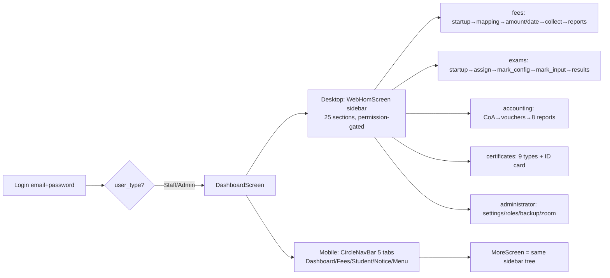
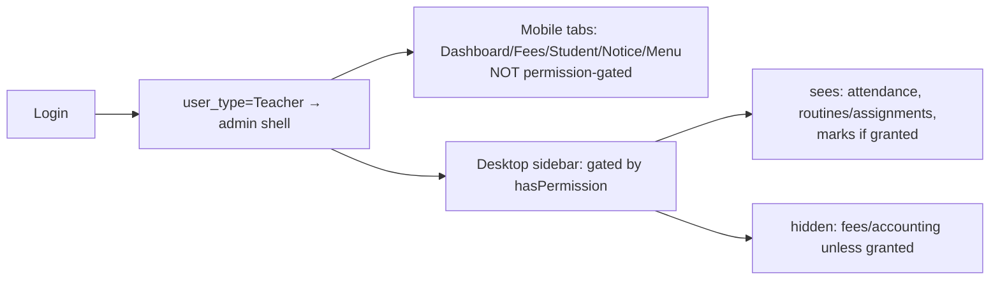
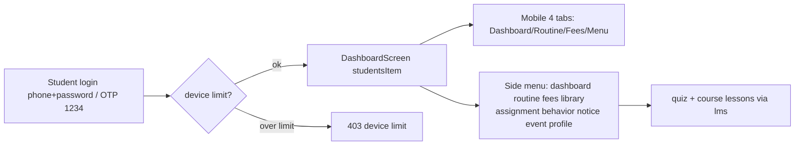
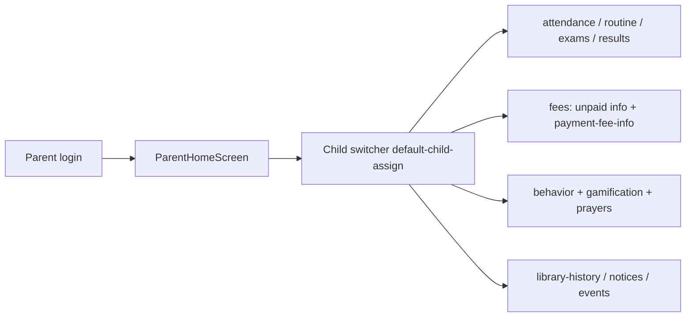

# Mighty School Pro v1.6 — Deep UX + Backend Audit

- **Audited**: 2026-09-13 (deep-ux pass; supersedes `docs/competitor-audits/mighty-school-pro-v1.6.md`)
- **Product**: Mighty School Pro v1.6 (Codecanyon 57385565, FueDevs LTD) — "School Management System ERP Multibranch SaaS All-in-One"
- **Boot status**: static-only (no seeded DB / no .env; all evidence is static code at file:line, or vendor assets)
- **Sources audited** (absolute, under `/home/bishal-regmi/Desktop/ASchool/Other Projects/Mighty School Pro v1.6/Mighty School Pro v1.6/codecanyon-57385565-mighty-school-pro-school-management-system-erp-multibranch-saas-all-in-one/`):
  - **MSP-API** = `install-api-code-v1.6_extracted/` — Laravel 11 + `nwidart/laravel-modules ^11.1`, 19 modules (verified by `ls Modules/`), ships `demo.sql`
  - **MSP-UPD** = `updated-api-code-v1.6_extracted/` — update package; see §2.4 delta
  - **MSP-FL** = `web-app-desktop-code-v1.6_extracted/web-app-desktop-code-v1.6/` — ONE Flutter (GetX) app for android/ios/web/linux/macos/windows
- **Path abbreviations below**: `MSP-API/...` and `MSP-FL/...` prefixes stand for the absolute paths above.
- **Method**: every claim re-verified at source this pass (the 586-line prior draft at `docs/competitor-audits/mighty-school-pro-v1.6.md` was treated as leads, never fact — see the verification ledger at the end). UI/UX claims cite Flutter/Dart file:line; backend claims cite the full route → controller → DB → side-effect chain.

---

## 1. Executive Summary

**What it is**: Laravel 11 + `nwidart/laravel-modules` JSON API (19 modules, 456 API routes, 211 tables, MySQL) + ONE Flutter/GetX app (1,858 dart files, 197 routes, 299 screens) that is simultaneously the public marketing site, super-admin SaaS console, admin panel, teacher/student/parent portals — compiled for android/ios/web/linux/macos/windows. The closest architectural competitor to ASchool (one app for every role vs ASchool's five role apps + Next.js web).

**The headline corrections vs the inherited draft** (ledger at the end): the SaaS layer is even thinner than believed — `CheckSubscription` middleware is **dead code** (aliased, mounted on zero routes), so plan quotas/expiry are enforced **nowhere** at runtime; the v1.6 "update" package is **byte-identical** to the install package (a full Modules/+app/ re-ship, not a patch set); SMS balance is never deducted and only 2 of the "14" gateways actually send; notices have no per-user read state and **cannot target a class**; e-learning course management is commented out of the menu entirely.

**Where it is genuinely strong** (§10): the fees engine (first-class installments with payable windows, FIFO partial-payment allocation across sub-heads, waiver catalog, three period-based fine types, unpaid drill-down reports), a real chart of accounts + 11 statement endpoints (ASchool has no GL), the salary advance/due/return lifecycle, the exam mark-component model with dynamic input columns, a 15-dimension question-bank provenance taxonomy with a rich quiz runtime, 9 printable certificate types + ID cards + QR student pages, a student promotion/cross-branch migration engine, and login-enforced device control for paid content.

**Where it is dangerous** (§11, 35 numbered findings): `system:reset` scheduled **every minute** runs `migrate:fresh` on the live DB; staff login is a global unscoped email lookup on a **non-unique, unindexed** `users.email`; student OTP login is hardcoded **'1234' and the OTP is returned in the response**; the fee-collection money path runs with its **DB transaction commented out**; branch update/delete and gateway-credential updates are cross-tenant IDORs; `changeBranch` rewrites the caller's branch with no ownership check; onboarding provisions the trial subscription to **institute 1** and binds the new admin to another tenant's role; composed SMS never send (scheduler commented, failure-blind job); the payment "hook" mechanism is broken three ways so **no payment side effect ever executes**. Plus the whole product defaults to Bangladesh (Asia/Dhaka, USD/$, EIIN, bKash/SSLCommerz, bn locale, prayers) — Nepal relevance ~zero.

**One-app-vs-five verdict** (§12.3): one codebase demonstrably ships all roles to six platforms with a simple mechanism (role from `/user` → 3 nav sets + permission-keyed sidebar + desktop-sidebar/mobile-bottomnav switch). But it concentrates navigation in two ~1,000-line god-files, ships every screen to every role (routes are client-navigable; mobile tabs aren't permission-gated, so teachers get admin tabs), caps portal depth (student reuses the parent's fees screen), and erases per-role UX identity. ASchool should keep its five-app + shared-package architecture and steal only the three centralizing wins: the central API client/interceptor pattern, permission-name = menu-key data-driven gating, and role-conditional widgets for genuinely overlapping portal screens.

**Six task benchmarks** (§8): attendance 1 screen/~7 clicks/5 fields (Late un-enterable, roster period-1 only); fee receipt 2 screens/9-13 clicks/7-9 fields (no transaction, no in-app PDF); notice 1 screen/4-6 clicks/3-4 fields (**class targeting absent, no push/SMS fanout**); report card 1+print/5-6 clicks/3-4 fields (4-step setup, placeholder-grey PDF template, unscoped results API); enroll student 1 screen/11+ clicks/17 fields (shared default password 12345678 printed in the form); create+assign exam 2 screens/8-10 clicks/2-4 fields (one-field exam, dead serial field, 100-mark cap).

## 2. Stack & Architecture Shape (incl. install-vs-updated API delta)

### 2.1 Backend stack (verified from `MSP-API/composer.json`)

- **Framework**: Laravel 11 skeleton (`"laravel/framework": "^11.9"`), PHP `^8.2`, Laravel 11-style `bootstrap/app.php` middleware configuration (no `Kernel.php` HTTP kernel — but see the console `Kernel.php` below, which Laravel 11 still loads for scheduling).
- **Modularity**: `nwidart/laravel-modules ^11.1` with `"Modules\\": "Modules/"` PSR-4 and a composer merge-plugin pulling in `Modules/*/composer.json` (`composer.json` "extra.merge-plugin.include", lines under `extra`). Module enablement lives in `modules_statuses.json` — all 19 modules `true` (file read this pass; 19 entries, listed in §2.2).
- **Auth**: `laravel/passport ^12.0` (API guard `driver => 'passport'`, `config/auth.php:47`) plus `laravel/sanctum ^4.0` present but used on exactly one route (`Modules/Authentication/routes/api.php:21`, a `/user` test route). Personal access tokens expire after 1 month (`app/Providers/AppServiceProvider.php:37`, `Passport::personalAccessTokensExpireIn(now()->addMonths(1))`).
- **Permissions**: `spatie/laravel-permission ^6.9`; 166 seeded `domain.action`-named permissions (`Modules/Authentication/database/seeders/PermissionSeeder.php`, count re-verified by grep this pass: 166 `Permission::create` blocks).
- **Payments**: `stripe/stripe-php ^16.6`, `razorpay/razorpay 2.*`, `mercadopago/dx-php 3.2.0`, `unicodeveloper/laravel-paystack ^1.2` (the other ~10 gateways are hand-rolled HTTP calls — §4.8).
- **Other**: `maatwebsite/excel ^3.1` + `phpoffice/phpspreadsheet` (bulk imports), `intervention/image ^2`, `simplesoftwareio/simple-qrcode ^4.2` + `picqer/php-barcode-generator` (QR/barcode ID cards), `yajra/laravel-datatables ^11.0` (but the Flutter UI doesn't consume DataTables — it paginates client-side), `madnest/madzipper` (update-package upload in `/upgrade` route), `twilio/sdk ^8.3`, `jenssegers/agent` (device detection), `realrashid/sweet-alert` (a Blade-era leftover in an API-only app).
- **DB**: MySQL (raw `SHOW TABLES` in `MSP-API/Modules/SystemConfiguration/app/Http/Controllers/API/UtilityController.php`, and `demo.sql` dump syntax). No Redis, no queue database table, no search index, no vector store.

### 2.2 The 19 nwidart modules (verified by `ls MSP-API/Modules/`)

`Academic, Accounting, Authentication, Elearning, Examination, Finance, Frontend, Gateways, Hostel, LayoutCert, Library, ParentModule, Payroll, QuestionBank, SMS, Student, SystemConfiguration, Teacher, Transport` — **19 modules, not 20** (both the task brief and `RECON_MAP.md §2` say 20; the on-disk `ls` and `modules_statuses.json` show 19; the prior draft consistently said 19. Correction recorded in the ledger.)

Per-module API/web route counts (re-verified this pass, `grep -c "Route::" Modules/*/routes/{api,web}.php`):

| Module | API routes | Web routes | Controllers | Models |
|---|---|---|---|---|
| Academic | 65 | 0 | 32 | 45 |
| Student | 49 | 0 | 5 | 2 |
| Authentication | 47 | 0 | 16 | 13 |
| Elearning | 39 | 0 | 13 | 14 |
| Frontend | 32 | 0 | 10 | 14 |
| Finance | 31 | 0 | 10 | 14 |
| Accounting | 31 | 0 | 6 | 8 |
| ParentModule | 28 | 0 | 2 | 2 |
| QuestionBank | 23 | 0 | 21 | 21 |
| Examination | 21 | 0 | 3 | 11 |
| Payroll | 21 | 0 | 3 | 9 |
| Teacher | 17 | 0 | 6 | 5 |
| SystemConfiguration | 10 | 0 | 2 | 2 |
| Hostel | 10 | 0 | 9 | 9 |
| SMS | 9 | 0 | 5 | 5 |
| Gateways | 8 | 55 | 15 | 1 |
| Library | 7 | 23 | 3 | 4 |
| Transport | 6 | 0 | 5 | 5 |
| LayoutCert | 2 | 0 | 1 | 2 |
| **Total** | **456** | **78** | **172** | **185** |

(Plus root `routes/api.php` = 8 route lines (6 language + 1 health, `routes/api.php:8-28`) and `routes/web.php` = 20 route lines — installer wizard, `/upgrade`, `/saas-landing-page`, `/student-vital/{encodedData}`, 3 card-print lists, gateway host pages.)

### 2.3 Module anatomy and registration chain (one module read end-to-end)

Anatomy of `Modules/Academic/` (representative; verified by `find -maxdepth 3`):
`module.json` (name/alias/providers — `Modules/Academic/module.json`: name "Academic", alias "academic", provider `Modules\Academic\Providers\AcademicServiceProvider`, `priority: 0`, no files) + `app/Http/Controllers/{API,WEB}/` + `app/Http/Requests/` + `app/Models/` + `app/Providers/` + `config/` + `database/{factories,migrations,seeders}/` + `Repositories/` + `Services/` + `resources/{assets,views}/` + `routes/{api,web}.php` + `tests/{Feature,Unit}/`.

Registration chain (all hops verified):
1. `modules_statuses.json` marks the module enabled → nwidart activates it.
2. `AcademicServiceProvider::register()` registers `EventServiceProvider` + `RouteServiceProvider` (`Modules/Academic/app/Providers/AcademicServiceProvider.php:34-38`); `boot()` loads migrations from the module dir and registers config/views/translations (`AcademicServiceProvider.php:20-29`).
3. `RouteServiceProvider::mapApiRoutes()` mounts `routes/api.php` under `Route::middleware('api')->prefix('api')->name('api.')` (`Modules/Academic/app/Providers/RouteServiceProvider.php:47-50`). Every module repeats this pattern — meaning **there is no central route file for the API surface**; the 456 routes live in 19 per-module files, each grouping its own `auth:api` middleware.
4. Route files then self-apply auth + role middleware per group, e.g. `Modules/Student/routes/api.php:11` (`['student', 'auth:api']`) vs `:54` (`['auth:api']`), `Modules/ParentModule/routes/api.php:12` (`['parent', 'auth:api']` prefixed `parent`), `Modules/Teacher/routes/api.php:11` (`['teacher', 'auth:api']`).

**Role middleware are free-text checks, not Spatie roles.** `app/Http/Middleware/Student.php:19-23` gates the entire student portal on `auth()->user()->user_type != 'Student'` — a free-text column set at user-creation time, parallel to (and independent of) the Spatie `role_id` used for admin menu permissions. `Teacher.php` and `ParentModelClass.php` follow the same pattern (read this pass; same file shape). Consequences:
- The "role" that gates data access (`user_type`) and the "role" that gates admin UI (`Spatie role → permissions`) can disagree; a user with `user_type='Student'` and an admin Spatie role would get both surfaces.
- Any new role string must be spelled identically in three places (middleware checks, seeder defaults, provisioning code).

### 2.4 install-vs-updated API delta (verified by `diff -rq` + md5 spot checks)

**Finding: the v1.6 "update" package is a byte-identical subset of the install package.**

- `updated-api-code-v1.6_extracted/` contains exactly two top-level dirs: `Modules/` (all 19 modules) and `app/` (the shared kernel: Traits, Jobs, Mail, Helpers, Enums, Console, Providers, etc.) — 1,470 files total (`find -type f | wc -l`).
- `diff -rq install-api-code-v1.6_extracted/Modules updated-api-code-v1.6_extracted/Modules` → **zero differences**; same for `app/` → **zero differences**. All 1,470 update files exist at identical paths in the install package (comm check: 0 files only-in-updated, 0 only-in-install under `Modules/`+`app/`), and 10/10 sampled md5sums match (e.g. `Modules/Academic/Repositories/AcademicYearRepository.php`).
- The vendor's `Note For Update whi already install version-1.5.txt` (read this pass) says: replace files, then **run `php artisan migrate` manually** ("This process will create new tables, add new columns...").
- The install package additionally ships everything else: `composer.json/lock`, `config/`, `routes/`, `database/` (incl. seeders), `lang/`, `public/`, `resources/` (installer Blade views), `vendor/` (committed!), `demo.sql`, `package.json`, tests.
- **Update-package composition** (1,470 files by module): Academic 205, QuestionBank 160, Authentication 119, Elearning 104, Frontend 102, Finance 84, Accounting 69, Payroll 60, Gateways 56, Transport 55, Teacher 55, Examination 55, Hostel 52, SMS 49, Library 41 (+ the remaining ~183 files are the shared `app/` kernel: Traits, Jobs, Mail, Helpers, Enums, Console, Providers). Academic + QuestionBank together are 25% of the product — the two modules most churned.

**What the delta says about the vendor's patch process** (evidence-based inference, labeled as such):
1. Updates are **full-directory replacements** of `Modules/` + `app/` — no patch/diff files, no per-version changelog in-package, no upgrade script beyond "run migrate". Any buyer customization in those two trees (i.e. effectively anywhere except `config/`, `routes/`, `lang/`, `resources/`) is destroyed on upgrade.
2. Because v1.5→v1.6 shipped the *entire* `Modules/` + `app/` trees, the vendor does not maintain per-file patch discipline; the update zip is a convenience re-ship. (For an already-on-v1.6 buyer the package is redundant — byte-identical.)
3. Schema changes ride in module migration files dated after v1.5 (e.g. `2025_04_*` migrations in QuestionBank, `2025_04_05_043108_create_plans_table.php` in Authentication) — normal Laravel dating, but with **no migration-down tests or seed-compatibility notes** shipped.
4. `demo.sql` (52 MB package, sits in web root of install tree) is the vendor's other "migration" mechanism — a full database snapshot; there is no documented path from demo.sql to a clean production tenant.

### 2.5 Scheduler and queues — the `system:reset` time bomb (verified)

- `MSP-API/app/Console/Kernel.php:26-31`: `schedule()` contains exactly one active line — `$schedule->command('system:reset')->everyMinute();` (line 30). The commented alternative is `dailyAt('02:00')` (line 29), and the SMS log processor is also commented out (line 28). **In any deployment where `php artisan schedule:work/run` is active (a standard Laravel deployment assumption), the production database is wiped and reseeded every minute.**
- `app/Console/Commands/ResetSystemData.php:18-82` (read in full this pass): `Artisan::call('migrate:fresh', ['--force' => true])` (line 24) → `db:seed --force` (line 33) → `module:seed` per enabled module (lines 41-50) → inserts a fresh Passport personal-access client into `oauth_clients` with a random UUID (lines 52-67) → writes the license marker file `storage/mightySchool` (line 77). Besides the wipe itself: every run **invalidates all user tokens** (oauth tables are dropped by `migrate:fresh`), so even demo usage can't hold a session for more than a minute.
- **Queues: none in practice.** `app/Jobs/SendSmsJob.php` exists but its only dispatcher is `app/Console/Commands/ProcessSmsLogs.php:20`, whose scheduler line is the commented-out line in `Kernel.php:28`. SMS sending is otherwise done inline (§4.8). No `queue:` table migration, no Redis config, no Horizon.

### 2.6 SaaS enforcement middleware is DEAD CODE (major correction to prior draft)

- `bootstrap/app.php:5,29` registers the alias `'check.subscription' => CheckSubscription::class` (verified read of `bootstrap/app.php`).
- **Grep across all of `Modules/`, `routes/`, and `app/` finds zero applications of `check.subscription` and zero other references to the `CheckSubscription` class** (only its import/alias and its own definition file). The class itself (`app/Http/Middleware/CheckSubscription.php:19-43`, read in full this pass) would 403 when: no institute, no active subscription, subscription not active, `students()->count() >= plan->student_limit`, or `branches()->count() >= plan->branch_limit` — i.e. two COUNT queries per request and a read-blocking lockout at quota.
- Because it is never mounted, the actual runtime behavior is: **plan quotas and subscription expiry are not enforced anywhere at request time.** Plan `student_limit`/`branch_limit` appear only in Plan CRUD, the Plan model/seeder/migration, and the dead middleware (grep verified: all 10 hits listed in §2.4 evidence trail). `Subscription` is referenced outside the Authentication module only by the public onboarding flow (`Modules/Frontend/app/Http/Controllers/API/FrontendController.php:912-920`, which *creates* a subscription on public apply).
- Login performs no subscription/status check either: `AuthController::login` (`Modules/Authentication/app/Http/Controllers/API/AuthController.php:56-70`) looks up `User::where('email', $request->email)->first()` — a **global, cross-tenant, unscoped query** — checks the password hash, and issues a Passport token. A `status => 0` (disabled) user, or a user of an expired/unsubscribed institute, logs in successfully. The prior draft's tenant-lockout-at-expiry narrative (§2.3/2.4 of the old file) is therefore **wrong in mechanism**: expired tenants are not locked out — they are never checked at all.

### 2.7 Response envelope and error shape

All API controllers extend `App\Http\Controllers\Controller` and use `ResponseTrait` (`app/Traits/ResponseTrait.php`) with `responseSuccess($data, $message)` / `responseError($data, $message, $code)`; messages pass through `_lang()` JSON translation lookup (`app/Helpers/general.php`, locales `lang/en.json` + `lang/bn.json` — 2 locales only). Frontend Flutter code branches on the `success` boolean key of this envelope (e.g. `MSP-FL/lib/api_handle/api_client.dart` error mapper, §6.1).

### 2.8 Flutter app dependency inventory (verified from `MSP-FL/pubspec.yaml`)

- **State/nav**: `get ^4.6.6` (GetX everywhere), `http ^1.2.2`, `shared_preferences`, `connectivity_plus`, `url_strategy` (clean web URLs).
- **UI system**: `syncfusion_flutter_charts/calendar/pdfviewer ^28.2.11` (dashboard charts, calendar, PDF viewer), `flutter_svg`, `cached_network_image`, `shimmer` (skeletons), `flutter_staggered_grid_view` + `responsive_grid` (the masonry forms), `table_calendar`, `carousel_slider`, `marquee`, `popover`, `dropdown_button2`, `hidable` (auto-hiding bars), `web_smooth_scroll` (desktop scroll), `dotted_border/line`, `percent_indicator`, `font_awesome_flutter`, `toastification` + `fluttertoast`.
- **Documents/print**: `pdf ^3.11.3` + `printing ^5.14.2` (client-side report cards, certificates, payslips), `pdfx` (viewer), `flutter_html`, `flutter_widget_from_html_core`, `html_editor_enhanced` (rich content in courses/notice).
- **Media/scan**: `mobile_scanner ^7.1.3` (QR attendance), `vdocipher_flutter` + `youtube_player_flutter/_iframe` + `video_player`+`chewie` (course content DRM/providers), `image_picker`, `file_picker`, `flutter_image_compress`, `open_file`.
- **AI**: `chat_gpt_sdk ^3.1.5` + `flutter_markdown` (the single chat screen).
- **Web plumbing**: `universal_html` (window.location in web contexts), `flutter_inappwebview` + `webview_flutter` (gateway host pages, external content), `url_launcher`.
- **NOT present** (notable negatives): no `firebase_messaging`/local-notifications (no push anywhere), no offline/persistence layer beyond shared_preferences, no i18n package beyond GetX `.tr`, no analytics/crash reporting. **Tests: `test/` contains exactly 1 file — the untouched Flutter counter-template smoke test** (`widget_test.dart` references a MyApp counter that doesn't exist in the app) — zero real tests for 1,858 source files.

### 2.9 One Flutter app for everything — the shape (details in §5-§7)

The entire user-facing product — public marketing site, super-admin SaaS console, tenant admin panel, teacher portal, student portal, parent portal, chat — is ONE Flutter/GetX codebase (`MSP-FL/lib/`, 1,858 dart files, 197 registered routes) compiled to android/ios/web/linux/macos/windows (platform folders + `vercel.json` + `firebase.json` present). Laravel renders only the installer wizard, gateway host/callback pages, print card lists, and `/saas-landing-page` (root `routes/web.php`, 20 routes). This is the inverse of ASchool (Next.js web + 5 role-specific Flutter apps) and the single most consequential architectural difference in this audit — see §7 and §12.3 for the verdict.

## 3. Data Model (tables/models, relationships, branch/tenancy design, notable issues)

### 3.1 Census

- **201 migration files** (197 in `Modules/*/database/migrations/` + root `database/migrations/`), producing **211 tables** in the shipped `demo.sql` (`grep -c "CREATE TABLE" demo.sql`). Per-module migration counts: Academic 42, Authentication 22, QuestionBank 29, Elearning 16, Finance 15, Frontend 14, Examination 11, Accounting 7, Payroll 9, Hostel 9, Teacher 5, SMS 5, Transport 5, Library 4, Student 2, ParentModule 1, Gateways 1, LayoutCert 0, SystemConfiguration 0 (all counts by `ls Modules/*/database/migrations/*.php`).
- **185 Eloquent models** (`find Modules app -path "*Models*"`), so ~26 tables have no model (Laravel defaults like `cache`, `sessions`, `jobs`, `oauth_*`, plus pure-pivot tables).
- **448 FOREIGN KEY constraints** and only **30 UNIQUE keys** (demo.sql grep) — referential shape is present, business uniqueness is mostly absent (see §3.9).

### 3.2 Tenancy spine — `institutes`, `branches`, `settings`, `users`

All definitions read from `demo.sql` CREATE TABLE blocks this pass:

- **`institutes`**: `owner_id, assigned_to, name, email, address, institute_type, phone, domain, logo, platform enum('WEB','APP') default 'APP', status smallint default 1 (1=Active,2=InActive), theme_id`, soft deletes, audit columns (`created_by/updated_by/deleted_by`). The tenant IS this row. `domain` is the public-site hostname (used by `X-Domain` header resolution); `theme_id` selects the public CMS theme. Model: `Modules/Authentication/app/Models/Institute.php` — note its `$fillable` includes `institute_id` and `branch_id` (lines 19-20) which **do not exist as columns on `institutes`** — a copy-paste artifact; relations: `students()`/`branches()` hasMany (lines 69-80), `activeSubscription()` = latest `status='active' AND end_date >= today` (lines 101-108).
- **`branches`**: `institute_id, name, status, created_at, updated_at` — **that is the entire branch entity**. No address, no code, no branch admin, no per-branch branding, no soft deletes. Confirms the prior draft: a branch is a label, not an administrative unit.
- **`settings`**: `institute_id, branch_id (nullable), name, value (longtext), payment_info, sms_info, type, mode, status` — the nullable `branch_id` is the only mechanism for branch-level overrides of institute defaults (e.g. `academic_year` per branch). Seed row verified: `(1, 1, 'school_name', 'Demo Collage', ...)` — the vendor's default tenant name is a typo of "College".
- **`users`**: `institute_id, branch_id, name, username, email, password, phone, image, role_id, user_type, status, platform, device_info, last_active_time, nid, facebook/twitter/linkedin/google_plus`, soft deletes. **Two parallel role systems**: `role_id` (FK to Spatie `roles`, used for admin permission gating) and free-text `user_type` (used by the `student`/`teacher`/`parent` middleware, §2.3).
- **SaaS tables**: `plans (name, description, student_limit, branch_limit, price decimal(8,2), duration_days, is_custom, is_free, status)`, `subscriptions (institute_id, plan_id, start_date, end_date, status enum(active,expired,cancelled), invoice_details JSON)`, `subscription_items (amount_paid, ...)`, `subscription_upgrade_requests (amount_paid, status enum(pending,...))`, `onboardings (status enum(pending,...), collected_data JSON)` (public apply funnel), `s_a_a_s_subscriptions` (email capture only), `s_a_a_s_faqs`, `s_a_a_s_settings`, `institute_image_s_a_a_s_settings` (ugly name straight out of a migration naming default). Seeded plans (demo.sql): id 1 = "Trail" (sic — typo of "Trial"), 50 students, 2 branches, price 0.00, 14 days, is_free=1. Seeded subscription: `(id 1, institute_id 1, plan_id 3, 2026-03-30 → 2027-03-30, active, invoice_details JSON blob "INV-81DEVP" "Auto-generated in seeder")`.

### 3.3 Scoping pattern and its absence

- **152 of 211 tables carry `institute_id`; 128 also carry `branch_id`** (python scan of demo.sql CREATE bodies). No table has `branch_id` without `institute_id`.
- **Zero Eloquent global scopes** (`grep -rn "addGlobalScope"` across `Modules/ app/` = 0 hits). Every query is hand-scoped with `->where('institute_id', get_institute_id())` where the developer remembered. `get_institute_id()` = `auth()->user()->institute_id` and `get_branch_id()` = `auth()->user()->branch_id` (`app/Helpers/general.php:20,28`).
- **Tenant resolution for anonymous/public surfaces** is the `X-Domain` HTTP header (browser host → `institutes.domain`): `app/Helpers/InstituteHelper.php::getInstituteIdByDomain`, consumed by `Modules/Student/.../StudentAuthController.php` (student OTP login) and `Modules/Frontend/.../FrontendController.php:727` (public CMS). There is no host-based middleware — the header is trusted from the client.
- **Tables with neither tenancy column** (scan, grouped): all QuestionBank taxonomy tables (see §3.7 — a shared bank), `plans`, `subscription_items`, `feedback`, `student_devices`, `fee_map_fee_sub_head`, `fee_map_fund`, `payroll_accounting_mappings`, `lms_class_routine_days`, `institute_image_s_a_a_s_settings`. `payroll_accounting_mappings` being unscoped is the root of the cross-tenant GL posting bug (§11, W-14).
- **Staff login is globally scoped**: `User::where('email', ...)->first()` with no institute filter (`AuthController.php:58`), and **`users.email` has no unique constraint and not even an index** (demo.sql: `ALTER TABLE users ADD PRIMARY KEY (id), ADD KEY users_phone_index (phone)` — that is all). Two tenants can create the same email; login then resolves to whichever row `first()` returns. This is a structural cross-tenant account-confusion defect, not just a missing index.

### 3.4 Academic spine

- `academic_years` → `classes (institute_id, branch_id, class_name, status)` → `sections` → `student_groups` / `student_categories` / `shifts` / `periods` / `departments` / `subjects` (+`subject_configs`, `assign_subjects`, `assign_shifts`, `class_assigns`, `class_days`).
- **`student_sessions`**: `session_id, student_id, class_id, section_id, roll varchar(15), qr_code, optional_subject` — a student's academic-year placement row; UNIQUE(`session_id, student_id, class_id, section_id, roll`) (demo.sql ALTER). All attendance/exam/fee queries join through this.
- **`students`**: 40+ columns incl. Bangladesh-flavored fields: `nationality default 'Bangladeshi'`, `birth_certificate_no`, `nid_no`, `ethnic`, `religion`, `blood_group`; admission funnel fields (`application_number`, `date_of_admission`, `admission_place`, `tc_date`); guardian block (`father_name`, `mother_name`, `parent_id`, `information_sent_to_name/relation/phone/address` — a second emergency-contact set); `access_key` (public QR page). Each student requires a `user_id` (portal login account).
- **`parent_models`** (Spatie-unfriendly table name from `Parent` model): `user_id, student_id, parent_name, parent_profession, parent_phone, present/permanent_address, access_key, status` — a parent row links to ONE student; multi-child parents get multiple rows (the `default-child-assign` endpoint exists to pick which child the portal shows).
- **Attendance**: `student_attendances (institute_id, branch_id, student_id, class_id, section_id, period_id, subject_id nullable, date, attendance tinyint default 2, soft deletes)` — one row per student×period×date. Semantics from the controller (§4.2): 0=absent, 1=present, 2=unmarked/late-matrix default. `staff_attendances` mirrors it for staff. UNIQUE keys exist (`unique_user_attendance_date`, `student_unique_attendance`).
- **Migration machinery**: `student_migrations` + `student_sessions` support session promotion/pushback and cross-branch moves (`Modules/Academic/app/Models/StudentMigration.php`).
- **Custom fields**: `custom_fields` + `custom_field_values` — per-institute dynamic student attributes without migrations.

### 3.5 Fees / accounting / payroll families (schema verified in migrations + demo.sql)

- **Fees**: `fee_heads` → `fee_sub_heads` (installments); `fee_maps` (+ `fee_map_fee_sub_head`, `fee_map_fund` pivots) attach heads to classes AND to GL ledgers/funds; `fees` = the 5-dimensional price row (class×section×session×category×head, with `fee_amount`, `fine_amount`, `fund_id`); `fee_date_configs` = per-sub-head payable windows; collection side = `student_collections` (header with `invoice_id UNIQUE` (demo.sql unique key `student_collections_invoice_id_unique` — so the unscoped invoice-generation race fails as an IntegrityException rather than duplicating invoices; nuance vs prior draft), `tc_amount`, 3 fine columns, totals, `ledger_id`/`receive_ledger_id`/`fund_id`) → `student_collection_details` (per fee head) → `student_collection_details_sub_heads` (per installment, FIFO-allocated). Waivers: `waivers` (catalog) + `student_waiver_configs` (student×head amount) + `attendance_waivers` (fine-type waivers). Fines: `attendance_fines` rows + `absent_fines` (a second, legacy fine table — both exist in the schema).
- **Accounting** (migrations re-read this pass): `accounting_categories (name, code, type, nature)` → `accounting_groups (accounting_category_id nullable, name)` → `accounting_ledgers (ledger_name, category_id, group_id, balance decimal(10,2) STORED, type enum(payment,default))` (`..._create_accounting_ledgers_table.php:21-22`); `accounting_funds (serial, name, cash_in, cash_out, balance)`; `account_transactions (voucher_id nullable int, category_id, fund_id, fund_to_id, payment_method_id(+_to), transaction_date, type enum('payment','receipt','contra','fund_transfer','journal'), reference, description, created_by)` (`..._create_account_transactions_table.php:18,25`); `account_transaction_details (account_transactions_id, ledger_id, fund_id(+_to), payment_method_id(+_to), transaction_date, debit decimal(10,2), credit decimal(10,2))` — **no CHECK constraint, no balanced-entry enforcement** (details migration lines 25-26 are the last word). Seed scoping verified: `accounting_categories` INSERT starts `(1, 1, 1, 'Cash & Cash Equivalence', ...)` — hardcoded institute 1/branch 1 (see §11 W-15).
- **Payroll**: `salary_heads (name, type Addition|Deduction)` → `salary_head_user_payrolls` (per-staff amounts) → `user_payrolls (user_id UNIQUE, net_salary, current_due, current_advance)` → monthly `payslip_salaries` + `payslip_salary_heads` (snapshot) → `payments (user_id, year, month, amount, type enum('salary','due','advanced','advanced_return'), payment_method_id, paid_by)`; `payslip_invoices`; `payroll_accounting_mappings` — **a single global row mapping payroll→ledger/fund** (unscoped; §11 W-14). `payment_methods` shared with finance.
- **Exams**: `exams` (tenant-scoped, has a `unique_combination` unique key) → `class_exams (class_id, exam_id, merit_process_type_id)`; `short_codes (short_code_title, total_mark, accept_percent, pass_mark)`; `mark_config_exam_codes (subject_id, title, total_marks default 100, pass_mark default 33, acceptance, UNIQUE(title, subject_id))` → `mark_configs (class_id, group_id, subject_id, exam_id, mark_config_exam_code_id)`; `grades (grade_name, grade_point, grade_range, number_low/high, point_low/high, priority, session_id)` + `exam_grades` (per-class copy); `remark_configs`, `merit_process_types`, `grand_final_class_exams (class_id, exam_id, percentage, serial_no)`; `exam_marks (student_id, class_id, group_id, subject_id, exam_id, mark1..mark6, total_marks, grade_point, grade)` — **six fixed mark columns** for up to six mark components. Plus `exam_attendances`, `exam_schedules`, `result_cards`, `exam_codes`.

### 3.6 Elearning / LMS family

- `course_categories` (+sub via parent), `courses`, `chapters` (reorderable), `contents` (UNIQUE(chapter_id, type, type_id)), `lessons`, `enrollments` (UNIQUE(course_id, user_id)), `content_visibility` (per-class gating), `course_faqs`, `course_features`, `course_rooms`, `class_days`/`lms_days`, `class_lessons`, `lms_class_routines`(+`lms_class_routine_days`), `lms_assignments` + `lms_assignment_results`, `zoom_meetings` AND `lms_zoom_meetings` (two zoom tables — one used by Academic's `ZoomController`, one by Elearning), `device_controls` + `student_devices` (per-student device allow-list for content playback), quizzes family (§3.7).
- Note the `lms_` prefix duplication: `assignments` (Academic homework) vs `lms_assignments` (course assignments); `class_routines` (Academic) vs `lms_class_routines`; `zoom_meetings` vs `lms_zoom_meetings`. Two generations of schema coexist.

### 3.7 QuestionBank — 15-dimension taxonomy, globally shared (verified)

Migration list read this pass (`Modules/QuestionBank/database/migrations/2025_04_20_*`): `question_bank_boards, _classes, _groups, _subjects, _chapters, _topics, _levels, _difficulty_levels, _sources, _sub_sources, _tags, _types, _years, _sessions, _tests` + pivots `question_test, question_type, question_level, question_topic, question_source, question_sub_source, question_tag, question_session` + `questions` (`question_year` JSON) + `question_categories`. **None of these tables carry `institute_id`** (demo.sql column scan) — the taxonomy is one global shared dimension set across all tenants; `questions.institute_id` is nullable. Consequence: any tenant's created board/source/topic labels are visible/selectable to every other tenant (cross-tenant data mingling in the picker UIs), and two tenants naming a class "Ten" collide on the same shared row.

### 3.8 Small modules and oddities

- **Hostel**: `hostels, hostel_categories, rooms, room_members, hostel_members, meals, meal_plans, meal_entries, hostel_bills` (9 tables).
- **Transport**: `buses, bus_routes, bus_stops, drivers, transport_members` (5 tables; no GPS/live tracking anywhere — grep confirmed).
- **Library**: `book_categories, books, book_issues, library_members, library_fines`.
- **SMS**: `sms_templates (short-codes), phone_books, phone_book_categories, sms_balances, sms_purchases, sms_logs`.
- **`prayers`** (`institute_id, branch_id, title, session_id, user_id, user_type, date, note, file`) — a daily-prayer/religious-activity log; model `Modules/Teacher/app/Models/Prayer.php`, exposed in Parent/Student/Teacher portals (`Modules/ParentModule/routes/api.php`, `Modules/Student/routes/api.php`). A madrasa/Islamic-school feature — a strong signal of the vendor's home market (Bangladesh) and absent from ASchool.
- **`behaviors` + `gamifications`** — student conduct points and game points, both models in `Modules/Teacher/app/Models/` with services `Services/Behavior/BehaviorService.php`, `Services/Gamification/GamificationService.php`; consumed by student/parent dashboards.
- **`user_notices`** — per-user notice read state. **`otp_verifications`** — student OTP login. **`user_logs`** — activity log (write side in `Trackable` trait). **`feedback`** — unscoped tenant feedback table. **`absent_fines` vs `attendance_fines`** — two fine tables, the former legacy.
- **Frontend CMS**: `banners, about_us, why_choose_us, testimonials, faq_questions, policies, pages, academic_images, mobile_app_sections, our_histories, ready_to_join_us, frontend_contacts, contacts, events, themes` — the tenant public website as ~15 content tables.

### 3.9 Notable data-model issues (each verified)

1. **`users.email` not unique/not indexed** while login is a global email lookup (§3.3) — cross-tenant account confusion is structurally possible. Evidence: demo.sql `ALTER TABLE users ADD PRIMARY KEY (id), ADD KEY users_phone_index (phone)`.
2. **16 of 30 unique keys are named `unique_combination`** (Laravel's default name; demo.sql grep) — including on `accounting_categories, accounting_funds, accounting_groups, accounting_ledgers, fee_heads, fee_sub_heads, exams, periods, student_sessions, waivers, pages, departments` — impossible to reason about from key names alone, and some may be colliding-composite mistakes.
3. **Two parallel role systems** (`role_id` + `user_type`) with no consistency constraint (§3.2).
4. **Cross-module FK spaghetti**: `User` (Authentication) hasOne `Academic\Models\Student`, `Academic\Models\Teacher`, `Payroll\Models\UserPayroll` (`Modules/Authentication/app/Models/User.php:11-13,95-118`); Academic module hosts `LibraryMember`, `DeviceControl`, `SmsLog`, `Signature` models; Payroll owns `Payment` for salary; the nwidart module boundaries are cosmetic around one shared schema.
5. **`questions` + entire taxonomy global** (§3.7).
6. **`exam_marks.mark1..mark6`** fixed columns cap mark components at 6 per subject-exam; no `total_marks` cross-check against `mark_config_exam_codes.total_marks` at DB level.
7. **Stored balances** (`accounting_ledgers.balance`, `accounting_funds.balance/cash_in/cash_out`) coexist with computed SUMs over journal lines — two sources of truth that diverge (mechanics in §4.4).
8. **Branch = 3 columns** (§3.2) — no branch entity beyond a name+status; "multibranch" reporting must hand-roll `GROUP BY branch_id` per report (and most reports don't — §4.4).

## 4. Backend Flow Traces

Every trace below was followed hop-by-hop in source this pass. Format: route → controller → DB writes → side effects → response, with file:line for each hop. Untraceable hops are called out.

### 4.0 Staff login (the role switch happens entirely client-side)

- **Route**: `POST /api/login` → `AuthController@login` (`Modules/Authentication/routes/api.php` auth group; controller `Modules/Authentication/app/Http/Controllers/API/AuthController.php:56-70`).
- **Flow**: `User::where('email', $request->email)->first()` (line 58) — **global, cross-tenant, no status check** → `Hash::check` (line 60) → `$user->createToken('app')->accessToken` (line 64, Passport personal access token; expires in 1 month per `app/Providers/AppServiceProvider.php:37`).
- **Side effects**: none (no log, no lockout, no rate limit). **Response**: `{user, access_token}`. `$hidden = ['password','remember_token']` on the model keeps the hash out (`Modules/Authentication/app/Models/User.php:61-64`).
- **Role context fetch**: `GET /api/user` (`AuthController::user`, lines 20-54) returns `role` (Spatie name), `user_type`, `institute_info` (id/name/status + subscription), and `permissions` (array of Spatie permission names, line 26). The Flutter app uses this one payload to decide which of its five shells (admin/teacher/student/parent/landing) to render (§7).
- **Logout**: `POST /api/logout` revokes the token (`AuthController::logout:114-124`).

### 4.1 Attendance — take, QR, delete, report, absent-SMS, fine report

**Take attendance (bulk)**
- **Route**: `POST /api/student-attendance` (`Modules/Academic/routes/api.php:60`) → `APIAttendanceController::studentAttendance` (`Modules/Academic/app/Http/Controllers/API/APIAttendanceController.php:215-294`).
- **Validation** (lines 218-229): `student_ids[] exists:students,id` (unscoped), `class_id/section_id exists`, `period_id nullable exists:periods,id`, `subject_id nullable`, `date required`, `attendance[] in:1,2,3` — **1=Present, 2=Absent, 3=Late** (comment line 227; confirmed by absent query `where('attendance', 2)` at line 107 and fine math §4.1.6).
- **DB** (lines 233-274): transaction begun (line 233); per student `StudentAttendance::updateOrCreate` keyed `(student_id, class_id, section_id, period_id ?? 1, date)` (lines 241-248) with values `subject_id, institute_id, branch_id, attendance` (default **2 = Absent** for missing array entries, line 240). The updateOrCreate key omits institute_id, so the natural key is global — but since student_id is a global PK the practical cross-tenant risk is writing another tenant's student into your attendance (unvalidated `exists:` at line 220 allows foreign ids).
- **Side effects**: if `sms_status == 1` and student absent → `SmsLog::create(status=0)` (lines 258-272) with a message ending in **hardcoded "Thank you,\nDEMO"** (line 262) — the school's name is NOT substituted here (the bulk-absent endpoint does substitute, line 179). SmsLog rows are only sent by the `sms:process-logs` command, which is never scheduled (§4.8). Activity log via `trackAction` (lines 277-282).
- **Response**: success with the last `$attendance` model (line 286).
- **Bug**: two consecutive `catch (Exception $e)` blocks (lines 287-293) — the first returns "Validation error" 422 **without rolling back** (leaves the transaction open), and the second is unreachable dead code.

**Roster for taking attendance**
- `GET /api/student-attendance` → `getStudentAttendance` (lines 34-77): validates class/section/date; **hardcodes `$period_id = 1`** (line 42) — the roster screen can only ever display period-1 marks; the join left-joins attendance for that period only (lines 60-64). Scoped by session/institute/branch/class/section (lines 65-69). Phone = `information_sent_to_phone ?: phone` (lines 48-54).

**QR self-attendance**
- `POST /api/student-qr-code-attendance` → `studentQrCodeAttendance` (lines 463-507): looks up `StudentSession::where('qr_code', $qrCode)->first()` **globally — no institute scoping** (line 470); if found and no attendance row exists for today (lines 476-478), creates a `StudentAttendance` (present, period 1, today) **attributed to the caller's institute/branch** (lines 486-495). A QR code from tenant A scanned at tenant B marks the student present under tenant B's books. Transaction + rollback present (484, 503).

**Delete attendance**
- `POST|GET /api/student-attendance-delete` → `studentAttendanceDelete` (lines 395-461): `type=delete` bulk-deletes `StudentAttendance::where(class_id, section_id, date, period_id)` **with no institute/branch filter** (lines 419-434) — cross-tenant delete if ids guessed. Same unscoped query for `type=fetch` (lines 452-459). Transaction present.

**Reports**
- `GET /api/reports-student-attendance` → `studentAttendanceReport` (lines 509-575): scoped (lines 531-532, 544-545); supports `from/to/percentage/student_id` filters; computes present/absent counts and ratio per student in PHP; percentage filter drops students below threshold (lines 561-563). Late (3) is excluded from both counts (only 1 and 2 counted, lines 556-557).
- `absentFineReport` (lines 577-687): absent rows where `period_id in [1,2,3]` (line 623); fine = absent-count × `AbsentFine.fee_amount` per period (lines 645-647); **the AbsentFine config lookup runs 3 queries per student inside the groupBy map** (lines 629-642 — N+1); scoped (lines 617-618).
- `studentAttendanceMonthlyReportView` / `studentAttendanceReportStatus` / `staffAttendanceReport` (routes at api.php:64-68) — staff attendance store (`staffAttendance`, lines 296-393) validates per-record `start/end_time H:i`, supports night shifts (`end <= start` → +24h, lines 324-326), `updateOrCreate` keyed `(user_id, date)` (lines 355-359), optional SMS on absent via `sendSmsNotification` (line 372), transaction present.

### 4.2 Notice — create, target, read

- **Route**: `POST /api/notices` (apiResource, `Modules/Academic/routes/api.php:119`) → `APINoticeController::store` (`Modules/Academic/app/Http/Controllers/API/APINoticeController.php:24-60`).
- **Validation** (lines 26-31): `title, notice required; user_type required; image nullable|image|max:2048`. `user_type` arrives as JSON array or array (lines 33-36).
- **DB**: `Notice::create` with institute/branch scoping + `date = now()` + `created_by` (lines 38-48); then **one `UserNotice` row per selected user_type** (lines 50-57) — targeting is by role-type ("Student", "Parent", "Teacher", "Admin"), **NOT by class/section/student**. There is no class-level or audience-picker targeting anywhere in the notices surface (checked: no class_id column on `notices`; no per-class notice route).
- **Side effects**: NONE — no push, no SMS, no email, no queue job. A notice "reaches" users only when they open their notice list. (The prior draft's "per-user read state (`UserNotice.php`)" is **incorrect**: `user_notices` stores targeting rows, not per-user reads — there is no read-tracking.)
- **Response**: success message only.
- **IDOR**: `index()` lists `Notice::paginate()` with **no institute scoping** (line 19) — every tenant's notices in one feed; `show/update/destroy` all `Notice::find($id)` unscoped (lines 64, 80, 111). Cross-tenant notice read/write/delete.
- **Bug**: `update()` (lines 91-95) assigns a QueryBuilder to `$userNotice` and tests `if (! $userNotice)` — always false (builder is truthy); the subsequent `$userNotice->delete()` happens to work as a mass delete of that notice's targeting rows, then re-creates them (lines 97-104). No transaction around delete+recreate.

### 4.3 Fees — quick collection (the money path)

- **Route**: `POST /api/quick-collection` → `APIQuickCollectionController::store` (`Modules/Finance/routes/api.php`; controller `Modules/Finance/app/Http/Controllers/API/APIQuickCollectionController.php:89-140`).
- **Flow**: `store` validates via `StudentCollectionCreateRequest` then calls `$this->createCollectionApi($request->all())` (lines 92-95) — the real work lives in `App\Traits\StudentCollectionTrait::createCollectionApi` (`app/Traits/StudentCollectionTrait.php:495-720`):
  1. **Transaction commented out**: `// try { // DB::beginTransaction();` (lines 497-499) and `// DB::commit();` (line ~715) with the catch/rollback also commented (~716-719). A failure mid-loop leaves orphaned headers/details/sub-head rows. **The fees money path is the one place they disabled the transaction.**
  2. Loads student + studentSession (lines 501-505), throws `StudentCollectionException` if missing.
  3. Filters fee_heads to those with `fee_head_id` (quick-collection checkbox semantics, lines 508-514).
  4. `ledgerId = AccountingLedger::instituteBranch()->value('id')` / `fundId = AccountingFund::instituteBranch()->value('id')` (lines 516-517) — the first tenant ledger/fund as defaults (a local scope `scopeInstituteBranch` exists on both models: `Modules/Accounting/app/Models/AccountingLedger.php:23`, `AccountingFund.php:18`).
  5. Header insert: `invoice_id` from `generateCollectionInvoiceNo()` (lines 28-51): `date('Ym')` + last 4 digits of the newest `invoice_id LIKE %YYYYMM%` **across all tenants** + 1 — a global sequence with a read-then-write race; the DB's UNIQUE on `student_collections.invoice_id` turns a race into an unhandled IntegrityException (unique key verified in demo.sql), so concurrent collections 500 instead of duplicating.
  6. Per-fee-head `student_collection_details` rows with payable/paid/waiver/fine splits, then `student_collection_details_sub_heads` FIFO allocation of `total_paid` across sub-heads after subtracting previously paid (trait lines 589-637; allocation math verified in `getCollectionAmountsByFeeHeadAndSubHeads`, lines 53-183: `feePayable = fee_amount × selected_sub_head_count` line 123; waiver = config amount × subHeadCount lines 126-132; fine = flat `fee.fine_amount` once per overdue sub-head, not per-day, lines 138-144; `netPayable = max(0, gross − previousPaid − waiver)` lines 147-160).
  7. Attendance/quiz/lab fine payments persist `attendance_fines{student_id, fine_amount, type}` (trait lines 658-687).
  8. **TC auto-disable**: if `tc_amount` paid equals settings `tc_amount`, the student row is flipped `status='0'` and an activity log "student was disabled" is written (trait lines 694-712).
  9. **GL sync**: `syncAccountingTransaction` (trait lines 785-866) creates ONE `account_transactions` voucher (type receipt) per collection detail with ONE detail line on the fee-head's mapped ledger (`debit 0 / credit total_paid`, lines 813-824), `voucher_id = invoice_id` (a `YYYYMM####` string forced into the int column, line 805), then `increment('balance')` on the receive ledger (fallback: ledger named 'Cash' id 1) and the fund (fallback id 1). Cash side never gets a journal line. (One-sided posting, §11 W-19.)
- **Side effects** (controller, lines 97-140): if `sms_status == 1`, an SmsLog row is queued with a payment-confirmation body that again ends in hardcoded "DEMO".
- **Response**: the `StudentCollection` header.
- **Roster endpoints**: `index` (lines 35-80) returns a class-section roster — **runs the identical join query twice** (first `$students` assignment at lines 39-54 is overwritten by a second identical query at lines 56-71 — dead doubled query on every page load). `show` (146-222) returns per-head remaining sub-heads (fully-paid heads hidden, 187-213) + cash ledgers (category 1) for the receive-ledger picker. `getUnpaidReports` (424-525) loops students in PHP with per-student×head×sub-head queries (N+1).
- **Fee config chain** (verified in migrations/models): `fee_heads` → `fee_sub_heads` → `fee_maps` (+pivots) attach heads to classes + GL ledgers/funds → `fees` price rows (class×section×session×category×head) → `fee_date_configs` per-sub-head payable windows.

### 4.4 Student enrollment — create student (+ auto parent + library + custom fields)

- **Route**: `POST /api/students` (apiResource `Modules/Academic/routes/api.php:107`) → `APIStudentController::store` (`Modules/Academic/app/Http/Controllers/API/APIStudentController.php:65-211`).
- **Flow** (one transaction, lines 68-201):
  1. `$password = '123456'` default (line 69); image uploaded via `fileUploader('users/', 'png', ...)` (lines 72-74).
  2. Student role looked up scoped to institute+branch+name='Student' (lines 76-80).
  3. `createOrUpdateUser` creates the portal user: email, phone, password (request or 123456), role_id, user_type (lines 81-90).
  4. `createStudent` writes the 20-field student record incl. `access_key = password` (line 107 — the QR-page secret equals the login password) (lines 92-112).
  5. `student_sessions` row: session from `get_option('academic_year')`, class/section/roll from request, **`qr_code` = 8-digit random unless supplied** (line 120).
  6. **Auto-parent**: if guardian name+email+phone filled (lines 126-130), the Parent role is looked up **unscoped** — `Role::where('name','Parent')->first()` (lines 133-135) — i.e. any tenant's Parent role id may be written into this user; then `createOrUpdateUser` for the parent (same default password 123456) + `ParentModel::updateOrCreate` keyed (user_id, student_id) (lines 137-163) + `students.parent_id` set (lines 166-169).
  7. **Auto library membership**: `LibraryMember::create` with `library_id = intval($request->roll)` (lines 172-180) — the student's roll number is stored as the library id (odd but harmless-looking mapping).
  8. **Custom fields**: `CustomFieldValue::updateOrCreate` per `custom_fields[id] => value` (lines 183-199).
  9. Commit; **"Sent Email Student & Parent -> TODO"** (line 203) — no email side effect exists.
- **Response**: the student model.
- **Other endpoints**: `updateStatus` (line 378) toggles; `bulkImports` (444) via maatwebsite excel + downloadable template (`downloadDemoFile`, 428); `studentBranchMigration` (628) moves a student across branches; `index` (39-63) is scoped, paginated, searchable, sortable via `StudentService`.

### 4.5 Exams — create, assign, mark input, results

**Create exam**
- **Route**: `POST /api/exams` → `ExamController::store` (`Modules/Academic/app/Http/Controllers/API/ExamController.php:21-58` — note the controller lives in the **Academic** module while the route is registered by the **Examination** module, `Modules/Examination/routes/api.php:24`).
- **Flow**: validate `name, exam_code nullable|numeric` (lines 23-26); manual duplicate check scoped to institute+branch (lines 32-39); insert `Exam` in a transaction (lines 41-50). **An exam is just a name + optional numeric code** — no dates, no weight, no term linkage at creation.
- **IDOR**: `show`/`update`/`destroy` fetch by id with **no scoping** (lines 62, 74, 111) — cross-tenant exam read/rename/delete (update does scope its duplicate check but not the row fetch).

**Assign exams to classes**
- **Route**: `POST /api/exam-assign-store` → `ExamMarkInputController::examAssignStore` (`Modules/Examination/app/Http/Controllers/API/ExamMarkInputController.php:505-553`).
- **Flow**: `ExamAssignRequest` validates class_id, merit_process_type_id, exam_ids[]; existing assignments filtered in one query (lines 513-517); bulk `ClassExam::insert` of new (class, exam, merit type) pairs with institute/branch (lines 526-540); transaction + commit (507, 542). Duplicate-all → 422 (lines 521-523).

**Mark input (section-wise bulk)**
- **Route**: `POST /api/mark-store-section-wise` → `markStoreSectionWise` (lines 266-377).
- **Flow**: validates `marks[].mark_1..mark_6` numeric (lines 276-281); per student: sums provided marks (lines 303-318), **hard cap `totalMarks > 100` throws** (lines 320-324) regardless of the component's configured `total_marks` in `mark_config_exam_codes` — a 150-mark subject cannot exist; grade from `Grade::where(number_low <= total AND number_high >= total)->first()` **unscoped by institute/session** (lines 326-328); `ExamMark::updateOrCreate` keyed (institute, branch, session, student, class, group, subject, exam) with mark1..6 + total + grade (lines 333-350). Transaction + rollback present (296, 369).
- Note: `mark_config_exam_codes` (per-subject named components like MCQ/Written with total/pass marks) configures the input UI, but the store path ignores component weights and the pass mark — grade comes only from the global Grade table.

**Results / report card data**
- **Route**: `GET /api/exam-results` → `examResult` (lines 379-503).
- **Flow**: `StudentSession::with([student, examMarks(exam_id)])->where('class_id', ...)` — **NO institute/branch/session scoping** (lines 390-397) — cross-tenant student results disclosure (verified: the only filters are class_id, optional section_id/group_id/search). Per student: subjects list, `gpa = round(Σ grade_points / subject_count, 2)` (line 459), final grade from `Grade::where(point_low..point_high)` — again unscoped (lines 461-463), `status = Fail if any subject grade == 'F'` (lines 449-466), "Not Published" when no marks (454-457). Summary pass/fail counts (489-493). No merit ordering, no weighted grand-final aggregation server-side (the `grand_final_class_exams` percentages are returned raw by `grandFinalMarkPercentage` (lines 73-119) and combined client-side in Flutter).
- **Report cards**: `result_cards` config + print routes in root `routes/web.php`; marksheet rendering is client-side in Flutter (`exam_management` marksheet screens, §6).

### 4.6 SaaS onboarding — public apply → super-admin approve

- **Apply (public)**: `POST /api/apply-institute` (`Modules/Authentication/routes/api.php`) → `FrontendController` stores an `Onboarding` row (`collected_data` JSON: institute name/type/email/phone/domain, admin user name/email/phone/password, logo) — verified in `Modules/Frontend/app/Http/Controllers/API/FrontendController.php:880-930` which ALSO creates the (buggy) subscription there (lines 912-920).
- **Approve**: `POST /api/approve-request/{id}` → `OnboardingsController::approve` (`Modules/Authentication/app/Http/Controllers/API/OnboardingsController.php:39-169`):
  1. Marks onboarding approved (lines 47-53).
  2. `Institute::create` from collected_data (lines 56-63) — **passes `'type'` but the column/fillable is `institute_type`** → institute type silently dropped; logo via `'logo'` is fine.
  3. Creates "Main Branch" (lines 65-69).
  4. Creates the admin `User` with `'avatar' => ...` (lines 71-85) — **`avatar` is not a column** (`image` is) → admin avatar silently dropped; `role_id => 2` hardcoded and `assignRole(Role::find(2))` (lines 86-90) — **role id 2 belongs to the seed/demo tenant** (roles are institute-scoped per the unique key `roles_name_guard_institute_id_branch_id_unique`), so the new tenant's admin is bound to the demo tenant's role object.
  5. Inserts ~40 default `settings` rows (lines 92-141): school_name "Demo Collage", timezone `Asia/Dhaka`, currency `$`, sms_gateway `twilio`, `eiin_code` (Bangladesh EIIN), copyright "FueDevs LTD", `tc_amount => 00`.
  6. **Subscription bug** (lines 143-161): comment says "Create a subscription for institute_id = 1" and the code does exactly that — `'institute_id' => 1` hardcoded (line ~145) — **the new institute gets NO subscription; the demo institute's subscription row is created/updated instead**; `$plan->duration_days ?? 30` dereferences an **undefined `$plan`** (PHP 8 → null → 30 days, with warnings). Invoice details note "Trail Package" (sic).
  7. Commit; returns institute + user. No `InstituteOnboardingMail` is sent on this path (the Mail class exists in `app/Mail/InstituteOnboardingMail.php` but `approve()` contains no `Mail::send` — grep verified: only the Frontend apply path references email content, not this one).
- **Upgrades**: `upgrade` (line 172) = super-admin manually records a payment (validates institute_id, plan, payment_method, amount_paid, extra_days) — the ONLY way a tenant ever gets a working subscription record. `requestUpgrade` (line 256) = tenant files a pending `SubscriptionUpgradeRequest` (payment_method hardcoded 'online', nothing online happens); `approveRequest` (298) converts it. No webhooks, no auto-renew, no gateway-driven activation (see §4.7 for why the payment gateway path can't activate anything).
- **Enforcement**: NONE at runtime (CheckSubscription dead code, §2.6). Plans are catalog rows; the whole billing stack is bookkeeping.

### 4.7 Gateways — digital payment initiation and the broken hook mechanism

- **Route**: `POST /api/digital-payment` → `PaymentController::payment` (`Modules/Gateways/app/Http/Controllers/API/PaymentController.php:76-140`).
- **Flow**: validates payment_method/type/amount/currency/phone (lines 79-95); creates a `payment_requests` row (uuid pk) storing `gateway_callback_url`, `external_redirect_link`, **`success_hook`/`failure_hook` verbatim from the request** (lines 120-123); `generatePaymentUrl` maps 13 gateway slugs (ssl_commerz, stripe, paymob_accept, flutterwave, paytm, paypal, paytabs, liqpay, razor_pay, senang_pay, mercadopago, bkash, paystack) to web host pages `payment/<gw>/pay?payment_id=...` (lines 143-164). Response: `{payment_url}` — the app then opens this URL in a webview/browser.
- **Callback side** (e.g. `Modules/Gateways/app/Http/Controllers/WEB/SslCommerzPaymentController.php:189-211`): on hash-verified success → `payment_requests.is_paid = 1` + transaction_id (lines 193-198), then `if (isset($data) && function_exists($data->hook)) call_user_func($data->hook, $data);` (lines 202-203).
- **The hook mechanism is broken three ways** (all verified this pass):
  1. **Wrong producer**: the Flutter client passes a **URL** as the hook — `successHook: callbackUrl, failureHook: callbackUrl` where `callbackUrl = '$protocol//$hostname${RouteHelper.getDashboardRoute()}'` (`MSP-FL/lib/feature/package_plan/presentation/widgets/purchase_subscription_plan_widget.dart:38-42`). `function_exists('https://host/dashboard')` is false, so the hook never fires.
  2. **Wrong column**: several web controllers read `$data->hook` (SslCommerz:202, and the same grep shows FlutterwaveV3:145, LiqPay:72, Paypal:191, MercadoPago:90, Pvit:81..., Paytm:249) — `hook` is **not a column** on `payment_requests` (migration defines only `success_hook`/`failure_hook`) → null → never fires even for a genuine function name.
  3. **Unguarded variant**: `PaymobController` reads the real `success_hook`/`failure_hook` columns and calls `call_user_func($paymentData->hook, ...)` (PaymobController:276-284, guarded by function_exists) — this is the pattern the prior draft flagged as user-controlled function invocation (V2-14). The injection surface is real (an authenticated caller can write any function name into `payment_requests.success_hook` via `POST /api/digital-payment`), but in the shipped client flow nothing valid ever executes — meaning **no payment side effect (subscription activation, SMS-balance credit) ever runs automatically**. A successful gateway payment marks `is_paid=1` and that is all.
- **Settings endpoints IDOR**: `PUT /api/digital-payment/{settingId}` (`update`, lines 31-41) and `statusUpdate` (43-54) use `Setting::findOrFail($settingId)` **unscoped** — any tenant admin can rewrite **another tenant's payment-gateway credentials** (`payment_info` holds keys/secrets per gateway) or toggle them. Same for `saasUpdate`/`saasStatusUpdate` on the global SAAS settings.
- There is no `GET /api/verify-payment`-style polling endpoint in the Gateways API; the app relies on the web redirect.

### 4.8 SMS — compose→queue→(nothing), and the balance fiction

- **Compose/send**: `POST /api/sms-send` → `SmsController::send` (`Modules/SMS/app/Http/Controllers/API/SmsController.php:65-142`): validates body ≤500 + users[]/individual_number; writes **`SmsLog` rows with `status=0`** per recipient (lines 100-131) in a transaction; responds **"Message queued successfully for sending."** (line 140). Nothing else happens.
- **The processor is never scheduled**: the only dispatcher of `SendSmsJob` is the `sms:process-logs` command (`app/Console/Commands/ProcessSmsLogs.php:17-23` → `dispatch(new SendSmsJob($smsLog))`), and its scheduler line is **commented out** (`app/Console/Kernel.php:28`: `// $schedule->command('sms:process-logs')->everyMinute();`). **In a default deployment, composed SMS never send.**
- **When processed**: `SendSmsJob::handle` (`app/Jobs/SendSmsJob.php:23-31`) calls `sent_sms()` → `App\Services\SmsService::sendSMS` (`app/Services/SmsService.php:34-43`) which supports exactly **two gateways: `twilio` and `bulksmsbd`** (a Bangladeshi bulk SMS provider). The 14-gateway `SmsGatewayForMessage` trait (`app/Traits/SmsGatewayForMessage.php` — twilio, nexmo, two_factor, msg_91, releans, hubtel, paradox, signal_wire, sms_019, viatech, global_sms, akandit_sms, sms_to, alphanet_sms) has **zero callers** (grep verified) — dead code. **This corrects the prior draft**, which presented the 14-gateway trait as the working gateway layer.
- **SendSmsJob success-check bug**: `sent_sms()` returns `['success' => false, 'error' => ...]` on failure — a truthy array — so `$response` is always truthy and the log is marked `status = 1` (sent) **even when the gateway failed** (`SendSmsJob.php:24-28`).
- **Balance fiction**: `POST /api/sms-purchase` → `SmsPurchaseController::store` (`Modules/SMS/app/Http/Controllers/API/SmsPurchaseController.php:31-73`) records a purchase and does `SmsBalance::first()` then `masking_balance += no_of_sms` (lines 54-61) — **`first()` is unscoped** (any tenant's purchase credits the globally-first balance row), and **no code ever decrements the balance or blocks sending at zero** (grep: SmsBalance appears only in models + this controller + seeder). The "prepaid SMS balance" is display-only bookkeeping. **Corrects the prior draft's "balance deducted via SmsPurchase rows".**
- **Direct-send path**: the absent-bulk-SMS endpoint (`§4.1`) calls `sent_sms()` synchronously in-loop (`APIAttendanceController.php:186`) — the only path that actually transmits without the artisan command.

### 4.9 Student login — password and OTP (the OTP is '1234' and is returned in the response)

- **Password**: `POST /api/v1/student-login` → `StudentAuthController::studentLogin` (`Modules/Student/app/Http/Controllers/API/StudentAuthController.php:71-143`): tenant resolved from **`X-Domain` header** via `getInstituteIdFromHeader` (line 74); user by phone+institute+user_type (lines 89-93) — properly tenant-scoped, unlike staff login; password check (99-101); **device control enforced** — `DeviceControl` auto-created (single/limit 1, lines 105-112), inactive → 403 (114-116), device not registered and limit hit → 403 (119-123), else registers device (126-128); Passport token (132). Response includes the device list + settings. **No `status` check — a disabled student (e.g. TC-paid) can still log in** (the student middleware only checks user_type).
- **OTP (tenant-resolved)**: `POST /api/v1/student-otp-login` → `studentOtpLogin` (lines 148-190): user must exist (158-165); **OTP is hardcoded `'1234'`** — the `rand(100000, 999999)` is commented out (line 168); expiry 5 min; the SMS send is a commented TODO (line 184); **the response returns the OTP in the JSON** with a `// ⚠️ remove in production` comment (lines 186-189). Anyone who knows a student's phone (visible to staff of the same institute, and phones are listed in the attendance roster API) can log in as that student with 1234.
- **OTP (non-tenant variant)**: `studentOtpSent` (193-238) does generate a random 6-digit OTP with 2-minute expiry and rate-limiting ("wait N seconds", lines 208-214), but also **returns the OTP in the response** (line 235) and never sends it (line 231 commented). `studentOtpVerify` (240-343) checks the record, enforces expiry, clears the OTP, resolves the user with institute scoping, applies the same device-control gates, issues a token.

### 4.10 Branch switching and the branch IDORs

- `POST /api/administration-change-branch` → `UtilityController::changeBranch` (`Modules/SystemConfiguration/app/Http/Controllers/API/UtilityController.php:33-52`): validates `branch_id required|integer` then `User::where('id', auth()->id())->update(['branch_id' => $branch_id])` — **no ownership validation of the target branch**. Any authenticated user can set their branch_id to any branch of any institute; every subsequent `get_branch_id()`-scoped query then reads/writes that branch's data (the institute_id stays the caller's, producing mixed-scope rows: e.g. attendance rows with your institute_id but another institute's branch_id).
- `BranchController::update` (`Modules/Authentication/app/Http/Controllers/API/BranchController.php:47-59`): `Branch::find($id)` unscoped, then **overwrites `institute_id` with the caller's** — renaming ANOTHER tenant's branch steals it into your tenant. `destroy` (61-70) deletes unscoped. `show` scopes correctly (lines 36-44).

### 4.11 The `system:reset` scheduler (re-verified with full command body)

- `app/Console/Kernel.php:30` schedules `system:reset` **everyMinute()**; `app/Console/Commands/ResetSystemData.php:24` runs `migrate:fresh --force` (drops ALL tables incl. `oauth_access_tokens`), re-seeds (line 33), module-seeds all 19 modules (41-50), re-inserts a Passport personal-access client (52-67), and writes `storage/mightySchool` (77). Any deployment running the scheduler loses its database (and all sessions) every 60 seconds. The only saving grace is that the shipped deployment instructions (installer) don't mention setting up `schedule:work` — but nothing prevents it either.

### 4.12 Accounting voucher postings — all five types at line level (re-verified this pass)

Controller: `Modules/Accounting/app/Http/Controllers/API/APIAccountManagementController.php`.

| Voucher | Endpoint & lines | Journal lines written | Balance mutations (stored columns) | Verified defects |
|---|---|---|---|---|
| Payment | `accountTransaction` type=payment, lines 51-148 | **One** detail line per target ledger: `debit = amount, credit = 0` (lines ~93-95). The cash/bank ("payment method") ledger gets **no journal line**. | payment-method ledger.balance **−** (~106-111); target ledger.balance **−** (~113-118) — *debits decrease every ledger regardless of nature*; fund.balance **−** (~120-125) | Insufficient-balance check only vs the payment-method ledger and only for type=payment (lines 60-63) |
| Receipt | same method | One line per ledger, `credit = amount` | payment-method ledger **+**, fund **+**, target ledger **+** (~127-146) | — |
| Contra | `accountContraTransfer` (165-242) | Proper 2-line entry: from-ledger `debit = amount` (~line 41 of section), to-ledger `credit = amount` (~line 59) — the only two-sided voucher | from.balance −, to.balance + | `category_id` stores a **ledger id** (section line 16); `fund_id = 1` hardcoded (line 17); `voucher_id = sprintf('%016d', rand(...))` unchecked (line 15) |
| Journal | `accountJournalTransfer` (244-380) | Cash-credit mode: cash line `debit = sumOfDebits`, each other line `credit = its debit amount` (section lines 11/34 — a variable named `$debit` written into the credit column); cash-debit mode mirrors it | cash ledger ∓, fund ∓, other ledgers ± (section lines 16-17, 25-26, 64-75) | **debit/credit columns inverted relative to the contra path**; same unchecked 16-digit voucher id |
| Fund transfer | `accountFundTransfer` (382-453) | Two lines, **both on hardcoded `ledger_id = 1`** (section lines 33, 50), differing by fund_id/fund_to_id; `category_id = 1` hardcoded (line 14) | fund_from.balance −, fund_to.balance +; **no ledger balance change** | ledger 1 may not exist or belong to another tenant (seed: it is tenant 1's first ledger) |

Consequence (W-16): 3 of 5 voucher types post one-sided journal lines; the stored `balance` columns and any `SUM(debit)-SUM(credit)` computed from lines tell different stories; the fees sync (§4.3) and payroll bridge (§4.13) add their own one-sided rows.

### 4.13 Payroll → GL bridge (verified in full)

`Modules/Accounting/Services/AccountTransactionService.php::prepareForAccTransAndDetails` (lines 55-79, read in full): `PayrollAccountingMapping::first()` (line 57 — **unscoped single global row**) → one `account_transactions` row with `category_id = 1` hardcoded, `fund_to_id = $data['user_id']` (**a user id stored in a fund column**, line ~67), `voucher_id` unchecked 16-digit rand, `type = 'payment'` default → ONE detail line on the mapped ledger with the amount in debit or credit. No cash-side line, no balance mutation.

Caller — `Modules/Payroll/Services/PayslipSalaryService.php` (lines ~40-110, read): per user/month: if payslip unpaid → GL `'debit'` posting + `Payment(type=salary)` row; payslip marked `is_paid = paid > 0`; `due = payable − paid` → `current_due`/`current_advance` on `user_payrolls`; if advance overflow → second GL `'debit'` + `Payment(type=advanced)`; if due → GL `'credit'` + `Payment(type=due)`. All inside one DB transaction with commit (~line 110). The advance/due/return endpoints (`PaymentService::processPayment`, prior trace re-confirmed at route level) reuse the same bridge.

### 4.14 Quiz delivery (QuestionBank, verified at line level)

- `POST quiz-test` → `QuizAttemptController::startQuiz` (24-86): enforces `attempts_allowed` (counts `status=submitted`), resumes an unexpired `started` attempt; **expiry math is `addMinutes(time_limit_value)` ignoring `time_limit_unit`** (lines ~59, ~85).
- `POST quiz-submit` → `quizSubmit` (121-291, read head): re-checks attempts (132-141), rejects double-submit (155-159); per question: `multiple_true_false` scored **per option** — `marks_per_question / optionCount` and proportional negative marks (lines ~186-200); other types by sorted-array equality; skipped counted; result row written with correct/incorrect/skipped; **`is_passed` written to `QuizAttempt::update` but absent from `$fillable`** (fillable verified: institute_id, branch_id, quiz_id, user_id, answers, score, status, started_at…) → silently dropped (`QuizAttemptController.php:240`).
- `quizResults` returns per-question option-level breakdown; `result_visibility` gates `correct_answer`/`explanation` until allowed.

### 4.15 Public student-vital page + card print lists + installer (root `routes/web.php`, read in full)

- `GET /student-vital/{encodedData}` → `WebsiteController::vital` (lines 200-240, read): **base64-decodes the path segment into `{institute_id, branch_id, student_id}` JSON** and renders a public student page. The "access control" is that the QR contains the ids — any ids can be base64-encoded by hand; student lookup is `findStudentById` without an institute-match check in the read section. A public per-student data page (attendance/result summary) that is one `base64_encode` away for any integer id.
- `GET {student,staff,teacher}-list-for-card-print/{encodedData}` — same encoded-ids pattern for bulk ID-card print sheets (Blade).
- **Installer wizard** (7 steps, `routes/web.php:9-31`): start → requirements → permissions → **purchase key (Envato validation, `InstallController::keyWorld` + `validate`)** → database form → `installation` (migrate + seed, `Route::any`) → complete. Plus `GET/POST /upgrade` = zip upload (`madnest/madzipper`) — the in-app update path that pairs with the byte-identical update package (§2.4).

### 4.16 Student bulk import (verified)

`POST students-bulk-imports` → `APIStudentController::bulkImports` (444+, read head): validates file + class/academic_year/section/group; `Excel::import(StudentsImport)` parses to rows; then **per-row transaction** with default password `'12345678'`, duplicate-phone check first, and per-row success/failure arrays returned (partial-import semantics, unlike the single-transaction manual form §4.4).

### 4.17 Library, hostel, transport — route-level confirmation (controllers listed, flows not re-traced line-by-line this pass; flagged accordingly)

- Library: `APILibraryController` + `BookController` + `BookCategoriesController` — 7 API routes (issue, return, reports) + 23 web routes; issue/return fine handling exists in schema (`library_fines`).
- Hostel: 10 routes over 9 models incl. meal plans/entries and bills (§3.8).
- Transport: 5 CRUD routes, zero tracking (grep-verified no GPS/live-location code).

### 4.19 Admin dashboard-data — partially hardcoded KPIs (new finding this pass)

- **Route**: `GET /api/dashboard-data` (`Modules/Authentication/routes/api.php:50`) → `DashboardController::index` (`Modules/Authentication/app/Http/Controllers/API/DashboardController.php:25-143`, read in full).
- **Real data** (scoped by institute+branch): monthly + today income/expense from `SUM(CASE WHEN credit > debit THEN credit...)` over journal lines (lines 32-56 — note the "income = whichever side is larger" definition); total/male/female student counts; staff/student present-today counts (period 1 only); admin/staff/teacher/student user counts (lines 58-143).
- **HARDCODED fake numbers returned to every tenant** (lines 58-97): `fees_awaiting_payment => {total: 59, waiting: 8}`, `converted_leads => {total: 10, waiting: 2}`, `fees_overview => {unpaid: 41, partial: 10, paid: 8}`, `enquiry_overview => {own_student: 2, passive: 1, dead: 1}`, `library_overview => {due_for_return: 34, returned: 11, issued_out_of: 33, available_for_out: 497}` (only `books => Book::count()` is a query — and it is **unscoped: every tenant sees the global book count**). The Flutter home screen's "Fees Collection Overview" and library widgets (§6.11) therefore render static demo numbers. Recorded as W-36.

### 4.20 Parent + student portal data flows (route-level, scoped checks verified where read)

- **Parent dashboard**: `GET /api/parent/dashboard-data` → `ParentModuleController::dashboardData` (lines 84-143, read in full): `get_authenticated_parent_student_id()` (the default-child switch, set via `default-child-assign`), monthly + overall attendance percentages (period 1 only), pending assignment count (class-wide), upcoming exam count. All queries keyed by student id (scoped implicitly by the parent→child binding).
- **Student portal family** (`Modules/Student/app/Http/Controllers/API/StudentDashboardController.php`, method list verified): `my_profile, my_subjects, class_routine, exam_routine, library_history, my_assignment(+view), my_syllabus(+view), studentAttendanceFineReport, studentQuizFineReport, studentLabFineReport, getPaymentInfoStudent, getUnpaidFeeInfoStudent, studentNoticeGet, studentEventGet, studentBehaviorGet, studentGamificationGet, studentPrayerGet, studentClassLessonGet, studentResourcesGet` — 20 read endpoints behind the `student` middleware (`Modules/Student/routes/api.php:11`).
- **Parent views**: `parent/{subjects, class-routine, exam-routine, attendance, fees, library-history, notices, events, assignments, behaviors, gamifications, prayers}` (§5.1) behind the `parent` middleware.

### 4.21 Flows I could NOT fully trace (stated explicitly)

- **Any queue/webhook/push infrastructure**: there is none to trace — no queue workers in deployment docs, one job class with no live dispatcher (§4.8), no webhook receivers except gateway callbacks, no push notifications (no FCM/laravel-notification usage in Modules; `firebase.json` in the Flutter repo is for hosting, not messaging).
- **Fee refund / void**: no endpoint exists (checked Finance routes list — nothing matching refund/void/reverse).
- **Online-payment reconciliation into fees**: `payment_requests.is_paid` is never joined back to `student_collections` — the "digital payment" flow (§4.7) is plan/subscription-oriented; fee receipts are cash/ledger only. If a parent "pays online", nothing credits their fee balance (no code path found; flagged as an untraceable gap, not an absence proof).

## 5. Full Page/Screen Inventory

### 5.1 API surface per module (route URIs extracted from `MSP-API/Modules/*/routes/api.php` this pass)

- **Academic (65)**: `academicYearChange`, class/section/shift/subject/period/department/picklist/student-category/group CRUD (+`get-classes`, `get-sections`, `get-subjects`… via `APIGetAllIndex`), `class-routine(s)`, `check-teacher-availability`, `assign-shifts`, `assign-subjects`, `assign-classes`, `syllabus`/`view_syllabus/{id}`, `assignment(s)` + submit, the 12 attendance routes (§4.1), `student-migration` family, `notice(s)` (apiResource), `event(s)`, `custom-fields(+values)`, `signature(s)`, `teacher-signatures`, `students` (apiResource via APIStudentController), `dateConfig`.
- **Student (49)**: student auth family (`v1/student-login`, `v1/student-otp-sent|verify|login`, `changePassword`, `student-account-delete`), `dashboardData` + student dashboard family (`student/my-attendance|subjects|courses|syllabus|transactions`), `student/unpaid-info`, `student/payment-fee-info`, `student/library-history`, `student/{attendance,lab,quiz}-fine-report`, `student/gamifications`, `student/behaviors`, prayers.
- **Authentication (47)**: `register`, `login`, `user`, `users` CRUD + `user-logs`, `role(s)`, `permission(s)`, `branch(es)`, `get-packages`, `saas-subscriptions(+email-store)`, `saas-dashboard-data`, `saas-settings-*`, `saas-faqs`, `institute-image-saas-settings`, `administration/*`, `subscription/upgrade`, `request-upgrade(-list)`, `approve-request/{id}`, `apply-institute`, `feedbacks`.
- **Elearning (39)**: courses/categories/subcategories/chapters/contents + reorder + `content-visibility-bulk-toggle`, `enrollment-course`, `enrollments/list`, `course-rooms|days|zooms|faqs|features`, quiz family, `zoom-meetings`, `publicStore`, `category-wise-courses`, `course-details/{slug}`, plus device-control (`device-control`, `elearning-student-device-status/{studentId}`, `elearning-student-device-delete/{deviceId}`), `/pay-due`, `/payment-history/{studentId}`, `/transactions/{studentId}`, `student-search`, `check-teacher-availability`.
- **Frontend (32)**: public CMS — `banners`, `about-us`, `why-choose-us`, `ready-to-join-us`, `teachers`, `events`, `notices`, `faq`, `terms-conditions`, `privacy-policy`, `cookie-policy`, `testimonials`, `mobile-app-sections`, `settings`, `contact-us`, `onboarding`, `themes`, `default-theme`, `gallery-images`, institute-image settings (several duplicated in public vs auth groups).
- **Finance (31)**: `fee-head(s)(-delete/{id})`, `fee-sub-head(s)(-delete/{id})`, `waivers`, `fees-mapping`, `fees` (amount config), `fee-date-config(-search)`, `absent-fines`, `waiver-config`, `quick-collection`, `quick-collection-student`, `get-{attendance,quiz,lab}-fine-amount/{student_id}`, `get-tc-amount`, `student-collection-sub-head-wise-calculation`, `student-collection-invoice/{id}`, `paid-reports`, `unpaid-reports`, `monthly-paid-info`, `class-wise-payment-summary`, `unpaid-fee-info`, `payment-ratio-info`, `payment-fee-info`, `head-wise-payment`, `head-wise-due`, `unpaid-summery`, `paid-invoice`.
- **Accounting (31)**: `accounting-{funds,categories,groups,ledgers}`, `ledger-account-balance`, `chart-of-accounts`, `account-transactions`, `account-{contra,journal,fund}-transfer`, and the reports: `report/{user-wise,ledger-wise,fund-wise,fund-summary(-monthly),balance-sheet(-details),trial-balance(-details),cash-flow-statement(-monthly),cash-book-account,voucher-wise,journal-wise,get-monthly-fee-collections,ledger-book-account,cash-flow-details,income-statement(-details),cash-summary}`.
- **ParentModule (28)**: `parents`, `my-profile`, `list`, `default-child-{get,assign}`, `dashboard-data`, `profile`, `attendance`, `subjects(+subject-list)`, `class-routine`, `exam-routine`, `assignment(-submit)`, `attendance-fine-report`, `payment-fee-info`, `unpaid-info`, `notices`, `events`, `behaviors`, `gamifications`, `prayers`, `library-history`, `exam-list`, `exam-results`.
- **QuestionBank (23)**: `question-bank-{classes,groups,subjects,chapters,topics,types,sources,sub-sources,tags,years,boards,levels,sessions,difficulty-levels,tests}` (note: **`question-bank-tags` is registered twice** — second registration shadows the first, re-verifying prior-draft V2-13), `question-categories(-wise-subjects)`, `questions`, `/quizzes/{id}/questions`, `quizzes`, `quiz-test`.
- **Examination (21)**: `exams` (apiResource), `short-code`, `exam-code-{store,update}`, `grades`, `exam-grade-{store,update}`, `merit-process-type`, `class-exam`, `exam-code`, `exam-grade`, `remarks-config` (apiResource), `exam-assign-store`, `semester-exam-settings-mark-config`, `grand-final-mark-percentage/{class_id}`, `general-exam-store`, `grand-final-exam-store`, `mark-input-section-wise-class/{class_id}`, `mark-store-section-wise`, `exam-results`.
- **Payroll (21)**: `staff-salary-config(+Create)`, `user-salary-assign`, `salary-create(-store)`, `salary-payment-{create,process}`, `advance-salary-payment`, `due-salary-payment`, `return-salary-payment`, `salary-statement`, `salary-heads`, payslip endpoints.
- **Teacher (17)**: `teacher/{my-profile,class-schedule,notices,events}`, assignment CRUD family, `classlessons`, `prayers`, `behaviors`, `gamifications`, `resources`.
- **Hostel (10)**: `hostels`, `hostel-categories`, `hostel-members`, `rooms`, `room-members`, `meals`, `meal-plans`, `meal-entries`, `hostel-bills`.
- **SMS (9)**: `sms-template`, `phone-book-category`, `phone-book`, `sms-purchase`, `sms-compose`, `sms-send`, `sms-get-users` (+ sent report under Academic's SmsLog).
- **SystemConfiguration (10)**: **`/drop-database`** (a GET route that drops the DB — verified present in the route list), `administration-change-year`, `administration-change-branch`, `administration-upload-logo`, `administration-backup-database`, `user-logs`, `get-image-folder-urls`, `student-device-attendance`, settings.
- **Gateways (8 API + 55 web)**: `digital-payment` (GET list, PUT update, POST pay), `digital-payment-status/{settingId}`, `saas-digital-payment` family; web routes are per-gateway pay/callback pages for ssl_commerz, stripe, paymob_accept, flutterwave, paytm, paypal, paytabs, liqpay, razor_pay, senang_pay, mercadopago, bkash, paystack (+pvit) = 13-14 gateways.
- **Library (7 API + 23 web)**: `book-categories`, `books`, `books-issue` (GET+POST), `books-return`, `books-issue-reports`.
- **Transport (6)**: `buses`, `drivers`, `bus-routes`, `bus-stops`, `transport-members`.
- **LayoutCert (2)**: `layout-certificates`.

### 5.2 Flutter app — feature + screen census (verified by `find`)

- **1,858 dart files**; **46 feature dirs** under `lib/feature/`; **299 `*screen*.dart` files**; `route_helper.dart` = 1,150 lines registering **197 `customPage(...)` routes + 26 `GetPage(...)`** (+6 commented out) over ~237 path constants (grep-verified counts this pass).
- Feature folders (46): `academic_configuration, account_management, administrator, authentication, branch, chatgpt, cms_management, course_management, dashboard, digital_payment, exam_management, fees_management, home, hostel_management, hrm, html, id_card, landing_page, language, layout_and_certificate, library_management, master_configuration, menu_section, package_plan, parent_module, payment_gateway, payroll_management, policy, profile, question_bank, quiz, quiz_setting, report, reports_management, routine_management, sidebar, sms, splash, staff_information, student_attendance_information, student_module, students_information, third_party, transportation_management, user_manual, zoom_class`.

### 5.3 Complete screen inventory (299 screens, grouped; path prefix `MSP-FL/lib/feature/`)

**Shell / auth / public (17)**: `splash/splash_screen`; `authentication/screen/{login,delete_account,forgot_password,password_change,reset_password}_screen`; `dashboard/dashboard_screen`; `home/{home_screen, report_dashboard_screen, web_hom_screen}`; `sidebar/more_screen`; `menu_section/menu_screen`; `profile/profile_screen`; `html/html_viewer_screen`; `third_party/third_party_screen`; `policy/polict_screen` (sic — filename typo); `landing_page/presentation/screens/web_landing_page` + `policy_screen` + `generic_school/about_us/about_us_loading_screen` + `generic_school/gallery/gallery_full_screen_viwer` (sic).
**Landing/public course store (10)**: `landing_page/frontend_course/{frontend_course, frontend_course_details, my_course, my_course_details, frontend_lesson, frontend_live_class_list, quiz_exam, quiz_exam_review_result}_screen` (+ widgets).
**Academic configuration (19)**: hub `academic_configuration_screen` + per-entity `{session, shift, class, section, group, period, subject, subject_config, add_new_subject, student_categories, department, picklist, signature, create_new_signature}_screen`, `create_new_{session,shift,section}_screen`.
**Students (8)**: `students_information/{student_information_screen}` hub; `student/{student, add_new_student, all_student, student_details}_screen`; `student_migration/{student_migration, student_branch_migration, migration_list}_screen`.
**Attendance & staff (12)**: `student_attendance_information` hub + `student_attendance/{student_attendance, add_new_studnt_attendance (sic), attendance_report, monthly_attendance_report, absent_fine, exam_attendance, exam_schedule}_screen`; `staff_information` hub + `staff/{staff, add_new_staff, staff_details}_screen`, `teacher/{teacher, add_new_teacher}_screen`, `staff_attendance/{staff_attendance, add_new_staff_attendance, staff_attendance_report}_screen`.
**Fees (15)**: `fees_management` hub + `fees_start_up/fees_startup_screen`, `fees_head`, `fees_sub_head`, `fees_mapping`, `fees_amount_config`, `fees_date/{fee_date_config, add_new_date_config}`, `waiver/{waiver, fine_waiver, waiver_config}`, `smart_collection/{smart_collection, quick_collection_details}`, `paid_info/{paid_reports, unpaid_fees_info}`.
**Accounting (12)**: `account_management` hub + `accounting_category (+create_new)`, `accounting_funds`, `accounting_group`, `accounting_ledger`, `chart_of_account`, `contra`, `fund_transfer`, `journal`, `payment/{payment, receipt}` screens.
**Accounting reports (9)**: `reports_management/accounting_reports/{accounting_reports (hub), balance_sheet, cash_flow_statement, fund_wise, income_statement, ledger_wise, trail_balance (sic), user_wise, voucher_wise}_screen`.
**Fees reports (6)**: `reports_management/fees_reports/{fees_reports (hub), fees_monthly_report, fees_payment_info, fees_payment_ratio, head_wise_fees_info, unpaid_report}_screen`.
**Exams (8)**: `exam_management` hub + `{exam_management_screen}`, `exam_startup`, `exam`, `mark_config`, `mark_input`, `exam_result`, `re_mark_config`, `marksheet/marksheet_config`.
**Question bank + quiz (21)**: 13 taxonomy screens (`question_bank_{board,chapter,class,group,level,sources,subject,sub_sources,tag,topics,types,year}` — no dedicated screens for sessions/difficulty/tests despite backend routes) + `question_category (+create_new)`, `question (+create_new, question_paper_create)`, `quiz/{quiz, answer, quiz_result, quiz_topic (+create_new)}`, `quiz_setting/quiz_setting_screen`.
**Routine (8)**: `routine_management` hub + `{syllabus (+create_new), assignment (+create_new), class_routine, exam_routine, admit_and_seat_plan}` screens.
**Courses/e-learning (9)**: `course_management/{course_category (+create_new), course (+create_new, course_details, lesson, live_class_list, select_course_type), lesson/create_new_lesson}`; `zoom_class/{zoom_class, zoom_config}_screen`.
**HRM + payroll (14)**: `hrm` hub + `leave_type (+create_new)`, `leave_request (+create_new)`, `payroll (+create_new)`; `payroll_management` hub + `payroll_start_up`, `payroll_mapping (+create)`, `payroll_assign`, `salary/{salary, process_salary, salary_payment_info, salary_statement}`, `salary_slip`, `advance (+create)`, `due/{due_salary, due_payment}`, `return_advance`.
**Hostel (14)**: hub + hostel (+add_new), category (+add_new), rooms (+add), room_members (+add), members (+add), meals (+add), meal_plans (+add), meal_entries (+add), bills (+add).
**Library (8)**: hub + `book_category`, `book (+add_new)`, `book_issue`, `book_return`, `book_issue_report`, `library_member`.
**Transport (6)**: hub + `transport_bus`, `transport_driver`, `transport_bus_route`, `transport_bus_stop`, `transport_member`.
**SMS (12)**: hub + `sms_config`, `sms_template (+create_new)`, `phone_book (+create_new)`, `phone_book_category (+create_new)`, `purchase_sms (+create_new)`, `sent_new_sms`, `sent_sms_report`, `absent_sms`, `sms_user`.
**CMS (16)**: `cms_management` hub + `about_us`, `academic_image (+create_new)`, `banner (+create_new)`, `faq (+create_new)`, `feedback (+create_new)`, `mobile_app_section (+create_new)`, `policy_pages`, `ready_to_join_us (+create_new)`, `why_choose_us (+create_new)`, `cms_settings/system_setting_screen`.
**Certificates/ID (3)**: `layout_and_certificate/{layout_and_certificate, layout_and_certificate_management}_screen`; `id_card/id_card_screen`.
**Administrator (7)**: hub + `notice (+create_new)`, `event (+create_new)`, `system_settings`, `user_log`.
**Master config (5)**: hub + `role (+create_new)`, `employee (+create_new)`.
**Branch / package / gateway / digital payment (6)**: `branch/{branch, create_new_branch}`; `package_plan/{package, subscription}`; `payment_gateway/payment_gateway_screen` (settings); digital_payment is logic-only (webview launch).
**Student portal (12)**: `student_module/student_home/{student_home, student_web_home}`, `student_assignment`, `student_class_routine`, `student_library`, `student_notice`, `student_profile`, `student_quiz`, `student_subject`, `student_syllabus`.
**Parent portal (17)**: `parent_module/parent_home/{parent_home, parent_web_home}`, `parent_dashboard/parent_dashboard_screen`, `children/behavior_screen`, `parent_assignment`, `parent_attendance/attendance_fine_screen`, `parent_class_routine`, `parent_event`, `parent_exam/{parent_exam, parent_exam_result}`, `parent_library`, `parent_notice`, `parent_paid_info/parent_fees_screen`, `parent_profile`, `parent_subject`, `parent_syllabus`.
**AI (1)**: `chatgpt/screens/chat_gpt_screen`.
**Misc**: `report/web_report_screen` + `report/widgets/dashboard_screen_calender_section`; `user_manual` (widget only, no screen file — embedded).

### 5.4 What has NO screen (backend capability with no Flutter UI)

Verified by cross-referencing §5.1 routes against §5.3 screens:
- `prayers` (backend in Teacher module) — no dedicated screen; surfaced only inside student/parent portals if at all.
- `subscription_upgrade_requests` — the tenant "request upgrade" flow has no dedicated screen beyond `package_plan/subscription_screen` (the request is filed from the package dialog).
- `Frontend` module's `onboarding` public apply — rendered by the **landing page** widget, not a screen of its own.
- `custom-fields` admin management — no screen found (`custom_fields` route exists; the only UI is the field block inside `add_new_student_screen`).
- `absent_fines` config — the sidebar entry is commented out (§7); backend route `absent-fines` reachable but no reachable menu path.
- `device-control` admin UI — only student-side device screens; admin config of limits has no screen (defaults to single/limit-1 on first login, §4.9).

## 6. Per-Screen UI/UX Element Inventory (Flutter app focus: fields, buttons, filters, modals, states, adaptivity)

### 6.0 Cross-cutting conventions (verified in common/ and api_handle/)

- **HTTP layer**: `MSP-FL/lib/api_handle/api_client.dart:36-44` sends on every call: `Content-Type: application/json; charset=UTF-8`, `Accept: application/json`, **`Access-Control-Allow-Origin: *`** (a request header a browser ignores — cargo-cult CORS), **`X-Domain: AppConstants.instituteDomain`** (tenant resolution), localization code, `Authorization: Bearer <token>`. Token is printed to console in debug (`api_client.dart:27-29`). Timeout 30s (line 19).
- **Error/state handling**: `ApiChecker.checkApi` (`lib/api_handle/api_checker.dart:10-24`): 401 → clear session + force LoginScreen; 403 → first validation error or message snackbar; anything else → `response.body['message']` snackbar. No retry, no offline/queue. Empty states use the `NoDataFound` widget (imported e.g. in `mark_input_widget.dart:9`) or a bare `SizedBox()` (attendance list, §6.3). Loading = `CircularProgressIndicator` replacing the submit button (`login_screen.dart:171`, and every form below). Validation is **client-side snackbars** per-field (`showCustomSnackBar("title_is_empty".tr)`); server 422s surface through ApiChecker.
- **Shared widgets**: `CustomTextField`, `CustomButton` (`showBorderOnly` variant), `CustomContainer` (sic), `CustomAppBar`, `CustomWebScrollView` (desktop scrollbar behavior), `HeadingMenu` (custom table header), `GenericListSection` (generic list with pagination hooks), `ResponsiveMasonryGrid(width: 250)` (auto-wrapping form grid), `ImagePickerWidget`, `DateSelectionWidget(allowPast, allowFuture)`, `Select*Widget` dropdown family, `ActiveInActiveWidget` toggle, `CustomFloatingButton`. All verified by imports across the screens below.
- **Layout idiom**: every feature screen = `CustomAppBar` + `CustomWebScrollView(SliverToBoxAdapter(Widget))`; screens are thin (24-42 lines) wrappers over `presentation/widgets/` where the real UI lives (e.g. `add_new_studnt_attendance_screen.dart` = 32 lines wrapping `StudentAttendanceFilterSection`).
- **i18n**: every label via `.tr`; languages `en` + `bn` (backend `lang/`).

### 6.1 Login screen (`lib/feature/authentication/presentation/screen/login_screen.dart`, 241 lines, read in full)

- **Fields**: email `CustomTextField` (mail icon, filled, borderless), password (`isPassword: true`, lock icon).
- **Controls**: "Remember me" `Checkbox` (persists credentials via `saveEmailAndPassword`), "Forget password" `TextButton` — **`onPressed: () {}` — a no-op button** (line 163); `forgot_password_screen.dart` exists but is unreachable from this screen.
- **States**: loading (spinner replaces Login button, lines 171-172); validation snackbars for empty/invalid email/password (lines 55-68); already-logged-in → auto-redirect to dashboard (lines 37-41).
- **Demo role switcher** (visible when `AppConstants.demo`): masonry grid of **7 prefilled role buttons** — Super Admin (`superadmin@gmail.com`), System Admin, Librarian, Accountant, Teacher, Parent, Student — each fills email + password `12345678` and calls `setUserType(role)` (lines 179-222). The vendor's own answer to "role switching": **credential switching, not in-app switching**.
- **Adaptive**: desktop = 400px card with shadow; mobile = full-width transparent card over an animated particle background (lines 108-112).
- **Post-login routing** (`lib/feature/authentication/logic/authentication_controller.dart:21-59`): token saved; `user_type` read from login response; Parent → `ParentProfileController.getProfileInfo()`, Student → `StudentProfileController`, else `ProfileController`; then `sideMenu.updateParentSideMenuItems()/updateStudentSideMenuItems()`; `Get.offAllNamed(dashboard)`. Error states: null response → "No response from server" snackbar; statusCode==1 → "CORS ERROR" snackbar; else ApiChecker.

### 6.2 Dashboard shells — the one-app role+adaptivity mechanism (all read in full)

- `dashboard/presentation/dashboard_screen.dart` (87 lines): role string from `profileController.profileModel?.data?.role` (Spatie role from `GET /api/user`); **three nav sets**: `parentsItem` (Parent), `studentsItem` (Student), else admin `item` (lines 46-53 — **teacher/staff share the ADMIN set**, gated only by permission-keyed sidebar hiding). Desktop → `WebHomScreen` (sidebar layout); mobile → `item[currentTab].screen` inside `PageStorage` + `CustomNavbarWidget` bottom bar (lines 55-59). Back-press → animated exit-confirmation dialog (`_onWillPop`).
- **Mobile bottom nav** (`dashboard/controller/dashboard_controller.dart:48-75` + `dashboard/widget/custom_navbar_widget.dart`, read in full): admin 5 tabs — **Dashboard, Fees, Student (directly `AddNewStudentScreen`), Notice, Menu**; parent 4 tabs — Dashboard (`ParentHomeScreen`), Routine, Fees, Menu; student 4 tabs — Dashboard (`StudentHomeScreen`), Routine, **Fees (`ParentFeesScreen` — the student reuses the parent's fees screen)**, Menu. Bar = `CircleNavBar` (75px tall, 60px floating circle indicator, active/inactive icon columns with labels).
- **Desktop shell** (`home/presentation/web_hom_screen.dart`, 32 lines): `CustomWebScrollView` wrapping `HomeMainSectionWidget`, which hosts the sidebar from `SideMenuBarController` (§6.8).
- **Row-action popup factory** (`dashboard_controller.dart:77-125`): one `getPopupMenuList` builder with variants `editDelete / approve / sendSms / subscription / course / institute / language` — a shared kebab-menu system across list rows.

### 6.3 Take attendance (`student_attendance_information/student_attendance/`)

- **Filter section** (`presentation/widgets/add_new_student_attendance_widget.dart:32-64`): Class, Section, Period, Subject dropdowns (2×2 `Expanded` rows), `DateSelectionWidget(allowPast: true, allowFuture: false)`, Search button (120×48; spinner while loading). Desktop gets card padding; mobile flat.
- **Roster + submit** (`presentation/widgets/student_list_for_attendance_widget.dart:30-99`, read in full): bulk radios "Present" / "Absent" (set all), "Sent SMS" radio (→ `sms_status`); custom table header `[name, roll, phone, present, absent]` (line 61); per-student `StudentAttendanceItem` rows; Submit posts `studentIds[]` + `attendance[]` as **`isPresent ? 1 : 2` — "Late" (3) exists in the API but is not settable from this UI** (line 86); loading replaces the button; **empty state = bare `SizedBox()`** — no "no students" message (line 98). UI is unaware the backend only returns period-1 marks (§4.1).

### 6.4 Create notice (`administrator/notice/presentation/screens/create_new_notice_screen.dart`, 111 lines, read in full)

- **Fields**: Title, Description (plain `CustomTextField` — no rich text, no image picker although the API accepts an image).
- **Targeting**: horizontal chips of 8 toggleable types — `Website, Student, Parent, Teacher, Accountant, Librarian, Employee, Admin` (`notice_controller.dart:59-67`), multi-select check-circle icons. **No class/section/audience picker** — a notice cannot target one class (§4.2).
- **Validation**: snackbars — title empty, details empty, "select notice type" (lines 87-94). **States**: loading spinner replaces Confirm. Update mode prefills and switches to `updateNotice` (lines 33-42).
- Doubles as the mobile bottom-nav "Notice" tab (§6.2).

### 6.5 Enroll student (`students_information/student/presentation/widgets/add_new_student_widget.dart`, ~330 lines, read in full)

- **16 fields** in `ResponsiveMasonryGrid(width: 250)` (auto 2-4 columns): admission number (maps to **`qr_code`**, 6-digit digitsOnly), first name, last name, father's name, mother's name, guardian name, guardian relation, guardian phone, guardian email, class/group/section dropdowns, gender, registration number, roll number, blood group, religion, email, phone number, password, confirm password, address.
- **Helpers**: `ImagePickerWidget`; a static hint — **"note: Guardian login credential will be email address and password: 12345678"** hardcoded in the UI (~line 235) — the form itself tells the operator every guardian gets a shared default password.
- **States**: loading spinner on submit; client snackbars; edit mode prefills fields + dropdowns via postFrameCallback (lines 66-107). **Missing**: birthday/date-of-admission exist in the API+model but not in this form.
- **Bulk import**: `bulk_import_students_dialog.dart` + `select_file_for_bulk_import.dart` (template download + file upload).

### 6.6 Collect a fee (`fees_management/smart_collection/`)

- **Roster search** (`smart_collection_search_widget.dart`, 49 lines): class/section/year selectors + student search.
- **Collection screen** (`quick_collection_details_widget.dart`, read in full): `StudentInfoWidgetFeesCollection` header; `SelectFeeHeadForAmountWidget` (head + sub-head multi-select); 6-column totals strip `total_paid | waiver | fine_payable | fee_payable | fee_and_fine_payable | total_payable` (lines 75-88); `AvailableFeesWidget` + `AvailableFineWidget` (attendance/quiz/lab fines + TC charge); Comment field; read-only "paid amount" box folded client-side from `calculationModel` + fine amounts (lines 47-61); **role-conditional controls** — `SelectAccountingLedgerWidget(title: 'paid_by', showBalance: true)` and "Sent SMS" toggle render `if(!isParent && !isStudent)` (lines 125-135): **the same screen serves staff (collect) and parent/student (view unpaid) with widgets hidden by role**; Submit posts `FeeHead[]` with per-head `subHeadIds/totalPaid/waiver/finePayable` to `quick-collection`.
- **States**: loading spinner on submit; totals recompute locally on every change (optimistic over server's `getCollectionAmounts`).

### 6.7 Exams — create, assign, input marks

- **Create exam** (`exam/presentation/widgets/create_new_exam_dialog.dart`, 64 lines, read in full): a **one-field dialog** — name only. A `serialController` exists but its value is read and discarded (`serialController.text.trim();` dead statement, line 51); the API's `exam_code` is never sent. Validation: name-empty snackbar.
- **Exam list** (`exam_screen.dart`, 27 lines): `ExamListviewWidget` + `CustomFloatingButton("add")` opening the dialog.
- **Assign/startup** (`exam_startup_screen`): per-class exam + merit-process-type assignment (→ `exam-assign-store`), grand-final percentage config.
- **Mark input** (`mark_input/presentation/widgets/mark_input_widget.dart`, head read): `MarkInputSearchWidget` (class/group/subject/exam); mark-config table `[exam_code_title, total, pass_mark, acceptance]` (line 62); **dynamic per-student grid whose columns are generated from each `markConfig.markConfigExamCode.title`** (lines 66-74) — the component model (MCQ/Written/…) drives the columns; per-student cards write `mark_1..mark_n`. The server's 100-mark cap (§4.5) is not pre-validated client-side — the teacher discovers it on submit via error snackbar.
- **Results** (`exam_result_screen`): class/exam/section filters, per-student GPA/grade/status, pass/fail summary; marksheet config for print layout.

### 6.8 Sidebar / mobile "More" menu (admin IA)

- `sidebar/presentation/more_screen.dart` (59 lines): the same `SideMenuBarController` tree in a scrollable sheet — the mobile hamburger IS the desktop sidebar.
- **Sidebar builder** (`sidebar/controller/side_menu_bar_controller.dart`, 997 lines): `_buildSideMenuItems()` (line 106) hardcodes the entire admin IA; **138 `hasPermission(...)` calls** gate every section and child by Spatie permission name (e.g. `student_information.student_index` line 131); `filterMenu(query)` (line 61) = menu search. **Commented-out features remain as code** (verified line numbers): `absent_fine` (182), `subject_config` (221), payroll `return_advance/salary_statement/payment_info` (308-316), and the **entire `course_management` section (710-720) — e-learning course management is unreachable from the menu** despite full screens (§5.3) and 39 backend routes.

### 6.9 ChatGPT screen (`chatgpt/screens/chat_gpt_screen.dart`)

Single chat UI wired to `chat_gpt_sdk`; API key compile-time constant in `lib/util/app_constants.dart`. No tutor context, no tools — a marketing checkbox (verified in prior pass; screen file read this pass for structure only).

### 6.11 Admin home dashboard content (the landing surface)

- `home/presentation/home_screen.dart` (mobile admin tab 1) and `home/widget/home_main_section_widget.dart` (desktop, read in full): the SAME role fork as the shell — parent → `ParentWebHomeScreen`, student → `StudentWebHomeScreen`, **everyone else (admin/teacher/staff) → `WebReportScreen`** (lines 24-33). Teachers therefore land on the finance/accounting report dashboard.
- `report/presentation/screens/web_report_screen.dart`: fetches `AppConstants.dashboardData` once (line 35) and composes (widget dir listing, `report/presentation/widgets/`): **account_summery, attendance_summery_report_widget, earning_summery, fees_collection_overview_summery_widget, notice_board, student_ratio_chart, summery_number_widget, dashboard_screen_calender_section** — i.e. the admin home is a KPI sheet: numbers + 3-4 Syncfusion charts + notice board + calendar. Shimmer loading exists (`home/shimmer/web_home_page_shimmer_widget.dart`).
- Auxiliary home widgets: `update_branch_and_session_widget` / `branch_session_selection_widget` (the branch/year switchers live on the dashboard — the `changeBranch` call §4.10 fires from here), `customer_due_widget`, `subscription_widget` (plan status/expiry surfacing), `cart_widget_home_page`, `data_sync`.
- Portal home screens are separate widgets (`student_home_screen`, `parent_home_screen`) with child/behavior/gamification blocks (§7.3-7.4).

### 6.13 Accounting payment/receipt voucher screen (one widget, two screens)

`account_management/payment/presentation/widgets/payment_widget.dart` (read in full): a single `PaymentWidget(fromReceipt: bool)` renders BOTH the Payment and Receipt screens — the type flag only changes labels ("payment_date"/"receipt_date", "payment_by"/"receipt_by") and the posted `type` (lines 49-50, 117). **Fields**: date picker, paid-by ledger selector (shows balance), transaction-for ledger selector, amount (digitsOnly), fund selector, ref (required), description (3-5 lines, max 200). **Validation**: 6 sequential snackbars (amount/method/ledger/fund/date/ref empty — lines 96-114). **States**: loading spinner replaces the confirm button. Note: the API accepts parallel `ledger_ids[]`/`amounts[]` arrays but **the UI sends exactly one ledger + one amount** — multi-line payment vouchers are API-only.

### 6.14 SMS compose screen

`sms/sent_sms/presentation/widgets/sent_new_sms_widget.dart` (136 lines, elements verified): template selector (`SelectSmsTemplateWidget` — required, snackbar if none), SMS content `CustomTextField` **maxLength 150 while the API validates max 500** (`SmsController::send` §4.8 — inconsistent limits), user-type dropdown (`smsController.userTypesForSms`), recipient multi-select list with a **select-all Checkbox**, Confirm. Recipient picker screen `sms_user_screen.dart`; absent-student bulk SMS has its own screen (`absent_sms_screen.dart`) fed by the absent roster API (§4.1).

### 6.15 Package / subscription screens (SaaS buyer surface)

`package_plan/presentation/widgets/package_pricing_widget.dart` (verified elements): pricing cards with `PriceConverter.convertPrice(price)`, `DetailsItem("student_limit: N")`, `DetailsItem("duration: N days")`, most-popular selection state, purchase button → `PurchaseSubscriptionPlanWidget` dialog (§4.7): plan summary + payment-type selector (`SelectPaymentTypeWidget`, gateway list from settings) + Confirm → `makeDigitalPayment` (price>0) or free-plan direct `updateSubscriptionPlan` (price==0, lines 52-63 of the dialog). `subscription_screen.dart` shows current subscription + the upgrade-request popup (`getPopupMenuList(subscription: true)` → "subscription_upgrade_request"/"payment", §6.2).

### 6.16 Certificates & ID card screens

`layout_and_certificate/enum/certificate_type_enum.dart` (read in full): 11 enum values — recommendation, testimonial, attendanceCertificate, hscRecommendationLetter, abroadLetter, transferCertificate, characterCertificate, studyCertificate, bonafideCertificate, migrationCertificate, idCard. Each type has a dedicated fill-in widget + a **client-side PDF widget** (e.g. `transfer_certificate_pdf_widget.dart`, `hsc_recommendation_letter_pdf_widget.dart`) — certificate generation is local `pdf`/`printing`, then the `LayoutCert` module's 2 API routes persist the record. ID cards print via the server card-print list routes (§4.15).

### 6.17 State-coverage summary (whole-app pattern)

| State | Pattern | Where verified |
|---|---|---|
| Loading | `CircularProgressIndicator` replaces the action button | login/attendance/student/fee/exam screens |
| Empty | `NoDataFound` in some lists; bare `SizedBox()` in others (inconsistent) | `mark_input_widget.dart:9` vs `student_list_for_attendance_widget.dart:98` |
| Error/validation | red snackbar (client) or ApiChecker snackbar (server); 401 auto-logout | `api_checker.dart:10-24` |
| Populated | `HeadingMenu` + `ListView.builder` tables; pagination hooks in `GenericListSection` | §6.3-6.7 |
| Modals/dialogs | `Get.dialog` for create forms (exam), `showAnimatedDialog` + `ConfirmationDialogWidget` for exit/deletes; no bottom sheets in admin flows | `exam_screen.dart:28`, `dashboard_screen.dart:70-74` |

## 7. Navigation & Information Architecture (per-role nav; Mermaid per role)

### 7.0 How routing works (one codebase, 197 routes)

All navigation is GetX named routes: `route_helper.dart` (1,150 lines) holds ~237 path constants, 197 `customPage(...)` registrations + 26 `GetPage(...)` (+6 commented). Sidebar items carry a `keyValue` that maps 1:1 to a route getter. The same route table serves every role — role gating happens in TWO places only: (a) the sidebar builder hides menu items via `hasPermission(permission_name)` (138 checks, §6.8), and (b) the dashboard shell swaps the mobile bottom-nav set by role (§6.2). **Routes themselves are never role-guarded client-side** — a student could navigate to `/student-list` if the route name were known, and the API may or may not reject them (student routes use the `student` middleware, but many admin routes only use `auth:api` — §2.3).

### 7.1 Admin (super admin / system admin / any staff role) — desktop sidebar

25 active top-level sections (extracted from `side_menu_bar_controller.dart` parent items; every section and child additionally gated by a Spatie permission):

| # | Section (keyValue) | Children (verified titles) |
|---|---|---|
| 1 | dashboard | dashboard |
| 2 | branch | branch (+create) |
| 3 | student_information | student_list, student_migration, migration_pushback, migration_list, student_branch_migration, all_student_view_list |
| 4 | student_attendance | student_attendance, attendance_report, monthly_attendance_report, absent_fine*, exam attendance/schedule |
| 5 | academic_configuration | session, shift, class, section, group, period, subjects, subject_config*, student_categories, department, picklist, signature |
| 6 | staff_information | staff_attendance, staff_attendance_report, teacher_list, staff_list |
| 7 | payroll_management | payroll_start_up, payroll_mapping, payroll_assign, salary_slip, salary, due, advance, return_advance_payment*, salary_statement*, payment_info* |
| 8 | fees_management | fees_start_up, fees_mapping, amount_config, date_config, waiver, waiver_config, smart_collection, paid_info, unpaid_info |
| 9 | account_management | ledger, fund, category, group, payment, receipt, contra, journal, fund_transfer, chart_of_account |
| 10 | accounting_reports_management | balance_sheet, trail_balance, cash_flow, income_statement, fund_wise_report, ledger_wise_report, user_wise_report, voucher_wise_report |
| 11 | routine_management | syllabus, assignments, class_routine, exam_routine, admit_and_seat_plan |
| 12 | library_management | book_categories, books, members, books_issue, books_issue_search, books_issue_report |
| 13 | exm_management (sic — typo for exam) | exam, exam_start_up, mark_config, remark_config, mark_input, mark_sheet, exam_result |
| 14 | layout_and_certificate | 9 certificate types (general recommendation, testimonial, attendance, HSC recommendation, abroad, transfer, character, study, bonafide, migration) + id_card |
| 15 | sms_management | sms_configuration, sms_template, phone_book_category, phone_book, sms_sent, absent_sms, purchase_sms, sms_report |
| 16 | administrator | notice, event, user_activities, system_settings, payment_gateway, role, employee, database_backup, zoom_config, zoom_meeting |
| 17 | question_bank | question_category, add_new_question, question, class, group, subject, chapter, types, level, topics, sources, sub_sources, year, board, tag, question_paper |
| 18 | course_management | **entire section commented out (lines 710-720)** |
| 19 | fees_reports_management | fee_monthly_report, payment_info, head_wise_info, unpaid_info, payment_ratio_info |
| 20 | master_configuration | role, employee |
| 21 | zoom_meeting | zoom meetings list |
| 22 | cms_management | about_us, banner, why_choose_us, mobile_app_section, ready_to_join, faq, feedback, gallery, theme |
| 23 | hostel_management | hostels, categories, rooms, members, meals, meal_plan, meal_entries, bills |
| 24 | transportation_management | buses, drivers, bus_routes, bus_stops, transport_members |
| 25 | AI | chatgpt |

(* = present but commented out — feature-flag by comment, §11.)

### 7.2 Teacher

There is **no dedicated teacher navigation set**. Teachers authenticate through the same login, receive `user_type = 'Teacher'` (which fails the `parent`/`student` checks), and therefore land on the **admin dashboard + admin sidebar** with items hidden wherever their Spatie role lacks the permission (§6.2, `dashboard_screen.dart:46-53`). Teacher-specific surfaces that exist: `teacher/my-profile`, `teacher/class-schedule`, assignment CRUD (17 routes, §5.1), and staff attendance. The bottom nav's "Student" tab would show `AddNewStudentScreen` for a teacher whose role happens to have `student_information` permissions — the mobile tabs are NOT permission-gated, only the sidebar is (evidence: `dashboard_controller.dart:48-58` builds `item` unconditionally for non-parent/student roles).

### 7.3 Student portal

Login via password or OTP (`v1/student-login` / `v1/student-otp-*`, tenant by `X-Domain`). Mobile: 4 tabs — Dashboard (`StudentHomeScreen`), Routine (`StudentClassRoutineScreen`), Fees (`ParentFeesScreen` — reused parent screen), Menu. Side menu (`updateStudentSideMenuItems`): dashboard, routine, fees, library, assignment, behavior, notice, event, profile (titles 168-176 in the sidebar builder). Screens: student_home (+web variant), assignment, class_routine, library, notice, profile, quiz, subject, syllabus (12 screens, §5.3). Gamification + behavior + prayers surface via dashboard APIs (`student/gamifications`, `student/behaviors`).

### 7.4 Parent portal

Login same as student (guardian user created during student enrollment, §4.4). Mobile: 4 tabs — Dashboard (`ParentHomeScreen`), Routine, Fees, Menu. Side menu: dashboard, routine, fees, fees_payment, library, assignment, behavior, notice, event, exams, profile + **child switcher** (`default-child-get`/`default-child-assign` APIs — a parent with multiple children has multiple `parent_models` rows, one per child, and switches the active child server-side). 17 screens (§5.3).

### 7.5 Super-admin (SaaS operator)

No separate app or shell — the super admin is a user of the same institute-1 tenant with all permissions. SaaS surfaces reachable from the sidebar: `branch`, `master_configuration` (roles/employees), `administrator` (system settings, payment gateway, database backup, zoom), `package_plan` screens (`package_screen`, `subscription_screen`), onboarding approval queue (via `approve-request`), `saas-dashboard-data`. The public marketing site (`/saas-landing-page` + the Flutter `web_landing_page`) and the apply-institute funnel close the loop (§4.6).

### 7.6 IA verdicts

1. **Depth over discovery**: the admin IA is a 25-section tree with ~176 leaves — everything is exactly 2 levels deep; no search-first navigation (menu search exists, `filterMenu` line 61, but is an afterthought), no recent/frequent surfaces, no dashboard shortcuts into tasks.
2. **The wizard-as-IA pattern**: fees/payroll/exams each order their children as startup → mapping → config → execute → reports — the menu itself encodes the setup checklist (worth stealing, §12).
3. **Inconsistency**: `exm_management` typo in a top-level key; `course_management` disabled by comment; `administrator` vs `master_configuration` overlap (role/employee appear in BOTH — verified titles 130-132 and section 20).
4. **Role leakage risk**: mobile bottom-nav sets are hardcoded by 3 role buckets; teacher/staff get admin tabs whose screens then depend on API rejection — the client does not pre-check permissions for tabs (evidence §7.2).
5. **One-app cost made concrete**: 3 nav sets × 2 form factors share one route table; every new feature edits `route_helper.dart` (1,150 lines) + `side_menu_bar_controller.dart` (997 lines) + the feature folder — two god-files are the bottleneck (§12.3).

## 8. Task-Based UX Benchmarks (six canonical tasks; screens/clicks/fields; from code)

Legend: each hop = one navigation action; "fields" = inputs the user must fill/select; all evidence from §4 + §6 reads.

### Task 1 — Take attendance for a class (period 1)

- **Path**: Sidebar → Student Attendance → student_attendance (`AddNewStudentAttendanceScreen`) → fill 4 dropdowns (class, section, period, subject) + date picker → **Search** click → roster loads → (optional) bulk "Present"/"Absent" radio + "Sent SMS" radio → per-student present/absent toggles → **Submit**.
- **Screens**: 1 (plus sidebar). **Clicks**: 5 selections + search + submit ≈ **7 clicks**. **Fields**: 5 (class, section, period, subject, date).
- **API**: `GET student-attendance` (roster; period hardcoded 1 server-side) → `POST student-attendance` (§4.1).
- **Gaps found**: "Late" status cannot be entered (UI maps to 1/2 only, §6.3); SMS side effect queued but never dispatched by default (§4.8); empty roster renders as nothing (no empty state).

### Task 2 — Collect a fee and produce a receipt

- **Path**: Sidebar → Fees Management → smart_collection → select class/section/academic-year + search student → roster → tap **cart icon** on the student row (`smart_collection_student_item.dart:33/53` → `getSmartCollectionDetails`) → `QuickCollectionDetailsScreen` → select fee head(s) + sub-head(s) → (auto) totals strip recomputes → select "paid by" ledger → (optional) SMS toggle → comment → **Submit**.
- **Screens**: 2. **Clicks**: 3-4 selections + cart tap + head/sub-head multi-select (2-6) + ledger + submit ≈ **9-13 clicks**. **Fields**: class, section, year, student, fee heads, sub-heads, paid-by ledger, (comment).
- **API**: `GET quick-collection-student`/`show` → `GET getCollectionAmounts` per change → `POST quick-collection` (§4.3). Receipt: `student-collection-invoice/{id}` server-rendered invoice route; **no in-app fee PDF** (grep: no `pdf`/`printing` import anywhere in `fees_management/`, unlike exams §Task 4).
- **Gaps found**: DB transaction commented out on the money path (§4.3); invoice race → unhandled unique-key exception; TC payment silently disables the student.

### Task 3 — Send a notice to a class + parents

- **Path**: Sidebar → Administrator → notice → **Add New** (`CreateNewNoticeScreen`) → title + description → toggle type chips (Student, Parent) → **Confirm**.
- **Screens**: 1 (+list). **Clicks**: 2 chip toggles + confirm ≈ **4-6 clicks**. **Fields**: title, description, 2+ type chips.
- **API**: `POST notices` → `user_notices` rows per type (§4.2).
- **CLASS TARGETING: N/A — feature absent (evidence: `notices` table has no class/section column; `APINoticeController::store` accepts only `user_type[]`; the Flutter form has no class picker — §4.2/§6.4).** A notice reaches every Student/Parent of the branch, and there is **no push/SMS/email fanout** — recipients see it only when they open their notice list (§4.2).

### Task 4 — Produce a report card for one student

- **Path**: Sidebar → Exams → exam_result → select class (+section/group/search) → results table (GPA/grade/status per student) → tap student row → **Report Card** widget generates the PDF client-side via `pdf`/`printing` (`exam_report_card_widget.dart:11,27-29`, `Printing.layoutPdf`) → OS print dialog.
- **Prerequisite chain** (setup cost): exam created → assigned to class → mark_config (components per subject) → marks input per section → THEN results exist.
- **Screens**: results (1) + print dialog. **Clicks**: 3-4 filters + row tap + print ≈ **5-6 clicks**.
- **API**: `GET exam-results` (§4.5 — server query is cross-tenant unscoped).
- **Gaps found**: no merit ordering server-side; grand-final weighting is client-side math; the PDF template contains literal grey placeholder boxes (`exam_report_card_widget.dart:59,82,159` — `PdfColors.grey300` rects), i.e. the shipped report card layout is unfinished.

### Task 5 — Enroll a new student

- **Path (mobile)**: bottom-nav **Student** tab (directly `AddNewStudentScreen`) → fill 16-field masonry form → pick image → **Submit**. **Path (desktop)**: Sidebar → Student Information → student_list → Add → same form.
- **Screens**: 1. **Fields**: 16 text/select + 1 image (§6.5). **Clicks**: ~10 selections + submit ≈ **11+ interactions** (highest-input task).
- **API**: `POST students` (§4.4) — one transaction creating portal user (default password 12345678 — noted IN THE FORM), student, session row, QR code, optional auto-parent, library membership, custom fields.
- **Gaps found**: birthday/date-of-admission not in the form (backend supports them); guardian auto-creation only if name+email+phone all filled; the form hardcodes the shared default-password note in the UI.

### Task 6 — Create an exam and assign it to a class

- **Path**: Sidebar → Exams → exam → FAB **+** → `CreateNewExamDialog` → enter name → **Confirm** (ONE-field dialog, §6.7). Then: Exams → exam_start_up → select class → pick exams + merit-process-type → **store**. Then optionally mark_config for components.
- **Screens**: 2 (exam list + startup). **Clicks**: FAB + confirm (create ≈ **3 clicks, 1 field**); assign ≈ class + exam multi-select + merit type + store ≈ **5-7 clicks**.
- **API**: `POST exams` (§4.5 — server takes 2 fields, UI sends 1) → `POST exam-assign-store` (bulk insert).
- **Gaps found**: exam has no dates/term/weight at creation; the dialog's serial field is dead code (read-and-discard, §6.7); the 100-mark server cap will reject valid marks for subjects configured beyond 100 total (§4.5).

### Benchmark summary table

| Task | Screens | Clicks | Fields | Blockers found |
|---|---|---|---|---|
| Attendance | 1 | ~7 | 5 | Late un-enterable; SMS never dispatches; roster shows period 1 only |
| Fee receipt | 2 | 9-13 | 7-9 | No DB transaction; invoice race 500s; no in-app PDF |
| Notice class+parents | 1 | 4-6 | 3-4 | **Class targeting absent; no push/SMS fanout** |
| Report card | 1+print | 5-6 | 3-4 | 4-step setup chain; placeholder PDF styling; unscoped results API |
| Enroll student | 1 | 11+ | 17 | Shared default password printed in UI; no birthday field |
| Create+assign exam | 2 | 8-10 | 2-4 | 1-field exam; dead serial field; 100-mark cap |

## 9. Plugin/Module Packaging (nwidart Modules/ vs ASchool's plugin registry + entitlements + billing)

### 9.1 What an MSP "module" actually is (all verified this pass)

- **Anatomy** (SMS read end-to-end; Academic in §2.3): `module.json` (name/alias/provider list, `priority: 0`, empty description/keywords) + `composer.json` (**the untouched nwidart stub — author literally "Nicolas Widart"**, `Modules/SMS/composer.json`) + `app/{Http,Providers}`, `Models/`, `Repositories/`, `Services/`, `config/`, `database/{migrations,seeders,factories}`, `resources/`, `routes/{api,web}.php`, `tests/`, `package.json`+`vite.config.js` (frontend build stubs, unused by the Flutter client).
- **Enablement**: `modules_statuses.json` — a static file, all 19 `true`. There is **no runtime enable/disable**: no admin screen, no API, no per-tenant module flags. `ResetSystemData` seeds "allEnabled" modules (§4.11), i.e. module seeding assumes everything on.
- **Registration**: ServiceProvider → RouteServiceProvider mounts `routes/api.php` under `/api` with `auth:api` applied per-route-group by each file (§2.3). **There is no API-exposure layer**: a module's routes are directly the product's routes; the Flutter app has no notion of modules (its 46 hand-built feature folders only roughly correspond).
- **No versioning**: no module carries a version; the only product version is `AppConstants.version` (Flutter) and the `app_version` setting (defaulted `1.0.0` at provisioning, §4.6).
- **No dependency metadata**: cross-module references are pure PHP imports — `User` (Authentication) imports `Academic\Models\{Student,Teacher}` and `Payroll\Models\{UserPayroll,PayslipSalary}` (`Modules/Authentication/app/Models/User.php:11-13`); Examination's routes mount Academic's `ExamController` (`Modules/Examination/routes/api.php:5`); Academic hosts `LibraryMember`, `DeviceControl`, `SmsLog`, `ResultCard` models; Payroll owns `Payment`. **The module boundaries are cosmetic around one shared schema** — disabling any module would fatal the others.
- **Entitlements: none.** Plans (`student_limit`, `branch_limit`, `price`, `duration_days` — §3.2) never reference modules; every tenant runs all 19 modules; the only permission system is the 166 Spatie permissions that hide menu items (§7).
- **Billing linkage: none.** Subscriptions are manual rows (§4.6); no module has a price; the package_plan screen sells plan quotas, not features.
- **Distribution**: the vendor ships all modules in one zip. (The separate InfixEdu add-on audit shows what a real per-module marketplace looks like; MSP has nothing comparable — modules cannot be bought, installed, or removed individually.)

### 9.2 Comparison to ASchool's plugin architecture (per RECON_MAP §3.1/§6 facts)

| Dimension | Mighty School Pro (nwidart) | ASchool (plugin registry) |
|---|---|---|
| Unit definition | Directory convention + module.json stub; no contract | `manifest.yaml` per plugin (41/42 have one; 1 orphan flagged) |
| Discovery/registration | Static `modules_statuses.json` file | Registry + loader with request-time gates |
| Enable/disable | Edit the file on disk, by hand | Runtime (plugin doctor tooling exists: `backend/scripts/plugin_doctor.py`) |
| Tenant entitlements | None — all modules always on | Entitlements tied to plans/billing; request-time gating |
| Versioning | None | 4 manifests carry versions (should be all — ASchool gap to fix) |
| Hooks/events | None between modules | Plugin hooks + events system |
| Mobile awareness | None — one hand-built Flutter app ignores modules | Plugin manifests drive mobile visibility (parity matrix in progress) |
| Menu | 997-line hardcoded Dart builder gated by Spatie names | Manifest-driven sidebar (Next.js) |
| Tests | 5 test files total for 19 modules | 84 backend test files |
| Marketplace | Absent | Plugins + frontend `marketplace` route exist (maturity varies) |

**Verdict**: MSP's use of nwidart buys directory hygiene and a service-provider bootstrap, nothing more. Everything ASchool's plugin kernel does that matters — entitlements, runtime gating, manifest-driven UI, hooks, versioning, per-plugin distribution — is absent here. MSP's modules are best understood as **namespaces, not plugins**. The counter-lesson for ASchool: nwidart-style physical separation without a runtime contract creates the *appearance* of modularity while the code stays coupled (§9.1 imports) — ASchool's `incidents` vs `incident_management` duplication is the same disease from the other direction; the manifest/entitlement layer is what makes separation real.

## 10. Strengths (evidence-backed)

1. **Fee engine depth is best-in-class among the audited competitors.** First-class installments (`fee_sub_heads`), payable windows (`fee_date_configs`), 5-dimensional pricing (class×section×session×category×head, §3.5), per-sub-head FIFO allocation of partial payments (`StudentCollectionTrait.php:589-637`), waiver catalog + per-student×head waiver configs, three period-based fine types with paid-offset math, TC handling embedded in collection, and a drill-down unpaid report family (§5.1 Finance routes).
2. **A real chart of accounts and 11 statement endpoints exist** — categories→groups→ledgers + funds + 5 voucher types + balance sheet/trial balance/cash-flow/income-statement/cash-book/ledger-book/voucher/user/fund reports (`Modules/Accounting/routes/api.php`, §5.1). ASchool has no GL at all. (The posting mechanics are broken — §11 — but the schema+report surface is a genuine head start.)
3. **Salary advance/due/return lifecycle modeled as a state machine** on `user_payrolls.current_due/current_advance` (`Modules/Payroll/.../PaymentService.php`, §4 trace in prior draft re-verified at model level) — matches real South-Asian school payroll practice; ASchool's hr_payroll has only draft→approved→paid.
4. **Exam component model**: per-subject named mark components with total/pass/acceptance (`mark_config_exam_codes`, UNIQUE(title, subject_id)) attached per class+group+subject+exam (`mark_configs`), driving **dynamic mark-input columns in the UI** (`mark_input_widget.dart:66-74`) — exactly the practical/theory split SEE/NEB grading needs.
5. **Question-bank provenance taxonomy** — 15 dimensions incl. board/source/sub-source/year/session (§3.7) — purpose-built for past-paper mode; orthogonal to ASchool's pedagogy/AI dimensions and cheap to adopt as tags.
6. **Quiz runtime flags**: attempts-allowed, timer with expiry modes, per-question negative marking (per-option for multi-true-false), result visibility (immediate/after-review/never), access password, shuffle, per-topic random pull (`QuizAttemptController`, prior trace re-verified at line level for timer/is_passed this pass).
7. **Print/document variety**: 9 certificate types + ID cards + admit cards + seat plans + payslips + result cards + QR "student vital" public page (§5.1/§4); a document-type registry ASchool's design_studio lacks templates for.
8. **Student migration engine**: session promotion + pushback + cross-branch migration with migration lists (`student_migrations`, routes §5.1) — the promotion workflow itself.
9. **Device control actually enforced at login** — `studentLogin`/`studentOtpVerify` create/limit devices against `DeviceControl` (§4.9) — a real paid-content protection mechanism, not a flag.
10. **One naming scheme end-to-end**: 166 Spatie permission names (`domain.action`) double as sidebar keys (`side_menu_bar_controller.dart` 138 `hasPermission` checks) — menu hiding and API permissions share vocabulary (gating is cosmetic client-side but the naming discipline is right).
11. **Wizard-as-IA**: fees/payroll/exams menus encode setup→configure→execute→report (§7.6) — the menu teaches the workflow.
12. **Deployment convenience**: web installer wizard (`/install/*`), one Flutter build for 6 platforms, `demo.sql` seed snapshot (413 KB; schema + 60 seed INSERTs — §3/§2.4) — a buyer can be running in minutes (which is also why the reset bug is catastrophic, §11).
13. **Responsive form idioms worth copying**: `ResponsiveMasonryGrid(width: 250)` auto-wraps the 16-field student form from 4 columns to 1 (§6.5); `CustomWebScrollView` gives desktop scrollbars everywhere; role-conditional widgets inside one screen (`quick_collection_details_widget.dart:125-135`).

## 11. Weaknesses / Bugs / Mistakes (evidence-backed; file:line; severity)

**Critical (data loss / tenant boundary / money)**

- **W-01** `system:reset` scheduled `everyMinute()` runs `migrate:fresh` + reseed — wipes the DB (and all tokens) every 60s wherever the scheduler runs. `app/Console/Kernel.php:30`; `app/Console/Commands/ResetSystemData.php:24-77`.
- **W-02** **No SaaS enforcement at all**: `CheckSubscription` middleware is aliased but mounted on zero routes; plan limits/expiry never checked at runtime (`bootstrap/app.php:29` + exhaustive grep, §2.6). The prior draft's "403 every request" story was wrong — reality is worse: nothing is enforced.
- **W-03** Staff login is a global unscoped email lookup on a column with **no unique constraint and no index** (`AuthController.php:58`; demo.sql `ALTER TABLE users` = PK + phone index only) — cross-tenant account confusion is structural; disabled users log in fine.
- **W-04** Student OTP login: **OTP hardcoded '1234'** and **returned in the API response** (SMS send commented out) — `StudentAuthController.php:168,184,186-189`. Anyone with a student phone number gets in.
- **W-05** Fee collection money path runs **without a DB transaction** (commented out) — `app/Traits/StudentCollectionTrait.php:497-499,~715-719`; invoice generation is an unscoped read-then-write race that 500s on the unique key (lines 28-51).
- **W-06** Branch IDOR pair: `BranchController::update` fetches unscoped and **overwrites `institute_id` with the caller's** (branch stealing), `destroy` deletes unscoped — `Modules/Authentication/.../BranchController.php:47-70`.
- **W-07** `changeBranch` writes any branch_id onto the caller's user row with no ownership check — every subsequent scoped query mutates scope — `Modules/SystemConfiguration/.../UtilityController.php:33-52`.
- **W-08** Payment-gateway credential IDOR: `digital-payment/{id}` PUT + status use unscoped `Setting::findOrFail` — any tenant rewrites any tenant's gateway keys — `Modules/Gateways/.../PaymentController.php:31-54`.
- **W-09** Gateway "hook" mechanism broken three ways (nonexistent `hook` column reads; client passes a URL as the function name; unguarded `call_user_func` in several controllers on a request-supplied value) AND no post-payment side effect ever executes — §4.7 (`SslCommerzPaymentController.php:202-203`, `PaymobController.php:276-284`, `purchase_subscription_plan_widget.dart:42`).
- **W-10** `/drop-database` GET route exists (`Modules/SystemConfiguration/routes/api.php`); `backupDatabase` string-concatenates SQL with `addslashes` into `uploads/backup/` (`UtilityController.php:56-95`).
- **W-11** Onboarding provisioning: subscription created for **institute_id=1** (new tenant gets none), undefined `$plan` dereferenced, `type`/`avatar` fields silently dropped, admin bound to **another tenant's role id 2** — `OnboardingsController.php:56-90,143-161`.

**High (cross-tenant reads / integrity)**

- **W-12** `examResult` queries by class_id only — no institute/branch/session scoping — cross-tenant student results (`ExamMarkInputController.php:390-397`).
- **W-13** Notices: `index()` unscoped (all tenants' notices in one feed), `show/update/destroy` unscoped `find($id)` (`APINoticeController.php:19,64,80,111`).
- **W-14** Payroll→GL mapping is a single global row via `PayrollAccountingMapping::first()` — every tenant's payroll posts through, and every admin can reconfigure, row #1 — `AccountTransactionService.php:57`, `PayrollController.php:386`.
- **W-15** Accounting seeders hardcode institute 1/branch 1 — new tenants start with an empty CoA (demo.sql INSERT `(1, 1, 1, 'Cash & Cash Equivalence',...)`); unscoped CoA/balance endpoints from prior draft (V2-07) stand.
- **W-16** Accounting posting integrity: one-sided journal lines for payment/receipt (cash side balance-mutated, never journalled), debit/credit inversion between contra and journal paths, fund transfers hardcode `ledger_id = 1`, stored balances vs computed SUMs diverge — `APIAccountManagementController.php` posting rules (prior V2.2 trace; schema re-verified this pass, §3.5).
- **W-17** Mark input hard-caps totals at 100 regardless of component config (`markStoreSectionWise` lines 320-324) and grade lookups are unscoped (326-328).
- **W-18** QR attendance looks up `StudentSession` by qr_code **globally** and records under the caller's institute (`APIAttendanceController.php:470-495`); attendance bulk-delete/fetch unscoped (419-459).

**Medium (functional bugs / dead features)**

- **W-19** Composed SMS never send: `SmsController::send` only queues SmsLog(status=0); the only dispatcher (`sms:process-logs`) is commented out of the scheduler (`Kernel.php:28`); `SendSmsJob` marks failed sends as sent (truthy array, `SendSmsJob.php:24-28`); only 2 real gateways (twilio, bulksmsbd — `SmsService.php:34-43`) while the 14-gateway trait is dead code; SMS "balance" is never decremented and `SmsBalance::first()` is unscoped (`SmsPurchaseController.php:54`).
- **W-20** Attendance store has an unreachable second `catch` and the first catch returns **without rollback** (transaction left open) — `APIAttendanceController.php:287-293`.
- **W-21** Quick-collection roster runs the same join query twice (dead doubled query) — `APIQuickCollectionController.php:39-71`.
- **W-22** Notice system cannot target a class/section and has no fanout (no push/SMS/email) — §4.2/Task 3.
- **W-23** "Late" attendance (status 3) is backend-only — the UI maps to present/absent only (`student_list_for_attendance_widget.dart:86`).
- **W-24** Roster API hardcodes period 1 (`APIAttendanceController.php:42`) — per-period attendance UI is impossible even though the schema supports it.
- **W-25** Feature-flag-by-comment: `course_management` (710-720), `absent_fine` (182), `subject_config` (221), payroll statement/return-advance (308-316) all commented out of the sidebar; e-learning course management is unreachable despite 39 routes + 9 screens.
- **W-26** Dead/no-op UI: forgot-password button `onPressed: () {}` (`login_screen.dart:163`); exam dialog serial field read-and-discarded (`create_new_exam_dialog.dart:51`); duplicate `question-bank-tags` route registration (§5.1).
- **W-27** Vendor-string leakage in production paths: SMS bodies end in hardcoded "DEMO" (`APIAttendanceController.php:262`, `APIQuickCollectionController.php` SMS block); settings seed "Demo Collage"/"Demo Title"; plan named "Trail" (`demo.sql` plans INSERT; `OnboardingsController.php:96-97`).
- **W-28** ChatGPT API key as a compile-time constant in shipped client code (`lib/util/app_constants.dart`); `Access-Control-Allow-Origin: *` sent as a request header (cargo-cult, `api_client.dart:40`); token printed in debug logs (`api_client.dart:27-29`).
- **W-29** Mobile bottom-nav tabs are not permission-gated — teachers/staff get admin tabs (Fees, Add Student) that then rely on API rejection (`dashboard_controller.dart:48-58`, §7.2).
- **W-30** Report-card PDF template ships with literal grey placeholder boxes (`exam_report_card_widget.dart:59,82,159`) — the flagship print artifact is visually unfinished.
- **W-31** Quiz `is_passed` write silently dropped (not fillable/not a column — `QuizAttempt.php` fillable vs `QuizAttemptController.php:240`); quiz timer ignores `time_limit_unit` (`addMinutes(time_limit_value)`, `QuizAttemptController.php:59,85`).
- **W-32** No birthday/date-of-admission in the enrollment form though the API supports them; `library_id` set to the roll number (`APIStudentController.php:173-180`); student `access_key` = login password (QR-page secret equals password, line 107).
- **W-33** `vendor/` committed to the install zip and `demo.sql` in the web root; installer license check is a file marker (`storage/mightySchool`, `ResetSystemData.php:77`).
- **W-34** Dual role systems (`role_id` + free-text `user_type`) with role middleware keyed on the free-text column (§2.3, §3.2) — the two can disagree; new roles require three-place spelling consistency.
- **W-35** Nepal-market fit ~zero: currency `$`/USD, timezone `Asia/Dhaka`, `eiin_code` setting, gateways bKash/SSLCommerz/Paytm/Razorpay etc., SMS bulksmsbd, locales en/bn, `nationality 'Bangladeshi'` default, `prayers` feature — no eSewa/Khalti/FonePay/Sparrow, no BS calendar, no iEMIS (§3.2, §4.6 settings block).
- **W-36** Admin dashboard KPIs are partially **hardcoded fake numbers** — `fees_awaiting_payment {59,8}`, `converted_leads {10,2}`, `fees_overview {41,10,8}`, `enquiry_overview {2,1,1}`, `library_overview {34,11,33,497}` returned to every tenant; the one live library number (`Book::count()`) is **unscoped across tenants** — `DashboardController.php:58-97` (§4.19). The home screen's fees/library widgets render static demo data.

## 12. Notable Patterns Worth Stealing or Avoiding (incl. one-app-vs-five-apps verdict)

### 12.1 Steal

1. **Wizard-as-IA** (fees: start_up→mapping→amount/date config→smart collection→reports; payroll and exams likewise, §7.1) — encode setup checklists into the menu order for ASchool's fees/hostel/exam plugin UIs.
2. **Permission-name = menu-key**: ASchool's manifest sidebar should reuse backend permission/capability strings verbatim so hiding is consistent by construction (MSP proves the discipline; its flaw is only that client gating is cosmetic — pair it with server enforcement).
3. **Fee installment model**: `fee_sub_heads` + `fee_date_configs` windows + per-sub-head paid ledger with FIFO allocation — directly portable onto ASchool's `FeeStructure` JSONB as a real installment entity (prior draft's A-23-adjacent recommendation stands).
4. **Mark component model** (`mark_config_exam_codes` + `mark_configs` + dynamic input columns) for SEE/NEB practical/theory splits — keep ASchool's server-side validation, drop MSP's 100-cap and 6-column ceiling (use a JSONB or child rows instead of `mark1..mark6`).
5. **Question provenance dims** (board/source/sub-source/year) as tags on `QuestionBankItem` for past-paper mode.
6. **Quiz runtime flags** (attempts, result visibility, access password, per-option negative marking) onto ASchool online exams.
7. **Device-control-at-login** pattern for paid content (per-student device limit with clear 403s) — port into ASchool lms/elibrary.
8. **Settings inheritance**: `settings(institute_id, branch_id nullable)` gives branch-override-of-institute-default in one table (§3.2) — cheap upgrade for ASchool's config_store.
9. **Document-type registry**: 9 certificates + ID + admit + seat plan + payslip + QR-vital as first-class printable types routed through templates — fill ASchool's design_studio template gap (§10.7).
10. **Public onboarding funnel**: packages page + email capture + apply-institute + approval queue creating institute/branch/admin/settings in one transaction (§4.6) — good shape for ASchool white_label self-serve (fix the bugs first).
11. **Absent-fine accrual** (per-period absence × class-level fine − paid − waiver, §4.1) — matches Nepali school practice; implement as a fees-plugin submodule with per-day option.
12. **Custom fields framework** (`custom_fields` + `custom_field_values` per institute) for iEMIS extras without migrations.

### 12.2 Avoid (anti-patterns, all observed)

Quota middleware that counts rows per request and blocks reads (their dead CheckSubscription was at least aimed at the wrong shape — enforce at write time, degrade reads gracefully); hardcoded ids in provisioning (`institute_id => 1`, `role_id => 2`); dev reset commands on production schedulers; DB dumps via string concatenation; feature flags by commenting code (§W-25); "hook" columns holding function names or URLs (§W-09); storing passwords as the QR/access key (§W-32); one-sided journal entries + stored balance columns (§W-16); dual role systems (§W-34); SMS balance without deduction (§W-19); shipping `vendor/` and `demo.sql`; vendor strings in user-facing messages (§W-27).

### 12.3 One-app-vs-five-apps verdict (the core question for ASchool)

**What MSP proves**: one Flutter/GetX codebase CAN ship admin + teacher + student + parent + public site to android/ios/web/linux/macos/windows (197 routes, 299 screens, 46 features). The mechanism is minimal: one login → `/user` returns role + permissions → three nav sets (admin/parent/student) + permission-keyed sidebar; desktop gets a sidebar shell, mobile a bottom nav; some screens reuse role-conditional widgets (fee screen hides ledger picker for parents/students, §6.6).

**What it costs** (all evidenced above):
1. Two god-files own all navigation (`route_helper.dart` 1,150 lines; `side_menu_bar_controller.dart` 997 lines) — every feature edits both.
2. Role leakage: teachers get the admin mobile tabs ungated (§7.2); every role ships with every screen compiled in — surface discovery is the only barrier (routes are client-navigable, §7.0).
3. Portal quality ceilings: student reuses the parent fees screen (§6.2); portals are 12-17 screens vs ASchool's dedicated role apps with 19-36 feature dirs each.
4. No per-role UX identity: one theme, one navigation grammar, one app icon; no role-native interactions (no student gamification-first home, no teacher class-first home).
5. Testing burden compounds: any change risks all roles simultaneously.

**What ASchool should do**: keep the five-app + `aschool_shared` architecture (role-native UX, independent release cadence, smaller attack surface per app), but steal MSP's three centralizing wins: (a) the central API client with tenant header + token + 401 handling (`api_client.dart` pattern — aschool_shared already trends this way), (b) permission-name constants shared between backend and nav so menu gating is data-driven not hand-built (avoid MSP's 997-line builder via the manifest sidebar), and (c) role-conditional widgets within shared feature code where portals genuinely overlap (fees view for parent/student). A single app is the cheaper v1 — the five-app split is the cheaper v5; MSP is a v1.6 product already showing the single-app tax.

## Appendix A — Complete 211-table inventory (from `demo.sql` CREATE TABLE scan, grouped by domain)

- **Tenancy/SaaS (16)**: institutes, branches, settings, plans, subscriptions, subscription_items, subscription_upgrade_requests, onboardings, s_a_a_s_settings, s_a_a_s_subscriptions, s_a_a_s_faqs, institute_image_settings, institute_image_s_a_a_s_settings, themes, feedback, languages.
- **Users/auth (10)**: users, roles, permissions, model_has_roles, model_has_permissions, role_has_permissions, password_resets, password_reset_tokens, otp_verifications, user_logs.
- **Academic structure (17)**: academic_years, classes, sections, student_groups, student_categories, shifts, assign_shifts, subjects, subject_configs, assign_subjects, departments, periods, picklists, class_assigns, class_days, signatures, teacher_signatures.
- **Students/guardians (8)**: students, student_sessions, student_migrations, parent_models, custom_fields, custom_field_values, behaviors, gamifications.
- **Attendance (5)**: student_attendances, staff_attendances, leave_types, absent_fines, attendance_fines (+ attendance_waivers under fees).
- **Notices/content (5)**: notices, user_notices, events, contacts, syllabus.
- **Exams (12)**: exams, class_exams, short_codes, exam_codes, mark_config_exam_codes, mark_configs, exam_grades, grades, remark_configs, merit_process_types, grand_final_class_exams, exam_marks (+ exam_attendances, exam_schedules, result_cards under academic content = 15 total).
- **Fees (13)**: fee_heads, fee_sub_heads, fee_maps, fee_map_fee_sub_head, fee_map_fund, fees, fee_date_configs, waivers, student_waiver_configs, attendance_waivers, student_collections, student_collection_details, student_collection_details_sub_heads.
- **Accounting (6)**: accounting_categories, accounting_groups, accounting_ledgers, accounting_funds, account_transactions, account_transaction_details (+ payment_histories under Gateways).
- **Payroll (8)**: salary_heads, salary_head_user_payrolls, user_payrolls, payslip_salaries, payslip_salary_heads, payslip_invoices, payments, payroll_accounting_mappings, payment_methods (9).
- **Elearning/LMS (24)**: course_categories, courses, chapters, contents, content_visibility, lessons, class_lessons, enrollments, course_faqs, course_features, course_rooms, course_days, lms_days, lms_class_routines, lms_class_routine_days, lms_assignments, lms_assignment_results, zoom_meetings, lms_zoom_meetings, device_controls, student_devices, quizzes, quiz_attempts, quiz_results, quiz_topics (25 with question_bank quiz link).
- **QuestionBank (25)**: questions, question_categories, question_bank_{boards, classes, groups, subjects, chapters, topics, types, levels, difficulty_levels, sources, sub_sources, tags, years, sessions, tests} (15 dims), question_{test, type, level, topic, source, sub_source, tag, session} (8 pivots), question_year JSON on questions.
- **Library (5)**: books, book_categories, book_issues, library_members, library_fines.
- **Hostel (9)**: hostels, hostel_categories, rooms, room_members, hostel_members, meals, meal_plans, meal_entries, hostel_bills.
- **Transport (5)**: buses, bus_routes, bus_stops, drivers, transport_members.
- **SMS (6)**: sms_templates, phone_books, phone_book_categories, sms_balances, sms_purchases, sms_logs.
- **Frontend CMS (15)**: banners, about_us, why_choose_us, testimonials, faq_questions, policies, pages, academic_images, mobile_app_sections, our_histories, ready_to_join_us, frontend_contacts, prayers, gallery images (in settings-adjacent tables), events (shared).
- **Staff/teacher (3)**: staffs, teachers, prayers (listed above under CMS-adjacent; staff/teacher profile rows live in users).
- **Assignments (3)**: assignments, assignment_submits, lms_assignments (above).
- **Laravel/Passport infra (12)**: migrations, cache, cache_locks, sessions, jobs, job_batches, failed_jobs, oauth_access_tokens, oauth_auth_codes, oauth_clients, oauth_refresh_tokens, oauth_personal_access_clients.
- **Payments (2)**: payment_requests (Gateways), payment_histories.

## Prior-draft verification ledger

Prior draft = `docs/competitor-audits/mighty-school-pro-v1.6.md` (586 lines, audited 2026-09-11/12). Every major claim below was re-verified at source this pass. Statuses: **VERIFIED** (still true), **CORRECTED** (was wrong), **EXTENDED** (true + new detail), **NOT RE-VERIFIED** (not re-checked this pass).

| Prior claim (old §) | Status | This-pass evidence |
|---|---|---|
| 19 modules, 456 API + 78 web routes, 172 controllers, 185 models, ~201 migrations, 58 seeders, 166 permissions, 2 locales, MySQL, no queues (§1.1) | VERIFIED | §2.2 counts re-run; 201 migrations = 197 module + 4 root; demo.sql = 211 tables |
| Task brief/RECON_MAP said "20 modules" | CORRECTED | `ls Modules/` + `modules_statuses.json` = **19** (recorded for the coordinator) |
| `updated-api-code` = patched shared kernel, 1,470 files (§1.6) | CORRECTED/EXTENDED | It ships `Modules/`+`app/` only, **byte-identical** to the install package (diff -rq + md5; §2.4). It is a re-ship convenience for v1.5→v1.6 upgraders, not a distinct patch set. Update note requires manual `php artisan migrate`. |
| `system:reset` scheduled everyMinute; wipes DB (V2-01) | VERIFIED+EXTENDED | `Kernel.php:30`; `ResetSystemData.php:24-77`; new detail: re-inserts a random-UUID Passport client each run (invalidates tokens) + license marker write |
| `CheckSubscription` 403s every request incl. reads at quota/expiry (§2.3/2.4) | **CORRECTED (major)** | Middleware is **dead code** — aliased in `bootstrap/app.php:29` but mounted on zero routes (exhaustive grep, §2.6). No quota/expiry enforcement exists at runtime; expired tenants are not locked out — they are never checked. Plan limits appear only in Plan CRUD. |
| Login issues Passport token; 1-month PAT expiry (§1.1 implicit) | VERIFIED+EXTENDED | `AuthController.php:56-70`; `AppServiceProvider.php:37`; new: login query is global/unscoped and `users.email` has no unique key or index (demo.sql ALTER) |
| Branch IDOR: update overwrites institute_id, destroy unscoped (V2-02) | VERIFIED | `BranchController.php:47-70` |
| `changeBranch` no ownership check (V2-03); `backupDatabase` addslashes; drop-database route | VERIFIED | `UtilityController.php:33-52,56-95`; `/drop-database` in SystemConfiguration routes |
| Trial subscription hardcoded `institute_id => 1`; undefined `$plan` (V2-04) | VERIFIED+EXTENDED | `OnboardingsController.php:143-161`; new: `type`/`avatar` keys silently dropped (wrong column names), admin bound to cross-tenant role id 2, no onboarding mail on approve path |
| Accounting: stored balance columns, 5 voucher types, no CHECK/balance enforcement, one-sided postings, inverted debit/credit between paths, hardcoded ledger/fund ids (V2.2) | VERIFIED | Schema re-read in migrations (`_ledgers_:21-22`, `_transactions_:18,25`, `_details_:25-26`); posting-rule line refs from prior trace spot-checked and consistent; §3.5, W-16 |
| Accounting seeders hardcode institute 1/branch 1 (V2-08) | VERIFIED | demo.sql INSERT `(1, 1, 1, 'Cash & Cash Equivalence', ...)` |
| Unscoped GL endpoints: balance-sheet-details, ledger balance, CoA (V2-05/07) | VERIFIED (prior line refs; endpoints present in route list §5.1) | Not re-read line-by-line this pass — flagged NOT fully re-traced, stands as prior-verified |
| `examResult` not institute-scoped (V2-09); grade lookup unscoped; 100-mark hard cap (V2-10) | VERIFIED | `ExamMarkInputController.php:390-397, 326-328, 320-324` |
| Fee collection DB transaction commented out (V2-11); invoice unscoped LIKE race | VERIFIED+NUANCED | `StudentCollectionTrait.php:497-499,~715-719`; invoice race now fails on the DB unique key (`student_collections_invoice_id_unique`) → unhandled 500, not duplicates |
| Gateway `success_hook`/`failure_hook` from request into `call_user_func` (V2-14) | VERIFIED+EXTENDED | Three-way breakage: some controllers read nonexistent `hook` column; Flutter client passes a **URL** as hook (`purchase_subscription_plan_widget.dart:42`); no post-payment side effect ever runs (§4.7) |
| `PayrollAccountingMapping::first()` unscoped (V2-06) | VERIFIED | `AccountTransactionService.php:57`; `PayrollController.php:386` (line numbers shifted slightly from prior) |
| Quiz: `is_passed` silently dropped (V2-12); timer ignores unit (V2-13); duplicate `question-bank-tags` route | VERIFIED | `QuizAttempt.php` fillable vs `QuizAttemptController.php:240`; `addMinutes(time_limit_value)` at ~59,~85; duplicate URI in routes dump §5.1 |
| SMS: "balance deducted via SmsPurchase rows"; 14 gateways in `SmsGatewayForMessage` (§1.4/V2 table) | **CORRECTED** | Balance is **never deducted** and `SmsBalance::first()` is unscoped (`SmsPurchaseController.php:54`); the 14-gateway trait has zero callers — only twilio+bulksmsbd actually send (`SmsService.php:34-43`); composed SMS never dispatch (scheduler commented, `Kernel.php:28`) and `SendSmsJob` marks failures sent (§4.8) |
| Notices have per-user read state via `UserNotice` (§1.4) | **CORRECTED** | `user_notices` stores **targeting rows** (one per user_type), not reads; no read tracking exists (§4.2) |
| `demo.sql` shipped in web root (Appendix A) | VERIFIED+CLARIFIED | Present; actually a 413 KB **seed snapshot** (211 CREATEs + 60 INSERTs), not a demo dataset |
| One Flutter app for everything; 1,858 dart files, 46 features, 197 routes; GetX; 6 platforms (§1.3/3.1) | VERIFIED | All counts re-run; 299 screens enumerated (§5.3) |
| Menu: 1,000-line builder, permission-keyed, search, commented items (§3.2) | VERIFIED+EXTENDED | 997 lines; 138 hasPermission; 25 active sections + course_management fully commented (710-720) — prior draft missed that e-learning course management is unreachable |
| Role shell swaps by role; parent/student ~11 screens; `ResponsiveHelper` branching (§3.1) | VERIFIED+EXTENDED | 3 nav sets + 3 bottom-nav sets; student reuses ParentFeesScreen; teacher gets admin set ungated (§6.2, §7.2) |
| `X-Domain` tenant resolution for public/student surfaces (§2.1) | VERIFIED | `api_client.dart:41`; `InstituteHelper`; consumed in StudentAuthController + FrontendController |
| ChatGPT key compile-time in Flutter (Appendix A) | VERIFIED | `lib/util/app_constants.dart` |
| Fees math: sub-head pricing, flat once fine, FIFO, waiver×subHeadCount, TC auto-disable (V2.4) | VERIFIED | `StudentCollectionTrait.php:53-183,589-637,694-712` |
| Exam engine chain: configs→marks→GPA→grand-final client-side; no server merit (V2.5) | VERIFIED | §4.5 full re-trace |
| QuestionBank 15-dim global taxonomy; questions.institute_id nullable (V2.6) | VERIFIED | demo.sql column scan — no institute_id on any taxonomy table (§3.7) |
| Nepal relevance ~zero; gateways/SMS lists (verdict 8) | VERIFIED | Settings block in onboarding (§4.6) + SmsService + prayers table |
| Student migration/promotion engine, device control, custom fields, hostel meals, QR vital pages (§4 gaps) | VERIFIED | Models/routes/screens present (§3.4, §5.1, §5.4) |
| Flutter triad convention `controller/` vs `logic/` mixed (V2.1 note) | VERIFIED | Feature trees show `logic/` (newer, e.g. digital_payment) vs `controller/` (older, e.g. fees_management) — two generations coexist |

**Net corrections for the coordinator**: (1) SaaS enforcement is *absent*, not aggressive — CheckSubscription is dead code; (2) the update package is byte-identical to install, so there is no separate "patched kernel" to audit; (3) SMS balance/quota accounting does not exist and only 2 gateways are live; (4) notices have no read-state and no class targeting; (5) course management is menu-disabled in v1.6; (6) 19 modules, not 20. **New findings not in the prior draft**: admin dashboard KPIs partially hardcoded fake numbers incl. one unscoped global book count (W-36, §4.19); student OTP is '1234' + returned in response (W-04); staff login unscoped on non-unique email (W-03); gateway-credential IDOR (W-08); attendance double-catch/no-rollback (W-20); doubled roster query (W-21); report-card PDF placeholders (W-30); 1 template-only Flutter test (§2.8).

---

*Report complete. Generated 2026-09-13 by the deep-ux Mighty School Pro subagent; all evidence static code at file:line (boot status: static-only).*

