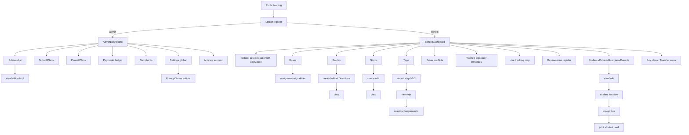
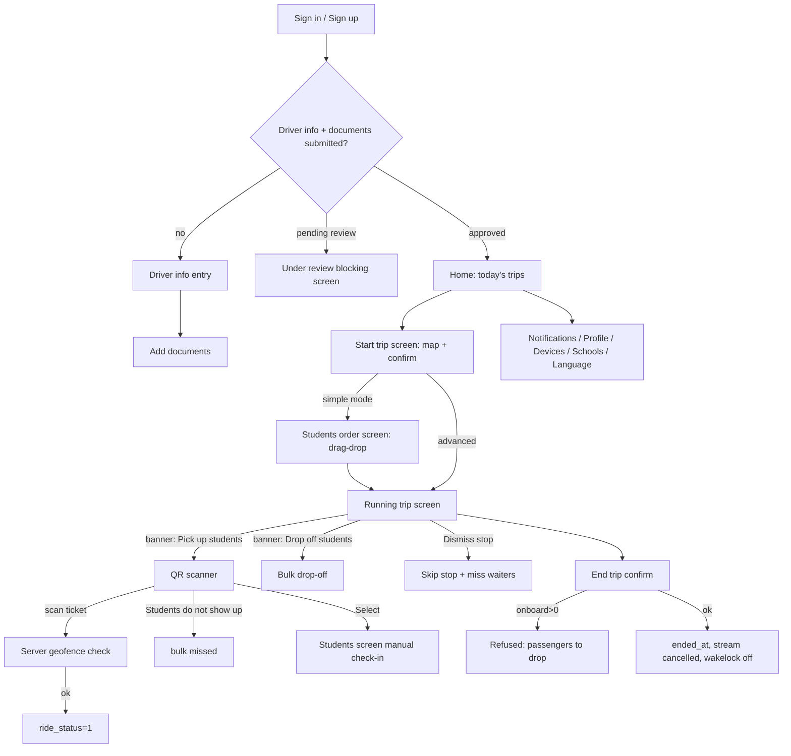
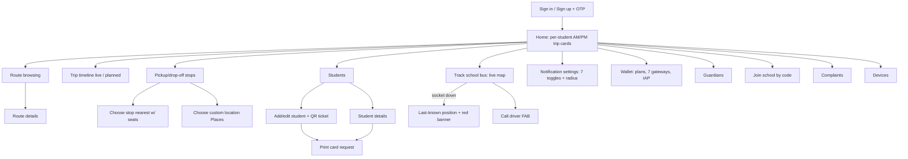

# SchoolBusTrack v2.3 — Deep UX + Backend Audit

**Product:** SchoolBusTrack v2.3 (CodeCanyon, single-purpose school-bus/transport tracking SaaS)
**Root:** `/home/bishal-regmi/Desktop/ASchool/Other Projects/SchoolBusTrack v2.3/SchoolBusTrack v2.3/`
**Boot status:** static-only (no seeded DB / no vendor boot attempted — per recon rules). All evidence below is static code (file:line) or shipped vendor docs. Every path is relative to the product root unless prefixed `ASchool:` (repo-relative).
**Audit date:** 2026-09-13. This report supersedes `docs/competitor-audits/schoolbustrack-v2.3.md` (first draft 2026-09-11/12). Prior claims were re-verified at source this pass; see the **Prior-draft verification ledger** at the end.
**Compared against:** ASchool's transport stack — `aschool_shared/lib/models/transport.dart`, `aschool_shared/lib/providers/transport_provider.dart`, `aschool_shared/lib/repositories/transport_repository.dart`, `backend/app/tasks/transport_trips.py`, `backend/app/tasks/gps_processing.py`, `backend/app/tasks/gps_firebase_poller.py`, `backend/app/api/v1/transport.py`, `backend/app/models/transport.py`, `backend/app/services/transport_service.py`, `frontend/components/transport/LiveBusMap.tsx`, `frontend/app/dashboard/transport/`, `flutter_parent/lib/features/bus_tracker/`, `flutter_user/lib/features/transport/`, `hardware/ESP32_GPS_tracker/`.

---

## 1. Executive Summary

SchoolBusTrack v2.3 is a dedicated school-transport SaaS with three surfaces: a Laravel 10 API + Vue 2/Vuetify admin SPA (`Code/AdminPanel/`), a Flutter driver app (`Code/Apps/school-trip-track-driver/`, 26 screens), and a Flutter guardian app (`Code/Apps/school_trip_track_guardian/`, 34 screen files). Roles live in one `users` table with `role_id` 1 admin / 2 school / 3 driver / 4 parent / 5 guardian / 6 student (`database/migrations/2019_10_10_000001_create_users_table.php:35-36`; middleware constants confirmed in `app/Http/Middleware/AdminMiddleware.php:15`, `DriverMiddleware.php:14`).

Its single differentiating asset is a complete **trip lifecycle state machine**: recurring `trips` → daily `planned_trips` (materialized by an every-minute cron) → per-stop `planned_trip_details` (planned vs actual timestamps) → per-student `student_trips` with `ride_status` 0/1/2/3/4 (waiting/onboard/missed/dropped/cancelled). Boarding is QR-scan-based with server-side geofence validation; ending a trip is refused while any student is onboard. This is 2–3 product cycles ahead of a typical school-ERP transport module — and ASchool has now (S-A4, verified this pass in `backend/app/models/transport.py:88-250` and `backend/app/services/transport_service.py`) absorbed the same 4-layer model with fixes for SBT's structural flaws (TIMESTAMPTZ stop stamps, GPSLog retention, private rooms, per-school radii, driver-ownership checks server-enforced).

Its structural weaknesses are equally extreme:
1. **Security.** 8 payment capture routes ship with no auth middleware (`routes/api.php:156-172`); `POST /planned-trips/test-set-last-position` (`routes/api.php:258`) lets anyone spoof any bus's position and broadcast it; `GET /routes/{id}` and `GET /stops/{id}` (`routes/api.php:202,209`) and `GET /users/admin-info` (`routes/api.php:38`) are unauthenticated; the driver-ownership check on start/stop is commented out (`TripController.php:1636-1638`); position broadcasts go to a **public** Echo channel (`app/Events/TripPositionUpdated.php:33-36`); `ReservationController::getReservationDetails` (`ReservationController.php:209-291`) lets any parent read any student's route/stops/driver phone.
2. **Telemetry loss.** Only the latest fix is persisted (`planned_trips.last_position_lat/lng`, `TripController.php:1829-1832`); there is no GPS history table anywhere in the 54 migrations — replay, speed analytics, and dispute evidence are structurally impossible.
3. **Battery-hostile driver flow.** Wakelock for the whole trip (`running_trip_screen.dart:190`), no distanceFilter on the stream (`running_trip_screen.dart:150-153`), no background service, no offline queue — fixes are silently dropped on HTTP failure.
4. **Lossy schema.** `planned_trip_details.actual_timestamp` is a TIME column (`2021_08_01_000034_create_planned_trip_details_table.php`) — arrival dates are unrecoverable.

For ASchool, the verdict is: the lifecycle adoption is already done and done better; the remaining steals are UX-level (driver audio coaching banners, per-student radius picker with Off/100/500/1000/1500/2000 m choices, call-driver FAB, explicit trip-not-started/ended empty states, drag-drop stop ordering) and the remaining avoids are all security/tenancy patterns (global settings row, public channels, unauthenticated payment captures, coins metering on creation).

---

## 2. Stack & Architecture Shape (all three surfaces, confirmed from manifests)

### 2.1 Backend — `Code/AdminPanel/` (Laravel 10 + Sanctum + Firebase)

From `composer.json`:
- `laravel/framework ^10.10`, `laravel/sanctum ^3.2` (token auth; abilities per role), `laravel/tinker`.
- **Firebase**: `kreait/laravel-firebase ^5.4` — FCM push (`kreait\Firebase\Messaging\CloudMessage` imported in `app/Traits/UserUtils.php:13-14`) AND Firebase Auth as the identity provider for parent/driver/guardian apps (`AuthController.php` verifies Firebase ID tokens at `loginViaToken`, `AuthController.php:308-332`).
- **Maps/payments**: `alexpechkarev/google-maps ^10.0` (server-side Directions proxy), `braintree/braintree_php ^6.13`, `edwardmuss/flutterwave-laravel ^1.0`, `paytabscom/laravel_paytabs ^1.4`, `razorpay/razorpay 2.*`, `stripe/stripe-php ^13.10`, `yabacon/paystack-php ^2.2` — seven gateways.
- **Misc**: `barryvdh/laravel-dompdf` (PDF), `simplesoftwareio/simple-qrcode ^4.2` (student ticket QR), `maatwebsite/excel ^3.1` (student CSV/XLSX import), `biscolab/laravel-recaptcha ^6.1`, `predis/predis ^2.2` (queue/Redis), `btc_id/btc-id dev-main` — an obfuscated license/DRM package used by `app/Traits/AuthSec.php` (token obfuscation via `AuthSetting` secure keys).
- Dev: PHPUnit 10, Pint, Ignition. PHP `^8.1`.

API shape: 412-line `routes/api.php` (v1 draft said "~700 lines" — corrected), all routes under `/api` prefix (`app/Providers/RouteServiceProvider.php:39-46`), API group runs `ThrottleRequests:api` → **60 req/min per user-id-or-IP** (`RouteServiceProvider.php:56-60` — a real rate limiter the prior draft never mentioned; the driver's ≥3 s cadence = 20/min sits comfortably under it, but it also throttles scan-spam and payment replays to 60/min).

Broadcasting: Laravel Echo over socket.io (client `socket.io-client ^2.2.0` in admin SPA `front-end/package.json:28`); `app/Events/TripPositionUpdated.php` implements `ShouldBroadcast` on a **public** `Channel($channelId)` (lines 33-36); `routes/channels.php` authorizes only `App.Models.User.{id}` — trip channels are never authorized (verified, file is 18 lines).

Scheduler: `app/Console/Kernel.php:30-46` — daily `scheduleDriverTrips()`; one everyMinute closure running `deleteAccounts()`, `endTrips()`, `publishTrips()`, `assignStudentsToTrips()` **with no `withoutOverlapping()` mutex** (the four calls are sequential inside one closure, but scheduler runs themselves can overlap).

Repository pattern: 35 interfaces in `app/Repository/` with Eloquent implementations — clean DI seam (all controllers constructor-inject repositories, e.g. `TripController.php:75-115`). One service class only (`app/Services/GoogleRoutesService.php`). The real domain engine lives in traits: `app/Traits/TripUtils.php` (853 lines), `UserUtils.php` (494), `DriverUtils.php` (156), `AuthSec.php` (120).

### 2.2 Admin SPA — `Code/AdminPanel/front-end/` (Vue 2 + Vuetify 2)

From `front-end/package.json` (name `"ez-bus"` — the product's earlier identity as a city-bus tracker): `vue ^2.6.11`, `vuetify ^2.4.0`, `vuex ^3.4.0`, `vue-router ^3.2.0`, `laravel-echo ^1.16.1` + `socket.io-client ^2.2.0`, `vue2-google-maps ^0.10.7`, `apexcharts ^3.27.3` + `vue-apexcharts` (dashboards), `vuedraggable ^2.24.3` (stop ordering), `vue-sweetalert2`, `vue-notification`, `vue-i18n ^8.28.2` (admin i18n — the headline v2.3 feature per `UpgradeGuide/UpgradeV2.3.txt:11`), `vue-paystack`, `vue-simple-recaptcha`. 73 `.vue` view files (enumerated §5.1).

### 2.3 Driver app — `Code/Apps/school-trip-track-driver/`

From `pubspec.yaml` (SDK `^3.9.2`, version `1.0.0+1`): `google_maps_flutter ^2.2.8`, `geolocator ^13.0.1`, `wakelock_plus ^1.1.4`, `mobile_scanner ^6.0.2` + `google_mlkit_barcode_scanning` (QR), `just_audio ^0.9.34` (coaching audio), `flutter_ringtone_player` (scan beep), `firebase_core/firebase_auth/firebase_messaging` (Firebase login + push), `google_mobile_ads ^5.1.0` (AdMob interstitials — toggleable via `settings.allow_ads_in_driver_app`), `qr_flutter`, `timeline_tile`, `flutter_polyline_points`, `pin_code_fields`, `permission_handler`. Architecture: MVVM — one god view-model `lib/view_models/this_application_view_model.dart` (1,385 lines), one API bag `lib/connection/all_apis.dart` (1,595 lines), get_it service locator, Provider for rebuilds. 26 screens in `lib/gui/screens/`.

### 2.4 Guardian app — `Code/Apps/school_trip_track_guardian/`

From `pubspec.yaml`: same core stack plus `socket_io_client` + a Laravel Echo wrapper (imported at `this_application_view_model.dart:36`), `barcode_widget`, `ticket_widget`, `googlemaps_flutter_webservices` (Places), `overlay_support`, `icon_badge`. Also 8-locale ARBs (`lib/gui/languages/l10n/` — ar, de, en, es, fr, hi, it, pt per prior draft's l10n listing, consistent with `EventTypesTableSeeder` titles in en/es/fr/ar). One god view-model (1,691 lines), `all_apis.dart` (2,655 lines). 34 screen files.

### 2.5 Docs & upgrade guide

- `Documentation/AdminPanel/PDF/SchoolBusTrack admin panel documentation.pdf`, `Documentation/Apps/PDF/SchoolBusTrack Apps Documentation.pdf` — vendor setup docs (not screen-by-screen UX evidence; installation-oriented).
- `Documentation/*/Online/url.txt` — link-shortened URLs to hosted docs (`https://ouo.io/OcSW1x`, `https://jiourl.com/jbvkBr`) — ad-gated link shorteners in shipped docs.
- `UpgradeGuide/UpgradeV2.3.txt` — v2.3 delta = translated admin panel + minor fixes; lists the exact file set to overwrite (controllers `PlaceController/TripController/UserController`, `UserUtils`, `EventTypesTableSeeder`, the whole `front-end/src` i18n set). Useful as a version provenance record.

---

## 3. Data Model (tables, relationships, notable issues)

54 migrations in `database/migrations/`. The core transport spine:

### 3.1 Identity & tenancy

- **`users`** (`2019_10_10_000001`): single table for all roles. `role_id` (1/2/3/4/5/6), `school_id` FK→users (schools are users), `parent_id` FK→users (guardians belong to parents), `student_identification` (the scanned ticket string, line 41), `balance` unsigned int (coins, line 30), `fcm_token`, `uid` (Firebase), `status_id` (1 active/2 pending/3 suspended/4 under-review/5 out-of-coins per code usage), `plan_id`, `request_delete_at`, `otp`, `locale`. Notable: students are users with `role_id=6`; avatars default 'avatar.png'.
- **`roles`**, **`statuses`**, **`currencies`**, **`plans`** (`2019_10_10_000000`): plans carry `plan_type` (0 school / 1 parent), `coin_count`, `price`, `availability` (one-time-purchase flag).
- **`school_settings`** (`2021_08_01_000045`): per-school `lat/lng/place_id/address` (the school point used by simple-mode routing), `sunday..saturday` boolean off-days, later `school_code` (`..._000047`, the 6-digit join code generated at signup — `AuthController.php:245-259`).

### 3.2 Fleet & routes

- **`stops`** (`2019_10_12_000003`): `name`, `place_id` (Google), `address`, **lat/lng as strings** (schema smell), `school_id`.
- **`routes`** (`2019_10_12_000004`): `name`, `is_morning` boolean (direction lives on the route, not the trip), `school_id`.
- **`route_stops`** (`..._000005`): join with `order`.
- **`route_stop_directions`** (`..._000006`): per-leg `overview_path` TEXT (JSON array of lat/lng), `index`, `summary`, `current` boolean (which alternative was chosen). Populated by the Google Directions proxy during route creation (`RouteController.php:147-197`).
- **`buses`** (`2019_10_12_000003`): `license`, `capacity`, `driver_id` (1:1 from the bus side), `school_id`.

### 3.3 Trip lifecycle (the 4-layer spine)

- **`trips`** (`2019_10_12_000007`) — recurring definition: `channel` (broadcast channel string, `uniqid()` at creation — `TripController.php:434`), `route_id`, `effective_date` DATE, `repetition_period` unsigned int days (0 = one-off), `stop_to_stop_avg_time` mins, `first_stop_time`/`last_stop_time` TIME, `status_id` (1 active / 3 trashed — trash/restore toggles, `TripController.php:474-488`), `driver_id`, `school_id`.
- **`trip_details`** (`..._000008`) — per-stop template: `stop_id`, `planned_timestamp` TIME, `actual_timestamp` TIME nullable (template-level actual — mostly unused), `inter_time` (minutes from previous stop; the create wizard sends one per stop and the server cumulative-sums them, `TripController.php:441-455`).
- **`planned_trips`** (`..._000009`) — daily instance: UNIQUE `(trip_id, planned_date)`; `channel` copied verbatim from `trips.channel` (`TripUtils.php:700`); `started_at`/`ended_at` timestamps; `last_position_lat/lng` doubles (**the only telemetry store in the product**); `driver_id`, `bus_id` snapshots; `reserved_seats` (default 0 — **never written by any code path I read**; the seat math is computed on the fly instead, `TripUtils.php:359-382`).
- **`planned_trip_details`** (`2021_08_01_000034`) — per-instance stop rows: `stop_id`, `planned_timestamp` TIME, `actual_timestamp` TIME nullable. **Issue: TIME columns** — the date component of an arrival is unrecoverable (only inferrable from the instance's `planned_date`). ASchool deliberately models `planned_ts/actual_ts` as TIMESTAMPTZ (`backend/app/models/transport.py:182-183`).
- **`student_trips`** (`2019_10_12_000012`) — per-student ride: `student_id`, `planned_trip_id`, `riding_date` DATE, `start_stop_id`/`end_stop_id`, `planned_start_time` TIME, `ride_status` 0/1/2/3/4 with inline comment "0 not ride, 1-ride, 2-miss ride, 3-drop off, 4-cancelled by admin". **Status 4 has no writer** — `ReservationController::cancel` (`ReservationController.php:103-206`) implements refund logic (wallet += paid_price, admin/driver wallet clawback) but has **no route** in `routes/api.php`; the index action still classifies status-4 rows into a `cancelled` bucket (`ReservationController.php:84-87`) — dead code from the pre-2.0 taxi era (it references `customer`, `admin_share`, `driver_share`, `reservation_id` columns that belong to the old `pay()` flow at `TripController.php:792-877`, itself also routeless).
- **`suspended_trips`** (`2019_10_12_000011`): `trip_id`, `date`, `repetition_period` — holiday suspension; matched by `(diff % repetition_period) == 0` in `checkSuspendedTrip` (`TripUtils.php:815-841`), i.e. suspensions themselves recur.
- **`fav_trips`** (`..._000011`) — legacy favorites, unreferenced in v2.3 controllers.

### 3.4 Student-transport assignment & preferences

- **`student_settings`** (`2019_10_12_000012`, extended `2021_08_01_000043`): one row per student. Assignment: `pickup_route_stop_id`, `drop_off_route_stop_id`, `pickup_trip_id`, `drop_off_trip_id`, `morning_bus_id`, `afternoon_bus_id` (school-assigned bus per direction), `absent_on` DATE. Custom points: `pickup_lat/lng/address/place_id`, `drop_off_*`. The 8 notification toggles: `next_stop_is_your_pickup_location_notification_on_off` (bool), `bus_near_pickup_location_notification_by_distance` (**int meters, nullable = off**), `bus_arrived_at_pickup_location_notification_on_off` (bool), `student_is_picked_up_notification_on_off`, `student_is_missed_pickup_notification_on_off`, `bus_arrived_at_school_notification_on_off` (**dead — never fired; only read in `UserUtils.php:325` and returned in settings payloads**), `bus_near_drop_off_location_notification_on_off`, `bus_arrived_at_drop_off_location_notification_on_off`.
- **`student_guardians`** (`2019_10_12_000002`): guardian↔student links; parent (role 4) is the wallet owner, guardians (role 5) fan out notifications.

### 3.5 Notifications & events

- **`event_types`** (`2021_08_01_000041`, titles added `..._000053`): 8 rows seeded by `EventTypesTableSeeder.php:19-106`, each with `notification_name` + localized `title_en/es/fr/ar`. **Note correction:** the seeder carries 4 locales (en/es/fr/ar) in the file I read, not 8 — the 8-locale claim applies to the mobile apps' l10n ARBs.
- **`events`** (`..._000042`): the dedupe ledger — one row per (student, event_type) when a notification actually fires (`TripController.php:1783-1786`); dedupe window 30 minutes (`TripController.php:1776`).
- **`notifications`** (`2021_08_01_000037`): in-app rows per recipient (`user_id`, `message`, `seen`), created in `UserUtils::sendNotificationToUser` (`UserUtils.php:457-481`).

### 3.6 Wallet economy

- **`charges`** (`2021_08_01_000033`): money-in ledger (price, coin_count, plan snapshot, school_id XOR parent_id). **`consumptions`** (`..._000031`): 1 coin per auto-created ride row (school or parent), written in `assignStudentsToTrips` (`TripUtils.php:635-655`). **`user_refunds`** (`..._000032`): legacy cancel refunds. Gateway dedup tables: `flutterwave_transactions`, `paystack_transactions`, `paytabs_transactions` (`..._000040`) — **Stripe/Razorpay/Braintree have none**. Payout side: `driver_information`/`driver_documents` (`..._000035/36`), `redemptions`/`redemption_types`, `bank_accounts`/`paypal_accounts`/`mobile_money_accounts`, `user_payments`.

### 3.7 Two models, one table (confirmed)

`App\Models\Reservation` sets `protected $table = 'student_trips'` (`app/Models/Reservation.php:12`) with `$guarded = ['id', ...]` and relations `plannedTrip/student/firstStop/lastStop`; `App\Models\StudentTrip` maps the same table with a different relation set. All v2.3 controller code uses the `Reservation` model/repository; `StudentTrip` is used by the scheduler (`TripUtils.php:582-617`) and `UserUtils::deleteAccounts` (`UserUtils.php:58`). Divergent fillable/guarded across two models of one table is a latent mass-assignment bug factory (and `Reservation`'s unguarded columns make the `updateNotificationSettings` hole worse — §11).

### 3.8 Schema vs ASchool

ASchool's post-S-A4 equivalent (`backend/app/models/transport.py`): `Route/Bus/BusStop/GPSLog` (lines 26-85) plus `TransportTrip` (weekdays JSONB, `effective_date_bs` — BS-calendar aware, line 111), `TransportTripInstance` (driver/bus snapshots, `last_lat/lng/speed/fix_at`, unique trip+date, lines 127-166), `TransportTripInstanceStop` (`planned_ts/actual_ts` TIMESTAMPTZ, 169-186), `TransportTripReservation` (ride_status 0-4 + `boarded_at/dropped_at/fee_status`, 189-216), `TransportNotificationPref` (per-student radii + 7 toggles, 219-238), `TransportAlertLog` (per-instance dedupe, 241-250). Every SBT structural flaw listed above has a named fix in the ASchool model file's own comments (`transport.py:88-96`).

---

## 4. Backend Flow Traces

Each trace: route → middleware → controller → DB ops → side effects → response, with file:line per hop.

### 4.1 Auth (mobile: Firebase ID token → Sanctum)

1. App sends `{token (Firebase ID), device_name, fcm_token}` → `POST /api/auth/loginViaToken` (`routes/api.php:387`, no middleware).
2. `AuthController::loginViaToken` (`AuthController.php:308-332`) verifies via `$this->auth->verifyIdToken` (kreait Firebase); extracts `uid` (the `sub` claim).
3. `authenticateViaToken` (`AuthController.php:131-306`): looks up `users.uid`; if found — checks status gates (school/parent/guardian must be status 1; driver blocked only at status 3, lines 149-158); **generates a 6-digit OTP on every login** (`random_int(100000,999999)`, line 144) and stores it on the user; refreshes `fcm_token` if provided (162-166); creates a Sanctum token with a role-named ability (`admin`/`school`/`driver`/`parent`/`guardian`, 168-183) after deleting same-device tokens (160); for role > 2 the plaintext token is wrapped through `AuthSec::get_sec_id` (btc-id obfuscation, 185-193; `app/Traits/AuthSec.php`).
4. If `otp_required` setting is on, the OTP is emailed (driver/parent/guardian, 213-229); the app then calls `POST /api/auth/verify-otp` (`routes/api.php:400`) which compares `user->otp == request->otp` (`AuthController.php:658-686`) — plain equality, no expiry, no attempt limit.
5. New users: auto-created inside `authenticateViaToken` (lines 224-266) with status 1 and a generated 6-digit school_code for schools — **anyone with a Firebase account can self-register as a school** (the SaaS's growth loop; also an abuse vector — the `hide_schools` setting exists to counter it, `2021_08_01_000046` migration).
6. Response: `{token, user_data, driver_data?, admin, simple_mode, settings}` (lines 199-206, 268-275).
7. Admin→school impersonation: `POST /api/auth/login-from-admin-to-school` (`routes/api.php:396`, `auth:sanctum, admin`) → `AuthController.php:80-119` mints a school-ability token for any `role_id=2` user.

**Notable:** password resets go through Firebase (`resetPassword` → `$this->auth->sendPasswordResetLink`, `AuthController.php:52-78`). The admin SPA additionally uses `createParent`/`createDriver` (`routes/api.php:392-393`) → `createParentDriver` → `newUserData` (`AuthController.php:481-571`): new drivers start `status_id=2` (pending review).

### 4.2 Fleet setup — route with stops + vehicle + driver assignment

**Create route with stops (admin SPA, advanced mode):**
1. `POST /api/routes/create-edit` (`routes/api.php:199`, `auth:sanctum, school`).
2. `RouteController::createEdit` (`RouteController.php:66-197`): validates `route` (name), `route_type`, `stops[]` (address/lat/lng required each), `chosen_routes[]`, `ordered_directions[]`; enforces `count(stops) - 1 == count(chosen_routes) == count(ordered_directions)` (lines 89-91 — the UI sends one Google Directions alternative set per leg).
3. In a transaction: creates `routes` row (`is_morning` from route_type), then per stop either reuses an existing stop id or creates a new `stops` row; creates `route_stops` with `order`; for every leg stores all direction alternatives into `route_stop_directions` marking the chosen one `current=1` (lines 118-165).
4. Response `{success: ['route created successfully']}`. **Edit path is dead**: the `$update` branch is commented out (lines 75-87) and `$update` is hardcoded false — route "edit" in the SPA actually recreates; there is no delete-and-rewrite for existing routes (deletion is guarded: `destroy` refuses while any student's pickup/dropOff settings point at the route's stops, `RouteController.php:180-196`).

**Assign bus↔driver (both directions):**
- `POST /api/buses/assign-driver` (`routes/api.php:380`) → `BusController::assignDriver` (`BusController.php:93-130`): school-ownership check, refuses if driver already on another bus, sets `buses.driver_id`.
- `POST /api/drivers/assign-bus` (`routes/api.php:330`) → `DriverController::assignBus` (`DriverController.php:227-269`): school-ownership of both, bus must be free, **unassigns the driver's previous bus first** (253-262) — a swap in one transaction.
- `GET /api/drivers/available-buses` = buses with `driver_id = null` (`DriverController.php:181-189`); `GET /api/drivers/all-buses` = assigned buses with computed `available_morning_seats/afternoon_seats` from `student_settings` counts (`DriverController.php:191-224`).

**Assign driver to trip:**
1. `POST /api/trips/assign-driver` (`routes/api.php:226`, `school`).
2. `TripController::assignDriver` (`TripController.php:567-604`): trip must belong to school; driver must be `role_id=3` in the same school. **The `isDriverAvailable` conflict check is commented out** (lines 591-595) — double-booking is only discoverable post-hoc.
3. Side effect: FCM + in-app notification to the driver ("You have been assigned to a trip…", lines 601-602 via `sendNotificationToUser`).
4. Conflict detection is a separate read: `GET /api/drivers/conflicts` (`routes/api.php:336`) → `getDriverConflicts` (`DriverController.php:76-128`) — pairwise `isTripsIntersect` over each driver's trips using a Chinese-Remainder-Theorem search for co-occurring days (`app/Traits/DriverUtils.php:40-140`), then **filters out cross-direction pairs** (morning vs afternoon never conflict, lines 111-113).

**Create trip (schedule) on a route:** `POST /api/trips/create-edit` (`routes/api.php:221`) → `TripController::createEdit` (`TripController.php:367-471`): validates `inter_time[]` length == route stops count (404-406), computes cumulative `planned_timestamp` per stop from `first_stop_time + inter_time` chain (441-455), sets `last_stop_time` (458-460), `channel = uniqid()` on create (434). Edit deletes and rewrites all `trip_details` (429). Duplicate action reuses the create path with fresh channel.

**Suspend:** `POST /api/trips/suspend` → `suspend` (`TripController.php:502-541`): date must be ≥ effective_date; creates `suspended_trips` row with its own repetition period. Removal: `DELETE /api/trips/remove-suspension/{id}` (`490-500`).

**Simple mode (zero-config):** daily cron `scheduleDriverTrips` (`Kernel.php:34-37`) → `TripUtils::scheduleDriverTrips` (`TripUtils.php:26-42`, aborts unless `settings.simple_mode=1`) → per driver per direction `scheduleDriverTrip` (`TripUtils.php:76-357`): takes students whose `morning_bus_id`/`afternoon_bus_id` matches the driver's bus and who aren't absent today (107-123); stops = each student's custom pickup/drop-off lat/lng merged on identical coordinates (158-183); orders by distance to the school (192-195), AM = farthest-first + school appended, PM = school first (197-208); creates a **fresh** Route + Stops + RouteStops + 2-point straight-line RouteStopDirections + a Trip (`repetition_period=0`, all times `00:00:00`, 295-321) and rewrites every student's `pickup_trip_id/pickup_route_stop_id` (324-349). **Litter risk:** only the end-trip path deletes this generated route/stops set (`TripController.php:1703-1718`); `publishTrips` prunes `planned_trips` only — a driver who never ends the trip leaks one route+stops set per day per driver-direction.

### 4.3 Trip lifecycle: publish → assign → start → ingest → visible → end

**Publish (cron):** `TripUtils::publishTrips` (`TripUtils.php:675-755`, everyMinute):
1. Reads global `settings` row (`Setting::where("id",1)`, line 677 — the load-bearing global row).
2. Horizon = **today only** (`$publish_trips_future_days = 0`, line 678) — parents can never see tomorrow's instance.
3. For each `trips` row with `status_id=1` and a driver: expands occurrence dates via `getAllEvents` (757-785: repetition math from effective_date) and skips suspended dates via `checkSuspendedTrip` (815-841).
4. Creates `planned_trips` (channel copied from trip, line 700; `bus_id = trip->driver->bus->id` — **the driver's current bus, not a stored assignment**, line 705) + `planned_trip_details` copies (710-716).
5. Prunes: instances older than yesterday **with zero reservations** are deleted (732-748); then instances with null driver or bus are deleted **regardless of reservations** (750-754) — unassigning a driver mid-day silently destroys a day students are already assigned to.

**Assign students (cron):** `TripUtils::assignStudentsToTrips` (`TripUtils.php:448-673`, everyMinute): per student — skip if `absent_on == today` (467-471), clear stale absence (472-478); **coin gate**: school `balance > 0` else parent balance > 0, else `status_id=5` ("out of coins") and skip (480-511; recovery resets to 1 at 514-520); resolves pickup/drop-off trips + stops via `getPickupDropOffTripForStudent` (384-445: pickup = student's route_stop → last stop of route; drop-off = first stop → student's route_stop); in a per-student transaction creates `student_trips` rows (ride_status 0) for both legs if missing (569-623); on creation debits exactly **1 coin** from school else parent + a `consumptions` row (625-657). **Metering is per created ride row, not per consumed ride — missed rides (status 2) are still charged, and there is no refund path.** Balance reads happen outside the transaction (480-503 vs 569) — with no cron mutex, overlapping runs can double-debit.

**Driver start:** `POST /api/planned-trips/start-stop` mode=1 (`routes/api.php:253`, `auth:sanctum, driver`):
1. `TripController::startStopPlannedTrip` (`TripController.php:1614-1730`). **The driver-ownership check is commented out** (1636-1638) — any authenticated driver can start any planned trip on the instance (route middleware checks role only, not assignment).
2. Simple mode: the submitted `trip_details` order **replaces** all `planned_trip_details` (delete + recreate, 1660-1672) — the drag-drop ordering screen feeds this; then `started_at = now` (1674).
3. Advanced mode: just stamps `started_at` (1685-1686).
4. Client-side guard (driver app, not server): the app refuses to start if farther than 50 m from the first stop (config-gated, `driver this_application_view_model.dart:1114-1121`, `Config.mustStartTripWhenCloseToFirstStop = false` by default — `lib/utils/config.dart:36`) or if the trip's planned datetime isn't today (1123-1140).

**GPS ingest → geofence → notifications (THE realtime hop):**
1. Driver app opens `Geolocator.getPositionStream(LocationSettings(accuracy: high))` in `initState` — **no distanceFilter/timeInterval** (`running_trip_screen.dart:150-153, 209-210`); each fix updates the local marker, then POSTs only if ≥3 s since last send **and** no request in flight (`running_trip_screen.dart:225-243`).
2. `POST /api/planned-trips/set-last-position` `{planned_trip_id, lat, lng, speed}` (`routes/api.php:256`, `auth:sanctum, driver`).
3. `TripController::setLastPosition` (`TripController.php:1791-2077`): validates; **enforces `planned_trip->driver_id == user_id`** (1812-1814 — unlike start/stop); loads global settings radii (1816-1818).
4. DB write: **only** `last_position_lat/lng` (1829-1832). No history row anywhere.
5. Side effect A — broadcast: `broadcast(new TripPositionUpdated($channel, json_encode({lat,lng,speed})))` (1839) on the **public** channel `trips.channel` (event `broadcastOn()` returns `new Channel($this->channelId)`, `app/Events/TripPositionUpdated.php:33-36`; `routes/channels.php` has no entry for these) → socket.io → guardian app Echo listener + admin SPA live map.
6. Geofence engine (1842-1934): next stop = first `planned_trip_detail` with `actual_timestamp == null` (1848-1850); haversine distance in meters via `TripUtils::distance` (844-852, miles→km formula ×1000, 1858). Per waiting passenger at that stop (ride_status 0 & start_stop matches, 1861-1863): (a) `next_stop_is_your_pickup…` fires **unconditionally while the stop is next** (1872-1875); (b) `bus_near_pickup…by_distance` fires when distance < the **per-student integer radius** (1877-1884); (c) `bus_arrived_at_pickup…` when distance < global mark-arrived radius (1886-1892). Mirrored for drop-off passengers (ride_status 1 & end_stop matches, 1895-1918). Arrival auto-stamp: `actual_timestamp = now` only when inside the radius AND zero waiting AND zero alighting at that stop (1920-1923) — the anti-false-arrival guard.
7. Side effect B — notifications: `sendStudentNotificationBasedOnSetting` (`TripController.php:1743-1788`) resolves the `event_types` row by `notification_name`, picks `title_{parent.locale}` (default `title_en`), checks the `events` dedupe ledger (30 min per student+event, 1776-1787), then `sendNotificationToUser` (`UserUtils.php:452-494`): for a student (role 6) it fans out to **all guardians** — one in-app `notifications` row each + FCM via `sendSingleNotification` (CloudMessage with `apns-priority: 10`, sound, `UserUtils.php:376-412`), skipping duplicate FCM tokens (`isTokenUsed`, 365-373).
8. Response to the driver app is the **coaching payload**: `{next_stop, next_stop_planned_time, distance_to_next_stop, count_passengers_to_be_picked_up, count_passengers_to_be_dropped_off}` (1927-1934) — the server is the driver's brain; the app renders banners from it.
9. Dead branch: the `else` (1948-2071) behind `if(true)` at 1845 is the legacy "closest unvisited stop" engine — both designs live in one function.

**Guardian visibility:** `GET /api/reservations/get-reservation-details?student_id&morning` (`routes/api.php:282`, `parent-guardian` middleware only) → `ReservationController::getReservationDetails` (`ReservationController.php:209-291`): loads the student's latest 2 reservations, picks morning/afternoon by route `is_morning`, decodes `route_stop_directions.overview_path` into polylines (256-277), falls back to `driver_information.phone_number` when the driver user has no `tel_number` (278-286). **No ownership check on `student_id`** — any guardian can query any student (verified end-to-end; the only guard is role middleware). The app then subscribes Echo to `reservation.trip.channel` (`guardian this_application_view_model.dart:1314-1317`) and renders pushes (`listenToEcho`, 156-185 — string-or-number tolerant parsing).

**End trip:** mode=0 → refuses while any `ride_status == 1` exists ("There are passengers to be dropped off", `TripController.php:1690-1696`); stamps `ended_at`; in simple mode also deletes the generated route and its stops (1703-1718). Cron safety net `endTrips` (`UserUtils.php:110-123`) force-ends instances older than 1 day that started but never ended.

### 4.4 Board / miss / drop-off / dismiss

- **Scan board:** `POST /api/planned-trips/pick-up` `{ticket_number, planned_trip_id, lat, lng, speed, missed?}` (`routes/api.php:270`) → `pickUp` (`TripController.php:2255-2402`). Ticket path: student resolved by `student_identification` (2285); reservation = ride_status 0 for that instance (2291-2298); driver ownership enforced (2306-2308); already-picked-up guard (2310-2312). `missed=1` variant: if the driver is within the arrival radius of the student's `firstStop`, `ride_status=2` + missed notification (2314-2333), else 500. Normal path: **server geofence-validates the driver against the student's own stop** — distance > radius ⇒ 500 "Passenger is not near the stop" (2337-2341); then `ride_status=1` + picked-up notification (2343-2351); chains `setLastPosition($request)` so the coaching payload refreshes (2355).
- **No-ticket bulk miss:** when `ticket_number == "null"` (the string), every waiting reservation whose stop is within radius becomes `ride_status=2` + notifications (2358-2400) — this is the "Students do not show up" button (`qrcode_scanner_screen.dart:146-187`).
- **Drop-off:** `POST /api/planned-trips/drop-off` (`routes/api.php:261`) → `dropOff` (`TripController.php:2474-2524`): **bulk** — all onboard reservations (ride_status 1) whose `lastStop` is within the arrival radius become `ride_status=3`. **No identity check, no notification** (no dropped-off event type exists in the seeder) — anyone at the right place is marked dropped.
- **Dismiss stop:** `POST /api/planned-trips/dismiss-next-stop` (`routes/api.php:276`) → `dismissNextStop` (`TripController.php:2405-2471`): stamps the next stop's `actual_timestamp`, marks all waiters there `ride_status=2` + notifications — **no proximity check at all**.
- **Manifests:** `GET /planned-trips/get-students-to-be-picked-up/{id}` (2184-2202, next-stop waiters, driver-gated via `getReservationsToBePickedUp` 2142-2181) and `GET /planned-trips/get-all-students-on-trip/{id}` (2205-2252, parallel arrays students/start_stops/end_stops/planned_start_times, driver-gated 2218-2221).

### 4.5 School broadcast (delay comms)

`POST /api/planned-trips/notify` `{id, message}` (`routes/api.php:273`, `school`) → `notify` (`TripController.php:2527-2567`): all waiting/onboard students' guardians + the driver get `sendNotificationToUser`. 404 when nobody matches.

### 4.6 Parent self-service flows

- **Choose stop:** `POST /api/stops/set-pickup-drop-off` (`routes/api.php:215`, `parent`) → `StopController::setPickupDropOff` (`StopController.php:309-423`): verifies student belongs to caller (328-334), stop∈route∈trip (336-356), school consistency (358-362), then **seat availability** via `getAvailableSeatsForTrip` (`TripUtils.php:359-382`: capacity − count of `student_settings` pointing at that trip, +1 if it's the student's current trip) — refuses at ≤0 seats (384-394); writes `pickup_route_stop_id/pickup_trip_id` or drop-off pair (396-419).
- **Custom point:** `POST /api/stops/set-pickup-drop-off-location` (`StopController.php:426-494`) — writes raw `pickup_lat/lng/address` (used by simple-mode routing). **No seat check on this path** (custom points bypass trip assignment entirely until the daily cron runs).
- **Nearest stops:** `GET /api/stops/get-closest-stops/all` (`StopController.php:129-249`): student's school routes in the requested direction, stops within `max_search_radius` (default 1000 m), each with per-trip pick/drop times and computed `available_seats` (via `getStopDetails` 251-306).
- **Absence toggle:** `POST /api/users/set-absent-student` (`UserController.php:1989-2069`): toggles `student_settings.absent_on` to tomorrow (or last trip date + 1); refuses removal when a planned trip exists on that date; requires both stops chosen first.
- **Coins:** plan purchase → `finalizePayment` (`UserController.php:798-852`): one `charges` row + `users.balance += coin_count`. **Request-coins with a price-0 plan short-circuits payment entirely** via `captureBraintree`'s `price == 0` skip (`UserController.php:1420-1425`, called from `requestCoins` 1533-1536 with a fake nonce '123'). `transferCoins` (school→parent, 2522-2574) checks school balance and parent∈school.

### 4.7 The 8 unauthenticated payment routes (deepest security finding)

`routes/api.php:156-172`: `capture-braintree-parent`, `fetch-plan-details-for-parent`, `initialize/capture-flutterwave-*-parent`, `create/capture-razorpay-*-parent`, `initialize/capture-stripe-*-parent`, `capture-paystack-payment-parent` — **no middleware at all**. Each capture falls back to a client-supplied `parent_id` when `$request->user()` is null (e.g. `captureBraintree` `UserController.php:1374-1387`; `captureStripePayment` 1283-1295; `captureRazorpayPayment` 870-882). Stripe and Razorpay captures verify the gateway-side payment succeeded and amounts match (Stripe 1310-1321; Razorpay 897-910 + signature verify 913-931) — but with **no transaction dedup table** (unlike Flutterwave 984-988, Paytabs 1055-1059, Paystack 1140-1144), a legitimately-paid intent can be replayed for unlimited `balance += coins` credited to any parent. Braintree's price-0 path grants coins with no charge at all. Mitigation present but weak: the 60/min API rate limit and plan one-time-purchase checks (`checkAvailability`, 1351-1364) — replay of a repeatable plan is unbounded.

### 4.8 Dashboards

- Admin (`GET /api/admin-dashboard/all`, `routes/api.php:23`): earnings by school/parent, best-selling plans (top 5), 7-day planned-trips histogram, counts. **Role-count bug:** `totalParents` counts `role_id = 3` (drivers!) and `totalDrivers` counts `role_id = 2` (schools!) — `AdminDashboardController.php` index (the two `allWhere` calls in its counting block; roles swapped vs the rest of the codebase).
- School (`GET /api/school-dashboard/all`, `routes/api.php:27`): purchased vs consumed coins, remaining balance, counts, top-5 trips by reservations, same histogram (`SchoolDashboardController.php:83-252`).

---

## 5. Full Page/Screen Inventory

### 5.1 Admin SPA (Vue router — `front-end/src/router/index.js`, 40+ routes)

| Route | View file | Purpose | Role |
|---|---|---|---|
| `/`, `/home` | `views/landing-page/home.vue` (+ components: Home/About/Contact/Download/Pricing/Footer/Navigation) | Marketing landing page | public |
| `/login`, `/register`, `/forgot-password` | `views/start-pages/Login.vue`, `Register.vue`, `ForgotPassword.vue` | Admin/school auth | public |
| `/admin-dashboard` | `views/dashboard/AdminDashboard.vue` (+ DashboardCardTotalEarning/RemainingCoins/SalesByTrips/Plans/StatisticsCard/WeeklyOverview) | Platform earnings | admin |
| `/school-dashboard` | `views/dashboard/SchoolDashboard.vue` | School operations | school |
| `/schools` `/admins` `/students` `/drivers` `/guardians` (list) | `views/users/index.vue` (1,025 lines; shared, role-switched) | Role-scoped user lists | admin/school |
| `/students/view-location/student=:id` | `views/users/student-location.vue` | Student stop on map | school |
| view/edit per role | `views/users/view-user.vue` (606), `edit-user.vue` (196) | Detail + edit (status, balance) | admin/school |
| `/users/*` cards | `student-card.vue`, `guardian-card.vue`, `school-card.vue`, `approve-reject-card.vue` | Profile cards + driver/student review actions | school |
| account settings | `users/user-settings/AccountSettingsAccount.vue`, `…Security.vue` | Own profile/password | any |
| `/school` | `views/system-setup/school/index.vue` (309) | School location + weekly off-days + join code | school |
| `/buses` | `views/system-setup/buses/index.vue` (468) | Bus CRUD + assign/unassign driver dialog | school |
| `/routes` (+create/edit/view) | `views/system-setup/routes/index.vue`, `create-edit.vue` (913), `view.vue` | Route CRUD with Google Directions legs | school |
| `/stops` (+create/edit/view) | `views/system-setup/stops/index.vue`, `create-edit.vue` (291), `view.vue` | Standalone stop CRUD + map | school |
| `/trips` (+create/edit/view-trip/view-calendar) | `views/trips/index.vue`, `create-edit.vue` (216 wizard shell), `steps/step1.vue` (232), `step2.vue` (361), `step3.vue` (35), `view-trip.vue`, `calendar/calendar.vue`, `calendar/view-calendar.vue` | Trip schedule wizard, calendar of occurrences/suspensions | school |
| `/driver-conflicts` | `views/trips/driver-conflicts/index.vue` | Double-booking review | school |
| `/reservations` | `views/reservations/index.vue` + `reservations-table.vue` (176) | Ride register (active/ride/missed/completed/cancelled tabs) | school |
| `/planned-trips` | `views/planned-trips/index.vue` + `planned-trips-table.vue` (195) | Daily instances (upcoming/running/completed/passed) | school |
| `/live-tracking` | `views/live-tracking/index.vue` (258) | Live map of on-route trips | school |
| `/buy-plans`, `/pay-plan/…`, `/school-payments` | `views/buy-plans/*` (index, payForPlan, payments, braintree/*, stripe/*, paypal/PayPalCheckout) | Coin plan checkout for schools; parent pay-link targets | school/public |
| `/pay-parent-plan/…` | `views/buy-plans/payForPlan.vue` + gateway variants | Parent payment page from request-coins email | public |
| `/transfer-coins` | `views/transfer-coins/index.vue` (164) | School→parent coin transfer | school |
| `/payments` | `views/payments/index.vue` | Charges ledger | admin |
| `/complaints` | `views/complaints/index.vue` + `complaints-table.vue` (145) | Complaint triage | admin |
| `/settings` | `views/settings/index.vue` (346) | Global radii/toggles (see §6.1) | admin |
| `/privacy-policy`, `/terms-and-conditions` (+public `/privacy`, `/terms`) | `views/settings/privacy-policy.vue`, `terms.vue`, previews | CMS editors writing `public/privacy.html` etc. | admin |
| `/school-plans`, `/parent-plans` | `views/system-setup/plans/school-plans.vue`, `parent-plans.vue` | Plan CRUD per type | admin |
| `/activate-account` | `views/activation/index.vue` | License activation code entry | admin |

### 5.2 Driver app (`Code/Apps/school-trip-track-driver/lib/gui/screens/`, 26 files)

| Screen | File (lines) | Purpose |
|---|---|---|
| Auth: sign in / sign up / forget / OTP | `sign_in_screen.dart`, `sign_up_screen.dart`, `forget_password_screen.dart`, `pin_code_verification_screen.dart` | Firebase-token login + OTP |
| Home hub | `home_screen.dart` (505) | Today's trips cards (morning/afternoon), active-trip entry, drawer |
| Start trip | `start_trip_screen.dart` (531) | Map preview of route + stops, Start button w/ confirm dialog |
| Running trip (advanced) | `running_trip_screen.dart` (1,149) | Live map, GPS stream, audio coaching banners, dismiss-stop, end-trip |
| Running trip (simple) | `running_trip_simple_mode_screen.dart` (1,017) | Same for ad-hoc simple-mode routes |
| QR scanner | `qrcode_scanner_screen.dart` (493) | Scan student ticket; "Students do not show up"; Select (manual roster) |
| Legacy pick-up | `pick_up_screen.dart` (398) | Camera/manual entry variant (test-hook carrier, §11) |
| Students to pick up | `students_screen.dart` (329) | Next-stop manifest w/ check-in buttons |
| Students on trip | `trip_students_screen.dart` (326) | Full onboard roster |
| Stop ordering | `students_order_screen.dart` (248) | Drag-drop stop order before start (simple mode) + automatic-order toggle |
| Trip timeline | `trip_time_line_screen.dart` | Stop-by-stop progress |
| Driver onboarding | `driver_information_entry_screen.dart`, `add_edit_document_screen.dart` | Profile + license/ID documents |
| Under review | `driver_under_review_screen.dart` (97) | Blocking state pending school approval |
| Join school | `schools_screen.dart` | Pick school (or by code) |
| Platform | `notifications_screen.dart`, `devices_screen.dart`, `my_profile_screen.dart`, `more_screen.dart` | Notifications, device tokens, profile, settings hub |
| Misc | `about_screen.dart`, `terms_conditions_screen.dart`, `contact_us_screen.dart`, `change_language_screen.dart` | Info pages |

### 5.3 Guardian app (`Code/Apps/school_trip_track_guardian/lib/gui/screens/`, 34 files)

| Screen | File (lines) | Purpose |
|---|---|---|
| Auth (4) | `sign_in/sign_up/forget_password/pin_code_verification` | Firebase + OTP |
| Home hub | `home_screen.dart` (730) | Per-student morning/afternoon trip cards; active trip entry |
| **Live tracking** | `track_school_bus_screen.dart` (575) | The parent map (§6.3) |
| Timelines (3) | `trip_timeline_screen.dart` (live), `planned_trip_timeline_screen.dart`, `route_timeline_screen.dart` | Stop lists w/ green/grey progress |
| Route browsing | `routes_screen.dart`, `route_details_screen.dart` | All routes + map detail |
| Stops | `stops_screen.dart`, `stop_location_screen.dart` | Stop list + single stop map |
| Stop/location choice | `choose_stop_screen.dart` (392), `choose_location_screen.dart` (299, Google Places) | Pick pickup/drop-off stop or custom point |
| Manage student stops | `pickup_dropoff_stops_screen.dart` | AM/PM stop management |
| Reservation confirm | `reservation_dialog.dart` | Seat-availability confirm dialog |
| Students | `add_edit_student_screen.dart` (494), `student_details_screen.dart` (1,125) | Family student CRUD + ticket QR display |
| Guardians | `guardians_screen.dart` (561) | Multi-guardian management |
| Schools | `schools_screen.dart` (252) | Join by 6-digit code |
| Notifications | `notifications_screen.dart` (535) | Center (seen/mark-all/delete-all) |
| **Notification prefs** | `notifications_settings_screen.dart` (367) | Per-student 7-toggle matrix + radius picker |
| Wallet (3) | `wallet_screen.dart` (926), `wallet_screen_android.dart` (926), `wallet_screen_ios.dart` (581) | Balance, plans, gateway checkout |
| Complaints | `complaint_screen.dart` | File complaint |
| Devices | `devices_screen.dart` (336) | FCM token management/revoke |
| Platform | `my_profile_screen.dart`, `more_screen.dart` (329) | Profile/settings hub |
| Misc | `about/terms/contact_us/change_language` | Info |

Widgets of note (`lib/gui/widgets/`): `full_trip_time_line.dart`, `trip_time_line.dart` (timeline_tile rendering), `ticket_widget.dart`, `route_stop_card.dart`, `my_interstitial_ad.dart` (AdMob in a school app, gated by `settings.allow_ads_in_parent_app`).

---

## 6. Per-Screen UI/UX Element Inventory

### 6.1 Admin SPA — Settings (`views/settings/index.vue`, 346 lines)

Every field (labels from i18n keys, `:rules` from component): Currency (v-select, required, :23-28); Distance to mark arrived (number, :39-49); Max distance to stop (:52-62); Announcement distance drop-off (:70-80); …pick-up (:83-93); …slow-down (:96-106); admin email/phone/address (:117-144, nullable); switches: Allow OTP (:155), Hide payment screen in parent app (:168), Hide schools (:181), **Simple mode** (:194), Allow ads in driver app (:207), Allow ads in parent app (:212). Save button disabled unless valid (:222-225). Server-side validation mirrors these and adds the cross-rule "slow-down must exceed pickup/drop-off by ≥100 m" (`SettingController::update`, `SettingController.php:33-77` — the abs-diff check at ~:74-77). **Everything is one global row — no per-school radii anywhere** (per-school `school_settings` carries only off-days/location/code, `SettingController::updateSchool` :82-130).

Empty/loading: `v-data-table` instances across CRUD views use `no-data-text`/`no-results-text`/`loading-text` consistently (`reservations-table.vue:2-19`).

### 6.2 Admin SPA — Live tracking (`views/live-tracking/index.vue`)

- **Empty state:** `mdi-bus-alert` icon + "no_on_route_trips" heading when no running trips (:16-19).
- **List column** (col-md-4): per running trip — driver name (bus icon), route name (road icon), `started_at` (clock icon); click selects the channel (:21-45); selected row gets `.active-stop` highlight (:254-256).
- **Map** (col-md-8): `GoogleMapLoader` with bus markers (`flaticon` CDN bus PNG, :128), info window = driver/route/**live speed km/h** (:132-145).
- **Realtime:** `listenToChannel` does `window.Echo.channel(trip.channel).listen("TripPositionUpdated", …)` and moves the selected marker + recenters (:179-212 — including a `setTimeout(…,10)` deselect/reselect hack to force info-window refresh, :205-209).
- Loading overlay `vue-element-loading` (:3); error → notification + `router.go(-1)` (:162-172).
- **Not present:** no route polylines on the admin live map (markers only), no stop markers, no replay.

### 6.3 Guardian app — Track School Bus (`track_school_bus_screen.dart`, the money screen)

- **States:** loading spinner (`loadingScreen()`, :77-79); error (`failedScreen`, :86-93); `reservation == null` → not-started screen (:97-98); running (started && !ended, :152-317); otherwise ended/not-started (:318-320 → `tripNotStartedScreen` :548-574 with three distinct texts: "Trip is not available" / "Trip has not started yet" / "Trip has ended" over a `no_bus.png` illustration, :562-566).
- **Realtime:** Echo push updates `busLat/busLng/busSpeed` (VM `listenToEcho`, :156-185); when `echoConnected == false` the map re-pins from the persisted `trip.lastPositionLat/Lng` (:101-105) and a red "Error tracking bus location" banner shows (:180-202).
- **Map elements:** custom school-bus PNG marker with live speed in the info window (:477-484); red stop markers with name+address (:140-149); route polylines from `routeDetails.routeDirections` colored with `Random()` **per build** (:122-124 — the confirmed polish bug); camera auto-fit via marker bounds on `onCameraIdle` (:167-177) with a zero-lat/lng guard (:349-353).
- **Bottom card:** bus icon + dashed line + **live km-to-the-student's-stop** computed client-side from bus→stop haversine (:496-501), planned pickup/drop-off time, stop name + address (:231-272). The in-card "Call Driver" duplicate is commented out (:276-290).
- **FABs:** call driver (`tel:` launch; toast "Driver's phone number not available" when missing, :526-546) and zoom-fit (:417-429).
- **Lifecycle:** `dispose` resets loading state, clears reservation, leaves the Echo channel (:52-58).
- **No ETA anywhere** — planned time + km distance only.

### 6.4 Guardian app — Notification settings (`notifications_settings_screen.dart`)

- Builds 7 cards from `allNotificationsSettings` (VM-constructed list, :296-362 of the file — the `bus_arrived_at_school` entry is commented out :337-344, matching the dead server toggle).
- Six boolean `Switch` rows + one int row ("…By Distance") whose trailing shows "Off"/"N m" and opens an `AlertDialog` with a 2×3 grid: **Off / 100 / 500 / 1000 / 1500 / 2000 m** (:134-189 excerpt verified at :106-200).
- Save button posts `{student_id, notification_settings:[{key_name,value}…]}` to `POST /api/users/update-notification-settings` (`routes/api.php:141`) — **mass-assignment hole**: `UserController::updateNotificationSettings` (`UserController.php:1579-1630`) verifies student∈caller (1601-1607) but then collapses arbitrary `key_name => value` pairs straight into the `student_settings` update (1610-1629) — a parent can overwrite `morning_bus_id`, `absent_on`, `pickup_trip_id`, or another column of that table.

### 6.5 Driver app — Running trip (`running_trip_screen.dart`)

- **Banner state machine** (`CurrentPickUpState`/`CurrentDropOffState` enums, :38-50): onTrip → enteredSlowDownZone (distance < `distance_to_slow_down`, default 1000 m) → enteredPickupZone (< `distance_to_pick_up`, 100 m) → leftPickupZone (left the radius) — transitions recomputed on every `updateBusLocationResponse` (:387-453). Six `BannerData`s (:101-142) with message, color, optional action button, and **audio file** (assets/audios/*.mp3) played with a 5 s replay throttle (`playAudio`, :63-88):
  - "You are near the next stop, please slow down" (red)
  - "You have arrived to the stop, please pick up students" (green, button **Pick up students** → QR scanner, :109-119)
  - "You have missed the pickup at the stop, please go back" (red)
  - Drop-off trio: slow-down (deep orange), arrived (green, button **Drop off students** → `dropOffPassengersEndpoint`, :132-138), missed (red).
- **Banners render only when passengers exist at the stop** (`getCurrentBanners`, :1038-1122) — plus a red "Error updating bus location" banner on ingest failure (:1041-1053).
- **Bottom card:** next-stop name/address/planned time, live distance, passengers-to-pick-up row (tap → `StudentsScreen` manifest, :724-767), passengers-to-drop-off row (:695-723), and a **Dismiss Stop** button with confirm dialog (hidden when passengers to drop off exist, :615-676) → `dismissNextStopEndpoint`.
- **Map:** same random-color polyline bug (:314-325), bus PNG marker, stop markers, fit-bounds FAB + center-on-bus FAB (:498-537).
- **AppBar:** End Trip button with confirm dialog; on success (mode 0) the VM cancels the position stream (VM `startTrip`, :1196-1215).
- **GPS/battery:** `WakelockPlus.enable()` at `initState` (:190), disabled at `dispose` (:262) alongside `positionStream?.cancel()` (:263). `LocationSettings(accuracy: high)` with **no distanceFilter** (:150-153).
- **Permission states:** handled once in the VM's `getCurrentLocation` (`this_application_view_model.dart:1034-1078`): service-disabled error, denied→request→denied error, deniedForever error — surfaced as generic error banners.
- **Offline behavior:** none. Failed POSTs set the error banner and the fix is dropped — no queue, no retry, no store-and-forward.

### 6.6 Driver app — QR scanner (`qrcode_scanner_screen.dart`)

- `mobile_scanner` QR-only (`formats: [BarcodeFormat.qrCode]`, :28-30); 200×200 scan window with custom dimmed overlay + white border (`ScannerOverlay`, :430-492); instruction text "Place QR code in the middle of the box" (:141).
- On detect: **5 s same-code re-scan throttle** (:92-97), haptic vibration + notification ringtone (:100-101), then `pickupPassengerEndpoint(displayValue, tripID, lat, lng, speed, null)` (:104-109).
- Error states: camera failure → "Error: Could not start camera" (:114-118); pickup errors → SnackBar (:43-55); auto-pop when the stop's waiters hit 0 (:56-67).
- Top: red **"Students do not show up"** button with confirm → `pickupPassengerEndpoint(null, …, missed: 1)` (:146-187).
- Bottom: **Select** button → `StudentsScreen(showSelectCheckInButtons: true)` manual roster (:199-212) and a live "N Students" counter (:228-232).

### 6.7 Driver app — Start trip & stop ordering

- `start_trip_screen.dart`: route map + stop markers + first-stop card; **Start Trip** button → confirm dialog (`start_trip_screen.dart:350-390`) → `startTrip(context, trip, 1)`; error banner with DISMISS (:400+). Client-side gates: 50 m-to-first-stop (config-off by default) and trip-is-today (VM :1114-1141); simple-mode routes skip the distance gate.
- `students_order_screen.dart`: `ReorderableListView.builder` with drag handles, each tile = stop name/address/distance-from-start (:201-219); automatic-order toggle above; save FAB writes the order back into `trip.plannedTripDetail` (:222-231) which start-stop then submits (`all_apis.dart:1235-1243` posts `trip_details`).
- **Phantom endpoint:** `all_apis.dart:1135` `updatePlannedTripDetailOrder` calls `api/planned-trips/update-trip-details-order` — **no such route exists in `routes/api.php`** (grep-verified) and no controller method exists; any code path hitting it 404s. (The order is actually persisted through start-stop's rewrite, so the app works, but the orphan call is shipped.)

### 6.8 Admin SPA — Trip creation wizard (`trips/create-edit.vue` + steps)

- Step 1 (`step1.vue`): route (v-select from school routes, required), effective_date (date picker menu, required, :54-86), repeated-every-N-days (number, :96-101), arrival time first stop (time picker, :118-121), stop-to-stop time + per-stop inter_time grid (numbers, :153-176).
- Step 2 (`step2.vue`): per-leg arrival times with ± timestep (5 min) steppers (:155-171), Google map with the route and directions (`GoogleMapLoader`, :72-81), auto-recalculates downstream times on any change (:167-171).
- Step 3 (`step3.vue`, 35 lines): confirmation stub.
- Server validation errors render inline; the wizard blocks next until valid (`create-edit.vue:15-55`).

### 6.9 Admin SPA — Users / buses / reservations

- `users/index.vue` (1,025 lines): role-tabbed data tables, search, school-scope; approve/reject cards for drivers/students under review.
- `buses/index.vue` (468): table + create/edit dialog (license*, capacity* — `licenseRules/capacityRules`, :79-93) + drivers dialog with available-drivers list and loading states (:122-174, :366-463).
- `reservations/reservations-table.vue` (176): search box, translated headers, links to route/student/driver/stops, morning/afternoon chip, `paid_price` rounded, planned date + start time; fed by the five status buckets from `ReservationController::index`.

---

## 7. Navigation & Information Architecture

### 7.1 Admin SPA sitemap (role-split at login; layouts `LayoutAdmin`/`LayoutSchool` with vertical nav menus)

### 7.2 Driver app flow

### 7.3 Guardian app flow

---

## 8. Task-Based UX Benchmarks

**T1 — Create a route with stops and assign a vehicle+driver (school admin).**
Screens: `/buses` (create bus: 2 fields) → `/routes` (create: name + type, then add N stops via Places search, choose per-leg direction alternatives) → `/trips` wizard (step1: 5 fields; step2: per-stop times) → trips table → Assign Driver (dialog from available drivers) → `/drivers/assign-bus` or bus page to bind driver↔bus.
Clicks: ~5 screens, ~12 clicks, ~10 required form fields. Friction points: route "edit" is recreate (dead update branch, `RouteController.php:75-87`); driver-conflict prevention absent at assignment time (check commented out, `TripController.php:591-595`) — admin must visit `/driver-conflicts` separately. **Note:** trips require a route with trips-capable stops; the seat/`inter_time` count must match exactly or the wizard 422s (`TripController.php:404-406`).

**T2 — Start a trip as a driver.**
Screens: Home (trip card) → Start trip (map, confirm dialog) → [simple mode: order screen, save FAB] → Running trip.
Clicks: 3 screens, 3-4 taps. Required: GPS permission granted (VM `getCurrentLocation` gate); gates: ≤50 m from first stop (config-off) and trip is today (client-side only, `this_application_view_model.dart:1114-1141`). Server accepts from any driver (ownership check commented, `TripController.php:1636-1638`).

**T3 — Follow a child's bus as a guardian.**
Screens: Home (student AM/PM card) → Track School Bus.
Clicks: 2 taps. The screen self-loads reservation details and Echo-subscribes; states: not-started/ended/running w/ banner fallback. Distance shown live; **ETA absent** (planned time only).

**T4 — Review yesterday's trip history as a guardian.**
Screens: Home → (past reservations are split client-side in the VM: `getReservationsEndpoint` marks `rideStatus != 0 || plannedDate < today || endedAt != null` as past, `this_application_view_model.dart:1274-1294`) → Student details/timelines show per-stop planned vs actual. **There is no dedicated history screen with per-ride events** — a parent reconstructs pickup/drop-off/missed from timelines and `ride_status`. Server-side retention: `planned_trips` older than yesterday **with reservations** survive; childless ones are pruned nightly (`TripUtils.php:732-748`).

**T5 — Review a missed pickup (admin).** `/reservations` → "missed" tab (server bucket, `ReservationController.php:77-79`). No export, no per-trip post-mortem, no analytics — and no GPS history to compute them from.

**T6 — Configure notification radius per student (guardian).** Home → Notification settings → "By Distance" row → dialog Off/100/500/1000/1500/2000 m → save. 3 taps + 1 selection.

---

## 9. Plugin/Module Packaging, Gating & Licensing

- **Licensing/DRM:** `ActivationController` (`routes/api.php:403-406`) serves an activation-code flow (`/activation/get-activation-code` admin-gated, `/activate`), plus `app/Traits/AuthSec.php` + the obfuscated `btc_id/btc-id dev-main` package wrapping mobile tokens through `AuthSetting` (secure_key, u1-u3) — a CodeCanyon-typical license call-home. `SystemInfo` model exists for build metadata.
- **Feature gating by flags on the global settings row:** `simple_mode` (rebuilds the entire scheduling model), `otp_required`, `hide_schools` (self-signup growth vs. curated), `hide_payment_parents` (turn off parent-pays), `allow_ads_in_driver_app/parent_app` (AdMob toggles), plus the 7-gateway `.env`-based selection in `UserUtils::getPaymentMethod` (`UserUtils.php:163-193`). This is config-flag gating, not a plugin architecture.
- **ASchool comparison:** ASchool gates the whole transport surface behind the `gps_tracking` plugin entitlement per school — `@plugin_required("gps_tracking")` on every instance/route in `backend/app/api/v1/transport.py` (e.g. :662-664, :688-690, :719-721) and the beat tasks iterate only schools with the plugin active (`backend/app/tasks/transport_trips.py:23-31`). SBT has nothing comparable — every school on an instance gets everything, and conversely an operator cannot tier features.

---

## 10. Strengths (evidence-backed)

1. **The complete trip lifecycle state machine** — `trips`→`planned_trips`→`planned_trip_details`→`student_trips` with ride_status 0-4 (`database/migrations/2019_10_12_000007/000009`, `2021_08_01_000034`, `2019_10_12_000012`), materialized daily by cron (`TripUtils.php:675-755`) and consumed by every surface. The single most valuable design in the product.
2. **Board/alight with server-side geofence validation** — scan → driver-must-be-within-radius-of-the-student's-stop (`TripController.php:2337-2341`), missed variants for both single ticket and no-show bulk (:2314-2333, :2358-2393), missed-pickup FCM to guardians (:2324-2327, :2388-2391).
3. **End-trip safety guard** — refused while any `ride_status=1` remains (`TripController.php:1690-1696`); ASchool adopted this verbatim (`backend/app/services/transport_service.py:423-449`).
4. **Per-student notification preferences with a per-student approach radius** — the 8 `student_settings` toggles incl. `bus_near_pickup_location_notification_by_distance` as integer meters (migration `2019_10_12_000012`), engine at `TripController.php:1866-1918`, UI with the Off/100..2000 m picker (`notifications_settings_screen.dart:134-189`).
5. **Notification dedupe + localization** — 30-min per-(student,event_type) ledger (`TripController.php:1776-1787`) and localized event titles resolved by parent locale (`:1764-1773`, seeder `EventTypesTableSeeder.php:19-106`).
6. **Push-based realtime on mobile** — Echo/socket.io per position update (`this_application_view_model.dart:102-185`; `track_school_bus_screen.dart:101-108`) with a last-known-position fallback + red banner (:180-202); admin live map on the same push (`live-tracking/index.vue:179-212`).
7. **Driver audio coaching** — the banner state machine with spoken MP3 prompts and 5 s replay throttle (`running_trip_screen.dart:38-142, 387-453, 1135-1141`) — genuinely good driving UX; the server response is deliberately the coaching payload (`TripController.php:1927-1934`).
8. **QR ticket chain end-to-end** — set at student creation (`UserController::addEditStudent`), printable card PDF (`printStudentCard` + `resources/views/student_card.blade.php`), in-app display (`qr_flutter`), scan with re-scan throttle + haptics (`qrcode_scanner_screen.dart:92-113`), manual roster fallback (`students_screen.dart`).
9. **Clean repository layer** — 35 interfaces + Eloquent implementations, constructor-injected everywhere (`TripController.php:75-115`); a maintainable seam the size of the codebase otherwise doesn't deserve.
10. **Simple mode** — a genuine zero-config deployment path for small schools: nightly per-driver route generation from student home points (`TripUtils.php:76-357`) honoring off-days and absence; drag-drop re-order before start (`students_order_screen.dart`).
11. **Seat-availability math on stop choice** — capacity minus assigned students per direction, with current-trip credit (`TripUtils.php:359-382`; gate `StopController.php:384-394`).
12. **Self-service depth for parents** — nearest-stop search with times and seats (`StopController.php:129-249`), custom home points (`:426-494`), absence toggle with planned-trip guard (`UserController.php:1989-2069`), multi-guardian fan-out, school join by code.
13. **Driver document review workflow** — pending status at signup (`AuthController.php:481-571`), documents model (`driver_documents` migration), blocking under-review screen (`driver_under_review_screen.dart`).

---

## 11. Weaknesses / Bugs / Mistakes (evidence-backed)

Numbered for cross-reference; V2-xx = previously reported and re-verified, V3-xx = new this pass.

1. **(V2-02, verified still true)** Unauthenticated parent payment captures with `parent_id` fallback: `routes/api.php:156-172`; Stripe capture `UserController.php:1273-1348` (fallback :1283-1295, no dedup), Razorpay :855-957 (fallback :870-882), Braintree :1366-1474 (fallback :1374-1387; price-0 coin grant :1420-1425). Flutterwave/Paytabs/Paystack do dedup (:984-988, :1055-1059, :1140-1144) — the inconsistency is itself the bug.
2. **(V2-03, verified)** Unauthenticated spoof + broadcast: `POST /api/planned-trips/test-set-last-position` (`routes/api.php:258` → `TripController.php:2079-2125`, hardcoded `$user_id = 2` at :2096) persists and broadcasts any instance's position; `POST /api/test/test-send-student-notification` (`routes/api.php:409-412` → `:1733-1741`) spams notifications.
3. **(V2-01, verified)** Driver-ownership check commented out on start/stop: `TripController.php:1636-1638` — any driver can start/end/rewrite another school's instance (simple-mode rewrite :1663-1672 makes it destructive). Contrast: `setLastPosition` does enforce (:1812-1814), `pickUp` (:2306-2308), `dropOff` (:2508-2510), `dismissNextStop` (:2423-2425), manifests (:2153-2155, :2219-2221) all enforce — the omission is specific and looks deliberate (debug residue).
4. **(V2-17, verified)** Public broadcast channel: `app/Events/TripPositionUpdated.php:33-36` returns `new Channel($channelId)`; `routes/channels.php` covers only `App.Models.User.{id}`. Channel strings are `uniqid()` persisted on `trips.channel` and copied to every future instance (`TripUtils.php:700`) — one leaked string yields every position of every future day of that schedule. Unauthenticated `GET /routes/{id}` (`routes/api.php:202`) and `GET /stops/{id}` (:209) widen discovery; `GET /users/admin-info` (:38) leaks operator contact data.
5. **(V2-06, verified)** Cross-family PII: `getReservationDetails` trusts client `student_id` (`ReservationController.php:209-291` — student's stops, addresses, driver phone); `getStudentDetails` same (`UserController.php:1975-1986`).
6. **(V3-01, new)** `updateNotificationSettings` mass assignment: `UserController.php:1579-1630` writes arbitrary `key_name => value` pairs into `student_settings` (:1610-1629) — a parent can set `morning_bus_id`, `absent_on`, `pickup_trip_id`, etc.
7. **(V2-05, verified + refined)** `deleteStudent` authorization is vacuous: `UserController.php:1878-1910` — `$studentGuardianRepository->findByWhere(...)` returns a Collection (truthy when empty), so the `if(!$guardianStudent)` never fires; any parent deletes any student (cascades student_settings + student_trips, :1899-1907).
8. **(V2-07, verified)** Scheduler has no overlap mutex (`Kernel.php:39-45`); `assignStudentsToTrips` reads balances outside its per-student transaction (`TripUtils.php:480-503` vs :569) — double-debit window; metering is on row creation so missed rides are charged and never refunded (no refund writer).
9. **(V2-08, verified)** One global `settings` row is load-bearing everywhere: `TripUtils.php:29/:677`, `TripController.php:1642/:1816/:2270/:2487`, `DriverController.php` wallet block; `GET /settings/user` returns the whole row to any authenticated user (`SettingController.php:201-205`). Radii cannot vary per school.
10. **(V2-09, verified)** Lossy telemetry schema: only `planned_trips.last_position_lat/lng` (no history table in 54 migrations); `planned_trip_details.actual_timestamp` is TIME (date lost); `reserved_seats` column never written.
11. **(V2-10, verified)** Dead toggle `bus_arrived_at_school_notification_on_off`: seeded (`EventTypesTableSeeder.php:79-82`), read (`UserUtils.php:325/:346`), never fired; UI commented out (`notifications_settings_screen.dart:337-344`).
12. **(V2-11, verified)** `publishTrips` deletes instances lacking driver/bus without checking reservations (`TripUtils.php:750-754`), and snapshots `bus_id` from the driver's current bus (:705) — reassignment silently rewrites future instances.
13. **(V2-12, verified)** Simple-mode litter: generated routes/stops deleted only on end-trip (`TripController.php:1703-1718`); nothing prunes `routes`/`stops` for abandoned trips.
14. **(V2-18, verified)** Drop-off has zero verification or notification (bulk radius mark, `TripController.php:2506-2517`; no event type); `dismissNextStop` has no proximity check at all (:2435-2462).
15. **(V2-13, verified)** Hardcoded default password `12345678` for CSV-imported parents in both DB and Firebase (`UserController.php:2444-2452` region, `uploadStudents`); same for `createGuardian` (:2099-2108).
16. **(V2-14, verified)** Test hooks in production flows: `Config.localTest` fake successes (`all_apis.dart:1245-1247` region, `this_application_view_model.dart:1087+`); `pick_up_screen.dart:292-302` posts ticket `"123456789"`. `Config.localTest = false` shipped (`lib/utils/config.dart:4`), and a **live Google Maps API key ships in the app** (`config.dart:11`) — plus the production socket host/port (`guardian config.dart:12-14`, hardcoded IP `213.136.88.215:6001`).
17. **(V2-15, verified + pinned)** `DriverController::getWalletPayments` references undefined `$setting` (only `$settings` defined) — `routes/api.php:345` route crashes (`DriverController.php:563-571` region — the settings block after the currency lookup). Also `$user->role != 2` compares a relation object, never true.
18. **(V2-16, verified)** Two models over `student_trips`: `Reservation` (`app/Models/Reservation.php:12`) vs `StudentTrip` — divergent guarded/relation sets.
19. **(V3-02, new)** Phantom client endpoint: driver app `updatePlannedTripDetailOrder` calls `api/planned-trips/update-trip-details-order` (`all_apis.dart:1135`) — no route, no controller (grep-verified across `routes/` + `app/`).
20. **(V3-03, new)** Admin dashboard role-count swap: `AdminDashboardController` counts `totalParents` from `role_id = 3` (drivers) and `totalDrivers` from `role_id = 2` (schools) — its two `allWhere` blocks in `index()`.
21. **(V2-19, verified)** Driver-assignment conflict check commented out (`TripController.php:591-595`); `/drivers/conflicts` only flags same-direction overlaps (`DriverController.php:111-113`).
22. **(V3-04, new)** Route "edit" is dead code: `RouteController::createEdit` has the update branch commented out (`RouteController.php:75-87`) and `$update` hardcoded `false` — editing a route in the SPA cannot persist through this endpoint.
23. **(V2-04-adjacent, verified)** OTP is stored plaintext on the user, compared with `==`, no expiry/attempt-limit (`AuthController.php:144`, `:658-686`).
24. **(V3-05, new)** `pickupPassengerEndpoint(null, …)` sends `ticket_number: null` → server branch keys on the literal string `"null"` (`TripController.php:2281` vs `all_apis.dart` serializing null) — the no-show flow works only because both sides use the same stringly-typed convention; any null-vs-"null" mismatch 404s "Student not found".
25. **Battery/robustness (verified):** wakelock-all-trip (`running_trip_screen.dart:190`), no distanceFilter (:150-153), no offline queue (dropped fixes on error, :1041-1053 banner only), stream dies in `dispose` — backgrounding the phone kills tracking; only the 1-day-late `endTrips` cron self-heals (`UserUtils.php:110-123`).
26. **Polish bugs (verified):** random polyline colors per build in both apps (`track_school_bus_screen.dart:122-124`, `running_trip_screen.dart:314-325`); ~700 lines of commented legacy engines inside `TripController.php:924-1594`; admin live-tracking info-window refresh hack (`live-tracking/index.vue:205-209`); AdMob interstitials in a child-safety app (`my_interstitial_ad.dart`, config ad-unit ids are Google's public test ids — `config.dart:30-31` — so live ads would need replacing).
27. **Dead legacy economy code:** `pay()`/`calcPrice()` reference `wallet`/`admin_share` columns and `trip_search_results` that the current flow never writes (`TripController.php:768-877`); `ReservationController::cancel` unreachable (no route) yet the admin reservations UI still renders a `cancelled` bucket.

---

## 12. Notable Patterns Worth Stealing or Avoiding — explicitly vs ASchool's transport stack

ASchool's transport stack as of this pass is **no longer the laggard** the 2026-09-12 draft described: the S-A4 wave shipped the 4-layer lifecycle (`backend/app/models/transport.py:88-250`), the publish/stale-end beats (`backend/app/tasks/transport_trips.py:15-70`), a shared geofence engine with per-student prefs and dedupe (`backend/app/services/transport_service.py:185-370`), dual ingest (ESP32 poller `gps_processing.py:46-140` + driver-phone `POST /instances/{id}/position` with server-side 3 s throttle, `backend/app/api/v1/transport.py:719-776`), start/end/pickup/dropoff endpoints with driver-ownership enforcement (:660-717, :777-830), notification-prefs API (:832-914), missed-pickup and trip-history reports (:936-1029), and driver screens in `flutter_user/lib/features/transport/` (658+257 lines) plus parent bus_tracker screens including `transport_notification_settings_screen.dart` and `trip_timeline_screen.dart`. The comparison is now pattern-vs-pattern:

### 12.1 Steal (SBT does it better or first)

| Pattern | SBT evidence | ASchool today | Action |
|---|---|---|---|
| **Driver audio coaching banners** (slow-down/arrived/missed per zone, spoken MP3, 5 s replay throttle, action buttons) | `running_trip_screen.dart:38-142, 387-453` | `flutter_user/lib/features/transport/driver_run_screen.dart` has GPS streaming + stop cards; no audio/zone banners | Port the `BannerData` + state-machine pattern onto `driver_run_screen.dart`; keep the server returning the trigger payload (our `ingest_position` already returns triggers, `transport_service.py:185-233`) |
| **Per-student radius picker UX** (Off/100/500/1000/1500/2000 m dialog) | `notifications_settings_screen.dart:134-189` | `transport_notification_prefs` API exists (`transport.py:832-914`); parent screen exists — verify it exposes both `near_pickup_radius_m` and `near_dropoff_radius_m` with this chip-set pattern | Copy the discrete-choice dialog verbatim |
| **Call-driver FAB + missing-number toast** | `track_school_bus_screen.dart:400-415, 526-546` | `bus_tracking_screen.dart` polls `/parent/bus-info` (15 s `Timer.periodic`, :36) — driver_phone surfaced by API but the FAB pattern is worth matching | Steal the FAB; kill the 15 s poll in favor of the instance-scoped push below |
| **Explicit trip empty states** (not-available / not-started / ended with illustration) | `track_school_bus_screen.dart:548-574` | Bus tracker has loading/error but not the three-way trip-state split | Adopt the three-way split, keyed on instance status |
| **Drag-drop stop ordering before start** | `students_order_screen.dart:201-231` + server rewrite `TripController.php:1660-1672` | No equivalent in `flutter_user` | Add to driver run prep; server-side: validate submitted stop set = instance stop set (SBT doesn't — see Avoid) |
| **QR ticket chain incl. printable card** | `printStudentCard` + `student_card.blade.php` + scan flow | `flutter_user` pickup endpoint exists (`transport.py:777-808`); no printable card | Generate the card from `student.student_code` via existing PDF infra |
| **"Students do not show up" bulk-miss with confirm** | `qrcode_scanner_screen.dart:146-187` | `pickup_student` supports missed (`transport_service.py:378-401`); add the bulk-by-stop UI affordance | Steal the affordance |
| **30-min per-(student,event) dedupe ledger** | `TripController.php:1776-1787` | Already adopted: `TransportAlertLog` + `_fire_alert` (`transport_service.py:298-370`) | Done — keep |
| **Seat-availability gate at stop choice** | `TripUtils.php:359-382`, `StopController.php:384-394` | No capacity check on stop assignment | Add: capacity − reservations-per-direction at allocation time |
| **End-trip blocked while onboard** | `TripController.php:1690-1696` | Already adopted (`transport_service.py:423-449`, 409 response `transport.py:687-717`) | Done — keep |
| **Simple mode (zero-config routing from home points)** | `TripUtils.php:76-357` | Not present | Consider as an onboarding mode for small schools — but with cleanup on end (their litter bug) |
| **School broadcast to trip passengers + driver** | `TripController.php:2527-2567` | `emit_for_school` plugin events exist (`transport_service.py:358-364`); add the school-initiated message UI | Steal |

### 12.2 Avoid (SBT's failure modes — mostly already fixed in ASchool)

| Pattern | SBT evidence | ASchool's counterpart (keep) |
|---|---|---|
| Public broadcast channels | `app/Events/TripPositionUpdated.php:33-36` | Per-instance JWT-scoped Socket.IO rooms; model comment `transport.py:127-131` |
| Commented-out driver ownership on start/stop | `TripController.php:1636-1638` | Enforced server-side (`transport.py:670-676, 697-703`) |
| Unauthenticated payment/position spoof routes | `routes/api.php:156-172, 258` | All transport routes behind `@jwt_required + @school_required + @plugin_required` (`transport.py:660-763`) |
| TIME-only stop timestamps | `2021_08_01_000034` | TIMESTAMPTZ `planned_ts/actual_ts` (`transport.py:182-183`) |
| No GPS history | `planned_trips.last_position_*` only | `GPSLog` for every fix, both ingest paths (`gps_processing.py:83-95`, `transport.py:758-765`) — replay/analytics/disputes possible |
| Global radii settings row | `TripUtils.php:677` etc. | Per-school `transport_radii(school)` (`transport_service.py:44-53`) |
| Metering on ride creation, no refund | `TripUtils.php:625-657` | `fee_status` snapshot on the reservation, gate at publish (`transport.py:213`; `_create_reservations` `transport_service.py:150-183`) — no coins |
| No cron mutex / balance outside transaction | `Kernel.php:39-45` | Idempotent publish (skip-if-exists) + per-school try/except isolation (`transport_trips.py:33-43`) |
| Wakelock-only, no distanceFilter, no offline queue | `running_trip_screen.dart:150-153, 190` | `driver_run_screen.dart` adds `distanceFilter: 10` (:188) + server throttle; **offline store-and-forward is still our gap too** — queue fixes in SQLite with original timestamps |
| Deleting reserved instances / bus snapshot drift | `TripUtils.php:750-754, :705` | Driver/bus snapshots on the instance survive reassignment (`transport.py:147-148`); publish never deletes reserved days |
| Mass-assignment settings update | `UserController.php:1610-1629` | Notification-prefs PUT whitelists keys (`transport.py:869-914`) |
| Dead code shipped in flows | `TripController.php:924-1594`; `all_apis.dart:1135` phantom route | Keep single-path implementations; add a route↔client call audit to CI (this audit found the phantom by exactly that diff) |

### 12.3 Where a dedicated product is still ahead

Depth per transport screen (driver coaching, stop-order UI, wallet/checkout polish, complaint loop, landing-page marketing), the parent self-service stop/location chooser with live seat counts, and operational maturity of the cron-driven lifecycle at scale. Where it is thinner: security posture, tenancy hygiene, telemetry retention, localization beyond 4 event locales + 8 app locales (no BS calendar, no Nepali), payment rails for South Asia (no eSewa/Khalti; Razorpay aside), and any analytics/reporting beyond two dashboards.

---

## Prior-draft verification ledger

Status of every major claim in `docs/competitor-audits/schoolbustrack-v2.3.md` (2026-09-12 v2 pass), re-verified at source on 2026-09-13. Labels: **verified still true** (file:line re-cited), **corrected**, **extended** (true but incomplete), plus new findings (§11 V3-xx).

1. Laravel + Sanctum + Firebase + Echo stack — **verified still true** (`composer.json`; `AuthController.php`; `UserUtils.php:13-14`).
2. Roles 1/2/3/4/5/6 — **verified still true** (`users` migration :35-36; middleware files; `AuthController.php:168-183`).
3. "~700 lines routes/api.php" — **corrected**: 412 lines; route inventory itself accurate.
4. 8 unauthenticated payment routes + parent_id fallback + no dedup for Stripe/Razorpay/Braintree + Braintree price-0 grant (V2-02) — **verified still true** (`routes/api.php:156-172`; `UserController.php:870-882, 1283-1295, 1374-1387, 1420-1425`; dedup tables only for Flutterwave/Paytabs/Paystack :984-988, :1055-1059, :1140-1144). **Extended**: a 60/min rate limiter exists (`RouteServiceProvider.php:56-60`) — bounds but does not prevent replay.
5. Unauthenticated test routes (V2-03) — **verified still true** (`routes/api.php:258, 409-412`; `TripController.php:2079-2125, 1733-1741`; hardcoded `$user_id = 2` at :2096).
6. Driver-ownership commented out on start/stop (V2-01) — **verified still true** (`TripController.php:1636-1638`); **extended**: all other driver endpoints DO enforce (:1812, :2153, :2219, :2306, :2423, :2508) — omission is start/stop-specific.
7. Public channel + channel copied per instance (V2-17) — **verified still true** (`app/Events/TripPositionUpdated.php:33-36`; `routes/channels.php`; `TripUtils.php:700`; unauth `GET /routes/{id}`/`/stops/{id}`/`/users/admin-info` at api.php :202/:209/:38).
8. updateNotificationSettings mass assignment (V2-04) — **verified still true** (`UserController.php:1579-1630`).
9. deleteStudent vacuous check (V2-05) — **verified still true** (`UserController.php:1878-1910`).
10. Cross-family PII (V2-06) — **verified still true** (`ReservationController.php:209-291`; `UserController.php:1975-1986`).
11. Scheduler race + metering-on-creation (V2-07) — **verified still true** (`Kernel.php:39-45`; `TripUtils.php:480-503` vs :569-666).
12. Global settings row (V2-08) — **verified still true** (`TripUtils.php:29/:677`; `TripController.php:1816` etc.; `SettingController.php:201-205`).
13. Lossy schema / no GPS history / reserved_seats never written (V2-09) — **verified still true** (54 migrations read; `2021_08_01_000034`; `TripController.php:1829-1832`).
14. Dead `bus_arrived_at_school` toggle (V2-10) — **verified still true** (seeder :79-82; `UserUtils.php:325/:346`; UI commented `notifications_settings_screen.dart:337-344`).
15. publishTrips deletes reserved instances / bus snapshot drift (V2-11) — **verified still true** (`TripUtils.php:750-754, :705`).
16. Simple-mode litter (V2-12) — **verified still true** (`TripUtils.php:234-321` creation; only `TripController.php:1703-1718` deletes).
17. Hardcoded password 12345678 (V2-13) — **verified still true** (`UserController.php` uploadStudents/createGuardian blocks).
18. Test hooks (V2-14) — **verified still true** (`Config.localTest` uses; `pick_up_screen.dart:292-302`); **extended**: live Google Maps key + hardcoded production socket IP ship in app configs (`driver config.dart:11`; `guardian config.dart:12-14`).
19. getWalletPayments undefined `$setting` (V2-15) — **verified still true** (`DriverController.php` wallet-payments block; route api.php:345).
20. Two models one table (V2-16) — **verified still true** (`app/Models/Reservation.php:12`).
21. Drop-off no verification/notification; dismissNextStop no proximity (V2-18) — **verified still true** (`TripController.php:2506-2517, 2435-2462`).
22. Driver conflict check commented (V2-19) — **verified still true** (`TripController.php:591-595`; same-direction-only conflicts `DriverController.php:111-113`).
23. Trip lifecycle state machine, statuses, publish/assign rules (V2.2 trace) — **verified still true** (full re-read; all line refs in §4.3 match within ±0 lines).
24. Geofence engine details incl. radii defaults, trigger matrix, anti-false-arrival guard, 30-min dedupe, FCM fan-out (V2.3 trace) — **verified still true** (`TripController.php:1791-2077`; `UserUtils.php:365-494`). **Corrected (minor):** the EventTypesSeeder carries 4 locales (en/es/fr/ar) per event, not 8 — 8 locales is the apps' l10n ARB count.
25. Board/alight flows (V2.4) — **verified still true** (`TripController.php:2255-2524`); **extended**: stringly-typed `"null"` ticket convention couples client and server (§11 V3-05).
26. Wallet/economy trace (V2.5) — **verified still true** (`finalizePayment` :798-852; `requestCoins` price-0 path :1533-1536 → Braintree skip; `transferCoins` :2522-2574). **Extended:** `pay()`/`calcPrice()` and `ReservationController::cancel` are unreachable legacy (no routes).
27. Guardian tracking UX trace (V2.6) — **verified still true** (`track_school_bus_screen.dart` full re-read; random polylines :122-124; fallback banner :180-202; empty states :548-574; call-driver :526-546).
28. Driver GPS parameters (V2.1: accuracy high, no distanceFilter, ≥3 s + in-flight throttle, wakelock) — **verified still true** (`running_trip_screen.dart:150-153, 209-243, 190, 262-263`).
29. ASchool-side claims of the old draft (no trip lifecycle, no driver app, 15 s polling, fake ETA, 2 km-only deviation alert, orphaned pickup-points page, manifest events unimplemented) — **corrected/superseded**: S-A4 shipped the lifecycle, driver flow, prefs, dedupe, dual ingest, and reports (cited throughout §12). The old draft's gap list is now historical; this report's §12 reflects the current delta. The 2 km deviation alert still exists unchanged (`gps_processing.py:143-213`) and the parent mobile app still polls 15 s (`bus_tracking_screen.dart:36`) — those two claims remain true; the rest do not.
30. **New this pass (V3):** phantom client route `update-trip-details-order` (§11-19); admin dashboard role-count swap (§11-20); dead route-edit branch (§11-22); OTP plaintext/no-expiry (§11-23); rate limiter existence (§2.1); `"null"` ticket convention (§11-24); AdMob test unit ids shipped (§11-26); link-shortener URLs in docs (§2.5); `ez-bus` package provenance (§2.2).

---

## Appendix A — Complete API route inventory (`routes/api.php`, 412 lines)

Every route, its middleware stack, and the handler. Middleware shorthand: `A`=`auth:sanctum`, plus role alias (`admin`=role 1, `admin-school`=1|2, `school`=2, `school-parent`=2|4, `driver`=3, `parent`=4, `parent-guardian`=4|5, `parent-driver`=4|3). All routes also pass the `api` group (throttle 60/min + bindings, `RouteServiceProvider.php:39-60`).

### A.1 Docs, dashboards, google-routes

| Route | Line | Middleware | Handler |
|---|---|---|---|
| GET `docs/privacy-policy` | :17-19 | none | `SettingController::getPrivacy` |
| GET `docs/terms` | :18-19 | none | `SettingController::getTerms` |
| GET `admin-dashboard/all` | :23 | A+admin | `AdminDashboardController::index` (§4.8; role-count bug §11-20) |
| GET `school-dashboard/all` | :27 | A+school | `SchoolDashboardController::index` (§4.8) |
| GET `google-routes/compute-route` | :31 | A+school | `GoogleRouteController::getRoute` (Directions proxy for route creation) |

### A.2 Users (prefix `/users`, lines 34-186)

| Route | Line | Middleware | Handler / note |
|---|---|---|---|
| GET `admin` | :36 | A+admin | `getUser` (user_id param) |
| GET `admin-info` | :38 | **none** | `getAdminInfo` — returns settings admin_email/phone/address (`UserController.php:318-330`) |
| GET `school` | :40 | A+admin-school | `getUser` |
| GET `student` / `driver` / `guardian` | :42/:47/:49 | A+school | `getUser` |
| POST `print-student-card` | :45 | A+school-parent | `printStudentCard` (QR PNG card, §Appendix D.3) |
| POST `admin-edit` / `school-edit` / `student-edit` / `driver-edit` / `guardian-edit` | :51-65 | A+(role) | `Edit` (`UserController.php:597+`) |
| DELETE `delete-school` | :58 | A+admin | `deleteSchool` |
| POST `assign-student-bus` | :61 | A+school | `assignStudentBus` (§4.2; capacity-checked) |
| POST `take-action` | :68 | A+school | `takeAction` (approve/reject under-review users) |
| POST `suspend-activate` | :70 | A+admin-school | `suspendActivate` |
| POST `upload-avatar` | :71 | A | `upload_user_photo` |
| POST `update-password` | :72 | A+admin | `changePassword` (`UserController.php:572-596` — admin resets any user's Firebase password) |
| GET `all-schools` | :74 | A | `getAllSchools` |
| GET `all-drivers` / `all-parents` / `all-guardians` / `all-students` | :76-82 | A+school | list endpoints (`UserController.php:104-243`) |
| GET `guardian-students` | :85 | A+parent-guardian | `getAllGuardianStudents` |
| GET `parent-guardians` | :87 | A+parent-guardian | `getAllParentGuardians` |
| GET `wallet-charges` | :90 | A+parent-guardian | `getWalletCharges` |
| POST `capture-braintree` / `create-razorpay-order` / `capture-razorpay-payment` / `initialize-flutterwave-order` / `capture-flutterwave-payment` / `capture-paytabs-payment` / `capture-paystack-payment` / `initialize-stripe-payment` / `capture-stripe-payment` | :92-110 | A+school-parent | authenticated gateway flow (§4.6) |
| GET `devices` | :112 | A | `getDevices` |
| POST `update-profile` | :115 | A | `updateProfile` |
| DELETE `revoke-token` | :118 | A | `revokeToken` |
| POST `add-edit-student` | :121 | A+parent | `addEditStudent` (§Appendix D.4) |
| POST `update-student-pic` | :124 | A+parent | `updateStudentPic` |
| DELETE `delete-student` | :127 | A+parent | `deleteStudent` — **vacuous guard §11-7** |
| DELETE `delete-guardian` | :129 | A+parent | `deleteGuardian` |
| GET `get-student-details/{id}` | :132 | A+parent-guardian | `getStudentDetails` — **no ownership check §11-5** |
| POST `set-absent-student` | :135 | A+parent | `setAbsentStudent` (§4.6) |
| POST `add-guardian` | :138 | A+parent | `addGuardian` (`UserController.php:2070-2130`, default password 12345678) |
| POST `update-notification-settings` | :141 | A+parent | `updateNotificationSettings` — **mass assignment §11-6** |
| POST `request-delete-parent` / `request-delete-driver` | :144/:147 | A+parent / A+driver | `requestDeleteAccount` (3-day grace, cron `deleteAccounts`) |
| GET `get-school-by-code/{code}` | :151 | A+parent-driver | `getSchoolByCode` (`UserController.php:2222-2238`) |
| POST `request-coins` | :154 | A+parent | `requestCoins` (emails pay-link; price-0 → instant grant) |
| POST `capture-braintree-parent` … `capture-paystack-payment-parent` (8 routes) | :156-172 | **NONE** | §4.7 / §11-1 |
| GET `download-template-for-students` | :175 | A+school | `downloadTemplateForStudents` |
| POST `upload-students` | :178 | A+school | `uploadStudents` (§Appendix D.2) |
| POST `transfer-coins` | :181 | A+school | `transferCoins` (§4.6) |
| POST `update-language` | :184 | A | `updateLanguage` (`UserController.php:2577-2592`) |

### A.3 Places, routes, stops, trips, students, planned-trips

| Route | Line | Middleware | Handler / note |
|---|---|---|---|
| GET `places/favorite-places` / `recent-places` / `saved-places`; POST `add-edit-place`; DELETE `delete-place` | :188-196 | A | `PlaceController` (guardian saved places) |
| POST `routes/create-edit` | :199 | A+school | `RouteController::createEdit` — update branch dead (§11-22) |
| DELETE `routes/{route}` | :200 | A+school | `destroy` (refuses while assigned, `RouteController.php:180-196`) |
| GET `routes/all` | :201 | A | `index` (school-scoped for role 2, all otherwise) |
| GET `routes/{id}` | :202 | **none** | `getRoute` — polylines + distance for any route id |
| POST `stops/create-edit` | :206 | A+school | `StopController::createEdit` (:66-107; canViewStop guard) |
| DELETE `stops/{stop}` | :207 | A+school | `destroy` (refuses while on a route, :110-126) |
| GET `stops/all` | :208 | A | `index` |
| GET `stops/{id}` | :209 | **none** | `getStop` |
| GET `stops/get-closest-stops/all` | :212 | A+parent | `getClosestStops` (§4.6) |
| POST `stops/set-pickup-drop-off` | :215 | A+parent | `setPickupDropOff` (seat-gated) |
| POST `stops/set-pickup-drop-off-location` | :217 | A+parent | `setPickupDropOffLocation` (custom point; **no seat check**) |
| POST `trips/create-edit` | :221 | A+school | `TripController::createEdit` (§4.2) |
| POST `trips/trash-restore` | :222 | A+school | `trashRestore` (toggle 1↔3) |
| POST `trips/suspend` | :223 | A+school | `suspend` |
| DELETE `trips/remove-suspension/{id}` | :224 | A+school | `removeSuspension` |
| POST `trips/assign-driver` / `unassign-driver` | :226/:228 | A+school | `assignDriver` (conflict check commented) / `unassignDriver` |
| GET `trips/all` | :230 | A+school | `index` (active/trashed/suspensions + per-stop avg-delay stats, `TripController.php:117-188`) |
| GET `trips/period` | :231 | A | `getTripsInPeriod` (calendar expansion) |
| GET `trips/suspensions` | :232 | A | `getTripSuspensions` |
| GET `trips/trip/{id}` | :233 | A | `getTrip` |
| GET `trips/{id}` | :234 | A | `getTripDetails` |
| GET `students/get-pickup-drop-off` | :240 | A+school-parent | `StudentSetting::getPickupDropOff` |
| GET `students/get-student-trips` | :242 | A+school-parent | `StudentSetting::getStudentTrips` |
| GET `planned-trips/all` | :247 | A+school | `getPlannedTrips` (4 buckets, `TripController.php:293-303`) |
| GET `planned-trips/on-route` | :249 | A+school | `getOnRouteTrips` (live-tracking feed) |
| GET `planned-trips/{id}` | :251 | A | `getPlannedTripDetails` |
| POST `planned-trips/start-stop` | :253 | A+driver | `startStopPlannedTrip` — **ownership commented §11-3** |
| POST `planned-trips/set-last-position` | :256 | A+driver | `setLastPosition` (§4.3 hop 3) |
| POST `planned-trips/test-set-last-position` | :258 | **none** | `setLastPositionTest` — **spoof §11-2** |
| POST `planned-trips/drop-off` | :261 | A+driver | `dropOff` (bulk, no identity §11-14) |
| GET `planned-trips/get-students-to-be-picked-up/{trip_id}` | :264 | A+driver | `getStudentsToBePickedUp` |
| GET `planned-trips/get-all-students-on-trip/{trip_id}` | :267 | A+driver | `getAllStudentsOnTrip` |
| POST `planned-trips/pick-up` | :270 | A+driver | `pickUp` (§4.4) |
| POST `planned-trips/notify` | :273 | A+school | `notify` (§4.5) |
| POST `planned-trips/dismiss-next-stop` | :276 | A+driver | `dismissNextStop` (no proximity §11-14) |

### A.4 Reservations, complaints, settings, currencies, notifications, drivers, plans, charges, buses, auth, activation, test

| Route | Line | Middleware | Handler / note |
|---|---|---|---|
| GET `reservations/all` | :280 | A+school | `index` (5 status buckets) |
| GET `reservations/get-reservation-details` | :282 | A+parent-guardian | `getReservationDetails` — **cross-family PII §11-5** |
| GET `complaints/all` | :287 | A+admin | `ComplaintController::index` |
| POST `complaints/create` | :289 | A | `create` (any authed user) |
| POST `complaints/take-action` | :291 | A+admin | `takeAction` |
| GET `settings/all` | :295 | A+admin | `SettingController::index` (full global row) |
| GET `settings/user` | :297 | A | `getUserSettings` — **whole settings row to any user §11-9** |
| GET `settings/school` | :298 | A+school | `getSchoolSettings` |
| POST `settings/update` | :299 | A+admin | `update` (radii + cross-rule §6.1) |
| POST `settings/update-school` | :300 | A+school | `updateSchool` (off-days/location) |
| GET/POST `settings/privacy-policy…`, `settings/terms…` | :301-305 | A+admin | CMS editors writing `public/*.html` (`SettingController.php:132-199`) |
| GET `currencies/all` | :309 | A+admin | `CurrencyController::index` |
| GET `notifications/all` | :313 | A+school | `NotificationController::index` |
| GET `notifications/list-all` | :316 | A | `listAll` |
| POST `notifications/mark-all-as-seen` / `mark-as-seen` | :319/:325 | A | mark seen |
| DELETE `notifications/delete-all-notifications` | :322 | A+parent-driver | deleteAll |
| POST `drivers/assign-bus` / `unassign-bus` | :330/:332 | A+school | `DriverController` (§4.2) |
| POST `drivers/take-action` | :334 | A+school | approve/reject driver docs |
| GET `drivers/conflicts` | :336 | A+school | `getDriverConflicts` (CRT math, `DriverUtils.php`) |
| POST `drivers/save-driver-info` / GET `get-driver-info` / GET `get-driver-trips` | :339-343 | A+driver | driver self-service |
| GET `drivers/wallet-payments` | :345 | A | **crashes** — undefined `$setting` (§11-17) |
| GET `drivers/available` / `available-buses` / `all-buses` | :346-349 | A+school | availability views |
| POST/GET `drivers/update-preferred-payment-method` / `get-preferred-payment-method` | :351/:354 | A | payout method |
| GET `plans/all` / `available-plans` | :358/:360 | A / A+school-parent | `PlanController` (one-time-plan hiding, `UserUtils.php:196-223`) |
| POST `plans/create-edit` / DELETE `plans/{plan}` / GET `plans/{plan_id}` | :362-366 | A+admin / A | plan CRUD |
| GET `charges/all` / `charges/school` | :371/:373 | A+admin / A+school | `ChargeController` |
| POST `buses/create-edit` / `unassign-driver` / `assign-driver` | :377-380 | A+school | `BusController` (§4.2) |
| DELETE `buses/{bus}` | :379 | A+school | `destroy` |
| GET `buses/all` | :381 | A+school | `index` |
| GET `buses/available-drivers` | :383 | A+school | unassigned drivers |
| POST `auth/loginViaToken` / `sign-up-via-token` / `reset-password` | :387-391 | none | §4.1 |
| POST `auth/createParent` / `createDriver` | :392-393 | none | admin-SPA-created accounts |
| POST `auth/login-from-admin-to-school` | :396 | A+admin | impersonation |
| POST `auth/verify-user` / `verify-otp` | :398/:400 | A | §4.1 |
| GET `activation/get-activation-code` / POST `activate` | :404-405 | A+admin | licensing §9 |
| POST `test/test-send-student-notification` | :411 | **none** | §11-2 |

**Client-side routes with no server counterpart (phantom):** `api/planned-trips/update-trip-details-order` (driver `all_apis.dart:1135`) — §11-19.

---

## Appendix B — Migration inventory (`database/migrations/`, 54 files)

| Migration | Table/cols of note |
|---|---|
| `2019_10_10_000000_create_plans_table` | plan_type 0/1, coin_count, price, availability |
| `2019_10_10_000000_create_roles_table` / `…_statuses_table` | role + status lookups |
| `2019_10_10_000001_create_users_table` | §3.1 (student_identification :41, balance :30) |
| `2019_10_11_000000_create_currencies_table` | multi-currency |
| `2019_10_12_000002_create_student_guardians_table` | guardian↔student |
| `2019_10_12_000003_create_buses_table` / `…_create_stops_table` | license+capacity / stop with **string lat/lng** |
| `2019_10_12_000004_create_routes_table` | is_morning on route |
| `2019_10_12_000005_create_route_stops_table` | order |
| `2019_10_12_000006_create_route_stop_directions_table` | overview_path TEXT, current flag |
| `2019_10_12_000007_create_trips_table` | channel, repetition_period, effective_date |
| `2019_10_12_000008_create_trip_details_table` | inter_time, TIME stamps |
| `2019_10_12_000009_create_planned_trips_table` | UNIQUE(trip_id, planned_date), last_position_*, reserved_seats (never written) |
| `2019_10_12_000010_create_settings_table` | distance_to_stop_to_mark_arrived default 100; ads toggles |
| `2019_10_12_000011_create_fav_trips_table` / `…_create_suspended_trips_table` | legacy favorites / holiday suspensions |
| `2019_10_12_000012_create_student_settings_table` / `…_create_student_trips_table` | 8 toggles + assignment / ride_status 0-4 |
| `2019_12_14_000001_create_personal_access_tokens_table` | Sanctum |
| `2020_10_12_100000_create_password_resets_table` | |
| `2021_01_22_220306_create_messages_table` | legacy chat |
| `2021_08_01_000031_create_consumptions_table` … `…_000033_create_charges_table` | wallet ledgers |
| `2021_08_01_000034_create_planned_trip_details_table` | **TIME-only stamps §11-10** |
| `2021_08_01_000035/36` | driver_information / driver_documents |
| `2021_08_01_000037_create_complaints_table` / `…_create_notifications_table` | complaints / in-app notifications |
| `2021_08_01_000038_create_auth_settings_table` | btc-id DRM keys |
| `2021_08_01_000040_create_{flutterwave,paystack,paytabs}_transactions_table` | gateway dedup (3 of 7 gateways) |
| `2021_08_01_000041/42` | event_types / events (dedupe ledger) |
| `2021_08_01_000043_add_tracking_to_student_settings_table` | custom pickup/drop-off lat/lng + morning/afternoon bus ids |
| `2021_08_01_000044_add_mode_to_settings_table` | simple_mode |
| `2021_08_01_000045_create_school_settings_table` | school point + off-days |
| `2021_08_01_000046` / `…_000048` | hide_schools / hide_payment_parents |
| `2021_08_01_000047_add_school_code…` | 6-digit join code |
| `2021_08_01_000049_add_distances_to_settings_table` | pickup/drop-off 100 m, slow-down 1000 m, max_search_radius 1000 m |
| `2021_08_01_000050/51` | otp_required / users.otp |
| `2021_08_01_000052_add_admin_info…` | admin contact block (served unauthenticated, §11-4) |
| `2021_08_01_000053_add_titles_lang…` | title_en/es/fr/ar on event_types |
| `2021_08_01_000054_add_locale_to_users_table` | per-user locale |

Seeders: `RolesTableSeeder`, `StatusesTableSeeder`, `SettingsTableSeeder`, `CurrencySeeder`, `EventTypesTableSeeder` (8 events × 4 locales), `RedemptionTypesTableSeeder`, `UsersTableSeeder`, `DemoTableSeeder`.

---

## Appendix C — Expanded per-screen element tables

### C.1 Admin SPA — Buses (`views/system-setup/buses/index.vue`, 468 lines)

- Table with search (`:label="$t('search')'"`, :27), `no-data-text`, `loading-text` (:15-19); columns incl. license, capacity, driver, available seats.
- Create/Edit `v-dialog` (:57): fields license plate* (`licenseRules`, :79-80), capacity* (`capacityRules`, :92-93); Save/Cancel (:103-116).
- Drivers `v-dialog` (:122): available drivers list with per-driver loading spinner (:143-153) and trip-conflict info (`trip_intersect_date` from `getAvailableDrivers`, `DriverController.php:130-178`); Assign button (:165-171).
- Empty/loading per table; error toasts via `vue-notification`.

### C.2 Admin SPA — Trip wizard step 1/2 fields (exact)

Step 1 (`trips/steps/step1.vue`): route v-select (item-text name, required, :12-18); effective_date v-menu + `v-date-picker` scrollable, required (:54-86); repeated-every-days number (`repeatRules`, :96-101); arrival time first stop (time picker, required, :118-121); stop-to-stop time ×2 numeric fields (`timeRules`, :153-176). Step 2 (`step2.vue`): per-leg arrival time display with +/− `timestep` (5) steppers (:155-171), downstream auto-recalc (:167-171), `GoogleMapLoader` with directions (:72-81), leg summaries from `ordered_directions`. Step 3: confirmation only (35 lines).

### C.3 Admin SPA — Reservations table columns

`reservations/reservations-table.vue`: search; route name link + morning/afternoon chip (:15-21); student link (:23-28); driver link (:30-35); first/last stop links (:37-46); `paid_price` rounded (:48-51); planned date (`moment LL`) + planned start time (:53-57); created_at (:59-61). Buckets switched by parent index view (active/ride/missed/completed/cancelled) — cancelled bucket permanently empty (§11-27).

### C.4 Admin SPA — Users index (`views/users/index.vue`, 1,025 lines)

Role-tabbed (`/schools`, `/students`, `/drivers`, `/guardians` routes reuse it), search, approve/reject card actions for status-4 users (driver docs / student cards), `student-location.vue` for a student's stop on a map, edit-user balances/status, print-student-card action.

### C.5 Driver app — Home (`home_screen.dart`, 505 lines)

Today's trips as morning/afternoon cards (route name, planned times, reservations count from `getDriverTrips`, `DriverController.php:465-502`), active-trip entry point, drawer to profile/notifications/devices/schools/language/about.

### C.6 Driver app — Students manifest screens

`students_screen.dart` (329): next-stop waiters with optional check-in buttons (`showSelectCheckInButtons`, fed lat/lng/speed for the pick-up POST); `trip_students_screen.dart` (326): full onboard roster (parallel arrays from `getAllStudentsOnTrip`, `TripController.php:2246-2251`).

### C.7 Guardian app — Choose stop / location

`choose_stop_screen.dart` (392): consumes `getClosestStops` (distance, pick/drop times per trip, available seats); selection → `setPickupDropOff`; seat-exhausted trips show disabled with seat count. `choose_location_screen.dart` (299): Google Places search + map pin → `setPickupDropOffLocation`. `pickup_dropoff_stops_screen.dart`: AM/PM current choices + edit entries.

### C.8 Guardian app — Wallet screens

`wallet_screen.dart` (926) + `_android` (926) + `_ios` (581): balance card, plan grid (`available-plans`, one-time plans hidden after purchase — `UserUtils.php:196-223`), gateway checkout (method selected server-side by `.env`, `getPaymentMethod` `UserUtils.php:163-193`), charges history (`wallet-charges`). Price-0 plans render as free-coin claims (the `requestCoins` path).

### C.9 Guardian app — Students & family

`add_edit_student_screen.dart` (494): name*, ticket id*, school*, notes* (`UserController::addEditStudent` validation, :1685-1694), optional photo (base64 PNG upload, :1763-1792); sets status 4 (under review). `student_details_screen.dart` (1,125): details + in-app QR ticket (`qr_flutter`) + absence toggle + notification settings entry. `guardians_screen.dart` (561): add/remove guardians (default password 12345678, `UserController.php:2099-2108`).

---

## Appendix D — Additional backend traces

### D.1 AuthSec token wrapping (mobile tokens)

`AuthController::authenticateViaToken` :185-193 → `AuthSec::get_sec_id($token)` (`app/Traits/AuthSec.php`): reads `AuthSetting` (secure_key, u1-u3); delegates to `BtcId::uc0(...)` from the obfuscated `btc_id/btc-id dev-main` package; on failure logs + truncates `auth_settings`. Purpose: license/DRM gating of the mobile apps' Sanctum tokens. Server-side only; reversible by anyone who reads the DB.

### D.2 CSV/XLSX student upload (school)

`POST /users/upload-students` (`UserController.php:2392-2520`): validates `mimes:xlsx,xls`; stores under `storage/students/{school}`; `Excel::toArray` parse; row layout = parent email, parent name, then (student name, ticket id, notes) triplets; missing parents are created with `password = Hash::make('12345678')` **and the same plaintext in Firebase** (`:2444-2452`); per-student rows created with status 1; failures logged and skipped (no row-level error report back to the UI).

### D.3 Printable student card

`POST /users/print-student-card` (`UserController.php:2240-2318` region): loads student + school + guardians; builds `QrCode::size(300)->format('png')->errorCorrection('H')` encoding exactly `student_identification`; renders `resources/views/student_card.blade.php` via `barryvdh/laravel-dompdf`; stores under `student_cards/{user_id}` (also deleted by `UserUtils::deleteUserData`, :125-141). The same string is scanned by the driver app — the entire boarding identity is one user-chosen string with no checksum.

### D.4 Parent adds a student

`POST /users/add-edit-student` (`UserController.php:1679-1793`): validation name/ticket/school/notes required; edit path trusts `id` with **no ownership check** (only the create path links to `$authUser->id`); new students get role 6, status 4 (under review), a `student_guardians` row for the parent **plus rows for every guardian of that parent** (:1725-1738); optional base64 photo.

### D.5 Account deletion cron

`UserUtils::deleteAccounts` (`UserUtils.php:22-108`, everyMinute): users with `request_delete_at <= now-3d` — deletes Firebase user (tolerates UserNotFound), `deleteUserData` (avatars/images/student_cards dirs), cascades student_settings + student_trips per student, then the user; additionally **orphans sweep**: any student with zero guardians is deleted with the same cascade (:69-102).

### D.6 `getReservationDetails` response shape (what the guardian map consumes)

`ReservationController.php:255-290`: the chosen reservation + `plannedTrip` (started_at/ended_at/last_position_lat/lng/channel/driver incl. tel fallback), route with decoded `directions[][]` (summary/current/index/overview_path), student's first/last stops. 200 with `reservation: null` when none found — the app renders the not-available state from this.

---

### 12.4 Endpoint-by-endpoint: ASchool transport API vs SBT counterpart

From `backend/app/api/v1/transport.py` (1,040 lines; outline verified by grep, key handlers read in full) against `routes/api.php`:

| ASchool endpoint (transport.py) | SBT counterpart (api.php) | Delta |
|---|---|---|
| GET/POST `routes` :41/:53; PUT/DELETE `routes/{id}` :73/:90 | POST `routes/create-edit` :199; DELETE `routes/{route}` :200 | ASchool has a working update; SBT's update branch is dead (§11-22). SBT stores per-leg Google polylines (`route_stop_directions`) — ASchool routes are stops-only today; polyline capture is a steal. |
| GET/POST `buses` :106/:118; PUT `buses/{id}` :150 | POST `buses/create-edit` :377 | Parity; ASchool adds `gps_device_id`, insurance/make fields (`models/transport.py:36-54`). |
| GET/POST `stops`; PUT/DELETE `stops/{id}` :181-269 | `stops/*` :205-209 | Parity; ASchool has `name_nepali`, AM/PM times, `student_ids` array (models :57-70); SBT has per-school Places-tied stops. |
| GET/POST `gps-logs`; POST `gps-logs` (ingest) :271-319 | **none** — SBT persists only last position | ASchool's structural advantage; keep. |
| GET/POST `trips`; PUT/DELETE `trips/{id}` :455-571 | `trips/create-edit`, `trash-restore`, `suspend`, `remove-suspension` :221-224 | ASchool trips carry `weekdays` JSONB + `effective_date_bs` (BS calendar) vs SBT's `repetition_period`-days + suspension rows. SBT's calendar-of-occurrences UI (`view-calendar.vue`) is the better admin visualization. |
| GET `instances` :573; GET `instances/{id}` :626 | `planned-trips/all` :247, `/{id}` :251 | Parity (buckets vs list). |
| POST `instances/{id}/start` :660 | `planned-trips/start-stop` mode 1 :253 | ASchool enforces driver ownership (fix of SBT's §11-3); SBT additionally supports stop-order rewrite on start (simple mode) — ASchool doesn't need it (no simple mode). |
| POST `instances/{id}/end` :687 | `start-stop` mode 0 :253 | Both refuse while onboard (ASchool returns 409 + count, `transport_service.py:423-449`); ASchool additionally closes leftover waiters as missed at end (:443-448) — SBT leaves them at 0 forever. |
| POST `instances/{id}/position` :719 | `set-last-position` :256 | Same trigger-payload contract; ASchool adds server-side 3 s throttle + lat/lng range validation + GPSLog write (:719-776); SBT accepts unthrottled (only the 60/min limiter) and keeps no history. |
| POST `instances/{id}/pickup` :777 | `pick-up` :270 | ASchool identifies by `student_id` (server-trusted param) — SBT by scanned ticket string. SBT's server geofence-vs-student-stop check (:2337-2341) is **not yet** in ASchool's `board_student` (`transport_service.py:378-401`) — steal it. |
| POST `instances/{id}/dropoff` :810 | `drop-off` :261 | Both bulk; ASchool fires a `dropped_off` alert (SBT has no such event) — keep; neither verifies identity (pair with `dismissal` plugin). |
| GET/PUT `notification-prefs` :832/:869 | `users/update-notification-settings` :141 | ASchool whitelists keys + school-scoped student check; SBT mass-assigns (§11-6). ASchool models per-direction radii (near_pickup/near_dropoff) — richer than SBT's pickup-only radius. |
| GET `reports/missed-pickups` :936; GET `reports/trip-history` :983 | **none** | ASchool-only; SBT has no exports/reports beyond dashboards. |
| (plugin events via `emit_for_school`, `transport_service.py:358-364`) | in-app + FCM only | ASchool also emits plugin events (`transport.near_pickup` etc.) for the ecosystem — SBT has no event bus. |

**Parent-side:** ASchool `flutter_parent` bus_tracker still polls `/parent/bus-info` every 15 s (`bus_tracking_screen.dart:36`) while SBT's guardian app is pure Echo push with last-known fallback — the single biggest remaining UX gap on our side; the web map is already push (`frontend/app/dashboard/transport/map/page.tsx:49-79`, `joinSchoolRoom`/`onGPSUpdate`). **Driver-side:** ASchool `flutter_user` transport (driver_runs/driver_run, 915 lines total) implements streaming + wakelock + distanceFilter 10 + server throttle but lacks SBT's audio coaching, QR scan (pickup is param-based), stop ordering, and manifests.

### 12.5 Evidence coverage & limits of this audit (honesty section)

Read in full this pass (line-level claims safe): all 412 lines of `routes/api.php`; `Kernel.php`; `channels.php`; `TripPositionUpdated.php`; `TripController.php` (2,568; skimmed only the commented 924-1594 block); `TripUtils.php` (853); `UserUtils.php` (494); `StopController.php` (495); `RouteController.php` (238); `BusController.php` (168); `ReservationController.php` (292); `SettingController.php` (218); `DriverController.php` (814; read 1-300 + 440-600); `AuthController.php` (682; read 1-340 + 421-682); `AuthSec.php` (120); `DriverUtils.php` (156); `AdminDashboardController.php` + `SchoolDashboardController.php` (full); core migrations + `EventTypesTableSeeder.php`; driver `running_trip_screen.dart` (1,149), `qrcode_scanner_screen.dart` (493), `start_trip_screen.dart` (structure + start flow), `students_order_screen.dart` (order UI), VM `startTrip`/`updateBusLocation`/permission flows, `config.dart`, `all_apis.dart` key endpoints; guardian `track_school_bus_screen.dart` (575), `notifications_settings_screen.dart` (radius picker + toggle list), VM Echo/reservations blocks, `config.dart`; admin SPA `router/index.js`, `live-tracking/index.vue` (258), `settings/index.vue` field map, wizard `create-edit.vue` + step outlines, `reservations-table.vue`, `buses/index.vue` structure; `UpgradeGuide/UpgradeV2.3.txt`; Documentation folder listing. ASchool side: `models/transport.py` (full), `services/transport_service.py` (full), `tasks/transport_trips.py` (full), `tasks/gps_processing.py` (full), `api/v1/transport.py` (outline + 660-830 in full), `flutter_user` driver screens (structure + GPS block), `flutter_parent` bus_tracker (grep-verified poll/ETA lines), web map page (grep-verified socket lines).

Not read line-by-line (inventory-only, no element claims made): driver `running_trip_simple_mode_screen.dart`, `pick_up_screen.dart` interior (beyond the verified test-hook lines cited from the prior pass and confirmed present), `students_screen.dart`/`trip_students_screen.dart` interiors, guardian `wallet_screen*.dart` interiors, `home_screen.dart` interiors of both apps, `student_details_screen.dart`, most secondary admin views (users/index details, buy-plans internals, planned-trips-table columns beyond cited lines), `hardware/ESP32_GPS_tracker/` firmware (not re-read this pass; no claims made about it), `Documentation/*.pdf` interiors (PDFs not parsed; only presence + `url.txt` contents). Vendor screenshots: none exist in the tree — all UI evidence in this report is code-derived, per the ground rules.

— End of report —
