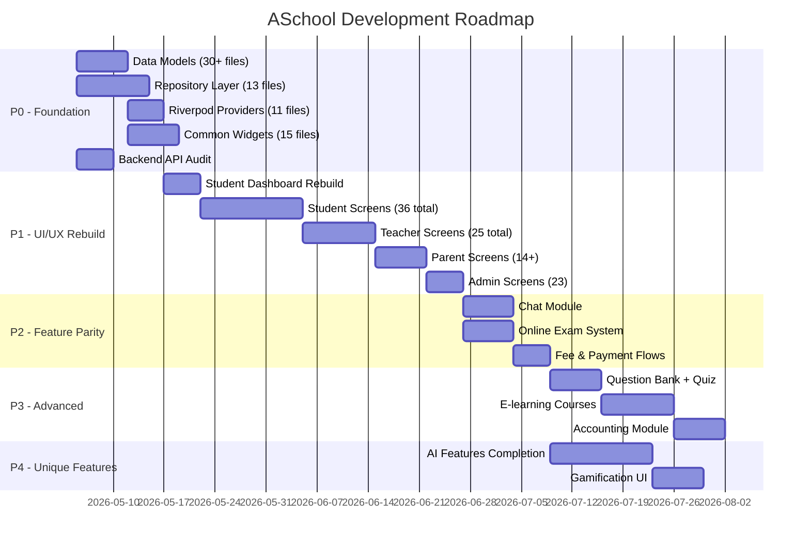

# ASchool Definitive Implementation Plan

> Merged from previous gap analysis + fresh codebase verification (May 4, 2026)
> 
> **Reference codebases:** eSchool SaaS v1.8.0 (Flutter BLoC + Laravel), Mighty School Pro v1.6 (Laravel + Flutter Web)
> **ASchool stack:** Flask Python + Flutter Riverpod + Next.js, 4 mobile apps, 50 plugins, Nepal-specific

---

## The Gap — Hard Numbers

| Metric | ASchool Flutter | eSchool (Both Apps) | Ratio |
|--------|:-:|:-:|:-:|
| **Total .dart files** | 124 | 843 | **1:7** |
| **Total lines of code** | 17,073 | 129,016 | **1:7.5** |
| **Data models** | 3 | 85+ | **1:28** |
| **State mgmt (cubits/providers)** | 0 dedicated | 77+ cubits | **0** |
| **Repositories** | 0 | 24 | **0** |
| **Reusable widgets** | 8 (2,258 LOC) | 71+ files | **1:9** |
| **UI screens (student)** | 21 files (4,037 LOC) | 111 files | **1:5** |

| Metric | ASchool Backend | ASchool Frontend (Next.js) | Status |
|--------|:-:|:-:|:-:|
| **Python files** | 248 | — | ✅ Strong |
| **Backend LOC** | 26,196 | — | ✅ Strong |
| **TSX files** | — | 214 | ✅ Strong |
| **Frontend LOC** | — | 31,636 | ✅ Strong |
| **Backend plugins** | 50 modules | — | ✅ Unique |
| **Dashboard sections** | — | 43 | ✅ Strong |

> [!CAUTION]
> **The backend and web frontend are production-ready. The Flutter mobile apps are 7× smaller than the competition and need a complete rebuild of the data/state layer plus screen rewrites.**

---

## ASchool Unique Advantages (Preserve & Strengthen)

| Feature | Status | Competitors Have? |
|---------|:------:|:-:|
| 50-plugin modular architecture | ✅ Backend | ❌ |
| 20+ AI services (Claude-powered) | 🟡 Scaffold | ❌ |
| Nepal-specific (BS calendar, Sparrow SMS, eSewa/Khalti) | ✅ | ❌ |
| Gamification (XP, streaks, achievements) | 🟡 Backend only | ❌ |
| Student wellbeing module | 🟡 Scaffold | ❌ |
| Student portfolio | 🟡 Scaffold | ❌ |
| ESP32 GPS hardware tracker | ✅ | ❌ |
| Design studio (certificates) | 🟡 | ❌ |
| IEMIS importer (Nepal govt) | 🟡 | ❌ |
| Website builder | ✅ | Partial in competitors |

## Audit Delta — Academics and Mobile (May 6, 2026)

### What the reference eSchool actually shows
- The real reference implementation is in the Flutter apps under `eSchool SaaS v1.8.0 Nulled/App code/e-school-saas-student-parent/e-school-saas` and `eSchool SaaS v1.8.0 Nulled/App code/eschool-saas-staff/eschool-saas-staff`; the docs folder is not the source of truth.
- eSchool staff marks entry is driven by `class section -> finished unpublished exam -> exam timetable subject`, then posts `marks_data[{student_id, obtained_marks}]` for that subject instance.
- eSchool student and parent results flow includes subject rows, marksheet detail, report-style summaries, gallery preview/download, and richer timetable filtering.
- eSchool distinguishes Theory vs Practical in the client model and labels, but it still does not prove a full internal or continuous-assessment architecture beyond exam-oriented marks entry.

### Verified ASchool strengths to preserve
- Backend exams plugin is already stronger than the mobile apps currently reflect: it supports split `theory_marks` and `practical_marks`, NEB grading, class results, grade sheets, individual marksheets, report cards, designer marksheets, online exams, and result publishing.
- Backend teacher visibility is already enforced at the API level by assigned subject or homeroom/class-teacher access. This is a good architecture and should remain the source of truth.
- Next.js admin/web already consumes the richer exam APIs for marks entry, results, grade sheets, marksheets, and report cards, so mobile should align to that contract instead of inventing a second one.

### Highest-impact mismatches found

| Area | Verified reality | Current gap in ASchool clients | Priority |
|------|------------------|--------------------------------|----------|
| Teacher marks entry | Backend expects split marks and supports practical-aware grading; eSchool staff flow uses exam timetable subject granularity | `flutter_teacher` fetches `/exams?status=ongoing` even though backend list filtering does not honor `status`; it only submits a single `marks` value, so practical entry is lost and teacher flow is thinner than both backend and reference | P0 |
| Student and parent results | Backend and web already expose class results, marksheets, grade sheets, and report cards | Shared/mobile results still rely on a reduced compatibility path, so subject-wise detail and marksheet/report-card parity lag behind existing backend capability | P0 |
| Subject modeling | Backend `Subject` supports `has_practical`; reference eSchool has explicit Theory/Practical labeling | `flutter_shared/lib/models/subject.dart` mixes academic `subject_type` with Theory/Practical display semantics, which is the wrong abstraction for marks UI | P0 |
| Teacher scope | Backend correctly limits marks visibility by taught subject or homeroom class | Teacher Flutter flow is still class-level and not exam-schedule aware, so it cannot match the safer reference workflow for which subject in which exam is being marked | P1 |
| Internal/continuous assessment | ASchool has practical split marks and report cards | There is still no dedicated internal or continuous-assessment data model/API; do not assume this is already implemented just because practical marks exist | P1 |
| Student UX parity | eSchool has richer profile, gallery, timetable, result, and homework detail flows | Current student and parent apps still underuse existing backend data and lag behind both eSchool and our own web/admin implementations | P1 |

### Concrete implementation order update
1. Treat `backend/app/api/v1/exams.py` and the existing web/admin exam flows as the canonical contract for marks, results, marksheets, and report cards.
2. Rebuild teacher mobile marks entry around exam selection, class scope, subject scope, and split theory/practical inputs instead of the current single-score form.
3. Correct shared Dart models first, especially subject and exam/result payloads, before further UI rewrites.
4. Move student and parent result screens to the richer `/exams/*` endpoints and add marksheet/report-card parity already present in web/admin.
5. Upgrade timetable, gallery, homework detail, and student profile flows after the academic contract is stabilized.
6. Add internal or continuous-assessment architecture only as a separate phase after exam/practical parity is complete.

### Files this audit should drive first
- `backend/app/api/v1/exams.py`
- `backend/app/models/exam.py`
- `backend/app/models/academic.py`
- `frontend/app/dashboard/exams/marks/page.tsx`
- `frontend/app/dashboard/exams/results/page.tsx`
- `flutter_teacher/lib/features/marks/marks_entry_screen.dart`
- `flutter_shared/lib/models/subject.dart`
- `flutter_shared/lib/repositories/exam_repository.dart`

---

## Critical Issues

### 1. No Data Layer
- **3 models** (user, school, plugin_manifest) vs eSchool's **85**
- Screens use raw `Map<String, dynamic>` from untyped `ApiClient.instance.get()` calls
- No repository abstraction — widgets call API directly in `initState()`

### 2. No State Management
- `AuthNotifier` (StateNotifier) is the **only** provider in the entire codebase
- All feature screens use `setState()` — no Riverpod providers for any feature
- eSchool has 77 dedicated cubits with proper loading/error/success states

### 3. Scaffold Screens
- `student_exams_screen.dart`: **25 lines** | `student_notices.dart`: **52 lines** | `student_transport_screen.dart`: **66 lines**
- Student dashboard at 461 LOC is the richest screen but still uses `Map<String, dynamic>`
- eSchool's home screen alone is **809 lines** with dozens of sub-widgets

### 4. Missing Core Academic Features
- Codex progress, 2026-05-04: backend/API support now exists for academic years, semesters, streams, shifts, mediums, roll numbers, lesson → topic → study material, and online exam submission contracts.
- Flutter still needs the full management UI for several of those areas, especially online exam timer/MCQ UX and broader admin academic setup screens.
- No chat UI despite having `socket_service.dart`

---

## Open Questions (Need Your Decision)

> [!IMPORTANT]
> **Q1: State Management** — Stick with **Riverpod** (already in pubspec, more modern) or migrate to **BLoC/Cubit** (eSchool pattern, more code-gen tools)?
> **Recommendation:** Riverpod `AsyncNotifierProvider` — already a dependency, less boilerplate.

> [!IMPORTANT]
> **Q2: UI Design** — Clone eSchool's exact design or create "inspired by" with ASchool's own identity?
> **Recommendation:** Adopt eSchool UX patterns (bottom nav, shimmer, toggles) with ASchool's blue/purple color palette.

> [!IMPORTANT]
> **Q3: SaaS Billing** — eSchool-style package subscriptions or keep ASchool's per-plugin marketplace?
> **Recommendation:** Keep plugin marketplace (unique advantage) + add package tiers that bundle common plugins.

> [!WARNING]
> **Q4: Phase order** — P0 first (foundation, then UI) or P1 first (visual results faster with mock data)?
> **Recommendation:** P0 first — without models/repos, UI screens get rewritten anyway.

> [!IMPORTANT]
> **Q5: Backend audit needed?** — APIs look solid (academics.py has full CRUD, no TODO markers found), but should we do a systematic audit before building Flutter UI?
> **Recommendation:** Audit in parallel with P0. Build models/repos, test against APIs, fix gaps as discovered.

---

## Phase 0 — Foundation Layer [2-3 weeks]

### [NEW] `flutter_shared/lib/models/` — 30+ Data Models

Create typed Dart models matching all 47 backend models. Priority order:

**P0 (Immediate):** `academic_year.dart`, `class_model.dart`, `section.dart`, `subject.dart`, `student.dart`, `student_details.dart`, `attendance.dart`, `attendance_day.dart`, `assignment.dart`, `exam.dart`, `exam_result.dart`, `fee.dart`, `fee_transaction.dart`, `timetable_slot.dart`, `lesson.dart`, `topic.dart`, `study_material.dart`, `notice.dart`, `announcement.dart`, `slider_banner.dart`

**P1:** `diary.dart`, `diary_category.dart`, `gallery.dart`, `holiday.dart`, `guardian.dart`, `teacher.dart`

**P2:** `chat_message.dart`, `chat_contact.dart`, `transport_route.dart`, `payroll_slip.dart`, `leave_request.dart`, `online_exam.dart`, `question.dart`

**P4:** `gamification_stats.dart`, `wellbeing_entry.dart`, `portfolio_item.dart`, `achievement.dart`

### [NEW] `flutter_shared/lib/repositories/` — 13 Repositories

Each repository wraps API calls and returns typed models:

| Repository | Wraps APIs | Key Methods |
|-----------|-----------|-------------|
| `academic_repository.dart` | `/academics/*` | `getYears()`, `getClasses()`, `getSections()`, `getSubjects()` |
| `student_repository.dart` | `/student/*` | `getDashboard()`, `getProfile()`, `getClassmates()` |
| `attendance_repository.dart` | `/attendance/*` | `getAttendance()`, `submitAttendance()`, `getCalendar()` |
| `assignment_repository.dart` | `/assignments/*` | `getAssignments()`, `submit()`, `grade()` |
| `exam_repository.dart` | `/exams/*` | `getExams()`, `getResults()`, `submitOnlineExam()` |
| `fee_repository.dart` | `/fees/*` | `getFees()`, `pay()`, `getTransactions()` |
| `timetable_repository.dart` | `/timetable/*` | `getTimetable()`, `getTodaySchedule()` |
| `lesson_repository.dart` | `/lms/*` | `getLessons()`, `getTopics()`, `getMaterials()` |
| `notice_repository.dart` | `/notices/*` | `getNotices()`, `getAnnouncements()` |
| `chat_repository.dart` | `/communications/*` | `getContacts()`, `getMessages()`, `send()` |
| `transport_repository.dart` | `/transport/*` | `getRoutes()`, `getLiveLocation()` |
| `hr_repository.dart` | `/hr-payroll/*` | `getPayslips()`, `applyLeave()` |
| `gallery_repository.dart` | `/files/*` | `getGalleries()`, `getFiles()` |

### [NEW] `flutter_shared/lib/providers/` — Riverpod Providers

One `AsyncNotifierProvider` per feature domain (11 provider files):
`dashboard_provider.dart`, `academic_provider.dart`, `attendance_provider.dart`, `assignments_provider.dart`, `exams_provider.dart`, `results_provider.dart`, `fees_provider.dart`, `timetable_provider.dart`, `lessons_provider.dart`, `notices_provider.dart`, `chat_provider.dart`

### [NEW] `flutter_shared/lib/widgets/` — 15 Common Widgets

| Widget | Purpose | Reference |
|--------|---------|-----------|
| `error_container.dart` | Error state + retry button | eSchool `errorContainer.dart` |
| `no_data_container.dart` | Empty state illustration | eSchool `noDataContainer.dart` |
| `shimmer_loading_list.dart` | Shimmer for lists | eSchool `shimmerLoadingContainer.dart` |
| `shimmer_loading_grid.dart` | Shimmer for grids | eSchool pattern |
| `banner_carousel.dart` | Home screen banners | eSchool `slidersContainer.dart` |
| `stat_card.dart` | Reusable stat card | Extract from dashboard |
| `section_header.dart` | Section title + "See All" | Extract from dashboard |
| `custom_app_bar.dart` | Consistent app bar | eSchool `customAppbar.dart` |
| `filter_chip_row.dart` | Horizontal filter chips | eSchool exam filters |
| `animated_toggle.dart` | Present/Absent toggle | eSchool attendance |
| `calendar_widget.dart` | Attendance calendar | eSchool calendar |
| `paginated_list.dart` | Infinite scroll | eSchool pattern |
| `search_bar_widget.dart` | Animated search | eSchool pattern |
| `custom_bottom_sheet.dart` | Styled bottom sheets | eSchool `customBottomsheet.dart` |
| `pull_to_refresh.dart` | Standardized refresh | eSchool `customRefreshIndicator.dart` |

### [MODIFY] [aschool_shared.dart](file:///home/bishal-regmi/Desktop/ASchool/flutter_shared/lib/aschool_shared.dart)
- Export all new models, repositories, providers, and widgets

### Backend (Parallel)
- [ ] Audit all 54 API route files — verify which return real data vs scaffold
- [x] Add session year management if missing
- [x] Add semester/stream/shift/medium support if missing
- [x] Add lesson → topic → study material CRUD if missing
- [x] Add online exam engine route contracts if missing

---

## Phase 1 — UI/UX Rebuild [3-4 weeks]

Every screen gets rebuilt with: **Riverpod providers** → **typed models** → **shimmer loading** → **error handling + retry** → **pull-to-refresh** → **pagination** → **consistent theming**

### Student App (21 screens → rewrite all + add 15 new)

#### [REWRITE] [student_dashboard.dart](file:///home/bishal-regmi/Desktop/ASchool/flutter_student/lib/features/dashboard/student_dashboard.dart) (461→800+ LOC)
- Replace `Map<String, dynamic>` with `ref.watch(studentDashboardProvider)`
- Add `BannerCarousel` at top
- Add subject grid with colors/icons
- Add today's timetable preview, attendance card, latest notices
- Extract sub-widgets: `_BannerSection`, `_SubjectGrid`, `_TodaySchedule`, `_StatsRow`, `_NoticesPreview`

#### [REWRITE] [shell_screen.dart](file:///home/bishal-regmi/Desktop/ASchool/flutter_student/lib/screens/shell_screen.dart)
- Animated bottom nav (3-tab: Home, Assignments, More)
- More menu → bottom sheet with feature grid (matching eSchool `moreMenuBottomsheetContainer.dart`)

#### [REWRITE] All 16 existing feature screens (each currently 25-433 LOC → 300-600+ LOC)

#### [NEW] 15 student screens to add:
`onboarding_screen.dart`, `select_subjects_screen.dart`, `lesson_details_screen.dart`, `topic_details_screen.dart`, `online_exam_screen.dart`, `exam_report_screen.dart`, `chat_screen.dart`, `chat_list_screen.dart`, `fee_details_screen.dart`, `fee_payment_screen.dart`, `transaction_history_screen.dart`, `gallery_detail_screen.dart`, `play_video_screen.dart`, `notification_settings_screen.dart`, `announcement_detail_screen.dart`

### Teacher App (16 screens → rewrite all + add 9 new)

#### [REWRITE] All 16 existing teacher features with providers

#### [NEW] 9 teacher screens:
`take_attendance_screen.dart` (animated toggles), `view_attendance_screen.dart` (calendar), `manage_lessons_screen.dart`, `manage_topics_screen.dart`, `assignment_submissions_screen.dart`, `chat_screen.dart`, `salary_slip_screen.dart`, `student_profile_screen.dart`, `transport_management_screen.dart`

### Parent App (14 screens → rewrite all + add child selector)

#### [REWRITE] All 14 features with providers
- Add child selector at top (multi-child support like eSchool)
- All student features in read-only mode
- Fee payment, chat with teachers, transport tracking

### Admin App (23 screens → rewrite all)

#### [REWRITE] All 23 features — already has good screen count, needs proper state management

### Router Updates for All 4 Apps
- Add routes for new screens with typed arguments
- Add deep linking paths for notification navigation

---

## Phase 2 — Feature Parity with eSchool [2-3 weeks]

| Feature | Backend | Flutter | eSchool Reference |
|---------|:-------:|:-------:|-------------------|
| **Chat module (full)** | Socket exists | Full chat UI: messages, contacts, file sharing | `chatScreen.dart`, `chatContactsScreen.dart` |
| **Online exam system** | Exam model exists | Timer, MCQ, answer tracking, auto-submit | `examOnlineScreen.dart`, `questionContainer.dart` |
| **Banner/slider mgmt** | Needs API | `BannerCarousel` widget + admin CRUD | `slidersContainer.dart` |
| **Student diary** | Needs model | Diary with categories, CRUD | `studentDiaryScreen.dart`, `diaryEntryCard.dart` |
| **Report system** | Reports API exists | Subject-wise charts | `reportSubjectsContainer.dart` |
| **Gallery (session year)** | Files API exists | Gallery with year filter | `schoolGalleryScreen.dart` |
| **Fee receipts** | Fee model exists | Transaction history + PDF download | `transactionsScreen.dart` |
| **Attendance calendar** | API exists | Calendar attendance widget | `attendanceContainer.dart` |
| **Settings screen** | Config API | Language, theme, notifications | `settingsScreen.dart` |
| **Force update dialog** | Version check | Update prompt | `forceUpdateDialogContainer.dart` |
| **Guardian details** | Student model | Guardian profile | `guardianDetailsContainer.dart` |

---

## Phase 3 — Advanced Features from Mighty School [4-5 weeks]

| Feature | Priority | Mighty School Reference | Notes |
|---------|:--------:|------------------------|-------|
| **Question Bank** | High | `Modules/QuestionBank/` | Reusable question pool for exams |
| **E-learning Courses** | High | `Modules/Elearning/` | Course → Chapter → Lesson hierarchy |
| **Accounting Module** | High | `Modules/Accounting/` | Income/expense tracking |
| **Hostel Management** | Medium | `Modules/Hostel/` | Room allocation, mess, fees |
| **Quiz System** | High | — | Interactive quizzes |
| **Zoom Live Classes** | Medium | — | Virtual classroom |
| **Multi-branch** | High | Plugin exists | Needs full implementation |
| **HRM Module** | Medium | `Modules/Payroll/` | Advanced HR |

---

## Phase 4 — Complete Unique ASchool Features [3-4 weeks]

| Feature | Current | Target |
|---------|:-------:|:------:|
| AI Tutor | 369 LOC scaffold | Full chat interface, subject-specific help |
| AI Auto-grading | Backend only | Teacher UI for AI-assisted grading |
| AI Lesson Plans | Backend only | Teacher UI with template selection |
| AI Plagiarism | Backend only | Assignment submission integration |
| Gamification | Backend only | Dashboard XP bar, streaks, leaderboard |
| Wellbeing | 302 LOC scaffold | Mood tracking, counselor alerts, charts |
| Portfolio | 322 LOC scaffold | Project showcase, skill badges |
| Emergency Alerts | Backend only | Push notification + app screen |
| Social Hub | Backend only | Admin social media management UI |

---

## Phase 5 — Code Quality [Ongoing]

- [ ] Localization (Nepali + English) with ARB files
- [ ] Offline-first support with Hive/Isar caching
- [ ] Typed exceptions and error handling
- [ ] Unit tests for all providers/repositories
- [ ] Widget tests for critical screens
- [ ] Deep linking for notifications
- [ ] Dark mode theme support
- [ ] Backend: comprehensive API tests, rate limiting, audit logging, data export

---

## Three-Way Feature Matrix

### ✅ = Full | 🟡 = Partial | ❌ = Missing

| Feature | eSchool | Mighty | ASchool |
|---------|:---:|:---:|:---:|
| Multi-school SaaS login | ✅ | ✅ | ✅ |
| OTP login | ❌ | ❌ | ✅ |
| Student profile (rich) | ✅ | ✅ | 🟡 |
| Onboarding wizard | ✅ | ❌ | ❌ |
| Elective subjects | ✅ | ❌ | ❌ |
| Student diary | ✅ | ❌ | 🟡 |
| Roll numbers | ✅ | ✅ | 🟡 |
| Session year mgmt | ✅ | ✅ | 🟡 |
| Semester system | ✅ | ✅ | 🟡 |
| Medium/Stream/Shift | ✅ | ✅ | 🟡 |
| Lesson→Topic→Material | ✅ | ✅ | 🟡 |
| Online exam (MCQ+timer) | ✅ | ✅ | 🟡 |
| Question bank | ❌ | ✅ | ❌ |
| Attendance calendar | ✅ | ✅ | ❌ |
| In-app chat | ✅ | ❌ | 🟡 |
| Fee receipts | ✅ | ✅ | ❌ |
| Transport enrollment | ✅ | ✅ | ❌ |
| Package subscriptions | ✅ | ✅ | ❌ |
| Sliders/banners | ✅ | ❌ | ❌ |
| E-learning courses | ❌ | ✅ | 🟡 |
| Hostel management | ❌ | ✅ | ❌ |
| Accounting module | ❌ | ✅ | ❌ |
| **AI services (20+)** | ❌ | ❌ | **✅** |
| **Plugin marketplace (50)** | ❌ | ❌ | **✅** |
| **Nepal-specific** | ❌ | ❌ | **✅** |
| **Gamification** | ❌ | ❌ | **🟡** |
| **Wellbeing module** | ❌ | ❌ | **🟡** |
| **ESP32 GPS tracker** | ❌ | ❌ | **✅** |

---

## Gantt Roadmap

---

## Verification Plan

### Automated
- `cd backend && python -m pytest tests/ -v`
- `cd flutter_shared && flutter test`
- Integration tests for repositories
- Widget tests for rebuilt screens

### Manual
- Side-by-side with eSchool screenshots
- Test all CRUD flows per feature
- Verify multi-tenant data isolation
- Test eSewa/Khalti payment sandbox
- Test push notifications & chat
- Test offline/online sync
