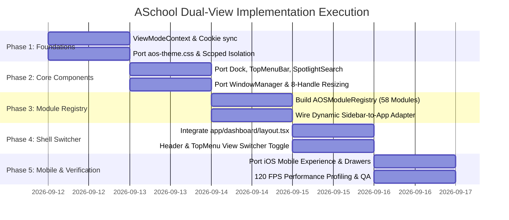

# ASchool Dual-View Architecture Master Plan: General Portal vs. AOS Desktop Operating System

**Document Version:** 3.0.0 (Definitive Master Implementation Plan)  
**Target Project:** `/home/bishal-regmi/Desktop/ASchool`  
**Source Framework:** `/home/bishal-regmi/Desktop/Win7Css` (`aos-app` + `11.css`)  
**Date:** September 12, 2026  
**Status:** Approved for Implementation  

---

## 1. Executive Summary & Strategic Architecture

### 1.1 The User's Core Requirement
ASchool requires a dual-presentation dashboard:
1. **General View (Standard Web Portal):** Traditional SaaS layout with collapsible left sidebar drawers, top header, and responsive single-column main content.
2. **AOS View (Desktop Operating System):** The high-performance macOS/Windows 11 hybrid desktop environment developed in `Win7Css`—featuring a frosted-glass macOS top menu bar, Spotlight Search (`Cmd+Space`), 120 FPS draggable/resizable multi-window manager, parabolic magnification bottom dock, start menu / app drawer, and an educational App Store.
3. **Adaptive Mobile Delivery:** Governed by the user's selected mode:
   - If user selected **General View**: Renders standard responsive mobile SaaS web layout.
   - If user selected **OS View**: Renders the **iOS Mobile Experience** (Dynamic Island, 4-column Springboard, swipe-down iOS Control Center with vertical sliders, Notification Drawer, and bottom-sheet app windows).
4. **Zero Code Duplication:** All **58 modules and 215 pages** in `app/dashboard/*` (`students`, `fees`, `attendance`, `timetable`, `lms`, `exams`, `transport`, `designer`, `settings`, etc.) must be shared without duplicating code into `/os/` and `/general/`.

---

## 2. Exhaustive ASchool Frontend & Component Survey Findings

### 2.1 The 58 Dashboard Modules Surveyed
An exhaustive scan of `ASchool/frontend/app/dashboard` identified 58 distinct module suites:
- **Core Academics (SIS):** `students` (1,076 lines with BS dates, NEB grading, camera uploads), `teachers`, `academics`, `timetable`, `attendance`, `admission`, `alumni`.
- **Examinations & Learning:** `exams`, `assignments`, `lms`, `library`, `elibrary`, `portfolio`, `teaching-content`.
- **Finance & Bursar:** `fees` (8 sub-routes, eSewa/Khalti invoicing, aging, defaulters), `hr` (payroll & expenses).
- **Campus Operations:** `transport` (ESP32 live GPS bus map), `biometric`, `inventory`, `hostel`, `visitors`, `dismissal`.
- **AI & Automation:** `ai-teacher`, `ai-tools` (26 specialized academic prompts), `ai-workbench`.
- **Creative & Web:** `designer` (Fabric.js Canva-like studio & TipTap word processor), `website-builder`, `white-label`, `certificates`.
- **Communication:** `communications` (WhatsApp bot & templates), `notices`, `notifications`, `sms`.
- **Safety & Compliance:** `emergency`, `disaster`, `incident-management`, `incidents`, `compliance`, `wellbeing`, `health-records`.
- **Administration:** `marketplace`, `plugins`, `users`, `multi-branch`, `settings`, `iemis-import`, `bulk-uploads`, `reports`, `analytics`, `benchmarking`, `gamification`, `conferences`, `content-review`, `faqs`, `files`, `profile`, `staff`.

### 2.2 Page Layout & Component Characteristics
- **Client Components:** Almost 100% of pages are `"use client"` exporting `default function Page()`. They leverage `@tanstack/react-query`, `useState`, and client-side hooks.
- **Dense Typography Model (`.compact-content`):** `app/globals.css` already defines IEMIS-dense typography (`h1: 15px`, `h2: 13px`, `table: 12px`, `inputs: 32px`). This dense model fits inside 800×600px desktop OS window frames.
- **Component Libraries:** Built on Radix UI primitives (`@radix-ui/react-*`), Lucide Icons (`lucide-react`), Tailwind CSS v3.4, Sonner toasts, Fabric.js v6, TipTap v3, and React-Leaflet.

---

## 3. CSS Isolation & Zero-Collision Architecture

### 3.1 Token Namespace Immunity
- **ASchool CSS Variables:** Stored in HSL format (`--background: 45 20% 97.5%`, `--primary: 163 62% 14%`, `--sidebar-bg`, etc.).
- **Win11 / AOS CSS Variables:** Stored with a strict `--w11-*` prefix (`--w11-accent: #0078D4`, `--w11-window-bg: #202020`, `--w11-mica-bg`, `--w11-acrylic-bg`, `--w11-elevation-*`).
- **Result:** **0% variable name collision.**

### 3.2 Scoped Stylesheet Strategy (`aos-theme.css`)
To prevent global element selectors in `11.css` (`body, html`, `a`, `p`, `code`) from altering standard ASchool dashboard pages:
1. We bundle `11.scoped.css` (built with `postcss-prefix-selector` using prefix `.win11`) or wrap AOS styles inside `.aos-desktop`:
   ```css
   .win11, .aos-desktop {
     /* All Fluent & macOS desktop styles scoped exclusively here */
   }
   ```
2. Hardware-accelerated classes (`.aos-gpu-accel`, `.aos-haptic-click`, `.win11-window`, `.mac-dock`, `.mac-menubar`) operate with self-contained class selectors that do not conflict with Tailwind utilities.
3. Both systems respect `.dark` on a root element, enabling unified dark/light theme switching.

---

## 4. Windowed OS Hosting Engine: Solving Container Assumptions

Research identified layout assumptions in ASchool pages that require normalization inside floating window frames:

| Issue in Module Pages | Cause | Solution in AOS Window Frame |
|:---|:---|:---|
| **Fixed Overlays** | `fixed inset-0 z-50` (e.g. `designer/editor`) covers entire screen. | Apply `position: relative; contain: paint; transform: translateZ(0)` to the window body. This traps `position: fixed` elements inside the window frame! |
| **Viewport Heights** | `h-screen` / `min-h-screen` (e.g. CanvasEditor, writer2, website-builder). | Add scoped CSS override: `.aos-window-content .h-screen { height: 100% !important; }` and `.aos-window-content .min-h-screen { min-height: 100% !important; }`. |
| **Radix Portals** | `Dialog`, `Sheet`, `Dropdown` mounting to `document.body`. | Provide `container={windowBodyRef.current}` to Radix portals, keeping modal dialogs and slide-out sheets anchored inside the active window. |
| **Sticky Headers** | `sticky top-0` in tables sticking to browser window. | The window body establishes an isolated scroll container (`overflow: auto; position: relative`), ensuring sticky table headers stick to the window frame. |

---

## 5. Dynamic Module-to-App Mapping Engine

In ASchool, navigation is manifest-driven via `lib/plugins.tsx` (`useInstalledPlugins()`) and `sidebar.tsx`. The backend API (`/api/v1/plugins/sidebar`) returns items organized into 11 sections.

### App Suite Categorization

```
┌─────────────────────────────────────────────────────────────────────────┐
│                    AOS DESKTOP SUITES & APP REGISTRY                    │
├─────────────────────────────────────────────────────────────────────────┤
│ 🎓 Academics Suite    : Students (SIS), Teachers, Timetable, Attendance │
│ 📚 Learning & LMS     : Classroom, Assignments, Exams, Digital Library  │
│ 💳 Finance & Bursar   : Fees & Payments, Payroll, Student Admissions    │
│ 🚌 Operations & Fleet : Live GPS Bus Radar, Biometric Scanner, Inventory│
│ 🎨 Creative Studio    : ID Card / Certificate Designer, Website CMS     │
│ 💬 Comms & Safety     : WhatsApp Bot, Sparrow SMS, Emergency Alerts     │
│ ⚙️ System & Store     : AOS App Store (Plugins), System Settings        │
└─────────────────────────────────────────────────────────────────────────┘
```

### High-Resolution Glass App Icon Adapter (`lib/aos-app-adapter.tsx`)
```tsx
import { ICON_MAP } from "@/components/layout/sidebar";
import * as AOSIcons from "@/components/aos/AOSIcons";
import { type PluginSidebarItem } from "@/lib/plugins";

const SECTION_GRADIENTS: Record<string, string> = {
  Academics: "linear-gradient(135deg, #059669 0%, #10b981 100%)",
  Learning: "linear-gradient(135deg, #6366f1 0%, #8b5cf6 100%)",
  Money: "linear-gradient(135deg, #d97706 0%, #f59e0b 100%)",
  Operations: "linear-gradient(135deg, #0284c7 0%, #38bdf8 100%)",
  Communication: "linear-gradient(135deg, #ea580c 0%, #f97316 100%)",
  "Design & Web": "linear-gradient(135deg, #db2777 0%, #f472b6 100%)",
  Insights: "linear-gradient(135deg, #0891b2 0%, #06b6d4 100%)",
  "Student Life": "linear-gradient(135deg, #7c3aed 0%, #a855f7 100%)",
  "Safety & Compliance": "linear-gradient(135deg, #dc2626 0%, #ef4444 100%)",
  Admin: "linear-gradient(135deg, #475569 0%, #64748b 100%)",
};

export function getAOSAppForModule(item: PluginSidebarItem) {
  const DedicatedIcon = (AOSIcons as Record<string, React.ComponentType<{ size?: number }>>)[
    `AOS${item.slug.charAt(0).toUpperCase() + item.slug.slice(1)}Icon`
  ];
  const LucideComp = ICON_MAP[item.icon] || ICON_MAP.Package;

  return {
    id: item.slug,
    name: item.label,
    route: item.route,
    category: item.section || "Core",
    icon: DedicatedIcon ? (
      <DedicatedIcon size={52} />
    ) : (
      <div
        className="w-[52px] h-[52px] rounded-[14px] flex items-center justify-center text-white shadow-lg aos-haptic-click"
        style={{ background: SECTION_GRADIENTS[item.section || ""] || "linear-gradient(135deg, #0078D4, #005A9E)" }}
      >
        <LucideComp className="w-7 h-7" />
      </div>
    ),
  };
}
```

---

## 6. Multi-Window Workspace & Dynamic Component Registry

To enable true multi-tasking (e.g. **Students** and **Fees** open side-by-side):

### 6.1 Dynamic Component Registry (`components/aos/AOSModuleRegistry.tsx`)
```tsx
import dynamic from "next/dynamic";
import { PageLoader } from "@/components/ui/spinner";

export const AOS_MODULE_COMPONENTS: Record<string, React.ComponentType> = {
  students: dynamic(() => import("@/app/dashboard/students/page"), { loading: () => <PageLoader /> }),
  fees: dynamic(() => import("@/app/dashboard/fees/page"), { loading: () => <PageLoader /> }),
  attendance: dynamic(() => import("@/app/dashboard/attendance/page"), { loading: () => <PageLoader /> }),
  timetable: dynamic(() => import("@/app/dashboard/timetable/page"), { loading: () => <PageLoader /> }),
  exams: dynamic(() => import("@/app/dashboard/exams/page"), { loading: () => <PageLoader /> }),
  lms: dynamic(() => import("@/app/dashboard/lms/page"), { loading: () => <PageLoader /> }),
  library: dynamic(() => import("@/app/dashboard/library/page"), { loading: () => <PageLoader /> }),
  transport: dynamic(() => import("@/app/dashboard/transport/page"), { loading: () => <PageLoader /> }),
  designer: dynamic(() => import("@/app/dashboard/designer/page"), { loading: () => <PageLoader /> }),
  settings: dynamic(() => import("@/app/dashboard/settings/page"), { loading: () => <PageLoader /> }),
  marketplace: dynamic(() => import("@/app/dashboard/marketplace/page"), { loading: () => <PageLoader /> }),
  // Extensible for all 58 modules
};
```

### 6.2 Window State Management (`AOSWindowManager.tsx`)
Each open window manages:
- `id`: Module slug (e.g. `students`, `fees`).
- `title`: Display title.
- `x, y, width, height`: Clamped to screen bounds (min 420×320px).
- `zIndex`: Elevated to top on click (`maxZIndex + 1`).
- `isMinimized`: Minimized windows disappear from canvas and display active indicator dots on the dock.
- `isMaximized`: Snaps to full screen excluding top menu bar and bottom dock.
- **8 Resize Handles:** Top, Bottom, Left, Right, NW, NE, SW, SE with 120 FPS `requestAnimationFrame` throttling.

---

## 7. App Store & Backend Integration

The visual **AOS App Store** (`AppStoreApp.tsx`) connects directly to ASchool's Flask plugin backend:
1. `GET /api/v1/plugins/marketplace`: Populates available extensions (STEM simulators, AI tools, biometric scanners, canteen POS).
2. `POST /api/v1/plugins/install`: Installs new extensions for the school.
3. `POST /api/v1/plugins/<slug>/trial`: Activates a 14-day institutional trial.
4. `POST /api/v1/plugins/<slug>/subscribe`: Connects to eSewa/Khalti payment gateways for premium licenses.
5. Role-Based Permissions (RBAC): Admin configures which roles (Student, Teacher, Admin, Accountant) have access to each installed plugin.

---

## 8. Adaptive Mobile OS Architecture

When the screen width is `< 768px`:
- **If General View selected:** Displays responsive mobile web portal (`compact-content`, burger menu, slide-out navigation sheet).
- **If OS View selected:** Displays **iOS Mobile Experience**:
  - **Dynamic Island Status Bar:** Real-time clock, battery, and live school event pill.
  - **Springboard Grid:** 4-column app grid with high-resolution rounded glass icons and haptic touch.
  - **iOS Control Center Drawer:** Swipe/tap top-right for Wi-Fi, Bluetooth, vertical 120 FPS brightness & volume sliders, exam focus mode, and flashlight.
  - **iOS Notification Center Drawer:** Stacked glass notification cards with one-tap actions.
  - **Slide-Up App Sheets:** Active applications open in fluid bottom sheets with drag-to-dismiss bars.

---

## 9. File Migration & Porting Plan

Copying files from `/home/bishal-regmi/Desktop/Win7Css` to `/home/bishal-regmi/Desktop/ASchool/frontend`:

```
Win7Css/11.css/dist/11.scoped.css         ──► ASchool/frontend/src/styles/aos-theme.css
Win7Css/aos-app/src/components/AOSIcons.tsx──► ASchool/frontend/components/aos/AOSIcons.tsx
Win7Css/aos-app/src/components/Dock.tsx    ──► ASchool/frontend/components/aos/Dock.tsx
Win7Css/aos-app/src/components/TopMenuBar.tsx─► ASchool/frontend/components/aos/TopMenuBar.tsx
Win7Css/aos-app/src/components/SpotlightSearch.tsx ──► ASchool/frontend/components/aos/SpotlightSearch.tsx
Win7Css/aos-app/src/components/AppDrawer.tsx   ──► ASchool/frontend/components/aos/AppDrawer.tsx
Win7Css/aos-app/src/components/WindowManager.tsx ──► ASchool/frontend/components/aos/WindowManager.tsx
Win7Css/aos-app/src/components/MobileExperience.tsx ──► ASchool/frontend/components/aos/MobileExperience.tsx
Win7Css/aos-app/src/components/IOSControlCenter.tsx ──► ASchool/frontend/components/aos/IOSControlCenter.tsx
Win7Css/aos-app/src/components/IOSNotificationCenter.tsx ──► ASchool/frontend/components/aos/IOSNotificationCenter.tsx
Win7Css/aos-app/src/components/apps/AppStoreApp.tsx ──► ASchool/frontend/components/aos/apps/AppStoreApp.tsx
Win7Css/aos-app/src/components/apps/PluginRunnerApp.tsx ──► ASchool/frontend/components/aos/apps/PluginRunnerApp.tsx
Win7Css/aos-app/src/components/RoleSwitcherModal.tsx ──► ASchool/frontend/components/aos/RoleSwitcherModal.tsx
```

---

## 10. Execution Roadmap



---

## 11. Verification & Acceptance Criteria

1. **Zero Route Duplication:** Only `/dashboard/*` exists; no `/os/` folder.
2. **Zero Changes to Module Code:** `students/page.tsx`, `fees/page.tsx`, and all other 58 module files remain 100% untouched.
3. **Instant View Switching:** Seamless toggle between General View and OS View in `< 100ms` without losing session or state.
4. **Multi-Window Operation:** Opening `Students` and `Fees` simultaneously in OS View allows side-by-side data cross-referencing.
5. **120 FPS Framerate:** Window dragging and 8-handle resizing maintain 120 FPS on high-refresh displays.
6. **Mobile Adaptability:** Mobile viewports automatically render either responsive SaaS portal or iOS Springboard according to user view selection.
